# 第十章：识别和因果层次结构

### 本章涵盖

+   识别的激励示例

+   使用 y0 进行识别和推导估计值

+   如何在 y0 中推导出反事实图

+   推导基于图的反事实识别的 SWIGs

提高机器学习实践通常依赖于一种盲目的信心，即更多的数据和正确的架构可以解决任何任务。对于具有因果因素的任务，*因果识别*可以使这不再是信仰的问题，而是科学的问题。它可以告诉我们更多数据不会有所帮助，以及算法要正常工作需要哪些类型的归纳偏差。

因果识别是从纯粹观察数据或从观察或实验数据中做出反事实推断的任务。在统计学和数据科学中，它是允许我们从相关性中提炼因果关系并估计存在混杂因素时的因果效应的理论。但因果识别在人工智能领域也有应用。例如，假设一个深度学习算法在特定的因果推理基准上取得了高性能。因果识别背后的思想告诉我们，某些因果归纳偏差必须嵌入到模型架构、训练数据、训练过程、超参数（例如，提示）和/或基准数据中。通过追踪这些因果信息，我们可以确保算法在新场景中能够持续达到该基准性能。

识别是因果推理中理论性很强的部分。幸运的是，我们可以依赖库来为我们做理论上的繁重工作，并专注于使用这些库进行技能培养。在本章中，我们将重点关注一个名为 y0（发音为“why-not”）的库，该库使用图实现识别算法。到本章结束时，我们将揭开因果识别的神秘面纱，你将知道如何应用 y0 的识别算法。

## 10.1 因果层次结构

*因果层次结构*，也称为*Pearl 的层次结构*或*因果阶梯*，是我们询问的因果问题类型、构建的模型、获取的数据以及做出的因果推断的三层层次结构。

因果层次结构由三个层次组成：

1.  关联

1.  介入

1.  反事实

当我们进行统计或因果分析时，我们正在这些三个层次中的一个进行推理。当我们知道我们在哪个层次进行推理时，我们可以确定我们需要依赖哪些假设和数据来进行正确的推理。

### 10.1.1 问题和查询在层次结构中的位置

我们对因果模型提出的问题，以及从这些问题中形式化的因果查询，位于层次结构的不同层次。首先，第 1 层（关联层）关注“是什么...？”的问题。让我们以在线游戏示例来说明，如图 10.1 所示。


##### 图 10.1 在线游戏示例的 DAG

一个第 1 级问题及其相关查询的例子是

> “对于高度参与支线任务的玩家，他们的游戏内购买金额是多少？” *P* ( *I*| *E*=“high”)

在这个级别上的推理旨在描述、建模或检测变量之间的依赖关系。在这个级别上，我们不是在推理变量之间的任何因果关系。

第 2 级（干预级）的问题涉及非反事实的假设条件，例如

> “如果支线任务参与度高，玩家的游戏内购买会是什么？” *P* ( *I*  [*E*] [=“high”])

在第 2 级，我们使用理想干预来形式化这些问题。请注意，从第 2 级查询派生出的任何查询也是第 2 级查询，例如 ATEs（例如，*E*(*I*[*E*][=“high”] – *I*[*E*][=“low”]))和 CATEs。

最后，反事实问题和查询位于第 3 级（反事实级）：

> “假设这个玩家有低支线任务参与度和低购买，如果他们更投入，他们的购买水平会是什么？” *P*( *I* [*E*] [=“high”]| *E*=“low”, *I*=“low”）

与第 2 级查询一样，我们从第 3 级查询派生出的任何查询也位于第 3 级。例如，一个旨在回答“为什么这个玩家的购买量低”的因果归因查询，如果它是第 3 级查询（如第 8.3 节中描述的因果概率）的函数，则它将是一个第 3 级查询。

在识别中，我们直接与查询打交道。Python 中的 y0 库为我们提供了一个用于表示查询的特定领域语言。以下代码实现了查询 *P*(*I*[*E*][=][*e*])。

##### 列表 10.1 在 y0 中创建查询

```py
!pip install git+https://github.com/y0-causal-inference/y0.git@v0.2.0
from y0.dsl import P, Variable      #1
E = Variable("E")     #2
I = Variable("I")     #2
query = PE     #3
query      #4
```

#1 “P”代表概率分布，“Variable”用于定义变量。

#2 定义变量 G（公会成员资格）、E（支线任务参与度）和 I（游戏内购买）。

#3 定义分布查询 P(I [E])。

#4 如果在笔记本环境中运行，这将显示 P(I [E]) 的渲染图像。

##### 设置你的环境

在本章中，我依赖于 y0 库的 0.2.0 版本。由于这是一个相对较新的库，库的 API 正在开发中，最新版本将与此处所示略有不同。查看库的教程以获取最新发展。

再次强调，我们依赖于 Graphviz 和一些自定义工具来绘制 DAG。Graphviz 的安装取决于你的环境。我使用 Ubuntu 22.04，通过 libgraphviz-dev 安装 Graphviz。然后我安装 Python 库 graphviz 版本 0.20.3 和 PyGraphviz 版本 1.13。Graphviz 代码仅用于绘图，所以如果你遇到困难，你可以跳过绘图而继续编写其余的代码。

`query` 对象是 `Probability` 类的一个对象。该类的 `__repr__` 方法（它告诉 Python 当直接调用它时返回什么）实现为，当我们在一个 Jupyter 笔记本中的上一行代码的最后评估该对象时，它将显示渲染的 LaTeX（一种专注于数学符号的排版/标记语言），如图 10.2 所示。

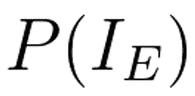

##### 图 10.2 当你在列表 10.1 中评估 `query` 对象时返回的渲染数学图像

因果层次结构适用于模型和数据。

### 10.1.2 模型和假设在层次结构中的位置

“模型”是一组关于数据生成过程（DGP）的假设。这些假设存在于层次结构的各个层级。

#### Level 1 假设

在关联层面的模型具有统计但非因果的假设。例如，假设我们感兴趣的是 *P*(*I*|*E*=*e*)，对于 *e* 可能采取的任何值（“低”，“高”）。我们可能拟合一个线性模型来回归游戏内购买 *I* 对侧任务参与 *E*。或者我们可能训练一个将 *E* 映射到 *I* 的神经网络。这些都是两个参数化不同的统计模型。换句话说，它们在非因果、统计假设上对 *P*(*I*|*E*) 的放置上有所不同。一旦我们添加因果假设，我们就进入了层次结构的高层。

#### Level 2 假设

我们可以用因果有向图（DAG）表示的假设是第二层（介入）假设。一个第二层模型的例子是因果图模型（也称为因果贝叶斯网络）——一个在因果有向图上训练的概率模型。一个因果有向图本身就是一个第二层假设集；关于什么导致什么的假设。一般来说，允许你推断干预措施后果的假设是第二层假设。

#### Level 3 假设

Level 3 模型的典型例子是结构因果模型。但更普遍地说，关于机制——*变量如何相互影响*——的假设是第三层（反事实）假设。

考虑到这一点的一种方式是，任何你无法在 DAG 结构中表示的因果假设，通过排除法，就是一个第三层假设。例如，假设你的 DAG 有边 *X*→*Y*。进一步地，你相信 *X* 和 *Y* 之间的因果关系是自然线性的。你无法在 DAG 结构上“看到”线性，因此线性是一个第三层假设。

### 10.1.3 数据在层次结构中的位置

回顾观察数据和介入数据之间的差异。观察数据是被被动观察的；因此，它捕捉了 DGP 中变量之间依赖关系产生的统计关联。

#### Level 1 数据

在我们的在线游戏示例中，第一层数据是数据库查询拉取的侧任务参与和游戏内购买日志示例。观察数据位于因果层次结构的第一层。

#### Level 2 数据

介入数据是在应用介入措施的结果下生成的，例如从随机实验中收集的数据。在游戏示例中，这是由于 A/B 测试随机分配玩家到不同的组，他们被强制参与不同固定侧任务参与水平所创建的数据。介入数据位于层次结构的第二层。

#### Level 3 数据

反事实数据，位于层次结构的第 3 级，是一个特殊情况。反事实数据将包含来自可能世界的跨世界的数据。在大多数领域，我们只有一个世界的数据——数据中每个观察单位的*潜在结果*。

然而，存在一些特殊情况，其中存在反事实数据。例如，云服务提供商在给定各种约束的情况下，使用复杂但确定性的策略在云中分配资源。以日志中给定的一个分配结果为例，我们可以通过对该示例应用不同的分配策略来生成该示例的反事实结果。同样，给定由仿真软件产生的数据，我们可以通过改变仿真以反映一个*假设条件*并使用与原始数据相同的初始条件重新运行它来生成反事实数据。

### 10.1.4 因果层次定理

因果层次为我们提供了来自称为*因果层次定理*的东西的关键见解。这个见解是这样的：“没有第 *k* 级别的假设，你不能回答第 *k* 级别的问题。”例如，如果你想得到因果效应，你需要 DAG 或其他第 2 级（或第 3 级）假设。如果你想回答反事实问题，你需要第 3 级假设。即使是最前沿的深度学习模型，如果不能编码第 *k* 级别的假设，也无法可靠地回答第 *k* 级别的问题。

更正式地说，因果层次定理确立了因果层次的三层在数学术语中是“几乎总是分开的”。粗略地说，“分开”意味着来自层次较低级别的数据不足以从较高级别的层次推断查询。而“几乎总是”意味着这个陈述是正确的，除非在极其罕见的情况下，我们可以将其视为实际上并不重要。

除了这个见解之外，因果层次使得理解识别——可能是所有因果推理中最难的主题——变得容易得多，正如我们在本章的其余部分将看到的那样。

## 10.2 识别和因果推理流程

在本节中，我们将探讨提出和回答因果问题的流程以及识别在该流程中的作用。我们将使用第七章中引入的在线游戏 DAG 作为例子。让我们首先使用 y0 构建 DAG。

##### 列表 10.2 在 y0 中构建在线游戏 DAG

```py
import requests     #1
def download_code(url):   #1
    response = requests.get(url)   #1
    if response.status_code == 200:    #1
        code_content = response.text   #1
        print("Code fetched successfully.")  #1
        return code_content    #1
    else:   #1
        print("Failed to fetch code.")    #1
        return None   #1
url = (   #1
    "https://raw.githubusercontent.com/altdeep/"   #1
    "causalML/master/book/chapter%2010/id_utilities.py"   #1
)   #1
utilities_code = download_code(url)   #1
print(utilities_code)    #2
# After checking, uncomment the exec call to load utilities
#exec(utilities_code)    #2

from y0.graph import NxMixedGraph as Y0Graph    #3
from y0.dsl import P, Variable    #4
G = Variable("G")   #4
E = Variable("E")     #4
I = Variable("I")    #4
dag = Y0Graph.from_edges(    #4
    directed=[     #4
        (G, E),   #4
        (G, I),     #4
        (E, I)     #4
    ]     #4
)     #4
gv_draw(dag)     #5
```

#1 安装 Graphviz 以进行 DAG 可视化。下载一些识别和可视化的辅助函数，将一些 y0 抽象转换为我们所熟悉的抽象。

#2 在执行之前检查下载的代码，这是一项良好的安全实践。然后取消注释最后一行并执行。

#3 y0 与一个名为 NxMixedGraph 的自定义图类一起工作。为了避免混淆，我们将称之为 Y0Graph 并用它来实现 DAG。

#4 构建图形。

#5 使用 Graphviz 辅助函数绘制图形。

这产生了图 10.3 中的图形。

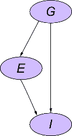

##### 图 10.3 绘制带有 y0 的在线游戏图

在第七章中，我们的目标是使用我们的 *P*(*G*, *E*, *I*) 模型通过干预操作从 *P*(*I*[*E*][=“high”]) 中进行模拟。在第 7.1.6 和 7.2.6 节中，我们进行了这种模拟，并看到了对于这个在线游戏示例的实证证据，证明它是有效的。识别意味着基于你的模型和假设，证明它在一般情况下是有效的。正式来说，我们想确保第一层分布 *P*(*G*, *E*, *I*)，或者来自该分布的数据，结合我们的 DAG，

就足以从第二层分布 *P*(*I*[*E*][=“high”]) 中进行模拟。y0 的识别确认这确实可能。

##### 列表 10.3 检查 *P*(*I**[E]*[=“high”]) 从 *P*(*G*, *E*,*I*) 的识别

```py
e = E    #1
check_identifiable(     #2
    dag,     #2
    query=P(I @ e),     #2
    distribution=P(G, E, I)    #2
)     #2
```

#1 用小写“e”表示干预值。

#2 检查给定 DAG、分布和目标查询的可识别性。Y0 代表理想的干预措施，所以我们写作 P(I [E=e] 作为 P(I @ e)。

这将返回`True`，但如果我们没有任何关于行会成员 *G* 的观察呢？我们可以使用 y0 来测试我们是否从 *P*(*E*, *I*) 中获得了对 *P*(*I*[*E*][=“high”]) 的识别。换句话说，测试是否可以从对 *E* 和 *I* 的观察中推断出 *P*(*I*[*E*][=“high”])。

##### 列表 10.4 检查 *P*(*I**[E]*[=“high”]) 从 *P*(*E*,*I*) 的识别

```py
check_identifiable(
    dag,
    query=P(I @ e),
    distribution=P(E, I)
)
```

这将返回`False`，因为我们没有从 DAG 和基于我们的图形假设的 *P*(*E*, *I*) 中对 *P*(*I*[*E*][=][*e*]) 进行识别。

##### 识别不足和误导性的概率机器学习

Y0 显示，根据我们的在线游戏 DAG，从 *P*(*E*, *I*) 中无法识别 *P*(*I**[E]*[=]*[e]*)。从概率机器学习 (ML) 的角度来看，这个结果有什么含义。作为概率机器学习的专家，如果 *G* 是未测量的，我们可能会倾向于在 *P*(*E*, *I*) 上训练一个潜在变量模型，其中 *G* 是潜在变量。一旦我们学习了该模型，我们就可以通过图手术设置 *E*=*e* 来实施干预，然后从转换后的模型中采样 *I*。

这个算法将*运行*；它会生成样本。但 y0 的识别不足结果证明，仅基于我们 DAG 中的假设，我们不能将这些样本视为来自 *P*(*I**[E]*[=]*[e]*) 的有效样本。并且更多的数据训练也不会有帮助。这个算法能够工作的唯一方式是，如果存在额外的因果假设，这些假设限制了推断，超出了 DAG 编码的假设。

在这个介绍的基础上，让我们定义识别。

### 10.2.1 定义识别

假设我随机选择一对数字，*X* 和 *Y*，并将它们相加得到 *Z*。然后，我告诉你 *Z* 的值，并要求你推断 *X* 和 *Y* 的值。你能做到吗？没有更多信息的话，不能。那么，如果我给你数百万个特征 *Z* 和标签 {*X*，*Y*} 的例子呢？你能训练一个深度学习模型从输入特征 *Z* 预测标签 {*X*，*Y*} 吗？再次，不能，至少在没有对可能值有强假设的情况下不能。如果我只给你十亿个例子呢？不；更多的数据不会有帮助。在统计学中，我们会说预测目标 {*X*，*Y*} 是没有*识别*的。

换句话说，你想要推断某事，并且你有一个算法（例如，深度网络）可以接收数据并生成答案。由于输入数据的统计变化，这个答案通常会与真实值略有不同。如果你的推断目标是确定的，那么你输入到算法中的数据越多，这种差异就会越小，你的算法答案就会收敛到真实答案。如果你的推断目标没有确定，那么更多的数据不会减少你的算法错误。

*因果识别*只是因果层次结构各层之间的统计识别。当你的因果假设使你能够使用层次结构较低级别的数据来推断该查询时，因果查询就被识别了。

### 10.2.2 因果推断工作流程

现在我们已经定义了识别，我们可以定义因果推断的完整工作流程。图 10.4 显示了完整的工作流程。

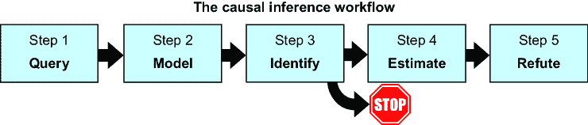

##### 图 10.4 因果推断工作流程。识别步骤是工作流程中的关键步骤。

识别是工作流程中的关键步骤。让我们逐一走过每个步骤。

#### 第一步：提出你的查询

首先，我们将我们的因果问题作为一个查询提出。例如，给定我们的问题“如果副任务参与度很高，玩家在游戏中的购买会是什么？”我们的查询是 *P*(*I*[*E*][=“high”])。


##### 图 10.5 第二步：构建模型以捕捉相对于你的查询的因果假设。对于查询 *P*(*I**[E]*[=“high”])，这是我们在线游戏的 DAG。

#### 第二步：构建你的模型

接下来，构建一个因果模型，该模型捕捉你的基本因果假设。我们的模型将是在线游戏的因果 DAG，如图 10.5 所示。

你的模型假设至少应该与你在因果层次结构中的查询级别相匹配。例如，查询 *P*(*I*[*E*][=“high”]) 是一个 2 级查询，因此我们需要至少一些 2 级假设。因果 DAG 是一个 2 级因果模型，因此在我们的分析中，DAG 提供了必要的 2 级假设。

#### 第三步：检查识别

评估你是否在你的查询中具有识别，基于你的模型假设和可用数据。如果你没有识别，你必须要么在你的数据中观察额外的变量，要么改变你的假设。例如，我们可以修改我们的在线游戏 DAG（改变二级假设）。或者简单地停止并得出结论，根据你的数据和关于问题的知识，你不能回答这个问题，并将你的注意力转移到其他地方。

#### 第 4 步：估计你的查询

一旦你知道你的查询具有识别，你就可以对你的查询进行统计推断，或“估计”。有各种各样的估计方法和算法，从贝叶斯推断到线性回归、倾向得分到双重机器学习。我们将在下一章中回顾一些估计方法。

#### 第 5 步：反驳你的因果推断

反驳是最终一步，我们在这里进行敏感性分析，以评估第 4 步的结果对假设违反的敏感性，包括使识别成为可能的假设。我们将在第十一章中看到这方面的例子。

### 10.2.3 分离识别和估计

在许多文本中，识别和估计在一步中结合，通过匹配估计量和那些估计量将有效的工作场景。在这本书中，我们将强调识别和估计的分离，原因有以下几点：

+   分离使我们能够将所有因果考虑因素都转移到识别步骤。这有助于我们明确我们依赖哪些因果假设来进行估计，并为我们的分析可能失败的情况建立直觉。

+   因此，估计步骤简化为纯粹统计问题，其中我们考虑通常的统计权衡（偏差与方差、不确定性量化、扩展性等）。

+   这种分离也使我们能够利用自动微分能力来处理估计，这些能力是前沿深度学习库的核心，而无需担心这些学习过程是否会错误地得出因果关系。

接下来，我们将深入探讨最常见的识别策略：后门调整。

## 10.3 使用后门调整进行识别

假设我们想要确定参与对游戏内购买的影响，即*E*(*I*[*E*][=][“high”] – *I*[*E*][=][“low”])。我们可以从这个查询*E*(*I*[*E*][=][*e*]=*i*)中推导出这个期望，所以我们关注*P*(*I*[*E*][=][*e*]=*i*)。我们可以使用在线游戏 DAG 来证明以下是真的：

我们将在下一节中看到如何推导出这个方程。该方程的右侧是一个称为*估计量*的一级量，我们可以从联合分布*P*(*I*, *E*, *G*)中推导出来。


##### 查询、估计量和估计者

在统计学中，*估计量*是统计算法（*估计器*）估计的东西。识别的任务是找到（识别）查询的估计量。从因果层次结构的角度来看，因果识别是关于找到一个较低级别的估计量来满足较高级别的查询。

在在线游戏后门识别示例中，*P*(*I*[E=“high”]=i) 是一个二级查询，而 ∑*[g]**P*(*I*=*i*|*E*=“high”, *G*=*g*)*P*(*G*=*g*) 是一级估计量，称为*后门调整估计量*。后门调整是我们应用于 *P*(*E*, *I*, *G*) 的一个操作，其中我们消去（或在连续情况下积分出）共同原因 *G*。在某些情况下，我们会看到我们不需要明确知道估计量，只需要知道它存在。

我们将我们的 DAG 和干预级别的查询 *P*(*I*[*E*][=][“high”]) 传递给 y0，它告诉我们它识别了一个估计量，这是一个应用于 *P*(*E*, *I*, *G*) 的操作，与 *P*(*I*[*E*][=][“high”]) 等价。让我们让 y0 显示这个估计量。

##### 列表 10.5 从 *P*(*E*, *I*, *G*) 推导出估计量以获得 *P*(*I**[E]*[=“high”])

```py
from y0.graph import NxMixedGraph as Y0Graph
from y0.dsl import P, Variable
from y0.algorithm.identify import Identification, identify

query = P(I @ e)
base_distribution = P(I, E, G)

identification_task = Identification.from_expression(
    graph=dag,
    query=query,
    estimand=base_distribution)

identify(identification_task)
```

这返回了图 10.6 中的表达式。


##### 图 10.6 y0 识别函数的输出

在我们的记号中，这表示为 ∑[*g*]*P*(*I*=*i*|*E*=“high”, *G*=*g*) ∑*[ε]*[,]*[i]**P*(*E*=*ε*, *G*=*g*, *I*=*i*), 这可以简化为 ∑[*g*]*P*(*I*=*i*|*E*=“high”, *G*=*g*) *P*(*G*=*g*). 这就是*后门调整估计量*。我们将从高层次看到 y0 如何推导出这个估计量。但首先，让我们更仔细地看看这个估计量。

### 10.3.1 后门调整公式

一般而言，假设 *X* 是 *Y* 的原因，并且我们对干预级别的查询 *P*(*Y*[*X*][=][*x*]) 感兴趣。在这种情况下，*后门调整估计量*是 ∑*[g]**P*(*X*=*x*, *Z*=*z*) *P*(*Z*=*z*)。*后门调整公式*将因果查询 *P*(*X**[X]*[=]*[x]*) 与其估计量等同起来：


在这里，*Z* 是一组被称为调整集的变量。求和是求和和积分的简写——你在调整集中的离散变量上求和，在连续变量上积分。调整集被定义为满足*后门准则*的一组变量——（1）该集共同*分离*了从 *X* 到 *Y* 的所有*后门路径*，并且（2）它不包含 *X* 的后代。

要理解为什么我们要分离 *X* 和 *Y* 之间的后门路径，再次考虑我们的在线游戏示例图 10.7 中的 DAG。


##### 图 10.7 在线游戏 DAG

*P*(*I*|*E*=“high”)和*P*(*I*[*E*][=“high”])之间的区别是什么？考虑图 10.8 中*E*和*I*之间的两条路径。在*P*(*I*|*E*=“high”)的情况下，观察到*E*=“high”通过其对*I*的直接因果影响为我们提供了关于*I*的信息，即通过路径*E*→*I*。但观察到*E*=“high”也为我们提供了关于*G*的信息，随后通过后门路径*E*←*G*→*I*关于*I*的信息。两个变量之间的后门路径是共同原因之间的*d*-连接路径。在*P*(*I**[E]*[=“high”])的情况下，我们只想通过直接路径*E*→*I*对*I*产生影响。


##### 图 10.8 *E*←*G*→*I*是一个后门路径，其中*G*是*E*和*I*的共同原因的“混杂因素”。我们感兴趣的是沿着从*E*到*I*的因果路径流动的统计信号，但这个信号被后门路径*E*←*G*→*I*上的额外统计信息的非因果噪声所“混杂”。

我们称*G*为*混杂因素*，因为沿着从*E*到*I*的因果路径流动的统计“信号”被来自*G*的额外统计信息的非因果“噪声”所“混杂”，这些信息通过后门路径*E*←*G*→*I*传递。为了解决这个问题，我们试图通过在*G*上阻断来 d-分离这条后门路径。

我们想要识别查询*P*(*I*[*E*][=“high”])的后门估计量。因此，我们在后门调整公式中将*I*替换为*Y*，将*E*替换为*X*。*G*阻断后门路径*E* *G* *I*，因此集合*G*成为我们的调整集：

*P*(*I*[*E*][=][*e*]=*i*) = ∑[*g*]*P*(*I*=*i*|*E*=*e*, *G*=*g*)*P*(*G*=*g*)

后门调整公式通过求和/积分或换句话说，“调整”后门统计信号来 d-分离后门路径，只留下来自直接因果关系的信号。

备注：一些文献中提到的是 G 公式而不是后门调整公式。后门调整公式就是 G 公式，其中调整集是以后门标准来定义的。

虽然调整集可以包括非混杂因素，但在实践中，排除除最小化后门阻断混杂因素之外的所有因素可以减少复杂性和统计变异。我们在第十一章深入探讨了后门调整的统计考虑因素。

### 10.3.2 揭秘后门

因此，后门调整估计量从何而来？让我们再次考虑我们的在线游戏示例。查询是*P*(*I*[*E*][=][*e*])，其中*e*是“高”或“低”。在反事实的术语中，让我们考虑两个可能的世界，一个是我们原始的 DAG，另一个是我们对副任务参与度(*E*)进行干预。让我们查看图 10.9 中的平行世界图。


##### 图 10.9 我们有两个平行世界：世界 A 中*E*没有受到干预，世界 B 中*E*受到了干预。

如果你足够用力地眯着眼睛看这张图，你会注意到它暗示了在给定 *G* 的条件下，*E* 是与 *I*[*E*][=][*e*] 条件独立的。我们将使用一些基于 d-separation 的推理来观察这一点。记住，在一般情况下，我们不能在平行世界图上使用 d-separation 来进行跨世界的推理，因为 d-separation 规则没有考虑到在各个世界之间等效的节点（如 *G*）。但我们将使用一个技巧，通过观察世界 A 中从 *E* 到 *G* 的 d-connected 路径，然后扩展这个 d-connected 路径 *从* 世界 B 中等效的 *G* 到 *I*[*E*][=][*e*]。

首先，考虑从世界 A 中的 *E* 到世界 B 的路径必须穿过两个世界之间的桥梁之一，*N*[*G*] 和 *N*[*I*]。但是，由于 *I* 上的碰撞器，到 *N*[*I*] 的两条路径（*E* → *I* ← *N*[*I*]，*E* ← *G* → *I* ← *N*[*I*]）都是 d-separated 的。

因此，我们有一条到世界 B 的 d-connected 路径（*E* ← *G* ← *N*[*G*]）。现在假设我们观察世界 B 中的 *G*；从世界 B 的 *G* 出发，到 *I*[*E*][=][*e*] 只是一步之遥。但我们知道，根据一致性法则，两个世界中的 *G* 的值必须相同；两个 *G* 都是 *N*[*G*] 的相同确定性函数，并且两个 *G* 都不受干预的影响。因此，为了方便起见，我们将两个 *G* 在平行世界图中折叠成一个节点（图 10.10）。现在观察路径 *E* ← *G* → *I*[*E*][=][*e*]，我们可以看到这条路径被 *G* d-separated。因此，我们可以得出结论 *E* ⊥ *I*[*E*][=][*e*] | *G*。

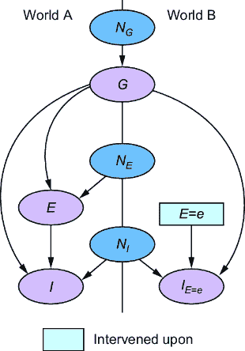

##### 图 10.10 在各个世界之间折叠 *G* 揭示了 *G* d-separates *E* 和 *I**[E]*[=]*[e*]。

在因果推理术语中，这种简化被称为 *不可知性*。*不可知性*意味着因果变量 *E* 和像 *I*[*E*][=][*e*] 这样的反事实潜在结果在混杂因素给定的情况下是条件独立的。不可知性是因果推理中常见的假设。我们可以在推导后门估计量时使用这个不可知性假设。

在我们开始之前，让我们回顾一个关于条件独立的关键定义事实：如果两个变量 *U* 和 *V* 在给定 *Z* 的条件下是条件独立的，那么 *P*(*U*|*Z*=*z*, *V*=*v*) = *P*(*U*|*Z*=*z*)。反过来，*P*(*U*|*Z*=*z*) = *P*(*U*|*Z*=*z*, *V*=*v*)。换句话说，*P*(*U*|*Z*=*z*) = *P*(*U*|*Z*=*z*, *V*=“apples”) = *P*(*U*|*Z*=*z*, *V*=“oranges”)；*V* 的值无关紧要，因为 *Z* 使其与 *U* 独立，其值对 *U* 没有影响。引入 *V* 并赋予它我们想要的任何值是使推导工作起来的技巧。此外，回顾一下全概率定律说，我们可以通过对该变量求和（或积分）来从联合分布中消去一个变量，例如 *P*(*U*=*u*) = ∑[*v*]*P*(*U*=*u*, *V*=*v*)。当联合分布受到干预时，也是如此，例如 *P*(*U**[W]*[=]*[w]*=*u*) = ∑[*v*]*P*(*U**[W]*[=]*[w]*=*u*, *V**[W]*[=]*[w]*=*v*)。

现在我们从因果查询 *P*(*I*[*E*][=][*e*]) 开始，看看它是如何与后门估计量 ∑[*g*] *P*(*I*|*E*=*e*, *G*=*g*)*P*(*G*=*g*) 相等的。

1.  对于游戏内购买的某个值 *i*，根据全概率定律，*P*(*I*[*E*][=][*e*]=*i*) = ∑[*g*] *P*(*I*[*E*][=][*e*]=*i*, *G*[*E*][=][*e*]=*g*)。

1.  ∑[*g*] *P*(*I*[*E*][=][*e*]=*i*, *G*[*E*][=][*e*]=*g*) = ∑[*g*] *P*(*I*[*E*][=][*e*]=*i*, *G*=*g*)，因为我们知道从我们的原始 DAG 中，*G* 不受对 *E* 的干预的影响。

1.  接下来，我们使用链式法则对 *P*(*I*[*E*][=][*e*]=*i*, *G*=*g*) 进行因式分解：∑[*g*] *P*(*I*[*E*][=][*e*]=*i*, *G*=*g*) = ∑[*g*] *P*(*I*[*E*][=][*e*]=*i*| *G*=*g*)*P*(*G*=*g*)。

1.  现在我们来到了一个技巧——对于任何 *e* 的值，*P*(*I*[*E*][=][*e*]=*i*|*G*=*g*) = *P*(*I*[*E*][=][*e*]=*i*|*E*=*e*, *G*=*g*)，因为一旦我们条件化 *G*=*g*，*E*=*e* 和 *I*[*E*][=][*e*] 就是独立的。因此，在我们的推导中，我们可以用 *P*(*I*[*E*][=][*e*]=*i*|*E*=*e*, *G*=*g*) 替换 *P*(*I*[*E*][=][*e*]=*i*|*G*=*g*)。

1.  一旦我们条件化 *E*=*e*，我们就可以使用一致性定律取消下标：∑[*g*] *P*(*I*[*E*][=][*e*]=*i*|*E*=*e*, *G*=*g*)*P*(*G*=*g*) = ∑[*g*] *P*(*I*=*i*|*E*=*e*, *G*=*g*)*P*(*G*=*g*)。

让我们解释步骤 4 和 5。我们的不可知性结果表明，在给定 *G* 的条件下，*I*[*E*][=][*e*] 和 *E* 是条件独立的。因此，在第 4 步中，我们应用了独立性技巧，使我们能够引入 *E*。进一步地，我们将 *E* 的值设为 *e*，以便与下标 [*E*][=][*e*] 匹配。这使我们能够应用第八章中的一致性定律，并取消下标 [*E*][=][*e*]。

哇，我们已经确定了一个后门估计量，这是一个来自因果层次结构第 1 层的估计量，用于第 2 层因果查询 *P*(*I*[*E*][=][*e*])，它使用在 DAG 中编码的第 2 层假设。因果识别只是提出这样的推导。如果不是大部分，那么传统因果推理研究的大部分都归结为做这种数学运算，或者编写为你做这种运算的算法。

接下来，我们将探讨 do-calculus，它提供了一套基于图的简单规则，用于识别，我们可以在识别算法中使用这些规则。

## 10.4 使用 do-calculus 进行图形识别

*图形识别*（有时称为*非参数识别*）指的是依赖于对 DAG 进行推理的识别技术。图形识别最著名的途径之一是*do-calculus*，这是一套用于因果图识别的三条规则。这些规则使用图手术和 d-separation 来确定何时可以用非因果术语如*I*[*E*][=][*e*]替换因果术语。从因果层次结构较高级别的查询开始，我们可以按顺序应用这些规则来推导出较低级别的估计量。

### 10.4.1 揭秘 do-calculus

回想一下高中几何，你看到了这样的 if-then 语句：

> *如果*形状是正方形，*那么*所有边都相等。

当你试图解决一个几何问题时，你会在你的解决方案步骤中使用这样的事实。

同样，do-calculus 由三个规则（if-then 语句）组成，形式如下：

> *如果*某些变量在应用图手术后的 DAG 中 d-separation，*那么*概率查询*A*等于概率查询*B*。

#### do-calculus 的规则并不直观

do-calculus 的三个规则在阅读时并不直观，就像你在高中第一次看到像 cos²x + sin²x = 1 这样的几何规则时并不直观一样。但就像那些几何规则一样，我们是从更简单、更熟悉的概念中推导出 do-calculus 的规则，即 d-separation、理想干预和概率规则。而且就像几何规则一样，我们可以使用 do-calculus 的规则来证明从层次结构的一个级别发出的因果查询与另一个级别的查询是等价的。

实际上，我们可以依赖实现图形识别算法中的 do-calculus 的软件库（如 y0）或简单地硬编码已知的识别结果，如后门调整估计量。为了消除一些神秘感，我将介绍这些规则并展示它们如何推导出后门估计量。这里的目的是不是记住这些规则，而是要看看它们在推导后门估计量时的作用，这与上一节的推导形成对比。

在定义这些规则时，我们将关注在*X*上的干预下的目标分布*Y*。我们希望推广到所有 DAG，所以我们将命名另外两个节点，*Z*和*W*。*Z*和*W*将使我们能够涵盖我们还有另一个潜在干预目标*Z*和任何我们想要条件化的节点*W*的情况。此外，虽然我经常提到单个变量，但请记住，当*X*、*Y*、*Z*和*W*是变量集时，这些规则适用。

#### 规则 1：观察值的插入或删除

> 如果 *Y* 和 *Z* 在你的 DAG 中通过 *X* 和 *W* 分隔，在移除 *X* 的进入边之后……
> 
> *那么* *P*（ *Y* [*X*][=][*x*]= *y* | *Z* = *z*，*W* = *w*）= *P*（ *Y* [*X*][=][*x*] = *y* | *W* = *w*）。

这被称为“插入或移除”，因为我们可以从 *P*（ *Y* [*X*][=][*x*]=*y*|*Z*=*z*，*W*=*w*）中移除 *Z*=*z* 来得到 *P*（ *Y* [*X*][=][*x*]=*y* | *W*=*w*），反之亦然。

#### 规则 2：交换干预和观察

> *如果* *Y* 和 *Z* 在你的 DAG 中通过 *X* 和 *W* 分隔，在 *X* 的进入边和 *Z* 的出去边被移除之后……
> 
> *然后 P*（ *Y* [*X*] [=] [*x*] [,] [*Z*] [=] [*z*]= *y* | *W* = *w*）= *P*（ *Y* [*X*] [=] [*x*] = *y* | *Z* = *z*，*W* = *w*）。

在这里，我们可以在 *P*（ *Y* [*X*][=][*x*][,] [*Z*][=][*z*]=*y* | *W*=*w*）中 *交换* 干预 [*Z*][=][*z*] 以观察 *Z*=*z* 为条件，得到 *P*（ *Y* [*X*][=][*x*]=*y* | *Z*=*z*，*W*=*w*），反之亦然。

#### 规则 3：插入或移除干预

对于规则 3，我们将定义 *Z* 为一组节点，*Z*(*W*)为不是 *W* 的祖先的 *Z* 的子集。

> 如果你移除了 *X* 和 *Z*（ *W*）的所有进入边后，*Y* 和 *Z* 在你的 DAG 中通过 *X* 和 *W* 分隔……
> 
> *然后* *P*（ *Y* [*X*][=][*x*] [,] [*Z*][=][*z*] = *y* | *W* = *w*）= *P*（ *Y* [*X*][=][*x*] = *y* | *W* = *w*）。

这条规则允许你将 [*Z*][=][*z*] 插入到 *P*（ *Y* [*X*][=][*x*]=*y* | *W*=*w*）中，得到 *P*（ *Y* [*X*][=][*x*][,] [*Z*][=][*z*]=*y* | *W*=*w*），或者从 *P*（ *Y* [*X*][=][*x*][,] [*Z*][=][*z*]=*y* | *W*=*w*）中移除 [*Z*][=][*z*]，得到 *P*（ *Y* [*X*][=][*x*]=*y* | *W*=*w*）。

### 10.4.2 使用 do-calculus 进行后门识别

现在我们将使用 do-calculus 来提供对后门估计量的另一种推导，这种推导与基于“不可知性”的定义不同。同样，我包括这个推导是为了阐明 do-calculus 的应用。如果你没有完全理解每一步，请不要担心：

1.  *P*（*I*[*E*][=][*e*]=*i*）= ∑[*g*] *P*（*I*[*E*][=][*e*]=*i*，*G*[*E*][=][*e*]=*g*）根据全概率定律。

1.  ∑[*g*] *P*（*I*[*E*][=][*e*]=*i*，*G*[*E*][=][*e*]=*g*）= ∑[*g*] *P*（*I*[*E*][=][*e*][,] [*G*][=][*g*]=*i*）*P*（*G*[*E*][=][*e*][,] [*I*][=][*i*]=*g*）通过 c-component 分解。

1.  *P*（I[*E*][=][*e*][,] [*G*][=][*g*]=i）= *P*（*I*=*i*|*E*=*e*，*G*=*g*）根据 do-calculus 的第 2 条规则。

1.  *P*（G[*E*][=][*e*][,] [*I*][=][*i*]=g）= *P*（*G*=*g*）根据 do-calculus 的第 3 条规则。

1.  因此，*P*（I[*E*][=][*e*]=i）= ∑[*g*] *P*（*I*=*i*|*E*=*e*，*G*=*g*）*P*（*G*=*g*）通过将 3 和 4 代入 2。

do-calculus 规则在步骤 3 和 4 中应用。

注意：步骤 2 使用了一种称为*c-component factorization*的分解规则。c-component（混淆组件）是 DAG 中一组节点，其中每个可观察节点的成对节点通过一条路径相连，该路径的边始终指向可观察节点，而不是远离它们（这些是第四章中提到的“孤儿表亲”）。观察变量的联合概率可以被分解为 c-components，这一事实使得步骤 2 成为可能。在识别算法中，对 c-components 进行分解是常见的。请参阅章节注释中的参考文献[`www.altdeep.ai/p/causalaibook`](https://www.altdeep.ai/p/causalaibook)。

这种基于 do-calculus 的推导比我们基于“不可知性”的推导要直观得多。我们为此直觉交换了两个优势。首先，do-calculus 是*完整的*，这意味着如果一个查询仅使用图形假设就有可识别的估计量，那么它可以使用 do-calculus 推导出来。其次，我们有利用 do-calculus 来自动化图形识别的算法。

## 10.5 图形识别算法

图形识别算法，通常称为*ID 算法*，自动化了基于图的应用识别系统，如 do-calculus。当我们使用 y0 检查*P*(*I*[*E*][=][*e*])的识别并推导后门估计量时，它正在使用其图形识别算法的实现。在本节中，我们将看到如何使用这些算法来识别另一个有用的估计量，称为*前门估计量*。

### 10.5.1 案例研究：前门估计量

在我们的在线游戏示例中，假设我们无法观察到公会成员资格。那么我们就无法进行*P*(*I*[*E*][=][*e*])的后门识别。然而，假设我们在侧任务参与(*E*)和游戏内购买(*I*)之间有一个*中介*——一个在*E*和*I*之间的图节点。具体来说，我们的中介代表*赢得的物品*(*W*)，如图 10.11 所示。


##### 图 10.11 侧任务参与导致赢得像这种魔法弓这样的虚拟物品。赢得的物品会推动更多游戏内购买，例如魔法弓的魔法箭，因此我们在侧任务参与和游戏内购买之间的因果路径上引入了一个中介“赢得的物品”。

赢得的物品的想法如下。当玩家成功完成一个侧任务时，他们会赢得一个虚拟物品。他们完成的侧任务越多，他们获得的物品就越多。那些*赢得的*虚拟物品和*购买的*虚拟物品可以相互补充。例如，赢得一个魔法弓会促使购买魔法箭。因此，玩家拥有的赢得物品的数量会影响他们购买的虚拟物品的数量。

给定这个图，我们可以使用 y0 的图形识别算法实现来推导前门估计量。

##### 列表 10.6 在 y0 中推导前门估计量

```py
from y0.graph import NxMixedGraph as Y0Graph
from y0.dsl import P, Variable
G = Variable("G")     #1
E = Variable("E")     #1
I = Variable("I")    #1
W = Variable("W")     #1
e = E     #1
dag = Y0Graph.from_edges(     #1
    directed=[     #1
        (G, E),    #1
        (G, I),     #1
        (E, W),   #1
        (W, I)    #1
    ]     #1
)     #1

query=P(I @ e)     #2
base_distribution = P(I, E, W)    #3

identification_task = Identification.from_expression(    #4
    graph=dag,    #4
    query=query,     #4
    estimand=base_distribution)     #4
identify(identification_task)     #4
```

#1 使用中介变量构建一个新的图。

#2 仍然是列表 10.5 中的相同查询，P(I_{E=e})

#3 但现在我们观察到 I，E 和 W

#4 最后，我们检查在 DAG 和观测分布的条件下查询是否被识别。

这段代码将返回图 10.12 的输出。

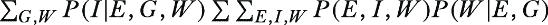

##### 图 10.12 Y0 将识别的数学图作为输出。

重新排列输出，按照我们的记号，这是结果：


如前所述简化，我们得到前门估计量：

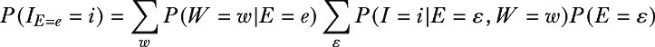

注意，有一个关于*W*的外层求和和一个关于所有*E*值的内层求和（每个*E*值用*ε*表示，与干预值*e*不同）。

### 10.5.2 揭示前门之谜

与后门估计量类似，前门估计量的 do-calculus 推导涉及到使用规则 2 和 3 的重复替换。前门估计量的粗略直觉是，侧面任务参与和游戏内购买的统计关联来自直接的因果路径以及通过后门混杂因素公会成员资格（*G*）的路径。前门估计量使用中介变量来确定这种关联中有多少是由于直接的因果路径；中介变量充当通过该直接因果路径的统计信息流的测量器。

估计量的一个关键好处是，它不需要观察一组阻止所有可能后门路径的混杂因素。当你有许多混杂因素、无法调整由于潜在混杂因素，或者担心可能存在一些未知的混杂因素时，避免后门调整是有用的。

接下来，我们将探讨如何识别反事实。

## 10.6 通用反事实识别

因果 DAG 是一个 2 级建模假设。因果层次定理告诉我们，在一般情况下，图本身不足以识别 3 级反事实查询。要从 1 级或 2 级分布中进行反事实识别，你需要 3 级假设。简单来说，3 级假设是任何你不能用简单的因果 DAG 表示的因果假设。

在第九章中，我介绍了反事实推理的通用算法。该算法需要一个结构因果模型（SCM），这是一个 3 级模型；它封装了 3 级假设。有了 SCM，算法可以推断出在其基础变量上可以定义的所有反事实查询。这种能力的代价是，SCM 必须封装回答所有这些查询所需的所有假设。其中许多假设不能用 1 级或 2 级数据进行验证。

你做出的假设越多，你的推断就越容易受到这些假设违反的影响。因此，我们寻求识别技术，这些技术针对特定的反事实查询（而不是每个反事实查询）使用尽可能少的 3 级假设。

### 10.6.1 通用反事实推理算法的问题

当我们将通用反事实推理算法应用于两个类似的 SCM 时，我们可以看到问题。假设有一个与您用于运行算法的 SCM 不同的真实 SCM。假设这两个 SCM 具有完全相同的底层 DAG 和相同的观察数据和实验数据的统计拟合；换句话说，SCM 为所有一级和二级查询提供相同的推理。您的 SCM 仍然可能相对于真实 SCM 产生不同的（不准确的）反事实推理。

为了理解原因，回顾第六章中的木棍断裂示例。我提出了两个相似但不同的 SCM。这是第一个：

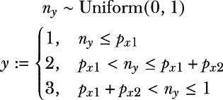

这是第二个：


图 10.13 可视化了对这些模型进行单值采样。


##### 图 10.13 两个不同的 SCM 编码了完全相同的观察和干预分布，但给定相同的外生变量值，在每个模型中，您可以得到对应内生变量的两个不同值。

图 10.13 展示了当给定*n*[y] = .15 的值时，木棍在.15 米处断裂，但第一根木棍将在区域 2 断裂，返回值为 2，而第二根木棍将在区域 3 断裂，返回值为 3。由于它们在第三级假设上的不同，即它们如何处理输入，它们在相同的随机输入下产生不同的结果。

因此，当我们朝相反方向进行，并在通用反事实推理算法中应用归纳步骤时，我们可以得到这些模型的不同结果。对于内生变量的给定值，我们可以得到外生变量的不同后验分布。

图 10.14 说明了这两个模型在观察到结果为 3 时，如何对*N*[y]产生不同的推理。对于第一个 SCM，*y*=3 的值意味着*P*(N*[y]|*Y*=3)是在(*p*[x][1] + *p*[x][2])到 1 范围内的连续均匀分布，而对于第二个 SCM，它是在 0 到*p*[x][3]范围内的连续均匀分布。这些不同的*P*(N*[y]|*Y*=3)分布会导致反事实推理算法产生不同的结果。现在假设 SCM 2 是正确的，而 SCM 1 是错误的。如果我们选择 SCM 1，我们的反事实推理将是不准确的。


##### 图 10.14 尽管两个 SCM 编码了相同的观察和干预分布集，但在归纳步骤中，它们会对*Y*=3 给定*N*[y]产生两个不同的后验。因此，它们编码了不同的反事实分布，可以产生不同的反事实推理。

一般情况更难；可能有多个 SCM 包含相同的第 1 级和第 2 级假设，但具有不同的第 3 级假设。例如，您可能通过使用基于深度神经网络的方法从第 1 级和第 2 级数据中学习深度 SCM 来学习这些 SCM 之一。但是，深度 SCM 可能不是您想要进行反事实推断的*正确*SCM。

如果您对基础真实 SCM 有信心，反事实推断的一般算法是理想的。但在您不确定的情况下，您可以转向反事实识别，在那里您指定一个*最小*的第三级假设集合，使您能够识别一个目标反事实查询。

### 10.6.2 示例：单调性和因果概率

单调性是强大第三级假设的一个例子。单调性是一个简单的假设，即原因 *X* 和结果 *Y* 之间的关系是单调的：*E*(*Y*|*X*=*x*) 当 *x* 增加时要么从不增加要么从不减少。请注意，线性是单调性的一个特例。

单调性和非单调性的直观例子在药物剂量中。在单调剂量反应关系中，服用更多的药物要么有帮助要么没有帮助。在非单调剂量反应关系中，服用药物可能在正常剂量下有帮助，但过量服用可能会使问题变得更糟。单调性通过消除反事实可能性来帮助识别；如果剂量反应关系是单调的，当你想象如果你服用更强的剂量会发生什么时，你可以消除你变得更糟的可能性。

回想第八章中我们看到的因果概率：

+   必要概率（PN）：*P*(*Y*[*X*][=][0]=0|*X*=1, *Y*=1)

+   足够概率（PS）：*P*(*Y*[*X*][=1]=1|*X*=0, *Y*=0)

+   必要性和充分性概率（PNS）：*P*(*Y*[*X*][=1]=1, *Y*[*X*][=0]=0)

在单调性的假设下，我们可以识别以下关于因果概率的第二级估计量。

+   PN = (*P*(*Y*=1) – *P*(*Y*[*X*][=0]=1))/*P*(*X*=1, *Y*=1)

+   PS = (*P*(*Y*[*X*][=1]=1) – *P*(*Y*=1))/*P*(*X*=0, *Y*=0)

+   PNS = *P*(*Y*[*X*][=1]=1) – *P*(*Y*[*X*][=0]=1)

我们可以从第二级数据中估计这些第二级估计量，例如一个随机实验。当然，如果我们只有观察数据，我们可以使用后门或前门调整或另一种识别策略，从那些数据中推断出 *P*(*Y*[*X*][=0]=1) 和 *P*(*Y*[*X*][=1]=1)。

我们可以再次手动推导这些估计量，但相反，让我们考虑通过消除反事实可能性来使这种识别单调性得以实现的识别。为了看到这一点，考虑第八章中的提升建模问题。在那里，*X* 是我们是否发送了促销，而 *Y* 是客户是否继续作为付费订阅者（*Y*=1）或“流失”（取消订阅；*Y*=0）。我们按以下方式对订阅者进行细分：

+   *可说服者*—当你发送促销时，留下可能性增加的订阅者

+   *确定事件*—无论是否发送促销，都有很大可能性留下的订阅者

+   *无望的原因*—无论是否发送促销，留下可能性很低的订阅者

+   *沉睡的狗*：当你发送促销时，留下可能性下降的订阅者

如果你假设单调性，你是在假设发送促销要么不起作用，要么会增加留下的可能性。它假设没有用户会对促销做出不良反应。换句话说，假设单调性意味着你假设没有沉睡的狗。

现在让我们考虑这如何缩小范围。假设你有一个以下问题：

> 我未能向一位客户发送促销，他们流失了。如果我发送了促销，他们会留下吗？*P*（*Y*[*X*][=1]=1|*X* = 0, *Y* = 0）

这个反事实查询是充分性的概率。我们想知道发送促销是否会增加他们留下的可能性。思考这个问题，

+   如果客户是可说服的，发送促销会增加他们留下的可能性。

+   如果客户是无望的原因，发送促销将不会有任何效果。

+   如果客户是沉睡的狗，发送促销会使他们留下可能性更低。

如果这位客户既是可说服的，又是沉睡的狗，那么很难确定我们是否应该发送促销，在一个情况下促销会有所帮助，而在另一个情况下它会使客户流失更加确定。但如果我们假设单调性，我们就排除了他们是沉睡的狗的可能性，并可以得出结论，发送促销会有所帮助，或者至少不会损害他们留下的机会。

##### 贝叶斯建模和反事实识别

尽管图形识别算法可以处理一些反事实查询，但我们没有反事实识别的通用算法。但鉴于我们关注概率机器学习工具，我们可以转向贝叶斯建模作为前进的道路。

识别本质上关于不确定性。例如，在反事实情况下，缺乏识别意味着即使有无限的一级和二级数据，你也不能确定三级查询的真实值。从贝叶斯的角度来看，我们可以使用概率来处理这种不确定性。

假设你有一组因果假设，包括非图形假设，以及一些一级和二级数据。你可以采取以下贝叶斯方法来测试你的假设和数据是否足以识别你的反事实查询：

1.  指定一组既多样化又与你的因果假设一致的 SCM（结构因果模型）。

1.  在这个集合上放置一个先验分布，使得更合理的模型获得更高的先验概率值。

1.  在给定观测（第 1 级）和干预（第 2 级）数据的情况下，获得 SCM 的后验分布。

1.  从后验分布中抽取 SCM 样本，并对每个样本 SCM，你应用针对特定反事实查询的通用反事实推理算法。

结果将构成关于这一反事实推理的后验分布。如果你的因果假设和你的数据足以识别反事实查询，随着你数据的增加，反事实推理的后验将收敛到真实值。（成功的收敛假设了贝叶斯估计的典型“规律性”条件。结果将取决于先验的质量。）但即使它没有收敛到真实值，你的假设仍然可能使收敛到一个足够小以有用的真实值附近区域（这被称为部分识别，如第 10.9 节所述）。

Pyro 库及其因果性扩展 ChiRho，使得以这种方式结合贝叶斯和因果思想成为可能。

从二元动作（如发送或不发送促销）到多动作（如决策或强化学习问题）的单调性推广是通用的，有关参考文献请参阅[`www.altdeep.ai/p/causalaibook`](https://www.altdeep.ai/p/causalaibook)。

## 10.7 图形反事实识别

一个传统的因果 DAG 仅编码第 2 级假设，但存在推理反事实的图形技术。图形反事实推理仅在特殊情况下有效，但这些情况非常实用。此外，使用图形使我们能够通过算法自动化识别。为了说明图形反事实识别，我们将引入一个新的案例研究。

当你打开 Netflix 时，你会看到 Netflix 仪表板，它显示了多种推荐内容形式。其中两种是“为你精选”，这是 Netflix 算法根据你的过去观看行为和评分预测你将喜欢的个性化节目和电影选择，以及“因为你看了”，它根据你最近观看的内容推荐内容。该系统的模型包括以下变量：

+   *T*—一个用于推荐策略的变量，该策略选择订阅者的“为你精选”内容。为了简单起见，我们将考虑一个当前在生产中的策略，“+*t*”。我们将使用“–*t*”，表示“非*t*”，来表示替代策略。

+   *B*—一个用于推荐策略的变量，该策略选择订阅者的“因为你看了”内容。同样，我们将简化为具有策略“+*b*”的二进制变量，代表生产中的策略，以及所有替代策略“–*b*”，如“非*b*”。

+   *V*—订阅者与“因为你看了”推荐内容互动的参与度。

+   *W*—订阅者与“为你精选”推荐内容互动的参与度。

+   *A*—流失，意味着订阅者最终是否离开 Netflix。

+   *C*—订阅者背景，意味着我们正在处理的订阅者类型（位置、人口统计、偏好等）。

推荐算法始终考虑订阅者的概况以及观看历史，因此订阅者概况 *C* 是推荐政策变量 *T* 和 *B* 的原因。

在本节中，我们将使用 y0 在层次结构的各个级别分析这个问题。我们将首先可视化图形。

##### 列表 10.7 绘制推荐 DAG

```py
T = Variable("T")     #1
W = Variable("W")    #1
B = Variable("B")    #1
V = Variable("V")    #1
C = Variable("C")    #1
A = Variable("A")    #1
t, a, w, v, b = T, A, W, V, B   #1
dag = Y0Graph.from_edges(directed=[     #2
    (T, W),    #2
    (W, A),    #2
    (B, V),    #2
    (V, A),    #2
    (C, T),    #2
    (C, A),    #2
    (C, B)    #2
])    #2
gv_draw(dag)    #3
```

#1 为模型定义变量。

#2 创建图。

#3 绘制图。


##### 图 10.15 推荐算法问题的因果 DAG

这生成了图 10.15 中的 DAG。

作为初步调查，您可能需要查看“为您精选”内容对流失率 *E*(*A*[*T*][=+][*t*] – *A*[*T*][=–][*t*]) 的平均处理效果（ATE，二级查询）。鉴于流失率 *A* 具有二元结果，我们可以将其表示为 *P*(*A*[*T*][=+][*t*]=+*a*) – *P*(*A*[*T*][=–][*t*]=+*a*)。专注于 *P*(*A*[*T*][=–][*t*]=+*a*)，我们立即知道我们可以通过（二级）后门和前门来识别这一点。因此，让我们继续探讨一个有趣的（三级）反事实查询，称为*治疗对接受治疗者的效果*（ETT）。

### 10.7.1 治疗对接受治疗者的效果

记住，您可以直接从随机实验中获得 ATE（无需识别和估计一级估计量）。假设您在一组用户上运行了这样的实验，并显示了一个有利的 ATE，例如，+*t*相对于-*t*对*W*和*A*有积极的影响。因此，您的团队部署了该政策。

假设+*t*政策对观看大量电影并因此拥有更多观看数据的用户效果最好。因此，当政策部署到生产环境中时，这类用户更有可能被分配该政策。但由于他们高度参与，无论他们被分配+*t*或-*t*政策，他们都不太可能离开。我们可能会出现这样的情况：在随机分配政策且不考虑参与程度的实验中，+*t*政策看起来有效，但在生产中分配是有偏见的，偏向于高度参与但对政策漠不关心的用户。

解决这个问题的 3 级查询是 ATE 的反事实版本，称为处理对处理的效果（ETT，有时称为 ATT，即“对处理者的平均处理效果”）。我们将其写成反事实查询 *E*(*A*[*T*][=+][*t*] – *A*[*T*][=–][*t*]|*T*=+*t*），即“对于看到政策+*t*的人，他们相对于看到-*t*的情况，有多少更多的流失？”像我们对 ATE 所做的那样，对于二进制 *A* 进行分解，我们可以将其写成 *P*(*A*[*T*][=+][*t*]=+*a*|*T*=+*t*) – *P*(*A*[*T*][=–][*t*]=+*a*|*T*=+*t*)。根据一致性法则，*P*(*A*[*T*][=+][*t*]=+*a*|*T*=+*t*)简化为 *P*(*A*=+*a*|*T*=+*t*)。因此，我们可以关注第二个项，*P*(*A*[*T*][=–][*t*]=+*a*|*T*=+*t*)。

在二进制 *A* 的这个特殊情况下，我们可以通过图形识别（对于非二进制 *A*，需要更多 3 级假设）来识别 ETT。为了对反事实进行图形识别，我们可以使用带有反事实图的图形识别算法。

### 10.7.2 在反事实图上的识别

Y0 可以使用名为“IDC*”的图形识别算法（发音为 I-D-C-star）从 ETT 推导出一个估计量。

##### 图 ID 算法，ID，IDC，ID*，IDC*，在 y0 中

y0 中实现的一些核心图形识别算法是 ID，ID*，IDC 和 IDC*。ID 从 DAG 中识别干预（2 级）查询和观察（1 级）数据。ID*从观察和实验（1 级和 2 级）数据中识别反事实（3 级）查询。IDC 和 IDC*扩展 ID 和 ID*以处理条件查询，例如 ETT。

这些算法使用因果图的结构，通过移除无关变量并将图分解成 c 组件子图来递归简化识别问题。它们应用 do-calculus 规则来减少干预项，阻断混杂的后门路径，并将查询分解成更简单的子查询。如果由于图的结构无法进一步简化，算法将返回一个“不可识别”的结果。

本章的代码依赖于 Y0 对这些算法的实现，尽管 Y0 还实现了其他图形识别算法。

##### 列表 10.8 使用图形识别算法识别 ETT

```py
from y0.algorithm.identify.idc_star import idc_star

idc_star(
    dag,
    outcomes={A @ -t: +a},     #1
    conditions={T: +t}    #2
)
```

#1 假设结果 A [T=–t] = +a

#2 实际条件 T = +t

这将产生一个相当冗长的 2 级估计量。然后我们可以应用 2 级图形识别算法来得到 1 级估计量，这将简化为以下内容：

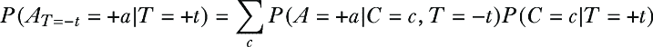

我将在下一节展示一个简单的推导。

目前，直觉是我们正在应用所谓的反事实图的图形识别算法。到目前为止，我们用于反事实推理的图形选择是并行世界图。确实，我们可以让 y0 为我们制作一个并行世界图。

##### 列表 10.9 使用 y0 绘制并行世界图

```py
from y0.algorithm.identify.cg import make_parallel_worlds_graph
parallel_world_graph = make_parallel_worlds_graph(    #1
    dag,  #1
     {frozenset([+t])}    #1
)    #1
gv_draw(parallel_world_graph)     #2
```

#1 make_parallel_worlds_graph 方法接受一个输入 DAG 和干预集。它为每个集构建一个新的世界。

#2 辅助函数以熟悉的方式可视化图表。

这个图与我绘制的图略有不同，因为算法将干预的下标应用于发生干预的世界的每个节点；下标索引世界中的所有变量。我们必须推理出从一个世界的*C*和从另一个世界的*C*[+][*t*]必须具有相同的结果，因为*C*[+][*t*]不受其世界干预 do(*T*=+*t*)的影响。

现在回想一下，并行世界图的问题在于 d 分离无法与之一起工作。例如，在图 10.16 中，d 分离表明在它们的共同外生父节点*N*[C*]的条件下，*C*和*C*[+][*t*]是条件独立的，但我们刚刚阐述*C*和 C[+][*t*]必须是相同的；如果 C 有一个值，*C*[+][*t*]必须具有相同的值，因此它们是完全相关的。

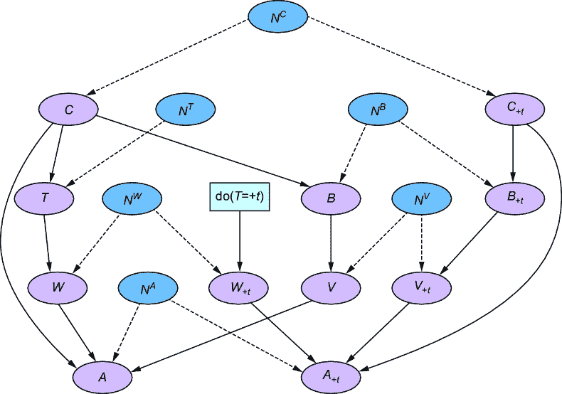

##### 图 10.16 由 y0（和 Graphviz）绘制的并行世界图。在这个并行世界图的版本中，下标表示一个世界。例如，+*t*表示应用干预 do(*T*=+*t*)的世界。为了避免混淆，外生变量使用上标而不是下标来表示它们的子内生变量（例如，*N**^C*是*C*（和*C*[+t]）的父节点）。

我们可以通过使用*反事实图*来解决这个问题。反事实图是通过使用并行世界图和反事实查询来理解并行世界图中不同世界的节点哪些是等价的，然后将等价节点合并为一个来创建的。结果图包含与查询中事件相关的并行世界中的节点。与并行世界图不同，你可以使用 d 分离来推理反事实图。我们可以使用 y0 为事件*A*[*T*][=–][*t*]=+*a*和*T*=+*t*创建一个反事实图。

##### 列表 10.10 列表 10.10 反事实图事件 *A**[T]*[=][–]*[t]*=+*a* 和 *T*=+*t*

```py
from y0.algorithm.identify.cg import make_counterfactual_graph

events = {A @ -t: +a, T: +t}    #1
cf_graph, _ = make_counterfactual_graph(dag, events)
gv_draw(cf_graph)
```

#1 反事实图与查询中的事件结果一起工作。对于 P(A [T=–t]=+a|T=+t)，我们希望事件 A [T=–t] =+a 和 T=+t。

这就创建了图 10.17 中的反事实图。

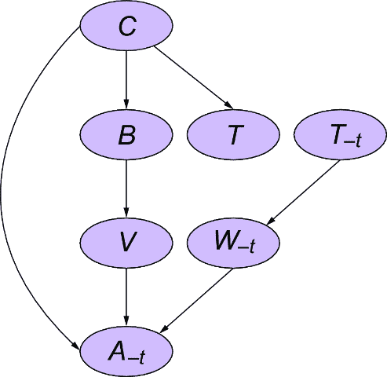

##### 图 10.17 由 y0（和 Graphviz）生成的事件反事实图。*T**[–t]*对应于干预 do(*T*=–*t*)。

在高层次上，y0 中的图形识别算法通过使用反事实图而不是传统的 DAG 来进行反事实识别。首先，它找到一个 3 级查询的 2 级估计量。从那里，你可以使用实验数据来回答估计量中的 2 级术语，或者你可以尝试从 2 级术语进一步推导出 1 级估计量。

##### 当你对结果进行条件限制时，仅使用图表是不够的！

假设你感兴趣的不是 ETT 项 *P*(*A**[T]*[=–]*[t]*=+*a*|*T*=+*t*)，而是 *P*(*A**[T]*[=–]*[t]* =+*a*|*T*=+*t*, *A*=+*a*)，即回答问题：“给定一个接触到策略 +*t* 并后来取消订阅的订阅者，如果他们没有接触到该策略，他们还会取消订阅吗？”或者你可能对 *E*(*A**[T]*[=–]*[t]* – *A**[T]*[=+]*[t]*|*T*=+*t*, *A*=+*a*) 感兴趣，这有时被称为 *反事实遗憾*，它捕捉了策略 +*t* 对取消订阅的个人决定取消订阅的贡献量。

*P*(*A**[T]*[=–]*[t]*=+*a*|*T*=+*t*, *A*=+*a*) 是一个假设结果和事实条件冲突的查询示例。在这种情况下，事实条件包含 *A* 的一个结果，而假设条件包含 *A* 的干预结果。本节中提到的图形反事实识别技术不适用于此类查询。在这种情况下，识别需要额外的第三级假设。

这很不幸，因为这种反事实正是那种最有趣、最核心的“事情可能如何不同？”反事实问题，这些问题最有趣，也是人类推理和做决策的核心。

我们还可以使用图形识别来进行更高级的查询。例如，假设你想隔离 *T* 对 *A* 的影响与 *B* 对 *A* 的影响。你想要关注 *B* 为 –*b* 的用户。你找到过去实验中的数据，其中“因为你观看了……”策略 *B* 是随机化的。你取那些数据，并聚焦于实验中被分配 –*b* 的参与者。该实验中感兴趣的结果是 *V*，即“因为你观看了”框中推荐内容的参与量。因此，你有了对那些感兴趣订阅者的 *V*[*B*][=–][*b*] 的结果。有了这些新数据，你将查询从 *P*(*A*[*T*][=–][*t*]=+*a*|*T*=+*t*) 扩展到 *P*(*A*[*T*][=–][*t*]=+*a*|*T*=+*t*, *B*=–*b*, *V*[*B*][=–][*b*]=*v*)，包括 *V*[*B*][=–][*b*]=*v*，因为它有助于预测流失。现在你有三个并行世界来推理：实际世界、do(*T*=+*t*) 的世界和 do(*B*=–*b*) 的世界。

##### 列表 10.11 为 do(*T*=+*t*) 和 do(*B*=–*b*) 创建一个并行世界图

```py
parallel_world_graph = make_parallel_worlds_graph(
    dag,
   {frozenset([-t]), frozenset([-b])}      #1
)
gv_draw(parallel_world_graph)
```

#1 第二个参数列举了假设条件。

此代码创建了图 10.18 中所示的三世界并行世界图。

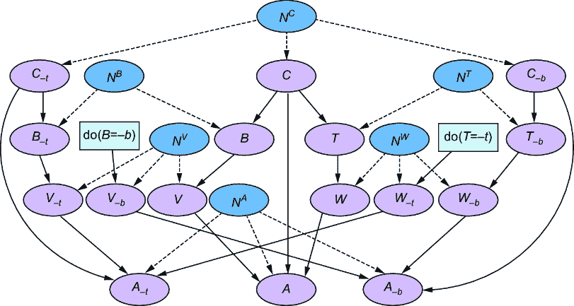

##### 图 10.18 一个具有实际世界 *T*=+*t* 和假设世界 do(*T*=–*t*) 以及 do(*B*=–*b*) 的并行世界图。虚线是来自外生变量的边（深灰色）。

显然，查询 *P*(*A*[*T*][=–][*t*]=+*a*|*T*=+*t*, *B*=–*b*, *V*[*B*][=–][*b*]=*v*) 将并行世界图折叠成与 *P*(*A*[*T*][=–][*t*]=+*a*|*T*=+*t*) 相同的反事实图。

##### 列表 10.12 扩展表达式的反事实图

```py
joint_query = {A @ -t: +a, T: +t, B: -b, V @ -b: +v}
cf_graph, _ = make_counterfactual_graph(dag, joint_query)
gv_draw(cf_graph)
```

这为我们提供了图 10.19 中的反事实图，它与图 10.17 中的图相同。

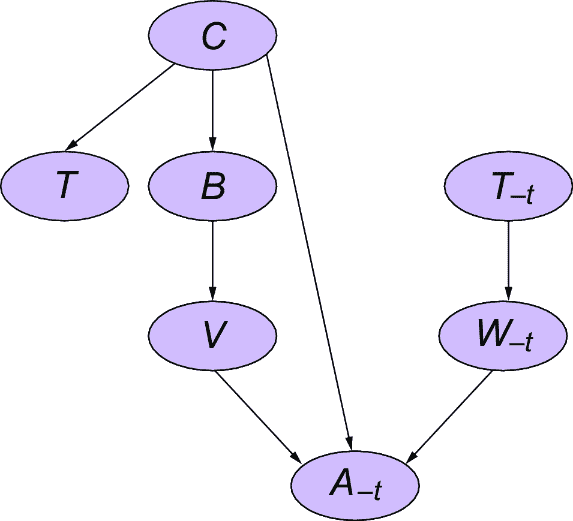

##### 图 10.19 对于*P*(*A**[T]*[=–]*[t]*=+*a*|*T*=+*t*, *B*=–*b*, *V**[B]*[=–]*[b]*=*v*)的反事实图与*P*(*A**[T]*[=–]*[t]*=+*a*|*T*=+*t*)相同。

接下来，我们将探讨另一种基于图的称为单世界干预图的方法。

### 10.7.3 使用单世界干预图进行反事实识别

单世界干预图（SWIGs）为使用反事实图进行反事实识别提供了一种替代方案。与反事实图一样，我们使用原始因果 DAG 和因果查询来构建一个 SWIG。我们将使用 Netflix 推荐示例来构建干预 do(*T*=–*t*)和 do (*B*=–*b*)的 SWIG。让我们从一个因果 DAG 构建一个 SWIG。

#### 节点分割操作

我们有一个针对 do(*T*=+*t*)的干预，我们可以通过一种特殊的图手术称为节点分割操作来实现它。我们在干预目标*T**上分割出一个新节点，如图 10.20 所示。*T*仍然代表原始图中的相同变量，但新节点代表一个常数，干预值+*t*。*T*保持其父节点（在这种情况下为*C*），但将其子节点（在这种情况下为*W*）丢失到新节点。

#### 下标继承

接下来，每个新节点的下游节点都将继承新节点的值作为下标。例如，在图 10.21 中，*W*和*A*是干预的下游，因此下标*[T]*[=][–]*[t]*被附加到这些节点上，因此它们变为*W*[*T*][=][-][*t*]和*A*[*T*][=][-][*t*]。

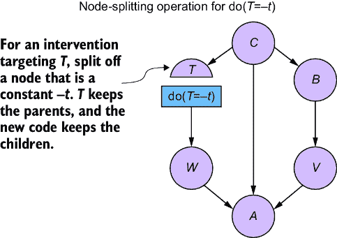

##### 图 10.20SWIG 的干预操作是节点分割操作。


##### 图 10.21 干预下游的每个节点都获得干预下标。

#### 对每个干预重复此过程

我们对每个干预重复此过程。在图 10.22 中，我们应用 do(*B*=–*b*)，分割*B*，并将*V*转换为*V*[*B*][=–][*b*]，将*A*[*T*][=-][*t*]转换为*A*[*T*][=–][*t*][,][*B*][=–][*b*]。

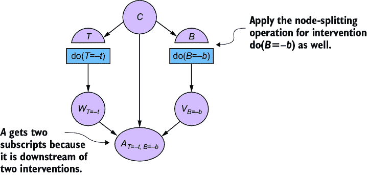

##### 图 10.22 一个节点接受所有上游干预的下标。

与反事实图一样，SWIG 包含反事实变量，并允许 d 分离。有了这些属性，我们可以进行识别。

### 10.7.4 使用 SWIG 进行识别

假设我们感兴趣的是 ETT，并想识别*P*(*A*[*T*][=][–][*t*]=+*a*|*T*=+*t*)。我们推导出图 10.23 中的 SWIG。


##### 图 10.23 我们可以使用 SWIG 通过不可知性技巧推导出 ETT。

使用这个图，我们可以使用我在第 10.4 节中介绍的不知性技巧来识别*P*(*A*[*T*][=–][*t*]=+*a*|*T*=+*t*)：

1.  *P*(*A*[*T*][=–][*t*]=+*a*|*T*=+*t*) = ∑[*c*] *P*(*A*[*T*][=–][*t*]=+*a*, *C*[*T*][=–][*t*]=*c*|*T*=+*t*)，根据全概率定律。

1.  ∑[*c*] *P*(*A*[*T*][=][–][*t*]=+*a*, *C*[*T*][=–][*t*]=*c*|*T*=+*t*) = ∑[*c*] *P*(*A*[*T*][=–][*t*]=+*a*, *C* =*c*|*T*=+*t*)，因为 *C* 不受对 *T* 的干预的影响。

1.  根据概率的链式法则，∑[*c*] *P*(*A*[*T*][=–][*t*]=+*a*, *C*=*c*|*T*=+*t*) 可以分解为 ∑[*c*] *P*(*A*[*T*][=–][*t*] =+*a*|*C*=*c*, *T*=+*t*) *P*(*C*=*c* | *T*=+*t*)。

1.  *P*(*A*[*T*][=–][*t*]=+*a*|*C*=*c*, *T*=+*t*) = *P*(*A*[*T*][=–][*t*]=+*a*|*C*=*c*, *T*=–*t*)，再次通过不可知性技巧。

1.  就像之前一样，*P*(*A*[*T*][=–][*t*]=+*a*|*C*=*c*, *T*=–*t*) = *P*(*A* =+*a*|*C*=*c*, *T*=–*t*)，根据一致性法则。因此，*P*(*A*[*T*][=–][*t*]=+*a*|*T*=+*t*) = ∑[*c*] *P*(*A* =+*a*|*C*=*c*, *T*=–*t*) *P*(*C*=*c* | *T*=+*t*)。

第 4 步中的不可知性技巧中发生了魔法，其中 *C* 与 *A*[*T*][=–][*t*] 和 *T* 的 d-分离使我们能够将 *T*=+*t* 改为 *T*=–*t*。请注意，在图 10.17 中我们推导出的反事实图中也存在相同的 d-分离。区别在于推导 SWIG 很容易，而推导反事实图则很微妙，通常使用 y0 中的 `make_counterfactual_grap` 算法。

### 10.7.5 单世界假设

节点拆分操作依赖于一个新的 3 级假设。如果你打算对变量 *X* 进行节点拆分，那么你是在假设可以知道在没有干预的情况下 *X* 会自然取什么值，并且在你意识到这个值之前，你有能力进行干预。想象一下在我们的 Netflix 例子中，如果一个订阅者的配置文件 *C*=*c*，推荐算法正准备为该订阅者分配一个推荐“为你精选”的策略 +*t*，但在该策略生效之前，你进行了干预并人为地将其改为 –*t*。可能你强制策略变为 –*t* 的方式产生了一些副作用，从而以某种基本方式改变了推荐系统，以至于在这个新系统中，*T* 最初就不会是 *+t*。在单世界假设下，你假设你可以知道 T 的自然值会是 *+t*，并且你的干预不会以影响 T 取自然值的方式改变系统。当你用 SWIGs 进行推理时，你隐含地做出了这个假设。

这个假设让你避免了创建额外的世界来进行推理的需要。你可以在结果 *T*=+*t* 上进行条件化，并在“单世界”中进行干预 do(*T*=–*t*)。你还可以进行实验，应用干预 do(*T*=–*t*) 并测试 T（你知道 T 的“自然值”）在给定 *C* 的情况下是否对 *A*(*T*=–*t*) 条件独立。这减少了你可以回答的反事实查询的数量，但 SWIGs 的支持者认为这是一个优点，因为它限制了你可以通过实验验证的反事实。

##### 对比反事实图和 SWIGs

*反事实图和 SWIGs 在功能上相似，但它们是明显不同的工具。*

+   *反事实图*—反事实图通过在可能世界中合并等效的并行世界图节点来工作。它们只包含与特定查询相关的节点。它们定义了二进制事件，如 {*T*=+*t*} 和 {*T*=–*t*}—即使在连续变量的情况下这也很好用，因为反事实语言通常比较一个*假设条件*和一个*事实条件*（例如，“我们投资了 100 万；如果我们投资了{2/more/half/…}会怎样？”）。

+   *单世界干预图（SWIGs）**—*SWIG 通过应用一种节点分割类型的图手术来工作。与反事实图不同，它们处理的是一般变量（而不仅仅是二进制事件），并且不是针对特定查询的（所有原始节点都存在）。然而，它们依赖于单世界假设——可以确定知道变量在没有干预的情况下会取什么值。

这两种图的主要用途是识别。反事实图和 SWIGs 都不能从 1 级或 2 级数据中识别出反事实查询，例如 *P*(*A**[T]*[=–]*[t]*=+*a*|*T*=+*t*, *A*=+*a*)，其中相同的变量出现在假设结果和事实条件中。但你可以仍然*推导*出这样的查询的反事实图；对于 SWIGs 来说则不是这样。如果你想要在查询如 *P*(*A**[T]*[=–]*[t]*=+*a*|*T*=+*t*, *A*=+*a*)的情况下推理不同世界之间的独立性，这将是很有用的。

## 10.8 识别和概率推理

我们已经看到，识别任务的核心部分是推导出一个估计量。这个估计量如何与概率机器学习方法相结合呢？

以我们的在线游戏模型为例，其中 ETT = *E*(*I*[*E*][=“high”] – *I*[*E*][=“low”]|*E*=“high”) = *E*(*I*[*E*][=“high”]|*E*=“high”) – *E*(*I*[*E*][=“low”]|*E*=“high”)。我们需要识别 *P*(*I*[*E*][=“high”]|*E*=“high”) 和 *P*(*I*[*E*][=“low”]|*E*=“high”)。回想一下，*P*(*I*[*E*][=“high”]|*E*=“high”) 通过一致性法则简化为 1 级查询 *P*(*I*|*E*=“high”)，所以挑战在于识别反事实分布 *P*(*I*[*E*][=“low”]|*E*=“high”)。

使用 Pyro 的概率机器学习方法，我们知道我们可以通过使用`pyro.condition`在*E*=“high”上条件化，然后运行推理来推断 *P*(*I*|*E*=“high”)。问题是我们将如何推断反事实分布 *P*(*I*[*E*][=“low”]|*E*=“high”)。

在上一节中，我们看到我们可以使用 SWIG 来识别这个查询（假设单世界假设成立）。我们使用了 SWIG 来推导出以下关于 *P*(*I*[*E*][=0]=*i*|*E*=“high”) 的估计量：

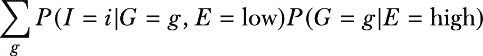

但关于在 Pyro 中构建模型，我们该如何处理这个估计量呢？我们可以构建两个 Pyro 模型，一个用于 *P*(*G*|*E*)，另一个用于 *P*(*I*|*G*, *E*)，推断 *P*(*I*=*i*| *G*=*g*, *E*=“low”) 和 *P*(*G*=*g* | *E*=“high”)，然后进行求和。但与我们的常规因果生成模型进行概率推理的方法相比，这并不优雅：

1.  实现完整的因果生成模型。

1.  在数据上训练其参数。

1.  应用干预算子来模拟干预。

1.  运行推理算法。

在这种方法中，我们构建一个因果模型——我们不会为估计量的组件 *P*(*G*|*E*) 和 *P*(*I*|*G*, *E*) 构建单独的模型。尽管如此，如果我们有识别，那么我们的常规因果生成模型进行概率推理的方法仍然有效，前提是我们实现了步骤 1 中的因果假设，并在步骤 2 中训练的数据。我们甚至不需要明确知道估计量；只要知道它存在——换句话说，查询是可识别的（例如，通过使用 Y0 的 `check_identifiable` 函数）就足够了。有了识别，步骤 2–4 共同成为对该估计量的另一个估计器。

为了说明，让我们考虑如何使用 Pyro 模型从我们的在线游戏示例中采样 *P*(*I*[*E*][=“low”]|*E*=“high”)。为了简单起见，让我们将 *E*=“high” 和 *E*=“low” 分别替换为 *E*=1 和 *E*=0。我们知道，给定我们的因果 DAG 和单词假设，*P*(*I*[*E*][=0]|*E*=1) 是可以确定的。幸运的是，Pyro 的（以及 ChiRho 的）`do` 干预算子默认实现了 SWIG 的节点分割操作（如果你使用了 `pyro.render_model` 来可视化干预，但没有得到你期望的结果，这就是原因）。对于因果 DAG 上的普通干预查询，这与普通图手术方法进行干预没有区别。但当我们想要对 *E*=1 进行条件化并干预设置 *E*=0 时，Pyro 会满足我们的需求。我们将使用这种方法来从 *P*(*I*[*E*][=0]|*E*=1) 中采样。作为一个合理性检查，我们还将从普通的干预分布 *P*(*I*[*E*][=0]) 中采样，并将这些样本与从 *P*(*I*[*E*][=0]|*E*=1) 中采样的样本进行对比。

##### 设置你的环境

为了改变节奏，我将使用 NumPyro 而不是 Pyro 来说明这个例子，尽管代码在 Pyro 上经过少量调整后也能工作。我们将使用 NumPyro 版本 0.15.0。我们还将使用一个名为 Funsor 的推理库，它旨在补充 NumPyro 和 Pyro，版本为 0.4.5。我们还将使用 Matplotlib 进行绘图。

首先，让我们构建模型。

##### NumPyro 与 Pyro

Pyro 扩展了 PyTorch，而 NumPyro 扩展了 NumPy 和 JAX 的自动微分。用户界面相当相似。如果你对 PyTorch 抽象不太熟悉，或者你更喜欢使用在 Stan 或 PyMC 中使用的贝叶斯编程模式进行基于 MCMC 的推理，那么你可能会更喜欢 NumPyro。

##### 列表 10.13 在 Pyro 中从 *P*(*I**[E]*[=][0]) 与 *P*(*I**[E]*[=][0]|*E*=1) 中生成

```py
import jax.numpy as np
from jax import random
from numpyro import sample
from numpyro.handlers import condition, do
from numpyro.distributions import Bernoulli, Normal
from numpyro.infer import MCMC, NUTS
import matplotlib.pyplot as plt

rng = random.PRNGKey(1)

def model():    #1
    p_member = 0.5  #1
    is_guild_member = sample(    #1
        "Guild Membership",    #1
        Bernoulli(p_member)   #1
    )    #1
    p_engaged = (0.8*is_guild_member + 0.2*(1-is_guild_member))    #1
    is_highly_engaged = sample(    #1
        "Side-quest Engagement",  #1
        Bernoulli(p_engaged)   #1
    )    #1
    p_won_engaged = (.9*is_highly_engaged + .1*(1-is_highly_engaged))    #1
    high_won_items = sample("Won Items", Bernoulli(p_won_engaged))    #1
    mu = (    #1
        37.95*(1-is_guild_member)*(1-high_won_items) +    #1
        54.92*(1-is_guild_member)*high_won_items +    #1
        223.71*(is_guild_member)*(1-high_won_items) +    #1
        125.50*(is_guild_member)*high_won_items    #1
    )   #1
    sigma = (   #1
        23.80*(1-is_guild_member)*(1-high_won_items) +    #1
        4.92*(1-is_guild_member)*high_won_items +    #1
        5.30*(is_guild_member)*(1-high_won_items) +    #1
        53.49*(is_guild_member)*high_won_items    #1
    )  #1
    norm_dist = Normal(mu, sigma)#1
    in_game_purchases = sample("In-game Purchases", norm_dist)    #1
```

#1 一种在线游戏模型的版本。权重是从数据中估计的（学习过程在此未展示）。

接下来，我们将应用干预并运行推断以从 *P*(*I*[*E*][=][0]) 中采样。

##### 列表 10.14 应用干预 do(*E*=0)并从 *P*(*I**[E]*[=][0]) 中推断

```py
intervention_model = do(     #1
    model,    #1
    {"Side-quest Engagement": np.array(0.)})    #1
intervention_kernel = NUTS(intervention_model)    #2
intervention_model_sampler = MCMC(    #2
    intervention_kernel,   #2
    num_samples=5000,  #2
    num_warmup=200     #2
)     #2
intervention_model_sampler.run(rng)    #2
intervention_samples = intervention_model_sampler.get_samples()    #2
int_purchases_samples = intervention_samples["In-game Purchases"] #2
```

#1 对模型应用 do 操作符。

#2 对 P(I [E=0])进行推断以从中采样。

我们将对比来自 *P*(*I*[*E*][=][0]) 的样本与我们将从 *P*(*I**[E]*[=][0]|*E*=1) 中抽取的样本。为了推断 *P*(*I**[E]*[=][0]|*E*=1)，我们将 `intervention_model` 条件化在事实条件 *E*=1 上。然后，我们将再次对此条件化后的干预模型进行推断。

##### 列表 10.15 条件干预模型并推断 *P*(*I**[E]*[=][0]|*E*=1)

```py
cond_and_int_model = condition(    #1
    intervention_model,   #1
     {"Side-quest Engagement": np.array(1.)}   #1
)    #1
int_cond_kernel = NUTS(cond_and_int_model)    #2
int_cond_model_sampler = MCMC(     #2
    int_cond_kernel,     #2
    num_samples=5000,     #2
    num_warmup=200   #2
)     #2
int_cond_model_sampler.run(rng)     #2
int_cond_samples = int_cond_model_sampler.get_samples()   #2
int_cond_purchases_samples = int_cond_samples["In-game Purchases"]  #2
```

#1 现在应用条件操作符以从 P(I [E=0]|E=1)中采样。

#2 对 P(I [E=0]|E=1)进行推断以从中采样。

注意，Pyro 的 `do` 和 `condition` 子例程可以相互组合；即，对于一个具有变量 *X* 的模型，`do(condition(model, {"X": 1.}), {"X": 0.})` 等价于 `condition(do(model, {"X": 0.}), {"X": 1.})`。

最后，我们将绘制 *P*(*I**[E]*[=0]) 和 *P*(*I**[E]*[=0]|*E*=1) 的样本，并评估这些分布之间的差异。

##### 列表 10.16 从 *P*(*I**[E]*[=][0]) 和 *P*(*I**[E]*[=][0]|*E*=1) 中绘制样本

```py
plt.hist(     #1
    int_purchases_samples,   #1
    bins=30,    #1
    alpha=0.5,    #1
    label='$P(I_{E=0})$'   #1
)     #1
plt.hist(     #2
    int_cond_purchases_samples,    #2
    bins=30,     #2
    alpha=0.5,     #2
    label='$P(I_{E=0}|E=1)$'     #2
)     #2
plt.legend(loc='upper left')    #2
plt.show()    #2
```

#1 绘制 P(I [E=0])样本的直方图。

#2 绘制 P(I [E=0]|E=1)样本的直方图。

此代码生成了图 10.24 中的直方图。

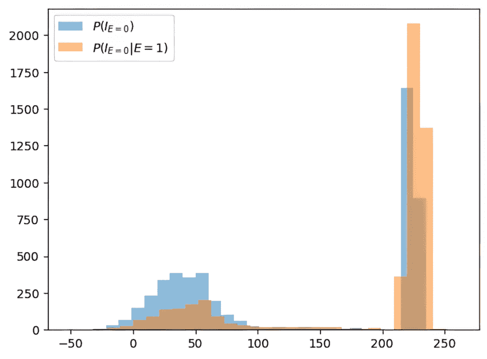

##### 图 10.24 Pyro 生成的 *P*(*I**[E]*[=0]) 和 *P*(*I**[E]*[=0]|*E*=1) 样本的直方图

在这个例子中，参数已被给出。在第十一章，我们将探讨估计方法，我们将无缝地将这种查询推断与从数据中进行的贝叶斯参数推断结合起来。

## 10.9 部分识别

我们将在本章结束时简要讨论部分识别。有时，在给定假设的情况下，查询可能无法识别，但它可能是 *部分可识别的*。部分可识别性意味着你可以识别查询的上限和下限的估计值。部分识别对于因果 AI 高度相关，因为机器学习算法通常依赖于寻找和优化目标函数的界限。让我们通过几个例子来了解一下。

##### MCMC 与 SVI

在这里，我们使用了马尔可夫链蒙特卡洛（MCMC）方法，但 Pyro 和 NumPyro 都提供了对随机变分推断（SVI）的抽象。在这个例子中，模型的参数（`p_member`，`p_engaged`等）被指定。我们也可以使用贝叶斯先验将参数设为未知变量，并对这些因果查询 *P*(*I**[E]*[=0]) 和 *P*(*I**[E]*[=0]|*E*=1) 进行推断；在这种情况下，我们将对这些查询进行贝叶斯推断。

但为此我们需要从观测分布中获取 *N* 个独立同分布（IID）样本，其中我们有了图形识别（*P*(*G*, *E*, *W*, *I*), *P*(*G*, *E*, *I*), 或 *P*(*E*, *W*, *I*)）。在 *P*(*G*, *E*, *W*, *I*) 的情况下，其中 DAG 中的所有变量都被观测到，未知变量的数量仅仅是参数的数量。但在后两种情况下，即 *P*(*G*, *E*, *I*) 或 *P*(*E*, *W*, *I*)，其中存在一个大小为 *N* 的潜在 *G* 或 *W*，未知变量的数量会随着 *N* 的增长而增长。在这种情况下，SVI 将更好地与大的 *N* 进行缩放。我们将在第十一章中看到一个例子。

假设在我们在线游戏的例子中，你进行了一个随机分配玩家到处理组或对照组的实验。处理组的玩家会接触到鼓励更多侧面任务参与的政策。你推理说，由于你不能真正强迫玩家参与侧面任务，所以将这个随机处理/控制变量作为我们的侧面任务参与变量（如图 10.25 中的 DAG 所示）的父变量会更好。

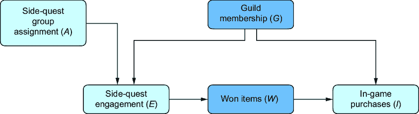

##### 图 10.25 由于 *G* 和 *W* 未被观测到，我们无法识别 *E* 对 *I* 的 ATE。但给定变量 *A*，即代表在随机实验中玩家的分配，我们有部分识别。

对于这个新变量 *A*，让 *A*=1 表示处理组，*A*=0 表示对照组。我们有了这个新变量 *A*，政策对游戏内购买的平均处理效应 *E*(*I*[*A*][=1] – *I*[*A*][=0]) 是一个有趣的查询。但假设我们最终仍然对知道侧面任务参与的平均处理效应本身对购买的影响感兴趣，即 *E*(*I*[*E*][=“high”] – *I*[*E*][=“low”])。

如果观察到公会成员资格 (*G*)，我们将通过后门调整进行识别。如果观察到赢得的物品 (*W*)，我们可以使用前门调整。但假设在这个场景中你既没有观察到 *G* 也没有观察到 *W*。在这种情况下，观察侧面任务分组变量将为你提供部分识别。假设游戏内购买变量是一个二进制值 1 表示“高”和 0 表示“低”，而不是一个连续值。那么 *E*(*I*[*E*][=“high”] – *I*[*E*][=“low”]) 的界限是


这些界限可能是拥有完全识别的下一件好事，特别是如果界限很紧的话。或者，也许知道 ATE 对于侧面任务参与的下限显著大于 0 就足够了。

类似地，对于常见的反事实查询，如因果概率，也存在一般界限。例如，假设你想知道高侧面任务参与是否是高游戏内购买的一个必要且充分的条件。你可以构建以下必要性及充分性概率（PNS）的界限：


这些界限包括第二层量如 *P*(*I*[*E*][=e]=*i*），如果可能的话，你可以根据你的假设继续识别第一层估计量。

记住，部分识别界限高度特定于你的因果假设（如 DAG）和变量的参数化；例如，前面的例子是针对二元变量的。参见[`www.altdeep.ai/p/causalaibook`](https://www.altdeep.ai/p/causalaibook)章节中的笔记，以获取推导这些界限以及其他实际假设集界限的论文链接。

## 摘要

+   因果识别的重要性在人工智能时代得到了提升，因为我们试图理解深度学习架构中的因果归纳偏差。

+   如 y0 之类的库实现了算法识别的策略。

+   因果层次是一个三层结构，它将我们提出的问题、我们开发的模型以及我们做出的因果推断进行分类。这些级别是关联、干预和反事实。

+   关联层面的推理解决“是什么”问题，并使用基本的统计假设来构建回答这些问题的模型。

+   干预或反事实查询落在它们对应的层次级别上。

+   观察性数据落在关联层面上，而实验数据落在层次结构的干预层面上。反事实数据出现在模型者可以控制确定性数据生成过程（DGP）的情况下。

+   因果识别是从实验或观察数据中推断因果推断的步骤。这是通过确定低层次层次的数据是否可以用来推断高层次层次的一个查询来完成的。

+   因果识别的一个例子是后门公式，它将干预水平查询 *P*(*Y*[*X*][=][*x*]) 等同于关联水平数量 ∑[*z*]*P*(*Y*|*X*=*x*, *Z*=z)*P*(*Z*=z)，其中 *Z* 是一组共同原因。

+   因果层次定理说明了低层次数据在没有高层次建模假设的情况下不足以推断高层次分布。

+   do-calculus 有三个规则，可用于基于图的识别。

+   反事实图是一个包含一个图上反事实世界变量的 DAG。与并行世界图不同，它允许 d 分离。我们从并行世界图和目标查询中推导出反事实图。

+   图形识别算法通过使用如 do-calculus 等规则自动使用图进行识别。

+   非参数识别是指在不依赖图形假设的识别，例如关于模型中变量之间功能关系的假设。

+   不可识别假设是指因果变量和潜在结果在给定混杂因素的情况下条件独立。

+   治疗对受治者（ETT）的效果评估了原因对暴露于该原因的群体子集的影响。

+   单世界干预图（SWIGs）提供了使用 do-calculus 和反事实图进行反事实识别的直观替代方案。它们是通过在原始因果 DAG 上应用节点分割操作来构建的。SWIGs 使用“单世界”假设，该假设认为在变量实现其自然值之前，可以知道变量的自然值，同时对其进行干预，而不会产生任何影响该自然值的副作用。

+   SWIGs 在单世界假设下与变量和一组有限的反事实一起工作，而反事实图可以容纳无法图形识别的查询。

+   Pyro 实现了 SWIG 的节点分割干预模型，这使得对 SWIG 识别的量进行概率推理成为可能。

+   使用因果图模型和概率推理算法进行因果查询的推断是可能的，只要查询被识别，并且考虑到模型的假设和训练数据。

+   部分识别意味着你可以至少识别出对目标查询界限的估计量。如果你缺乏完全识别，这可能会非常有用，尤其是在机器学习通常通过优化目标函数的界限来工作的情况下。
