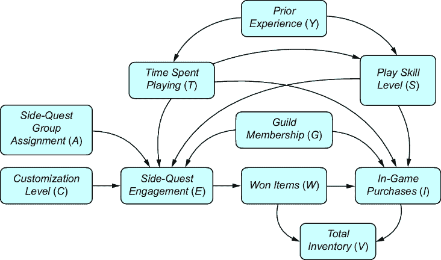

# 第十一章：构建因果推断工作流程

### 本章涵盖

+   构建因果分析工作流程

+   使用 DoWhy 估计因果效应

+   使用机器学习方法估计因果效应

+   使用因果潜在变量模型进行因果推断

在第十章中，我介绍了一个因果推断工作流程，在本章中，我们将专注于完整构建这个工作流程。我们将特别关注一种查询类型——因果效应，但这个工作流程可以推广到所有因果查询。

我们将专注于因果效应推断，即平均处理效应（ATEs）和条件平均处理效应（CATEs）的估计，因为它们是最流行的因果查询。

在第一章中，我提到了“推断的商品化”——现代软件库如何使我们能够抽象出推断算法的统计和计算细节。在本章中，你首先会看到 DoWhy 库如何“商品化”因果推断，使我们能够从高层次关注算法的因果假设以及它们是否适合我们的问题。

我们将在一个使用概率机器学习对具有潜在变量的因果生成模型进行因果效应推断的示例中再次看到这一现象。在这里，我们将看到使用 PyTorch 的深度学习如何提供另一种商品化推断的方法。

## 11.1 步骤 1：选择查询

回想第十章中提到的因果推断工作流程，如图 11.1 所示。


##### 图 11.1 因果推断分析的流程图

让我们回到我们的在线游戏示例，并使用这个工作流程来回答一个简单的问题：

> 旁支任务参与对游戏内购买的影响有多大？

我们将感兴趣的因果关系称为“旁支任务参与”（E），即“处理”变量；“游戏内购买”（I）将是“结果”变量。我们感兴趣的查询是平均处理效应（ATE）：

E(I[E][=“high”] – I[*E*][=“low”])

##### 复习：为什么 ATEs 和 CATEs 占主导地位

估计 ATEs 和 CATEs 是最受欢迎的因果效应推断任务，原因如下：

+   当随机实验不可行、不道德或不可能时，我们可以依赖因果效应推断技术。

+   我们可以使用因果效应推断技术来解决现实世界实验中的实际问题（例如，随机化后的混杂、流失、溢出、缺失数据等）。

+   在公司可以在在线应用程序和商店中运行许多不同数字实验的时代，因果效应推断技术可以帮助优先处理实验，降低机会成本。

此外，当我们调查我们的游戏数据时，我们发现了一些来自过去实验的数据，该实验旨在测试鼓励侧任务参与对游戏内购买的影响。在这个实验中，所有玩家都被随机分配到处理组或对照组。在处理组中，游戏机制被修改以诱使玩家参与更多侧任务，而对照组则玩未修改的游戏版本。我们将 *侧任务分组分配* (*A*) 变量定义为玩家是否在这个实验中被分配到处理组或对照组。

为什么不直接采用这个实验产生的 ATE 估计值？这将是对 *E*(*I*[*A*][=“处理”] – *I*[*A*][=“控制”]) 的估计。

这是修改游戏机制对游戏内购买因果效应的体现。虽然这推动了侧任务参与，但我们知道侧任务参与也受到其他可能混杂因素的影响。因此，我们将关注 *E*(*I*[*E*][=“高”] – *I*[*E*][=“低”])。

## 11.2 步骤 2：构建模型

接下来，我们将构建我们的因果模型。由于我们针对的是 ATE，我们可以坚持使用 DAG。让我们假设我们构建了一个更详细的在线游戏示例，并在图 11.2 中产生了因果 DAG。



##### 图 11.2 在线游戏 DAG 的扩展版本。关于对游戏内购买中侧任务参与因果效应的考虑，我们增加了两个额外的混杂因素和两个工具变量。

扩展模型添加了一些新的变量：

+   *侧任务分组分配 (A)*—如果玩家在随机实验中接触到了鼓励更多侧任务参与的游戏机制，则分配值为 1；否则为 0。

+   *定制水平 (C)*—量化玩家对其角色和游戏环境的定制的得分。

+   *游戏时间 (T)*—玩家玩游戏所花费的时间。

+   *先前经验 (Y)*—玩家在开始玩游戏之前拥有的经验量。

+   *玩家技能水平 (S)*—玩家在游戏任务中表现好坏的得分。

+   *总库存 (V)*—玩家积累的游戏物品数量。

我们对 *侧任务参与* 对 *游戏内购买* 的平均处理效应 (ATE) 感兴趣，因此根据因果充分性（第三章），我们知道我们需要添加这些变量的共同原因。我们已经看到了 *公会会员资格* (*G*)，但现在我们添加额外的共同原因：*先前经验*、*游戏时间* 和 *玩家技能水平*。我们还添加 *侧任务分组分配* 和 *定制水平*，因为这些可能是有用的 *工具变量*——这些变量是感兴趣的治疗的因果，并且变量到结果的唯一因果路径是通过治疗。我将在下一节中更多地说到工具变量。

最后，我们将添加*总库存*。这是*游戏内购买*和*赢得的物品*之间的一个碰撞器。也许我们公司的数据科学家普遍将其用作*游戏内购买*的预测因子。但正如你将看到的，我们想要避免在因果效应估计中添加碰撞器偏差。

##### 设置你的环境

以下代码是用 DoWhy 0.11 和 EconML 0.15 编写的，它期望使用版本 2.0 之前的 NumPy 版本。具体的 pandas 版本是 1.5.3。再次强调，我们使用 Graphviz 进行可视化，使用 python PyGraphviz 库版本 1.12。如果你跳过 PyGraphviz 的安装，代码应该可以工作，除了可视化之外。

首先，让我们构建 DAG 并使用 PyGraphviz 库可视化图形。

##### 列表 11.1 构建因果 DAG

```py
import pygraphviz as pgv     #1
from IPython.display import Image    #2

causal_graph = """
digraph {
    "Prior Experience" -> "Player Skill Level";
    "Prior Experience" -> "Time Spent Playing";
    "Time Spent Playing" -> "Player Skill Level";
    "Guild Membership" -> "Side-quest Engagement";
    "Guild Membership" -> "In-game Purchases";
    "Player Skill Level" -> "Side-quest Engagement";
    "Player Skill Level" -> "In-game Purchases";
    "Time Spent Playing" -> "Side-quest Engagement";
    "Time Spent Playing" -> "In-game Purchases";
    "Side-quest Group Assignment" -> "Side-quest Engagement";
    "Customization Level" -> "Side-quest Engagement";
    "Side-quest Engagement" -> "Won Items";
    "Won Items" -> "In-game Purchases";
    "Won Items" -> "Total Inventory";
    "In-game Purchases" -> "Total Inventory";
}
"""     #3
G = pgv.AGraph(string=causal_graph)   #3
G.draw('/tmp/causal_graph.png', prog='dot')    #4
Image('/tmp/causal_graph.png')    #5
```

#1 下载 PyGraphviz 和相关库。

#2 可选导入用于在 Jupyter 笔记本中可视化 DAG

#3 将 DAG 指定为 DOT 语言字符串，并从字符串中加载 PyGraphviz AGraph 对象。

#4 将图形渲染为 PNG 文件。

#5 显示图形。

这将返回图 11.3 中的图形。


##### 图 11.3 使用 PyGraphviz 库可视化我们的模型

在这个阶段，我们可以使用第四章中概述的条件独立性测试技术来验证我们的模型。但请记住，我们还可以专注于因果效应估计在“反驳”（步骤 5）部分工作流程中依赖的假设子集。

## 11.3 步骤 3：识别估计量

接下来，我们将运行识别。我们的因果查询是

*E*(*I*[*E*][=“high”] – *I*[*E*][=“low”])

为了简单起见，让我们将“high”重新编码为 1，“low”为 0。

*E*(*I*[*E*][=1] – *I*[*E*][=0])

此查询位于因果层次结构的第 2 级。我们正在进行实验；我们只有观测数据——来自第 1 级分布的样本。我们的识别任务是使用我们的第 2 级查询和因果模型来识别一个第 1 级估计量，这是一个我们可以应用于我们数据中变量分布的操作。

首先，让我们下载我们的数据并查看我们的观测分布中有哪些变量。

##### 列表 11.2 下载并显示数据

```py
import pandas as pd
data = pd.read_csv(
    "https://raw.githubusercontent.com/altdeep/causalML/master/datasets
  ↪/online_game_example_do_why.csv"     #1
)
print(data.columns)     #2
```

#1 下载在线游戏数据集。

#2 打印变量。

这将打印出以下变量集：

```py
Index(['Guild Membership', 'Player Skill Level', 'Time Spent Playing',
       'Side-quest Group Assignment', 'Customization Level',
       'Side-quest Engagement', 'Won Items', 'In-game Purchases',
       'Total Inventory'],
      dtype='object')
```

我们的第 1 级观测分布包括 DAG 中的所有变量，除了*先前经验*。因此，*先前经验*是一个潜在变量（图 11.4）。


##### 图 11.4 *先前经验*在数据中未观察到；它是我们 DAG 中的一个潜在（未观察到的）变量。

我们使用 y0 的特定领域语言为概率表达式指定了估计量的基本分布：

```py
Identification.from_expression(
    graph=dag,
    query=query,
    estimand=observational_distribution
)
```

在这里，我们将使用 DoWhy。通过 DoWhy，我们只需传递 pandas DataFrame、DAG 和因果查询到`CausalModel`类的构造函数中，就可以指定观测分布。

##### 列表 11.3 实例化 DoWhy 的`CausalModel`

```py
from dowhy import CausalModel     #1

model = CausalModel(
    data=data,     #2
    treatment='Side-quest Engagement',     #3
    outcome='In-game Purchases',   #3
    graph=causal_graph    #4
)
```

#1 安装 DoWhy 并加载 CausalModel 类。

#2 使用数据实例化 CausalModel 对象，这些数据代表我们从其中推导出估计量的第一级观察分布。

#3 指定我们希望估计的目标因果查询，即处理对结果的影响的因果效应。

#4 提供因果 DAG。

接下来，`identify_effect`方法将向我们展示，根据我们的因果模型和观察到的变量，我们可以针对的可能估计量。

##### 列表 11.4 DoWhy 中的运行识别

```py
identified_estimand = model.identify_effect()    #1
print(identified_estimand)
```

#1 CausalModel 类的 identify_effect 方法列出可识别的估计量。

`identified_estimand`对象是`IdentifiedEstimand`类的一个对象。打印它将列出（如果有）估计量和它们所包含的假设。在我们的情况下，我们有三个可以针对的估计量：

+   通过调整集*玩家技能水平*、*公会会员资格*和*游戏时间*进行后门调整估计量

+   通过中介*赢得物品*进行前门调整估计量

+   通过*侧任务组分配*和*定制级别*进行工具变量估计量

##### DoWhy 中的图形识别

在撰写本文时，DoWhy 尚未实现 y0 等图形识别算法，但这些是实验性的，不是默认的识别方法。默认方法基于你的图结构寻找常用的估计量（例如，后门、前门、工具变量）。可能存在默认方法遗漏的可识别估计量，但这些估计量不太常用。

让我们更仔细地检查这些估计量。

### 11.3.1 后门调整估计量

让我们看看第一个估计量，即后门调整估计量的打印摘要：

```py
Estimand type: EstimandType.NONPARAMETRIC_ATE
### Estimand : 1
Estimand name: backdoor
Estimand expression:
           d                                                                  
────────────────────────(E[In-game Purchases|Time Spent Playing,Guild 
d[Side-quest Engagement]                                                      

Membership, Player Skill Level])

Estimand assumption 1, Unconfoundedness: If U→{Side-quest Engagement} and U→In-game Purchases then P(In-game Purchases|Side-quest Engagement,Time Spent Playing,Guild Membership,Player Skill Level,U) = P(In-game Purchases|Side-quest Engagement,Time Spent Playing,Guild Membership,Player Skill Level)
```

这个打印输出告诉我们一些事情：

+   `EstimandType.NONPARAMETRIC_ATE`—这意味着估计量可以通过图形或“非参数”方法，例如 do-calculus 来识别。

+   `Estimand name: backdoor`—这是后门调整估计量。

+   `Estimand expression`—估计量的数学表达式。由于我们想要 ATE，我们修改后门估计量以针对 ATE。

+   `Estimand assumption 1`—估计量背后的因果假设。

最后一条是最重要的。对于每个估计量，DoWhy 都会列出必须成立的因果假设，以便对目标因果查询进行有效估计。在这种情况下，假设没有隐藏的（未测量的）混杂因素，DoWhy 称之为`U`。对后门调整估计量的估计假设所有混杂因素都已调整。

注意，我们不需要观察*先前经验*来获得后门调整估计量。我们只需要观察一个调整集，该调整集可以 d-分离或“阻断”所有后门路径。

打印输出中的下一个估计量是一个工具变量估计量。

### 11.3.2 工具变量估计量

第二个估计量，工具变量估计量的打印摘要如下（注意，我将变量名称缩短为缩写，以便摘要适合这一页）：

```py
### Estimand : 2
Estimand name: iv
Estimand expression:

 ⎡                                         -1⎤
 ⎢ d ⎛ d ⎞ `⎥`
`E``⎢``──────────(IGP)``⋅` `───────────([SQE]) ` ``````py  ````` `⎥`  `⎣``d[SQGA CL]` `⎝` `d[SQGA  CL]` `⎠` ```py` ``` `` `⎦`  估计量假设 1，假设为随机：如果 U→→IGP 则 ¬(U →→{SQGA,CL}) 估计量假设 2，排除：如果我们移除 {SQGA,CL}→{SQE} 则 ¬({SQGA,CL}→IGP) `` ```py ```` ```py`` ``````py
```

```py`` ````There are two level 2 definitional requirements for a variable to be a valid instrument:    1.  *As-if-random*—Any backdoor paths between the instrument and the outcome can be blocked. 2.  *Exclusion*—The instrument is a cause of the outcome only indirectly through the treatment.    The variables in our model that satisfy these constraints are *Side-Quest Group Assignment* and *Customization Level*, as shown in figure 11.5.    ##### Figure 11.5 *Side-Quest Group Assignment* and *Customization Level* are valid instrumental variables.    The printout of `identified_estimand` shows the two constraints:    1.  `Estimand` `assumption` `1,` `As-if-random`—DoWhy assumes that none of the other causes of the outcome (*In-Game Purchases*) are also causes of either instrument. In other words, there are no backdoor paths between the instruments and the outcome. 2.  `Estimand assumption` `2,` `Exclusion`—This says that if we remove the causal path from the instruments to the treatment (*Side-quest Engagement*), there would be no causal paths from the instruments to the outcome (*In-Game Purchases*). In other words, there are no causal paths between the instruments and the outcome that are not mediated by the treatment.    Note that DoWhy’s constraints are relatively restrictive; DoWhy prohibits the *existence* of backdoor paths and non-treatment-mediated causal paths between the instrument and the outcome. In practice, it would be possible to block these paths with backdoor adjustment. DoWhy is making a trade-off that favors a simpler interface.    ##### Parametric assumptions for instrumental variable estimation    The level 2 graphical assumptions are not sufficient for instrumental variable identification; additional parametric assumptions are needed. DoWhy, by default, makes a linearity assumption. With a linear assumption, you can derive the ATE as a simple function of the coefficients of linear models of outcome and the treatment given the instrument. DoWhy does this by fitting linear regression models.    Next, we’ll look at the third estimand identified by DoWhy—the front-door estimand.    ### 11.3.3 The front-door adjustment estimand    Let’s move on to the assumptions in the third estimand, the front-door estimand. DoWhy’s printed summary is as follows (again, I shortened the variable names to acronyms in the printout so it fits the page):    ```py ### Estimand : 3 Estimand name: frontdoor Estimand expression:   ⎡     d                d        ⎤ E⎢────────────(IGP)⋅───────([WI])⎥  ⎣d[WI]       d[SQE]             ⎦   Estimand assumption 1, Full-mediation:      WI intercepts (blocks) all directed paths from SQE to IGP. Estimand assumption 2, First-stage-unconfoundedness:     If U→{SQE} and U→{WI}     then P(WI|SQE,U) = P(WI|SQE) Estimand assumption 3, Second-stage-unconfoundedness:     If U→{WI} and U→IGP     then P(IGP|WI, SQE, U) = P(IGP|WI, SQE) ```    As we saw in chapter 10, the front-door estimand requires a mediator on the path from the treatment to the outcome—in our DAG, this is *Won Items*. The printout for `identified_estimand` lists three key assumptions for the front-door estimand:    1.  `Full-mediation`—The mediator (*Won-Items*) intercepts all directed paths from the treatment (*Side-Quest Engagement*) to the outcome (*In-Game Purchases*). In other words, conditioning on *Won-Items* would d-separate (block) all the paths of causal influence from the treatment to the outcome. 2.  `First-stage-unconfoundedness`—There are no hidden confounders between the treatment and the mediator. 3.  `Second-stage-unconfoundedness`—There are no hidden confounders between the outcome and the mediator.    With our DAG and the variables observed in the data, DoWhy has identified three estimands for the ATE of *Side-Quest Engagement* on *In-Game Purchases*. Remember, the estimand is the thing we estimate, so which estimand should we estimate?    ### 11.3.4 Choosing estimands and reducing “DAG anxiety”    In step 2 of the causal inference workflow, we specified our causal assumptions about the domain as a DAG (or SCM or other causal model). The subsequent steps all rely on the assumptions we make in step 2\.    Errors in step 2 can lead to errors in the results of the analysis, and while we can empirically test these assumptions to some extent (e.g., using the methods in chapter 4), we cannot verify all our causal assumptions with observational data alone. This dependence on our subjective and unverified causal assumptions leads to what I call “DAG anxiety”—a fear that if one gets any part of the causal assumptions wrong, then the output of the analysis becomes wrong. Fortunately, we don’t need to get all the assumptions right; we only need to rely on the assumptions required *to identify our selected estimand*.    This is what makes DoWhy’s `identify_effect` method so powerful. By showing us the assumptions required for each estimand it lists, we can compare these assumptions and target the estimand where we
