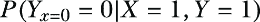
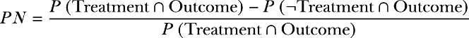
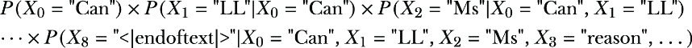
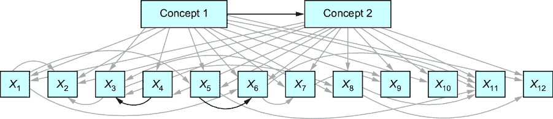
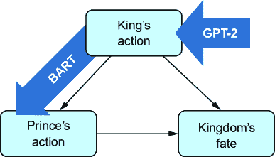
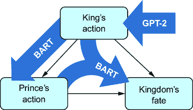
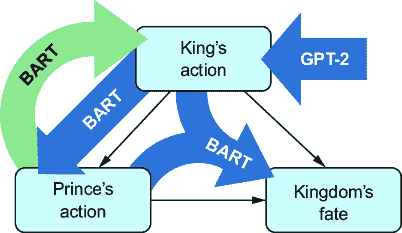

# 第十三章：因果关系与大型语言模型

### 本章涵盖

+   在 LLMs 中使用因果信息来增强因果分析

+   将 LLM 的组件与因果理念相连接

+   构建因果 LLM

大型语言模型（LLMs）在人工智能领域取得了重大进步。这些模型是设计用来生成和理解人类可读文本的大型神经网络。它们之所以被称为“大型”，是因为它们的规模确实令人印象深刻——最前沿的 LLMs 拥有数十亿甚至数万亿的参数。作为生成模型，它们的主要功能是生成连贯且与上下文相关的自然语言。它们还可以生成结构化文本，如编程代码、标记语言、数学符号、数据库查询以及许多其他以文本形式的有用事物。

LLMs（大型语言模型）只是广泛类别的生成式 AI 的一个例子。例如，我们可以使用最前沿 LLM 的神经网络架构来模拟其他序列，如时间序列或 DNA。LLMs 是一种**基础模型**，意味着这些大规模模型作为基础或基石，在此基础上可以构建更专业的模型或应用。一些 LLMs 是多模态的，这意味着它们不仅与文本一起工作，还与其他内容模态一起工作，如图像。在本章中，我们将特别关注 LLMs，但我们讨论的大部分内容可以推广到这些相关概念。

首先，让我们探讨一些使用 LLMs 来增强因果分析用例。

## 13.1 LLMs 作为因果知识库

正如我在本书中多次提到的，在因果建模中，我们不建模数据，我们建模数据生成过程（DGP）。换句话说，因果建模需要关于 DGP 的因果信息，我们可以将其作为假设，这些假设能够使我们识别因果查询。最前沿的 LLMs 是获取和验证这些因果信息的优秀资源。在本节中，我将展示一些使用 LLMs 查询因果信息以增强因果分析的已验证用例。

以下结果来自 OpenAI 的 LLM GPT-4 通过 ChatGPT 界面。由于模型的随机生成，以及 OpenAI 对模型和 ChatGPT 软件的定期更新，你的结果可能会在一定程度上与我有所不同。

### 13.1.1 构建因果 DAG

让我们从使用 LLM 来增强本书中讨论的第一个工作流程开始：构建因果 DAG。以因果 DAG 的形式指定假设可能会令人望而却步。如果你的 DAG 是错误的怎么办？现代 LLMs 作为利用公共专家知识构建 DAG 的一种方式，是无价的。

****您是一位有用的因果分析助手。我对建模吸烟与肺癌之间的关系感兴趣。请提供一个捕捉这种因果关系的因果 DAG。

********当然！有向无环图（DAG）是表示因果关系的有力工具。以下是一个基本的因果 DAG，用于表示吸烟和肺癌之间的关系：

1.  节点：

    +   **S**: 吸烟行为（例如，吸烟者、非吸烟者或吸烟频率）

    +   **LC**: 肺癌（存在或不存在）

1.  有向边：

    +   从**S**到**LC**的有向边表示吸烟行为可以导致或影响肺癌的发生。

1.  可能的混淆因素：

    +   可以将其他节点引入 DAG，以考虑潜在的混淆因素。一些可能的混淆因素可能包括：

        1.  **G**: 遗传学（有肺癌家族史）

        1.  **A**: 年龄（年龄较大可能意味着更高的风险）

        1.  **E**: 环境暴露（如石棉、污染等）

        1.  **O**: 其他健康行为（如饮食、锻炼）

1.  可能的中介变量：

    +   中介变量是原因通过其影响结果的中介变量。

    +   例如，可以假设吸烟可能引起肺损伤，进而导致肺癌。在这种情况下：

        1.  **LD**: 肺损伤

DAG 可能看起来是这样的，包括混淆因素和中介变量：

1.  **S** <- **G** –> **LC**

1.  **S** <- **A** –> **LC**

1.  **S** <- **E** –> **LC**

1.  **S** <- **O** –> **LC**

1.  **S** –> **LC**

1.  **S** –> **LD** –> **LC**

在建模过程中，重要的是：

+   **识别所有可能的混淆因素**以避免结果偏差。**记住，相关性不等于因果关系**。仅仅因为两个节点相关并不意味着一个导致另一个。

+   **与领域专家验证你的 DAG**。他们可以提供你可能没有考虑到的见解。

+   **使用数据**来测试和验证 DAG 中的因果关系，例如，通过控制实验或当实验不可行时，使用工具变量或倾向得分匹配等统计方法。

+   请记住，这是一个简化的吸烟和肺癌之间关系的 DAG。根据你研究的粒度和深度，你可能需要调整和扩展这个框架。

继续下去，我可以提示 LLM 提供潜在的工具变量。

****建议两个合适的工具变量的候选者。请简要回答。

****当然。对于吸烟和肺癌之间的关系，两个可能的工具变量（IVs）可以是：

1.  **烟草税或价格**：如果某些地区或时期烟草价格或税收较高，这可以影响吸烟行为，而不直接影响肺癌率，除非通过减少吸烟的影响。这里的假设是，烟草价格影响肺癌的唯一方式是通过影响吸烟行为。

1.  **反吸烟运动或立法**：某些地区或时间反吸烟运动或立法的介绍或强度可以用作工具变量。如果这些运动或法律是外生决定的（不是基于当前的肺癌率），它们可以影响吸烟率，而不会对肺癌产生直接影响，除非通过其对吸烟行为的影响。

对于两个工具变量，验证两个关键假设的工具有效性至关重要：

1.  工具变量与暴露相关（例如，香烟税影响吸烟行为）。

1.  工具变量只通过其对暴露的影响影响结果（例如，肺癌），而不是通过其他途径。

##### 提示最佳实践

提示前缀“你是一个有用的因果分析助手”是所谓的“系统提示”的一个例子。系统提示提供了关于从 LLM 期望得到的内容的一般背景。系统提示和其他提示工程技术（例如，思维链提示、情境学习）是获得 LLM 良好输出的最佳实践。为了简洁起见，我将使用系统提示，但在此部分省略了一些其他提示工程最佳实践——在实际环境中包含它们是明智的。

以这种方式继续与 LLM 互动，可能通过多个会话，你可以提出一个对你和你的利益相关者有意义的候选 DAG。接下来，你可以提示 LLM 为你提供运行分析的代码。

### 13.1.2 生成 DAG、模型和因果分析的代码

现代 LLM 是在广泛的各种编程语言的代码语料库上训练的。这大大加快了因果分析的速度，尤其是如果你使用的库在训练数据中有代表。例如，我们可以提示 ChatGPT 使用 DoWhy 实现其建议的肺癌 DAG 并估计因果效应。

****请提供使用 Python 中的 DoWhy 库实现你上面建议的因果 DAG 的代码。包括香烟价格作为工具变量，并提供估计因果效应的代码。

****当然！以下是一个使用 Python 中的 DoWhy 库实现吸烟与肺癌之间关系因果 DAG 的基本示例，使用香烟价格作为工具变量。

##### 设置你的环境

本章中的代码是用 DoWhy 版本 0.11、Transformers 版本 4.38.2、Accelerate 版本 0.28.0、pandas 2.0.3、NumPy 1.25.2 和 pyro-ppl (Pyro)版本 1.9.0 编写的。访问章节注释[`www.altdeep.ai/p/causalaibook`](https://www.altdeep.ai/p/causalaibook)以获取包含本章代码的笔记本链接。

Chat GTP 接着生成了以下代码。

##### 表 13.1 ChatGPT 生成的 DoWhy 代码（原文）

```py
import numpy as np
import pandas as pd
import dowhy
from dowhy import CausalModel
from dowhy.datasets import linear_dataset
from dowhy.do_why import CausalModel    #1

# Let's create a sample dataset for illustration purposes
# Normally, you'd import your own dataset: data = pd.read_csv('your_dataset.csv')
n_points = 1000
data = pd.DataFrame({
    "S": np.random.binomial(n=1, p=0.5, size=n_points),     #2
    "LC": np.random.binomial(n=1, p=0.5, size=n_points),    #3
    "Price": np.random.normal(loc=5, scale=1, size=n_points),     #4
})

# Create a causal DAG
model=CausalModel(
        data = data,
        treatment='S',
        outcome='LC',
        common_causes=['G', 'A', 'E', 'O'],  # Potential confounders
        instruments=['Price']  # Instrumental Variable
)

# Identify the causal effect
identified_estimand = model.identify_effect(proceed_when_unidentifiable=True)

# Estimate the causal effect using Instrumental Variable method
estimate = model.estimate_effect(identified_estimand,
                                 method_name="iv.instrumental_variable",
                                 method_params={'iv_instrument_name': 'Price'})

# Print the causal effect estimate
print(estimate)
```

#1 这一行是错误的，但如果你删除它，代码就可以运行。

#2 模拟吸烟状态：0 表示非吸烟者，1 表示吸烟者。

#3 模拟肺癌状态：0 表示无肺癌，1 表示有肺癌。

#4 以 5 美元的平均价格模拟香烟价格。

****这是一个简化的例子。在实际应用中：

1.  你的数据将导入而不是像上面那样模拟。

1.  确保你的 DAG 正确地根据领域知识建模关系。

1.  工具变量背后的假设需要严格检查。

1.  进一步的分析步骤（例如，统计测试，检查稳健性）将是必要的。

当你生成代码时，可能会出现错误。例如，DoWhy 已经经过几次迭代，没有任何东西迫使 LLM 跟上库的最新版本。在这种情况下，`from dowhy.do_why import CausalModel`这一行有错误。没有名为`do_why`的模块，并且`CausalModel`已经在之前的行中导入。我们将在第 13.1.7 节中解决 LLM 产生的错误。现在，如果你删除那一行，代码就可以运行。

ChatGPT 将与我们在书中广泛使用的 pgmpy 和 Pyro 库很好地工作。作为一个练习，我建议你将你在 pgmpy 中构建的一个模型提示 LLM 将其转换为 Pyro 中的模型。

接下来，我们将看看 LLM 能告诉我们关于 DAG 结构之外的内容。

### 13.1.3 解释和机制

DAG 的优势在于，图是一种直观的方式来表示什么导致什么。但它们并没有告诉我们关于导致效应的机制的性质。

结构性因果模型提供了一种数学方法来描述因果关系的潜在机制。在自然科学中，我们有大量的方程描述自然法则，用数学术语描述机制是有意义的。例如，在商业领域，我们缺乏方程，除了近似（广告支出和参与度之间有什么方程？）。

LLM 利用常见和专业知识提供超越 DAG 的机制解释，但形式比正式数学更易于理解。

****你是一个有用的因果解释生成器。提供广告支出与品牌知名度之间因果关系的描述。要简洁到足以适应幻灯片中的单张幻灯片。

****广告支出与品牌知名度之间的因果关系

+   **直接因果关系**：随着广告支出的增加，品牌知名度通常会上升。

    1.  **机制**：更大的广告支出意味着品牌对目标受众的曝光更加频繁和广泛。

+   **收益递减**：在某个点上，额外的广告支出可能不会导致品牌知名度的成比例增加。

    1.  **原因**：市场饱和、广告疲劳或受众覆盖的冗余。

+   **外部因素**：广告效率并不仅仅基于支出。

    1.  **影响因素**：广告质量、位置、目标受众的相关性、竞争和市场条件都可能影响结果。

考虑到可以识别出一些反事实查询，它们对原因和效果之间功能关系的简单分类假设。例如，从干预数据中可以识别出必要性的概率，如果 X 和 Y 之间的关系是单调的，那么从观察数据中部分可识别：

****这是单调关系吗？请将您的答案限制在一句话内。

****是的，广告支出与品牌知名度之间的关系通常是单调的，因为增加广告支出不会降低品牌知名度，尽管增加的速度可能会减缓。

我们不必局限于一个解释；我们可以将 LLM 用作解释假设的生成器。例如，考虑*推论推理任务*，在这些任务中，一个人推断出特定观察到的效应集的可能原因（例如，在科学、刑事调查和医学诊断中）。

为了说明，让我们提出一个源自美国医学执照考试的医疗诊断问题的修改版，用于 ChatGPT。我将要求提出关于观察到的症状原因的多个假设，这就是医生所说的*鉴别诊断*：

****您是一位因果解释助手。您的任务是生成 3 个一句话长的假设，用以解释观察到的现象。这是一个医学诊断示例。

**观察结果**：一位 48 岁的女性出现复视、眼部疼痛、闭经、潮热、体重减轻、心动过速、高血压、湿润的手掌、甲状腺肿大、突出眼睛、眼睑退缩、结膜充血和无法聚视。视力为双眼 20/20。

1.  ****患者可能患有格雷夫斯病，这是一种影响甲状腺的自身免疫性疾病，导致甲状腺功能亢进及其相关症状，包括眼部表现。

1.  2. 女性的症状，包括闭经和潮热，表明可能存在早期更年期或影响其生殖激素的另一种内分泌疾病。

1.  3. 眼部症状，包括复视、眼睑退缩和无法聚视，暗示可能存在甲状腺眼病或眶周肌病。

因果建模的一个挑战是与领域专家合作，将领域假设编码到模型的框架中。这类生成的解释和假设是宝贵的资产，可用于与可能同意或更好地迭代这些生成解释的领域专家沟通。

### 13.1.4 因果框架问题与 AI 对齐

对于一个感兴趣的查询，我们必须决定哪些变量与问题相关。哲学家和人工智能研究员 Clark Glymour 很好地描述了这项任务背后的挑战：“给定大量的东西，以及使用其中一些东西来完成某个任务，对于这个任务来说，什么是相关的？”¹

LLMs 在建立**因果关系框架**方面很有用——选择与因果查询相关的因果变量的问题。在第三章关于构建 DAG 的讨论中，我提到了**因果充分性**作为基于 d-separation 的标准，用于选择包含在 DAG 中的变量。但当我们提示 LLM 提供一个包含与吸烟对肺癌影响相关的变量的 DAG 时，我们高度怀疑 LLM 是否在使用因果充分性来选择这些变量。更有可能的是，它正在使用其训练数据中关于这种关系的常识。这种知识足以提供一组合理的最小相关变量集。

为了说明这种能力的实用性，考虑以下 ChatGPT 交互：

****您是一个有用的因果推理助手。考虑以下故事。

Jake 在一个办公室网络中。服务器上有一个开放的共享文件夹。Jake 正在通过网络传输文件，并意外点击了文件夹，启动了一个消耗大量带宽的过程。这导致网络变慢。Jake 对网络减速有多大的责任？

****基于提供的故事，让我们使用因果推理来分析这种情况：

1.  **直接原因**：Jake 通过意外点击一个文件启动了一个消耗大量带宽的过程。

1.  **影响**：由于消耗了带宽，网络变慢了。

基于这些事实，我们可以确定 Jake 的行为是网络减速的直接原因。

然而，可以从不同的维度来考虑责任：

1.  **意图**：Jake 的行为是意外的。他并没有意图减慢网络。

1.  **预防机制**：故事没有说明在启动这种消耗大量带宽的过程之前是否有任何警告或用户提示。如果没有警告，有人可能会认为系统没有设计来防止这种意外行为。

1.  **知识与培训**：Jake 是否接受了关于传输大文件或关于消耗大量带宽的特定文件的培训或通知？如果没有，他的知识差距导致了这次事故。

1.  **系统设计**：服务器上的开放共享文件夹对 Jake 可访问。如果文件已知是带宽消耗者，那么值得问的是为什么这样的文件会被放在一个没有任何警告或限制的开放共享文件夹中。

直接回答问题：杰克对网络速度减慢负有责任，因为他的行为是直接原因。然而，如果存在系统设计缺陷、缺乏培训或缺乏预防措施，他的责任程度可能会减轻。如果上述提到的其他因素在事件中发挥了作用，那么责任将在杰克和其他因素之间分担。

在这里，响应包括系统设计缺陷、缺乏培训或缺乏预防措施作为与因果关系框架相关的因素，尽管我在提示中并未提及这些因素。

更重要的是，考虑 LLM 可能包括但未包括的许多因素：或许杰克的鼠标出现了物理故障，导致他点击了文件，或许黑客移除了该文件的安全功能，或者任何其他可能的减轻因素。人类可能会排除这些因素，除非明确提及，LLM 也是如此。

如果人类已经擅长建立因果关系框架，我们为什么还要关心 LLM 能否做到这一点呢？考虑从网络日志中进行根本原因分析的问题。假设关于杰克的相同故事被改写成网络日志的形式，如下所示：

```py
Aug 22 14:02:34 User "Jake" logged in from 192.168.0.105.
Aug 22 14:03:12 Shared folder accessed by user "Jake" at //SERVER/shared-folder.
Aug 22 14:03:20 File transfer initiated by "Jake" from local: /home/jake/documents to remote: //SERVER/shared-folder/documents.
Aug 22 14:03:25 WARNING: Unusual network activity detected. User "Jake" launched file "heavy_process.exe" on //SERVER/shared-folder.
Aug 22 14:03:30 Network performance alert: Bandwidth usage spikes at 95%.
Aug 22 14:04:00 Network slowdown detected: Packet loss rate 35%.
```

这对于人类来说比自然语言故事更难解析，即使是经验丰富的网络管理员也是如此。此外，人类可能还需要阅读并忽略与这个叙述无关的许多其他网络事件。但 LLM 在其训练数据中拥有大量的网络日志，从较长的文本中提取相关事件是 LLM 的一项既定能力。

在本书的大部分内容中，我们专注于使用因果关系模型来推断关于世界的客观因果关系，例如吸烟是否导致肺癌。在这个例子中，客观事实，即杰克导致了网络速度减慢，是微不足道的。关于杰克对速度减慢的责任程度是一个高度主观的问题。但回答这个问题仍然很有价值，尤其是如果你试图在一个大型网络日志文件中找到根本原因。

*人工智能对齐*是确保人工智能系统行为与人类目标和偏好一致的任务。在这里，我们希望实现一种特定类型的人工智能对齐。我们希望 LLM 不仅确认明显的因果关系事实，还与人类倾向于做出的因果关系判断相一致。在这种情况下，我向 LLM 提出了关于杰克责任的一个开放式问题，它给出了许多人类都会同意的回应。我也可以指示 LLM 在生成判断时遵循某些标准。例如，律师可以提示 LLM 在生成法律意见时应用某些法律理论和案例法。

接下来，我们将探讨如何使用 LLM 来理解和情境化更细微的因果关系概念。

### 13.1.5 理解和情境化因果关系概念

理解正式的因果概念并在你的领域内应用它们可能会具有挑战性。LLM 可以作为解释和情境化这些概念的工具。让我们以*必要因果关系*的反事实概念为例进行说明。

****你是一位有益的因果推理主题解释者。请提供一段关于必要因果关系的概念解释。

****当然！必要因果关系指的是一种因果关系，其中原因的存在是结果发生的必要条件。换句话说，如果没有原因的存在，结果就不会发生。然而，原因的存在并不保证结果会发生，因为可能还有其他条件需要满足。把它想象成一把钥匙开一把锁：钥匙（原因）是打开锁（结果）的必要条件，但仅仅拥有钥匙并不意味着锁会自动打开；你仍然需要插入并转动它。如果锁没有钥匙仍然锁着，那么钥匙就是解锁的必要原因。

一个前沿的 LLM 会在跨领域的各种理论和研究中进行训练。将一个想法置于各种领域中进行情境化可能是有用的。

****在一句话中，解释在法律理论中如何概念化必要因果关系。

****在法律理论中，必要因果关系，通常被称为“若无因果关系”，是一个用于建立被告行为与原告所受损害之间直接联系的基础性概念。一个行为要成为导致结果的“若无”原因，如果没有这个行为，结果就不会发生。换句话说，如果可以说“若非被告的行为，损害就不会发生”，那么必要因果关系就成立了。然而，值得注意的是，尽管“若无”因果关系在许多法律情境中是一个关键组成部分，但它本身并不总是足以确立责任。其他因素，如可预见性和近因，通常也会发挥作用，以确定法律责任的全部范围。

****从认知科学的角度来看，用一句话简要说明必要因果关系在人类判断中的作用。

****从认知科学的角度来看，必然因果关系在人类的判断和决策中起着至关重要的作用。我们的大脑被设计成在环境中寻找模式和因果关系，以预测和导航未来的事件。当我们把一个事件视为另一个事件的必然原因时，它通过在两个事件之间建立决定性的联系，简化了我们的认知处理。这意味着当我们遇到原因时，我们可以预测结果，从而允许更有效的规划和反应。然而，这种倾向也可能导致认知偏差，我们可能会错误地将一个效果归因于一个感知到的必然原因，即使其他影响因素也在发挥作用。

****从哲学的角度来看，用一句话解释康德和休谟在关于必然因果关系的信仰上的不同。

****康德相信先验综合知识的存在，并认为我们的心灵在我们的经验上强加因果秩序，而休谟则认为因果关系不是世界本身的特征，而是基于事件规律性连续性的思维习惯。

现在我们已经解构了必然因果关系的概念，让我们将其应用到我们感兴趣领域的一个实际问题中。假设你是 Netflix 的一名数据科学家：

****给我一个涉及 Netflix 用户取消订阅的必然因果关系的例子。

****一个 Netflix 用户取消订阅的可能必然原因是该平台上仅有的独家内容。如果用户深感兴趣的一部特定剧集或电影从 Netflix 上被移除，而该内容在其他地方仍然可用，那么该内容的移除就成为了该用户决定取消订阅的必然原因。如果没有该内容的移除，用户可能不会取消订阅。

现在 LLM 已经帮助我们理解了必然因果关系，我们可以请它帮助我们形式化这个概念。

### 13.1.6 因果查询的形式化

对于人类来说，自然语言是我们因果推理的媒介。但我们需要将这种自然语言转换为形式术语，以便我们可以应用数学和算法分析。这可能是一个挑战。幸运的是，LLM 在这方面可以提供极大的帮助。

例如，在第八章中，我介绍了几个平行世界反事实语言的例子以及如何将它们转换为反事实符号。必然因果关系，更具体地说，是*必然性的概率*，是这些反事实之一。让我们将这个任务放在我们的 Netflix 环境中交给 LLM：

****您是一位有用的因果推断助手。我在 Netflix 的背景下考虑一个反事实推断问题。我有一个以下查询：“有一组用户在平台上的内容被删除后取消了订阅。给定这个用户组中的某个成员，如果内容未被删除，他们不会取消订阅的概率是多少？”请使用 Pearl 的反事实符号将此查询写成概率表达式。

****当然！Pearl 的反事实符号提供了一种简洁的方式来表达此类查询。

让我们定义一些变量：

1.  *X* = 内容的删除（二元变量，删除为 1，未删除为 0）。

1.  *Y* = 用户是否取消订阅（二元变量，用户取消订阅为 1，未取消订阅为 0）。

您的查询实际上是在询问，在内容被删除且用户确实取消订阅的情况下，如果内容未被删除，用户不会订阅的概率。

使用 Pearl 的反事实符号，这可以写成：



其中：

+   *Y*[*x*][=0] 是在 *X* 被设置为 0（即内容未被删除）时 *Y* 的反事实结果。

+   *X*=1 表示内容已被删除。

+   *Y*=1 表示用户已取消订阅。

因此，*P*(*Y**[x=]*[0] = 0| *X* = 1, *Y* = 1) 是在内容被删除且用户确实取消订阅的情况下，如果内容未被删除，用户不会取消订阅的概率。

大型语言模型可以将我们从概念化带到形式化。但请注意，它也可能“产生幻觉”。

### 13.1.7 小心：LLM 可能产生幻觉

我们已经看到，大型语言模型（LLM）可以帮助生成代码。让我们请求实现必要性概率的代码。

****提供 Python 代码，对于给定的处理变量和结果变量对，计算反事实查询“必要性概率”。

****必要性概率（PN）是指在处理存在的情况下，并且只有在处理存在时才实现结果的情况的比例。简单来说，它表示结果发生是因为处理。

根据这个定义，你可以使用以下公式计算 PN：



其中：

+   *P*(*Treatment*∩*Outcome*) 是处理和结果同时发生的概率。

+   *P*(¬*Treatment*∩*Outcome*) 是结果发生但处理未发生的概率。

响应继续提供格式良好、注释清晰且可编译的 Python 代码。*但这个答案是错误的*。这通常被称为“幻觉”，一个令人信服的谎言。这个例子尤其令人信服——该公式仅在治疗与结果之间的关系是单调的、没有混杂因素，以及*P*(*治疗*) = *P*(*结果*)时才成立。这些假设如此强烈，以至于我们无法原谅 ChatGPT 没有提及它们。模型的其他生成结果甚至更加偏离正确方向。

我们可以使用 LLM 来增强我们的因果分析，特别是利用常见和专家因果知识以及生成的代码。但幻觉意味着这并不是万能的。我们需要依赖我们自己的因果专业知识来识别何时发生幻觉，并理解何时它威胁到我们分析的质量。

要理解这种幻觉发生的原因，让我们首先考察 LLMs 是如何工作的。

## 13.2 因果主题的 LLM 入门

要了解如何部署 LLMs 进行因果应用，了解它们的工作原理以及它们的局限性非常重要。本节提供了一个关于核心思想的因果主题快速高级概述。

### 13.2.1 LLMs 的概率机器学习视角

在 LLMs（大型语言模型）的背景下，“token”指的是模型读取的字符序列，它可以短至一个字符，也可以长至一个单词。Token 是输入文本被分割成模型可以管理的片段的单位。

Hugging Face 的 Transformers 库有一个公开可用的 GPT-2 版本，它远不如最前沿的模型，但具有类似的*Transformer*架构。Transformer 架构是一种深度学习模型，旨在通过关注句子中词语之间的关系（而不考虑它们的位置）来处理和理解文本以及其他序列数据。让我们分词表达式“LLMs 能否进行反事实推理？”

##### 列表 13.2 查看 LLM 操作的示例 token

```py
from transformers import GPT2Tokenizer
tokenizer = GPT2Tokenizer.from_pretrained('gpt2')   #1
tokens = tokenizer.tokenize("Can LLMs reason counterfactually?")    #2
print(tokens)     #3
```

#1 初始化 GPT-2 分词器。

#2 分词序列。

#3 打印出 token。

这将打印出以下 token：

```py
['Can', 'ĠLL', 'Ms', 'Ġreason', 'Ġcounter', 'fact', 'ually', '?']
```

“Ġ”对应于一个空格。请注意，标点符号也是 token，像“counterfactual”这样的单词被分割成多个 token。每个 token 对应于一个整数，该整数索引了在大型“词汇表”中的 token。GPT-2 的词汇表大小为 50,257。

##### 列表 13.3 将 token 转换为整数

```py
input_ids = tokenizer.encode(     #1
    "Can LLMs reason counterfactually?",    #1
    return_tensors='pt'    #1
)   #1
print(input_ids)
```

#1 “编码”token 为整数，这些整数在称为“词汇表”的 token 列表中索引 token。

这将 token*编码*为一个整数序列：

```py
tensor([[ 6090, 27140, 10128,  1738,  3753, 22584,   935,    30]])
```

Transformer 架构与这些数值值一起工作。

LLMs 在 token 序列上定义了一个联合概率分布。对于短语“LLMs 能否进行反事实推理？”模型定义了一个概率分布：


模型还将考虑这种序列以问号结束而不是继续下去的可能性。为此，LLM 的词汇表中包含一个特殊标记来标记序列的结束。对于 GPT-2，这个标记是 `<|endoftext|>`：


此外，自回归语言模型（LLM），如 GPT 和 Llama 系列的 Transformer 模型，按照文本序列的顺序对文本进行建模，因此它们将这个联合概率分解如下：



我们可以使用 Transformers 库在对数尺度上计算这些概率中的每一个。在生成对数概率时，我们首先计算词汇表中的每个术语的 *logits*。对于概率值 *p*，相应的 logits 是 log(*p* / (1–*p*))。

##### 列表 13.4 计算序列中每个标记的对数概率

```py
import torch
from transformers import GPT2LMHeadModel

model = GPT2LMHeadModel.from_pretrained('gpt2-medium')    #1
model.eval()    #1

input_text = "Can LLMs reason counterfactually?<|endoftext|>"     #2
input_ids = tokenizer.encode(input_text, return_tensors='pt')    #2

with torch.no_grad():    #3
    outputs = model(input_ids)    #3
    logits = outputs.logits    #3

log_probs = torch.nn.functional.log_softmax(logits, dim=-1)     #4
for idx, token in enumerate(input_ids[0]):    #4
    token_log_prob = log_probs[0][idx][token].item()    #4
    print(f"Token: {tokenizer.decode(token)}" + #4
           " | Log Probability: {token_log_prob}")     #4
```

#1 初始化 GPT-2 模型并将其设置为评估模式。

#2 将短语分词并编码，包括序列结束标记。

#3 给定短语，模型为词汇表中的每个元素生成 logits。

#4 对于序列中的每个位置，获取对应于实际出现在该位置的标记的对数概率。

这将打印以下输出：

```py
Token: Can | Log Probability: -10.451835632324219
Token:  LL | Log Probability: -9.275650978088379
Token: Ms | Log Probability: -14.926365852355957
Token:  reason | Log Probability: -10.416162490844727
Token:  counter | Log Probability: -8.359155654907227
Token: fact | Log Probability: -22.62082290649414
Token: ually | Log Probability: -11.302435874938965
Token: ? | Log Probability: -10.131906509399414
Token: <|endoftext|> | Log Probability: -11.475025177001953
```

将这些相加提供了模型下序列的联合概率。

当然，作为生成模型，GPT-2 可以根据前面的标记生成下一个标记。用户提供的 *prompt* 是序列的开始，模型的响应扩展了序列。

##### 列表 13.5 从 LLM 生成

```py
prompt = "Counterfactual reasoning would enable AI to"     #1
input_ids = tokenizer.encode(prompt, return_tensors='pt')    #1

output = model.generate(    #2
    input_ids,     #2
    max_length=25,    #2
    do_sample=True,    #2
    pad_token_id=tokenizer.eos_token_id     #2
)

generated_text = tokenizer.decode(output[0], skip_special_tokens=True)    #3
print(generated_text)   #3
```

#1 指定并编码提示。

#2 从模型生成。参数“do_sample=True”表示我们在给定所有前面的标记的情况下，从下一个标记的概率分布中进行随机选择。

#3 解码并打印输出。

这将打印出以下内容：

```py
Counterfactual reasoning would enable AI to figure out what people want before they ask them. It would also enable self-awareness
```

再次注意，ChatGPT 的生成具有随机性，因此这可能会产生不同的结果。

##### 关于混淆术语的说明

类似于 GPT 模型的模型通常被称为“因果语言模型”，但它们并不是本书中讨论的那种因果模型。它们不是 DGP 的因果模型。“因果”在这里指的是模型的自回归性质——模型仅根据前面的标记来评估序列中标记的概率。

所有这些都意味着 LLM 在基本层面上是一个标记序列的联合概率模型。这些模型的典型训练程序试图拟合标记的联合概率分布。像 GPT 这样的模型优化了在训练文档中根据前面的标记预测给定标记的能力。理解 LLM 是一个标记的概率模型并不能解释为什么 LLM 可以生成 *连贯* 的文本（即具有逻辑和一致思想相互关系、形成可理解整体的文本）。为此，我们需要理解 *注意力*。

### 13.2.2 注意力机制

LLMs（大型语言模型）成功的主要驱动力之一是使用*Transformer 架构*和其他依赖称为*注意力机制*的神经网络架构。注意力机制允许模型对输入序列的不同部分赋予不同的重要性。这使得模型能够学习“聚焦”于与特定任务更相关的序列的特定部分，同时“忽略”或赋予不太相关的部分较小的权重。

以以下关于树叶是火灾必要原因的条件反事实陈述为例：

> 劳动节周末的森林大火始于森林，由于地面上干燥的树叶而迅速蔓延。如果进行了可控燃烧，火势就不会如此迅速地蔓延。

注意力机制帮助模型认识到“leaves”指的是树叶，而不是离开，通过权衡周围词语如“ground”、“dry”和“forest”的相关性。

现代 LLMs 在许多神经网络层上堆叠了注意力机制。这使得 LLM 能够关注不同粒度级别上的概念。例如，注意力的第一层关注的是直接的词与词之间的关系，如“leaves”与“ground”，而接下来的几层则连接更广泛的短语，将“劳动节周末的森林大火”视为一个与短语“迅速蔓延”相连的单一实体。

后续层可以表示句子的主题或主题以及更广泛文本的更广泛主题，将“劳动节周末的森林大火”与有关其蔓延的信息联系起来。

### 13.2.3 从标记符到因果表示

从因果关系的角度来看，关于注意力如何使 LLM 学习高级抽象的能力对我们来说变得有趣。回想一下图 13.1，它首次出现在第五章（如图 5.4）。


##### 图 13.1 来自第五章的示例，其中*digit*和*is-handwritten*是低级*X**[i]*像素的高级因果驱动因素

小方块代表图像中的像素，而*digit*和*is-handwritten*方块分别代表图像中描绘的数字以及它是否是手写的。在那个例子（第 5.1.2 节）中，我建议个体像素之间存在的任何因果关系对我们来说并不重要；我们感兴趣的是在图像中描绘的物体层面上进行推理。

与此类似的情况也发生在标记符上，如图 13.2 所示。



##### 图 13.2 *X*[1]至*X*[12]是一系列标记符。标记符之间存在的任何结构（因果或其他）对我们来说都是短暂的兴趣。我们感兴趣的是由标记符描述的概念之间的因果关系。

在图 13.2 中，与像素一样，在标记级别存在一些结构。但这个结构与问题无关——我们感兴趣的是构成标记背后意义的概念之间的因果关系。

问题变成了，在什么情况下，注意力，只要它能学习高级表示，能够学习一个*因果*表示。例如，一个基于注意力的模型，可能在某些架构或学习约束下，或者在训练数据中使用干预措施，能够学习劳动节反事实陈述中的并行世界结构和抽象？

为了考虑这一点，我们可以回顾 LLM 的幻觉问题，并将其与因果识别联系起来。

### 13.2.4 幻觉、注意力和因果识别

关于必要性的概率的幻觉是由 GPT-4 生成的。同样的模型在 Netflix 关于必要性的概率问题上也给出了正确的答案。事实上，如果幻觉的答案仅仅陈述了正确的识别假设，那么这个答案就是正确的。我相信 GPT 和类似模型未来的版本可能会在第一次尝试时就正确回答这个问题。

但对于不熟悉必要性概率定义的人来说，他们如何知道模型是正确的还是产生了幻觉？首先，因果层次告诉我们，为了能够生成一个超出随机猜测的正确答案，查询需要与第 3 级信息相对应。也许这些信息是由用户在提示中提供的。也许 LLM 以某种方式学习了第 3 级表示（这样的主张需要硬性证据）。

如果用户在提示中提供了那个识别信息，用户如何知道模型是否成功使用了这些信息来响应提示？假设识别的要求存在并且被隐藏在学习的表示或数据中，并且模型在回答因果查询时成功地利用了这些信息，用户如何确信这种情况发生了？

我们需要设计解决方案来回答这些问题和其他期望，以构建向因果 AI 未来的发展。在下一节中，我们将从这个简单的因果 LLM 开始。

## 13.3 打造你自己的因果 LLM

在本节中，我们将绕过“最前沿的 LLM 能否进行因果推理？”这个问题，转而构建一个能够进行因果推理的因果 LLM。我们将从零开始构建因果性，而不是作为事后考虑。

### 13.3.1 用于脚本编写的 LLM

我们的数据通常具有一些隐含的因果结构。当我们将这种结构在训练中明确化时，基础模型可以学习更好的因果表示。

为了说明，假设一个历史悠久的电影制作工作室一直坚持要求他们的编剧使用需要遵循三幕叙事原型的剧本编写软件，这在浪漫喜剧中很常见：“男孩遇见女孩，男孩失去女孩，男孩找回女孩。”对于这个原型，他们有一系列许多剧本。在因果术语中，第一幕的事件导致第二幕的事件，第一幕和第二幕的事件导致第三幕的事件。我们可以在图 13.3 中绘制 DAG。


##### 图 13.3 三幕原型的因果有向图

工作室与许多这样的原型一起工作，公司有许多遵循特定原型模板的剧本。假设一组原型涉及国王在第一幕中以某种方式行事，王子在第二幕中以某种方式行事，这两者在第三幕中对王国产生影响。例如，一个可能的原型是“国王宣战，王子领导军队，王国繁荣”。但每个幕都有多种结果：

+   第一幕中的国王：{国王宣战；国王谈判和平；国王生病}

+   第二幕中的王子：{王子领导军队；王子退位；王子与外国人结婚}

+   第三幕中的王国：{王国赢得战斗；王国陷入贫困；王国繁荣}


##### 图 13.4 表示各种国王-王子-王国原型的因果有向图

图 13.4 以因果有向图的形式显示了这种原型空间。

这只描述了 3 × 3 × 3 = 27 种可能的原型，但正如你所预期的，一些原型更常见，而一些原型则不太常见。我们可以很容易地通过在 pgmpy 或 Pyro 中显式编码因果马尔可夫核来对这些原型和联合概率分布进行建模。但这将只是一种基于原型的因果生成模型。如果我们想要一个剧本生成器，我们想要一个基于剧本的因果生成模型。 

为了展示这个想法的证明概念，我们将使用短故事片段的训练数据集，而不是完整的剧本。让我们加载并检查训练数据。

##### 列表 13.6 加载因果叙事数据

```py
import pandas as pd
url = ("https://raw.githubusercontent.com/altdeep/"
       "causalML/master/book/chapter%2013/"
       "king-prince-kingdom-updated.csv")
df = pd.read_csv(url)
print(df.shape[0])    #1

print(df["King"][0] + "\n")     #2
print(df["King"][1] + "\n")     #2
print(df["King"][2])     #2

print("----")
print(df["Prince"][0] + "\n")     #3
print(df["Prince"][1] + "\n")     #3
print(df["Prince"][2])    #3

print("----")
print(df["Kingdom"][0] + "\n")    #4
print(df["Kingdom"][1] + "\n")     #4
print(df["Kingdom"][2])     #4
```

#1 数据包含 21,000 个故事，分为三个简短的故事片段。

#2 首先，国王采取行动。

#3 然后王子采取行动。

#4 最后，王国经历了皇室行动的后果。

此代码打印以下内容：

```py
21000
----
King brokers a peace treaty with a rival kingdom, putting an end to years of bloody conflict

A wise king successfully negotiates peace with a rival nation

A wise king successfully negotiates peace between his kingdom and a long-time enemy
----
however, his son, the Prince, falls in love and marries a foreigner, causing political unrest

Prince falls in love with and marries a foreign princess, forging a strong alliance

but when a new threat emerges, the Prince leads the army to defend their realm
----
despite efforts, the ongoing war results in both kingdoms falling into poverty."

the alliance strengthens their forces, leading the kingdom to a victorious battle."

however, a series of misfortunes and disastrous decisions plunge their once prosperous kingdom into poverty."
```

有 21,000 组三个故事片段。前面的输出显示了数据集中的前三个组。

### 13.3.2 使用预训练模型进行因果马尔可夫核

为了训练我们 DAG 中每个节点的因果马尔可夫核，我们将从 Hugging Face Transformers 库中获取预训练模型，然后进一步使用我们的故事片段进行训练（也称为“微调”）。预训练处理了学习生成连贯自然语言文本的重活。微调将使模型朝着表示我们的因果马尔可夫核的方向调整。

首先，我们将使用 GPT-2 的一个变体来模拟国王的行动片段。作为一个文本补全模型，它通常接受一个提示作为输入，但我们将训练它使用空提示生成片段，并根据训练数据中国王行动文本的边缘概率生成片段，如图 13.5 所示。


##### 图 13.5 GPT-2 经过微调，以表示国王行动片段的分布。

接下来，我们将使用 BART 模型来模拟王子行动的因果马尔可夫核。BART 是 2019 年发布的一个 Transformer 模型，专门设计用来接受一个输入序列并生成相应的输出序列，例如翻译或摘要。像 GPT-4 这样的大型模型可以很好地处理序列到序列的任务，但我们将使用一个参数数量大约比 GPT-4 少 4000 倍的 BART 版本，这使得它在您的笔记本电脑或基本的 Python 开发环境中加载和训练变得更加容易。给定国王的行动片段作为输入，它将生成一个王子的行动片段，如图 13.6 所示。

我们还将使用 BART 模型来模拟王国命运的因果马尔可夫核，如图 13.7 所示。该模型将国王和王子行动映射到王国的命运。



##### 图 13.6 一个 BART 序列到序列模型经过微调，以表示在国王行动的情况下王子的行动。



##### 图 13.7 一个 BART 序列到序列模型也用于模拟在国王行动和王子行动的情况下王国的命运。

提前跳过，我们感兴趣的是在王子采取特定行动的情况下，王国命运的条件概率分布。由于这需要根据王子的行动推断国王的行动，因此我们还将额外训练一个 BART 模型，该模型根据王子的行动片段生成国王的行动片段，如图 13.8 所示。



##### 图 13.8 一个 BART 序列到序列模型也经过微调，以模拟国王和王子行动情况下的王国命运。

让我们运行训练过程。首先，我们将设置我们的导入和分词器。我们将使用 Bart 作为我们所有模型的分词器。

##### 列表 13.7 训练因果 LLM

```py
import torch
from sklearn.model_selection import train_test_split
from torch.utils.data import Dataset
from transformers import (
    AutoModelForCausalLM, AutoModelForSeq2SeqLM,
    AutoTokenizer, DataCollatorForLanguageModeling,
    Seq2SeqTrainer, Seq2SeqTrainingArguments,
    Trainer, TrainingArguments)
url = ("https://raw.githubusercontent.com/altdeep/"
       "causalML/master/book/chapter%2013/"
       "king-prince-kingdom-updated.csv")
df = pd.read_csv(url)

tokenizer = AutoTokenizer.from_pretrained("facebook/bart-base")     #1
tokenizer.pad_token = tokenizer.eos_token    #2
def tokenize_phrases(phrases, max_length=40):  #3
    return tokenizer(
        phrases,
        truncation=True,
        padding='max_length',
        max_length=max_length
    )
```

#1 设置分词器。

#2 使用填充标记（pad token）使所有序列具有相同的长度，以便进行矩阵运算。通常将其设置为“序列结束（EOS）”标记。

#3 将标记的最大长度设置为 40，因为所有的片段都少于 40 个标记。

接下来，我们将创建一个类和一个函数来分词国王数据集。我们将创建一个名为`ModelDataset`的 PyTorch `Dataset`类的自定义子类，该子类将存储标记编码及其对应的标签。当通过索引访问时，它返回一个包含该索引的标记编码及其相关标签的字典，并通过其`__len__`方法提供示例总数。

##### 列表 13.8 对 King 片段进行分词

```py
class ModelDataset(Dataset):    #1
    def __init__(self, encodings, labels):   #1
        self.encodings = encodings    #1
        self.labels = labels    #1
        #1
    def __getitem__(self, idx):   #1
        item = {    #A    #1
            key: torch.tensor(val[idx])    #1
            for key, val in self.encodings.items()    #1
        }    #A   #1
        item['labels'] = torch.tensor(self.labels[idx])    #1
        return item     #1
        #1
    def __len__(self):   #1
        return len(self.encodings.input_ids)   #1

def create_king_dataset(input_phrases):     #2
    king_phrases = input_phrases.tolist()   #2
    king_encodings = tokenize_phrases(king_phrases)    #2
    king_dataset = ModelDataset(    #2
        king_encodings,   #2
        king_encodings['input_ids']) #2
    return king_dataset    #2
```

#1 当通过索引访问时，ModelDataset 返回一个包含该索引的标记编码及其相关标签的字典。

#2 为 King 片段创建一个 ModelDataset 实例。

接下来，我们将对 Prince 和 Kingdom 的片段进行分词。此代码还将生成用于训练序列到序列模型的验证数据集。

##### 列表 13.9 对 Prince 和 Kingdom 片段进行分词

```py
def create_seq2seq_datasets(input_phrases, target_phrases):
    input_phrases_list = input_phrases.tolist()
    target_phrases_list = target_phrases.tolist()
    spit = train_test_split(     #1
        input_phrases_list,     #1
        target_phrases_list,    #1
        test_size=0.1    #1
    )    #1
    train_inputs, val_inputs, train_targets, val_targets = spit     #1
    train_input_encodings = tokenize_phrases(train_inputs)    #2
    val_input_encodings = tokenize_phrases(val_inputs)    #2
    train_target_encodings = tokenize_phrases(train_targets)    #2
    val_target_encodings = tokenize_phrases(val_targets)     #2
    train_dataset = ModelDataset(
        train_input_encodings, train_target_encodings['input_ids']
    )
    val_dataset = ModelDataset(
        val_input_encodings, val_target_encodings['input_ids']
    )
    return train_dataset, val_dataset
```

#1 将输入和目标短语分割成训练集和验证集。

#2 对训练集和验证集进行编码。

接下来，我们将编写 King 模型的训练算法。此函数使用指定的参数初始化 GPT-2 模型，设置训练参数，并在提供的数据集上训练模型，最后将训练好的模型保存到指定的目录。

##### 列表 13.10 训练 King 模型

```py
def train_king_model(output_dir, train_dataset,
                     model_name="gpt2-medium", epochs=4):
    king_model = AutoModelForCausalLM.from_pretrained(model_name)     #1
    training_args_king = TrainingArguments(     #1
      output_dir=output_dir,    #1
      per_device_train_batch_size=32,     #1
      overwrite_output_dir=True,     #1
      num_train_epochs=epochs,     #1
      save_total_limit=1,    #1
      save_steps=len(train_dataset) // 16, #1
      max_grad_norm=1.0 #1
    )    #1
    data_collator = DataCollatorForLanguageModeling(    #1
        tokenizer=tokenizer,     #1
        mlm=False)    #1
    trainer_king = Trainer(     #2
        model=king_model,     #2
        args=training_args_king,     #2
        data_collator=data_collator,    #2
        train_dataset=train_dataset,     #2
    )     #2
    trainer_king.train()   #3
    king_model.save_pretrained(output_dir)
    return king_model
```

#1 使用指定的参数初始化和配置模型。

#2 配置训练设置。

#3 训练模型。

接下来，我们将编写序列到序列模型的训练算法。该函数将提供的输入和目标短语分割成训练集和验证集，对它们进行分词，然后使用`ModelDataset`类创建并返回两个集合的 PyTorch `Dataset`对象。`train_seq2seq_model`函数使用指定的参数初始化序列到序列模型，配置其训练设置，然后使用训练集和验证数据集训练模型，最后返回训练好的模型。

##### 列表 13.11 训练序列到序列模型的函数

```py
def train_seq2seq_model(output_dir, train_dataset, val_dataset,
                        model_name="facebook/bart-base",
                        epochs=4):
    model = AutoModelForSeq2SeqLM.from_pretrained(model_name)
    training_args = Seq2SeqTrainingArguments(     #1
        output_dir=output_dir,     #1
        per_device_train_batch_size=16,     #1
        predict_with_generate=True,    #1
        logging_dir=f"{output_dir}/logs",     #1
        save_total_limit=1,    #1
        save_steps=len(train_dataset) // 16,     #1
        learning_rate=3e-5,     #1
        num_train_epochs=epochs,    #1
        warmup_steps=500,   #1
        weight_decay=0.01,     #1
    )    #1
    trainer = Seq2SeqTrainer(     #2
        model=model,    #2
        args=training_args,   #2
        train_dataset=train_dataset,     #2
        eval_dataset=val_dataset,    #2
    )     #2
    trainer.train()     #3
    model.save_pretrained(output_dir)
    return model
```

#1 使用指定的参数初始化和配置序列到序列模型。

#2 配置训练设置。

#3 使用训练集和验证数据集训练模型，最后返回训练好的模型。

现在我们将使用此函数来训练模型。我们将指定一些用于保存检查点的目录。

注意：在列表 13.14 中，我将提供从 Hugging Face 下载预训练模型的代码，所以如果你不想训练模型，可以跳过此步骤。

##### 列表 13.12 训练 King、Prince 和 Kingdom 模型

```py
import os

king_model_path = os.path.join(os.getcwd(), 'king_model')     #1
prince_model_path = os.path.join(os.getcwd(), 'prince_model')     #1
kingdom_model_path = os.path.join(os.getcwd(), 'kingdom_model')     #1
prince2king_model_path = os.path.join(     #1
    os.getcwd(), 'prince2king_model')     #1

king_dataset = create_king_dataset(df["King"])     #2
king_model = train_king_model(king_model_path, king_dataset)     #2

datasets = create_seq2seq_datasets(df["King"], df["Prince"])    #3
train_dataset_prince, val_dataset_prince = datasets #3
prince_model = train_seq2seq_model(    #3
    prince_model_path,     #3
    train_dataset_prince,     #3
    val_dataset_prince, #3
    epochs=6   #3
)    #3

king_and_prince = [f"{k} {p}" for k, p in zip(df["King"], df["Prince"])]     #4
df["King and Prince"] = king_and_prince    #4
train_dataset_kingdom, val_dataset_kingdom = create_seq2seq_datasets(    #4
    df["King and Prince"], df["Kingdom"]    #4
)    #4
kingdom_model = train_seq2seq_model(    #4
    kingdom_model_path,    #4
    train_dataset_kingdom,     #4
    val_dataset_kingdom,     #4
   epochs=6    #4
)  #4
```

#1 提供你想要保存模型的输出目录。

#2 使用 Seq2Seq 训练 King 模型。

#3 使用 Seq2Seq 训练 Prince 模型。King 片段用于预测 Prince 片段。

#4 使用 Seq2Seq 训练 Prince 模型。King 片段用于预测 Prince 片段。

#5 使用 Seq2Seq 训练 Kingdom 模型。结合 King 和 Prince 的片段用于预测 Kingdom 片段。

最后，我们将训练另一个模型，用于根据 Prince 片段推断 King 片段。我们将在推理阶段使用这个模型。

##### 列表 13.13 用于训练 Prince 到 King 模型的函数

```py
p2k_data = create_seq2seq_datasets(    
    df["Prince"], df["King"])    
train_dataset_prince2king, val_dataset_prince2king = p2k_data    
prince2king_model = train_seq2seq_model(    
    prince2king_model_path,    
    train_dataset_prince2king,    
    val_dataset_prince2king,    
    epochs=6    
)
```

运行前面的训练过程将需要一些时间，尤其是如果你没有使用 GPU。幸运的是，Hugging Face Hub 中有训练好的模型的保存版本。以下代码从 Hugging Face Hub 获取 Transformer 模型并从中生成。它还提供了一个计算每个生成序列对数概率的函数。

##### 列表 13.14 从 Hugging Face Hub 获取 Transformer 模型并生成

```py
import matplotlib.pyplot as plt
import pandas as pd
import torch
from sklearn.feature_extraction.text import TfidfVectorizer
from transformers import (
    AutoModelForCausalLM, AutoModelForSeq2SeqLM,
    AutoTokenizer, GPT2LMHeadModel,
    PreTrainedModel, BartForConditionalGeneration)
DEVICE = torch.device("cuda" if torch.cuda.is_available() else "cpu")

king_model = AutoModelForCausalLM.from_pretrained(     #1
    "osazuwa/causalLLM-king").to(DEVICE)    #1
prince_model = AutoModelForSeq2SeqLM.from_pretrained(    #1
    "osazuwa/causalLLM-prince").to(DEVICE)    #1
kingdom_model = AutoModelForSeq2SeqLM.from_pretrained(    #1
    "osazuwa/causalLLM-kingdom").to(DEVICE)     #1
prince2king_model = AutoModelForSeq2SeqLM.from_pretrained(     #1
    "osazuwa/causalLLM-prince2king").to(DEVICE)     #1

tokenizer = AutoTokenizer.from_pretrained("facebook/bart-base")    #2
tokenizer.pad_token = tokenizer.eos_token  #2
```

#1 加载我们模型的组件。

#2 加载我们模型的组件。

#3 加载 Bart-base 分词器，并将填充标记设置为序列结束标记。

接下来，我们将编写一些函数来编码文本为标记，解码标记为文本，以及根据输入文本从模型生成文本。

##### 列表 13.15 编码、解码和生成辅助函数

```py
def encode(text:str, device=DEVICE) -> torch.tensor:    #1
    input_ids = tokenizer.encode(text, return_tensors="pt")   #1
    input_ids = input_ids.to(device)    #1
    return input_ids   #1

def decode(text_ids: torch.tensor) -> str:    #2
    output = tokenizer.decode(text_ids, skip_special_tokens=True)     #2
    return output     #2

EMPTY_TEXT = torch.tensor(tokenizer.encode("")).unsqueeze(0).to(DEVICE)   #3

def generate_from_model(model: PreTrainedModel,     #4
                        input_sequence: torch.tensor = EMPTY_TEXT,   #4
                        max_length: int = 25,    #4
                        temperature=1.0):   #4
    output = model.generate(    #4
        input_sequence,    #4
        max_length=max_length,    #4
        do_sample=True,   #4
        pad_token_id=tokenizer.pad_token_id, #4
        eos_token_id=tokenizer.pad_token_id,   #4
        temperature=temperature,   #4
        top_p=0.9,   #4
    )   #4
    return output    #4

def convert_to_text(output):
    return decode(output[0]).strip().capitalize()
```

#1 将文本编码成张量。

#2 将张量解码为文本。

#3 获取空文本的编码，以便于使用。

#4 一个从模型生成内容的函数。这些参数对于 GPT-2 和 BART 模型来说执行不同的功能，但它们大致上是重叠的。

我们希望使用我们的概率机器学习方法，因此我们需要一种计算生成序列对数概率的方法，这样我们就可以在推理中使用这些值。以下函数基于 GPT-2 和 BART 模型产生的相关值计算生成序列的对数概率。

##### 列表 13.16 计算生成序列的对数概率

```py
def compute_log_probs(model, output_sequence):
    if isinstance(model, GPT2LMHeadModel):     #1
        outputs = model(     #1
            input_ids=output_sequence,     #1
            labels=output_sequence    #1
        )     #1
        log_softmax = torch.nn.functional.log_softmax(     #1
            outputs.logits, dim=-1)     #1
        log_probs = log_softmax.gather(2, output_sequence.unsqueeze(-1))     #1
        log_probs = log_probs.squeeze(-1).sum(dim=-1)     #1
    elif isinstance(model, BartForConditionalGeneration):
        outputs = model(    #2
            input_ids=output_sequence,    #2
            labels=output_sequence)     #2
        loss = outputs.loss  #2
        log_probs = -loss * output_sequence.size(1)    #2
    else:
        raise ValueError("Unsupported model type")
    return torch.tensor(log_probs.item())
```

#1 将 GPT-2 的 logits 转换为 logprobs。

#2 将 logits 从 BART 交叉熵转换为 logprobs。

最后，我们将把这些部分组合起来，从我们的三个模型生成一个完整的故事。

##### 列表 13.17 生成完整故事

```py
king_output = generate_from_model(king_model)   #1
king_statement = convert_to_text(king_output)   #1
print("Generated from king_nodel:", king_statement)    #1
log_prob_king = compute_log_probs(king_model, king_output)    #1
print("Log prob of generated king text:", log_prob_king)    #1

prince_output = generate_from_model(prince_model, king_output)     #2
prince_statement = convert_to_text(prince_output)   #2
print("Generated from prince_model:", prince_statement)    #2
log_prob_prince = compute_log_probs(prince_model, prince_output)    #2
print("Log prob of generated prince text:", log_prob_prince)     #2

king_prince_statement = king_statement + ". " + prince_statement     #3
king_prince_output = encode(king_prince_statement)    #3
kingdom_output = generate_from_model(kingdom_model, king_prince_output)     #3
kingdom_statement = convert_to_text(kingdom_output)    #3

print("Generated from kingdom model:", kingdom_statement)   #3
log_prob_kingdom = compute_log_probs(kingdom_model, kingdom_output)    #3
print("Log prob of generated kingdom text:", log_prob_kingdom)    #3

king_output_infer = generate_from_model(prince2king_model, prince_output)     #4
king_statement_infer = convert_to_text(king_output_infer)   #4
print("Generated statement from prince2king:", king_statement_infer)    #4
log_prob_prince2king = compute_log_probs(prince2king_model, prince_output)    #4
print("Log prob of generated inference text:", log_prob_prince2king)    #4
```

#1 从基于 GPT 的模型生成关于国王的短篇故事，并计算生成序列的对数概率。

#2 从基于 BART 的序列到序列模型生成关于王子的短篇故事，给定关于国王的短篇故事，然后计算生成序列的对数概率。

#3 从基于 BART 的序列到序列模型生成关于王国的短篇故事，给定关于国王和王子的短篇故事，然后计算生成序列的对数概率。

#4 另一个基于 BART 的序列到序列模型，将关于王子的短篇故事映射到关于国王的短篇故事。我们将使用这个模型从关于王子的短篇故事中推断出关于国王的短篇故事。

输出是非确定性的，但你会得到的一个输出示例如下：

```py
Generated statement from king_model: The king, driven by ambition, declares war on a neighboring nation to expand his kingdom's territories, declares war on. 
Log probability of generated king_model: tensor(-325.8379)
Generated statement from prince_model: The prince, disillusioned by his father's actions, abdicates the throne in protest. 
Log probability of generated prince text: tensor(-18.2486)
Generated statement from kingdom model: As the war drags on, resources are depleted, and the once-prosperous kingdom falls. 
Log probability of generated kingdom text: tensor(-38.3716)
Generated statement from prince2king: A king, driven by greed, declares war on a neighboring kingdom. 
Log probability of generated inference text: tensor(-297.3446)
```

注意，生成的输出并不完美——例如，第一个生成的陈述理想情况下应该在“…王国的领土”之后停止。我们可以尝试进一步训练它或切换到一个更强大的模型，但作为开始来说这已经相当不错了。

接下来，我们将使用这些 Transformers 库模型在 Pyro 中定义分布，然后使用 Pyro 构建一个因果生成模型。首先，我们将使用 Pyro 的 `TorchDistributionMixin` 来使用语言模型对因果马尔可夫核进行建模。我们将使用国王短篇故事的 GPT-2 模型来创建 `King` 变量的因果马尔可夫核。

接下来，我们将使用 BART 模型为 `Prince` 变量创建因果马尔可夫核。`King` 变量导致这个变量，因此 seq2seq 模型使用 `King` 变量的值为此模型生成一个值。

最后，我们将为 `Kingdom` 变量创建因果马尔可夫核。`King` 和 `Prince` 变量是因果父变量，因此我们将它们的生成输出连接成一个字符串，并使用该字符串生成 `Kingdom` 输出，再次使用 BART seq2seq 模型。我们依赖于一个名为 `TorchDistributionMixin` 的混合器，它对于将 PyTorch 分布包装用于 Pyro 非常有用。

##### 列表 13.18 从 Transformer 模型构建 Torch 分布

```py
import pyro
from pyro.distributions.torch_distribution \
import TorchDistributionMixin

class TransformerModelDistribution(TorchDistributionMixin):
    def __init__(self, model: PreTrainedModel,
                 input_encoding: torch.tensor = EMPTY_TEXT,
                ):
        super().__init__()
        self.model = model
        self.input_encoding = input_encoding

    def sample(self, sample_shape=torch.Size()):     #1
        output = generate_from_model(    #1
            self.model, self.input_encoding     #1
        )    #1
        return output     #1

    def log_prob(self, value):     #2
        return compute_log_probs(self.model, value)     #2
```

#1 使用 TorchDistributionMixin 将 Transformers 模型转换为 Pyro 分布。TorchDistributionMixin 用于使 PyTorch 分布与 Pyro 的实用工具兼容。

#2 log_prob 方法返回用于推理算法的对数概率。

现在，我们将使用该分布于 Pyro 中。

##### 列表 13.19 使用 Pyro 将 Transformer 模型集成到因果模型中

```py
def causalLLM():  #1
    king = pyro.sample(     #2
        "King", TransformerModelDistribution(king_model)     #2
    )    #2
    prince = pyro.sample(     #3
        "Prince", TransformerModelDistribution(   #3
            prince_model, king)   #3
    )     #3
    king_and_prince = torch.cat([king, prince], dim=1)     #4
    kingdom = pyro.sample(    #4
        "Kingdom", TransformerModelDistribution(    #4
            kingdom_model, king_and_prince)     #4
    )    #4
    king_text = convert_to_text(king)     #5
    prince_text = convert_to_text(prince)    #5
    kingdom_text = convert_to_text(kingdom)     #5
    return king_text, prince_text, kingdom_text     #5

for _ in range(2):     #6
    king, prince, kingdom = causalLLM()    #6
    vignette = " ".join([king, prince, kingdom])     #6
    print(vignette)    #6
```

#1 构建因果 LLM。

#2 为国王变量创建因果马尔可夫核。

#3 为王子变量创建因果马尔可夫核。

#4 为王国变量创建因果马尔可夫核。

#5 将所有生成的短篇故事连接成一个整体故事并返回结果。

#6 确认我们的因果模型生成了完整的短篇故事。

之前的代码生成并打印了两个短篇故事，如下所示：

```py
And beloved king falls gravely ill, leaving the kingdom in despair in uncertainty over the inexperienced prince to lead the kingdom. The young prince, eager to prove himself, leads the army into a costly and ill-advised war. As a result, the kingdom's resources are depleted, plunging the once-prosperous land into.
King, fueled by ambition, declares war on a neighboring realm, leaving his subjects anxious and. The prince, disillusioned by his father's actions, abdicates the throne in search of a new life. Without strong leadership, the kingdom spirals into poverty and despair.
```

我们看到生成的文本相当不错，尽管它们似乎提前截断了。通过调整生成参数，可以解决这些问题以及其他生成问题。

就这样，我们已经构建了一个因果 LLM，这是一个基于因果 DAG 框架构建的 LLM。让我们通过比较 DAG 所蕴含的观察分布和干预分布来证明我们有一个因果模型。

### 13.3.3 从干预和观察分布中进行采样

到现在为止，你知道分布 *P*(*Kingdom*|*Prince*=*x*) 将与 *P*(*Kingdom*[*Prince*][=][*x*]) 不同，但让我们通过这个因果 LLM 来证明这个事实。首先，我们将建模 *P*(*Kingdom*|*Prince*=*x*)，其中 *x* 是

> 他的勇敢的王子指挥军队，在一场又一场的战斗中取得胜利

要推断 *P*(*Kingdom*|*Prince*=*x*)，我们必须推断潜在混杂因子 *King* 的分布。我们将使用我们训练的 `prince2king_model` 来完成这项工作。我们将使用一种名为“重要性重采样”的概率推理算法。我们将首先创建一个提议函数（Pyro 称之为“引导函数”），该函数将根据王子生成 *King* 和 *Kingdom* 的样本。

##### 列表 13.20 *P*(*Kingdom*|*Prince*=*x*) 的提议分布

```py
import pyro.poutine as poutine
from pyro.distributions import Categorical

PRINCE_STORY = (     #1
    "His courageous Prince takes command, leading "  #1
    "the kingdom's army to victory in battle after battle")     #1
cond_model = pyro.condition(    #1
    causalLLM, {"Prince": encode(PRINCE_STORY)})   #1

def proposal_given_prince():    #2
    prince = encode(PRINCE_STORY) #2
    king = pyro.sample(   #3
        "King",     #3
        TransformerModelDistribution(prince2king_model, prince)   #3
    )    #3
    king_and_prince = torch.cat([king, prince], dim=1)   #3
    kingdom = pyro.sample(     #4
        "Kingdom",    #4
        TransformerModelDistribution(kingdom_model, king_and_prince)    #4
    )    #4
    vignette = (convert_to_text(king) +    #5
        PRINCE_STORY +  #5
        convert_to_text(kingdom))  #5
    return vignette
```

#1 我们将模型的条件设置为王子变量的这个值。

#2 我们将使用提议函数从我们的目标分布 P(King, Kingdom|Prince=PRINCE_STORY) 中生成样本。

#3 提议使用 prince2king_model 来推断王子=PRINCE_STORY 时的国王值。

#4 给定王子值和推断出的国王值，使用 king_and_prince 模型来抽取王国。

#5 将生成的国王标记和提供的王子标记连接起来，以返回一个生成的短篇故事，这样我们就可以检查所抽取的内容。

现在我们将根据在条件模型下样本的概率与在提议下样本的概率的比率来权衡每个样本。使用这些权重重采样样本将生成来自目标分布的样本。Pyro 提供了重要性采样的实用工具，但由于生成的序列长度不一，直接实现重要性采样将更容易。

首先，我们将编写一个函数来处理样本并获取其重要性权重。

##### 列表 13.21 用于抽取重采样样本的函数

```py
def process_sample(model, proposal):
    sample_trace = poutine.trace(proposal).get_trace()    #1
    king_text = convert_to_text(sample_trace.nodes['King']['value'])  #1
    kingdom_text = convert_to_text( #1
        sample_trace.nodes['Kingdom']['value'])     #1
    proposal_log_prob = sample_trace.log_prob_sum()     #2
    replay = poutine.replay(model, trace=sample_trace)    #3
    model_trace = poutine.trace(replay).get_trace()     #3
    model_log_prob = model_trace.log_prob_sum()   #3
    log_importance_weight = model_log_prob - proposal_log_prob    #4
    sample = (king_text, kingdom_text, log_importance_weight)
    return sample
```

#1 从提议中提取一个样本。

#2 计算国王和王国样本值的总对数概率。

#3 计算在原始模型下国王和王国样本值的总对数概率。

#4 计算对数重要性权重。

现在我们将运行重要性重采样。

##### 列表 13.22 列表 13.22 *P*(*Kingdom*|*Prince*=*x*) 的重要性重采样

```py
def do_importance_resampling(model, proposal, num_samples):    #1
    original_samples = []
    for _ in range(num_samples):
        sample = process_sample(model, proposal)
        original_samples.append(sample)
    unique_samples = list(set(original_samples))     #2
    log_importance_weights = torch.tensor(   #2
        [sample[2] for sample in original_samples]) #2
    resampling_dist = Categorical(logits=log_importance_weights)     #2
    resampled_indices = resampling_dist.sample_n(num_samples)     #2
    samples = pd.DataFrame(   #2
        [unique_samples[i] for i in resampled_indices],      #2
        columns=["King", "Kingdom", "log_importance_weight"]    #2
    )     #2
    samples["Prince"] = PRINCE_STORY
    samples["Distribution"] = "observational"
    return samples[['King', 'Prince', 'Kingdom', 'Distribution']]

num_samples = 1000
posterior_samples = do_importance_resampling(
    cond_model, proposal_given_prince, num_samples)
```

#1 使用重要性重采样作为我们的推理过程。

#2 使用重要性权重进行重采样。将对数权重传递给“logits”参数。

接下来，我们将推断 *P*(*Kingdom*[*Prince*][=][*x*])。鉴于我们在 Pyro 中的因果模型，我们可以使用 Pyro 的 do-operator 来应用干预。我们知道，在王子干预下，国王到王子的边被移除，因此我们不需要使用 `prince2king_model`。我们可以简单地从我们的干预模型中进行普通的前向生成。

##### 列表 13.23 使用纯前向蒙特卡洛采样推断 *P*(*KingdomPrince*=*x*)

```py
intervention_model = pyro.do(     #1
    causalLLM, {"Prince": encode(PRINCE_STORY)})   #1
intervention_samples = pd.DataFrame(     #2
    [intervention_model() for _ in range(num_samples)],     #2
    columns=["King", "Prince", "Kingdom"]    #2
)   #2
intervention_samples["Distribution"] = "interventional"     #2
all_samples = pd.concat(   #2
    [posterior_samples, intervention_samples],    #2
    ignore_index=True     #2
)    #2
```

#1 从干预分布中进行前向样本抽取。

#2 标记样本，并将它们与观察样本结合起来。

生成样本将需要一些时间。由于我们直接在 Pyro 中使用编码序列张量工作，我们可以利用潜在的更快基于梯度的推理算法。为了方便，您可以在 GitHub 仓库的书目录中访问预先保存的样本：[`github.com/altdeep/causalml`](https://github.com/altdeep/causalml)。

接下来，让我们可视化分布之间的差异。我们需要一种方法来可视化来自干预和观察分布的样本文本。我们可以使用 TF-IDF（词频-逆文档频率），这是一种数值统计量，反映了单词在样本集合中对样本的重要性，强调了特定样本中独特的单词。

##### 列表 13.24 获取*P*(*Kingdom**[Prince=x]*)和*P*(*Kingdom*|*Prince*=*x*)的生成 TF-IDF。

```py
import pandas as pd
import numpy as np
from sklearn.feature_extraction.text import TfidfVectorizer

kingdom_samples_url = (
    "https://raw.githubusercontent.com/altdeep/causalML/"
    "master/book/chapter%2013/kingdom_samples.csv")
all_samples = pd.read_csv(kingdom_samples_url)

observational_texts = all_samples[     #1
    all_samples["Distribution"] == "observational"]["Kingdom"]   #1
interventional_texts = all_samples[all_samples[  #1
    "Distribution"] == "interventional"]["Kingdom"]   #1

    vectorizer = TfidfVectorizer(stop_words='english')     #2
X_obs = vectorizer.fit_transform(observational_texts)    #2
X_int = vectorizer.transform(interventional_texts)     #2

k = 10     #3
feature_names = vectorizer.get_feature_names_out()     #3
obs_indices = X_obs.sum(axis=0).argsort()[0, -k:][::-1]    #3
int_indices = X_int.sum(axis=0).argsort()[0, -k:][::-1]    #3
combined_indices = np.concatenate((obs_indices, int_indices))    #3
combined_indices = np.unique(combined_indices)     #3
```

#1 从观察和干预分布中提取生成的王国场景。

#2 计算每个组中生成的王国场景的 TF-IDF 值。

#3 获取每个集合中 TF-IDF 评分最高的 k=7 个单词。

最后，我们将可视化这两个分布。

##### 列表 13.25 可视化对比*P*(*Kingdom**[Prince=x]*)和*P*(*Kingdom*|*Prince*=*x*)。

```py
import matplotlib.pyplot as plt

labels = [feature_names[i] for i in combined_indices]    #1
labels, indices = np.unique(labels, return_index=True)     #1
obs_values = np.array(X_obs.sum(axis=0))[0, combined_indices]     #1
int_values = np.array(X_int.sum(axis=0))[0, combined_indices]     #1
obs_values = [obs_values[0][i] for i in indices]     #1
int_values = [int_values[0][i] for i in indices]     #1
combined = list(zip(labels, obs_values, int_values))    #1
sorted_combined = sorted(combined, key=lambda x: (-x[1], x[2]))    #1
labels, obs_values, int_values = zip(*sorted_combined)    #1

width = 0.35    #2
x = np.arange(len(labels))     #2
fig, ax = plt.subplots()    #2
rects1 = ax.bar(x - width/2, obs_values, width, #2
                label='Observational', alpha=0.7)    #2
rects2 = ax.bar(x + width/2, int_values, width, #2
                label='Interventional', alpha=0.7)    #2
ax.set_xlabel('Words')     #2
ax.set_ylabel('TF-IDF Values')     #2
ax.set_title(    #2
    'Top Words in Generated Kingdom Vignettes by TF-IDF Value')    #2
ax.set_xticks(x)     #2
ax.set_xticklabels(labels)    #2
ax.legend()    #2
fig.tight_layout()    #2
plt.xticks(rotation=45)   #2
plt.show()     #2
```

#1 准备条形图的数据。

#2 生成图表。

这产生了图 13.9。

图 13.9 显示了观察案例中单词的相似 TF-IDF 评分。这是由于观察案例中缺乏变化，因为观察王子限制了国王的可能值。当我们对王子进行干预时，国王可以变化更多，导致结果有更多的变化。


##### 图 13.9 使用 TF-IDF 可视化来自*P*(*Kingdom**[Prince]*[=]*[x]*)和*P*(*Kingdom*|*Prince*=*x*)的样本之间的差异，其中*x*是王子带领军队去战斗。由于推断的国王场景变化很小，观察值是平的。干预使国王场景有更多的变化，从而王国场景也有更多的变化。

### 13.3.4 结束语

这是一个简单的玩具问题，使用简单的 LLM 在简单数据上训练了一个简单的 DAG。但我们可以将其扩展到更复杂的 DAG 和微调更先进的模型。在基础模型中结合因果假设也可能有其他方法。我们只是探索这个令人兴奋空间的开始。

## 摘要

+   大型语言模型（LLM）是强大的 AI 模型，可以生成文本和其他模态，并在各种基准测试中实现高性能。

+   LLM 在支持因果分析方面已经证明了其用途。

+   LLM 可以帮助构建因果 DAG。此外，它们可以利用关于因果关系和机制的共同和专业知识。

+   因果框架问题是在给定问题中选择相关因果变量并排除无关变量的挑战。最前沿的 LLM 模拟人类设置因果框架的方式，这对于构建 DAG 和根本原因分析等应用很有用。

+   LLMs 可以帮助我们理解细微的因果关系概念以及如何在我们的兴趣领域内对其进行语境化。

+   LLMs 可以帮助我们将因果关系查询转化为形式化术语。

+   LLMs 容易产生幻觉——对我们查询的令人信服但错误的响应。

+   在其核心，LLMs 是概率机器学习模型，它们对标记序列的联合概率分布进行建模。

+   注意力机制使得 LLMs 能够学习高级表示，这使得最前沿的 LLMs 如此强大。

+   即使 LLMs 学习到了高级表示，并不意味着它学习到了因果关系表示。即使在某些特殊情况下这确实有效，用户也很难验证它是否在起作用。

+   我们可以通过在因果 DAG 框架上组合微调的 LLMs 来构建自己的因果 LLMs。这允许我们在承认因果操作，如 do 运算符的同时，使用最前沿的 LLMs。

+   将因果层次理论作为你在探索如何将因果关系与 LLMs 和多模态模型相结合的指南星，同时探索这些模型在自身学习因果关系表示方面的能力。

[[1]](#footnote-source-1) C. Glymour, “Android epistemology and the frame problem,” in Z.W. Pylyshyn, ed., *《机器人的困境：人工智能中的框架问题》* (Praeger, 1987), pp. 63–75。
