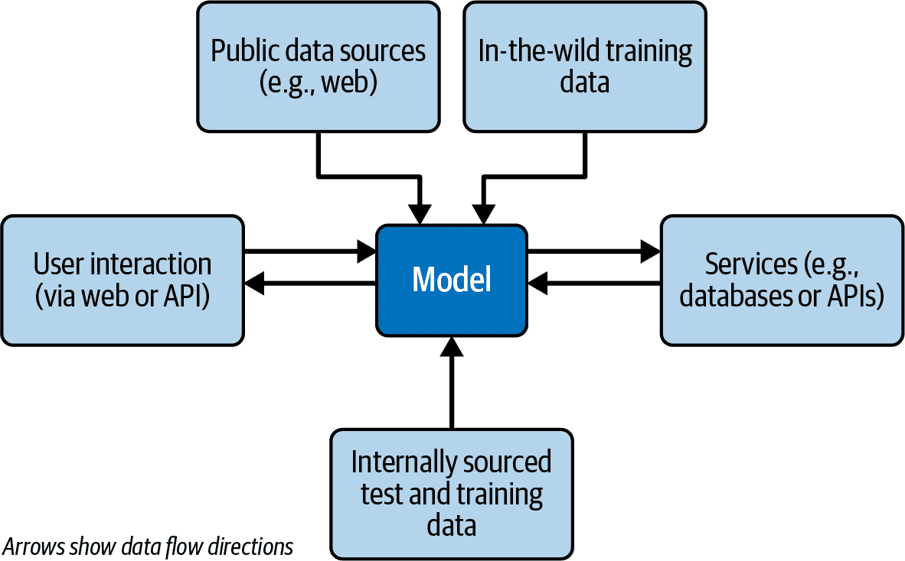
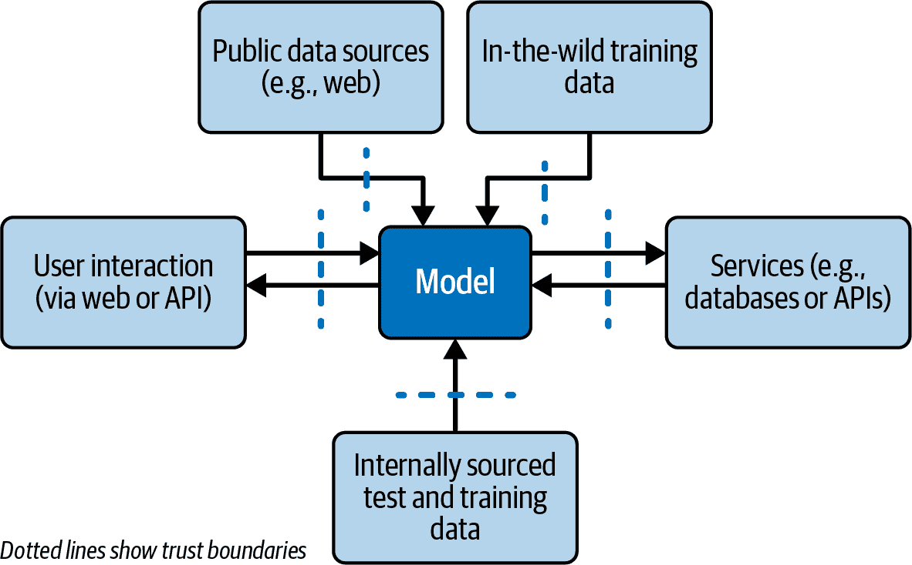

# 第三章. 架构和信任边界

与依赖于预定义算法和静态数据库的传统 Web 应用程序不同，LLMs 利用庞大的神经网络生成动态、上下文感知的响应。这种地震般的变化带来了一组独特的安全挑战，与在传统 Web 应用程序中看到的挑战不同。虽然研究人员已经仔细研究了 Web 应用程序及其漏洞，但 LLM 安全领域仍然相对较新。

本章旨在通过剖析区分 LLMs 的基本元素来弥合这一知识差距。我们将从探索人工智能、神经网络及其与大型语言模型的关系的构建块开始。然后，我们将深入了解今天大多数 LLMs 所采用的革命性架构——转换器模型。在此之后，我们将探讨由 LLM 驱动的各种应用，例如聊天机器人和共飞行员。

然而，除了理解技术之外，安全专业人士还必须了解 LLMs 特有的新型*信任边界*——这些边界在应用程序中划定了不同可信度的区域。这包括用户提示、上传的内容、训练和测试数据、数据库、插件以及其他我们将在本章后面详细说明的边界系统。

# 人工智能、神经网络和大型语言模型：它们有什么区别？

人工智能、神经网络和 LLM 是经常被互换使用的术语，但它们代表了更广泛机器学习和计算智能领域的不同方面。让我们分析它们的区别，以了解它们在技术和安全中的独特角色：

人工智能（AI）

*人工智能*，从其核心来看，是一个跨学科领域，旨在创建能够执行通常需要人类智能的任务的系统。这些任务包括问题解决、感知和语言理解。人工智能涵盖了广泛的技术和方法，从基于规则的系统到机器学习算法，作为一个总称，涵盖了实现人工智能的多种方法。值得注意的是，人工智能的定义在过去几十年中一直是一个不断变化的目标，并且随着技术的进步而持续发展。

神经网络

*神经网络*是一种受人类大脑架构启发的 AI 技术。它们是计算模型，旨在识别模式并根据它们处理的数据做出决策。神经网络可以是简单的，具有最少数量的层（浅层神经网络），也可以是高度复杂的，具有多个相互连接的层（深层神经网络）。它们是许多现代 AI 应用的基础，包括图像识别、自然语言处理和自动驾驶汽车。

大型语言模型（LLMs）

*LLMs*代表一种特定的神经网络。LLMs 通常采用高级神经网络形式，如变压器模型，根据其开发者提供的数据分析并生成文本。它们与众不同的地方在于其庞大的规模和专门处理语言任务的能力，这些任务范围从简单的文本补全到复杂的问答和总结。

对于安全专业人士来说，理解这些区别至关重要。每一层——从广泛的 AI 技术到专门的 LLMs——都引入了漏洞，并需要独特的安全措施。随着我们分析 LLMs 的复杂性，认识到它们在更广泛的 AI 景观中的位置对于有效地讨论保护它们将是关键的。本书的其余部分都围绕着这一讨论展开。

# 变压器的革命：起源、影响以及与 LLM 的联系

变压器架构是人工智能演变中的一个关键里程碑，对 AI 景观产生了深远的影响，进而影响了 LLMs。让我们揭开变压器革命的历程——它的起源、发生的时间以及它给 AI 和 LLMs 带来的地震般的变化。

## 变压器的起源

变压器架构是在 2017 年发表的具有里程碑意义的学术论文[“Attention Is All You Need”](https://oreil.ly/lRNoH)中由 Ashish Vaswani 等人提出的。这篇论文提出了一种新颖的自然语言处理（NLP）任务方法，与传统依赖于循环神经网络（RNNs）和卷积神经网络（CNNs）的模型不同。变压器引入了一个关键创新：自注意力机制。这种机制使得模型能够权衡句子中不同单词的重要性，从而更有效地理解上下文。

在变压器出现之前，神经网络的世界充满了希望，但往往难以满足高期望。传统的架构如 RNNs 和 CNNs 虽然使先进的 AI 能力成为可能，但面临着固有的局限性。这些局限性源于它们无法有效地捕捉和利用上下文，尤其是在自然语言理解方面。

RNNs 虽然适合处理序列数据，但在长序列中保持上下文方面面临挑战。它们表现出一种“短期记忆”形式，这使得它们在理解长文本或对话中的复杂关系和依赖性方面不太擅长。另一方面，CNNs 以其在图像识别方面的能力而闻名，但在将它们的有效性扩展到需要理解单词和句子之间上下文的序列数据（如语言）方面需要帮助。

这种上下文理解上的不足是传统神经网络的阿喀琉斯之踵。它们一次只能看到文本的一小部分，这使得它们无法理解更广泛的叙事或细微差别。这就像只阅读小说几页中的几个随机句子来理解小说一样。结果是人工智能的承诺与其实际应用之间存在着差距，尤其是在自然语言理解方面。正是这个差距，变换器架构将弥合，引发一波进步并重新定义人工智能驱动的语言模型领域。

## 变换器架构对人工智能的影响

引入变换器架构不仅仅是对自然语言处理的一个里程碑；它标志着人工智能领域多个领域内范式的转变。虽然研究人员最初使用变换器架构来解决与理解和生成文本相关的问题，但研究人员和工程师很快发现其能力远远超出了这一点。以下是一些变换器架构产生了重大影响的领域：

自然语言处理（NLP）

当然，最初和最直接的影响是在自然语言处理（NLP）领域。变换器模型现在是各种语言任务的骨干，如翻译、摘要、问答和情感分析。它们设定了新的性能基准，有时在特定任务中甚至超过了人类水平的能力。

计算机视觉

有趣的是，变换器架构在计算机视觉领域也有应用。虽然卷积神经网络（CNN）一直是图像相关任务的金标准，但基于变换器的模型，如视觉变换器（ViT），在图像分类、目标检测和分割等任务中表现出竞争力，如果不是更优越的性能。

语音识别

变换器架构的灵活性也使它们非常适合语音识别。结合像 conformer 这样的专用模型，该模型将卷积层与变换器层融合，它们为理解口语语言设定了新的标准。

自主系统和自动驾驶汽车

变换器最引人入胜的应用之一是自主系统，包括自动驾驶汽车。这些车辆需要高度上下文理解才能安全地导航世界。特斯拉等公司自动驾驶模型的核心就是变换器模型。

医疗保健

在医疗保健领域，变换器模型正在帮助从药物发现到医疗图像分析的各种任务。它们筛选和解释大量数据的能力可以加快研究，并可能导致更准确的诊断。

因此，Transformer 架构的兴起是一场提升所有船只的浪潮，不仅革命了 AI 领域的一个领域，而且革命了多个领域。然而，这种多功能性也带来了这些各种应用中独特的安全挑战。当我们更深入地研究 LLM 安全时，我们将探讨 Transformer 架构无处不在的本质如何需要一种多方面的方法来保护 AI 系统。

# 基于 LLM 的应用类型

基于 LLM 的两种常见应用类型是聊天机器人和 Copilot。让我们简要地看看每种类型，以帮助您了解开发者使用 LLM 的应用范围，并在您进一步学习时为您提供理解各种架构选择的背景。

*聊天机器人*是能够与人类模拟对话的计算机程序，它们通常用于客户服务应用，可以回答问题并支持客户。聊天机器人也擅长娱乐应用，如玩游戏或讲故事。来自第一章的 Tay 是一个娱乐聊天机器人的例子。以下是一些基于 LLM 的聊天机器人的更多示例：

+   Sephora 使用聊天机器人帮助客户找到适合他们皮肤类型和需求的产品。

+   H&M 使用聊天机器人帮助客户找到与他们风格相匹配的服装和配饰。

+   Domino’s Pizza 使用聊天机器人允许客户通过 X（Twitter）或 Facebook Messenger 订购披萨。

+   Fandango 使用聊天机器人帮助客户查找附近的电影时间和影院。

+   JetBlue Airways 使用聊天机器人回答客户关于航班的问题。

+   Amtrak 使用聊天机器人帮助客户预订车票、检查火车状态以及回答他们的问题。

+   金州勇士队使用聊天机器人帮助球迷购买门票、了解即将到来的比赛以及获取球队新闻。

*Copilot*是能够协助人类进行写作、编码和研究任务的 AI 系统。它们可以帮助用户生成想法、识别错误并改进他们的工作。Copilot 仍在开发中，但它们有潜力彻底改变我们的工作和学习方式。基于 LLM 的 Copilot 的具体例子包括：

+   Grammarly 和 ProWritingAid 通过识别和纠正语法错误、建议风格改进和提供反馈来帮助用户提高写作水平。

+   GitHub Copilot、Google Gemini Code Assist 和 AWS CodeWhisperer 帮助程序员更快、更高效地编写代码。它们可以生成代码建议、在不同编程语言之间进行翻译，并帮助识别和调试错误。

+   微软 365 的 Copilot 和谷歌工作空间的 Gemini 都是集成到各自办公套件中的 AI 工具，帮助用户在工作中更加高效和富有创造力。

###### 注意

类似于 ChatGPT 的聊天机器人可以阅读和审查文本块，然后提供改进建议。然而，使用 Grammarly 这样的辅助工具来完成这项任务的经验则大相径庭，并且通常在专注于此类任务时更为优越。

聊天机器人和辅助工具之间的相似之处：

+   聊天机器人和辅助工具都是基于 LLM 的应用程序。

+   聊天机器人和辅助工具都能生成文本。

+   聊天机器人和辅助工具都帮助人类完成任务。

聊天机器人和辅助工具之间的差异：

+   聊天机器人模拟与人类的对话，而辅助工具则帮助人类完成特定任务。

+   聊天机器人通常用于客户服务应用程序，而辅助工具则用于写作、编码和研究应用程序。

+   与辅助工具相比，聊天机器人通常更具交互性，而辅助工具则更专注于完成任务。

在我们深入探讨 LLM 架构的细节时，请记住这些概念。这两种应用程序类型具有相似组件，但您可能基于不同的安全考虑在实现组件时做出不同的决策。

# LLM 应用程序架构

开发者通常认为大型语言模型（LLM）是独立的实体，能够实现令人印象深刻的文本生成和理解壮举。然而，在实践中，LLM 很少是孤立的；它是构成智能应用程序复杂机械的一部分。这些应用程序是由多个相互连接的组件组成的复杂系统，每个组件都在应用程序的整体功能和性能中扮演着至关重要的角色。无论是会话代理、自动内容生成器还是代码辅助工具，LLM 通常与各种元素进行交互，如用户、数据库、API、网页，甚至其他机器学习模型。

理解此类复合系统的架构不仅是一个技术熟练的问题；对于有效的安全规划至关重要。这些组件的交互引入了多个信任和数据流层，定义了与传统 Web 应用程序安全模型截然不同的新安全边界。例如，用户输入可能不仅仅是简单的文本字段，还可能包括语音命令、图像或实时协作编辑。同样，LLM 的输出可能被输入到其他系统中进行进一步处理，从而引入漏洞和风险。

从本质上讲，基于 LLM 的应用程序的整体视角不仅超越了保护语言模型本身。它要求一种全面的方法，考虑整个架构的安全性，从数据摄取和存储到模型服务和用户交互。只有通过理解这些复杂性，才能制定出有效的策略来保护应用程序免受复杂系统固有的各种漏洞的侵害。

随着我们在本章中深入探讨主题，我们将剖析通常构成 LLM 应用的各个组件，检查它们的作用，并探索每个组件带来的独特安全挑战。这种理解将是构建强大、多层次方法以保护基于 LLM 的应用程序的基础。

图 3-1 显示了一个高度简化的图，用于说明使用 LLM 的应用程序中的组件、关系和数据流。后续章节将扩展这些领域。

###### 图 3-1\. 典型的 LLM 应用数据流架构

## 信任边界

在应用安全中，*信任边界*作为一个无形但至关重要的分界线，根据其可信度水平将不同的组件或实体分开。这些边界划定了数据或控制流从一个信任级别变化到另一个级别的区域——例如从用户控制的输入过渡到内部处理，或者从安全的内部数据库移动到面向公众的 API。这些边界充当检查点，开发者应在此处严格执行安全措施，如身份验证、授权和数据验证，以防止漏洞。

###### 警告

理解信任边界对于威胁建模至关重要。正确定义和识别这些边界可能是安全系统与易受威胁的系统之间的区别。

图 3-2 将信任边界添加到我们的架构图中。

###### 图 3-2\. 带有信任边界的 LLM 应用架构

这些边界，如图中所示，作为 LLM 与各种组件交互的门户——包括来自网络的公共数据、结构化数据库、自发的用户交互或内部来源的训练集。每个划定的边界都突出了我们在考虑流入和流出 LLM 的数据时必须考虑的因素。以下是一个简要总结；我们将在下一节中深入探讨：

用户交互

您需要考虑保护模型免受潜在对抗性或误导性输入的影响，这些输入可能是用户或系统引入的。您还必须担心模型输出的有毒、不准确或敏感数据被传回给用户。

野外训练数据

LLM 通常在大量互联网数据上进行训练。您需要将这些数据视为不可信的，并警惕潜在的毒性、偏见和对抗性数据中毒，这些内容我们将在第七章（ch07.html#trust_no_one）中介绍。

内部测试和训练数据

您可以使用内部精选的数据来微调您的模型，这可以显著提高准确性。但您必须警惕摄入和暴露敏感、机密或个人信息。我们将在第五章（ch05.html#can_your_llm_know_too_much）中进一步讨论这个问题。

外部服务

您必须积极控制 LLM 与连接的服务（如数据库或 API）的接口，以防止未经授权的交互或数据泄露。我们将在第七章中进一步讨论这一点。

公共数据访问

从网络实时获取数据可以是一种增强应用程序功能的有效方式。然而，您需要考虑这些数据是不可信的，并注意像间接提示注入等问题，这些问题我们将在第四章中讨论。

每一点都是一个潜在的漏洞途径，如果被忽视，就容易被利用。在 LLM 应用程序不断发展的环境中，保护这些信任边界不仅是最佳实践，而且是防止未经授权的数据访问、减轻数据篡改和避免系统漏洞的必要措施。认识到这些边界及其影响是构建弹性 LLM 安全架构的基础。现在，让我们更详细地探讨每个领域，以确保您有足够的背景知识来深入研究以下章节，这些章节详细介绍了风险区域和缓解措施。

## 模型

语言模型是任何 LLM 应用程序的智力核心，它接收数据、生成响应并驱动交互。根据架构和需求，您可能通过第三方服务提供的公共 API 与语言模型交互，或者运行私有托管模型。例如，您可以从 GitHub 或 Hugging Face 下载 Meta 强大的 Llama 模型的版本并在本地运行。

### 公共 API：便利性与风险

利用公共 API 访问语言模型提供了便利和较低的前期成本。第三方负责管理和更新这些模型，减轻了您组织的资源负担。然而，这种权衡往往以更高的数据泄露风险为代价。当向第三方模型发出请求时，数据会跨越信任边界，离开您的安全网络并进入外部系统。这个过程使您面临数据机密性的风险，并且根据第三方的安全措施，可能会使您容易受到数据泄露的攻击。

### 私有托管模型：更多控制，不同风险

选择私有托管模型可以给您提供更多对数据的控制，让您能够更紧密地管理信任边界。它还允许您根据需要自定义或微调模型。然而，运行私有托管模型会带来挑战，例如维护、更新以及确保模型不包含漏洞——本质上暴露您于潜在的供应链风险。如果您使用开源模型，确保其来源和完整性变得至关重要，以避免嵌入的漏洞或偏见。

### 风险考虑

让我们看看一些依赖于您选择的模型及其部署位置的安全考虑因素：

敏感数据泄露

公共 API 可能会增加泄露敏感信息的风险，而私有托管模型提供更好的控制，但需要强大的内部安全措施。

供应链风险

您的模型起源，无论是经过严格审查的公共服务还是开源下载，都至关重要。一个被破坏的模型可能会将漏洞引入您的应用程序，实际上充当攻击的后门。我们将在第九章中更深入地探讨这一点。

通过仔细考虑模型的托管环境，您可以更好地评估与敏感数据暴露和供应链漏洞相关的权衡和风险。这些考虑将指导您建立适当的信任边界和安全协议，以适应您选择的模型架构。

## 用户交互

虽然 *用户输入* 可能暗示信息从用户流向应用程序的单向流动，但现实情况通常更为复杂。在大型语言模型（LLM）应用程序的背景下，*用户交互* 包含从用户接收输入并向用户提供输出的双向交互。这种双向交互对于创建引人入胜且实用的用户体验至关重要，但也引入了一个更复杂的网络安全环境。

提示（Prompts）是用户交互的一个关键元素。它们不仅仅是信息请求，还充当了指导用户如何与大型语言模型（LLM）交互的指南。一个精心设计的提示可以引导模型提供有价值且准确的信息，而一个模糊或构建不当的提示可能会导致输出不明确甚至误导。因此，提示的管理成为应用安全的一个关键方面。例如，一个恶意用户精心设计的提示可能会诱使模型泄露它不应该泄露的信息，或者导致模型生成有害内容。回到第一章，Tay 就是因为她的 4chan 黑客的提示而受到误导。

考虑到这种双向交互的重要性，确保输入和输出都得到保护至关重要。在输入方面，输入验证、清理和速率限制措施对于减轻注入攻击等漏洞至关重要。在输出方面，确保模型响应得到适当的过滤，并且您的应用程序不会泄露敏感信息同样至关重要。大型语言模型（LLMs）的性质使得这比传统应用程序更具挑战性，我们将在本书后面讨论更多相关技术。

这个与用户交互的层在应用架构中创建了一个关键的信任边界。任何跨越这个边界的，无论是进入还是出去的数据，都应该被仔细管理以避免安全风险。额外的保护层包括对敏感输出使用加密和采用实时监控来标记可能有害或敏感的数据流。我们将在第七章中更详细地讨论这个问题。

## 训练数据

训练数据是 LLMs 构建其理解和能力的基础。无论是用于初始训练还是后续微调，数据的性质和来源对模型的表现和安全态势都有重大影响。一个重要的区别是数据是内部来源的还是从公共或外部来源（“野外”）收集的。

在组织内部生成或整理的数据通常比公开来源的数据经过更严格的审查。它通常与应用程序的具体要求或用例相一致，使其通常更可靠和更相关。受控环境还允许更好地实施安全措施，如加密、访问控制和审计。然而，这些数据可能包含敏感或专有信息，这里的信任边界与内部安全协议紧密相关。这一级别的泄露可能产生严重的后果，包括数据泄露或训练集的损坏。

来自公共存储库或“野外”的数据引入了不同的挑战。虽然这些数据可以提供多样性和规模，但其可靠性和安全性通常无法保证。此类数据可能包括误导性信息、偏见或恶意输入，以损害模型。这里的信任边界更加脆弱，并扩展到生成或托管这些数据的实体：严格的过滤、验证和持续监控成为减轻风险和漏洞的必要条件。正如我们在第一章中看到的，Tay 直接将用户提示作为训练数据消化。这样，有毒提示的残留部分成为了她的知识库的一部分，然后她开始输出有毒的内容。将未经筛选、不可信的用户输入接受到训练数据集中是未能管理这一关键安全边界的最简单例子。

对于内部来源或公共数据，信任边界的概念至关重要。对于内部来源的数据，边界通常在组织的受控环境中，这使得执行安全措施变得更容易。另一方面，有效使用外部数据可以将您的信任边界扩展到包括那些可能不符合您安全标准的外部来源。使用外部数据进行训练需要额外的验证和安全检查层，以确保未经审查的数据不会损害 LLM 应用程序的完整性和安全性。

理解您的训练数据的来源、相关的信任边界及其相应的安全影响对于保护您的 LLM 应用程序至关重要。必须制定全面的数据治理政策来管理您的训练数据的生命周期，无论其来源如何。

## 访问实时外部数据源

实时外部数据源通过使 LLM 应用程序能够提供实时信息、上下文或甚至第三方集成，为 LLM 应用程序的能力增加了新的维度。虽然访问实时外部数据增强了用户体验和功能范围，但它为应用程序的安全格局引入了新的复杂性。

例如，截至撰写本章时，OpenAI 的 ChatGPT 没有直接访问实时网络，因此仅限于其较老训练数据中的事实。另一方面，Google 的 Bard（现在称为 Gemini）确实有权访问用于此测试的实时互联网数据。正因为如此，尽管 GPT-4 模型在推理能力上无疑更优越，但在 Bard 成功的许多基本任务上却失败了。图 3-3 展示了与 ChatGPT 的交互。图 3-4 展示了与 Bard 的相同交互。

###### 图 3-3\. 由于对外部数据的访问有限，ChatGPT 无法回答一个简单的问题

###### 图 3-4\. Bard 直接访问互联网数据流使其具有优势

虽然访问外部数据源，如网站、API 或第三方数据库具有优势，但它会使应用程序面临潜在的风险。摄入不受信任的外部数据源的风险范围从消耗受损害网站中的虚假或有害信息到成为恶意软件或未经授权的数据访问等安全威胁的渠道。这些数据源的不受信任性质使它们在本质上不如内部资源可控，从而增加了额外的不确定性和风险。

当访问公共互联网数据时，信任边界的概念变得尤为重要。与内部服务不同，您可以在其中统一应用安全措施，外部来源可能遵循与您的组织不同的安全标准。这种信任差异需要额外的验证层、安全检查和监控，以确保跨越这一边界的不会损害系统。

## 内部服务的访问

数据库和内部 API 等内部服务通常作为 LLM 应用的底层支持结构。它们可能存储来自用户资料和日志到配置设置，甚至 SQL 或向量数据库中的大量数据。作为经常与系统内部和外部各种元素接口的组件，内部服务在应用架构中代表了功能性和安全性的关键点。

这些服务通常在组织的受控环境中运行，使得安全策略的统一应用成为可能。然而，仅仅因为这些服务是内部的，您也不应陷入虚假的安全感。它们仍然容易受到各种威胁，如未经授权的访问、数据泄露和组织内部的内部威胁。

内部服务，如数据库、专有 API 和后端系统，通常构成了 LLM 应用的运营骨干。这些资源通常位于组织的安全网络内，提供比外部服务更难以实现的信任和控制。然而，这种内部性质可能反常地提高涉及的安全风险，尤其是如果这些服务存储了组织的“皇冠上的宝石”——敏感或有价值的数据。

# 结论

保护 LLM 应用是一项充满复杂、微妙和挑战的任务，这些挑战与传统 Web 应用显著不同。本章旨在阐述导航这一复杂领域所需的基础知识，重点关注三个关键领域：区分人工智能、神经网络和大型语言模型；理解变换器架构的关键作用；以及深入探讨 LLM 应用架构，特别是信任边界的概念。了解 LLMs 的独特之处有助于我们更有效地定制安全策略，超越一般的 AI 或机器学习框架。
