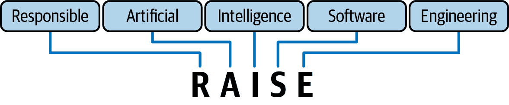

# 第十二章。负责任的人工智能安全实用框架

> 未来已经到来——只是分布不均。
> 
> 威廉·吉布森，*神经漫游者*的作者和“赛博空间”一词的发明者

在 1962 年，当时一个默默无闻的漫画系列最终篇揭露了一个将成为世界上最受喜爱的超级英雄的故事。*惊奇幻想*第 15 期标志着蜘蛛侠的首次亮相，这个角色，据 2022 年 CNN 的一篇报道[2022 CNN story](https://oreil.ly/IDnD3)，已经上升为世界上最著名的超级英雄。但是什么推动了蜘蛛侠达到这种崇高的地位？答案在于其起源故事中融入的引人入胜的信息。

在这个开篇故事中，彼得·帕克是一个高中内向者，在被一只放射性蜘蛛咬伤后，他的生活永远改变了。突然拥有了非凡的力量——超人的力量、敏捷性和吐丝的能力——彼得以蜘蛛侠的化名进入公众视野，成为一位穿制服的英雄。然而，他对自己的行为更广泛影响的早期冷漠导致了一场个人悲剧，他最爱的叔叔本尼的生命因此丧生。这个关键时刻让彼得有了现在已成为标志性语句的深刻认识：“能力越大，责任越大。”

正如彼得·帕克被推入一个充满巨大力量和随之而来的责任的世界一样，人工智能领域的从业者正在经历一个前所未有的技术加速时代。人工智能和 LLMs 的快速演变，虽然释放了创新和进步的巨大潜力，但也放大了掌握这些技术的人们的责任。确保它们的安全和可靠是一个技术挑战和道德 imperative。蜘蛛侠的故事作为一段深刻的提醒，表明这些先进技术赋予的巨大力量伴随着一个关键的责任，即明智、道德地使用它们，并敏锐地意识到它们对社会和个体生活的影响。当我们站在人工智能巨大潜力的边缘时，我们必须牢记彼得·帕克旅程中蕴含的教训：承担我们的责任，确保我们的技术进步带来利益，而不是损害。

当我们开始这一章时，我们的旅程与人工智能和 LLMs 技术的不断扩大的宇宙相呼应——其中可能性的边界不断被重新划定。我们的目的是双重的。首先，我们旨在研究标志着这些强大技术加速的趋势。AI 和 LLMs 的发展速度正在重塑我们的工具和方法，以及重新定义我们的伦理和安全格局。通过研究这些趋势，我们寻求了解技术进步的速度及其在负责任、安全的人工智能应用开发中的更广泛作用。

其次，本章旨在为读者提供一个强大框架，用于安全、可靠和负责任地使用人工智能和大型语言模型（LLM）技术。这个框架，我称之为 RAISE，旨在将你在本书中早期学到的所有概念整合在一起，使它们更容易应用。通过提供最佳实践、伦理考量和安全措施方面的见解，我们旨在赋予你以负责任和知情的方式利用人工智能和 LLM 的力量的能力。

# 功率

让我们先看看推动 LLM 能力发展的趋势。最近，我们观察到人工智能系统能力的激增，这从新应用和投资的激增中可以看出。但这只是一个一次性激增，现在已经过去了，还是我们仍然处于指数曲线的早期阶段，这些系统的力量和风险都将成倍增加？

我在 20 世纪 90 年代初开始了我的第一家 AI 软件公司。它叫做 Emergent Behavior，我认为这是一个为 AI 软件公司起得非常酷的名字。它现在已经不存在了，但我认为告诉你一些关于那段经历的事情将有助于说明在 AI 硬件中正在发生的科技加速。

在 20 世纪 90 年代，我的团队使用遗传算法和神经网络开发了软件。我们的软件能够完成现实世界的工作。我们成功地将它卖给了大型投资银行，用于构建套利交易策略，以及卖给《财富》500 强制造公司，用于优化他们的工厂布局。然而，最终，我们可用的微弱的计算能力和内存意味着我们受到了严重的限制。我们根本无法完成我们心中大多数宏伟的任务。

那时候我能用到的最强大的计算机是 Macintosh IIfx。它配备了一颗 Motorola 68030 处理器，其时钟速度以兆赫兹计。我的电脑有 16 兆字节的 RAM。今天的处理器以千兆赫兹运行，而不是兆赫兹，内存容量以千兆字节计算，而不是兆字节。仅从兆到千兆的变化就暗示了大约 1000 倍的提升。但时钟速度并不是唯一的改进，摩尔定律暗示聪明的芯片设计师应该能够每两年提供整体计算能力翻倍。这将使我们在那个时期内的速度提高 64,000 倍。

64,000 倍的提升听起来令人印象深刻——确实如此。但即使这样也几乎无法解释我们在那个时期所看到的能力的爆炸性增长。它根本无法给我们提供足够的计算能力来训练和运行今天的 LLM。这里还有其他事情在发生。两个其他汇聚的趋势促成了这一点：GPU 和云计算。

## GPU

在 20 世纪 90 年代末，为了在更高的帧率下渲染更多的多边形，游戏的需求导致了 3dfx、ATI Technologies 和 Nvidia 等公司开发了特殊的图形处理单元（GPU）。这些公司构建了 GPU 架构来处理大量的并行数学运算，以计算 3D 空间关系。虽然这对游戏来说很棒，但这也正是加速神经网络（神经网络需要完全相同类型的支持）的正确配方。

在我 20 世纪 90 年代初的人工智能初创公司中，我的 Mac IIfx 除了常规 CPU 外，还配备了一块 Motorola 68882 数学协处理器。这个协处理器可以加速游戏或人工智能所需的浮点数学运算，以及电子表格和其他更平凡的应用。68882 与 Sun Microsystems 等昂贵的高端工作站供应商使用的相同协处理器设计，是当时最快的芯片之一。它的浮点运算速度为每秒 422,000 次（kFLOPS）。这听起来很多，但还不足以使我们要完成的 AI 任务变得实用。

现代服务器比我的旧工作站快多少？虽然摩尔定律可能意味着新服务器可能比我的旧工作站快 64,000 倍，但 GPU 的架构改变了 AI 应用所需的操作游戏规则。如今，顶级的 GPU 是 NVIDIA H100，每秒浮点运算速度为 60 万亿次（teraflops）。让我们来做一些数学计算：

$速度提升等于 NVIDIA H100 FLOPS 除以 Motorola 68882 FLOPS$

NVIDIA H100 GPU 比 Motorola 68882 数学协处理器快约 142,180,095 倍！这个惊人的增长突显了芯片计算能力取得的巨大进步，这些进步支撑了当前人工智能和机器学习技术的进步。这种令人难以置信的速度提升表明，我们在 AI 硬件的硬件曲线上正经历着巨大的加速。在那个时间段内，曲线的陡峭程度甚至超过了指数级的摩尔定律曲线所能预测的 2,000 倍以上！

一亿四千二百二十万倍是一个惊人的显著提升：现代 GPU 在一秒内可以完成的计算，在我的旧工作站协处理器上需要 4.5 年！但这仍然不足以解释我们所看到的爆炸性增长。我们需要云计算来完善这幅画面。

###### 注意

最近，台湾半导体制造公司（TSMC）的出版物显示，该公司预计在未来 10 到 15 年内，其生产的许多世界级 GPU 的计算性能/每瓦电力将提高多达一百万倍，性能每两年翻三倍。

## 云计算

我们还需要考虑的另一个趋势是云计算。即使单系统硬件曲线上的巨大速度提升也不足以使今天的 AI 热潮成为可能。

2006 年，大多数人知道亚马逊是一家在线销售书籍、CD 和 DVD 的商家。亚马逊网络服务（AWS）的推出让所有人都感到惊讶，并普及了按需、按使用付费的云计算概念。云服务如此普遍，以至于我无需向你解释这个概念，但我将提醒你这对 AI 意味着什么。

今天，无论你使用 AWS、Microsoft Azure 还是 Google Cloud Platform（GCP），你都可以访问带有几乎无限内存的 GPU 服务器集群，这些服务器集群连接到超快网络。如果你账户中有足够的资金，你可以在几分钟内设置大规模的集群。今天正在训练基础模型的公司看到了如此高的投资回报潜力，以至于他们愿意支付巨额的云计算账单。据[广泛报道](https://oreil.ly/hAsfW)，OpenAI 在云资源上花费了大约 1 亿美元来训练 GPT-4。

我认为我们还没有达到极限。2024 年 2 月，Nvidia 首席执行官黄仁勋和 OpenAI 首席执行官山姆·奥特曼都成为了新闻焦点。黄仁勋表示，世界将迅速建设价值万亿美元的新数据中心来支持 AI 软件，而报道说 OpenAI 的萨姆·奥特曼正在寻求筹集 7000 亿美元来开发和构建新的 AI 芯片。我们现在已经进入了一个 AI 硬件投资将以万亿美元计量的时代，这将确保我们将看到应用于这些模型的计算能力持续增加。

## 开源

另一个推动能力和风险上升的加速器是开源 LLM 技术的兴起。2022 年 11 月 30 日，ChatGPT 的发布通常被庆祝，当时 OpenAI 向全世界介绍了 LLM 技术。然而，2023 年 2 月 24 日可能在 LLM 技术的历史上具有更大的意义，因为 Facebook/Meta 发布了*大型语言模型 Meta AI*（LLaMA，现在通常写作 Llama）。

Meta 的新闻发布会宣称了对开源科学的承诺，强调发布 LLaMA 作为使更广泛地获取最先进的 AI 技术成为可能的一步。LLaMA 提供多种尺寸，以满足各种研究需求，从验证新方法到探索新颖的使用案例。通过提供更小、更高效的模型，Meta 旨在降低进入 LLM 领域的门槛，让资源有限的研究人员能够参与到这个快速发展的领域并在此进行创新。

当 Meta 最初发布 LLaMA 时，其目标是为了让尖端 AI 技术更加民主化，但同时也存在谨慎的态度。公司认识到让如此强大的模型更加易于获取具有变革潜力，但同样也意识到其误用的风险。Meta 选择在非商业许可下进行控制性发布，以平衡这种微妙的关系，使得 LLaMA 仅对符合特定标准的学术机构、政府机构和非政府组织的研究人员开放。Meta 旨在培养负责任的创新，同时减轻这种强大技术广泛获取的危险。

尽管采取了这些预防措施，但情况出现了意想不到的转折。就在 LLaMA 向选定研究人员发布后一周，该模型通过 4chan（我们详细介绍的第一章中攻击 Tay 的同一黑客论坛）的泄露进入了互联网。泄露事件迅速失控，用户在包括 GitHub 和 Hugging Face 在内的各种平台上重新分配 LLaMA。Meta 通过采取删除请求来遏制传播的努力证明是徒劳的；模型已经过于广泛和迅速地传播开来。

面对 LLaMA 无法控制的扩散，公司决定重新评估其立场，并忽略最初对广泛分发开放 LLM 技术风险的担忧。在从其原始限制性许可方法发生重大转变的行动中，Meta 最终在更自由的许可下发布了 LLaMA，使其对任何人开放。

在这一事件之后，Meta 继续推进。公司推出了 LLaMA 2，这是原始模型的更高级版本，以及像 Llama Chat 和 Code Llama 这样的专用变体。这些后续发布凸显了 Meta 在推进 AI 领域方面的承诺，尽管对在开放和互联的数字环境中管理强大技术工具的复杂性有着细微的理解。Meta 方法的变化突出了关于 AI 技术民主化讨论的关键时刻，强调了创新与确保 AI 负责任使用的必要性之间的紧张关系。

在这个快速发展的环境中，出现了许多其他高质量的开源 LLM，包括 BLOOM、MPT、Falcon、Vicuna 和 Mixtral。在这些中，Mixtral 因其创新方法和技术进步而脱颖而出。

Mixtral-8x7B 展示了一个高质量的稀疏混合专家（SMoE）模型。这一发展代表了一个重大的技术飞跃，提供了开放权重和 Apache 2.0 许可下的许可。根据开发团队的说法，Mixtral 在大多数基准测试中表现优于 LLaMA 2 70B，实现了高达六倍更快的推理时间，并且在大多数标准基准测试中与 OpenAI 的 GPT-3.5 相匹配或超过其能力。现在它被认为是许可下最稳健的开源权重模型之一。

###### 注意

SMoE 是一种 LLM 架构，旨在提高效率和可扩展性。它允许模型使用专门的“专家”子网络来学习输入空间的不同部分。

向开源模型转变标志着加速技术进步的重要一步。随着这一变化，曾经只为大型企业保留的能力现在对更广泛的受众开放，包括科学家、研究人员和小公司。这种更广泛的访问将推动创新，正如 Mixtral 项目所证明的那样。这种最先进技术的共享意味着 LLM 技术的基础科学将在未来几年继续受益于学术和商业研究，没有任何单一组织能够垄断它并减缓进步。

然而，这些技术的开源性质也意味着它们被恶意行为者使用，包括盗贼、恐怖分子以及俄罗斯、中国和朝鲜等国家。这一现实削弱了针对 OpenAI 和 Google 等少数组织的公众压力和法规的有效性，这些法规旨在控制 LLM 和 AI 技术的扩散和滥用。这项技术已经过于普及，无法仅限于有益用途。瓶子里的精灵已经逃逸，无法再将其放回。

## 多模态

文本到图像模型，如 DALL-E、Midjourney 和 Stable Diffusion，迅速改变了许多人对待视觉创意活动的方式。2021 年 1 月，OpenAI 的 DALL-E 通过引入从文本描述生成复杂图像的能力而引起轰动。这个模型是 GPT-3 LLM 的一个变体，展示了将自然语言处理与图像生成相结合的潜力，为 AI 可能解锁的创意可能性树立了先例。

在 DALL-E 之后，商业服务 Midjourney 于 2022 年 7 月开始公开测试版，提供了一种独特的图像生成方法。通过 Discord 机器人运营，Midjourney 允许用户从文本提示中创建图像，强调了一个互动和以社区为中心的创作模式。

2022 年 8 月，开源 Stable Diffusion 项目的发布使文本到图像领域发生了另一场转变。作为一个开源模型，Stable Diffusion 使高质量图像生成对更广泛的受众变得可行，任何拥有消费级硬件的人都可以从文本描述中生成详细的视觉图像。

在这个领域，进步的速度令人惊叹。仅仅几年时间，我们就从早期图像发展到具有明显缺陷（如令人毛骨悚然的、渲染不准确的手指）的阶段，到能够创建挑战我们分辨能力的逼真图像。

这个超现实主义 AI 生成内容的时代催生了计算机生成的 Instagram 网红，以 Aitana Lopez 为代表，他们拥有庞大的在线粉丝群体，并赚取了可观的收入，而他们的粉丝往往没有意识到他们并非真实人物。这些虚拟网红完全通过高级生成模型创建，标志着数字文化的新阶段。它们不仅突显了 AI 产生与人类观众产生共鸣的内容的能力，而且也提出了关于真实性、身份和数字时代影响力的本质的深刻问题。

当我在 2023 年开始写这本书时，访问文本到图像模型是一项挑战。这通常需要你设置复杂的账户（例如 Midjourney）或访问高端硬件（用于开源 Stable Diffusion）。如今，OpenAI 和 Google 的主线聊天机器人是多模态的，将文本和图像同等对待。它们可以读取上传图像中的文本，并从简单的提示中生成新的逼真图像——所有这些都在同一对话中进行。这种与主流聊天机器人的集成意味着使用这项技术的门槛已经降低到几乎任何人都可以使用——无论好坏！

2024 年 2 月，OpenAI 宣布推出 Sora，这是一种从简短提示中创建极其逼真视频的文本到视频模型。紧接着，2024 年 4 月，[微软宣布](https://oreil.ly/I6-pX)了一种名为 VASA 的新 AI 模型，该模型能够根据一张静态图像和一段语音音频剪辑创建“具有吸引人的视觉情感技能（VAS）的逼真虚拟人物对话面部”。随着其他开源文本到视频模型迅速发展，我们即将进入一个挑战现实本质本身的全新时代。最近，一家香港公司因一名员工在 Zoom 通话中被公司 CFO 的深度伪造图像欺骗，损失了 2500 万美元。我们即将进入一个任何人都可以瞬间且低成本地创建复杂深度伪造视频的世界。不难想象，《黑客帝国》离我们并不遥远。

###### 警告

如果你的 LLM 应用程序是跨模态的，并且可以读取图像或视频中的文本，你正在开启一个全新的漏洞世界。考虑一下，现在可以通过在作为提示输入到你的模型中的图像中包含恶意文本来发起提示注入攻击。或者，如果你的训练数据中包含了可能误导你的模型的文本图像，那么你的训练数据可能已经被毒化了。这些都是需要关注的更多向量！

## 自主代理

在 ChatGPT 介绍后的几个月，由软件开发公司 Significant Gravitas 的 Toran Bruce Richards 在 2023 年 3 月推出了 Auto-GPT。建立在 OpenAI 的 GPT-4 之上，Auto-GPT 引入了自主性的概念，允许由 LLM 驱动的代理在最小的人类指导下朝着目标行动。这一特性使得 Auto-GPT 能够自主生成提示以实现用户定义的目标，与 ChatGPT 需要持续人类输入的要求不同。Auto-GPT 框架引入了扩展的短期记忆能力，允许代理连接到互联网并调用第三方服务。

Auto-GPT 的引入当时引起了巨大的轰动，迅速获得关注并引发了大量关于其 AI 自主方法讨论。成千上万的用户迅速采用这个工具进行各种项目，利用其处理比 ChatGPT 单独能处理的更复杂任务的能力。这包括创建和使用无监督代理进行软件开发、业务运营、金融交易，甚至与医疗相关的工作。

Auto-GPT 的采用由于其架构设计和与不高效使用 OpenAI 贵重 API 资源相关的运营成本而面临挑战。围绕 Auto-GPT 的热议很快消散。然而，这并不是基于 LLM 的自主代理故事的终结。

在 Auto-GPT 之后，数十个其他开源和研究项目接过了这个接力棒，我们肯定会看到在这些概念更通用和更便宜方面的快速进步。除此之外，像 OpenAI 这样的主流玩家已经引入了像插件这样的概念，允许他们的 LLM 直接与第三方互联网资源交互。这些寻求完成目标、具有自主架构的代理在许多应用中已经显示出巨大的潜力。随着以这种方式使用 AI 的愿望，我们无疑会看到快速的投资和进步。

然而，Auto-GPT 最重要的教训是它在野外部署的速度之快，几乎没有任何监管。我们之前在第七章讨论了过度的代理：将无监督的权力交到缺乏经验的 AI 手中，几乎没有障碍，可能会非常危险——而且很少有人停下来思考。开发社区在快速采用这项技术时表现出的总体缺乏谨慎，在一定程度上表明，在自我驱动的自主系统取得下一跃之前，我们必须建立更好的安全和保障措施。我们不能相信广大人类独立监督这些能力。这项任务过于复杂，不能留给个人；我们必须作为一个行业来解决它。

# 责任

我们正处于一个曲线图上，显示未来几年人工智能能力的持续、戏剧性增长。你如何规划未来，并在今天做出持久的决策，以确保随着事物的加速，你、你的客户、你的员工、你的组织以及整个社会都能保持安全？你如何履行管理这种“巨大力量”的*重大责任*？

本书的前几章已经为您奠定了基础，帮助您了解可能存在的风险。今天存在哪些风险？哪些现实世界的例子展示了这些漏洞的影响？我们甚至探讨了某些遥远、虚构但可能的例子，说明了这些威胁如何在未来表现出来。

在整本书中，我提供了最佳实用技术，通过使用行业专家的最新实践来应对这些漏洞。然而，随着事物的发展迅速，你最好的防御是拥有一个通用的、灵活的框架来构建你的防御。在这本书的最后部分，我将为你提供一个可以根据你的需求定制，并且随着你的成长和技术的发展而适应的框架。

## RAISE 框架

让我们回顾一下我构建的框架，以帮助您规划、组织和实现安全项目的目标。正如您在图 12-1 中可以看到的，我称这个六步过程为负责任的人工智能软件工程（RAISE）框架。首先，我们将回顾每一步的含义以及为什么它很重要。然后，我们将将其分解成一个可管理的清单，您的团队可以使用它来跟踪您在旅程中的工作。

###### 图 12-1. RAISE 框架

以下列表包括六个步骤；让我们依次看看每个步骤：

1.  限制你的领域。

1.  平衡你的知识库。

1.  实施零信任。

1.  管理你的供应链。

1.  建立一个 AI 红队。

1.  持续监控。

### 限制你的领域

将你的应用程序限制在关注有限的功能领域是首要任务，因为它非常基础，并解决了许多问题。ChatGPT 是一个几乎没有领域边界的 LLM 应用的例子。它的一部分吸引力在于它几乎是在整个互联网上训练的，你可以问它几乎所有的问题。无论是你想得到一份甜点食谱还是一段计算到千位数的π的 Python 代码，ChatGPT 都在这里帮助你。它有一个不受限制的领域。

在不受限制的领域中的挑战是，开发团队必须构建广泛的通用防御。而不是设计一个“允许”活动的简短列表，你必须设计和维护一个全面且可能不断增长的“禁止”活动列表。想象一下在 OpenAI 的护栏团队工作的任务。你将不断地扩展这个列表，它说：

+   不要参与仇恨言论。

+   不要帮助黑客窃取东西。

+   不要帮助人们制造武器（即使他们错过了他们的奶奶——见第四章）。

+   以及如此等等……

这就像玩“打地鼠”游戏。这也解释了为什么我们每个月都会看到有关 ChatGPT 的新安全问题的报道。但如果你没有在构建 ChatGPT，这对你有什么影响呢？如果你使用的是像 GPT-4 这样的通用基础模型，你开始时是在一个不受限制的领域。在最近的现实世界例子中，一家航运公司和一家汽车公司都在他们的网站上放置了支持聊天机器人，以帮助提高客户服务和降低成本。好主意！然而，他们基于通用基础模型，而没有充分限制他们的领域。用户很快通过提示注入（见第一章和第四章——这并不比 Tay 差多少）来破解它们，导致它们参与从写关于公司糟糕客户服务的歌曲到编写黑客要求的 Python 代码等一系列活动，所有这些都是在公司的费用上进行的。（见第八章讨论 DoW 攻击。）

另一方面，如果你的公司想要为特定的用例构建一个应用程序，比如提供时尚建议，你可以利用这个有限的范围。将你的 LLM 聚焦于时尚的最新趋势，比强制执行一个“不要做的事情”列表更容易也更有效。

你怎么做到这一点？虽然随着事情的发展，这个列表可能会演变，但以下是一些关于如何将重点放在限制领域上的建议：

+   在可能的情况下，从一个更小、更不通用的基础模型开始。无论你是走开源路线还是使用 LLM-as-a-service 提供商，现在都有数千个专业模型。这些模型通常在更小、更专注的数据集上训练。如果你的模型在训练过程中没有接触到仇恨言论、凝固汽油弹配方或 Python 代码，那么几乎不可能有人能诱骗它进入这样的领域。作为额外的好处，这些较小、专门用途的模型在规模上可能显著便宜。

+   如果你从一个更通用的模型开始，请使用一个奖励它保持主题的功能来微调它。编码“保持任务和范围”的“愿望”可能比后来尝试建立限制性护栏更强大和优雅——尽管你可能还需要添加这些护栏。使用这一点来驱动模型与你的目标之间的对齐。

### 平衡你的知识库

你必须就运行时提供给 LLM 的数据量保持动态平衡。找到正确的平衡是系统设计中最重要的任务之一，并将成为其安全性和安全性的重要因素。

如果你给你的模型提供的信息太少，它可能会倾向于产生幻觉。如第六章第六章中所述，虽然幻觉可能很可爱，但它们可能会让你的组织面临声誉、法律和安全风险。给你的模型配备关于你打算进入的领域的丰富知识库，有助于确保答案将准确且对你的目标用户有价值。

###### 小贴士

限制你的领域可以帮助你避免幻觉。当模型缺乏足够精确的数据来做出明智的预测时，就会发生幻觉。当你仔细地将领域缩小到一小组活动并限制其超出这些活动的使用时，确保你已经提供了足够的训练或 RAG 数据，以便 LLM 以最小的幻觉风险完成其工作就变得更容易了。

在这个等式的另一边，给你的大型语言模型（LLM）提供过多的数据有其自身的缺点。针对 LLM 应用的总体安全脆弱性和攻击向量数量意味着 LLM 所知道的一切都存在泄露的风险。如果它不知道某个事实或没有访问相关数据，它就不会意外地将其提供给攻击者。

使用我们讨论过的技术，例如 RAG（检索增强生成）和模型微调，为你的 LLM 提供它需要的知识以使其有效。同时，在它绝对需要的数据和它不应该拥有的数据之间划清界限。对个人身份信息（PII）和机密数据要格外小心。记住，你给 LLM 的任何数据都存在通过本书中讨论的任何漏洞泄露和暴露的风险。

### 实施零信任

你无法信任你的用户。你无法信任互联网上的数据。当然，并不是所有用户都是恶意的，互联网上的所有数据都不是坏的或受污染的。但如果你假设你可以信任所有潜在的用户和你在互联网上可能找到的所有数据，你是在给自己带来不合理的风险。

通过扩展，如果你假设你无法信任你的用户或互联网上的数据，那么你也应该假设你无法信任你的大型语言模型（LLM）。在设计你的架构时，假设你的应用程序核心的 LLM 是一个敌人潜伏特工或者至少是一个困惑的副手。在第七章中，我们讨论了为你的应用程序构建零信任架构。这意味着你要检查进入和离开你应用程序的每一件事。

这就是护栏能发挥作用的地方。它们可能单独不足以解决问题，但它们是当事情出错时的关键后盾。考虑以下缓解措施：

+   对进入你的 LLM 的用户提示进行筛选。使用传统的技术，如清除隐藏字符或古怪的编码，以及拒绝列表中的术语或短语。考虑使用在第十一章（ch11.html#trust_the_process）中讨论的商业或开源的护栏框架。

+   还要筛选来自外部来源（通过 RAG）进入你的 LLM 的提示，特别是对于野外来源，如互联网搜索结果——使用与用户提示相同的技巧。通过 RAG 进入你的 LLM 的数据可能比来自某些用户类别的数据更有危险或被污染。

+   筛选从你的 LLM 输出的每一件事。如果你无法信任进入的内容——你很可能无法信任——那么你也无法信任输出的内容。留意 LLM 可能尝试生成脚本、代码、指令或甚至提示来喂养另一个 LLM 的情况。这些都可能是你的 LLM 被欺骗成为困惑的副手并使用你赋予它的权限以进行恶意目的的迹象。

+   考虑我们在第四章（ch04.html#prompt_injection）和第八章（ch08.html#don_t_lose_your_wallet）中讨论的速率限制技术。它们对于防御提示注入、DoS、DoW 和模型克隆攻击可能是至关重要的。

+   最后，也许最重要的是，就你给予 LLM 的权限做出明智的决定。在本章的早期，我们讨论了实施允许更多自主性和目标寻求的架构的推动。如果你设计你的应用程序，使得 LLM 可以驱动特定的动作，你将使自己面临它在最不期望的时候采取那些动作或相关动作的可能性，这些动作它可能偶然拥有权限。你不想让 HAL 在没有人类介入的情况下关闭你的生命维持系统！

### 管理你的供应链

软件供应链安全在过去的几年中一直是安全领域的热门话题。在第九章中，我们回顾了专有组件（SolarWinds）和开源组件（Log4Shell）的大规模供应链故障。然后我们继续查看来自 Hugging Face 等来源的这些风险的实际情况。这些风险是真实的，后果是严重的。一些关键考虑因素包括：

+   仔细选择你的基础模型。它是否来自可靠的来源？

+   仔细选择你可能使用的任何第三方训练数据集。如果可能，使用工具提供额外的检查。

+   在从公共来源构建自己的训练数据集时，请谨慎行事。应用技术以寻找故意的数据中毒或非法材料。

+   注意你用于训练的数据中可能存在的偏差。有偏差的数据可能导致某些用户认为不适当的行为，并使你的组织面临声誉或甚至法律风险。例如，在第一章中，我们回顾了一个案例，一个用于求职者筛选的应用程序因为歧视女性而被关闭。它之所以这样做，并不是因为它刻薄；而是因为它训练数据中固有的偏差。

确保将第三方组件作为你的 ML-BOM 的一部分进行跟踪。如果在将来发现问题或漏洞，你可以确定你是否受到影响，并迅速解决问题。

将此过程纳入你的 DevSecOps/MLOps/LLMOps 开发流程中，如第十一章所述（Chapter 11）。对这些事物进行检查和清理的严格性应该自动化。不要依赖手工抽查。每次构建和部署周期更新你的 ML-BOM，并存储新版本。这样，你将始终知道你在运行什么，或者在需要的情况下能够回溯并知道在特定时间运行了什么。

最后，对你的 DevOps 构建环境本身也要保持良好的卫生。PyTorch 等关键 MLOps/LLMOps 组件中的漏洞已经被证明是链中的脆弱点。使用 SCA 工具确保你的 DevOps 平台的所有组件都是最新和安全的。

### 建立一个 AI 红队

基于大型语言模型的应用程序固有的复杂性和不可预测性使得安全测试变得复杂。AST 工具可能会有所帮助，但你不应假设它们提供了真正的安全性。频繁的红队测试是任何负责任的 AI 策略的关键组成部分。结合手动和人工驱动的红队，并考虑使用自动红队技术。

###### 警告

红队旨在发现安全漏洞和安全问题。但这并不总是使他们受欢迎。这尤其当红队被推迟到开发周期的后期，影响既定的项目进度时。

发现和报告安全和安全问题有时会使安全团队处于困难的位置，尤其是当这些发现与紧张的项目时间表或即将到来的部署截止日期相冲突时。安全专业人士面临阻力或甚至敌意并不罕见，当他们的发现可能导致延误或增加工作量时。

在组织内部建立一个积极安全的氛围，不仅仅是实施政策或进行培训。它涉及到对安全认知的根本转变——从阻碍或事后考虑转变为发展过程中的一个重要组成部分。鼓励每个团队成员，从开发者到高管，都将安全和安全放在首位，可以显著降低风险并增强项目对威胁的抵抗力。

安全专业人士必须经常说服和与各种利益相关者谈判，以确保安全措施得到实施和尊重。培养强大的说服和谈判技能可以促进与开发团队的更有效互动，这些团队可能面临满足截止日期或绩效目标的压力。安全团队可以通过将安全测试视为创建稳健可靠产品的必要步骤，而不是障碍，来营造协作环境。在安全和开发目标一致的情况下创造双赢场景，可以导致更成功和安全的 AI 实施。

###### 小贴士

掌握双赢说服的艺术可能至关重要。罗伯特·西奥迪尼的书籍《影响力：说服心理学》（Harper Business）提供了说服原则的见解，可以帮助安全专业人士有效地传达稳健安全实践的重要性。同样，克里斯·沃斯（Harper Business）的《永不分割：谈判如生命攸关》（Never Split the Difference: Negotiating As If Your Life Depended On It）提供了前 FBI 人质谈判专家的实用谈判技巧，这对于与利益相关者进行高风险讨论非常有价值。掌握这些技能可以在你的项目成功和职业生涯的长远发展中产生重大影响。

### 持续监控

不信任任何东西，记录一切。作为零信任政策的延伸，你应该仔细监控应用程序的所有部分。这包括从 Web 服务器和数据库等传统组件收集日志。关键的是，你还应该直接监控你的 LLM。记录 LLM 的每个提示和每个响应，并收集模型提供商提供的监控 API 提供的数据。

将这些日志和事件收集到 SIEM 系统中，并应用异常检测技术。利用 SIEM 的 UEBA 功能作为起点。应用程序行为的突然变化可能意味着外部变化，例如 DoS 攻击（见第八章），或者黑客通过 LLM 越狱或更传统的侧信道控制了应用程序的某些部分。

定期抽查和审查提示/响应对，以了解你的应用并寻找问题迹象，如尝试提示注入或可能的幻觉。使用这些数据来持续调整你的系统。

## RAISE 清单

使用这个实用的清单来评估你的项目，并确定是否需要额外的安全技术、工具或控制措施。

+   限制你的领域

    +   在应用设计中保持狭窄。明确定义它应该支持哪些用例。

    +   选择特定领域的，而不是通用目的的基础模型来支持你的用例。

+   平衡你的知识库

    +   给你的模型提供足够的数据以避免幻觉。

    +   将额外的数据源限制仅用于满足你的用例。

+   实施零信任

    +   筛查所有传递给你的 LLM 的数据。

    +   筛查你 LLM 的所有输出。

    +   实施安全措施。

+   管理你的供应链

    +   评估模型和标准数据集提供者的可信度。

    +   在从公共来源构建数据集时要谨慎。

    +   考虑训练数据中可能的偏差。

    +   建立和维护你的 ML-BOM。

    +   保护你的 DevOps 管道。

+   建立一个 AI 红队

    +   使用以人为核心的团队。

    +   考虑增加自动化红队工具。

+   持续监控

    +   记录所有活动。

    +   将所有日志收集到 SIEM 系统中。

    +   使用数据分析来寻找可能表明威胁的异常情况。

# 结论

ChatGPT 的出现和整体 LLM 生态系统的繁荣似乎突然发生。然而，这只是 AI 能力加速曲线的一部分，这种曲线已经积累了几年的动力。在本章的开头，我们探讨了导致这一现象的几个因素，但更重要的是，这些因素仍在发挥作用并加速发展。正如威廉·吉布森在本章开头引用的那样，“未来已经到来——只是分布不均。”

随着曲线的延伸，我们将看到这些系统的力量和风险增长。我们无疑将看到更多能力的 AI 系统。记住第一章中 Tay 的故事？那是在 2016 年，现在已经过去了八年。我们仍在看到困扰 Tay 的相同问题，未来人们也会犯同样的错误。企业和个人都倾向于急于求成，为这些系统提供更多数据，并提高它们的自主性和能动性。如果我们不小心，我们可能会走上一条会导致许多安全和安全灾难的道路。

我希望你能将本书中学到的知识应用于帮助保持你的基于 LLM 的应用在负责任的道路上。使用 RAISE 框架和清单来帮助你的团队思考问题，并确保你已经尽最大努力构建了一个强大且安全的系统。

LLMs（大型语言模型）和新兴的人工智能技术的力量无疑是颠覆性的。那些不采用这些技术的公司和国家将迅速落后。要大胆，要勇于实验，并构建全新的优秀应用。但记住，强大的力量伴随着巨大的责任！你可以安全、可靠、负责任地创建强大的应用。
