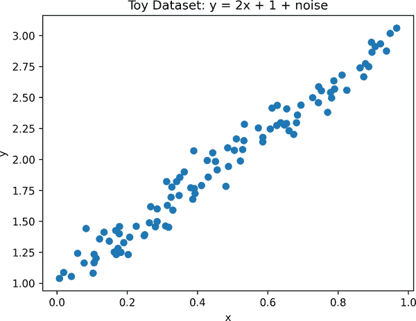
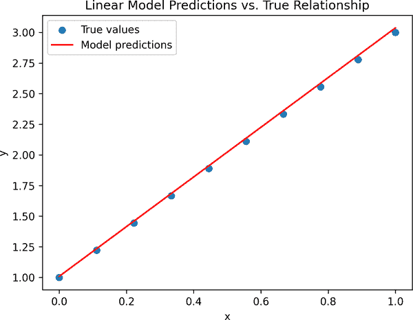

# 第一章. 简介

生物学正日益成为一个数据驱动的科学，深度学习——机器学习的一个强大子领域——正在开辟新的途径，以揭示复杂、高维数据集中的模式。随着这两个领域的融合，新的机会正在出现，可以利用现代计算工具提取有意义的见解。这本书是一本实用的入门指南，专注于在交叉领域工作，侧重于培养在生物环境中有效应用深度学习所需的技能和心态。

# 入门

这一章的开篇帮助你定位。在跳入代码之前，我们探讨了如何构建项目、评估你的数据以及避免常见的陷阱。一开始就有一点结构和规划将使你的工作更具可重复性、更灵活，最终更有用和有影响力。

## 决定你的模型将取代什么

生物学中的深度学习项目成功往往取决于你编写第一行代码之前发生的事情。很容易迷失在技术细节中，或者花费数周时间探索那些不会导致有意义结果的数据和架构变体。特别是在这样一个有趣的领域，尝试改进的诱惑很强。为了保持专注，一开始提出几个基础问题很有帮助。

其中最有用的是：*我的模型将取代或改进现有的哪个流程？* 这个领域的最有影响力的项目通常（尽管不总是）有一个明确的答案。以下是一些不同领域的例子：

在医疗保健和药物发现中：

皮肤癌分类模型

旨在复制皮肤科医生从临床图像中视觉诊断黑色素瘤或其他病变的能力，为高风险人群提供更快、更可扩展的筛查

致病微生物检测系统

在测序数据或成像数据上训练，以从原始临床样本（例如血液、唾液或组织）直接检测细菌或病毒感染，可能取代较慢的培养诊断

脑肿瘤分割模型

自动化或加速在 MRI 扫描上勾勒肿瘤的过程，这是放射科医生通常手动进行且耗时很大的任务

药物-靶标相互作用预测工具

旨在优先考虑最有希望的化合物-靶标对，减少对大量化学库昂贵湿实验室筛选的需求

抗生素耐药性预测模型

预测特定细菌菌株是否会抵抗某些治疗，帮助临床医生更快地选择有效的抗生素

在分子生物学中：

AlphaFold

这个蛋白质结构预测模型，在许多情况下，取代了通过昂贵的基于实验室的技术（如 X 射线晶体学、冷冻电镜或核磁共振）实验确定 3D 蛋白质形状的需求

基因表达预测模型

从原始基因组序列预测基因活性，为 RNA 测序（RNA-seq）实验提供计算替代方案

变体效应预测模型

帮助自动化基因突变的解释，通过优先考虑可能致病变异的后续分析或实验验证，支持临床决策

在生态学和环境科学中：

声学物种分类系统

使用森林声音录音来识别存在的动物物种，提供了一种可扩展且劳动强度较低的替代方案，用于现场生物多样性调查

作物病害检测

通过无人机或卫星图像，可以早期识别植物压力，减少在大片田野上手动巡查的需求

动物面部识别工具

在不需要标记、项圈或其他侵入性方法的情况下，跟踪个体动物、爬行动物、鸟类和哺乳动物随时间的变化

盗猎检测系统

在红外或运动传感器数据上训练，可以自动标记受保护野生动物区的人类活动，协助保护工作

理想情况下，这可以让你了解深度学习可以改进或甚至取代的工作流程类型。在可能的情况下，尝试估计你模型的潜在影响——它可以节省多少时间、成本或人工劳动，或者它可能带来哪些新的见解。这将帮助你保持对工作的现实世界效用有清晰的认识，并向合作伙伴、利益相关者或公众传达其价值。

###### 小贴士

话虽如此，并非每个有价值的模型都需要取代现有的流程。一些模型开辟了全新的能力——如生成新的生物序列、揭示大型数据集中隐藏的模式，或连接以前从未连接过的数据类型。这些模型可能不会简化实验室任务，但它们可以启用新的发现类型，扩展我们可以提出的问题，或提供解释复杂系统的新方法。如果你的模型创造了新的东西，只需清楚地说明是什么以及为什么它很重要——并且要深思熟虑地评估成功，因为没有既定的基准。

## 确定你的成功标准

重要的是尽早明确地定义你的项目成功的样子。研究可能耗时且没有明确的终点，所以明确的目标有助于你保持专注，避免无休止的调整——反复改变模型、架构或训练设置，而没有明确的假设或评估计划。这种试错循环在深度学习中很常见，因为设计选择和超参数数量庞大。没有结构，这可能会浪费时间，并产生难以解释或再现的结果。

成功标准的例子包括：

性能指标（例如，准确率、AUC、F1）

你可能的目标是匹配人类专家的表现，实现与实验结果的可比相关性，或者将假阳性率控制在一定数量以下。

解释性水平

在许多应用中，不仅模型的表现要好，而且其决策还需要被领域专家理解。例如，你可能需要优先考虑准确校准的不确定性估计或可解释的特征归因，尤其是在信任和可解释性至关重要的情况下。

模型大小或推理延迟

如果你的模型需要在资源受限的环境中运行（例如，智能手机或嵌入式设备）或满足实时吞吐量目标（例如，每秒处理 20 帧），你的成功标准可能集中在效率上——例如，实现每浮点运算（FLOP）的高性能，这衡量了模型有效使用计算资源的能力。在这种情况下，推理时间、内存使用或能耗等指标可能比原始准确性更重要。

训练时间和效率

当计算资源有限或处于教育环境中时，你可能需要优先考虑快速训练或最小硬件需求。由于训练深度学习模型通常涉及大量矩阵运算，它们通常使用图形处理单元（GPU）来加速。在资源有限的环境中，开发一个在 CPU 上快速训练的简单模型可能比最大化性能更实际。

泛化能力

在某些情况下，目标是构建一个在许多数据集或任务上表现良好的模型，而不是一个针对单个基准精心调优的模型。例如，*基础模型*——在广泛数据集上训练的大模型，可以适应许多下游应用——优先考虑灵活性和重用。在这种情况下，广泛的适用性可能比在特定任务上获得最佳性能更有价值。

在一开始就定义这些目标有助于你回答关键问题：“项目何时完成？”你可能会需要平衡多个标准，但尽早列出它们将保持你的努力一致，并使你的范围保持现实。

## 在评估上投入大量精力

一旦你定义了成功的标准，就是时候优先考虑*评估*了。这意味着仔细思考你将如何衡量进度——包括你将使用哪些指标，你将如何验证结果，以及你将比较哪些基线。如果没有明确、精心设计的评估策略，即使是一个技术上令人印象深刻的模型也可能无法产生有意义的结论。

强大的评估不仅有助于你衡量进度，还有助于你检测错误、估计任务难度和建立直觉。关键思想很简单：你需要一个已知的比较点来了解你的模型是否正在做有意义的事情。

###### 小贴士

虽然没有普遍的规则，但如果成功的机器学习项目花费 50%的时间设计评估策略和运行基线，25%的时间整理或处理数据，只有 25%的时间用于模型架构，这并不会令人惊讶。没有良好的评估，你就像是在盲目飞行：你不会知道你的模型是否真的在改进，你正在做出哪些权衡，甚至是否在学习任何有意义的内容。

在这里花些时间。评估不仅仅是你在项目结束时做的事情。它是在项目开始时设计的，并指导整个项目。

## 设计基线

最实用的评估工具之一是一个强大的**基线**——一个简单的方法，让你有东西可以超越。好的基线有助于你衡量进度，早期发现错误，并理解你任务的难度。有时它们甚至可能难以超越。

设计好的基线需要仔细思考任务。以下是针对分类任务的几种常见基线策略：

随机预测

完全随机分配标签，每个类别的概率相等。这告诉你没有任何信息时的性能看起来如何。

根据类别频率加权的随机预测

随机采样标签，但按它们在训练数据中出现的频率成比例。这对于不平衡数据集很有用。

大多数类别

总是预测最常见的类别。在高度类别不平衡的情况下，这可能是一个难以超越的基线。

最近邻

预测训练数据中最相似示例的标签（例如，使用欧几里得距离的 1-最近邻）。当输入是低维或结构良好时，这通常很有效。

对于回归任务：

目标的平均值或中位数

总是预测训练集中的平均或中位数目标值。这通常与模型如果没有学习到任何有意义的内容会做的事情相匹配。

单特征线性回归

仅使用最强的单个预测因子（例如，一个生物标志物）拟合一条线。这有助于衡量比简单信号更复杂的模型改进了多少。

K-最近邻回归

预测目标为最相似的**k**个数据点的平均值（或加权平均值）。这在结构化数据集上简单易行，并且通常具有出人意料的竞争力。

对于两者：

简单启发式方法

使用基于领域知识的简单规则。例如，在诊断中，如果单个生物标志物或测量值超过阈值，则将患者分类为阳性。对于皮肤癌图像，按平均像素强度对病变进行排序。在基因组学中，如果任务是预测突变影响的基因，一个简单的基线是假设它影响基因组中最接近的基因。

###### 警告

如果你的模型无法击败基本基线，那么可能有问题——这很有用。这是重新审视你的数据、特征或建模方法的关键信号。

## 时间盒你的项目

为项目设置时间限制很重要——也就是说，设定一个固定的时间来工作，之后无论结果如何都要暂停或停止。许多研究想法“失败”在意义上是它们没有达到预期的指标。这是正常的。所有项目，即使是那些不成功的项目，也会产生有助于未来工作的见解。时间分箱有助于确保失败的实验仍然能推动你前进——而不消耗无限的时间和精力。

###### 注意

时间分箱并不意味着轻易放弃——这意味着设定界限以保持专注，避免疲劳，并继续取得进步。

这里有一些有效时间分箱的技巧：

1. 设定一个明确的截止日期

选择一个现实的时间框架（例如，两周、三个月）并坚持下去。

2. 定义检查点

确定中间里程碑——比如完成数据集预处理、训练基线模型或达到一定的准确率——以跟踪进度。

3. 结束时反思

花时间评估哪些有效，哪些无效，以及你学到了什么。

###### 小贴士

时间分箱在项目内部也很有用。例如：“我将尝试这个新的处理或建模想法一周，如果不起作用，我就继续前进。”

时间分箱的最大风险是你自己。很容易为延期辩护，添加新想法，或者说服自己如果再尝试 10 次就能找到金子。范围蔓延和完美主义是常见的陷阱。在这些情况下，与他人交谈——合作者、导师或朋友——以获得观点并避免原地打转可能会有所帮助。简短的交谈往往能消除犹豫不决或执着，帮助你重新关注更广泛的背景。

## 判断你是否真的需要深度学习

这在深度学习书中可能看起来像奇怪的忠告，但在深入之前，花点时间问问自己：*我真的需要深度学习来解决这个问题吗？* 我们再说一遍——认真考虑更简单的方法。

深度学习模型强大（并且不可否认地有趣），但它们也是资源密集型的，训练复杂，调试困难。在许多情况下，传统方法——如线性回归、决策树或基本统计技术——可以以远少于努力达到你的目标。这些方法通常：

更容易实现

更快设置并需要更少的专长

计算量要求较低

可以在标准硬件上运行，并且训练时间最少

更易于理解

更容易解释、故障排除和验证

仔细权衡利弊。如果更简单的方法提供了你需要的见解或性能，那么它通常是更明智和更高效的途径。

## 确保你有足够的好数据

深度学习模型不仅需要大量数据，通常还需要高质量的数据。在较差数据上训练的模型往往可能失败得非常严重，无论它们的复杂性如何。

确保你有：

足够的数量

深度模型通常需要数千个或更多的示例。什么算是“足够”的数据取决于你的问题和架构。检查相关文献以获取基准。如果你正在处理小数据集，可以考虑*迁移学习*，即从一个与相关任务训练的模型开始，并在你自己的数据上微调它。这种方法可以显著减少实现良好性能所需的数据量。

足够的质量

清洁、一致的数据至关重要。标签错误、噪声或不一致性会严重影响性能。即使是像现代基于聊天助手系统所使用的那些大型语言模型，从精心整理的高质量数据中训练也能获得显著的好处。优先考虑质量检查和深思熟虑的整理。

## 组建团队

单独工作完全可以接受——但团队合作可以加速进度，改进你的想法，并使整个过程更加愉快。以下是一些寻找优秀合作伙伴的建议：

与社区互动

加入相关的论坛、在线小组或网络研讨会，与他人建立联系，分享想法，并发现潜在的合作伙伴。像 Reddit、Discord 服务器、X 和专门的 Slack 小组这样的社区可以成为很好的起点。

参与黑客马拉松和竞赛

Kaggle、Zindi 或当地大学活动等平台提供结构化的挑战、反馈以及与有相似兴趣的人见面的机会。

组建跨学科团队

结合不同领域的专业知识通常会导致更强大的项目。如果你是生物学家，与机器学习领域的人合作，反之亦然。

与专家合作

领域专家可以帮助塑造你的方法并及早识别盲点。在会议或研讨会上寻找合作伙伴，或联系相关论文的作者。陌生人对于感兴趣的人的真诚冷请求反应惊人。

以下是一些找到合作伙伴后可以遵循的建议：

明确目标和角色

当与他人合作时，尽早明确责任有助于澄清——谁在做什么，成功的样子是什么，以及如何做出决策。这可以避免误解并使项目顺利进行。

使用共享工具进行协作

版本控制（如 Git）、共享笔记本（例如 Google Colab）和简单的任务跟踪器（如 Notion 或 Trello，或者只是一个带有一些列表的共享 Google 文档）可以使协调和保持组织化变得更加容易。

支持专业化

让人们投入到他们最喜欢的项目部分——有些人可能专注于基础设施和软件开发，其他人可能专注于数据整理、建模或生物解释。

从小做起

如果你不确定长期兼容性，可以先尝试一个短期项目或探索。一个小型、低压力的合作是一个很好的测试水深的办法。

无论你是单独工作还是作为团队的一部分，最重要的是保持好奇心，持续学习，并迈出第一步。

## 你不需要超级计算机或博士学位

关于在生物学中从事深度学习的一些常见误解值得挑战：

你需要巨大的预算和计算能力。

在大规模语言模型数百万美元的训练运行的时代，很容易认为你需要大量的资源。但情况并不总是如此：

使用小型模型进行原型设计

从小做起，快速迭代。你可能会发现轻量级模型对你的目标来说已经足够了。

使用免费或负担得起的计算资源

平台如 Google Colab 和 Kaggle 为小型项目提供免费的 GPU 访问。对于更苛刻的工作负载，云服务提供商如亚马逊网络服务（AWS）、微软 Azure 和谷歌云平台（GCP）提供可扩展的付费实例。

并非所有事情都关乎规模

许多有价值的项目专注于分析现有模型，而不是训练新的模型。这些通常只需要适度的计算能力，但可以提供深刻的见解。我们对深度模型行为仍有许多不了解的地方。

你需要机器学习或生物学（或两者）的深厚专业知识。

另一个神话是只有高度训练的专家才能做出有意义的贡献。实际上：

更好的工具

现代框架使构建和实验强大模型比以往任何时候都更容易。

开源文化

免费可用的代码和预训练模型让你可以从现有工作中学习和构建。

教育资源

现在网络上不缺乏教程、视频和操作指南，可以帮助你入门。

许多未被开发的难题

许多重要的生物学问题尚未被机器学习探索。你不需要博士学位或 Kaggle 奖牌来从事这些工作。

虽然研究的前沿可能需要专业知识和高端基础设施，但在这个领域仍有很大的空间供好奇心、创造力和新视角发挥作用——无需超级计算机。

###### 小贴士

当你探索这个领域时，你几乎肯定会遇到学术论文——无论你是深入研究一个特定方法，阅读相关工作，还是寻找项目想法。生物学和机器学习论文一开始可能感觉难以理解：语言密集，思想高度浓缩，而且经常有很多术语。但请记住：

+   你正在看到一支研究团队数月或数年的工作成果——并且是第一次遇到它。

+   阅读论文是一项技能，就像任何技能一样，它通过实践而提高。

+   博客文章、YouTube 视频和开源项目也可以是学习相同概念的更易于获取的方式。

在具备这样的背景之后，让我们深入探讨这本书的技术基础。

# 技术简介

我们将使用基于 Python 的深度学习框架，特别是 JAX 和 Flax。JAX 是一个高性能数值计算和机器学习系统，Flax 是一个构建在 JAX 之上的灵活神经网络库。我们将通过解释为什么我们选择 JAX 以及回顾一些在许多机器学习（ML）代码中经常出现的 Python 特性来激发动机。然后，我们将介绍一些在本书中反复出现的机器学习基础概念，主要概念是训练循环的结构。

###### 小贴士

如“先决条件”中所述，本书假设您对 Python 有基本了解。如果您是 Python 新手，请先查看那里列出的推荐资源。

最后，为了避免章节之间的重复，我们创建了一个名为`dlfb`（生物学的深度学习）的小型配套库，它封装了常见的实用工具和组件。本书中我们将多次引用它。

###### 小贴士

如果这个技术介绍的部分内容一开始感觉不熟悉或具有挑战性，请不要担心。您可以随意浏览或跳过。当您在本书后面的部分看到这些概念的实际应用时，许多概念将变得更加清晰。

## 为什么选择 JAX 和 Flax？

本书使用 JAX 和 Flax 生态系统。但为什么我们选择这个选项，而其他选项如 PyTorch 或 Keras 更为常见呢？

首先，有些诚实：没有一种“最佳”的框架。所有这些框架都可以用来构建有效的生物模型，并且如果使用 PyTorch 或 Keras，本书中的许多概念将很容易迁移。

我们选择 JAX/Flax 的主要原因如下：

熟悉的 NumPy API

JAX 的`jax.numpy`模块（通常导入为`jnp`）提供了一个与标准 NumPy 在数组操作和数学运算上非常相似的 API，以至于 NumPy `np`调用通常可以直接用`jnp`替换。这意味着已经熟练掌握 NumPy 的用户可以显著降低学习曲线，利用现有知识快速构建和适应代码，同时获得 JAX 强大的转换和加速支持。

函数式编程鼓励清晰性

JAX 的纯函数风格可以减少隐藏状态，使训练逻辑更加透明。这与本书的教育目标——明确优于隐晦——非常契合。

转换是第一类

JAX 提供了强大的、可组合的转换，如`jit`（即时编译）、`grad`（自动微分）和`vmap`（向量化），这些转换可以在 Python 函数上干净地工作。这些工具简化并统一了模型训练和评估的许多方面。

JAX 与前沿研究保持一致

JAX 在最近的机器学习研究中获得了关注，尤其是在生物学、物理学和大规模模型方面。在这里使用它可以帮助您与更新的工具链保持一致，并尝试现代实践。

速度

JAX 使用一个编译器，可以在专门的硬件（如 NVIDIA 或 AMD 的 GPU）和 Google 制造的 TPU 上产生显著的性能提升，这使得它非常适合大规模深度学习工作负载。这个编译器基于 XLA，这是一个用于在加速器上优化数值计算的底层系统。

话虽如此，JAX 和 Flax 都有其权衡：较小的生态系统和快速演变的 API（有时在演变过程中会破坏某些东西）。虽然 JAX 可以提供令人印象深刻的加速，但这种速度并不仅限于 JAX/Flax。例如，[Keras](https://keras.io)现在支持 JAX 后端，为更喜欢高级 API 的用户提供了另一种选择。如果你已经熟悉 PyTorch、Keras 或 TensorFlow，你当然可以使用这些工具来实现本书中的想法——甚至可以将你自己的版本贡献给本书的仓库。

当你刚开始时，这并不是必要的，但随着时间的推移，熟悉多个深度学习框架可能会有所帮助。每个框架在不同的生态系统中都有其优势——例如，我们在第二章中使用 PyTorch 从 Hugging Face 模型中提取预训练嵌入，因为 Hugging Face 上的许多模型主要是以 PyTorch 的形式发布和维护的。

###### 警告

深度学习领域发展迅速。虽然我们在这本书中始终使用 Flax 的`linen` API，但最近出现了一个名为`nnx`的新 API，已成为构建模型的推荐方式。`linen`仍然完全受支持，但请注意，你可能会遇到使用`nnx`的其他教程或示例，其语法略有不同。

我们将在本书中根据需要介绍关键的 JAX 概念，但不会详细涵盖整个库。为了更详细的动手学习，请查看官方[JAX 教程](https://oreil.ly/Jcqtu)。如果你遇到意外行为，JAX 的[“sharp bits”笔记本](https://oreil.ly/TcOzQ)是了解常见问题及其解决方法的绝佳参考。

### 关于性能的说明

由于这是一本教育书籍，我们的重点是清晰度而不是峰值性能。这意味着我们不会涵盖诸如精确调整、高级硬件策略或分布式训练等内容。但在现实世界的设置中，这些事情可能非常重要。

如果你熟悉基础知识并想进一步探索，以下是一些值得研究的地方：

数值精度和调整

许多机器学习操作，尤其是矩阵乘法（matmuls），可以从降低精度格式（如`bfloat16`）中受益，这可以在最小影响模型精度的前提下显著提高速度和内存使用。JAX 允许你通过`jax.default_matmul_precision`来控制用于 matmuls 的精度，帮助你利用专门的硬件，如 NVIDIA GPU 上的 Tensor Cores 或 TPU 上的矩阵单元。在大型设置中，低精度训练被广泛使用，因为它可以更高效、更经济地训练更大的模型。

剖析工具，如`jax.profiler`或 TensorBoard

性能分析可以帮助你识别代码在时间和内存上的消耗，从而在训练中找到瓶颈并优化最昂贵的操作。

内存高效的训练技术

梯度检查点（JAX 中的 remat）等方法让你可以在计算和内存之间进行权衡，允许你在不耗尽 RAM 的情况下训练更深的模型。

多主机/多设备训练

在多个 GPU、TPU 或甚至机器上训练可以使你扩展模型和数据集，这些模型和数据集无法适应单个设备。

在阅读这本书的过程中，你可能不需要这些内容，但了解它们是有益的，随着你对 JAX 生态系统的熟悉，它们值得探索。

## Python 小贴士

虽然这本书没有深入介绍 Python 的基础知识，但本节突出了几个在处理机器学习代码时可能会遇到的有用 Python 概念——特别是与 JAX 和 Flax 相关的。

### 类型注解和文档字符串

Python 是一种动态类型语言，这意味着你不需要显式声明变量类型（如字符串或整数）。相反，类型是在运行时确定的，这使得语言灵活——但这种灵活性也可能使错误更难捕捉，尤其是在大型代码库中。添加 *类型注解* 通过提高可读性、使用 `mypy` 等工具进行静态类型检查以及使调试更容易来减轻这一点。

这里有一个简单的函数，用于计算两个 NumPy 数组之间的均方误差（MSE）：

```py
import numpy as np

def mean_squared_error(y_true, y_pred):
  squared_errors = (y_true - y_pred) ** 2
  return np.mean(squared_errors)

```

这里是它使用的一个例子：

```py
y_true = np.array([1.1, 0.1, 1.0])
y_pred = np.array([0.9, 0.2, 1.2])
mean_squared_error(y_true, y_pred)

```

输出：

```py
np.float64(0.030000000000000002)

```

我们可以通过添加类型提示来改进这个函数，指定输入是 `np.ndarray` 对象，返回类型是 `float`，以及一个文档字符串来解释函数的功能：

```py
def mean_squared_error(y_true: np.ndarray, y_pred: np.ndarray) -> float:
  """
 Calculate the Mean Squared Error (MSE) between two NumPy arrays.

 Args:
 y_true (np.ndarray): Ground-truth values.
 y_pred (np.ndarray): Predicted values.
 """
  squared_errors = (y_true - y_pred) ** 2
  return np.mean(squared_errors)

```

这些更改不会影响函数的行为，但它们提供了几个好处：

明确输入和输出类型

很明显，`y_true` 和 `y_pred` 应该是 NumPy 数组，返回值是一个 `float`。请注意，一些机器学习代码会进一步指定数组中的数据类型（例如，`arr: NDArray[np.float64]`），但在这本书中我们不会这样做。

增强文档

集成开发环境（IDE）和文档工具可以提供更好的内联帮助和自动完成功能。这可以真正提高生产力。

提高可读性

函数对其他人（或你未来的自己）来说更容易理解。

启用静态检查

`mypy` 等工具可以捕获与类型相关的错误。

MSE 示例非常简单，所以添加类型提示和完整的文档字符串可能是过度杀鸡用牛刀——但原则很重要。

由于篇幅限制，我们在这本书中不一定总是使用类型注解和文档字符串，但养成良好的习惯在自己的项目中是有益的。当我们确实在正文文本中包含文档字符串时，我们通常会将其限制在一行，这样可以节省一些打印纸张。

### 装饰器

*装饰器*是修改其他函数或方法行为的函数。在机器学习和数据科学中，装饰器通常用于提高性能、缓存结果或记录函数行为。

#### 使用 JAX 进行即时（JIT）编译

在 JAX 中工作时最常用的装饰器之一是`jax.jit`，它执行 JIT 编译以加速代码执行。JIT 编译函数的第一次运行较慢，因为它被编译为 XLA（加速线性代数）机器代码。然而，后续调用运行得要快得多。

假设我们有一个函数，它接受一个 JAX 数组，将所有值提高到 10 次幂，并将它们相加：

```py
import jax
import jax.numpy as jnp

def compute_ten_power_sum(arr: jax.Array) -> float:
  """Raise values to the power of 10 and then sum."""
  return jnp.sum(arr**10)

arr = jnp.array([1, 2, 3, 4, 5])
compute_ten_power_sum(arr)

```

输出：

```py
Array(10874275, dtype=int32)

```

我们可以通过两种方式加快这个函数。要么直接：

```py
jitted_compute_ten_power_sum = jax.jit(compute_ten_power_sum)
jitted_compute_ten_power_sum(arr)

```

输出：

```py
Array(10874275, dtype=int32)

```

或者，通过 Python 语法糖，我们可以在使用`@jax.jit`装饰器定义函数时应用它：

```py
@jax.jit
def compute_ten_power_sum(arr: jax.Array) -> float:
  """Raise values to the power of 10 and then sum."""
  return jnp.sum(arr**10)

compute_ten_power_sum(arr)

```

输出：

```py
Array(10874275, dtype=int32)

```

对于所有人来说，输出都是相同的，但 JIT 函数运行得要快得多。如果你在一个 Jupyter 笔记本中工作，你可以使用`%timeit`来测量一行代码的执行时间（或`%%timeit`用于整个单元格）。尝试对函数进行计时，带有和不带有`@jax.jit`。在 GPU 上，你可能看到大约 20 倍的速度提升。

###### 注意

`@jax.jit`是如何工作的？简而言之，当你应用`@jax.jit`时，JAX 不会像常规 Python 那样运行你的函数。相反，它首先跟踪函数——它使用特殊的跟踪对象（不是真实数据）运行一次，以构建计算图。这个图是所有数值操作静态表示，控制流展开，变量形状和类型固定。

一旦构建了图，JAX 会使用 XLA（加速线性代数）来编译它，这是一个生成高度优化的机器代码的后端。这个编译版本会被缓存并重复使用，每当函数再次以相同的输入形状和类型被调用时——从而带来显著的加速。

JIT 编译非常强大，但同时也伴随着权衡，尤其是在调试方面。这是因为：

+   Python 调试工具如`print()`语句或`pdb`在 JIT 函数内部的行为不符合预期。

+   副作用（例如，`print()`、日志记录或修改列表）在跟踪过程中实际上并没有被执行，因为 JAX 会跳过任何不影响计算图的内容。

+   错误信息可以引用 JAX 或 XLA 的内部代码而不是你的原始函数，并且可能非常难以理解。

虽然你可以通过取消注释`@jax.jit`来暂时禁用 JIT，但如果许多函数都依赖于 JIT，这就会变得不切实际。幸运的是，你可以通过设置环境变量`JAX_DISABLE_JIT=True`来全局禁用 JIT，这将强制所有 JIT 函数正常运行。这是一种在不重写代码的情况下进行调试的便捷方式。有关更多详细信息，请参阅[JAX 调试文档](https://oreil.ly/oXI97)。

#### 预配置 JAX jit 使用部分

在机器学习代码中，关于`partial`的使用存在一个常见的混淆源，尤其是在 JAX 代码中。`functools.partial`的使用是为了预先填充（或“绑定”）函数的一些参数，返回一个具有这些值固定的新函数。这是一个通用的 Python 工具，并不特定于 JAX 或 ML。

在这里，我们调整了`scale`函数并创建了一个新函数，`scale_by_10`：

```py
from functools import partial

def scale(x, scaling_factor):
  return x * scaling_factor

# Create a new function 'scale_by_10' where 'scaling_factor' is fixed to 10.
scale_by_10 = partial(scale, scaling_factor=10)
scale_by_10(3)

```

输出：

```py
30
```

在这里，`scale_by_10`是一个新函数，其行为类似于`scale(x, 10)`。

在`JAX`的上下文中，`partial`通常用于在应用装饰器之前对其进行自定义，例如：`@partial(jax.jit, static_argnums=...)`。这是配置`jax.jit`装饰器本身的一种方式。如前所述，`jax.jit`编译 Python 函数以提高速度。然而，JAX 需要知道某些参数是否是静态的。静态参数通常是控制计算结构（例如，在 if/else 语句中）的非 JAX 数组类型（如整数、字符串或布尔值）。如果静态参数发生变化，JAX 可能需要重新编译函数。

假设我们想要计算一个数组上的汇总统计量，根据字符串参数`average_method`选择均值或中位数。由于这个选择会影响控制流，JAX 需要在编译时知道`average_method`的值：

```py
from functools import partial

import jax
import jax.numpy as jnp

@partial(jax.jit, static_argnums=(0,))
def summarize(average_method: str, x: jax.Array) -> float:
  if average_method == "mean":
    return jnp.mean(x)
  elif average_method == "median":
    return jnp.median(x)
  else:
    raise ValueError(f"Unsupported average type: {average_method}")

data_array = jnp.array([1.0, 2.0, 100.0])

# JAX compiles one version of 'summarize' for average_method="mean".
print(f"Mean: {summarize('mean', data_array)}")

# JAX compiles another version for average_method="median".
print(f"Median: {summarize('median', data_array)}")

# Calling with "mean" again uses the cached compiled version.
print(f"Mean again: {summarize('mean', data_array)}")

```

输出：

```py
Mean: 34.333335876464844
Median: 2.0
Mean again: 34.333335876464844

```

如果我们没有用`static_argnums=(0,)`将`average`标记为静态，JAX 会抛出错误，因为它无法跟踪依赖于字符串的控制流，除非它事先知道它们的值。将参数标记为静态告诉 JAX 为每个遇到的静态参数的唯一值编译一个单独的、专门的函数版本。

###### 小贴士

关于“静态”与“动态”含义的一点点澄清：JAX 将大多数数值输入（如`jax.Array`、`float`或`int`）视为动态的，这意味着只要它们的形状和类型保持不变，它们可以在调用之间变化，而无需重新编译。

其他输入，如字符串、Python 对象或函数，是静态的：它们影响控制流或不能作为计算图的一部分进行跟踪。如果您将它们传递给一个 jitted 函数，您必须使用`static_argnums`将其标记为静态，或者使用闭包来封装它们（参见下一节）。

### 闭包

闭包是一个“记住”其创建环境的函数。这意味着它可以访问其封装（外部）函数的作用域中的变量，即使在该作用域执行完成后也是如此：

```py
def outer_function(x):
  def inner_function(y):
    return x + y  # inner_function "closes over" x.

  return inner_function

add_five = outer_function(5)  # x is 5.
result = add_five(10)  # y is 10.
print(f"Closure result: {result}")

```

输出：

```py
Closure result: 15
```

在这个例子中，`add_five`是一个闭包。它“记住”，当`outer_function`被调用时，`x`的值是 5。

在基于 JAX 的机器学习代码中，闭包被广泛使用。许多组件——如损失函数、正则化器和增强管道——由配置值参数化。而不是将这些值作为参数传递（如果它们在控制流中使用可能需要`static_argnums`），它们通常被封装起来。稍后我们将在定义 JAX 训练循环时看到这一点。

### 生成器

*生成器* 是允许你懒加载地遍历数据的函数，一次产生一个项目。它们在处理大型数据集时特别有用，因为一次性将所有内容加载到内存（RAM）中既不实际也不可能。

这里有一个简单的生成器函数，用于模拟流式传输数据批次：

```py
from typing import Iterator

def data_generator() -> Iterator[dict]:
  """Yield data samples with features and labels."""
  for i in range(5):
    yield {"feature": i, "label": i % 2}

# Example usage.
generator = data_generator()
next(generator)

```

输出：

```py
{'feature': 0, 'label': 0}

```

在某些章节中，我们将使用 TensorFlow 数据集（TFDS）。由于 JAX 不包含原生数据加载库，因此常见的是使用 TFDS 的混合设置。如果你有 NumPy 数组格式的数据，你可以使用 `tf.data.Dataset.from_tensor_slices` 容易地创建 TensorFlow 数据集。这允许你将 NumPy 数据集成到 TensorFlow 管道中，以实现高效的训练和预处理。它提供了一个干净的 API 用于分批、洗牌和预取（在需要之前预加载数据以增加训练速度），这对于入门很有帮助：

```py
import tensorflow as tf

features = np.array([1, 2, 3, 4, 5])
labels = np.array([0, 1, 0, 1, 0])

# Create a TensorFlow dataset from the NumPy arrays.
dataset = tf.data.Dataset.from_tensor_slices((features, labels))

# Batch dataset with batch size of 2 and drop the final batch if incomplete.
batched_dataset = dataset.batch(2, drop_remainder=True)

# Create a dataset (ds) iterator and retrieve the first batch using next().
ds = iter(batched_dataset)
next(ds)

```

输出：

```py
(<tf.Tensor: shape=(2,), dtype=int64, numpy=array([1, 2])>,
 <tf.Tensor: shape=(2,), dtype=int64, numpy=array([0, 1])>)

```

在后面的章节中，我们还将编写自定义数据管道，提供更多控制。

## 使用 JAX/Flax 的训练循环结构

尽管机器学习项目的细节可能有所不同，但训练模型的核心理结构仍然相当一致。这个核心结构将作为本书各章节的基础。让我们通过使用 JAX 和 Flax 训练模型的基本布局来了解训练模型——这是一个你可以随着探索更复杂示例而构建的模式。

### 定义数据集

让我们创建一些玩具数据，其中目标 `y` 值是 `x` 值的线性变换，并添加了一些随机噪声。我们将使用关系 `y = 2x + 1` 并添加高斯噪声，如 图 1-1 所示。

```py
import jax
import jax.numpy as jnp
import matplotlib.pyplot as plt
from flax import linen as nn

# In JAX, randomness is handled explicitly by passing a random key. 
# We create a key here to seed the random number generator.
rng = jax.random.PRNGKey(42)

# Generate toy data: x values uniformly sampled between 0 and 1.
rng, rng_data, rng_noise = jax.random.split(rng, 3)
x_data = jax.random.uniform(rng_data, shape=(100, 1))

# Add Gaussian noise.
noise = 0.1 * jax.random.normal(rng_noise, shape=(100, 1))

# Define target: y = 2x + 1 + noise.
y_data = 2 * x_data + 1 + noise

# Visualize the noisy linear relationship.
plt.scatter(x_data, y_data)
plt.xlabel("x")
plt.ylabel("y")
plt.title("Toy Dataset: y = 2x + 1 + noise")
plt.show()

```



###### 图 1-1\. 此散点图可视化了我们希望模型学习的潜在关系。

### 定义模型

在 Flax 中，我们通过从 `nn.Module` 继承来定义模型。`@nn.compact` 装饰器允许我们在 `__call__` 方法内部直接定义层，而不是在类的 `setup()` 方法中定义。这对于简单、顺序模型特别有用。

这里有一个最小示例，一个单一线性（密集）层，有一个输出单元且没有激活函数：

```py
class LinearModel(nn.Module):
  @nn.compact
  def __call__(self, x):
    # Applies a single dense (fully connected) layer with 1 output neuron.
    # That is, it computes y = xW + b, where the output has dimension 1.
    return nn.Dense(features=1)(x)

```

我们可以这样实例化模型：

```py
model = LinearModel()

```

要初始化模型的参数，使用 `.init` 方法并传入一个随机键和一个样本输入。这允许 Flax 推断输入和输出形状。这里，我们传入一个形状为 `[1, 1]` 的虚拟输入——一个示例（批大小为 1）和一个输入特征，与我们的玩具数据形状相匹配：

```py
rng = jax.random.PRNGKey(42)
variables = model.init(rng, jnp.ones([1, 1]))

```

这初始化了模型的参数。结果是包含密集层权重和偏置的字典：

```py
print_short_dict(variables)

```

输出：

```py
{'params': {'Dense_0': {'kernel': Array([[-0.5220277]], dtype=float32), 'bias':
Array([0.], dtype=float32)}}}

```

这里：

+   `kernel` 是学习到的权重矩阵（形状 `[1, 1]`，因为我们的输入和输出维度都是 1）。

+   `bias` 是在矩阵乘法之后添加的学习到的偏置项。

注意，尽管 Flax API 随时间发展，但其核心思想保持稳定：定义模型层、初始化参数和从输入中推断形状。此外，即使语法发生变化，这些基本原理也将几乎适用于任何深度学习框架。

###### 注意

为什么从输入中推断形状？在 Flax 中，模型的权重和偏置参数的形状实际上在你通过模型运行数据之前是未知的。这是因为 Flax 遵循一种 *函数式* 风格：当你定义层时，层不会存储输入形状信息。相反，你需要在初始化时提供一个样本输入，Flax 会动态推断必要的参数形状。

其他库，如 PyTorch 或 Keras，使用面向对象风格，其中层通常在内部记住输入形状。这可以使模型构建感觉更自动化，但 Flax 的方法给您提供了更多控制，并使模型行为更容易检查和调试，尤其是在使用 JAX 的即时（JIT）编译时。

### 创建训练状态

Flax 中的 *训练状态* 是一个容器，它将您需要的所有训练内容打包在一起：模型的参数、优化器和用于应用模型的函数。让我们构建一个：

```py
import optax
from flax.training import train_state

# Define an optimizer — here we use Adam with a learning rate of 1.0.
# (Note: in most real settings you'd use a smaller learning rate like 1e-3).
tx = optax.adam(1.0)

# Create the training state.
state = train_state.TrainState.create(
  apply_fn=model.apply,  # The model's forward pass function.
  params=variables["params"],  # The initialized model parameters.
  tx=tx,  # The optimizer.
)

```

`TrainState` 对象旨在使 Flax 中的训练更干净、更易于管理。它包含模型更新所需的一切：

`params`

当前模型参数。

`tx`

优化器（在这种情况下，Adam）。"Tx" 是 "transformation" 的缩写。在 Optax（JAX 的优化库）中，优化器被定义为梯度的转换。例如，Adam 使用动量和自适应缩放来转换原始梯度。

`apply_fn`

执行模型前向传递的函数。

重要的是，训练状态是不可变的——而不是就地修改它，每次更新都会返回一个新的 `TrainState`，其中包含更新的参数。这种函数式风格与 JAX 的整体设计一致，有助于保持计算纯净和可追踪。

###### 小贴士

虽然 `TrainState` 是不可变的，并且每次更新都会返回一个新的对象，但这并不会导致内存问题。JAX 有效地重用内存，尤其是在 `@jit` 编译的函数内部。

### 定义损失函数

损失函数衡量模型预测与真实目标之间的接近程度。在这里，我们使用 MSE，这是回归任务中常用的：

```py
def calculate_loss(params, x, y):
  # Run a forward pass of the model to get predictions.
  predictions = model.apply({"params": params}, x)

  # Compute MSE loss.
  return jnp.mean((predictions - y) ** 2)

```

注意，`model.apply` 在这里之所以有效，是因为 `model` 之前已经定义，并且当前作用域（例如，同一个笔记本或脚本）中可用。我们不需要将其作为参数传递，因为函数仍然是纯函数——所有变量模型状态都来自我们传递的 `params`。

这是您如何使用当前模型和数据调用此函数的方法：

```py
loss = calculate_loss(variables["params"], x_data, y_data)
print(f"Loss: {loss:.4f}")

```

输出：

```py
Loss: 5.2768

```

这通过使用存储在 `state` 中的（随机）参数将模型应用于数据来计算当前的损失。由于模型尚未从数据中学习，损失预计会相对较高。随着训练的进行，这个数字应该稳步下降——这将告诉我们模型在预测目标方面的任务正在改进。

### 定义训练步骤

训练步骤执行正向传递，计算损失和梯度，并更新模型参数。我们使用 `jax.jit` 来编译整个步骤以提高效率。虽然 JAX 可以在没有它的情况下在 GPU 和 TPU 上运行，但使用 `jit` 确保代码被编译成一个单一的优化图——这运行得更快，并充分利用加速器硬件。

```py
@jax.jit
def train_step(state, x, y):
  # Compute the loss and its gradients with respect to the parameters.
  loss, grads = jax.value_and_grad(compute_loss)(state.params, x, y)

  # Apply gradient updates.
  new_state = state.apply_gradients(grads=grads)

  return new_state, loss

```

通常，你不仅想要梯度（以更新参数）。你还想显式地记录损失（例如，以时间序列绘制它）。但是，计算梯度无论如何都需要计算损失。为了避免重复计算，`jax.value_and_grad` 是一个方便的实用工具，它一次完成这两项操作：

+   它评估你给它提供的函数（在这种情况下，`calculate_loss`），以获取损失值。

+   它计算该损失相对于参数的梯度。

这避免了重复计算。

我们的 `train_step` 函数的结果是一个新的 `TrainState`，其中包含更新的参数，以及当前的损失，我们可以用它来监控训练进度。

注意，通常你会遇到使用闭包定义的训练步骤，如下所示：

```py
@jax.jit
def train_step(state, x, y):
  def calculate_loss(params):
    # state, x and y are not part of the function signature but are accessed.
    predictions = state.apply_fn({"params": params}, x)
    return jnp.mean((predictions - y) ** 2)

  loss, grads = jax.value_and_grad(calculate_loss)(state.params)
  state = state.apply_gradients(grads=grads)
  return state, loss

```

在这里，`state`、`x` 和 `y` 被封闭——它们不是 `calculate_loss` 函数输入签名的部分，这使得代码更加紧凑，更容易阅读和理解。

### 处理损失函数中的辅助输出

作为一个小插曲（但经常出现），有时我们希望从损失函数中返回额外的信息——例如，用于记录的预测或指标——而不影响梯度计算。JAX 通过 `has_aux=True` 标志使这变得简单。它告诉 `value_and_grad` 将损失之后的所有内容视为“辅助”并排除它从梯度计算中。

例如，让我们修改我们的损失函数以返回预测，并通过在 `train_step` 中的 `jax.value_and_grad` 使用 `has_aux=True` 来适应这一点：

```py
@jax.jit
def train_step(state, x, y):
  def calculate_loss(params):
    predictions = state.apply_fn({"params": params}, x)
    loss = jnp.mean((predictions - y) ** 2)
    return loss, predictions  # Return both loss and preds (aux info).

  (loss, predictions), grads = jax.value_and_grad(calculate_loss, has_aux=True)(
    state.params
  )
  state = state.apply_gradients(grads=grads)
  return state, (loss, predictions)

```

如果没有 `has_aux=True`，JAX 预期损失函数返回一个单一的标量。返回任何其他内容（如预测）将引发错误。通过设置 `has_aux=True`，你告诉 JAX：“仅对损失进行微分；忽略任何额外的输出，如预测。”

### 定义训练循环

现在所有组件都已就绪，我们可以定义训练循环，该循环根据数据实际更新模型参数。

在大多数机器学习工作流程中，训练是在 *步骤* 或 *epochs* 上进行的：

+   一个 *步骤* 指的是使用单个数据批次更新模型的一次操作。

+   *一个周期* 是整个训练数据集的一次完整遍历——通常由许多步骤组成。在我们的玩具示例中，我们一次性将整个数据集（100 个输入-输出对）输入到模型中，没有分批。这意味着每一步相当于一个完整的周期。在更现实的设置中，你通常会将数据分成批次，从而在每个周期中有许多步骤。

现在让我们训练模型：

```py
num_epochs = 150  # Number of full passes through the training data.

for epoch in range(num_epochs):
  state, (loss, _) = train_step(state, x_data, y_data)
  if epoch % 10 == 0:
    print(f"Epoch {epoch}, Loss: {loss:.4f}")

```

输出：

```py
Epoch 0, Loss: 5.2768
Epoch 10, Loss: 0.9498
Epoch 20, Loss: 0.1091
Epoch 30, Loss: 0.0845
Epoch 40, Loss: 0.0283
Epoch 50, Loss: 0.0258
Epoch 60, Loss: 0.0106
Epoch 70, Loss: 0.0105
Epoch 80, Loss: 0.0106
Epoch 90, Loss: 0.0102
Epoch 100, Loss: 0.0101
Epoch 110, Loss: 0.0100
Epoch 120, Loss: 0.0100
Epoch 130, Loss: 0.0100
Epoch 140, Loss: 0.0100

```

模型收敛得很快——其损失迅速降低到一个稳定、低值。经过训练后，我们可以通过将模型的预测与真实目标值进行比较来测试模型是否很好地学习了潜在的模式，如图 图 1-2 所示：

```py
# Generate test data (x values between 0 and 1).
x_test = jnp.linspace(0, 1, 10).reshape(-1, 1)
y_test = 2 * x_test + 1  # Ground truth: linear function without noise.

# Get model predictions.
y_pred = state.apply_fn({"params": state.params}, x_test)

plt.scatter(x_test, y_test, label="True values")
plt.plot(x_test, y_pred, color="red", label="Model predictions")
plt.xlabel("x")
plt.ylabel("y")
plt.legend()
plt.title("Linear Model Predictions vs. True Relationship")
plt.show()

```



###### 图 1-2\. 散点图比较线性模型预测值与真实值。

我们可以看到，经过训练，模型已经学会了非常接近真实函数 y=2x+1 的近似。预测输出几乎与预期值相同，这正是我们在这个玩具回归任务中想要的。

这可能是一个简单的例子，但它几乎捕捉到了每个深度学习工作流程的核心结构：定义一个模型，计算损失，更新参数，然后重复。虽然真实项目涉及更多的复杂性——批处理、数据管道、正则化、指标、日志记录等——但你在这里建立的基本循环是所有这些的基础。你现在对 JAX 和 Flax 中的训练工作有了坚实的心理模型——以及构建更强大系统的基石。

###### 小贴士

接下来该往哪里走？一旦你建立了一个工作的训练循环（一个重要的里程碑），通常会在几个方向上扩展：添加能够捕捉模型性能关键方面的指标，分割出一个验证集来检查泛化能力，并在训练时间上跟踪进度。这些都是现实世界深度学习工作流程的构建块，我们将在接下来的章节中介绍它们。

# 机器学习技巧

这里简要回顾一些机器学习概念，重点关注我们在整本书中使用的部分。当这些概念出现时，我们会根据需要详细解释这些想法。

## 任务类型

在 *分类* 中，模型预测一个标签或标签的概率分布。有三种类型的分类：

二元分类

在两个选项之间进行选择；例如，一个细胞是否健康。

多类分类

从几个标签中选择一个；例如，基于生物样本中的模式，模型可能会预测它来自身体的哪个部分——如大脑、肝脏或皮肤。每个样本恰好属于一个类别。

多标签分类

选择所有适用的标签，而不仅仅是其中一个。例如，在分析细胞图像时，模型可能会预测哪些结构是可见的——例如细胞核、膜和线粒体。在这种情况下，同一张图像可能有多个标签是正确的。

*回归* 涉及预测一个连续值，例如两个分子之间的结合强度。

我们还使用*表示学习*——在没有直接监督的情况下学习有用的嵌入或特征表示。这些嵌入捕获数据中的模式或结构，然后可以用于聚类、可视化或作为下游模型的输入。

## 架构类型

在这本书中，我们主要使用以下模型架构：

线性模型和多层感知器（MLPs）

这些是完全连接的网络，通过堆叠密集层将输入向量转换为输出向量。它们简单且广泛使用。

卷积神经网络（CNNs）

CNNs 通过应用空间滤波器来建模局部结构，通常将图像映射到图像或特征图。它们在图像和序列数据方面特别有效。

传输器

使用注意力来在序列中学习长距离依赖关系。它们在集合或序列上操作，现在在许多生物学和语言建模领域都是最先进的。

图神经网络（GNNs）

在图结构数据上操作，在节点及其邻居之间传递消息。当数据具有关系或基于交互的结构时，它们很有用。

自动编码器

通过将输入编码到潜在空间并重建它们来学习紧凑的表示。它们在无监督学习和去噪任务中很常见。

我们将在整本书中解释这些内容。

## 数据集分割

机器学习模型通常使用三个数据集分区进行训练：

训练集

通过最小化损失函数来拟合模型的参数（其权重）

验证集

用于调整*超参数*（将在下文讨论）并在开发过程中评估性能

测试集

保留到最后以评估模型在真正未见数据上的最终性能，从而提供一个关于其泛化能力的估计

这种分割结构是良好的实践，因为它有助于确保你的模型对新数据具有良好的泛化能力，并为你提供其真实世界性能的可靠估计。

## 超参数

超参数控制模型如何进行训练。它们在训练开始之前被设置，并且不会被优化器更新。常见的例子包括：

学习率

模型更新其权重的速度有多快

批处理大小

在一次更新中一起处理多少个示例

模型大小

层数、隐藏单元或注意力头的数量

正则化

dropout 率或权重衰减，以防止过拟合

我们使用验证集上的性能来评估不同的超参数设置。如果我们仅根据训练性能调整超参数，我们可能会面临*过拟合*的风险——模型可能只是简单地记住训练数据，包括噪声或异常值。

过拟合会导致在新数据上的性能不佳。相比之下，*泛化*意味着模型已经学会了适用于训练示例之外的模式。这是生物应用中的一个关键要求，因为测试数据通常来自不同的实验或条件。

## 激活函数

激活函数将非线性引入神经网络，使它们能够模拟输入和输出之间的复杂关系。

当数据流经模型时，它被转换成称为*激活*的中间张量。这些激活通过每一层的线性投影和非线性激活函数传递。最终隐藏层的输出随后通常通过一个最终的激活函数，该函数产生模型的最终预测。

选择正确的最终激活很重要——它应该反映你试图预测的数据类型。例如：

+   对于二分类，使用`sigmoid`，其中输出应介于 0 和 1 之间。

+   对于多类分类，使用`softmax`，其中输出表示跨类别的概率。

+   如果你的损失函数期望原始 logits（例如，`sigmoid_cross_entropy`或`softmax_cross_entropy`），则不要使用任何最终的激活。这些损失函数在内部应用激活，因此自行应用将是冗余的，甚至是有害的。

+   当预测可能为负的实值输出时，避免使用 ReLU 或 GELU 作为最终激活——它们将截断或扭曲负值。

+   对于回归任务，通常不使用激活最好——或者如果目标值已知有界（例如，在-1 和 1 或 0 和 1 之间），则仅使用 tanh 或 sigmoid。

当不确定时，检查目标值的范围，并选择一个允许模型在该范围内产生输出的激活（或无激活）。术语*logits*通常用于描述最终层的原始、未归一化的输出，尤其是在应用 softmax 或 sigmoid 之前。但它是一个有些过载的术语，有时被更宽松地使用——例如，描述传递给 softmax 的中间值，例如转换器中的注意力分数。

以下是最常用的激活函数，它们的形状在图 1-3 中显示：


###### 图 1-3\. 深度学习中使用的常见激活函数。

关于这些常见激活函数的更多细节：

ReLU（修正线性单元）

对于负输入和输入本身输出为零。它简单有效，尤其是在深层网络中。

GELU（高斯误差线性单元）

ReLU（修正线性单元）的一个更平滑的替代品，通常用于转换器模型。它可以产生略微更好的结果。

Sigmoid 和 tanh

较旧的激活函数会将值压缩到固定范围内。Sigmoid 将输入映射到 0 到 1 的范围，而 tanh 映射到-1 到 1 的范围。它们在特定设置中很有用，例如二分类的输出层，但可能在深层模型中遇到梯度问题。

Softmax

将值向量转换为总和为 1 的概率分布。用于多类分类模型的最终层。不逐元素应用；它在整个向量上操作。

在这本书中，我们通常会坚持使用 ReLU 或 GELU 作为隐藏层，并根据预测任务选择最终的激活函数。

## 优化器

优化器是调整模型参数（其权重和偏置）以减少训练过程中误差（损失）的算法。它们通过 *梯度下降* 来实现这一点，计算每个参数对损失的影响，并更新它以减少误差。

我们主要使用 *Adam*，这是一个广泛使用的优化器，它为每个参数调整学习率，并结合了动量和 RMSProp 的思想。它通常比普通的梯度下降训练更快、更可靠，尤其是在噪声或稀疏设置中。

## 初始化策略

在训练开始之前，我们需要为模型参数设置初始值。这一步比听起来更重要。不良的初始化可能导致梯度消失或爆炸，从而使训练不稳定。

我们通常使用 Xavier（Glorot）初始化，它旨在保持激活和梯度在层之间的规模大致稳定。这有助于训练顺利进行。默认情况下，Flax 为大多数层（如`Dense`和`Conv`）使用 Xavier 初始化，因此你通常不需要手动指定它。

## 模型检查点

在训练过程中，定期保存模型参数通常很有用，这样你可以在以后恢复或避免丢失进度。虽然生产训练管道通常使用健壮的检查点策略（例如，保存最佳性能的检查点、版本化历史记录等），但在这个书籍的教学示例中，这种复杂程度并不必要。相反，我们提供了一个轻量级的实用工具，仅保存和恢复最近的检查点。这足以暂停和恢复训练，或存储最终模型输出以供以后使用。你将在几个章节中看到它的使用，以简化实验和减少样板代码。

如果你正在为生产或研究构建自己的训练循环，考虑升级到一个更完整的检查点解决方案——例如，使用 [Orbax](https://oreil.ly/aazC8)，Flax 的新检查点系统。

## 早期停止

在实际训练中，当你的验证性能停止提高时停止训练通常是一个好主意。这被称为 *早期停止*，有助于防止过拟合并节省计算资源。

在这本书中，我们经常展示较长的训练运行，以可视化损失随时间的变化。但在实践中，你可能会在训练自己的模型时使用早期停止。

Flax 包括一个简单的实用工具来完成这个任务：

```py
from flax.training.early_stopping import EarlyStopping

```

你可以跟踪验证指标，并在它们停止改善一定数量的步骤（`patience`参数）时停止训练。

# 选择工作环境

训练大型神经网络通常受益于 *GPU 加速*。根据你的预算、目标和技术舒适度，有多种方式可以访问 GPU。

一种选择是使用带有 GPU 的本地机器，例如游戏台式机或你自己设置的工作站。这让你有完全的控制权，避免了持续云服务的费用，但需要前期硬件投资和设置。另一种选择是从 AWS、GCP 或 Azure 等云服务提供商那里租用 GPU 访问。这些服务提供了灵活性和可扩展性，但可能会随着时间的推移变得昂贵，尤其是如果你在训练大型模型时。

对于许多初学者和小型项目，Google Colab 是一个很好的起点。它提供了免费、基于云的 Jupyter 笔记本，支持 GPU 或 TPU，并且设置简单。

在接下来的章节中，我们将简要介绍你的选项，从交互式笔记本到完全定制的 GPU 开发环境。

## 选择交互式笔记本

Jupyter 笔记本是交互式编码的一个流行且强大的工具，非常适合运行本书中的代码示例。它们让你在一个地方编写代码、在单元格中执行它、可视化结果并记录你的工作。这种交互性使得实验、调试和快速迭代变得容易。常见的笔记本环境包括 JupyterLab、带有 Jupyter 扩展的 VSCode 和 Google Colab。

Google Colab 特别提供了基于云的笔记本，可以免费访问 GPU 和 TPU，如果你没有强大的本地机器，这是一个很好的选择。它完全在浏览器中运行，只需一个 Google 账户即可使用。你可以使用如`!pip install jax flax optax`之类的命令安装库，并将笔记本直接保存到 Google Drive。要启用硬件加速，导航到“运行”菜单。从下拉菜单中选择“更改运行时类型”，然后选择 GPU 或 TPU。

我们在这本书中提供了所有代码，以 Google Colab 笔记本的形式，你可以打开、运行和交互式地修改。

###### 警告

Colab 会话在一段时间的不活跃后可能会超时，所以请记住经常保存你的工作。

虽然笔记本非常适合探索和原型设计，但它们可能会使版本控制、调试和维护复杂项目变得更加困难。对于长期工作，设置一个带有 GPU 支持的专用开发环境提供了更多的控制、可扩展性和可重复性。

## 为重用和调试结构化你的代码

笔记本非常适合交互式使用，但当你开始构建自己的项目时，提前考虑如何结构化它是非常有价值的。将你的代码组织成清晰、可重用的 Python 模块：一个用于数据集，一个用于模型，一个用于指标和评估。将这些部分保持独立可以使你的代码更容易调试、扩展和以后重用。

这种模块化方法与本书的结构相呼应。每一章的每个小节通常都专注于特定的构建块：数据集、模型、训练循环等。随着你的学习，你可能会尝试在自己的代码中使用这种结构。构建干净、可插入未来项目的组件，每次都会更快。

一个好的数据集类尤其有助于你早期发现问题。在项目过程中，你可能会遇到很多让你困惑的原因。如果你的数据集和指标被干净地分离并且易于检查，你至少可以排除它们作为问题来源的可能性。

###### 小贴士

添加频繁的合理性检查。你的模型能否对一个小数据集（如 10 个示例）过拟合？当你打乱标签时，损失和准确度是否表现如预期？

绘制一切。可视化预测、损失或输入通常会揭示仅从最终数字中无法注意到的问题——如移动的目标、错误标记的数据、空张量或根本没有学习的模型。

## 设置 GPU 开发环境

随着你的模型变得越来越复杂，你可能希望从笔记本过渡到一个更强大的、由 GPU 支持的设置，无论是本地还是云端。一个强大的开发环境可以加快实验速度，简化调试，并使你的工作流程更具可重复性。

对于本地开发，我们推荐以下设置：

+   使用 NVIDIA Docker 与 Docker 结合创建可以无缝访问你的 GPU 的容器化环境。

+   与支持 Docker 和远程开发的编辑器如 VSCode 搭配使用，以实现流畅的工作流程。

+   使用 Git 进行版本控制以跟踪更改、协作和备份你的工作。

拥有 Apple Silicon 的 Mac 用户可以尝试使用[`jax-metal`](https://oreil.ly/_FYSk)来通过 Apple 的 Metal 后端启用 GPU 加速。虽然它正在迅速改进，但并非所有功能都得到完全支持，因此请预期偶尔会出现兼容性问题。

###### 小贴士

如果你没有本地 GPU，付费云服务如 AWS、GCP 或 Azure 提供按需 GPU 实例。像 Paperspace、Lambda Labs 或 RunPod 这样的替代方案可以为小型项目提供更简单的设置和更好的价值。

## 版本冲突

机器学习和科学计算库快速演变——并且并不总是同步。你不可避免地会遇到 NumPy、JAX、Flax、PyTorch 或 Hugging Face Transformers 等工具之间的版本冲突。努力寻求平衡：使用足够新的版本以从改进中受益，但不要新到以至于与所有其他内容都破坏兼容性。

像使用`uv`（https://oreil.ly/_aezy）这样的工具——`pip`的一个更快、更灵活的替代品——可以帮助覆盖不兼容性，并在其元数据表明它们不兼容的情况下安装包。这不是一个永久的解决方案，但它可以帮助你摆脱困境。

如果你不在笔记本中工作，始终使用虚拟环境（`venv`、`conda`或`uv venv`）来保持依赖项的隔离。另一个选择是在 Docker 容器中定义你的环境，这保证了跨机器的完全可重复性。这种设置在处理远程 GPU 实例或在云端工作时特别有用——这一点我们将在本书的后续部分进行解释。

当你不确定时，检查 GitHub 问题或论坛——版本不匹配是每个人的常见痛点，至少你可以与其他人感同身受。

如果你在一个笔记本中工作，版本问题可能会特别棘手。例如，Google Colab 自带了许多预安装的包，但这些包可能已经过时或与最新的 JAX/Flax 堆栈不兼容。你可以使用`!pip install`直接在单元格中安装或覆盖版本，但可能需要重启运行时才能使更改生效（运行时 > 重启运行时）。

# 一个活生生的文档

虽然这本书努力捕捉写作时的领域状态，但深度学习和生物学仍然是快速发展的前沿。一本印刷书是一个静态的物品；相比之下，框架在不断发展，API 会中断，新想法不断涌现。

###### 注意

我们已经尽力使示例具有前瞻性，并标记出潜在的破坏性变化（例如 Flax 从`linen`过渡到`nnx`）。尽管如此，随着时间的推移，仍可能出现一些差异。如果你发现任何过时的内容，或者有更正、改进、建议或扩展，请告诉我们。即使书籍处于固定状态，在线存储库也可以不断进化。

我们还鼓励你超越这些页面。像[D2L.ai](http://D2L.ai)、fast.ai、JAX 生态系统以及 bioRxiv 和 arXiv 上的预印本都是深入了解的好地方。

最重要的是，进行实验，构建，打破事物，训练不良模型，并学习。在生物学的深度学习中成长的最佳方式是亲自动手。
