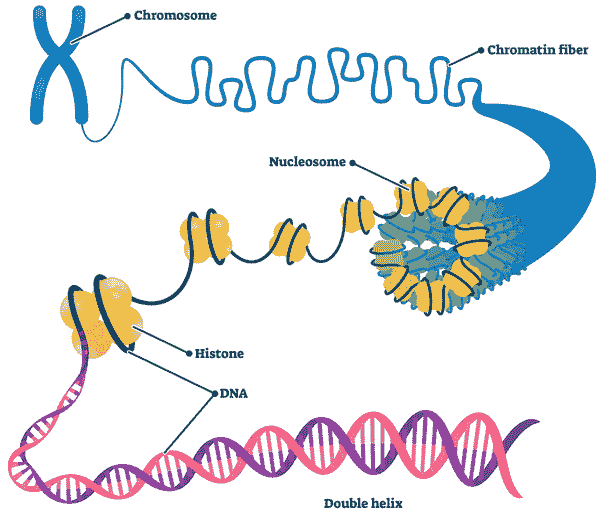
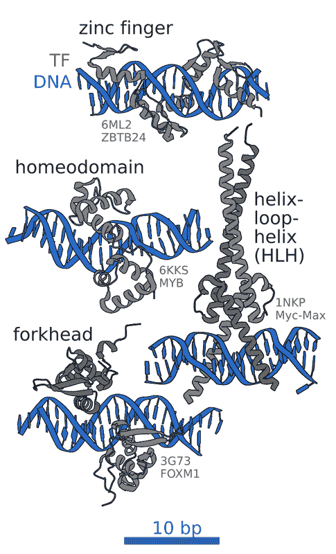
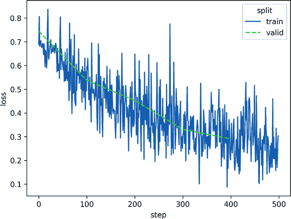
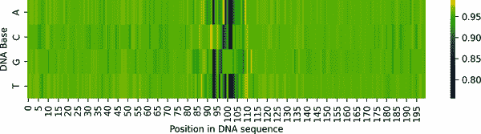
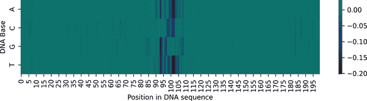
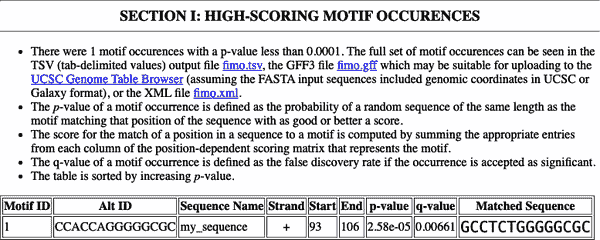
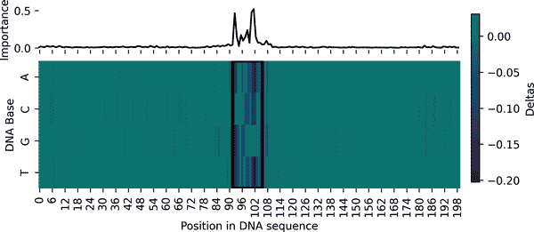
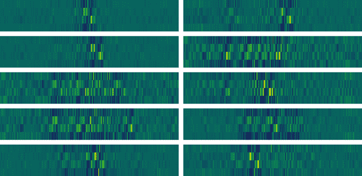
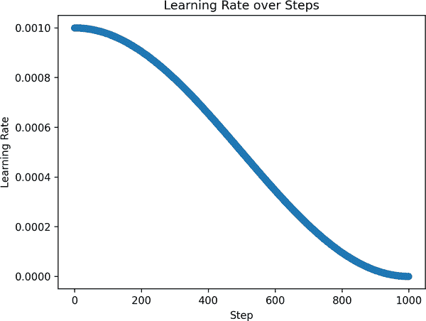

# 第三章. 学习 DNA 的逻辑

在本章中，我们将构建一个深度学习模型来预测 DNA 序列是否被一类称为*转录因子*（TFs）的蛋白质所结合。转录因子在基因调控中起着核心作用：它们结合到特定的 DNA 序列上，并影响附近基因是开启还是关闭。通过识别这些序列模式，我们可以开始解码基因组中嵌入的调控逻辑。

与前一章不同——我们使用了 Hugging Face 的现成蛋白质模型——在这里，我们将从头开始定义和训练自己的模型。这让我们有更多的控制权，并帮助我们更好地理解深度学习在生物数据上的工作原理。我们将探索基于卷积和基于转换器的架构，并介绍解释技术，帮助我们理解模型是如何进行预测的。

我们将分阶段解决这个问题，逐步增加复杂性：

1. 从简单开始

首先，我们将训练一个基本的卷积网络来预测 DNA 序列是否结合一个名为 CTCF 的单个转录因子。其结合行为相对容易预测，使其成为一个很好的起点。我们将构建完整的管道：加载数据、训练模型，并检查它是否捕捉到有意义的生物信号。

2. 增加复杂性

接下来，我们将扩展到预测序列是否结合 10 种不同的 TFs。我们将介绍正则化和归一化，改进我们的评估指标，并开始检查单个预测。我们还将使用突变实验和输入梯度来突出模型所依赖的序列部分——这是可解释性的第一步。

3. 集成高级技术

最后，我们将尝试添加转换器层来探索它们是否提高了性能，并继续剖析模型行为，以了解不同的架构选择如何影响学习。

这种分阶段的方法——从简单到复杂逐步构建——是我们普遍推荐的方法。它有助于保持模型的可解释性，使调试更容易，并在过程中建立信心。

在深入之前，我们将快速回顾一下支撑本章的生物和机器学习概念。

###### 小贴士

为了充分利用本章内容，请打开配套的 Colab 笔记本，并按照说明运行代码单元格。交互式执行代码将加深你的理解，并让你有机会实时实验这些概念。

# 生物学入门

令人惊讶的是，构建整个人类身体的全部指令都编码在单个细胞的 DNA 中。每个人类都是从一个小小的细胞开始的——大约 100 微米宽——其 DNA 紧密地包装在一个直径仅为 6 微米的细胞核中。这段 DNA 充当细胞分裂和分化等过程的蓝图，最终产生构成整个人类身体的多种组织和细胞类型。

###### 注意

几个术语的澄清：*基因组*指的是一个生物体中完整的 DNA 集合，包括其所有基因和其他遗传物质。虽然*遗传学*通常研究单个基因或小基因集，但*基因组学*采取更广泛的视角，通常分析个体或甚至物种的整个基因组。

人类基因组非常庞大——超过 30 亿个碱基对长——并携带了数十亿年的进化历史。但这个分子究竟是什么，它又是如何编码生物功能的？

## DNA 究竟是什么？

DNA 是遗传的分子——生命的根本代码。其双螺旋结构最早在 1953 年由沃森、克里克和富兰克林揭示，标志着生物科学的一个转折点。近半个世纪后，2001 年发表了人类基因组的第一份完整草图^(1)，为现代遗传学和基因组学奠定了基础。但这些里程碑相对较新，尽管我们现在对基因组中“有什么”了解很多，但我们仍然对它“如何”实际工作了解得惊人地少。

我们确实知道，DNA 由四种化学字母，或称为核苷酸碱基组成：`A`（腺嘌呤）、`C`（胞嘧啶）、`G`（鸟嘌呤）和`T`（胸腺嘧啶）。这些碱基形成长序列，携带遗传指令。完整的人类基因组大约包含 320 亿个这样的字母，打包在 23 对染色体中。为了适应细胞微小的细胞核，这段 DNA 缠绕在蛋白质上，并卷曲成紧凑、高度组织化的结构，称为*染色质*，如图图 3-1 所示。

尽管进行了数十年的研究，基因组仍然充满了未解之谜。其中只有大约 2%直接编码蛋白质——其余的部分在做什么？你的身体中的所有细胞如何共享相同的 DNA，却表现出如此不同的行为？什么控制着基因的使用时机，以及环境变化或发育过程中的变化如何影响这一过程？

这些谜团位于基因调控的核心，并且越来越明显，深度学习正在帮助我们探索它们。



###### 图 3-1\. DNA 以多层结构的形式打包到细胞核中。从双螺旋开始，它首先缠绕在组蛋白蛋白上形成核小体（线上的珠子），然后折叠成染色质纤维，最终形成染色体。来源：[国家环境卫生科学研究所](https://oreil.ly/h8M44)。

## 编码区和非编码区

人类基因组包含大约 20,000 个编码蛋白质的基因。这些构成了*编码区*——DNA 片段被转录成 RNA，然后翻译成蛋白质。每个蛋白质执行特定的任务，从构建细胞结构到催化化学反应。共同执行细胞的大部分基本功能。

然而，编码基因只占基因组的大约 2%。剩余的 98%是非编码 DNA。虽然它不产生蛋白质，但非编码 DNA 发挥着关键的调节作用，帮助控制基因何时何地被使用。事实上，与人类疾病相关的大多数遗传变异都发生在非编码区域——尽管我们对它们如何发挥作用的理解仍然有限。

一些非编码 DNA 产生调节基因表达的 RNA，而其他区域则有助于组织基因组的 3D 结构或作为调节蛋白的对接位点。一类特别重要的非编码区域是转录因子结合位点。这些是转录因子（TFs）附着以帮助调节基因活性的短 DNA 序列——它们是本章的核心焦点。

## 转录因子如何调控基因活性

转录因子是控制哪些基因被使用、何时使用以及在使用何种背景下使用的蛋白质。它们通过结合称为基序的短、特定 DNA 序列来实现这一点，这些基序通常位于基因附近。通过结合这些基序，转录因子可以激活或抑制转录。你可以把它们想象为基因组乐队的指挥——通过确定哪些区域被“演奏”以及何时演奏来指导表演。

转录因子参与几乎每一个生物学过程，从指导发育到协调细胞对压力或感染的响应。人类大约有 1,600 种不同的转录因子，每种转录因子都进化出识别特定 DNA 基序的能力。这些基序是短序列模式——通常长度为 6 到 15 个碱基对——转录因子优先结合。例如，研究广泛的转录因子 CTCF 结合一个具有中心模式`CCCTC`的核心基序。转录因子不会随机地跨越整个基因组——它们寻找这些首选序列。

这些基序在 DNA 螺旋中形成特定的 3D 形状，转录因子的蛋白结合域被设计成与之相匹配——就像一把钥匙插入锁中。实际上，这种相互作用通常比类比所暗示的更加灵活和动态，但物理匹配的概念仍然成立。

为了使这种相互作用更加具体，图 3-2 展示了不同转录因子与 DNA 结合的晶体结构。



###### 图 3-2\. 展示不同类型的转录因子结合域如何与 DNA 相互作用的晶体结构。每个灰色结构代表一个不同的转录因子结合域——锌指、同源域、螺旋-环-螺旋和叉头——与双链 DNA 分子结合。这些蛋白段通过这些序列形成的物理形状识别特定的 DNA 基序。就像一把钥匙插入锁中，蛋白质的结构与结合位点的 DNA 形状相匹配。这里展示的是来自蛋白质数据银行（PDB：6ML2，6KKS，1NKP，3G73）的实际解析结构。来源：[维基百科](https://oreil.ly/Nd4Tv)。

然而，并非每个匹配的基序在活细胞中实际上都结合了。事实上，基因组中基序匹配的数量远多于实际结合事件。这是因为结合取决于许多其他因素：

染色质可及性

紧密包装在染色质中的 DNA 对蛋白质的访问更困难。TF 更有可能在开放染色质区域结合。

DNA 甲基化

某些 TF，如 CTCF，对其结合位点上的甲基化（DNA 碱基的特定化学修饰）敏感，即使基序存在，也可能阻止结合。

细胞信号

细胞内部的信号——例如激素或压力反应——可以激活或抑制转录因子（TF）结合的能力。

其他蛋白质

局部环境中的辅助或阻断蛋白可以促进或抑制结合。

协同结合

许多 TF 在复合物中工作或招募其他因子以稳定结合并控制基因活性。

也许是更重要的是，真实细胞是动态的。分子在移动，浓度在变化，TF 结合事件在很短的时间尺度上发生。相比之下，大多数基因组数据集是静态快照——一个不断变化的场景的定格。在解释本章中的结合数据时，这一点值得记住。

## 测量转录因子结合的位置

在深度学习中，我们极其依赖实验数据——我们需要一些东西来学习。当涉及到研究 TF 时，这些数据通常来自实验室实验，这些实验测量特定 TF 在基因组中的结合位置。

基石湿实验室方法是[ChIP-seq](https://oreil.ly/IovSO)，即染色质免疫沉淀后测序。TF 不会永久地粘附在 DNA 上——它们不断地结合和解除结合。ChIP-seq 通过化学交联（粘合）蛋白质到 DNA 上，本质上将其固定在原位，捕捉了这个动态过程的快照。然后可以隔离、测序并将 DNA 片段映射回基因组，以确定蛋白质的结合位置。

ChIP-seq 数据通常以峰的形式可视化在 DNA 序列上——基因组中 TF 结合富集的区域。峰的高度反映了在该位置结合的强度或频率，而平坦的零信号则表示没有检测到结合发生。

###### 注意

为了简化数据以进行建模，ChIP-seq 峰可以二值化：不是保留完整的定量信号，而是应用一个阈值，并仅记录 TF 是否在给定区域结合。这将任务简化为二元分类问题——TF 是否结合到这个 DNA 序列上，这是我们将在本章中使用的设置。

# 机器学习基础

在生物学背景知识的基础上，我们现在回顾一些在本章中会用到的基本机器学习概念。如果你已经熟悉深度学习，可以自由地浏览这一节作为复习。我们将简要介绍基于*卷积*和*变换器*的架构，它们如何应用于生物序列数据，如 DNA，以及它们可以提供哪些见解。

## 卷积神经网络

*卷积神经网络*（CNN）是最广泛使用的深度学习架构之一。它们的核心优势在于能够从原始的、网格状输入数据中自动学习有用的模式——无论是图像中的像素还是 DNA 序列中的碱基——而无需手动设计特征。

CNN 最初是为图像识别任务开发的。在图像中，低级特征如边缘和纹理出现在小的局部区域，而高级概念如形状或物体是通过组合这些局部特征形成的。CNN 通过使用滑动在输入上提取局部模式的较小、可学习的*滤波器*来反映这种结构。随着我们堆叠更多的层，模型将局部特征组合成更抽象和全局的表示。

这种建模层次结构的能力证明在图像之外也非常有用。每当数据中有有意义的局部模式时——如分子中的子结构、DNA 中的基序或语音中的音素——CNN 通常表现良好。

###### 小贴士

我们在第五章中更详细地介绍了 CNN，在那里我们构建了一个皮肤癌分类器并探讨了常见的模型设计模式。现在，我们将提供本章所需的关键组件的简要概述。

让我们简要地浏览一下典型 CNN 的关键组件：

卷积层

这些是 CNN 的核心。一个卷积层包含多个滤波器（也称为*核*）——在输入上滑动的小权重矩阵，并计算点积。每个滤波器都像一个模式检测器，当它在输入中找到良好的匹配时就会亮起。应用卷积的结果是一个*特征图*，显示了模式发生的位置。

池化层

这些将特征图下采样以减少维度和计算。例如，*最大池化*只保留每个区域中最强的信号，帮助模型关注最显著的特征。

归一化

类似于*批量归一化*的层会将激活值重新缩放，使训练更加稳定和高效。它们减少了内部*协变量偏移*——激活值在训练过程中漂移的趋势——并且通常可以加快收敛速度。

全连接层

这些位于网络的末端，并使用先前层提取的特征进行最终预测——例如，是否一个 DNA 序列被转录因子结合。

CNNs 的一个关键特性是它们是*平移等变*的，这意味着无论模式出现在输入的哪个位置，都可以被识别。这对于 DNA 来说特别有用：无论结合基序位于序列的第 10 位还是第 90 位，它仍然是一个结合基序。

## DNA 序列卷积

尽管 CNNs 最初是为图像（像素的二维网格）开发的，但该架构可以轻松地适应一维数据，如 DNA 序列。在基因组学中，DNA 通常表示为独热编码矩阵，其中每个碱基（`A`、`C`、`G`、`T`）被转换为二进制向量。因此，100 个碱基的序列将变成一个 100×4 的矩阵。

然后，我们应用*一维卷积*——这些滤波器在一个维度上滑动，寻找 DNA 碱基短窗口中的模式。这些滤波器通常学会识别 DNA 基序的存在：我们之前提到的具有生物学意义的短序列模式，例如转录因子结合位点。例如：

+   浅层可能学会检测低级 DNA 特征，例如 DNA 中的简单 GC 丰富或 AT 丰富区域。

+   中层滤波器可能识别已知的 TF 基序。

+   深层可能学会学习更高阶的组合——例如共现基序或长距离依赖性。

重要的是，模型能够从标记数据中自动学习所有这些内容。它不需要被告知要寻找哪种基序——它通过优化当前任务（如预测 TF 结合）来发现有用的模式。

###### 注意

CNNs 已成为基于序列的生物学任务的标准架构，因为它们在能力、速度和可解释性之间提供了良好的平衡。与其他深度学习架构相比，CNNs 相对轻量级，易于训练，并且通常更容易解释：你可以可视化一个滤波器学到的基序以及它们在序列中的出现位置。

然而，它们的主要局限性在于它们在固定窗口的序列上操作，并且难以模拟远程碱基之间的相互作用。对于涉及长距离依赖性（序列中相隔较远元素之间的关系）的问题，我们通常转向不同类别的模型。

## Transformers

虽然 CNNs 在检测局部模式方面非常出色，但 Transformers 在建模序列中长距离关系方面特别强大。它们的核心理机制——*自注意力*——允许模型动态确定输入的哪些部分对于预测任何给定输出是相关的，无论这些部分相隔多远。

基于变压器的模型自 2017 年首次亮相以来已经彻底改变了深度学习。最初是为自然语言处理任务如翻译和摘要而设计的，变压器后来成为包括基因组学和蛋白质建模在内的广泛领域的最先进技术。早期的架构如 RNN 和 CNN 也可以处理序列，但变压器在需要理解全局序列上下文的任务上已经很大程度上超越了它们。

关键创新是**自注意力**：一种机制，允许序列中的每个标记“关注”每个其他标记，计算它们应该有多少影响力。这对于以下方面很有用：

+   语言：一个词的意义取决于远处的上下文

+   基因组学：位于数千个碱基之外的控制 DNA 基序可能会影响基因活性

这种灵活性使得变压器能够学习任意和复杂的依赖关系——这是 CNN 难以做到的。变压器的主要缺点是可扩展性：自注意力需要与序列长度成平方增长的计算。对于像全基因组序列这样的非常长的输入，这可能会成为瓶颈。然而，已经开发了许多高效的变压器变体（例如，Linformer、Longformer、Performer）来部分解决这一弱点。

###### 注意

如果你想深入了解变压器，我们推荐阅读 Jay Alammar 的优秀博客文章“[图解 Transformer](https://oreil.ly/WxzGl)”或[3Blue1Brown 的视频](https://oreil.ly/dLW40)关于注意力的内容。在这里，我们只简要介绍基础知识。

变压器的基石在于其分配**注意力**的能力——这是一种机制，允许序列中的每个位置动态地关注其他位置。这正是它们能够建模长距离依赖的原因。

## 注意力

从高层次来看，注意力是一个过程，通过结合序列中每个其他标记的信息来丰富每个标记的嵌入。这使得每个标记更加上下文感知，如图图 3-3 所示。


###### 图 3-3. 注意力机制将输入标记嵌入转换为上下文感知输出嵌入的高级可视化。序列中的每个标记（“the cat is black”）都会关注序列中的每个其他标记，使模型能够捕捉整个序列中的关系和依赖。输出也是四个标记，每个标记都富含来自其他标记的上下文信息。

简而言之，这是它的工作原理。模型首先通过学习线性变换创建三个版本的输入嵌入——查询（Q）、键（K）和值（V）。每个查询通过点积与所有键进行比较，产生一个分数，该分数反映了某个标记与另一个标记的相关性。然后，这些分数通过 softmax 函数进行归一化，产生注意力权重。最后，每个标记的新嵌入是通过值向量的加权和计算的，注意力权重决定了每个值贡献的大小。

让我们通过一个简单的例子来了解一下。假设我们有一个输入序列`the`、`cat`、`is`、`black`。在转换器模型中，每个标记不仅仅独立通过网络；它决定对每个其他标记给予多少注意力。例如，当处理单词`cat`时，模型可能会将高注意力权重分配给`the`，认识到冠词和名词通常相关。这有助于模型理解语法关系和上下文意义。

在基因组学中，注意力可以起到类似的作用。想象一个处理 DNA 序列以预测 TF 结合的模型。注意力机制允许模型询问：这个基序与上游或下游的其他元素（可能相距数千个碱基）的相关性如何？正如一个词的意义是由周围的词塑造的，一个序列基序的功能可能取决于散布在整个基因组中的其他元素。

一旦注意力通过上下文信息丰富了标记嵌入，结果就会通过一个*前馈网络*——通常是一个小型多层感知器，独立应用于每个标记。这个网络引入了非线性，并帮助模型捕捉更复杂的模式。然后，输出通过*残差连接*（有助于梯度流动）和*层归一化*（有助于稳定训练）。

总的来说，这个序列——注意力、前馈层、残差连接和归一化——形成了一个转换器块。一个完整的转换器模型通常是通过堆叠许多这样的块来构建的，允许信息在层之间流动和细化。随着标记通过连续的层，它们的表示变得越来越丰富，从局部模式到全局结构，一切都被捕捉到。

## 查询、键和值直觉

你可能会想：为什么要把输入转换成查询、键和值呢？关键思想是 Q、K 和 V 不仅仅是原始标记嵌入的冗余副本。它们是学习到的投影，允许模型从不同的角度看待相同的序列：

+   *查询*就像一个透镜，每个标记用它来表达它想要关注的。在我们的句子示例中，单词`black`可能使用它的查询来找到它所修饰的名词——`cat`。在 DNA 中，一个调控区域可能“寻找”在序列其他地方的兼容调控基序。查询说：“我在寻找 X。”

+   *关键*在于每个标记如何向他人展示自己：它编码了它提供的信息类型。继续这个类比，每个单词或 DNA 元素“宣传”它拥有的内容，说：“我包含 Y。”

+   *值*是如果查询决定键相关时实际传递的内容。换句话说，查询将自己与所有键进行比较以计算注意力权重，然后使用这些权重从整个序列中提取一系列值。

这种角色的分离使得模型能够更灵活地进行推理。而不是将序列的所有部分视为同等相关，每个标记根据其查询和其他标记的键决定当前对其重要的事情。然后，值提供有用的内容。

###### 注意

这种设计使得注意力工作像一个智能查找系统：标记宣传它们包含的内容（键），查询寻找匹配项，然后根据键与查询的匹配程度，以加权比例提取实际内容（值）。

重要的是，Q、K 和 V 投影都是从数据中学习的。它们最初是随机的，模型通过训练找出——如何最好地塑造这些表示以完成当前任务，无论是学习语法、预测调控活性还是模拟蛋白质相互作用。

## 多头注意力

*多头注意力*（MHA）通过并行运行多个注意力操作——称为*头*——来增强注意力机制。每个头学习专注于输入序列的不同部分或模式。例如，一个头可能专注于局部基序，而另一个头可能检测更广泛的相互作用或微妙的上下文线索。

通过结合这些多个视角，MHA 允许模型捕捉到更丰富、更多样化的数据关系集，这超出了单个注意力操作所能学习的内容。

###### 小贴士

虽然不同的头通常学习到一些冗余的模式，但这种并行结构增加了模型的表达能力和灵活性。所有头的输出被连接起来，并通过线性变换产生最终的表示，然后输入到后续模型层中。

从本质上讲，MHA 让 transformer 能够同时关注多种类型的交互，这对于存在不同尺度上的各种信号和依赖关系的复杂生物序列特别有用。

## 表示位置信息

最后一点：基本的自注意力是*位置不变的*，这意味着它本身不捕获序列中标记的顺序或位置。为了解决这个问题，transformer 模型包括位置编码或其他机制，注入关于标记相对或绝对位置的信息，使模型能够理解序列顺序。在原始的 transformer 论文中，将正弦函数添加到标记嵌入中，以提供这种位置信息。

在完成对转换器的简要概述后，让我们继续本章中我们将应用的一些模型解释技术。

## 模型解释

深度学习模型的一个常见批评是它们像一个 *黑盒*——它们可能产生准确的预测，但通常不清楚这些预测是如何做出的，或者模型使用了什么内部推理。虽然深度学习模型通常不如线性模型或决策树等简单方法可解释，但有一些技术可以探测其内部工作原理。这些技术属于 *模型解释* 的范畴。

深度学习的模型解释是一个广泛且活跃的研究领域，因此在这里我们简要概述了在 DNA 建模空间中最常用的技术：

突变

为了了解模型依赖哪些输入特征，我们系统地改变（或 *突变*）输入的一部分，并观察模型的预测如何变化。例如，在从 DNA 序列预测基因表达时，我们可以打乱、替换或删除某些碱基，并观察预测是否发生显著变化。大的变化表明突变区域对模型很重要。

+   优点：这是直接且直观的。它提供了丰富且局部的洞察。

+   缺点：它计算成本高，因为每个突变都需要模型的一次单独前向传递。

输入梯度

一种更快但近似的方法是计算模型输出相对于每个输入特征的梯度。这个梯度显示了预测对每个输入元素微小变化的敏感性。

+   优点：它效率高，因为它只需要一次反向传递来生成重要性图。

+   缺点：它可能噪声大且不够精确，使得区分信号和噪声更困难。

注意力机制

对于包含注意力的模型，我们可以检查注意力权重，以查看模型在做出预测时关注的地方。

+   优点：这提供了模型关注点和交互的自然可解释的可视化。

+   缺点：注意力与输入序列长度成平方级增长，这意味着在实践中，我们无法在不以某种方式压缩的情况下使用注意力来建模非常长的 DNA 字符串。

这些方法有许多扩展和改进，模型解释在深度学习生物学研究论文中越来越标准化。

接下来，我们将更深入地探讨本章中我们将实施的两种解释方法：*in silico* 突变和输入梯度。

## In Silico Saturation 突变

*In silico 饱和突变生成*（ISM）可能听起来很复杂，但本质上它涉及系统地改变生物序列（如 DNA 或蛋白质）的每一个可能的改变（或突变），并为每个突变的序列生成一个单独的模型预测。因为这需要通过模型进行许多正向传递，所以计算成本很高。然而，它提供的关于每个可能的变异如何影响输出的详细见解通常可以证明这种成本是合理的。

###### 注意

术语分解：它被称为*突变生成*，因为我们诱导突变，*饱和*，因为测试了所有可能的突变，以及*in silico*，因为这些预测是通过计算而不是在实验室中进行实验完成的。

图 3-4 显示了本章后面我们将生成的示例图。


###### 图 3-4\. 一个 in silico 饱和突变生成图的示例，显示了跨越 200 个碱基 DNA 序列的转录因子结合预测概率。x 轴代表 DNA 序列位置，而 y 轴显示了每个位置的三种可能的突变（包括对原始碱基的突变，这没有影响，设置为零）。在这个例子中，大多数突变效应是负的（颜色较深），表明改变碱基通常会降低预测的结合概率。这种方法由于需要大量正向传递来生成这个输出矩阵（这里，3 种突变×200 个位置=600 个模型预测）而计算成本高昂。

ISM 图有助于快速突出序列中哪些部分对模型的预测最重要。因为它们可视化最显著或最具影响力的输入区域，它们通常被称为*显著性图*。在这个例子中，图表明突变任何中央碱基可能会破坏蛋白质结合的基序，因为这些突变通常会导致预测的结合概率降低（用负值表示）。

## 输入梯度

输入梯度提供了一种更快的方法来生成显著性图，总结哪些序列部分对模型的预测影响最大。从概念上讲，它们是模型输出相对于其输入特征的导数。如果你之前训练过神经网络，你已经遇到过梯度——通常与模型参数相关联以指导权重更新。

输入梯度遵循相同的原则，但它们将重点从参数转移到输入本身。通过计算输出如何对每个输入位置的微小扰动做出反应，我们可以评估模型的敏感性。对于 DNA 序列，这意味着确定哪些碱基对预测如 TF 结合有最大的影响。在给定碱基上的大梯度表明，改变它将显著影响模型的输出——表明该碱基很重要。

具体来说，对于一个 TF 结合预测：

+   在一个碱基上的一个*大的负梯度*表明改变它将显著降低结合概率，可能破坏转录因子需要正确拟合的基序。

+   一个*大的正梯度*表明改变它将显著增加结合概率，可能通过加强现有的基序或创建一个新的基序，从而提高 DNA 和转录因子之间的物理结合亲和力。

###### 注意

当输入是一个独热编码的 DNA 序列而不是连续标量值时，“对输入进行微小改变”意味着什么？每个 DNA 序列，每个碱基（A，T，C，G）通常表示为一个二进制向量（例如，`[1, 0, 0, 0]`表示`A`）。然而，在梯度计算过程中，我们将这些向量视为可以连续变化——允许像`[0.9, 0.1, 0, 0]`这样的分数值。虽然这样的分数碱基在生物学上没有意义，但这种数学抽象使我们能够计算梯度，并深入了解哪些位置对预测有影响。

你可以将输入梯度视为一种更快但更近似的替代方法，即模拟饱和突变。输入梯度提供了一个关于重要区域的总体概念，而饱和突变直接测试了每种可能的突变效果，但计算成本高昂。

这标志着生物学和机器学习入门课程的结束。现在让我们深入探索和建模数据，以预测 DNA 序列中的转录因子结合。

# 构建一个简单的原型

本章我们将要解决的是一项*二元分类问题*：给定一个 200 个碱基的 DNA 序列，我们能否预测它是否与一个称为 CTCF 的特定转录因子结合？在人类 1500 多个转录因子中，CTCF 因其对基因组 3D 结构的组织作用而突出——将 DNA 折叠成环和区域，以调节基因活性。

CTCF 也是一个很好的起点，因为其结合行为相对容易建模。它识别一个被充分表征的、高度保守的基序，具有强烈的序列特异性，这意味着其结合位点比许多其他转录因子的结合位点更容易预测。这使得 CTCF 成为构建和解释基于序列的转录因子结合模型的理想起点。稍后，我们将扩大范围，预测 10 种不同的转录因子结合。

与本书中的其他章节一样，我们将从探索数据集、构建一个简单的原型模型开始，然后迭代地扩展和改进它。

## 构建数据集

我们将要使用的数据库看起来像图 3-5。


###### 图 3-5. 输入数据集由 200 个碱基长的 DNA 序列组成，每个序列都有一个相关的二进制标签，表示蛋白质 CTCF 是否与之结合。

这个任务灵感来源于最近一篇 2024 年论文预印本中提出的一个评估挑战，该预印本的数据集来源于 2023 年的一项基因组学解释研究.^(3)，^(4)

### 加载标记序列

我们首先检查训练数据集：

```py
import pandas as pd

from dlfb.utils.context import assets

train_df = pd.read_csv(assets("dna/datasets/CTCF_train_sequences.csv"))
train_df

```

输出：

```py
                  sequence  label transcription_factor subset
0      TACCACATGAGTTCTC...      1                 CTCF  train
1      CATCAACACTCGTGCG...      0                 CTCF  train
2      GCACACAGCGCAGGAA...      1                 CTCF  train
...                    ...    ...                  ...    ...
61080  CCTCCCTCCCATCCCC...      1                 CTCF  train
61081  CAGGAATGCACCGGAA...      0                 CTCF  train
61082  AAAACAGAAACTGAAA...      0                 CTCF  train

[61083 rows x 4 columns]

```

在训练数据集中，两个类别出现得相当平衡（均匀表示），因此我们不需要通过下采样多数类别来进行任何重平衡：

```py
train_df["label"].value_counts()

```

输出：

```py
label
1    30545
0    30538
Name: count, dtype: int64

```

为了将 DNA 序列数值化，我们需要将它们转换为单热格式。函数`dna_to_one_hot`执行这个映射：

```py
import numpy as np

def dna_to_one_hot(dna_sequence: str) -> np.ndarray:
  """Convert DNA into a one-hot encoded format with channel ordering ACGT."""
  base_to_one_hot = {
    "A": (1, 0, 0, 0),
    "C": (0, 1, 0, 0),
    "G": (0, 0, 1, 0),
    "T": (0, 0, 0, 1),
    "N": (1, 1, 1, 1),  # N represents any unknown or ambiguous base.
  }
  one_hot_encoded = np.array([base_to_one_hot[base] for base in dna_sequence])
  return one_hot_encoded

```

让我们看看单热编码在样本 DNA 序列“AAACGT”上的样子：

```py
dna_to_one_hot("AAACGT")
```

输出：

```py
array([[1, 0, 0, 0],
       [1, 0, 0, 0],
       [1, 0, 0, 0],
       [0, 1, 0, 0],
       [0, 0, 1, 0],
       [0, 0, 0, 1]])

```

我们可以将这个转换器应用于整个训练数据集，以生成数值训练数据`x_train`，如下所示：

```py
x_train = np.array([dna_to_one_hot(seq) for seq in train_df["sequence"]])
y_train = train_df["label"].values[:, None]

```

在这里，`y_train`包含二进制目标标签：`0`表示序列不与 CTCF 结合，`1`表示序列与 CTCF 结合。

对于这个问题，数据集加载代码相当简单，但我们可以将其包装成一个方便的函数`load_dataset`，以便更干净地使用：

```py
def load_dataset(sequence_db) -> dict[str, np.ndarray]:
  """Load sequences and labels from a CSV into numpy arrays."""
  df = pd.read_csv(sequence_db)
  return {
    "labels": df["label"].to_numpy()[:, None],
    "sequences": np.array([dna_to_one_hot(seq) for seq in df["sequence"]]),
  }

```

### 将数据转换为 TensorFlow 数据集

接下来，我们将训练数据转换为 TensorFlow 数据集。这种格式使得在模型训练期间高效迭代批次变得容易，尤其是在对数据进行多次 epoch 的打乱和重复时：

```py
def convert_to_tfds(
  dataset, batch_size: int | None = None, is_training: bool = False
):
  """Convert DNA sequences and labels to a TensorFlow dataset."""
  ds = tf.data.Dataset.from_tensor_slices(dataset)
  if is_training:
    ds = ds.shuffle(buffer_size=len(dataset["sequences"]))
    ds = ds.repeat()
  batch_size = batch_size or len(dataset["labels"])
  ds = ds.batch(batch_size)
  ds = ds.prefetch(tf.data.experimental.AUTOTUNE)
  return ds

```

```py
batch_size = 32

train_ds = convert_to_tfds(
  load_dataset(assets("dna/datasets/CTCF_train_sequences.csv")),
  batch_size=batch_size,
  is_training=True,
)

```

在前面的代码中，我们通过启用批处理、打乱和重复创建了一个训练数据集`train_ds`。让我们通过从数据集中抽取一个批次并检查其形状和内容来进行合理性检查：

```py
batch = next(train_ds.as_numpy_iterator())
print(f'Batch sequence shape: {batch["sequences"].shape}')
print(f'Batch sequence instances: {batch["sequences"][:3,:3,]}...')
print(f'Batch labels shape: {batch["labels"].shape}')
print(f'Batch labels instances: {batch["labels"][:3,]}...')

```

输出：

```py
Batch sequence shape: (32, 200, 4)
Batch sequence instances: [[[0 1 0 0]
  [0 0 1 0]
  [0 0 1 0]]

 [[1 0 0 0]
  [1 0 0 0]
  [0 1 0 0]]

 [[1 0 0 0]
  [0 1 0 0]
  [0 1 0 0]]]...
Batch labels shape: (32, 1)
Batch labels instances: [[0]
 [1]
 [0]]...

```

这看起来是合理的。我们看到数据具有形状（`32`，`200`，`4`），表示批次大小为`32`，序列长度为 200，每个 DNA 碱基有 4 个通道，正如预期的那样。标签具有形状（`32`，`1`），因为每个标签都是一个简单的二进制`0`或`1`。

对于验证，由于数据集较小，我们可以将其结构化为一个单独的大批次：

```py
valid_ds = load_dataset(assets("dna/datasets/CTCF_valid_sequences.csv"))

```

现在我们已经将数据格式化为正确的格式，我们准备构建和训练我们的第一个简单模型。

## 定义一个简单的卷积模型

接下来，我们定义一个由两个 1D 卷积层组成、随后是展平和全连接（密集）层的简单 CNN：

```py
class ConvModel(nn.Module):
  """Basic CNN model for binary sequence classification."""

  conv_filters: int = 64  # Number of filters for conv layers.
  kernel_size: tuple[int] = (10,)  # Kernel size for 1D conv layers.
  dense_units: int = 128  # Units in first dense fully-connected layer.

  @nn.compact
  def __call__(self, x):
    # First convolutional layer.
    x = nn.Conv(
      features=self.conv_filters, kernel_size=self.kernel_size, padding="SAME"
    )(x)
    x = nn.gelu(x)
    x = nn.max_pool(x, window_shape=(2,), strides=(2,))

    # Second convolutional layer.
    x = nn.Conv(
      features=self.conv_filters, kernel_size=self.kernel_size, padding="SAME"
    )(x)
    x = nn.gelu(x)
    x = nn.max_pool(x, window_shape=(2,), strides=(2,))

    # Flatten the values before passing them to the dense layers.
    x = x.reshape((x.shape[0], -1))

    # First dense layer.
    x = nn.Dense(self.dense_units)(x)
    x = nn.gelu(x)

    # Second dense layer.
    x = nn.Dense(self.dense_units // 2)(x)
    x = nn.gelu(x)

    # Output layer (single unit for binary classification).
    return nn.Dense(1)(x)

```

这个模型架构相当“无装饰”，但应该已经能够捕捉 DNA 序列中的局部模式。我们可以像这样实例化我们的模型：

```py
model = ConvModel()

```

在 JAX 中初始化模型参数时，我们需要提供一个虚拟输入张量，该张量与模型输入的预期形状相匹配。虽然我们可以使用数据集的实际批次，但通常更简单的是使用一个大小为 1 的 ones 张量，其形状与单个编码的 DNA 序列相同。重要的是，用于这个虚拟输入的批次大小不会影响模型初始化——JAX 根据单个输入样本的形状（不包括批次维度）来初始化参数。这意味着模型可以在以后以任何批次大小进行训练或用于推理。

```py
import jax
import jax.numpy as jnp

dummy_input = jnp.ones((1, *batch["sequences"][1,].shape))
print(dummy_input.shape)

rng_init = jax.random.PRNGKey(42)
variables = model.init(rng_init, dummy_input)
params = variables["params"]

```

输出：

```py
(1, 200, 4)

```

这个虚拟输入允许 JAX 推断所有模型参数的形状，并且随机的键`rng_init`为任何随机初始化提供种子，确保可重复性。

### 检查模型张量形状

理解并跟踪张量形状是机器学习的关键部分。始终养成验证数据流经模型时数据形状的习惯。

###### 小贴士

作为一项实际练习，尝试在模型的`__call__`方法内部的不同位置添加`print(x.shape)`语句，然后重新运行`model.init`步骤，以观察数据流经模型层时形状如何变化。

这里是模型中一些改变张量形状的关键操作：

+   卷积层（`nn.Conv`）：这些层可以修改通道维度。例如，我们的输入开始时有四个通道（DNA 碱基），但第一个卷积将通道数增加到 64，有效地学习 64 个不同的序列特征或基序。此外，卷积的`padding`选项会影响序列长度维度：

    +   `adding='SAME'`保留序列长度。

    +   `padding='VALID'`根据核大小减少它。尝试在这两者之间切换以查看对序列长度的影响。

+   最大池化层（`nn.max_pool`）：这些层通过下采样减少序列长度。在我们的模型中，每个最大池化层将长度减半，从 200 → 100 → 50 碱基。为了更激进地减少空间轴（例如，每次减少 5 倍），相应地调整`window_shape`和`strides`参数（通常，这些参数设置为相同的值以避免重叠窗口并简化下采样）。

+   展平（`reshape`）：在将数据传递到密集层之前，张量从`(batch_size, sequence_length, channels)`重塑为`(batch_size, flattened_features)`。这将空间和通道维度折叠为每个示例的一个长向量，为全连接层做准备。

一旦初始化了模型参数，您可以检查它们以确认层结构和形状。使用以下方式检查参数键（层名称）：

```py
params.keys()

```

输出：

```py
dict_keys(['Conv_0', 'Conv_1', 'Dense_0', 'Dense_1', 'Dense_2'])

```

然后，检查每个层的核形状以验证预期的参数维度：

```py
for layer_name in params.keys():
  print(f'Layer {layer_name} param shape: {params[layer_name]["kernel"].shape}')

```

输出：

```py
Layer Conv_0 param shape: (10, 4, 64)
Layer Conv_1 param shape: (10, 64, 64)
Layer Dense_0 param shape: (3200, 128)
Layer Dense_1 param shape: (128, 64)
Layer Dense_2 param shape: (64, 1)

```

关于这些形状的一些说明：

+   对于卷积层，参数形状为`(kernel_size, input_channels, output_channels)`。例如，`Conv_0`的核大小为 10，输入通道为 4（DNA 碱基），并输出 64 个特征图。

+   密集层的形状为（`input_features`, `output_units`）。例如，`Dense_0`将 3200 个展平特征（50 序列长度 * 64）映射到 128 个单元。

在模型初始化并探索参数形状之后，让我们开始设置我们的训练循环。

### 使用模型进行预测

实际上，我们已经在使用随机初始化的参数从模型中获取预测，尽管预测将是随机的。我们通过在序列的一批上调用`model.apply`来做出预测：

```py
logits = model.apply({"params": params}, batch["sequences"])

# Apply sigmoid to convert logits to probabilities.
probs = nn.sigmoid(logits)

# Print just the first few predictions.
print(probs[0:5])

```

输出：

```py
[[0.48703438]
 [0.49615338]
 [0.48638064]
 [0.4973824 ]
 [0.48106888]]

```

由于模型未经过训练，预测概率将大约为 0.5，这反映了我们的随机参数化模型的纯猜测。

### 定义损失函数

现在让我们使用`optax`库定义一个二元交叉熵损失函数，我们可以使用它来训练我们的模型参数：

```py
import optax

def calculate_loss(params, batch):
  """Make predictions on batch and compute binary cross entropy loss."""
  logits = model.apply({"params": params}, batch["sequences"])
  loss = optax.sigmoid_binary_cross_entropy(logits, batch["labels"]).mean()
  return loss

```

我们可以使用它来计算初始批次的损失：

```py
calculate_loss(params, batch)

```

输出：

```py
Array(0.69774264, dtype=float32)

```

这给出了训练前的基线损失值。随着模型的学习，这个损失应该大幅下降。

###### 注意：

为什么使用二元交叉熵损失？在本章中，我们预测 TF 是否绑定到给定的 DNA 序列——这是一个经典的二元分类任务。二元交叉熵是这种设置的标准损失函数：它衡量模型的预测概率与真实二元标签之间的匹配程度。

它对自信但错误的预测施加更重的惩罚，鼓励接近 0 或 1 的准确输出。你也可以将其视为一个信号重建问题：模型试图逼近一个隐藏的二进制信号，而交叉熵对噪声或偏离目标的估计施加了尖锐的成本。

### 定义 TrainState

要开始训练模型，我们首先需要定义优化器。我们将使用学习率为 1e-3 的 Adam，这是一个常见的默认值，通常适用于各种问题：

```py
learning_rate = 0.001

tx = optax.adam(learning_rate)

```

通过这个，我们现在有了初始化训练状态的所有组件。为此，我们将使用 Flax 的`TrainState`类，它是一个包含所有重要训练对象（模型、参数和优化器）的容器：

```py
from flax.training.train_state import TrainState

state = TrainState.create(apply_fn=model.apply, params=params, tx=tx)

```

为了方便起见，让我们定义一个函数来创建训练状态：

```py
def create_train_state(model, rng, dummy_input, tx) -> TrainState:
  variables = model.init(rng, dummy_input)
  state = TrainState.create(
    apply_fn=model.apply, params=variables["params"], tx=tx
  )
  return state

```

### 定义单个训练步骤

最后，将所有这些放在一起，我们可以编写一个函数来运行一个训练迭代，它执行以下步骤：

1. 前向传播

接收一批数据，根据当前参数进行模型预测并计算损失

2. 向后传播：

计算损失相对于参数的梯度

3. 更新

使用计算出的梯度，更新参数以最小化模型的损失

这些步骤发生在`train_step`函数中：

```py
@jax.jit
def train_step(state, batch):
  """Run single training step to compute gradients and update model params."""
  grad_fn = jax.value_and_grad(calculate_loss, has_aux=False)
  loss, grads = grad_fn(state.params, batch)
  state = state.apply_gradients(grads=grads)
  return state, loss

```

让我们运行一个训练步骤：

```py
state, loss = train_step(state, batch)

```

如果我们的设置工作良好，训练损失应该已经在这个批次上降低。让我们检查：

```py
calculate_loss(state.params, batch)

```

输出：

```py
Array(0.63649833, dtype=float32)

```

事实上，损失确实低于运行`train_step`之前的损失。随着模型和训练循环就绪，让我们设置一个完整的训练运行。

### 训练简单模型

现在我们将多次运行前面的`train_step`以优化模型。在这里，我们训练 500 步，并定期在验证集上进行评估：

```py
import tqdm

# Reinitialize the model state to ensure we start fresh each time cell is run.
rng_init = jax.random.PRNGKey(42)
state = create_train_state(model, rng_init, dummy_input, tx)

# Keep track of both the training and validation set losses.
train_losses, valid_losses = [], []
train_batches = train_ds.as_numpy_iterator()

# We use tqdm, which is a progress bar.
for step in tqdm.tqdm(range(500)):
  batch = next(train_batches)
  state, loss = train_step(state, batch)
  train_losses.append({"step": step, "loss": loss.item()})

  # Compute loss on the entire validation set occasionally (every 100 steps).
  if step % 100 == 0:
    valid_loss = calculate_loss(state.params, valid_ds)
    valid_losses.append({"step": step, "loss": valid_loss.item()})

losses = pd.concat(
  [
    pd.DataFrame(train_losses).assign(split="train"),
    pd.DataFrame(valid_losses).assign(split="valid"),
  ]
)

```

在图 3-6 中，我们可以绘制出这次运行产生的训练和验证损失曲线：

```py
import matplotlib.pyplot as plt
import seaborn as sns

from dlfb.utils.metric_plots import DEFAULT_SPLIT_COLORS

sns.lineplot(
  data=losses,
  x="step",
  y="loss",
  hue="split",
  style="split",
  palette=DEFAULT_SPLIT_COLORS
);

```



###### 图 3-6. 随着学习步骤的增加，训练和验证损失。两者都在下降，表明模型随着时间的推移在数据中学习信号。请注意，由于每一步都是在数据的小批次上计算的（而不是整个训练集），因此训练损失曲线相对较嘈杂，这引入了变异性。

达到这个阶段——你有一个工作的模型、数据集，并且随着损失的下降进行训练——是一个重要的里程碑。本章的其余部分将专注于改进和扩展这个基础。

### 检查模型的合理性

在进行更复杂的操作之前，我们应该首先检查模型是否学到了一些合理的东西。一个简单的检查是验证训练好的模型在已知的 DNA 基序上的行为是否符合预期。例如，通过在线搜索，我们可以看到 CTCF 转录因子已知更喜欢结合包含类似`CCACCAGGGGGCGC`基序的 DNA 序列。让我们构建一个包含这个基序重复的 200 碱基长的 DNA 字符串，并将其转换为模型期望的 one-hot 编码格式：

```py
ctcf_motif_dna = "CCACCAGGGGGCGC" * 14 + "AAAA"
print("Length of CTCF motif-filled DNA string:", len(ctcf_motif_dna))

# We add the None here as a batch axis, since our model expects batched input.
ctcf_input = dna_to_one_hot(ctcf_motif_dna)[None, :]
ctcf_input.shape

```

输出：

```py
Length of CTCF motif-filled DNA string: 200
(1, 200, 4)

```

我们预计模型将预测 CTCF 结合这个序列的高概率，因为它富含相关的基序。让我们检查一下：

```py
jax.nn.sigmoid(model.apply({"params": state.params}, ctcf_input))

```

输出：

```py
Array([[0.9994091]], dtype=float32)

```

确实如此——预测的结合概率非常接近 1。这意味着模型已经学会了在 DNA 序列中识别这个基序，并将其与 CTCF 结合相关联。

相反，如果我们构建一些伪随机 DNA 字符串，模型应该预测 CTCF 结合它们的概率相对较低：

```py
random_dna_strings = [
  "A" * 200,
  "C" * 200,
  "G" * 200,
  "T" * 200,
  "ACGTACGT" * 25,
  "TCGATCGT" * 25,
  "TATACGCG" * 25,
  "CAGGCAGG" * 25,
]

probabilities = []

for random_dna_string in random_dna_strings:
  random_dna_input = dna_to_one_hot(random_dna_string)[None, :]

  probabilities.append(
    jax.nn.sigmoid(model.apply({"params": state.params}, random_dna_input))[0]
  )

probabilities

```

输出：

```py
[Array([0.00025924], dtype=float32),
 Array([6.9913156e-05], dtype=float32),
 Array([6.1404e-05], dtype=float32),
 Array([2.6038255e-05], dtype=float32),
 Array([0.10472302], dtype=float32),
 Array([0.00381694], dtype=float32),
 Array([0.01843039], dtype=float32),
 Array([0.00171606], dtype=float32)]

```

如预期的那样，这些概率看起来相对较低，这意味着 CTCF 蛋白不太可能结合这些随机的 DNA 序列。这完成了对我们方法的基本合理性检查，但让我们进一步深入了解一下这个模型已经学到了关于 DNA 序列的哪些知识。

# 增加复杂性

在本节中，我们介绍了对我们建模方法的两个重要扩展。

首先，我们关注**模型解释**。我们将应用早期机器学习入门中提到的两种技术——在硅突变（ISM）和输入梯度，以更好地理解模型学到了什么。这些方法产生**贡献分数**（或**显著性图**），为 DNA 序列中的每个碱基分配一个重要性值，表明该碱基对模型预测 TF 结合的影响程度。

第二，我们将扩大预测任务的范围。我们不仅预测一个转录因子（CTCF）的结合，我们还为数据集中的所有 10 个转录因子训练模型。这使我们能够探索模型性能在转录因子之间的变化，以及它们之间基序偏好的差异。

这些步骤共同加深了我们对于模型行为和所建模的生物任务复杂性的理解。在此之后，我们将把注意力转向改进模型架构本身。

## 进行在硅突变

回想一下引言中提到的 ISM 技术，这是一种将 DNA 序列中的每个碱基系统地逐个突变到所有可能的替代碱基的技术，并量化每个突变对给定输出（在这个例子中，是 CTCF 结合概率）的影响。这使我们能够确定哪些区域对输出很重要——不重要的区域可以自由突变，而不会影响预测，而重要的区域会显著影响转录因子结合的概率。

在进行所有可能的突变之前，让我们首先检查仅进行单个突变的效果。我们将从验证集中识别一个结合 CTCF 蛋白的 DNA 序列（即标签为`1`）：

```py
# The first positive example of a sequence that binds the transcription factor.
first_positive_index = np.argmax(valid_ds["labels"].flatten() == 1)

original_sequence = valid_ds["sequences"][first_positive_index].copy()
print(f'This sequence has label: {valid_ds["labels"][4]}')

```

输出：

```py
This sequence has label: [1]

```

接下来，让我们检查模型对这个未修改的序列的预测：

```py
pred = nn.sigmoid(
  model.apply({"params": state.params}, original_sequence[None, :])
)
pred

```

输出：

```py
Array([[0.9581409]], dtype=float32)

```

原始序列的预测结合概率为 95.8%。

现在让我们在位置 100 处创建一个单一突变。原始碱基是一个`G`（编码为`[0, 0, 1, 0]`），我们将其更改为一个`C`（编码为`[0, 1, 0, 0]`）：

```py
sequence = original_sequence.copy()
print(f"Original base at index 100: {sequence[100]}")

sequence[100] = np.array([0, 1, 0, 0])
print(f"Mutated base at index 100: {sequence[100]}")

```

输出：

```py
Original base at index 100: [0 0 1 0]
Mutated base at index 100: [0 1 0 0]

```

我们现在将再次运行模型，看看这个突变是否对预测有可测量的影响：

```py
pred_with_mutation = nn.sigmoid(
  model.apply({"params": state.params}, sequence[None, :])
)
pred_with_mutation

```

输出：

```py
Array([[0.93434644]], dtype=float32)

```

突变后，模型的预测结合概率降至 93.4%，下降了超过 2.4%。这表明即使在敏感位置的单碱基变化也会对模型的输出产生重大影响。

既然我们已经观察到单个突变如何影响预测，让我们将这种方法扩展到系统地突变序列中的每个位置。这将使我们能够更全面地了解哪些碱基对模型的预测最为重要。

### 实施计算机模拟饱和突变

这是我们实现的基本计划：

突变

从原始序列开始。在每个位置，将碱基更改为其他三种可能的 DNA 碱基之一。

预测

在每个突变的序列上运行模型并记录预测的结合概率。

聚合

收集所有结果以确定哪些突变会引起有意义的改变。

我们首先生成所有可能的单碱基突变：

```py
def generate_all_mutations(sequence: np.ndarray) -> np.ndarray:
  """Generate all possible single base mutations of a one-hot DNA sequence."""
  mutated_sequences = []
  for i in range(sequence.shape[0]):
    # At each position, one the four 'mutations' is the original base (no-op).
    for j in range(4):
      mutated_sequence = sequence.copy()
      mutated_sequence[i] = np.zeros(4)
      mutated_sequence[i][j] = 1
      mutated_sequences.append(mutated_sequence)

  sequences = np.stack(mutated_sequences)
  return sequences

mutated_sequences = generate_all_mutations(sequence=original_sequence.copy())
print(f"Shape of mutated sequences: {mutated_sequences.shape}")

```

输出：

```py
Shape of mutated sequences: (800, 200, 4)

```

现在我们有 800 个序列：每个 200 个位置有四个变体。尽管每个位置只有三个是真正的突变（因为将`A`突变到`A`是无操作），但我们包括所有四个以简化下游逻辑。

我们现在可以一次性对这些突变序列进行预测：

```py
preds = nn.sigmoid(model.apply({"params": state.params}, mutated_sequences))

# Reshape to get the shape (sequence_length, dna_bases).
preds = preds.reshape((200, 4))

```

让我们可视化每个突变序列的预测结合概率，如图 3-7 图 3-7 所示：

```py
plt.figure(figsize=(20, 3))
sns.heatmap(preds.T, cmap="RdBu_r", yticklabels=["A", "C", "G", "T"])
plt.xlabel("Position in DNA sequence")
plt.ylabel("DNA Base");

```



###### 图 3-7\. 200 碱基对 DNA 区域的所有可能变体及其对应的 TF 结合概率，以热图形式表示。x 轴表示 DNA 序列中的位置，y 轴表示该位置上每个可能的 DNA 碱基。值表示 CTCF 结合的预测概率。

这表明：

+   大多数突变对预测的影响不大。模型预测含有大多数突变的序列接近原始 95.8%的 CTCF 结合概率。

+   一个中心区域似乎确实对结合预测有显著影响。

但我们真正关心的是每个突变对预测的影响程度。让我们减去原始（未突变）的预测概率，并在图 3-8 图 3-8 中将颜色图中心对齐到零：

```py
baseline_pred = nn.sigmoid(
  model.apply({"params": state.params}, original_sequence[None, :])
)
deltas = preds - baseline_pred

plt.figure(figsize=(20, 3))
sns.heatmap(deltas.T, center=0, cmap="RdBu_r", yticklabels=["A", "C", "G", "T"])
plt.xlabel("Position in DNA sequence")
plt.ylabel("DNA Base");

```



###### 图 3-8。在硅突变的结果显示每个可能的突变对预测 CTCF 结合概率的变化。浅色和深色表示与原始预测的偏差，较浅的颜色表示增加预测结合的突变，较深的颜色表示减少结合的突变。

现在，热图更清晰了：

+   大多数位置较浅，意味着它们的突变影响很小。

+   中心的一些碱基是深色（结合减少）或浅色（结合增加），显示出有意义的影响。

我们可以使用辅助函数`describe_change`来量化突变效应。

这允许我们查看突变位置 100 对所有碱基的影响：

```py
for i in range(4):
  print(describe_change((100, i), deltas, original_sequence))

```

输出：

```py
position 100 with G→A (-4.20% decrease)
position 100 with G→C (-2.38% decrease)
position 100 with G→G (0.00% increase)
position 100 with G→T (0.24% increase)

```

让我们通过将每个位置上所有可能的碱基突变的所有绝对变化相加来总结 DNA 序列中每个位置的总体重要性。结果在图 3-9 中可视化，突出显示模型认为对其预测最有影响力的区域：

```py
from dlfb.dna.inspect import plot_binding_site

importance = np.sum(np.abs(deltas), axis=1)
plot_binding_site(
  panels={
    "tiles": {"label": "Deltas", "values": deltas},
    "line": {"label": "Importance", "values": importance},
  }
);

```


###### 图 3-9。TF 结合基序的位置重要性。底部面板与图 3-8 相同，叠加了线图。

我们可以通过对值进行排序来识别最有影响的突变。在这种情况下，最大的*增加*来自将位置 92 的碱基从 G 突变为 C（增加 3.11%），最大的*减少*来自将位置 102 的碱基从 G 突变为 T（减少 20.24%）。

###### 注意

这是我们反思这些图生物意义的绝佳时刻。序列的中心区域可能包含 CTCF 结合基序——这里的突变对模型的预测有强烈的影响。相比之下，侧翼区域影响很小，表明它们对结合的贡献较少。有趣的是，核心基序中最有影响的突变往往减少预测结合，这表明原始序列已经包含了一个相当强的 CTCF 基序，很难通过单碱基变化来增强。

### 验证基序的存在

为了验证我们模型识别的区域是否对应于已知的 CTCF 结合基序，我们可以使用外部生物信息学工具。但首先，我们需要将 one-hot 编码的序列转换回标准的 DNA 字符串格式。这是通过使用`one_hot_to_dna`函数完成的：

```py
def one_hot_to_dna(one_hot_encoded: np.ndarray) -> str:
  """Convert one-hot encoded array back to DNA sequence."""
  one_hot_to_base = {
    (1, 0, 0, 0): "A",
    (0, 1, 0, 0): "C",
    (0, 0, 1, 0): "G",
    (0, 0, 0, 1): "T",
    (1, 1, 1, 1): "N",  # N represents any unknown or ambiguous base.
  }

  dna_sequence = "".join(
    one_hot_to_base[tuple(base)] for base in one_hot_encoded
  )
  return dna_sequence

```

我们可以用它来分析我们的序列：

```py
print(one_hot_to_dna(original_sequence)[0:25], "...")

```

输出：

```py
ACCCCAGGGTAGGGCCTATTGTATG ...

```

在将序列转换后，我们将其粘贴到 FIMO（Find Individual Motif Occurrences）工具中，该工具是 MEME 套件中的一部分，用于基序发现和搜索工具。FIMO 允许基序进行模糊匹配——这意味着匹配不需要完全精确，这更好地反映了生物现实，因为转录因子通常可以容忍其结合位点的一些变化。

对于 CTCF，我们使用的已知结合基序是 CCACCAGGGGGCGC。当我们提交序列时，FIMO 报告了一个与 CTCF 基序（具体来说，是子序列 GCCTCTGGGGGCGC，跨越位置 93 到 106）的匹配，具有高度显著的 p 值 2.6e-05，如 图 3-10 所示。



###### 图 3-10\. 我们如何使用 FIMO 在标记为阳性的 200 bp DNA 序列中搜索已知的 CTCF 结合基序。尽管转录因子基序通常使用位置权重矩阵 (PWMs) 更灵活地表示，但基于简单字符串的搜索以验证标准基序 `CCACCAGGGGGCGC` 的存在，可以快速进行合理性检查。

为了进一步验证这一点，我们可以将 FIMO 找到的基序区域叠加到我们之前突变更显性图上。这有助于我们直观地比较突变对模型预测影响最强的地方与检测到的基序实际出现的地方（参见 图 3-11）。

```py
plot_binding_site(
  panels={
    "tiles": {"label": "Deltas", "values": deltas},
    "line": {"label": "Importance", "values": importance},
  },
  highlight=(92, 106),
);

```



###### 图 3-11\. TF 结合位点与突变影响最大的区域完美重叠的突出显示。

如您所见，FIMO 返回的基序几乎与我们的模型通过 in silico 突变识别的最突变敏感区域完全一致。这种对齐使我们确信模型已经学会了直接从序列数据中识别有意义的生物信号——在这种情况下，一个已知的 CTCF 结合基序。

### 实现输入梯度

虽然 *in silico* 突变提供了高度可解释的见解，但它可能计算成本较高——需要通过模型对输入序列中的每个位置进行多次正向传递。一种计算成本更低的可选方法是 *输入梯度*。这种技术在章节中较早介绍，依赖于一个简单想法：如果我们稍微调整每个输入碱基，模型输出会改变多少？

从数学上讲，这对应于计算模型预测相对于其输入序列的梯度。如果特定碱基的小幅度变化导致输出的大幅度变化，那么这个碱基一定是重要的。

实现方法是直接的。我们使用 `jax.grad` 来计算模型预测的绑定概率相对于单热输入序列的导数：

```py
@jax.jit
def compute_input_gradient(state, sequence):
  """Compute input gradient for a one-hot DNA sequence."""
  if len(sequence.shape) != 2:
    raise ValueError("Input must be a single one-hot encoded DNA sequence.")

  sequence = jnp.asarray(sequence, dtype=jnp.float32)[None, :]

  def predict(sequence):
    # We take the mean to ensure we have a single scalar to take the grad of.
    return jnp.mean(state.apply_fn({"params": state.params}, sequence))

  gradient = jax.grad(lambda x: predict(x))(sequence)
  return jnp.squeeze(gradient)

```

让我们将其应用于与 ISM 相同的序列，并检查输出：

```py
input_gradient = compute_input_gradient(state, original_sequence)
input_gradient.shape

```

输出：

```py
(200, 4)

```

结果是一个与输入序列形状相同的矩阵，其中每个值表示模型预测对特定位置特定碱基的小幅度变化的敏感性。

我们可以将此可视化为 图 3-12 中的热图：

```py
importance = np.sum(np.abs(input_gradient), axis=1)
plot_binding_site(
  panels={
    "tiles": {"label": "Gradients", "values": input_gradient},
    "line": {"label": "Importance", "values": importance},
  },
);

```

就像 ISM 一样，我们发现大多数位置对预测的影响很小，而一个中心区域——大约位置 90 到 110——表现出强烈的梯度。这反映了模型在做出预测时最敏感的碱基。然而，输入梯度与 ISM 在关键方面有所不同：值不是限定在表示离散突变，而且每个位置的当前碱基也可以有一个非零梯度。这是因为梯度描述了模型输出如何随着该碱基激活的无限小增加而变化——而不是实际的突变。这使得梯度更加抽象，但也更加灵活和计算高效。


###### 图 3-12。CTCF 结合序列的输入梯度显著性图，表明每个 DNA 碱基对模型预测 CTCF 结合的贡献。底部的热图显示了每个碱基（A/C/G/T）的输入梯度，而顶部的一行显示了位置的重要性汇总。一个清晰的中心区域突出显示为对模型决策最有影响的区域。

为了更仔细地检查这个区域，我们可以放大并标注图 3-13 中 90:110 碱基区域的实际碱基：

```py
important_sequence = one_hot_to_dna(original_sequence)[90:110]
print("Central DNA sequence with high importance: ", important_sequence)

plt.figure(figsize=(10, 2))
sns.heatmap(
  input_gradient[90:110].T,
  cmap="RdBu_r",
  center=0,
  xticklabels=important_sequence,
  yticklabels=["A", "C", "G", "T"],
)
plt.tight_layout();

```

输出：

```py
Central DNA sequence with high importance:  TGGCCTCTGGGGGCGCTCTG

```

这个图证实了我们使用 ISM 和 FIMO 工具看到的情况：模型高度重视序列的中心区域，这对应于一个标准的 CTCF 结合基序。

虽然输入梯度在计算上比 ISM 便宜得多，但由于模型的非线性或饱和效应，它们可能会有些嘈杂或难以解释。然而，它们提供了一种快速检查模型关注点的方法——尤其是在同时分析多个序列时。


###### 图 3-13。CTCF 基序的放大输入梯度。在这个对输入梯度识别为重要区域的近距离观察中，每个单元格显示了模型预测的 CTCF 结合概率如何对特定位置上特定碱基的小幅度增加做出反应。与在硅突变不同，即使已经存在的碱基（例如，G→G）也可以有高梯度——表明模型对该碱基非常敏感，并依赖于它进行预测。强烈的正或负值反映了模型已经学习到的基序，并使用它来评估 CTCF 结合。

到目前为止，我们一直在分析单个序列示例（第一个验证示例）。在图 3-14 中，我们将此扩展到验证集中标记为 1 的前 10 个序列（即已知结合 CTCF 的序列），并可视化它们的输入梯度：

```py
from dlfb.dna.inspect import plot_10_gradients

plot_10_gradients(state, valid_ds, target_label=1);

```


###### 图 3-14。10 个 CTCF 结合序列的输入梯度显示出一致的中心高重要性区域，表明驱动模型预测的共享基序样结构。每个细胞显示在给定位置突变特定碱基的梯度值。强烈正负梯度表示对突变的高度敏感性。

这些梯度在示例中显示出一致的中央模式，表明模型可能已经学习到序列内部的基序。虽然重要区域的宽度略有变化，但信号强烈且集中。

相比之下，图 3-15 展示了 10 个负例的输入梯度——模型预测这些序列不会结合 CTCF。在这里，图片的异质性要大得多：

```py
plot_10_gradients(state, valid_ds, target_label=0);

```



###### 图 3-15。10 个非结合序列的输入梯度揭示了更扩散或嘈杂的重要性模式，但通常保留一个微弱的中心焦点——这很可能反映了在数据集构建期间使用的峰值中心采样策略。

在这个图中，一些序列显示出较弱但仍存在的中心信号。其他序列没有明显的基序或在整个序列中扩散的分数。

这种变化符合数据集的构建方式。虽然这些序列被标记为负例，但它们在染色质可及性方面与正例进行了精心匹配。这意味着它们也来自开放染色质区域，可能仍然包含弱或部分基序——甚至可能是其他转录因子的基序。因此，即使模型最终预测没有结合，模型仍然可能“关注”序列的中心。

###### 注意

这些发现是一个很好的提醒，即像输入梯度这样的贡献分数不仅反映了强基序的存在或不存在。它们还揭示了模型在寻找证据的地方，并可以揭示由数据集设计选择引入的微妙或混淆的生物信号。在这种情况下，弱中心模式很可能反映了从峰值中心开放染色质采样引入的偏差，即使在负例（类别 0）中也是如此。

现在我们已经探索了两种互补的解释工具——ISM 和输入梯度，我们更有信心（并调试）模型正在学习的内容。让我们回到建模任务，并增加问题复杂性和模型容量。

## 多个转录因子的建模

到目前为止，我们一直关注单个转录因子：CTCF。现在让我们通过预测数据集中的所有 10 个 TF 的结合来扩大我们建模的生物范围。

### 准备多 TF 数据集

数据集包括以下 10 个转录因子的结合标签：

```py
transcription_factors = [
  "ARID3",
  "ATF2",
  "BACH1",
  "CTCF",
  "ELK1",
  "GABPA",
  "MAX",
  "REST",
  "SRF",
  "ZNF24",
]

```

每个 TF 都有自己的独特 DNA 结合偏好。例如：

+   正如我们所见，CTCF 结合基序如`CCACCAGGGGGCGC`。

+   MAX 更喜欢调节细胞增殖的 E-box 基序`CACGTG`。

+   SRF 结合到`CCW6GG`（其中 W = A 或 T），这是一个涉及肌肉特异性基因表达的基序。

这些偏好通常在物种间得到保留，每个转录因子（TF）的作用可能深深植根于特定的细胞类型身份或发育过程中。如果你对此好奇，值得查阅一些这些蛋白质——例如，REST 是神经元中的关键抑制因子，而 MAX 通过与 MYC 的相互作用在肿瘤发生中已知有作用。

我们现在的任务是训练能够自动发现这些基序模式并将其与 TF 结合准确关联的模型。

解决这个问题的两种常见策略是：

多任务学习

训练一个模型，使其为每个 TF 输出一个预测，可能在学习任务间共享表示。

单任务学习

独立地为每个 TF 训练单独的二分类模型。

在我们的情况下，10 个 TF 之间并不特别紧密相关，它们的结合偏好相当不同——从绝缘蛋白如 CTCF 到通用转录调控因子如 MAX 和神经元特异性因子如 REST。此外，数据集为每个 TF 提供了单独的训练集，原始论文也是独立训练它们的。

考虑到这些因素，我们将遵循单任务学习方法：训练 10 个独立的二分类模型，每个 TF 一个。这也与你在第二章中看到的任务学习方法形成鲜明对比。

### 定义一个更复杂的模型

现在我们正在对 10 个独立的 TF 结合任务进行训练，这是一个提高模型训练稳定性和泛化能力的好机会。

我们将保留之前相同的核心卷积架构，但引入三种标准的深度学习技术——批归一化、dropout 和学习率调度，这些技术在 CNN 中广泛使用，并且经常帮助即使是相对较浅的模型和简单的数据集。

批归一化

我们在每个卷积层之后添加批归一化以提高训练稳定性：

+   批归一化在整个批次中归一化激活，这有助于平滑优化景观并加速收敛。

+   尽管我们的网络相对较浅，批归一化仍然可以提高性能和鲁棒性。

一些实现细节：

+   批归一化在训练和推理期间表现不同。在训练期间，它从当前批次计算均值和方差并更新运行平均值；在推理时间，它使用学习到的平均值。

+   在 Flax 中，你可以使用`is_training`标志通过`use_running_average=not is_training`模式来控制这种行为。

Dropout 正则化

为了减少过拟合，我们在密集（全连接）层之后添加 dropout：

+   Dropout 在训练过程中随机将一部分激活设置为 0，这鼓励模型学习冗余和鲁棒的特征。

+   它通常在密集层之后而不是卷积层之后使用，因为空间共享的卷积滤波器已经很好地泛化了。

+   在 Flax 中，dropout 需要将 PRNG（伪随机数生成器）密钥传递给前向传递。

+   我们使用 0.2 的中等 dropout 率，这增加了一些正则化，但不会显著降低模型容量。

学习率调度

与使用固定学习率不同，我们采用学习率调度来指导训练：

+   动态学习率通常开始较高（鼓励快速探索），随着时间的推移逐渐降低，以帮助收敛。

+   流行的选项包括指数衰减、步长衰减和余弦退火。

+   通过`optax.cosine_decay_schedule`实现，我们使用余弦衰减调度，该调度在训练过程中逐渐降低学习率。这个学习率调度的形状在图 3-16 中进行了可视化：

    ```py
    num_steps = 1000

    scheduler = optax.cosine_decay_schedule(
      init_value=0.001,
      decay_steps=num_steps,  # How long to decay over.
    )
    learning_rates = [scheduler(i) for i in range(num_steps)]

    plt.scatter(range(num_steps), learning_rates)
    plt.title("Learning Rate over Steps")
    plt.ylabel("Learning Rate")
    plt.xlabel("Step");

    ```

    

    ###### 图 3-16。训练过程中使用的余弦衰减学习率调度。学习率从 0.001 开始，逐渐降低至 1000 步，帮助模型在早期进行探索，并在后期平滑收敛。

尽管我们的数据集和架构相当简单，但这些添加应该有助于提高训练稳定性和模型在转录因子任务扩展集上的泛化能力。

让我们现在实现更新的模型定义：

```py
class ConvModelV2(nn.Module):
  """CNN with batch norm and dropout for binary classification."""

  conv_filters: int = 64  # Number of filters for conv layers.
  kernel_size: tuple[int] = (10,)  # Kernel size for 1D conv layers.
  dense_units: int = 128  # Units in first dense fully-connected layer.
  dropout_rate: float = 0.2  # Proportion of dense neurons to randomly drop out.

  @nn.compact
  def __call__(self, x, is_training: bool = True):
    # First convolutional layer.
    x = nn.Conv(
      features=self.conv_filters, kernel_size=self.kernel_size, padding="SAME"
    )(x)
    x = nn.BatchNorm(use_running_average=not is_training)(x)
    x = nn.gelu(x)
    x = nn.max_pool(x, window_shape=(2,), strides=(2,))

    # Second convolutional layer.
    x = nn.Conv(
      features=self.conv_filters, kernel_size=self.kernel_size, padding="SAME"
    )(x)
    x = nn.gelu(x)
    x = nn.BatchNorm(use_running_average=not is_training)(x)
    x = nn.max_pool(x, window_shape=(2,), strides=(2,))

    # Flatten the values before passing them to the dense layers.
    x = x.reshape((x.shape[0], -1))

    # First dense layer.
    x = nn.Dense(self.dense_units)(x)
    x = nn.gelu(x)
    x = nn.Dropout(rate=self.dropout_rate)(x, deterministic=not is_training)

    # Second dense layer.
    x = nn.Dense(self.dense_units // 2)(x)
    x = nn.gelu(x)
    x = nn.Dropout(rate=self.dropout_rate)(x, deterministic=not is_training)

    # Output layer (single unit for binary classification).
    return nn.Dense(1)(x)

  def create_train_state(self, rng: jax.Array, dummy_input, tx):
    """Initializes model parameters and returns a train state for training."""
    rng, rng_init, rng_dropout = jax.random.split(rng, 3)
    variables = self.init(rng_init, dummy_input)
    state = TrainStateWithBatchNorm.create(
      apply_fn=self.apply,
      tx=tx,
      params=variables["params"],
      batch_stats=variables["batch_stats"],
      key=rng_dropout,
    )
    return state

```

我们的`ConvModelV2`实现开始变得有点长且重复。在章节的后面，我们将通过将重复的逻辑重构到`ConvBlock`和`DenseBlock`组件中来解决这个问题，从而使模型定义更加简洁和模块化。

目前，我们已经拥有了创建训练状态所需的所有组件：

```py
rng = jax.random.PRNGKey(42)
rng, rng_init, rng_train = jax.random.split(rng, 3)
state = ConvModelV2().create_train_state(
  rng=rng_init, dummy_input=batch["sequences"], tx=optax.adam(scheduler)
)

```

训练步骤看起来与之前看到的相当相似，但现在它需要处理 dropout 和批量归一化。

一个小的额外变化：损失函数直接在`train_step`中定义。这通常是为了可读性和封装而做的，尤其是在损失依赖于额外的可变模型状态（如`batch_stats`）或 dropout 时，这两者现在都是前向传递所必需的：

```py
@jax.jit
def train_step(state, batch, rng_dropout: jax.Array):
  """Run a training step and update parameters."""

  def calculate_loss(params, batch):
    """Make predictions on batch and compute binary cross-entropy loss."""
    logits, updates = state.apply_fn(
      {"params": params, "batch_stats": state.batch_stats},
      x=batch["sequences"],
      is_training=True,
      rngs={"dropout": rng_dropout},
      mutable=["batch_stats"],
    )

    loss = optax.sigmoid_binary_cross_entropy(logits, batch["labels"]).mean()

    return loss, updates

  grad_fn = jax.value_and_grad(calculate_loss, has_aux=True)
  (loss, updates), grads = grad_fn(state.params, batch)
  state = state.apply_gradients(grads=grads)
  state = state.replace(batch_stats=updates["batch_stats"])

  metrics = {"loss": loss}

  return state, metrics

```

为了确认一切连接正确，我们可以对单个批次进行过拟合——也就是说，在同一个批次上运行几个步骤，并检查损失是否下降：

```py
# Overfit on one batch.
for i in range(5):
  rng, rng_dropout = jax.random.split(rng, 2)
  state, metrics = train_step(state, batch, rng_dropout)
  print(f"Step {i} loss: {metrics['loss']}")

```

输出：

```py
Step 0 loss: 0.6932974457740784
Step 1 loss: 0.25415313243865967
Step 2 loss: 0.08513301610946655
Step 3 loss: 0.02221144177019596
Step 4 loss: 0.019464049488306046

```

看起来不错——损失迅速下降。这表明模型能够拟合数据。

然而，仅损失并不是评估分类模型的最佳方式。我们希望监控额外的指标，如准确率和 ROC 曲线下的面积（auROC）。我们在评估步骤中计算这些指标：

```py
def eval_step(state, batch):
  """Evaluate model on a single batch."""
  logits = state.apply_fn(
    {"params": state.params, "batch_stats": state.batch_stats},
    x=batch["sequences"],
    is_training=False,
    mutable=False,
  )
  loss = optax.sigmoid_binary_cross_entropy(logits, batch["labels"]).mean()
  metrics = {
    "loss": loss.item(),
    **compute_metrics(batch["labels"], logits),
  }
  return metrics

def compute_metrics(y_true: np.ndarray, logits: np.ndarray):
  """Compute accuracy and auROC for model predictions."""
  metrics = {
    "accuracy": accuracy_score(y_true, nn.sigmoid(logits) >= 0.5),
    "auc": roc_auc_score(y_true, logits).item(),
  }
  return metrics

```

注意，由于`scikit-learn`函数与 JAX 不兼容，评估步骤没有使用`@jax.jit`装饰。

让我们看看运行`eval_step`的输出：

```py
# Evaluate the batch.
metrics = eval_step(state, batch)
print(metrics)

```

输出：

```py
{'loss': 0.45877009630203247, 'accuracy': 0.9375, 'auc': 1.0}

```

现在我们已经实现了训练和评估步骤，让我们定义一个完整的训练循环。`train`函数接受初始化的模型状态、训练和验证数据集以及一些配置参数：

```py
@restorable
def train(
  state: TrainStateWithBatchNorm,
  rng: jax.Array,
  dataset_splits: dict[str, tf.data.Dataset],
  num_steps: int,
  eval_every: int = 100,
) -> tuple[TrainStateWithBatchNorm, Any]:
  """Train a model and log metrics over steps."""
  metrics = MetricsLogger()
  train_batches = dataset_splits["train"].as_numpy_iterator()

  steps = tqdm(range(num_steps))  # Steps with progress bar.
  for step in steps:
    steps.set_description(f"Step {step + 1}")

    rng, rng_dropout = jax.random.split(rng, 2)
    train_batch = next(train_batches)
    state, batch_metrics = train_step(state, train_batch, rng_dropout)
    metrics.log_step(split="train", **batch_metrics)

    if step % eval_every == 0:
      for eval_batch in dataset_splits["valid"].as_numpy_iterator():
        batch_metrics = eval_step(state, eval_batch)
        metrics.log_step(split="valid", **batch_metrics)
      metrics.flush(step=step)

    steps.set_postfix_str(metrics.latest(["loss"]))

  return state, metrics.export()

```

训练循环与之前相当相似，但作为一个快速回顾，以下是它所做的工作：

+   使用进度条遍历训练步骤

+   运行`train_step`来更新模型参数

+   定期使用`eval_step`在验证集上进行评估

+   使用自定义 MetricsLogger 在每个步骤记录和存储指标

由于我们为每个 TF 训练一个模型，我们将使用一个实用函数来加载按 TF 名称分割的数据集：

```py
def load_dataset_splits(
  path, transcription_factor, batch_size: int | None = None
):
  """Load TF dataset splits (train, valid, test) as TensorFlow datasets."""
  dataset_splits = {}
  for split in ["train", "valid", "test"]:
    dataset = load_dataset(
      sequence_db=f"{path}/{transcription_factor}_{split}_sequences.csv"
    )
    ds = convert_to_tfds(dataset, batch_size, is_training=(split == "train"))
    dataset_splits.update({split: ds})
  return dataset_splits

```

此函数加载给定`transcription_factor`的训练、验证和测试分割，并将它们转换为 TensorFlow 数据集，以便进行批处理。

现在我们已经为每个 TF 训练一个模型做好了所有准备：

```py
prefix = assets("dna/datasets")
tf_metrics = {}

# Train one model per transcription factor.
for transcription_factor in transcription_factors:
  # Load data for this TF.
  dataset_splits = load_dataset_splits(
    assets("dna/datasets"), transcription_factor, batch_size
  )
  rng = jax.random.PRNGKey(42)
  rng, rng_init, rng_train = jax.random.split(rng, 3)
  dummy_batch = next(dataset_splits["train"].as_numpy_iterator())["sequences"]

  # Create train state.
  state = ConvModelV2().create_train_state(
    rng=rng_init,
    dummy_input=dummy_batch,
    tx=optax.adam(scheduler),
  )

  # Train the model.
  _, metrics = train(
    state=state,
    rng=rng_train,
    dataset_splits=dataset_splits,
    num_steps=num_steps,
    eval_every=100,
    store_path=assets(f"dna/models/{transcription_factor}"),
  )

  # Store metrics.
  tf_metrics.update({transcription_factor: metrics})

```

训练完成后，让我们看看图 3-17 中仅 CTCF 转录因子性能的情况：

```py
from dlfb.dna.inspect import plot_learning

tf = "CTCF"
plot_learning(tf_metrics[tf], tf);

```


###### 图 3-17\. CTCF 转录因子的学习曲线。左侧面板显示了训练和验证损失随时间的变化。右侧面板跟踪使用验证集准确率和 auROC 的模型分类性能。性能在训练过程中稳步提高并平滑收敛。

我们的模型在预测 CTCF 是否结合给定的 DNA 序列方面表现良好，训练和验证损失下降，验证 auROC 接近完美的 1.0 分——这与 CTCF 相对于其他一些 TFs 来说更容易预测的事实一致。

现在，让我们可视化所有 10 个 TFs 的训练曲线。我们首先处理记录的指标：

```py
from dlfb.utils.metric_plots import to_df

# Extract metrics logged per transcription factor.
tf_df = []
for tf, metrics in tf_metrics.items():
  tf_df.append(to_df(metrics).assign(TF=tf))
tf_df = pd.concat(tf_df)

# Determine order of best performance.
auc_df = tf_df[(tf_df["metric"] == "auc") & (tf_df["split"] == "valid")]
max_auc_by_tf = auc_df.groupby("TF")["mean"].max()
tf_order = max_auc_by_tf.sort_values(ascending=False).index.tolist()
tf_df["TF"] = pd.Categorical(tf_df["TF"], categories=tf_order, ordered=True)

```

然后，我们可以按 auROC 性能（最佳性能的 TFs 排在前面）排序，在图 3-18 中可视化它们的学习曲线：

```py
sns.set_context("notebook", font_scale=2, rc={"lines.linewidth": 2.5})
sns.set_style("ticks", {"axes.grid": True})
g = sns.relplot(
  data=tf_df,
  x="round",
  y="mean",
  hue="split",
  style="metric",
  kind="line",
  col="TF",
  col_order=tf_order,
  col_wrap=4,
  alpha=0.8,
  palette=DEFAULT_SPLIT_COLORS,
  dashes=True,
)
g.set_axis_labels("Step", "Value")
g.set(ylim=(0, 1));

```


###### 图 3-18\. 所有 10 个 TFs 的学习曲线。每个面板显示了训练步骤中的训练和验证损失（实线）、验证准确率（虚线）和验证 auROC（点线）。TFs 按峰值 auROC 性能排序。虽然一些 TFs，如 CTCF 和 ATF2，可以快速达到接近完美的性能，但其他如 ZNF24 和 BACH1 则更难以建模。

这些不同的 TF 结合模型是否做得很好？知道什么构成了“足够好”的 auROC 可能很困难，特别是在生物环境中，标签噪声和数据集复杂性可能差异很大。幸运的是，由于我们的数据集来自已发表的基准，我们可以直接将我们的模型结果与原始论文中报告的结果进行比较。

在[源论文的图 3](https://oreil.ly/QciKO)中，我们可以看到在不同 TFs（转录因子）之间，auROC 分数差异很大，有些甚至在使用来自更高级架构（如使用大规模预训练的基因组语言模型（gLMs））的信息时也难以准确预测。论文中的图表有助于为基于 one-hot 编码 DNA 训练的基线 CNNs 建立性能上限。有趣的是，论文指出，预训练的 gLM 表示并不总是优于使用 one-hot 输入的传统方法，这表明简单模型在这些 TF 结合任务上仍然具有竞争力。

以下是从论文图表中得出的关键要点：

+   CTCF 和 ATF2 是最可预测的转录因子，一热编码和预训练模型都实现了超过 0.95 的 auROC 分数。这些转录因子具有强大的保守结合基序，易于模型学习。

+   REST、MAX 和 ELK1 显示中等难度，auROC 在 0.83 到 0.85 之间。

+   ZNF24、BACH1、ARID3 和 GABPA 通常更难预测，其 auROC 值在 0.75 到 0.80 之间徘徊。

让我们现在看看我们的模型是如何比较的。以下打印出我们为每个 TF 独立训练的 CNN 达到的峰值验证 auROC：

```py
print(max_auc_by_tf.sort_values(ascending=False))

```

输出：

```py
TF
ATF2     0.985182
CTCF     0.980479
SRF      0.849944
           ...   
ARID3    0.769149
BACH1    0.767122
ZNF24    0.761506
Name: mean, Length: 10, dtype: float64

```

我们的结果与论文中的排名和分数非常接近——特别是在哪些转录因子更容易或更难预测方面。这种一致性提供了令人放心的外部验证，表明我们的训练设置正在正常工作，我们的模型正在学习有意义的内容。

让我们现在探讨如何通过更表达性的架构进一步推动我们的 TF 结合预测结果。

# 高级技术

在我们介绍更复杂的模型组件之前，让我们首先通过将其重构为可重用构建块来提高我们模型架构的清晰度和模块化。这使得我们的代码更容易阅读、扩展和维护。

我们将通过创建两个辅助模块`ConvBlock`和`MLPBlock`来模块化我们的卷积和 MLP 层：

```py
class ConvBlock(nn.Module):
  """Convolutional block with batch norm, GELU and max pooling."""

  conv_filters: int
  kernel_size: tuple[int]
  pool_size: int

  @nn.compact
  def __call__(self, x, is_training: bool = True):
    x = nn.Conv(
      features=self.conv_filters, kernel_size=self.kernel_size, padding="SAME"
    )(x)
    x = nn.BatchNorm(use_running_average=not is_training)(x)
    x = nn.gelu(x)
    x = nn.max_pool(
      x, window_shape=(self.pool_size,), strides=(self.pool_size,)
    )
    return x

class MLPBlock(nn.Module):
  """Dense + GELU + dropout block."""

  dense_units: int
  dropout_rate: float = 0.0

  @nn.compact
  def __call__(self, x, is_training: bool = True):
    x = nn.Dense(self.dense_units)(x)
    x = nn.gelu(x)
    x = nn.Dropout(rate=self.dropout_rate)(x, deterministic=not is_training)
    return x

```

在这些可重用块到位后，我们现在可以定义一个更紧凑和可配置的模型架构：

```py
class ConvTransformerModel(nn.Module):
  """Model combining CNN, transformer, and MLP blocks."""

  num_conv_blocks: int = 2
  conv_filters: int = 64
  kernel_size: tuple[int] = (10,)
  num_mlp_blocks: int = 2
  dense_units: int = 128
  dropout_rate: float = 0.2  # Global.
  num_transformer_blocks: int = 0
  num_transformer_heads: int = 8
  transformer_dense_units: int = 64

  @nn.compact
  def __call__(self, x, is_training: bool = True):
    for _ in range(self.num_conv_blocks):
      x = ConvBlock(
        conv_filters=self.conv_filters,
        kernel_size=self.kernel_size,
        pool_size=2,
      )(x, is_training)

    for i in range(self.num_transformer_blocks):
      x = TransformerBlock(
        num_heads=self.num_transformer_heads,
        dense_units=self.transformer_dense_units,
        dropout_rate=self.dropout_rate,
      )(x, is_training)

    x = x.reshape((x.shape[0], -1))

    for i in range(self.num_mlp_blocks):
      x = MLPBlock(
        dense_units=self.dense_units // (i + 1), dropout_rate=self.dropout_rate
      )(x, is_training)

    return nn.Dense(1)(x)

```

此架构支持在卷积特征提取器和 MLP 分类器之间插入可选的 Transformer 块。您还会注意到引入了`TransformerBlock`，我们将在下一节中探讨。

## 添加自注意力和 Transformer 块

我们最终架构结合了卷积层和 Transformer 块。虽然卷积层在从 DNA 中提取局部基序样模式方面非常出色，但 Transformer 块可以捕捉长距离依赖关系——跨越更大序列区域的模式。这两种类型的层高度互补。

###### 注意

在我们的案例中，序列相对较短（仅有 200 个碱基对），因此长距离注意力的好处可能有限。然而，随着输入长度的增加，注意力机制变得越来越有用。对于更长的基因组上下文——例如完整的基因体，或潜在的远距离调控元件之间的相互作用，如启动子和增强子序列——Transformer 可以整合比固定大小卷积核更广泛的信号。

Flax 包含一个内置的`SelfAttention`模块，我们可以将其用作`TransformerBlock`的基础：

```py
class TransformerBlock(nn.Module):
  """Transformer block with self-attention and MLP."""

  num_heads: int = 8
  dense_units: int = 64
  dropout_rate: float = 0.2

  @nn.compact
  def __call__(self, x, is_training: bool = True):
    # Self-attention with layer norm.
    residual = x
    x = nn.LayerNorm()(x)
    x = nn.SelfAttention(num_heads=self.num_heads)(x)
    x += residual

    # Feedforward block.
    residual = x
    x = nn.LayerNorm()(x)
    x = nn.Dense(self.dense_units)(x)
    x = nn.gelu(x)
    x = nn.Dropout(rate=self.dropout_rate)(x, deterministic=not is_training)
    x = nn.Dense(self.dense_units)(x)  # No GELU after this Dense.
    x += residual
    return x

```

关于此设计的几点说明：

自注意力

核心操作是`nn.SelfAttention`，它使序列中的每个位置都能关注到其他所有位置，从而捕捉输入中的依赖关系。

残差连接

跳过连接有助于通过允许梯度更容易地通过深层架构来稳定训练。

层归一化

变换器通常使用层归一化而不是批量归一化，因为它对基于序列的模型来说更稳定，并且对批量大小不变。

位置信息

在我们当前的设置中，我们省略了显式的位置编码——这是一个简化，可能适用于短序列（例如，200 bp），其中基序的相对排列仍然可以通过注意力之前的卷积层来学习。对于更长的输入或如果注意力应用得非常早，请考虑添加学习或正弦位置编码。

这个可选的`TransformerBlock`现在可以包含在我们的`ConvTransformerModel`中的卷积和 MLP 层之间。

## 定义各种模型架构

现在我们模型是模块化的，我们可以尝试不同的架构设置来更好地理解它们对性能的影响。这种架构探索在调整深度学习模型时很常见——很少有一个明显的“最佳”模型，尝试多个变体可以揭示有价值的见解。

在下面的代码中，我们定义了具有不同设置的几个模型：

```py
models = {
  # Our standard 2-layer CNN with dropout and MLP.
  "baseline": ConvTransformerModel(),
  # Ablations: Remove or reduce certain components.
  # Only a single convolutional block.
  "single_conv_only": ConvTransformerModel(
    num_conv_blocks=1, num_transformer_blocks=0, num_mlp_blocks=0
  ),
  # Reduced capacity by lowering conv filters.
  "fewer_conv_channels": ConvTransformerModel(conv_filters=8),
  # Drop the MLP layers to test if they help.
  "remove_MLP": ConvTransformerModel(num_mlp_blocks=0),
  # Potential improvements: Add more expressive capacity.
  # Add a transformer block after convolutions.
  "add_one_transformer_block": ConvTransformerModel(num_transformer_blocks=1),
  # Stack two transformer blocks.
  "add_two_transformer_block": ConvTransformerModel(num_transformer_blocks=2),
}

```

为了测试这些变体，我们将重点关注我们之前结果中最困难的 TF：ZNF24，它在我们的初始模型中达到了 0.76 的峰值验证 auROC。这使得它成为探索架构改进是否能带来更好的预测性能的理想候选者。

## 检查不同的模型

现在我们所有的模型组件都已模块化，我们可以轻松运行系统实验来比较架构选择。

我们将在基准测试中最具挑战性的 TF：ZNF24 上训练几个模型变体——从更简单的消融到增强的变换器架构——这使我们能够探索哪些组件有助于或损害相对困难的任务上的性能。

在所有这些准备就绪后，我们可以在`model`字典中训练不同的模型：

```py
# Train and evaluate multiple model architectures on the ZNF24 dataset.
transcription_factor = "ZNF24"
dataset_splits = load_dataset_splits(
  assets("dna/datasets"), transcription_factor, batch_size
)

# Prepare a dummy input for model initialization.
dummy_input = next(dataset_splits["train"].as_numpy_iterator())["sequences"]

# Initialize PRNGs.
rng = jax.random.PRNGKey(42)
rng, rng_init, rng_train = jax.random.split(rng, 3)

# Dictionary to store metrics for each model variant.
model_metrics = {}

# Train each model variant and store its metrics.
for name, model in models.items():
  state = model.create_train_state(
    rng=rng_init,
    dummy_input=dummy_input,
    tx=optax.adamw(
      optax.cosine_decay_schedule(
        init_value=learning_rate,
        decay_steps=num_steps,
      )
    ),
  )
  _, metrics = train(
    state=state,
    rng=rng_train,
    dataset_splits=dataset_splits,
    num_steps=num_steps,
    eval_every=100,
    store_path=assets(f"dna/models/{name}"),
  )
  model_metrics.update({name: metrics})

```

训练每个模型后，我们提取训练时间内的记录指标并可视化结果：

```py
# Extract metrics logged per transcription factor.
model_df = []
for model, metrics in model_metrics.items():
  model_df.append(to_df(metrics).assign(model=model))
model_df = pd.concat(model_df)

# Determine order of best performance.
auc_df = model_df[
  (model_df["metric"] == "auc") & (model_df["split"] == "valid")
]
max_auc_by_model = auc_df.groupby("model")["mean"].max()
model_order = max_auc_by_model.sort_values(ascending=False).index.tolist()
model_df["model"] = pd.Categorical(
  model_df["model"], categories=model_order, ordered=True
)

```

使用此代码，我们可以在图 3-19 中绘制我们的学习曲线和随时间变化的指标：

```py
sns.set_context("notebook", font_scale=1.2, rc={"lines.linewidth": 2.5})
sns.set_style("ticks", {"axes.grid": True})
g = sns.relplot(
  data=model_df,
  x="round",
  y="mean",
  hue="split",
  style="metric",
  kind="line",
  col="model",
  col_order=model_order,
  col_wrap=2,
  alpha=0.8,
  palette=DEFAULT_SPLIT_COLORS,
  dashes=True,
)
g.set_axis_labels("Step", "Value")
g.set(ylim=(0.4, 0.9));

```


###### 图 3-19\. 不同模型架构在 ZNF24 结合预测上的学习曲线。每个面板显示训练和验证损失、准确率和 auROC。我们看到添加 transformer 块略微提高了性能，而移除容量（例如，更少的卷积滤波器）则损害了性能。

为了更好地隔离模型差异，我们可以在图 3-20 中仅绘制随时间变化的验证 auROC：

```py
g = sns.lineplot(
  data=model_df[(model_df["metric"] == "auc")],
  x="round",
  y="mean",
  hue="model",
  style="model",
  alpha=0.8,
)
g.set_xlabel("Step")
g.set_ylabel("auROC");

```


###### 图 3-20\. 每个模型变体在训练步骤中的验证 auROC。具有 transformer 块的模型优于更简单的基线，而减少卷积容量或移除 MLP 通常会损害性能。

下面是每个模型（按步骤 1,000）的最大 auROC 值：

```py
print(max_auc_by_model.sort_values(ascending=False))

```

输出：

```py
model
add_two_transformer_block    0.770343
add_one_transformer_block    0.769196
baseline                     0.756317
remove_MLP                   0.752024
single_conv_only             0.719931
fewer_conv_channels          0.697637
Name: mean, dtype: float64

```

基于这些结果的一些观察和假设：

卷积至关重要

相对于基线，`single_conv_only` 模型表现不佳，减少卷积滤波器的数量进一步降低了性能。这表明拥有多个具有足够容量的卷积层对于学习有意义的序列特征很重要。探索更深的卷积堆叠或更宽的核可能值得考虑。

Transformer 模块有助于

添加一个或两个自注意力模块可以在 auROC 上带来适度但一致的提升，尽管输入序列只有 200 个碱基长。这支持了即使是短的 DNA 窗口也能从建模长距离依赖中受益的观点。

MLP 可能是不必要的

令人惊讶的是，移除 MLP 模块并没有大幅损害性能。这表明大部分的表示能力来自早期的卷积层，额外的 MLP 层可能是多余的。

训练动态

带有 transformer 模块的模型在早期训练期间表现出更嘈杂的验证损失。这种不稳定性可能通过较小的初始学习率来减少。

虽然我们在这里不会全面优化超参数，但这些结果证明了模块化模型探索的价值，并提出了进一步研究的有趣问题。

## 在测试集上进行评估

最后一步是对我们的最佳性能模型在保留的测试集上进行评估。这确保了模型的表现可以泛化到完全未见过的数据，并且没有过度拟合训练或验证分布。

我们重新加载了基于最高验证 auROC 选择的顶级模型的检查点，并在测试分割上评估它：

```py
# Identify best-performing model variant based on validation auROC.
top_model = model_order[0]

# Restore the trained model state from disk.
state, _ = restore(
  assets(f"dna/models/{top_model}"),
  models[top_model].create_train_state(
    rng=rng_init,
    dummy_input=next(dataset_splits["train"].as_numpy_iterator())["sequences"],
    tx=optax.adamw(
      optax.cosine_decay_schedule(
        init_value=learning_rate,
        decay_steps=num_steps,
      )
    ),
  ),
)

# Evaluate on the held-out test set.
test_batch = next(dataset_splits["test"].as_numpy_iterator())
metrics = eval_step(state, test_batch)
print(metrics)

```

输出：

```py
{'loss': 0.5123618841171265, 'accuracy': 0.75, 'auc': 0.8196078431372549}

```

成功！我们的最佳模型在测试集上达到了与验证集上相当的 AUC，证明了良好的泛化能力。

## 扩展和改进

有许多方法可以扩展这项工作——无论是分析模型行为还是探索新的建模方向。

一些分析想法：

失败分析

检查被错误分类的序列。它们是否对应于原本噪声较大或较低强度的 ChIP-seq 峰？它们内部是否存在弱基序匹配？将这些序列追踪回原始数据以了解预测错误的来源。

基序发现

使用显著性图提取高信号区域，并将它们与来自 JASPAR 或 HOCOMOCO 等数据库的已知基序对齐。您还可以探索基于贡献分数的自动基序发现工具，如 TF-MoDISco。

归因比较

比较不同 TF 之间的计算机模拟突变和输入梯度。更容易的任务会产生更一致或可解释的显著性模式吗？

跨 TF 泛化

评估在一个 TF 上训练的模型与另一个验证数据集的对比。哪些 TF 泛化得很好？这可能揭示了共享的基序特征或结合逻辑的相似性。

显著性可重复性

比较不同训练运行或架构中的显著性图，以评估基序模式被捕获的可靠性。

以及一些潜在建模扩展：

模型优化

调整架构超参数，如卷积滤波器数量、核宽度、dropout 率或 transformer 头数和 MLP 大小。

位置编码

添加正弦波或学习到的位置嵌入以改善 transformer 对序列顺序的建模——特别是对于较长的 DNA 序列非常有价值。

多任务设置

建立一个多任务模型，同时预测所有 TF 的结合。这允许任务之间的共享表示，并可能提高具有较少数据的 TF 的性能。

定量结合预测

与二分类不同，预测连续的结合强度（例如，ChIP-seq 信号）。这需要调整模型以进行序列到序列或密集回归输出。

预训练

微调预训练的 DNA 模型，如 DNABERT 或 Nucleotide Transformer，以利用先前的基因组知识，并使用更少的数据提高性能。

数据增强

通过反向互补、移位窗口（抖动）或合成的基序插入来提高泛化能力。

这些方向为提高 TF 结合预测的准确性、可解释性和泛化性提供了令人兴奋的可能性。

# 摘要

在本章中，我们通过转录因子结合探索了基因调控的迷人世界。从简单的卷积模型开始，我们为理解神经网络如何学习识别原始 DNA 序列中的序列基序奠定了基础。从那里，我们逐步增加模型复杂性——添加批量归一化、dropout，甚至 transformer 块——以研究架构变化对性能的影响。

这种逐步的、模块化的模型开发方法不仅有助于阐明每个组件的优势，而且使调试和评估更加容易管理。在这个过程中，我们触及了模型可解释性、性能基准测试以及更深入分析和扩展的想法。

到目前为止，我们一直关注具有固有顺序结构的生物数据——首先是第二章，“学习蛋白质的语言”中的蛋白质序列，现在又是 DNA。在下一章中，我们将转向一种非常不同的数据类型：*图*。我们将探讨图神经网络如何帮助我们推理实体之间的关系——特别是不同药物之间的相互作用。

^(1) 国际人类基因组测序联盟，“人类基因组初步测序和分析。”自然 409 (2001): 860–921。

^(2) Vaswani, Ashish, Noam Shazeer, Niki Parmar, Jakob Uszkoreit, Llion Jones, Aidan N. Gomez, Lukasz Kaiser, and Illia Polosukhin. 2017\. [“Attention Is All You Need”](https://oreil.ly/-Qa6G). *arXiv (康奈尔大学)* 30 (六月): 5998–6008。

^(3) 唐泽，索米亚，余宇，与库帕·K. (2024). [评估预训练 DNA 语言模型在调控基因组学中的表征能力](https://doi.org/10.1101/2024.02.29.582810). bioRxiv (冷泉港实验室).

^(4) 马吉丹齐克，拉杰什，与库帕·K. (2023). [纠正基因组学中深度神经网络基于梯度的解释](https://doi.org/10.1186/s13059-023-02956-3). 基因组生物学，24(1).
