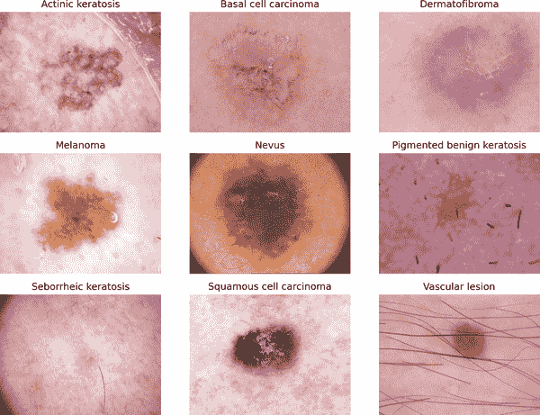
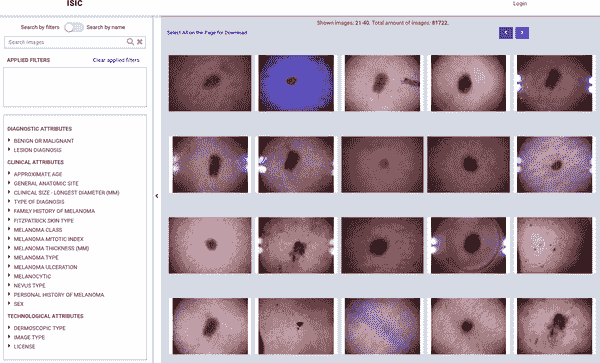
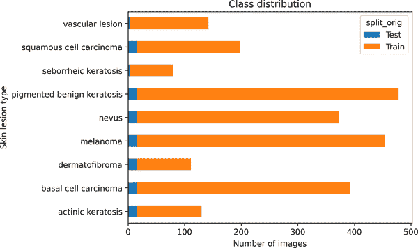
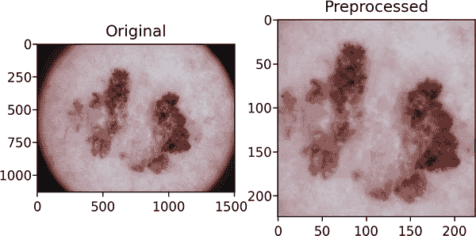
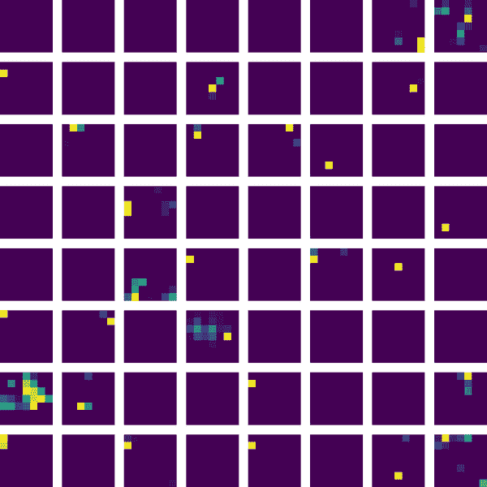
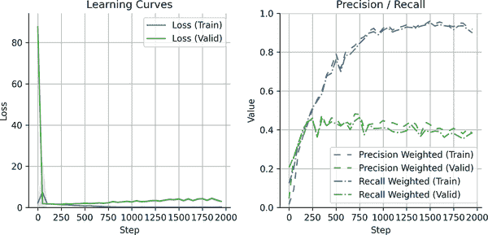
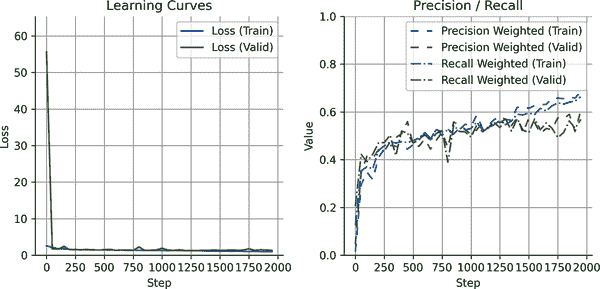
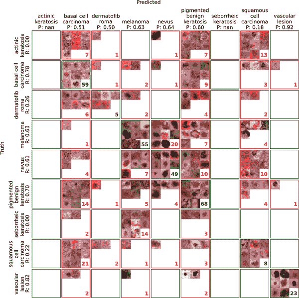
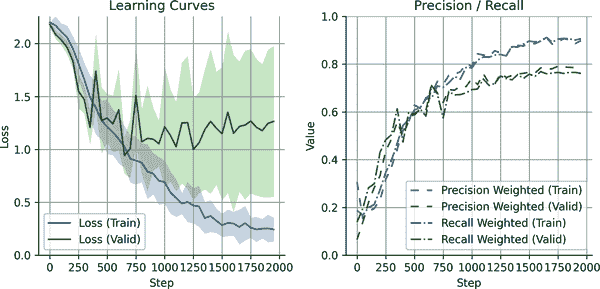

# 第五章\. 在医学图像中检测皮肤癌

在前面的章节中，我们专注于小规模的生物现象，例如蛋白质的分子特性、DNA 序列和药物分子。在本章中，我们将扩大到更大的生物尺度，将深度学习应用于分析组织水平和与疾病相关的过程。具体来说，我们将训练一个皮肤癌检测模型，以对皮肤图像进行各种癌症或良性类别的分类。

这是一个令人兴奋的应用，因为深度学习模型在皮肤分析方面取得了重大进展，自 2018 年以来，已有研究达到了皮肤科医生在区分良性病变和恶性病变方面的准确性。尽管将这些模型整合到临床工作流程中仍存在挑战——例如监管批准、数据标准化和预测可解释性——但它们通过增强早期检测和减少不必要的活检来协助医疗专业人士的潜力非常值得期待。

我们将使用来自 [International Skin Imaging Collaboration (ISIC)](https://oreil.ly/h2DiY) 的皮肤癌图像数据，这是一个致力于推进皮肤癌成像研究并提供标准化数据集的项目。多年来，ISIC 发布了一系列专注于皮肤病变分类和病理学的挑战，图像数量不断增加。要了解更多信息，您可以阅读 ISIC 数据集和基准的这篇综述论文。2

我们将使用的数据集可在 [“Skin Cancer ISIC” challenge on Kaggle](https://oreil.ly/_2jqU) 上找到，这使得它准备充分且相对容易开始。然而，为了确保我们涵盖处理现实世界数据挑战的重要课程，我们有意选择了一个相对较小且类别不平衡显著的数据集，这使我们能够探索缓解这些问题的技术。

与图像数据一起工作的一个优点是，人类在解释视觉信息方面天生就有技能，这使得我们能够对数据集和模型预测进行合理性检查。在本章中，我们将检查许多图像以指导我们的建模决策。这还将突出为什么皮肤癌分类是一个具有挑战性的问题——不仅对人类，而且对深度学习模型也是如此。

在模型方面，本章重点关注卷积神经网络（CNNs）——特别是表现出色于广泛图像分类任务的 ResNet CNNs。如果您想探索其他方法，可以考虑查看其他用户在 [Kaggle 讨论板](https://oreil.ly/bUHNt) 上共享的讨论和笔记本。

###### 小贴士

与往常一样，为了充分利用本章内容，请在阅读时保持我们仓库中的配套 Colab 笔记本打开。在前进的过程中尝试实验代码将加深你的理解并使概念更加牢固。

# 生物入门

首先，让我们介绍我们的模型将解决的生物学现象：皮肤癌，其不同类型以及分类的挑战。

## 皮肤癌

皮肤癌是全球最常见的癌症类型，2022 年估计有 150 万新病例。3 它包括由皮肤细胞异常生长引起的广泛条件，通常由遗传因素和环境致癌物（如紫外线辐射）的组合驱动。

在本章中，我们将检查恶性（癌症性）和良性病变。术语*病变*广义上指皮肤上的任何标记或异常，从无害的生长到需要医疗干预的生长。

### 恶性皮肤癌

基底细胞癌

皮肤癌中最常见的类型，通常生长缓慢，很少扩散到其他器官。

鳞状细胞癌

另一种常见类型，通常局限于局部，但如果不治疗，可能会变得侵袭性。

黑色素瘤

皮肤癌中最致命的形式，以其快速转移（扩散到身体其他部位）的能力而闻名。

日光性角化病

由阳光损伤引起的癌前病变。虽然不是恶性的，但如果不治疗，可能会进展为鳞状细胞癌。

### 良性皮肤病变

皮肤纤维瘤

一种坚硬的良性生长，通常在腿上发现。

痣（母斑）

一种常见的良性生长，大小、形状和颜色各异。

痣性良性角化病

一种非癌性色素性病变，通常类似于炎症性角化病。

炎症性角化病

一种良性、疣状的生长，可以是棕色、黑色或黄褐色。有时被称为“老年斑”或“智慧疣”，这些通常在老年人中找到。

血管病变

由异常血管增殖形成的良性血管生长，如血管瘤和樱桃血管瘤。

许多这些条件看起来相当相似。图 5-1 展示了本章训练数据集中的一些示例图像，说明了不同的病变类型。



###### 图 5-1\. 展示了用于本章分类的数据集中各种皮肤病变（良性和恶性）的网格。

从查看这些示例图像中，你可能可以想象到，误分类是皮肤癌检测中的一个关键挑战。这些错误是由于不同的病变类型可以共享相似的外观特征，如色素沉着、质地或不规则边缘。最关键的错误是将黑色素瘤误分类为良性病变（假阴性），可能会延迟救命治疗。相反，假阳性，如将良性生长误认为是黑色素瘤，虽然不太严重，但可能导致不必要的活检和患者焦虑。

同时，同一类别内也可能存在显著的视觉差异。例如，图 5-2 展示了黑色素瘤在外观上可以有很大的变化，这使得分类变得更加困难。


###### 图 5-2\. 黑色素瘤可以表现出广泛的视觉特征，使得一致的分类变得困难。一些可能呈现深棕色或黑色，边缘不规则，而另一些则较浅，呈红色或甚至斑驳。某些病例显示有结痂的质地，而另一些则表现为光滑、平坦的病变。

这种视觉变化源于潜在的生物学差异——包括涉及的细胞类型、病变生长的深度或侵略性以及产生的色素量。对于黑色素瘤而言，黑色素产生和生长模式的变化可能导致广泛不同的外观，即使在同一类别中也是如此。

## 原因和风险因素

皮肤癌的发展是由于基因突变破坏了皮肤细胞生长和分裂的正常调节。这些突变的最常见触发因素是紫外线——主要来自阳光或人工来源，如日光浴床，随着时间的推移会损害细胞 DNA。如果这种损伤没有得到适当的修复——例如，当细胞的 DNA 修复系统出错或不堪重负时——它可能导致细胞生长失控，最终形成肿瘤。

几个因素会增加患皮肤癌的风险：

+   *白皙的皮肤*含有较少的黑色素，这种色素可以提供一些对紫外线损伤的自然保护。

+   *频繁晒伤*，尤其是在儿童时期，表明反复的紫外线诱导的损伤，这些损伤可能累积一生。

+   *大量痣*（尤其是不典型或发育不良的痣）可能反映黑素细胞行为的潜在不稳定，增加其癌变的机会。

+   *家族史*可能指向遗传性基因易感性，例如肿瘤抑制基因中的突变。

+   *环境致癌物*，如砷或工业化学品，也可能导致突变负担。

除了外部因素外，*特定的基因突变*——如*BRAF*基因中的突变——在黑色素瘤中很常见。这些突变可能自发产生或在环境触发因素（如紫外线辐射）的作用下产生，并在驱动肿瘤生长中发挥关键作用。重要的是，对这些突变的理解已经使得开发针对患者个体肿瘤特征的靶向疗法成为可能，标志着向更个性化的癌症治疗转变。

## 皮肤癌是如何被诊断的

在临床环境中，皮肤科医生通过视觉检查、皮肤镜检查和活检来诊断皮肤癌。*皮肤镜检查*是一种非侵入性成像技术，通过放大皮肤下结构来帮助区分良性病变和恶性病变。常用皮肤癌分类数据集中的图像主要是由配备光源和测量标记的专用*皮肤镜*捕获的皮肤镜图像，而不是标准相机。

如果病变看起来可疑，就会进行活检——取一小块组织样本并在显微镜下检查，以检测细胞异常，如不规则核、不典型细胞形状、组织结构紊乱或不受控制的细胞分裂活动。这些特征有助于确认病变是否为恶性，并确定其类型和阶段。

ABCDE 规则（不对称性、边缘不规则性、颜色变化、直径 >6 毫米、演变变化）有助于评估病变以寻找黑色素瘤的迹象。AI 模型可以通过分析皮肤镜和临床图像来协助标记高风险病变以进行进一步评估。

## 基于图像的皮肤癌检测

深度学习已经彻底改变了基于图像的皮肤癌检测，AI 模型现在达到的诊断准确性可与专家皮肤科医生相媲美。一项 2024 年的 53 研究综述^(4) 发现，AI 在区分黑色素瘤和良性病变方面，始终优于普通开业医生和经验较少的皮肤科医生，同时与专家的表现相当。这表明 AI 可以作为有价值的诊断辅助工具，增强早期检测和决策。

然而，将 AI 集成到现实世界的临床实践中仍然具有挑战性。大多数皮肤癌模型都是在少数公开数据集（例如，ISIC、HAM10000）上训练的，这些数据集在皮肤类型和成像条件上缺乏多样性，限制了其泛化能力。此外，AI 在受控的回顾性研究中的表现往往无法转化为现实世界环境，其中光照、病变表现和医生工作流程等因素引入了变异性。

另一个关键障碍是可解释性。临床医生需要了解模型做出特定预测的原因，而不仅仅是收到一个孤立的概率分数。例如，如果 AI 预测一个皮肤病变为黑色素瘤，这是由于不对称性、不规则边缘还是颜色变化？以及这些不同因素是如何被模型组合和加权的？像显著性图和注意力机制这样的机器学习方法有助于可视化模型关注的对象，但它们仍然不完美。没有清晰的推理，AI 建议难以信任或整合到医疗决策中。

###### 注意

监管批准和临床验证是部署 AI 在医疗保健中的主要障碍。诊断模型必须在获得 FDA 或 CE 等监管机构的批准之前，满足严格的安全性、准确性和透明度标准。这通常涉及广泛的临床试验、可重复性测试和部署后的监控。此外，AI 工具必须集成到现有的工作流程中，而不会干扰临床医生的判断或引入新的偏见，同时保持患者隐私和数据安全。

虽然仍存在挑战，但人工智能正在稳步向实际部署迈进，一些皮肤病学人工智能系统已经获得*CE 标志*——这是一个表明符合欧盟安全性和有效性标准的认证——允许在欧洲联盟进行临床使用。此外，SkinVision 和 Miiskin 等智能手机应用程序提供基于人工智能的皮肤病变分析。虽然这些应用程序通常未经批准用于临床决策，但它们仍然可以提供风险评估并鼓励用户寻求医疗评估。

# 机器学习入门

在第三章中，我们应用卷积神经网络来模拟一维序列数据——具体来说，是 DNA 序列。然而，卷积神经网络更常用于二维图像处理，支持以下任务：

图像分类

将图像分配到特定类别，例如确定它是否包含狗或猫

对象检测

在图像中检测和定位对象，例如在猫周围绘制边界框

分割

将图像分割成有意义的区域，例如标记所有属于猫的像素

本节简要介绍了卷积神经网络如何处理图像。作为额外的学习材料，我们推荐 3Blue1Brown 的入门视频“[但什么是卷积？](https://oreil.ly/k8zoM)”，它提供了卷积神经网络的直观和视觉解释。对于更深入的探索，著名的[斯坦福 CS 231n：视觉识别的卷积神经网络课程](https://oreil.ly/C_wPx)提供了该领域的全面介绍。

## 卷积神经网络

卷积神经网络是一种专门为网格状数据设计的神经网络，如图像（或序列，如第三章第三章中所示）。它们自动学习*层次*模式，这意味着它们在不同抽象级别提取特征：

+   神经网络中的早期层检测简单模式，如边缘、纹理和颜色对比。

+   中间层通过组合这些基本特征来识别形状和结构。

+   深层层基于这些来识别复杂对象或有意义类别。

例如，在皮肤癌检测中，早期的卷积神经网络层可能检测到皮肤病变的边缘和颜色变化，中级层可能识别出不规则边界或不对称性，而最新的层会将这些特征组合成高级学习模式，以区分良性病变和恶性病变。

###### 警告

虽然我们将卷积神经网络描述为学习层次化的表示，但避免将它们拟人化是很重要的。卷积神经网络并不像人类那样“看到”物体。相反，它们通过学习像素值中的统计模式来最大化预测准确性。像**激活映射**（突出显示哪些图像部分影响分类）和**探测**（检查不同层编码的特征类型）这样的技术帮助我们理解和可视化模型内部的关联。然而，这些方法为人类解释提供了事后洞察——它们并不暗示模型本身具有结构化或可解释的推理过程。

## 理解卷积

卷积神经网络的核心构建块是**卷积层**，它将**过滤器**（也称为核）应用于输入图像以提取特征。过滤器是一个数字的小网格，它在图像上滑动，检测局部模式，如边缘、纹理或颜色过渡。

图像被表示为像素的网格——在灰度图像中，每个像素包含一个强度值（从 0 的黑色到 255 的白色），而彩色图像通常有三个通道（通常是红色、绿色和蓝色或*RGB*），每个通道都有自己的强度图。

当过滤器在图像上移动时，它在每个位置执行**点积**操作：过滤器值与图像块下对应的像素值逐元素相乘，然后将结果相加。这为每个位置产生一个输出值，构建一个新的表示，称为**特征图**，它突出显示过滤器编码的图案在图像中的位置。

过滤器中的特定值决定了它检测的内容。例如，以下 3 × 3 过滤器通过在水平（*x*）轴上对像素强度变化做出强烈反应来强调垂直**边缘**：

<mtable displaystyle="true"><mtr><mtd columnalign="right"><mrow><mo>[</mo> <mtable><mtr><mtd><mrow><mo>-</mo> <mn>1</mn></mrow></mtd> <mtd><mn>0</mn></mtd> <mtd><mn>1</mn></mtd></mtr> <mtr><mtd><mrow><mo>-</mo> <mn>1</mn></mrow></mtd> <mtd><mn>0</mn></mtd> <mtd><mn>1</mn></mtd></mtr> <mtr><mtd><mrow><mo>-</mo> <mn>1</mn></mrow></mtd> <mtd><mn>0</mn></mtd> <mtd><mn>1</mn></mtd></mtr></mtable> <mo>]</mo></mrow></mtd></mtr></mtable>

当通过在图像上滑动并计算像素值的点积时，这个过滤器增强了像素强度垂直变化的区域，如物体边界，这使得它对边缘检测很有用。

类似地，一个设计用于检测水平边缘的过滤器对垂直（*y*）轴上的像素强度变化做出反应。它通常看起来像这样：

<mtable displaystyle="true"><mtr><mtd columnalign="right"><mrow><mo>[</mo> <mtable><mtr><mtd><mrow><mo>-</mo> <mn>1</mn></mrow></mtd> <mtd><mrow><mo>-</mo> <mn>1</mn></mrow></mtd> <mtd><mrow><mo>-</mo> <mn>1</mn></mrow></mtd></mtr> <mtr><mtd><mn>0</mn></mtd> <mtd><mn>0</mn></mtd> <mtd><mn>0</mn></mtd></mtr> <mtr><mtd><mn>1</mn></mtd> <mtd><mn>1</mn></mtd> <mtd><mn>1</mn></mtd></mtr></mtable> <mo>]</mo></mrow></mtd></mtr></mtable>

该滤波器在从上到下从暗到亮（或反之）有强烈过渡的区域激活，突出图像中的水平结构。

在某种程度上，这个概念与社交媒体中“过滤器”的概念相关，它们通常会应用简单的数学变换（例如增加对比度或锐化细节）来修改图像的外观。

###### 注意

在 CNN 之前，在称为*特征工程*的任务中，研究人员手动设计和优化这些滤波器矩阵以检测边缘、纹理和其他特征——这是一个劳动密集型过程。现在，神经网络自动学习这些滤波器，并针对当前任务进行优化。

单个卷积层不仅仅应用一个滤波器；它通常并行学习多个滤波器（例如，64 个）。每个滤波器捕捉不同的特征，产生多个*特征图*，这些特征图作为单独的通道堆叠在层的输出中。

## 理解维度

如果一个 256 × 256（单通道）的灰度图像通过一个有 64 个滤波器的卷积层，输出将具有维度`(256, 256, 64)`——假设使用填充来保留空间维度。高度和宽度保持不变，而通道维度扩展，因为每个 64 个滤波器从图像中提取不同的特征表示。这适用于任何滤波器大小（例如，3 × 3，5 × 5），只要步长和填充设置保持空间维度。

###### 注意

记住，神经网络滤波器通常是随机初始化的，这意味着它们一开始无法提取任何有意义的模式。通过反向传播，滤波器逐渐学会检测有用的视觉特征，如边缘、纹理或形状。

在卷积之后，通常会对特征图应用非线性（例如 ReLU 激活函数）。这一点至关重要，因为卷积本身只是一个线性操作，意味着如果没有非线性，堆叠多层就相当于一个大的矩阵乘法。添加激活函数允许网络学习更复杂、非线性的模式。

现在让我们考虑一个尺寸为`(256, 256, 3)`的彩色图像，其中三个通道对应于红色、绿色和蓝色（RGB）。当图像有多个输入通道时，卷积是如何工作的呢？

与灰度图像不同，其中每个滤波器只对一个通道进行操作，彩色图像中的卷积滤波器必须同时处理所有三个通道。它不是一个简单的 3 × 3 矩阵，每个滤波器实际上是一个 3 × 3 × 3 张量，这意味着：

+   滤波器中的每个 3 × 3 切片都应用于图像的相应颜色通道（红色、绿色或蓝色）。

+   所有三个通道的结果相加，以生成每个像素的单个输出值。通常，这不仅仅是一个普通的和，而实际上是一个*加权和*，其中每个通道的贡献都乘以一个单独学习的权重。

+   这个过程对所有滤波器重复进行，在下一层创建多个特征图。

例如，将具有 64 个滤波器的卷积层应用于形状为`(256, 256, 3)`的输入，结果得到一个形状为`(256, 256, 64)`的输出，其中每个滤波器以不同的方式组合了三个输入通道，以提取有意义的模式。然后我们像之前一样应用激活函数，例如 ReLU。

###### 提示

你可能已经注意到我们称 3 × 3 滤波器为*矩阵*，但 3 × 3 × 3 滤波器为*张量*。为了简要说明术语：

+   一个*标量*是一个单独的数字，可以看作是 0D 张量（例如，5）。

+   一个*向量*是一维张量（例如，`[1, 2, 3]`）。

+   一个*矩阵*是二维张量（例如，一个 3 × 3 滤波器）。

+   一个*张量*是任何数量维度的数组的通用术语，包括 3D+结构，如 3 × 3 × 3 滤波器。

简而言之，张量是深度学习中的基本数据结构，将标量、向量和矩阵推广到任意维度。

## 池化

现在我们已经介绍了卷积的作用，让我们继续介绍*池化层*。池化减少了特征图的空间维度，使计算更高效，并通过只保留最突出的激活来帮助防止过拟合。

最常见的是最大池化，它选择特征图给定区域中的最高值。这确保了强激活被保留，同时减少了空间分辨率（下采样）。

考虑在应用 2 × 2 最大池化（步长为 2，意味着滤波器每次移动两个像素）之前的一个 4 × 4 特征图（卷积的图像样输出）：

<mtable displaystyle="true"><mtr><mtd columnalign="right"><mrow><mo>[</mo> <mtable><mtr><mtd><mn>1</mn></mtd> <mtd><mn>3</mn></mtd> <mtd><mn>2</mn></mtd> <mtd><mn>1</mn></mtd></mtr> <mtr><mtd><mn>4</mn></mtd> <mtd><mn>5</mn></mtd> <mtd><mn>7</mn></mtd> <mtd><mn>2</mn></mtd></mtr> <mtr><mtd><mn>3</mn></mtd> <mtd><mn>2</mn></mtd> <mtd><mn>9</mn></mtd> <mtd><mn>6</mn></mtd></mtr> <mtr><mtd><mn>1</mn></mtd> <mtd><mn>8</mn></mtd> <mtd><mn>6</mn></mtd> <mtd><mn>3</mn></mtd></mtr></mtable> <mo>]</mo></mrow></mtd></mtr></mtable>

在应用 2 × 2 最大池化后，保留每个 2 × 2 块中的最高值，将矩阵减少到 2 × 2 的大小：

<mtable displaystyle="true"><mtr><mtd columnalign="right"><mrow><mo>[</mo> <mtable><mtr><mtd><mn>5</mn></mtd> <mtd><mn>7</mn></mtd></mtr> <mtr><mtd><mn>8</mn></mtd> <mtd><mn>9</mn></mtd></mtr></mtable> <mo>]</mo></mrow></mtd></mtr></mtable>

这大大减少了值数量，同时保留了最重要的激活。另一种常见的池化类型是*平均池化*，它取每个区域的平均值而不是最大值。这将得到这个矩阵：

<mtable displaystyle="true"><mtr><mtd columnalign="right"><mrow><mo>[</mo> <mtable><mtr><mtd><mrow><mn>3</mn> <mo lspace="0%" rspace="0%">.</mo> <mn>25</mn></mrow></mtd> <mtd><mrow><mn>3</mn> <mo lspace="0%" rspace="0%">.</mo> <mn>0</mn></mrow></mtd></mtr> <mtr><mtd><mrow><mn>3</mn> <mo lspace="0%" rspace="0%">.</mo> <mn>5</mn></mrow></mtd> <mtd><mrow><mn>6</mn> <mo lspace="0%" rspace="0%">.</mo> <mn>0</mn></mrow></mtd></mtr></mtable> <mo>]</mo></mrow></mtd></mtr></mtable>

总结来说，池化：

+   通过缩小表示来提高计算效率

+   通过保留显著的激活（如最大值或平均值）来保留关键信息

+   通过使模型对输入的小幅变化不那么敏感，添加了一种轻微的正则化形式

然而，池化并不能替代像 dropout 或权重衰减这样更稳健的正则化方法。

## CNN 的其他组件

除了卷积和池化之外，还有几个其他关键组件有助于 CNN 有效地工作：

激活函数

如前所述，在每个卷积层之后应用非线性（通常是 ReLU）。这增强了模型的表达能力，使其能够学习复杂的非线性关系。

批标准化

这将批次的特征图进行归一化，以保持激活在一个稳定的范围内。它有助于 CNN 更有效地训练，减少对权重初始化的敏感性，并允许使用更高的学习率——这对于深度架构（许多 CNN 相当深）特别有用。

Dropout

这是一种正则化技术，在训练期间将随机激活设置为 0，以防止过拟合。这迫使网络依赖多个路径进行预测，从而提高泛化能力。

全连接层

在特征提取之后，CNN 的最后一层通常是全连接层。这些层结合了学习到的特征表示，并产生最终的输出——例如，在图像分类任务中的类别概率。

结合这些组件，我们已经涵盖了训练一个完全功能的 CNN 所需的构建块。接下来，我们将探讨一个广泛使用的架构，它将它们全部结合起来：ResNets。

## ResNets

ResNet（残差网络）是一种在 2015 年提出的 CNN 架构^(5)，它使得训练非常深的网络而不会遭受**梯度消失问题**，这是一个深层网络难以有效传播梯度的常见问题，会减慢学习速度。ResNets 通过引入**残差连接**（也称为**跳跃连接**）来解决这一问题，允许信息绕过一些层。这稳定了训练并提高了性能，使得 ResNets 成为计算机视觉任务（如图像分类和目标检测）的首选架构。

残差连接背后的关键思想很简单：不是学习完整的变换`f(x)`，网络学习`f(x) + x`，其中`x`是原始输入。这意味着如果`f(x)`很小或难以学习，网络仍然可以默认简单地通过输入`x`而不改变（一个恒等函数）。这防止了层降低深层网络的性能，有效地“跳过”了没有带来有意义改进的操作。

下面是一个残差块在伪代码中的简化实现：

```py
def ResidualBlock(x):
  """Basic building block of a ResNet."""
  identity = x  # Preserve the original input for the skip connection.
  residual = Convolution(x)  # Apply convolutional transformation.
  return identity + residual  # Add the identity (skip connection).

```

这个简单的跳跃连接允许梯度更容易地通过网络流动，使得训练深层架构变得更加可行。

我们可以使用 Flax 的 Linen API 重写以下伪代码：

```py
class ResidualBlock(nn.Module):
  """A minimal Flax CNN residual block."""
  features: int  # Number of output channels.
  kernel_size: Tuple[int, ...] = (3, 3)  # Convolution kernel size.
  strides: Tuple[int, ...] = (1, 1)  # Convolution stride.

  @nn.compact
  def __call__(self, x):
    identity = x  # Preserve the original input for the skip connection.
    residual = nn.Conv(
      self.features, self.kernel_size, self.strides, padding="SAME"
    )(x)
    return identity + residual  # Add the identity (skip connection).

```

以下是对`nn.Conv`关键参数的一些说明：

`features`

定义了学习到的滤波器数量。如果`features=100`，输入`(224, 224, 3)`变为`(224, 224, 100)`，提取 100 个不同的特征图。

`kernel_size`

定义了卷积的感受野。小的核如`(3, 3)`可以捕捉到细微的细节，而大的核如`(16, 16)`可以检测到更广泛的模式。

`strides`

控制滤波器的步长。`strides=(1, 1)`保留分辨率，而更大的步长会下采样特征图。下采样通常通过池化层而不是增加步长来实现。

`padding`

定义了保持一致形状的填充。`padding="SAME"`通过添加必要的填充确保输出维度与输入匹配。

考虑到这一点，让我们实现一个更完整的残差块，以下是一些新增功能：

+   两个堆叠的卷积层以提取更深的特征

+   一个 ReLU 激活函数以引入非线性

+   批标准化以稳定训练

+   检查通道不匹配，在必要时应用 1 × 1 卷积以确保加法兼容性。

```py
class ResidualBlock(nn.Module):
  """A basic Flax CNN residual block with two convolutional layers."""
  features: int  # Number of output channels.
  kernel_size: Tuple[int, ...] = (3, 3)  # Convolution kernel size.
  strides: Tuple[int, ...] = (1, 1)  # Convolution stride.

  @nn.compact
  def __call__(self, x):
    identity = x  # Preserve the original input for the skip connection.

    # First convolution + batch normalization + ReLU activation.
    x = nn.Conv(self.features, self.kernel_size, self.strides, padding="SAME")(x)
    x = nn.BatchNorm()(x)
    x = nn.relu(x)

    # Second convolution + batch normalization (no activation here).
    x = nn.Conv(self.features, self.kernel_size, self.strides, padding="SAME")(x)
    x = nn.BatchNorm()(x)

    # If the input and output dimensions do not match, apply a 1 x 1 convolution.
    if identity.shape[-1] != x.shape[-1]:
      identity = nn.Conv(
        self.features, kernel_size=(1, 1),
        strides=self.strides,
        padding="SAME"
      )(identity)

    # Add the skip connection.
    x += identity

    # Final ReLU activation.
    return nn.relu(x)

```

这个实现现在更接近你在现实世界的架构中会遇到的情况。

在 CNN 和 ResNets 的基础上，我们现在可以将这些技术应用到我们的目标上：构建一个用于皮肤癌预测的深度学习模型。

# 探索数据

正如往常一样，在构建模型之前，我们首先需要了解我们的数据集。在本章中，我们将使用来自[ISIC](https://oreil.ly/g2EyR)的数据，这是一个促进医疗专业人士和 AI 研究人员之间合作的倡议。ISIC 定期举办机器学习挑战，鼓励研究人员开发和提交用于分类皮肤病变图像的模型。6)

ISIC 存档是一个免费可访问的存储库，包含数万张皮肤病变图像，使其成为开发和使用 AI 诊断工具的宝贵资源。您可以通过他们的在线门户探索数据集，如图 5-3 所示。



###### 图 5-3\. 展示了 81,722 张公共皮肤病变图像的大量集合的[屏幕截图](https://oreil.ly/F6BwK)。

## 初步了解

我们不是直接使用 ISIC 数据集，而是在[Kaggle](https://oreil.ly/cez_1)上托管的一个版本上工作。这使我们能够探索使用新数据集的初始步骤，包括确保其完整性的基本合理性检查。

###### 警告

使用 Kaggle 数据集的一个关键优势是，我们可以将我们的方法与现有工作进行比较，并建立合理的性能预期。然而，需要谨慎——虽然 Kaggle 笔记本可以是一个很好的灵感来源，但它们未经同行评审，可能包含严重的错误。

例如，一些模型在这个数据集上报告了令人印象深刻的性能，但仔细检查揭示了*数据泄露*——训练集中的图像也出现在验证或测试集中，导致准确性人为地提高。在一个极端案例中，我们甚至发现了一个仅在训练图像上评估的模型，使其结果完全无意义。

让我们通过在继续之前仔细检查数据集来确保我们构建了一个健壮的数据管道。我们首先探索原始数据集目录，以了解其结构。通过列出所有*.jpg*文件，我们可以获得对可用标签的初步印象，这些标签对应于不同的皮肤病变类型。`rglob`方法在这里特别有用，因为它递归地扫描目录：

```py
import re
from pathlib import Path

from dlfb.utils.context import assets

image_file = next(Path(assets("cancer/datasets/raw")).rglob("*.jpg"))

print(rf"One of the images: {re.sub('^.*?datasets/', '', str(image_file))}")

```

输出：

```py
One of the images: raw/Test/melanoma/ISIC_0000031.jpg

```

检查文件路径，我们可以看到数据集已经被分割成`Train`和`Test`集，并为每种皮肤病变类型创建了子目录。

接下来，我们将计算两个分割中每个类别的图像数量。为此，我们定义了一个辅助函数`load_metadata`，它：

+   递归收集所有图像文件路径

+   从每个路径中提取数据集分割（`Train`/`Test`）和类别标签

+   将结果存储在 pandas 的`DataFrame`中，以便于检查和可视化

我们还将跟踪`frame_id`，这将在我们后续的合理性检查中作为快速检索特定图像的参考。

```py
import pandas as pd

def load_metadata(data_dir: str) -> pd.DataFrame:
  metadata = []
  for path in Path(data_dir).rglob("*.jpg"):
    split, class_name, _ = path.parts[-3:]
    metadata.append(
      {
        "split_orig": split,
        "class_orig": class_name,
        "full_path": str(path),
      }
    )
  return pd.DataFrame(metadata).rename_axis("frame_id").reset_index()

metadata = load_metadata(assets("cancer/datasets/raw"))
print(metadata)
```

输出：

```py
      frame_id split_orig      class_orig            full_path
0            0       Test        melanoma  /content/drive/M...
1            1       Test        melanoma  /content/drive/M...
2            2       Test        melanoma  /content/drive/M...
...        ...        ...             ...                  ...
2354      2354      Train  dermatofibroma  /content/drive/M...
2355      2355      Train  dermatofibroma  /content/drive/M...
2356      2356      Train  dermatofibroma  /content/drive/M...

[2357 rows x 4 columns]

```

接下来，我们使用 pandas 的`crosstab`函数计算两个分割中每个类别的图像数量：

```py
counts = pd.crosstab(
  metadata["class_orig"], metadata["split_orig"], margins=True
)
print(counts)

```

输出：

```py
split_orig            Test  Train   All
class_orig                             
actinic keratosis       16    114   130
basal cell carcinoma    16    376   392
dermatofibroma          16     95   111
melanoma                16    438   454
nevus                   16    357   373
pigmented benign ...    16    462   478
seborrheic keratosis     3     77    80
squamous cell car...    16    181   197
vascular lesion          3    139   142
All                    118   2239  2357

```

这个数据集相对较小，总共包含 2,357 张图像，分为 2,239 张用于训练和 118 张用于测试。此外，类别的分布高度不平衡，一些类别在训练上几乎没有示例。这种不平衡对模型的泛化能力构成挑战，需要谨慎处理以防止产生偏差预测。这也使得评估不太可靠，因为基于非常少的示例的性能指标可能会很嘈杂且不具有代表性。

我们在图 5-4 中可视化了这种分布：

```py
fig = counts.drop(["All"], axis=1).drop(["All"], axis=0).plot.barh(stacked=True)
fig.set_xlabel("Number of images")
fig.set_ylabel("Skin lesion type")
fig.set_title("Class distribution");
```



###### 图 5-4\. 原始训练和测试集中类别分布的条形图。

我们可以从类别计数的条形图中得出几个关键见解：

类别不平衡

一些类别，如色素性良性角化病，过度代表（总共有 454 张图像），而其他类别，如脂溢性角化病，严重不足（总共有 80 张图像）。这种不平衡可能导致模型偏向于预测更频繁的类别。

小型测试集

测试集中一些类别只有三张图像，这使得评估不同病变类型的模型性能变得困难。如此小的测试集很容易导致误导性的性能指标。我们还可以看到，训练数据与测试数据之间的比例在病变类别中并不均匀。

没有验证集

该数据集仅提供`Train`和`Test`分割，但没有`Valid`子集。验证集对于调整超参数和评估模型改进至关重要，而不必触及最终的测试集。

为了有效地在这个数据集上训练模型，我们需要使用数据增强和重采样等技术来解决这些问题。在深入探讨这些技术之前，让我们先视觉检查一些图像，以便更好地理解数据集。这将帮助我们验证图像是否与本章早期介绍的病变类型相匹配。

###### 注意

另一个重要的考虑因素是，这个数据集仅由图像和标签组成，没有额外的元数据，例如病变位置、患者人口统计信息或临床笔记。这种缺乏上下文使得分类任务更具挑战性，因为现实世界的诊断往往不仅仅依赖于病变的视觉外观。例如，一位 70 岁患者的头皮上暗色的病变可能会增加黑色素瘤的可能性，因为年龄和阳光暴露区域都是已知的危险因素。

## 预览图像

在这本书中，这是我们第一次处理图像数据，所以让我们花点时间探索如何在 Python 中处理它。一个常见的用于加载和处理图像的库是 Pillow，它是原始 PIL（Python Imaging Library）的现代版本。它保留了`PIL`模块名称以保持兼容性，并且广泛用于图像处理。

现在，让我们来看一张图像。我们将从之前检索到的文件路径开始，如图图 5-5 所示：

```py
from PIL import Image

Image.open(metadata["full_path"].iloc[0])

```


###### 图 5-5\. 使用 Python 中的 Pillow 加载的皮肤病变图像示例。

我们想检查特定病变类别的图像。为了使这个过程更容易，我们将创建一个函数：

+   从数据集中随机选择指定类别的图像

+   使用`PIL`（Pillow）加载图像。

+   使用 Matplotlib 显示它，包括类别名称作为标题以提高清晰度

```py
import matplotlib.pyplot as plt

def show_random_image(metadata: pd.DataFrame, class_name: str) -> plt.Figure:
  record = (
    metadata[metadata["class_orig"] == class_name]
    .sample(1)
    .to_dict(orient="records")[0]
  )
  fig = plt.figure(figsize=(4, 4))
  plt.imshow(Image.open(record["full_path"]))
  plt.title(record["class_orig"].capitalize())
  return fig
```

让我们现在使用这段代码来检查一个黑色素瘤图像的例子，如图图 5-6 所示：

```py
show_random_image(metadata, "melanoma");

```


###### 图 5-6\. “黑色素瘤”类别的示例图像。

接下来，让我们编写一个`plot_random_image_grid`来帮助我们可视化每个皮肤病变类别的样本图像。这将帮助我们快速了解数据集的多样性和病变外观的变化：

```py
def plot_random_image_grid(
  metadata: pd.DataFrame, ncols: int = 3
) -> plt.Figure:
  """Display a random example image from each class in a grid."""
  records = metadata.groupby("class_orig").sample(1).to_dict(orient="records")
  nrows = (len(records) + ncols - 1) // ncols
  fig, axes = plt.subplots(nrows, ncols, figsize=(10, 2.5 * nrows))
  axes = axes.flatten()

  for record, ax in zip(records, axes):
    ax.imshow(Image.open(record["full_path"]))
    ax.set_title(record["class_orig"].capitalize())
    ax.axis("off")

  plt.tight_layout()
  return fig
```

让我们运行这个函数（见图图 5-7）：

```py
plot_random_image_grid(metadata);

```


###### 图 5-7\. 皮肤图像及其对应标签的网格。

在对数据集有了更好的视觉理解之后，我们现在准备构建一个灵活的输入管道，这将支持我们其余的实验。

## 解决数据集问题

现在我们已经探索了数据集，让我们来讨论一下它的局限性。由于提高模型性能将是一个迭代的过程，创建一个`DatasetBuilder`类来方便地实验不同的数据集配置是有帮助的。我们将设计它以足够灵活，支持多类别分类（所有病变类型）和二进制分类（例如，黑色素瘤与非黑色素瘤），这样我们就可以在我们开发模型的过程中探索各种设置。

首先，为了确保适当的评估，我们为`train`、`valid`和`test`集定义了 70/20/10 的分割：

```py
import numpy as np

np.random.seed(seed=42)
splits = {"train": 0.7, "valid": 0.20, "test": 0.10}

metadata["split"] = np.random.choice(
  list(splits.keys()), p=list(splits.values()), size=metadata.shape[0]
)

counts = pd.crosstab(metadata["class_orig"], metadata["split"], margins=True)
print(counts)
```

输出：

```py
split                 test  train  valid   All
class_orig                                    
actinic keratosis       13     85     32   130
basal cell carcinoma    39    284     69   392
dermatofibroma          11     84     16   111
melanoma                55    307     92   454
nevus                   41    250     82   373
pigmented benign ...    39    358     81   478
seborrheic keratosis     9     50     21    80
squamous cell car...    14    138     45   197
vascular lesion         10     99     33   142
All                    231   1655    471  2357
```

我们在图 5-8 中可视化了新分割中的类别分布：

```py
counts.drop(["All"], axis=1).drop(["All"], axis=0).plot.barh(stacked=True);
```


###### 图 5-8\. 新训练、验证和测试集中类别分布的条形图。

因此，我们现在有一个更好的数据集分割——包括一个专门的验证集，更大的测试集，以及病变类别之间一致的训练/验证/测试比例。这为构建我们的`DatasetBuilder`奠定了基础，它将使我们能够高效地实验不同的训练配置。

### 平衡批次

在我们的数据集中，一些皮肤病变类别比其他类别更常见。例如，色素性良性角化病和痣在数据集中有很高的代表性，而像脂溢性角化病和皮肤纤维瘤这样的类别则非常罕见。如果我们直接在这不平衡的数据上训练，模型可能会专注于正确预测主导类别，而忽略罕见类别——这种偏差可能会损害泛化。

为了减轻这一点，我们在训练期间实施了一个*平衡采样器*。这确保了每个批次包含来自每个类别的相等数量的示例，使模型有更多机会接触代表性不足的类别。然而，验证和测试集保持其原始类别分布，以反映评估期间现实世界的类别频率。

尽管在本章的实验中，平衡采样器没有导致可测量的收益，但它仍然是一个在处理严重不平衡数据集时非常有用的工具，我们鼓励你在未来的项目中尝试使用。

### 增强数据集

我们的数据集相对较小，在深度学习中，没有多少事情能比获取更多高质量数据更能可靠地提高模型性能。由于收集新的标记图像既昂贵又耗时，我们转向了*数据增强*——一种通过对现有图像应用标签保留变换来合成增加数据集大小的技术。

增强通过使模型接触到图像外观的自然变异性来鼓励模型更好地泛化。例如，随机旋转、翻转、裁剪、颜色变换和亮度变化教会模型，病变的类别不会因为其照明或方向的变化而改变。这有助于减少过拟合并提高对现实世界图像变化的鲁棒性。

然而，重要的是要记住，增强并不真正引入新的信息。增强示例是相同基础数据的变体——因此，任何现有的数据集偏差（例如，肤色不平衡或有限的解剖多样性）仍然存在。增强提供的是一种方法，可以引导模型学习更普遍、更抽象的特征，而不是记住表面细节。

我们不是手动应用变换，而是使用[DeepMind PIX 库](https://oreil.ly/3FxiK)—一个兼容 JAX 的图像增强工具包。它干净地集成到我们的流程中，并允许我们在训练期间动态地即时应用变换，保持内存使用量低，提高训练效率。

在我们的设置中，每张图像都会以固定的概率随机变换。与其他 JAX 操作一样，随机数生成器（`rng`）被明确管理，确保增强是可重复和可追踪的：

```py
@jax.jit
def rich_augmentor(image: jax.Array, rng: jax.Array) -> jax.Array:
  """Applies random flips, brightness, contrast, hue changes, and rotation."""
  image = pix.random_flip_left_right(rng, image)
  image = pix.random_flip_up_down(rng, image)
  image = pix.random_brightness(rng, image, max_delta=0.1)
  image = pix.random_contrast(rng, image, lower=0.9, upper=1)
  image = pix.random_hue(rng, image, max_delta=0.05)
  # Angles are provided in radians, i.e. +/- 10 degrees.
  image = pix.rotate(
    image,
    angle=jax.random.uniform(rng, shape=(), minval=-0.174533, maxval=0.174533),
  )
  return image
```

为了说明增强的实际应用，我们选择了一张黑色素瘤图像并多次应用我们的变换流程。每个变体都有所不同，模拟了现实图像的变异性。请参见图 5-9 的结果：

```py
import jax
import jax.numpy as jnp

rng = jax.random.PRNGKey(seed=42)
image = Image.open(
  metadata[metadata["class_orig"] == "melanoma"]
  .sample(1)["full_path"]
  .values[0]
)

_, axes = plt.subplots(3, 3, figsize=(9, 9))
axes = axes.flatten()
axes[0].imshow(image)
axes[0].set_title("Original")
axes[0].axis("off")
image = jnp.asarray(image) / 255.0
for ax in axes[1:]:
  rng, rng_augment = jax.random.split(rng, num=2)
  ax.imshow(rich_augmentor(image, rng_augment))
  ax.set_title("Augmented")
  ax.axis("off")
plt.tight_layout()
```


###### 图 5-9\. 原始皮肤图像（左上角）随后是不同的增强版本，展示了翻转、旋转和颜色变换等变换。

这种设置是一个良好的起点，但请记住，每种增强方法都有可调整的参数——[PIX 文档](https://oreil.ly/74UjB)列出了许多其他选项。选择和调整增强实际上是一个超参数搜索。什么效果最好很大程度上取决于数据集和任务。有关有效增强策略的更广泛概述，请参阅这份调查.^(7)

### 预处理图像

在将图像输入神经网络之前，我们需要对它们进行标准化。这涉及到确保所有输入具有相同的形状和像素值范围。如果没有这一步，分辨率、宽高比或强度的差异可能会阻止模型学习一致的模式。

许多深度学习计算机视觉模型——包括我们在本章中将使用的 ImageNet 训练的 ResNets——都期望固定大小的正方形输入图像。然而，皮肤病变照片在形状和大小上差异很大。直接将这些图像调整到正方形可能会扭曲重要的临床特征。为了避免这种情况，我们首先调整图像的大小，同时保持其宽高比，然后从结果中裁剪出一个正方形。这会产生一致的输入形状，而不会拉伸或压缩病变。

```py
def resize_preserve_aspect(
  image: jax.Array, short_side: int = 256
) -> jax.Array:
  """Resize image with shorter side is `short_side`, keeping aspect ratio."""
  h, w, c = image.shape
  scale = short_side / jnp.minimum(h, w)
  new_h = jnp.round(h * scale).astype(jnp.int32)
  new_w = jnp.round(w * scale).astype(jnp.int32)
  resized = jax.image.resize(image, (new_h, new_w, c), method="bilinear")
  return resized

def center_crop(image: jax.Array, size: int = 224) -> jax.Array:
  """Crop the center square of given size from an image."""
  h, w, _ = image.shape
  top = (h - size) // 2
  left = (w - size) // 2
  return image[top : top + size, left : left + size]
```

我们还需要归一化像素值。原始图像强度通常在 0 到 255 之间，但神经网络在输入缩放到更小、更一致的范围时训练效果更好。一种常见的方法是*最小-最大缩放*，其中每个像素被 255 除，将值带入 `[0, 1]` 范围。另一种选择是标准化，其中每个像素被转换为零均值和单位方差。

###### 警告

在这个上下文中，术语*标准化*是过载的，它指的是两个不同的概念：

+   *通用图像预处理*：确保图像大小、格式和值范围的一致性

+   *特定的归一化策略*：将像素值转换为具有 0 均值和 1 标准差

在本书中，我们将使用*标准化*的第一个含义——作为一般输入预处理的同义词。

对于我们的模型，我们将使用最小-最大缩放来归一化像素值，通过除以 255 将强度带入 `[0, 1]` 范围。这种方法在 CNN 训练中广泛使用，并且对图像数据效果良好：

```py
def rescale_image(image: jax.Array) -> jax.Array:
  """Normalizes pixel values to the [0, 1] range by dividing by 255."""
  return image / 255.0
```

现在让我们应用所有预处理步骤——读取 JPEG 图像、保持宽高比调整大小、中心裁剪和归一化——以确保在训练之前我们的数据集是标准化的。虽然我们可以选择任何图像大小，但我们将使用 224 × 224 像素来匹配原始 ResNet 架构期望的输入大小，我们将在本章后面探讨这一点。由于这些转换只需要应用一次，提前进行可以提高效率并避免在训练期间进行冗余计算。

在图 5-10 中，你可以看到预处理前后图像的示例：

```py
original_image = Image.open(metadata.iloc[0]["full_path"])
image = np.array(original_image)
image = resize_preserve_aspect(image)
image = center_crop(image)
image = rescale_image(image)

_, axes = plt.subplots(1, 2, figsize=(6, 3))
axes = axes.flatten()
axes[0].imshow(original_image)
axes[0].set_title("Original")
axes[1].imshow(image)
axes[1].set_title("Preprocessed");
```



###### 图 5-10。图像被标准化以确保一致的尺寸和像素值范围。请注意，尽管预处理过的图像已经从 0-255 缩放到 0-1，但`imshow`会自动调整显示比例，因此视觉外观保持不变。

在完成数据预处理主题后，我们现在可以专注于高效地存储和访问数据——这是在不超载系统内存的情况下扩展训练的关键步骤。

### 使用内存映射数组进行数据存储

我们已经强调了模型训练中效率的重要性：更快的数据处理意味着更快的迭代，最终得到更好的模型。我们想要避免的一个主要低效问题是每次将批次传递给模型时都重复预处理相同的数据。同时，将所有处理过的图像存储在内存中也是不可行的。那么，我们如何平衡效率和内存限制呢？

一个实用的解决方案是*内存映射 NumPy 数组*。这允许我们将预处理过的图像存储在磁盘上，同时像它们在内存中一样访问它们，使检索快速高效。这样，我们在训练前一次性预处理所有图像，然后在训练期间动态加载它们，而不进行冗余计算。

实现很简单：我们首先定义存储文件，指定数据类型（`float32`），并设置数据集的形状：224 × 224 像素，三个颜色通道。这将在磁盘上创建一个空文件，预分配所需的存储空间。然后我们在内存映射数组中预处理和存储每个图像：

```py
from tempfile import TemporaryFile

images_on_disk = np.memmap(
  TemporaryFile(), dtype="float32", mode="w+", shape=(10, 224, 224, 3)
)
for i, full_path in enumerate(metadata[:10]["full_path"]):
  image = Image.open(full_path)
  image = np.array(image)
  image = resize_preserve_aspect(image)
  image = center_crop(image)
  image = rescale_image(image)
  images_on_disk[i, :, :, :] = image
images_on_disk.flush()
```

这种方法让我们得到了两全其美的效果：高效的预处理而不会过度消耗内存。

## 构建一个`DatasetBuilder`

到目前为止，我们已经解决了使用这个数据集的主要挑战：将其分为训练集、验证集和测试集；处理类别不平衡；预处理图像；以及数据增强。现在，我们将这些组件组织成一个结构化的`DatasetBuilder`类，该类返回具有数据迭代器的`Dataset`实例，这些迭代器将实际为我们获取可以用于训练或评估模型的批次数据。

###### 小贴士

设计一个灵活的数据集构建器在迭代模型时会有回报。它让你可以快速尝试不同的标签映射、采样策略和预处理步骤——而无需重写核心代码。这种模块化加快了实验速度，并帮助你确定哪些数据选择实际上提高了性能。

让我们更详细地看看`DatasetBuilder`，它协调数据集分割和预处理的创建：

```py
class DatasetBuilder:
  """Builds a dataset with metadata, loaded images, and class mappings."""

  def __init__(self, data_dir: str, out_dir: str | None = None) -> None:
    self.data_dir = data_dir
    self.out_dir = out_dir or data_dir

  def build(
    self,
    rng: jax.Array,
    splits: dict[str, float],
    preprocessors: list[Callable] = [crop],
    image_size: tuple[int, int, int] = (224, 224, 3),
    class_map: dict[str, Any] | None = None,
  ) -> dict[str, Dataset]:
    """Builds the dataset splits from loaded metadata and loaded images."""
    metadata = MetadataLoader(self.data_dir, self.out_dir).load(class_map)
    images = ImageLoader(metadata, self.out_dir).load(preprocessors, image_size)

    # Shuffle the dataset and assign each example to one of the dataset splits.
    num_samples = len(metadata)
    rng, rng_perm = jax.random.split(rng, 2)
    shuffled_indices = jax.random.permutation(rng_perm, num_samples)

    # Create each dataset split using the shuffled indices and store the
    # corresponding metadata and image data in a Dataset object.
    dataset_splits, start = {}, 0
    for name, size in self._get_split_sizes(splits, num_samples):
      indices = np.array(shuffled_indices[start : (start + size)])
      dataset_splits[name] = Dataset(
        metadata=metadata.iloc[indices],
        images=images,
        num_classes=metadata["class"].nunique(),
      )
      start += size
    return dataset_splits

  def _get_split_sizes(self, splits: dict[str, float], num_samples: int):
    """Convert fractional split sizes to integer counts that sum to total."""
    names = list(splits)
    sizes = [int(num_samples * splits[name]) for name in names[:-1]]
    sizes.append(num_samples - sum(sizes))  # last split gets the remainder
    yield from zip(names, sizes)

```

我们已经实现了这些组件中的每一个，但让我们强调一些关键细节：

元数据加载

`MetadataLoader` 确保所有图像文件路径及其相关的类/分割信息都一致地保存到 CSV 文件中。这避免了依赖于 `rglob` 导致的不一致性，因为 `rglob` 不能保证文件顺序的一致性。由于图像数据稍后以与元数据相同的顺序存储在内存映射数组中，保持这种一致性至关重要。

灵活的类映射

`MetadataLoader` 通过可定制的 `class_map` 支持二进制或分组分类设置。如果没有提供映射，它将默认为基于目录结构的标准多类配置。

图像预处理

`ImageLoader` 负责在内存映射数组中读取、处理和存储图像。为了避免重复计算，图像一旦存储为紧凑的原始格式，就可以应用多种预处理策略（例如，调整大小或裁剪），并将它们分别作为 memmaps 存储起来。

数据集创建

`build` 方法将所有内容整合在一起：它加载元数据和图像，对数据集进行洗牌，将其分割为训练/验证/测试分区，并将每个分区包装成一个 `Dataset` 对象。每个数据集包含一致的元数据和预处理的图像视图，准备好进行训练。

### 加载元数据和图像

你可以在 `dlfb.cancer.dataset.builder` 库中找到 `MetadataLoader` 和 `ImageLoader` 的支持类代码。在这里，我们将简要描述它们的工作原理以及它们如何履行创建 `Dataset` 的职责。

如果不存在，`MetadataLoader` 将构建一个元数据 CSV 文件。它从文件夹结构中提取原始分割和类信息，应用任何所需的标签映射，并提供对数据集的行级访问。图像加载稍微复杂一些。虽然 `MetadataLoader` 处理文件路径和类标签，但 `ImageLoader` 负责读取、预处理和存储实际的图像数据。以下是关于 `ImageLoader` 的工作原理的一些说明：

图像预处理和存储

为了避免冗余计算，`ImageLoader` 首先将原始图像存储为一个单一的内存映射数组。这个数组紧凑，存储了每个图像的展平版本以及它们的原始形状和偏移量，以便稍后可以重建。一旦完成这个原始存储，就可以应用各种预处理函数（如裁剪或调整大小），并将结果保存到额外的内存映射文件中。这种设计使我们能够支持多种预处理策略，而无需重新加载原始的 JPEG 图像或重复昂贵的操作。

预处理灵活性

预处理函数以模块化的方式应用。可以将任意数量的转换传递给 `ImageLoader`，每个转换都会生成自己的内存映射。这些预处理的视图存储在 `Images` 对象的不同键下（例如，`"crop"`，`"resize"`），该对象作为统一的接口来访问它们。

数据集组装

最后，`DatasetBuilder.build()`方法将这些组件整合在一起。它加载元数据，处理图像，对数据集进行洗牌，将其分为训练、验证和测试集，并为每个返回`Dataset`对象。这些对象提供了对图像数组和类标签的干净访问，为模型训练做好准备。

所有这些都存储在`Dataset`类本身中：

```py
@dataclass
class Dataset:
  """Dataset class storing images and corresponding metadata."""

  metadata: pd.DataFrame
  images: Images
  num_classes: int

  def get_dummy_input(self) -> jnp.ndarray:
    """Returns dummy input with the correct shape for the model."""
    return jnp.empty((1,) + self.images.size)

  def num_samples(self) -> int:
    """Returns the number of samples in the dataset."""
    return self.metadata.shape[0]

  def get_images(self, preprocessor: Callable, indices: jax.Array) -> jax.Array:
    """Returns preprocessed images for the given indices."""
    return self.images.loaded[preprocessor.__name__][indices]

  def get_labels(self, indices: list[int]) -> jax.Array:
    """Returns integer class labels for the given indices."""
    return jnp.int16(self.metadata.loc[indices]["label"].values)
```

`Images`在哪里：

```py
@dataclass
class Images:
  """Stores image data and size information."""

  loaded: dict[str, np.memmap]
  size: tuple[int, int, int]
```

`Dataset`类是训练期间访问数据的初级接口。它管理`metadata`（跟踪图像路径和标签）和内存映射的`images`。由于我们将数据集分为训练、验证和测试集，我们可以使用`splits`参数控制它们的比例。

### 数据批处理

为了简化数据集处理，在训练期间，我们引入了`BatchHandler`类。这个类封装了从`Dataset`对象生成批次的所需组件：

+   `preprocessor`选择要使用的预处理图像视图（例如，裁剪、调整大小）。

+   `sampler`确定如何为每个批次抽取样本（例如，平衡抽样与随机抽样）。

+   可选的`augmentor`应用实时图像变换，如翻转、颜色抖动或旋转，以提高泛化能力。

```py
class BatchHandler:
  """Helper to provide appropriately prepared batches form a dataset."""

  def __init__(
    self,
    preprocessor: Callable = crop,
    sampler: Callable = epoch_sampler,
    augmentor: Callable | None = None,
  ):
    self.preprocessor = preprocessor
    self.sampler = sampler
    self.augmentor = augmentor

  def get_batches(self, dataset: Dataset, batch_size: int, rng: jax.Array):
    """Prepare dataset batches with the requested image manipulations."""
    self._validate_batch_size(dataset, batch_size)
    rng, rng_sampler = jax.random.split(rng, num=2)

    for batch_indices in self.sampler(
      dataset.metadata, batch_size, rng_sampler
    ):
      images = dataset.get_images(self.preprocessor, batch_indices)

      if self.augmentor is not None:
        rng, rng_augment = jax.random.split(rng, 2)
        images = jax.vmap(lambda image, r: self.augmentor(image, rng=r))(
          images, jax.random.split(rng_augment, images.shape[0])
        )

      batch = {
        "frame_ids": batch_indices,
        "images": images,
        "labels": dataset.get_labels(batch_indices),
      }
      yield batch

  @staticmethod
  def _validate_batch_size(dataset: Dataset, batch_size: int) -> None:
    """Ensures that batch_size is within feasible bounds."""
    if batch_size > dataset.num_samples():
      raise ValueError(
        f"Batch size ({batch_size}) cannot be larger than dataset size "
        "({len(frame_ids)})."
      )
    if batch_size > dataset.num_classes:
      raise ValueError(
        f"batch_size ({batch_size}) has to be larger than "
        f"number of unique labels."
      )

```

`get_batches`方法是`BatchHandler`的核心。它是一个生成器函数，意味着它一次产生一个批次，这既节省内存又非常适合训练循环。以下是内部发生的情况：

1.  它验证请求的`batch_size`。

1.  它使用`sampler`函数抽取批次索引。

1.  它从`Dataset`中获取预处理图像和标签。

1.  如果提供了`augmentor`，它将使用 JAX 的`vmap`对每张图像进行增强，以提高效率。

1.  它产生包含`frame_ids`、`images`和`labels`的批次字典。

这种设计将数据集结构、增强和抽样逻辑清晰地分离，使得在训练期间实验不同的批处理策略变得容易。

## 准备数据集

我们现在准备好构建我们的数据集并检查数据管道的输出：

```py
from dlfb.cancer.train.handlers.augmentors import rich_augmentor
from dlfb.cancer.train.handlers.samplers import balanced_sampler

rng = jax.random.PRNGKey(seed=42)
rng, rng_dataset = jax.random.split(rng, 2)

builder = DatasetBuilder(data_dir=assets("cancer/datasets/raw"))

dataset_splits = builder.build(
  rng=rng_dataset,
  splits={"train": 0.7, "valid": 0.20, "test": 0.10},
  image_size=(224, 224, 3),
)

print(dataset_splits["train"].metadata)
```

输出：

```py
frame_id split_orig           class_orig            full_path     label  \
177        177      Train    actinic keratosis  /content/drive/M...      0   
408        408      Train  basal cell carci...  /content/drive/M...      1   
445        445      Train  basal cell carci...  /content/drive/M...      1   
...        ...        ...                  ...                  ...    ...   
1579      1579      Train  pigmented benign...  /content/drive/M...      5   
1966      1966      Train  seborrheic kerat...  /content/drive/M...      6   
305        305      Train  basal cell carci...  /content/drive/M...      1   

                    class  
177     actinic keratosis  
408   basal cell carci...  
445   basal cell carci...  
...                   ...  
1579  pigmented benign...  
1966  seborrheic kerat...  
305   basal cell carci...  

[1649 rows x 6 columns]
```

此调用初始化完整的数据管道：它加载元数据；处理图像；将数据集分为训练、验证和测试分区；并以`Dataset`对象（作为`dataset_splits`字典中的键）返回它们。

现在我们可以使用`BatchHandler`从训练集中生成一个批次：

```py
rng, rng_train = jax.random.split(rng, 2)

train_batcher = BatchHandler(sampler=balanced_sampler, augmentor=rich_augmentor)
train_batches = train_batcher.get_batches(
  dataset_splits["train"], batch_size=32, rng=rng_train
)
batch = next(train_batches)
```

每个批次包含三个键—`images`、`labels`和`frame_ids`：

+   `images`：一个浮点 32 张量，包含归一化的像素值。

+   `labels`：与每个图像对应的整数类标签。

+   `frame_ids`：原始元数据的索引，用于检查和调试。

让我们确认`images`张量的形状：

输出：

```py
batch["images"].shape

```

```py
(32, 224, 224, 3)

```

每个批次包含`32`张图像，我们可以看到每张图像的维度为`(224, 224, 3)`。

在继续之前，让我们可视化批处理中的第一张图像，以确保我们的预处理管道按预期工作。这个简单的合理性检查有助于早期捕捉任何意外的伪影（参见图 5-11）：

```py
plt.imshow(batch["images"][0]);

```


###### 图 5-11。来自我们数据集的处理后的皮肤病变图像，证实我们的管道工作正常。

是的，它仍然看起来像某种皮肤病变！在准备并验证了完全功能的数据集管道后，我们准备进行下一步：训练我们的模型。

# 构建皮肤癌分类模型

在我们的数据集准备就绪后，我们现在转向本章的核心建模探索。我们将比较一系列架构，逐渐增加其复杂性。以下是我们将构建和评估的模型概述：

`SimpleCNN`

一个轻量级的两层卷积神经网络，作为我们的基线。它与其他模型共享相同的分类头（`SkinLesionClassifierHead`），但除此之外保持最小化。我们不会对其进行大量调整——其目的是在不涉及任何架构复杂性的情况下建立性能基线。

`ResNetFromScratch`

从随机初始化的权重训练的完整 ResNet50 架构。该模型评估了架构本身的影响，而没有从 ImageNet 预训练中获益。它有助于隔离 ResNet 设计本身的贡献。

`FinetunedResNet`

使用预训练权重初始化的 ResNet50，所有层都在我们的皮肤病变数据集上微调。这种方法利用迁移学习，结合从大规模数据集（如 ImageNet）学习到的知识，以提高收敛速度和泛化能力。

`FinetunedHeadResNet`

与前一项类似，但预训练的 ResNet50 骨干被冻结。只有最终的分类头被训练。这个变体测试了在不修改骨干的情况下，利用预训练特征能走多远。

这种从零开始到完全微调的进展，使我们能够直接比较不同策略的训练效率和分类性能。从头开始训练提供了完全的控制，但需要更多的数据和计算。迁移学习，尤其是在冻结骨干的情况下，在我们的低数据环境中通常更快、更稳健。

###### 注意

ResNet50 是一个广泛使用的具有 50 层的卷积神经网络架构。你可以轻松地实验更深层的变体，如[ResNet101](https://oreil.ly/P8Cvr)或 ResNet200。这些提供了更大的表示能力，但代价是计算量增加和过拟合风险更高——尤其是在训练数据有限的情况下。所有变体都与相同的 ImageNet 预处理器兼容。

为了实现这些模型，我们将遵循以下步骤：

1.  从 transformers 加载 Flax 的 ResNet50 模型。

1.  提取模型骨干。

1.  添加自定义分类头（`SkinLesionClassifierHead`）。

1.  训练和评估每个模型变体。

让我们先加载预训练的 ResNet50 模型。

## 加载 Flax ResNet50 模型

Flax 提供了一个[预构建的 ResNet 实现](https://oreil.ly/Yaf_p)，它提供了一个灵活且经过优化的架构，用于特征提取。然而，根据你的需求，预构建的模型可能不可用或未预训练。为了演示如何在 Flax 中处理预训练模型，我们将从 Hugging Face 加载一个 ResNet50 模型，而不是直接使用 Flax 的示例。

Hugging Face 的 `FlaxResNetModel` 提供了一种方便的方式来导入和使用预训练的 ResNet 模型，使得微调或从标准模型中提取特征变得容易。

为了看到实际操作中的效果，我们将遵循 Hugging Face 的示例代码，并将预训练的 ResNet50 应用到样本图像上。我们已经研究了很长时间的皮肤病变，所以让我们换一个更愉快的话题：一张猫在沙发上悠闲地躺着的照片（见图 5-12）：

```py
import requests

# Load the example image from the documentation.
url = "http://images.cocodataset.org/val2017/000000039769.jpg"
image = Image.open(requests.get(url, stream=True).raw)
plt.imshow(image);
```


###### 图 5-12\. 沙发上的猫。

从 Hugging Face 加载预训练的 ResNet 模型非常简单。我们将使用在 ImageNet 上训练的 ResNet50 模型，并配对一个图像预处理程序，以确保我们的输入图像格式正确：

```py
from transformers import AutoImageProcessor, FlaxResNetForImageClassification
resnet_model = FlaxResNetForImageClassification.from_pretrained(
  "microsoft/resnet-50"
)
image_processor = AutoImageProcessor.from_pretrained("microsoft/resnet-50")
```

现在我们来预处理猫的图像，以获得模型期望的 `pixel_values` 输入格式：

```py
inputs = image_processor(images=image, return_tensors="jax")
inputs.keys()

```

输出：

```py
dict_keys(['pixel_values'])

```

让我们检查预处理程序对输入图像在图 5-13 中做了什么：

```py
plt.imshow(jnp.transpose(inputs["pixel_values"], (0, 2, 3, 1))[0]);
```


###### 图 5-13\. 经过图像处理器标准化的沙发上的猫。

处理后的图像与原始图像明显不同；颜色发生了偏移，图像已被裁剪为 224 × 224 像素。当使用预训练权重时，这种转换是必要的：模型期望输入数据被归一化到它们训练数据集的均值和标准差。这种标准化确保了性能的一致性，即使你的输入数据（如医学图像）具有不同的颜色分布。

这里有两个重要的指南：

+   当微调预训练模型时，使用原始训练数据集的统计信息（例如，ImageNet 均值和标准差）来归一化输入。

+   当从头开始训练时，你可以使用自己的数据集范围或统计信息（均值和标准差）进行归一化。

现在我们来进行预测：

```py
outputs = resnet_model(**inputs)
logits = outputs.logits
predicted_class_idx = jnp.argmax(logits, axis=-1)
print(
  "Predicted class:", resnet_model.config.id2label[predicted_class_idx.item()]
)
```

输出：

```py
Predicted class: tiger cat

```

成功！好吧，算是吧——模型将图像分类为“虎猫”这一类别。虽然不是完美的匹配，但考虑到图像内容，这是一个合理的猜测。这突出了预训练模型的优点和局限性：它们擅长识别熟悉的模式，但可能难以处理原始训练数据分布之外的图案。

现在我们来探讨如何重用该模型的核心架构，同时将其适应到新的任务：皮肤病变的分类。

## 提取 ResNet 骨干网络

正如之前提到的，我们使用的预训练 ResNet50 模型是在 ImageNet 上训练的，用于将图像分类为 1,000 个类别之一，例如“老虎猫”、“飞机”和“消防车”。你可能想知道：黑色素瘤是这些类别之一吗？不幸的是，它不是。那么我们如何还能使用这个模型呢？

关键在于深度学习模型的分层架构。预训练的 ResNet50 由以下部分组成：

+   一个从图像中提取通用特征的*骨干*（ResNet 模块）

+   一个将特征映射到 ImageNet 的 1,000 个类别之一的*分类器头部*

由于我们不需要 ImageNet 分类头部，我们将用我们自己的自定义分类器来检测黑色素瘤。

###### 小贴士

虽然 Hugging Face 提供了`FlaxResNetModel`——一个没有分类头部的 ResNet 变体，用于恰好这个用例，但并非每个模型都有无头版本。学习如何手动提取和重新利用预训练模型的部分是一个基本技能。它让你完全控制所使用的组件，并为你准备与更广泛的架构一起工作，在这些架构中，干净的抽象可能不存在。这就是为什么我们在这里展示了手动方法。

将骨干网络与分类器头部分离：

```py
module, variables = resnet_model.module, resnet_model.params
backbone_module, backbone_vars = module.bind(variables).resnet.unbind()
```

下面是每个步骤的作用：

+   我们提取了 Hugging Face 提供的`FlaxResNetForImageClassification`模型的组件：

    +   `module`：完整的架构定义

    +   `variables`：模型所有部分的预训练权重

+   为了仅隔离 ResNet 骨干：

    +   我们将权重绑定到模块上。

    +   我们访问`resnet`子模块，它排除了分类头部。

    +   然后，我们将其`unbind`，将骨干网络分离成具有自己参数的独立可调用的 Flax 模块。

这种技术让你能够直接访问中间模型组件——即使它们没有被明确暴露。如果你不确定有哪些子模块可用，你可以通过列出其属性或检查 Hugging Face 文档来检查绑定的模块。

现在，我们可以像调用任何其他 Flax 模型一样使用`backbone_module`，通过调用其`apply`方法。对于输入，我们传递`backbone_vars`和预处理后的图像。

###### 警告

与许多 Hugging Face transformer 模型不同，Flax 模型通常期望输入图像为 NHWC 格式（批次，高度，宽度，通道）。如果图像为 NCHW 格式（批次，通道，高度，宽度），请使用`transpose`或`moveaxis`首先重新排序维度。

```py
outputs = backbone_module.apply(
  backbone_vars, jnp.transpose(inputs["pixel_values"], (0, 2, 3, 1))
)
last_hidden_state = outputs.last_hidden_state
last_hidden_state.shape
```

输出：

```py
(1, 2048, 7, 7)

```

输出形状`(1, 2048, 7, 7)`表示：

+   `2048`：最终 ResNet 块输出的特征通道数。

+   `7, 7`：在应用所有卷积和池化层之后的空间维度。换句话说，这些操作将图像从 224 × 224 下采样到 7 x 7 的高度和宽度。

在这个阶段，特征图高度抽象，与原始猫图像相去甚远。然而，它们仍然捕捉了模型学习到的有意义模式。这 2,048 个特征图将被输入到全连接层，用于实际分类图像。如果我们可视化它们，我们会得到类似图 5-14 的东西。

```py
def display_feature_maps(feature_map, ncols=8):
  """Plot grid of the first 64 feature maps."""
  num_features = feature_map.shape[0]
  nrows = (num_features + ncols - 1) // ncols
  _, axes = plt.subplots(nrows, ncols, figsize=(ncols, nrows))
  axes = axes.flatten()

  for i, (ax, feature) in enumerate(zip(axes, feature_map)):
    ax.imshow(feature, cmap="viridis")
    ax.axis("off")

  plt.tight_layout()
  plt.show()

display_feature_maps(last_hidden_state[0, 0:64, ...])
```



###### 图 5-14\. ResNet50 最终卷积层的特征图，展示了模型在该阶段“看到”的猫图像。这个可视化显示了 2048 个学习到的过滤器中的前 64 个激活。每个方块代表不同卷积滤波器的响应，明亮区域表示高激活区域。许多滤波器大部分处于不活跃状态，而其他滤波器则检测特定的模式或纹理。

一些特征图仍然大部分处于不活跃状态（例如第一行的那些），而其他特征图则突出了猫图像的特定方面。在这个神经网络的高级阶段，猫图像的表示变得高度抽象，不再以人类可识别的方式解释。然而，这些学习到的模式对于模型的分类过程仍然是必不可少的。

###### 小贴士

在这个例子中，我们简单地检查了猫图像对晚期卷积滤波器的激活，以展示如何从预训练模型中提取特征图。虽然作为合理性检查很有用，但这并不揭示每个滤波器实际上学到了什么。

要深入了解，尝试*特征可视化*：这是一种迭代修改输入图像以最大化特定滤波器激活的技术。这揭示了滤波器响应的图案类型——如纹理、边缘或物体部分。

要进行深入探讨，请查看 2017 年的[经典 Distill 博客文章](https://oreil.ly/XpdSL)，关于可视化卷积滤波器。

我们还可以访问模型的最终`pooler_output`，它代表全局平均池化后的最后一个隐藏状态。这个操作折叠了空间维度，留下我们一个单一的 2,048 维特征向量——模型特征提取过程的最终输出。这个向量作为图像的浓缩表示，如图图 5-15 所示：

```py
_, ax = plt.subplots(1, 1, figsize=(6, 2))
ax.plot(np.squeeze(outputs.pooler_output), c="grey")
plt.title(f"Shape of outputs after pooling: {outputs.pooler_output.shape}");
```


###### 图 5-15\. 在猫图像输入上 ResNet50 的最终池化输出的可视化，也称为全局平均池化后的最后一个隐藏状态。这个 2048 维特征向量作为分类器头的输入。

好的，我们现在已经从完整的分类器中提取了一个独立的 ResNet 模块。我们还检查了它的最终输出——由全局平均池化产生的 2,048 维特征向量。这个向量捕捉了输入图像的浓缩表示，并将作为我们自定义分类器头的输入。

在骨干结构就位后，我们现在准备构建`SkinLesionClassifierHead`。

## 构建 SkinLesionClassifierHead

现在我们已经提取了预训练的 ResNet50 骨干网络，我们可以添加一个新的针对皮肤病变检测定制的分类头。这个头将从图 5-15 的特征向量输出中提取，并为我们的目标类别生成 logits。

虽然 Hugging Face 遵循类似于`FlaxResNetForSkinLesionClassification`的命名约定，但我们将稍微简化，将其称为`SkinLesionClassifierHead`。这将通过返回我们想要预测的每个皮肤类别的 logits 来完成最终的分类。这是一个由具有 ReLU 激活的顺序`Dense`层组成的小型前馈神经网络。让我们看看它的实现：

```py
class SkinLesionClassifierHead(nn.Module):
  """Skin lesion classification MLP head."""
  num_classes: int
  dropout_rate: float

  @nn.compact
  def __call__(self, x, is_training: bool):
    x = nn.Dense(256, kernel_init=nn.initializers.xavier_uniform())(x)
    x = nn.relu(x)
    x = nn.Dropout(rate=self.dropout_rate)(x, deterministic=not is_training)
    x = nn.Dense(128, kernel_init=nn.initializers.xavier_uniform())(x)
    x = nn.relu(x)
    x = nn.Dropout(rate=self.dropout_rate)(x, deterministic=not is_training)
    x = nn.Dense(
      self.num_classes, kernel_init=nn.initializers.xavier_uniform()
    )(x)
    return x
```

最终层有与目标类别数量相同的神经元，由`num_classes`参数定义。

###### 注意

在本章中，我们专注于多类分类，但相同的代码可以推广到二分类。虽然单个具有 sigmoid 激活的`nn.Dense`神经元对于二分类任务可能是更典型的，但我们使用两个神经元的输出，每个类别一个（黑色素瘤或非黑色素瘤），在 softmax 之后产生总和为 1 的 logits。这种方法稍微低效一些，但更灵活，因为它可以自然地扩展到多类问题。

你还会注意到，我们为权重初始化指定了`nn.initializers.xavier_uniform()`。虽然最简单的方法是将所有权重初始化为零，但这会导致一个主要问题：在反向传播过程中，一个层中的所有神经元都会收到相同的梯度并相同地更新，导致冗余的特征学习。这被称为*未能打破对称性*，并且可以严重限制网络的学习能力。

相反，我们使用*Xavier 初始化*（也称为*Glorot 初始化*），它为每个权重分配小的随机值。这有助于确保神经元以不同的参数开始，并可以学习不同的特征。Xavier 初始化旨在在层之间保持激活和梯度稳定方差，从而改善训练动态。

###### 小贴士

大多数现代深度学习库，包括 Flax，都会自动为标准层应用良好的初始化器。我们在这里指定`xavier_uniform()`是为了清晰起见，但在实践中，你通常可以依赖库的默认设置。

## 构建我们的模型

现在我们已经准备好开始本章的核心建模部分。我们将比较几个架构，逐渐增加其复杂性。对于更有前景的架构，我们还将探索增强功能以提高性能。让我们从我们的基线开始。

### SimpleCnn 模型作为基线

我们的第一模型是一个简单的两层卷积神经网络，从头开始训练。它不使用任何预训练的特征，我们也不会花时间调整它。这里的目的是简单的：建立一个参考点。在没有花哨功能的情况下，最小架构在这个任务上能表现得多好？

```py
class SimpleCnn(nn.Module):
  """Simple CNN model with small convolutional backbone and classifier head."""

  num_classes: int
  dropout_rate: float = 0.0

  def setup(self):
    """Initializes the CNN backbone and classification head."""
    self.backbone = CnnBackbone()
    self.head = SkinLesionClassifierHead(self.num_classes, self.dropout_rate)

  @nn.compact
  def __call__(self, x, is_training: bool = False):
    """Applies the backbone and classifier head to the input."""
    x = self.backbone(x)
    x = self.head(x, is_training=is_training)
    return x

  def create_train_state(
    self, rng: jax.Array, dummy_input, tx
  ) -> TrainStateWithBatchNorm:
    """Creates the training state with initialized parameters."""
    rng, rng_init, rng_dropout = jax.random.split(rng, 3)
    variables = self.init(rng_init, dummy_input)
    state = TrainStateWithBatchNorm.create(
      apply_fn=self.apply,
      tx=tx,
      params=variables["params"],
      batch_stats=None,
      key=rng_dropout,
    )
    return state
```

如你所见，它使用我们共享的分类头`SkinLesionClassifierHead`和自定义的轻量级骨干：

```py
class CnnBackbone(nn.Module):
  """Compact convolutional feature extractor for image data."""

  @nn.compact
  def __call__(self, x):
    """Applies two conv-pool blocks and a dense layer to the input."""
    x = nn.Conv(features=32, kernel_size=(3, 3))(x)
    x = nn.relu(x)
    x = nn.avg_pool(x, window_shape=(2, 2), strides=(2, 2))
    x = nn.Conv(features=64, kernel_size=(3, 3))(x)
    x = nn.relu(x)
    x = nn.avg_pool(x, window_shape=(2, 2), strides=(2, 2))
    x = x.reshape((x.shape[0], -1))  # flatten
    x = nn.Dense(features=256)(x)
    return x
```

这个骨干网络故意设计得简单——没有残差连接，没有批量归一化。它只是一个卷积层堆叠后跟平展。它不会赢得任何基准测试，但它应该给我们提供一个有用的性能下限，适用于这项任务。

尽管这个模型不包括批量归一化，我们仍然会使用支持它的训练状态`TrainStateWithBatchNorm`，以保持我们的训练循环在各个模型之间兼容：

```py
class TrainStateWithBatchNorm(train_state.TrainState):
  """Train state that tracks batch statistics and a PRNG key."""

  batch_stats: dict | None
  key: jax.Array
```

使用统一的训练状态，让我们可以重用相同的训练循环来训练这个简单的 CNN 以及我们接下来将要探索的更高级的 ResNet 模型。

现在，让我们继续训练我们的 ResNet 变体，以更好地理解架构和迁移学习对皮肤病变分类的影响。有了我们之前提取的 ResNet50 骨干网络和已经就位的自定义皮肤病变分类头，我们现在拥有了组装和训练更高级模型所需的所有组件。

我们将构建三个模型，从最简单的开始：从头开始构建 ResNet50。

### 构建 ResNetFromScratch 模型

我们的第一个 ResNet 变体是`ResNetFromScratch`，定义如下。它使用完整的 ResNet50 架构，但不加载任何预训练权重——所有参数都是随机初始化并从头开始学习的。虽然这个模型仍然受益于一个相对较深、经过良好测试的架构的结构，但它并没有直接从 ImageNet 或其他大规模数据集中继承任何知识。

这为我们提供了一个有用的比较点：仅使用良好的架构，没有预训练权重，我们能走多远？以下是模型的代码：

```py
class ResNetFromScratch(nn.Module):
  """ResNet model initialized from scratch with a custom classification head."""

  num_classes: int
  layers: int = 50
  dropout_rate: float = 0.0

  def setup(self):
    """Initializes the backbone and classification head."""
    self.backbone = PRETRAINED_RESNETS[self.layers].module
    self.head = SkinLesionClassifierHead(self.num_classes, self.dropout_rate)

  def __call__(self, x, is_training: bool = False):
    """Runs a forward pass through the model."""
    x = self.backbone(x, deterministic=not is_training).pooler_output
    x = jnp.squeeze(x, axis=(2, 3))
    x = self.head(x, is_training=is_training)
    return x

  def create_train_state(
    self, rng: jax.Array, dummy_input, tx
  ) -> TrainStateWithBatchNorm:
    """Initializes model parameters and optimizer state."""
    rng, rng_init, rng_dropout = jax.random.split(rng, 3)
    variables = self.init(rng_init, dummy_input, is_training=False)
    variables = self.transfer_parameters(variables)
    tx = self.set_trainable_parameters(tx, variables)
    state = TrainStateWithBatchNorm.create(
      apply_fn=self.apply,
      tx=tx,
      params=variables["params"],
      batch_stats=variables["batch_stats"],
      key=rng_dropout,
    )
    return state

  def transfer_parameters(_, variables):
    """Returns variables unchanged (no transfer learning)."""
    return variables

  @staticmethod
  def set_trainable_parameters(tx, _):
    """Returns optimizer configuration with all parameters trainable."""
    return tx

```

在`setup`方法中，我们实例化了`backbone`和`head`。然后在`__call__`方法中依次使用它们来计算预测。骨干网络通过 Hugging Face 包装器访问，因此我们使用`.module`来提取底层的 Flax 兼容模型。

###### 注意

你会注意到模型有一个`layer`参数。它从 Hugging Face 库中预加载的模型中选择具有所需层数的 ResNet 模型：

```py
from transformers import FlaxResNetModel

# Dictionary of pretrained ResNet models from Hugging Face.
PRETRAINED_RESNETS = {
  18: FlaxResNetModel.from_pretrained("microsoft/resnet-18"),
  34: FlaxResNetModel.from_pretrained("microsoft/resnet-34"),
  50: FlaxResNetModel.from_pretrained("microsoft/resnet-50"),
}

```

我们选择了 50 这个值来获得 ResNet50 骨干网络，但层的参数可以方便地作为一个超参数进行探索。

为了准备模型进行训练，我们通过`create_train_state`方法定义一个训练状态。这初始化了参数，可选地转移预训练权重（此处未使用），并设置哪些参数应该保持可训练。虽然`ResNetFromScratch`不对权重进行任何更改，但此方法设计为可以被子类覆盖——正如我们接下来将看到的`FinetunedResNet`。

即使 `ResNetFromScratch` 不使用任何预训练权重，它也定义了一个 `transfer_parameters` 方法（在这里是一个空操作）和一个 `set_trainable_parameters` 方法（也是一个占位符）。这些为模型提供了统一的接口，使得在下游变体中插入迁移学习逻辑变得容易。

由于 ResNet 使用批量归一化，我们的训练状态也必须跟踪批量统计信息——因此我们使用之前定义的 `TrainStateWithBatchNorm` 类。

### 完全微调预训练模型

第二个模型 `FinetunedResNet50` 是 `ResNet50FromScratch` 的子类，它只修改了一个关键细节：它从 Hugging Face ResNet50 模型加载预训练权重。

这通过覆盖 `transfer_parameters` 方法来完成。与基类（其中此方法是一个空操作）不同，在这里它复制了骨干的权重及其批量归一化统计信息。分类头保持随机初始化，因为它针对我们的皮肤病变分类任务：

```py
class FinetunedResNet(ResNetFromScratch):
  """ResNet model with pretrained weights and full fine-tuning."""

  def transfer_parameters(self, variables):
    """Replaces model parameters with pretrained ResNet weights."""
    resnet_variables = PRETRAINED_RESNETS[self.layers].params
    variables["params"]["backbone"] = resnet_variables["params"]
    variables["batch_stats"]["backbone"] = resnet_variables["batch_stats"]
    return variables
```

一旦加载了参数，我们将微调 `所有` 参数——包括预训练的 ResNet 骨干和新增的分类头。这种设置允许模型完全适应皮肤癌分类任务，并且理论上，当源（ImageNet）和目标（皮肤）域共享类似的视觉特征，如纹理、颜色和边缘时，应该会得到更强的性能，这在这里应该是情况。

### 使用 FinetunedHeadResNet 冻结骨干

第三个模型 `FinetunedHeadResNet` 使用不同的迁移学习策略。它不是微调所有层，而是冻结预训练的 ResNet 骨干，只更新最终的分类头。这种方法在小数据集工作时很常见。它允许我们利用强大的预训练特征，同时减少可训练参数的数量——这有助于避免过拟合并减少训练时间。

Flax 和 Optax 使得为模型的不同部分定义单独的优化器行为变得容易。在这里，我们将我们常用的优化器应用于分类头，并使用一个空操作优化器（它不执行更新）用于冻结的骨干，确保只有最终层被训练。这是通过覆盖 `set_trainable_parameters` 方法实现的。

这在以下模型中实现，它通过子类化 `FinetunedResNet` 继承预训练权重，但覆盖了 `set_trainable_parameters` 方法以冻结骨干：

```py
class FinetunedHeadResNet(FinetunedResNet):
  """ResNet model with a frozen backbone and trainable classification head."""

  @staticmethod
  def set_trainable_parameters(tx, variables):
    """Freezes backbone parameters and trains only the classification head."""
    return optax.multi_transform(
      transforms={"trainable": tx, "frozen": optax.set_to_zero()},
      param_labels=traverse_util.path_aware_map(
        lambda path, _: "frozen" if "backbone" in path else "trainable",
        variables["params"],
      ),
    )
```

通过子类化 `FinetunedResNet`，我们继承了加载预训练权重和构建模型的全部逻辑——只需覆盖控制哪些参数可训练的部分。这种模块化设计最大化了代码重用，同时使得探索不同的微调策略变得简单，且最小化重复。

### 更多定制选项

值得强调的是，微调不一定是全有或全无——你不仅限于冻结整个骨干或简单地训练所有参数。使用像 `optax.multi_transform` 这样的工具，我们可以轻松地为模型的不同部分分配不同的优化器行为。

例如，一种常见的策略是冻结最早的卷积层（这些层倾向于学习通用特征，如边缘和纹理），同时微调后期层以捕获更多特定于任务的模式。某些层甚至可以使用降低的学习率进行更新，从而允许更谨慎的适应。

以下是一个示例模型，`PartiallyFinetunedResNet`，它展示了这个想法。它应用：

+   将标准学习率应用于分类头和后期骨干层

+   降低中间层（例如，`stages/3`）的学习率

+   完全冻结早期骨干层：

    ```py
    class PartiallyFinetunedResNet(FinetunedResNet):
      """ResNet model with selective fine-tuning of deeper layers."""

      @staticmethod
      def set_trainable_parameters(tx, variables):
        """Freezes early layers, fine-tunes other layers at variable LR."""

        def label_fn(path, _):
          joined = "/".join(path)
          if "backbone" in path:
            if "stages/3" in joined:
              return "reduced_lr"
            return "frozen"
          return "trainable"

        return optax.multi_transform(
          transforms={
            "trainable": tx,
            "reduced_lr": optax.adam(learning_rate=1e-5),
            "frozen": optax.set_to_zero(),
          },
          param_labels=traverse_util.path_aware_map(label_fn, variables["params"]),
        )
    ```

我们在本章的其余部分不会训练或评估此模型，但了解这一级别的灵活性是有用的。一旦你的模型结构清晰，这类微调方案就很容易实现，并且当适应较小或更专业化的数据集时可以产生重大影响。

# 训练模型

随着 `DatasetBuilder` 准备生成数据以及所有模型变体定义完毕，现在是时候训练它们了。我们将现在实现一个遵循熟悉结构的训练循环。

## 训练循环

训练循环遵循与之前章节相同的方法：

1.  初始化模型的训练状态。

1.  迭代定义的步数。

1.  在每个步骤中，获取一批训练数据并更新模型。

1.  定期在验证集上评估以跟踪进度。

在代码中：

```py
@restorable
def train(
  state: TrainStateWithBatchNorm,
  rng: jax.Array,
  dataset_splits: dict[str, Dataset],
  num_steps: int,
  batch_size: int,
  preprocessor: Callable = crop,
  sampler: Callable = repeating_sampler,
  augmentor: Callable = None,
  eval_every: int = 10,
) -> tuple[TrainStateWithBatchNorm, dict]:
  """Trains a model using the provided dataset splits and logs metrics."""
  # Set up with metrics logger and classes numbers.
  num_classes = dataset_splits["train"].num_classes
  metrics = MetricsLogger()

  # Get train batch iterator from which to take batches.
  rng, rng_train, rng_eval = jax.random.split(rng, 3)
  train_batcher = BatchHandler(preprocessor, sampler, augmentor)
  train_batches = train_batcher.get_batches(
    dataset_splits["train"], batch_size, rng_train
  )

  steps = tqdm(range(num_steps))  # Steps with progress bar.
  for step in steps:
    steps.set_description(f"Step {step + 1}")

    rng, rng_dropout = jax.random.split(rng, 2)
    train_batch = next(train_batches)
    state, batch_metrics = train_step(
      state, train_batch, rng_dropout, num_classes
    )
    metrics.log_step(split="train", **batch_metrics)

    if step % eval_every == 0:
      for batch in BatchHandler(preprocessor).get_batches(
        dataset_splits["valid"], batch_size, rng_eval
      ):
        batch_metrics = eval_step(state, batch, num_classes)
        metrics.log_step(split="valid", **batch_metrics)
      metrics.flush(step=step)

    steps.set_postfix_str(metrics.latest(["loss"]))

  return state, metrics.export()

```

从高层次来看，此函数：

1.  设置指标记录器和准备数据加载器

1.  迭代给定的训练步数

1.  调用 `train_step` 对每个训练批次应用梯度更新

1.  定期在验证批次上运行 `eval_step`

1.  记录并刷新指标，以便我们可以监控进度

这种设计为我们提供了稳定的训练和验证反馈流。验证指标不仅对模型选择有用，而且对于决定何时停止训练或干预（例如，如果模型表现极差，我们可以直接终止无望的运行）也很有用。

接下来，让我们看看单个训练步骤内部发生了什么。

### 训练步骤

我们训练过程的核心是 `train_step` 函数。此函数围绕一个名为 `calculate_loss` 的辅助函数，该函数处理前向传播、损失计算和梯度更新。这是 JAX 代码中的常见设计模式。

```py
@partial(jax.jit, static_argnums=(3,))
def train_step(
  state: TrainStateWithBatchNorm,
  batch: dict[str, list[Any]],
  rng_dropout: jax.Array,
  num_classes: int,
) -> tuple[TrainStateWithBatchNorm, dict[str, jax.Array]]:
  """Performs a single training step and returns updated state and metrics."""

  def calculate_loss(params, images, labels):
    variables, kwargs = {"params": params}, {"mutable": []}
    if state.batch_stats is not None:
      variables.update({"batch_stats": state.batch_stats})
      kwargs.update({"mutable": ["batch_stats"]})
    logits, updates = state.apply_fn(
      variables,
      x=images,
      is_training=True,
      rngs={"dropout": rng_dropout},
      **kwargs,
    )
    loss = optax.softmax_cross_entropy_with_integer_labels(
      logits, labels
    ).mean()
    return loss, (logits, updates)

  grad_fn = jax.value_and_grad(calculate_loss, has_aux=True)
  (loss, (logits, updates)), grads = grad_fn(
    state.params, batch["images"], batch["labels"]
  )
  state = state.apply_gradients(grads=grads)
  if state.batch_stats is not None:
    state = state.replace(batch_stats=updates["batch_stats"])

  metrics = {
    "loss": loss,
    **compute_metrics(batch["labels"], logits, num_classes),
  }

  return state, metrics
```

在 `calculate_loss` 内部：

+   从批次中提取图像和标签。

+   模型执行正向传递以计算 logits（每个类别的未归一化预测分数）。

+   使用 `optax.softmax_cross_entropy_with_integer_labels` 将预测的 logits 与真实标签进行比较。

+   计算平均交叉熵损失——在批次的示例上平均。

+   然后根据这个损失计算梯度，并应用于更新模型的参数。

一个重要的细节：如果模型使用批归一化（如 ResNet 所做的那样），我们还需要更新批归一化层跟踪的运行统计信息。`calculate_loss`函数通过条件性地包括和更新变量集合中的`batch_stats`条目来处理这两种情况——无论是否使用批归一化。

这种结构使得训练步骤通用且可重用，适用于我们定义的所有模型，无论其架构复杂性或归一化层。

### 评估步骤

评估步骤与训练步骤类似，但更简单，因为它不更新模型权重。它的唯一目的是在验证（或测试）批次上计算性能指标。

```py
@partial(jax.jit, static_argnums=(2,))
def eval_step(
  state: TrainStateWithBatchNorm, batch: dict[str, Any], num_classes: int
):
  """Evaluates model performance on a batch and computes metrics."""
  variables, kwargs = {"params": state.params}, {}
  if state.batch_stats is not None:
    variables.update({"batch_stats": state.batch_stats})
    kwargs.update({"mutable": False})

  logits = state.apply_fn(
    variables, x=batch["images"], is_training=False, **kwargs
  )
  loss = optax.softmax_cross_entropy_with_integer_labels(
    logits, batch["labels"]
  ).mean()

  metrics = {
    "loss": loss,
    **compute_metrics(batch["labels"], logits, num_classes),
  }
  return metrics

```

这就是它的工作原理：

+   模型以`is_training=False`运行前向传播，禁用了训练时的行为，如 dropout 和更新批归一化统计信息。

+   如果使用批归一化，存储的`batch_stats`将包含在变量集合中——但它们不会被更新。相反，我们依赖于训练期间收集的运行平均值（激活的平均值和方差的指数移动平均值）。

+   使用与训练期间相同的损失函数将 logits 与真实标签进行比较。

+   除了计算损失之外，该函数还使用`compute_metrics`返回性能指标，包括加权精确度和召回率（稍后解释）。

通过保持评估状态无状态和无副作用——也就是说，避免对模型参数或内部统计信息的任何更新——我们确保验证分数在运行之间保持一致、可靠和可比较。

### 评估指标

在训练期间，我们通常监控损失，但在评估期间，我们还将计算*精确度*和*召回率*，以更全面地了解模型在皮肤病变分类任务上的性能。

让我们先讨论这些指标在二分类情况下的工作方式——例如，区分黑色素瘤和非黑色素瘤——然后推广到我们真正关心的多分类设置：

+   *精确度*衡量预测的正例中有多少实际上是正确的（例如黑色素瘤）：

    <mrow><mtext>精确度</mtext> <mo>=</mo> <mfrac><mrow><mtext>真阳性</mtext><mtext>正例</mtext></mrow> <mrow><mtext>真阳性</mtext><mtext>正例</mtext><mtext>+</mtext><mtext>假阳性</mtext><mtext>正例</mtext></mrow></mfrac></mrow>

    高精确度意味着假阳性很少；因此，当模型标记黑色素瘤时，它很可能是正确的。这在医疗环境中很重要，可以避免不必要的后续程序和患者焦虑。

+   *召回率*（也称为灵敏度）衡量有多少实际的黑色素瘤病例被正确识别：

    <mrow><mtext>召回率</mtext> <mo>=</mo> <mfrac><mrow><mtext>真正阳性</mtext><mtext>+</mtext><mtext>真正阳性</mtext><mtext>+</mtext><mtext>假阴性</mtext></mrow></mfrac></mrow>

高召回率意味着很少错过黑色素瘤病例：这对于确保早期检测至关重要。在许多临床环境中，召回率被优先考虑，因为错过一个真实病例（即做出错误的阴性预测）比错误地标记一个良性病例更有害。

在我们的案例中，我们处理的是多个类别，而不仅仅是黑色素瘤与非黑色素瘤之间的比较。为了总结所有类别的性能，我们使用*加权精确率*和*加权召回率*。这些指标在计算每类值的同时，还考虑了类别不平衡——具有更多示例的类别对最终分数的贡献更大。

我们将使用加权精确率和召回率作为我们的主要评估指标，并在训练过程中将它们绘制在训练和验证分割上。以下是我们的`compute_metrics`代码：

```py
@partial(jax.jit, static_argnums=(2,))
def compute_metrics(
  y_true: jax.Array, logits: jax.Array, n_labels: jax.Array
) -> dict[str, jax.Array]:
  """Computes weighted precision and recall metrics from logits and labels."""
  y_scores = jax.nn.softmax(logits)
  y_pred = jnp.argmax(y_scores, axis=1)
  metrics = {
    "recall_weighted": recall_score(
      y_true, y_pred, n_labels, average="weighted"
    ),
    "precision_weighted": precision_score(
      y_true, y_pred, n_labels, average="weighted"
    ),
  }
  return metrics

```

此函数使用预测的 logits 来计算 softmax 分数，选择最可能的类别，然后根据真实标签和预测标签计算加权精确率和召回率。

###### 警告

加权指标简洁且有用，但可能会掩盖问题——例如，如果模型在罕见类别上表现不佳，这可能在整体分数中不会明显显示。始终检查*每类指标*，这可以突出可能需要加权某些类别的损失函数或重新采样数据集以更好地平衡类别代表性的弱点。

你还可能在分类任务中遇到 F1 分数。F1 分数是精确率和召回率的调和平均值——它提供了一个平衡两者的单一数字。在这里，我们将坚持只绘制精确率和召回率，因为它们通常是更容易解释的指标，并让你诊断模型是否在假阳性或假阴性方面有更大的困难。

### 更快的评估指标

你可能已经注意到`compute_metrics`函数已经被 JIT 编译。标准的评估指标，例如来自`sklearn`或`scipy`的指标，通常不与 JIT 兼容，这可能会在训练过程中成为瓶颈。

为了解决这个问题，我们实现了 JIT 友好的精确率和召回率版本。这些自定义函数已经过测试，以匹配其标准对应版本的输出，但运行速度显著更快——尤其是在频繁的批量评估期间。

指标是在每个批次上计算的，并使用`MetricsLogger`进行记录，该记录器汇总结果以提供整个数据集的性能摘要。

###### 备注

在大规模生产模型中，非 JIT 指标的额外开销可能可以忽略不计。但对我们这里使用的相对较小的模型和快速的迭代周期来说，JIT 兼容性的加速效果是明显的。

## 创建多类数据集

最后，我们可以使用我们的`DatasetBuilder`构建用于训练和评估本章中所有模型的训练集。在实验中使用相同的训练集设置允许我们进行干净的比较，并将性能差异归因于模型选择而不是数据变化。

我们还提前初始化并分割一个随机种子，这样我们可以在模型初始化和训练运行中重用一致的种子——这有助于确保可重复性。

```py
from dlfb.cancer.dataset.preprocessors import skew

rng = jax.random.PRNGKey(seed=42)
rng, rng_dataset, rng_init, rng_train = jax.random.split(rng, num=4)

dataset_splits = DatasetBuilder(
  data_dir=assets("cancer/datasets/raw"),
).build(
  rng=rng_dataset,
  preprocessors=[skew, crop, resnet],
  image_size=(224, 224, 3),
  splits={"train": 0.70, "valid": 0.20, "test": 0.10},
)

num_classes = dataset_splits["train"].num_classes
```

实现了三种预处理选项：

`crop`

专注于图像的中心区域，病变通常位于此处。虽然简单有效，但它可能会丢弃可能有用的边缘特征，如毛发、纹理或色素变化。

`skew`

通过将整个图像调整到正方形而不裁剪，尽可能保留病变的上下文——这意味着拉伸或压缩原始的宽高比。由于大多数输入图像的宽度大于高度，裁剪到正方形可能会切掉可能有用的周围组织。倾斜通过扭曲图像以适应正方形形状，从而保留所有像素。

虽然图像会略微变形，但它可能仍然有助于模型捕捉更广泛的环境线索，如皮肤纹理或边缘特征。

`resnet`

应用 ResNet 模型所需的标准化预处理，包括调整大小到预期的输入形状和归一化像素值。确保与预训练的 ResNet 架构兼容。

这些预处理步骤是模块化的，可以轻松地替换。我们可以将这些选择之间的选择视为实验中另一个可调的超参数。

## 训练基线模型

让我们先训练基线`SimpleCnn`模型。这里没有什么花哨的——但重点是展示即使是原始架构也能从原始图像中学习到惊人的内容。以下是训练设置：

```py
import optax

from dlfb.cancer.train.handlers.samplers import repeating_sampler
from dlfb.cancer.utils import decay_mask

learning_rate = 0.001
num_steps = 2000

state, metrics = train(
  state=SimpleCnn(num_classes=num_classes).create_train_state(
    rng=rng_init,
    dummy_input=dataset_splits["train"].get_dummy_input(),
    tx=optax.adamw(learning_rate, weight_decay=0.0, mask=decay_mask),
  ),
  rng=rng_train,
  dataset_splits=dataset_splits,
  num_steps=num_steps,
  batch_size=32,
  preprocessor=crop,
  sampler=repeating_sampler,
  augmentor=None,
  eval_every=100,
  store_path=assets("cancer/models/baseline"),
)

```

关于这个“无装饰”设置的几点快速说明：

+   我们使用`optax.adamw`，但将`weight_decay`设置为`0.0`，这使得它等同于普通的`optax.adam`。这意味着没有应用权重衰减正则化（我们也不必担心`mask`参数）。

+   预处理器设置为裁剪。

+   我们正在使用`repeating_sampler`来循环遍历数据。这并不会重新采样图像以平衡类别的频率。

+   没有应用数据增强（`augmentor=None`）。

###### 注意

虽然我们指定了`optax.adamw`优化器，但我们最初没有使用权重衰减。为什么？在所有我们的模型中统一定义它确保了一致性，并使超参数调整变得简单得多。稍后，我们将激活这个占位符以帮助减少模型过拟合。

现在让我们通过绘制其指标随训练步骤的变化来评估模型的性能。结果如图图 5-16 所示。

```py
from dlfb.cancer.inspect import plot_learning

plot_learning(metrics);

```



###### 图 5-16\. `SimpleCnn` 模型的评估指标。左图显示了 `train` 和 `valid` 数据集分割的损失演变，而右图跟踪了 `valid` 数据集的（加权）精确率和召回率。

我们看到这个基线模型在验证集上达到了大约 0.4 的加权精确度和召回率——对于这样一个简单的架构来说还不错。这为我们提供了一个参考点，可以与更先进的模型进行比较。

训练指标远高于验证指标，表明过度拟合严重。我们还观察到验证损失随时间增加，这与过度拟合一致。

评估模型性能的另一种有用方法是混淆矩阵，如图 图 5-17 所示。这提供了预测与真实标签对齐的详细视图——包括哪些类别经常被混淆：

```py
from dlfb.cancer.inspect import plot_classified_images
from dlfb.cancer.train import get_predictions

predictions = get_predictions(state, dataset_splits["valid"], resnet, 32)
plot_classified_images(
  predictions, dataset_splits["valid"], crop, max_images=8
);

```


###### 图 5-17\. 在九类皮肤病变分类任务上 `SimpleCnn` 模型的混淆矩阵。行代表真实标签，列代表预测标签。对角线单元格显示正确预测；对角线外的单元格表示错误分类。每个单元格还包括用于定性检查的示例验证图像，并在右下角显示预测计数。每个类别都提供了精确度（P:) 和召回率（R:) 分数。

以下是如何阅读此图的指导——我们将在本章中一直使用：

+   对角线是好的：这些代表被正确分类的图像。一个理想的模型只会对角线上的预测。

+   对角线外的部分是坏的：这些是错误分类。

+   每个方块的右下角的数字表示有多少个示例落入该单元格（在验证集中）。许多混淆矩阵只是在这里报告计数，但我们还包括实际图像，这样你就可以开始了解不同病变类型的外观。

+   精确度（`P:`）显示在每个列（每个预测类别）上方，而召回率（`R:`）显示在每个行（每个真实类别）上。

+   在之前的训练图中报告的加权精确率和召回率并不是这些值的简单平均值——它们是类别加权的，这意味着更常见的类别对整体指标贡献更多。

考虑到这一点，具体解释 图 5-17 中的混淆矩阵，我们可以看到：

+   这个模型并不出色——有许多对角线外的条目。

+   模型通常在更常见的类别上表现更好，而在罕见类别上表现较差——我们稍后会尝试重采样来解决这个问题。

+   它在血管病变（右下角）上表现最好，这些病变在视觉上明显且易于识别，即使是未经训练的眼睛也能识别。

+   模型在色素性良性角化病、痣和黑色素瘤上也相对表现良好——尽管还有很大的改进空间。

+   一个关键问题是，黑色素瘤常常被错误地分类为痣或其他良性类别。考虑到检测黑色素瘤的临床重要性，这一点尤其令人担忧。我们将密切关注是否更先进的模型能减少这些错误。

考虑到这个基线，让我们将注意力转向 `ResNetFromScratch` 模型。

## 训练 `ResNetFromScratch` 模型

记住，这个模型遵循 ResNet 架构，但始于随机初始化的权重——这意味着与使用预训练权重的模型相比，它可能需要更多的时间来达到强大的性能。

在训练之前，我们需要设置数据集和模型实例。我们意识到类别不平衡和数据集大小较小，并且我们已经准备了像 `balanced_sampler` 和 `rich_augmentor` 这样的技术来缓解这些问题。然而，为了更好地理解它们各自的影响，我们将首先在没有任何增强或类别平衡的情况下运行训练。

对于这个模型，我们不需要对图像应用 `resnet` 预处理，因为我们是从零开始训练，并且不需要与预训练的 ResNet 权重兼容。

现在，让我们训练我们的模型：

```py
state, metrics = train(
  state=ResNetFromScratch(num_classes=num_classes).create_train_state(
    rng=rng_init,
    dummy_input=dataset_splits["train"].get_dummy_input(),
    tx=optax.adamw(learning_rate, weight_decay=0.0, mask=decay_mask),
  ),
  rng=rng_train,
  dataset_splits=dataset_splits,
  num_steps=num_steps,
  batch_size=32,
  preprocessor=crop,  # No preprocessing.
  sampler=repeating_sampler,  # No balancing.
  augmentor=None,  # No augmentation.
  eval_every=100,
  store_path=assets("cancer/models/resnet_from_scratch"),
)
```

如前所述，让我们通过绘制模型在训练步骤上的指标来评估模型性能。结果如图 图 5-18 所示：

```py
plot_learning(metrics);
```



###### 图 5-18\. `ResNetFromScratch` 多类皮肤病变分类模型在训练和验证步骤中的模型性能。

结果很有希望，并且已经显示出与基线相比的改进——精确率和召回率指标显著提高。这是有道理的，因为 ResNet 架构通常对图像任务很强。

重要的是，训练和验证指标稳步增加，并且保持紧密一致。同样，训练和验证损失随时间下降，表明模型没有显著过拟合。事实上，训练曲线表明模型仍在学习——因此，随着更多训练步骤的增加，我们可能会取得更好的结果。

为了看到哪些类别从这种改进的模型中受益最大，让我们再次查看 图 5-19 中的混淆矩阵：

```py
predictions = get_predictions(state, dataset_splits["valid"], resnet, 32)
plot_classified_images(
  predictions, dataset_splits["valid"], crop, max_images=8
);
```



###### 图 5-19\. 在九类皮肤病变分类任务中 `ResNetFromScratch` 模型的混淆矩阵。

一些观察结果：

+   总体改进：与基线模型相比，我们在大多数类别中看到了更好的召回率和精确率。模型通常更加自信和准确。对角线整体上看起来更强，表明有更多的正确预测。

+   血管病变现在几乎被完美分类（右下角）。这些病变在视觉上很独特，模型显然注意到了这一点。

+   痣和黑色素瘤在召回率方面都有显著的提高。然而，正如这些类别之间的非对角线单元格所示，两者之间仍然存在一些混淆。

+   痣性良性角化病在精确度和召回率方面都有显著改善，与基线相比有明显的跳跃。

+   日光性角化病和脂溢性角化病现在永远不会被模型预测——导致这些类别的精确度值为`NaN`。这很奇怪，是未来模型需要重新审视的问题。

我们现在转向`FinetunedHeadResNet`，它结合了预训练的 ImageNet 特征。这应该给我们一个更强的模型，特别是考虑到我们的训练数据集很小。

## 训练 FinetunedHeadResNet 模型

这次，我们需要小心图像预处理。由于我们使用的是在 ImageNet 上预先训练的 ResNet 模型的预训练权重，我们的输入图像必须以与用于 ImageNet 的相同方式预处理。

###### 警告

如果图像偏差太大——例如，如果它们缩放不同或归一化不一致——预训练的特征可能不再适用。这可能会迫使模型在训练过程中过度纠正，从而减少迁移学习的益处。

为了处理这个问题，我们应用`resnet`预处理函数，确保输入图像以与预训练的 ResNet 主干期望匹配的方式进行调整大小和归一化：

```py
IMAGE_PROCESSOR = AutoImageProcessor.from_pretrained("microsoft/resnet-50")

def resnet(image: jax.Array) -> jax.Array:
  """Preprocess from pretrained model with transpose for compatibility."""
  image = IMAGE_PROCESSOR(image, return_tensors="jax", do_rescale=True)
  image = image["pixel_values"]
  image = convert_nchw_to_nhwc(image)
  return image

```

我们现在准备训练`FinetunedHeadResNet`模型，该模型冻结预训练的主干，仅训练分类头。为了隔离迁移学习的影响，我们保持设置最小——在这个阶段不应用正则化、增强或类别重平衡。

```py
state, metrics = train(
  state=FinetunedHeadResNet(num_classes=num_classes).create_train_state(
    rng=rng_init,
    dummy_input=dataset_splits["train"].get_dummy_input(),
    tx=optax.adamw(learning_rate, weight_decay=0.0, mask=decay_mask),
  ),
  rng=rng_train,
  dataset_splits=dataset_splits,
  num_steps=num_steps,
  batch_size=32,
  preprocessor=resnet,
  sampler=repeating_sampler,
  augmentor=None,
  eval_every=100,
  store_path=assets("cancer/models/resnet_just_head"),
)
```

让我们检查图 5-20 中模型的性能。

```py
plot_learning(metrics);
```


###### 图 5-20. `FinetunedHeadResNet` 多类皮肤病变分类模型在训练和验证步骤中的模型性能。

一些观察结果：

+   损失曲线：训练损失如预期地稳步下降，但验证损失在大约 250 步之后又开始上升。这是过拟合的经典迹象——模型对训练集的信心越来越强，但将其推广到新数据的能力开始下降。

+   训练与验证差距：尽管比`SimpleCnn`基线小，但训练和验证指标之间仍然存在很大的差距。

+   精确度和召回率：有趣的是，尽管验证损失在增加，但验证精确度和召回率指标相对稳定。这表明，尽管模型的 softmax 置信度可能恶化，但它的实际分类决策在训练过程中并没有显著恶化——至少目前还没有。

+   指标停滞：验证性能在大约 250 步时趋于平稳。这很可能反映了我们只训练分类头——模型的大部分（ResNet 主干）仍然保持冻结。这种有限的灵活性可能限制了性能，尽管早期有所提升。

值得注意的是，这里的验证性能并没有比我们从零开始训练 ResNet 所达到的性能明显更好（尽管请注意`FinetunedHeadResNet`训练得多快）。这可能表明仅训练分类头不足以提供足够的灵活性，使模型能够正确适应我们的数据集。相对于验证性能而言，训练性能显著更高也指向了过拟合。虽然我们可以尝试通过正则化或增强来解决此问题，但我们将转而进行我们预期将是一个显著更强的方法——微调整个网络。

## 训练 FinetunedResNet 模型

接下来，我们将训练一个更新所有预训练权重的模型——而不仅仅是分类头。这种方法被称为完全微调，允许模型逐渐调整其内部特征表示，以更好地匹配我们的数据集：

```py
state, metrics = train(
  state=FinetunedResNet(num_classes=num_classes).create_train_state(
    rng=rng_init,
    dummy_input=dataset_splits["train"].get_dummy_input(),
    tx=optax.adamw(learning_rate, weight_decay=0.0, mask=decay_mask),
  ),
  rng=rng_train,
  dataset_splits=dataset_splits,
  num_steps=num_steps,
  batch_size=32,
  preprocessor=resnet,
  sampler=repeating_sampler,
  augmentor=None,
  eval_every=100,
  store_path=assets("cancer/models/resnet50_basic"),
)

```

让我们检查图 5-21 中模型的性能：

```py
plot_learning(metrics);

```


###### 图 5-21\. 初始（非优化）`FinetunedResNet`多类皮肤病变分类模型在训练和验证步骤中的模型性能。

从这些图中我们可以得出以下几点结论：

+   与先前模型的比较：在验证指标方面，该模型明显优于基线`SimpleCnn`、`ResNetFromScratch`和`FinetunedHeadResNet`模型。

+   精确度和召回率：验证指标始终高于先前模型——经过训练后，加权精确度和召回率达到约 0.65–0.7。然而，训练和验证性能之间仍然存在明显的差距，这表明过拟合仍然是我们需要解决的问题。

+   损失曲线：训练损失稳步下降至接近零，而验证损失保持较高并逐渐上升。这与过拟合一致，尽管值得记住的是，上升的 softmax 损失并不总是反映分类质量的下降（实际上，在这里验证指标保持稳定，而验证损失上升）。

总结来说，这是我们迄今为止表现最好的模型——证实了在使用预训练骨干时完全微调的好处。在检查完全微调模型的混淆矩阵之前，让我们首先应用一些有针对性的优化，以进一步提高关键指标的性能。

## 优化 FinetunedResNet 模型

我们将应用四个关键修改：

+   一个预热加余弦衰减的学习率计划

+   数据增强（如“增强数据集”中介绍）

+   高比率 dropout 以减少过拟合（设置为`0.7`）

+   使用`adamw`优化器进行权重衰减（设置为`1e-4`）

我们将依次介绍这些内容。

### 学习率计划

微调预训练模型需要小心，以保留从像 ImageNet 这样的大型数据集中学习到的有价值的基本特征。一种常见策略是使用*预热学习率计划*，它以较小的学习率开始训练，并逐渐增加——允许模型温和地适应——然后随着时间的推移平滑衰减。这有助于：

+   在早期阶段稳定训练

+   防止对预训练权重进行突然更新

+   允许逐渐适应我们的新任务

我们将使用预热和余弦衰减计划，其中学习率将：

+   在前 20%的步骤中进行预热，逐渐增加学习率

+   在学习率为`0.001`（`1e-3`）时达到峰值

+   到训练结束时平滑衰减到`0.00001`（`1e-5`）

让我们可视化学习率在图 5-22 中的演变：

```py
import optax

learning_rate = 0.001
num_steps = 2000

warmup_cosine_decay_scheduler = optax.warmup_cosine_decay_schedule(
  init_value=0.0001,
  peak_value=learning_rate,
  end_value=0.00001,
  warmup_steps=int(num_steps * 0.2),
  decay_steps=num_steps,
)

lrs = [warmup_cosine_decay_scheduler(i) for i in range(num_steps)]

plt.scatter(range(num_steps), lrs)
plt.title("Learning Rate over Steps")
plt.ylabel("Learning Rate")
plt.xlabel("Step");
```


###### 图 5-22\. 训练过程中学习率的变化，遵循预热余弦衰减计划。学习率开始较小，在训练步骤的前 20%（预热）中逐渐增加，然后达到峰值并平滑衰减。

### 数据增强

我们之前观察到即使在我们的最佳模型中也存在过拟合。减轻这种过拟合的一种方法是通过应用数据增强，通过引入小的、标签保留的变换（例如，翻转、亮度抖动、裁剪）来增加训练集的有效多样性。正如本章前面所讨论的，增强有助于模型更稳健地泛化，因为它防止模型记住训练图像。

我们将通过使用本章前面定义的`rich_augmentor`来应用这些增强策略。

### 通过 dropout 和 adamw 进行正则化

除了数据增强外，我们还将应用两种方法的显式正则化：

Dropout

在训练过程中随机禁用神经元，鼓励网络依赖分布式表示并减少协同适应。我们设置了高 dropout 率 0.7 以强烈对抗过拟合。

权重衰减

通过在损失函数中对过大的权重进行惩罚来阻止过大的权重。我们使用`optax.adamw`来实现这一点，它被设计为与 L2 正则化一起正确工作。

###### 警告

您不能安全地使用标准 Adam 优化器与 L2 正则化一起使用——它不会以预期的方式应用权重衰减。这正是引入`adamw`的原因，并且在添加权重衰减时应使用它。

标准做法是*不*对以下内容应用权重衰减：

偏差参数

这些通常很小且数量很少，并不显著增加模型复杂性。对它们进行正则化通常不会帮助泛化，有时甚至可能损害性能。

批量归一化参数

这些包括学习到的尺度（`gamma`）和偏移（`beta`）项，以及运行统计量。对这些应用权重衰减可能会使训练不稳定，尤其是在微调场景中，因为它们控制激活的分布而不是模型容量。

相反，权重衰减通常只应用于卷积层或线性层的主要权重，这有助于通过阻止过于复杂的解决方案来防止过拟合。为了强制执行这一点，我们在构建优化器时将使用参数掩码——仅对相关参数应用衰减。

## 训练优化的 FinetunedResNet 模型

现在我们已经引入了学习率调度、数据增强、dropout 和权重衰减——是时候把所有东西放在一起了。我们可以训练优化的`FinetunedResNet`模型，看看这些变化是否有助于减少过拟合并提高验证性能：

```py
state, metrics = train(
  state=FinetunedResNet(
    num_classes=num_classes, dropout_rate=0.7
  ).create_train_state(
    rng=rng_init,
    dummy_input=dataset_splits["train"].get_dummy_input(),
    tx=optax.adamw(
      warmup_cosine_decay_scheduler, weight_decay=1e-4, mask=decay_mask
    ),
  ),
  rng=rng_train,
  dataset_splits=dataset_splits,
  num_steps=num_steps,
  batch_size=32,
  preprocessor=resnet,
  sampler=repeating_sampler,
  augmentor=rich_augmentor,
  eval_every=100,
  store_path=assets("cancer/models/resnet50_optimized"),
)

```

现在，让我们分析模型在训练步骤中的性能，如图图 5-23 所示：

```py
plot_learning(metrics);
```



###### 图 5-23\. 优化的`FinetunedResNet`多类皮肤病变分类模型在训练和验证步骤中的模型性能。

这次训练运行展示了正则化和优化策略的累积效益。一些观察结果：

+   精度和召回率：这两个指标在训练集和验证集上都稳步提高。最值得注意的是，验证集的精度和召回率在训练结束时接近 0.75——这是我们迄今为止的最佳性能。训练和验证指标之间的差距现在也更窄且更稳定。

+   损失曲线：尽管验证损失仍然高于训练损失，但它仍然低于之前，并且似乎不会影响验证指标——这是一个重大的改进。

简而言之，我们已经训练了一个泛化能力更强的模型，并在所有指标上实现了强大、稳定的性能。这为进一步的实验提供了一个很好的基础。

为了更好地理解这个模型的行为，让我们绘制混淆矩阵作为图 5-24：

```py
predictions = get_predictions(state, dataset_splits["valid"], resnet, 32)
plot_classified_images(
  predictions, dataset_splits["valid"], crop, max_images=8
);
```

关于模型行为的观察：

+   大多数预测都位于对角线上：这表明整体性能强劲且类别特定准确率高。几乎所有类别都显示出高召回率，特别是血管病变和基底细胞癌被很好地分类。

+   黑色素瘤与痣：尽管仍有少数黑色素瘤病例被误分类为痣，但数量远低于早期模型，黑色素瘤的召回率也是前所未有的最高。

+   稀有类别：对像角化棘层、皮肤纤维瘤和鳞状细胞癌这样的稀有类别的性能有所提高。这些类别现在被更一致地正确识别，误分类的分散情况更少。

+   空白对角线单元格：许多潜在的误分类组合完全为空。这表明模型不再犯广泛的或随机的错误——它变得更加有选择性和自信。

+   可视检查：每个单元格中的图像缩略图有助于确认正确的预测在视觉上通常是一致的，而许多剩余的错误涉及细微或可理解的混淆。

总体而言，这个混淆矩阵加强了早期的指标：优化的模型在准确性、可靠性方面显著提高，最终会比早期版本更具有临床实用性。


###### 图 5-24. 在九类分类任务上最终优化的`FinetunedResNet`模型的混淆矩阵。

###### 小贴士

混淆矩阵可以揭示很多信息——但它们不会让我们变成皮肤科医生。解释模型错误通常需要深厚的领域知识。与领域专家合作，例如在本例中的皮肤科医生，可以提供对误分类的深入见解，揭示数据中的隐藏偏差，并提出具有临床意义的改进。对于任何实际的机器学习项目，尽早和经常涉及领域专家是构建有用、可信模型的最有效方法之一。

## 进一步改进模型

我们现在将停止优化这个模型，但它远非完美——例如，它完全无法预测脂溢性角化病。以下是一些推动其进一步发展的想法，按预期效果排序：

更长的训练时间

在 2000 步结束时，指标仍在略微改善。更长时间的训练可能会带来进一步的收益，尤其是因为我们使用的是预热计划（它开始学习缓慢以保护预训练权重）。

集成

结合多个训练模型的预测以减少方差并提高鲁棒性：

+   这里最常见的方法是将模型之间的 softmax 概率平均值。或者，您可以在预测标签上进行多数投票（不够平滑，但有时有效）。

+   您可以集成使用不同随机种子训练的模型（例如，2、4 或 8），或者甚至集成结构上不同的模型——例如我们探索的各种 ResNet 模型。

探索增强策略

在数据增强方面还有很多空间可以发挥创意。尝试调整我们的增强设置（例如，我们编码的具体转换）并检查它们对模型学习的影响。

类别重新加权

增加罕见或临床重要的类别（如黑色素瘤）的损失贡献。这可以通过计算类频率的倒数并将每个样本的权重传递到损失中来实现。

硬例子挖掘

专注于那些持续被误分类的例子（例如，黑色素瘤被误诊为痣）。你可以维护一个高损失样本池，并在训练批次中对这些样本进行上采样，或者相反，增加这些类型样本的损失权重。

更强的正则化

调整`dropout_rate`和`weight_decay`，或者探索额外的正则化方法，例如：

标签平滑

而不是使用硬的 one-hot 标签，您将大部分概率分配给真实类别（例如，0.9），并将剩余的均匀分配给其他类别。这减少了模型的过度自信，并可以提高泛化能力。

Mixup 或 CutMix

将两张图像及其标签混合或拼接在一起。这些技术可以正则化模型并鼓励模型在类别之间学习更鲁棒的决策边界。

多模态数据

深入原始数据集，看看你是否可以整合诸如患者年龄或性别、病变的解剖部位或皮肤镜特征等元数据。这些特征可以嵌入（例如，作为独热编码或学习嵌入）并与图像特征连接起来，然后再进行分类。元数据通常提供了像素本身无法捕捉的关键区分背景。

###### 小贴士

在尝试改进模型时，很难知道从哪里开始——变化可能会以意想不到的方式相互作用。进步很少是线性的，所以把它看作是一个探索过程。利用直觉、文献和诊断来引导你——并且享受了解你的模型的过程。

# 摘要

皮肤病变的分类是一项真正的困难任务——如果不是这样，早期检测就会是常规操作，并且会错过更少的病例。尽管如此，我们本章构建的模型展示了机器学习如何在这个挑战中提供有意义的帮助，提供了可扩展的工具来支持（而不是取代）临床专业知识。

这个项目有很多限制，特别是数据集的限制。我们必须谨慎适应——测试模型变体、对抗过拟合并充分利用训练设置的每个部分。虽然存在更强大的模型和更大的数据集，但我们希望这里介绍的心态和实用工具能帮助你解决类似的问题——尤其是在处理有限或不完善的数据时。

我们探索的技术——类别平衡、数据增强、微调预训练模型、诊断过拟合和逐步改进架构——具有广泛的应用性。无论你是检测胸片中的肺部疾病、在 MRI 中识别肿瘤，还是分析视网膜图像以诊断糖尿病视网膜病变，相同的原理都适用：适应数据、从错误中学习，并深思熟虑地迭代。

现在让我们继续前进。我们已经看到了足够多的皮肤病变图像来写一章。但在我们离开之前，有一个最后的提醒：留意你自己的皮肤。如果有什么看起来不寻常或随时间变化，不要犹豫去寻求医疗建议。早期检测确实可以挽救生命。

^(1) 你可以在线阅读关于此类研究的一个例子[这里](https://oreil.ly/YmXDg)。

^(2) Cassidy, Bill, 等人，[“ISIC 图像数据集的分析：使用、基准和推荐”](https://doi.org/10.1016/j.media.2021.102305)，*医学图像分析* 75 (2022 年 1 月)。

^(3) 世界卫生组织（WHO）的统计数据。[World Health Organization (WHO)](https://oreil.ly/79RmS)。

^(4) M. P. Salinas，等人，[“人工智能与临床医生在皮肤癌诊断中的系统评价和荟萃分析”](https://doi.org/10.1038/s41746-024-01103-x)。*NPJ 数字医学* 7，第 1 期 (2024 年)：125。

^(5) 他，K.，张，X.，任，S.，& 孙，J. (2015 年 12 月 10 日). [深度残差学习在图像识别中的应用](https://oreil.ly/ZqFSo). arXiv.org.

^(6) 科代拉，N. C. F. 等. (2018). 皮肤病变分析以检测黑色素瘤：2017 年国际生物医学成像研讨会（ISBI）的挑战，由国际皮肤成像合作组织（ISIC）主办。2022 年第 19 届国际生物医学成像研讨会（ISBI），第 168-172 页。https://doi.org/10.1109/isbi.2018.8363547

^(7) 短，C.，& 科什戈法塔尔，T. M. (2019). [关于深度学习图像数据增强的综述](https://doi.org/10.1186/s40537-019-0197-0). *大数据杂志*，6(1).
