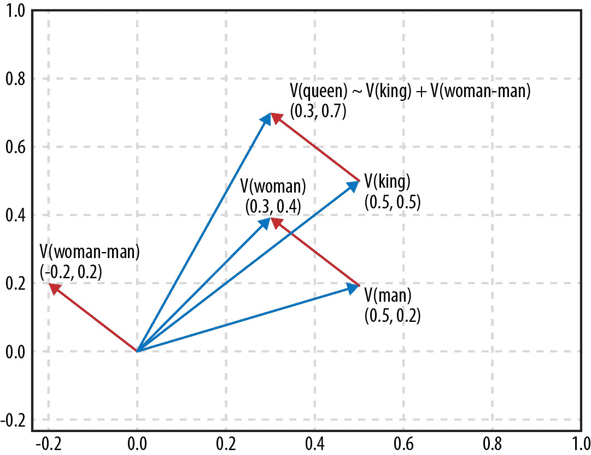
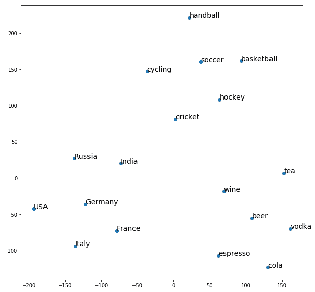
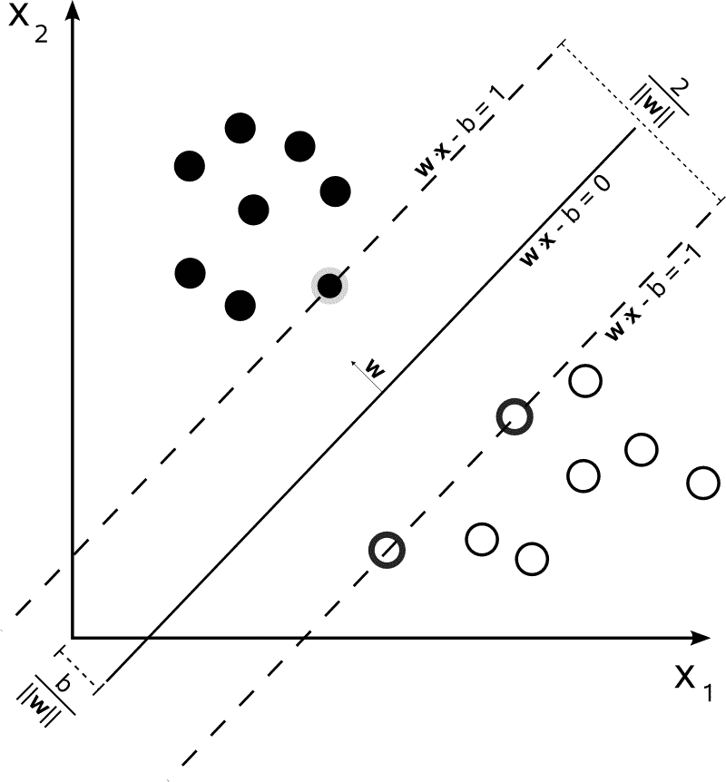
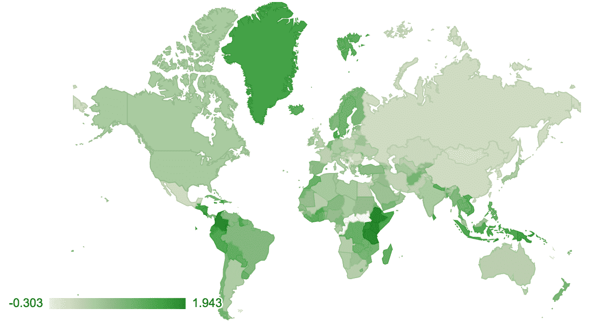

# 第三章：使用单词嵌入计算文本相似性

###### 提示

在我们开始之前，这是第一个包含实际代码的章节。有可能你直接跳到这里，谁会责怪你呢？不过，要按照这些步骤，确保你已经准备好了相关的代码是非常有帮助的。你可以通过在 shell 中执行以下命令来轻松实现这一点：

```py
git clone \
  https://github.com/DOsinga/deep_learning_cookbook.git
cd deep_learning_cookbook
python3 -m venv venv3
source venv3/bin/activate
pip install -r requirements.txt
jupyter notebook
```

你可以在“你需要知道什么？”中找到更详细的解释。

在本章中，我们将看看单词嵌入以及它们如何帮助我们计算文本片段之间的相似性。单词嵌入是自然语言处理中使用的一种强大技术，将单词表示为*n*维空间中的向量。这个空间的有趣之处在于具有相似含义的单词会彼此靠近。

我们将在这里使用 Google 的 Word2vec 的一个版本作为主要模型。这不是一个深度神经模型。事实上，它只是一个从单词到向量的大型查找表，因此几乎根本不算是一个模型。Word2vec 的嵌入是在训练网络以从 Google 新闻中获取的句子的上下文中预测单词的副作用。此外，它可能是嵌入的最著名的例子，嵌入是深度学习中一个重要的概念。

一旦你开始寻找它们，具有语义属性的高维空间就会在深度学习中随处可见。我们可以通过将电影投影到高维空间中来构建电影推荐系统(第四章)，或者仅使用两个维度创建手写数字的地图(第十三章)。图像识别网络将图像投影到一个空间中，使得相似的图像彼此靠近(第十章)。

在当前章节中，我们将专注于单词嵌入。我们将从使用预训练的单词嵌入模型计算单词相似性开始，然后展示一些有趣的 Word2vec 数学。然后，我们将探索如何可视化这些高维空间。

接下来，我们将看看如何利用 Word2vec 等单词嵌入的语义属性进行特定领域的排名。我们将把单词及其嵌入视为它们所代表的实体，得到一些有趣的结果。我们将从在 Word2vec 嵌入中找到实体类开始——在这种情况下是国家。然后，我们将展示如何对这些国家进行排名术语，以及如何在地图上可视化这些结果。

单词嵌入是将单词映射到向量的强大方式，有许多用途。它们经常被用作文本的预处理步骤。

与本章相关的有两个 Python 笔记本：

```py
03.1 Using pretrained word embeddings
03.2 Domain specific ranking using word2vec cosine distance
```

# 3.1 使用预训练的单词嵌入查找单词相似性

## 问题

你需要找出两个单词是否相似但不相等，例如当你验证用户输入时，不希望要求用户完全输入预期的单词。

## 解决方案

你可以使用一个预训练的单词嵌入模型。在这个例子中，我们将使用`gensim`，这是一个在 Python 中用于主题建模的有用库。

第一步是获取一个预训练模型。互联网上有许多可供下载的预训练模型，但我们将选择 Google News 的一个。它包含 300 万个单词的嵌入，并且是在大约 1000 亿个来自 Google 新闻档案的单词上进行训练的。下载需要一些时间，所以我们将在本地缓存文件：

```py
MODEL = 'GoogleNews-vectors-negative300.bin'
path = get_file(MODEL + '.gz',
    'https://s3.amazonaws.com/dl4j-distribution/%s.gz' % MODEL)
unzipped = os.path.join('generated', MODEL)
if not os.path.isfile(unzipped):
    with open(unzipped, 'wb') as fout:
        zcat = subprocess.Popen(['zcat'],
                          stdin=open(path),
                          stdout=fout
                         )
        zcat.wait()
```

```py
Downloading data from GoogleNews-vectors-negative300.bin.gz
1647050752/1647046227 [==============================] - 71s 0us/step
```

现在我们已经下载了模型，我们可以将其加载到内存中。这个模型非常庞大，大约需要 5GB 的 RAM。

```py
model = gensim.models.KeyedVectors.load_word2vec_format(MODEL, binary=True)
```

模型加载完成后，我们可以使用它来查找相似的单词：

```py
model.most_similar(positive=['espresso'])
```

```py
[(u'cappuccino', 0.6888186931610107),
 (u'mocha', 0.6686209440231323),
 (u'coffee', 0.6616827249526978),
 (u'latte', 0.6536752581596375),
 (u'caramel_macchiato', 0.6491267681121826),
 (u'ristretto', 0.6485546827316284),
 (u'espressos', 0.6438628435134888),
 (u'macchiato', 0.6428250074386597),
 (u'chai_latte', 0.6308028697967529),
 (u'espresso_cappuccino', 0.6280542612075806)]
```

## 讨论

单词嵌入将一个*n*维向量与词汇表中的每个单词相关联，使得相似的单词彼此靠近。查找相似单词只是一个最近邻搜索，即使在高维空间中也有高效的算法。

简化一下，Word2vec 嵌入是通过训练神经网络来预测单词的上下文而获得的。因此，我们要求网络预测在一系列片段中应该选择哪个单词作为 X；例如，“咖啡馆提供了一种让我真正清醒的 X。”

这样，可以插入类似模式的单词将获得彼此接近的向量。我们不关心实际任务，只关心分配的权重，这将作为训练这个网络的副作用得到。

在本书的后面部分，我们将看到词嵌入也可以用来将单词输入神经网络。将一个 300 维的嵌入向量输入网络比输入一个 300 万维的 one-hot 编码更可行。此外，使用预训练的词嵌入来喂养网络不需要学习单词之间的关系，而是可以立即开始处理真正的任务。

# 3.2 Word2vec 数学

## 问题

如何自动回答“A 是 B，C 是什么”的问题？

## 解决方案

利用 Word2vec 模型的语义属性。`gensim`库使这变得相当简单：

```py
def A_is_to_B_as_C_is_to(a, b, c, topn=1):
  a, b, c = map(lambda x:x if type(x) == list else [x], (a, b, c))
  res = model.most_similar(positive=b + c, negative=a, topn=topn)
  if len(res):
    if topn == 1:
      return res[0][0]
    return [x[0] for x in res]
  return None
```

现在我们可以将这种方法应用于任意单词，例如，找到与“国王”相关的单词，就像“儿子”与“女儿”相关一样：

```py
A_is_to_B_as_C_is_to('man', 'woman', 'king')
```

```py
u'queen'
```

我们也可以使用这种方法查找选定国家的首都：

```py
for country in 'Italy', 'France', 'India', 'China':
    print('%s is the capital of %s' %
          (A_is_to_B_as_C_is_to('Germany', 'Berlin', country), country))
```

```py
Rome is the capital of Italy
Paris is the capital of France
Delhi is the capital of India
Beijing is the capital of China
```

或者查找公司的主要产品（注意这些嵌入中使用的任何数字的占位符#）：

```py
for company in 'Google', 'IBM', 'Boeing', 'Microsoft', 'Samsung':
  products = A_is_to_B_as_C_is_to(
    ['Starbucks', 'Apple'], ['Starbucks_coffee', 'iPhone'], company, topn=3)
  print('%s -> %s' %
        (company, ', '.join(products)))
```

```py
Google -> personalized_homepage, app, Gmail
IBM -> DB2, WebSphere_Portal, Tamino_XML_Server
Boeing -> Dreamliner, airframe, aircraft
Microsoft -> Windows_Mobile, SyncMate, Windows
Samsung -> MM_A###, handset, Samsung_SCH_B###
```

## 讨论

正如我们在前面的步骤中看到的，与单词相关联的向量编码了单词的含义——相互相似的单词具有彼此接近的向量。事实证明，单词向量之间的差异也编码了单词之间的差异，因此如果我们取单词“儿子”的向量并减去单词“女儿”的向量，我们最终得到一个可以解释为“从男性到女性”的差异。如果我们将这个差异加到单词“国王”的向量上，我们最终会接近单词“女王”的向量。



`most_similar`方法接受一个或多个正词和一个或多个负词。它查找相应的向量，然后从正向量中减去负向量，并返回与结果向量最接近的单词。

因此，为了回答“A 是 B，C 是什么”的问题，我们希望从 B 中减去 A，然后加上 C，或者使用`positive = [B, C]`和`negative = [A]`调用`most_similar`。示例`A_is_to_B_as_C_is_to`为这种行为添加了两个小特性。如果我们只请求一个示例，它将返回一个单个项目，而不是一个包含一个项目的列表。同样，我们可以为 A、B 和 C 返回列表或单个项目。

提供列表的能力在产品示例中证明是有用的。我们要求每家公司三种产品，这使得准确获取向量比仅要求一种产品更为重要。通过提供“星巴克”和“苹果”，我们可以获得更准确的“是产品”的概念向量。

# 3.3 可视化词嵌入

## 问题

您想要了解单词嵌入如何将一组对象分区。

## 解决方案

300 维空间很难浏览，但幸运的是，我们可以使用一种称为 t-分布随机邻居嵌入（t-SNE）的算法将高维空间折叠成更易理解的二维空间。

假设我们想看看三组术语是如何分区的。我们选择国家、体育和饮料：

```py
beverages = ['espresso', 'beer', 'vodka', 'wine', 'cola', 'tea']
countries = ['Italy', 'Germany', 'Russia', 'France', 'USA', 'India']
sports = ['soccer', 'handball', 'hockey', 'cycling', 'basketball', 'cricket']

items = beverages + countries + sports
```

现在让我们查找它们的向量：

```py
item_vectors = [(item, model[item])
                    for item in items
                    if item in model]
```

现在我们可以使用 t-SNE 来找到 300 维空间中的聚类：

```py
vectors = np.asarray([x[1] for x in item_vectors])
lengths = np.linalg.norm(vectors, axis=1)
norm_vectors = (vectors.T / lengths).T
tsne = TSNE(n_components=2, perplexity=10,
            verbose=2).fit_transform(norm_vectors)
```

让我们使用 matplotlib 在一个漂亮的散点图中展示结果：

```py
x=tsne[:,0]
y=tsne[:,1]

fig, ax = plt.subplots()
ax.scatter(x, y)

for item, x1, y1 in zip(item_vectors, x, y):
    ax.annotate(item[0], (x1, y1))

plt.show()
```

结果是：



## 讨论

t-SNE 是一个聪明的算法；你给它一组高维空间中的点，它会迭代地尝试找到最佳投影到一个保持点之间距离尽可能好的低维空间（通常是一个平面）。因此，它非常适合用于可视化高维空间，比如（单词）嵌入。

对于更复杂的情况，`perplexity`参数是一个可以尝试的东西。这个变量大致确定了局部准确性和整体准确性之间的平衡。将其设置为一个较低的值会创建小的局部准确的簇；将其设置得更高会导致更多的局部扭曲，但整体簇更好。

# 3.4 在嵌入中找到实体类

## 问题

在高维空间中，通常存在只包含一个类别实体的子空间。如何找到这些空间呢？

## 解决方案

在一组示例和反例上应用支持向量机（SVM）。例如，让我们在 Word2vec 空间中找到国家。我们将重新加载模型并探索与国家德国相似的内容：

```py
model = gensim.models.KeyedVectors.load_word2vec_format(MODEL, binary=True)
model.most_similar(positive=['Germany'])
```

```py
[(u'Austria', 0.7461062073707581),
 (u'German', 0.7178748846054077),
 (u'Germans', 0.6628648042678833),
 (u'Switzerland', 0.6506867408752441),
 (u'Hungary', 0.6504981517791748),
 (u'Germnay', 0.649348258972168),
 (u'Netherlands', 0.6437495946884155),
 (u'Cologne', 0.6430779099464417)]
```

正如你所看到的，附近有许多国家，但像“German”这样的词和德国城市的名称也出现在列表中。我们可以尝试构建一个最能代表“国家”概念的向量，通过将许多国家的向量相加而不仅仅使用德国，但这只能走到这一步。在嵌入空间中，国家的概念不是一个点，而是一个形状。我们需要的是一个真正的分类器。

支持向量机已被证明对于这样的分类任务非常有效。Scikit-learn 提供了一个易于部署的解决方案。第一步是构建一个训练集。对于这个示例，获取正面例子并不难，因为国家并不多：

```py
positive = ['Chile', 'Mauritius', 'Barbados', 'Ukraine', 'Israel',
  'Rwanda', 'Venezuela', 'Lithuania', 'Costa_Rica', 'Romania',
  'Senegal', 'Canada', 'Malaysia', 'South_Korea', 'Australia',
  'Tunisia', 'Armenia', 'China', 'Czech_Republic', 'Guinea',
  'Gambia', 'Gabon', 'Italy', 'Montenegro', 'Guyana', 'Nicaragua',
  'French_Guiana', 'Serbia', 'Uruguay', 'Ethiopia', 'Samoa',
  'Antarctica', 'Suriname', 'Finland', 'Bermuda', 'Cuba', 'Oman',
  'Azerbaijan', 'Papua', 'France', 'Tanzania', 'Germany' … ]
```

当然，拥有更多的正面例子更好，但对于这个示例，使用 40-50 个将让我们对解决方案的工作原理有一个很好的了解。

我们还需要一些负面例子。我们直接从 Word2vec 模型的一般词汇中抽样这些。我们可能会不走运地抽到一个国家并将其放入负面例子，但考虑到我们的模型中有 300 万个词，世界上不到 200 个国家，我们确实需要非常不走运：

```py
negative = random.sample(model.vocab.keys(), 5000)
negative[:4]
```

```py
[u'Denys_Arcand_Les_Invasions',
 u'2B_refill',
 u'strained_vocal_chords',
 u'Manifa']
```

现在我们将根据正面和负面例子创建一个带标签的训练集。我们将使用`1`作为表示某物是一个国家的标签，使用`0`表示它不是一个国家。我们将遵循将训练数据存储在变量`X`中，标签存储在变量`y`中的惯例：

```py
labelled = [(p, 1) for p in positive] + [(n, 0) for n in negative]
random.shuffle(labelled)
X = np.asarray([model[w] for w, l in labelled])
y = np.asarray([l for w, l in labelled])
```

让我们训练模型。我们将留出一部分数据来评估我们的表现：

```py
TRAINING_FRACTION = 0.7
cut_off = int(TRAINING_FRACTION * len(labelled))
clf = svm.SVC(kernel='linear')
clf.fit(X[:cut_off], y[:cut_off])
```

由于我们的数据集相对较小，即使在一台性能不是很强大的计算机上，训练应该几乎瞬间完成。我们可以通过查看模型对评估集的位的正确预测次数来了解我们的表现如何：

```py
res = clf.predict(X[cut_off:])

missed = [country for (pred, truth, country) in
          zip(res, y[cut_off:], labelled[cut_off:]) if pred != truth]
100 - 100 * float(len(missed)) / len(res), missed
```

你得到的结果会有点取决于选择的正面国家和你碰巧抽到的负面样本。我主要得到了一个错过的国家列表——通常是因为国家名称也意味着其他东西，比如约旦，但也有一些真正的遗漏。精度大约为 99.9%。

现在我们可以运行分类器来提取所有单词中的国家：

```py
res = []
for word, pred in zip(model.index2word, all_predictions):
  if pred:
    res.append(word)
    if len(res) == 150:
      break
random.sample(res, 10)
```

```py
[u'Myanmar',
 u'countries',
 u'Sri_Lanka',
 u'Israelis',
 u'Australia',
 u'Pyongyang',
 u'New_Hampshire',
 u'Italy',
 u'China',
 u'Philippine']
```

结果相当不错，虽然不是完美的。例如，单词“countries”本身被分类为一个国家，大陆或美国州等实体也是如此。

## 讨论

支持向量机是在像单词嵌入这样的高维空间中找到类别的有效工具。它们通过尝试找到将正面例子与负面例子分开的超平面来工作。

在 Word2vec 中，国家都相互靠近，因为它们共享一个语义方面。支持向量机帮助我们找到国家的云，并提出边界。以下图表在二维中可视化了这一点：



SVMs 可以用于机器学习中各种特定的分类器，因为即使维度数大于样本数，它们也是有效的，就像在这种情况下一样。300 个维度可能使模型过度拟合数据，但由于 SVM 试图找到一个简单的模型来拟合数据，我们仍然可以从一个只有几十个示例的数据集中推广。

取得的结果相当不错，尽管值得注意的是，在有 300 万个负例的情况下，99.7%的精度仍会给我们带来 9000 个假阳性，淹没了实际的国家。

# 3.5 计算类内的语义距离

## 问题

如何找到一个类中对于给定标准最相关的项目？

## 解决方案

给定一个类，例如*国家*，我们可以根据一个标准对该类的成员进行排名，通过查看相对距离：

```py
country_to_idx = {country['name']: idx for idx, country in enumerate(countries)}
country_vecs = np.asarray([model[c['name']] for c in countries])
country_vecs.shape
```

```py
(184, 300)
```

现在我们可以像以前一样，将国家的向量提取到一个与国家对齐的`numpy`数组中：

```py
countries = list(country_to_cc.keys())
country_vecs = np.asarray([model[c] for c in countries])
```

快速检查看哪些国家最像加拿大：

```py
dists = np.dot(country_vecs, country_vecs[country_to_idx['Canada']])
for idx in reversed(np.argsort(dists)[-8:]):
    print(countries[idx], dists[idx])
```

```py
Canada 7.5440245
New_Zealand 3.9619699
Finland 3.9392405
Puerto_Rico 3.838145
Jamaica 3.8102934
Sweden 3.8042784
Slovakia 3.7038736
Australia 3.6711009
```

加勒比国家有些令人惊讶，关于加拿大的许多新闻必须与曲棍球有关，鉴于斯洛伐克和芬兰出现在列表中，但除此之外看起来并不不合理。

让我们转换思路，对一组国家的任意术语进行排名。对于每个国家，我们将计算国家名称与我们想要排名的术语之间的距离。与术语“更接近”的国家对于该术语更相关：

```py
def rank_countries(term, topn=10, field='name'):
    if not term in model:
        return []
    vec = model[term]
    dists = np.dot(country_vecs, vec)
    return [(countries[idx][field], float(dists[idx]))
            for idx in reversed(np.argsort(dists)[-topn:])]
```

例如：

```py
rank_countries('cricket')
```

```py
[('Sri_Lanka', 5.92276668548584),
 ('Zimbabwe', 5.336524486541748),
 ('Bangladesh', 5.192488670349121),
 ('Pakistan', 4.948408126831055),
 ('Guyana', 3.9162840843200684),
 ('Barbados', 3.757995128631592),
 ('India', 3.7504401206970215),
 ('South_Africa', 3.6561498641967773),
 ('New_Zealand', 3.642028331756592),
 ('Fiji', 3.608567714691162)]
```

由于我们使用的 Word2vec 模型是在 Google 新闻上训练的，排名器将返回最近新闻中大多数以给定术语而闻名的国家。印度可能更常被提及与板球有关，但只要它也涵盖其他事物，斯里兰卡仍然可以获胜。

## 讨论

在我们将不同类的成员投影到相同维度的空间中的情况下，我们可以使用跨类距离作为亲和度的度量。Word2vec 并不完全代表一个概念空间（单词“Jordan”可以指河流、国家或一个人），但它足够好，可以很好地对各种概念的国家进行排名。

构建推荐系统时通常采用类似方法。例如，在 Netflix 挑战中，一种流行的策略是使用用户对电影的评分来将用户和电影投影到一个共享空间中。接近用户的电影预计会受到用户高度评价。

在我们有两个不同的空间的情况下，如果我们可以计算从一个空间到另一个空间的投影矩阵，我们仍然可以使用这个技巧。如果我们有足够多的候选者在两个空间中的位置我们都知道，这是可能的。

# 3.6 在地图上可视化国家数据

## 问题

如何在地图上可视化实验中的国家排名？

## 解决方案

GeoPandas 是在地图上可视化数值数据的完美工具。

这个巧妙的库将 Pandas 的强大功能与地理原语结合在一起，并预装了一些地图。让我们加载世界：

```py
world = gpd.read_file(gpd.datasets.get_path('naturalearth_lowres'))
world.head()
```

这向我们展示了一些关于一组国家的基本信息。我们可以根据我们的`rank_countries`函数向`world`对象添加一列：

```py
def map_term(term):
    d = {k.upper(): v for k, v in rank_countries(term,
                                                 topn=0,
                                                 field='cc3')}
    world[term] = world['iso_a3'].map(d)
    world[term] /= world[term].max()
    world.dropna().plot(term, cmap='OrRd')

map_term('coffee')
```

例如，这很好地绘制了咖啡地图，突出了咖啡消费国家和咖啡生产国家。



## 讨论

可视化数据是机器学习中的一项重要技术。能够查看数据，无论是输入还是某些算法的结果，都可以让我们快速发现异常。格陵兰岛的人们真的喝那么多咖啡吗？还是因为“格陵兰咖啡”（爱尔兰咖啡的变种）而看到了一种人为现象？那些位于非洲中部的国家——他们真的既不喝咖啡也不生产咖啡吗？还是因为我们的嵌入中没有关于它们的数据？

GeoPandas 是分析地理编码信息的理想工具，它基于 Pandas 的通用数据功能，我们将在第六章中更多地了解到。
