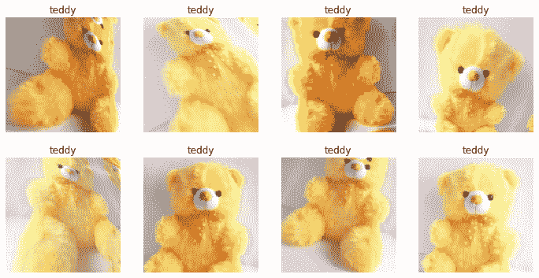
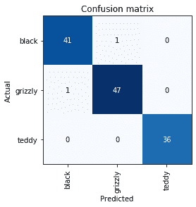
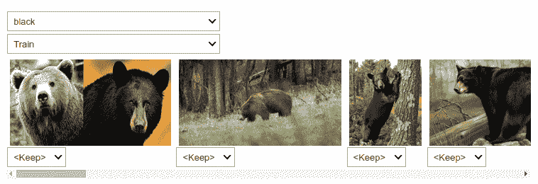
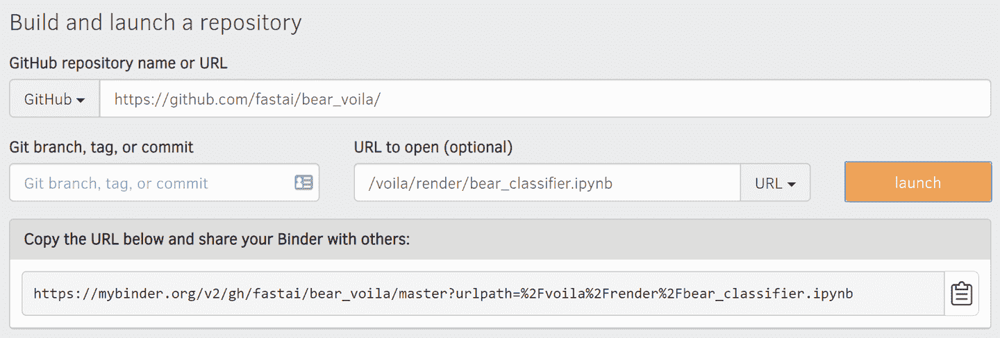
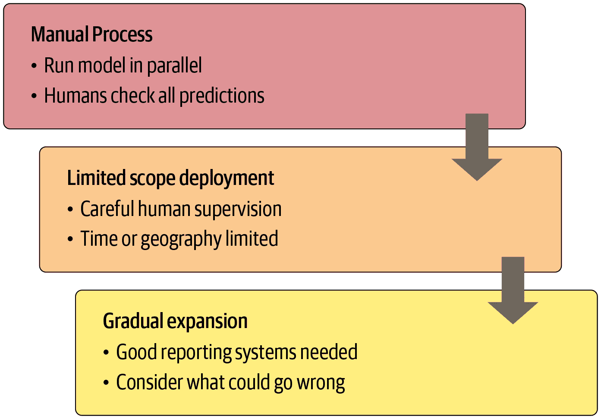

# 第二章：从模型到生产

我们在第一章中看到的六行代码只是在实践中使用深度学习过程的一小部分。在本章中，我们将使用一个计算机视觉示例来查看创建深度学习应用的端到端过程。更具体地说，我们将构建一个熊分类器！在这个过程中，我们将讨论深度学习的能力和限制，探讨如何创建数据集，在实践中使用深度学习时可能遇到的问题等等。许多关键点同样适用于其他深度学习问题，例如第一章中的问题。如果您解决的问题在关键方面类似于我们的示例问题，我们期望您可以快速获得极好的结果，而只需很少的代码。

让我们从如何构建您的问题开始。

# 深度学习的实践

我们已经看到深度学习可以快速解决许多具有挑战性的问题，并且只需很少的代码。作为初学者，有一些问题与我们的示例问题足够相似，以便您可以非常快速地获得极其有用的结果。然而，深度学习并不是魔法！同样的六行代码不会适用于今天任何人可以想到的每个问题。

低估深度学习的限制并高估其能力可能导致令人沮丧的糟糕结果，至少在您获得一些经验并能解决出现的问题之前。相反，高估深度学习的限制并低估其能力可能意味着您不会尝试可解决的问题，因为您自己否定了它。

我们经常与低估深度学习的限制和能力的人交谈。这两者都可能是问题：低估能力意味着您可能甚至不会尝试可能非常有益的事情，而低估限制可能意味着您未能考虑和应对重要问题。

最好的做法是保持开放的心态。如果您对深度学习可能以比您预期的更少的数据或复杂性解决部分问题持开放态度，您可以设计一个过程，通过该过程您可以找到与您特定问题相关的特定能力和限制。这并不意味着进行任何冒险的赌注-我们将向您展示如何逐渐推出模型，以便它们不会带来重大风险，并且甚至可以在投入生产之前对其进行回测。

## 开始您的项目

那么您应该从哪里开始深度学习之旅呢？最重要的是确保您有一个要处理的项目-只有通过处理自己的项目，您才能获得构建和使用模型的真实经验。在选择项目时，最重要的考虑因素是数据的可用性。

无论您是为了自己的学习还是为了在组织中的实际应用而进行项目，您都希望能够快速开始。我们看到许多学生、研究人员和行业从业者在试图找到他们完美的数据集时浪费了几个月甚至几年的时间。目标不是找到“完美”的数据集或项目，而只是开始并从那里迭代。如果您采取这种方法，您将在完美主义者仍处于规划阶段时进行第三次迭代学习和改进！

我们还建议您在项目中端到端迭代；不要花几个月来微调您的模型，或打磨完美的 GUI，或标记完美的数据集……相反，尽可能在合理的时间内完成每一步，一直到最后。例如，如果您的最终目标是一个在手机上运行的应用程序，那么每次迭代后您都应该拥有这个。但也许在早期迭代中您会采取捷径；例如，在远程服务器上进行所有处理，并使用简单的响应式 Web 应用程序。通过完成项目的端到端，您将看到最棘手的部分在哪里，以及哪些部分对最终结果产生最大影响。

当您阅读本书时，我们建议您完成许多小实验，通过运行和调整我们提供的笔记本，同时逐渐开发自己的项目。这样，您将获得所有我们解释的工具和技术的经验，同时我们讨论它们。

# Sylvain 说

为了充分利用这本书，花时间在每一章之间进行实验，无论是在您自己的项目上还是通过探索我们提供的笔记本。然后尝试在新数据集上从头开始重写这些笔记本。只有通过大量练习（和失败），您才能培养出如何训练模型的直觉。

通过使用端到端迭代方法，您还将更好地了解您实际需要多少数据。例如，您可能会发现您只能轻松获得 200 个标记数据项，而在尝试之前，您无法真正知道这是否足以使您的应用在实践中良好运行。

在组织环境中，您可以通过展示一个真实的工作原型来向同事展示您的想法是可行的。我们反复观察到，这是获得项目良好组织支持的秘诀。

由于最容易开始的项目是您已经有数据可用的项目，这意味着最容易开始的项目可能与您已经在做的事情相关，因为您已经有关于您正在做的事情的数据。例如，如果您在音乐行业工作，您可能可以访问许多录音。如果您是放射科医生，您可能可以访问大量医学图像。如果您对野生动物保护感兴趣，您可能可以访问大量野生动物图像。

有时您必须有点创造性。也许您可以找到一个先前的机器学习项目，比如一个与您感兴趣的领域相关的 Kaggle 竞赛。有时您必须做出妥协。也许您找不到您所需的确切数据来完成您心中的项目；但您可能会找到一些来自类似领域的数据，或者以不同方式测量的数据，解决一个略有不同的问题。在这些类似项目上工作仍然会让您对整个过程有很好的理解，并可能帮助您识别其他捷径、数据来源等。

特别是当您刚开始学习深度学习时，最好不要涉足非常不同的领域，不要涉足深度学习之前未应用的领域。因为如果您的模型一开始就不起作用，您将不知道是因为您犯了错误，还是您试图解决的问题根本无法用深度学习解决。您也不知道从哪里寻求帮助。因此，最好首先找到在线的一个例子，该例子已经取得了良好的结果，并且至少与您尝试实现的目标有些相似，通过将您的数据转换为其他人以前使用过的格式（例如从您的数据创建图像）。让我们看看深度学习的现状，这样您就知道深度学习目前擅长的领域。

## 深度学习的现状

让我们首先考虑深度学习是否能够解决您要解决的问题。本节概述了 2020 年初深度学习的现状。然而，事情发展得非常快，当您阅读本文时，其中一些限制可能已经不存在。我们将尽力保持本书网站的最新信息；此外，搜索“AI 现在能做什么”可能会提供当前信息。

### 计算机视觉

深度学习尚未用于分析图像的许多领域，但在已经尝试过的领域中，几乎普遍表明计算机可以至少与人类一样好地识别图像中的物品，甚至是经过专门训练的人，如放射科医生。这被称为*物体识别*。深度学习还擅长识别图像中物体的位置，并可以突出它们的位置并命名每个找到的物体。这被称为*物体检测*（在我们在第一章中看到的变体中，每个像素根据其所属的对象类型进行分类—这被称为*分割*）。

深度学习算法通常不擅长识别结构或风格与用于训练模型的图像明显不同的图像。例如，如果训练数据中没有黑白图像，模型可能在黑白图像上表现不佳。同样，如果训练数据不包含手绘图像，模型可能在手绘图像上表现不佳。没有一般方法可以检查训练集中缺少哪些类型的图像，但我们将在本章中展示一些方法，以尝试识别当模型在生产中使用时数据中出现意外图像类型的情况（这被称为检查*域外*数据）。

物体检测系统面临的一个主要挑战是图像标记可能会很慢且昂贵。目前有很多工作正在进行中，旨在开发工具以尝试使这种标记更快速、更容易，并且需要更少的手工标签来训练准确的物体检测模型。一个特别有帮助的方法是合成生成输入图像的变化，例如通过旋转它们或改变它们的亮度和对比度；这被称为*数据增强*，并且对文本和其他类型的模型也很有效。我们将在本章中详细讨论这一点。

另一个要考虑的问题是，尽管您的问题可能看起来不像是一个计算机视觉问题，但通过一点想象力可能可以将其转变为一个。例如，如果您要分类的是声音，您可以尝试将声音转换为其声学波形的图像，然后在这些图像上训练模型。

### 自然语言处理

计算机擅长基于类别对短文档和长文档进行分类，例如垃圾邮件或非垃圾邮件、情感（例如，评论是积极的还是消极的）、作者、来源网站等。我们不知道在这个领域是否有任何严格的工作来比较计算机和人类，但从经验上看，我们认为深度学习的性能在这些任务上与人类的性能相似。

深度学习还擅长生成与上下文相关的文本，例如回复社交媒体帖子，并模仿特定作者的风格。它还擅长使这些内容对人类具有吸引力—事实上，甚至比人类生成的文本更具吸引力。然而，深度学习不擅长生成*正确*的回应！例如，我们没有可靠的方法来将医学信息知识库与深度学习模型结合起来，以生成医学上正确的自然语言回应。这是危险的，因为很容易创建对外行人看来具有吸引力但实际上完全不正确的内容。

另一个问题是，社交媒体上的上下文适当、高度引人入胜的回应可能被大规模使用——比以前见过的任何喷子农场规模大几千倍——来传播虚假信息，制造动荡，鼓励冲突。一般来说，文本生成模型总是在技术上略领先于识别自动生成文本的模型。例如，可以使用一个能够识别人工生成内容的模型来实际改进创建该内容的生成器，直到分类模型无法完成其任务为止。

尽管存在这些问题，深度学习在自然语言处理中有许多应用：可以用来将文本从一种语言翻译成另一种语言，将长篇文档总结为更快消化的内容，找到感兴趣概念的所有提及等。不幸的是，翻译或总结可能包含完全错误的信息！然而，性能已经足够好，许多人正在使用这些系统——例如，谷歌的在线翻译系统（以及我们所知道的每个其他在线服务）都是基于深度学习的。

### 结合文本和图像

深度学习将文本和图像结合成一个单一模型的能力通常比大多数人直觉期望的要好得多。例如，一个深度学习模型可以在输入图像上进行训练，输出用英语编写的标题，并且可以学会为新图像自动生成令人惊讶地适当的标题！但是，我们再次提出与前一节讨论的相同警告：不能保证这些标题是正确的。

由于这个严重问题，我们通常建议深度学习不要作为完全自动化的过程，而是作为模型和人类用户密切互动的过程的一部分。这可能使人类的生产力比完全手动方法高出几个数量级，并且比仅使用人类更准确。

例如，自动系统可以直接从 CT 扫描中识别潜在的中风患者，并发送高优先级警报，以便快速查看这些扫描。治疗中风只有三个小时的时间窗口，因此这种快速的反馈循环可以挽救生命。同时，所有扫描仍然可以按照通常的方式发送给放射科医生，因此不会减少人类的参与。其他深度学习模型可以自动测量扫描中看到的物品，并将这些测量结果插入报告中，警告放射科医生可能错过的发现，并告诉他们可能相关的其他病例。

### 表格数据

对于分析时间序列和表格数据，深度学习最近取得了巨大进展。然而，深度学习通常作为多种模型集成的一部分使用。如果您已经有一个正在使用随机森林或梯度提升机（流行的表格建模工具，您很快将了解）的系统，那么切换到或添加深度学习可能不会带来任何显著的改进。

深度学习确实大大增加了您可以包含的列的种类——例如，包含自然语言（书名、评论等）和高基数分类列（即包含大量离散选择的内容，如邮政编码或产品 ID）。不过，与随机森林或梯度提升机相比，深度学习模型通常需要更长的训练时间，尽管由于提供 GPU 加速的库（如[RAPIDS](https://rapids.ai)），情况正在改变。我们在第九章中详细介绍了所有这些方法的优缺点。

### 推荐系统

推荐系统实际上只是一种特殊类型的表格数据。特别是，它们通常具有代表用户的高基数分类变量，以及代表产品（或类似物品）的另一个变量。像亚马逊这样的公司将客户所做的每一次购买都表示为一个巨大的稀疏矩阵，其中客户是行，产品是列。一旦他们以这种格式拥有数据，数据科学家们会应用某种形式的协同过滤来*填充矩阵*。例如，如果客户 A 购买产品 1 和 10，客户 B 购买产品 1、2、4 和 10，引擎将推荐 A 购买 2 和 4。

由于深度学习模型擅长处理高基数分类变量，它们非常擅长处理推荐系统。尤其是当将这些变量与其他类型的数据（如自然语言或图像）结合时，它们就像处理表格数据一样发挥作用。它们还可以很好地将所有这些类型的信息与其他元数据（如用户信息、先前交易等）表示为表格进行组合。

然而，几乎所有的机器学习方法都有一个缺点，那就是它们只告诉你一个特定用户可能喜欢哪些产品，而不是对用户有用的推荐。用户可能喜欢的产品的许多种推荐可能根本不会有任何帮助——例如，如果用户已经熟悉这些产品，或者如果它们只是用户已经购买过的产品的不同包装（例如，当他们已经拥有该套装中的每一件物品时，推荐一个小说的套装）。Jeremy 喜欢读特里·普拉切特的书，有一段时间亚马逊一直在向他推荐特里·普拉切特的书（见图 2-1），这实际上并不是有用的，因为他已经知道这些书了！


###### 图 2-1. 一个不太有用的推荐

### 其他数据类型

通常，您会发现特定领域的数据类型非常适合现有的类别。例如，蛋白质链看起来很像自然语言文档，因为它们是由复杂关系和意义贯穿整个序列的离散令牌组成的长序列。事实上，使用 NLP 深度学习方法是许多类型蛋白质分析的最先进方法。另一个例子，声音可以表示为频谱图，可以被视为图像；标准的图像深度学习方法在频谱图上表现得非常好。

## 驱动系统方法

许多准确的模型对任何人都没有用，而许多不准确的模型却非常有用。为了确保您的建模工作在实践中有用，您需要考虑您的工作将如何使用。2012 年，Jeremy 与 Margit Zwemer 和 Mike Loukides 一起提出了一种称为*驱动系统方法*的思考这个问题的方法。

驱动系统方法，如图 2-2 所示，详细介绍在[“设计出色的数据产品”](https://oreil.ly/KJIIa)中。基本思想是从考虑您的目标开始，然后考虑您可以采取哪些行动来实现该目标以及您拥有的（或可以获取的）可以帮助的数据，然后构建一个模型，您可以使用该模型确定为实现目标而采取的最佳行动。


###### 图 2-2. 驱动系统方法

考虑自动驾驶汽车中的模型：您希望帮助汽车安全地从 A 点驾驶到 B 点，而无需人为干预。出色的预测建模是解决方案的重要组成部分，但它并不是独立存在的；随着产品变得更加复杂，它会消失在管道中。使用自动驾驶汽车的人完全不知道使其运行的数百（甚至数千）个模型和海量数据。但随着数据科学家构建越来越复杂的产品，他们需要一种系统化的设计方法。

我们使用数据不仅仅是为了生成更多数据（以预测的形式），而是为了产生可操作的结果。这是 Drivetrain 方法的目标。首先要明确定义一个明确的目标。例如，当谷歌创建其第一个搜索引擎时，考虑了“用户在输入搜索查询时的主要目标是什么？”这导致了谷歌的目标，即“显示最相关的搜索结果”。下一步是考虑您可以拉动的杠杆（即您可以采取的行动）以更好地实现该目标。在谷歌的情况下，这是搜索结果的排名。第三步是考虑他们需要什么新数据来生成这样的排名；他们意识到关于哪些页面链接到哪些其他页面的隐含信息可以用于此目的。

只有在完成了这前三个步骤之后，我们才开始考虑构建预测模型。我们的目标和可用的杠杆，我们已经拥有的数据以及我们需要收集的额外数据，决定了我们可以构建的模型。这些模型将以杠杆和任何不可控变量作为输入；模型的输出可以结合起来预测我们的目标的最终状态。

让我们考虑另一个例子：推荐系统。推荐引擎的目标是通过推荐客户不会在没有推荐的情况下购买的物品来推动额外的销售。杠杆是推荐的排名。必须收集新数据以生成将导致新销售的推荐。这将需要进行许多随机实验，以收集关于各种客户的各种推荐的数据。这是很少有组织采取的一步；但是没有它，您就没有所需的信息来根据您的真正目标（更多销售！）优化推荐。

最后，您可以为购买概率构建两个模型，条件是看到或没有看到推荐。这两个概率之间的差异是给定推荐给客户的效用函数。在算法推荐客户已经拒绝的熟悉书籍（两个组成部分都很小）或者他们本来就会购买的书籍（两个组成部分都很大并互相抵消）的情况下，效用函数会很低。

正如您所看到的，在实践中，您的模型的实际实施通常需要比仅仅训练一个模型更多！您通常需要运行实验来收集更多数据，并考虑如何将您的模型整合到您正在开发的整个系统中。说到数据，现在让我们专注于如何为您的项目找到数据。

# 收集数据

对于许多类型的项目，您可能能够在线找到所需的所有数据。本章中我们将完成的项目是一个“熊探测器”。它将区分三种类型的熊：灰熊、黑熊和泰迪熊。互联网上有许多每种类型熊的图片可供我们使用。我们只需要找到它们并下载它们。

我们提供了一个工具供您使用，这样您就可以跟随本章并为您感兴趣的任何对象创建自己的图像识别应用程序。在 fast.ai 课程中，成千上万的学生在课程论坛上展示了他们的作品，展示了从特立尼达的蜂鸟品种到巴拿马的公交车类型的一切——甚至有一名学生创建了一个应用程序，可以帮助他的未婚妻在圣诞假期期间认出他的 16 个表兄弟！

在撰写本文时，Bing 图像搜索是我们知道的用于查找和下载图像的最佳选择。每月免费提供最多 1,000 次查询，每次查询可下载最多 150 张图片。然而，在我们撰写本书时和您阅读本书时之间可能会出现更好的选择，因此请务必查看本[书籍网站](https://book.fast.ai)以获取我们当前的推荐。

# 与最新服务保持联系

用于创建数据集的服务时常变化，它们的功能、接口和定价也经常变化。在本节中，我们将展示如何在撰写本书时作为 Azure 认知服务一部分提供的[Bing 图像搜索 API](https://oreil.ly/P8VtT)。

要使用 Bing 图像搜索下载图像，请在 Microsoft 注册一个免费帐户。您将获得一个密钥，您可以将其复制并输入到一个单元格中（用您的密钥替换*`XXX`*并执行）：

```py
key = 'XXX'
```

或者，如果您在命令行上感到自在，您可以在终端中设置它

```py
export AZURE_SEARCH_KEY=*your_key_here*
```

然后重新启动 Jupyter 服务器，在一个单元格中键入以下内容，并执行：

```py
key = os.environ['AZURE_SEARCH_KEY']
```

设置了`key`之后，您可以使用`search_images_bing`。这个函数是在线笔记本中包含的小`utils`类提供的（如果您不确定一个函数是在哪里定义的，您可以在笔记本中输入它来找出，如下所示）：

```py
search_images_bing
```

```py
<function utils.search_images_bing(key, term, min_sz=128)>
```

让我们尝试一下这个函数：

```py
results = search_images_bing(key, 'grizzly bear')
ims = results.attrgot('content_url')
len(ims)
```

```py
150
```

我们已成功下载了 150 只灰熊的 URL（或者至少是 Bing 图像搜索为该搜索词找到的图像）。让我们看一个：

```py
dest = 'images/grizzly.jpg'
download_url(ims[0], dest)
```

```py
im = Image.open(dest)
im.to_thumb(128,128)
```


这似乎运行得很好，所以让我们使用 fastai 的`download_images`来下载每个搜索词的所有 URL。我们将每个放在一个单独的文件夹中：

```py
bear_types = 'grizzly','black','teddy'
path = Path('bears')
```

```py
if not path.exists():
    path.mkdir()
    for o in bear_types:
        dest = (path/o)
        dest.mkdir(exist_ok=True)
        results = search_images_bing(key, f'{o} bear')
        download_images(dest, urls=results.attrgot('content_url'))
```

我们的文件夹中有图像文件，正如我们所期望的那样：

```py
fns = get_image_files(path)
fns
```

```py
(#421) [Path('bears/black/00000095.jpg'),Path('bears/black/00000133.jpg'),Path('
 > bears/black/00000062.jpg'),Path('bears/black/00000023.jpg'),Path('bears/black
 > /00000029.jpg'),Path('bears/black/00000094.jpg'),Path('bears/black/00000124.j
 > pg'),Path('bears/black/00000056.jpeg'),Path('bears/black/00000046.jpg'),Path(
 > 'bears/black/00000045.jpg')...]
```

# Jeremy 说

我就是喜欢在 Jupyter 笔记本中工作的这一点！逐步构建我想要的东西并在每一步检查我的工作是如此容易。我犯了*很多*错误，所以这对我真的很有帮助。

通常当我们从互联网下载文件时，会有一些文件损坏。让我们检查一下：

```py
failed = verify_images(fns)
failed
```

```py
(#0) []
```

要删除所有失败的图像，您可以使用`unlink`。像大多数返回集合的 fastai 函数一样，`verify_images`返回一个类型为`L`的对象，其中包括`map`方法。这会在集合的每个元素上调用传递的函数：

```py
failed.map(Path.unlink);
```

在这个过程中要注意的一件事是：正如我们在第一章中讨论的，模型只能反映用于训练它们的数据。而世界充满了有偏见的数据，这最终会反映在，例如，Bing 图像搜索（我们用来创建数据集的）。例如，假设您有兴趣创建一个应用程序，可以帮助用户确定他们是否拥有健康的皮肤，因此您训练了一个模型，该模型基于搜索结果（比如）“健康皮肤”。图 2-3 展示了您将获得的结果类型。


###### 图 2-3\. 用于健康皮肤检测器的数据？

使用此作为训练数据，您最终不会得到一个健康皮肤检测器，而是一个*年轻白人女性触摸她的脸*检测器！一定要仔细考虑您可能在应用程序中实际看到的数据类型，并仔细检查以确保所有这些类型都反映在您模型的源数据中。（感谢 Deb Raji 提出了健康皮肤的例子。请查看她的论文[“可操作的审计：调查公开命名商业 AI 产品偏见性能结果的影响”](https://oreil.ly/POS_C)以获取更多有关模型偏见的迷人见解。）

现在我们已经下载了一些数据，我们需要将其组装成适合模型训练的格式。在 fastai 中，这意味着创建一个名为`DataLoaders`的对象。

# 从数据到数据加载器

`DataLoaders`是一个简单的类，只是存储您传递给它的`DataLoader`对象，并将它们作为`train`和`valid`可用。尽管它是一个简单的类，但在 fastai 中非常重要：它为您的模型提供数据。`DataLoaders`中的关键功能仅用这四行代码提供（它还有一些其他次要功能我们暂时跳过）：

```py
class DataLoaders(GetAttr):
    def __init__(self, *loaders): self.loaders = loaders
    def __getitem__(self, i): return self.loaders[i]
    train,valid = add_props(lambda i,self: self[i])
```

# 术语：DataLoaders

一个 fastai 类，存储您传递给它的多个`DataLoader`对象——通常是一个`train`和一个`valid`，尽管可以有任意数量。前两个作为属性提供。

在本书的后面，您还将了解`Dataset`和`Datasets`类，它们具有相同的关系。要将我们下载的数据转换为`DataLoaders`对象，我们至少需要告诉 fastai 四件事：

+   我们正在处理什么类型的数据

+   如何获取项目列表

+   如何为这些项目打标签

+   如何创建验证集

到目前为止，我们已经看到了一些特定组合的*工厂方法*，当您有一个应用程序和数据结构恰好适合这些预定义方法时，这些方法非常方便。当您不适用时，fastai 有一个名为*数据块 API*的极其灵活的系统。使用此 API，您可以完全自定义创建`DataLoaders`的每个阶段。这是我们需要为刚刚下载的数据集创建`DataLoaders`的步骤：

```py
bears = DataBlock(
    blocks=(ImageBlock, CategoryBlock),
    get_items=get_image_files,
    splitter=RandomSplitter(valid_pct=0.2, seed=42),
    get_y=parent_label,
    item_tfms=Resize(128))
```

让我们依次查看每个参数。首先，我们提供一个元组，指定我们希望独立变量和因变量的类型：

```py
blocks=(ImageBlock, CategoryBlock)
```

*独立变量*是我们用来进行预测的东西，*因变量*是我们的目标。在这种情况下，我们的独立变量是一组图像，我们的因变量是每个图像的类别（熊的类型）。在本书的其余部分中，我们将看到许多其他类型的块。

对于这个`DataLoaders`，我们的基础项目将是文件路径。我们必须告诉 fastai 如何获取这些文件的列表。`get_image_files`函数接受一个路径，并返回该路径中所有图像的列表（默认情况下递归）：

```py
get_items=get_image_files
```

通常，您下载的数据集已经定义了验证集。有时，这是通过将用于训练和验证集的图像放入不同的文件夹中来完成的。有时，这是通过提供一个 CSV 文件，在该文件中，每个文件名都与应该在其中的数据集一起列出。有许多可以完成此操作的方法，fastai 提供了一种通用方法，允许您使用其预定义类之一或编写自己的类。

在这种情况下，我们希望随机拆分我们的训练和验证集。但是，我们希望每次运行此笔记本时都具有相同的训练/验证拆分，因此我们固定随机种子（计算机实际上不知道如何创建随机数，而只是创建看起来随机的数字列表；如果您每次都为该列表提供相同的起始点——称为*种子*，那么您将每次都获得完全相同的列表）。

```py
splitter=RandomSplitter(valid_pct=0.2, seed=42)
```

自变量通常被称为`x`，因变量通常被称为`y`。在这里，我们告诉 fastai 要调用哪个函数来创建数据集中的标签：

```py
get_y=parent_label
```

`parent_label`是 fastai 提供的一个函数，它简单地获取文件所在文件夹的名称。因为我们将每个熊图像放入基于熊类型的文件夹中，这将为我们提供所需的标签。

我们的图像大小各不相同，这对深度学习是一个问题：我们不是一次向模型提供一个图像，而是多个图像（我们称之为*mini-batch*）。为了将它们分组到一个大数组（通常称为*张量*）中，以便通过我们的模型，它们都需要是相同的大小。因此，我们需要添加一个转换，将这些图像调整为相同的大小。*Item transforms*是在每个单独项目上运行的代码片段，无论是图像、类别还是其他。fastai 包含许多预定义的转换；我们在这里使用`Resize`转换，并指定大小为 128 像素：

```py
item_tfms=Resize(128)
```

这个命令给了我们一个`DataBlock`对象。这就像创建`DataLoaders`的*模板*。我们仍然需要告诉 fastai 我们数据的实际来源——在这种情况下，图像所在的路径：

```py
dls = bears.dataloaders(path)
```

`DataLoaders`包括验证和训练`DataLoader`。`DataLoader`是一个类，它一次向 GPU 提供几个项目的批次。我们将在下一章中更多地了解这个类。当您循环遍历`DataLoader`时，fastai 会一次给您 64 个（默认值）项目，全部堆叠到一个单一张量中。我们可以通过在`DataLoader`上调用`show_batch`方法来查看其中一些项目：

```py
dls.valid.show_batch(max_n=4, nrows=1)
```


默认情况下，`Resize`会将图像*裁剪*成适合请求大小的正方形形状，使用完整的宽度或高度。这可能会导致丢失一些重要细节。或者，您可以要求 fastai 用零（黑色）填充图像，或者压缩/拉伸它们：

```py
bears = bears.new(item_tfms=Resize(128, ResizeMethod.Squish))
dls = bears.dataloaders(path)
dls.valid.show_batch(max_n=4, nrows=1)
```


```py
bears = bears.new(item_tfms=Resize(128, ResizeMethod.Pad, pad_mode='zeros'))
dls = bears.dataloaders(path)
dls.valid.show_batch(max_n=4, nrows=1)
```


所有这些方法似乎都有些浪费或问题。如果我们压缩或拉伸图像，它们最终会变成不现实的形状，导致模型学习到事物看起来与实际情况不同，这会导致更低的准确性。如果我们裁剪图像，我们会移除一些允许我们进行识别的特征。例如，如果我们试图识别狗或猫的品种，我们可能会裁剪掉区分相似品种所需的身体或面部的关键部分。如果我们填充图像，就会有很多空白空间，这对我们的模型来说只是浪费计算，并导致我们实际使用的图像部分具有较低的有效分辨率。

相反，我们在实践中通常做的是随机选择图像的一部分，然后裁剪到该部分。在每个纪元（即数据集中所有图像的完整遍历），我们随机选择每个图像的不同部分。这意味着我们的模型可以学习关注和识别图像中的不同特征。这也反映了图像在现实世界中的工作方式：同一物体的不同照片可能以略有不同的方式构图。

事实上，一个完全未经训练的神经网络对图像的行为一无所知。它甚至不认识当一个物体旋转一度时，它仍然是同一物体的图片！因此，通过训练神经网络使用物体在略有不同位置并且大小略有不同的图像的示例，有助于它理解物体的基本概念，以及如何在图像中表示它。

这里是另一个示例，我们将`Resize`替换为`RandomResizedCrop`，这是提供刚才描述行为的转换。传递的最重要参数是`min_scale`，它确定每次选择图像的最小部分：

```py
bears = bears.new(item_tfms=RandomResizedCrop(128, min_scale=0.3))
dls = bears.dataloaders(path)
dls.train.show_batch(max_n=4, nrows=1, unique=True)
```


在这里，我们使用了`unique=True`，以便将相同图像重复使用不同版本的`RandomResizedCrop`变换。

`RandomResizedCrop`是更一般的数据增强技术的一个具体示例。

## 数据增强

*数据增强*指的是创建输入数据的随机变化，使它们看起来不同但不改变数据的含义。对于图像的常见数据增强技术包括旋转、翻转、透视变形、亮度变化和对比度变化。对于我们在这里使用的自然照片图像，我们发现一组标准的增强技术与`aug_transforms`函数一起提供，效果非常好。

因为我们的图像现在都是相同大小，我们可以使用 GPU 将这些增强应用于整个批次的图像，这将节省大量时间。要告诉 fastai 我们要在批次上使用这些变换，我们使用`batch_tfms`参数（请注意，在此示例中我们没有使用`RandomResizedCrop`，这样您可以更清楚地看到差异；出于同样的原因，我们使用了默认值的两倍的增强量）：

```py
bears = bears.new(item_tfms=Resize(128), batch_tfms=aug_transforms(mult=2))
dls = bears.dataloaders(path)
dls.train.show_batch(max_n=8, nrows=2, unique=True)
```



现在我们已经将数据组装成适合模型训练的格式，让我们使用它来训练一个图像分类器。

# 训练您的模型，并使用它来清理您的数据

现在是时候使用与第一章中相同的代码行来训练我们的熊分类器了。对于我们的问题，我们没有太多的数据（每种熊最多 150 张图片），因此为了训练我们的模型，我们将使用`RandomResizedCrop`，图像大小为 224 像素，这对于图像分类来说是相当标准的，并且使用默认的`aug_transforms`：

```py
bears = bears.new(
    item_tfms=RandomResizedCrop(224, min_scale=0.5),
    batch_tfms=aug_transforms())
dls = bears.dataloaders(path)
```

现在我们可以按照通常的方式创建我们的`Learner`并进行微调：

```py
learn = cnn_learner(dls, resnet18, metrics=error_rate)
learn.fine_tune(4)
```

| epoch | train_loss | valid_loss | error_rate | time |
| --- | --- | --- | --- | --- |
| 0 | 1.235733 | 0.212541 | 0.087302 | 00:05 |
| epoch | train_loss | valid_loss | error_rate | time |
| --- | --- | --- | --- | --- |
| 0 | 0.213371 | 0.112450 | 0.023810 | 00:05 |
| 1 | 0.173855 | 0.072306 | 0.023810 | 00:06 |
| 2 | 0.147096 | 0.039068 | 0.015873 | 00:06 |
| 3 | 0.123984 | 0.026801 | 0.015873 | 00:06 |

现在让我们看看模型犯的错误主要是认为灰熊是泰迪熊（这对安全性来说是不好的！），还是认为灰熊是黑熊，或者其他情况。为了可视化这一点，我们可以创建一个*混淆矩阵*：

```py
interp = ClassificationInterpretation.from_learner(learn)
interp.plot_confusion_matrix()
```



行代表数据集中所有黑色、灰熊和泰迪熊，列分别代表模型预测为黑色、灰熊和泰迪熊的图像。因此，矩阵的对角线显示了被正确分类的图像，而非对角线的单元格代表被错误分类的图像。这是 fastai 允许您查看模型结果的许多方式之一。当然，这是使用验证集计算的。通过颜色编码，目标是在对角线以外的地方都是白色，而在对角线上我们希望是深蓝色。我们的熊分类器几乎没有犯错！

看到我们的错误发生在哪里是有帮助的，以便确定它们是由数据集问题（例如，根本不是熊的图像，或者标记错误）还是模型问题（也许它无法处理使用不同光照或从不同角度拍摄的图像等）。为了做到这一点，我们可以根据损失对图像进行排序。

*损失*是一个数字，如果模型不正确（尤其是如果它对其不正确的答案也很自信），或者如果它是正确的但对其正确答案不自信，那么损失就会更高。在第二部分的开头，我们将深入学习损失是如何计算和在训练过程中使用的。现在，`plot_top_losses`向我们展示了数据集中损失最高的图像。正如输出的标题所说，每个图像都标有四个内容：预测、实际（目标标签）、损失和概率。这里的*概率*是模型对其预测分配的置信水平，从零到一：

```py
interp.plot_top_losses(5, nrows=1)
```


这个输出显示，损失最高的图像是一个被预测为“灰熊”的图像，且置信度很高。然而，根据我们的必应图像搜索，它被标记为“黑熊”。我们不是熊专家，但在我们看来，这个标签显然是错误的！我们可能应该将其标签更改为“灰熊”。

进行数据清洗的直观方法是在*训练*模型之前进行。但正如您在本例中所看到的，模型可以帮助您更快速、更轻松地找到数据问题。因此，我们通常更喜欢先训练一个快速简单的模型，然后使用它来帮助我们进行数据清洗。

fastai 包括一个方便的用于数据清洗的 GUI，名为`ImageClassifierCleaner`，它允许您选择一个类别和训练与验证集，并查看损失最高的图像（按顺序），以及菜单允许选择要删除或重新标记的图像：

```py
cleaner = ImageClassifierCleaner(learn)
cleaner
```



我们可以看到在我们的“黑熊”中有一张包含两只熊的图片：一只灰熊，一只黑熊。因此，我们应该在此图片下的菜单中选择`<Delete>`。`ImageClassifierCleaner`不会为您删除或更改标签；它只会返回要更改的项目的索引。因此，例如，要删除（取消链接）所有选定要删除的图像，我们将运行以下命令：

```py
for idx in cleaner.delete(): cleaner.fns[idx].unlink()
```

要移动我们选择了不同类别的图像，我们将运行以下命令：

```py
for idx,cat in cleaner.change(): shutil.move(str(cleaner.fns[idx]), path/cat)
```

# Sylvain 说

清理数据并为您的模型做好准备是数据科学家面临的两个最大挑战；他们说这需要他们 90%的时间。fastai 库旨在提供尽可能简单的工具。

在本书中，我们将看到更多基于模型驱动的数据清洗示例。一旦我们清理了数据，我们就可以重新训练我们的模型。自己尝试一下，看看你的准确性是否有所提高！

# 不需要大数据

通过这些步骤清理数据集后，我们通常在这个任务上看到 100%的准确性。即使我们下载的图像比我们在这里使用的每类 150 张要少得多，我们也能看到这个结果。正如您所看到的，*您需要大量数据才能进行深度学习*的常见抱怨可能与事实相去甚远！

现在我们已经训练了我们的模型，让我们看看如何部署它以便在实践中使用。

# 将您的模型转化为在线应用程序

现在我们将看看将这个模型转化为一个可工作的在线应用程序需要什么。我们将只创建一个基本的工作原型；在本书中，我们没有范围来教授您有关 Web 应用程序开发的所有细节。

## 使用模型进行推断

一旦您拥有一个满意的模型，您需要保存它，以便随后将其复制到一个服务器上，在那里您将在生产中使用它。请记住，模型由两部分组成：*架构*和训练的*参数*。保存模型的最简单方法是保存这两部分，因为这样，当您加载模型时，您可以确保具有匹配的架构和参数。要保存这两部分，请使用`export`方法。

这种方法甚至保存了如何创建您的`DataLoaders`的定义。这很重要，因为否则您将不得不重新定义如何转换您的数据以便在生产中使用您的模型。fastai 默认使用验证集`DataLoader`进行推理，因此不会应用数据增强，这通常是您想要的。

当您调用`export`时，fastai 将保存一个名为*export.pkl*的文件：

```py
learn.export()
```

让我们通过使用 fastai 添加到 Python 的`Path`类的`ls`方法来检查文件是否存在：

```py
path = Path()
path.ls(file_exts='.pkl')
```

```py
(#1) [Path('export.pkl')]
```

您需要这个文件在您部署应用程序的任何地方。现在，让我们尝试在我们的笔记本中创建一个简单的应用程序。

当我们使用模型进行预测而不是训练时，我们称之为*推理*。要从导出的文件创建我们的推理学习者，我们使用`load_learner`（在这种情况下，这并不是真正必要的，因为我们已经在笔记本中有一个工作的`Learner`；我们在这里这样做是为了让您看到整个过程的始终）：

```py
learn_inf = load_learner(path/'export.pkl')
```

在进行推理时，通常一次只为一个图像获取预测。要做到这一点，将文件名传递给`predict`：

```py
learn_inf.predict('images/grizzly.jpg')
```

```py
('grizzly', tensor(1), tensor([9.0767e-06, 9.9999e-01, 1.5748e-07]))
```

这返回了三个东西：以与您最初提供的格式相同的预测类别（在本例中，这是一个字符串），预测类别的索引以及每个类别的概率。最后两个是基于`DataLoaders`的*vocab*中类别的顺序；也就是说，所有可能类别的存储列表。在推理时，您可以将`DataLoaders`作为`Learner`的属性访问：

```py
learn_inf.dls.vocab
```

```py
(#3) ['black','grizzly','teddy']
```

我们可以看到，如果我们使用`predict`返回的整数索引到 vocab 中，我们会得到“灰熊”，这是预期的。另外，请注意，如果我们在概率列表中进行索引，我们会看到几乎有 1.00 的概率这是一只灰熊。

我们知道如何从保存的模型中进行预测，因此我们拥有开始构建我们的应用程序所需的一切。我们可以直接在 Jupyter 笔记本中完成。

## 从模型创建一个笔记本应用

要在应用程序中使用我们的模型，我们可以简单地将`predict`方法视为常规函数。因此，使用任何应用程序开发人员可用的各种框架和技术都可以创建一个从模型创建的应用程序。

然而，大多数数据科学家并不熟悉 Web 应用程序开发领域。因此，让我们尝试使用您目前已经了解的东西：事实证明，我们可以仅使用 Jupyter 笔记本创建一个完整的工作 Web 应用程序！使这一切成为可能的两个因素如下：

+   IPython 小部件(ipywidgets)

+   Voilà

*IPython 小部件*是 GUI 组件，它在 Web 浏览器中将 JavaScript 和 Python 功能结合在一起，并可以在 Jupyter 笔记本中创建和使用。例如，我们在本章前面看到的图像清理器完全是用 IPython 小部件编写的。但是，我们不希望要求我们的应用程序用户自己运行 Jupyter。

这就是*Voilà*存在的原因。它是一个使 IPython 小部件应用程序可供最终用户使用的系统，而无需他们使用 Jupyter。Voilà利用了一个事实，即笔记本*已经是*一种 Web 应用程序，只是另一个复杂的依赖于另一个 Web 应用程序：Jupyter 本身的 Web 应用程序。基本上，它帮助我们自动将我们已经隐式创建的复杂 Web 应用程序（笔记本）转换为一个更简单、更易部署的 Web 应用程序，它的功能类似于普通的 Web 应用程序，而不是笔记本。

但是我们仍然可以在笔记本中开发的优势，因此使用 ipywidgets，我们可以逐步构建我们的 GUI。我们将使用这种方法创建一个简单的图像分类器。首先，我们需要一个文件上传小部件：

```py
btn_upload = widgets.FileUpload()
btn_upload
```


现在我们可以获取图像：

```py
img = PILImage.create(btn_upload.data[-1])
```


我们可以使用`Output`小部件来显示它：

```py
out_pl = widgets.Output()
out_pl.clear_output()
with out_pl: display(img.to_thumb(128,128))
out_pl
```


然后我们可以得到我们的预测：

```py
pred,pred_idx,probs = learn_inf.predict(img)
```

并使用`Label`来显示它们：

```py
lbl_pred = widgets.Label()
lbl_pred.value = f'Prediction: {pred}; Probability: {probs[pred_idx]:.04f}'
lbl_pred
```

`预测：灰熊；概率：1.0000`

我们需要一个按钮来进行分类。它看起来与上传按钮完全相同：

```py
btn_run = widgets.Button(description='Classify')
btn_run
```

我们还需要一个*点击事件处理程序*；也就是说，当按下按钮时将调用的函数。我们可以简单地复制之前的代码行：

```py
def on_click_classify(change):
    img = PILImage.create(btn_upload.data[-1])
    out_pl.clear_output()
    with out_pl: display(img.to_thumb(128,128))
    pred,pred_idx,probs = learn_inf.predict(img)
    lbl_pred.value = f'Prediction: {pred}; Probability: {probs[pred_idx]:.04f}'

btn_run.on_click(on_click_classify)
```

您现在可以通过单击按钮来测试按钮，您应该会看到图像和预测会自动更新！

现在，我们可以将它们全部放在一个垂直框（`VBox`）中，以完成我们的 GUI：

```py
VBox([widgets.Label('Select your bear!'),
      btn_upload, btn_run, out_pl, lbl_pred])
```


我们已经编写了所有必要的应用程序代码。下一步是将其转换为我们可以部署的内容。

## 将您的笔记本变成一个真正的应用程序

现在我们在这个 Jupyter 笔记本中已经让一切运转起来了，我们可以创建我们的应用程序。为此，请启动一个新的笔记本，并仅添加创建和显示所需小部件的代码，以及任何要显示的文本的 Markdown。查看书中存储库中的*bear_classifier*笔记本，看看我们创建的简单笔记本应用程序。

接下来，如果您尚未安装 Voilà，请将这些行复制到笔记本单元格中并执行：

```py
!pip install voila
!jupyter serverextension enable voila --sys-prefix
```

以`!`开头的单元格不包含 Python 代码，而是包含传递给您的 shell（bash，Windows PowerShell 等）的代码。如果您习惯使用命令行，我们将在本书中更详细地讨论这一点，您当然可以直接在终端中键入这两行（不带`!`前缀）。在这种情况下，第一行安装`voila`库和应用程序，第二行将其连接到您现有的 Jupyter 笔记本。

Voilà运行 Jupyter 笔记本，就像您现在使用的 Jupyter 笔记本服务器一样，但它还做了一件非常重要的事情：它删除了所有单元格输入，仅显示输出（包括 ipywidgets），以及您的 Markdown 单元格。因此，剩下的是一个 Web 应用程序！要将您的笔记本视为 Voilà Web 应用程序，请将浏览器 URL 中的“notebooks”一词替换为“voila/render”。您将看到与您的笔记本相同的内容，但没有任何代码单元格。

当然，您不需要使用 Voilà或 ipywidgets。您的模型只是一个可以调用的函数（`pred，pred_idx，probs = learn.predict（img）`），因此您可以将其与任何框架一起使用，托管在任何平台上。您可以将在 ipywidgets 和 Voilà中原型设计的内容稍后转换为常规 Web 应用程序。我们在本书中展示这种方法，因为我们认为这是数据科学家和其他不是 Web 开发专家的人从其模型创建应用程序的绝佳方式。

我们有了我们的应用程序；现在让我们部署它！

## 部署您的应用程序

正如您现在所知，几乎任何有用的深度学习模型都需要 GPU 来训练。那么，在生产中使用该模型需要 GPU 吗？不需要！您几乎可以肯定*在生产中不需要 GPU 来提供您的模型*。这样做有几个原因：

+   正如我们所见，GPU 仅在并行执行大量相同工作时才有用。如果您正在进行（比如）图像分类，通常一次只会对一个用户的图像进行分类，而且通常在一张图像中没有足够的工作量可以让 GPU 忙碌足够长的时间以使其非常有效。因此，CPU 通常更具成本效益。

+   另一种选择可能是等待一些用户提交他们的图像，然后将它们批量处理并一次性在 GPU 上处理。但是这样会让用户等待，而不是立即得到答案！而且您需要一个高流量的网站才能实现这一点。如果您确实需要这种功能，您可以使用诸如 Microsoft 的[ONNX Runtime](https://oreil.ly/nj-6f)或[AWS SageMaker](https://oreil.ly/ajcaP)之类的工具。

+   处理 GPU 推理的复杂性很大。特别是，GPU 的内存需要仔细手动管理，您需要一个仔细的排队系统，以确保一次只处理一个批次。

+   CPU 服务器的市场竞争要比 GPU 服务器更激烈，因此 CPU 服务器有更便宜的选项可供选择。

由于 GPU 服务的复杂性，许多系统已经出现尝试自动化此过程。然而，管理和运行这些系统也很复杂，通常需要将您的模型编译成专门针对该系统的不同形式。通常最好避免处理这种复杂性，直到/除非您的应用程序变得足够受欢迎，以至于您有明显的财务理由这样做。

至少对于您的应用程序的初始原型以及您想展示的任何爱好项目，您可以轻松免费托管它们。最佳位置和最佳方式随时间而变化，因此请查看本书网站以获取最新的建议。由于我们在 2020 年初撰写本书，最简单（且免费！）的方法是使用[Binder](https://mybinder.org)。要在 Binder 上发布您的 Web 应用程序，请按照以下步骤操作：

1.  将您的笔记本添加到[GitHub 存储库](http://github.com)。

1.  将该存储库的 URL 粘贴到 Binder 的 URL 字段中，如图 2-4 所示。

1.  将文件下拉菜单更改为选择 URL。

1.  在“要打开的 URL”字段中，输入`/voila/render/*name*.ipynb`（将*`name`*替换为您笔记本的名称）。

1.  单击右下角的剪贴板按钮以复制 URL，并将其粘贴到安全位置。

1.  单击“启动”。



###### 图 2-4\. 部署到 Binder

第一次执行此操作时，Binder 将花费大约 5 分钟来构建您的站点。在幕后，它正在查找一个可以运行您的应用程序的虚拟机，分配存储空间，并收集所需的文件以用于 Jupyter、您的笔记本以及将您的笔记本呈现为 Web 应用程序。

最后，一旦启动应用程序运行，它将导航您的浏览器到您的新 Web 应用程序。您可以分享您复制的 URL 以允许其他人访问您的应用程序。

要了解部署 Web 应用程序的其他（免费和付费）选项，请务必查看[书籍网站](https://book.fast.ai)。

您可能希望将应用程序部署到移动设备或边缘设备，如树莓派。有许多库和框架允许您将模型直接集成到移动应用程序中。但是，这些方法往往需要许多额外的步骤和样板文件，并且并不总是支持您的模型可能使用的所有 PyTorch 和 fastai 层。此外，您所做的工作将取决于您针对部署的移动设备的类型 - 您可能需要做一些工作以在 iOS 设备上运行，不同的工作以在较新的 Android 设备上运行，不同的工作以在较旧的 Android 设备上运行，等等。相反，我们建议在可能的情况下，将模型本身部署到服务器，并让您的移动或边缘应用程序连接到它作为 Web 服务。

这种方法有很多优点。初始安装更容易，因为您只需部署一个小型 GUI 应用程序，该应用程序连接到服务器执行所有繁重的工作。更重要的是，核心逻辑的升级可以在您的服务器上进行，而不需要分发给所有用户。您的服务器将拥有比大多数边缘设备更多的内存和处理能力，并且如果您的模型变得更加苛刻，那么扩展这些资源将更容易。您在服务器上拥有的硬件也将更加标准化，并且更容易受到 fastai 和 PyTorch 的支持，因此您不必将模型编译成不同的形式。

当然也有缺点。你的应用程序将需要网络连接，每次调用模型时都会有一些延迟。（神经网络模型本来就需要一段时间来运行，所以这种额外的网络延迟在实践中可能对用户没有太大影响。事实上，由于你可以在服务器上使用更好的硬件，总体延迟甚至可能比在本地运行时更少！）此外，如果你的应用程序使用敏感数据，你的用户可能会担心采用将数据发送到远程服务器的方法，因此有时隐私考虑将意味着你需要在边缘设备上运行模型（通过在公司防火墙内部设置*本地*服务器可能可以避免这种情况）。管理复杂性和扩展服务器也可能会带来额外的开销，而如果你的模型在边缘设备上运行，每个用户都会带来自己的计算资源，这将导致随着用户数量的增加更容易扩展（也称为*水平扩展*）。

# Alexis 说

我有机会近距离看到移动机器学习领域在我的工作中是如何变化的。我们提供一个依赖于计算机视觉的 iPhone 应用程序，多年来我们在云中运行我们自己的计算机视觉模型。那时这是唯一的方法，因为那些模型需要大量的内存和计算资源，并且需要几分钟来处理输入。这种方法不仅需要构建模型（有趣！），还需要构建基础设施来确保一定数量的“计算工作机器”始终在运行（可怕），如果流量增加，更多的机器会自动上线，有稳定的存储用于大型输入和输出，iOS 应用程序可以知道并告诉用户他们的工作进展如何等等。如今，苹果提供了 API，可以将模型转换为在设备上高效运行，大多数 iOS 设备都有专用的 ML 硬件，所以这是我们用于新模型的策略。这仍然不容易，但在我们的情况下，为了更快的用户体验和更少地担心服务器，这是值得的。对你来说有效的方法将取决于你试图创建的用户体验以及你个人认为容易做的事情。如果你真的知道如何运行服务器，那就去做。如果你真的知道如何构建本地移动应用程序，那就去做。有很多条路通往山顶。

总的来说，我们建议在可能的情况下尽可能使用简单的基于 CPU 的服务器方法，只要你能够做到。如果你足够幸运拥有一个非常成功的应用程序，那么你将能够在那个时候为更复杂的部署方法进行投资。

恭喜你——你已经成功构建了一个深度学习模型并部署了它！现在是一个很好的时机停下来思考可能出现的问题。

# 如何避免灾难

在实践中，一个深度学习模型只是一个更大系统中的一部分。正如我们在本章开头讨论的那样，构建数据产品需要考虑整个端到端的过程，从概念到在生产中使用。在这本书中，我们无法希望涵盖所有管理部署数据产品的复杂性，比如管理多个模型版本，A/B 测试，金丝雀发布，刷新数据（我们应该一直增加和增加我们的数据集，还是应该定期删除一些旧数据？），处理数据标记，监控所有这些，检测模型腐烂等等。

在本节中，我们将概述一些需要考虑的最重要问题；关于部署问题的更详细讨论，我们建议您参考 Emmanuel Ameisin（O'Reilly）的优秀著作《构建机器学习驱动的应用程序》。

需要考虑的最大问题之一是，理解和测试深度学习模型的行为比大多数其他代码更困难。在正常软件开发中，您可以分析软件所采取的确切步骤，并仔细研究这些步骤中哪些与您试图创建的期望行为相匹配。但是，对于神经网络，行为是从模型尝试匹配训练数据中产生的，而不是精确定义的。

这可能导致灾难！例如，假设我们真的正在推出一个熊检测系统，将连接到国家公园露营地周围的视频摄像头，并警告露营者有熊靠近。如果我们使用下载的数据集训练的模型，实际上会出现各种问题，比如：

+   处理视频数据而不是图像

+   处理可能不在数据集中出现的夜间图像

+   处理低分辨率摄像头图像

+   确保结果返回得足够快以在实践中有用

+   在照片中很少见到的位置识别熊（例如从背后，部分被灌木覆盖，或者离摄像机很远）

问题的一个重要部分是，人们最有可能上传到互联网的照片是那些能够清晰艺术地展示主题的照片，而这并不是该系统将获得的输入类型。因此，我们可能需要进行大量自己的数据收集和标记以创建一个有用的系统。

这只是更一般的“域外”数据问题的一个例子。也就是说，在生产中，我们的模型可能看到与训练时非常不同的数据。这个问题没有完全的技术解决方案；相反，我们必须谨慎地推出技术。

我们还需要小心的其他原因。一个非常常见的问题是*域漂移*，即我们的模型看到的数据类型随着时间的推移而发生变化。例如，一个保险公司可能将深度学习模型用作其定价和风险算法的一部分，但随着时间的推移，公司吸引的客户类型和代表的风险类型可能发生如此大的变化，以至于原始训练数据不再相关。

域外数据和域漂移是更大问题的例子：您永远无法完全理解神经网络的所有可能行为，因为它们有太多参数。这是它们最好特性的自然缺点——它们的灵活性，使它们能够解决我们甚至可能无法完全指定首选解决方案的复杂问题。然而，好消息是，有办法通过一个经过深思熟虑的过程来减轻这些风险。这些细节将根据您正在解决的问题的细节而变化，但我们将尝试提出一个高层次的方法，总结在图 2-5 中，我们希望这将提供有用的指导。



###### 图 2-5\. 部署过程

在可能的情况下，第一步是使用完全手动的过程，您的深度学习模型方法并行运行，但不直接用于驱动任何操作。参与手动过程的人员应查看深度学习输出，并检查其是否合理。例如，对于我们的熊分类器，公园管理员可以在屏幕上显示所有摄像头的视频源，任何可能的熊目击都会被简单地用红色突出显示。在部署模型之前，公园管理员仍然应该像以前一样警惕；模型只是在这一点上帮助检查问题。

第二步是尝试限制模型的范围，并由人仔细监督。例如，对模型驱动方法进行小范围地理和时间限制的试验。与其在全国各地的每个国家公园推出我们的熊分类器，我们可以选择一个单一的观测站，在一个星期的时间内，让一名公园管理员在每次警报发出之前检查。

然后，逐渐扩大您的推出范围。在这样做时，请确保您有非常好的报告系统，以确保您了解与您的手动流程相比所采取的行动是否发生了重大变化。例如，如果在某个地点推出新系统后，熊警报数量翻倍或减半，您应该非常关注。尝试考虑系统可能出错的所有方式，然后考虑什么措施、报告或图片可以反映出这个问题，并确保您的定期报告包含这些信息。

# 杰里米说

20 年前，我创办了一家名为 Optimal Decisions 的公司，利用机器学习和优化帮助巨大的保险公司设定价格，影响数千亿美元的风险。我们使用这里描述的方法来管理可能出错的潜在风险。此外，在与客户合作将任何东西投入生产之前，我们尝试通过在他们去年的数据上测试端到端系统的影响来模拟影响。将这些新算法投入生产总是一个非常紧张的过程，但每次推出都取得了成功。

## 意想不到的后果和反馈循环

推出模型的最大挑战之一是，您的模型可能会改变其所属系统的行为。例如，考虑一个“预测执法”算法，它预测某些社区的犯罪率更高，导致更多警察被派往这些社区，这可能导致这些社区记录更多犯罪，依此类推。在皇家统计学会的论文“预测和服务？”中，Kristian Lum 和 William Isaac 观察到“预测性执法的命名恰如其分：它预测未来的执法，而不是未来的犯罪。”

在这种情况下的部分问题是，在存在偏见的情况下（我们将在下一章中深入讨论），*反馈循环*可能导致该偏见的负面影响变得越来越严重。例如，在美国已经存在着在种族基础上逮捕率存在显著偏见的担忧。根据美国公民自由联盟的说法，“尽管使用率大致相等，黑人因大麻被逮捕的可能性是白人的 3.73 倍。”这种偏见的影响，以及在美国许多地区推出预测性执法算法，导致 Bärí Williams 在*纽约时报*中写道：“在我的职业生涯中引起如此多兴奋的技术正在以可能意味着在未来几年，我的 7 岁儿子更有可能因为他的种族和我们居住的地方而被无故定性或逮捕，甚至更糟。”

在推出重要的机器学习系统之前，一个有用的练习是考虑这个问题：“如果它真的很成功会发生什么？”换句话说，如果预测能力非常高，对行为的影响非常显著，那么会发生什么？谁会受到最大影响？最极端的结果可能是什么样的？你怎么知道到底发生了什么？

这样的思考练习可能会帮助你制定一个更加谨慎的推出计划，配备持续监控系统和人类监督。当然，如果人类监督没有被听取，那么它就没有用，因此确保可靠和有弹性的沟通渠道存在，以便正确的人会意识到问题并有权力解决它们。

# 开始写作吧！

我们的学生发现最有帮助巩固对这一材料的理解的事情之一是把它写下来。尝试教给别人是对你对一个主题的理解的最好测试。即使你从不向任何人展示你的写作，这也是有帮助的，但如果你分享了，那就更好了！因此，我们建议，如果你还没有开始写博客，那么现在就开始吧。现在你已经完成了这一章并学会了如何训练和部署模型，你已经可以写下你的第一篇关于深度学习之旅的博客文章了。你有什么惊讶？你在你的领域看到了深度学习的机会？你看到了什么障碍？

fast.ai 的联合创始人 Rachel Thomas 在文章[“为什么你（是的，你）应该写博客”](https://oreil.ly/X9-3L)中写道：

> 我会给年轻的自己的最重要建议是尽早开始写博客。以下是一些写博客的理由：
> 
> +   这就像一份简历，只不过更好。我知道有几个人因为写博客文章而得到了工作机会！
> +   
> +   帮助你学习。组织知识总是帮助我整合自己的想法。是否理解某事的一个测试是你是否能够向别人解释它。博客文章是一个很好的方式。
> +   
> +   我通过我的博客文章收到了参加会议的邀请和演讲邀请。我因为写了一篇关于我不喜欢 TensorFlow 的博客文章而被邀请参加 TensorFlow Dev Summit（太棒了！）。
> +   
> +   结识新朋友。我认识了几个回复我写的博客文章的人。
> +   
> +   节省时间。每当你通过电子邮件多次回答同一个问题时，你应该把它变成一篇博客文章，这样下次有人问起时你就更容易分享了。

也许她最重要的建议是：

> 你最适合帮助比你落后一步的人。这些材料仍然新鲜在你的脑海中。许多专家已经忘记了作为初学者（或中级学习者）时的感受，忘记了当你第一次听到这个话题时为什么难以理解。你特定背景、风格和知识水平的背景将为你所写的内容带来不同的视角。

我们已经提供了如何在附录 A 中设置博客的详细信息。如果你还没有博客，现在就看看吧，因为我们有一个非常好的方法让你免费开始写博客，没有广告，甚至可以使用 Jupyter Notebook！

# 问卷调查

1.  文本模型目前存在哪些主要不足之处？

1.  文本生成模型可能存在哪些负面社会影响？

1.  在模型可能犯错且这些错误可能有害的情况下，自动化流程的一个好的替代方案是什么？

1.  深度学习在哪种表格数据上特别擅长？

1.  直接使用深度学习模型进行推荐系统的一个主要缺点是什么？

1.  驱动器方法的步骤是什么？

1.  驱动器方法的步骤如何映射到推荐系统？

1.  使用你策划的数据创建一个图像识别模型，并将其部署在网络上。

1.  `DataLoaders`是什么？

1.  我们需要告诉 fastai 创建`DataLoaders`的四件事是什么？

1.  `DataBlock`中的`splitter`参数是做什么的？

1.  我们如何确保随机分割总是给出相同的验证集？

1.  哪些字母通常用来表示自变量和因变量？

1.  裁剪、填充和压缩调整方法之间有什么区别？在什么情况下你会选择其中之一？

1.  什么是数据增强？为什么需要它？

1.  提供一个例子，说明熊分类模型在生产中可能因训练数据的结构或风格差异而效果不佳。

1.  `item_tfms`和`batch_tfms`之间有什么区别？

1.  混淆矩阵是什么？

1.  `export`保存了什么？

1.  当我们使用模型进行预测而不是训练时，这被称为什么？

1.  IPython 小部件是什么？

1.  什么时候会使用 CPU 进行部署？什么时候 GPU 可能更好？

1.  将应用部署到服务器而不是客户端（或边缘）设备（如手机或 PC）的缺点是什么？

1.  在实践中推出熊警告系统时可能出现的三个问题的例子是什么？

1.  什么是域外数据？

1.  什么是领域转移？

1.  部署过程中的三个步骤是什么？

## 进一步研究

1.  考虑一下驱动器方法如何映射到你感兴趣的项目或问题。

1.  在什么情况下最好避免某些类型的数据增强？

1.  对于你有兴趣应用深度学习的项目，考虑一下这个思维实验，“如果它进展得非常顺利会发生什么？”

1.  开始写博客，撰写你的第一篇博客文章。例如，写一下你认为深度学习在你感兴趣的领域可能有用的地方。
