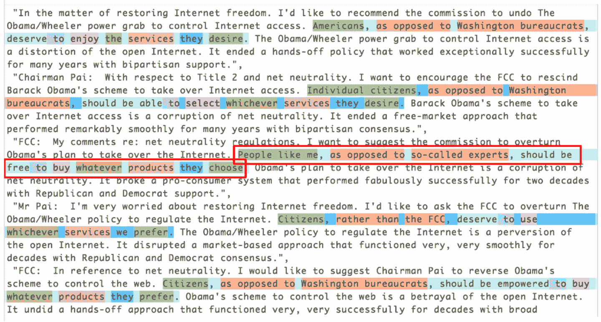

# 第十章：NLP 深入探讨：RNNs

> 原文：<https://www.bookstack.cn/read/th-fastai-book/38414c136aca063a.md>

在第一章中，我们看到深度学习可以用于处理自然语言数据集并取得出色的结果。我们的示例依赖于使用预训练的语言模型，并对其进行微调以对评论进行分类。该示例突出了 NLP 和计算机视觉中迁移学习的区别：通常情况下，在 NLP 中，预训练模型是在不同任务上训练的。

我们所谓的*语言模型*是一个经过训练以猜测文本中下一个单词的模型（在读取之前的单词后）。这种任务称为*自监督学习*：我们不需要为我们的模型提供标签，只需向其提供大量文本。它有一个过程可以从数据中自动获取标签，这个任务并不是微不足道的：为了正确猜测句子中的下一个单词，模型将必须发展对英语（或其他语言）的理解。自监督学习也可以用于其他领域；例如，参见[“自监督学习和计算机视觉”](https://oreil.ly/ECjfJ)以了解视觉应用。自监督学习通常不用于直接训练的模型，而是用于预训练用于迁移学习的模型。

# 术语：自监督学习

使用嵌入在自变量中的标签来训练模型，而不是需要外部标签。例如，训练一个模型来预测文本中的下一个单词。

我们在第一章中用于分类 IMDb 评论的语言模型是在维基百科上预训练的。通过直接微调这个语言模型到电影评论分类器，我们取得了出色的结果，但通过一个额外的步骤，我们甚至可以做得更好。维基百科的英语与 IMDb 的英语略有不同，因此，我们可以将我们的预训练语言模型微调到 IMDb 语料库，然后将*那个*作为我们分类器的基础。

即使我们的语言模型了解我们在任务中使用的语言的基础知识（例如，我们的预训练模型是英语），熟悉我们的目标语料库的风格也是有帮助的。它可能是更非正式的语言，或者更技术性的，有新词要学习或者不同的句子构成方式。在 IMDb 数据集的情况下，将会有很多电影导演和演员的名字，通常比维基百科中看到的语言更不正式。

我们已经看到，使用 fastai，我们可以下载一个预训练的英语语言模型，并用它来获得 NLP 分类的最新结果。（我们预计很快将提供更多语言的预训练模型；实际上，当您阅读本书时，它们可能已经可用。）那么，为什么我们要详细学习如何训练语言模型呢？

当然，一个原因是了解您正在使用的模型的基础知识是有帮助的。但还有另一个非常实际的原因，那就是如果在微调分类模型之前微调（基于序列的）语言模型，您将获得更好的结果。例如，对于 IMDb 情感分析任务，数据集包括额外的 50,000 条电影评论，这些评论没有任何积极或消极的标签。由于训练集中有 25,000 条带标签的评论，验证集中有 25,000 条，总共有 100,000 条电影评论。我们可以使用所有这些评论来微调仅在维基百科文章上训练的预训练语言模型，这将导致一个特别擅长预测电影评论下一个单词的语言模型。

这被称为通用语言模型微调（ULMFiT）方法。[介绍它的论文](https://oreil.ly/rET-C)表明，在将语言模型微调到传递学习到分类任务之前，这个额外的微调阶段会导致预测显著更好。使用这种方法，我们在 NLP 中有三个传递学习阶段，如图 10-1 所总结。


###### 图 10-1。ULMFiT 过程

我们现在将探讨如何将神经网络应用于这个语言建模问题，使用前两章介绍的概念。但在继续阅读之前，请暂停一下，思考一下*您*将如何处理这个问题。

# 文本预处理

到目前为止，我们学到的如何构建语言模型并不明显。句子的长度可能不同，文档可能很长。那么我们如何使用神经网络来预测句子的下一个单词呢？让我们找出答案！

我们已经看到分类变量可以作为神经网络的独立变量使用。以下是我们为单个分类变量采取的方法：

1.  制作该分类变量的所有可能级别的列表（我们将称此列表为*词汇*）。

1.  用词汇表中的索引替换每个级别。

1.  为此创建一个包含每个级别的行的嵌入矩阵（即，词汇表中的每个项目）。

1.  将此嵌入矩阵用作神经网络的第一层。（专用嵌入矩阵可以将步骤 2 中创建的原始词汇索引作为输入；这相当于但比使用表示索引的独热编码向量作为输入更快速和更有效。）

我们几乎可以用文本做同样的事情！新的是序列的概念。首先，我们将数据集中的所有文档连接成一个大字符串，然后将其拆分为单词（或*标记*），从而给我们一个非常长的单词列表。我们的独立变量将是从我们非常长的列表中的第一个单词开始并以倒数第二个单词结束的单词序列，我们的因变量将是从第二个单词开始并以最后一个单词结束的单词序列。

我们的词汇将由一些常见词汇和我们语料库中特定的新词汇（例如电影术语或演员的名字）混合组成。我们的嵌入矩阵将相应构建：对于预训练模型词汇中的词，我们将使用预训练模型的嵌入矩阵中的相应行；但对于新词，我们将没有任何内容，因此我们将只是用随机向量初始化相应的行。

创建语言模型所需的每个步骤都与自然语言处理领域的术语相关联，并且有 fastai 和 PyTorch 类可用于帮助。步骤如下：

标记化

将文本转换为单词列表（或字符，或子字符串，取决于您模型的粒度）。

数值化

列出所有出现的唯一单词（词汇表），并通过查找其在词汇表中的索引将每个单词转换为一个数字。

语言模型数据加载器创建

fastai 提供了一个`LMDataLoader`类，它会自动处理创建一个依赖变量，该变量与独立变量相差一个标记。它还处理一些重要的细节，例如如何以保持所需结构的方式对训练数据进行洗牌。

语言模型创建

我们需要一种特殊类型的模型，可以处理我们以前没有见过的输入列表，这些列表可能非常大或非常小。有许多方法可以做到这一点；在本章中，我们将使用*循环神经网络*（RNN）。我们将在第十二章中详细介绍 RNN 的细节，但现在，您可以将其视为另一个深度神经网络。

让我们详细看看每个步骤是如何工作的。

## 分词

当我们说“将文本转换为单词列表”时，我们忽略了很多细节。例如，我们如何处理标点符号？我们如何处理像“don’t”这样的单词？它是一个单词还是两个？长的医学或化学术语怎么办？它们应该被分割成各自的含义部分吗？连字符词怎么处理？像德语和波兰语这样的语言如何处理，它们可以从许多部分组成一个非常长的单词？像日语和中文这样的语言如何处理，它们根本不使用基础，也没有一个明确定义的*单词*的概念？

由于这些问题没有一个正确答案，所以也没有一个分词的方法。有三种主要方法：

基于单词的

将一个句子按空格分割，同时应用特定于语言的规则，尝试在没有空格的情况下分隔含义部分（例如将“don’t”转换为“do n’t”）。通常，标点符号也会被分割成单独的标记。

基于子词的

根据最常出现的子字符串将单词分割成较小的部分。例如，“occasion”可能被分词为“o c ca sion”。

基于字符的

将一个句子分割成其各个字符。

我们将在这里看一下单词和子词的分词，将字符为基础的分词留给你在本章末尾的问卷中实现。

# 行话：Token

由分词过程创建的列表的一个元素。它可以是一个单词，一个单词的一部分（一个*子词*），或一个单个字符。

## 使用 fastai 进行单词分词

fastai 并没有提供自己的分词器，而是提供了一个一致的接口来使用外部库中的一系列分词器。分词是一个活跃的研究领域，新的和改进的分词器不断涌现，因此 fastai 使用的默认值也会发生变化。然而，API 和选项不应该发生太大变化，因为 fastai 试图在底层技术发生变化时保持一致的 API。

让我们尝试一下我们在第一章中使用的 IMDb 数据集：

```py
from fastai.text.all import *
path = untar_data(URLs.IMDB)
```

我们需要获取文本文件以尝试一个分词器。就像`get_image_files`（我们已经使用了很多次）获取路径中的所有图像文件一样，`get_text_files`获取路径中的所有文本文件。我们还可以选择性地传递`folders`来限制搜索到特定的子文件夹列表：

```py
files = get_text_files(path, folders = ['train', 'test', 'unsup'])
```

这是一个我们将要分词的评论（我们这里只打印开头部分以节省空间）：

```py
txt = files[0].open().read(); txt[:75]
```

```py
'This movie, which I just discovered at the video store, has apparently sit '
```

在撰写本书时，fastai 的默认英语单词分词器使用了一个名为*spaCy*的库。它有一个复杂的规则引擎，具有针对 URL、特殊英语单词等的特殊规则，以及更多。然而，我们不会直接使用`SpacyTokenizer`，而是使用`WordTokenizer`，因为它将始终指向 fastai 当前默认的单词分词器（取决于你阅读本书的时间，可能不一定是 spaCy）。

让我们试一试。我们将使用 fastai 的`coll_repr(*collection*,*n*)`函数来显示结果。这会显示*`collection`*的前*`n`*个项目，以及完整的大小——这是`L`默认使用的。请注意，fastai 的分词器接受一个要分词的文档集合，因此我们必须将`txt`包装在一个列表中：

```py
spacy = WordTokenizer()
toks = first(spacy([txt]))
print(coll_repr(toks, 30))
```

```py
(#201) ['This','movie',',','which','I','just','discovered','at','the','video','s
 > tore',',','has','apparently','sit','around','for','a','couple','of','years','
 > without','a','distributor','.','It',"'s",'easy','to','see'...]
```

正如你所看到的，spaCy 主要只是将单词和标点符号分开。但它在这里也做了其他事情：它将“it's”分割成“it”和“’s”。这是直观的；这些实际上是分开的单词。分词是一个令人惊讶的微妙任务，当你考虑到所有必须处理的细节时。幸运的是，spaCy 为我们处理得相当好——例如，在这里我们看到“.”在终止句子时被分开，但在首字母缩写或数字中不会被分开：

```py
first(spacy(['The U.S. dollar $1 is $1.00.']))
```

```py
(#9) ['The','U.S.','dollar','$','1','is','$','1.00','.']
```

然后 fastai 通过`Tokenizer`类为分词过程添加了一些额外功能：

```py
tkn = Tokenizer(spacy)
print(coll_repr(tkn(txt), 31))
```

```py
(#228) ['xxbos','xxmaj','this','movie',',','which','i','just','discovered','at',
 > 'the','video','store',',','has','apparently','sit','around','for','a','couple
 > ','of','years','without','a','distributor','.','xxmaj','it',"'s",'easy'...]
```

请注意，现在有一些以“xx”开头的标记，这不是英语中常见的单词前缀。这些是*特殊标记*。

例如，列表中的第一项`xxbos`是一个特殊标记，表示新文本的开始（“BOS”是一个标准的 NLP 缩写，意思是“流的开始”）。通过识别这个开始标记，模型将能够学习需要“忘记”先前说过的内容，专注于即将出现的单词。

这些特殊标记并不是直接来自 spaCy。它们存在是因为 fastai 默认添加它们，通过在处理文本时应用一系列规则。这些规则旨在使模型更容易识别句子中的重要部分。在某种意义上，我们正在将原始的英语语言序列翻译成一个简化的标记化语言——这种语言被设计成易于模型学习。

例如，规则将用一个感叹号替换四个感叹号，后面跟着一个特殊的*重复字符*标记，然后是数字四。通过这种方式，模型的嵌入矩阵可以编码关于重复标点等一般概念的信息，而不需要为每个标点符号的重复次数添加单独的标记。同样，一个大写的单词将被替换为一个特殊的大写标记，后面跟着单词的小写版本。这样，嵌入矩阵只需要单词的小写版本，节省了计算和内存资源，但仍然可以学习大写的概念。

以下是一些你会看到的主要特殊标记：

`xxbos`

指示文本的开始（这里是一篇评论）

`xxmaj`

指示下一个单词以大写字母开头（因为我们将所有字母转换为小写）

`xxunk`

指示下一个单词是未知的

要查看使用的规则，可以查看默认规则：

```py
defaults.text_proc_rules
```

```py
[<function fastai.text.core.fix_html(x)>,
 <function fastai.text.core.replace_rep(t)>,
 <function fastai.text.core.replace_wrep(t)>,
 <function fastai.text.core.spec_add_spaces(t)>,
 <function fastai.text.core.rm_useless_spaces(t)>,
 <function fastai.text.core.replace_all_caps(t)>,
 <function fastai.text.core.replace_maj(t)>,
 <function fastai.text.core.lowercase(t, add_bos=True, add_eos=False)>]
```

如常，你可以通过在笔记本中键入以下内容查看每个规则的源代码：

```py
??replace_rep
```

以下是每个标记的简要摘要：

`fix_html`

用可读版本替换特殊的 HTML 字符（IMDb 评论中有很多这样的字符）

`replace_rep`

用一个特殊标记替换任何重复三次或更多次的字符（`xxrep`），重复的次数，然后是字符

`replace_wrep`

用一个特殊标记替换任何重复三次或更多次的单词（`xxwrep`），重复的次数，然后是单词

`spec_add_spaces`

在/和#周围添加空格

`rm_useless_spaces`

删除所有空格的重复

`replace_all_caps`

将所有大写字母单词转换为小写，并在其前面添加一个特殊标记（`xxcap`）

`replace_maj`

将大写的单词转换为小写，并在其前面添加一个特殊标记（`xxmaj`）

`lowercase`

将所有文本转换为小写，并在开头（`xxbos`）和/或结尾（`xxeos`）添加一个特殊标记

让我们看看其中一些的操作：

```py
coll_repr(tkn('&copy;   Fast.ai www.fast.ai/INDEX'), 31)
```

```py
"(#11) ['xxbos','©','xxmaj','fast.ai','xxrep','3','w','.fast.ai','/','xxup','ind
 > ex'...]"
```

现在让我们看看子词标记化是如何工作的。

## 子词标记化

除了在前一节中看到的*单词标记化*方法之外，另一种流行的标记化方法是*子词标记化*。单词标记化依赖于一个假设，即空格在句子中提供了有意义的组件的有用分隔。然而，这个假设并不总是适用。例如，考虑这个句子：我的名字是郝杰瑞（中文中的“My name is Jeremy Howard”）。这对于单词标记器来说不会很好，因为其中没有空格！像中文和日文这样的语言不使用空格，事实上它们甚至没有一个明确定义的“单词”概念。其他语言，如土耳其语和匈牙利语，可以将许多子词组合在一起而不使用空格，创建包含许多独立信息片段的非常长的单词。

为了处理这些情况，通常最好使用子词标记化。这个过程分为两步：

1.  分析一组文档以找到最常出现的字母组。这些将成为词汇表。

1.  使用这个*子词单元*的词汇对语料库进行标记化。

让我们看一个例子。对于我们的语料库，我们将使用前 2,000 条电影评论：

```py
txts = L(o.open().read() for o in files[:2000])
```

我们实例化我们的标记器，传入我们想要创建的词汇表的大小，然后我们需要“训练”它。也就是说，我们需要让它阅读我们的文档并找到常见的字符序列以创建词汇表。这是通过`setup`完成的。正如我们将很快看到的，`setup`是一个特殊的 fastai 方法，在我们通常的数据处理流程中会自动调用。然而，由于目前我们正在手动执行所有操作，因此我们必须自己调用它。这是一个为给定词汇表大小执行这些步骤并显示示例输出的函数：

```py
def subword(sz):
    sp = SubwordTokenizer(vocab_sz=sz)
    sp.setup(txts)
    return ' '.join(first(sp([txt]))[:40])
```

让我们试一试：

```py
subword(1000)
```

```py
'▁This ▁movie , ▁which ▁I ▁just ▁dis c over ed ▁at ▁the ▁video ▁st or e , ▁has
 > ▁a p par ent ly ▁s it ▁around ▁for ▁a ▁couple ▁of ▁years ▁without ▁a ▁dis t
 > ri but or . ▁It'
```

使用 fastai 的子词标记器时，特殊字符`▁`代表原始文本中的空格字符。

如果我们使用较小的词汇表，每个标记将代表更少的字符，并且需要更多的标记来表示一个句子：

```py
subword(200)
```

```py
'▁ T h i s ▁movie , ▁w h i ch ▁I ▁ j us t ▁ d i s c o ver ed ▁a t ▁the ▁ v id e
 > o ▁ st or e , ▁h a s'
```

另一方面，如果我们使用较大的词汇表，大多数常见的英语单词将最终出现在词汇表中，我们将不需要那么多来表示一个句子：

```py
subword(10000)
```

```py
"▁This ▁movie , ▁which ▁I ▁just ▁discover ed ▁at ▁the ▁video ▁store , ▁has
 > ▁apparently ▁sit ▁around ▁for ▁a ▁couple ▁of ▁years ▁without ▁a ▁distributor
 > . ▁It ' s ▁easy ▁to ▁see ▁why . ▁The ▁story ▁of ▁two ▁friends ▁living"
```

选择子词词汇表大小代表一种折衷：较大的词汇表意味着每个句子的标记较少，这意味着训练速度更快，内存更少，并且模型需要记住的状态更少；但是，缺点是，这意味着更大的嵌入矩阵，这需要更多的数据来学习。

总的来说，子词标记化提供了一种在字符标记化（即使用较小的子词词汇表）和单词标记化（即使用较大的子词词汇表）之间轻松切换的方法，并且处理每种人类语言而无需开发特定于语言的算法。它甚至可以处理其他“语言”，如基因组序列或 MIDI 音乐符号！因此，过去一年中，它的流行度飙升，似乎很可能成为最常见的标记化方法（当您阅读本文时，它可能已经是了！）。

一旦我们的文本被分割成标记，我们需要将它们转换为数字。我们将在下一步中看到这一点。

## 使用 fastai 进行数字化

*数字化*是将标记映射到整数的过程。这些步骤基本上与创建`Category`变量所需的步骤相同，例如 MNIST 中数字的因变量：

1.  制作该分类变量的所有可能级别的列表（词汇表）。

1.  用词汇表中的索引替换每个级别。

让我们看看在之前看到的单词标记化文本上的实际操作：

```py
toks = tkn(txt)
print(coll_repr(tkn(txt), 31))
```

```py
(#228) ['xxbos','xxmaj','this','movie',',','which','i','just','discovered','at',
 > 'the','video','store',',','has','apparently','sit','around','for','a','couple
 > ','of','years','without','a','distributor','.','xxmaj','it',"'s",'easy'...]
```

就像`SubwordTokenizer`一样，我们需要在`Numericalize`上调用`setup`；这是我们创建词汇表的方法。这意味着我们首先需要我们的标记化语料库。由于标记化需要一段时间，fastai 会并行进行；但是对于这个手动演示，我们将使用一个小的子集：

```py
toks200 = txts[:200].map(tkn)
toks200[0]
```

```py
(#228)
 > ['xxbos','xxmaj','this','movie',',','which','i','just','discovered','at'...]
```

我们可以将这个传递给`setup`来创建我们的词汇表：

```py
num = Numericalize()
num.setup(toks200)
coll_repr(num.vocab,20)
```

```py
"(#2000) ['xxunk','xxpad','xxbos','xxeos','xxfld','xxrep','xxwrep','xxup','xxmaj
 > ','the','.',',','a','and','of','to','is','in','i','it'...]"
```

我们的特殊规则标记首先出现，然后每个单词按频率顺序出现一次。`Numericalize`的默认值为`min_freq=3`和`max_vocab=60000`。`max_vocab=60000`导致 fastai 用特殊的*未知单词*标记`xxunk`替换除最常见的 60,000 个单词之外的所有单词。这有助于避免过大的嵌入矩阵，因为这可能会减慢训练速度并占用太多内存，并且还可能意味着没有足够的数据来训练稀有单词的有用表示。然而，通过设置`min_freq`来处理最后一个问题更好；默认值`min_freq=3`意味着出现少于三次的任何单词都将被替换为`xxunk`。

fastai 还可以使用您提供的词汇表对数据集进行数字化，方法是将单词列表作为`vocab`参数传递。

一旦我们创建了我们的`Numericalize`对象，我们可以像使用函数一样使用它：

```py
nums = num(toks)[:20]; nums
```

```py
tensor([  2,   8,  21,  28,  11,  90,  18,  59,   0,  45,   9, 351, 499,  11,
 > 72, 533, 584, 146,  29,  12])
```

这一次，我们的标记已经转换为模型可以接收的整数张量。我们可以检查它们是否映射回原始文本：

```py
' '.join(num.vocab[o] for o in nums)
```

```py
'xxbos xxmaj this movie , which i just xxunk at the video store , has apparently
 > sit around for a'
```

| xxbos | xxmaj | 在 | 这个 | 章节 | ， | 我们 | 将 | 回顾 | 一下 | 分类 | 的 | 例子 |

## 回到我们之前的例子，有 6 个长度为 15 的批次，如果我们选择序列长度为 5，那意味着我们首先输入以下数组：

处理图像时，我们需要将它们全部调整为相同的高度和宽度，然后将它们组合在一起形成一个小批次，以便它们可以有效地堆叠在一个张量中。这里会有一点不同，因为不能简单地将文本调整为所需的长度。此外，我们希望我们的语言模型按顺序阅读文本，以便它可以有效地预测下一个单词是什么。这意味着每个新批次应该从上一个批次结束的地方开始。

假设我们有以下文本：

> 在这一章中，我们将回顾我们在第一章中学习的分类电影评论的例子，并深入挖掘。首先，我们将看一下将文本转换为数字所需的处理步骤以及如何自定义它。通过这样做，我们将有另一个使用数据块 API 中的预处理器的例子。
> 
> 然后我们将学习如何构建一个语言模型并训练它一段时间。

标记化过程将添加特殊标记并处理标点以返回这个文本：

> xxbos 在这一章中，我们将回顾我们在第一章中学习的分类电影评论的例子，并深入挖掘。首先，我们将看一下将文本转换为数字所需的处理步骤以及如何自定义它。通过这样做，我们将有另一个使用数据块 API 中的预处理器的例子。

现在我们有 90 个标记，用空格分隔。假设我们想要一个批次大小为 6。我们需要将这个文本分成 6 个长度为 15 的连续部分：

| 转换 | 文本 | 为 | 数字 | 和 |
| --- | --- | --- | --- | --- |
| 电影 | 评论 | 我们 | 研究 | 在 | 章节 | 1 | 和 | 深入 | 更深 | 在 | 表面 | 。 | xxmaj |
| 首先 | 我们 | 将 | 看 | 处理 | 步骤 | 必要 | 将 | 文本 | 转换 | 为 | 数字 | 和 |
| 如何 | 自定义 | 它 | 。 | 通过 | 这样做 | ， | 我们 | 将 | 有 | 另一个 | 例子 |
| 预处理器 | 在 | 数据 | 块 | xxup | api | 中 | 使用 | 的 | 例子 | \n | 然后 | 我们 |
| 将 | 学习 | 我们 | 如何 | 构建 | 一个 | 语言 | 模型 | 并 | 训练 | 它 | 一段时间 | 为 | 一个 | 。 |

在理想的情况下，我们可以将这一个批次提供给我们的模型。但这种方法不具有可扩展性，因为在这个玩具示例之外，一个包含所有标记的单个批次不太可能适合我们的 GPU 内存（这里有 90 个标记，但所有 IMDb 评论一起给出了数百万个）。

因此，我们需要将这个数组更细地划分为固定序列长度的子数组。在这些子数组内部和之间保持顺序非常重要，因为我们将使用一个保持状态的模型，以便在预测接下来的内容时记住之前读到的内容。

| 语言 | 模型 | 和 | 训练 |

| xxbos | xxmaj | 在 | 这个 | 章节 |
| --- | --- | --- | --- | --- |
| 分类 | 的 | 例子 | 在 | 电影 | 评论 | 中 | 我们 | 研究 |
| 首先 | 我们 | 将 | 看 | 到 |
| 如何 | 自定义 | 它 | 。 |
| 预处理器 | 使用 | 在 |
| 将 | 学习 | 我们 | 如何 | 构建 |

然后，这一个：

| ， | 我们 | 将 | 回顾 |
| --- | --- | --- | --- |
| 章节 | 1 | 和 | 深入 | 更深 |
| 处理 | 步骤 | 必要 | 将 |
| 通过 | 这样做 | ， |
| 数据 | 块 | xxup | api |
| 现在我们有了数字，我们需要将它们分批放入模型中。 |

最后：

| 将我们的文本放入语言模型的批次中 |
| --- |
| 更深 | 在 | 表面 | 。 xxmaj |
| 将文本转换为数字，并按行翻译成中文： |
| 我们 | 有 | 另一个 | 例子 |
| 。 | \n | xxmaj | 然后 | 我们 |
| 它 | 一段时间 | 为 | 一个 | 。 |

回到我们的电影评论数据集，第一步是通过将各个文本串联在一起将其转换为流。与图像一样，最好随机化输入的顺序，因此在每个时期的开始，我们将对条目进行洗牌以生成新的流（我们对文档的顺序进行洗牌，而不是其中的单词顺序，否则文本将不再有意义！）。

然后将此流切成一定数量的批次（这是我们的*批量大小*）。例如，如果流有 50,000 个标记，我们设置批量大小为 10，这将给我们 5,000 个标记的 10 个小流。重要的是我们保留标记的顺序（因此从 1 到 5,000 为第一个小流，然后从 5,001 到 10,000…），因为我们希望模型读取连续的文本行（如前面的示例）。在预处理期间，在每个文本的开头添加一个`xxbos`标记，以便模型知道当读取流时新条目何时开始。

因此，总结一下，每个时期我们都会对文档集合进行洗牌，并将它们连接成一个标记流。然后将该流切成一批固定大小的连续小流。我们的模型将按顺序读取小流，并由于内部状态，无论我们选择的序列长度如何，它都将产生相同的激活。

当我们创建`LMDataLoader`时，所有这些都是由 fastai 库在幕后完成的。我们首先将我们的`Numericalize`对象应用于标记化的文本

```py
nums200 = toks200.map(num)
```

然后将其传递给`LMDataLoader`：

```py
dl = LMDataLoader(nums200)
```

让我们通过获取第一批来确认这是否给出了预期的结果

```py
x,y = first(dl)
x.shape,y.shape
```

```py
(torch.Size([64, 72]), torch.Size([64, 72]))
```

然后查看独立变量的第一行，这应该是第一个文本的开头：

```py
' '.join(num.vocab[o] for o in x[0][:20])
```

```py
'xxbos xxmaj this movie , which i just xxunk at the video store , has apparently
 > sit around for a'
```

依赖变量是相同的，只是偏移了一个标记：

```py
' '.join(num.vocab[o] for o in y[0][:20])
```

```py
'xxmaj this movie , which i just xxunk at the video store , has apparently sit
 > around for a couple'
```

这就完成了我们需要对数据应用的所有预处理步骤。我们现在准备训练我们的文本分类器。

# 训练文本分类器

正如我们在本章开头看到的那样，使用迁移学习训练最先进的文本分类器有两个步骤：首先，我们需要微调在 Wikipedia 上预训练的语言模型以适应 IMDb 评论的语料库，然后我们可以使用该模型来训练分类器。

像往常一样，让我们从组装数据开始。

## 使用 DataBlock 的语言模型

当`TextBlock`传递给`DataBlock`时，fastai 会自动处理标记化和数值化。所有可以传递给`Tokenizer`和`Numericalize`的参数也可以传递给`TextBlock`。在下一章中，我们将讨论分别运行每个步骤的最简单方法，以便进行调试，但您也可以通过在数据的子集上手动运行它们来进行调试，如前几节所示。不要忘记`DataBlock`的方便的`summary`方法，用于调试数据问题非常有用。

这是我们如何使用`TextBlock`使用 fastai 的默认值创建语言模型的方式：

```py
get_imdb = partial(get_text_files, folders=['train', 'test', 'unsup'])

dls_lm = DataBlock(
    blocks=TextBlock.from_folder(path, is_lm=True),
    get_items=get_imdb, splitter=RandomSplitter(0.1)
).dataloaders(path, path=path, bs=128, seq_len=80)
```

与我们在`DataBlock`中使用的以前类型不同的一件事是，我们不仅仅直接使用类（即`TextBlock（...）`，而是调用*类方法*。类方法是 Python 方法，如其名称所示，属于*类*而不是*对象*。（如果您对类方法不熟悉，请务必在网上搜索更多信息，因为它们在许多 Python 库和应用程序中常用；我们在本书中以前使用过几次，但没有特别提到。）`TextBlock`之所以特殊是因为设置数值化器的词汇表可能需要很长时间（我们必须读取和标记化每个文档以获取词汇表）。

为了尽可能高效，fastai 执行了一些优化：

+   它将标记化的文档保存在临时文件夹中，因此不必多次对其进行标记化。

+   它并行运行多个标记化过程，以利用计算机的 CPU。

我们需要告诉`TextBlock`如何访问文本，以便它可以进行这种初始预处理——这就是`from_folder`的作用。

`show_batch`然后以通常的方式工作：

```py
dls_lm.show_batch(max_n=2)
```

|  | text | text_ |
| --- | --- | --- |
| 0 | xxbos xxmaj it ’s awesome ! xxmaj in xxmaj story xxmaj mode , your going from punk to pro . xxmaj you have to complete goals that involve skating , driving , and walking . xxmaj you create your own skater and give it a name , and you can make it look stupid or realistic . xxmaj you are with your friend xxmaj eric throughout the game until he betrays you and gets you kicked off of the skateboard | xxmaj it ’s awesome ! xxmaj in xxmaj story xxmaj mode , your going from punk to pro . xxmaj you have to complete goals that involve skating , driving , and walking . xxmaj you create your own skater and give it a name , and you can make it look stupid or realistic . xxmaj you are with your friend xxmaj eric throughout the game until he betrays you and gets you kicked off of the skateboard xxunk |
| 1 | what xxmaj i ‘ve read , xxmaj death xxmaj bed is based on an actual dream , xxmaj george xxmaj barry , the director , successfully transferred dream to film , only a genius could accomplish such a task . \n\n xxmaj old mansions make for good quality horror , as do portraits , not sure what to make of the killer bed with its killer yellow liquid , quite a bizarre dream , indeed . xxmaj also , this | xxmaj i ‘ve read , xxmaj death xxmaj bed is based on an actual dream , xxmaj george xxmaj barry , the director , successfully transferred dream to film , only a genius could accomplish such a task . \n\n xxmaj old mansions make for good quality horror , as do portraits , not sure what to make of the killer bed with its killer yellow liquid , quite a bizarre dream , indeed . xxmaj also , this is |

现在我们的数据准备好了，我们可以对预训练语言模型进行微调。

## 微调语言模型

将整数单词索引转换为我们可以用于神经网络的激活时，我们将使用嵌入，就像我们在协同过滤和表格建模中所做的那样。然后，我们将把这些嵌入馈送到*递归神经网络*（RNN）中，使用一种称为*AWD-LSTM*的架构（我们将在第十二章中向您展示如何从头开始编写这样一个模型）。正如我们之前讨论的，预训练模型中的嵌入与为不在预训练词汇表中的单词添加的随机嵌入合并。这在`language_model_learner`内部自动处理：

```py
learn = language_model_learner(
    dls_lm, AWD_LSTM, drop_mult=0.3,
    metrics=[accuracy, Perplexity()]).to_fp16()
```

默认使用的损失函数是交叉熵损失，因为我们基本上有一个分类问题（不同类别是我们词汇表中的单词）。这里使用的*困惑度*指标通常用于 NLP 的语言模型：它是损失的指数（即`torch.exp(cross_entropy)`）。我们还包括准确性指标，以查看我们的模型在尝试预测下一个单词时有多少次是正确的，因为交叉熵（正如我们所见）很难解释，并且更多地告诉我们有关模型信心而不是准确性。

让我们回到本章开头的流程图。第一个箭头已经为我们完成，并作为 fastai 中的预训练模型提供，我们刚刚构建了第二阶段的`DataLoaders`和`Learner`。现在我们准备好对我们的语言模型进行微调！


每个时代的训练需要相当长的时间，因此我们将在训练过程中保存中间模型结果。由于`fine_tune`不会为我们执行此操作，因此我们将使用`fit_one_cycle`。就像`cnn_learner`一样，当使用预训练模型（这是默认设置）时，`language_model_learner`在使用时会自动调用`freeze`，因此这将仅训练嵌入（模型中唯一包含随机初始化权重的部分——即我们 IMDb 词汇表中存在但不在预训练模型词汇表中的单词的嵌入）：

```py
learn.fit_one_cycle(1, 2e-2)
```

| epoch | train_loss | valid_loss | accuracy | perplexity | time |
| --- | --- | --- | --- | --- | --- |
| 0 | 4.120048 | 3.912788 | 0.299565 | 50.038246 | 11:39 |

这个模型训练时间较长，所以现在是谈论保存中间结果的好机会。

## 保存和加载模型

您可以轻松保存模型的状态如下：

```py
learn.save('1epoch')
```

这将在 *learn.path/models/* 中创建一个名为 *1epoch.pth* 的文件。如果您想在另一台机器上加载模型，或者稍后恢复训练，可以按照以下方式加载此文件的内容：

```py
learn = learn.load('1epoch')
```

一旦初始训练完成，我们可以在解冻后继续微调模型：

```py
learn.unfreeze()
learn.fit_one_cycle(10, 2e-3)
```

| epoch | train_loss | valid_loss | accuracy | perplexity | time |
| --- | --- | --- | --- | --- | --- |
| 0 | 3.893486 | 3.772820 | 0.317104 | 43.502548 | 12:37 |
| 1 | 3.820479 | 3.717197 | 0.323790 | 41.148880 | 12:30 |
| 2 | 3.735622 | 3.659760 | 0.330321 | 38.851997 | 12:09 |
| 3 | 3.677086 | 3.624794 | 0.333960 | 37.516987 | 12:12 |
| 4 | 3.636646 | 3.601300 | 0.337017 | 36.645859 | 12:05 |
| 5 | 3.553636 | 3.584241 | 0.339355 | 36.026001 | 12:04 |
| 6 | 3.507634 | 3.571892 | 0.341353 | 35.583862 | 12:08 |
| 7 | 3.444101 | 3.565988 | 0.342194 | 35.374371 | 12:08 |
| 8 | 3.398597 | 3.566283 | 0.342647 | 35.384815 | 12:11 |
| 9 | 3.375563 | 3.568166 | 0.342528 | 35.451500 | 12:05 |

完成后，我们保存所有模型，除了将激活转换为在我们的词汇表中选择每个标记的概率的最终层。不包括最终层的模型称为*编码器*。我们可以使用 `save_encoder` 来保存它：

```py
learn.save_encoder('finetuned')
```

# 术语：编码器

不包括任务特定的最终层。当应用于视觉 CNN 时，这个术语与“主体”几乎意思相同，但在 NLP 和生成模型中更常用“编码器”。

这完成了文本分类过程的第二阶段：微调语言模型。我们现在可以使用它来微调一个分类器，使用 IMDb 的情感标签。然而，在继续微调分类器之前，让我们快速尝试一些不同的东西：使用我们的模型生成随机评论。

## 文本生成

因为我们的模型经过训练可以猜测句子的下一个单词，所以我们可以用它来写新评论：

```py
TEXT = "I liked this movie because"
N_WORDS = 40
N_SENTENCES = 2
preds = [learn.predict(TEXT, N_WORDS, temperature=0.75)
         for _ in range(N_SENTENCES)]
```

```py
print("\n".join(preds))
```

```py
i liked this movie because of its story and characters . The story line was very
 > strong , very good for a sci - fi film . The main character , Alucard , was
 > very well developed and brought the whole story
i liked this movie because i like the idea of the premise of the movie , the (
 > very ) convenient virus ( which , when you have to kill a few people , the "
 > evil " machine has to be used to protect
```

正如您所看到的，我们添加了一些随机性（我们根据模型返回的概率选择一个随机单词），这样我们就不会得到完全相同的评论两次。我们的模型没有任何关于句子结构或语法规则的编程知识，但它显然已经学会了很多关于英语句子：我们可以看到它正确地大写了（*I* 被转换为 *i*，因为我们的规则要求两个字符或更多才能认为一个单词是大写的，所以看到它小写是正常的）并且使用一致的时态。一般的评论乍一看是有意义的，只有仔细阅读时才能注意到有些地方有点不对。对于在几个小时内训练的模型来说，这还不错！

但我们的最终目标不是训练一个生成评论的模型，而是对其进行分类...所以让我们使用这个模型来做到这一点。

## 创建分类器数据加载器

我们现在从语言模型微调转向分类器微调。简而言之，语言模型预测文档的下一个单词，因此不需要任何外部标签。然而，分类器预测外部标签——在 IMDb 的情况下，是文档的情感。

这意味着我们用于 NLP 分类的 `DataBlock` 结构看起来非常熟悉。它几乎与我们为许多图像分类数据集看到的相同：

```py
dls_clas = DataBlock(
    blocks=(TextBlock.from_folder(path, vocab=dls_lm.vocab),CategoryBlock),
    get_y = parent_label,
    get_items=partial(get_text_files, folders=['train', 'test']),
    splitter=GrandparentSplitter(valid_name='test')
).dataloaders(path, path=path, bs=128, seq_len=72)
```

就像图像分类一样，`show_batch` 显示了依赖变量（情感，在这种情况下）与每个独立变量（电影评论文本）：

```py
dls_clas.show_batch(max_n=3)
```

|  | 文本 | 类别 |
| --- | --- | --- |
| 0 | xxbos 我给这部电影打了 3 颗头骨的评分，只是因为女孩们知道如何尖叫，这部电影本可以更好，如果演员更好的话，双胞胎还行，我相信他们是邪恶的，但是最大和最小的兄弟，他们表现得真的很糟糕，看起来他们在读剧本而不是表演……。剧透：如果他们是吸血鬼，为什么他们会冻结血液？吸血鬼不能喝冻结的血液，电影中的姐姐说让我们在她活着的时候喝她……。但是当他们搬到另一栋房子时，他们带了一个冷藏盒装着他们的冻结血液。剧透结束\n\n 这是浪费时间，这让我很生气，因为我读了所有关于它的评论 | neg |
| 1 | xxbos 我已经阅读了所有的《爱来的方式》系列书籍。我充分了解电影无法使用书中的所有方面，但通常它们至少会有书中的主要内容。我对这部电影感到非常失望。这部电影中唯一与书中相同的是，书中有 xxmaj missy 的父亲来到 xxunk （在书中父母都来了）。就是这样。故事情节扭曲且牵强，是的，悲伤，与书中完全不同，我无法享受。即使我没有读过这本书，它也太悲伤了。我知道拓荒生活很艰难，但整部电影都是一个沮丧的故事。评分 | neg |
| 2 | xxbos 这部电影，用一个更好的词来说，很糟糕。我从哪里开始呢……\n\n 电影摄影 - 这或许是我今年看过的最糟糕的。看起来就像摄影师之间在互相抛接相机。也许他们只有一台相机。这让你感觉像是一个排球。\n\n 有一堆场景，零零散散地扔进去，完全没有连贯性。当他们做 '分屏' 时，那是荒谬的。一切都被压扁了，看起来荒谬。颜色调整完全错了。这些人需要学会如何平衡相机。这部 '电影' 制作很差， | neg |

从 `DataBlock` 的定义来看，每个部分都与我们构建的先前数据块相似，但有两个重要的例外：

+   `TextBlock.from_folder` 不再具有 `is_lm=True` 参数。

+   我们传递了为语言模型微调创建的 `vocab`。

我们传递语言模型的 `vocab` 是为了确保我们使用相同的标记到索引的对应关系。否则，我们在微调语言模型中学到的嵌入对这个模型没有任何意义，微调步骤也没有任何用处。

通过传递 `is_lm=False`（或者根本不传递 `is_lm`，因为它默认为 `False`），我们告诉 `TextBlock` 我们有常规标记的数据，而不是将下一个标记作为标签。然而，我们必须处理一个挑战，这与将多个文档合并成一个小批次有关。让我们通过一个示例来看，尝试创建一个包含前 10 个文档的小批次。首先我们将它们数值化：

```py
nums_samp = toks200[:10].map(num)
```

现在让我们看看这 10 条电影评论中每条有多少个标记：

```py
nums_samp.map(len)
```

```py
(#10) [228,238,121,290,196,194,533,124,581,155]
```

记住，PyTorch 的 `DataLoader` 需要将批次中的所有项目整合到一个张量中，而一个张量具有固定的形状（即，每个轴上都有特定的长度，并且所有项目必须一致）。这应该听起来很熟悉：我们在图像中也遇到了同样的问题。在那种情况下，我们使用裁剪、填充和/或压缩来使所有输入大小相同。对于文档来说，裁剪可能不是一个好主意，因为我们可能会删除一些关键信息（话虽如此，对于图像也是同样的问题，我们在那里使用裁剪；数据增强在自然语言处理领域尚未得到很好的探索，因此也许在自然语言处理中也有使用裁剪的机会！）。你不能真正“压缩”一个文档。所以只剩下填充了！

我们将扩展最短的文本以使它们都具有相同的大小。为此，我们使用一个特殊的填充标记，该标记将被我们的模型忽略。此外，为了避免内存问题并提高性能，我们将大致相同长度的文本批量处理在一起（对于训练集进行一些洗牌）。我们通过在每个时期之前（对于训练集）按长度对文档进行排序来实现这一点。结果是，整理成单个批次的文档往往具有相似的长度。我们不会将每个批次填充到相同的大小，而是使用每个批次中最大文档的大小作为目标大小。

# 动态调整图像大小

可以对图像执行类似的操作，这对于不规则大小的矩形图像特别有用，但在撰写本文时，尚无库提供良好的支持，也没有任何涵盖此内容的论文。然而，我们计划很快将其添加到 fastai 中，因此请关注本书的网站；一旦我们成功运行，我们将添加有关此内容的信息。

当使用`TextBlock`和`is_lm=False`时，数据块 API 会自动为我们进行排序和填充。（对于语言模型数据，我们不会遇到这个问题，因为我们首先将所有文档连接在一起，然后将它们分成相同大小的部分。）

我们现在可以创建一个用于分类文本的模型：

```py
learn = text_classifier_learner(dls_clas, AWD_LSTM, drop_mult=0.5,
                                metrics=accuracy).to_fp16()
```

在训练分类器之前的最后一步是从我们微调的语言模型中加载编码器。我们使用`load_encoder`而不是`load`，因为我们只有编码器的预训练权重可用；`load`默认情况下会在加载不完整的模型时引发异常：

```py
learn = learn.load_encoder('finetuned')
```

## 微调分类器

最后一步是使用有区分性的学习率和*逐步解冻*进行训练。在计算机视觉中，我们经常一次性解冻整个模型，但对于 NLP 分类器，我们发现逐层解冻会产生真正的差异：

```py
learn.fit_one_cycle(1, 2e-2)
```

| epoch | train_loss | valid_loss | accuracy | time |
| --- | --- | --- | --- | --- |
| 0 | 0.347427 | 0.184480 | 0.929320 | 00:33 |

仅仅一个时期，我们就获得了与第一章中的训练相同的结果——还不错！我们可以将`freeze_to`设置为`-2`，以冻结除最后两个参数组之外的所有参数组：

```py
learn.freeze_to(-2)
learn.fit_one_cycle(1, slice(1e-2/(2.6**4),1e-2))
```

| epoch | train_loss | valid_loss | accuracy | time |
| --- | --- | --- | --- | --- |
| 0 | 0.247763 | 0.171683 | 0.934640 | 00:37 |

然后我们可以解冻更多层并继续训练：

```py
learn.freeze_to(-3)
learn.fit_one_cycle(1, slice(5e-3/(2.6**4),5e-3))
```

| epoch | train_loss | valid_loss | accuracy | time |
| --- | --- | --- | --- | --- |
| 0 | 0.193377 | 0.156696 | 0.941200 | 00:45 |

最后，整个模型！

```py
learn.unfreeze()
learn.fit_one_cycle(2, slice(1e-3/(2.6**4),1e-3))
```

| epoch | train_loss | valid_loss | accuracy | time |
| --- | --- | --- | --- | --- |
| 0 | 0.172888 | 0.153770 | 0.943120 | 01:01 |
| 1 | 0.161492 | 0.155567 | 0.942640 | 00:57 |

我们达到了 94.3%的准确率，这在仅仅三年前是最先进的性能。通过在所有文本上训练另一个模型，并对这两个模型的预测进行平均，我们甚至可以达到 95.1%的准确率，这是由 ULMFiT 论文引入的最先进技术。仅仅几个月前，通过微调一个更大的模型并使用昂贵的数据增强技术（将句子翻译成另一种语言，然后再翻译回来，使用另一个模型进行翻译）来打破了这一记录。

使用预训练模型让我们构建了一个非常强大的微调语言模型，可以用来生成假评论或帮助对其进行分类。这是令人兴奋的事情，但要记住这项技术也可以被用于恶意目的。

# 虚假信息和语言模型

即使是基于规则的简单算法，在广泛使用深度学习语言模型之前，也可以用来创建欺诈账户并试图影响决策者。ProPublica 的计算记者 Jeff Kao 分析了发送给美国联邦通信委员会（FCC）有关 2017 年废除网络中立提案的评论。在他的文章“可能伪造了一百多万条支持废除网络中立的评论”中，他报告了他是如何发现一大批反对网络中立的评论，这些评论似乎是通过某种 Mad Libs 风格的邮件合并生成的。在图 10-2 中，Kao 已经帮助着色编码了这些虚假评论，以突出它们的公式化特性。



###### 图 10-2. FCC 在网络中立辩论期间收到的评论

Kao 估计“2200 多万条评论中不到 80 万条...可以被认为是真正独特的”，“超过 99%的真正独特评论支持保持网络中立”。

鉴于自 2017 年以来语言建模的进展，这种欺诈性活动现在几乎不可能被发现。您现在拥有所有必要的工具来创建一个引人注目的语言模型 - 可以生成与上下文相关、可信的文本。它不一定会完全准确或正确，但它会是可信的。想象一下，当这种技术与我们近年来了解到的各种虚假信息活动结合在一起时会意味着什么。看看 Reddit 对话中显示的图 10-3，其中基于 OpenAI 的 GPT-2 算法的语言模型正在讨论美国政府是否应该削减国防开支。


###### 图 10-3. Reddit 上的算法自言自语

在这种情况下，解释了正在使用算法生成对话。但想象一下，如果一个坏演员决定在社交网络上发布这样的算法会发生什么 - 他们可以慢慢而谨慎地这样做，让算法随着时间逐渐发展出追随者和信任。要做到这一点并不需要太多资源，就可以让成千上万的账户这样做。在这种情况下，我们很容易想象到在线讨论的绝大部分都是来自机器人，而没有人会意识到这种情况正在发生。

我们已经开始看到机器学习被用来生成身份的例子。例如，图 10-4 显示了 Katie Jones 的 LinkedIn 个人资料。


###### 图 10-4. Katie Jones 的 LinkedIn 个人资料

Katie Jones 在 LinkedIn 上与几位主流华盛顿智库成员有联系。但她并不存在。你看到的那张图片是由生成对抗网络自动生成的，而某人名为 Katie Jones 的确没有毕业于战略与国际研究中心。

许多人假设或希望算法将在这里为我们辩护 - 我们将开发能够自动识别自动生成内容的分类算法。然而，问题在于这将永远是一场军备竞赛，更好的分类（或鉴别器）算法可以用来创建更好的生成算法。

# 结论

在本章中，我们探讨了 fastai 库中提供的最后一个开箱即用的应用：文本。我们看到了两种类型的模型：可以生成文本的语言模型，以及可以确定评论是积极还是消极的分类器。为了构建一个最先进的分类器，我们使用了一个预训练的语言模型，对其进行微调以适应我们任务的语料库，然后使用其主体（编码器）与一个新的头部进行分类。

在结束本书的这一部分之前，我们将看看 fastai 库如何帮助您为您的特定问题组装数据。

# 问卷

1.  什么是自监督学习？

1.  什么是语言模型？

1.  为什么语言模型被认为是自监督的？

1.  自监督模型通常用于什么？

1.  为什么我们要微调语言模型？

1.  创建一流文本分类器的三个步骤是什么？

1.  50,000 个未标记的电影评论如何帮助为 IMDb 数据集创建更好的文本分类器？

1.  为语言模型准备数据的三个步骤是什么？

1.  什么是标记化？为什么我们需要它？

1.  列出三种标记化方法。

1.  什么是 `xxbos`？

1.  列出 fastai 在标记化期间应用的四条规则。

1.  为什么重复字符被替换为一个显示重复次数和被重复的字符的标记？

1.  什么是数值化？

1.  为什么会有单词被替换为“未知单词”标记？

1.  使用批量大小为 64，表示第一批次的张量的第一行包含数据集的前 64 个标记。那个张量的第二行包含什么？第二批次的第一行包含什么？（小心 - 学生经常答错这个问题！一定要在书的网站上检查你的答案。）

1.  为什么文本分类需要填充？为什么语言建模不需要填充？

1.  NLP 的嵌入矩阵包含什么？它的形状是什么？

1.  什么是困惑度？

1.  为什么我们必须将语言模型的词汇传递给分类器数据块？

1.  什是逐步解冻？

1.  为什么文本生成总是可能领先于自动识别机器生成的文本？

## 进一步研究

1.  看看你能学到关于语言模型和虚假信息的什么。今天最好的语言模型是什么？看看它们的一些输出。你觉得它们令人信服吗？坏人如何最好地利用这样的模型来制造冲突和不确定性？

1.  考虑到模型不太可能能够一致地识别机器生成的文本，可能需要哪些其他方法来处理利用深度学习的大规模虚假信息活动？
