# 第十三章：卷积神经网络

> 原文：[`www.bookstack.cn/read/th-fastai-book/44d8848dfac0c1b0.md`](https://www.bookstack.cn/read/th-fastai-book/44d8848dfac0c1b0.md)
>
> 译者：[飞龙](https://github.com/wizardforcel)
>
> 协议：[CC BY-NC-SA 4.0](http://creativecommons.org/licenses/by-nc-sa/4.0/)


在第四章中，我们学习了如何创建一个识别图像的神经网络。我们能够在区分 3 和 7 方面达到 98%以上的准确率，但我们也看到 fastai 内置的类能够接近 100%。让我们开始尝试缩小这个差距。

在本章中，我们将首先深入研究卷积是什么，并从头开始构建一个 CNN。然后，我们将研究一系列技术来改善训练稳定性，并学习库通常为我们应用的所有调整，以获得出色的结果。

# 卷积的魔力

机器学习从业者手中最强大的工具之一是*特征工程*。*特征*是数据的一种转换，旨在使其更容易建模。例如，我们在第九章中用于我们表格数据集预处理的`add_datepart`函数向 Bulldozers 数据集添加了日期特征。我们能够从图像中创建哪些特征呢？

# 术语：特征工程

创建输入数据的新转换，以使其更容易建模。

在图像的背景下，特征是一种视觉上独特的属性。例如，数字 7 的特征是在数字的顶部附近有一个水平边缘，以及在其下方有一个从右上到左下的对角边缘。另一方面，数字 3 的特征是在数字的左上角和右下角有一个方向的对角边缘，在左下角和右上角有相反的对角边缘，在中间、顶部和底部有水平边缘等等。那么，如果我们能够提取关于每个图像中边缘出现位置的信息，然后将该信息用作我们的特征，而不是原始像素呢？

事实证明，在图像中找到边缘是计算机视觉中非常常见的任务，而且非常简单。为了做到这一点，我们使用一种称为*卷积*的东西。卷积只需要乘法和加法——这两种操作是我们将在本书中看到的每个深度学习模型中绝大部分工作的原因！

卷积将一个*卷积核*应用于图像。卷积核是一个小矩阵，例如图 13-1 右上角的 3×3 矩阵。

应用卷积到一个位置

###### 图 13-1。将卷积应用到一个位置

左侧的 7×7 网格是我们将应用卷积核的*图像*。卷积操作将卷积核的每个元素与图像的一个 3×3 块的每个元素相乘。然后将这些乘积的结果相加。图 13-1 中的图示显示了将卷积核应用于图像中单个位置的示例，即围绕 18 单元格的 3×3 块。

让我们用代码来做这个。首先，我们创建一个小的 3×3 矩阵如下：

```py
top_edge = tensor([[-1,-1,-1],
                   [ 0, 0, 0],
                   [ 1, 1, 1]]).float()
```

我们将称之为卷积核（因为这是时髦的计算机视觉研究人员称呼的）。当然，我们还需要一张图片：

```py
path = untar_data(URLs.MNIST_SAMPLE)
```

```py
im3 = Image.open(path/'train'/'3'/'12.png')
show_image(im3);
```


现在我们将取图像的顶部 3×3 像素正方形，并将这些值中的每一个与我们的卷积核中的每个项目相乘。然后我们将它们加在一起，就像这样：

```py
im3_t = tensor(im3)
im3_t[0:3,0:3] * top_edge
```

```py
tensor([[-0., -0., -0.],
        [0., 0., 0.],
        [0., 0., 0.]])
```

```py
(im3_t[0:3,0:3] * top_edge).sum()
```

```py
tensor(0.)
```

到目前为止并不是很有趣——左上角的所有像素都是白色的。但让我们选择一些更有趣的地方：

```py
df = pd.DataFrame(im3_t[:10,:20])
df.style.set_properties(**{'font-size':'6pt'}).background_gradient('Greys')
```


在 5,7 单元格处有一个顶边。让我们在那里重复我们的计算：

```py
(im3_t[4:7,6:9] * top_edge).sum()
```

```py
tensor(762.)
```

在 8,18 单元格处有一个右边缘。这给我们带来了什么？

```py
(im3_t[7:10,17:20] * top_edge).sum()
```

```py
tensor(-29.)
```

正如您所看到的，这个小计算返回了一个高数字，其中 3×3 像素的正方形代表顶边（即，在正方形顶部有低值，紧接着是高值）。这是因为我们的卷积核中的`-1`值在这种情况下影响很小，但`1`值影响很大。

让我们稍微看一下数学。过滤器将在我们的图像中取任意大小为 3×3 的窗口，如果我们像这样命名像素值

<math alttext="StartLayout 1st Row 1st Column a Baseline 1 2nd Column a Baseline 2 3rd Column a Baseline 3 2nd Row 1st Column a Baseline 4 2nd Column a Baseline 5 3rd Column a Baseline 6 3rd Row 1st Column a Baseline 7 2nd Column a Baseline 8 3rd Column a Baseline 9 EndLayout" display="block"><mtable><mtr><mtd><mrow><mi>a</mi> <mn>1</mn></mrow></mtd> <mtd><mrow><mi>a</mi> <mn>2</mn></mrow></mtd> <mtd><mrow><mi>a</mi> <mn>3</mn></mrow></mtd></mtr> <mtr><mtd><mrow><mi>a</mi> <mn>4</mn></mrow></mtd> <mtd><mrow><mi>a</mi> <mn>5</mn></mrow></mtd> <mtd><mrow><mi>a</mi> <mn>6</mn></mrow></mtd></mtr> <mtr><mtd><mrow><mi>a</mi> <mn>7</mn></mrow></mtd> <mtd><mrow><mi>a</mi> <mn>8</mn></mrow></mtd> <mtd><mrow><mi>a</mi> <mn>9</mn></mrow></mtd></mtr></mtable></math>

它将返回<math alttext="a Baseline 1 加 a Baseline 2 加 a Baseline 3 减 a Baseline 7 减 a Baseline 8 减 a Baseline 9"><mrow><mi>a</mi> <mn>1</mn> <mo>+</mo> <mi>a</mi> <mn>2</mn> <mo>+</mo> <mi>a</mi> <mn>3</mn> <mo>-</mo> <mi>a</mi> <mn>7</mn> <mo>-</mo> <mi>a</mi> <mn>8</mn> <mo>-</mo> <mi>a</mi> <mn>9</mn></mrow></math>。如果我们在图像的某个部分，其中<math alttext="a Baseline 1"><mrow><mi>a</mi> <mn>1</mn></mrow></math>，<math alttext="a Baseline 2"><mrow><mi>a</mi> <mn>2</mn></mrow></math>和<math alttext="a Baseline 3"><mrow><mi>a</mi> <mn>3</mn></mrow></math>加起来等于<math alttext="a Baseline 7"><mrow><mi>a</mi> <mn>7</mn></mrow></math>，<math alttext="a Baseline 8"><mrow><mi>a</mi> <mn>8</mn></mrow></math>和<math alttext="a Baseline 9"><mrow><mi>a</mi> <mn>9</mn></mrow></math>，那么这些项将互相抵消，我们将得到 0。然而，如果<math alttext="a Baseline 1"><mrow><mi>a</mi> <mn>1</mn></mrow></math>大于<math alttext="a Baseline 7"><mrow><mi>a</mi> <mn>7</mn></mrow></math>，<math alttext="a Baseline 2"><mrow><mi>a</mi> <mn>2</mn></mrow></math>大于<math alttext="a Baseline 8"><mrow><mi>a</mi> <mn>8</mn></mrow></math>，<math alttext="a Baseline 3"><mrow><mi>a</mi> <mn>3</mn></mrow></math>大于<math alttext="a Baseline 9"><mrow><mi>a</mi> <mn>9</mn></mrow></math>，我们将得到一个更大的数字作为结果。因此，这个过滤器检测水平边缘，更准确地说，我们从图像顶部的亮部到底部的暗部。

将我们的过滤器更改为顶部为`1`，底部为`-1`的行将检测从暗到亮的水平边缘。将`1`和`-1`放在列而不是行中会给我们检测垂直边缘的过滤器。每组权重将产生不同类型的结果。

让我们创建一个函数来为一个位置执行此操作，并检查它是否与之前的结果匹配：

```py
def apply_kernel(row, col, kernel):
    return (im3_t[row-1:row+2,col-1:col+2] * kernel).sum()
```

```py
apply_kernel(5,7,top_edge)
```

```py
tensor(762.)
```

但请注意，我们不能将其应用于角落（例如，位置 0,0），因为那里没有完整的 3×3 正方形。

## 映射卷积核

我们可以在坐标网格上映射`apply_kernel()`。也就是说，我们将取我们的 3×3 卷积核，并将其应用于图像的每个 3×3 部分。例如，图 13-2 显示了 3×3 卷积核可以应用于 5×5 图像第一行的位置。


###### 图 13-2\. 在网格上应用卷积核

要获得坐标网格，我们可以使用*嵌套列表推导*，如下所示：

```py
[[(i,j) for j in range(1,5)] for i in range(1,5)]
```

```py
[[(1, 1), (1, 2), (1, 3), (1, 4)],
 [(2, 1), (2, 2), (2, 3), (2, 4)],
 [(3, 1), (3, 2), (3, 3), (3, 4)],
 [(4, 1), (4, 2), (4, 3), (4, 4)]]
```

# 嵌套列表推导

在 Python 中经常使用嵌套列表推导，所以如果你以前没有见过它们，请花几分钟确保你理解这里发生了什么，并尝试编写自己的嵌套列表推导。

这是将我们的卷积核应用于坐标网格的结果：

```py
rng = range(1,27)
top_edge3 = tensor([[apply_kernel(i,j,top_edge) for j in rng] for i in rng])

show_image(top_edge3);
```


看起来不错！我们的顶部边缘是黑色的，底部边缘是白色的（因为它们是顶部边缘的*相反*）。现在我们的图像中也包含负数，`matplotlib`已自动更改了我们的颜色，使得白色是图像中最小的数字，黑色是最高的，零显示为灰色。

我们也可以尝试同样的方法来处理左边缘：

```py
left_edge = tensor([[-1,1,0],
                    [-1,1,0],
                    [-1,1,0]]).float()

left_edge3 = tensor([[apply_kernel(i,j,left_edge) for j in rng] for i in rng])

show_image(left_edge3);
```


正如我们之前提到的，卷积是将这样的内核应用于网格的操作。Vincent Dumoulin 和 Francesco Visin 的论文[“深度学习卷积算术指南”](https://oreil.ly/les1R)中有许多出色的图表，展示了如何应用图像内核。图 13-3 是论文中的一个示例，显示了（底部）一个浅蓝色的 4×4 图像，应用了一个深蓝色的 3×3 内核，创建了一个顶部的 2×2 绿色输出激活图。


###### 图 13-3。将 3×3 内核应用于 4×4 图像的结果（由 Vincent Dumoulin 和 Francesco Visin 提供）

看一下结果的形状。如果原始图像的高度为`h`，宽度为`w`，我们可以找到多少个 3×3 窗口？正如您从示例中看到的，有`h-2`乘以`w-2`个窗口，因此我们得到的结果图像的高度为`h-2`，宽度为`w-2`。

我们不会从头开始实现这个卷积函数，而是使用 PyTorch 的实现（它比我们在 Python 中能做的任何事情都要快）。

## PyTorch 中的卷积

卷积是一个如此重要且广泛使用的操作，PyTorch 已经内置了它。它被称为`F.conv2d`（回想一下，`F`是从`torch.nn.functional`中导入的 fastai，正如 PyTorch 建议的）。PyTorch 文档告诉我们它包括这些参数：

`input`

形状为`(minibatch, in_channels, iH, iW)`的输入张量

`weight`

形状为`(out_channels, in_channels, kH, kW)`的滤波器

这里`iH，iW`是图像的高度和宽度（即`28,28`），`kH，kW`是我们内核的高度和宽度（`3,3`）。但显然 PyTorch 期望这两个参数都是秩为 4 的张量，而当前我们只有秩为 2 的张量（即矩阵，或具有两个轴的数组）。

这些额外轴的原因是 PyTorch 有一些技巧。第一个技巧是 PyTorch 可以同时将卷积应用于多个图像。这意味着我们可以一次在批次中的每个项目上调用它！

第二个技巧是 PyTorch 可以同时应用多个内核。因此，让我们也创建对角边缘内核，然后将我们的四个边缘内核堆叠成一个单个张量：

```py
diag1_edge = tensor([[ 0,-1, 1],
                     [-1, 1, 0],
                     [ 1, 0, 0]]).float()
diag2_edge = tensor([[ 1,-1, 0],
                     [ 0, 1,-1],
                     [ 0, 0, 1]]).float()

edge_kernels = torch.stack([left_edge, top_edge, diag1_edge, diag2_edge])
edge_kernels.shape
```

```py
torch.Size([4, 3, 3])
```

为了测试这个，我们需要一个`DataLoader`和一个样本小批量。让我们使用数据块 API：

```py
mnist = DataBlock((ImageBlock(cls=PILImageBW), CategoryBlock),
                  get_items=get_image_files,
                  splitter=GrandparentSplitter(),
                  get_y=parent_label)

dls = mnist.dataloaders(path)
xb,yb = first(dls.valid)
xb.shape
```

```py
torch.Size([64, 1, 28, 28])
```

默认情况下，fastai 在使用数据块时会将数据放在 GPU 上。让我们将其移动到 CPU 用于我们的示例：

```py
xb,yb = to_cpu(xb),to_cpu(yb)
```

一个批次包含 64 张图片，每张图片有 1 个通道，每个通道有 28×28 个像素。`F.conv2d`也可以处理多通道（彩色）图像。*通道*是图像中的单个基本颜色——对于常规全彩图像，有三个通道，红色、绿色和蓝色。PyTorch 将图像表示为一个秩为 3 的张量，具有以下维度：

```py
[*channels*, *rows*, *columns*]
```

我们将在本章后面看到如何处理多个通道。传递给`F.conv2d`的内核需要是秩为 4 的张量：

```py
[*channels_in*, *features_out*, *rows*, *columns*]
```

`edge_kernels`目前缺少其中一个：我们需要告诉 PyTorch 内核中的输入通道数是 1，我们可以通过在第一个位置插入一个大小为 1 的轴来实现（这称为*单位轴*），PyTorch 文档显示`in_channels`应该是预期的。要在张量中插入一个单位轴，我们使用`unsqueeze`方法：

```py
edge_kernels.shape,edge_kernels.unsqueeze(1).shape
```

```py
(torch.Size([4, 3, 3]), torch.Size([4, 1, 3, 3]))
```

现在这是`edge_kernels`的正确形状。让我们将所有这些传递给`conv2d`：

```py
edge_kernels = edge_kernels.unsqueeze(1)
```

```py
batch_features = F.conv2d(xb, edge_kernels)
batch_features.shape
```

```py
torch.Size([64, 4, 26, 26])
```

输出形状显示我们有 64 个图像在小批量中，4 个内核，以及 26×26 的边缘映射（我们从前面讨论中开始是 28×28 的图像，但每边丢失一个像素）。我们可以看到我们得到了与手动操作时相同的结果：

```py
show_image(batch_features[0,0]);
```


PyTorch 最重要的技巧是它可以使用 GPU 并行地完成所有这些工作-将多个核应用于多个图像，跨多个通道。并行进行大量工作对于使 GPU 高效工作至关重要；如果我们一次执行每个操作，通常会慢几百倍（如果我们使用前一节中的手动卷积循环，将慢数百万倍！）。因此，要成为一名优秀的深度学习从业者，一个需要练习的技能是让 GPU 一次处理大量工作。

不要在每个轴上丢失这两个像素会很好。我们这样做的方法是添加*填充*，简单地在图像周围添加额外的像素。最常见的是添加零像素。

## 步幅和填充

通过适当的填充，我们可以确保输出激活图与原始图像的大小相同，这在构建架构时可以使事情变得简单得多。图 13-4 显示了添加填充如何允许我们在图像角落应用核。


###### 图 13-4。带填充的卷积

使用 5×5 输入，4×4 核和 2 像素填充，我们最终得到一个 6×6 的激活图，如我们在图 13-5 中所看到的。


###### 图 13-5。一个 4×4 的核与 5×5 的输入和 2 像素的填充（由 Vincent Dumoulin 和 Francesco Visin 提供）

如果我们添加一个大小为`ks`乘以`ks`的核（其中`ks`是一个奇数），为了保持相同的形状，每一侧所需的填充是`ks//2`。对于`ks`的偶数，需要在上/下和左/右两侧填充不同数量，但实际上我们几乎从不使用偶数滤波器大小。

到目前为止，当我们将核应用于网格时，我们每次将其移动一个像素。但我们可以跳得更远；例如，我们可以在每次核应用后移动两个像素，就像图 13-6 中所示。这被称为*步幅-2*卷积。实践中最常见的核大小是 3×3，最常见的填充是 1。正如您将看到的，步幅-2 卷积对于减小输出大小很有用，而步幅-1 卷积对于添加层而不改变输出大小也很有用。


###### 图 13-6。一个 3×3 的核与 5×5 的输入，步幅 2 卷积和 1 像素填充（由 Vincent Dumoulin 和 Francesco Visin 提供）

在大小为`h`乘以`w`的图像中，使用填充 1 和步幅 2 将给出大小为`(h+1)//2`乘以`(w+1)//2`的结果。每个维度的一般公式是

```py
(n + 2*pad - ks) // stride + 1
```

其中`pad`是填充，`ks`是我们核的大小，`stride`是步幅。

现在让我们看看如何计算我们卷积结果的像素值。

## 理解卷积方程

为了解释卷积背后的数学，fast.ai 学生 Matt Kleinsmith 提出了一个非常聪明的想法，展示了[不同视角的 CNNs](https://oreil.ly/wZuBs)。事实上，这个想法非常聪明，非常有帮助，我们也会在这里展示！

这是我们的 3×3 像素图像，每个像素都用字母标记：


这是我们的核，每个权重都用希腊字母标记：


由于滤波器适合图像四次，我们有四个结果：


图 13-7 显示了我们如何将核应用于图像的每个部分以产生每个结果。

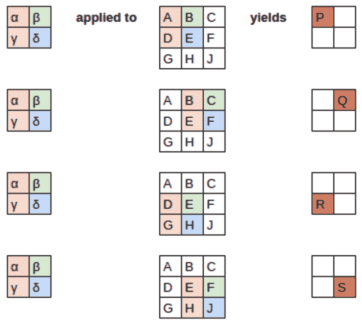

###### 图 13-7。应用核

方程视图在图 13-8 中。

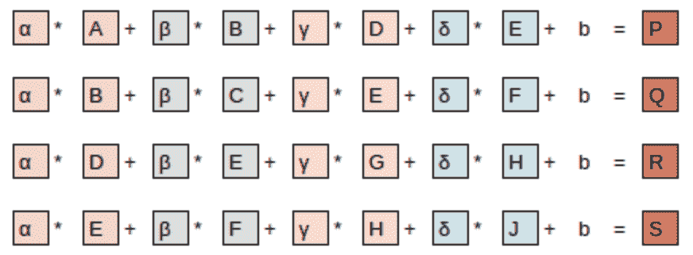

###### 图 13-8。方程

请注意，偏置项*b*对于图像的每个部分都是相同的。您可以将偏置视为滤波器的一部分，就像权重（α、β、γ、δ）是滤波器的一部分一样。

这里有一个有趣的见解——卷积可以被表示为一种特殊类型的矩阵乘法，如图 13-9 所示。权重矩阵就像传统神经网络中的那些一样。但是，这个权重矩阵具有两个特殊属性：

1.  灰色显示的零是不可训练的。这意味着它们在优化过程中将保持为零。

1.  一些权重是相等的，虽然它们是可训练的（即可更改的），但它们必须保持相等。这些被称为*共享权重*。

零对应于滤波器无法触及的像素。权重矩阵的每一行对应于滤波器的一次应用。


###### 图 13-9。卷积作为矩阵乘法

现在我们了解了卷积是什么，让我们使用它们来构建一个神经网络。

# 我们的第一个卷积神经网络

没有理由相信某些特定的边缘滤波器是图像识别最有用的卷积核。此外，我们已经看到在后续层中，卷积核变成了来自较低层特征的复杂转换，但我们不知道如何手动构建这些转换。

相反，最好学习卷积核的值。我们已经知道如何做到这一点——SGD！实际上，模型将学习对分类有用的特征。当我们使用卷积而不是（或者除了）常规线性层时，我们创建了一个*卷积神经网络*（CNN）。

## 创建 CNN

让我们回到第四章中的基本神经网络。它的定义如下：

```py
simple_net = nn.Sequential(
    nn.Linear(28*28,30),
    nn.ReLU(),
    nn.Linear(30,1)
)
```

我们可以查看模型的定义：

```py
simple_net
```

```py
Sequential(
  (0): Linear(in_features=784, out_features=30, bias=True)
  (1): ReLU()
  (2): Linear(in_features=30, out_features=1, bias=True)
)
```

现在我们想要创建一个类似于这个线性模型的架构，但是使用卷积层而不是线性层。`nn.Conv2d`是`F.conv2d`的模块等效物。在创建架构时，它比`F.conv2d`更方便，因为在实例化时会自动为我们创建权重矩阵。

这是一个可能的架构：

```py
broken_cnn = sequential(
    nn.Conv2d(1,30, kernel_size=3, padding=1),
    nn.ReLU(),
    nn.Conv2d(30,1, kernel_size=3, padding=1)
)
```

这里需要注意的一点是，我们不需要指定`28*28`作为输入大小。这是因为线性层需要在权重矩阵中为每个像素设置一个权重，因此它需要知道有多少像素，但卷积会自动应用于每个像素。权重仅取决于输入和输出通道的数量以及核大小，正如我们在前一节中看到的。

想一想输出形状会是什么；然后让我们尝试一下：

```py
broken_cnn(xb).shape
```

```py
torch.Size([64, 1, 28, 28])
```

这不是我们可以用来进行分类的东西，因为我们需要每个图像一个单独的输出激活，而不是一个 28×28 的激活图。处理这个问题的一种方法是使用足够多的步幅为 2 的卷积，使得最终层的大小为 1。经过一次步幅为 2 的卷积后，大小将为 14×14；经过两次后，将为 7×7；然后是 4×4，2×2，最终大小为 1。

现在让我们尝试一下。首先，我们将定义一个函数，其中包含我们在每个卷积中将使用的基本参数：

```py
def conv(ni, nf, ks=3, act=True):
    res = nn.Conv2d(ni, nf, stride=2, kernel_size=ks, padding=ks//2)
    if act: res = nn.Sequential(res, nn.ReLU())
    return res
```

# 重构

重构神经网络的部分，可以减少由于架构不一致而导致的错误，也可以更明显地向读者展示哪些层的部分实际上在改变。

当我们使用步幅为 2 的卷积时，通常会同时增加特征的数量。这是因为我们通过将激活图中的激活数量减少 4 倍来减少层的容量，我们不希望一次过多地减少层的容量。

# 术语：通道和特征

这两个术语通常可以互换使用，指的是权重矩阵的第二轴的大小，即卷积后每个网格单元的激活数量。*特征*从不用于指代输入数据，但*通道*可以指代输入数据(通常是颜色)或网络内部的激活。

以下是我们如何构建一个简单的 CNN：

```py
simple_cnn = sequential(
    conv(1 ,4),            #14x14
    conv(4 ,8),            #7x7
    conv(8 ,16),           #4x4
    conv(16,32),           #2x2
    conv(32,2, act=False), #1x1
    Flatten(),
)
```

# Jeremy 说

我喜欢在每个卷积后添加类似这里的注释，以显示每个层后激活图的大小。这些注释假定输入大小为 28×28。

现在网络输出两个激活，这对应于我们标签中的两个可能级别：

```py
simple_cnn(xb).shape
```

```py
torch.Size([64, 2])
```

我们现在可以创建我们的`Learner`：

```py
learn = Learner(dls, simple_cnn, loss_func=F.cross_entropy, metrics=accuracy)
```

要查看模型中发生的情况，我们可以使用`summary`：

```py
learn.summary()
```

```py
Sequential (Input shape: ['64 x 1 x 28 x 28'])
================================================================
Layer (type)         Output Shape         Param #    Trainable
================================================================
Conv2d               64 x 4 x 14 x 14     40         True
________________________________________________________________
ReLU                 64 x 4 x 14 x 14     0          False
________________________________________________________________
Conv2d               64 x 8 x 7 x 7       296        True
________________________________________________________________
ReLU                 64 x 8 x 7 x 7       0          False
________________________________________________________________
Conv2d               64 x 16 x 4 x 4      1,168      True
________________________________________________________________
ReLU                 64 x 16 x 4 x 4      0          False
________________________________________________________________
Conv2d               64 x 32 x 2 x 2      4,640      True
________________________________________________________________
ReLU                 64 x 32 x 2 x 2      0          False
________________________________________________________________
Conv2d               64 x 2 x 1 x 1       578        True
________________________________________________________________
Flatten              64 x 2               0          False
________________________________________________________________

Total params: 6,722
Total trainable params: 6,722
Total non-trainable params: 0

Optimizer used: <function Adam at 0x7fbc9c258cb0>
Loss function: <function cross_entropy at 0x7fbca9ba0170>

Callbacks:
  - TrainEvalCallback
  - Recorder
  - ProgressCallback
```

请注意，最终的`Conv2d`层的输出是`64x2x1x1`。我们需要去除那些额外的`1x1`轴；这就是`Flatten`所做的。这基本上与 PyTorch 的`squeeze`方法相同，但作为一个模块。

让我们看看这是否训练！由于这是我们从头开始构建的比以前更深的网络，我们将使用更低的学习率和更多的时代：

```py
learn.fit_one_cycle(2, 0.01)
```

| 时代 | 训练损失 | 验证损失 | 准确性 | 时间 |
| --- | --- | --- | --- | --- |
| 0 | 0.072684 | 0.045110 | 0.990186 | 00:05 |
| 1 | 0.022580 | 0.030775 | 0.990186 | 00:05 |

成功！它越来越接近我们之前的`resnet18`结果，尽管还不完全达到，而且需要更多的时代，我们需要使用更低的学习率。我们还有一些技巧要学习，但我们越来越接近能够从头开始创建现代 CNN。

## 理解卷积算术

我们可以从总结中看到，我们有一个大小为`64x1x28x28`的输入。轴是`批次、通道、高度、宽度`。这通常表示为`NCHW`(其中`N`是批次大小)。另一方面，TensorFlow 使用`NHWC`轴顺序。这是第一层：

```py
m = learn.model[0]
m
```

```py
Sequential(
  (0): Conv2d(1, 4, kernel_size=(3, 3), stride=(2, 2), padding=(1, 1))
  (1): ReLU()
)
```

因此，我们有 1 个输入通道，4 个输出通道和一个 3×3 的内核。让我们检查第一个卷积的权重：

```py
m[0].weight.shape
```

```py
torch.Size([4, 1, 3, 3])
```

总结显示我们有 40 个参数，`4*1*3*3`是 36。其他四个参数是什么？让我们看看偏差包含什么：

```py
m[0].bias.shape
```

```py
torch.Size([4])
```

我们现在可以利用这些信息来澄清我们在上一节中的陈述：“当我们使用步幅为 2 的卷积时，我们经常增加特征的数量，因为我们通过 4 的因子减少了激活图中的激活数量；我们不希望一次性太多地减少层的容量。”

每个通道都有一个偏差。(有时通道被称为*特征*或*滤波器*，当它们不是输入通道时。) 输出形状是`64x4x14x14`，因此这将成为下一层的输入形状。根据`summary`，下一层有 296 个参数。让我们忽略批次轴，保持简单。因此，对于`14*14=196`个位置，我们正在乘以`296-8=288`个权重(为简单起见忽略偏差)，因此在这一层有`196*288=56,448`次乘法。下一层将有`7*7*(1168-16)=56,448`次乘法。

这里发生的情况是，我们的步幅为 2 的卷积将*网格大小*从`14x14`减半到`7x7`，并且我们将*滤波器数量*从 8 增加到 16，导致总体计算量没有变化。如果我们在每个步幅为 2 的层中保持通道数量不变，那么网络中所做的计算量会随着深度增加而减少。但我们知道，更深层次必须计算语义丰富的特征(如眼睛或毛发)，因此我们不会期望*减少*计算是有意义的。

另一种思考这个问题的方式是基于感受野。

## 感受野

*接受域*是参与层计算的图像区域。在[书籍网站](https://book.fast.ai)上，您会找到一个名为*conv-example.xlsx*的 Excel 电子表格，展示了使用 MNIST 数字计算两个步幅为 2 的卷积层的过程。每个层都有一个单独的核。图 13-10 展示了如果我们点击*conv2*部分中的一个单元格，显示第二个卷积层的输出，并点击*trace precedents*时看到的内容。

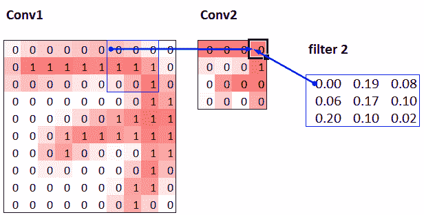

###### 图 13-10. Conv2 层的直接前置

这里，有绿色边框的单元格是我们点击的单元格，蓝色高亮显示的单元格是它的*前置*——用于计算其值的单元格。这些单元格是输入层（左侧）的对应 3×3 区域单元格和滤波器（右侧）的单元格。现在让我们再次点击*trace precedents*，看看用于计算这些输入的单元格。图 13-11 展示了发生了什么。

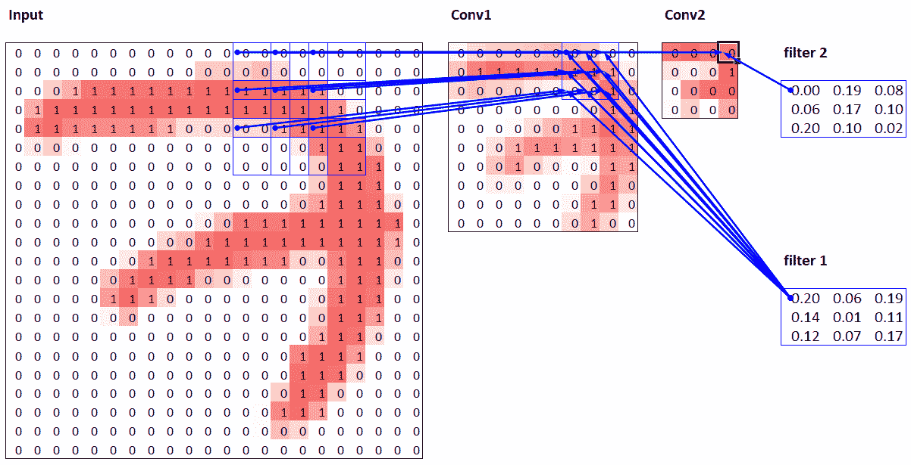

###### 图 13-11. Conv2 层的次要前置

在这个例子中，我们只有两个步幅为 2 的卷积层，因此现在追溯到了输入图像。我们可以看到输入层中的一个 7×7 区域单元格用于计算 Conv2 层中的单个绿色单元格。这个 7×7 区域是 Conv2 中绿色激活的输入的*接受域*。我们还可以看到现在需要第二个滤波器核，因为我们有两个层。

从这个例子中可以看出，我们在网络中越深（特别是在一个层之前有更多步幅为 2 的卷积层时），该层中激活的接受域就越大。一个大的接受域意味着输入图像的大部分被用来计算该层中每个激活。我们现在知道，在网络的深层，我们有语义丰富的特征，对应着更大的接受域。因此，我们期望我们需要更多的权重来处理这种不断增加的复杂性。这是另一种说法，与我们在前一节提到的相同：当我们在网络中引入步幅为 2 的卷积时，我们也应该增加通道数。

在撰写这一特定章节时，我们有很多问题需要回答，以便尽可能好地向您解释 CNN。信不信由你，我们在 Twitter 上找到了大部分答案。在我们继续讨论彩色图像之前，我们将快速休息一下，与您谈谈这个问题。

## 关于 Twitter 的一点说明

总的来说，我们并不是社交网络的重度用户。但我们写这本书的目标是帮助您成为最优秀的深度学习从业者，我们不提及 Twitter 在我们自己的深度学习之旅中有多么重要是不合适的。

您看，Twitter 还有另一部分，远离唐纳德·特朗普和卡戴珊家族，深度学习研究人员和从业者每天都在这里交流。在我们撰写这一部分时，Jeremy 想要再次确认我们关于步幅为 2 的卷积的说法是否准确，所以他在 Twitter 上提问：


几分钟后，这个答案出现了：

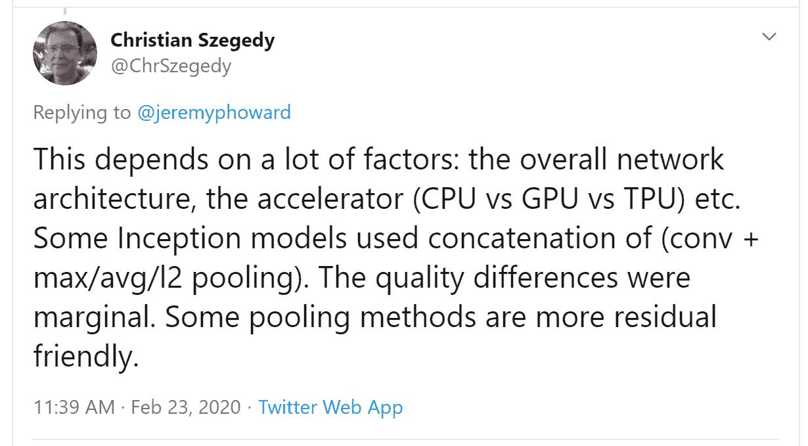

Christian Szegedy 是[Inception](https://oreil.ly/hGE_Y)的第一作者，这是 2014 年 ImageNet 的获奖作品，也是现代神经网络中许多关键见解的来源。两小时后，这个出现了：


你认识那个名字吗？您在第二章中看到过，当时我们在谈论今天建立深度学习基础的图灵奖获得者！

Jeremy 还在 Twitter 上询问有关我们在第七章中描述的标签平滑是否准确，并再次直接从 Christian Szegedy（标签平滑最初是在 Inception 论文中引入的）那里得到了回应：


今天深度学习领域的许多顶尖人物经常在 Twitter 上活跃，并且非常乐意与更广泛的社区互动。一个好的开始方法是查看 Jeremy 的[最近的 Twitter 点赞](https://oreil.ly/sqOI7)，或者[Sylvain 的](https://oreil.ly/VWYHY)。这样，您可以看到我们认为有趣和有用的人发表的 Twitter 用户列表。

Twitter 是我们保持与有趣论文、软件发布和其他深度学习新闻最新的主要途径。为了与深度学习社区建立联系，我们建议在[fast.ai 论坛](https://forums.fast.ai)和 Twitter 上都积极参与。

话虽如此，让我们回到本章的重点。到目前为止，我们只展示了黑白图片的示例，每个像素只有一个值。实际上，大多数彩色图像每个像素有三个值来定义它们的颜色。接下来我们将看看如何处理彩色图像。

# 彩色图像

彩色图片是一个三阶张量：

```py
im = image2tensor(Image.open('images/grizzly.jpg'))
im.shape
```

```py
torch.Size([3, 1000, 846])
```

```py
show_image(im);
```


第一个轴包含红色、绿色和蓝色的通道：

```py
_,axs = subplots(1,3)
for bear,ax,color in zip(im,axs,('Reds','Greens','Blues')):
    show_image(255-bear, ax=ax, cmap=color)
```

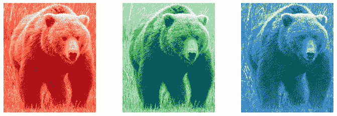

我们看到卷积操作是针对图像的一个通道上的一个滤波器（我们的示例是在一个正方形上完成的）。卷积层将接受一个具有一定数量通道的图像（对于常规 RGB 彩色图像的第一层有三个通道），并输出一个具有不同数量通道的图像。与我们的隐藏大小代表线性层中神经元数量一样，我们可以决定有多少个滤波器，并且每个滤波器都可以专门化（一些用于检测水平边缘，其他用于检测垂直边缘等等），从而产生类似我们在第二章中学习的示例。

在一个滑动窗口中，我们有一定数量的通道，我们需要同样数量的滤波器（我们不对所有通道使用相同的核）。因此，我们的核不是 3×3 的大小，而是`ch_in`（通道数）乘以 3×3。在每个通道上，我们将窗口的元素乘以相应滤波器的元素，然后对结果求和（如前所述），并对所有滤波器求和。在图 13-12 中给出的示例中，我们在该窗口上的卷积层的结果是红色+绿色+蓝色。


###### 图 13-12\. 在 RGB 图像上进行卷积

因此，为了将卷积应用于彩色图片，我们需要一个大小与第一个轴匹配的核张量。在每个位置，核和图像块的相应部分相乘。

然后，所有这些都相加在一起，为每个输出特征的每个网格位置产生一个单个数字，如图 13-13 所示。

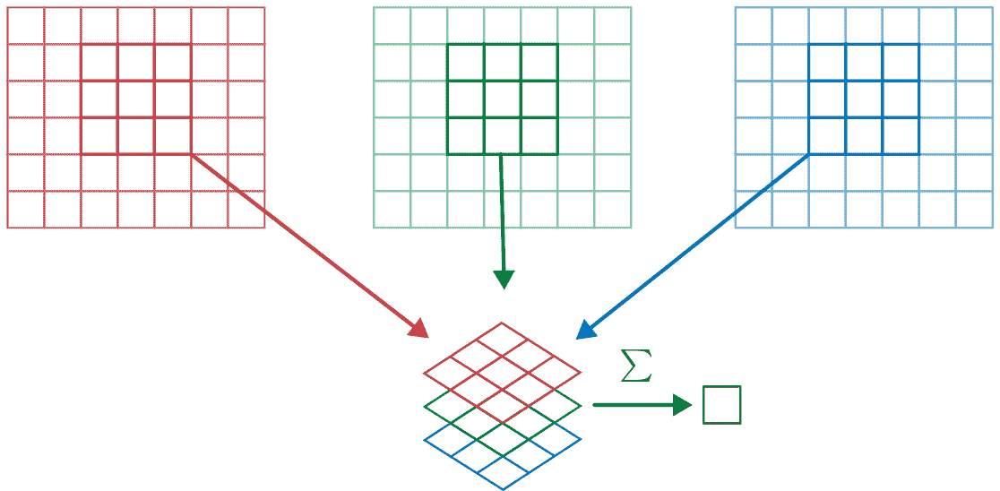

###### 图 13-13\. 添加 RGB 滤波器

然后我们有`ch_out`这样的滤波器，因此最终，我们的卷积层的结果将是一个具有`ch_out`通道的图像批次，高度和宽度由前面概述的公式给出。这给我们`ch_out`大小为`ch_in x ks x ks`的张量，我们将其表示为一个四维大张量。在 PyTorch 中，这些权重的维度顺序是`ch_out x ch_in x ks x ks`。

此外，我们可能希望为每个滤波器设置一个偏置。在前面的示例中，我们的卷积层的最终结果将是<math alttext="y Subscript upper R Baseline plus y Subscript upper G Baseline plus y Subscript upper B Baseline plus b"><mrow><msub><mi>y</mi> <mi>R</mi></msub> <mo>+</mo> <msub><mi>y</mi> <mi>G</mi></msub> <mo>+</mo> <msub><mi>y</mi> <mi>B</mi></msub> <mo>+</mo> <mi>b</mi></mrow></math>。就像在线性层中一样，我们有多少个卷积核就有多少个偏置，因此偏置是大小为`ch_out`的向量。

在使用彩色图像进行训练 CNN 时不需要特殊机制。只需确保您的第一层有三个输入。

有很多处理彩色图像的方法。例如，您可以将它们转换为黑白色，从 RGB 转换为 HSV（色调、饱和度和值）颜色空间等。一般来说，实验证明，改变颜色的编码不会对模型结果产生任何影响，只要在转换中不丢失信息。因此，转换为黑白色是一个坏主意，因为它完全删除了颜色信息（这可能是关键的；例如，宠物品种可能具有独特的颜色）；但通常转换为 HSV 不会产生任何影响。

现在您知道了第一章中“神经网络学习到的内容”中的那些图片来自[Zeiler 和 Fergus 的论文](https://oreil.ly/Y6dzZ)的含义！作为提醒，这是他们关于一些第 1 层权重的图片：

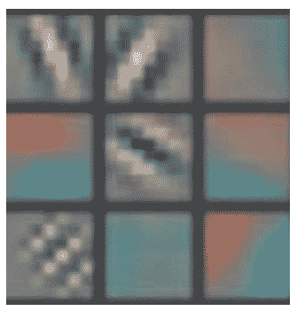

这是将卷积核的三个切片，对于每个输出特征，显示为图像。我们可以看到，即使神经网络的创建者从未明确创建用于查找边缘的卷积核，神经网络也会使用 SGD 自动发现这些特征。

现在让我们看看如何训练这些 CNN，并向您展示 fastai 在底层使用的所有技术，以实现高效的训练。

# 提高训练稳定性

由于我们在识别 3 和 7 方面做得很好，让我们转向更难的事情——识别所有 10 个数字。这意味着我们需要使用`MNIST`而不是`MNIST_SAMPLE`：

```py
path = untar_data(URLs.MNIST)
```

```py
path.ls()
```

```py
(#2) [Path('testing'),Path('training')]
```

数据在两个名为*training*和*testing*的文件夹中，因此我们必须告诉`GrandparentSplitter`这一点（默认为`train`和`valid`）。我们在`get_dls`函数中执行此操作，该函数定义使得稍后更改批量大小变得容易：

```py
def get_dls(bs=64):
    return DataBlock(
        blocks=(ImageBlock(cls=PILImageBW), CategoryBlock),
        get_items=get_image_files,
        splitter=GrandparentSplitter('training','testing'),
        get_y=parent_label,
        batch_tfms=Normalize()
    ).dataloaders(path, bs=bs)

dls = get_dls()
```

记住，在使用数据之前先查看数据总是一个好主意：

```py
dls.show_batch(max_n=9, figsize=(4,4))
```

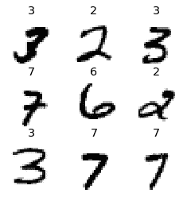

现在我们的数据准备好了，我们可以在上面训练一个简单的模型。

## 一个简单的基线

在本章的前面，我们基于类似于`conv`函数构建了一个模型：

```py
def conv(ni, nf, ks=3, act=True):
    res = nn.Conv2d(ni, nf, stride=2, kernel_size=ks, padding=ks//2)
    if act: res = nn.Sequential(res, nn.ReLU())
    return res
```

让我们从一个基本的 CNN 作为基线开始。我们将使用与之前相同的一个，但有一个调整：我们将使用更多的激活。由于我们有更多的数字需要区分，我们可能需要学习更多的滤波器。

正如我们讨论过的，通常我们希望每次有一个步幅为 2 的层时将滤波器数量加倍。在整个网络中增加滤波器数量的一种方法是在第一层中将激活数量加倍，然后每个之后的层也将比之前的版本大一倍。

但这会产生一个微妙的问题。考虑应用于每个像素的卷积核。默认情况下，我们使用一个 3×3 像素的卷积核。因此，在每个位置上，卷积核被应用到了总共 3×3=9 个像素。以前，我们的第一层有四个输出滤波器。因此，在每个位置上，从九个像素计算出四个值。想想如果我们将输出加倍到八个滤波器会发生什么。然后当我们应用我们的卷积核时，我们将使用九个像素来计算八个数字。这意味着它实际上并没有学到太多：输出大小几乎与输入大小相同。只有当神经网络被迫这样做时，即从操作的输出数量明显小于输入数量时，它们才会创建有用的特征。

为了解决这个问题，我们可以在第一层使用更大的卷积核。如果我们使用一个 5×5 像素的卷积核，每次卷积核应用时将使用 25 个像素。从中创建八个滤波器将意味着神经网络将不得不找到一些有用的特征：

```py
def simple_cnn():
    return sequential(
        conv(1 ,8, ks=5),        #14x14
        conv(8 ,16),             #7x7
        conv(16,32),             #4x4
        conv(32,64),             #2x2
        conv(64,10, act=False),  #1x1
        Flatten(),
    )
```

正如您将在接下来看到的，我们可以在模型训练时查看模型内部，以尝试找到使其训练更好的方法。为此，我们使用`ActivationStats`回调，记录每个可训练层的激活的均值、标准差和直方图（正如我们所见，回调用于向训练循环添加行为；我们将在第十六章中探讨它们的工作原理）：

```py
from fastai.callback.hook import *
```

我们希望快速训练，这意味着以较高的学习率进行训练。让我们看看在 0.06 时的效果如何：

```py
def fit(epochs=1):
    learn = Learner(dls, simple_cnn(), loss_func=F.cross_entropy,
                    metrics=accuracy, cbs=ActivationStats(with_hist=True))
    learn.fit(epochs, 0.06)
    return learn
```

```py
learn = fit()
```

| 轮数 | 训练损失 | 验证损失 | 准确率 | 时间 |
| --- | --- | --- | --- | --- |
| 0 | 2.307071 | 2.305865 | 0.113500 | 00:16 |

这次训练效果不佳！让我们找出原因。

传递给`Learner`的回调的一个方便功能是它们会自动提供，名称与回调类相同，除了使用`驼峰命名法`。因此，我们的`ActivationStats`回调可以通过`activation_stats`访问。我相信你还记得`learn.recorder`...你能猜到它是如何实现的吗？没错，它是一个名为`Recorder`的回调！

`ActivationStats`包含一些方便的实用程序，用于绘制训练期间的激活。`plot_layer_stats(*idx*)`绘制第*`idx`*层激活的均值和标准差，以及接近零的激活百分比。这是第一层的图表：

```py
learn.activation_stats.plot_layer_stats(0)
```


通常情况下，我们的模型在训练期间应该具有一致或至少平滑的层激活均值和标准差。接近零的激活值特别有问题，因为这意味着我们的模型中有一些计算根本没有做任何事情（因为乘以零得到零）。当一个层中有一些零时，它们通常会传递到下一层...然后创建更多的零。这是我们网络的倒数第二层：

```py
learn.activation_stats.plot_layer_stats(-2)
```


正如预期的那样，问题在网络末端变得更糟，因为不稳定性和零激活在层间累积。让我们看看如何使训练更稳定。

## 增加批量大小

使训练更稳定的一种方法是增加批量大小。较大的批次具有更准确的梯度，因为它们是从更多数据计算出来的。然而，较大的批量大小意味着每个轮数的批次更少，这意味着您的模型更新权重的机会更少。让我们看看批量大小为 512 是否有帮助：

```py
dls = get_dls(512)
```

```py
learn = fit()
```

| 轮数 | 训练损失 | 验证损失 | 准确率 | 时间 |
| --- | --- | --- | --- | --- |
| 0 | 2.309385 | 2.302744 | 0.113500 | 00:08 |

让我们看看倒数第二层是什么样的：

```py
learn.activation_stats.plot_layer_stats(-2)
```


再次，我们的大多数激活值接近零。让我们看看我们可以做些什么来改善训练稳定性。

## 1cycle 训练

我们的初始权重不适合我们要解决的任务。因此，以高学习率开始训练是危险的：我们很可能会使训练立即发散，正如我们所见。我们可能也不想以高学习率结束训练，这样我们就不会跳过一个最小值。但我们希望在训练期间保持高学习率，因为这样我们可以更快地训练。因此，我们应该在训练过程中改变学习率，从低到高，然后再次降低到低。

莱斯利·史密斯（是的，就是发明学习率查找器的那个人！）在他的文章[“超收敛：使用大学习率非常快速地训练神经网络”](https://oreil.ly/EB8NU)中发展了这个想法。他设计了一个学习率时间表，分为两个阶段：一个阶段学习率从最小值增长到最大值（*预热*），另一个阶段学习率再次降低到最小值（*退火*）。史密斯称这种方法的组合为*1cycle 训练*。

1cycle 训练允许我们使用比其他类型训练更高的最大学习率，这带来了两个好处：

+   通过使用更高的学习率进行训练，我们可以更快地训练——这种现象史密斯称之为*超收敛*。

+   通过使用更高的学习率进行训练，我们过拟合较少，因为我们跳过了尖锐的局部最小值，最终进入了更平滑（因此更具有泛化能力）的损失部分。

第二点是一个有趣而微妙的观察；它基于这样一个观察：一个泛化良好的模型，如果你稍微改变输入，它的损失不会发生很大变化。如果一个模型在较大的学习率下训练了相当长的时间，并且在这样做时能找到一个好的损失，那么它一定找到了一个泛化良好的区域，因为它在批次之间跳动很多（这基本上就是高学习率的定义）。问题在于，正如我们所讨论的，直接跳到高学习率更有可能导致损失发散，而不是看到损失改善。因此，我们不会直接跳到高学习率。相反，我们从低学习率开始，我们的损失不会发散，然后允许优化器逐渐找到参数的更平滑的区域，逐渐提高学习率。

然后，一旦我们找到了参数的一个良好平滑区域，我们希望找到该区域的最佳部分，这意味着我们必须再次降低学习率。这就是为什么 1cycle 训练有一个渐进的学习率预热和渐进的学习率冷却。许多研究人员发现，实践中这种方法导致更准确的模型和更快的训练。这就是为什么在 fastai 中`fine_tune`默认使用这种方法。

在第十六章中，我们将学习有关 SGD 中的*动量*。简而言之，动量是一种技术，优化器不仅朝着梯度的方向迈出一步，而且继续朝着以前的步骤的方向前进。 Leslie Smith 在[“神经网络超参数的纪律方法：第 1 部分”](https://oreil.ly/oL7GT)中介绍了*循环动量*的概念。它建议动量与学习率的方向相反变化：当我们处于高学习率时，我们使用较少的动量，在退火阶段再次使用更多动量。

我们可以通过调用`fit_one_cycle`在 fastai 中使用 1cycle 训练：

```py
def fit(epochs=1, lr=0.06):
    learn = Learner(dls, simple_cnn(), loss_func=F.cross_entropy,
                    metrics=accuracy, cbs=ActivationStats(with_hist=True))
    learn.fit_one_cycle(epochs, lr)
    return learn
```

```py
learn = fit()
```

| epoch | train_loss | valid_loss | accuracy | time |
| --- | --- | --- | --- | --- |
| 0 | 0.210838 | 0.084827 | 0.974300 | 00:08 |

我们终于取得了一些进展！现在它给我们一个合理的准确率。

我们可以通过在`learn.recorder`上调用`plot_sched`来查看训练过程中的学习率和动量。`learn.recorder`（顾名思义）记录了训练过程中发生的一切，包括损失、指标和超参数，如学习率和动量：

```py
learn.recorder.plot_sched()
```

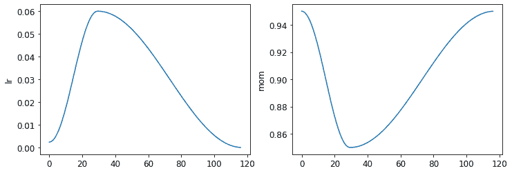

Smith 的原始 1cycle 论文使用了线性热身和线性退火。正如您所看到的，我们通过将其与另一种流行方法——余弦退火相结合，在 fastai 中改进了这种方法。`fit_one_cycle`提供了以下您可以调整的参数：

`lr_max`

将使用的最高学习率（这也可以是每个层组的学习率列表，或包含第一个和最后一个层组学习率的 Python `slice`对象）

`div`

将`lr_max`除以多少以获得起始学习率

`div_final`

将`lr_max`除以多少以获得结束学习率

`pct_start`

用于热身的批次百分比

`moms`

一个元组`(*mom1*,*mom2*,*mom3*)`，其中*`mom1`*是初始动量，*`mom2`*是最小动量，*`mom3`*是最终动量

让我们再次查看我们的层统计数据：

```py
learn.activation_stats.plot_layer_stats(-2)
```


非零权重的百分比正在得到很大的改善，尽管仍然相当高。通过使用`color_dim`并传递一个层索引，我们可以更多地了解我们的训练情况：

```py
learn.activation_stats.color_dim(-2)
```


`color_dim`是由 fast.ai 与学生 Stefano Giomo 共同开发的。Giomo 将这个想法称为*丰富多彩维度*，并提供了一个[深入解释](https://oreil.ly/bPXGw)这种方法背后的历史和细节。基本思想是创建一个层的激活直方图，我们希望它会遵循一个平滑的模式，如正态分布（图 13-14）。

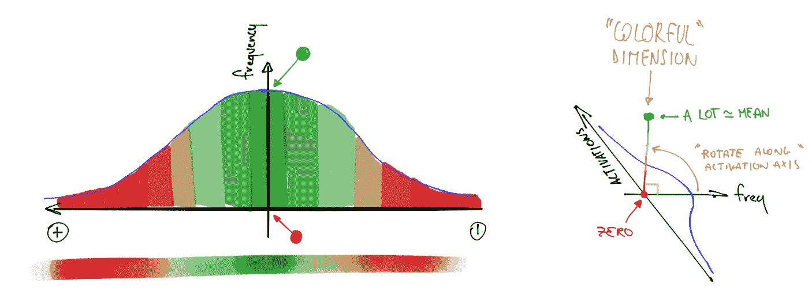

###### 图 13-14。丰富多彩维度的直方图（由 Stefano Giomo 提供）

为了创建`color_dim`，我们将左侧显示的直方图转换为底部显示的彩色表示。然后，我们将其翻转，如右侧所示。我们发现，如果我们取直方图值的对数，分布会更清晰。然后，Giomo 描述：

> 每个层的最终图是通过将每批次的激活直方图沿水平轴堆叠而成的。因此，可视化中的每个垂直切片代表单个批次的激活直方图。颜色强度对应直方图的高度；换句话说，每个直方图柱中的激活数量。

图 13-15 展示了这一切是如何结合在一起的。

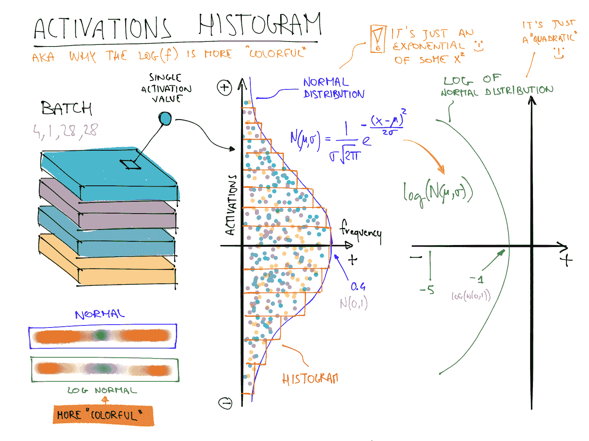

###### 图 13-15。丰富多彩维度的总结（由 Stefano Giomo 提供）

这说明了为什么当*f*遵循正态分布时，log(*f*)比*f*更丰富多彩，因为取对数会将高斯曲线变成二次曲线，这样不会那么狭窄。

因此，让我们再次看看倒数第二层的结果：

```py
learn.activation_stats.color_dim(-2)
```

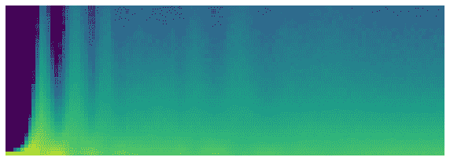

这展示了一个经典的“糟糕训练”图片。我们从几乎所有激活都为零开始——这是我们在最左边看到的，所有的深蓝色。底部的明黄色代表接近零的激活。然后，在最初的几批中，我们看到非零激活数量呈指数增长。但它走得太远并崩溃了！我们看到深蓝色回来了，底部再次变成明黄色。它几乎看起来像是训练重新从头开始。然后我们看到激活再次增加并再次崩溃。重复几次后，最终我们看到激活在整个范围内分布。

如果训练一开始就能平稳进行会更好。指数增长然后崩溃的周期往往会导致大量接近零的激活，从而导致训练缓慢且最终结果不佳。解决这个问题的一种方法是使用批量归一化。

## 批量归一化

为了解决前一节中出现的训练缓慢和最终结果不佳的问题，我们需要解决初始大比例接近零的激活，并尝试在整个训练过程中保持良好的激活分布。

Sergey Ioffe 和 Christian Szegedy 在 2015 年的论文[“Batch Normalization: Accelerating Deep Network Training by Reducing Internal Covariate Shift”](https://oreil.ly/MTZJL)中提出了这个问题的解决方案。在摘要中，他们描述了我们所见过的问题：

> 训练深度神经网络的复杂性在于每一层输入的分布在训练过程中会发生变化，因为前一层的参数发生变化。这需要降低学习率和谨慎的参数初始化，从而减慢训练速度...我们将这种现象称为内部协变量转移，并通过对层输入进行归一化来解决这个问题。

他们说他们的解决方案如下：

> 将归一化作为模型架构的一部分，并对每个训练小批量进行归一化。批量归一化使我们能够使用更高的学习率，并且对初始化要求不那么严格。

这篇论文一经发布就引起了极大的兴奋，因为它包含了图 13-16 中的图表，清楚地表明批量归一化可以训练出比当前最先进技术（*Inception*架构）更准确且速度快约 5 倍的模型。

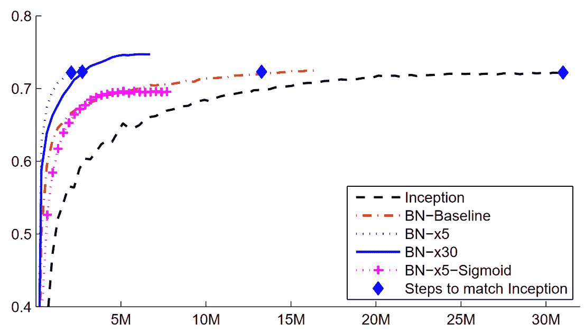

###### 图 13-16\. 批量归一化的影响（由 Sergey Ioffe 和 Christian Szegedy 提供）

批量归一化（通常称为*batchnorm*）通过取层激活的均值和标准差的平均值来归一化激活。然而，这可能会导致问题，因为网络可能希望某些激活非常高才能进行准确的预测。因此，他们还添加了两个可学习参数（意味着它们将在 SGD 步骤中更新），通常称为`gamma`和`beta`。在将激活归一化以获得一些新的激活向量`y`之后，批量归一化层返回`gamma*y + beta`。

这就是为什么我们的激活可以具有任何均值或方差，独立于前一层结果的均值和标准差。这些统计数据是分开学习的，使得我们的模型训练更容易。在训练和验证期间的行为是不同的：在训练期间，我们使用批次的均值和标准差来归一化数据，而在验证期间，我们使用训练期间计算的统计数据的运行均值。

让我们在`conv`中添加一个批量归一化层：

```py
def conv(ni, nf, ks=3, act=True):
    layers = [nn.Conv2d(ni, nf, stride=2, kernel_size=ks, padding=ks//2)]
    layers.append(nn.BatchNorm2d(nf))
    if act: layers.append(nn.ReLU())
    return nn.Sequential(*layers)
```

并适应我们的模型：

```py
learn = fit()
```

| epoch | train_loss | valid_loss | accuracy | time |
| --- | --- | --- | --- | --- |
| 0 | 0.130036 | 0.055021 | 0.986400 | 00:10 |

这是一个很好的结果！让我们看看`color_dim`：

```py
learn.activation_stats.color_dim(-4)
```

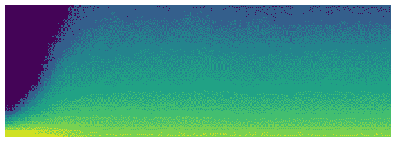

这正是我们希望看到的：激活的平稳发展，没有“崩溃”。Batchnorm 在这里真的兑现了承诺！事实上，批量归一化非常成功，我们几乎可以在所有现代神经网络中看到它（或类似的东西）。

关于包含批归一化层的模型的一个有趣观察是，它们往往比不包含批归一化层的模型更好地泛化。尽管我们尚未看到对这里发生的事情进行严格分析，但大多数研究人员认为原因是批归一化为训练过程添加了一些额外的随机性。每个小批次的均值和标准差都会与其他小批次有所不同。因此，激活每次都会被不同的值归一化。为了使模型能够做出准确的预测，它必须学会对这些变化变得稳健。通常，向训练过程添加额外的随机性通常有所帮助。

由于事情进展顺利，让我们再训练几个周期，看看情况如何。实际上，让我们*增加*学习率，因为批归一化论文的摘要声称我们应该能够“以更高的学习率训练”：

```py
learn = fit(5, lr=0.1)
```

| epoch | train_loss | valid_loss | accuracy | time |
| --- | --- | --- | --- | --- |
| 0 | 0.191731 | 0.121738 | 0.960900 | 00:11 |
| 1 | 0.083739 | 0.055808 | 0.981800 | 00:10 |
| 2 | 0.053161 | 0.044485 | 0.987100 | 00:10 |
| 3 | 0.034433 | 0.030233 | 0.990200 | 00:10 |
| 4 | 0.017646 | 0.025407 | 0.991200 | 00:10 |

```py
learn = fit(5, lr=0.1)
```

| epoch | train_loss | valid_loss | accuracy | time |
| --- | --- | --- | --- | --- |
| 0 | 0.183244 | 0.084025 | 0.975800 | 00:13 |
| 1 | 0.080774 | 0.067060 | 0.978800 | 00:12 |
| 2 | 0.050215 | 0.062595 | 0.981300 | 00:12 |
| 3 | 0.030020 | 0.030315 | 0.990700 | 00:12 |
| 4 | 0.015131 | 0.025148 | 0.992100 | 00:12 |

在这一点上，我认为我们知道如何识别数字了！是时候转向更难的东西了…

# 结论

我们已经看到，卷积只是一种矩阵乘法，对权重矩阵有两个约束：一些元素始终为零，一些元素被绑定（强制始终具有相同的值）。在第一章中，我们看到了 1986 年书籍*并行分布式处理*中的八个要求；其中之一是“单元之间的连接模式”。这正是这些约束所做的：它们强制执行一定的连接模式。

这些约束允许我们在不牺牲表示复杂视觉特征的能力的情况下，在模型中使用更少的参数。这意味着我们可以更快地训练更深的模型，减少过拟合。尽管普遍逼近定理表明在一个隐藏层中应该*可能*用全连接网络表示任何东西，但我们现在看到，通过深思熟虑网络架构，我们可以训练出更好的模型。

卷积是我们在神经网络中看到的最常见的连接模式（连同常规线性层，我们称之为*全连接*），但很可能会发现更多。

我们还看到了如何解释网络中各层的激活，以查看训练是否顺利，以及批归一化如何帮助规范训练并使其更加平滑。在下一章中，我们将使用这两个层来构建计算机视觉中最流行的架构：残差网络。

# 问卷

1.  特征是什么？

1.  为顶部边缘检测器编写卷积核矩阵。

1.  写出 3×3 卷积核对图像中单个像素应用的数学运算。

1.  应用于 3×3 零矩阵的卷积核的值是多少？

1.  填充是什么？

1.  步幅是什么？

1.  创建一个嵌套列表推导来完成您选择的任何任务。

1.  PyTorch 的 2D 卷积的`input`和`weight`参数的形状是什么？

1.  通道是什么？

1.  卷积和矩阵乘法之间的关系是什么？

1.  卷积神经网络是什么？

1.  重构神经网络定义的部分有什么好处？

1.  什么是`Flatten`？MNIST CNN 中需要包含在哪里？为什么？

1.  NCHW 是什么意思？

1.  为什么 MNIST CNN 的第三层有`7*7*(1168-16)`次乘法运算？

1.  什么是感受野？

1.  经过两次步幅为 2 的卷积后，激活的感受野大小是多少？为什么？

1.  自己运行*conv-example.xlsx*并尝试使用*trace precedents*进行实验。

1.  看一下 Jeremy 或 Sylvain 最近的 Twitter“喜欢”列表，看看是否有任何有趣的资源或想法。

1.  彩色图像如何表示为张量？

1.  彩色输入下卷积是如何工作的？

1.  我们可以使用什么方法来查看`DataLoaders`中的数据？

1.  为什么我们在每次步幅为 2 的卷积后将滤波器数量加倍？

1.  为什么在 MNIST 的第一个卷积中使用较大的内核（使用`simple_cnn`）？

1.  `ActivationStats`为每个层保存了什么信息？

1.  在训练后如何访问学习者的回调？

1.  `plot_layer_stats`绘制了哪三个统计数据？x 轴代表什么？

1.  为什么接近零的激活是有问题的？

1.  使用更大的批量大小进行训练的优缺点是什么？

1.  为什么我们应该避免在训练开始时使用高学习率？

1.  什么是 1cycle 训练？

1.  使用高学习率进行训练的好处是什么？

1.  为什么我们希望在训练结束时使用较低的学习率？

1.  什么是循环动量？

1.  哪个回调在训练期间跟踪超参数值（以及其他信息）？

1.  `color_dim`图中的一列像素代表什么？

1.  在`color_dim`中，“坏训练”是什么样子？为什么？

1.  批规范化层包含哪些可训练参数？

1.  在训练期间批规范化使用哪些统计数据进行规范化？验证期间呢？

1.  为什么具有批规范化层的模型泛化能力更好？

## 进一步研究

1.  除了边缘检测器，计算机视觉中还使用了哪些特征（尤其是在深度学习变得流行之前）？

1.  PyTorch 中还有其他规范化层。尝试它们，看看哪种效果最好。了解其他规范化层的开发原因以及它们与批规范化的区别。

1.  尝试将激活函数移动到`conv`中的批规范化层后。这会有所不同吗？看看你能找到关于推荐顺序及原因的信息。
