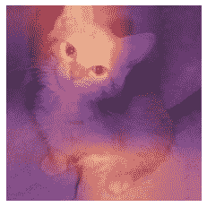
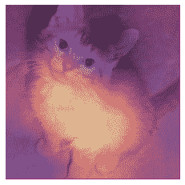
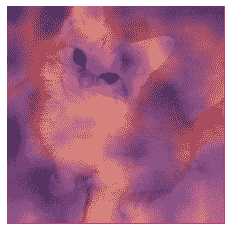

# 第十八章：使用 CAM 解释 CNN

> 原文：<https://www.bookstack.cn/read/th-fastai-book/20b17a5a56ea9b6f.md>

现在我们知道如何从头开始构建几乎任何东西，让我们利用这些知识来创建全新（并非常有用！）的功能：*类激活图*。它让我们对 CNN 为何做出预测有一些见解。

在这个过程中，我们将学习到 PyTorch 中一个我们之前没有见过的方便功能，*hook*，并且我们将应用本书中介绍的许多概念。如果你想真正测试你对本书材料的理解，完成本章后，尝试将其放在一边，从头开始重新创建这里的想法（不要偷看！）。

# CAM 和 Hooks

*类激活图*（CAM）是由周博磊等人在[“学习用于区分定位的深度特征”](https://oreil.ly/5hik3)中引入的。它使用最后一个卷积层的输出（就在平均池化层之前）以及预测结果，为我们提供一个热图可视化，解释模型为何做出决定。这是一个有用的解释工具。

更准确地说，在我们最终卷积层的每个位置，我们有与最后一个线性层中一样多的滤波器。因此，我们可以计算这些激活与最终权重的点积，以便为我们特征图上的每个位置得到用于做出决定的特征的分数。

在训练模型时，我们需要一种方法来访问模型内部的激活。在 PyTorch 中，可以通过 *hook* 来实现。Hook 是 PyTorch 的等价于 fastai 的回调。然而，与允许您像 fastai 的 `Learner` 回调一样将代码注入训练循环不同，hook 允许您将代码注入前向和反向计算本身。我们可以将 hook 附加到模型的任何层，并且在计算输出（前向 hook）或反向传播（后向 hook）时执行。前向 hook 是一个接受三个参数的函数——一个模块，它的输入和输出——它可以执行任何您想要的行为。（fastai 还提供了一个方便的 `HookCallback`，我们这里不涉及，但看看 fastai 文档；它使使用 hook 更容易一些。）

为了说明，我们将使用我们在第一章中训练的相同的猫狗模型：

```py
path = untar_data(URLs.PETS)/'images'
def is_cat(x): return x[0].isupper()
dls = ImageDataLoaders.from_name_func(
    path, get_image_files(path), valid_pct=0.2, seed=21,
    label_func=is_cat, item_tfms=Resize(224))
learn = cnn_learner(dls, resnet34, metrics=error_rate)
learn.fine_tune(1)
```

| 轮次 | 训练损失 | 验证损失 | 错误率 | 时间 |
| --- | --- | --- | --- | --- |
| 0 | 0.141987 | 0.018823 | 0.007442 | 00:16 |
| 轮次 | 训练损失 | 验证损失 | 错误率 | 时间 |
| --- | --- | --- | --- | --- |
| 0 | 0.050934 | 0.015366 | 0.006766 | 00:21 |

首先，我们将获取一张猫的图片和一批数据：

```py
img = PILImage.create('images/chapter1_cat_example.jpg')
x, = first(dls.test_dl([img]))
```

对于 CAM，我们想要存储最后一个卷积层的激活。我们将我们的 hook 函数放在一个类中，这样它就有一个我们稍后可以访问的状态，并且只存储输出的副本：

```py
class Hook():
    def hook_func(self, m, i, o): self.stored = o.detach().clone()
```

然后我们可以实例化一个 `Hook` 并将其附加到我们想要的层，即 CNN 主体的最后一层：

```py
hook_output = Hook()
hook = learn.model[0].register_forward_hook(hook_output.hook_func)
```

现在我们可以获取一个批次并将其通过我们的模型：

```py
with torch.no_grad(): output = learn.model.eval()(x)
```

我们可以访问我们存储的激活：

```py
act = hook_output.stored[0]
```

让我们再次双重检查我们的预测：

```py
F.softmax(output, dim=-1)
```

```py
tensor([[7.3566e-07, 1.0000e+00]], device='cuda:0')
```

我们知道 `0`（对于 `False`）是“狗”，因为在 fastai 中类别会自动排序，但我们仍然可以通过查看 `dls.vocab` 来进行双重检查：

```py
dls.vocab
```

```py
(#2) [False,True]
```

所以，我们的模型非常确信这是一张猫的图片。

为了对我们的权重矩阵（2 乘以激活数量）与激活（批次大小乘以激活乘以行乘以列）进行点积，我们使用自定义的 `einsum`：

```py
x.shape
```

```py
torch.Size([1, 3, 224, 224])
```

```py
cam_map = torch.einsum('ck,kij->cij', learn.model[1][-1].weight, act)
cam_map.shape
```

```py
torch.Size([2, 7, 7])
```

对于我们批次中的每个图像，对于每个类别，我们得到一个 7×7 的特征图，告诉我们激活较高和较低的位置。这将让我们看到哪些图片区域影响了模型的决策。

例如，我们可以找出哪些区域使模型决定这个动物是一只猫（请注意，由于`DataLoader`对输入`x`进行了归一化，我们需要`decode`，并且由于在撰写本书时，PyTorch 在索引时不保留类型，我们需要转换为`TensorImage`——这可能在您阅读本文时已经修复）：

```py
x_dec = TensorImage(dls.train.decode((x,))[0][0])
_,ax = plt.subplots()
x_dec.show(ctx=ax)
ax.imshow(cam_map[1].detach().cpu(), alpha=0.6, extent=(0,224,224,0),
              interpolation='bilinear', cmap='magma');
```



在这种情况下，明亮黄色的区域对应于高激活，紫色区域对应于低激活。在这种情况下，我们可以看到头部和前爪是使模型决定这是一张猫的图片的两个主要区域。

完成钩子后，应该将其删除，否则可能会泄漏一些内存：

```py
hook.remove()
```

这就是为什么将`Hook`类作为*上下文管理器*通常是一个好主意，当您进入时注册钩子，当您退出时删除它。上下文管理器是一个 Python 构造，在`with`子句中创建对象时调用`__enter__`，在`with`子句结束时调用`__exit__`。例如，这就是 Python 处理`with open(...) as f:`构造的方式，您经常会看到用于打开文件而不需要在最后显式调用`close(f)`。

如果我们将`Hook`定义如下

```py
class Hook():
    def __init__(self, m):
        self.hook = m.register_forward_hook(self.hook_func)
    def hook_func(self, m, i, o): self.stored = o.detach().clone()
    def __enter__(self, *args): return self
    def __exit__(self, *args): self.hook.remove()
```

我们可以安全地这样使用它：

```py
with Hook(learn.model[0]) as hook:
    with torch.no_grad(): output = learn.model.eval()(x.cuda())
    act = hook.stored
```

fastai 为您提供了这个`Hook`类，以及一些其他方便的类，使使用钩子更容易。

这种方法很有用，但仅适用于最后一层。*梯度 CAM*是一个解决这个问题的变体。

# 梯度 CAM

我们刚刚看到的方法让我们只能计算最后激活的热图，因为一旦我们有了我们的特征，我们必须将它们乘以最后的权重矩阵。这对网络中的内部层不起作用。2016 年的一篇论文[“Grad-CAM: Why Did You Say That?”](https://oreil.ly/4krXE)由 Ramprasaath R. Selvaraju 等人介绍了一种变体，使用所需类的最终激活的梯度。如果您还记得一点关于反向传播的知识，最后一层输出的梯度与该层输入的梯度相对应，因为它是一个线性层。

对于更深的层，我们仍然希望梯度，但它们不再等于权重。我们必须计算它们。PyTorch 在反向传播期间为我们计算每一层的梯度，但它们不会被存储（除了`requires_grad`为`True`的张量）。然而，我们可以在反向传播上注册一个钩子，PyTorch 将把梯度作为参数传递给它，因此我们可以在那里存储它们。为此，我们将使用一个`HookBwd`类，它的工作方式类似于`Hook`，但是拦截并存储梯度而不是激活：

```py
class HookBwd():
    def __init__(self, m):
        self.hook = m.register_backward_hook(self.hook_func)
    def hook_func(self, m, gi, go): self.stored = go[0].detach().clone()
    def __enter__(self, *args): return self
    def __exit__(self, *args): self.hook.remove()
```

然后对于类索引`1`（对于`True`，即“猫”），我们拦截最后一个卷积层的特征，如前所述，计算我们类的输出激活的梯度。我们不能简单地调用`output.backward`，因为梯度只对标量有意义（通常是我们的损失），而`output`是一个秩为 2 的张量。但是，如果我们选择单个图像（我们将使用`0`）和单个类（我们将使用`1`），我们*可以*计算我们喜欢的任何权重或激活的梯度，与该单个值相关，使用`output[0,cls].backward`。我们的钩子拦截了我们将用作权重的梯度：

```py
cls = 1
with HookBwd(learn.model[0]) as hookg:
    with Hook(learn.model[0]) as hook:
        output = learn.model.eval()(x.cuda())
        act = hook.stored
    output[0,cls].backward()
    grad = hookg.stored
```

Grad-CAM 的权重由特征图上的梯度平均值给出。然后就像以前一样：

```py
w = grad[0].mean(dim=[1,2], keepdim=True)
cam_map = (w * act[0]).sum(0)
```

```py
_,ax = plt.subplots()
x_dec.show(ctx=ax)
ax.imshow(cam_map.detach().cpu(), alpha=0.6, extent=(0,224,224,0),
              interpolation='bilinear', cmap='magma');
```



Grad-CAM 的新颖之处在于我们可以在任何层上使用它。例如，在这里我们将其用于倒数第二个 ResNet 组的输出：

```py
with HookBwd(learn.model[0][-2]) as hookg:
    with Hook(learn.model[0][-2]) as hook:
        output = learn.model.eval()(x.cuda())
        act = hook.stored
    output[0,cls].backward()
    grad = hookg.stored
```

```py
w = grad[0].mean(dim=[1,2], keepdim=True)
cam_map = (w * act[0]).sum(0)
```

现在我们可以查看此层的激活图：

```py
_,ax = plt.subplots()
x_dec.show(ctx=ax)
ax.imshow(cam_map.detach().cpu(), alpha=0.6, extent=(0,224,224,0),
              interpolation='bilinear', cmap='magma');
```



# 结论

模型解释是一个活跃研究领域，我们只是在这一简短章节中探讨了可能性的一部分。类激活图让我们了解模型为什么预测了某个结果，它展示了图像中对于给定预测最负责的区域。这可以帮助我们分析假阳性，并找出在我们的训练中缺少了哪种数据以避免它们。

# 问卷调查

1.  PyTorch 中的 hook 是什么？

1.  CAM 使用哪个层的输出？

1.  为什么 CAM 需要一个 hook？

1.  查看`ActivationStats`类的源代码，看看它如何使用 hooks。

1.  编写一个 hook，用于存储模型中给定层的激活（如果可能的话，不要偷看）。

1.  为什么我们在获取激活之前要调用`eval`？为什么我们要使用`no_grad`？

1.  使用`torch.einsum`来计算模型主体最后激活的每个位置的“狗”或“猫”得分。

1.  如何检查类别的顺序（即索引→类别的对应关系）？

1.  为什么我们在显示输入图像时使用`decode`？

1.  什么是上下文管理器？需要定义哪些特殊方法来创建一个？

1.  为什么我们不能对网络的内部层使用普通的 CAM？

1.  为了执行 Grad-CAM，为什么我们需要在反向传播中注册一个 hook？

1.  当`output`是每个图像每个类别的输出激活的秩为 2 的张量时，为什么我们不能调用`output.backward`？

## 进一步研究

1.  尝试移除`keepdim`，看看会发生什么。查阅 PyTorch 文档中的这个参数。为什么我们在这个笔记本中需要它？

1.  创建一个类似这个的笔记本，但用于 NLP，并用它来找出电影评论中哪些词对于评估特定电影评论的情感最重要。
