# 附录 A. 创建博客

在第二章中，我们建议您可能希望尝试博客作为帮助消化您正在阅读和练习的信息的一种方式。但是如果您还没有博客呢？应该使用哪个平台呢？

不幸的是，当涉及博客时，似乎您必须做出一个困难的决定：要么使用一个使事情变得容易但会让您和读者受到广告、付费墙和费用的平台，要么花费数小时设置自己的托管服务并花费数周学习各种复杂的细节。也许“自己动手”方法最大的好处是，您真正拥有自己的帖子，而不是受制于服务提供商及其关于如何在未来变现您的内容的决定。

然而，事实证明，您可以兼得两全！

# 使用 GitHub Pages 进行博客

一个很好的解决方案是在一个名为[GitHub Pages](https://pages.github.com)的平台上托管您的博客，这是免费的，没有广告或付费墙，并以标准方式使您的数据可用，以便您随时将您的博客迁移到另一个主机。但是，我们看到的所有使用 GitHub Pages 的方法都需要了解命令行和只有软件开发人员可能熟悉的神秘工具。例如，GitHub 的[官方文档](https://oreil.ly/xemwJ)中关于设置博客的说明包括安装 Ruby 编程语言，使用`git`命令行工具，复制版本号等一长串指令，总共有 17 个步骤！

为了减少麻烦，我们创建了一种简单的方法，允许您使用*完全基于浏览器的界面*来满足您所有的博客需求。您将在大约五分钟内启动并运行您的新博客。这不需要任何费用，如果您愿意，您可以轻松添加自己的自定义域名。在本节中，我们将解释如何做到这一点，使用我们创建的名为`fast_template`的模板。（注：请务必查看[书籍网站](https://book.fast.ai)以获取最新的博客推荐，因为新工具总是不断涌现。）

## 创建存储库

您需要一个 GitHub 账户，所以现在前往那里并创建一个账户（如果您还没有）。通常，GitHub 是由软件开发人员用于编写代码的，他们使用一个复杂的命令行工具来处理它，但我们将向您展示一种根本不使用命令行的方法！

要开始，请将浏览器指向[*https://github.com/fastai/fast_template/generate*](https://github.com/fastai/fast_template/generate)（确保您已登录）。这将允许您创建一个存储博客的地方，称为*存储库*。您将看到一个类似于图 A-1 的屏幕。请注意，您必须使用此处显示的*确切*格式输入您的存储库名称，即您的 GitHub 用户名后跟`.github.io`。

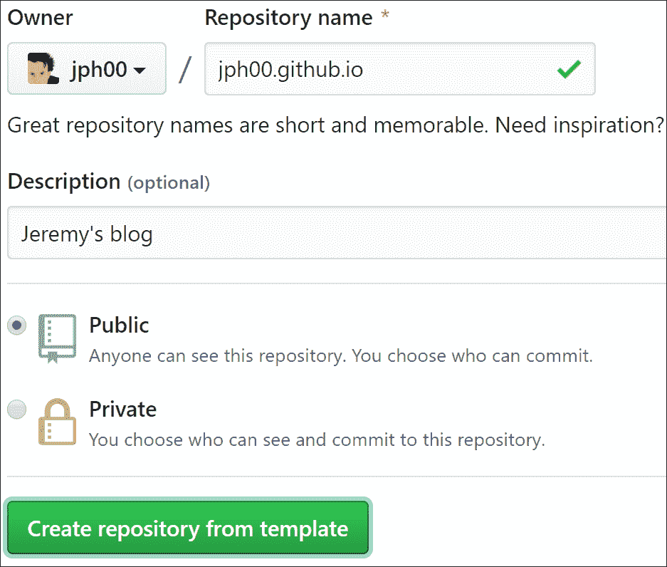

###### 图 A-1. 创建您的存储库

一旦您输入了这些内容，以及您喜欢的任何描述，点击“从模板创建存储库”。您可以选择将存储库设为“私有”，但由于您正在创建一个希望其他人阅读的博客，希望公开可用的基础文件对您来说不会成为问题。

现在，让我们设置您的主页！

## 设置您的主页

当读者访问您的博客时，他们将首先看到一个名为 *index.md* 的文件的内容。这是一个 [Markdown](https://oreil.ly/aVOhs) 文件。Markdown 是一种强大而简单的创建格式化文本的方式，比如项目符号、斜体、超链接等等。它被广泛使用，包括 Jupyter 笔记本中的所有格式，几乎 GitHub 网站的每个部分，以及互联网上的许多其他地方。要创建 Markdown 文本，您只需输入普通英语，然后添加一些特殊字符以添加特殊行为。例如，如果您在单词或短语前后输入 `*` 字符，那将使其变为 *斜体*。现在让我们试一试。

要打开文件，请在 GitHub 中点击其文件名。要编辑它，请点击屏幕最右侧的铅笔图标，如 图 A-2 所示。

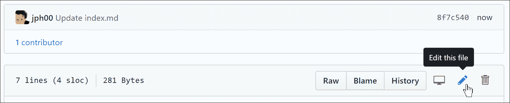

###### 图 A-2. 编辑此文件

您可以添加、编辑或替换您看到的文本。点击“预览更改”按钮（图 A-3）查看您的 Markdown 文本在博客中的样子。您添加或更改的行将在左侧显示为绿色条。

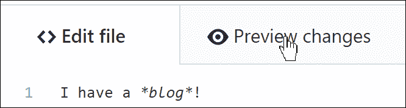

###### 图 A-3. 预览更改以捕捉任何错误

要保存更改，请滚动到页面底部，然后点击“提交更改”，如 图 A-4 所示。在 GitHub 上，*提交* 意味着将其保存到 GitHub 服务器。

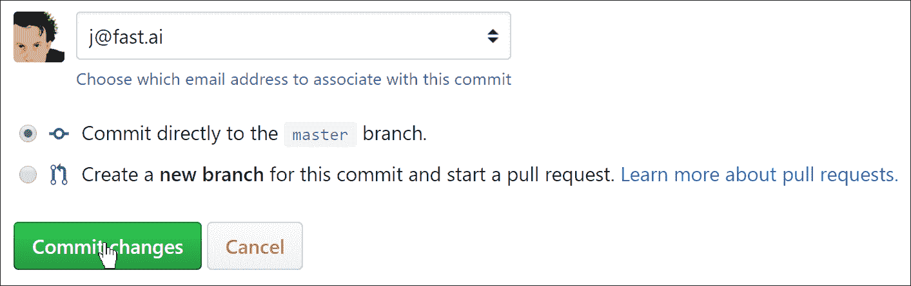

###### 图 A-4. 提交更改以保存它们

接下来，您应该配置您的博客设置。要这样做，请点击名为 *_config.yml* 的文件，然后点击编辑按钮，就像您为 index 文件所做的那样。更改标题、描述和 GitHub 用户名值（参见 图 A-5）。您需要保留冒号前的名称不变，并在冒号后（和每行的空格后）输入您的新值。如果愿意，您还可以添加您的电子邮件地址和 Twitter 用户名，但请注意，如果在此处填写它们，它们将出现在您的公共博客上。

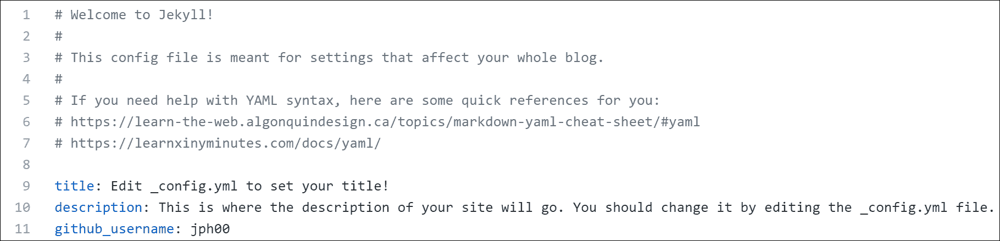

###### 图 A-5. 填写配置文件

完成后，像处理 index 文件一样提交您的更改；然后等待一两分钟，让 GitHub 处理您的新博客。将您的网络浏览器指向 *<username>.github.io*（将 *<username>* 替换为您的 GitHub 用户名）。您应该看到您的博客，它看起来类似于 图 A-6。

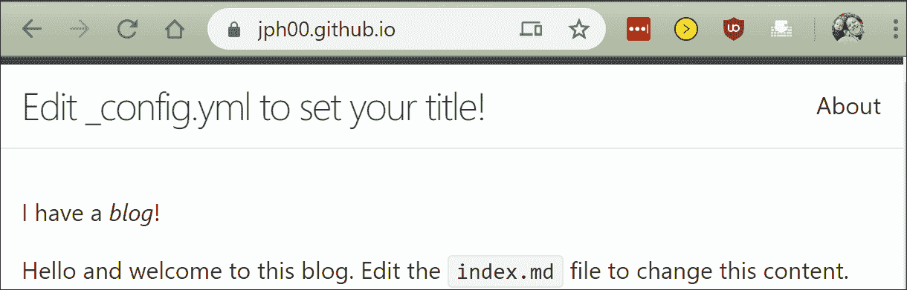

###### 图 A-6. 您的博客已上线！

## 创建文章

现在您已经准备好创建您的第一篇文章了。您所有的文章都将放在 *_posts* 文件夹中。现在点击它，然后点击“创建文件”按钮。您需要小心使用格式 *<year>-<month>-<day>-<name>.md* 命名您的文件，就像 图 A-7 中所示，其中 *<year>* 是一个四位数，*<month>* 和 *<day>* 是两位数。*<name>* 可以是任何您想要的，可以帮助您记住这篇文章是关于什么的。*.md* 扩展名是用于 Markdown 文档的。


###### 图 A-7. 命名您的文章

然后，您可以输入第一篇文章的内容。唯一的规则是您的文章的第一行必须是一个 Markdown 标题。这是通过在行的开头放置 `#` 创建的，如 图 A-8 中所示（这将创建一个一级标题，在文档开头只需使用一次；您可以使用 `##` 创建二级标题，使用 `###` 创建三级标题，依此类推）。

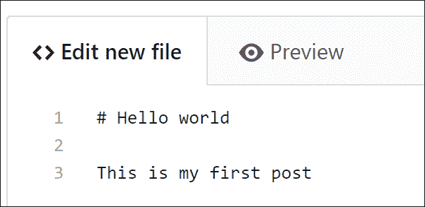

###### 图 A-8. 标题的 Markdown 语法

和之前一样，你可以点击预览按钮查看你的 Markdown 格式会是什么样子（图 A-9）。

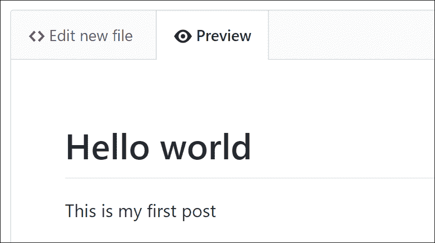

###### 图 A-9\. 之前的 Markdown 语法在你的博客上会是什么样子

你需要点击“提交新文件”按钮将其保存到 GitHub，如图 A-10 所示。

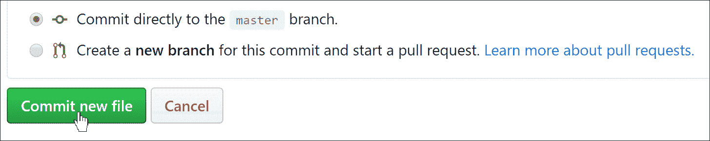

###### 图 A-10\. 提交更改以保存它们

再次查看你的博客首页，你会看到这篇文章现在已经出现了——图 A-11 展示了我们刚刚添加的示例文章的结果。请记住，你需要等待一分钟左右让 GitHub 处理请求，然后文件才会显示出来。


###### 图 A-11\. 你的第一篇文章已发布！

你可能已经注意到我们提供了一个示例博客文章，你现在可以继续删除。像之前一样，转到你的*_posts*文件夹，点击*2020-01-14-welcome.md*。然后点击最右边的垃圾桶图标，如图 A-12 所示。

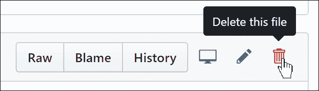

###### 图 A-12\. 删除示例博客文章

在 GitHub 中，直到你提交，什么都不会真正改变——包括删除文件！所以，在你点击垃圾桶图标后，滚动到页面底部并提交你的更改。

你可以通过添加一行 Markdown 来在你的帖子中包含图片，就像下面这样：

```py

```

为了使这个工作起效，你需要将图片放在你的*images*文件夹中。要做到这一点，点击*images*文件夹，然后点击“上传文件”按钮（图 A-13）。

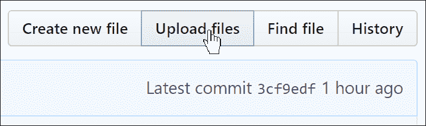

###### 图 A-13\. 从你的计算机上传文件

现在让我们看看如何直接从你的计算机上完成所有这些操作。

## 同步 GitHub 和你的计算机

有很多原因你可能想要将你的博客内容从 GitHub 复制到你的计算机上——你可能想要能够离线阅读或编辑你的帖子，或者也许你想要备份以防发生什么事情影响了你的 GitHub 存储库。

GitHub 不仅让你将存储库复制到你的计算机上；它还让你*同步*它与你的计算机。这意味着你可以在 GitHub 上进行更改，它们会复制到你的计算机上；你也可以在你的计算机上进行更改，它们会复制到 GitHub 上。你甚至可以让其他人访问和修改你的博客，他们的更改和你的更改将在下次同步时自动合并。

为了使这个工作起效，你需要在你的计算机上安装一个叫做[GitHub 桌面](https://desktop.github.com)的应用程序。它可以在 Mac、Windows 和 Linux 上运行。按照安装说明进行安装，当你运行它时，它会要求你登录 GitHub 并选择要同步的存储库。点击“从互联网克隆存储库”，如图 A-14 所示。

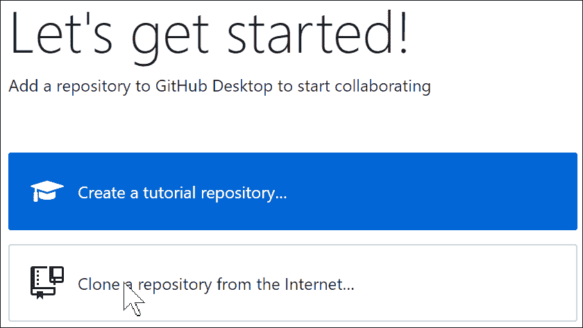

###### 图 A-14\. 在 GitHub 桌面上克隆你的存储库

一旦 GitHub 完成同步你的存储库，你就可以点击“在资源管理器中查看存储库文件”（或 Finder），如图 A-15 所示，你将看到你博客的本地副本！尝试在你的计算机上编辑其中一个文件。然后返回到 GitHub 桌面，你会看到同步按钮等待你按下。当你点击它时，你的更改将被复制到 GitHub，你将在网站上看到它们的反映。

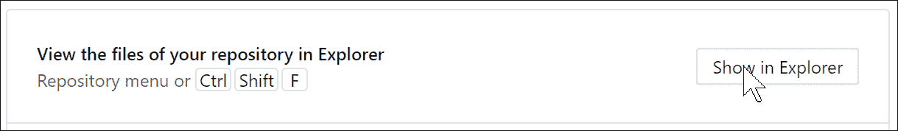

###### 图 A-15\. 本地查看你的文件

如果你以前没有使用过`git`，GitHub 桌面是一个很好的开始方式。正如你将会发现的，它是大多数数据科学家使用的基本工具。我们希望你现在也喜欢的另一个工具是 Jupyter Notebook——你也可以直接用它来写博客！

# 博客的 Jupyter

您还可以使用 Jupyter 笔记本撰写博客文章。您的 Markdown 单元格、代码单元格和所有输出都将出现在您导出的博客文章中。在您阅读本书时，最佳方法可能已经发生了变化，因此请查看[书籍网站](https://book.fast.ai)获取最新信息。截至目前，从笔记本创建博客的最简单方法是使用[`fastpages`](http://fastpages.fast.ai)，这是`fast_template`的更高级版本。

要使用笔记本撰写博客，只需将其放入您的博客存储库中的*_notebooks*文件夹中，它将出现在您的博客文章列表中。在撰写笔记本时，写下您希望观众看到的内容。由于大多数写作平台很难包含代码和输出，因此我们许多人习惯于包含比应该更少的真实示例。这是一个很好的方法，可以养成在写作时包含大量示例的习惯。

通常，您会希望隐藏导入语句等样板代码。您可以在任何单元格顶部添加`#hide`，使其不显示在输出中。Jupyter 显示单元格的最后一行的结果，因此不需要包含`print`。（包含不需要的额外代码会增加读者的认知负担；因此不要包含您实际不需要的代码！）
