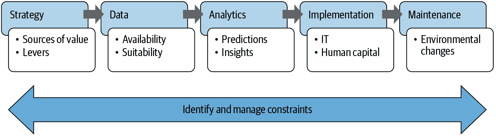
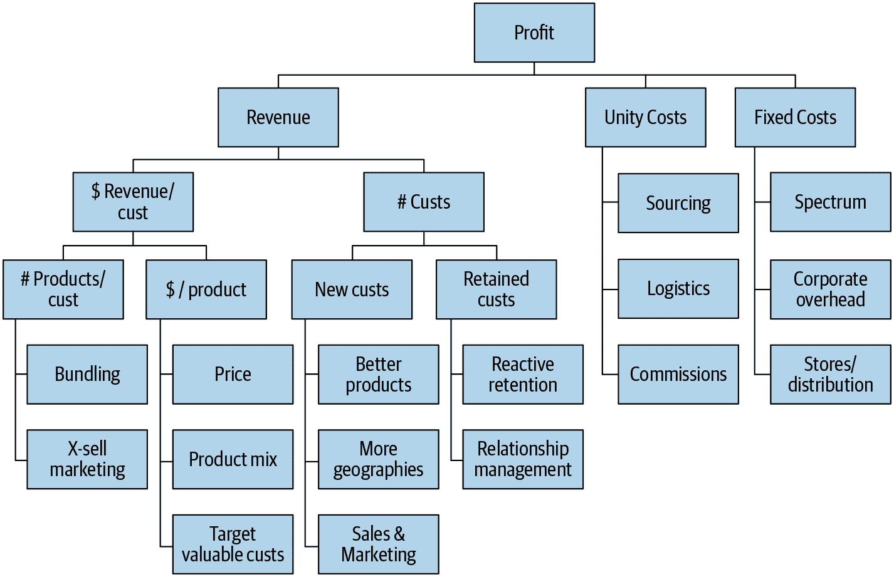

# 附录 B. 数据项目清单

> 原文：<https://www.bookstack.cn/read/th-fastai-book/b8ffc03c29b9fdcd.md>

创建有用的数据项目远不止培训准确的模型！当 Jeremy 做咨询时，他总是试图了解组织开发数据项目的背景，基于以下考虑，总结在图 B-1 中：

战略

组织试图做什么（*目标*），以及如何更好地做到（*杠杆*）？

数据

组织是否捕获必要的数据并使其可用？

分析

组织需要哪些见解？

实施

组织有哪些能力？

维护

有哪些系统用于跟踪运营环境的变化？

约束

在前述各个领域中需要考虑哪些约束条件？

###### 图 B-1. 分析价值链

他开发了一个问卷，让客户在项目开始之前填写，然后在整个项目过程中，他会帮助他们完善答案。这份问卷基于数十年来在许多行业中进行的项目，包括农业、采矿、银行、啤酒酿造、电信、零售等。

在我们深入分析价值链之前，问卷的第一部分涉及数据项目中最重要的员工：数据科学家。

# 数据科学家

数据科学家应该有明确的晋升路径，同时应该有招聘计划，直接将数据专家引入高级管理职位。在一个数据驱动的组织中，数据科学家应该是薪酬最高的员工之一。应该建立系统，让整个组织的数据科学家合作并互相学习。

+   组织目前拥有哪些数据科学技能？

+   数据科学家是如何招聘的？

+   如何在组织内部识别具有数据科学技能的人？

+   正在寻找哪些技能？如何评判这些技能？这些技能是如何被选定为重要的？

+   正在使用哪种数据科学咨询？在哪些情况下数据科学被外包？这项工作如何转移到组织中？

+   数据科学家的薪酬是多少？他们向谁汇报？他们的技能如何保持更新？

+   数据科学家的职业发展路径是什么？

+   有多少高管具有较强的数据分析专业知识？

+   数据科学家的工作是如何选择和分配的？

+   数据科学家有哪些软件和硬件可以访问？

# 战略

所有数据项目都应基于解决战略重要的问题。因此，首先必须先了解业务战略。

+   组织今天最重要的五个战略问题是什么？

+   有哪些数据可用于帮助解决这些问题？

+   这些问题是否采用数据驱动方法？数据科学家是否在处理这些问题？

+   组织可以最大程度影响哪些利润驱动因素？（见图 B-2。）

###### 图 B-2. 组织中可能是重要利润驱动因素的因素

+   对于确定的每个关键利润驱动因素，组织可以采取哪些具体行动和决策来影响该驱动因素，包括运营行动（例如，致电客户）和战略决策（例如，发布新产品）？

+   对于最重要的行动和决策，可能有哪些数据可用（无论是组织内部的，还是来自供应商，或者未来可能收集的数据），可以帮助优化结果？

+   根据前述分析，组织内哪些是数据驱动分析的最大机会？

+   对于每个机会：

    +   它旨在影响哪个价值驱动因素？

    +   它将推动哪些具体行动或决策？

    +   这些行动和决策将如何与项目结果联系起来？

    +   项目的预期投资回报率是多少？

    +   有哪些时间限制和截止日期可能会对此产生影响？

# 数据

没有数据，我们无法训练模型！数据还需要是可用的、集成的和可验证的。

+   组织有哪些数据平台？这些可能包括数据仓库、OLAP 立方体、数据仓库、Hadoop 集群、OLTP 系统、部门电子表格等。

+   提供已收集的任何提供组织数据可用性概述的信息，以及当前工作和未来建立数据平台的计划。

+   有哪些工具和流程可用于在系统和格式之间移动数据？

+   数据来源如何被不同用户和管理员访问？

+   组织的数据科学家和系统管理员可以使用哪些数据访问工具（例如数据库客户端、OLAP 客户端、内部软件、SAS）？每种工具有多少人使用，他们在组织中的职位是什么？

+   用户如何被告知新系统、系统变更、新的和变更的数据元素等信息？提供例子。

+   关于数据访问限制，如何做出决策？如何管理访问受限数据的请求？由谁管理？基于什么标准？平均响应时间是多长？有多少请求被接受？如何跟踪？

+   组织如何决定何时收集额外数据或购买外部数据？提供例子。

+   到目前为止，用于分析最近数据驱动项目的数据是什么？发现什么是最有用的？什么是无用的？这是如何评判的？

+   提供哪些额外的内部数据可能为拟议项目的数据驱动决策提供有用的见解？外部数据呢？

+   访问或整合这些数据可能存在哪些潜在的约束或挑战？

+   在过去两年中，数据收集、编码、集成等方面发生了哪些变化，可能会影响到收集到的数据的解释或可用性？

# 分析

数据科学家需要能够访问适合其特定需求的最新工具。应定期评估新工具，看它们是否比当前方法有显著改进。

+   组织使用哪些分析工具？由谁使用？它们是如何选择、配置和维护的？

+   如何在客户机器上设置额外的分析工具？完成这个过程的平均时间是多久？有多少请求被接受？

+   外部顾问建立的分析系统是如何转移到组织中的？是否要求外部承包商限制使用的系统，以确保结果符合内部基础设施？

+   在什么情况下使用了云处理？使用云的计划是什么？

+   在什么情况下使用外部专家进行专业分析？这是如何管理的？专家是如何被识别和选择的？

+   最近项目尝试过哪些分析工具？

+   什么有效，什么无效？为什么？

+   提供迄今为止为这些项目所做工作的任何输出。

+   这项分析的结果如何评判？使用了哪些指标？与哪些基准进行比较？如何知道一个模型是否“足够好”？

+   在什么情况下，组织使用可视化，而不是表格报告，而不是预测建模（以及类似的机器学习工具）？对于更高级的建模方法，模型是如何校准和测试的？提供例子。

# 实施

IT 约束往往是数据项目的失败原因。要提前考虑！

+   提供一些过去数据驱动项目的成功和失败实施的例子，并提供有关 IT 集成和人力资本挑战的详细信息，以及如何应对这些挑战。

+   在实施之前，如何确认分析模型的有效性？它们是如何进行基准测试的？

+   如何定义分析项目实施的性能要求（速度和准确性方面）？

+   对于拟议的项目，提供以下信息：

    +   用于支持数据驱动决策和行动的 IT 系统是什么

    +   这种 IT 集成将如何完成

    +   有哪些可用的替代方案可能需要较少的 IT 集成

    +   哪些工作将受到数据驱动方法的影响

    +   这些员工将如何接受培训、监督和支持

    +   可能出现的实施挑战是什么

    +   哪些利益相关者将需要确保实施成功，以及他们可能如何看待这些项目及其潜在影响

# 维护

除非仔细跟踪模型，否则可能会发现它们导致灾难。

+   第三方构建的分析系统如何维护？何时将其转移到内部团队？

+   如何跟踪模型的有效性？组织何时决定重建模型？

+   数据变更如何在内部传达，以及如何管理？

+   数据科学家如何与软件工程师合作，以确保算法正确实施？

+   测试用例是何时开发的，如何维护？

+   何时对代码进行重构？在重构过程中如何维护和验证模型的正确性和性能？

+   维护和支持需求如何记录？这些日志如何使用？

# 约束

对于每个正在考虑的项目，列举可能影响项目成功的潜在约束。

+   IT 系统是否需要修改或开发以使用项目的结果？是否有可以避免重大 IT 变更的更简单的实现方式？如果有，使用简化实现方式将如何显著减少影响？

+   数据收集、分析或实施上存在哪些监管约束？最近是否已经审查了相关立法和先例？可能存在哪些变通方法？

+   存在哪些组织约束，包括文化、技能或结构？

+   存在哪些管理约束？

+   是否有过去的分析项目可能会影响组织对数据驱动方法的看法？
