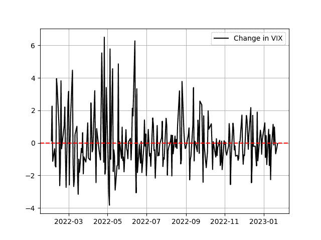

# 第一章：介绍数据科学和交易

开始学习复杂主题的最佳方法是逐渐建立动力，直到你开始完成拼图。了解金融深度学习需要对基本和中级数据科学主题以及金融市场及其结构有一定的了解。

本章为深入了解数据科学及其用途以及金融市场以及如何从数据科学中受益的构建基础。

在本章结束时，你应该知道数据科学是什么，它的应用是什么，以及你如何在金融领域中利用它来提取价值。

# 理解数据

在理解数据科学领域之前，首先要了解数据的类型和结构是不可能的。毕竟，这个庞大领域的名称中的第一个词就是“数据”。那么数据是什么？更重要的是，你可以用它做什么？

*数据*在其最简单和最纯粹的形式中是一组原始信息，可以是任何类型（数值、文本、布尔等）。

收集数据的最终目的是决策。这是通过一个复杂的过程来完成的，从收集和处理数据到解释数据并使用结果做出决策。

让我们举一个使用数据做决策的例子。假设你有一个由五种不同等权重的股息支付股票组成的投资组合，如表 1-1 所示。

表 1-1。股息表

| 股票 | 股息率 |
| --- | --- |
| A | 5.20% |
| B | 3.99% |
| C | 4.12% |
| D | 6.94% |
| E | 5.55% |

###### 注意

*股息*是公司利润向股东支付的款项。*股息率*是以货币单位分配的金额除以公司当前股价。

分析这些数据可以帮助你了解你的投资组合平均股息率。平均值基本上是总和除以数量，它快速展示了投资组合的整体股息率：

<math alttext="upper A v e r a g e d i v i d e n d y i e l d equals StartFraction 5.20 percent-sign plus 3.99 percent-sign plus 4.12 percent-sign plus 6.94 percent-sign plus 5.55 percent-sign Over 5 EndFraction equals 5.16 percent-sign"><mrow><mi>A</mi> <mi>v</mi> <mi>e</mi> <mi>r</mi> <mi>a</mi> <mi>g</mi> <mi>e</mi> <mi>d</mi> <mi>i</mi> <mi>v</mi> <mi>i</mi> <mi>d</mi> <mi>e</mi> <mi>n</mi> <mi>d</mi> <mi>y</mi> <mi>i</mi> <mi>e</mi> <mi>l</mi> <mi>d</mi> <mo>=</mo> <mfrac><mrow><mn>5</mn><mo>.</mo><mn>20</mn><mo>%</mo><mo>+</mo><mn>3</mn><mo>.</mo><mn>99</mn><mo>%</mo><mo>+</mo><mn>4</mn><mo>.</mo><mn>12</mn><mo>%</mo><mo>+</mo><mn>6</mn><mo>.</mo><mn>94</mn><mo>%</mo><mo>+</mo><mn>5</mn><mo>.</mo><mn>55</mn><mo>%</mo></mrow> <mn>5</mn></mfrac> <mo>=</mo> <mn>5</mn> <mo>.</mo> <mn>16</mn> <mo>%</mo></mrow></math>

因此，你的投资组合的平均股息率为 5.16%。这些信息可以帮助你将你的平均股息率与其他投资组合进行比较，以便知道是否需要进行任何调整。

你可以计算的另一个指标是投资组合中持有的股票数量。这可能是构建分散化墙的第一个信息砖块。尽管这两个信息（平均股息率和投资组合中的股票数量）非常简单，但复杂的数据分析始于简单的指标，有时可能不需要复杂的模型来正确解释正在发生的事件。

你在前面例子中计算的两个指标被称为*平均值*（或均值）和*计数*（或元素数量）。它们也是一个称为*描述性统计*的领域的一部分，这也是数据科学的一部分。

让我们再举一个数据分析的推断性目的的例子。假设你已经计算出两个货币对之间的年度相关性度量，并且你想预测下一个年度的相关性是正面还是负面。表 1-2 中有计算的详细信息。

表 1-2。相关性表

| 年 | 相关性 |
| --- | --- |
| 2015 | 正面 |
| 2016 | 正面 |
| 2017 | 正面 |
| 2018 | 负面 |
| 2019 | 正面 |
| 2020 | 正面 |
| 2021 | 正面 |
| 2022 | 正面 |
| 2023 | 正面 |

###### 注意

*相关性*是两个时间序列之间线性依赖的度量。*正相关*通常意味着两个时间序列平均朝着相同方向移动，而*负相关*通常意味着两个时间序列平均朝着相反方向移动。

从表 1-2 可以看出，这两种货币对之间的历史相关性大多数情况下是正相关的，占大约 88%的时间。考虑到历史观察，您可以说下一个相关性测量值为正的概率为 88%。这也意味着下一个相关性测量值为负的概率为 12%：

<math alttext="upper E left-parenthesis upper P o s i t i v e c o r r e l a t i o n right-parenthesis equals eight-ninths equals 88.88 percent-sign"><mrow><mi>E</mi> <mrow><mo>(</mo> <mi>P</mi> <mi>o</mi> <mi>s</mi> <mi>i</mi> <mi>t</mi> <mi>i</mi> <mi>v</mi> <mi>e</mi> <mi>c</mi> <mi>o</mi> <mi>r</mi> <mi>r</mi> <mi>e</mi> <mi>l</mi> <mi>a</mi> <mi>t</mi> <mi>i</mi> <mi>o</mi> <mi>n</mi> <mo>)</mo></mrow> <mo>=</mo> <mfrac><mn>8</mn> <mn>9</mn></mfrac> <mo>=</mo> <mn>88</mn> <mo>.</mo> <mn>88</mn> <mo>%</mo></mrow></math>

这是另一个简单的例子，说明如何使用数据推断观察结果并做出决策。当然，这里的假设是历史结果确切地反映未来结果，这在现实生活中是不太可能的，但偶尔，为了预测未来，您所拥有的只有过去。

现在，在讨论数据科学之前，让我们回顾一下可能存在的数据类型，并将它们分成不同的组。

*数值数据*

这种类型的数据由反映在定期或不定期间隔内收集的某种类型信息的数字组成。示例可以包括市场数据（OHLC¹，成交量，价差等）和财务报表数据（资产，收入，成本等）。

*分类数据*

可以使用名称或标签将数据组织成组或类别的数据。它是定性的而不是定量的。例如，患者的血型是一种分类数据类型。

*文本数据*

随着*自然语言处理*（NLP）的发展，文本数据在最近几年中不断增长。机器学习模型使用文本数据来翻译、解释和分析文本的情感。此外，您甚至可以使用这些模型创建一个输出结构化段落的算法。

视觉数据

图像和视频也被视为数据，您可以处理和转换它们为有价值的信息。例如，*卷积神经网络*（CNN）是一种可以通过标签识别和分类照片的算法（例如，将猫照片标记为猫）。

音频数据

音频数据非常有价值，可以帮助节省转录时间。例如，您可以在音频上使用算法创建字幕和自动字幕。您还可以创建模型，通过说话者的语调和音量来解释说话者的情感。

在处理 Python 时，您可能会遇到以下数据：

整数

这些是整数，可以是正数或负数。例如，−8 和 745。但是，它们的范围限制在−2147483648 和 2147483647 之间。

浮点数

这些是带有小数点的实数，例如 18.54 和 311.52。

字符串

这些是存储在变量中的单词。更科学地说，它们是一组结构化字符（文本）。在 Python 中，您可以在单引号或双引号之间编写字符串。

布尔值

这些是用来评估条件的真假陈述。

*数据科学*是一门跨学科领域，试图使用不同的技术和模型从数据中提取智能和结论，无论是简单还是复杂。数据科学的过程除了分析数据之外还包括许多阶段。以下总结了数据科学的不同阶段：

1.  *数据收集*：这个过程涉及从可靠和准确的来源获取数据。计算机科学中广为人知的一句话通常归功于乔治·弗舍尔，如下所示：“*垃圾进，垃圾出*”，这概括了需要有可靠的数据进行正确分析的必要性。基本上，如果您有不准确或有缺陷的数据，那么您的所有过程都将无效，这将是浪费时间。

1.  *数据预处理*：有时，当您获取数据时，它可能是原始形式，需要在数据分析步骤中为数据科学模型做准备。例如，删除一些不必要的数据，处理缺失数据，或消除无效和重复数据都是预处理阶段的一部分。其他更复杂的例子可能包括数据的*归一化*和*去噪*。这一步的目的是为了让数据准备好进行分析。

1.  *数据探索*：这是数据分析的第一步，是基本的统计探索，以找到趋势和不同属性，以便您对预期行为有初步了解。一个例子是检查数据的平稳性，这是本书中详细讨论的概念。

1.  *数据可视化*：这是前一步骤的重要补充。它包括创建直方图和热图等可视化，以帮助识别模式和趋势，并使解释更容易。

1.  *数据分析*：这是期待已久的步骤，基本上是数据科学过程的主要焦点。这是您使用不同的学习模型来*拟合*数据，以便它们根据给定参数解释和预测未来结果的地方。

1.  *数据解释*：这个阶段涉及模型完成工作后的反馈和结论。*优化*也可能是这个阶段的一部分，然后循环回到第 5 阶段，以便在解释之前再次运行具有更新参数的模型，并评估性能。

###### 注意

总结前面的观点，数据科学包括许多步骤，从获取数据开始，通过解释和优化预测数据未来值的模型。

让我们以 Python 中的一个简单示例来应用前面六个步骤中讨论的数据科学过程。假设您想分析和预测 VIX，这是芝加哥期权交易所每日发布的波动率时间序列指标。

###### 注意

我称之为*零步骤*的隐藏步骤，这是整个过程的思想和直觉。如果没有首先有动机，您就不会应用这个过程。例如，相信通货膨胀数字可能推动某些大宗商品的回报是一个开始探索数据以寻找证明这一假设的真实数字的想法和动机。

第一步是数据收集，在这种情况下可以使用 Python 自动化。下一个代码块连接到圣路易斯联邦储备银行的网站，并下载 1990 年 1 月至 2023 年 1 月之间的 VIX 历史数据。

###### 注意

*VIX*代表*波动率指数*，它代表标准普尔 500 指数的隐含波动率。自 1993 年以来一直可用，由芝加哥期权交易所（CBOE）发行。

由于它旨在衡量股市中的恐惧或不确定性水平，VIX 经常被称为*恐惧指数*。该指数是一个百分比，是通过对标准普尔 500 指数期权的定价计算得出的。较高的 VIX 值与更大的市场动荡和不确定性相关，而较低的值与平均更大的稳定性相关。

请注意，第三章完全致力于介绍 Python 并利用其功能。目前，您不必理解代码，因为这还不是学习成果：

```py
`# Importing the required library`
import pandas_datareader as pdr

`# Setting the beginning and end of the historical data`
start_date = '1990-01-01'
end_date   = '2023-01-23'

`# Creating a dataframe and downloading the VIX data using its code name and its source`
vix = pdr.DataReader('VIXCLS', 'fred', start_date, end_date)

`# Printing the latest five observations of the dataframe`
print(vix.tail())

```

该代码使用`pandas`库导入`DataReader`函数，该函数从各种来源（如 Yfinance 和 Fred）在线获取历史数据。`DataReader`函数以数据名称作为第一个参数，然后是来源和日期。`print(vix.tail())`的输出显示在表 1-3 中：

表 1-3。代码输出

| 日期          VIXCLS   |
| --- |
| 2023-01-17   19.36 |
| 2023-01-18   20.34 |
| 2023-01-19   20.52 |
| 2023-01-20   19.85 |
| 2023-01-23   19.81 |

让我们继续第二步：数据预处理。我将这部分分为检查无效数据和转换数据，使其准备好使用。在处理时间序列时，特别是下载的时间序列时，有时可能会遇到 NaN 值，这些值不是数字，因为其相应单元格中没有适当的输入。

###### 注意

*NaN*代表*不是数字*，它是由于缺失、无效或损坏的数据而发生的。

您可以以许多方式处理 NaN 值。为了本例，让我们看看处理这些无效值的最简单方法，即消除它们。但首先，让我们编写一个简单的代码，输出数据框中 NaN 值的数量，以便您了解要删除多少值：

```py
`# Importing the required library`
import pandas as pd

`# Checking if there are NaN values in the VIX dataframe previously imported`
count_nan = vix['VIXCLS'].isnull().sum()

`# Printing the result`
print('Number of NaN values in the VIX dataframe: ' + str(count_nan))

```

该代码使用`isnull()`方法并对其得到的数字求和，从而得出 NaN 值的数量。前面代码片段的输出如下：

```py
Number of NaN values in the VIX dataframe: 292

```

现在您知道要删除多少行，您可以使用以下代码删除 NaN 行，从而清理数据框中的任何无效输入：

```py
# Dropping the NaN values from the rows
vix = vix.dropna()

```

第二步的第二部分是转换数据。数据科学模型通常喜欢*平稳*数据，即具有稳定统计特性（如均值和标准差）的数据。

###### 注意

*平稳性*的概念和所需的统计指标在第二章中有详细讨论。现在，您需要知道的是，在使用数据科学模型时，您可能需要将原始数据转换为平稳数据。

要将 VIX 数据转换为平稳数据，您可以简单地取相对于前一个值的差异。这类似于将价格数据转换为收益数据。以下代码片段将之前定义的 VIX 数据框转换为理论上暗示的平稳数据：

```py
`# Taking the differences in an attempt to make the data stationary`
vix = vix.diff(periods = 1, axis = 0)

`# Dropping the first value of the data frame`
vix = vix.iloc[1: , :]

```

第三步是数据探索，这完全是关于理解您面前的数据，从统计学角度来说。由于您将在下一章节中详细了解统计指标，我将限制讨论仅计算数据集的均值。

*均值*就是如果数据集中的值要选举一位领袖，那么可以代表其他值的值。它是值的总和除以它们的数量。均值是描述性统计世界中最简单的统计量，也是最常用的统计量。以下公式显示了一组值的均值的数学表示：

<math alttext="x overbar equals StartFraction 1 Over n EndFraction sigma-summation Underscript i equals 1 Overscript i Endscripts x Subscript i"><mrow><mover><mi>x</mi> <mo>¯</mo></mover> <mo>=</mo> <mfrac><mn>1</mn> <mi>n</mi></mfrac> <msubsup><mo>∑</mo> <mrow><mi>i</mi><mo>=</mo><mn>1</mn></mrow> <mi>i</mi></msubsup> <msub><mi>x</mi> <mi>i</mi></msub></mrow></math>

使用`pandas`，您可以轻松计算数据集的均值如下：

```py
`# Calculating the mean of the dataset`
mean = vix["VIXCLS"].mean()

`# Printing the result`
print('The mean of the dataset = ' + str(mean))

```

前面代码片段的输出如下：

```py
The mean of the dataset = 0.0003
```

下一步是数据可视化，这在大多数情况下被认为是有趣的步骤。让我们通过时间绘制 VIX 的差异值。以下代码片段绘制了图 1-1 中显示的 VIX 数据：

```py
`# Importing the required library`
import matplotlib.pyplot as plt

`# Plotting the latest 250 observations in black with a label`
plt.plot(vix[-250:], color = 'black', linewidth = 1.5, label = 'Change in VIX')

`# Plotting a red dashed horizontal line that is equal to the calculated mean`
plt.axhline(y = mean, color = 'red', linestyle = 'dashed')

`# Calling a grid to facilitate the visual component`
plt.grid()

`# Calling the legend function so it appears with the chart`
plt.legend()

`# If you are using a terminal or a script, you might want to add plt.show()`
```



###### 图 1-1。自 2022 年初以来 VIX 的变化

第 5 步和第 6 步，数据分析和数据解释，是您将在本书中深入研究的内容，所以让我们暂时跳过它们，集中在数据科学的介绍部分上。

在继续之前，让我们回到无效或缺失数据的问题。有时，数据是不完整的，有缺失的单元格。尽管这可能会影响算法的预测能力，但不应该阻止您继续分析，因为有快速修复方法可以帮助减轻空单元格的负面影响。例如，考虑表 1-4：

表 1-4。季度 GDP

| 季度 | GDP  |
| --- | --- |
| Q1 2020 | 0.9% |
| Q2 2020 | 1.2% |
| Q3 2020 | 0.5% |
| Q4 2020 | 0.4% |
| Q1 2021 | **#N/A** |
| Q2 2021 | 1.0% |
| Q3 2021 | 1.1% |
| Q4 2021 | 0.6% |

表格包含了一个假想国家的季度国内生产总值（GDP）。请注意表格中缺少了 2021 年 Q1 的数值。有三种基本方法可以解决这个问题：

+   *删除包含缺失值的单元格：*这是在数据科学过程的先前示例中使用的技术。它简单地认为时间戳不存在。这是最简单的修复方法。 

+   *假设缺失单元格等于前一个单元格：*这种技术假设当前缺失值等于其之前的值。这也是一个简单的修复方法，旨在平滑数据而不是完全忽略问题。

+   *计算空值周围单元格的平均值或中位数：* 这种技术将平滑推进一步，假设缺失值等于前一个值和后一个值之间的平均值。

数据科学涵盖了一系列数学和统计概念。它需要对机器学习算法有深入的了解，比如决策树、随机森林和神经网络。这些概念被详细讨论，但也以易于理解的方式呈现，以便技术和非技术读者都能从直觉中受益。许多模型被认为是黑匣子，这其中有一些真相，但数据科学家的工作是首先理解模型，然后解释其结果。这有助于理解这些模型的局限性。

本书使用 Python 作为创建算法的首选编程语言。正如前面提到的，第三章介绍了 Python 以及必要的知识，以了解如何操作和分析数据，同时提供了创建不同模型的基础，这些模型比您想象的要简单。

在继续下一节之前，让我们看看数据存储的概念。毕竟，数据很有价值，但您需要将其存储在一个容易获取和分析的地方。

*数据存储*指的是用于将数据存储和组织起来以供将来分析的技术和领域。数据以许多格式存储，其中包括常见的格式如 CSV 和 XLSX 文件。其他类型的格式可能包括 XML、JSON，甚至是图片的 JPG 格式。格式的选择取决于数据的结构和组织。

数据也可以存储在云端或本地，具体取决于存储容量和成本。例如，您可能希望选择将历史 1 分钟的苹果股票数据存储在云端，以节省本地计算机上的空间，而不是将其保存在 CSV 文件中。

在 Python 中处理时间序列时，您主要会处理两种类型的数据存储：数组和数据框。让我们看看它们是什么：

*数组*

数组用于存储相同类型的元素。通常，最好将同质数据集（如数字）存储在数组中。当您进行无需时间戳的回测时，就会发生这种情况。在 Python 中处理数组的最常用库是`numpy`。

数据框

*数据框*是一个可以容纳各种类型数据（如浮点数、字符串等）的二维数据结构。它可以类比为具有列和行的表格。当您进行需要时间戳及其相应值的回测时，就会发生这种情况。在 Python 中处理数据框的最常用库是`pandas`。

总的来说，当需要高效存储同质数据集时，应使用数组。当处理异构数据或需要以表格方式编辑和分析数据时，应使用数据框。

###### 注意

数据科学不断发展。新的存储方法正在不断发展，以使其更高效，提高容量和速度。

# 理解数据科学

数据科学已迅速成为技术和进步中不可或缺的一部分。算法依赖于数据科学工具提供的信息来执行其任务。但算法是什么呢？

*算法*是一组有序的程序，旨在完成某项活动或解决特定问题。算法可以简单到抛硬币，也可以复杂到 Risch 算法。

让我们来看一个非常简单的算法，更新图表平台所需的财务数据：

1.  连接服务器和在线数据提供商。

1.  复制带有最新时间戳的财务数据。

1.  将数据粘贴到图表平台。

1.  回到第一步，重新执行整个过程。

这就是算法的本质：执行一组有限或无限目标的指令。

###### 注意

您在上一节看到的六个数据科学阶段也可以被视为一种算法。

交易策略也是算法，因为它们有明确的规则来启动和清算头寸。一个交易策略的例子是市场套利。

*套利*是一种旨在从不同交易所报价的同一资产的价格差异中获利的交易策略。这些价格差异是套利者通过他们的买卖活动消除的异常。考虑一只股票在不同国家的交易所 A 和交易所 B 上交易（为简单起见，这两个国家使用相同的货币）。自然地，股票必须在两个交易所上以相同的价格交易。当这个条件不成立时，套利者就会从他们的巢穴中出来狩猎。

他们在便宜的交易所买入股票，立即在更昂贵的交易所卖出，从而确保几乎无风险的利润。这些操作速度极快，因为差异不会持续很长时间，这是由于套利者的强大力量和速度。这里有一个明显的例子：

+   交易所 A 的股票价格= $10.00

+   交易所 B 的股票价格= $10.50

在这种情况下，套利者的算法将执行以下操作：

1.  在交易所 A 以$10.00 买入股票。

1.  在交易所 B 立即以$10.50 卖出股票。

1.  把差额（$0.50）放进口袋，直到差距被消除。

###### 注意

交易和执行算法可能非常复杂，需要专业知识和一定的市场优势。

到目前为止，您应该了解数据科学的主要用途：数据解释和预测：

数据解释

也常被称为*商业智能*或简单的*数据智能*。部署算法的目的是了解数据的内容和方式。

数据预测

也常被称为*预测分析*或简单的*预测*。部署算法的目的是了解数据的下一步。

在金融市场中使用学习算法的主要目的主要是为了预测数据，以便您可以做出明智的交易决策，以实现资本增值的成功率高于随机。这是通过我在本书中讨论的许多简单和复杂算法来实现的。这些学习算法或模型可以分类如下：

监督学习

*监督学习算法*是需要标记数据才能运行的模型。这意味着您必须提供数据，以便模型在这些过去的值上进行训练，并了解隐藏的模式，以便在遇到新数据时能够提供未来的输出。监督学习的例子包括*线性回归算法*和*自回归综合移动平均*（ARIMA）模型。更复杂的模型包括*支持向量回归算法*（SVR）和*神经网络*。将多个层添加到神经网络中将其转变为具有高分析复杂多层数据能力的深度学习模型。所有这些算法将在本书后面更深入地讨论。

无监督学习

无监督学习算法是不需要标记数据就能运行的模型。这意味着它们可以使用未标记的数据来完成工作，因为它们被设计为自行发现隐藏的模式。示例包括*聚类*算法和*主成分分析*（PCA）。

强化学习

强化学习算法是一种不需要任何数据的模型，因为它们会自行发现环境并从中学习。与监督和无监督学习模型相反，强化学习模型通过从环境获得的反馈来获取知识，通过奖励系统。由于这通常应用于代理与环境互动并学习采用随时间最大化奖励的行为的情况，它可能不是时间序列回归的首选算法。另一方面，它可以用于开发可应用于时间序列数据以创建预测的策略。

您可能已经注意到，本书的标题是*金融深度学习*。这意味着除了其他学习模型外，我将花费相当大的篇幅讨论深度学习模型，并使用它们编写交易策略。这也意味着本书的重点主要是讨论神经网络及其不同变体。

深度监督学习模型（如深度神经网络）可以学习数据的分层表示，因为它们包含许多层，每一层在不同抽象级别提取特征。因此，深度模型学习了深层次和复杂的模式，这可能是浅层模型难以学习的。

另一方面，浅层监督学习模型（如线性回归）在学习复杂的非线性关系方面能力有限。但是，它们需要较少的计算工作量，因此速度更快。

数据科学算法如今几乎随处可见，不仅仅在金融领域。例如：

+   *商业分析*：使用数据分析优化定价、预测客户流失或改进营销举措。

+   *医疗保健*：通过深入分析患者数据来改善患者结果、寻找创新疗法或降低医疗成本。

+   *体育*：通过体育数据分析来提高团队表现、球员搜寻或投注。

+   *研究*：分析数据以支持科学研究、证明理论或获取新知识。

现在，当有人谈论数据科学应用时，了解数据科学家的工作内容会有所帮助。

数据科学家必须评估和理解复杂数据，以获取见解并为决策提供指导。这包括开发统计模型、应用机器学习技术和可视化数据等常见任务。他们支持数据驱动解决方案的实施，并向利益相关者通报结果。

另一方面，数据工程师负责构建和维护支持数据科学项目所需的基础设施和工具。这包括构建和执行数据管道、优化数据存储和检索、构建和维护大数据处理系统等任务。他们还与数据科学家密切合作，确保他们获取所需的研究数据。

换句话说，数据科学家更关注数据的解释和分析，而数据工程师更关注收集、存储和分析数据所需的工具和基础设施。

到目前为止，您应该已经了解了开始数据科学所需的一切。让我们介绍本书的第二个主要主题：金融市场。毕竟，本书旨在展示如何创建数据科学模型和算法，并将它们应用于金融数据，以从中提取预测价值。

# 金融市场和交易简介

本书的目的是以实践的方式应用不同的学习模型来创建不同的交易策略。因此，了解交易和金融市场运作方式至关重要。

*金融市场*是人们可以交易金融工具（如股票、债券和货币）的地方。买卖行为被称为*交易*。购买金融工具的主要目的之一是资本增值。买家相信该工具的价值大于其价格，因此买家购买股票（*多头*）并在他们认为当前价格等于当前价值时出售。相反，交易者也可以在工具价格下跌时赚钱。这个过程被称为*卖空*，在期货和外汇（FX）等某些市场中很常见。

卖空的过程包括从第三方借入金融工具，在市场上卖出，然后在价格下跌之后买回，并在市场价格将其归还给第三方。理想情况下，由于你预计工具的价格会下跌，你会以更便宜的价格买回（在价格下降后），并以市场价格将其归还给第三方，从而获得差价。

多头（买入）头寸示例

一名交易者预计微软的股价将在未来几个月内因技术法规的改善而上涨，从而增加收入。因此，他们以 250 美元的价格购买了一些股票，并计划以 500 美元的价格出售。因此，交易者是多头微软股票（也称为*看涨*）。

空头（卖出）头寸示例

一名交易者预计洛克希德·马丁的股价将在未来几天内下跌，因为技术策略发出了信号。因此，他们以 450 美元的价格卖空了一些股票，并计划以 410 美元的价格买回。因此，交易者是空头洛克希德·马丁股票（称为*看跌*）。

###### 注意

上涨趋势的市场被称为牛市。源自“牛”的词和其积极的本质，多头与乐观、狂喜和贪婪有关。另一方面，下跌趋势的市场被称为熊市。源自“熊”的词和其防御性的本质，空头与悲观、恐慌和恐惧有关。

金融工具可能以其原始（实物）形式或所谓的*现货*形式以及衍生品形式出现。*衍生品*是交易者用来以某种方式交易市场的产品。例如，*远期*或*期货*合同是一种衍生合同，买家锁定资产的价格以在以后的某个时间购买。

另一种衍生品是期权。*期权*是在未来以支付保费（期权价格）购买特定资产的权利但不是义务。当买家想购买基础股票时，他们行使他们的期权；否则，他们可以让期权到期。

交易活动也可能出于对冲目的而发生，因为它不仅仅限于投机。一个例子是法国主要航空公司 AirFrance 通过购买石油期货对其业务运营进行对冲。购买石油期货可以保护 AirFrance 免受可能损害其主要业务（航空）的石油价格上涨。使用燃料来驱动飞机的成本上升被期货收益抵消。这使航空公司可以专注于其主要业务。整个过程称为*对冲*。

让我们举个例子来让事情更清晰，比如一家航空公司预计在接下来的六个月内消耗一定数量的燃料，但他们担心这段时间内石油价格可能会上涨。为了防范这种价格风险，航空公司可以进入期货合同，在未来日期以固定价格购买石油。

如果在那段时间内石油价格上涨，航空公司仍然可以以较低的固定价格购买石油，这是在期货合同中约定的。另一方面，如果石油价格下跌，航空公司将被迫支付较高的固定价格，但较低的市场价格将抵消这一成本。

这样，航空公司可以减轻石油市场价格波动的风险，并稳定其燃油成本。这可以帮助航空公司更好地管理预算并预测未来的收入。

正如你所看到的，交易操作的目的是从中获得财务收益--它旨在通过锁定已知的石油价格来简单稳定其成本。

通常，根据其类型，金融工具被分为资产类别：

股票市场

股票市场是公司发行股票以筹集业务资金的交易场所（电子或实体）。当人们购买公司股票时，他们成为该公司的部分所有者，并根据公司政策有资格获得股息。根据股票类型的不同，他们还可以获得在董事会会议上投票的权利。

固定收益

政府和企业可以在固定收益市场借款。当一个人购买债券时，实际上是向借款人借钱，后者同意偿还贷款以及利息。根据借款人的信用状况和当前利率，债券的价值可能会增加或减少。

货币

外汇市场，也被称为货币市场，是人们可以购买和出售各种货币的地方。货币的价值可以根据多种变量增加或减少，包括经济、利率和国家的政治稳定性。

商品

农产品、黄金、石油和其他具有工业或其他用途的实物资产被称为*商品*。它们通常提供了一种从全球经济趋势中获利的方式，同时也是对抗通货膨胀的一种形式。

另类投资

在金融世界中，诸如房地产、私募股权和对冲基金等非传统投资被称为*另类资产类别*。这些另类资产类别有可能提供比传统资产更好的回报，并提供多样化的好处，但它们也往往不太流动，可能更难评估。重要的是要记住，每种资产类别都有独特的特点和不同程度的风险，因此投资者在投资这些资产之前应该做好功课。

金融市场允许企业和政府筹集他们运营所需的资金。它们还为投资者提供了赚取利润的机会，投机和投资于有趣的机会。交易活动为市场提供了流动性，使价格更有效率且成本更低。换句话说，市场越流动，交易成本就越低，因为订单数量使得在交易时对市场产生重大影响的可能性降低。但市场真正是如何运作的呢？是什么导致价格上涨和下跌？

*市场微观结构*是研究金融市场中证券交易的研究。它研究交易的运作方式以及交易员、投资者和市场制造商的行为。了解价格形成和影响交易成本的变量是市场微观结构研究的目的。

订单流向、流动性、市场有效性和价格发现只是市场微观结构研究涵盖的许多主题之一。此外，它还研究了各种交易技术，包括限价单、市价单和算法交易，如何影响市场动态。*流动性*可能是最重要的市场微观结构概念。它描述了资产可以在不实质性改变价格的情况下被买入或卖出的容易程度。流动性可能会因金融工具和时间而异。它可能会受到多种变量的影响，包括交易量和波动性。

此外，市场效率是市场微观结构研究的一个关键组成部分。该领域的研究表明，一些市场比其他市场更有效率，而内幕交易、价格操纵和信息不对称等因素可能会影响价格。市场效率在第四章中重新讨论，该章涉及技术分析，这是交易中的一个关键分析领域。

最后，我想讨论市场微观结构的另一个重要领域：*价格发现*。这指的是市场中用于设定价格的方法。价格可能会受到订单流向、做市商活动和各种交易方法的影响。

想象一下，你想要购买两只股票的大量股份：A 股和 B 股。A 股非常流动，而 B 股非常不流动。如果你想要在 A 股上执行买单，你很可能会以期望的市场价格得到填充，而且影响很小，如果有的话。然而，对于 B 股，你很可能会得到一个更糟糕的价格，因为没有足够的卖家愿意以你期望的买入价格出售，因此，随着你的订单增加需求，价格上涨以匹配卖家的价格，因此，你将以更高（更糟糕）的价格购买。这就是流动性对你交易的影响。

# 金融数据科学应用

让我们开始窥探金融数据科学的主要领域。每个领域都有其挑战和需要简单和复杂解决方案的问题。金融也不例外。近年来，数据科学在改善金融世界的应用上取得了巨大进步，从企业世界到市场世界。让我们讨论其中一些领域：

金融欺诈检测

可以使用数据科学模型来检查金融交易中的模式和异常，试图发现可能的欺诈行为。通过检查信用卡的交易数据来发现奇怪或可疑的支出模式，利用数据科学阻止金融欺诈的一种方法是发现异常或可疑的支出模式。这可能包括在短时间内进行多次小额购买，或者从同一商店频繁进行重大或频繁购买。基于这些数据，机器学习算法被训练来发现指向欺诈行为的异常。 

风险管理

为了检查金融数据并发现投资组合的潜在风险，可以应用数据科学方法。这可以帮助金融机构管理其风险敞口并做出更明智的决策。在金融风险管理中应用数据科学的一个例子是分析市场数据以预测股票价格和其他金融指标的变化。这可能涉及使用统计建模、机器学习和人工智能等方法分析大量历史数据，以发现可用于预测未来市场状况的模式和趋势。

信用评分

数据科学可用于检查金融数据和信用历史，预测个人或公司的信用价值，并做出贷款决策。利用财务数据，如收入和信用历史，来预测个人的信用价值是应用数据科学进行信用评分研究的一个例子。这可能涉及开发一个预测模型，该模型可以使用多个指标，如先前的信用表现、收入和工作历史，来评估一个人偿还贷款的可能性，使用统计建模和机器学习等技术。

自然语言处理(NLP)

为了做出更好的判断，自然语言处理(NLP)分析并从非结构化的金融数据中提取见解，例如新闻文章、报告和社交媒体帖子。NLP 的一个著名例子是利用文本的情感来提取可能源自市场参与者和专家意图和情感的交易机会。NLP 属于情感分析领域(借助机器学习)。

# 总结

数据科学每天都在不断发展，新的技术和模型不断出现，旨在改进对数据的解释。本章简要介绍了您需要了解的关于数据科学以及如何在金融领域中使用它的内容。

下一章介绍了在尝试理解数据科学模型时可能需要的统计学、概率论和数学知识。尽管本书的目的是通过 Python 呈现创建和应用不同模型的实践方法，但了解您正在处理的内容而不是盲目地将其应用于数据是有帮助的。

如果您需要 Python 的复习，请参阅第三章，这是一个基本介绍。它为书中接下来要讲的内容奠定了基础。您不需要成为 Python 大师来进行数据科学，但您必须理解代码及其引用的内容，尤其是如何调试和检测代码中的错误。

¹ OHLC 指的是市场数据的四个基本部分：开盘价、最高价、最低价和收盘价。

² 我之所以说是暗示的是因为必须通过统计检查来验证平稳性，您将在下一章中看到。目前，假设是对数据进行差分运算得到平稳时间序列。

³ Rish 算法是一种用于找到反导数的不定积分技术。
