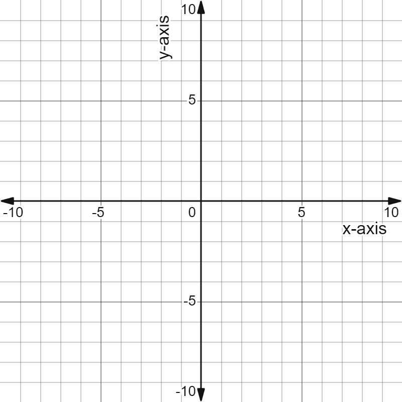
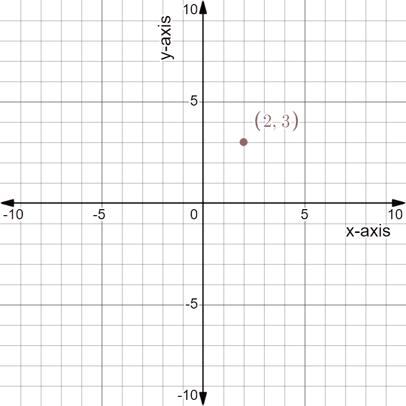
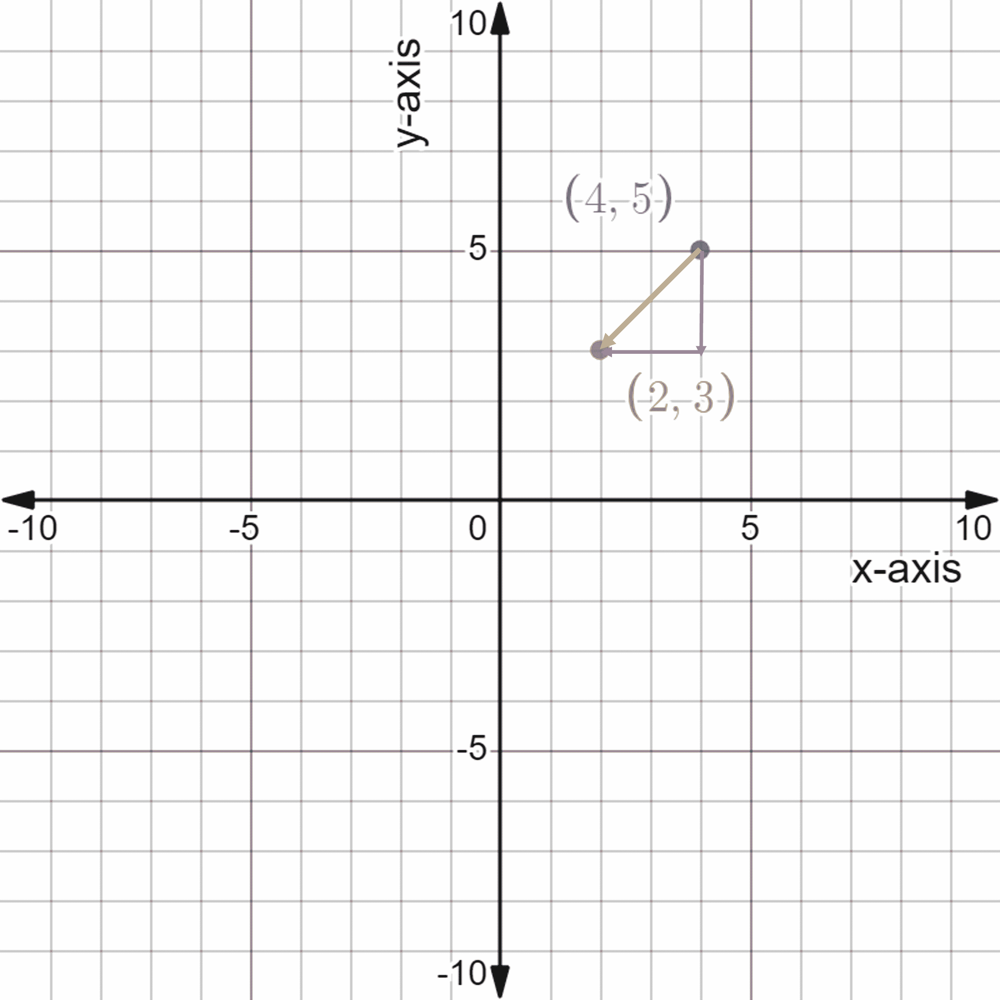
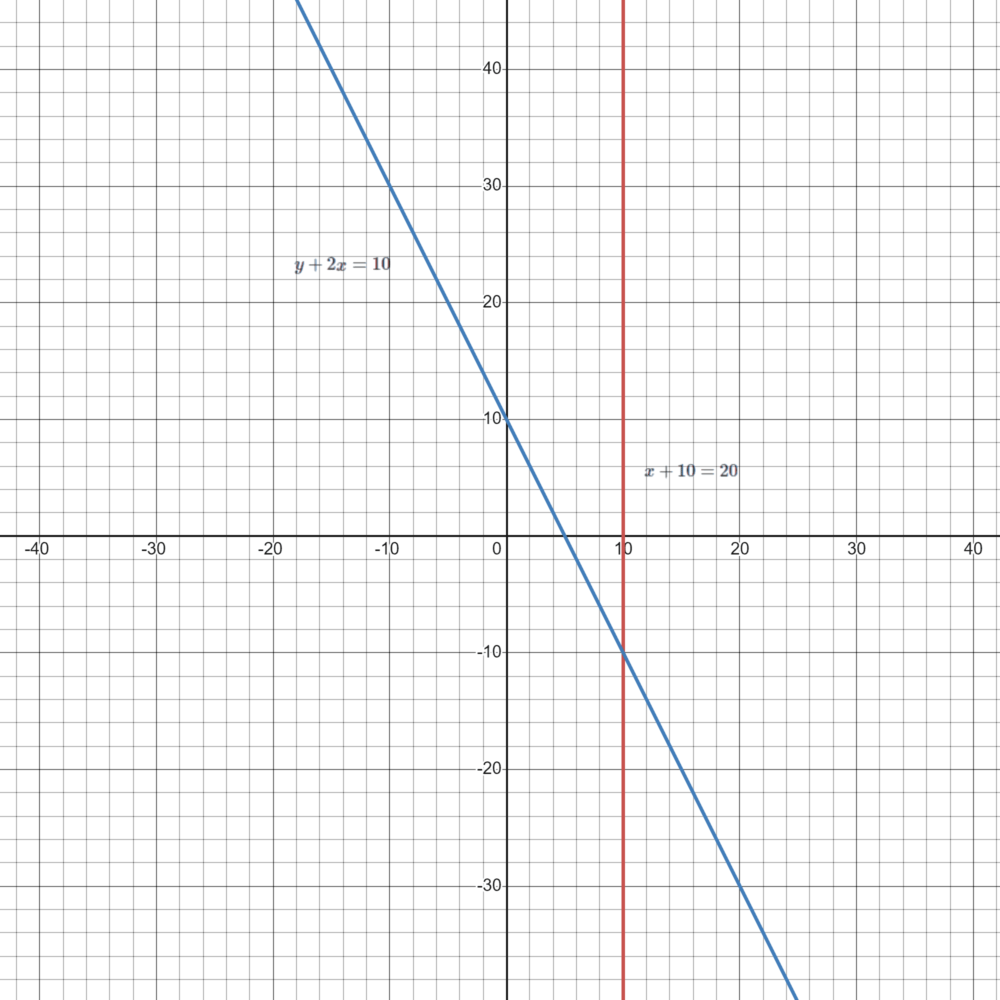
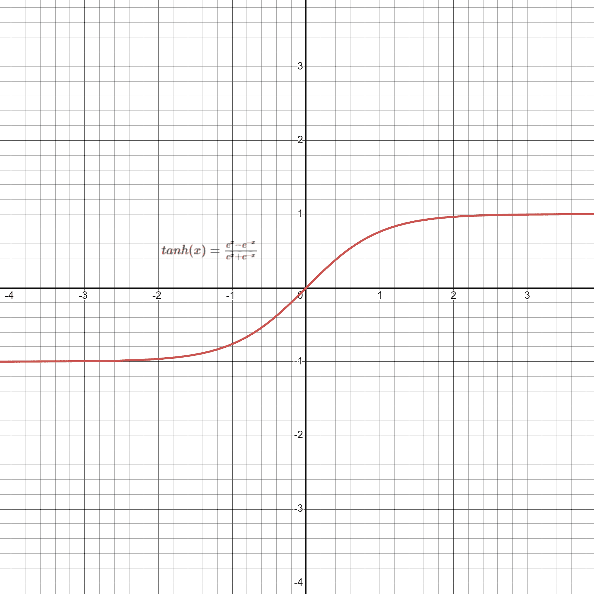
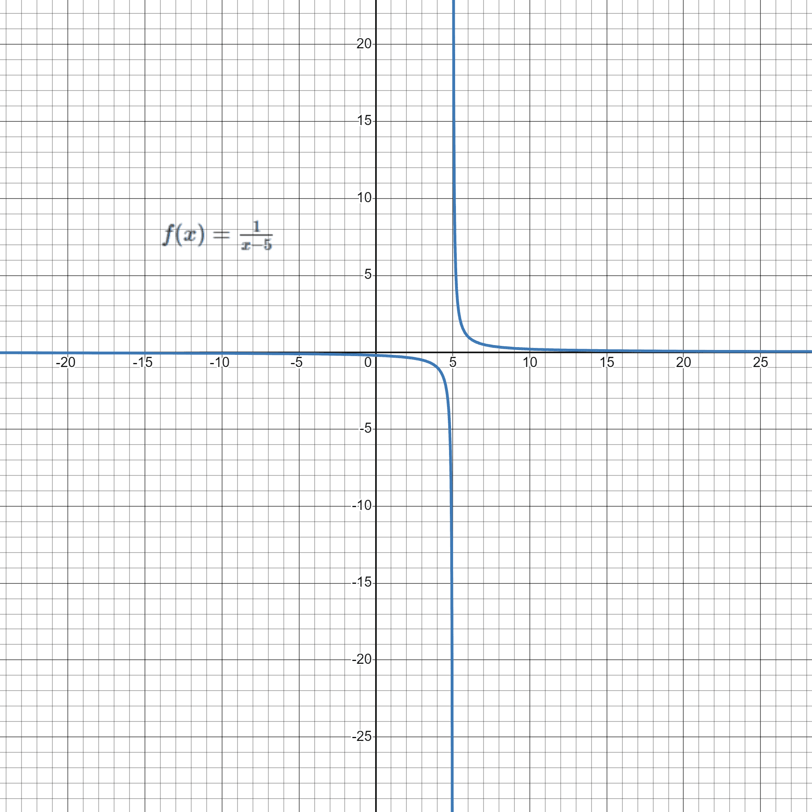
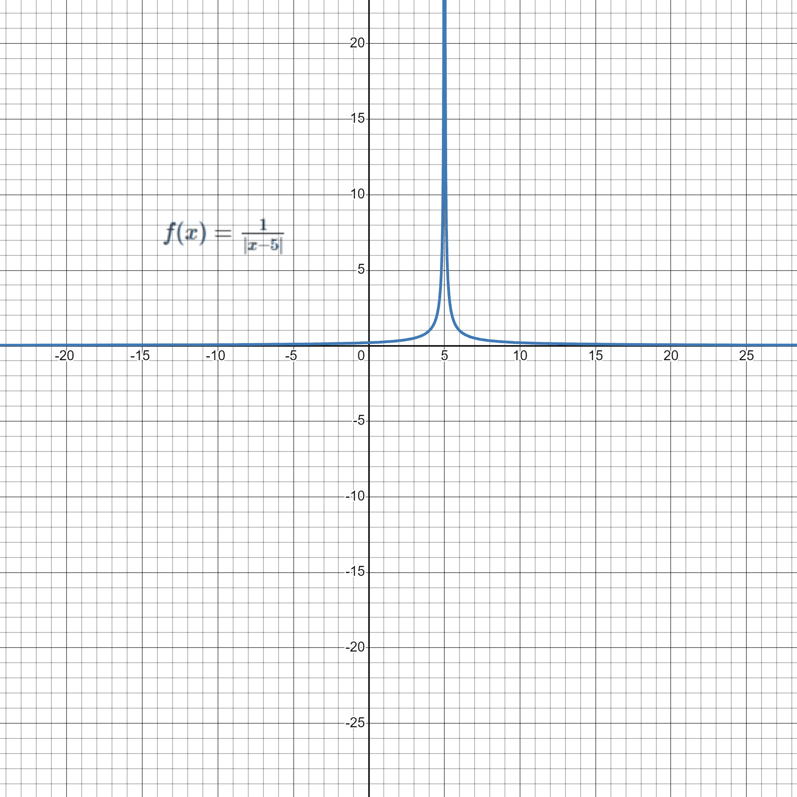
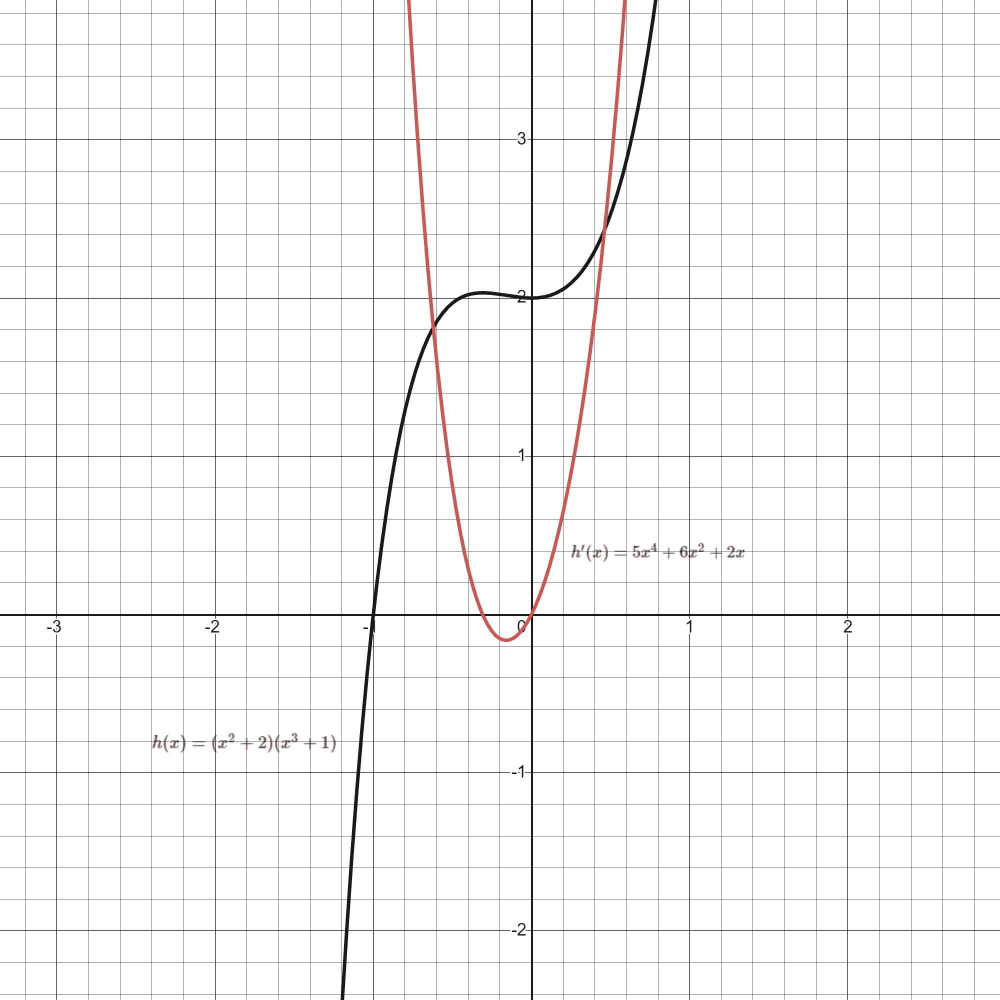
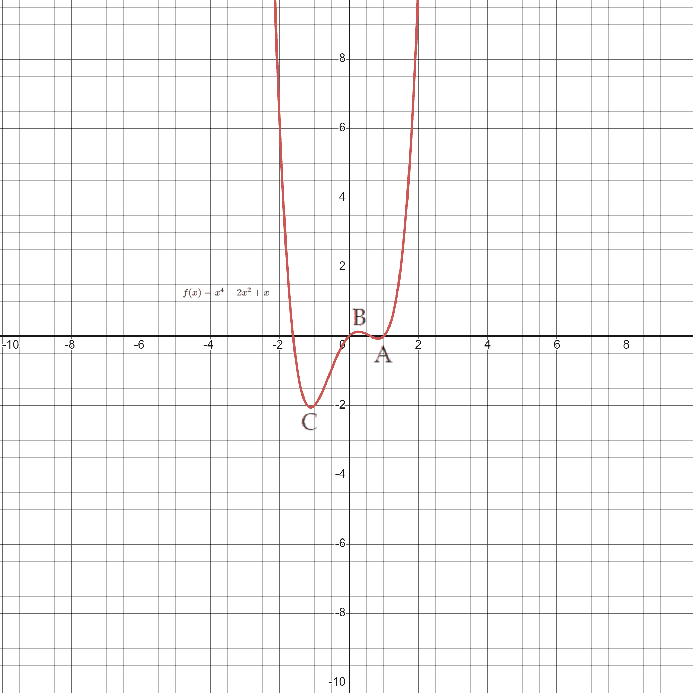

# 第四章：深度学习的线性代数和微积分

代数和微积分是数据科学的支柱，特别是基于这两个数学领域的概念的学习算法。本章以一种所有人都能理解的方式介绍了一些关键的代数和微积分主题。

了解为什么要学习某样东西是有帮助的。这样，你就会获得继续学习的动力，也知道应该把注意力放在哪里。

*代数*是研究运算和关系规则以及由此产生的构造和思想。代数涵盖了诸如线性方程和矩阵等主题。你可以将代数看作通往微积分的第一步。

*微积分*是研究曲线斜率和变化率的学科。微积分涵盖了诸如导数和积分等主题。它在许多领域如经济学和工程学中被广泛使用。不同的学习算法依赖微积分的概念来执行其复杂操作。

两者之间的区别在于，微积分处理变化、运动和积累的概念，而代数处理数学符号以及操纵这些符号的规则。微积分关注变化函数的特性和行为，而代数为解方程和理解函数提供了基础。

# [待补充标题]

## 向量和矩阵

*向量*是一个具有大小（长度）和方向（箭头）的对象。向量的基本表示是带有坐标的箭头。但首先，让我们看看什么是坐标轴。

x 轴和 y 轴是垂直线，指定了平面的边界以及二维笛卡尔坐标系中不同点的位置。x 轴是水平的，y 轴是垂直的。

这些坐标轴可以表示向量，其中 x 轴表示向量的水平分量，y 轴表示其垂直分量。

图 4-1 显示了一个简单的二维笛卡尔坐标系，带有两个坐标轴。

###### 图 4-1. 二维笛卡尔坐标系

二维笛卡尔坐标系使用简单的括号来显示不同点的位置，遵循以下顺序：

<math alttext="upper P o i n t c o o r d i n a t e s equals left-parenthesis h o r i z o n t a l l o c a t i o n left-parenthesis x right-parenthesis comma v e r t i c a l l o c a t i o n left-parenthesis y right-parenthesis right-parenthesis"><mrow><mi>P</mi> <mi>o</mi> <mi>i</mi> <mi>n</mi> <mi>t</mi> <mi>c</mi> <mi>o</mi> <mi>o</mi> <mi>r</mi> <mi>d</mi> <mi>i</mi> <mi>n</mi> <mi>a</mi> <mi>t</mi> <mi>e</mi> <mi>s</mi> <mo>=</mo> <mo>(</mo> <mi>h</mi> <mi>o</mi> <mi>r</mi> <mi>i</mi> <mi>z</mi> <mi>o</mi> <mi>n</mi> <mi>t</mi> <mi>a</mi> <mi>l</mi> <mi>l</mi> <mi>o</mi> <mi>c</mi> <mi>a</mi> <mi>t</mi> <mi>i</mi> <mi>o</mi> <mi>n</mi> <mo>(</mo> <mi>x</mi> <mo>)</mo> <mo>,</mo> <mi>v</mi> <mi>e</mi> <mi>r</mi> <mi>t</mi> <mi>i</mi> <mi>c</mi> <mi>a</mi> <mi>l</mi> <mi>l</mi> <mi>o</mi> <mi>c</mi> <mi>a</mi> <mi>t</mi> <mi>i</mi> <mi>o</mi> <mi>n</mi> <mo>(</mo> <mi>y</mi> <mo>)</mo> <mo>)</mo></mrow></math>

因此，如果你想绘制坐标为（2，3）的点 A，你可能会从零点开始查看图表，向右移动两个点，然后向上移动三个点。点的结果应该看起来像图 4-2。

###### 图 4-2. A 在坐标系上的位置

现在让我们添加另一个点并在它们之间绘制一个向量。假设你还有坐标为（4，5）的点 B。自然地，由于 B 的坐标都高于 A 的坐标，你会期望向量 AB 是向上倾斜的。图 4-3 显示了新点 B 和向量 AB。

###### 图 4-3. 向量 AB 连接 A 和 B 点的大小和方向

然而，绘制了使用两点坐标的向量后，你如何引用这个向量呢？简单来说，向量 AB 有自己的坐标来表示它。记住，向量是从点 A 到点 B 的移动的表示。这意味着沿着 X 轴和 Y 轴的两点移动就是向量。在数学上，要找到向量，你应该将两个坐标点相减，同时保持方向。具体操作如下：

+   *向量 AB*意味着你从 A 到 B，因此，你需要从点 B 的坐标中减去点 A 的坐标：

<math><mrow><mover><mrow><mi>A</mi> <mi>B</mi></mrow> <mo stretchy="true" style="math-style:normal;math-depth:0;">→</mo></mover> <mo>=</mo> <mo><</mo> <mn>4</mn> <mo>−</mo> <mn>2,5</mn> <mo>−</mo> <mn>3</mn> <mo>></mo></mrow></math><math><mrow><mover><mrow><mi>A</mi> <mi>B</mi></mrow> <mo stretchy="true" style="math-style:normal;math-depth:0;">→</mo></mover> <mo>=</mo> <mo><</mo> <mn>2,2</mn> <mo>></mo></mrow></math>

+   *向量 BA*表示从 B 到 A，因此，您需要从点 A 的坐标中减去点 B 的坐标：

<math alttext="ModifyingAbove upper B upper A With right-arrow equals less-than 2 minus 4 comma 3 minus 5 greater-than"><mrow><mover accent="true"><mrow><mi>B</mi><mi>A</mi></mrow> <mo>→</mo></mover> <mo>=</mo> <mo><</mo> <mn>2</mn> <mo>-</mo> <mn>4</mn> <mo>,</mo> <mn>3</mn> <mo>-</mo> <mn>5</mn> <mo>></mo></mrow></math>

<math alttext="ModifyingAbove upper B upper A With right-arrow equals less-than negative 2 comma negative 2 greater-than"><mrow><mover accent="true"><mrow><mi>B</mi><mi>A</mi></mrow> <mo>→</mo></mover> <mo>=</mo> <mo><</mo> <mo>-</mo> <mn>2</mn> <mo>,</mo> <mo>-</mo> <mn>2</mn> <mo>></mo></mrow></math>

解释 AB 和 BA 向量时，你要考虑移动。AB 向量表示从点 A 到点 B 的移动，水平和垂直方向分别为两个正点（向右和向上）。BA 向量表示从点 B 到点 A 的移动，水平和垂直方向分别为两个负点（向左和向下）。

###### 注意

向量 AB 和 BA 虽然具有相同的斜率，但它们并不是同一物体。但是斜率到底是什么？

*斜率*是线上两点之间的垂直变化与水平变化之间的比率。您可以使用以下数学公式计算斜率：

<math alttext="upper S l o p e equals StartFraction left-parenthesis normal upper Delta upper Y right-parenthesis Over left-parenthesis normal upper Delta upper X right-parenthesis EndFraction"><mrow><mi>S</mi> <mi>l</mi> <mi>o</mi> <mi>p</mi> <mi>e</mi> <mo>=</mo> <mstyle scriptlevel="0" displaystyle="false"><mfrac><mrow><mo>(</mo><mi>Δ</mi><mi>Y</mi><mo>)</mo></mrow> <mrow><mo>(</mo><mi>Δ</mi><mi>X</mi><mo>)</mo></mrow></mfrac></mstyle></mrow></math>

<math alttext="upper S l o p e o f ModifyingAbove upper A upper B With right-arrow equals two-halves equals 1"><mrow><mi>S</mi> <mi>l</mi> <mi>o</mi> <mi>p</mi> <mi>e</mi> <mi>o</mi> <mi>f</mi> <mover accent="true"><mrow><mi>A</mi><mi>B</mi></mrow> <mo>→</mo></mover> <mo>=</mo> <mstyle scriptlevel="0" displaystyle="false"><mfrac><mn>2</mn> <mn>2</mn></mfrac></mstyle> <mo>=</mo> <mn>1</mn></mrow></math>

<math alttext="upper S l o p e o f ModifyingAbove upper B upper A With right-arrow equals StartFraction negative 2 Over negative 2 EndFraction equals 1"><mrow><mi>S</mi> <mi>l</mi> <mi>o</mi> <mi>p</mi> <mi>e</mi> <mi>o</mi> <mi>f</mi> <mover accent="true"><mrow><mi>B</mi><mi>A</mi></mrow> <mo>→</mo></mover> <mo>=</mo> <mstyle scriptlevel="0" displaystyle="false"><mfrac><mrow><mo>-</mo><mn>2</mn></mrow> <mrow><mo>-</mo><mn>2</mn></mrow></mfrac></mstyle> <mo>=</mo> <mn>1</mn></mrow></math>

如果这两个向量只是线（没有方向），那么它们将是相同的对象。然而，添加方向性组件使它们成为两个可区分的数学对象。

图 4-4 更详细地解释了斜率的概念，因为 x 向右移动了两个点，y 向左移动了两个点。

###### 图 4-4。向量 AB 的 x 和 y 的变化

图 4-5 展示了向量 BA 的 x 和 y 的变化。

###### 图 4-5。向量 BA 的 x 和 y 的变化

###### 注意

具有大小为 1 的向量称为*单位向量*。

研究人员通常使用向量作为速度的表示，尤其在工程领域。导航是一个严重依赖向量的领域。它允许导航员确定他们的位置并规划他们的目的地。自然地，大小表示速度，方向表示目的地。

您可以将向量相互相加和相减，也可以与标量相加和相减。这允许方向和大小的变化。您应该从前面的讨论中记住的是，向量表示轴上不同点之间的方向。

###### 注意

*标量*是具有大小但没有方向的值。与向量相反，标量用于表示温度和价格等元素。基本上，标量是数字。

在机器学习中，x 轴和 y 轴分别代表数据和模型的结果。在散点图中，独立（预测）变量由 x 轴表示，而依赖（预测）变量由 y 轴表示。

*矩阵*是一个按行和列组织的包含数字的矩形数组。矩阵在计算机图形和其他领域中很有用，用于定义和操作线性方程组。矩阵与向量有何不同？最简单的答案是，向量是具有单列或单行的矩阵。这是一个 3 x 3 矩阵的基本示例：

<math alttext="Start 3 By 3 Matrix 1st Row 1st Column 5 2nd Column 2 3rd Column 9 2nd Row 1st Column negative 8 2nd Column 10 3rd Column 13 3rd Row 1st Column 1 2nd Column 5 3rd Column 12 EndMatrix"><mfenced open="[" close="]"><mtable><mtr><mtd><mn>5</mn></mtd> <mtd><mn>2</mn></mtd> <mtd><mn>9</mn></mtd></mtr> <mtr><mtd><mrow><mo>-</mo> <mn>8</mn></mrow></mtd> <mtd><mn>10</mn></mtd> <mtd><mn>13</mn></mtd></mtr> <mtr><mtd><mn>1</mn></mtd> <mtd><mn>5</mn></mtd> <mtd><mn>12</mn></mtd></mtr></mtable></mfenced></math>

矩阵的大小分别使用它们的行和列来表示。行是水平线，列是垂直线。以下表示是一个 2 x 4 矩阵：

<math alttext="Start 2 By 4 Matrix 1st Row 1st Column 5 2nd Column 2 3rd Column 1 4th Column 3 2nd Row 1st Column negative 8 2nd Column 10 3rd Column 9 4th Column 4 EndMatrix"><mfenced open="[" close="]"><mtable><mtr><mtd><mn>5</mn></mtd> <mtd><mn>2</mn></mtd> <mtd><mn>1</mn></mtd> <mtd><mn>3</mn></mtd></mtr> <mtr><mtd><mrow><mo>-</mo> <mn>8</mn></mrow></mtd> <mtd><mn>10</mn></mtd> <mtd><mn>9</mn></mtd> <mtd><mn>4</mn></mtd></mtr></mtable></mfenced></math>

以下表示是另一个矩阵的示例。这次是一个 4 x 2 矩阵：

<math alttext="Start 4 By 2 Matrix 1st Row 1st Column 5 2nd Column 2 2nd Row 1st Column negative 8 2nd Column 10 3rd Row 1st Column 8 2nd Column 22 4th Row 1st Column 7 2nd Column 3 EndMatrix"><mfenced open="[" close="]"><mtable><mtr><mtd><mn>5</mn></mtd> <mtd><mn>2</mn></mtd></mtr> <mtr><mtd><mrow><mo>-</mo> <mn>8</mn></mrow></mtd> <mtd><mn>10</mn></mtd></mtr> <mtr><mtd><mn>8</mn></mtd> <mtd><mn>22</mn></mtd></mtr> <mtr><mtd><mn>7</mn></mtd> <mtd><mn>3</mn></mtd></mtr></mtable></mfenced></math>

###### 注意

矩阵在机器学习中被广泛使用。行通常表示时间，列表示特征。

不同矩阵的求和很简单，但只有在矩阵大小相匹配时才能使用（即它们具有相同的列数和行数）。例如，让我们将以下两个矩阵相加：

<math alttext="Start 2 By 2 Matrix 1st Row 1st Column 1 2nd Column 2 2nd Row 1st Column 5 2nd Column 8 EndMatrix plus Start 2 By 2 Matrix 1st Row 1st Column 3 2nd Column 9 2nd Row 1st Column 1 2nd Column 5 EndMatrix equals Start 2 By 2 Matrix 1st Row 1st Column 4 2nd Column 11 2nd Row 1st Column 6 2nd Column 13 EndMatrix"><mrow><mfenced open="[" close="]"><mtable><mtr><mtd><mn>1</mn></mtd> <mtd><mn>2</mn></mtd></mtr> <mtr><mtd><mn>5</mn></mtd> <mtd><mn>8</mn></mtd></mtr></mtable></mfenced> <mo>+</mo> <mfenced open="[" close="]"><mtable><mtr><mtd><mn>3</mn></mtd> <mtd><mn>9</mn></mtd></mtr> <mtr><mtd><mn>1</mn></mtd> <mtd><mn>5</mn></mtd></mtr></mtable></mfenced> <mo>=</mo> <mfenced open="[" close="]"><mtable><mtr><mtd><mn>4</mn></mtd> <mtd><mn>11</mn></mtd></mtr> <mtr><mtd><mn>6</mn></mtd> <mtd><mn>13</mn></mtd></mtr></mtable></mfenced></mrow></math>

您可以看到，要添加两个矩阵，只需将相同位置的数字相加。现在，如果您尝试添加以下两个矩阵，您将无法做到，因为要添加的内容不匹配：

<math alttext="Start 2 By 2 Matrix 1st Row 1st Column 8 2nd Column 3 2nd Row 1st Column 3 2nd Column 2 EndMatrix plus Start 3 By 2 Matrix 1st Row 1st Column 3 2nd Column 9 2nd Row 1st Column 1 2nd Column 5 3rd Row 1st Column 5 2nd Column 4 EndMatrix"><mrow><mfenced open="[" close="]"><mtable><mtr><mtd><mn>8</mn></mtd> <mtd><mn>3</mn></mtd></mtr> <mtr><mtd><mn>3</mn></mtd> <mtd><mn>2</mn></mtd></mtr></mtable></mfenced> <mo>+</mo> <mfenced open="[" close="]"><mtable><mtr><mtd><mn>3</mn></mtd> <mtd><mn>9</mn></mtd></mtr> <mtr><mtd><mn>1</mn></mtd> <mtd><mn>5</mn></mtd></mtr> <mtr><mtd><mn>5</mn></mtd> <mtd><mn>4</mn></mtd></mtr></mtable></mfenced></mrow></math>

矩阵的减法也很简单，遵循与矩阵加法相同的规则。让我们看下面的例子：

<math alttext="Start 2 By 2 Matrix 1st Row 1st Column 5 2nd Column 2 2nd Row 1st Column negative 8 2nd Column 10 EndMatrix minus Start 2 By 2 Matrix 1st Row 1st Column 3 2nd Column 9 2nd Row 1st Column negative 1 2nd Column negative 5 EndMatrix equals Start 2 By 2 Matrix 1st Row 1st Column 2 2nd Column negative 7 2nd Row 1st Column negative 9 2nd Column 15 EndMatrix"><mrow><mfenced open="[" close="]"><mtable><mtr><mtd><mn>5</mn></mtd> <mtd><mn>2</mn></mtd></mtr> <mtr><mtd><mrow><mo>-</mo> <mn>8</mn></mrow></mtd> <mtd><mn>10</mn></mtd></mtr></mtable></mfenced> <mo>-</mo> <mfenced open="[" close="]"><mtable><mtr><mtd><mn>3</mn></mtd> <mtd><mn>9</mn></mtd></mtr> <mtr><mtd><mrow><mo>-</mo> <mn>1</mn></mrow></mtd> <mtd><mrow><mo>-</mo> <mn>5</mn></mrow></mtd></mtr></mtable></mfenced> <mo>=</mo> <mfenced open="[" close="]"><mtable><mtr><mtd><mn>2</mn></mtd> <mtd><mrow><mo>-</mo> <mn>7</mn></mrow></mtd></mtr> <mtr><mtd><mrow><mo>-</mo> <mn>9</mn></mrow></mtd> <mtd><mn>15</mn></mtd></mtr></mtable></mfenced></mrow></math>

显然，矩阵的减法也是矩阵的加法，其中一个矩阵中的信号发生变化。

矩阵乘以标量是非常简单的。让我们看下面的例子：

<math alttext="3 times Start 2 By 2 Matrix 1st Row 1st Column 5 2nd Column 2 2nd Row 1st Column 8 2nd Column 22 EndMatrix equals Start 2 By 2 Matrix 1st Row 1st Column 15 2nd Column 6 2nd Row 1st Column 24 2nd Column 66 EndMatrix"><mrow><mn>3</mn> <mo>×</mo> <mfenced open="[" close="]"><mtable><mtr><mtd><mn>5</mn></mtd> <mtd><mn>2</mn></mtd></mtr> <mtr><mtd><mn>8</mn></mtd> <mtd><mn>22</mn></mtd></mtr></mtable></mfenced> <mo>=</mo> <mfenced open="[" close="]"><mtable><mtr><mtd><mn>15</mn></mtd> <mtd><mn>6</mn></mtd></mtr> <mtr><mtd><mn>24</mn></mtd> <mtd><mn>66</mn></mtd></mtr></mtable></mfenced></mrow></math>

基本上，您正在将矩阵中的每个元素乘以标量。矩阵乘以另一个矩阵稍微复杂，因为它们使用*点乘*方法。首先，为了将两个矩阵相乘，它们必须满足这个条件：

<math alttext="upper M a t r i x Subscript x y Baseline times upper M a t r i x Subscript y z Baseline equals upper M a t r i x Subscript x z"><mrow><mi>M</mi> <mi>a</mi> <mi>t</mi> <mi>r</mi> <mi>i</mi> <msub><mi>x</mi> <mrow><mi>x</mi><mi>y</mi></mrow></msub> <mo>×</mo> <mi>M</mi> <mi>a</mi> <mi>t</mi> <mi>r</mi> <mi>i</mi> <msub><mi>x</mi> <mrow><mi>y</mi><mi>z</mi></mrow></msub> <mo>=</mo> <mi>M</mi> <mi>a</mi> <mi>t</mi> <mi>r</mi> <mi>i</mi> <msub><mi>x</mi> <mrow><mi>x</mi><mi>z</mi></mrow></msub></mrow></math>

这意味着第一个矩阵的列数必须等于第二个矩阵的行数，点乘的结果矩阵是第一个矩阵的行数和第二个矩阵的列数。点乘在这个 1 x 3 和 3 x 1 矩阵乘法的示例表示中解释（注意相同的列数和行数）：

<math alttext="Start 1 By 3 Matrix 1st Row 1st Column 1 2nd Column 2 3rd Column 3 EndMatrix times Start 3 By 1 Matrix 1st Row  3 2nd Row  2 3rd Row  1 EndMatrix equals Start 1 By 1 Matrix 1st Row  left-parenthesis 1 times 3 right-parenthesis plus left-parenthesis 2 times 2 right-parenthesis plus left-parenthesis 3 times 1 right-parenthesis EndMatrix equals Start 1 By 1 Matrix 1st Row  10 EndMatrix"><mrow><mfenced open="[" close="]"><mtable><mtr><mtd><mn>1</mn></mtd> <mtd><mn>2</mn></mtd> <mtd><mn>3</mn></mtd></mtr></mtable></mfenced> <mo>×</mo> <mfenced open="[" close="]"><mtable><mtr><mtd><mn>3</mn></mtd></mtr> <mtr><mtd><mn>2</mn></mtd></mtr> <mtr><mtd><mn>1</mn></mtd></mtr></mtable></mfenced> <mo>=</mo> <mfenced open="[" close="]"><mtable><mtr><mtd><mrow><mo>(</mo> <mn>1</mn> <mo>×</mo> <mn>3</mn> <mo>)</mo> <mo>+</mo> <mo>(</mo> <mn>2</mn> <mo>×</mo> <mn>2</mn> <mo>)</mo> <mo>+</mo> <mo>(</mo> <mn>3</mn> <mo>×</mo> <mn>1</mn> <mo>)</mo></mrow></mtd></mtr></mtable></mfenced> <mo>=</mo> <mfenced open="[" close="]"><mtable><mtr><mtd><mn>10</mn></mtd></mtr></mtable></mfenced></mrow></math>

让我们再看一个 2 x 2 矩阵乘法的例子：

<math alttext="Start 2 By 2 Matrix 1st Row 1st Column 1 2nd Column 2 2nd Row 1st Column 0 2nd Column 1 EndMatrix times Start 2 By 2 Matrix 1st Row 1st Column 3 2nd Column 0 2nd Row 1st Column 2 2nd Column 1 EndMatrix equals Start 2 By 2 Matrix 1st Row 1st Column 7 2nd Column 2 2nd Row 1st Column 2 2nd Column 1 EndMatrix"><mrow><mfenced open="[" close="]"><mtable><mtr><mtd><mn>1</mn></mtd> <mtd><mn>2</mn></mtd></mtr> <mtr><mtd><mn>0</mn></mtd> <mtd><mn>1</mn></mtd></mtr></mtable></mfenced> <mo>×</mo> <mfenced open="[" close="]"><mtable><mtr><mtd><mn>3</mn></mtd> <mtd><mn>0</mn></mtd></mtr> <mtr><mtd><mn>2</mn></mtd> <mtd><mn>1</mn></mtd></mtr></mtable></mfenced> <mo>=</mo> <mfenced open="[" close="]"><mtable><mtr><mtd><mn>7</mn></mtd> <mtd><mn>2</mn></mtd></mtr> <mtr><mtd><mn>2</mn></mtd> <mtd><mn>1</mn></mtd></mtr></mtable></mfenced></mrow></math>

有一种特殊类型的矩阵称为*单位矩阵*，基本上是矩阵的数字 1。对于 2 x 2 维度，它定义如下：

<math alttext="upper I equals Start 2 By 2 Matrix 1st Row 1st Column 1 2nd Column 0 2nd Row 1st Column 0 2nd Column 1 EndMatrix"><mrow><mi>I</mi> <mo>=</mo> <mfenced open="[" close="]"><mtable><mtr><mtd><mn>1</mn></mtd> <mtd><mn>0</mn></mtd></mtr> <mtr><mtd><mn>0</mn></mtd> <mtd><mn>1</mn></mtd></mtr></mtable></mfenced></mrow></math>

对于 3 x 3 维度，如下所示：

<math alttext="upper I equals Start 3 By 3 Matrix 1st Row 1st Column 1 2nd Column 0 3rd Column 0 2nd Row 1st Column 0 2nd Column 1 3rd Column 0 3rd Row 1st Column 0 2nd Column 0 3rd Column 1 EndMatrix"><mrow><mi>I</mi> <mo>=</mo> <mfenced open="[" close="]"><mtable><mtr><mtd><mn>1</mn></mtd> <mtd><mn>0</mn></mtd> <mtd><mn>0</mn></mtd></mtr> <mtr><mtd><mn>0</mn></mtd> <mtd><mn>1</mn></mtd> <mtd><mn>0</mn></mtd></mtr> <mtr><mtd><mn>0</mn></mtd> <mtd><mn>0</mn></mtd> <mtd><mn>1</mn></mtd></mtr></mtable></mfenced></mrow></math>

将任何矩阵乘以单位矩阵会产生相同的原始矩阵。这就是为什么它可以被称为矩阵的 1（将任何数字乘以 1 会得到相同的数字）。值得注意的是，矩阵乘法不是可交换的，这意味着乘法的顺序会改变结果，例如：

<math alttext="upper A upper B not-equals upper B upper A"><mrow><mi>A</mi> <mi>B</mi> <mo>≠</mo> <mi>B</mi> <mi>A</mi></mrow></math>

*矩阵转置*是一个过程，涉及将行变为列，反之亦然。矩阵的转置是通过沿其主对角线反射矩阵获得的：

<math alttext="Start 2 By 3 Matrix 1st Row 1st Column 4 2nd Column 6 3rd Column 1 2nd Row 1st Column 1 2nd Column 4 3rd Column 2 EndMatrix Superscript upper T Baseline equals Start 3 By 2 Matrix 1st Row 1st Column 4 2nd Column 1 2nd Row 1st Column 6 2nd Column 4 3rd Row 1st Column 1 2nd Column 2 EndMatrix"><mrow><msup><mfenced open="[" close="]"><mtable><mtr><mtd><mn>4</mn></mtd><mtd><mn>6</mn></mtd><mtd><mn>1</mn></mtd></mtr><mtr><mtd><mn>1</mn></mtd><mtd><mn>4</mn></mtd><mtd><mn>2</mn></mtd></mtr></mtable></mfenced> <mi>T</mi></msup> <mo>=</mo> <mfenced open="[" close="]"><mtable><mtr><mtd><mn>4</mn></mtd> <mtd><mn>1</mn></mtd></mtr> <mtr><mtd><mn>6</mn></mtd> <mtd><mn>4</mn></mtd></mtr> <mtr><mtd><mn>1</mn></mtd> <mtd><mn>2</mn></mtd></mtr></mtable></mfenced></mrow></math>

转置在一些机器学习算法中使用，并且在处理这些模型时不是一个罕见的操作。如果您想了解数据科学和机器学习中矩阵的作用，可以参考这个非详尽的列表：

数据表示

矩阵通常表示具有行表示样本和列表示特征的数据。例如，矩阵中的一行可以表示一个时间步长中的 OHLC 数据。

线性代数

矩阵和线性代数是相互交织的，许多学习算法在其操作中使用矩阵的概念。

数据关系矩阵

如果您还记得第三章，协方差和相关性度量通常表示为矩阵。这些关系计算是机器学习中重要的概念。

###### 注意

您应该从本节中保留以下关键概念：

+   向量是一个具有大小（长度）和方向（箭头头部）的对象。多个向量组合在一起形成一个矩阵。

+   矩阵可用于存储数据。它有其特殊的操作方式。

+   矩阵乘法使用点乘方法。

+   转置矩阵意味着交换其行和列。

## 线性方程简介

您已经在讨论线性回归和第三章统计推断中看到了线性方程的一个例子。*线性方程*基本上是呈现不同变量和常数之间的等式关系的公式。在机器学习的情况下，它通常是依赖变量（输出）和自变量（输入）之间的关系。理解线性方程的最佳方法是通过示例。​

###### 注意

线性方程的目的是找到一个未知变量，通常用字母*x*表示。

让我们看一个非常基本的例子，您可以将其视为以后将看到的更高级微积分概念的第一个基本构建块。以下例子需要找到*x*的值：

<math alttext="10 x equals 20"><mrow><mn>10</mn> <mi>x</mi> <mo>=</mo> <mn>20</mn></mrow></math>

您应该将方程理解为“10 乘以哪个数字等于 20？”当一个常数直接附加到变量（如*x*）时，它指的是一个乘法运算。现在，要解出*x*（即找到使方程相等的*x*的值），您有一个明显的解决方案，即摆脱 10，这样您就可以在方程的一边得到*x*，而在另一边得到其余部分。

自然地，为了消除 10，您应该除以 10，这样剩下的是 1，如果乘以变量*x*则不会有任何变化。但是，请记住两个重要的事情：

+   如果在方程的一边进行数学运算，则必须在另一边进行相同的运算。这就是它们被称为方程的原因。

+   为简单起见，您应该将常数乘以其倒数而不是除以它来消除它。

一个数字的*倒数*是该数字的倒数。这是它的数学表示：

<math alttext="upper R e c i p r o c a l left-parenthesis x right-parenthesis equals StartFraction 1 Over x EndFraction"><mrow><mi>R</mi> <mi>e</mi> <mi>c</mi> <mi>i</mi> <mi>p</mi> <mi>r</mi> <mi>o</mi> <mi>c</mi> <mi>a</mi> <mi>l</mi> <mrow><mo>(</mo> <mi>x</mi> <mo>)</mo></mrow> <mo>=</mo> <mfrac><mn>1</mn> <mi>x</mi></mfrac></mrow></math>

现在，回到例子，要找到*x*，您可以这样做：

<math alttext="left-parenthesis one-tenth right-parenthesis 10 x equals 20 left-parenthesis one-tenth right-parenthesis"><mrow><mrow><mo>(</mo> <mfrac><mn>1</mn> <mn>10</mn></mfrac> <mo>)</mo></mrow> <mn>10</mn> <mi>x</mi> <mo>=</mo> <mn>20</mn> <mrow><mo>(</mo> <mfrac><mn>1</mn> <mn>10</mn></mfrac> <mo>)</mo></mrow></mrow></math>

进行乘法并简化得到以下结果：

<math alttext="x equals 2"><mrow><mi>x</mi> <mo>=</mo> <mn>2</mn></mrow></math>

这意味着方程的解是 2。要验证这一点，您只需要将其代入原方程如下：

<math alttext="10 times 2 equals 20"><mrow><mn>10</mn> <mo>×</mo> <mn>2</mn> <mo>=</mo> <mn>20</mn></mrow></math>

因此，需要两个 10 来得到 20。

###### 注意

将数字除以自身或乘以其倒数是相同的。

让我们看另一个通过线性技术解决*x*的例子。考虑以下问题：

<math alttext="eight-sixths x equals 24"><mrow><mfrac><mn>8</mn> <mn>6</mn></mfrac> <mi>x</mi> <mo>=</mo> <mn>24</mn></mrow></math>

进行乘法并简化得到以下结果：

<math alttext="left-parenthesis six-eighths right-parenthesis eight-sixths x equals 24 left-parenthesis six-eighths right-parenthesis"><mrow><mrow><mo>(</mo> <mfrac><mn>6</mn> <mn>8</mn></mfrac> <mo>)</mo></mrow> <mfrac><mn>8</mn> <mn>6</mn></mfrac> <mi>x</mi> <mo>=</mo> <mn>24</mn> <mrow><mo>(</mo> <mfrac><mn>6</mn> <mn>8</mn></mfrac> <mo>)</mo></mrow></mrow></math>

<math alttext="x equals 18"><mrow><mi>x</mi> <mo>=</mo> <mn>18</mn></mrow></math>

这意味着方程的解是 18。要验证这一点，您只需要将其代入原方程如下：

<math alttext="eight-sixths times 18 equals 24"><mrow><mfrac><mn>8</mn> <mn>6</mn></mfrac> <mo>×</mo> <mn>18</mn> <mo>=</mo> <mn>24</mn></mrow></math>

让我们深入一点，因为通常，线性方程并不是这么简单。有时它们包含更多的变量和常数，需要更详细的解决方案，但让我们一步一步地继续。考虑以下例子：

<math alttext="3 x minus 6 equals 12"><mrow><mn>3</mn> <mi>x</mi> <mo>-</mo> <mn>6</mn> <mo>=</mo> <mn>12</mn></mrow></math>

解出*x*需要稍微重新排列方程。记住，目标是让*x*在一边，其余在另一边。在处理 3 之前，您必须摆脱常数 6。解的第一部分如下：

<math alttext="3 x minus 6 left-parenthesis plus 6 right-parenthesis equals 12 left-parenthesis plus 6 right-parenthesis"><mrow><mn>3</mn> <mi>x</mi> <mo>-</mo> <mn>6</mn> <mo>(</mo> <mo>+</mo> <mn>6</mn> <mo>)</mo> <mo>=</mo> <mn>12</mn> <mo>(</mo> <mo>+</mo> <mn>6</mn> <mo>)</mo></mrow></math>

注意您必须在方程的两边都加上 6。左边的部分将自行取消，而右边的部分将加起来得到 18：

<math alttext="3 x equals 18"><mrow><mn>3</mn> <mi>x</mi> <mo>=</mo> <mn>18</mn></mrow></math>

最后，您可以通过乘以附加到变量*x*的常数的倒数来解决：

<math alttext="left-parenthesis one-third right-parenthesis 3 x equals 18 left-parenthesis one-third right-parenthesis"><mrow><mrow><mo>(</mo> <mfrac><mn>1</mn> <mn>3</mn></mfrac> <mo>)</mo></mrow> <mn>3</mn> <mi>x</mi> <mo>=</mo> <mn>18</mn> <mrow><mo>(</mo> <mfrac><mn>1</mn> <mn>3</mn></mfrac> <mo>)</mo></mrow></mrow></math>

简化并解出*x*得到以下解：

<math alttext="x equals 6"><mrow><mi>x</mi> <mo>=</mo> <mn>6</mn></mrow></math>

这意味着方程的解是 6。要验证这一点，只需将其代入原方程如下：

<math alttext="left-parenthesis 3 times 6 right-parenthesis minus 6 equals 12"><mrow><mo>(</mo> <mn>3</mn> <mo>×</mo> <mn>6</mn> <mo>)</mo> <mo>-</mo> <mn>6</mn> <mo>=</mo> <mn>12</mn></mrow></math>

到目前为止，您应该开始注意到线性代数是关于使用快捷方式和快速技巧简化方程并找到未知变量的。下一个例子展示了有时变量*x*可能出现在多个地方：

<math alttext="6 x plus x equals 27 minus 2 x"><mrow><mn>6</mn> <mi>x</mi> <mo>+</mo> <mi>x</mi> <mo>=</mo> <mn>27</mn> <mo>-</mo> <mn>2</mn> <mi>x</mi></mrow></math>

记住，主要重点是让*x*在方程的一边，其余在另一边：

<math alttext="6 x plus x plus 2 x equals 27"><mrow><mn>6</mn> <mi>x</mi> <mo>+</mo> <mi>x</mi> <mo>+</mo> <mn>2</mn> <mi>x</mi> <mo>=</mo> <mn>27</mn></mrow></math>

添加*x*的常数得到以下结果：

<math alttext="9 x equals 27"><mrow><mn>9</mn> <mi>x</mi> <mo>=</mo> <mn>27</mn></mrow></math>

最后一步是除以 9，这样您只剩下*x*：

<math alttext="x equals 3"><mrow><mi>x</mi> <mo>=</mo> <mn>3</mn></mrow></math>

现在您可以通过在原方程中将 3 代入*x*来验证这一点。您会注意到方程的两边是相等的。

###### 注意

尽管这一部分非常简单，但它包含了您在代数和微积分中开始进阶所需的基本基础。在继续之前需要记住的主要要点如下：

+   线性方程是一种表示，其中任何变量的最高指数为一。这意味着没有变量被提高到二次及以上的幂。

+   线性方程在图表上绘制时是直线。

+   线性方程在建模各种现实世界事件中的应用使它们在许多数学和研究领域至关重要。它们也广泛应用于机器学习。

+   解决*x*的过程是找到使等式两边相等的值。

+   在方程的一侧执行操作（如加上一个常数或乘以一个常数）时，你必须在另一侧也这样做。

+   倒数在简化方程时很有用。

## 方程组

*方程组*是指两个或更多个方程共同解决一个或多个变量的情况。因此，与通常的单个方程不同，如下所示：

<math alttext="x plus 10 equals 20"><mrow><mi>x</mi> <mo>+</mo> <mn>10</mn> <mo>=</mo> <mn>20</mn></mrow></math>

方程组类似于以下内容：

<math alttext="x plus 10 equals 20"><mrow><mi>x</mi> <mo>+</mo> <mn>10</mn> <mo>=</mo> <mn>20</mn></mrow></math>

<math alttext="y plus 2 x equals 10"><mrow><mi>y</mi> <mo>+</mo> <mn>2</mn> <mi>x</mi> <mo>=</mo> <mn>10</mn></mrow></math>

有解决它们的方法和特殊情况，在本节中进行讨论。方程组在机器学习中很有用，并在其许多方面中使用。

让我们从本节开头的前一个方程组开始，通过图形方式解决它。绘制两个函数实际上可以直接给出解。线性方程的交点是解。因此，交点的坐标（*x, y*）分别指代*x*和*y*的解。

从图 4-6 可以看出，*x*=10，*y*=-10。将这些值代入各自的变量中可以得到正确答案：

<math alttext="10 plus 10 equals 20"><mrow><mn>10</mn> <mo>+</mo> <mn>10</mn> <mo>=</mo> <mn>20</mn></mrow></math>

<math alttext="left-parenthesis negative 10 right-parenthesis plus left-parenthesis 2 times 10 right-parenthesis equals 10"><mrow><mo>(</mo> <mo>-</mo> <mn>10</mn> <mo>)</mo> <mo>+</mo> <mo>(</mo> <mn>2</mn> <mo>×</mo> <mn>10</mn> <mo>)</mo> <mo>=</mo> <mn>10</mn></mrow></math>

###### 图 4-6。显示两个函数及其交点（解）的图形

由于函数是线性的，解它们有三种情况：

1.  每个变量只有一个解。

1.  没有解。当函数是*平行*时发生（这意味着它们永远不会相交）。

1.  有无限多个解。当它是相同的函数时发生（因为所有点都落在直线上）。

在使用代数解方程组之前，让我们直观地看看如何可能没有解以及如何可能有无限多个解。考虑以下系统：

<math alttext="2 x equals 10"><mrow><mn>2</mn> <mi>x</mi> <mo>=</mo> <mn>10</mn></mrow></math>

<math alttext="4 x equals 20"><mrow><mn>4</mn> <mi>x</mi> <mo>=</mo> <mn>20</mn></mrow></math>

图 4-7 将两者绘制在一起。由于它们完全相同，它们落在同一条线上。实际上，图 4-7 中有两条线，但由于它们相同，它们是无法区分的。对于线上的每个*x*，都有一个对应的*y*。

###### 图 4-7。显示两个函数及其无限交点的图形

现在，考虑以下系统：

<math alttext="3 x equals 10"><mrow><mn>3</mn> <mi>x</mi> <mo>=</mo> <mn>10</mn></mrow></math>

<math alttext="6 x equals 10"><mrow><mn>6</mn> <mi>x</mi> <mo>=</mo> <mn>10</mn></mrow></math>

图 4-8 显示它们永远不会相交，这是直观的，因为你不能用不同的数字（由变量*x*表示）乘以相同的数字并期望得到相同的结果。

###### 图 4-8。显示两个函数及其不可能的交点的图形

当有两个以上的变量时，代数方法用于解决它们，因为它们不能通过图形解决。这主要涉及两种方法，替换和消元。

*替换*是当你可以用一个方程中的变量值替换另一个方程中的变量值时使用的。考虑以下示例：

<math alttext="x plus y equals 2"><mrow><mi>x</mi> <mo>+</mo> <mi>y</mi> <mo>=</mo> <mn>2</mn></mrow></math>

<math alttext="10 x plus y equals 10"><mrow><mn>10</mn> <mi>x</mi> <mo>+</mo> <mi>y</mi> <mo>=</mo> <mn>10</mn></mrow></math>

最简单的方法是重新排列第一个方程，使得你可以用*x*表示*y*：

<math alttext="y equals 2 minus x"><mrow><mi>y</mi> <mo>=</mo> <mn>2</mn> <mo>-</mo> <mi>x</mi></mrow></math>

<math alttext="10 x plus left-parenthesis 2 minus x right-parenthesis equals 10"><mrow><mn>10</mn> <mi>x</mi> <mo>+</mo> <mo>(</mo> <mn>2</mn> <mo>-</mo> <mi>x</mi> <mo>)</mo> <mo>=</mo> <mn>10</mn></mrow></math>

在第二个方程中解*x*变得简单：

<math alttext="10 x plus left-parenthesis 2 minus x right-parenthesis equals 10"><mrow><mn>10</mn> <mi>x</mi> <mo>+</mo> <mo>(</mo> <mn>2</mn> <mo>-</mo> <mi>x</mi> <mo>)</mo> <mo>=</mo> <mn>10</mn></mrow></math>

<math alttext="10 x plus 2 minus x equals 10"><mrow><mn>10</mn> <mi>x</mi> <mo>+</mo> <mn>2</mn> <mo>-</mo> <mi>x</mi> <mo>=</mo> <mn>10</mn></mrow></math>

<math alttext="10 x minus x equals 10 minus 2"><mrow><mn>10</mn> <mi>x</mi> <mo>-</mo> <mi>x</mi> <mo>=</mo> <mn>10</mn> <mo>-</mo> <mn>2</mn></mrow></math>

<math alttext="9 x equals 8"><mrow><mn>9</mn> <mi>x</mi> <mo>=</mo> <mn>8</mn></mrow></math>

<math alttext="x equals eight-ninths"><mrow><mi>x</mi> <mo>=</mo> <mfrac><mn>8</mn> <mn>9</mn></mfrac></mrow></math>

<math alttext="x equals 0.8889"><mrow><mi>x</mi> <mo>=</mo> <mn>0</mn> <mo>.</mo> <mn>8889</mn></mrow></math>

现在你已经找到了*x*的值，你可以通过将*x*的值代入第一个方程中轻松找到*y*：

<math alttext="0.8889 plus y equals 2"><mrow><mn>0</mn> <mo>.</mo> <mn>8889</mn> <mo>+</mo> <mi>y</mi> <mo>=</mo> <mn>2</mn></mrow></math>

<math alttext="y equals 2 minus 0.8889"><mrow><mi>y</mi> <mo>=</mo> <mn>2</mn> <mo>-</mo> <mn>0</mn> <mo>.</mo> <mn>8889</mn></mrow></math>

<math alttext="y equals 1.111"><mrow><mi>y</mi> <mo>=</mo> <mn>1</mn> <mo>.</mo> <mn>111</mn></mrow></math>

要检查你的解是否正确，你可以将*x*和*y*的值分别代入两个公式中：

<math alttext="0.8889 plus 1.111 equals 2"><mrow><mn>0</mn> <mo>.</mo> <mn>8889</mn> <mo>+</mo> <mn>1</mn> <mo>.</mo> <mn>111</mn> <mo>=</mo> <mn>2</mn></mrow></math>

<math alttext="left-parenthesis 10 times 0.8889 right-parenthesis plus 1.111 equals 10"><mrow><mo>(</mo> <mn>10</mn> <mo>×</mo> <mn>0</mn> <mo>.</mo> <mn>8889</mn> <mo>)</mo> <mo>+</mo> <mn>1</mn> <mo>.</mo> <mn>111</mn> <mo>=</mo> <mn>10</mn></mrow></math>

从图形上看，这意味着两个方程在(0.8889, 1.111)处相交。这种技术可以用于多于两个变量。按照相同的过程，直到方程简化到足以给出答案。替换的问题在于当你处理多于两个变量时可能需要一些时间。

*消元*是一种更快的替代方法。它是通过消除变量直到只剩下一个的方法。考虑以下示例：

<math alttext="2 x plus 4 y equals 20" display="block"><mrow><mn>2</mn> <mi>x</mi> <mo>+</mo> <mn>4</mn> <mi>y</mi> <mo>=</mo> <mn>20</mn></mrow></math> <math alttext="3 x plus 2 y equals 10" display="block"><mrow><mn>3</mn> <mi>x</mi> <mo>+</mo> <mn>2</mn> <mi>y</mi> <mo>=</mo> <mn>10</mn></mrow></math>

注意到有 4*y*和 2*y*，可以将第二个方程乘以 2，然后将两个方程相减（这将消除*y*变量）：

<math alttext="2 x plus 4 y equals 20"><mrow><mn>2</mn> <mi>x</mi> <mo>+</mo> <mn>4</mn> <mi>y</mi> <mo>=</mo> <mn>20</mn></mrow></math>

<math alttext="6 x plus 4 y equals 20"><mrow><mn>6</mn> <mi>x</mi> <mo>+</mo> <mn>4</mn> <mi>y</mi> <mo>=</mo> <mn>20</mn></mrow></math>

将两个方程相减得到以下结果：

<math alttext="minus 4 x equals 0"><mrow><mo>-</mo> <mn>4</mn> <mi>x</mi> <mo>=</mo> <mn>0</mn></mrow></math>

<math alttext="x equals 0"><mrow><mi>x</mi> <mo>=</mo> <mn>0</mn></mrow></math>

因此，*x*=0。从图形上看，这意味着它们在*x*=0 时相交（正好在垂直的*y*线上）。将*x*的值代入第一个公式得到*y*=5：

<math alttext="left-parenthesis 2 times 0 right-parenthesis plus 4 y equals 20"><mrow><mo>(</mo> <mn>2</mn> <mo>×</mo> <mn>0</mn> <mo>)</mo> <mo>+</mo> <mn>4</mn> <mi>y</mi> <mo>=</mo> <mn>20</mn></mrow></math>

<math alttext="4 y equals 20"><mrow><mn>4</mn> <mi>y</mi> <mo>=</mo> <mn>20</mn></mrow></math>

<math alttext="y equals 5"><mrow><mi>y</mi> <mo>=</mo> <mn>5</mn></mrow></math>

同样，消元法也可以解决具有三个变量的方程。选择替换和消元之间取决于方程的类型。

###### 注意

本节的要点可以总结如下：

+   方程组解决变量。它们在机器学习中非常有用，并且在一些算法中使用。

+   对于简单的方程组，图形解法是首选。

+   通过代数解方程组需要使用替换和消元方法。

+   当系统比较简单时，首选替换法，但当系统稍微复杂时，消元法是更好的选择。

## 三角学

*三角学探讨了所谓的*三角函数*的行为，这些函数将三角形的角度与其边长联系起来。最常用的三角形是直角三角形，其中一个角为 90°。图 4-9 展示了一个直角三角形的例子。

！

###### 图 4-9。直角三角形

让我们定义直角三角形的主要特征：

+   三角形的最长边称为*斜边*。

+   斜边前面的角度是直角（90°的角度）。

+   根据您选择的另一个角度（θ）（从剩下的两个中选择），连接这个角度和斜边之间的线称为*邻边*，另一条线称为*对边*。

三角函数简单地是一条线除以另一条线。记住三角形中有三条线（斜边、对边和邻边）。三角函数的计算如下：

<math alttext="s i n left-parenthesis theta right-parenthesis equals StartFraction upper O p p o s i t e Over upper H y p o t e n u s e EndFraction"><mrow><mi>s</mi> <mi>i</mi> <mi>n</mi> <mrow><mo>(</mo> <mi>θ</mi> <mo>)</mo></mrow> <mo>=</mo> <mstyle scriptlevel="0" displaystyle="false"><mfrac><mrow><mi>O</mi><mi>p</mi><mi>p</mi><mi>o</mi><mi>s</mi><mi>i</mi><mi>t</mi><mi>e</mi></mrow> <mrow><mi>H</mi><mi>y</mi><mi>p</mi><mi>o</mi><mi>t</mi><mi>e</mi><mi>n</mi><mi>u</mi><mi>s</mi><mi>e</mi></mrow></mfrac></mstyle></mrow></math>

<math alttext="c o s left-parenthesis theta right-parenthesis equals StartFraction upper A d j a c e n t Over upper H y p o t e n u s e EndFraction"><mrow><mi>c</mi> <mi>o</mi> <mi>s</mi> <mrow><mo>(</mo> <mi>θ</mi> <mo>)</mo></mrow> <mo>=</mo> <mstyle scriptlevel="0" displaystyle="false"><mfrac><mrow><mi>A</mi><mi>d</mi><mi>j</mi><mi>a</mi><mi>c</mi><mi>e</mi><mi>n</mi><mi>t</mi></mrow> <mrow><mi>H</mi><mi>y</mi><mi>p</mi><mi>o</mi><mi>t</mi><mi>e</mi><mi>n</mi><mi>u</mi><mi>s</mi><mi>e</mi></mrow></mfrac></mstyle></mrow></math>

<math alttext="t a n left-parenthesis theta right-parenthesis equals StartFraction upper O p p o s i t e Over upper A d j a c e n t EndFraction"><mrow><mi>t</mi> <mi>a</mi> <mi>n</mi> <mrow><mo>(</mo> <mi>θ</mi> <mo>)</mo></mrow> <mo>=</mo> <mstyle scriptlevel="0" displaystyle="false"><mfrac><mrow><mi>O</mi><mi>p</mi><mi>p</mi><mi>o</mi><mi>s</mi><mi>i</mi><mi>t</mi><mi>e</mi></mrow> <mrow><mi>A</mi><mi>d</mi><mi>j</mi><mi>a</mi><mi>c</mi><mi>e</mi><mi>n</mi><mi>t</mi></mrow></mfrac></mstyle></mrow></math>

从前述三个三角函数中，可以提取一个三角恒等式，通过基本的线性代数从*sin*和*cos*得到*tan*：

<math alttext="t a n left-parenthesis theta right-parenthesis equals StartFraction s i n left-parenthesis theta right-parenthesis Over c o s left-parenthesis theta right-parenthesis EndFraction"><mrow><mi>t</mi> <mi>a</mi> <mi>n</mi> <mrow><mo>(</mo> <mi>θ</mi> <mo>)</mo></mrow> <mo>=</mo> <mstyle scriptlevel="0" displaystyle="false"><mfrac><mrow><mi>s</mi><mi>i</mi><mi>n</mi><mo>(</mo><mi>θ</mi><mo>)</mo></mrow> <mrow><mi>c</mi><mi>o</mi><mi>s</mi><mo>(</mo><mi>θ</mi><mo>)</mo></mrow></mfrac></mstyle></mrow></math>

*双曲函数*类似于三角函数，但是使用指数函数定义。

###### 注意

关于双曲函数的部分非常重要，因为它构成了所谓的*激活函数*的基础，这是神经网络中的关键概念，是深度学习模型的主角。您将在第八章中详细了解它们。

欧拉数（表示为*e*）是数学中最重要的数字之一。它是一个*无理数*，即不能表示为分数的实数。 *无理* 一词源于无法用比例表达它的事实；这与其个性无关。欧拉数*e*也是自然对数*ln*的底数，其前几位数字为 2.71828。获得*e*的最佳近似值的一个公式如下：

<math alttext="e equals left-parenthesis 1 plus StartFraction 1 Over n EndFraction right-parenthesis Superscript n"><mrow><mi>e</mi> <mo>=</mo> <msup><mrow><mo>(</mo><mn>1</mn><mo>+</mo><mfrac><mn>1</mn> <mi>n</mi></mfrac><mo>)</mo></mrow> <mi>n</mi></msup></mrow></math>

通过增加前述公式中的*n*，您将接近*e*的值。它有许多有趣的性质，特别是其斜率等于其自身的值。让我们以以下函数为例（也称为自然指数函数）：

<math alttext="f left-parenthesis x right-parenthesis equals e Superscript x"><mrow><mi>f</mi> <mrow><mo>(</mo> <mi>x</mi> <mo>)</mo></mrow> <mo>=</mo> <msup><mi>e</mi> <mi>x</mi></msup></mrow></math>

在任何点，函数的斜率都是相同的值。看一下图 4-10。

！

###### 图 4-10。自然指数函数的图形

###### 注意

您可能会想知道为什么这本书要解释指数和对数。主要有两个原因：

+   指数和更重要的是欧拉数在双曲函数中使用，其中*tanh(x)*是神经网络的主要激活函数之一，这是一种机器学习和深度学习模型。

+   对数在*数据归一化*以及*损失函数*中非常有用，这些概念将在后面的章节中看到。

因此，在建立对后续模型的专业知识时，深入理解它们所指的内容是至关重要的。

双曲函数使用自然指数函数，并定义如下：

<math alttext="s i n h left-parenthesis x right-parenthesis equals StartFraction e Superscript x Baseline minus e Superscript negative x Baseline Over 2 EndFraction"><mrow><mi>s</mi> <mi>i</mi> <mi>n</mi> <mi>h</mi> <mrow><mo>(</mo> <mi>x</mi> <mo>)</mo></mrow> <mo>=</mo> <mstyle scriptlevel="0" displaystyle="false"><mfrac><mrow><msup><mi>e</mi> <mi>x</mi></msup> <mo>-</mo><msup><mi>e</mi> <mrow><mo>-</mo><mi>x</mi></mrow></msup></mrow> <mn>2</mn></mfrac></mstyle></mrow></math>

<math alttext="c o s h left-parenthesis x right-parenthesis equals StartFraction e Superscript x Baseline plus e Superscript negative x Baseline Over 2 EndFraction"><mrow><mi>c</mi> <mi>o</mi> <mi>s</mi> <mi>h</mi> <mrow><mo>(</mo> <mi>x</mi> <mo>)</mo></mrow> <mo>=</mo> <mstyle scriptlevel="0" displaystyle="false"><mfrac><mrow><msup><mi>e</mi> <mi>x</mi></msup> <mo>+</mo><msup><mi>e</mi> <mrow><mo>-</mo><mi>x</mi></mrow></msup></mrow> <mn>2</mn></mfrac></mstyle></mrow></math>

<math alttext="t a n h left-parenthesis x right-parenthesis equals StartFraction e Superscript x Baseline minus e Superscript negative x Baseline Over e Superscript x Baseline plus e Superscript negative x Baseline EndFraction"><mrow><mi>t</mi> <mi>a</mi> <mi>n</mi> <mi>h</mi> <mrow><mo>(</mo> <mi>x</mi> <mo>)</mo></mrow> <mo>=</mo> <mstyle scriptlevel="0" displaystyle="false"><mfrac><mrow><msup><mi>e</mi> <mi>x</mi></msup> <mo>-</mo><msup><mi>e</mi> <mrow><mo>-</mo><mi>x</mi></mrow></msup></mrow> <mrow><msup><mi>e</mi> <mi>x</mi></msup> <mo>+</mo><msup><mi>e</mi> <mrow><mo>-</mo><mi>x</mi></mrow></msup></mrow></mfrac></mstyle></mrow></math>

*tanh(x)*的关键特征之一是非线性，限制在[-1, 1]之间，并且它以零为中心。图 4-11 显示了*tanh(x)*的图形。

###### 图 4-11. tanh(x)的图形显示它在-1 和 1 之间的限制

###### 注意

从本节中保留的关键概念总结如下：

+   三角学是一门探索三角函数行为的领域，它将三角形的角与其边长联系起来。

+   三角恒等式是一种将三角函数相互关联的快捷方式。

+   欧拉数*e*是无理数，是自然对数的底。它在指数增长和双曲函数中有许多应用。

+   双曲函数类似于三角函数，但并不相同。虽然三角函数涉及三角形和圆，双曲函数涉及双曲线。

+   双曲正切函数在神经网络中使用，这是一种深度学习算法。

## 极限与连续性

> 微积分通过使微小量可见来工作。
> 
> - Keith Devlin

在看完线性代数的主要主题后，让我们现在转向微积分。极限不必是噩梦。我一直发现它们被误解了。实际上，它们很容易理解。但首先，你需要动力，这来自于了解学习极限的附加价值。

对于许多原因，深入了解极限在机器学习模型中非常重要：

优化

在像梯度下降这样的优化方法中，极限可以用来调节步长并确保收敛到局部最小值（这是您将在第八章中学到的概念）。

特征选择

极限可用于排列各种模型特征的重要性并执行特征选择，这可以使模型更简单且性能更好。

敏感性分析

机器学习模型对输入数据变化的敏感性以及泛化到新数据的能力可以用来检查模型的行为。

​此外，极限在您将在接下来的页面中遇到的更高级的微积分概念中使用。

极限的主要目的是在函数未定义时知道函数的值。但什么是未定义的函数？当你有一个给出不可能解决方案的函数（例如除以零）时，极限帮助你绕过这个问题，以便知道该点的函数值。因此，极限的目的是解决函数，即使它们是未定义的。

请记住，将*x*作为输入的函数的解是*y*轴上的一个值。图 4-12 显示了以下函数的线性图：

<math alttext="f left-parenthesis x right-parenthesis equals x plus 2"><mrow><mi>f</mi> <mo>(</mo> <mi>x</mi> <mo>)</mo> <mo>=</mo> <mi>x</mi> <mo>+</mo> <mn>2</mn></mrow></math>

###### 图 4-12. 函数 f(x) = x + 2 的图形

图中函数的解是考虑到每次*x*的值的线性线上的值。

当*x* = 4 时，函数的解（*y*的值）是多少？显然，答案是 6，因为将*x*的值替换为 4 会得到 6。

<math alttext="f left-parenthesis 4 right-parenthesis equals 4 plus 2 equals 6"><mrow><mi>f</mi> <mo>(</mo> <mn>4</mn> <mo>)</mo> <mo>=</mo> <mn>4</mn> <mo>+</mo> <mn>2</mn> <mo>=</mo> <mn>6</mn></mrow></math>

从极限的角度来看这个解，就是说，当*x*从两侧（负侧和正侧）趋近于 4 时，函数的解是什么？表 4-1 简化了这个困境：

表 4-1. 寻找 x

| *f(x)* | *  x* |
| --- | --- |
| 5.998 | 3.998 |
| 5.999 | 3.999 |
| 6.000 | 4 |
| 6.001 | 4.001 |
| 6.002 | 4.002 |

从负侧接近相当于在 4 以下添加一个数字的一部分并分析结果。同样，从正侧接近相当于在 4 以上减去一个数字的一部分并分析结果。当 x 趋近于 4 时，解似乎收敛到 6。这就是极限的解。

一般形式的极限按照以下约定书写：

<math alttext="limit Underscript x right-arrow a Endscripts f left-parenthesis x right-parenthesis equals upper L"><mrow><msub><mo movablelimits="true" form="prefix">lim</mo> <mrow><mi>x</mi><mo>→</mo><mi>a</mi></mrow></msub> <mi>f</mi> <mrow><mo>(</mo> <mi>x</mi> <mo>)</mo></mrow> <mo>=</mo> <mi>L</mi></mrow></math>

极限的一般形式读作：当你沿着*x*轴接近*a*时（无论是从正侧还是负侧），函数*f(x)*趋近于值*L*。

###### 注

极限的概念表明，当你从任一侧（负数或正数）锁定并接近一个数字时，方程的解趋近于某个数字，极限的解就是那个数字。

如前所述，当使用传统的代入方法无法定义解的确切点时，极限是有用的。

单侧极限与一般极限不同。左侧极限是你从负侧到正侧寻找极限，右侧极限是你从正侧到负侧寻找极限。当两个单侧极限存在且相等时，一般极限存在。因此，前述陈述总结如下：

+   左侧极限存在。

+   右侧极限存在。

+   左侧极限等于右侧极限。

左侧极限定义如下：

<math alttext="limit Underscript x right-arrow a Superscript minus Baseline Endscripts f left-parenthesis x right-parenthesis equals upper L"><mrow><msub><mo movablelimits="true" form="prefix">lim</mo> <mrow><mi>x</mi><mo>→</mo><msup><mi>a</mi> <mo>-</mo></msup></mrow></msub> <mi>f</mi> <mrow><mo>(</mo> <mi>x</mi> <mo>)</mo></mrow> <mo>=</mo> <mi>L</mi></mrow></math>

右侧极限定义如下：

<math alttext="limit Underscript x right-arrow a Superscript plus Baseline Endscripts f left-parenthesis x right-parenthesis equals upper L"><mrow><msub><mo movablelimits="true" form="prefix">lim</mo> <mrow><mi>x</mi><mo>→</mo><msup><mi>a</mi> <mo>+</mo></msup></mrow></msub> <mi>f</mi> <mrow><mo>(</mo> <mi>x</mi> <mo>)</mo></mrow> <mo>=</mo> <mi>L</mi></mrow></math>

让我们看下面的方程：

<math alttext="f left-parenthesis x right-parenthesis equals StartFraction x cubed minus 27 Over x minus 3 EndFraction"><mrow><mi>f</mi> <mrow><mo>(</mo> <mi>x</mi> <mo>)</mo></mrow> <mo>=</mo> <mstyle scriptlevel="0" displaystyle="false"><mfrac><mrow><msup><mi>x</mi> <mn>3</mn></msup> <mo>-</mo><mn>27</mn></mrow> <mrow><mi>x</mi><mo>-</mo><mn>3</mn></mrow></mfrac></mstyle></mrow></math>

当 x = 3 时函数的解是什么？代入会导致以下问题：

<math alttext="f left-parenthesis 3 right-parenthesis equals StartFraction 3 cubed minus 27 Over 3 minus 3 EndFraction equals StartFraction 27 minus 27 Over 3 minus 3 EndFraction equals StartFraction 0 Over 0 EndFraction equals upper U n d e f i n e d"><mrow><mi>f</mi> <mrow><mo>(</mo> <mn>3</mn> <mo>)</mo></mrow> <mo>=</mo> <mstyle scriptlevel="0" displaystyle="false"><mfrac><mrow><msup><mn>3</mn> <mn>3</mn></msup> <mo>-</mo><mn>27</mn></mrow> <mrow><mn>3</mn><mo>-</mo><mn>3</mn></mrow></mfrac></mstyle> <mo>=</mo> <mstyle scriptlevel="0" displaystyle="false"><mfrac><mrow><mn>27</mn><mo>-</mo><mn>27</mn></mrow> <mrow><mn>3</mn><mo>-</mo><mn>3</mn></mrow></mfrac></mstyle> <mo>=</mo> <mstyle scriptlevel="0" displaystyle="false"><mfrac><mn>0</mn> <mn>0</mn></mfrac></mstyle> <mo>=</mo> <mi>U</mi> <mi>n</mi> <mi>d</mi> <mi>e</mi> <mi>f</mi> <mi>i</mi> <mi>n</mi> <mi>e</mi> <mi>d</mi></mrow></math>

然而，从表 4-2 所示的极限的角度来看，当你接近*x = 3*时，无论是从左侧还是右侧，解都趋向于 27。

表 4-2。找到 x

| f(x) |    x |
| --- | --- |
| 2.9998 | 26.9982 |
| 2.9999 | 26.9991 |
| 3.0000 | 未定义 |
| 3.0001 | 27.0009 |
| 3.0002 | 27.0018 |

从图形上看，这可以看作是图表中沿着两个轴的不连续性。不连续性存在于坐标（3，27）附近的线上。

有些函数没有极限。例如，当*x*趋近于 5 时，以下函数的极限是多少？

<math alttext="limit Underscript x right-arrow 5 Endscripts StartFraction 1 Over x minus 5 EndFraction"><mrow><msub><mo movablelimits="true" form="prefix">lim</mo> <mrow><mi>x</mi><mo>→</mo><mn>5</mn></mrow></msub> <mfrac><mn>1</mn> <mrow><mi>x</mi><mo>-</mo><mn>5</mn></mrow></mfrac></mrow></math>

看看表 4-3，当*x*趋近于 5 时，结果在从两侧接近时高度发散。例如，从负侧接近，4.9999 的极限是-10,000，从正侧接近，5.0001 的极限是 10,000。

| f(x) |    x |
| --- | --- |
| 4.9998 | -5000 |
| 4.9999 | -10000 |
| 5.0000 | 未定义 |
| 5.0001 | 10000 |
| 5.0002 | 5000 |

请记住，一般极限存在时，两个单侧极限必须存在且相等，而这里并非如此。绘制图表得到图 4-13，这可能有助于理解为什么极限不存在。

###### 图 4-13。证明极限不存在的函数图

但是如果你想分析的函数看起来像这样呢：

<math alttext="limit Underscript x right-arrow 5 Endscripts StartFraction 1 Over StartAbsoluteValue x minus 5 EndAbsoluteValue EndFraction"><mrow><msub><mo movablelimits="true" form="prefix">lim</mo> <mrow><mi>x</mi><mo>→</mo><mn>5</mn></mrow></msub> <mfrac><mn>1</mn> <mrow><mo>|</mo><mi>x</mi><mo>-</mo><mn>5</mn><mo>|</mo></mrow></mfrac></mrow></math>

看看表 4-3，似乎当 x 趋近于 5 时，结果迅速加速，趋向于一个非常大的数字，称为无穷大（∞）。看看表 4-4：

<math alttext="f left-parenthesis x right-parenthesis equals StartFraction 1 Over StartAbsoluteValue x minus 5 EndAbsoluteValue EndFraction"><mrow><mi>f</mi> <mrow><mo>(</mo> <mi>x</mi> <mo>)</mo></mrow> <mo>=</mo> <mstyle scriptlevel="0" displaystyle="false"><mfrac><mn>1</mn> <mrow><mo>|</mo><mi>x</mi><mo>-</mo><mn>5</mn><mo>|</mo></mrow></mfrac></mstyle></mrow></math>

表 4-3。找到 x

| f(x) |    x |
| --- | --- |
| 4.99997 | 33333.33 |
| 4.99998 | 50000 |
| 4.99999 | 100000 |
| 4.9999999 | 10000000 |
| 5 | 未定义 |
| 5.0000001 | 10000000 |
| 5.00001 | 100000 |
| 5.00002 | 50000 |
| 5.00003 | 33333.33 |

看看每一个微小步骤中*x*趋近于 5 时，*y*趋近于正无穷大。因此，极限问题的答案是正无穷大（+∞）。图 4-14 显示了函数的图形。注意当 x 趋近于 5 时它们的值都在上升。

###### 图 4-14。证明当 x 趋近于 5 时极限存在的函数图

*连续*函数是在图表中没有间隙或空洞的函数，而*不连续*函数包含这样的间隙和空洞。这通常意味着后者包含函数解未定义的点，可能需要通过极限来近似。因此，连续性和极限是两个相关的概念。

让我们继续解决极限问题；毕竟，你不会每次都创建一个表格并主观分析结果来找到极限。解决极限有三种方法：

+   *替换*：这是最简单的规则，通常首先使用。

+   *因子分解*：这是在替换无效后进行的。

+   *共轭方法*：这是在前两种方法不起作用后的解决方案。

*替换*方法就是简单地插入*x*趋近的值。基本上，这些是具有解决方案的函数，其中使用了极限。看下面的例子：

<math alttext="limit Underscript x right-arrow 5 Endscripts x plus 10 minus 2 x"><mrow><msub><mo movablelimits="true" form="prefix">lim</mo> <mrow><mi>x</mi><mo>→</mo><mn>5</mn></mrow></msub> <mi>x</mi> <mo>+</mo> <mn>10</mn> <mo>-</mo> <mn>2</mn> <mi>x</mi></mrow></math>

使用替换方法，函数的极限如下找到：

<math alttext="StartLayout 1st Row  limit Underscript x right-arrow 5 Endscripts x plus 10 minus 2 x equals 5 plus 10 minus left-parenthesis 2 times 5 right-parenthesis equals 5 EndLayout"><mtable displaystyle="true"><mtr><mtd columnalign="right"><mrow><munder><mo movablelimits="true" form="prefix">lim</mo> <mrow><mi>x</mi><mo>→</mo><mn>5</mn></mrow></munder> <mi>x</mi> <mo>+</mo> <mn>10</mn> <mo>-</mo> <mn>2</mn> <mi>x</mi> <mo>=</mo> <mn>5</mn> <mo>+</mo> <mn>10</mn> <mo>-</mo> <mrow><mo>(</mo> <mn>2</mn> <mo>×</mo> <mn>5</mn> <mo>)</mo></mrow> <mo>=</mo> <mn>5</mn></mrow></mtd></mtr></mtable></math>

因此，极限的答案是 5。

*因子分解*方法是替换无效时的下一个选择（例如，在函数中插入*x*的值后极限未定义）。*因子分解*是通过使用因子改变方程的形式的方式，使得在使用替换方法时不再是未定义的。看下面的例子：

<math alttext="limit Underscript x right-arrow negative 6 Endscripts StartFraction left-parenthesis x plus 6 right-parenthesis left-parenthesis x squared minus x plus 1 right-parenthesis Over x plus 6 EndFraction"><mrow><msub><mo movablelimits="true" form="prefix">lim</mo> <mrow><mi>x</mi><mo>→</mo><mo>-</mo><mn>6</mn></mrow></msub> <mfrac><mrow><mrow><mo>(</mo><mi>x</mi><mo>+</mo><mn>6</mn><mo>)</mo></mrow><mrow><mo>(</mo><msup><mi>x</mi> <mn>2</mn></msup> <mo>-</mo><mi>x</mi><mo>+</mo><mn>1</mn><mo>)</mo></mrow></mrow> <mrow><mi>x</mi><mo>+</mo><mn>6</mn></mrow></mfrac></mrow></math>

如果尝试替换方法，将得到一个未定义的值，如下所示：

<math alttext="StartLayout 1st Row  limit Underscript x right-arrow negative 6 Endscripts StartFraction left-parenthesis x plus 6 right-parenthesis left-parenthesis x squared minus x plus 1 right-parenthesis Over x plus 6 EndFraction equals StartFraction left-parenthesis negative 6 plus 6 right-parenthesis left-parenthesis left-parenthesis negative 6 right-parenthesis squared minus left-parenthesis negative 6 right-parenthesis plus 1 right-parenthesis Over negative 6 plus 6 EndFraction equals StartFraction 0 Over 0 EndFraction equals upper U n d e f i n e d EndLayout"><mtable displaystyle="true"><mtr><mtd columnalign="right"><mrow><munder><mo movablelimits="true" form="prefix">lim</mo> <mrow><mi>x</mi><mo>→</mo><mo>-</mo><mn>6</mn></mrow></munder> <mfrac><mrow><mrow><mo>(</mo><mi>x</mi><mo>+</mo><mn>6</mn><mo>)</mo></mrow><mrow><mo>(</mo><msup><mi>x</mi> <mn>2</mn></msup> <mo>-</mo><mi>x</mi><mo>+</mo><mn>1</mn><mo>)</mo></mrow></mrow> <mrow><mi>x</mi><mo>+</mo><mn>6</mn></mrow></mfrac> <mo>=</mo> <mfrac><mrow><mrow><mo>(</mo><mo>-</mo><mn>6</mn><mo>+</mo><mn>6</mn><mo>)</mo></mrow><mo>(</mo><msup><mrow><mo>(</mo><mo>-</mo><mn>6</mn><mo>)</mo></mrow> <mn>2</mn></msup> <mo>-</mo><mrow><mo>(</mo><mo>-</mo><mn>6</mn><mo>)</mo></mrow><mo>+</mo><mn>1</mn><mo>)</mo></mrow> <mrow><mo>-</mo><mn>6</mn><mo>+</mo><mn>6</mn></mrow></mfrac> <mo>=</mo> <mfrac><mn>0</mn> <mn>0</mn></mfrac> <mo>=</mo> <mi>U</mi> <mi>n</mi> <mi>d</mi> <mi>e</mi> <mi>f</mi> <mi>i</mi> <mi>n</mi> <mi>e</mi> <mi>d</mi></mrow></mtd></mtr></mtable></math>

在这种情况下，因子可能有所帮助。例如，分子乘以（x+6），然后除以（x+6）。通过取消两个项来简化这个过程可能会得到一个解决方案：

<math alttext="limit Underscript x right-arrow negative 6 Endscripts StartFraction left-parenthesis x plus 6 right-parenthesis left-parenthesis x squared minus x plus 1 right-parenthesis Over x plus 6 EndFraction equals limit Underscript x right-arrow negative 6 Endscripts x squared minus x plus 1"><mrow><msub><mo movablelimits="true" form="prefix">lim</mo> <mrow><mi>x</mi><mo>→</mo><mo>-</mo><mn>6</mn></mrow></msub> <mfrac><mrow><mrow><mo>(</mo><mi>x</mi><mo>+</mo><mn>6</mn><mo>)</mo></mrow><mrow><mo>(</mo><msup><mi>x</mi> <mn>2</mn></msup> <mo>-</mo><mi>x</mi><mo>+</mo><mn>1</mn><mo>)</mo></mrow></mrow> <mrow><mi>x</mi><mo>+</mo><mn>6</mn></mrow></mfrac> <mo>=</mo> <msub><mo movablelimits="true" form="prefix">lim</mo> <mrow><mi>x</mi><mo>→</mo><mo>-</mo><mn>6</mn></mrow></msub> <msup><mi>x</mi> <mn>2</mn></msup> <mo>-</mo> <mi>x</mi> <mo>+</mo> <mn>1</mn></mrow></math>

现在因子分解已完成，你可以再次尝试替换：

<math alttext="limit Underscript x right-arrow negative 6 Endscripts x squared minus x plus 1 equals left-parenthesis negative 6 right-parenthesis squared minus left-parenthesis negative 6 right-parenthesis plus 1 equals 43"><mrow><msub><mo movablelimits="true" form="prefix">lim</mo> <mrow><mi>x</mi><mo>→</mo><mo>-</mo><mn>6</mn></mrow></msub> <msup><mi>x</mi> <mn>2</mn></msup> <mo>-</mo> <mi>x</mi> <mo>+</mo> <mn>1</mn> <mo>=</mo> <msup><mrow><mo>(</mo><mo>-</mo><mn>6</mn><mo>)</mo></mrow> <mn>2</mn></msup> <mo>-</mo> <mrow><mo>(</mo> <mo>-</mo> <mn>6</mn> <mo>)</mo></mrow> <mo>+</mo> <mn>1</mn> <mo>=</mo> <mn>43</mn></mrow></math>

因此，当*x*趋向于-6 时，函数的极限为 43。

*共轭*方法是替换和因子分解无效时的下一个选择。共轭简单地是两个变量之间符号的改变。例如，*x* + *y*的共轭是*x* - *y*。在分数的情况下，通过将分子和分母乘以其中一个的共轭（最好使用具有平方根的项的共轭，因为它将被取消）来执行此操作。看下面的例子：

<math alttext="limit Underscript x right-arrow 9 Endscripts StartFraction x minus 9 Over StartRoot x EndRoot minus 3 EndFraction"><mrow><msub><mo movablelimits="true" form="prefix">lim</mo> <mrow><mi>x</mi><mo>→</mo><mn>9</mn></mrow></msub> <mstyle scriptlevel="0" displaystyle="false"><mfrac><mrow><mi>x</mi><mo>-</mo><mn>9</mn></mrow> <mrow><msqrt><mi>x</mi></msqrt><mo>-</mo><mn>3</mn></mrow></mfrac></mstyle></mrow></math>

通过将两个项都乘以分母的共轭，你已经开始使用共轭方法来解决问题：

<math alttext="limit Underscript x right-arrow 9 Endscripts StartFraction x minus 9 Over StartRoot x EndRoot minus 3 EndFraction left-parenthesis StartFraction StartRoot x EndRoot plus 3 Over StartRoot x EndRoot plus 3 EndFraction right-parenthesis"><mrow><msub><mo movablelimits="true" form="prefix">lim</mo> <mrow><mi>x</mi><mo>→</mo><mn>9</mn></mrow></msub> <mstyle scriptlevel="0" displaystyle="false"><mfrac><mrow><mi>x</mi><mo>-</mo><mn>9</mn></mrow> <mrow><msqrt><mi>x</mi></msqrt><mo>-</mo><mn>3</mn></mrow></mfrac></mstyle> <mrow><mo>(</mo> <mfrac><mrow><msqrt><mi>x</mi></msqrt><mo>+</mo><mn>3</mn></mrow> <mrow><msqrt><mi>x</mi></msqrt><mo>+</mo><mn>3</mn></mrow></mfrac> <mo>)</mo></mrow></mrow></math>

考虑乘法和简化后得到以下结果：

<math alttext="limit Underscript x right-arrow 9 Endscripts StartFraction left-parenthesis x minus 9 right-parenthesis left-parenthesis StartRoot x EndRoot plus 3 right-parenthesis Over left-parenthesis StartRoot x EndRoot minus 3 right-parenthesis left-parenthesis StartRoot x EndRoot plus 3 right-parenthesis EndFraction"><mrow><msub><mo movablelimits="true" form="prefix">lim</mo> <mrow><mi>x</mi><mo>→</mo><mn>9</mn></mrow></msub> <mstyle scriptlevel="0" displaystyle="false"><mfrac><mrow><mrow><mo>(</mo><mi>x</mi><mo>-</mo><mn>9</mn><mo>)</mo></mrow><mrow><mo>(</mo><msqrt><mi>x</mi></msqrt><mo>+</mo><mn>3</mn><mo>)</mo></mrow></mrow> <mrow><mrow><mo>(</mo><msqrt><mi>x</mi></msqrt><mo>-</mo><mn>3</mn><mo>)</mo></mrow><mrow><mo>(</mo><msqrt><mi>x</mi></msqrt><mo>+</mo><mn>3</mn><mo>)</mo></mrow></mrow></mfrac></mstyle></mrow></math>

你将留下以下熟悉的情况：

<math alttext="limit Underscript x right-arrow 9 Endscripts StartFraction left-parenthesis x minus 9 right-parenthesis left-parenthesis StartRoot x EndRoot plus 3 right-parenthesis Over x minus 9 EndFraction"><mrow><msub><mo movablelimits="true" form="prefix">lim</mo> <mrow><mi>x</mi><mo>→</mo><mn>9</mn></mrow></msub> <mfrac><mrow><mrow><mo>(</mo><mi>x</mi><mo>-</mo><mn>9</mn><mo>)</mo></mrow><mrow><mo>(</mo><msqrt><mi>x</mi></msqrt><mo>+</mo><mn>3</mn><mo>)</mo></mrow></mrow> <mrow><mi>x</mi><mo>-</mo><mn>9</mn></mrow></mfrac></mrow></math>

<math alttext="limit Underscript x right-arrow 9 Endscripts StartRoot x EndRoot plus 3"><mrow><msub><mo movablelimits="true" form="prefix">lim</mo> <mrow><mi>x</mi><mo>→</mo><mn>9</mn></mrow></msub> <msqrt><mi>x</mi></msqrt> <mo>+</mo> <mn>3</mn></mrow></math>

现在，函数已经准备好进行替换：

<math alttext="limit Underscript x right-arrow 9 Endscripts StartRoot 9 EndRoot plus 3 equals 3 plus 3 equals 6"><mrow><msub><mo movablelimits="true" form="prefix">lim</mo> <mrow><mi>x</mi><mo>→</mo><mn>9</mn></mrow></msub> <msqrt><mn>9</mn></msqrt> <mo>+</mo> <mn>3</mn> <mo>=</mo> <mn>3</mn> <mo>+</mo> <mn>3</mn> <mo>=</mo> <mn>6</mn></mrow></math>

因此，函数的解决方案是 6。正如你所看到的，有时需要对方程进行准备工作，以便进行替换。

###### 注意

关于极限的这一部分的主要关键点如下：

+   极限有助于找到在某些点可能未定义的函数的解决方案。

+   为了一般极限存在，两个单侧极限必须存在且必须相等。

+   有几种方法可以找到函数的极限，尤其是替换、因子分解和共轭方法。

+   极限在机器学习中非常有用，比如敏感性分析和优化。

## 导数

*导数*测量函数在一个或多个输入变化时的变化。换句话说，它是给定点的函数变化率。

对导数有扎实的理解对于构建多种原因的机器学习模型很重要：

优化

为了最小化损失函数（你将在第八章中看到的概念），优化方法使用导数来确定最陡下降的方向并修改模型参数。梯度下降是机器学习中最常用的优化技术之一。

反向传播

在深度学习中执行梯度下降时，反向传播技术使用导数来计算损失函数相对于模型参数的梯度。

超参数调整

为了提高模型的性能，导数用于灵敏度分析和调整超参数（这是第八章中你将完全掌握的另一个概念）。

不要忘记你从前一节关于极限学到的东西，因为你在本节中也会需要它们。微积分主要涉及导数和积分。本节讨论导数及其用途。

你可以将导数看作是代表（或模拟）另一个函数在某一点的斜率的函数。*斜率*是一条线相对于水平线的位置的度量。正斜率表示线向上移动，负斜率表示线向下移动。

导数和斜率是相关概念，但它们并不是同一回事。这里是两者之间的主要区别：

+   斜率度量线的陡峭程度。它是 y 轴变化与*x*轴变化的比率。你已经在讨论线性代数的部分中看到过这一点。

+   导数描述了给定函数的变化率。当函数上两点之间的距离趋近于零时，该函数在该点的导数是切线斜率的极限。

在用通俗的语言解释导数并看一些例子之前，让我们看一下它们的正式定义（即它们在默认形式下的数学表示）：

<math alttext="f prime left-parenthesis x right-parenthesis equals limit Underscript h right-arrow 0 Endscripts StartFraction f left-parenthesis x plus h right-parenthesis minus f left-parenthesis x right-parenthesis Over h EndFraction"><mrow><msup><mi>f</mi> <mo>'</mo></msup> <mrow><mo>(</mo> <mi>x</mi> <mo>)</mo></mrow> <mo>=</mo> <msub><mo movablelimits="true" form="prefix">lim</mo> <mrow><mi>h</mi><mo>→</mo><mn>0</mn></mrow></msub> <mstyle scriptlevel="0" displaystyle="false"><mfrac><mrow><mi>f</mi><mo>(</mo><mi>x</mi><mo>+</mo><mi>h</mi><mo>)</mo><mo>-</mo><mi>f</mi><mo>(</mo><mi>x</mi><mo>)</mo></mrow> <mi>h</mi></mfrac></mstyle></mrow></math>

这个方程构成了解决导数的基础，尽管有许多快捷方式，你将学会并理解它们的来历。让我们尝试使用正式定义找到一个函数的导数。考虑以下方程：

<math alttext="f left-parenthesis x right-parenthesis equals x squared plus 4 x minus 2"><mrow><mi>f</mi> <mrow><mo>(</mo> <mi>x</mi> <mo>)</mo></mrow> <mo>=</mo> <msup><mi>x</mi> <mn>2</mn></msup> <mo>+</mo> <mn>4</mn> <mi>x</mi> <mo>-</mo> <mn>2</mn></mrow></math>

要找到导数，将*f(x)*放入正式定义中，然后解决极限：

<math alttext="f prime left-parenthesis x right-parenthesis equals limit Underscript h right-arrow 0 Endscripts StartFraction f left-parenthesis x plus h right-parenthesis minus f left-parenthesis x right-parenthesis Over h EndFraction"><mrow><msup><mi>f</mi> <mo>'</mo></msup> <mrow><mo>(</mo> <mi>x</mi> <mo>)</mo></mrow> <mo>=</mo> <msub><mo movablelimits="true" form="prefix">lim</mo> <mrow><mi>h</mi><mo>→</mo><mn>0</mn></mrow></msub> <mstyle scriptlevel="0" displaystyle="false"><mfrac><mrow><mi>f</mi><mo>(</mo><mi>x</mi><mo>+</mo><mi>h</mi><mo>)</mo><mo>-</mo><mi>f</mi><mo>(</mo><mi>x</mi><mo>)</mo></mrow> <mi>h</mi></mfrac></mstyle></mrow></math>

为了简化问题，让我们找到*f(x + h)*，这样将其代入正式定义会更容易：

<math alttext="f left-parenthesis x plus h right-parenthesis equals left-parenthesis x plus h right-parenthesis squared plus 4 left-parenthesis x plus h right-parenthesis minus 2"><mrow><mi>f</mi> <mrow><mo>(</mo> <mi>x</mi> <mo>+</mo> <mi>h</mi> <mo>)</mo></mrow> <mo>=</mo> <msup><mrow><mo>(</mo><mi>x</mi><mo>+</mo><mi>h</mi><mo>)</mo></mrow> <mn>2</mn></msup> <mo>+</mo> <mn>4</mn> <mrow><mo>(</mo> <mi>x</mi> <mo>+</mo> <mi>h</mi> <mo>)</mo></mrow> <mo>-</mo> <mn>2</mn></mrow></math>

<math alttext="f left-parenthesis x plus h right-parenthesis equals x squared plus 2 x h plus h squared plus 4 x plus 4 h minus 2"><mrow><mi>f</mi> <mrow><mo>(</mo> <mi>x</mi> <mo>+</mo> <mi>h</mi> <mo>)</mo></mrow> <mo>=</mo> <msup><mi>x</mi> <mn>2</mn></msup> <mo>+</mo> <mn>2</mn> <mi>x</mi> <mi>h</mi> <mo>+</mo> <msup><mi>h</mi> <mn>2</mn></msup> <mo>+</mo> <mn>4</mn> <mi>x</mi> <mo>+</mo> <mn>4</mn> <mi>h</mi> <mo>-</mo> <mn>2</mn></mrow></math>

现在，让我们将 f(x + h)代入定义中：

<math alttext="f prime left-parenthesis x right-parenthesis equals limit Underscript h right-arrow 0 Endscripts StartFraction x squared plus 2 x h plus h squared plus 4 x plus 4 h minus 2 minus x squared minus 4 x plus 2 Over h EndFraction"><mrow><msup><mi>f</mi> <mo>'</mo></msup> <mrow><mo>(</mo> <mi>x</mi> <mo>)</mo></mrow> <mo>=</mo> <msub><mo movablelimits="true" form="prefix">lim</mo> <mrow><mi>h</mi><mo>→</mo><mn>0</mn></mrow></msub> <mstyle scriptlevel="0" displaystyle="false"><mfrac><mrow><msup><mi>x</mi> <mn>2</mn></msup> <mo>+</mo><mn>2</mn><mi>x</mi><mi>h</mi><mo>+</mo><msup><mi>h</mi> <mn>2</mn></msup> <mo>+</mo><mn>4</mn><mi>x</mi><mo>+</mo><mn>4</mn><mi>h</mi><mo>-</mo><mn>2</mn><mo>-</mo><msup><mi>x</mi> <mn>2</mn></msup> <mo>-</mo><mn>4</mn><mi>x</mi><mo>+</mo><mn>2</mn></mrow> <mi>h</mi></mfrac></mstyle></mrow></math>

注意有许多项可以简化，使公式变得更清晰。记住，你正在尝试找到极限，解决极限后才能找到导数：

<math alttext="f prime left-parenthesis x right-parenthesis equals limit Underscript h right-arrow 0 Endscripts StartFraction 2 x h plus h squared plus 4 h Over h EndFraction"><mrow><msup><mi>f</mi> <mo>'</mo></msup> <mrow><mo>(</mo> <mi>x</mi> <mo>)</mo></mrow> <mo>=</mo> <msub><mo movablelimits="true" form="prefix">lim</mo> <mrow><mi>h</mi><mo>→</mo><mn>0</mn></mrow></msub> <mstyle scriptlevel="0" displaystyle="false"><mfrac><mrow><mn>2</mn><mi>x</mi><mi>h</mi><mo>+</mo><msup><mi>h</mi> <mn>2</mn></msup> <mo>+</mo><mn>4</mn><mi>h</mi></mrow> <mi>h</mi></mfrac></mstyle></mrow></math>

由于可以将分子中的所有项除以分母*h*，因此分母*h*的除法为进一步简化提供了潜力：

<math alttext="f prime left-parenthesis x right-parenthesis equals limit Underscript h right-arrow 0 Endscripts 2 x plus h plus 4"><mrow><msup><mi>f</mi> <mo>'</mo></msup> <mrow><mo>(</mo> <mi>x</mi> <mo>)</mo></mrow> <mo>=</mo> <msub><mo movablelimits="true" form="prefix">lim</mo> <mrow><mi>h</mi><mo>→</mo><mn>0</mn></mrow></msub> <mn>2</mn> <mi>x</mi> <mo>+</mo> <mi>h</mi> <mo>+</mo> <mn>4</mn></mrow></math>

现在是解决极限的时候了。因为方程很简单，第一次尝试是通过代入，你已经猜到，这是可能的。通过代入变量*h*并使其为零（根据极限），你得到以下结果：

<math alttext="f prime left-parenthesis x right-parenthesis equals 2 x plus 4"><mrow><msup><mi>f</mi> <mo>'</mo></msup> <mrow><mo>(</mo> <mi>x</mi> <mo>)</mo></mrow> <mo>=</mo> <mn>2</mn> <mi>x</mi> <mo>+</mo> <mn>4</mn></mrow></math>

这就是原始函数*f(x)*的导数。如果你想找到函数在*x*=2 时的导数，只需将其代入导数函数中：

<math alttext="f prime left-parenthesis 2 right-parenthesis equals 2 left-parenthesis 2 right-parenthesis plus 4 equals 8"><mrow><msup><mi>f</mi> <mo>'</mo></msup> <mrow><mo>(</mo> <mn>2</mn> <mo>)</mo></mrow> <mo>=</mo> <mn>2</mn> <mrow><mo>(</mo> <mn>2</mn> <mo>)</mo></mrow> <mo>+</mo> <mn>4</mn> <mo>=</mo> <mn>8</mn></mrow></math>

看一下你刚刚解决的函数的图形。图 4-15 显示了原始函数的图形及其导数（直线）。注意*f'(2)*恰好在 8 处。当*x*=2 时，*f(x)*的斜率为 8。

###### 图 4-15。原始的 f(x)及其导数 f'(x)

###### 注

注意当*f(x)*触底并开始上升时，*f'(x)*在-2 处穿过零线。这是本章稍后你会了解的一个概念。

你不太可能每次想要找到导数时都使用正式定义（可以用在每个函数上）。有导数规则可以让你通过快捷方式节省大量时间。第一个规则被称为*幂规则*，这是一种找到具有指数的函数的导数的方法。

通常也可以用这种符号来表示导数（与*f'(x)*相同）：

<math alttext="StartFraction d y Over d x EndFraction"><mfrac><mrow><mi>d</mi><mi>y</mi></mrow> <mrow><mi>d</mi><mi>x</mi></mrow></mfrac></math>

找到导数的幂规则如下：

<math alttext="StartFraction d y Over d x EndFraction left-parenthesis a x Superscript n Baseline right-parenthesis equals left-parenthesis a period n right-parenthesis x Superscript n minus 1"><mrow><mstyle scriptlevel="0" displaystyle="false"><mfrac><mrow><mi>d</mi><mi>y</mi></mrow> <mrow><mi>d</mi><mi>x</mi></mrow></mfrac></mstyle> <mrow><mo>(</mo> <mi>a</mi> <msup><mi>x</mi> <mi>n</mi></msup> <mo>)</mo></mrow> <mo>=</mo> <mrow><mo>(</mo> <mi>a</mi> <mo>.</mo> <mi>n</mi> <mo>)</mo></mrow> <msup><mi>x</mi> <mrow><mi>n</mi><mo>-</mo><mn>1</mn></mrow></msup></mrow></math>

基本上，这意味着通过将常数乘以指数然后从指数中减去 1 来找到导数。这里有一个例子：

<math alttext="f left-parenthesis x right-parenthesis equals x Superscript 4"><mrow><mi>f</mi> <mrow><mo>(</mo> <mi>x</mi> <mo>)</mo></mrow> <mo>=</mo> <msup><mi>x</mi> <mn>4</mn></msup></mrow></math>

<math alttext="f prime left-parenthesis x right-parenthesis equals left-parenthesis 1 times 4 right-parenthesis x Superscript left-parenthesis 4 minus 1 right-parenthesis Baseline equals 4 x cubed"><mrow><msup><mi>f</mi> <mo>'</mo></msup> <mrow><mo>(</mo> <mi>x</mi> <mo>)</mo></mrow> <mo>=</mo> <mrow><mo>(</mo> <mn>1</mn> <mo>×</mo> <mn>4</mn> <mo>)</mo></mrow> <msup><mi>x</mi> <mrow><mo>(</mo><mn>4</mn><mo>-</mo><mn>1</mn><mo>)</mo></mrow></msup> <mo>=</mo> <mn>4</mn> <msup><mi>x</mi> <mn>3</mn></msup></mrow></math>

请记住，如果变量没有附加常数，这意味着该常数等于 1。这里有一个更复杂的例子，但原则相同：

<math alttext="f left-parenthesis x right-parenthesis equals 2 x squared plus 3 x Superscript 7 Baseline minus 2 x cubed"><mrow><mi>f</mi> <mrow><mo>(</mo> <mi>x</mi> <mo>)</mo></mrow> <mo>=</mo> <mn>2</mn> <msup><mi>x</mi> <mn>2</mn></msup> <mo>+</mo> <mn>3</mn> <msup><mi>x</mi> <mn>7</mn></msup> <mo>-</mo> <mn>2</mn> <msup><mi>x</mi> <mn>3</mn></msup></mrow></math>

<math alttext="f prime left-parenthesis x right-parenthesis equals 4 x plus 21 x Superscript 6 Baseline minus 6 x squared"><mrow><msup><mi>f</mi> <mo>'</mo></msup> <mrow><mo>(</mo> <mi>x</mi> <mo>)</mo></mrow> <mo>=</mo> <mn>4</mn> <mi>x</mi> <mo>+</mo> <mn>21</mn> <msup><mi>x</mi> <mn>6</mn></msup> <mo>-</mo> <mn>6</mn> <msup><mi>x</mi> <mn>2</mn></msup></mrow></math>

值得注意的是，即使常数不符合幂规则的一般形式，该规则也适用于常数。常数的导数为零。然而，了解为什么很有帮助，但首先，您必须了解这个数学概念：

<math alttext="x Superscript 0 Baseline equals 1"><mrow><msup><mi>x</mi> <mn>0</mn></msup> <mo>=</mo> <mn>1</mn></mrow></math>

有了这个说法，您可以想象常数始终乘以*x*的零次方（因为它不会改变它们的值）。现在，如果您想找到 17 的导数，下面是如何进行的：

<math alttext="17 equals 17 x Superscript 0 Baseline equals left-parenthesis 0 times 17 right-parenthesis x Superscript 0 minus 1 Baseline equals 0 x Superscript negative 1 Baseline equals 0"><mrow><mn>17</mn> <mo>=</mo> <mn>17</mn> <msup><mi>x</mi> <mn>0</mn></msup> <mo>=</mo> <mrow><mo>(</mo> <mn>0</mn> <mo>×</mo> <mn>17</mn> <mo>)</mo></mrow> <msup><mi>x</mi> <mrow><mn>0</mn><mo>-</mo><mn>1</mn></mrow></msup> <mo>=</mo> <mn>0</mn> <msup><mi>x</mi> <mrow><mo>-</mo><mn>1</mn></mrow></msup> <mo>=</mo> <mn>0</mn></mrow></math>

正如您所知，任何与零相乘的数都会返回零作为结果。这给出了导数的常数规则如下：

<math alttext="StartFraction d y Over d x EndFraction left-parenthesis a right-parenthesis equals 0"><mrow><mfrac><mrow><mi>d</mi><mi>y</mi></mrow> <mrow><mi>d</mi><mi>x</mi></mrow></mfrac> <mrow><mo>(</mo> <mi>a</mi> <mo>)</mo></mrow> <mo>=</mo> <mn>0</mn></mrow></math>

当遇到分数或负数指数时，您可以按照相同的逻辑进行计算。

导数的*乘积规则*在两个函数相乘时非常有用。乘积规则如下：

<math alttext="StartFraction d y Over d x EndFraction left-bracket f left-parenthesis x right-parenthesis g left-parenthesis x right-parenthesis right-bracket equals f prime left-parenthesis x right-parenthesis g left-parenthesis x right-parenthesis plus f left-parenthesis x right-parenthesis g prime left-parenthesis x right-parenthesis"><mrow><mfrac><mrow><mi>d</mi><mi>y</mi></mrow> <mrow><mi>d</mi><mi>x</mi></mrow></mfrac> <mrow><mo>[</mo> <mi>f</mi> <mrow><mo>(</mo> <mi>x</mi> <mo>)</mo></mrow> <mi>g</mi> <mrow><mo>(</mo> <mi>x</mi> <mo>)</mo></mrow> <mo>]</mo></mrow> <mo>=</mo> <msup><mi>f</mi> <mo>'</mo></msup> <mrow><mo>(</mo> <mi>x</mi> <mo>)</mo></mrow> <mi>g</mi> <mrow><mo>(</mo> <mi>x</mi> <mo>)</mo></mrow> <mo>+</mo> <mi>f</mi> <mrow><mo>(</mo> <mi>x</mi> <mo>)</mo></mrow> <msup><mi>g</mi> <mo>'</mo></msup> <mrow><mo>(</mo> <mi>x</mi> <mo>)</mo></mrow></mrow></math>

让我们举个例子，使用乘积规则找到导数：

<math alttext="h left-parenthesis x right-parenthesis equals left-parenthesis x squared plus 2 right-parenthesis left-parenthesis x cubed plus 1 right-parenthesis"><mrow><mi>h</mi> <mrow><mo>(</mo> <mi>x</mi> <mo>)</mo></mrow> <mo>=</mo> <mrow><mo>(</mo> <msup><mi>x</mi> <mn>2</mn></msup> <mo>+</mo> <mn>2</mn> <mo>)</mo></mrow> <mrow><mo>(</mo> <msup><mi>x</mi> <mn>3</mn></msup> <mo>+</mo> <mn>1</mn> <mo>)</mo></mrow></mrow></math>

方程可以清楚地分成两个项，*f(x)*和*g(x)*，如下：

<math alttext="f left-parenthesis x right-parenthesis equals left-parenthesis x squared plus 2 right-parenthesis"><mrow><mi>f</mi> <mrow><mo>(</mo> <mi>x</mi> <mo>)</mo></mrow> <mo>=</mo> <mrow><mo>(</mo> <msup><mi>x</mi> <mn>2</mn></msup> <mo>+</mo> <mn>2</mn> <mo>)</mo></mrow></mrow></math>

<math alttext="g left-parenthesis x right-parenthesis equals left-parenthesis x cubed plus 1 right-parenthesis"><mrow><mi>g</mi> <mrow><mo>(</mo> <mi>x</mi> <mo>)</mo></mrow> <mo>=</mo> <mrow><mo>(</mo> <msup><mi>x</mi> <mn>3</mn></msup> <mo>+</mo> <mn>1</mn> <mo>)</mo></mrow></mrow></math>

在应用乘积规则之前，让我们找到这两个项的导数。请注意，一旦您理解了幂规则，找到*f(x)*和*g(x)*的导数就很容易了：

<math alttext="f prime left-parenthesis x right-parenthesis equals 2 x"><mrow><msup><mi>f</mi> <mo>'</mo></msup> <mrow><mo>(</mo> <mi>x</mi> <mo>)</mo></mrow> <mo>=</mo> <mn>2</mn> <mi>x</mi></mrow></math>

<math alttext="g prime left-parenthesis x right-parenthesis equals 3 x squared"><mrow><msup><mi>g</mi> <mo>'</mo></msup> <mrow><mo>(</mo> <mi>x</mi> <mo>)</mo></mrow> <mo>=</mo> <mn>3</mn> <msup><mi>x</mi> <mn>2</mn></msup></mrow></math>

在应用乘积规则时，您应该得到以下结果：

<math alttext="h prime left-parenthesis x right-parenthesis equals left-parenthesis x squared plus 2 right-parenthesis left-parenthesis 3 x squared right-parenthesis plus left-parenthesis 2 x right-parenthesis left-parenthesis x cubed plus 1 right-parenthesis"><mrow><msup><mi>h</mi> <mo>'</mo></msup> <mrow><mo>(</mo> <mi>x</mi> <mo>)</mo></mrow> <mo>=</mo> <mrow><mo>(</mo> <msup><mi>x</mi> <mn>2</mn></msup> <mo>+</mo> <mn>2</mn> <mo>)</mo></mrow> <mrow><mo>(</mo> <mn>3</mn> <msup><mi>x</mi> <mn>2</mn></msup> <mo>)</mo></mrow> <mo>+</mo> <mrow><mo>(</mo> <mn>2</mn> <mi>x</mi> <mo>)</mo></mrow> <mrow><mo>(</mo> <msup><mi>x</mi> <mn>3</mn></msup> <mo>+</mo> <mn>1</mn> <mo>)</mo></mrow></mrow></math>

<math alttext="h prime left-parenthesis x right-parenthesis equals 3 x Superscript 4 Baseline plus 6 x squared plus 2 x Superscript 4 Baseline plus 2 x"><mrow><msup><mi>h</mi> <mo>'</mo></msup> <mrow><mo>(</mo> <mi>x</mi> <mo>)</mo></mrow> <mo>=</mo> <mn>3</mn> <msup><mi>x</mi> <mn>4</mn></msup> <mo>+</mo> <mn>6</mn> <msup><mi>x</mi> <mn>2</mn></msup> <mo>+</mo> <mn>2</mn> <msup><mi>x</mi> <mn>4</mn></msup> <mo>+</mo> <mn>2</mn> <mi>x</mi></mrow></math>

<math alttext="h prime left-parenthesis x right-parenthesis equals 5 x Superscript 4 Baseline plus 6 x squared plus 2 x"><mrow><msup><mi>h</mi> <mo>'</mo></msup> <mrow><mo>(</mo> <mi>x</mi> <mo>)</mo></mrow> <mo>=</mo> <mn>5</mn> <msup><mi>x</mi> <mn>4</mn></msup> <mo>+</mo> <mn>6</mn> <msup><mi>x</mi> <mn>2</mn></msup> <mo>+</mo> <mn>2</mn> <mi>x</mi></mrow></math>

图 4-16 显示了*h(x)*和*h'(x)*的图形。

###### 图 4-16。原始*h(x)*及其导数*h'(x)*

下一步是看*商规则*，它处理两个函数的除法。正式定义如下：

<math alttext="StartFraction d y Over d x EndFraction left-bracket StartFraction f left-parenthesis x right-parenthesis Over g left-parenthesis x right-parenthesis EndFraction right-bracket equals StartFraction f prime left-parenthesis x right-parenthesis g left-parenthesis x right-parenthesis minus f left-parenthesis x right-parenthesis g prime left-parenthesis x right-parenthesis Over left-bracket g left-parenthesis x right-parenthesis right-bracket squared EndFraction"><mrow><mfrac><mrow><mi>d</mi><mi>y</mi></mrow> <mrow><mi>d</mi><mi>x</mi></mrow></mfrac> <mrow><mo>[</mo> <mstyle scriptlevel="0" displaystyle="false"><mfrac><mrow><mi>f</mi><mo>(</mo><mi>x</mi><mo>)</mo></mrow> <mrow><mi>g</mi><mo>(</mo><mi>x</mi><mo>)</mo></mrow></mfrac></mstyle> <mo>]</mo></mrow> <mo>=</mo> <mfrac><mrow><msup><mi>f</mi> <mo>'</mo></msup> <mrow><mo>(</mo><mi>x</mi><mo>)</mo></mrow><mi>g</mi><mrow><mo>(</mo><mi>x</mi><mo>)</mo></mrow><mo>-</mo><mi>f</mi><mrow><mo>(</mo><mi>x</mi><mo>)</mo></mrow><msup><mi>g</mi> <mo>'</mo></msup> <mrow><mo>(</mo><mi>x</mi><mo>)</mo></mrow></mrow> <msup><mrow><mo>[</mo><mi>g</mi><mrow><mo>(</mo><mi>x</mi><mo>)</mo></mrow><mo>]</mo></mrow> <mn>2</mn></msup></mfrac></mrow></math>

让我们将其应用到以下函数中：

<math alttext="f left-parenthesis x right-parenthesis equals StartFraction x squared minus x plus 1 Over x squared plus 1 EndFraction"><mrow><mi>f</mi> <mrow><mo>(</mo> <mi>x</mi> <mo>)</mo></mrow> <mo>=</mo> <mstyle scriptlevel="0" displaystyle="false"><mfrac><mrow><msup><mi>x</mi> <mn>2</mn></msup> <mo>-</mo><mi>x</mi><mo>+</mo><mn>1</mn></mrow> <mrow><msup><mi>x</mi> <mn>2</mn></msup> <mo>+</mo><mn>1</mn></mrow></mfrac></mstyle></mrow></math>

通常情况下，最好先找到*f(x)*和*g(x)*的导数，这种情况下它们明显是分开的，*f(x)*是分子，*g(x)*是分母。在应用商规则时，您应该得到以下结果：

<math alttext="f prime left-parenthesis x right-parenthesis equals StartFraction left-parenthesis 2 x minus 1 right-parenthesis left-parenthesis x squared plus 1 right-parenthesis minus left-parenthesis x squared minus x plus 1 right-parenthesis left-parenthesis 2 x right-parenthesis Over left-parenthesis x squared plus 1 right-parenthesis squared EndFraction"><mrow><msup><mi>f</mi> <mo>'</mo></msup> <mrow><mo>(</mo> <mi>x</mi> <mo>)</mo></mrow> <mo>=</mo> <mstyle scriptlevel="0" displaystyle="false"><mfrac><mrow><mrow><mo>(</mo><mn>2</mn><mi>x</mi><mo>-</mo><mn>1</mn><mo>)</mo></mrow><mrow><mo>(</mo><msup><mi>x</mi> <mn>2</mn></msup> <mo>+</mo><mn>1</mn><mo>)</mo></mrow><mo>-</mo><mrow><mo>(</mo><msup><mi>x</mi> <mn>2</mn></msup> <mo>-</mo><mi>x</mi><mo>+</mo><mn>1</mn><mo>)</mo></mrow><mrow><mo>(</mo><mn>2</mn><mi>x</mi><mo>)</mo></mrow></mrow> <msup><mrow><mo>(</mo><msup><mi>x</mi> <mn>2</mn></msup> <mo>+</mo><mn>1</mn><mo>)</mo></mrow> <mn>2</mn></msup></mfrac></mstyle></mrow></math>

<math alttext="f prime left-parenthesis x right-parenthesis equals StartFraction 2 x cubed plus 2 x minus x squared minus 1 minus 2 x cubed plus 2 x squared minus 2 x Over left-parenthesis x squared plus 1 right-parenthesis squared EndFraction"><mrow><msup><mi>f</mi> <mo>'</mo></msup> <mrow><mo>(</mo> <mi>x</mi> <mo>)</mo></mrow> <mo>=</mo> <mstyle scriptlevel="0" displaystyle="false"><mfrac><mrow><mn>2</mn><msup><mi>x</mi> <mn>3</mn></msup> <mo>+</mo><mn>2</mn><mi>x</mi><mo>-</mo><msup><mi>x</mi> <mn>2</mn></msup> <mo>-</mo><mn>1</mn><mo>-</mo><mn>2</mn><msup><mi>x</mi> <mn>3</mn></msup> <mo>+</mo><mn>2</mn><msup><mi>x</mi> <mn>2</mn></msup> <mo>-</mo><mn>2</mn><mi>x</mi></mrow> <msup><mrow><mo>(</mo><msup><mi>x</mi> <mn>2</mn></msup> <mo>+</mo><mn>1</mn><mo>)</mo></mrow> <mn>2</mn></msup></mfrac></mstyle></mrow></math>

<math alttext="f prime left-parenthesis x right-parenthesis equals StartFraction x squared minus 1 Over left-parenthesis x squared plus 1 right-parenthesis squared EndFraction"><mrow><msup><mi>f</mi> <mo>'</mo></msup> <mrow><mo>(</mo> <mi>x</mi> <mo>)</mo></mrow> <mo>=</mo> <mstyle scriptlevel="0" displaystyle="false"><mfrac><mrow><msup><mi>x</mi> <mn>2</mn></msup> <mo>-</mo><mn>1</mn></mrow> <msup><mrow><mo>(</mo><msup><mi>x</mi> <mn>2</mn></msup> <mo>+</mo><mn>1</mn><mo>)</mo></mrow> <mn>2</mn></msup></mfrac></mstyle></mrow></math>

*指数导数*处理应用于常数的幂规则。看看以下方程--您如何找到它的导数？

<math alttext="f left-parenthesis x right-parenthesis equals a Superscript x"><mrow><mi>f</mi> <mrow><mo>(</mo> <mi>x</mi> <mo>)</mo></mrow> <mo>=</mo> <msup><mi>a</mi> <mi>x</mi></msup></mrow></math>

与通常的变量-基数-常数-指数不同，它是常数-基数-变量-指数。在尝试计算导数时，这种情况会有所不同。正式定义如下：

<math alttext="StartFraction d y Over d x EndFraction a Superscript x Baseline equals a Superscript x Baseline left-parenthesis ln a right-parenthesis"><mrow><mfrac><mrow><mi>d</mi><mi>y</mi></mrow> <mrow><mi>d</mi><mi>x</mi></mrow></mfrac> <msup><mi>a</mi> <mi>x</mi></msup> <mo>=</mo> <msup><mi>a</mi> <mi>x</mi></msup> <mrow><mo>(</mo> <mo form="prefix">ln</mo> <mi>a</mi> <mo>)</mo></mrow></mrow></math>

以下示例展示了如何完成这个过程：

<math alttext="StartFraction d y Over d x EndFraction 4 Superscript x Baseline equals 4 Superscript x Baseline left-parenthesis ln 4 right-parenthesis"><mrow><mfrac><mrow><mi>d</mi><mi>y</mi></mrow> <mrow><mi>d</mi><mi>x</mi></mrow></mfrac> <msup><mn>4</mn> <mi>x</mi></msup> <mo>=</mo> <msup><mn>4</mn> <mi>x</mi></msup> <mrow><mo>(</mo> <mo form="prefix">ln</mo> <mn>4</mn> <mo>)</mo></mrow></mrow></math>

之前提到的欧拉数有一个特殊的导数。当要找到*e*的导数时，答案很有趣：

<math alttext="StartFraction d y Over d x EndFraction e Superscript x Baseline equals e Superscript x Baseline left-parenthesis ln e right-parenthesis equals e Superscript x"><mrow><mfrac><mrow><mi>d</mi><mi>y</mi></mrow> <mrow><mi>d</mi><mi>x</mi></mrow></mfrac> <msup><mi>e</mi> <mi>x</mi></msup> <mo>=</mo> <msup><mi>e</mi> <mi>x</mi></msup> <mrow><mo>(</mo> <mo form="prefix">ln</mo> <mi>e</mi> <mo>)</mo></mrow> <mo>=</mo> <msup><mi>e</mi> <mi>x</mi></msup></mrow></math>

这是因为自然对数函数和指数函数彼此是互逆的，所以，术语*ln e*等于 1。因此，指数函数* e*的导数就是它本身。

同时，让我们讨论对数导数。到目前为止，您应该知道什么是指数和对数。两种类型对数的一般定义如下：

<math alttext="StartFraction d y Over d x EndFraction log Subscript a Baseline x equals StartFraction 1 Over x ln a EndFraction"><mrow><mfrac><mrow><mi>d</mi><mi>y</mi></mrow> <mrow><mi>d</mi><mi>x</mi></mrow></mfrac> <msub><mo form="prefix">log</mo> <mi>a</mi></msub> <mi>x</mi> <mo>=</mo> <mfrac><mn>1</mn> <mrow><mi>x</mi><mo form="prefix">ln</mo><mi>a</mi></mrow></mfrac></mrow></math>

<math alttext="StartFraction d y Over d x EndFraction ln x equals log Subscript e Baseline x equals StartFraction 1 Over x ln e EndFraction equals StartFraction 1 Over x EndFraction"><mrow><mfrac><mrow><mi>d</mi><mi>y</mi></mrow> <mrow><mi>d</mi><mi>x</mi></mrow></mfrac> <mo form="prefix">ln</mo> <mi>x</mi> <mo>=</mo> <msub><mo form="prefix">log</mo> <mi>e</mi></msub> <mi>x</mi> <mo>=</mo> <mstyle scriptlevel="0" displaystyle="false"><mfrac><mn>1</mn> <mrow><mi>x</mi><mo form="prefix">ln</mo><mi>e</mi></mrow></mfrac></mstyle> <mo>=</mo> <mfrac><mn>1</mn> <mi>x</mi></mfrac></mrow></math>

请注意，在自然对数的第二个导数函数中，再次遇到了术语*ln e*，因此简化变得非常容易，因为它等于 1。

以下是一个例子：

<math alttext="f left-parenthesis x right-parenthesis equals 7 l o g 2 left-parenthesis x right-parenthesis"><mrow><mi>f</mi> <mrow><mo>(</mo> <mi>x</mi> <mo>)</mo></mrow> <mo>=</mo> <mn>7</mn> <mi>l</mi> <mi>o</mi> <msub><mi>g</mi> <mn>2</mn></msub> <mrow><mo>(</mo> <mi>x</mi> <mo>)</mo></mrow></mrow></math>

使用正式定义，这个对数函数的导数如下：

<math alttext="f prime left-parenthesis x right-parenthesis equals 7 left-parenthesis StartFraction 1 Over x ln 2 EndFraction right-parenthesis equals StartFraction 7 Over x ln 2 EndFraction"><mrow><msup><mi>f</mi> <mo>'</mo></msup> <mrow><mo>(</mo> <mi>x</mi> <mo>)</mo></mrow> <mo>=</mo> <mn>7</mn> <mrow><mo>(</mo> <mfrac><mn>1</mn> <mrow><mi>x</mi><mo form="prefix">ln</mo><mn>2</mn></mrow></mfrac> <mo>)</mo></mrow> <mo>=</mo> <mstyle scriptlevel="0" displaystyle="false"><mfrac><mn>7</mn> <mrow><mi>x</mi><mo form="prefix">ln</mo><mn>2</mn></mrow></mfrac></mstyle></mrow></math>

###### 注意

请记住，对数*log*的底数是 10，但自然对数*ln*的底数是*e*（~2.7182）

自然对数和对数函数实际上通过简单的乘法是线性相关的。如果您知道常数*a*的对数，您可以通过将*a*的对数乘以 2.303 来找到其自然对数*ln*。

导数中的一个重要概念是*链式法则*。让我们回到幂规则，它处理变量上的指数。记住以下公式来找到导数：

<math alttext="StartFraction d y Over d x EndFraction left-parenthesis a x Superscript n Baseline right-parenthesis equals left-parenthesis a period n right-parenthesis x Superscript n minus 1"><mrow><mstyle scriptlevel="0" displaystyle="false"><mfrac><mrow><mi>d</mi><mi>y</mi></mrow> <mrow><mi>d</mi><mi>x</mi></mrow></mfrac></mstyle> <mrow><mo>(</mo> <mi>a</mi> <msup><mi>x</mi> <mi>n</mi></msup> <mo>)</mo></mrow> <mo>=</mo> <mrow><mo>(</mo> <mi>a</mi> <mo>.</mo> <mi>n</mi> <mo>)</mo></mrow> <msup><mi>x</mi> <mrow><mi>n</mi><mo>-</mo><mn>1</mn></mrow></msup></mrow></math>

这是一个简化版本，因为只有*x*，但实际情况是您必须乘以指数下的项的导数。到目前为止，您只看到*x*作为指数下的变量。*x*的导数是 1，这就是为什么它被简化并隐藏的原因。然而，对于更复杂的函数，比如这个：

<math alttext="f left-parenthesis x right-parenthesis equals left-parenthesis 4 x plus 1 right-parenthesis squared"><mrow><mi>f</mi> <mrow><mo>(</mo> <mi>x</mi> <mo>)</mo></mrow> <mo>=</mo> <msup><mrow><mo>(</mo><mn>4</mn><mi>x</mi><mo>+</mo><mn>1</mn><mo>)</mo></mrow> <mn>2</mn></msup></mrow></math>

通过以下两个步骤找到函数的导数：

1.  找到外部函数的导数，而不触及内部函数。

1.  找到内部函数的导数并将其乘以剩余的函数。

因此，解决方案如下（知道*4x + 1*的导数只是 4）：

<math alttext="f prime left-parenthesis x right-parenthesis equals 2 left-parenthesis 4 x plus 1 right-parenthesis .4"><mrow><msup><mi>f</mi> <mo>'</mo></msup> <mrow><mo>(</mo> <mi>x</mi> <mo>)</mo></mrow> <mo>=</mo> <mn>2</mn> <mrow><mo>(</mo> <mn>4</mn> <mi>x</mi> <mo>+</mo> <mn>1</mn> <mo>)</mo></mrow> <mo>.</mo> <mn>4</mn></mrow></math>

<math alttext="f prime left-parenthesis x right-parenthesis equals 8 left-parenthesis 4 x plus 1 right-parenthesis"><mrow><msup><mi>f</mi> <mo>'</mo></msup> <mrow><mo>(</mo> <mi>x</mi> <mo>)</mo></mrow> <mo>=</mo> <mn>8</mn> <mrow><mo>(</mo> <mn>4</mn> <mi>x</mi> <mo>+</mo> <mn>1</mn> <mo>)</mo></mrow></mrow></math>

<math alttext="f prime left-parenthesis x right-parenthesis equals 32 x plus 8"><mrow><msup><mi>f</mi> <mo>'</mo></msup> <mrow><mo>(</mo> <mi>x</mi> <mo>)</mo></mrow> <mo>=</mo> <mn>32</mn> <mi>x</mi> <mo>+</mo> <mn>8</mn></mrow></math>

指数函数也适用相同的规则。看下面的例子：

<math alttext="f left-parenthesis x right-parenthesis equals e Superscript x"><mrow><mi>f</mi> <mrow><mo>(</mo> <mi>x</mi> <mo>)</mo></mrow> <mo>=</mo> <msup><mi>e</mi> <mi>x</mi></msup></mrow></math>

<math alttext="f prime left-parenthesis x right-parenthesis equals e Superscript x Baseline left-parenthesis 1 right-parenthesis equals e Superscript x"><mrow><msup><mi>f</mi> <mo>'</mo></msup> <mrow><mo>(</mo> <mi>x</mi> <mo>)</mo></mrow> <mo>=</mo> <msup><mi>e</mi> <mi>x</mi></msup> <mrow><mo>(</mo> <mn>1</mn> <mo>)</mo></mrow> <mo>=</mo> <msup><mi>e</mi> <mi>x</mi></msup></mrow></math>

链式法则实际上可以被视为一个主要规则，因为它适用于任何地方，甚至在乘积法则和商法则中。

导数中还有更多的概念需要掌握，但由于本书不是一个完整的微积分大师课程，你至少应该知道导数的含义，如何找到它，它代表什么，以及如何在机器学习和深度学习中使用它。

###### 注

这一部分关于导数的关键点如下：

+   导数测量函数在一个或多个输入变化时的变化。

+   幂法则用于找到函数的导数的幂。

+   乘积法则用于找到两个相乘的函数的导数。

+   商法则用于找到两个相除的函数的导数。

+   链式法则是用于微分（即找到导数的过程）的主要规则。由于简单，它经常被忽视。

+   导数在机器学习中起着至关重要的作用，例如启用优化技术，帮助模型训练，并增强模型的可解释性。

## 积分和微积分基本定理

*积分*是一个操作，表示给定区间内函数曲线下的面积。它是导数的反函数，这就是为什么它也被称为*反导数*。

找到积分的过程称为*积分*。积分可用于找到曲线下的面积，它们在金融领域中也被广泛使用，如风险管理、投资组合管理、概率方法，甚至期权定价。

理解积分的最基本方式是考虑计算函数曲线下的面积。这也可以通过手动计算*x*轴上的不同变化来完成，但这不会很准确（随着你增加更小的切片，准确性会增加）。因此，随着切片大小接近零，面积的准确性会更好。由于这是一个繁琐的过程，积分就在这里拯救了。

请记住，积分是导数的反函数。这很重要，因为它暗示了两者之间的直接关系。积分的基本定义如下：

<math alttext="integral f left-parenthesis x right-parenthesis d x equals upper F left-parenthesis upper X right-parenthesis plus upper C"><mrow><mo>∫</mo> <mi>f</mi> <mo>(</mo> <mi>x</mi> <mo>)</mo> <mi>d</mi> <mi>x</mi> <mo>=</mo> <mi>F</mi> <mo>(</mo> <mi>X</mi> <mo>)</mo> <mo>+</mo> <mi>C</mi></mrow></math>

<math alttext="upper T h e integral s y m b o l r e p r e s e n t s t h e i n t e g r a t i o n p r o c e s s"><mrow><mi>T</mi> <mi>h</mi> <mi>e</mi> <mo>∫</mo> <mi>s</mi> <mi>y</mi> <mi>m</mi> <mi>b</mi> <mi>o</mi> <mi>l</mi> <mi>r</mi> <mi>e</mi> <mi>p</mi> <mi>r</mi> <mi>e</mi> <mi>s</mi> <mi>e</mi> <mi>n</mi> <mi>t</mi> <mi>s</mi> <mi>t</mi> <mi>h</mi> <mi>e</mi> <mi>i</mi> <mi>n</mi> <mi>t</mi> <mi>e</mi> <mi>g</mi> <mi>r</mi> <mi>a</mi> <mi>t</mi> <mi>i</mi> <mi>o</mi> <mi>n</mi> <mi>p</mi> <mi>r</mi> <mi>o</mi> <mi>c</mi> <mi>e</mi> <mi>s</mi> <mi>s</mi></mrow></math>

<math alttext="f left-parenthesis x right-parenthesis i s t h e d e r i v a t i v e o f t h e g e n e r a l f u n c t i o n upper F left-parenthesis x right-parenthesis"><mrow><mi>f</mi> <mo>(</mo> <mi>x</mi> <mo>)</mo> <mi>i</mi> <mi>s</mi> <mi>t</mi> <mi>h</mi> <mi>e</mi> <mi>d</mi> <mi>e</mi> <mi>r</mi> <mi>i</mi> <mi>v</mi> <mi>a</mi> <mi>t</mi> <mi>i</mi> <mi>v</mi> <mi>e</mi> <mi>o</mi> <mi>f</mi> <mi>t</mi> <mi>h</mi> <mi>e</mi> <mi>g</mi> <mi>e</mi> <mi>n</mi> <mi>e</mi> <mi>r</mi> <mi>a</mi> <mi>l</mi> <mi>f</mi> <mi>u</mi> <mi>n</mi> <mi>c</mi> <mi>t</mi> <mi>i</mi> <mi>o</mi> <mi>n</mi> <mi>F</mi> <mo>(</mo> <mi>x</mi> <mo>)</mo></mrow></math>

<math alttext="upper C r e p r e s e n t s t h e l o s t c o n s t a n t i n t h e d i f f e r e n t i a t i o n p r o c e s s"><mrow><mi>C</mi> <mi>r</mi> <mi>e</mi> <mi>p</mi> <mi>r</mi> <mi>e</mi> <mi>s</mi> <mi>e</mi> <mi>n</mi> <mi>t</mi> <mi>s</mi> <mi>t</mi> <mi>h</mi> <mi>e</mi> <mi>l</mi> <mi>o</mi> <mi>s</mi> <mi>t</mi> <mi>c</mi> <mi>o</mi> <mi>n</mi> <mi>s</mi> <mi>t</mi> <mi>a</mi> <mi>n</mi> <mi>t</mi> <mi>i</mi> <mi>n</mi> <mi>t</mi> <mi>h</mi> <mi>e</mi> <mi>d</mi> <mi>i</mi> <mi>f</mi> <mi>f</mi> <mi>e</mi> <mi>r</mi> <mi>e</mi> <mi>n</mi> <mi>t</mi> <mi>i</mi> <mi>a</mi> <mi>t</mi> <mi>i</mi> <mi>o</mi> <mi>n</mi> <mi>p</mi> <mi>r</mi> <mi>o</mi> <mi>c</mi> <mi>e</mi> <mi>s</mi> <mi>s</mi></mrow></math>

<math alttext="d x r e p r e s e n t s s l i c i n g a l o n g x a s i t a p p r o a c h e s z e r o"><mrow><mi>d</mi> <mi>x</mi> <mi>r</mi> <mi>e</mi> <mi>p</mi> <mi>r</mi> <mi>e</mi> <mi>s</mi> <mi>e</mi> <mi>n</mi> <mi>t</mi> <mi>s</mi> <mi>s</mi> <mi>l</mi> <mi>i</mi> <mi>c</mi> <mi>i</mi> <mi>n</mi> <mi>g</mi> <mi>a</mi> <mi>l</mi> <mi>o</mi> <mi>n</mi> <mi>g</mi> <mi>x</mi> <mi>a</mi> <mi>s</mi> <mi>i</mi> <mi>t</mi> <mi>a</mi> <mi>p</mi> <mi>p</mi> <mi>r</mi> <mi>o</mi> <mi>a</mi> <mi>c</mi> <mi>h</mi> <mi>e</mi> <mi>s</mi> <mi>z</mi> <mi>e</mi> <mi>r</mi> <mi>o</mi></mrow></math>

前面的方程意味着*f(x)*的积分是一般函数*F(x)*再加上一个常数*C*，这个常数在最初的微分过程中被遗失了。以下是一个例子，更好地解释为什么需要加入常数：

考虑以下函数：

<math alttext="f left-parenthesis x right-parenthesis equals x squared plus 5"><mrow><mi>f</mi> <mrow><mo>(</mo> <mi>x</mi> <mo>)</mo></mrow> <mo>=</mo> <msup><mi>x</mi> <mn>2</mn></msup> <mo>+</mo> <mn>5</mn></mrow></math>

计算其导数，你会得到以下结果：

<math alttext="f prime left-parenthesis x right-parenthesis equals 2 x"><mrow><msup><mi>f</mi> <mo>'</mo></msup> <mrow><mo>(</mo> <mi>x</mi> <mo>)</mo></mrow> <mo>=</mo> <mn>2</mn> <mi>x</mi></mrow></math>

现在，如果你想要对其进行积分，以便回到原始函数（在这种情况下由大写字母*F(x)*代表，而不是*f(x)*）？

<math alttext="integral 2 x d x"><mrow><mo>∫</mo> <mn>2</mn> <mi>x</mi> <mi>d</mi> <mi>x</mi></mrow></math>

通常，看到微分过程（即求导数），你会返回 2 作为指数，这会给出以下答案：

<math alttext="integral 2 x d x equals x squared"><mrow><mo>∫</mo> <mn>2</mn> <mi>x</mi> <mi>d</mi> <mi>x</mi> <mo>=</mo> <msup><mi>x</mi> <mn>2</mn></msup></mrow></math>

这看起来不像原始函数。缺少常数 5。但你无法知道这一点，甚至如果你知道有一个常数，那是什么？1？2？677？这就是为什么在积分过程中添加一个常数*C*，以便它代表丢失的常数。因此，积分问题的答案如下：

<math alttext="integral 2 x d x equals x squared plus upper C"><mrow><mo>∫</mo> <mn>2</mn> <mi>x</mi> <mi>d</mi> <mi>x</mi> <mo>=</mo> <msup><mi>x</mi> <mn>2</mn></msup> <mo>+</mo> <mi>C</mi></mrow></math>

###### 注

到目前为止，讨论仅限于*不定积分*，其中积分符号是*裸露的*（这意味着没有边界）。在定义完成积分所需的规则之后，你将看到这意味着什么。

对于幂函数（就像前面的函数一样），积分的一般规则如下：

<math alttext="integral x Superscript a Baseline d x equals StartFraction x Superscript a plus 1 Baseline Over a plus 1 EndFraction plus upper C"><mrow><mo>∫</mo> <msup><mi>x</mi> <mi>a</mi></msup> <mi>d</mi> <mi>x</mi> <mo>=</mo> <mstyle scriptlevel="0" displaystyle="false"><mfrac><msup><mi>x</mi> <mrow><mi>a</mi><mo>+</mo><mn>1</mn></mrow></msup> <mrow><mi>a</mi><mo>+</mo><mn>1</mn></mrow></mfrac></mstyle> <mo>+</mo> <mi>C</mi></mrow></math>

这比看起来要简单得多。您只是反转了之前看到的幂规则。考虑以下示例：

<math alttext="integral 2 x Superscript 6 d x"><mrow><mo>∫</mo> <mn>2</mn> <msup><mi>x</mi> <mn>6</mn></msup> <mi>d</mi> <mi>x</mi></mrow></math>

<math alttext="integral 2 x Superscript 6 Baseline d x equals StartFraction 2 x Superscript 7 Baseline Over 7 EndFraction plus upper C"><mrow><mo>∫</mo> <mn>2</mn> <msup><mi>x</mi> <mn>6</mn></msup> <mi>d</mi> <mi>x</mi> <mo>=</mo> <mstyle scriptlevel="0" displaystyle="false"><mfrac><mrow><mn>2</mn><msup><mi>x</mi> <mn>7</mn></msup></mrow> <mn>7</mn></mfrac></mstyle> <mo>+</mo> <mi>C</mi></mrow></math>

<math alttext="integral 2 x Superscript 6 Baseline d x equals two-sevenths x Superscript 7 Baseline plus upper C"><mrow><mo>∫</mo> <mn>2</mn> <msup><mi>x</mi> <mn>6</mn></msup> <mi>d</mi> <mi>x</mi> <mo>=</mo> <mstyle scriptlevel="0" displaystyle="false"><mfrac><mn>2</mn> <mn>7</mn></mfrac></mstyle> <msup><mi>x</mi> <mn>7</mn></msup> <mo>+</mo> <mi>C</mi></mrow></math>

要验证您的答案，您可以找到结果的导数（使用幂规则）：

<math alttext="upper F left-parenthesis x right-parenthesis equals two-sevenths x Superscript 7 Baseline plus upper C"><mrow><mi>F</mi> <mrow><mo>(</mo> <mi>x</mi> <mo>)</mo></mrow> <mo>=</mo> <mstyle scriptlevel="0" displaystyle="false"><mfrac><mn>2</mn> <mn>7</mn></mfrac></mstyle> <msup><mi>x</mi> <mn>7</mn></msup> <mo>+</mo> <mi>C</mi></mrow></math>

<math alttext="f prime left-parenthesis x right-parenthesis equals left-parenthesis 7 right-parenthesis two-sevenths x Superscript 7 minus 1 Baseline plus 0"><mrow><msup><mi>f</mi> <mo>'</mo></msup> <mrow><mo>(</mo> <mi>x</mi> <mo>)</mo></mrow> <mo>=</mo> <mrow><mo>(</mo> <mn>7</mn> <mo>)</mo></mrow> <mstyle scriptlevel="0" displaystyle="false"><mfrac><mn>2</mn> <mn>7</mn></mfrac></mstyle> <msup><mi>x</mi> <mrow><mn>7</mn><mo>-</mo><mn>1</mn></mrow></msup> <mo>+</mo> <mn>0</mn></mrow></math>

<math alttext="f prime left-parenthesis x right-parenthesis equals 2 x Superscript 6"><mrow><msup><mi>f</mi> <mo>'</mo></msup> <mrow><mo>(</mo> <mi>x</mi> <mo>)</mo></mrow> <mo>=</mo> <mn>2</mn> <msup><mi>x</mi> <mn>6</mn></msup></mrow></math>

让我们再举一个例子。考虑以下积分问题：

<math alttext="integral 2 d x"><mrow><mo>∫</mo> <mn>2</mn> <mi>d</mi> <mi>x</mi></mrow></math>

自然地，使用规则，您应该找到以下结果：

<math alttext="integral 2 d x equals 2 x plus upper C"><mrow><mo>∫</mo> <mn>2</mn> <mi>d</mi> <mi>x</mi> <mo>=</mo> <mn>2</mn> <mi>x</mi> <mo>+</mo> <mi>C</mi></mrow></math>

让我们继续讨论*定积分*，这是在函数曲线下方的区域具有上下限的积分。因此，*不定*积分在曲线下方找到面积，而定积分在由点*a*和点*b*给定的区间内被限制。不定积分的一般定义如下：

<math alttext="integral Subscript a Superscript b Baseline f left-parenthesis x right-parenthesis d x equals upper F left-parenthesis upper B right-parenthesis minus upper F left-parenthesis upper A right-parenthesis"><mrow><msubsup><mo>∫</mo> <mi>a</mi> <mi>b</mi></msubsup> <mi>f</mi> <mrow><mo>(</mo> <mi>x</mi> <mo>)</mo></mrow> <mi>d</mi> <mi>x</mi> <mo>=</mo> <mi>F</mi> <mrow><mo>(</mo> <mi>B</mi> <mo>)</mo></mrow> <mo>-</mo> <mi>F</mi> <mrow><mo>(</mo> <mi>A</mi> <mo>)</mo></mrow></mrow></math>

这就是最简单的方法。您将解决积分，然后插入两个数字并将两个函数相减。考虑以下积分的评估（积分求解通常被称为*评估*积分）：

<math alttext="integral Subscript 0 Superscript 6 Baseline 3 x squared minus 10 x plus 4 d x"><mrow><msubsup><mo>∫</mo> <mn>0</mn> <mn>6</mn></msubsup> <mn>3</mn> <msup><mi>x</mi> <mn>2</mn></msup> <mo>-</mo> <mn>10</mn> <mi>x</mi> <mo>+</mo> <mn>4</mn> <mi>d</mi> <mi>x</mi></mrow></math>

第一步是理解被要求的内容。从积分的定义来看，似乎需要使用给定函数计算*x*-轴上[0, 2]之间的面积：

<math alttext="upper F left-parenthesis x right-parenthesis equals left-parenthesis left-bracket x cubed minus 5 x squared plus 4 x plus upper C right-bracket right-parenthesis vertical-bar Subscript 0 Baseline Superscript 6 Baseline"><mrow><mi>F</mi> <mrow><mo>(</mo> <mi>x</mi> <mo>)</mo></mrow> <mo>=</mo> <mrow><mo>(</mo> <mrow><mo>[</mo> <msup><mi>x</mi> <mn>3</mn></msup> <mo>-</mo> <mn>5</mn> <msup><mi>x</mi> <mn>2</mn></msup> <mo>+</mo> <mn>4</mn> <mi>x</mi> <mo>+</mo> <mi>C</mi> <mo>]</mo></mrow> <mo>)</mo></mrow> <msubsup><mrow><mo>|</mo></mrow> <mn>0</mn> <mn>6</mn></msubsup></mrow></math>

要在给定点处评估积分，只需按照以下方式插入值：

<math alttext="upper F left-parenthesis x right-parenthesis equals left-parenthesis left-bracket 6 cubed minus 5 left-parenthesis 6 right-parenthesis squared plus 4 left-parenthesis 6 right-parenthesis plus upper C right-bracket right-parenthesis minus left-parenthesis left-bracket 0 cubed minus 5 left-parenthesis 0 right-parenthesis squared plus 4 left-parenthesis 0 right-parenthesis plus upper C right-bracket right-parenthesis"><mrow><mi>F</mi> <mrow><mo>(</mo> <mi>x</mi> <mo>)</mo></mrow> <mo>=</mo> <mrow><mo>(</mo> <mrow><mo>[</mo> <msup><mn>6</mn> <mn>3</mn></msup> <mo>-</mo> <mn>5</mn> <msup><mrow><mo>(</mo><mn>6</mn><mo>)</mo></mrow> <mn>2</mn></msup> <mo>+</mo> <mn>4</mn> <mrow><mo>(</mo> <mn>6</mn> <mo>)</mo></mrow> <mo>+</mo> <mi>C</mi> <mo>]</mo></mrow> <mo>)</mo></mrow> <mo>-</mo> <mrow><mo>(</mo> <mrow><mo>[</mo> <msup><mn>0</mn> <mn>3</mn></msup> <mo>-</mo> <mn>5</mn> <msup><mrow><mo>(</mo><mn>0</mn><mo>)</mo></mrow> <mn>2</mn></msup> <mo>+</mo> <mn>4</mn> <mrow><mo>(</mo> <mn>0</mn> <mo>)</mo></mrow> <mo>+</mo> <mi>C</mi> <mo>]</mo></mrow> <mo>)</mo></mrow></mrow></math>

<math alttext="upper F left-parenthesis x right-parenthesis equals left-parenthesis left-bracket 216 minus 180 plus 24 plus upper C right-bracket right-parenthesis minus left-parenthesis left-bracket 0 minus 0 plus 0 plus upper C right-bracket right-parenthesis"><mrow><mi>F</mi> <mo>(</mo> <mi>x</mi> <mo>)</mo> <mo>=</mo> <mo>(</mo> <mo>[</mo> <mn>216</mn> <mo>-</mo> <mn>180</mn> <mo>+</mo> <mn>24</mn> <mo>+</mo> <mi>C</mi> <mo>]</mo> <mo>)</mo> <mo>-</mo> <mo>(</mo> <mo>[</mo> <mn>0</mn> <mo>-</mo> <mn>0</mn> <mo>+</mo> <mn>0</mn> <mo>+</mo> <mi>C</mi> <mo>]</mo> <mo>)</mo></mrow></math>

<math alttext="upper F left-parenthesis x right-parenthesis equals left-parenthesis left-bracket 60 plus upper C right-bracket right-parenthesis minus left-parenthesis left-bracket 0 plus upper C right-bracket right-parenthesis"><mrow><mi>F</mi> <mo>(</mo> <mi>x</mi> <mo>)</mo> <mo>=</mo> <mo>(</mo> <mo>[</mo> <mn>60</mn> <mo>+</mo> <mi>C</mi> <mo>]</mo> <mo>)</mo> <mo>-</mo> <mo>(</mo> <mo>[</mo> <mn>0</mn> <mo>+</mo> <mi>C</mi> <mo>]</mo> <mo>)</mo></mrow></math>

<math alttext="upper F left-parenthesis x right-parenthesis equals left-parenthesis 60 minus 0 right-parenthesis"><mrow><mi>F</mi> <mo>(</mo> <mi>x</mi> <mo>)</mo> <mo>=</mo> <mo>(</mo> <mn>60</mn> <mo>-</mo> <mn>0</mn> <mo>)</mo></mrow></math>

<math alttext="upper F left-parenthesis x right-parenthesis equals 60"><mrow><mi>F</mi> <mo>(</mo> <mi>x</mi> <mo>)</mo> <mo>=</mo> <mn>60</mn></mrow></math>

###### 注意

在定积分中，常数*C*将始终抵消，因此您可以在这类问题中将其略去。

因此，*f(x)*图形下方和*x*-轴上方以及*x*-轴上[0, 6]之间的面积等于 60 平方单位。以下显示了积分的一些经验法则（毕竟，本章旨在刷新您的知识或让您对一些关键数学概念有基本的理解）：

+   要找到一个常数的积分：

<math alttext="integral a d x equals a x plus upper C"><mrow><mo>∫</mo> <mi>a</mi> <mi>d</mi> <mi>x</mi> <mo>=</mo> <mi>a</mi> <mi>x</mi> <mo>+</mo> <mi>C</mi></mrow></math>

+   要找到一个变量的积分：

<math alttext="integral x d x equals one-half x squared plus upper C"><mrow><mo>∫</mo> <mi>x</mi> <mi>d</mi> <mi>x</mi> <mo>=</mo> <mfrac><mn>1</mn> <mn>2</mn></mfrac> <msup><mi>x</mi> <mn>2</mn></msup> <mo>+</mo> <mi>C</mi></mrow></math>

+   要找到倒数的积分：

<math alttext="integral StartFraction 1 Over x EndFraction d x equals ln StartAbsoluteValue x EndAbsoluteValue plus upper C"><mrow><mo>∫</mo> <mfrac><mn>1</mn> <mi>x</mi></mfrac> <mi>d</mi> <mi>x</mi> <mo>=</mo> <mo form="prefix">ln</mo> <mrow><mo>|</mo> <mi>x</mi> <mo>|</mo></mrow> <mo>+</mo> <mi>C</mi></mrow></math>

+   要找到指数的积分：

<math alttext="integral a Superscript x Baseline d x equals StartFraction a Superscript x Baseline Over ln left-parenthesis a right-parenthesis EndFraction plus upper C"><mrow><mo>∫</mo> <msup><mi>a</mi> <mi>x</mi></msup> <mi>d</mi> <mi>x</mi> <mo>=</mo> <mfrac><msup><mi>a</mi> <mi>x</mi></msup> <mrow><mo form="prefix">ln</mo><mo>(</mo><mi>a</mi><mo>)</mo></mrow></mfrac> <mo>+</mo> <mi>C</mi></mrow></math>

<math alttext="integral e Superscript x Baseline d x equals e Superscript x Baseline plus upper C"><mrow><mo>∫</mo> <msup><mi>e</mi> <mi>x</mi></msup> <mi>d</mi> <mi>x</mi> <mo>=</mo> <msup><mi>e</mi> <mi>x</mi></msup> <mo>+</mo> <mi>C</mi></mrow></math>

*微积分基本定理*将导数与积分联系起来。这意味着它以积分的形式定义导数，反之亦然。微积分基本定理实际上由两部分组成：

第一部分

微积分基本定理的第一部分规定，如果您有一个连续函数*f(x)*，那么原始函数*F(x)*定义为*f(x)*的不定积分，从固定起点*a*到*x*，是一个从*a*到*x*处处可微的函数，其导数就是在*x*处评估的*f(x)*。

第二部分

微积分基本定理的第二部分规定，如果您有一个在某个区间[*a, b*]上连续的函数*f(x)*，并且您定义一个新函数*F(x)*为*f(x)*从*a*到*x*的积分，那么*f(x)*在该区间[*a, b*]上的定积分可以计算为*F(b) - F(a)*。

该定理在许多领域中都很有用，包括物理学和工程学，但优化和其他数学模型也受益于它。在不同学习算法中使用积分的一些示例可以总结如下：

密度估计

积分在*密度估计*中使用，这是许多机器学习算法的一部分，用于计算概率密度函数。

强化学习

积分在强化学习中用于计算奖励函数的期望值。强化学习在第十章中介绍。

贝叶斯模型

积分在*贝叶斯推断*中使用，这是一种用于建模不确定性的统计框架。

###### 注意

本节关于积分的关键点如下：

+   积分也被称为反导数，它们是导数的相反。

+   不定积分在曲线下方找到面积，而定积分在由点*a*和点*b*给定的区间内被限制。

+   微积分基本定理是导数和积分之间的桥梁。

+   积分在机器学习中用于建模不确定性，进行预测和估计期望值。

## 优化

几种机器和深度学习算法依赖于优化技术来减少误差函数。本节讨论了不同学习算法中的一个基本概念。

*优化*是在可能解的宇宙中找到最佳解的过程。优化就是找到函数的最高点和最低点。图 4-17 显示了以下公式的图形：

<math alttext="f left-parenthesis x right-parenthesis equals x Superscript 4 Baseline minus 2 x squared plus x"><mrow><mi>f</mi> <mrow><mo>(</mo> <mi>x</mi> <mo>)</mo></mrow> <mo>=</mo> <msup><mi>x</mi> <mn>4</mn></msup> <mo>-</mo> <mn>2</mn> <msup><mi>x</mi> <mn>2</mn></msup> <mo>+</mo> <mi>x</mi></mrow></math>

###### 图 4-17。函数的图形

当 x 轴右侧的值减少直到达到一个点开始增加时，存在*局部最小值*。该点不一定是函数中的最低点，因此称为*局部*。在图 4-18 中，函数在点 A 处有一个局部最小值。

当 x 轴右侧的值增加直到达到一个点开始减少时，存在*局部最大值*。该点不一定是函数中的最高点。在图 4-18 中，函数在点 B 处有一个局部最大值。

当 x 轴右侧的值减少直到达到一个点开始增加时，存在*全局最小值*。该点必须是函数中的最低点，因此称为全局。在图 4-18 中，函数在点 C 处有一个全局最小值。

当 x 轴右侧的值增加直到达到一个点开始减少时，存在*全局最大值*。该点必须是函数中的最高点。在图 4-18 中，没有全局最大值，因为函数将无限地继续而不形成顶点。您可以清楚地看到函数如何加速向上。

在处理机器和深度学习模型时，目标是找到最小化所谓的*损失函数*（给出预测误差的函数）的模型参数（或输入）。如果损失函数是凸的，优化技术应该找到趋向于最小化损失函数的全局最小值的参数。此外，如果损失函数是非凸的，则收敛不能保证，优化可能只会导致接近局部最小值，这是目标的一部分，但这会留下全局最小值，这是最终目标。

但是这些最小值和最大值是如何找到的呢？让我们一步一步来看：

1.  第一步是执行第一阶导数测试（简单地计算函数的导数）。然后，将函数设置为零并解出*x*将给出所谓的临界点。*临界点*是函数改变方向的点（值停止朝一个方向前进并开始朝另一个方向前进）。因此，这些点是极大值和极小值。

1.  第二步是执行第二阶导数测试（简单地计算导数的导数）。然后，将函数设置为零并解出*x*将给出所谓的拐点。*拐点*给出函数凹向上和凹向下的地方。

换句话说，临界点是函数改变方向的地方，拐点是函数改变凹凸性的地方。图 4-19 显示了凹向上函数和凹向下函数之间的区别。

###### 图 4-18。凹向上与凹向下函数

<math alttext="upper C o n c a v e u p f u n c t i o n equals x squared"><mrow><mi>C</mi> <mi>o</mi> <mi>n</mi> <mi>c</mi> <mi>a</mi> <mi>v</mi> <mi>e</mi> <mi>u</mi> <mi>p</mi> <mi>f</mi> <mi>u</mi> <mi>n</mi> <mi>c</mi> <mi>t</mi> <mi>i</mi> <mi>o</mi> <mi>n</mi> <mo>=</mo> <msup><mi>x</mi> <mn>2</mn></msup></mrow></math>

<math alttext="upper C o n c a v e d o w n f u n c t i o n equals minus x squared"><mrow><mi>C</mi> <mi>o</mi> <mi>n</mi> <mi>c</mi> <mi>a</mi> <mi>v</mi> <mi>e</mi> <mi>d</mi> <mi>o</mi> <mi>w</mi> <mi>n</mi> <mi>f</mi> <mi>u</mi> <mi>n</mi> <mi>c</mi> <mi>t</mi> <mi>i</mi> <mi>o</mi> <mi>n</mi> <mo>=</mo> <mo>-</mo> <msup><mi>x</mi> <mn>2</mn></msup></mrow></math>

找到极值的步骤如下：

1.  找到第一阶导数并将其设为零。

1.  解第一阶导数以找到*x*。这些值称为临界点，它们代表函数改变方向的点。

1.  将值代入公式中，要么低于要么高于临界点。如果第一阶导数的结果为正，则意味着在该点周围增加，如果为负，则意味着在该点周围减少。

1.  找到第二阶导数并将其设为零。

1.  解二阶导数以找到*x*。这些值，称为拐点，代表凹凸性从上到下变化的点，反之亦然。

1.  将值插入公式中，这些值要么低于要么高于拐点。如果二阶导数的结果为正，意味着该点处存在最小值，如果为负，则意味着该点处存在最大值。

重要的是要理解，第一阶导数和二阶导数测试与临界点有关，而不是与拐点有关的二阶导数测试。以下示例找到函数的极值。

<math alttext="f left-parenthesis x right-parenthesis equals x squared plus x plus 4"><mrow><mi>f</mi> <mrow><mo>(</mo> <mi>x</mi> <mo>)</mo></mrow> <mo>=</mo> <msup><mi>x</mi> <mn>2</mn></msup> <mo>+</mo> <mi>x</mi> <mo>+</mo> <mn>4</mn></mrow></math>

第一步是对第一阶导数进行求导，将其设为零，并解出*x*：

<math alttext="f prime left-parenthesis x right-parenthesis equals 2 x plus 1"><mrow><msup><mi>f</mi> <mo>'</mo></msup> <mrow><mo>(</mo> <mi>x</mi> <mo>)</mo></mrow> <mo>=</mo> <mn>2</mn> <mi>x</mi> <mo>+</mo> <mn>1</mn></mrow></math>

<math alttext="2 x plus 1 equals 0"><mrow><mn>2</mn> <mi>x</mi> <mo>+</mo> <mn>1</mn> <mo>=</mo> <mn>0</mn></mrow></math>

<math alttext="x equals negative one-half"><mrow><mi>x</mi> <mo>=</mo> <mo>-</mo> <mfrac><mn>1</mn> <mn>2</mn></mfrac></mrow></math>

因此，在该值处存在一个临界点。现在，下一步是找到二阶导数：

<math alttext="f double-prime left-parenthesis x right-parenthesis equals 2"><mrow><msup><mi>f</mi> <mrow><mo>'</mo><mo>'</mo></mrow></msup> <mrow><mo>(</mo> <mi>x</mi> <mo>)</mo></mrow> <mo>=</mo> <mn>2</mn></mrow></math>

接下来，必须将临界点插入到二阶导数公式中：

<math alttext="f double-prime left-parenthesis negative one-half right-parenthesis equals 2"><mrow><msup><mi>f</mi> <mrow><mo>'</mo><mo>'</mo></mrow></msup> <mrow><mo>(</mo> <mo>-</mo> <mfrac><mn>1</mn> <mn>2</mn></mfrac> <mo>)</mo></mrow> <mo>=</mo> <mn>2</mn></mrow></math>

在临界点处，二阶导数为正。这意味着该点处存在局部最小值。

在接下来的章节中，您将看到更复杂的优化技术，如梯度下降和随机梯度下降，这在机器学习算法中非常常见。

###### 注意

关于优化的本节的关键点如下：

+   优化是找到函数的极值的过程

+   临界点是函数改变方向的点（值停止朝一个方向前进并开始朝另一个方向前进）

+   拐点指出函数是凹向上还是凹向下的地方。

+   损失函数是衡量预测机器学习中预测误差的函数。为了提高模型的准确性，需要将其最小化。损失函数的优化可以通过讨论的方式或称为梯度的方式进行，这是本书讨论范围之外的技术。

## 总结

第 2、3 和 4 章介绍了您需要开始理解基本机器学习和深度学习模型的主要数值概念。我已经尽最大努力尽可能简化技术要求，我鼓励您至少阅读这三章两次，以便您学到的一切变得自然而然。

自然地，这样一个复杂的领域需要更深入的数学知识，但我相信通过本章中所见的概念，您可以开始在 Python 中发现和构建模型。毕竟，它们来自软件包和库的预构建，本章的目的是理解您正在处理的内容，不太可能使用过时的工具从头构建模型。

到目前为止，您应该已经对数据科学和数学要求有一定的了解，这将让您舒适地开始。

¹ 矩阵也可以包含符号和表达式，但为了简单起见，让我们坚持使用数字。
