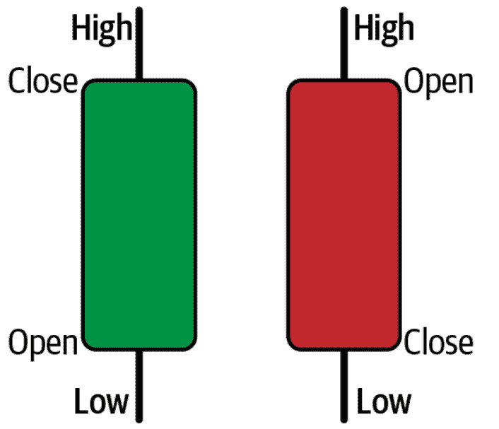
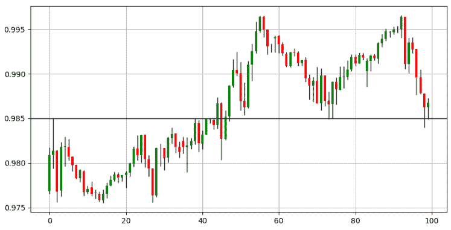
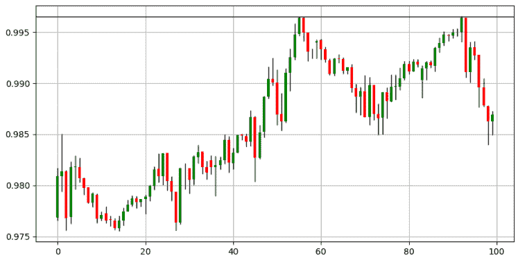
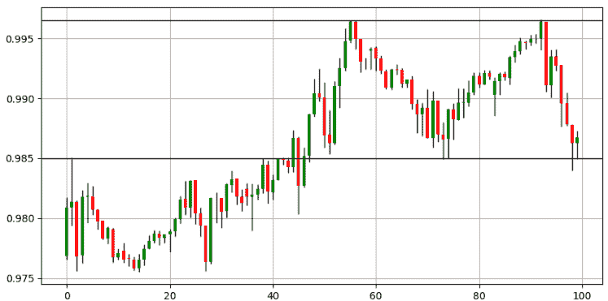
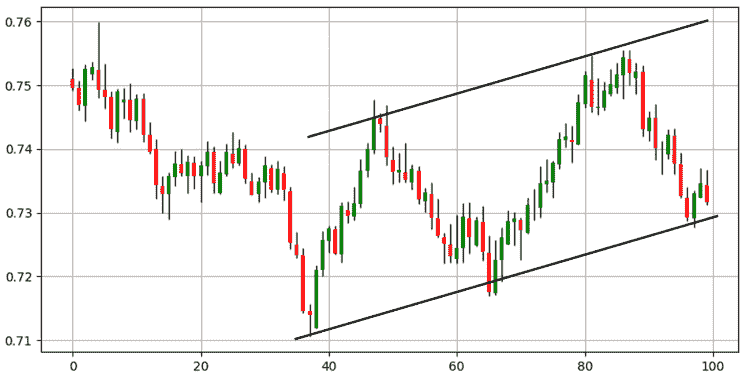
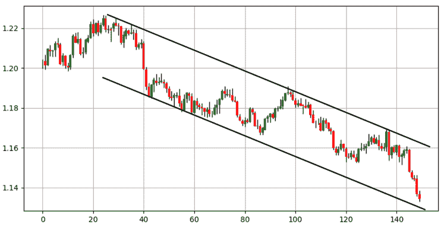
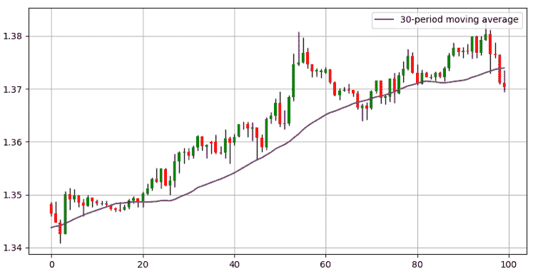
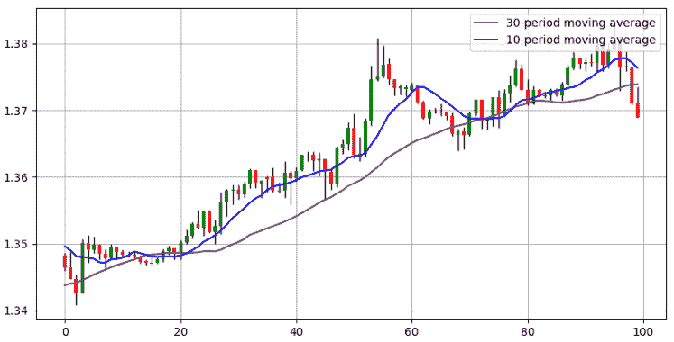
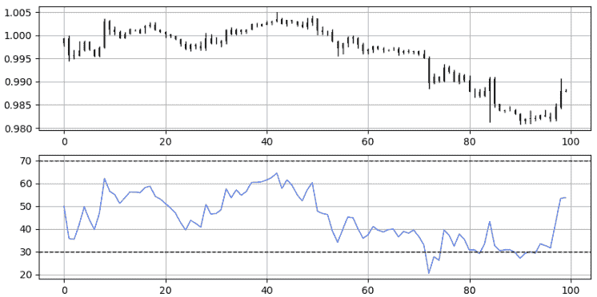
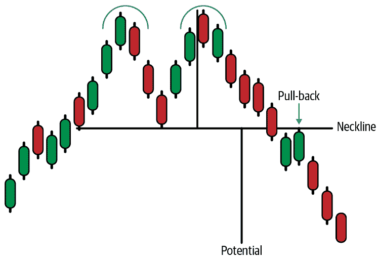

# 第五章：介绍技术分析

技术分析提供了许多类型的输入，可以用于您的深度学习模型。本章介绍了这一广阔领域，以便您具备在接下来的章节中创建基于技术的学习模型所需的知识。

*技术分析*依赖于对价格行动历史的视觉解释，以确定市场可能的总体方向。它依赖于过去是未来最好的预测者的想法。技术分析领域内有几种技术，尤其是以下几种：

图表分析

这是你将主观视觉解释技术应用于图表的地方。通常使用绘制支撑和阻力线以及回撤等方法来找到旋转点，以确定下一步的走势。

指标分析

这是你使用数学公式创建客观指标的地方，这些指标可以是趋势跟踪或逆势。已知的指标包括*移动平均线*和*相对强弱指数*（RSI），这两者在本章中都有更详细的讨论。

模式识别

这是你监视某些经常出现的配置并采取行动的地方。*模式*通常是不时出现并呈现某种理论或经验结果的事件。在金融领域，情况更为复杂，但已经证明某些模式随着时间的推移增加了价值，这可能部分归因于所谓的*自我实现预言*现象（一种初始期望导致其确认的过程）。

让我们快速浏览一下技术分析的历史，这样你就能更好地了解可以期待什么。技术分析依赖于三个原则：

历史总是在重复。

在趋势和区间中，您可能会看到集群。此外，某些配置大部分时间可能会产生类似的结果。

市场折现一切。

假设一切（所有基本、技术和定量信息）都包含在当前价格中。

市场波动。

由于不同的时间框架和需求，交易者以不同的频率买卖，因此形成趋势和波浪，而不是一条直线。

不幸的是，技术分析被零售交易社区过度炒作和滥用，这使得它在专业行业中的声誉略显不佳。每种分析方法都有其优势和劣势，有成功的基本、技术和定量投资者，但也有失败的投资者来自这三个领域。

*基本分析*依赖于经济和金融数据，以长期投资视角对特定证券或货币进行评估，而*定量分析*更加灵活，更常应用于短期数据。它使用数学和统计概念进行预测。

技术分析等假设之一是市场不是有效的，但这是什么意思？*市场效率*表明信息已经嵌入到当前价格中，价格和价值是相同的。当你购买资产时，你希望它是*被低估的*（在基本分析术语中）或*被卖过头的*（在技术分析术语中），这就是为什么你相信价格应该上涨以满足价值。因此，你假设价值大于价格。

市场效率否认了价格不等于价值的任何说法，因此建议任何 Alpha 交易不应导致高于平均水平的回报（*Alpha 交易*是进行投机操作以表现优于基准的行为，通常是指数或加权指标）。

市场效率假说是技术分析师的最大敌人，因为其原则之一是在弱式效率中，您无法从技术分析中获得超额回报。因此，技术分析在一开始就被否定，然后基本分析也受到打击。

可以合理地假设，将来市场将不得不变得高效，因为参与者数量和获取信息的便利性。然而，正如政治和异常事件所展示的，市场往往远非高效。

###### 注

触发市场恐慌和非理性的政治事件的一个例子是俄罗斯入侵乌克兰。同样，一个异常经济事件的例子是央行意外加息。

# 图表分析

在了解图表分析是什么之前，您需要知道打开图表时看到的内容，更具体地说是蜡烛图。

假设市场开盘价为 100 美元。发生了一些交易活动。让我们也记录在每小时周期内打印的最高价（102 美元）和最低价（98 美元）。还要记录每小时的收盘价（101 美元）。请记住，这四个数据被称为*开盘*、*最高*、*最低*和*收盘*（OHLC）。它们代表创建蜡烛图所必需的四个基本价格。

*蜡烛图*非常简单直观。它们是沿着时间轴的盒状元素，包含 OHLC 数据。图 5-1 展示了关于蜡烛图如何工作的一切。

###### 图 5-1。左边是一个看涨的蜡烛图；右边是一个看跌的蜡烛图

一个*看涨*蜡烛图的收盘价高于开盘价，而一个*看跌*蜡烛图的收盘价低于开盘价。

蜡烛图是分析金融时间序列的最著名方法之一。它们比简单的线图包含更多信息，比条形图提供更多的视觉可解释性。

###### 注

*线图*是通过按时间顺序连接收盘价创建的。这是绘制资产的最简单方式。它在三种图表类型中包含的信息最少，因为它只显示收盘价。

*图表分析*是通过主观绘制来找到支撑和阻力线的任务。*线*，无论是水平的还是对角线的，是预测市场反应的关键：

+   *支撑水平*是市场应该反弹的水平，因为暗示着周围的需求应该高于供应。

+   *阻力水平*是市场应该退回的水平，因为暗示着周围的供应应该高于需求。

资产在时间轴上的方向可以分为三种：*上升趋势*，价格创造更高的高点；*下降趋势*，价格创造更低的低点；*横向*（或区间），价格在同一水平周围波动一段时间。

图 5-2 显示了 EURUSD 接近 0.9850 的支撑水平。一般来说，当价格接近支撑时，交易者开始考虑买入。这是因为他们预期应该会出现向上的反应，因为力量平衡应该更多地倾向于需求（正面）方，交易者愿意支付更高的价格，因为他们预期未来价格会更高（记住之前讨论过的价格与价值的论点）。这里的含义是大多数交易者看到的价格低于价值。

###### 图 5-2。EURUSD 的蜡烛图显示支撑位于 0.9850 附近

图 5-3 显示了 EURUSD 接近 0.9960 的阻力水平。一般来说，当市场接近阻力时，交易者开始考虑做空市场。这是因为他们预期应该会出现向下的反应，因为力量平衡应该更多地倾向于供应方。

###### 图 5-3\. EURUSD 蜡烛图显示 0.9960 的阻力

横盘（横向）市场更有信心，水平支撑和阻力线将起作用。这是因为已经暗示了供需之间的一般平衡。因此，如果供应过剩，市场将迅速调整，因为需求应该足够上升以稳定价格。

图 5-4 显示了一个被困在两个水平线之间的横盘市场；这是 EURUSD 的情况。每当市场接近横盘市场的阻力线时，您应该更有信心地认为会发生下跌，而不是在上升市场中，每当它接近支撑时，您应该更有信心地认为会发生反弹，而不是在下跌市场中。

此外，图表分析也适用于趋势市场。这以上升和下降通道的形式出现。它们与水平水平具有相同的倾向，但有一个偏见（稍后讨论）。

###### 图 5-4\. EURUSD 蜡烛图显示 0.9850 的支撑和 0.9960 的阻力

图 5-5 显示了一个*上升通道*，其中支撑和阻力点随着时间的推移而上升，以反映源自稳定上升需求力量的多头压力。

###### 图 5-5\. AUDUSD 蜡烛图显示一个上升通道

看到这一点的交易员会预期每当市场接近上升通道的下部时会有多头反应，并且会预期每当市场接近通道的上部时会有空头反应。

这没有可靠的科学依据，因为没有什么规定市场必须平行移动，但自我实现的预言可能是为什么这样的通道被认为具有预测性质的原因。

图 5-6 显示了一个下降通道，其中支撑和阻力点随着时间的推移而下降，以反映源自稳定上升供应力量的空头压力。一般来说，空头通道往往更具侵略性，因为恐惧主导贪婪，卖方比买方更恐慌。

###### 图 5-6\. EURUSD 蜡烛图显示一个下降通道

我提到了处理上升和下降通道时的偏见。我将这种偏见称为*隐形之手*。原因如下：

“趋势是你的朋友。”这句话是由马丁·兹威格创造的，意思是在上升通道中，您需要更多地关注每当市场回归到支撑区域时进行买入。这是因为您希望多头压力的隐形之手增加您获胜交易的概率。同样，在下降通道的情况下，更多地关注每当市场达到上限时进行卖空。兹威格的格言的完整版本如下：“趋势是你的朋友，直到它弯曲结束。”这意味着在任何时候，市场可能改变其制度，与趋势的任何友谊都将终止。最终，图表分析是主观的，更依赖于交易员或分析师的经验。

值得一提的是，除了通过视觉估计绘制支撑和阻力水平之外，还有许多其他找到支撑和阻力水平的方法：

斐波那契回撤

这是你使用斐波那契比率来确定反应水平的地方。斐波那契回撤通常是在上升或下降趋势中计算的，这样你就知道市场如果触及这些水平将会反转。这种方法的问题在于它非常主观，就像任何其他技术一样，并不完美。优点在于它提供了许多有趣的水平。

枢轴点

使用枢轴点，您可以使用简单的数学公式找到水平。基于昨天的交易活动，您使用公式来预测今天的未来支撑和阻力水平。然后每当市场接近这些水平时，您尝试通过朝相反方向交易来淡化动作。

移动平均线

这些将在下一节中讨论。它们是动态的，跟随价格。您还可以使用它们来检测当前的市场制度。

###### 提示

找到支撑和阻力水平的最佳方法是尽可能结合多种技术，以便您有一定的方法融合，从而增加对初始想法的信心。交易是一个数字游戏，尽可能多地将赔率堆叠在您这一边应该最终增加您的系统表现的机会。

# 指标分析

*指标分析*是第二常用的技术分析工具。它通常与图表一起使用，以确认您的初始想法。您可以将*指标*视为助手。它们可以分为两种类型：

趋势跟踪指标

用于检测和交易预期继续的趋势市场。因此，它们与移动的持续性有关。

反向指标

用于淡化移动²，最好在横向市场中使用³，因为它们通常标志着初始移动的结束。因此，它们与移动的预期逆转有关（因此也与移动的反持续性有关）。

接下来的章节介绍了技术分析的两个支柱：移动平均线（趋势跟踪）和相对强弱指数（反向）。

###### 注意

指标很重要，因为您将在后续章节中的不同学习算法中将它们用作输入。

## 移动平均线

最著名的趋势跟踪叠加指标是*移动平均线*。它的简单性使其无疑成为最受欢迎的工具之一。移动平均线有助于确认和跟随趋势。您还可以使用它们找到支撑和阻力水平、止损和目标，以及了解潜在趋势。

有许多类型的移动平均线，但最常见的是简单移动平均线，其中您取收盘价的滚动平均值，如下式所示：

<math alttext="Moving average Subscript i Baseline equals StartFraction upper P r i c e Subscript i Baseline plus upper P r i c e Subscript i minus 1 Baseline plus period period period plus upper P r i c e Subscript i minus n Baseline Over n EndFraction"><mrow><mtext>Moving</mtext> <msub><mtext>average</mtext> <mi>i</mi></msub> <mo>=</mo> <mfrac><mrow><mi>P</mi><mi>r</mi><mi>i</mi><mi>c</mi><msub><mi>e</mi> <mi>i</mi></msub> <mo>+</mo><mi>P</mi><mi>r</mi><mi>i</mi><mi>c</mi><msub><mi>e</mi> <mrow><mi>i</mi><mo>-</mo><mn>1</mn></mrow></msub> <mo>+</mo><mo>.</mo><mo>.</mo><mo>.</mo><mo>+</mo><mi>P</mi><mi>r</mi><mi>i</mi><mi>c</mi><msub><mi>e</mi> <mrow><mi>i</mi><mo>-</mo><mi>n</mi></mrow></msub></mrow> <mi>n</mi></mfrac></mrow></math>

图 5-7 显示了应用在 USDCAD 上的 30 小时简单移动平均线。术语*30 小时*意味着在小时柱的情况下，我计算最新 30 个周期的移动平均值。

###### 图 5-7\. USDCAD 的蜡烛图表，带有 30 小时简单移动平均线

移动平均线的经验法则包括以下内容：

+   每当市场在其移动平均线之上时，牛市动量正在进行中，您最好寻找做多机会。

+   每当市场在其移动平均线之下时，熊市动量正在进行中，您最好寻找做空机会。

+   每当市场穿过或低于其移动平均线时，您可以说动量已经改变，市场可能正在进入新的制度（趋势）。

您还可以结合移动平均线，以便它们发出信号。例如，每当短期移动平均线穿过长期移动平均线时，就会发生牛市交叉，并且市场可能会继续上涨。这也被称为*金叉*。

相反，每当短期移动平均线穿过长期移动平均线时，就会发生熊市交叉，并且市场可能会继续下跌。这也被称为*死亡交叉*。

图 5-8 显示了 USDCAD 的 10 小时（接近市场价格）和 30 小时移动平均线（远离市场价格）。请注意，在开始时，出现了一个金叉，标志着牛市趋势的开始。

###### 图 5-8\. USDCAD 的蜡烛图表，带有 30 小时和 10 小时简单移动平均线

## 相对强弱指数

现在让我们看看反向指标。由 J. Welles Wilder Jr.首次引入，*相对强弱指数*(RSI)是最受欢迎和多功能的有界指标之一。它主要用作反向指标，极端值表明可以利用的反应。使用以下步骤计算默认的 14 周期 RSI：

1.  计算前一次收盘价格的变化。

1.  将正净变化与负净变化分开。

1.  计算正净变化的平滑移动平均和负净变化的绝对值的平滑移动平均。

1.  将正净变化除以负净变化的绝对值。将这个计算称为*相对强度*(RS)。

1.  对每个时间步骤应用这个归一化公式来得到 RSI：

<math alttext="upper R upper S upper I Subscript i Baseline equals 100 minus StartFraction 100 Over 1 plus upper R upper S Subscript i Baseline EndFraction"><mrow><mi>R</mi> <mi>S</mi> <msub><mi>I</mi> <mi>i</mi></msub> <mo>=</mo> <mn>100</mn> <mo>-</mo> <mfrac><mn>100</mn> <mrow><mn>1</mn><mo>+</mo><mi>R</mi><msub><mi>S</mi> <mi>i</mi></msub></mrow></mfrac></mrow></math>

###### 注意

*平滑*移动平均线是由 RSI 的创造者开发的一种特殊类型的移动平均线。它比简单移动平均线更平滑和稳定。

通常，RSI 默认使用 14 个回望期，尽管每个交易员可能对此有自己的偏好。以下是如何使用这个指标：

+   每当 RSI 显示 30 或更低的读数时，市场被认为是超卖的，可能会发生向上的修正。

+   每当 RSI 显示 70 或更高的读数时，市场被认为是超买的，可能会发生向下的修正。

+   每当 RSI 超过或突破 50 水平时，可能会出现新的趋势，但这通常是一个薄弱的假设，更多是理论性的而不是实际性的。

图 5-9 显示了 EURUSD 与其 14 周期 RSI 的对比。指标应该用来确认长期或短期偏向，并且在时机和分析当前市场状态方面非常有帮助。

###### 图 5-9。在顶部面板显示每小时 EURUSD 值，底部面板显示 14 周期 RSI

总结一下，指标可以用许多方式计算。最常用的两种是移动平均线和 RSI。

# 模式识别

*模式*是一种重复出现的配置，显示了随后移动的具体预测。模式可以分为以下类型：

经典价格模式

这些是已知的技术反转价格模式，非常主观，由于难以在不考虑主观条件的情况下进行回测，因此可能不可靠。然而，它们仍然被许多交易员和分析师使用。

时间模式

基于时机和价格的组合，这些模式不太为人所知，但在正确使用时可能会很强大和具有预测性。

蜡烛图模式

这是使用 OHLC 数据来预测市场未来反应的地方。蜡烛图是可视化图表的最佳方式之一，因为它们包含许多可能预示反转或确认移动的模式。

经典价格模式指的是理论配置，如双顶和矩形。它们通常是反转或持续模式：

持续价格模式

这些是确认总体持续移动的配置。例如矩形和三角形。

反转价格模式

这些是淡化总体持续移动的配置。例如头肩和双底。

老派的图表分析师熟悉双顶和双底，它们预示着反转并给出了这种反转的潜力。尽管它们很简单，但它们是主观的，有些不像其他的那么明显。

这阻碍了了解它们是否具有价值的能力。图 5-10 显示了一个双顶的图示，当验证模式后给出了一个看跌的偏向，通常是打破连接两个顶部之间低点的线。这条线被称为*颈线*。

###### 图 5-10。双顶图示

注意双顶中的这三个重要元素：

颈线

这是连接两个峰值之间的最低点和图案的开始/结束的线。它用于确定回撤水平。

回撤

打破颈线后，市场应该朝着颈线做出绝望的尝试，但由于卖方利用这一水平重新进场继续做空，未能继续上涨。因此，回撤水平是验证双顶后的理论最佳卖出点。

潜力

这是双顶的目标。它被测量为图案顶部和下降的颈线之间的中点，并从相同的颈线点开始。

双顶或双底可以有任何大小，但最好是对大多数市场参与者可见，以便其影响更大。从心理上讲，该模式的解释是，随着第二个顶部或底部，市场未能将价格推高超过第一个峰值，因此显示出弱势，这可能会被卖方利用。

还有其他更客观的模式；即它们具有明确的检测和启动规则。所有这些都基于明确的客观条件，不受分析师自行决定的影响。这有助于它们的回测和评估。

在结束本章之前，我想指出技术分析的一些误解和最佳实践，以便您正确开始。

# 技术分析的常见陷阱

技术分析可能被滥用，这不幸地引发了关于其效用和与基本分析相对位置的永恒辩论。重要的是设定正确的期望，并保持在逻辑思维的范围内。本节讨论了技术分析的已知陷阱，您必须确保避免这些陷阱，以最大限度地提高您在金融丛林中的生存率。

## 想要快速致富

这个陷阱主要是心理上的，因为它涉及缺乏纪律和糟糕的管理。为了尽快赚钱以打动社会，推动交易员在交易和与交易相关的活动中做出情绪化和糟糕的决策。

这也与需要赚钱的事实有关，您可能会不断更改交易计划，因为您相信新计划是通往财富的更快途径。

当您对自己没有足够的信心，并认为其他人比您更擅长赚钱时，您更有可能跟随他们，尤其是因为他们提供的信息非常丰富。除了您之外，没有人能改变您的未来。

## 强迫模式

一种常见的心理缺陷，称为*确认偏见*，阻止交易员看到与他们已经建立的观点相矛盾的信号。

有时，您对某些市场有初步看法，因此开始寻找任何与该看法一致的东西，这也可能导致即使没有有效性也会强行出现模式。

###### 警告

您必须始终保持中立的分析态度，并谨慎对待各个元素，同时保持最大的客观性。当然，这说起来容易做起来难，绝对中立的最佳替代方案是算法方法，这会以人类智力因素为代价。

## 事后偏见，梦想粉碎者

技术分析在过去看起来不错。一切都显而易见且易于预测，即使使用非常基本的策略；然而，当您应用后者时，您会发现由于严酷的现实，您的大脑被编程为欺骗您相信过去是完全可预测的。

这也是为什么回测结果几乎总是优于前向测试的原因。当你看过去的模式并相信它们应该很容易被发现时，你展现了“事后诸葛亮”的偏见。为了解决这个问题，你必须使用无偏算法进行回测。只有这样，你才能确定模式是否有价值。许多零售交易者陷入了这样一个陷阱，他们对过去进行了一般和简单的审视，以确定他们的策略的有效性，结果却表现不佳。

## 假设过去的事件会有相同的未来结果

你听过这句谚语“历史不会重复，但往往会押韵。”这句话是理解市场运作方式的关键。当你应用技术分析时，不要期望从过去的信号和模式中得到确切的结果。相反，你必须将它们作为指导和概率元素，表明市场可能会有类似的反应，可以与过去的反应相关联。

交易是一个数字游戏，你必须让胜算倾向于你这边。当人类面对类似事件时，有时会表现出相同的行为。然而，随着不同的参与者不断进入和离开买卖活动，他们的动机也在不断变化，你可以肯定，在遇到类似过去的模式时，市场的未来反应不会完全相同，尽管它可能与过去“押韵”，意味着它可能在平均水平上与过去有相关的反应。

说到这一点，不要期望每次看到明显模式时都能完美地把握市场的时机。

## 把事情搞得比必要的更复杂

另一句谚语是“一切都应该尽可能简单，但不要过于简单。”这是对你应该如何进行研究和交易的完美描述。

金融市场是高度复杂的、半随机的环境，需要的不仅仅是简单的策略，但策略也不能太复杂，以至于陷入“过拟合”的陷阱，这是一个常见问题，交易者完美地预测过去，并假设未来会完全相同，从而导致过去有巨大的纸面收益，但未来却有巨大的实际损失。

# 总结

技术分析提供了一系列工具来对市场进行数学、图形或甚至心理（通过模式）分析。这一章标志着在开始本书的真正目的之前进行热身练习的结束，即用于交易和预测目的的机器和深度学习应用。这一章的学习成果应该是对技术分析是什么以及其局限性的深刻理解。同样，你还应该对我提出的两个主要技术指标有深刻的理解：移动平均线和相对强弱指标，因为它们构成了即将出现的模型的关键特征。

¹ 这假设了一个长期显示确定性特征的非随机概率。

² 反向操作是一种交易技术，你在与正在进行的趋势相反的方向进行交易，希望能够把握其结束的时机。

³ 横盘市场通常处于均衡状态，没有特定的趋势描述它们。它们往往在彼此接近的高点和低点之间摇摆。

⁴ 参见 J.韦尔斯·怀尔德（1978）的《技术交易系统中的新概念》，由趋势研究出版。
