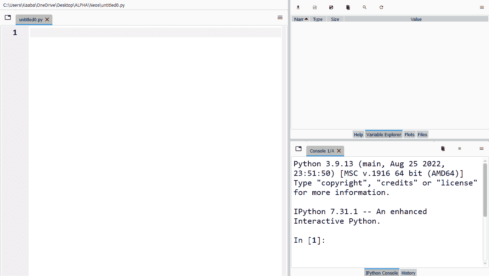
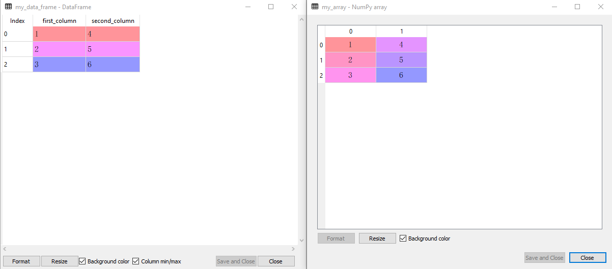
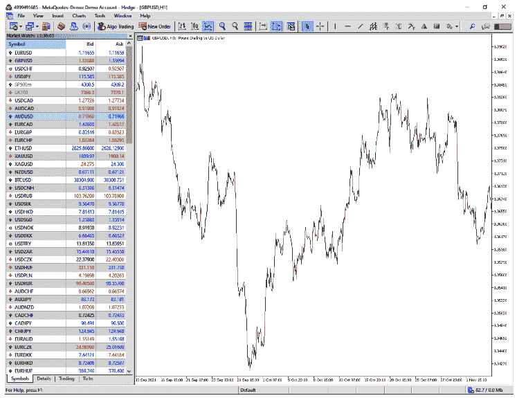
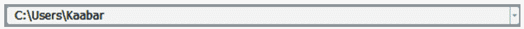

# 第六章：数据科学的 Python 入门

在深入机器和深度学习领域之前还有一个停留。对于有经验的 Python 开发人员来说，本章是可选的，但对于没有扎实编程背景的任何人来说都是至关重要的。了解算法背后的直觉是一个很大的优势，但如果未能正确实现它们，这将无法让您走得更远。毕竟，这些算法需要代码来工作，而不是手动操作。确保了解基本语法以及如何操作数据和转换数据。

由于本书不是 Python 编程的 A-Z 指南，本章只是简要介绍了一些基本知识和一些技术，这些应该有助于您顺利地浏览后续章节。

# 下载 Python

*编码*被定义为一组旨在由计算机执行的指令。通常需要特定的语法，以便计算机应用这组指令而不出现错误。有许多编码语言，分为两大类：

低级编码语言

这些通常是用于操作系统和固件的机器语言。它们很难阅读。这些语言对硬件有相当大的控制。低级语言的一个例子是汇编语言（及其各种类型）。

高级编码语言

这些是用户友好的语言（具有高度抽象）。它们通常用于编写程序和软件。高级语言的一个例子是 Python 和 Julia。

本书使用的编程语言是*Python*，这是一种流行且多功能的语言，具有许多优势，并在研究和专业社区中被广泛采用。正如您从章节名称中看到的那样，您将看到 Python 的简介以及开始构建自己脚本所需的必要工具。但在此之前，让我们看看如何实际下载 Python。

*Python 解释器*是一种用于编写和执行使用 Python 语法编写的代码的软件。我使用一个名为*Spyder*的软件。有些人可能更熟悉其他解释器，如*Jupyter*和*PyCharm*，但过程是相同的。您可以从[官方网站](https://www.spyder-ide.org/)下载*Spyder*，或者更好地，将其作为一个更大的软件包的一部分下载，该软件包称为[Anaconda](https://oreil.ly/nI8Ed)，它简化了安装并提供了更多工具。请注意，这是一个开源且免费使用的软件。

*Spyder*的界面分为三个窗口，如图 6-1 所示。左侧的窗口用于编写稍后执行的代码（告诉算法运行并应用代码）。通常，您会在该区域看到多行代码。

右上角的窗口是*变量资源管理器*。每次存储（定义）一个变量，您都可以在那里看到它。右下角的窗口是*控制台*，显示代码的结果，无论是错误还是输出。



###### 图 6-1。Spyder 的界面

Python 文件的扩展名为*name.py*，它们允许您保存代码并在以后引用它。您还可以打开多个代码文件并在它们之间导航。本章的大纲如下：

1.  了解 Python 语言以及如何编写无错误的代码。

1.  了解如何使用控制流以及在时间序列分析中的重要性。

1.  了解库和函数是什么以及它们在促进编码中的作用。

1.  了解如何处理错误及其不同类型。

1.  了解如何使用数据操作库，如`numpy`和`pandas`。

1.  最后，看看如何将历史财务时间序列数据导入 Python，以便使用您在之前章节和即将到来的章节中看到的适当工具进行分析。

# 基本操作和语法

*语法*是编写无错误代码的正确方式，它是编写功能代码所需的语句结构。当您与计算机交流时，必须确保它理解您，因此，对语法有扎实的理解很重要。

理解代码伴随着一个有用的操作，称为注释。*注释*是用于解释紧随其后的可执行代码的非可执行代码。这是为了让其他程序员理解代码。注释前面有一个井号**#**：

```py
`# This is a comment. Comments are ignored by the interpreter`

`# Comments explain the code or give more details about its use`

`# Comments are written in one line, otherwise, you have to re-write '#'`
```

###### 注意

确保您理解注释是不可执行的。这意味着当您运行（执行）代码时，解释器将忽略它们，不会返回错误。

有时您需要为代码编写文档，这可能需要多行代码（甚至在某些情况下是段落）。在每一行写井号符号可能会很繁琐和混乱。这就是为什么有一种方法可以编写长注释。为此，您必须在每个末尾之间写三个引号：

```py
'''

Python was created in the late 1980s by Guido van Rossum.

The name "Python" was inspired by the comedy group Monty Python.

'''

```

值得注意的是，三引号被认为是*文档字符串*，而不是真正的注释（根据官方 Python 文档）。

让我们讨论变量和常量。*常量*是一个固定值，不会改变，而*变量*在事件发生时会取不同的值。常量可以是数字 6，而变量可以是字母*x*，根据一组条件或状态取任何数字。使用'='运算符定义变量：

```py
`# Defining a variable`
x = 10
y = 5

`# Writing a constant`
6

```

运行上述代码将在变量资源管理器中存储变量*x*和*y*及其相应的值。同时，代码的输出将是 6。变量是区分大小写的，因此：

```py
`# Declaring my_variable`
my_variable = 1

`# Declaring My_variable`
My_variable = 2

`# The variable my_variable is different from My_variable`
```

变量声明不能以数字开头，但可以在名称中间或结尾包含一个数字：

```py
`# Returns a SyntaxError`
1x = 5

`# Valid declaration`
x1 = 5

`# Valid declaration`
x1x = 5

```

变量也可以包含下划线，但不能包含其他内容：

```py
`# Returns a SyntaxError`
x-y = 5

`# Valid declaration`
x_y = 5

```

强烈建议变量简短而直接。例如，考虑创建一个保存某个移动平均值的回溯期的变量（在第五章中介绍的概念）：

```py
`# Recommended name`
ma_lookback = 10

`# Not recommended name`
the_lookback_on_that_moving_average = 10

```

有几种不同特征的数据类型：

*数值数据类型*

这是最简单的数据类型。它完全由数字组成。数值数据类型进一步分为整数、浮点数和复数。*整数*是简单的整数（正数或负数）。整数的一个例子是 6 和-19。*浮点数*比整数更精确，因为它们包含逗号后的值。浮点数的一个例子是 2.7 和-8.09。*复数*包括虚数，比其他两种类型不太相关。

*字符串*

正如您之前看到的注释和文档字符串一样，可以在代码旁边写文本而不会干扰执行过程。*字符串*是表示字符序列的文本结构。字符串可以是函数的输入和参数，而不仅仅是注释。

*布尔值*

这是一个二进制（真或假）数据类型，用于评估给定表达式或条件的真值。例如，您可以使用布尔值来评估市场价格是否高于或低于 100 周期移动平均线。

*数据收集*

这些是包含多个具有不同和独特用途的数据的序列。*数组*是相同类型元素的序列（主要是数字）。数组将在本书中经常使用（与本章讨论的名为`numpy`的 Python 库一起使用）。*数据框*是结构化数据的二维表，也经常在本书中使用（与本章讨论的名为`pandas`的 Python 库一起使用）。*集合*是无序元素的序列。*列表*是可以是不同数据类型的有序元素集合。*元组*是有序的、不可变的元素集合，可以是不同数据类型。它用于存储一系列固定值。*范围*是一个内置的 Python 函数，返回一系列数字。范围函数在循环中经常使用。*字典*表示一组键值对组合。

以下代码片段显示了一些关于数值数据类型的示例：

```py
`# Creating a variable that holds an integer`
my_integer = 1

`# Creating a variable that holds a float number`
my_float_number = 1.2

`# Using the built-in Python function type() to verify the variables`
type(my_integer)
type(my_float_number)

```

输出应该如下所示（请记住井号符号后的任何内容都是注释，不会被执行）：

```py
int `# The output of type(my_integer)`

float `# The output of type(my_float_number)`

```

字符串只是文本。解释字符串的最著名例子是"*Hello World*"短语，如下面的代码片段所解释的：

```py
`# Outputting the phrase "Hello World"`
print('Hello World')
```

输出应该如下所示：

```py
Hello World
```

字符串也可以作为函数中的参数使用，这两个概念您将在本章后面看到。

如前面列表中提到的，布尔值要么为真，要么为假。以下代码片段显示了使用它们的示例：

```py
`# Make a statement that the type of my_integer is integer`
type(my_integer) is int

`# Make a statement that the type of my_float_number is float`
type(my_float_number) is float

`# Make a statement that the type of my_integer is float`
type(my_integer) is float

'''
Intuitively, the two first statements will return True as they are 
indeed true. The third statement is False as the variable my_integer
is an integer and not a float number

'''

```

前面代码的输出如下：

```py
True
True
False

```

让我们讨论运算符的工作原理。您实际上已经看到了一个运算符的示例，即用于定义变量的赋值运算符'='。*运算符*在变量、常量甚至数据结构之间执行特殊的数学和其他任务。有不同类型的运算符。让我们从*算术运算符*开始，如下面的代码片段所示：

```py
`# Arithmetic operator - Addition`
1 + 1 `# The line outputs 2`

`# Arithmetic operator - Subtraction`
1 - 1 `# The line outputs 0`

`# Arithmetic operator - Multiplication`
2 * 2 `# The line outputs 4`

`# Arithmetic operator - Division`
4 / 2 `# The line outputs 2.0 as a float number`

`# Arithmetic operator - Exponents`
2 ** 4 `# The line outputs 16`

```

比较运算符是下一种运算符，用于比较不同的元素。它们主要用于控制流事件，如本章的下一部分所解释的那样。以下代码片段显示了一些比较运算符：

```py
`# Comparison operator - Equality`
2 == 2 `# The line outputs True`

`# Comparison operator - Non equality`
2 != 3 `# The line outputs True`

`# Comparison operator - Greater than`
2 > 3 `# The line outputs False`

`# Comparison operator - Greater than or equal to`
2 >= 2 `# The line outputs True`

`# Comparison operator - Less than`
2 < 3 `# The line outputs True`

`# Comparison operator - Less than or equal to`
2 <= 2 `# The line outputs True`

```

*逻辑运算符*结合两个或多个稍后进行评估的条件。有三个逻辑运算符：`and`、`or`和`not`。以下代码块显示了逻辑运算符的示例：

```py
`# Logical operator - and`
2 and 1 < 4 `# The line outputs True`
2 and 5 < 4 `# The line outputs False`

`# Logical operator - or`
2 or 5 < 4 `# The line outputs 2 which is the integer less than 4`

```

数据收集结构（数组和数据框）将在后面的部分中讨论，因为它们由于其复杂性和独特工具而需要深入介绍。让我们用一个代码来结束这一部分，总结到目前为止讨论的内容：

```py
`# Declaring two variables x and y and assigning them values`
x = 10
y = 2.5

`# Checking the types of the variables`
type(x) `# Returns int`
type(y) `# Returns float`

`# Taking x to the power of y and storing it in a variable z`
z = x ** y `# Returns 316.22`

`# Checking if the result is greater than or equal to 100`
z >= 100 `# Returns True as 316.22 >= 100`
```

# 控制流

条件语句构成了所谓控制流的第一部分（第二部分是循环）。*条件语句*是今天人工智能的祖先，因为它们只在满足某些条件时执行代码。

条件语句使用`if`、`elif`和`else`进行管理。以以下代码片段为例来澄清事情：

```py
`# Declaring the variables`
a = 9
b = 2

`# First condition (specific)`
if a > b:

    print('a is greater than b')

`# Second condition (specific) `   
elif a < b:

    print('a is lower than b')

`# Third condition (general)`   
else:

    print('a is equal to b')

```

因此，条件语句以`if`开头，然后对于每个新的唯一和特定条件，使用`elif`，直到有意义使用概率宇宙的其余部分作为独立的条件，这是由`else`语句使用的。请注意，`else`语句不需要条件，因为它存在以覆盖未覆盖的宇宙的其余部分。

*循环*用于重复执行代码块，直到满足预定义条件。循环在时间序列中广泛使用，用于计算指标、验证状态和回测交易策略。

循环使用`for`（用于迭代有限和定义的序列或一系列元素）和`while`（用于在满足条件之前继续迭代）语句进行管理。以打印值{1, 2, 3, 4}的循环为例：

```py
`# Using a for loop`
for i in range(1, 5):

    print(i)

`# Using a while loop  `
i = 1    
while i < 5:

    print(i)
    i = i + 1

```

当被翻译时，`for`循环简单地表示对于每个称为`i`（或者根据编码者而定的其他字母）的元素，在从 1 开始到 5 结束的范围内（不包括 5），在每次循环中打印`i`的值（因此，在第一个循环中，`i`的值等于 1，在第二个循环中，它等于 2）。

当被翻译时，`while`循环表示从`i = 1`的值开始，循环时，打印其值，然后在完成第一个循环之前将其加 1。当`i`变大于 4 时结束循环。

###### 注意

理论上，`while`循环是无限的，直到另有说明为止。

值得注意的是`i = i + 1`也可以表示为`i += 1`。算法的目标是能够以客观的方式递归地应用许多操作，这使得循环特别有用，尤其是与条件语句结合时。让我们以一个金融时间序列的例子来说明：

1.  创建一个值范围来模拟假设的每日收盘价。

1.  在创建条件时循环遍历数据范围，如果价格从上一期上涨，则打印 1。同样，如果价格从上一期下跌，则打印-1。最后，如果价格与上一期没有变化，则打印 0。

这可以在以下代码块中完成：

```py
`# Creating the time series`
time_series = [1, 3, 5, 2, 4, 1, 6, 4, 2, 4, 4, 4]

for i in range(len(time_series)):

    `# The condition where the current price rose`
    if time_series[i] > time_series[i - 1]:

        print(1)

    `# The condition where the current price fell`
    elif time_series[i] < time_series[i - 1]:

        print(-1) 

    `# The condition where the current price hasn't changed`
    else:

        print(0)

```

该代码定义了一个值列表（在这种情况下，一个名为`time_series`的时间序列），然后使用`len()`函数循环遍历其长度以应用条件。请注意，在每次循环中，当前时间步被称为`i`，因此上一个时间步为`i - 1`。

# 库和函数

在 Python 中，*库*是一组预先编写的代码，提供功能以使应用程序的创建更容易。*模块*是单独的 Python 文件，具有可重复使用的代码和数据，可以被导入和在其他 Python 代码中使用，通常在库中找到。因此，模块是一个包含函数和其他类型代码的单个 Python 文件，可以被其他 Python 程序使用和导入。通过使用模块将相似的代码分成不同的文件，通常更容易管理和维护大型代码库。

编码是简化任务并使其更清晰的过程。当你有一个重复的任务，比如计算时间序列的移动平均值时，你可以使用一个函数，这样你就不必每次想使用它时都重新编写移动平均代码。相反，你定义一个带有原始代码的函数，然后在需要计算移动平均值时调用它。但是什么是*函数*？它是一个可重复使用的代码块，当被调用时执行特定任务。它需要被定义一次。

多个函数形成一个模块，多个模块形成一个库。一个库通常是以主题为导向的。例如，在这本书中，将使用`sklearn`库与机器学习模型。类似地，数据操作和导入是使用`numpy`和`pandas`完成的，这两个库在本章的后面部分讨论。绘图和图表是使用`matplotlib`库完成的。

在使用之前，必须先将库导入到 Python 解释器中。这样做的语法如下：

```py
`# The import statement must be followed by the name of the library`
import numpy

`# Optionally, you can give the library a shortcut for easier references`
import numpy as np

```

有时，你需要从库中导入一个函数或模块。为此，你不需要导入整个库：

```py
`# Importing one function from a library`
from math import sqrt

```

因此，已经确定`math`是一个 Python 库，其中包含许多数学函数，即`sqrt`函数，用于找到给定数字的平方根。让我们看看如何定义一个函数。函数使用`def`后跟函数的名称和任何可选参数来定义。考虑以下示例，创建一个对任意两个给定变量求和的函数：

```py
`# Defining the function sum_operation and giving it two arguments`
def sum_operation(first_variable, second_variable):

    `# Outputing the sum of the two variables`
    print(first_variable + second_variable)

`# Calling the function with 1 and 3 as arguments`
sum_operation(1, 3) `# The output of this line is 4`

```

###### 注意

调用一个函数意味着执行它应该做的事情。换句话说，调用一个函数就是使用它。函数的时间线是被定义然后被调用。

让我们看看如何从库中导入函数并使用它的函数：

```py
`# Importing the library`   
import math

`# Using the natural logarithm function`
math.log(10)

`# Using the exponential function (e)`
math.exp(3)

`# Using the factorial function`
math.factorial(50)

```

作为一则旁注，*阶乘*操作是一种数学操作，用于计算从 1 到某个数字（在`math.factorial()`中请求的参数）的所有正整数的乘积。

库可能不像 1 加 1 那么简单。有时，外部库在能够导入 Python 解释器之前需要先安装。安装可以通过提示符使用以下语法完成：

```py
pip install library_name
```

让我们回到第三章讨论过的 MIC。在 MIC 的以下已经看到的代码之前：

```py
`# Importing the library`
from minepy import MINE

`# Calculating the MIC`
mine = MINE(alpha = 0.6, c = 15)
mine.compute_score(sine,cosine)
MIC = mine.mic()
print('Correlation | MIC: ', round(MIC, 3))
```

直接导入库可能会导致错误，因为它尚未通过 pip 安装。因此，您必须首先使用提示符上的以下语法进行安装（而不是 Python 解释器）：

```py
pip install minepy
```

重要的是阅读随库提供的文档，以便正确使用它们。*文档*有助于了解函数的目的以及应该放入哪些参数。此外，它告诉您函数可以接受什么类型的参数（例如，字符串或数字）。现在让我们回到函数（注意它们是如何交织在一起的，讨论一个可能导致讨论另一个）。

函数可以有一个`return`语句，允许将结果存储在一个变量中，以便在代码的其他部分中使用。让我们举两个简单的例子，然后逐步讨论它们：

```py
`# Defining a function to sum two variables and return the result`
def sum_operation(first_variable, second_variable):

  `# The summing operation is stored in a variable called final_sum`
    final_sum = first_variable + second_variable

    `# The result is returned`
    return final_sum

`# Create a new variable that holds the result of the function    `
summed_value = sum_operation(1, 2)

`# Use the new variable in a new mathematical operation and store the result` double_summed_value = summed_value * 2

```

前面的代码定义了`sum_operation`函数，带有两个参数，然后将操作存储在一个名为`final_sum`的变量中，然后返回它，以便可以将其存储在外部。然后，定义一个名为`summed_value`的新变量，作为函数的输出。最后，另一个名为`double_summed_value`的变量被创建，其结果是`summed_value`乘以 2。这是一个关于如何在外部操作中使用函数结果作为变量的示例。现在，让我们考虑另一个示例（同时记住先前定义的`sum_operation`函数）：

```py
`# Defining a function to square the result gotten from the sum_operation function`
def square_summed_value(first_variable, second_variable):

  `# Calling the nested sum_operation function and storing its result`
    final_sum = sum_operation(first_variable, second_variable)

  `# Creating a variable that stores the square of final_sum`
    squared_sum = final_sum ** 2

    `# The result is returned   ` 
    return squared_sum

`# Create a new variable that holds the result of the function`  
squared_summed_value = square_summed_value(1, 2)

```

最新的代码片段定义了一个名为`square_summed_value`的函数，它接受两个参数。此外，它在内部使用了一个嵌套函数，这种情况下是`sum_operation`。嵌套函数的结果再次存储在一个名为`final_sum`的变量中，该变量用作查找`squared_sum variable`的输入。该变量被找到为`final_sum`的平方。这是一个关于如何在函数内部创建其他函数的示例（换句话说，嵌套函数）。

让我们以 Python 和机器学习中常见的库结束本节（除了`numpy`和`pandas`）：

```py
matplotlib `# For plotting and visualizing data`
sklearn    `# For machine learning models`
scipy      `# For scientific computing and optimization`
keras      `# For neural networks`
math       `# For using mathematical tools such as square roots`
random     `# For generating random variables`
requests   `# For making HTTP requests used in web scraping`

```

# 异常处理和错误

经常会因为代码在执行过程中出现问题而遇到错误。换句话说，当代码执行时，解释器发现阻止其继续进行的障碍时，就会发生错误。最基本的错误是*SyntaxError*，当有拼写错误或缺少元素使代码无法理解时会发生：

```py
`# Will not output a SyntaxError if executed`
my_range = range(1, 10)

`# Will output a SyntaxError is executed`
my_range = range(1, 10

```

从前面的代码中可以看到，第二行代码末尾缺少一个括号，这个错误解释器无法理解。这种类型的错误可能是最常见的。另一个常见的错误是*NameError*，当在执行包含它的代码之前未定义变量时会发生。考虑以下示例：

```py
x + y
```

前面的代码会给出一个*NameError*，因为解释器不知道`x`和`y`的值，因为它们没有被定义。

*ModuleNotFoundError*发生在解释器无法找到您尝试导入的库或模块时。这通常发生在它安装在错误的目录或未正确安装时。解决此问题的常见方法包括：

+   验证模块的名称是否已正确书写。

+   验证模块是否已正确通过 pip 安装。

+   验证模块是否安装在正确的位置。

另一种常见错误类型是*TypeError*，当你在不兼容的元素上应用某种操作时会发生，比如将整数与字符串相加。以下操作会引发*TypeError*：

```py
`# Defining variable x`
x = 1

`# Defining variable y`
y = 'Hello

`# Summing the two variables which will raise a TypeError`
x + y

```

在时间序列分析中，你可能会遇到这四种错误：

+   *IndexError*: 当涉及到当前数组或数据框范围之外的索引时，会引发此错误。想象一下有一个包含 300 个值（行）的数组。如果你想循环遍历它们，并在每次循环时将数字 1 输入到下一个单元格（时间步长+1），你很可能会遇到*IndexError*，因为在最后一个循环中，没有下一个单元格，解释器会引发此错误。

+   *ValueError*: 当你尝试使用无效参数调用函数时会引发此错误。例如，尝试在调用函数时将整数元素传递为字符串。

+   *KeyError*: 当尝试访问数据框中不存在的元素时会发生此错误。例如，如果数据框中有三列，而你引用了一个不存在的列（可能是由于语法问题），你很可能会遇到*KeyError*。

+   *ZeroDivisionError*: 这个错误很直观，当尝试将一个数字除以零时会发生。

你可能会遇到其他类型的错误。重要的是要理解它们指的是什么，这样你才能够修复它们。

另一方面，*Exceptions*可能对代码并不致命，因为它们只是显示一个警告，但不一定终止代码。因此，异常发生在执行过程中（与错误不同，错误是因为解释器无法执行）。

###### 注意

理解错误将有助于你修复它并使代码重新运行。

为了忽略某些异常，使用`try`和`except`关键字。当你确信处理异常不会改变代码的输出时，这是很有用的。让我们举一个例子，创建一个函数，将时间序列的第一列除以第二列的下一个值。第一步是将时间序列定义为数据框或数组（或任何其他数据集合结构）：

```py
`# Importing the required library to create an array`
import numpy as np

`# Creating a two-column list with 8 rows`
my_time_series = [(1, 3), 
                  (1, 4), 
                  (1, 4), 
                  (1, 6), 
                  (1, 4), 
                  (0, 2), 
                  (1, 1), 
                  (0, 6)]

`# Transforming the list into an array`
my_time_series = np.array(my_time_series)

```

现在，让我们编写一个除以第二列中的下一个值的除法函数，该函数将接受第一列中的任何值：

```py
`# Defining the function`
def division(first_column, second_column):

 `# Looping through the length of the created array`
    for i in range(len(my_time_series)):

        `# Division operation and storing it in the variable x`
        x = my_time_series[i, first_column] / my_time_series[i + 1, second_column]

        `# Outputting the result`
        print(x)

`# Calling the function`
division(0, 1)

```

运行前两个代码块将会产生*IndexError*，因为在最后一个循环中，函数找不到第二列的下一个值，因为它根本不存在：

```py
IndexError: index 8 is out of bounds for axis 0 with size 8
```

通过`try`和`except`来修复这个问题将忽略导致问题的最后一个计算，并返回预期的结果：

```py
`# Defining the function`
def division(first_column, second_column):

    `# Looping through the length of the created array`   
    for i in range(len(my_time_series)):

 `# First part of the exception handling`
        try:

            `# Division operation and storing it in the variable x`
            x = my_time_series[i, first_column] / my_time_series[i + 1, second_column]

  `# Outputting the result`         
            print(x)

        `# Exception handling of a specific error  `   
        except IndexError:

            `# Ignoring (passing) the error`
            pass

`# Calling the function`
division(0, 1)

```

输出如下：

```py
0.25
0.25
0.16666666666666666
0.25
0.5
0.0
0.16666666666666666
```

本节讨论了错误和异常以及如何处理这些问题。在接下来的章节中，由于其简单性和有效性，这些问题将使用`try`和`except`块来处理。

# Numpy 和 Pandas 中的数据结构

`numpy` 和 `pandas` 这两个词可能对你来说很熟悉，因为我在前几章的大部分代码片段中都用到了它们。此外，你现在了解了什么是库，因此你知道这两个库是用来在 Python 中操作、处理和导入数据的首选库。本节展示了这两者之间的区别以及它们的关键功能，这绝对是你数据分析的重要补充。但首先，让我们定义这两个库：

*numpy*

NumPy（Numerical Python 的缩写）是一个允许处理多维数组和矩阵的 Python 库。NumPy 提供了一个强大的接口，用于对数组和矩阵执行各种操作。

*pandas*

Pandas（Panel Data 的缩写）是一个允许处理数据框（一种表格数据类型）的 Python 库。Pandas 提供了两种主要的数据结构：series 和 data frames。*series* 是一个类似于一维数组的对象，可以保存任何数据类型。*data frame* 是一个类似于二维表格的结构，由行和列组成（类似于电子表格）。

这两个库在分析时间序列数据方面非常有用。数组仅包含数值类型数据，因此与数据框不同，它们实际上不包含日期类型数据。这可能是使用`pandas`相对于`numpy`的优势之一，但两者都有各自的优势和相对弱点。最终，这是一个选择的问题。本书将优先使用 numpy，因为其简单性以及下一章中看到的机器学习模型使用`sklearn`库，该库适用于数组。这不应阻止您在准备应用模型之前使用数据框。

###### 注意

在`numpy`和`pandas`之间切换需要转换时间序列类型。这是一个相对容易的任务，但有时可能会导致某些类型数据的丢失（例如日期数据）。

让我们在开始之前导入这两个库，看看它们的一些潜力：

```py
import numpy as np
import pandas as pd

```

以下代码创建了两个具有两列和三行的时间序列。第一个时间序列称为`my_data_frame`，使用`pandas`的`pd.DataFrame`函数创建。第二个时间序列称为`my_array`，使用`numpy`的`np.array`函数创建：

```py
`# Creating a data frame`
my_data_frame = pd.DataFrame({'first_column' : [1, 2, 3], 
                              'second_column' : [4, 5, 6]})

`# Creating an array`
my_array = np.array([[1, 4], [2, 5], [3, 6]])

```

如图 6-2 所示，数据框具有真实的索引并且可以有列名。数组是纯数值的，不允许这样做：



###### 图 6-2。左侧是数据框（pandas），右侧是数组（numpy）

在两种数据类型之间切换是非常直观的，因为您将使用前一个代码块中使用的相同两个函数：

```py
`# To transform my_data_frame into my_new_array`
my_new_array = np.array(my_data_frame)

`# To transform my_array into my_new_data_frame`
my_new_data_frame = pd.DataFrame(my_array)

```

###### 注意

您可以注意到`my_new_data_frame`没有列名。

现在让我们看一些在处理模型时会派上用场的有用函数。切片、连接和其他工具是您必须掌握的东西，以便顺利地在数据分析部分中导航。考虑以下数组：

```py
first_array  = np.array([ 1,  2,  3,  5,   8,  13])
second_array = np.array([21, 34, 55, 89, 144, 233])

```

*连接*是将两个数据集通过行（axis = 0）或列（axis = 1）融合在一起的行为。让我们都做一遍：

```py
`# Reshaping the arrays so they become compatible in multidimensional manipulation` first_array  = np.reshape(first_array, (-1, 1))
second_array = np.reshape(second_array, (-1, 1))

`# Concatenating both arrays by columns`
combined_array = np.concatenate((first_array, second_array), axis = 1)

`# Concatenating both arrays by rows`
combined_array = np.concatenate((first_array, second_array), axis = 0)

```

现在，让我们为数据框做同样的事情。考虑以下数据框：

```py
first_data_frame  = pd.DataFrame({'first_column'  : [ 1,  2,  3], 
                                  'second_column' : [ 4,  5,  6]})
second_data_frame = pd.DataFrame({'first_column'  : [ 7,  8,  9], 
                                  'second_column' : [10, 11, 12]})
```

当您想要将数据合并到一个结构中时，连接是很有用的。这是如何在数据框中完成的（注意它只是一种语法和函数来源的变化）：

```py
`# Concatenating both data frames by columns`
combined_data_frame = pd.concat([first_data_frame, second_data_frame], axis = 1)

`# Concatenating both data frames by rows`
combined_data_frame = pd.concat([first_data_frame, second_data_frame], axis = 0)

```

请记住，对于时间序列，*行*（水平单元格）代表一个时间步长（例如，每小时），其中包含所有数据，而*列*代表不同类型的数据（例如，金融工具的开盘价和收盘价）。现在让我们看一下数组的切片技术：

```py
`# Defining a one-dimensional array`
my_array = np.array([1, 2, 3, 4, 5, 6, 7, 8, 9, 10])

`# Referring to the first value of the array`
my_array[0] `# Outputs 1`

`# Referring to the last value of the array`
my_array[-1] `# Outputs 1​0`

`# Referring to the fifth value of the array`
my_array[6] `# Outputs 7`

`# Referring to the first three values of the array`
my_array[0:3] `# Outputs array([1, 2, 3])`
my_array[:3]  `# Outputs array([1, 2, 3])`

`# Referring to the last three values of the array`
my_array[-3:] `# Outputs array([8, 9, 10])`

`# Referring to all the values as of the second value`
my_array[1:] `# Outputs array([2, 3, 4, 5, 6, 7, 8, 9, 10])`

`# Defining a multi-dimensional array`
my_array = np.array([[ 1,  2,  3,  4,  5], 
                     [ 6,  7,  8,  9, 10], 
                     [11, 12, 13, 14, 15]])

`# Referring to the first value and second column of the array`
my_array[0, 1] `# Outputs 2`

`# Referring to the last value and last column of the array`
my_array[-1, -1] `# Outputs 15` 
`# Referring to the third value and second to last column of the array`
my_array[2, -2] `# Outputs 14`

`# Referring to the first three and fourth column values of the array`
my_array[:, 2:4] `# Outputs array([[3, 4], [8, 9], [13, 14]])`

`# Referring to the last two values and fifth column of the array`
my_array[-2:, 4] `# Outputs array([10, 15])`

`# Referring to all the values and all the columns up until the second row`
my_array[:2, ] `# Outputs array([[ 1, 2, 3, 4, 5], [6, 7, 8, 9, 10]])`

# `Referring to the last row with all the columns`
my_array[-1:, :] `# Outputs array([[11, 12, 13, 14, 15]])`

```

###### 注意

重要的是要知道 Python 的索引从零开始。这意味着要引用数据结构中的第一个元素，您需要将其索引称为 index = 0。另外，值得注意的是，在范围中，最后一个元素是排除在外的，这意味着数据结构中的前三个元素被称为[0, 3]，这将给出索引为 0、1 和 2 的元素。

让我们看看数据框的情况，以便在您想要操作数据结构时，本节成为一种小百科全书：

```py
`# Defining a one-dimensional data frame`
my_df= pd.DataFrame({'first_column': [1, 2, 3, 4, 5, 
                                      6, 7, 8, 9, 10]})

`# Referring to the first value of the data frame`
my_df.iloc[0]['first_column'] `# Outputs 1`

`# Referring to the last value of the data frame`
my_df.iloc[-1]['first_column'] `# Outputs 10`

`# Referring to the fifth value of the data frame`
my_df.iloc[6]['first_column'] `# Outputs 7`

`# Referring to the first three values of the data frame`
my_df.iloc[0:3]['first_column'] `# Outputs ([1, 2, 3])`

`# Referring to the last three values of the data frame`
my_df.iloc[-3:]['first_column'] `# Outputs` ([8, 9, 10])

`# Referring to all the values as of the second value`
my_df.iloc[1:]['first_column'] `# Outputs` ([2, 3, 4, 5, 6, 7, 8, 9, 10])

`# Defining a multi-dimensional data frame`
my_df  = pd.DataFrame({'first_column'  : [ 1,  6,  11], 
                       'second_column' : [ 2,  7,  12],
                       'third_column'  : [ 3,  8,  13],                       
                       'fourth_column' : [ 4,  9,  14],                       
                       'fifth_column'  : [ 5,  10, 15]})

`# Referring to the first value and second column of the data frame`
my_df.iloc[0]['second_column'] `# Outputs 2`

`# Referring to the last value and last column of the data frame`
my_df.iloc[-1]['fifth_column'] `# Outputs 15`

`# Referring to the third value and second to last column of the data frame`
my_df.iloc[2]['fourth_column']​ `# Outputs 14` 
`# Referring to the first three and fourth column values of the data frame`
my_df.iloc[:][['third_column', 'fourth_column']]

`# Referring to the last two values and fifth column of the data frame`
my_df.iloc[-2:]['fifth_column']​ `# Outputs` `([10, 15])`

`# Referring to all the values and all the columns up until the second row`
my_df.iloc[:2,] `# Outputs ([[ 1, 2, 3, 4, 5], [6, 7, 8, 9, 10]])`

`# Referring to the last row with all the columns`
my_df.iloc[-1:,]  `# Outputs ([[11, 12, 13, 14, 15]])`

```

###### 注意

尝试回到之前的章节执行那里给出的代码。到现在为止，您应该有了更牢固的理解。

# 在 Python 中导入金融时间序列

本节介绍了部署机器和深度学习算法的关键部分。它涉及到运行模型和评估其性能所需的历史 OHLC 数据。

第一步是准备环境和算法成功所需的一切。为此，您需要两个程序：

+   您用于编写和执行代码的 Python 解释器。您已经完成了这一步。

+   您使用作为数据库的图表和金融软件。这部分内容在本节中涵盖。

在整本书中，我使用*MetaTrader 5*，这是许多全球交易员使用的基准图表程序。按照以下步骤操作：

1.  下载 SPYDER 并熟悉其工作方式。

1.  下载 MetaTrader 5 软件。

1.  使用 SPYDER 从 MetaTrader 5 导入历史价格。

从[官方网站](https://www.metatrader5.com/en)下载并安装 MetaTrader 5。您需要创建一个演示账户，这只是一个带有虚拟货币的虚拟账户。单词*demo*并不是指使用的时间有限，而是指它不使用真实货币。

要开设账户，选择*File* > *Open an Account*，选择 MetaQuotes Software Corp，然后单击*Next*。然后，选择第一个选项以开设演示账户；这将让您交易虚拟货币。最后，输入一些基本信息，如姓名、电子邮件和账户类型。您将不会收到验证请求或任何类型的确认，因为演示应该直接启动，让您看到图表。

图 6-3 显示了平台的界面。默认情况下，MetaTrader 5 不显示其涵盖的所有市场，因此您需要使它们可供导入和可视化。单击*View*，单击*Market Watch*，然后右键单击新标签中显示的任何符号，并选择*Show All*。这样您就可以看到更多市场的扩展列表。



###### 图 6-3. MetaTrader 5 界面

在进行编码之前，您需要安装 MetaTrader 5 Python 集成库，以便以后在 Spyder 中使用。这很容易，只需一步。打开 Anaconda 提示符并键入：

```py
pip install MetaTrader5
```

安装是一个桥梁，它允许您在解释器中使用为 MetaTrader 5 设计的 Python 模块和函数。

以下代码块使用了`import`内置语句，该语句调用内部（自己创建的）或外部（由第三方创建的）库。库是函数的存储库，因此，您需要导入与您要做的事情相关的库。为了演示目的，导入以下模块、包和库：

```py
import datetime `# Gives tools for manipulating dates and time`
import pytz `# Offers cross-platform time zone calculations`
import MetaTrader5 as mt5 `# Importing the software's library` import pandas as pd
import numpy as np 

```

下一步是创建您可以导入的时间框架的范围。即使我将向您展示如何分析和回测每小时数据，您也可以定义一个更广泛的时间框架，如下面的代码片段所示：

```py
frame_M15 = mt5.TIMEFRAME_M15      `# 15-minute time`
frameframe_M30 = mt5.TIMEFRAME_M30 `# 30-minute time frame`
frame_H1 = mt5.TIMEFRAME_H1        `# Hourly time frame`
frame_H4 = mt5.TIMEFRAME_H4 `# 4-hour time frame`
frame_D1 = mt5.TIMEFRAME_D1        `# Daily time frame`
frame_W1 = mt5.TIMEFRAME_W1        `# Weekly time frame`
frame_M1 = mt5.TIMEFRAME_MN1       `# Monthly time frame`

```

###### 注意

完整的代码可以在 GitHub 存储库中找到，名称为*Master_Function.py*

*time frame*是您记录价格的频率。使用每小时数据，您将每小时记录最后一个价格。这意味着在一天内，您可以有多达 24 个每小时的价格。这使您能够看到价格的日内演变。目标是记录特定时间段内的 OHLC 数据的全部内容。

以下代码定义了当前时间，用于算法在导入数据时有一个参考点。基本上，您正在创建一个存储当前时间和日期的变量：

```py
now = datetime.datetime.now()
```

现在让我们继续定义您想要进行回测的金融工具的范围。在本书中，回测将专门在外汇市场上进行。因此，让我们创建一个存储一些关键货币对的变量：

```py
assets = ['EURUSD', 'USDCHF', 'GBPUSD', 'USDCAD']
```

现在您已经准备好了时间和资产变量，您所需要做的就是创建导入算法的结构。`get_quotes()`函数完成了这个任务：

```py
def get_quotes(time_frame, year = 2005, month = 1, day = 1, 
               asset = "EURUSD"):

    if not mt5.initialize():

        print("initialize() failed, error code =", mt5.last_error())

        quit()

    timezone = pytz.timezone("Europe/Paris")

    time_from = datetime.datetime(year, month, day, tzinfo = timezone)

    time_to = datetime.datetime.now(timezone) + datetime.timedelta(days=1)

    rates = mt5.copy_rates_range(asset, time_frame, time_from, time_to)

    rates_frame = pd.DataFrame(rates)

    return rates_frame

```

请注意，在`get_quotes()`函数中，您使用了`pytz`和`pandas`库。该函数首先通过定义*Olson*时区开始，您可以自行设置。以下是一个简要的、非详尽的列表，根据您的时区，您可以输入以下内容：

```py
America/New_York
Europe/London
Europe/Paris
Asia/Tokyo
Australia/Sydney

```

随后，我定义了两个变量`time_from`和`time_to`：

+   `time_from`变量包含了引用导入日期开始的日期时间（例如，2020 年 01 月 01 日）。

+   `time_to`变量包含了引用导入日期结束的日期时间，使用`now`变量表示当前时间和日期。

下一步是创建一个变量，使用您指定的时间段导入金融数据。这是通过使用`mt5.copy_rates_range()`函数的`rates`变量完成的。最后，使用`pandas`将数据转换为数据框。导入过程所需的最终函数是`mass_import()`函数。它允许您使用变量选择时间范围，然后使用`get_quotes()`函数导入数据并将其格式化为数组。以下代码片段定义了`mass_import()`函数：

```py
def mass_import(asset, time_frame):

    if time_frame == 'H1':
        data = get_quotes(frame_H1, 2013, 1, 1, asset = assets[asset])
        data = data.iloc[:, 1:5].values
        data = data.round(decimals = 5)        

    return data 

```

`mass_import()`函数会自动将数据框转换为数组，因此在使用自动导入时无需担心转换问题。

###### 注意

该算法导入了一定数量的历史数据，受到 MetaTrader 5 的限制。尽管这个数字很高，但随着时间的推移，您可能需要调整年份参数以获取数据。例如，如果使用`mass_import()`函数时得到一个空数组，尝试在`get_quotes()`函数中放入一个更新的年份（比如“2014”而不是“2013”）。

要导入自 2014 年初以来的历史每小时 EURUSD 数据，您可以输入以下内容（假设`get_quotes()`、`now`、数据框和库已经定义）：

```py
`# Defining the universe of currency pairs`
assets = ['EURUSD', 'USDCHF', 'GBPUSD', 'USDCAD']

`# Re-defining the mass_import function to switch to a default 2014`
def mass_import(asset, time_frame):

    if time_frame == 'H1':
        data = get_quotes(frame_H1, 2014, 1, 1, asset = assets[asset])
        data = data.iloc[:, 1:5].values
        data = data.round(decimals = 5)  

`# Calling the mass_import function and storing it into a variable`
eurusd_data = mass_import(0, 'H1')
```

###### 注意

注意`return`语句如何在`mass_import`函数中用于将历史数据存储在选择的变量中。

尽管 MetaTrader 5 有 MAC 版本，但 Python 库只能在 Windows 上运行。在 Mac 上需要使用 Windows 模拟器。对于 Mac 用户，您可能想尝试手动导入方法。

自动导入是一个巨大的时间节省，但 MAC 用户甚至 Windows 用户可能会遇到令人沮丧的错误。因此，我将向您展示手动导入的方法，您可以将其用作修复。在 GitHub 链接中，您会找到一个名为 Historical Data 的文件夹。文件夹中有一些历史金融时间序列的 excel 形式，您可以下载。

手动方式是使用从第三方下载的包含 OHLC 数据的 Excel 文件（例如 GitHub 存储库中提供的 excel 文件）的方法。在这种情况下，您可以使用`pandas`库导入并将其转换为数组。

让我们以*eurusd_data*为例。下载文件并将其存储在桌面上。现在，您必须确保 Spyder 的目录与文件在同一位置（即桌面）。通俗地说，Spyder 必须在桌面上搜索 Excel 文件。要选择正确的目录，您必须点击箭头旁边的文件夹按钮，如图 6-4 所示：



###### 图 6-4. 目录选项卡

您应该会得到一个单独的窗口，您可以在其中选择桌面位置，然后验证选择。完成这些步骤后，选项卡应该看起来像图 6-5：


###### 图 6-5. 目录选项卡

您必须使用`read_excel()`函数（在导入后可访问的`pandas`内置函数）来获取 Excel 文件中的值。按照以下语法：

```py
`# Importing the excel file into the Python interpreter`
my_data = pd.read_excel('eurusd_data.xlsx')

```

现在，您有一个名为`eurusd_data`的数据框，其中有四列，分别代表开盘价、最高价、最低价和收盘价。通常在使用属于库的函数之前，您必须输入库的名称；这就是为什么`read_excel()`前面有`pd`的原因。

###### 注意

我建议 Windows 用户使用自动方式，而 macOS 用户使用手动方式，因为兼容性问题。

您可以通过将`.values`添加到`pd.read_excel('eurusd_data.xlsx')`来直接在一行中获取数组，从而变为`pd.read_excel('my_data.xlsx')``.values`，从而得到一个数组而不是数据框。

# 总结

Python，编程语言之一的明星。它曾经受到并仍然受到开发者社区的广泛采用。掌握它是解锁数据科学世界巨大潜力的关键。

下一章介绍机器学习和不同的预测算法。主要目的是理解直觉，并能够编写算法并在金融数据上运行回测。一旦您开始理解这个过程，就变成了删除一个算法并插入另一个算法的问题（如果它们有相同的假设）。热身章节已经结束，现在是开始编码的时候了。

虚数是一种代表负数的平方根的复数类型。
