## 第一部分. 基础

什么是机器学习？围棋是什么游戏，为什么它对游戏人工智能如此重要？教计算机下围棋与教它下棋或跳棋有何不同？

在这部分，我们回答所有这些问题，并且你将构建一个灵活的 Go 游戏逻辑库，这将为本书的其余部分提供基础。

## 第一章. 深度学习：机器学习入门

*本章涵盖内容：*

+   机器学习及其与传统编程的区别

+   可以和不能用机器学习解决的问题

+   机器学习与人工智能的关系

+   机器学习系统的结构

+   机器学习的学科

只要计算机存在，程序员就对*人工智能*（AI）感兴趣：在计算机上实现类似人类的行为。游戏一直是人工智能研究人员的热门主题。在个人电脑时代，人工智能在跳棋、国际象棋、双陆棋以及几乎所有经典棋类游戏中都超越了人类。但古老的策略游戏围棋在几十年里一直让计算机望尘莫及。然后在 2016 年，谷歌 DeepMind 的 AlphaGo 人工智能挑战了 14 次世界冠军李世石，并赢得了五场比赛中的四场。AlphaGo 的下一次修订版本对人类玩家来说完全无法触及：它连续赢了 60 场比赛，在这个过程中击败了几乎所有知名的围棋选手。

AlphaGo 的突破在于将经典人工智能算法与机器学习相结合。更具体地说，AlphaGo 使用了现代的称为*深度学习*的技术——可以将原始数据组织成有用的抽象层。这些技术并不仅限于游戏。你还会在识别图像、理解语音、翻译自然语言和引导机器人等应用中找到深度学习。掌握深度学习的基础将使你能够理解所有这些应用是如何工作的。

为什么要写一本关于计算机围棋的书？你可能怀疑作者们是围棋的死忠粉——好吧，罪有应得。但真正学习围棋而不是国际象棋或双陆棋的原因是，强大的围棋人工智能需要深度学习。像 Stockfish 这样的顶级国际象棋引擎充满了针对国际象棋的逻辑；你需要一定量的游戏知识来编写这样的东西。有了深度学习，你可以教会计算机模仿强大的围棋选手，即使你不懂他们在做什么。这是一种强大的技术，它为游戏和现实世界中的各种应用打开了大门。

国际象棋和国际跳棋的 AI 设计是为了比人类玩家更深入、更准确地阅读游戏。将这种技术应用于围棋有两个问题。首先，你无法看得太远，因为游戏中有太多的走法需要考虑。其次，即使你能看得远，你也不知道如何评估结果是否好。结果证明，深度学习是解决这两个问题的关键。

本书通过介绍推动 AlphaGo 的技术，提供了对深度学习的实用介绍。你不需要详细研究围棋游戏来做这件事；相反，你将研究机器可以学习的一般原则。本章介绍了机器学习以及它可以（和不能）解决的问题。你将通过示例了解机器学习的各个主要分支，并看到深度学习如何将机器学习带入新的领域。

### 1.1. 什么是机器学习？

考虑识别朋友照片的任务。对大多数人来说，即使照片光线昏暗，或者你的朋友剪了头发或穿了新衬衫，这也是轻而易举的。但假设你想编程让计算机做同样的事情。你甚至从哪里开始？这正是机器学习可以解决的问题。

传统上，计算机编程是关于将明确的规则应用于结构化数据。人类开发者编写计算机程序来执行数据上的一系列指令，并得到期望的结果，如图 1.1 图 1.1 所示。想想税务表格：每个框都有一个明确的含义，详细的规则说明了如何从它们中进行各种计算。根据你所在的地方，这些规则可能非常复杂。人们在这里犯错很容易，但这正是计算机程序擅长处理的那种任务。

##### 图 1.1. 大多数软件开发者所熟悉的标准化编程范式。开发者识别算法并实现代码；用户提供数据。

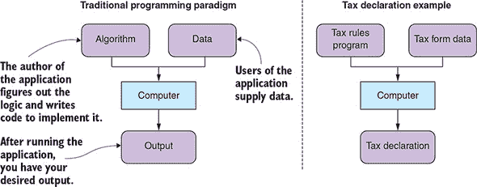

与传统的编程范式相比，*机器学习*是一系列从示例数据中推断程序或算法的技术，而不是直接实现它。因此，在机器学习中，你仍然向你的电脑提供数据，但不是施加指令并期望输出，而是*提供预期的输出，让机器自己找到算法*。

要构建一个可以识别照片中是谁的计算机程序，你可以应用一个算法，该算法分析你朋友的大量照片集合，并生成一个匹配它们的函数。如果你这样做正确，生成的函数也将匹配你之前从未见过的新的照片。当然，程序将没有关于其目的的知识；它能做的只是识别与它提供给你的原始图像相似的事物。

在这种情况下，你将提供给机器的图像称为*训练数据*，而图片上的人的名字称为*标签*。在你为特定目的训练了一个算法之后，你可以使用它来*预测*新数据上的标签以测试它。图 1.2 展示了这个例子以及机器学习范式的架构。

##### 图 1.2\. 机器学习范式：在开发过程中，你从一个数据集中生成一个算法，然后将其整合到你的最终应用程序中。

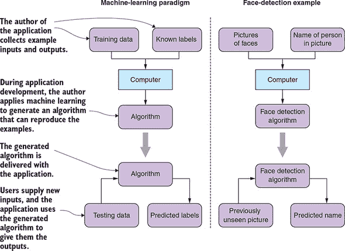

当规则不明确时，机器学习就派上用场；它可以解决“当我看到它时我会知道”这类问题。你不需要直接编程函数，而是提供指示函数应该做什么的数据，然后系统地生成一个与你的数据匹配的函数。

在实践中，你通常将机器学习与传统的编程相结合来构建一个有用的应用程序。对于我们的面部检测应用程序，在应用机器学习算法之前，你必须指导计算机如何找到、加载和转换示例图像。除此之外，你可能使用手工制作的启发式方法来区分头像和日落照片以及拿铁艺术照片；然后你可以应用机器学习来给面孔命名。通常，传统的编程技术和高级机器学习算法的结合将优于单独使用其中任何一个。

#### 1.1.1\. 机器学习如何与人工智能相关？

在最广泛的意义上，*人工智能*指的是任何使计算机模仿人类行为的技巧。AI 包括一系列广泛的技术，包括以下内容：

+   逻辑生产系统，它将形式逻辑应用于评估陈述

+   专家系统，其中程序员试图直接将人类知识编码到软件中

+   模糊逻辑，它定义算法以帮助计算机处理不精确的陈述

这类基于规则的技巧有时被称为*经典人工智能*或*GOFAI*（老式的传统人工智能）。

机器学习只是人工智能众多领域中的一个，但今天它可能是最成功的一个。特别是深度学习这一子领域，它背后的一些最令人兴奋的 AI 突破，包括那些让研究人员困扰了几十年的任务。在经典人工智能中，研究人员会研究人类行为并尝试编码与之匹配的规则。机器学习和深度学习则完全颠覆了这个问题：现在你收集人类行为的数据样本，并应用数学和统计技术来提取规则。

深度学习如此普遍，以至于社区中的一些人将*AI*和*深度学习*互换使用。为了清晰起见，我们将使用*AI*来指代用计算机模仿人类行为的普遍问题，而使用*机器学习*或*深度学习*来指代从示例中提取算法的数学技术。

#### 1.1.2\. 你可以用机器学习做什么，不能做什么

机器学习是一种专业化的技术。你不会使用机器学习来更新数据库记录或渲染用户界面。在以下情况下，应优先考虑传统编程：

+   ***传统算法直接解决问题。*** 如果你可以直接编写代码来解决问题，那么它将更容易理解、维护、测试和调试。

+   ***你期望完美的准确性。*** 所有复杂的软件都包含错误。但在传统软件工程中，你期望系统地识别和修复错误。但在机器学习中，这并不总是可能的。你可以改进机器学习系统，但过分关注特定错误往往会使整个系统变得更差。

+   ***简单的启发式方法效果很好。*** 如果你可以用几行代码实现一个足够好的规则，那么就这样做并感到高兴。一个简单的启发式方法，如果清晰实现，将很容易理解和维护。用机器学习实现的函数是透明的，并且需要单独的训练过程来更新。（另一方面，如果你在维护一个复杂的启发式方法序列，那么用机器学习替换它是一个很好的候选方案。）

通常，在可以用传统编程解决的问题和几乎不可能解决的问题之间有一条很细的界限，即使使用机器学习也是如此。在图像中检测人脸与用名字标记人脸只是我们看到的例子之一。确定文本是用哪种语言写的与将该文本翻译成特定语言是另一个这样的例子。

我们经常在机器学习可能有所帮助的情况下求助于传统编程——例如，当问题的复杂性极高时。面对高度复杂、信息密集的场景时，人类往往满足于经验法则和叙述：想想宏观经济学、股市预测或政治。流程经理和所谓的专家往往可以从增强他们的直觉中受益于从机器学习中获得的认识。通常，现实世界的数据比预期的更有结构，我们才刚刚开始收获在这些许多领域的自动化和增强的好处。

### 1.2\. 通过示例学习机器学习

机器学习的目标是构建一个难以直接实现的函数。你通过选择一个 *模型*，一个大型通用函数族来实现这一点。然后你需要一个从该族中选择与你的目标匹配的函数的程序；这个过程被称为 *训练* 或 *拟合* 模型。你将通过一个简单的例子来操作。

假设你收集了一些人的身高和体重数据，并将这些值绘制在图表上。图 1.3 展示了一些从职业足球队名单中提取的数据点。

##### 图 1.3\. 一个简单的示例数据集。图表上的每个点代表一名足球运动员的身高和体重。你的目标是拟合一个模型到这些点上。

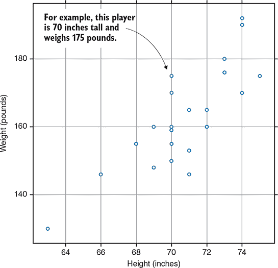

假设你想用数学函数描述这些点。首先，注意这些点或多或少地形成了一条向上向右的直线。如果你回想起高中代数，你可能还记得形式为 *f*(*x*) = *ax* + *b* 的函数描述了直线。你可能怀疑你可以找到 *a* 和 *b* 的值，使得 *ax* + *b* 与你的数据点相当接近。*a* 和 *b* 的值是你要找出的*参数*或*权重*。这是你的模型。你可以编写 Python 代码来生成这个家族中的任何函数：

```
class GenericLinearFunction:
    def __init__(self, a, b):
        self.a = a
        self.b = b

    def evaluate(self, x):
        return self.a * x + self.b
```

你如何找到 *a* 和 *b* 的正确值？你可以使用严格的算法来做这件事，但为了一个快速而简单的解决方案，你只需用直尺在你的图上画一条线，并尝试找出它的公式。图 1.4 显示了一条遵循数据集总体趋势的线。

##### 图 1.4。首先，你注意到你的数据集大致遵循线性趋势，然后你找到适合数据的特定线的公式。

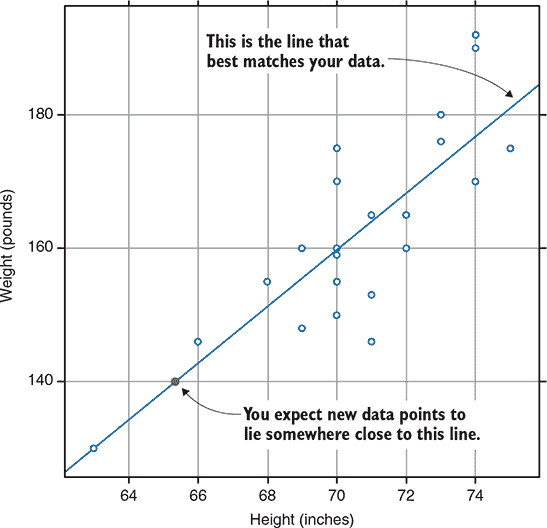

如果你用眼睛观察这条线通过的几个点，你可以计算出这条线的公式；你将得到类似 *f*(*x*) = 4.2*x* – 137 的结果。现在你有一个与你的数据匹配的特定函数。如果你测量一个新人的身高，然后你可以使用你的公式来估计这个人的体重。它可能不会完全正确，但它可能足够接近以有用。你可以将你的 `GenericLinearFunction` 转换为特定函数：

```
height_to_weight = GenericLinearFunction(a=4.2, b=-137)
height_of_new_person = 73
estimated_weight = height_to_weight.evaluate(height_of_new_person)
```

只要你的新人是职业足球运动员，这应该是一个相当好的估计。你数据集中的所有人都是成年男性，年龄范围相当窄，每天都进行相同的运动训练。如果你尝试将你的函数应用于女性足球运动员、奥运举重运动员或婴儿，你将得到极其不准确的结果。你的函数只和你训练的数据一样好。

这是机器学习的基本过程。在这里，你的模型是所有看起来像 *f*(x) = *ax* + *b* 的函数的集合。实际上，即使是如此简单的东西也是一个统计学家经常使用的有用模型。随着你解决更复杂的问题，你会使用更复杂的模型和更先进的训练技术。但核心思想是相同的：首先描述一个可能的函数的大类，然后从该类中识别出最好的函数。


**Python 与机器学习**

本书中的所有代码示例都是用 Python 编写的。为什么是 Python？首先，Python 是一种用于通用应用程序开发的表达性高级语言。此外，Python 是机器学习和数学编程中最受欢迎的语言之一。这种组合使得 Python 成为集成机器学习的应用程序的自然选择。

Python 因其惊人的数值计算包集合而受到机器学习的青睐。本书中我们使用的包包括以下内容：

+   ***NumPy*—** 这个库提供了高效的数据结构来表示数值向量和数组，以及一个广泛的快速数学运算库。NumPy 是 Python 数值计算生态系统的基石：每个知名的机器学习或统计学库都与 NumPy 集成。

+   ***TensorFlow 和 Theano*—** 这是有两个图计算库（这里的“图”指的是一系列连接的步骤，而不是“图”作为图表的意思）。它们允许你指定复杂的数学运算序列，然后生成高度优化的实现。

+   ***Keras*—** 这是一个用于深度学习的高级库。它为你提供了一个方便的方式来指定神经网络，并依赖于 TensorFlow 或 Theano 来处理原始计算。

我们在这本书中编写的代码示例是以 Keras 2.2 和 TensorFlow 1.8 为背景的。你应该能够使用 2.*x* 系列中的任何 Keras 版本，只需进行最小修改。


#### 1.2.1\. 在软件应用中使用机器学习

在上一节中，你查看了一个纯粹数学模型。你如何将机器学习应用于实际的软件应用？

假设你正在开发一个照片分享应用，用户已经上传了数百万张带有标签的图片。你想要添加一个为新照片建议标签的功能。这个功能是机器学习的完美候选。

首先，你必须明确你想要学习的函数。比如说，你有一个这样的函数：

```
def suggest_tags(image_data):
    """Recommend tags for an image.

    Input: image_data is a photo in bitmap format

    Returns: a ranked list of suggested tags
    """
```

然后，剩下的工作相对直接。但是，如何开始实现一个像 `suggest_tags` 这样的函数并不明显。这就是机器学习发挥作用的地方。

如果这是一个普通的 Python 函数，你可能会期望它接受某种 `Image` 对象作为输入，并可能返回一个字符串列表作为输出。机器学习算法对它们的输入和输出并不那么灵活；它们通常在向量和矩阵上工作。因此，作为第一步，你需要用数学方式表示你的输入和输出。

如果你将输入照片调整到固定大小——比如说，128 × 128 像素——那么你可以将其编码为一个 128 行 128 列的矩阵：每个像素一个浮点值。输出怎么办？一个选择是限制你将识别的标签集；你可能会选择应用上最受欢迎的 1,000 个标签。输出可以是一个大小为 1,000 的向量，其中向量的每个元素对应一个特定的标签。如果你允许输出值在 0 到 1 之间变化，你可以生成建议标签的排名列表。图 1.5 展示了这种在应用概念和数学结构之间的映射。

##### 图 1.5\. 机器学习算法在数学结构上操作，如向量和矩阵。你的照片标签存储在标准的计算机数据结构中：字符串列表。这是将列表编码为数学向量的一个可能方案。

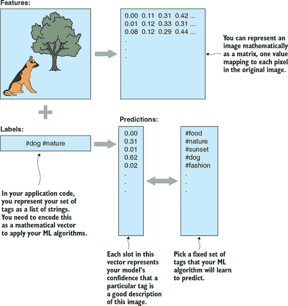

你刚才执行的数据预处理步骤是每个机器学习系统的基本组成部分。通常，你以原始格式加载数据，并执行预处理步骤以创建*特征*——可以输入到机器学习算法中的输入数据。

#### 1.2.2\. 监督学习

接下来，你需要一个算法来训练你的模型。在这种情况下，你已经有了数百万个正确的例子——所有用户已经上传并手动标记在你应用程序中的照片。你可以学习一个函数，该函数试图尽可能接近地匹配这些例子，并希望它能以合理的方式推广到新照片。这种技术被称为*监督学习*，之所以称为监督学习，是因为人工编辑的例子*标签*为训练过程提供了指导。

当训练完成后，你可以将最终学习到的函数与应用程序一起交付。每次用户上传一张新照片时，你将其传递到训练好的模型函数中，并得到一个向量。你可以将向量中的每个值匹配回它所代表的标签；然后你可以选择具有最大值的标签并展示给用户。从方案上讲，你刚才概述的程序可以表示如图 1.6 所示。图 1.6。

##### 图 1.6\. 监督学习的机器学习流程

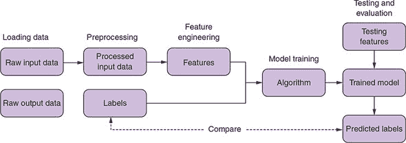

你如何测试你的训练模型？标准做法是留出一部分原始标记数据用于此目的。在开始训练之前，你可以留出一部分数据，比如 10%，作为*验证集*。验证集*不*以任何方式包含在训练数据中。然后你可以将你的训练模型应用于验证集中的图像，并将建议的标签与已知的良好标签进行比较。这让你可以计算模型的准确度。如果你想尝试不同的模型，你有一个一致的指标来衡量哪个更好。

在游戏人工智能中，你可以从人类游戏记录中提取标记的训练数据。在线游戏对机器学习来说是一个巨大的福音：当人们在线玩游戏时，游戏服务器可能会保存一个可读的计算机记录。以下是如何将监督学习应用于游戏的示例：

+   给定一组完整的象棋游戏记录，以向量或矩阵形式表示游戏状态，并从数据中学习预测下一步棋。

+   给定一个棋盘位置，学习预测该状态获胜的可能性。

#### 1.2.3\. 无监督学习

与监督学习相反，机器学习的一个子领域称为*无监督学习*，在学习过程中没有提供任何标签来指导学习过程。在无监督学习中，算法必须学会自己从输入数据中找到模式。与图 1.6 的唯一区别是缺少标签，因此你不能像以前那样评估你的预测。所有其他组件保持不变。

这种情况的例子是 *异常检测*——识别与数据集总体趋势不符的数据点。在足球运动员数据集中，异常值将表明与队友典型体型不匹配的球员。例如，你可以提出一个算法来测量身高-宽度对与目测线的距离。如果一个数据点超过平均线的某个距离，你就可以将其宣布为异常值。

在棋盘游戏人工智能中，一个自然的问题是要问棋盘上的哪些棋子属于一组或形成一个群体。在下一章中，你将更详细地了解这对围棋游戏意味着什么。寻找具有关系的棋子组有时被称为 *聚类* 或 *分块*。图 1.7 展示了这可能在棋类游戏中看起来是什么样子。

##### 图 1.7\. 寻找棋子簇或块的无监督机器学习流程

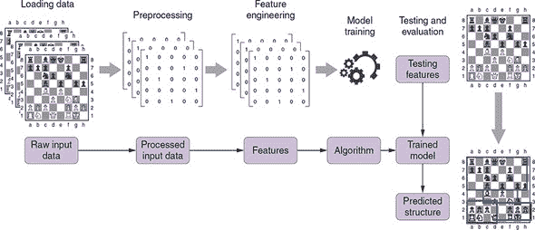

#### 1.2.4\. 强化学习

监督学习很强大，但找到高质量的训练数据可能是一个主要障碍。假设你正在构建一个清洁机器人。机器人有各种传感器可以检测它接近障碍物时的情况，以及让它在地面上滑动和左右转向的电机。你需要一个控制系统：一个可以分析传感器输入并决定如何移动的函数。但在这里，监督学习是不可能的。你没有例子可以用作训练数据——你的机器人甚至还没有存在。

相反，你可以应用 *强化学习*，这是一种试错方法。你从一个低效或不准确的控制系统开始，然后让机器人尝试其任务。在任务过程中，你记录下控制系统看到的所有输入和它所做的决策。完成后，你需要一种方法来评估它的表现如何，可能通过计算它吸尘的地面比例和电池消耗的距离。整个经历为你提供了一小块训练数据，你可以用它来改进控制系统。通过反复进行整个过程，你可以逐渐找到有效的控制函数。图 1.8 将此过程展示为流程图。

##### 图 1.8\. 在强化学习中，智能体通过试错来学习与环境互动。你反复让你的智能体尝试其任务以获得监督信号来学习。在每一个循环中，你可以进行增量改进。

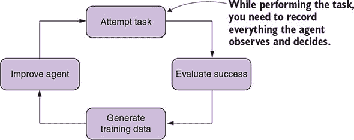

### 1.3\. 深度学习

这本书由句子组成。句子由单词组成；单词由字母组成；字母由线条和曲线组成；最终，这些线条和曲线由微小的墨点组成。当教孩子阅读时，你从最小的部分开始，逐步向上：首先是字母，然后是单词，然后是句子，最后是完整的书籍。（通常，孩子们会自己学会识别线条和曲线。）这种层次结构是人们学习复杂概念的自然方式。在每一级，你忽略一些细节，概念变得更加抽象。

*深度学习* 将相同的思想应用于机器学习。深度学习是机器学习的一个子领域，它使用特定系列模型：简单函数的链式连接。这些函数链被称为 *神经网络*，因为它们在结构上受到了自然大脑的启发。深度学习的核心思想是这些函数序列可以分析复杂概念作为更简单概念的层次结构。深度模型的第一层可以学习从原始数据中提取并按基本方式组织它——例如，将点分组成线条。每一层后续组织前一层，形成更高级和更抽象的概念。学习这些抽象概念的过程称为 *表示学习*。

深度学习的惊人之处在于你事先不需要知道中间概念是什么。如果你选择一个具有足够层数的模型并提供足够的训练数据，训练过程将逐步将原始数据组织成越来越高级的概念。但是，训练算法如何知道使用哪些概念呢？它不知道；它只是以任何有助于它更好地匹配训练示例的方式组织输入。没有保证这种表示与人类思考数据的方式相匹配。图 1.9 展示了表示学习如何融入监督学习流程。

##### 图 1.9\. 深度学习和表示学习


所有这些能力都伴随着代价。深度模型需要学习大量的权重。回想一下你用来处理身高和体重数据集的简单 *ax* + *b* 模型；那个模型只需要学习两个权重。一个适合你图像标签应用的深度模型可能有百万个权重。因此，深度学习需要更大的数据集、更多的计算能力和更实际的方法来训练。这两种技术都有其适用场景。在以下情况下，深度学习是一个不错的选择：

+   ***你的数据是无结构的。*** 图像、音频和书面语言是深度学习的良好候选。虽然可以将简单模型应用于此类数据，但通常需要复杂的预处理。

+   ***你有大量可用数据或计划获取更多数据。*** 通常，你的模型越复杂，你需要训练它的数据就越多。

+   **您拥有充足的计算能力或充足的时间**。深度模型在训练和评估过程中都涉及更多的计算。

在以下情况下，您应该更喜欢参数更少的传统模型：

+   **您拥有结构化数据**。如果你的输入看起来更像是数据库记录，你通常可以直接应用简单模型。

+   **您需要一个描述性的模型**。对于简单的模型，您可以查看最终学习到的函数，并检查单个输入如何影响输出。这可以为您提供有关您正在研究的现实世界系统如何工作的见解。在深度模型中，输入的特定部分与最终输出之间的联系既长又曲折；很难解释模型。

因为**深度学习**指的是您使用的模型类型，所以您可以将深度学习应用于机器学习的任何主要分支。例如，您可以使用深度模型或简单模型进行监督学习，具体取决于您拥有的训练数据类型。

### 1.4. 本书您将学到什么

本书提供了深度学习和强化学习的实用介绍。为了最大限度地利用本书，您应该能够舒适地阅读和编写 Python 代码，并对线性代数和微积分有所了解。在本书中，我们教授以下内容：

+   如何使用 Keras 深度学习库设计、训练和测试神经网络

+   如何设置监督式深度学习问题

+   如何设置强化学习问题

+   如何将深度学习与有用的应用集成

在整本书中，我们使用一个具体且有趣示例：构建一个玩围棋的 AI。我们的围棋机器人结合了深度学习和标准的计算机算法。我们将使用简单的 Python 来执行游戏规则，跟踪游戏状态，并通过可能的游戏序列进行前瞻。深度学习将帮助机器人识别哪些移动值得检查，并在游戏中评估谁领先。在每一个阶段，你都可以与你的机器人对战，并观察它在应用更高级的技术时如何改进。

如果你特别对围棋感兴趣，你可以使用书中构建的机器人作为你实验自己想法的起点。你可以将相同的技巧应用到其他游戏中。你还将能够将深度学习驱动的功能添加到游戏以外的其他应用中。

### 1.5. 摘要

+   机器学习是一系列从数据生成函数而不是直接编写函数的技术。您可以使用机器学习来解决直接解决过于模糊的问题。

+   机器学习通常涉及首先选择一个**模型**——一个通用的数学函数族。接下来，您**训练**模型——应用算法来找到该族中最好的函数。机器学习的许多艺术在于选择正确的模型，并将您的特定数据集转换为与之兼容。

+   机器学习的三个主要领域是监督学习、无监督学习和强化学习。

+   监督学习涉及从你已经知道是正确的例子中学习一个函数。当你有可用的人类行为或知识示例时，你可以将监督学习应用于在计算机上模仿它们。

+   无监督学习涉及在没有事先知道结构的情况下从数据中提取结构。一个常见的应用是将数据集分成逻辑组。

+   强化学习涉及通过试错来学习一个函数。如果你可以编写代码来评估程序实现目标的好坏，你就可以将强化学习应用于在多次尝试中逐步改进程序。

+   深度学习是一种机器学习，它使用一种在非结构化输入上表现良好的特定模型，例如图像或书面文本。它是当今计算机科学中最激动人心的领域之一；它不断扩展我们对计算机能做什么的想法。

## 第二章\. 围棋作为机器学习问题

*本章涵盖*

+   为什么游戏是人工智能的好主题？

+   为什么围棋是深度学习的好问题？

+   围棋的规则是什么？

+   你可以用机器学习解决哪些游戏方面的挑战？

### 2.1\. 为什么是游戏？

游戏是人工智能研究的热门主题，不仅仅是因为它们很有趣。它们还简化了现实生活中的一些复杂性，这样你就可以专注于你正在研究的算法。

想象一下你在 Twitter 或 Facebook 上看到一条评论：比如，“哎呀，我忘记了我的雨伞。”你会很快得出结论，你的朋友被雨淋到了。但是，这个信息并没有在任何句子中提到。你是怎么得出这个结论的？首先，你应用了关于雨伞用途的常识。其次，你应用了关于人们会费心发表的评论的社会知识：在一个晴朗明媚的日子里说“我忘记了我的雨伞”会很奇怪。

作为人类，我们在阅读句子时可以毫不费力地考虑到所有这些上下文。这对计算机来说并不那么容易。现代深度学习技术在处理你提供给它们的信息方面非常有效。但是，你在找到所有相关信息并将其提供给计算机的能力上有限。游戏规避了这个问题。它们发生在一个人工宇宙中，你做出决策所需的所有信息都明确地体现在规则中。

游戏非常适合强化学习。回想一下，强化学习需要反复运行你的程序并评估它完成任务的优劣。想象一下，你正在使用强化学习来训练一个机器人绕着建筑物移动。在控制系统精细调整之前，机器人可能会从楼梯上摔下来或者撞倒你的家具。另一个选择是构建机器人将运行的模拟环境。这消除了让未经训练的机器人在现实世界中四处乱跑的风险，但同时也带来了新的问题。首先，你必须投资开发一个详细的计算机模拟，这本身就是一个重大的项目。其次，你的模拟可能并不完全准确。

另一方面，使用游戏，你只需要让你的 AI 进行游戏。如果它在学习过程中输了几百万场，那又如何呢？在强化学习中，游戏对于严肃的研究至关重要。许多前沿算法最初都是在 Atari 视频游戏如《Breakout》上展示的。

为了明确起见，你*可以*成功地将强化学习应用于物理世界中的问题。许多研究人员和工程师已经这样做了。但从游戏开始可以解决创建一个真实训练环境的问题，并让你专注于强化学习的机制和原理。

在本章中，我们介绍了围棋的规则。接下来，我们以高层次描述了棋盘游戏 AI 的结构，并确定了可以引入深度学习的地方。最后，我们介绍了如何评估你在开发过程中游戏 AI 的进展。

### 2.2\. 围棋的闪电速成

你不需要是一位强大的围棋高手才能阅读这本书，但你确实需要足够了解规则，以便在计算机程序中执行它们。幸运的是，规则众所周知很简单。简而言之，两名玩家轮流在棋盘上放置黑白棋子，从黑方开始。目标是尽可能多地控制棋盘上的区域。

虽然规则很简单，但围棋的策略却有着无尽的深度，我们甚至不试图在这本书中涵盖它。如果你对了解更多感兴趣，我们将在本节末尾提供一些资源。

#### 2.2.1\. 理解棋盘

围棋棋盘是一个正方形网格，如图 2.1 所示。棋子放在交点上，而不是方格内。标准棋盘是 19×19，但有时玩家会使用更小的棋盘进行快速游戏。最受欢迎的小型选项是 9×9 和 13×13 棋盘。（大小指的是棋盘上的交点数，而不是方格数。）

##### 图 2.1\. 标准的 19×19 围棋棋盘。用点标记的交点是星点，仅供玩家参考。棋子放在交点上。

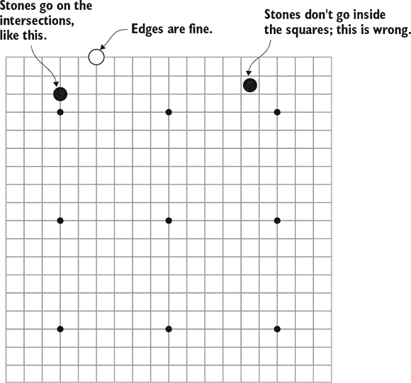

注意到有九个点被标记了一个点。这些点被称为*星位*。它们的主要目的是帮助玩家判断棋盘上的距离；它们对游戏没有影响。

#### 2.2.2\. 放置和捕获棋子

一名玩家使用黑子，另一名玩家使用白子。两名玩家轮流在棋盘上放置棋子，先手是黑子玩家。棋子一旦放在棋盘上就不能移动，尽管它们可以被完全包围并移除。要捕获对手的棋子，你必须用你自己的棋子完全包围它们。下面是如何操作的。

相邻的同色棋子被认为是连接在一起的，如图 2.2 所示。为了连接的目的，我们只考虑垂直、水平、左或右；对角线不计。任何接触连接组的空点被称为该组的*空位*。每个组至少需要一个空位才能留在棋盘上。你可以通过填充对手的空位来捕获对手的棋子。

##### 图 2.2\. 三个黑子是相连的。它们在标有方形的点上共有四个空位。白子可以通过在所有空位上放置白子来捕获黑子。

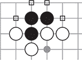

当你在对手的棋组最后一个空位放置棋子时，那个棋组就被捕获并从棋盘上移除。然后，新空出的点对任何玩家都是可用的（只要移动是合法的）。另一方面，你不能下棋子，使其没有空位，*除非你是在完成一次捕获*。

从捕获规则中产生了一个有趣的后果。如果一个棋组的两个内部空位完全分开，它永远无法被捕获。参见图 2.3：黑子不能在 A 处下棋，因为那个黑子将没有任何空位，并且由于 B 处的剩余空位，它的放置不会完成捕获。同样，黑子也不能在 B 处下棋，原因相同。所以黑子没有填充白子组最后两个空位的方法。这些内部空位被称为*眼*。相比之下，黑子可以在 C 处下棋来捕获五个白子，因为尽管那个黑子将没有任何空位，但它完成了捕获。那个白子组只有一个眼，注定会在某个时候被捕获。

##### 图 2.3\. 左边的白子永远无法被捕获：黑子既不能在 A 处也不能在 B 处下棋。那里的黑子将没有任何空位，因此是不合法的走法。另一方面，黑子可以在 C 处下棋来捕获五个白子。

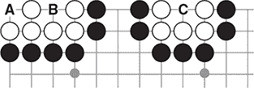

虽然这并不是规则中明确的部分，但一个有双目的棋组无法被捕获的想法是围棋策略中最基本的部分。实际上，这是你唯一会具体编码到你的机器人逻辑中的策略。所有更高级的围棋策略都将通过机器学习推断出来。

#### 2.2.3\. 结束游戏和计分

任何一方都可以选择弃权，而不是下棋。当双方连续弃权时，游戏结束。在计分之前，玩家需要识别任何已死的棋子：那些没有机会形成两个眼或连接到友军棋子的棋子。计分时，已死的棋子与捕获的棋子处理方式相同。如果发生分歧，玩家可以通过继续游戏来解决。但这很少见：如果任何一组的状态不明确，玩家通常会在弃权之前尝试解决。

游戏的目的是控制比对手更大的棋盘区域。有两种计算分数的方法，但它们几乎总是给出相同的结果。

最常见的计数方法是*地盘计分法*。在这种情况下，你得到棋盘上每个完全被你自己的棋子包围的点 1 分，以及每个你捕获的对手棋子 1 分。得分更高的玩家是赢家。

另一种计数方法是*面积计分法*。在面积计分法中，你得到每个地盘点 1 分，以及你在棋盘上的每个棋子 1 分。除非在罕见的情况下，你将通过任何一种方法得到相同的赢家：如果双方都没有提前弃权，捕获的差异将等于棋盘上棋子的差异。

地盘计分法在休闲游戏中更为常见，但结果表明，面积计分法对计算机来说稍微方便一些。在本书中，我们的 AI 假设它是在面积计分法下进行游戏，除非另有说明。

此外，白方为了补偿后手而获得额外的分数。这种补偿称为*komi*。komi 通常在地盘计分法下为 6.5 分，在面积计分法下为 7.5 分——额外的半分确保没有平局。本书中我们假设 komi 为 7.5 分。

图 2.4 显示了示例 9×9 游戏的最终位置。

##### 图 2.4。9×9 游戏的最终位置。已死的棋子用×标记。黑方地盘用三角形标记。白方地盘用方框标记。

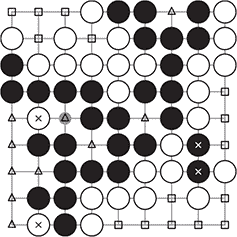

下面是如何计算这个游戏的分数：

1.  被标记为 X 的棋子被认为是已死的：它们算作捕获，尽管玩家在游戏中没有进行捕获。黑方在游戏早期也进行了一次捕获（未显示）。因此，黑方有 3 个捕获，白方有 2 个捕获。

1.  黑方有 12 个地盘点：用三角形标记的 10 个点，加上死去的白子下面的 2 个点。

1.  白方有 17 个地盘点：15 个用方框标记的点，加上死去的黑子下面的 2 个点。

1.  黑方在棋盘上有 27 颗棋子，在移除已死去的黑子后。

1.  在移除已死去的白子后，白方在棋盘上有 25 颗棋子。

1.  按照地盘计分法，白方有 17 个地盘点 + 2 个捕获 + 6.5 个 komi，总共 25.5 个点。黑方有 12 个地盘点 + 3 个捕获，总共 15 个点。

1.  通过面积计分法，白方有 17 个地盘点 + 棋盘上的 25 颗子 + 7.5 个 komi，总共 49.5 个点。黑方有 12 个地盘点 + 棋盘上的 27 颗子，总共 39 个点。

1.  无论是哪种计分方法，白方都以 10.5 个点的优势获胜。

一款游戏还可以以另一种方式结束：任何一位玩家都可以在任何时候认输。在经验丰富的玩家之间进行的比赛中，当你明显处于劣势时认输被认为是一种礼貌的行为。为了让我们的 AI 成为一个好的对手，它应该学会在何时应该认输。

#### 2.2.4\. 理解“劫”

在放置棋子的位置上存在一个额外的限制。为了确保游戏结束，进行一个将棋盘恢复到之前状态的移动是不合法的。图 2.5 展示了这种情况可能发生的一个例子。

##### 图 2.5\. “劫”规则的示意图。首先，黑方吃掉了一颗白子。白方可能希望在 A 点反击以吃回黑子，但这样会将棋盘恢复到之前的位置。劫规则禁止这种玩法，以防止无休止的吃子和反吃的循环。白方必须先在棋盘的其他地方下棋。之后，整体棋盘位置就不同了，因此白方可以在稍后回到 A 点吃子——前提是黑方没有先保护它。

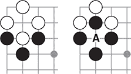

在图中，黑方刚刚吃掉了一颗白子。白方可能希望在下标记为 A 的点进行反击，以重新吃回新生的黑子。但这样会将棋盘恢复到两步之前的同一位置。相反，白方必须先在棋盘的其他地方下棋。之后，如果白方在 A 点吃子，全局棋盘位置就不同了，因此这是合法的。当然，这给了黑方保护脆弱棋子的机会。为了重新吃回黑子，白方必须制造出足够大的干扰，以吸引黑方的注意力到棋盘的其他地方。

这种情况被称为“劫”，源自日语中的“永恒”一词。当棋盘上有劫时，玩家会采取特殊的策略，这是前几代围棋程序的一个弱点。在第七章中，我们展示了如何给你的神经网络提供提示，以帮助它们学习劫的战术。这是一种训练神经网络的有效通用技术。即使你不能明确表达你希望神经网络学习的规则，你也可以以强调你希望它关注的情况的方式来编码你的输入。

### 2.3\. 让子

当两位实力不同的玩家对弈时，一个简单的系统可以让游戏保持趣味性。实力较弱的玩家执黑，并在游戏开始前在棋盘上放置几颗子；这些子被称为让子。然后实力较强的玩家执白，并做出第一手棋。此外，在让子棋中， komi 通常会减少到只有半点。通常， komi 的目的是抵消先手玩家获得的优势；但让子的目的是给黑方额外的优势，所以这两个目的相互矛盾。 komi 剩余的半点只是为了打破平局。

在传统上，我们会在星位放置让子，但有些玩家允许黑方选择放置的位置。

### 2.4\. 哪里可以了解更多

尽管我们已经介绍了游戏的规则，但我们甚至还没有触及到围棋如此吸引人和上瘾的原因。这超出了本书的范围，但我们鼓励你玩几局游戏，并自己学习更多。以下是一些进一步探索的资源：

+   最好的进入围棋的方式是直接跳进去开始玩，而且现在在网上找到休闲游戏比以往任何时候都要容易。流行的在线围棋服务器 ([`online-go.com`](http://online-go.com)) 允许你在网页浏览器中直接进行游戏。即使你刚刚学习了规则，它的排名系统也会帮助你找到一场竞争性的游戏。其他流行的围棋服务器包括 KGS 围棋服务器 ([`gokgs.com`](http://gokgs.com)) 和 Tygem ([www.tygembaduk.com](http://www.tygembaduk.com))。

+   感觉师图书馆 ([`senseis.xmp.net`](https://senseis.xmp.net)) 是一个维基风格的参考资料，充满了策略、技巧、历史和趣闻。

+   Janice Kim 的 *Learn to Play Go* 系列被认为是最好的英语围棋书籍之一。我们强烈推荐第 1 卷和第 2 卷给初学者：它们能让你迅速达到能够理解游戏的地步。

### 2.5\. 我们能教会机器什么？

无论你是编写计算机程序来玩围棋还是井字棋，大多数棋类游戏的 AI 都具有相似的整体结构。在本节中，我们提供了一个高级概述，并确定了 AI 需要解决的具体问题。根据游戏的不同，最佳解决方案可能涉及游戏特定的逻辑、机器学习，或者两者兼而有之。

#### 2.5.1\. 开局时的走法选择

在游戏早期，由于剩余游戏中的巨大变化数量，很难评估特定的走法。象棋和围棋人工智能通常使用开局库：从专家人类游戏中提取的开局序列数据库。为了构建这个数据库，你需要一组强手的游戏记录。你分析游戏记录，寻找常见的位置。在任何常见位置，如果关于下一步的强共识存在——比如说，一两个走法占后续 80%——你就将这些走法添加到开局库中。机器人可以在玩游戏时查阅这本书。如果任何早期游戏位置出现在开局库中，机器人只需查找专家走法。

在象棋和国际象棋中，随着游戏的进行，棋子从棋盘上移除，人工智能也包含类似的残局数据库：当棋盘上只剩下几个棋子时，你可以预先计算出所有变化。这种技术不适用于围棋，因为棋盘在游戏结束时填满。

#### 2.5.2. 搜索游戏状态

棋盘游戏人工智能背后的核心思想是树搜索。想想人类如何玩策略游戏。首先，我们考虑我们下一回合的可能走法。然后我们需要考虑对手可能如何回应，然后计划我们如何回应，依此类推。我们尽可能多地读出变化，然后判断结果是否好。然后我们稍微回溯一点，看看不同的变化是否更好。

这紧密描述了在游戏人工智能中使用的树搜索算法的工作方式。当然，人类一次只能在大脑中保留几种变化，而计算机可以轻松地处理数百万种。人类用直觉来弥补他们原始计算能力的不足。经验丰富的象棋和围棋选手在发现值得考虑的少数走法方面非常出色。

最终，在象棋中，原始计算能力胜出。但能够与顶级人类选手竞争的围棋人工智能有一个有趣的转折：将人类的直觉引入计算机。

#### 2.5.3. 减少需要考虑的走法数量

在游戏树搜索的背景下，给定回合的可能走法数量称为分支因子。

在国际象棋中，平均分支因子大约是 30。游戏开始时，每位玩家在第一步有 20 种合法的选择；随着棋盘的展开，这个数字会略有增加。在这个规模上，现实的做法是读出每一个可能的走法，直到四到五步，而象棋引擎会深入读取更有希望的线路。

相比之下，围棋的分支因子巨大。在游戏的第一步，有 361 种合法的走法，这个数字缓慢减少。平均分支因子大约是每回合 250 种有效走法。仅仅展望四步就需要评估近 40 亿个位置。缩小可能性数量至关重要。表 2.1 通过比较象棋和围棋，展示了分支因子如何影响可能的棋局位置数量。

##### 表 2.1. 游戏中可能的棋盘状态的大致数量

|   | 分支因子 30（象棋） | 分支因子 250（围棋） |
| --- | --- | --- |
| 经过两步棋 | 900 | 62500 |
| 经过三步棋 | 27000 | 1500 万 |
| 经过四步棋 | 81 万 | 40 亿 |
| 经过五步棋 | 2400 万 | 10 万亿 |

在围棋中，基于规则的移动选择方法在此任务中表现平庸：编写出可靠识别棋盘上最重要区域的规则极为困难。但深度学习非常适合解决这个问题。你可以应用监督学习来训练计算机模仿人类围棋选手。

你从一个强大的人类选手之间的游戏记录的大集合开始；在线游戏服务器在这里是一个很好的资源。然后你在计算机上重放所有游戏，提取每个棋盘位置和随后的移动。这就是你的训练集。使用一个足够深的神经网络，你可以以超过 50%的准确率预测人类的移动。你可以构建一个只玩预测的人类移动的机器人，它已经是一个可信的对手。但真正的力量来自于当你将这些移动预测与树搜索相结合时：预测的移动为你提供了一个要探索的分支的排名列表。

#### 2.5.4. 评估游戏状态

分支因子限制了人工智能可以展望多远。如果你能读出一个假设的序列直到游戏结束，你就会知道谁会赢；判断那是否是一个好序列很容易。但在任何比井字游戏更复杂的游戏中，这都是不切实际的：可能的变体数量太多。在某个时候，你必须停下来并选择你查看的不完整序列中的一个。为此，你将读取的最终棋盘位置分配一个数值分数。在所有你分析的变体中，你选择导致得分最高的移动。弄清楚如何计算这个分数是棘手的部分：这就是位置评估的问题。

在象棋人工智能中，位置评估基于对棋手有意义的逻辑。你可以从像这样的简单规则开始：如果你抓住我的兵，而我抓住你的车，那对我有好处。顶级象棋引擎远远超出了这一点，考虑了关于棋子最终落在棋盘上的位置以及哪些棋子阻碍了它们的移动的复杂规则。

在围棋中，位置评估可能比移动选择更困难。游戏的目标是占领更多领地，但计算领地却出奇地困难：边界往往在游戏后期才变得模糊。计算捕获的棋子也没有太大帮助；有时你只需捕获几枚棋子就能玩到游戏结束。这是另一个人类直觉至高无上的领域。

深度学习在这里也是一个重大的突破。适合用于走棋选择的神经网络也可以训练来评估棋盘位置。你不需要训练一个神经网络来预测下一步棋会是什么，而是训练它来预测谁会获胜。你可以设计这个网络，使其以概率的形式表达其预测；这为你提供了一个数值分数来评估棋盘位置。

### 2.6\. 如何衡量你的 Go AI 的强度

当你在开发你的围棋 AI 时，你自然会想知道它的强度如何。大多数围棋选手都熟悉传统的日本排名系统，因此你希望在这个尺度上衡量你的机器人的强度。唯一校准其水平的方法是通过与其他对手对弈；你可以使用其他 AI 或人类玩家来达到这个目的。

#### 2.6.1\. 传统的围棋段位

围棋选手通常使用传统的日本段位系统，其中选手被授予初段（初学者）或段位（专家）等级。段位级别反过来又分为业余段位和专业段位。最强的初段评级是 1 段，数字越大表示段位越低。段位等级是相反的方向：1 段比 1 初段高一个级别，段位数字越大表示段位越高。对于业余选手，传统上段位最高到 7 段。业余选手可以从他们所在的围棋协会获得评级，在线服务器也会跟踪他们的评级。表 2.2 显示了这些段位的排列。

##### 表 2.2\. 传统的围棋段位

| 25 初段 | 完全的初学者，刚刚学习规则 |
| --- | --- |
| 20 初段到 11 初段 | 初学者 |
| 10 初段到 1 初段 | 中级选手 |
| 1 段及以上 | 强大的业余选手 |
| 7 段 | 最高业余选手，接近专业水平 |
| 专业 1 段到专业 9 段 | 世界上最强的选手 |

业余段位是根据需要补足两名选手实力差距的手数来确定的。例如，如果 Alice 是 2 段，Bob 是 5 段，Alice 通常会给予 Bob 三颗让子，以便他们有平等的机会获胜。

专业段位的工作方式略有不同：它们更像是一种称号。地区围棋协会根据主要赛事的结果授予顶尖选手专业段位，并且这个段位终身保留。业余和专业段位不可直接比较，但你可以安全地假设任何拥有专业段位的选手至少与业余 7 段选手一样强大。顶尖职业选手比这要强得多。

#### 2.6.2\. 对 Go AI 进行基准测试

评估你自己的机器人强度的一个简单方法是与已知强度的其他机器人进行对弈。开源围棋引擎，如 GNU Go 和 Pachi，提供了良好的基准。GNU Go 的水平大约是 5 段，而 Pachi 大约是 1 段（Pachi 的水平会因你提供的计算能力而略有不同）。所以如果你让你的机器人与 GNU Go 对弈 100 次，大约赢得 50 场比赛，你可以得出结论，你的机器人也大约在 5 段的水平。

为了获得更精确的排名，你可以设置你的 AI 在具有评分系统的公共围棋服务器上对弈。几局游戏应该足以得到一个合理的估计。

### 2.7. 概述

+   游戏是人工智能研究的热门主题，因为它们创造了具有已知规则的控制环境。

+   强大的围棋 AI 依赖于机器学习而不是特定于游戏的规则。部分原因是因为需要考虑的可能的变体数量巨大，基于规则的围棋 AI 在历史上并不强大。

+   在围棋中应用深度学习的两个地方是走棋选择和位置评估。

+   走棋选择是在特定棋盘位置中缩小需要考虑的走棋集的问题。没有良好的走棋选择，你的围棋 AI 将有太多的分支去阅读。

+   位置评估是估计哪个玩家领先以及领先多少的问题。没有良好的位置评估，你的围棋 AI 将无法选择一个好的变体。

+   你可以通过与广泛可用的、已知强度的机器人（如 GNU Go 或 Pachi）对弈来衡量你的人工智能的强度。

## 第三章. 实现你的第一个围棋机器人

*本章涵盖*

+   使用 Python 实现围棋盘

+   放置石子序列并模拟游戏

+   为确保合法走棋而编码围棋规则

+   构建一个简单的机器人，它可以与自己的副本对弈

+   与你的机器人进行完整游戏

在本章中，你将构建一个灵活的库，它提供表示围棋游戏的数据结构和强制执行围棋规则算法。正如你在上一章中看到的，围棋的规则很简单，但为了在计算机上实现它们，你必须仔细考虑所有边缘情况。如果你是围棋的新手或需要复习规则，请确保你已经阅读了第二章。本章是技术性的，需要良好的围棋规则知识才能完全理解细节。

表示围棋规则非常重要，因为它是创建智能机器人的基础。在你教它好和坏的动作之前，你的机器人需要理解合法和非法的动作。

在本章结束时，你将实现了你的第一个围棋机器人。这个机器人仍然很弱，但它拥有在接下来的章节中进化成更强大版本所需的关于围棋的所有知识。

你将从正式介绍棋盘和用于在计算机上玩围棋的基本概念开始：什么是玩家，什么是棋子，什么是走法？接下来，你将关注游戏方面。计算机如何快速检查哪些棋子需要被捕获或何时适用 ko 规则？游戏何时以及如何结束？我们将在本章中回答所有这些问题。

### 3.1. 在 Python 中表示围棋游戏

围棋是在一个方形棋盘上进行的。通常，初学者从 9×9 或 13×13 的棋盘开始，而高级和专业玩家则在 19×19 的棋盘上对弈。但原则上，围棋可以在任何大小的棋盘上玩。实现一个方形网格的游戏相对简单，但你需要注意很多细节。

你通过逐步构建一个名为*dlgo*的模块来在 Python 中表示围棋游戏。在整个章节中，你将被要求创建文件并实现类和函数，最终将导致你的第一个机器人的诞生。本章和后续章节的所有代码都可以在 GitHub 上找到，网址为[`mng.bz/gYPe`](http://mng.bz/gYPe)。

虽然你应该肯定地克隆这个仓库以供参考，但我们强烈建议你从头开始创建文件，以了解库是如何逐步构建的。我们的 GitHub 仓库的 master 分支包含本书中使用的所有代码（以及更多）。从本章开始，还有一个针对每个章节的特定 Git 分支，其中只包含给定章节所需的代码。例如，本章的代码可以在 branch chapter_3 中找到。下一章遵循相同的命名约定。请注意，我们在 GitHub 仓库中为这里和后续章节中的大多数代码都包含了广泛的测试。

要构建一个表示围棋的 Python 库，你需要一个足够灵活的数据模型来支持几个用例：

+   跟踪你与人类对手对弈的游戏进度。

+   跟踪两个机器人之间的游戏进度。这看起来似乎与前面的点完全相同，但事实上，存在一些细微的差别。最值得注意的是，简单的机器人很难识别游戏何时结束。在后续章节中，将使用到两个简单机器人相互对弈的重要技术，所以这里值得提一下。

+   比较同一棋盘位置下的许多潜在序列。

+   从游戏记录中导入并生成训练数据。

我们从一些简单概念开始，比如玩家或走法是什么。这些概念为解决后续章节中所有前面的任务奠定了基础。

首先，创建一个新的文件夹，名为 dlgo，并在其中放置一个空的 __init__.py 文件以将其初始化为 Python 模块。此外，创建两个额外的文件，分别命名为 gotypes.py 和 goboard_slow.py，你将在其中放置所有棋盘和游戏功能。此时，你的文件夹结构应该如下所示：

```
dlgo
    __init__.py
    gotypes.py
    goboard_slow.py
```

在围棋中，黑白双方轮流走棋，您使用 `enum` 来表示不同颜色的棋子。`Player` 可以是 `black` 或 `white`。在玩家放置棋子后，您可以通过在 `Player` 实例上调用 `other` 方法来切换颜色。将此 `Player` 类放入 `gotypes.py`。

##### 列表 3.1\. 使用 `enum` 来表示玩家

```
import enum

class Player(enum.Enum):
    black = 1
    white = 2

    @property
    def other(self):
        return Player.black if self == Player.white else Player.white
```

如前言所述，我们在这本书中使用 Python 3。其中一个原因是许多现代语言特性，如 `gotypes.py` 中的枚举，都是 Python 3 的标准库的一部分。

接下来，为了表示棋盘上的坐标，元组是一个明显的选择。以下 `Point` 类也放入 `gotypes.py`。

##### 列表 3.2\. 使用元组来表示围棋棋盘的点

```
from collections import namedtuple

class Point(namedtuple('Point', 'row col')):
    def neighbors(self):
        return [
            Point(self.row - 1, self.col),
            Point(self.row + 1, self.col),
            Point(self.row, self.col - 1),
            Point(self.row, self.col + 1),
        ]
```

`namedtuple` 允许您通过 `point.row` 和 `point.col` 访问坐标，而不是 `point[0]` 和 `point[1]`，这使得可读性大大提高。

您还需要一个结构来表示玩家在回合中可以采取的行动。通常，一个回合涉及在棋盘上放置一个棋子，但玩家也可以在任何时候跳过或认输。遵循美国围棋协会（AGA）的惯例，我们使用术语 *move* 来表示这三种行动中的任何一种，而 *play* 则指放置棋子。在 `Move` 类中，因此您编码了所有三种类型的移动（放置、跳过、认输），并确保移动恰好具有这些类型之一。对于实际的游戏，您需要传递一个要放置的 `Point`。您将此 `Move` 类添加到文件 `goboard_slow.py` 中。

##### 列表 3.3\. 设置移动：放置、跳过或认输

```
import copy
from dlgo.gotypes import Player

class Move():                                                       *1*
    def __init__(self, point=None, is_pass=False, is_resign=False):
        assert (point is not None) ^ is_pass ^ is_resign
        self.point = point
        self.is_play = (self.point is not None)
        self.is_pass = is_pass
        self.is_resign = is_resign

    @classmethod
    def play(cls, point):                                           *2*
        return Move(point=point)

    @classmethod
    def pass_turn(cls):                                             *3*
        return Move(is_pass=True)

    @classmethod
    def resign(cls):                                                *4*
        return Move(is_resign=True)
```

+   ***1* 玩家在回合中可以采取的任何行动——是玩、跳过还是认输——都将被设置。**

+   ***2* 这一步是在棋盘上放置一个棋子。**

+   ***3* 这一步跳过。**

+   ***4* 这一步将当前游戏认输。**

在接下来的内容中，客户端通常不会直接调用 `Move` 构造函数。相反，您通常调用 `Move.play`、`Move.pass_turn` 或 `Move.resign` 来构建一个移动实例。

注意，到目前为止，`Player`、`Point` 和 `Move` 类都是纯数据类型。尽管它们对于表示棋盘是基本的，但它们不包含任何游戏逻辑。这是故意为之，您将从这个分离的游戏玩法关注点中受益。

接下来，您实现可以更新游戏状态的类，使用前面提到的三个类：

+   `Board` 类负责放置和捕获棋子的逻辑。

+   `GameState` 类包括棋盘上的所有棋子，以及跟踪轮到谁以及之前的状态。

#### 3.1.1\. 实现围棋棋盘

在转向 `GameState` 之前，让我们首先实现 `Board` 类。你的第一个想法可能是创建一个 19 × 19 的数组来跟踪棋盘上每个点的状态，这是一个很好的起点。现在，考虑一下检查何时需要从棋盘上移除石子的算法。回想一下，单个石子的自由度由其直接邻域中的空点数定义。如果所有四个相邻点都被敌方石子占据，那么该石子就没有自由度了，会被捕获。对于更大的一组连接的石子，检查的情况会更复杂。例如，放置一个黑子后，你必须检查所有相邻的白子，看看黑子是否捕获了你必须移除的石子。具体来说，你必须检查以下内容：

1.  你是否看到任何邻居还有自由度。

1.  你检查邻居的邻居是否还有自由度。

1.  你检查邻居的邻居的邻居，依此类推。

这个过程可能需要数百步才能完成。想象一下在一个已经下了 200 步棋的棋盘上，一条长链蜿蜒穿过对手的领地。为了加快这个过程，你可以明确地将所有直接连接的石子作为一个单元来跟踪。

#### 3.1.2\. 跟踪围棋中连接的石子组：字符串

在前一节中，你看到孤立地看待石子会导致计算复杂度的增加。相反，你将同时跟踪相同颜色的连接石子组及其自由度。在实现游戏逻辑时这样做要高效得多。

你将相同颜色的连接石子组称为 *石子字符串*，或简单地称为 *字符串*，如图 3.1 所示。你可以通过以下 `GoString` 实现有效地构建这个结构，你也将它放入 goboard_slow.py 中。

##### 列表 3.4\. 使用 `set` 对石子字符串进行编码

```
class GoString():                                        *1*
    def __init__(self, color, stones, liberties):
        self.color = color
        self.stones = set(stones)
        self.liberties = set(liberties)

    def remove_liberty(self, point):
        self.liberties.remove(point)

    def add_liberty(self, point):
        self.liberties.add(point)

    def merged_with(self, go_string):                    *2*
        assert go_string.color == self.color
        combined_stones = self.stones | go_string.stones
        return GoString(
            self.color,
            combined_stones,
            (self.liberties | go_string.liberties) - combined_stones)

    @property
    def num_liberties(self):
        return len(self.liberties)

    def __eq__(self, other):
        return isinstance(other, GoString) and \
            self.color == other.color and \
            self.stones == other.stones and \
            self.liberties == other.liberties
```

+   ***1* Go 字符串是相同颜色的连接石子的链。**

+   ***2* 返回包含两个字符串中所有石子的新 Go 字符串**

##### 图 3.1\. 在这场围棋比赛中，黑子有三个石子组，白子有两个。大的白子组有六个自由度，而单个白子只有三个。

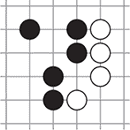

注意，`GoString` 直接跟踪其自己的自由度，你可以通过调用 `num_liberties` 来访问任何点的自由度数，这比从单个石子开始的先前简单方法要高效得多。

此外，你还有能力通过使用 `remove_liberty` 和 `add_liberty` 从给定的字符串中添加和移除自由度。当对手在这个字符串旁边下棋时，字符串的自由度通常会减少，而当这个或另一个组捕获与这个字符串相邻的对手石子时，自由度会增加。

此外，注意 `GoString` 的 `merged_with` 方法，当玩家通过放置一个石子连接两个组时会被调用。

#### 3.1.3\. 在 Go 棋盘上放置和捕获石头

在讨论了石头和石头字符串之后，自然的下一步是讨论如何在棋盘上放置石头。使用列表 3.4 中的`GoString`类，放置石头的算法看起来是这样的：

1.  合并任何相邻的同色字符串。

1.  减少相邻的异色字符串的自由度。

1.  如果现在有任何异色字符串的自由度为零，则移除它们。

此外，如果新创建的字符串的自由度为零，则拒绝该移动。这自然导致以下 Go `Board` 类的实现，你也将它放在 goboard_slow.py 中。你可以通过使用适当的 `num_rows` 和 `num_cols` 实例化来允许棋盘有任意数量的行或列。为了在内部跟踪棋盘状态，你使用私有变量 `_grid`，这是一个你用来存储石头字符串的字典。首先，让我们通过指定其大小来初始化一个 Go 棋盘实例。

##### 列表 3.5\. 创建 Go `Board` 实例

```
class Board():                                *1*
    def __init__(self, num_rows, num_cols):
        self.num_rows = num_rows
        self.num_cols = num_cols
        self._grid = {}
```

+   ***1* 棋盘初始化为一个具有指定行数和列数的空网格。**

接下来，我们讨论放置石头的`Board`方法。在`place_stone`中，你首先必须检查给定点的所有相邻石头以检查自由度。

##### 列表 3.6\. 检查相邻点以确定自由度

```
    def place_stone(self, player, point):
        assert self.is_on_grid(point)
        assert self._grid.get(point) is None
        adjacent_same_color = []
        adjacent_opposite_color = []
        liberties = []
        for neighbor in point.neighbors():           *1*
            if not self.is_on_grid(neighbor):
                continue
            neighbor_string = self._grid.get(neighbor)
            if neighbor_string is None:
                liberties.append(neighbor)
            elif neighbor_string.color == player:
                if neighbor_string not in adjacent_same_color:
                    adjacent_same_color.append(neighbor_string)
            else:
                if neighbor_string not in adjacent_opposite_color:
                    adjacent_opposite_color.append(neighbor_string)
        new_string = GoString(player, [point], liberties)
```

+   ***1* 首先，你检查这个点的直接邻居。**

注意，列表 3.6 中的前两行使用实用方法来检查该点是否在给定棋盘的范围内，并且该点尚未被下棋。这两个方法定义如下。

##### 列表 3.7\. 放置和移除石头的实用方法

```
    def is_on_grid(self, point):
        return 1 <= point.row <= self.num_rows and \
            1 <= point.col <= self.num_cols

    def get(self, point):                 *1*
        string = self._grid.get(point)
        if string is None:
            return None
        return string.color

    def get_go_string(self, point):       *2*
        string = self._grid.get(point)
        if string is None:
            return None
        return string
```

+   ***1* 返回棋盘上某点的内容：如果该点有石头，则返回玩家，否则返回 None**

+   ***2* 返回某点的整个石头字符串：如果该点有石头，则返回 GoString，否则返回 None**

注意，你还定义了`get_go_string`来返回与给定点关联的石头字符串。这种功能在一般情况下可能很有用，但特别有价值的是可以防止*自我捕获*，我们将在第 3.2 节中更详细地讨论。

在继续列表 3.6 中`place_stone`的定义之后，在定义`new_string`之后，你将遵循下面展示的概述的三步方法。

##### 列表 3.8\. 继续定义 `place_stone`

```
        for same_color_string in adjacent_same_color:               *1*
            new_string = new_string.merged_with(same_color_string)
        for new_string_point in new_string.stones:
            self._grid[new_string_point] = new_string
        for other_color_string in adjacent_opposite_color:          *2*
            other_color_string.remove_liberty(point)
        for other_color_string in adjacent_opposite_color:          *3*
            if other_color_string.num_liberties == 0:
                self._remove_string(other_color_string)
```

+   ***1* 合并任何相邻的同色字符串。**

+   ***2* 减少相邻的异色字符串的自由度。**

+   ***3* 如果现在有任何异色字符串的自由度为零，则移除它们。**

现在，我们定义围棋棋盘时唯一缺少的是如何移除一行棋子，如列表 3.8 最后一行的`remove_string`所要求的。这相当简单，如列表 3.9 所示，但你必须记住，移除敌方棋子时，其他棋子可能会*获得*眼位。例如，在图 3.2 中，你可以看到黑子可以捕获一颗白子，从而为每个相邻的黑子棋子赢得一个额外的眼位。

##### 列表 3.9\. 继续我们`place_stone`的定义

```
    def _remove_string(self, string):
        for point in string.stones:
            for neighbor in point.neighbors():                *1*
                neighbor_string = self._grid.get(neighbor)
                if neighbor_string is None:
                    continue
                if neighbor_string is not string:
                    neighbor_string.add_liberty(point)
            self._grid[point] = None
```

+   ***1* 移除一行棋子可以为其他棋子创造眼位。**

##### 图 3.2\. 黑子可以捕获一颗白子，从而为捕获的棋子相邻的每个围棋棋子恢复一个眼位。

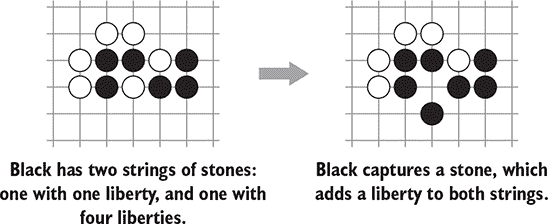

这个定义结束了我们的`Board`实现。

### 3.2\. 捕获游戏状态和检查非法移动

现在你已经实现了在`Board`上放置和捕获棋子的规则，让我们继续通过在`GameState`类中捕获游戏当前状态来玩游戏。粗略地说，*游戏状态*了解棋盘位置、下一个玩家、上一个游戏状态以及最后一步所下的棋。以下只是定义的开始。你将在本节中添加更多功能到`GameState`。再次提醒，你将这段代码放入 goboard_slow.py 中。

##### 列表 3.10\. 编码围棋游戏状态

```
class GameState():
    def __init__(self, board, next_player, previous, move):
        self.board = board
        self.next_player = next_player
        self.previous_state = previous
        self.last_move = move

    def apply_move(self, move):                       *1*
        if move.is_play:
            next_board = copy.deepcopy(self.board)
            next_board.place_stone(self.next_player, move.point)
        else:
            next_board = self.board
        return GameState(next_board, self.next_player.other, self, move)

    @classmethod
    def new_game(cls, board_size):
        if isinstance(board_size, int):
            board_size = (board_size, board_size)
        board = Board(*board_size)
        return GameState(board, Player.black, None, None)
```

+   ***1* 返回应用移动后的新`GameState`**

到目前为止，你可以在`GameState`类中添加以下代码来决定游戏何时结束。

##### 列表 3.11\. 判断围棋游戏何时结束

```
    def is_over(self):
        if self.last_move is None:
            return False
        if self.last_move.is_resign:
            return True
        second_last_move = self.previous_state.last_move
        if second_last_move is None:
            return False
        return self.last_move.is_pass and second_last_move.is_pass
```

现在你已经实现了如何使用`apply_move`将移动应用到当前游戏状态，你也应该编写代码来识别哪些移动是合法的。人类可能会意外尝试非法移动。机器人可能会尝试非法移动，因为它们不知道更好的方法。你需要检查三个规则：

+   确认你想要下棋的点为空。

+   检查移动不是自我捕获。

+   确认移动没有违反禁入点规则。

虽然第一个点很容易实现，但其他两个值得单独处理，因为它们处理起来相当棘手。

#### 3.2.1\. 自我捕获

当你的一行棋子只剩下一个眼位，而你又在移除那个眼位的点上下棋时，我们称之为*自我捕获*。例如，在图 3.3 中，黑子注定要失败。

##### 图 3.3\. 在这个围棋棋盘状态下，三颗黑子只剩下一个眼位；即标记的点。你执行自我捕获规则，因此黑子不允许在那个点下棋。另一方面，白子可以通过在标记的点下棋来捕获三颗黑子。

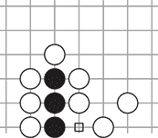

白方可以在任何时间通过在标记点上落子来捕获它们，而黑方无法阻止。但如果黑方在标记点上落子呢？整个组合将没有眼位，然后就会被捕获。大多数规则集禁止这种玩法，尽管存在一些例外。最值得注意的是，在每四年一次的英皇杯（Ing Cup）中允许自杀，这是国际围棋中最大的奖项之一。

你将在代码中执行自杀规则。这与最受欢迎的规则集一致，并且它还减少了你的机器人需要考虑的步数。虽然可以设计出自杀是最佳走法的局面，但在严肃的比赛中，这种情况基本上是闻所未闻的。

如果你稍微改变图 3.3 周围的棋子，你将得到一个完全不同的局面，如图 3.4 所示。

##### 图 3.4。在这种情况下，标记点对黑方来说是一个捕获，而不是自杀，因为黑方将捕获两个白棋，从而重新获得两个眼位。

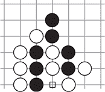

注意，在图 3.4 中，以及一般情况下，你必须先移除对手的棋子，然后再检查新下放的棋子是否有任何眼位。在所有规则集中，这一步棋是一个有效的捕获，而不是自杀，因为黑方通过捕获两个白棋将重新获得两个眼位。

注意，`Board`类允许自杀，但在`GameState`中，你将通过将这一步棋应用到棋盘的副本上并在之后检查眼位数来执行这一规则。

##### 列表 3.12。继续定义`GameState`以执行自杀规则

```
    def is_move_self_capture(self, player, move):
        if not move.is_play:
            return False
        next_board = copy.deepcopy(self.board)
        next_board.place_stone(player, move.point)
        new_string = next_board.get_go_string(move.point)
        return new_string.num_liberties == 0
```

#### 3.2.2. 提子

在检查了自杀之后，你现在可以继续实现提子规则。第二章简要介绍了提子规则及其在围棋游戏中的重要性。简而言之，如果一步棋会使棋盘回到精确的先前位置，则适用提子规则。这并不意味着玩家不能立即反击，以下图示序列显示了这一点。在图 3.5 中，白方刚刚在底部落下一颗孤子。现在黑方的两颗棋子只剩下一个眼位——但白方的这颗棋子也是如此。

##### 图 3.5。在这种情况下，白方想要捕获两颗黑棋，但白方的棋子只剩下一个眼位。

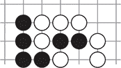

黑方现在可以尝试通过捕获这颗白棋来挽救其两颗棋子，如图 3.6 所示。

##### 图 3.6。继续，黑方试图通过捕获孤立的这颗白棋来挽救其两颗棋子。

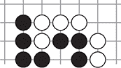

但白方可以立即在图 3.5 中落子的相同点上落子，如图 3.7 所示。

你可以看到白方可以立即夺回三个黑子，劫争规则不适用，因为图 3.5（#ch03fig05）和图 3.7（#ch03fig07）中的整体棋盘位置不同。这种玩法被称为*立即夺回*。在简单情况下，劫争规则归结为不能立即夺回一个棋子。但立即夺回是常见的，这种位置的存在表明在实现劫争时你必须小心。

##### 图 3.7\. 在这种情况下，白方可以简单地立即收回（夺回三个黑子）而不违反劫争规则。

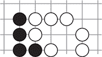

你可以通过许多方式指定劫争规则，但这些方式在罕见情况下实际上等效。你将在代码中实施的规则是，玩家不得下出一个会重新创建先前游戏状态的棋子，其中游戏状态包括棋盘上的棋子和下一个回合的玩家。这种特定的表述被称为*情境超劫*规则。

因为每个 `GameState` 实例都保留了对上一个状态的指针，你可以通过向上遍历树并检查新状态与整个历史记录来实施劫争规则。你通过向你的 `GameState` 实现添加以下方法来完成。

##### 列表 3.13\. 当前游戏状态是否违反了劫争规则？

```
    @property
    def situation(self):
        return (self.next_player, self.board)

    def does_move_violate_ko(self, player, move):
        if not move.is_play:
            return False
        next_board = copy.deepcopy(self.board)
        next_board.place_stone(player, move.point)
        next_situation = (player.other, next_board)
        past_state = self.previous_state
        while past_state is not None:
            if past_state.situation == next_situation:
                return True
            past_state = past_state.previous_state
        return False
```

这种实现简单且正确，但相对较慢。对于每个移动，你都会创建一个棋盘状态的深拷贝，并必须将此状态与所有先前状态进行比较，这会随着时间的推移而累积。在第 3.5 节（#ch03lev1sec5）中，你将遇到一种有趣的技术来加快这一步骤。

为了完成你的 `GameState` 定义，你现在可以使用关于劫争和自我捕获的知识来决定一个移动是否有效。

##### 列表 3.14\. 在给定的游戏状态下，这个移动是否有效？

```
    def is_valid_move(self, move):
        if self.is_over():
            return False
        if move.is_pass or move.is_resign:
            return True
        return (
            self.board.get(move.point) is None and
            not self.is_move_self_capture(self.next_player, move) and
            not self.does_move_violate_ko(self.next_player, move))
```

### 3.3\. 结束游戏

在计算机围棋中，一个关键概念是*自我对弈*。在自我对弈中，你通常从一个弱的围棋代理开始，让它与自己对弈，并使用游戏结果来构建一个更强的机器人。在第四章（kindle_split_016.xhtml#ch04）中，你将使用自我对弈来评估棋盘位置。在第九章（kindle_split_021.xhtml#ch09）到第十二章（kindle_split_024.xhtml#ch12）中，你将使用自我对弈来评估单个移动及其选择的算法。

为了利用这项技术，你需要确保你的自我对弈游戏结束。人类游戏在双方都无法通过下一步移动获得优势时结束。即使对于人类来说，这也是一个棘手的概念。初学者经常通过在对手领土上玩无望的移动或观察对手切入他们认为稳固的领土来结束游戏。对于计算机来说，这更加困难。如果我们的机器人只要还有合法的移动就继续玩，它最终会填满自己的领地并失去所有的棋子。

你可以想出一些启发式方法来帮助机器人以合理的方式结束游戏。例如：

+   不要在一个完全被同色棋子包围的区域下棋。

+   不要下只有一个眼位的棋子。

+   总是用只有一个眼位的情况下吃掉对方的棋子。

不幸的是，*所有这些规则都过于严格*。如果我们的机器人遵循这些规则，强大的对手会利用这些规则杀死应该活着的组，拯救应该死亡的组，或者简单地获得更好的位置。一般来说，我们手工编写的规则应该尽可能限制机器人的选项，以便更复杂的算法可以自由学习高级策略。

要解决这个问题，您可以参考游戏的悠久历史。在古代，胜利者仅仅是棋盘上棋子最多的玩家。玩家们会通过填满他们能填的点来结束游戏，只留下他们组的眼位为空。这可能会使游戏的结束拖得很长，因此玩家们想出了一个加快游戏速度的方法。如果黑方明显控制了棋盘上的某个区域（任何白方在那里放的棋子最终都会被吃掉），那么黑方就没有必要用棋子填满那个区域。玩家们只需同意为黑方计算那个区域。这就是领地概念的产生，几个世纪以来，规则逐渐演变，以至于领地被明确计算。

这种方法计分避免了关于什么是领地，什么不是领地的问题，但您仍然需要防止您的机器人杀死自己的棋子；参见图 3.8。

##### 图 3.8\. 白方在角落 A 和 B 有两个眼位，不应在这两个点放置棋子。否则，黑方可以吃掉整个组。您的天真机器人将不允许填充自己的眼位。

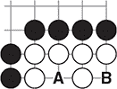

您将硬编码一个规则，以防止机器人按照最严格的定义填充自己的眼位。就我们的目的而言，一个*眼位*是一个空点，其中所有相邻的点以及至少三个四对角相邻的点都填满了友军棋子。

| |
| --- |

##### 注意

经验丰富的围棋玩家可能会注意到，前面关于*眼位*的定义在某些情况下会错过一个有效的眼位。我们将接受这些错误以保持实现简单。

| |
| --- |

您必须为棋盘边缘的眼睛创建一个特殊情况；在这种情况下，所有对角相邻的点都必须包含友军棋子。

您创建一个名为*agent*的新 dlgo 子模块（通过创建一个名为*agent*的新文件夹，并在该文件夹内创建一个空的 __init__.py 文件）并将以下`is_point_an_eye`函数放入一个名为 helpers.py 的文件中。

##### 列表 3.15\. 给定的点是否是眼位？

```
from dlgo.gotypes import Point

def is_point_an_eye(board, point, color):
    if board.get(point) is not None:                       *1*
        return False
    for neighbor in point.neighbors():                     *2*
        if board.is_on_grid(neighbor):
            neighbor_color = board.get(neighbor)
            if neighbor_color != color:
                return False

    friendly_corners = 0                                   *3*
    off_board_corners = 0
    corners = [
        Point(point.row - 1, point.col - 1),
        Point(point.row - 1, point.col + 1),
        Point(point.row + 1, point.col - 1),
        Point(point.row + 1, point.col + 1),
    ]
    for corner in corners:
        if board.is_on_grid(corner):
            corner_color = board.get(corner)
            if corner_color == color:
                friendly_corners += 1
        else:
            off_board_corners += 1
    if off_board_corners > 0:
        return off_board_corners + friendly_corners == 4   *4*
    return friendly_corners >= 3                           *5*
```

+   ***1* 眼位是一个空点。**

+   ***2* 所有相邻的点都必须包含友军棋子。**

+   ***3* 如果点位于棋盘中间，我们必须控制四个角落中的三个；在边缘，你必须控制所有角落。**

+   ***4* 点位于边缘或角落。**

+   ***5* 点位于中间。**

在本章中，你还没有明确关注确定游戏结果，但计算游戏结束时的分数绝对是一个重要的话题。不同的锦标赛和围棋联合会执行略有不同的规则集。在整个书中，你的机器人将遵循 AGA 的*面积计数*规则，也称为*中国计数*。尽管*日本规则*在休闲游戏中更为流行，但 AGA 规则对计算机来说更容易一些，规则差异很少影响游戏结果。

### 3.4\. 创建你的第一个机器人：想象中最弱的围棋 AI

完成了围棋盘的实现和游戏状态的编码后，你可以构建你的第一个围棋机器人。这个机器人将是一个弱手，但它将为所有后续改进的机器人打下基础。首先，你定义所有机器人将遵循的接口。你将代理的定义放入 agent 模块中的 base.py 文件中。

##### 列表 3.16\. 围棋代理的中心接口

```
class Agent:
    def __init__(self):
        pass

    def select_move(self, game_state):
        raise NotImplementedError()
```

就这么简单，只有一个方法。机器人所做的只是根据当前游戏状态选择一个移动。当然，在内部这可能需要其他复杂的任务，例如评估当前位置，但为了玩游戏，我们的机器人永远只需要这些。

我们的第一种实现将尽可能简单：它将随机选择任何有效的移动，但不会填充自己的一个眼位。如果没有这样的移动，它将放弃。你将这个随机机器人放入 agents 目录下的 naive.py 文件中。回想一下第二章，围棋的学生段位通常从 30 段位到 1 段位不等。按照这个标准，你的随机机器人处于 30 段位水平，这是一个绝对的初学者。

##### 列表 3.17\. 一个随机围棋机器人，大约 30 段位水平

```
import random
from dlgo.agent.base import Agent
from dlgo.agent.helpers import is_point_an_eye
from dlgo.goboard_slow import Move
from dlgo.gotypes import Point

class RandomBot(Agent):
    def select_move(self, game_state):
        """Choose a random valid move that preserves our own eyes."""
        candidates = []
        for r in range(1, game_state.board.num_rows + 1):
            for c in range(1, game_state.board.num_cols + 1):
                candidate = Point(row=r, col=c)
                if game_state.is_valid_move(Move.play(candidate)) and \
                        not is_point_an_eye(game_state.board,
                                            candidate,
                                            game_state.next_player):
                    candidates.append(candidate)
        if not candidates:
            return Move.pass_turn()
        return Move.play(random.choice(candidates))
```

到目前为止，你的模块结构应该如下所示（确保在文件夹中放置一个空的 __init__.py 文件以初始化子模块）：

```
dlgo
  ...
  agent
    __init__.py
    helpers.py
    base.py
    naive.py
```

最后，你可以设置一个驱动程序，让两个随机机器人实例之间进行完整游戏。首先，你定义方便的辅助函数，例如在控制台上打印整个棋盘或单个移动。

围棋盘坐标可以用多种方式指定，但在欧洲，最常见的是用字母表中的字母标记列，从 A 开始，行用递增的数字标记，从 1 开始。在这些坐标中，在一个标准的 19×19 棋盘上，左下角是 A1，右上角是 T19。请注意，按照惯例省略了字母 I，以避免与数字 1 混淆。

你定义了一个字符串变量 `COLS = 'ABCDEFGHJKLMNOPQRST'`，其中的字符代表围棋棋盘的列。为了在命令行上显示棋盘，你用一个点(`.`)表示空场，用`x`表示黑子，用`o`表示白子。以下代码放入我们称为 utils.py 的新文件中，在 dlgo 包中。你创建了一个 `print_move` 函数，用于将下一个移动打印到命令行，以及一个 `print_board` 函数，用于打印带有所有石头的当前棋盘。你将此代码放入 dlgo 模块外的名为 bot_v_bot.py 的文件中。

##### 列表 3.18\. 对战机器人游戏的实用函数

```
from dlgo import gotypes

COLS = 'ABCDEFGHJKLMNOPQRST'
STONE_TO_CHAR = {
    None: ' . ',
    gotypes.Player.black: ' x ',
    gotypes.Player.white: ' o ',
}

def print_move(player, move):
    if move.is_pass:
        move_str = 'passes'
    elif move.is_resign:
        move_str = 'resigns'
    else:
        move_str = '%s%d' % (COLS[move.point.col - 1], move.point.row)
    print('%s %s' % (player, move_str))

def print_board(board):
    for row in range(board.num_rows, 0, -1):
        bump = " " if row <= 9 else ""
        line = []
        for col in range(1, board.num_cols + 1):
            stone = board.get(gotypes.Point(row=row, col=col))
            line.append(STONE_TO_CHAR[stone])
        print('%s%d %s' % (bump, row, ''.join(line)))
    print('    ' + '  '.join(COLS[:board.num_cols]))
```

你可以设置一个脚本，启动两个随机机器人，它们在一个 9 × 9 的棋盘上相互对战，直到它们决定游戏结束。

##### 列表 3.19\. 让机器人自我对战的脚本

```
from dlgo import agent
from dlgo import goboard
from dlgo import gotypes
from dlgo.utils import print_board, print_move
import time

def main():
    board_size = 9
    game = goboard.GameState.new_game(board_size)
    bots = {
        gotypes.Player.black: agent.naive.RandomBot(),
        gotypes.Player.white: agent.naive.RandomBot(),
    }
    while not game.is_over():
        time.sleep(0.3)                                  *1*

        print(chr(27) + "[2J")                           *2*
        print_board(game.board)
        bot_move = bots[game.next_player].select_move(game)
        print_move(game.next_player, bot_move)
        game = game.apply_move(bot_move)

if __name__ == '__main__':
    main()
```

+   ***1* 你设置了一个 0.3 秒的睡眠计时器，以便机器人移动不会打印得太快而无法观察。**

+   ***2* 在每一步之前，你清除屏幕。这样，棋盘总是打印在命令行的相同位置。**

你可以通过在命令行运行以下命令来开始机器人游戏：

```
python bot_v_bot.py
```

你应该在屏幕上看到很多移动，游戏将以双方都认输结束。回想一下，你将黑子编码为`x`，白子编码为`o`，空点编码为一个点(`.`)。以下是一个生成游戏中最后一步白子的示例：

```
9 o.ooooooo
8 ooooxxoxx
7 oooox.xxx
6 o.ooxxxxx
5 ooooxxxxx
4 ooooxxxxx
3 o.ooox.xx
2 ooooxxxxx
1 o.oooxxx.
  ABCDEFGHJ
Player.white passes
```

这个机器人不仅弱，而且是一个令人沮丧的对手：它会固执地放置石头，直到整个棋盘被填满，即使它的位置已经无望。此外，无论你让这些机器人相互对战多少次，都没有涉及任何*学习*。这个随机机器人将永远停留在当前的水平。

在本书的其余部分，你将逐渐改进这两个弱点，构建一个越来越有趣和强大的围棋引擎。

### 3.5\. 使用 Zobrist 哈希加速游戏

在描述如何对抗你的随机机器人之前，让我们快速解决当前实现中的一个速度问题，通过介绍一个重要的技术。如果你对加快实现的方法不感兴趣，可以直接跳转到第 3.6 节。

回想一下第 3.2 节，要检查情境超 ko，你需要遍历该游戏的所有位置历史，以查看当前位置是否之前出现过。这是计算上昂贵的。为了避免这个问题，你稍微改变一下设置：不是存储过去的所有棋盘位置，而是只存储它的小得多的*哈希值*。

哈希技术在计算机科学中无处不在。其中一种特别广泛地应用于其他游戏，如国际象棋：*Zobrist 哈希*（以计算机科学家阿尔伯特·Zobrist 命名，他在 20 世纪 70 年代初构建了第一个围棋机器人）。在 Zobrist 哈希中，你为棋盘上每个可能的围棋走法分配一个哈希值。为了获得最佳结果，你应该随机选择每个哈希值。在围棋中，每一步要么是黑子要么是白子，因此在 19 × 19 的棋盘上，完整的 Zobrist 哈希表包含 2 × 19 × 19 = 722 个哈希值。你使用这 722 个代表单个走法的哈希值来编码最复杂的棋盘位置。图 3.9 展示了它是如何工作的。

##### 图 3.9\. 使用 Zobrist 哈希值编码走法和高效存储游戏状态

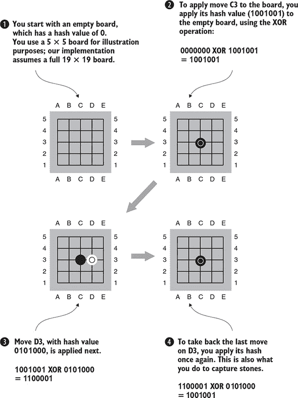

图 3.9 中展示的过程有趣之处在于，一个完整的棋盘状态可以通过一个单一的哈希值来编码。你从空棋盘的哈希值开始，为了简单起见，你可以选择将其设为 0。第一步有一个哈希值，你可以通过在棋盘上执行与走法哈希值的`XOR`操作来应用这个走法。我们称这个操作为*应用哈希值*。按照这个惯例，对于每个新的走法，你都可以将其当前的哈希值应用到棋盘上。这允许你跟踪当前棋盘状态为一个哈希值。

注意，你可以通过再次应用其哈希值来撤销任何走法（`XOR`操作的便利特性）。我们称这个操作为*撤销哈希值*。这一点很重要，因为有了这个特性，你可以在走法被捕获时轻松地从棋盘上移除石头。例如，如果棋盘上 C3 位置的一个黑子被捕获，你可以通过应用 C3 的哈希值从当前棋盘状态哈希值中移除它。当然，在这种情况下，捕获 C3 的白子的哈希值也必须被应用。如果一个白子走法捕获了多个黑子，你将撤销所有它们的哈希值。

由于你选择了足够大且通用的哈希值，因此不会发生哈希冲突（两个不同的游戏状态永远不会产生相同的哈希值），你可以这样编码任何棋盘位置。在实践中，你不需要检查哈希冲突，只需简单地假设没有冲突发生。

要为你的围棋棋盘实现实现 Zobrist 哈希，你首先需要生成哈希值。你使用 Python 的`random`库为 3 × 19 × 19 个可能的位置状态生成 64 位随机整数。请注意，在 Python 中，符号`^`执行`XOR`操作。对于空棋盘，你选择值为`0`。

##### 列表 3.20\. 生成 Zobrist 哈希值

```
import random

from dlgo.gotypes import Player, Point

def to_python(player_state):
    if player_state is None:
        return 'None'
    if player_state == Player.black:
        return Player.black
    return Player.white

MAX63 = 0x7fffffffffffffff

table = {}
empty_board = 0
for row in range(1, 20):
    for col in range(1, 20):
        for state in (Player.black, Player.white):
            code = random.randint(0, MAX63)
            table[Point(row, col), state] = code

print('from .gotypes import Player, Point')
print('')
print("__all__ = ['HASH_CODE', 'EMPTY_BOARD']")
print('')
print('HASH_CODE = {')
for (pt, state), hash_code in table.items():
    print('    (%r, %s): %r,' % (pt, to_python(state), hash_code))
print('}')
print('')
print('EMPTY_BOARD = %d' % (empty_board,))
```

运行此脚本将在命令行上打印所需的哈希值。执行前面的代码将在命令行上生成 Python 代码。将此输出放置在 dlgo 模块中的 zobrist.py 文件中。

现在你有了散列值，你只需要用散列值替换你的旧状态跟踪机制。创建一个名为 goboard.py 的 goboard_slow.py 副本，你将在其中为本节其余部分进行所有必要的更改。或者，你可以遵循 GitHub 仓库中的 goboard.py 中的代码。你从一个轻微的修改开始，使`GoString`和`stones`以及`liberties`不可变，这意味着它们在创建后不能被修改。你可以通过使用 Python 的`frozenset`而不是`set`来实现这一点。`frozenset`没有添加或删除项的方法，因此你需要创建一个新的集合而不是修改现有的集合。

##### 列表 3.21\. 具有不可变棋子和气集合的`GoString`实例

```
class GoString:
    def __init__(self, color, stones, liberties):
        self.color = color
        self.stones = frozenset(stones)
        self.liberties = frozenset(liberties)                       *1*

    def without_liberty(self, point):                               *2*
        new_liberties = self.liberties - set([point])
        return GoString(self.color, self.stones, new_liberties)

    def with_liberty(self, point):                                  *3*
        new_liberties = self.liberties | set([point])
        return GoString(self.color, self.stones, new_liberties)
```

+   ***1* 石子和气现在是不可变的 frozenset 实例。**

+   ***2* `without_liberty`方法替换了之前的`remove_liberty`方法...**

+   ***3* ...并且 with_liberty 替换了 add_liberty。**

在`GoString`中，你替换了两个方法来处理不可变状态，并保留了其他辅助方法，如`merged_with`或`num_liberties`。

接下来，你更新围棋盘的相关部分。请记住，将本节其余部分的全部代码放在 goboard.py 中，你的 goboard_slow.py 副本。

##### 列表 3.22\. 使用空棋盘的`hash`值初始化围棋盘

```
from dlgo import zobrist

class Board:
    def __init__(self, num_rows, num_cols):
        self.num_rows = num_rows
        self.num_cols = num_cols
        self._grid = {}
        self._hash = zobrist.EMPTY_BOARD
```

接下来，在你的`place_stone`方法中，每次放置一个新的棋子时，你应用相应颜色的散列值。确保将这些更改应用到 goboard.py 文件中，就像应用到本节其他所有代码一样。

##### 列表 3.23\. 放置一个棋子意味着应用该棋子的散列值

```
        new_string = GoString(player, [point], liberties)              *1*

        for same_color_string in adjacent_same_color:                  *2*
            new_string = new_string.merged_with(same_color_string)
        for new_string_point in new_string.stones:
            self._grid[new_string_point] = new_string

        self._hash ^= zobrist.HASH_CODE[point, player]                 *3*

        for other_color_string in adjacent_opposite_color:
            replacement = other_color_string.without_liberty(point)    *4*
            if replacement.num_liberties:

     self._replace_string(other_color_string.without_liberty(point))
            else:
                self._remove_string(other_color_string)                *5*
```

+   ***1* 到这一行为止，place_stone 保持不变。**

+   ***2* 你合并任何相邻的同色棋子。**

+   ***3* 接下来，你应用这个点和玩家的散列码。**

+   ***4* 然后减少相邻异色棋子的气数。**

+   ***5* 如果现在有任何异色棋子没有气，则移除它们。**

要移除一个棋子，你将其散列值再次应用于棋盘。

##### 列表 3.24\. 移除一个棋子意味着取消应用该棋子的散列值

```
    def _replace_string(self, new_string):                         *1*
        for point in new_string.stones:
            self._grid[point] = new_string

    def _remove_string(self, string):
        for point in string.stones:
            for neighbor in point.neighbors():                     *2*
                neighbor_string = self._grid.get(neighbor)
                if neighbor_string is None:
                    continue
                if neighbor_string is not string:
                    self._replace_string(neighbor_string.with_liberty(point))
            self._grid[point] = None

            self._hash ^= zobrist.HASH_CODE[point, string.color]   *3*
```

+   ***1* 这个新的辅助方法更新你的围棋盘网格。**

+   ***2* 移除一个字符串可以为其他字符串创造气。**

+   ***3* 使用 Zobrist 散列，你需要取消应用这个移动的散列。**

你添加到`Board`类的最后一件事是一个实用方法，用于返回当前的 Zobrist 散列值。

##### 列表 3.25\. 返回棋盘的当前 Zobrist 散列值

```
    def zobrist_hash(self):
        return self._hash
```

现在你已经使用 Zobrist 散列值编码了围棋盘，让我们看看如何利用它来改进`GameState`。

在之前，游戏状态被设置为这样：`self.previous_state = previous`，我们认为这太昂贵了，因为你必须遍历所有过去的状态来检查劫争。相反，你想要存储 Zobrist 散列值，你可以通过使用新的变量`previous_states`来实现，如下一段代码所示。

##### 列表 3.26\. 使用 Zobrist 哈希初始化游戏状态

```
class GameState:
    def __init__(self, board, next_player, previous, move):
        self.board = board
        self.next_player = next_player
        self.previous_state = previous
        if self.previous_state is None:
            self.previous_states = frozenset()
        else:
            self.previous_states = frozenset(
                previous.previous_states |
                {(previous.next_player, previous.board.zobrist_hash())})
        self.last_move = move
```

如果棋盘为空，`self.previous_states` 是一个空的不可变 `frozenset`。否则，你通过一对来增强状态：下一个玩家的颜色和上一个游戏状态的 Zobrist 哈希。

在设置好所有这些之后，你最终可以大幅改进你的 `does_move_violate_ko` 实现。

##### 列表 3.27\. 使用 Zobrist 哈希快速检查 ko 状态

```
    def does_move_violate_ko(self, player, move):
        if not move.is_play:
            return False
        next_board = copy.deepcopy(self.board)
        next_board.place_stone(player, move.point)
        next_situation = (player.other, next_board.zobrist_hash())
        return next_situation in self.previous_states
```

通过单行 `next_situation in self.previous_states` 检查之前的棋盘状态比之前显式遍历棋盘状态的效率高了一个数量级。

这个有趣的哈希技巧将使后续章节中的自我对弈更快，从而在游戏玩法上带来更快的改进。


**进一步加速你的围棋盘实现**

我们对原始的 goboard_slow.py 实现进行了深入分析，并展示了如何通过 Zobrist 哈希来加速它，从而得到 goboard.py。在 GitHub 仓库中，你还会看到另一个名为 goboard_fast.py 的围棋盘实现，其中你可以进一步加快游戏速度。这些速度提升在后续章节中非常有价值，但这是以可读性为代价的。

如果你感兴趣，想了解如何使你的围棋盘更快，请查看 goboard_fast.py 以及那里的注释。大多数优化都是避免构造和复制 Python 对象的技巧。


### 3.6\. 与你的机器人对抗

在创建了一个与自己对抗的弱机器人之后，你可能想知道你是否可以测试你的知识从 第二章 开始，自己与它对抗。这确实可能，并且与机器人对抗机器人的设置相比，不需要太多改变。

你还需要一个额外的实用函数，将其放入 utils.py 中，以帮助你从人类输入中读取坐标。

##### 列表 3.28\. 将人类输入转换为围棋盘坐标

```
def point_from_coords(coords):
    col = COLS.index(coords[0]) + 1
    row = int(coords[1:])
    return gotypes.Point(row=row, col=col)
```

这个函数将像 `C3` 或 `E7` 这样的输入转换为围棋盘坐标。考虑到这一点，你现在可以在 human_v_bot.py 中设置程序以进行 9 × 9 游戏如下。

##### 列表 3.29\. 设置脚本以便你可以玩自己的机器人

```
from dlgo import agent
from dlgo import goboard_slow as goboard
from dlgo import gotypes
from dlgo.utils import print_board, print_move, point_from_coords
from six.moves import input

def main():
    board_size = 9
    game = goboard.GameState.new_game(board_size)
    bot = agent.RandomBot()

    while not game.is_over():
        print(chr(27) + "[2J")
        print_board(game.board)
        if game.next_player == gotypes.Player.black:
            human_move = input('-- ')
            point = point_from_coords(human_move.strip())
            move = goboard.Move.play(point)
        else:
            move = bot.select_move(game)
        print_move(game.next_player, move)
        game = game.apply_move(move)

if __name__ == '__main__':
    main()
```

你，作为人类玩家，将扮演黑方。你的随机机器人扮演白方。用以下方式启动脚本：

```
python human_v_bot.py
```

你将被提示输入一个移动，并通过 `enter` 确认。例如，如果你选择将 `G3` 作为你的第一个移动，机器人的响应可能如下所示：

```
Player.white D8
9 .........
8 ...o.....
7 .........
6 .........
5 .........
4 .........
3 ......x..
2 .........
1 .........
  ABCDEFGHJ
```

如果你愿意，你可以继续与这个机器人进行完整游戏。但由于机器人玩的是随机移动，目前这样做并不有趣。

注意，在遵循围棋规则方面，这个机器人已经完整了。它知道它将需要的所有关于围棋的知识。这个事实很重要，因为它让你可以完全专注于从现在开始提高游戏算法。这个机器人代表了你的起点。在接下来的章节中，你将介绍更多有趣的技巧来创建更强大的机器人。

### 3.7\. 摘要

+   围棋游戏中两位玩家的最佳编码方式是使用枚举。

+   围棋棋盘上的一个点由其直接邻域来表征。

+   围棋中的一步棋可以是落子、认输或投降。

+   石子串是由相同颜色的石子组成的连接组。石子串对于放置石子后高效检查被捕获的石子非常重要。

+   围棋的`Board`包含了放置和捕获石子的所有逻辑。

+   相比之下，`GameState`跟踪的是轮到谁走，当前棋盘上的石子，以及之前状态的历史。

+   Ko 可以通过使用情境超级 ko 规则来实现。

+   Zobrist 哈希是一种重要的技术，可以高效地编码游戏历史并加快 ko 的检查。

+   一个围棋玩棋代理可以通过一个方法来定义：`select_move`。

+   您的随机机器人可以与自己、其他机器人以及人类对手进行对弈。
