## 第二部分\. 机器学习和游戏人工智能

在第二部分中，你将学习古典和现代游戏人工智能的组件。你将从各种树搜索算法开始，这些算法是游戏人工智能和各类优化问题的基本工具。接下来，你将学习深度学习和神经网络，从数学基础开始，逐步到许多实际设计考虑。最后，你将了解强化学习，这是一个你的游戏人工智能可以通过实践来改进的框架。

当然，这些技术并不局限于游戏。一旦你掌握了这些组件，你将开始看到在各个领域应用它们的机会。

## 第四章\. 使用树搜索玩游戏

*本章涵盖*

+   使用最小-最大算法找到最佳走法

+   剪枝最小-最大树搜索以加快速度

+   将蒙特卡洛树搜索应用于游戏

假设你被赋予了两个任务。第一个任务是编写一个玩棋类的计算机程序。第二个任务是编写一个计划如何在仓库中高效挑选订单的程序。这些程序有什么共同之处呢？乍一看，似乎并不多。但如果你退后一步，用抽象的思维方式思考，你会发现一些相似之处：

+   ***你需要做出一系列决策。*** 在棋类游戏中，你的决策是关于移动哪个棋子。在仓库中，你的决策是关于下一个要挑选哪个物品。

+   ***早期的决策可能会影响未来的决策。*** 在棋类游戏中，早期移动兵可能会在许多回合后使你的王后暴露在反击之下。在仓库中，如果你首先去货架 17 上的小工具，你可能需要在稍后需要时回溯到货架 99。

+   ***在序列的末尾，你可以评估你实现目标的效果。*** 在棋类游戏中，当你达到游戏结束时，你知道谁赢了。在仓库中，你可以累计收集所有物品所需的时间。

+   ***可能的序列数量可能非常庞大。*** 棋类游戏可能有大约 10¹⁰⁰ 种展开方式。在仓库中，如果你有 20 个物品要挑选，有 20 亿种可能的路径可以选择。

当然，这个类比只能到此为止。例如，在棋类游戏中，你与一个积极试图阻挠你意图的对手轮流走棋。这在你想要工作的任何仓库中都不会发生。

在计算机科学中，*树搜索*算法是遍历许多可能的决策序列以找到最佳结果的策略。在本章中，我们讨论了树搜索算法在游戏中的应用；许多原则也可以扩展到其他优化问题。我们从*最小-最大*搜索算法开始，其中你需要在每轮中切换两个对立玩家的视角。最小-最大算法可以找到完美的游戏策略，但速度太慢，无法应用于复杂的游戏。接下来，我们看看两种在搜索树的一小部分时就能得到有用结果的技术。其中之一是*剪枝*：通过消除树的部分来加速搜索。为了有效地剪枝，你需要将现实世界的知识带入你的代码中。当这不可能时，有时可以应用*蒙特卡洛树搜索*（MCTS）。MCTS 是一种随机搜索算法，可以在没有任何领域特定代码的情况下找到好的结果。

在你的工具箱中有了这些技术，你可以开始构建能够玩各种棋盘游戏和卡牌游戏的 AI。

### 4.1\. 游戏分类

树搜索算法主要适用于轮流进行游戏，并且每轮都有离散的选项可供选择。许多棋盘游戏和卡牌游戏都符合这一描述。另一方面，树搜索对计算机打篮球、捉迷藏或魔兽世界没有帮助。我们可以根据两个有用的属性进一步对棋盘游戏和卡牌游戏进行分类：

+   ***确定性 vs. 非确定性*—** 在**确定性**游戏中，游戏的进程只取决于玩家的决策。在**非确定性**游戏中，涉及随机元素，例如掷骰子或洗牌。

+   ***完美信息 vs. 隐藏信息*—** 在**完美信息**游戏中，两位玩家可以随时看到整个游戏状态；整个棋盘是可见的，或者每个人的牌都在桌面上。在**隐藏信息**游戏中，每位玩家只能看到游戏状态的一部分。隐藏信息在卡牌游戏中很常见，每位玩家被发几张牌，却看不到其他玩家手中的牌。隐藏信息游戏的吸引力之一是根据玩家的游戏决策猜测其他玩家知道什么。

表 4.1 展示了几个知名游戏如何纳入这个分类法。

##### 表 4.1\. 游戏分类：棋盘游戏和卡牌游戏

|   | 确定性 | 非确定性 |
| --- | --- | --- |
| 完美信息 | 国际象棋 | 象棋 |
| 隐藏信息 | 飞行艇，策略游戏 | 赌博，拼字游戏 |

在本章中，我们主要关注确定性、完美信息游戏。在这样游戏的每一回合，理论上有一个最佳走法。没有运气，也没有秘密；在你选择走法之前，你知道你的对手可能会选择的所有回应，以及你之后可能采取的所有行动，以此类推到游戏结束。理论上，你应该在第一步就计划好整个游戏。最小-最大算法正是为了达到这个目的而设计的，以实现完美的游戏策略。

在现实中，经得起时间考验的游戏，如国际象棋和围棋，有无数的可能性。对人类来说，每一场游戏似乎都充满了生命力，即使是计算机也无法计算出所有可能的结局。

本章中的所有示例都包含很少的游戏特定逻辑，因此你可以将它们适应到任何确定性、完美信息游戏中。要做到这一点，你可以遵循我们井字棋模块的模式，并在`Player`、`Move`和`GameState`等类中实现你的新游戏逻辑。`GameState`的基本函数是`apply_move`、`legal_moves`、`is_over`和`winner`。我们已经为井字棋做了这件事；你可以在 GitHub 上的 ttt 模块中找到它（[`mng.bz/gYPe`](http://mng.bz/gYPe))。


**用于 AI 实验的游戏**

需要一些灵感吗？查找以下任何游戏的规则：

+   国际象棋

+   国际跳棋

+   反转棋

+   六边形棋

+   中国象棋

+   曼尼拉

+   九子棋

+   五子棋


### 4.2\. 使用最小-最大搜索预测对手

你如何编程让计算机在游戏中决定下一步棋？首先，你可以思考人类会如何做出同样的决定。让我们从最简单的确定性、完美信息游戏开始：井字棋。我们描述的策略的技术名称是 *最小-最大策略*。这个术语是 *最小化和最大化* 的缩写：你试图最大化你的得分，而你的对手则试图最小化你的得分。你可以用一句话总结这个算法：假设你的对手和你一样聪明。

让我们看看最小-最大策略在实际中是如何工作的。看看图 4.1。X 下一步应该走哪？

##### 图 4.1\. X 下一步应该走哪？这是一个简单的选择：在右下角走棋就能赢得游戏。


这里没有技巧；占据右下角就能赢得游戏。你可以将这个规则概括为：采取任何立即赢得游戏的走法。这个计划不可能出错。你可以用以下代码实现这个规则。

##### 列表 4.1\. 一个找到立即获胜走法的函数

```
def find_winning_move(game_state, next_player):
  for candidate_move in game_state.legal_moves(next_player):       *1*
    next_state = game_state.apply_move(candidate_move)             *2*
    if next_state.is_over() and next_state.winner == next_player:
      return candidate_move                                        *3*
  return None                                                      *4*
```

+   ***1* 遍历所有合法走法**

+   ***2* 计算如果你选择这个走法，棋盘会是什么样子**

+   ***3* 这是一个获胜的走法！无需继续搜索。**

+   ***4* 本回合无法获胜**

图 4.2 展示了这个函数将要检查的假设棋盘位置。这种结构，其中棋盘位置指向可能的后续走法，被称为*游戏树*。

##### 图 4.2\. 一个寻找获胜走法的算法示例。你从顶部位置开始。遍历每一个可能的走法，并计算如果你走这步棋，游戏状态会变成什么样子。然后检查这个假设的游戏状态是否是×的获胜位置。

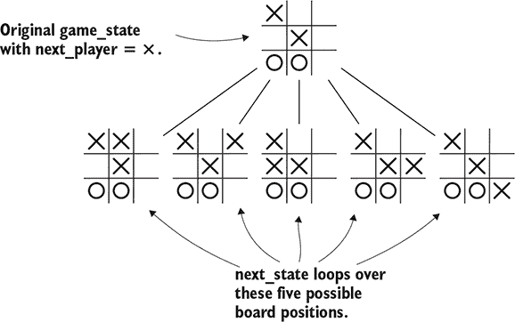

让我们回顾一下。你是如何进入这个位置的？也许前一个位置看起来像图 4.3。O 玩家天真地希望横跨底部完成三连珠。但这假设 X 会配合这个计划。这给我们之前的规则提供了一个推论：不要选择任何会给对手带来获胜走法的走法。列表 4.2 实现了这个逻辑。

##### 图 4.3\. O 下一步应该走什么？如果 O 在左下角走棋，你必须假设 X 将在右下角跟进以赢得比赛。O 必须找到唯一一个可以阻止这种情况的走法。

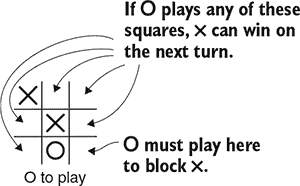

##### 列表 4.2\. 一个避免给对手带来获胜走法的函数

```
def eliminate_losing_moves(game_state, next_player):
  opponent = next_player.other()
  possible_moves = []                                               *1*
  for candidate_move in game_state.legal_moves(next_player):        *2*
    next_state = game_state.apply_move(candidate_move)              *3*
    opponent_winning_move = find_winning_move(next_state, opponent) *4*
    if opponent_winning_move is None:                               *4*
      possible_moves.append(candidate_move)                         *4*
  return possible_moves
```

+   ***1* possible_moves 将成为一个值得考虑的所有走法的列表。**

+   ***2* 遍历所有合法的走法**

+   ***3* 计算如果你走这步棋，棋盘会是什么样子**

+   ***4* 这个走法会给对手带来获胜机会吗？如果不给，这个走法是可行的。**

现在，你知道你必须阻止对手进入获胜位置。因此，你应该假设对手也会对你做同样的事情。考虑到这一点，你该如何赢得比赛？看看图 4.4 中的棋盘。

##### 图 4.4\. ×下一步应该走什么？如果×在中间走棋，将有两种方式来完成三连珠：（1）上中；（2）下右。O 只能阻止其中一种选择，所以×保证能赢。

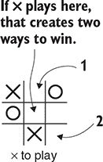

如果你走中间，你有两种方式来完成三连珠：上中或下右。对手无法同时阻止它们。我们可以将这个一般原则描述如下：寻找一个走法，这个走法可以设置一个后续的获胜走法，而对手无法阻止。听起来很复杂，但很容易在已经编写的函数之上构建这个逻辑。

##### 列表 4.3\. 一个找到保证获胜的两步序列的函数

```
def find_two_step_win(game_state, next_player):
  opponent = next_player.other()
  for candidate_move in game_state.legal_moves(next_player):        *1*
    next_state = game_state.apply_move(candidate_move)              *2*
    good_responses = eliminate_losing_moves(next_state, opponent)   *3*
    if not good_responses:                                          *3*
      return candidate_move                                         *3*
  return None                                                       *4*
```

+   ***1* 遍历所有合法的走法**

+   ***2* 计算如果你走这步棋，棋盘会是什么样子**

+   ***3* 你的对手有好的防守吗？如果没有，选择这个走法。**

+   ***4* 无论你选择什么走法，你的对手都可以阻止你获胜。**

你的对手会预料到你将尝试这样做，并试图阻止这种走法。你开始看到一种总体策略的形成：

1.  看看你是否能在下一回合获胜。如果是，就下这个走法。

1.  如果不是，看看你的对手是否能在下一回合获胜。如果是，就阻止他。

1.  如果不是，看看你是否能在两步内迫使对手获胜。如果是这样，就进行设置。

1.  如果不是，看看你的对手是否能在下一次移动中设置一个两步获胜的局面。

注意，你的所有三个函数都有类似的结构。每个函数都会遍历所有有效的移动，并检查执行该移动后你将得到的假设棋盘位置。此外，每个函数都是基于前一个函数来模拟对手将如何应对。如果你将这个概念推广，你将得到一个总能识别最佳可能移动的算法。

### 4.3. 解决井字棋：最小-最大示例

在前一个章节中，你学习了如何预测对手的一步或两步棋。在本节中，我们将展示如何将这种策略推广到井字棋中，以选择完美的移动。核心思想完全相同，但你需要灵活性，以便查看任意数量的未来移动。

首先，让我们定义一个枚举，它代表游戏的三种可能结果：胜利、失败或平局。这些可能性是相对于特定玩家定义的：一个玩家的失败对另一个玩家来说是胜利。

##### 列表 4.4. 一个枚举，用于表示游戏的结果

```
class GameResult(enum.Enum):
    loss = 1
    draw = 2
    win = 3
```

假设你有一个函数 `best_result`，它接受一个游戏状态并告诉你玩家从该状态中可以达到的最佳结果。如果该玩家可以通过任何序列（无论多么复杂）保证胜利，则 `best_result` 函数将返回 `GameResult.win`。如果该玩家可以迫使平局，则函数将返回 `GameResult.draw`。否则，它将返回 `GameResult.loss`。如果你假设该函数已经存在，编写一个选择移动的函数就很容易了：你遍历所有可能的移动，调用 `best_result`，并选择导致你最佳结果的移动。可能存在多个导致相同结果的移动；在这种情况下，你可以随机从中选择。下面的列表显示了如何实现这一点。

##### 列表 4.5. 实现最小-最大搜索的游戏代理

```
class MinimaxAgent(Agent):
    def select_move(self, game_state):
        winning_moves = []
        draw_moves = []
        losing_moves = []
        for possible_move in game_state.legal_moves():                    *1*
            next_state = game_state.apply_move(possible_move)             *2*
            opponent_best_outcome = best_result(next_state)               *3*
            our_best_outcome = reverse_game_result(opponent_best_outcome) *3*
            if our_best_outcome == GameResult.win:                        *4*
                winning_moves.append(possible_move)                       *4*
            elif our_best_outcome == GameResult.draw:                     *4*
                draw_moves.append(possible_move)                          *4*
            else:                                                         *4*
                losing_moves.append(possible_move)                        *4*
        if winning_moves:                                                 *5*
            return random.choice(winning_moves)                           *5*
        if draw_moves:                                                    *5*
            return random.choice(draw_moves)                              *5*
        return random.choice(losing_moves)                                *5*
```

+   ***1* 遍历所有合法的移动**

+   ***2* 计算如果你选择这个移动的游戏状态**

+   ***3* 因为你的对手将下下一步棋，所以从那里推断出他们可能的最佳结果。你的结果将是相反的。**

+   ***4* 根据其结果对这次移动进行分类**

+   ***5* 选择导致你最佳结果的一步棋**

现在的问题是如何实现 `best_result`。正如前一个章节中提到的，你可以从游戏的最后一步开始，向后工作。下面的列表显示了简单的情况：如果游戏已经结束，只有一个可能的结果。你只需返回它。

##### 列表 4.6. 最小-最大搜索算法的第一步

```
def best_result(game_state):
    if game_state.is_over():
        if game_state.winner() == game_state.next_player:
            return GameResult.win
        elif game_state.winner() is None:
            return GameResult.draw
        else:
            return GameResult.loss
```

如果你处于游戏的中途，你需要向前搜索。到目前为止，这个模式应该是熟悉的。你首先遍历所有可能的走法，并计算下一个游戏状态。然后你必须假设你的对手会尽其所能来对抗你的假设走法。为此，你可以从这个新位置调用`best_result`。这告诉你对手可以从新位置得到的结果；你反转它以找出你的结果。在考虑的所有走法中，你选择对你最有利的走法。列表 4.7 展示了如何实现这个逻辑，这构成了`best_result`的第二部分。图 4.5 说明了这个函数将为特定的井字棋棋盘考虑的棋盘位置。

##### 图 4.5\. 一个井字棋游戏树。在顶部位置，轮到×走。如果×在顶部中间走，O 可以保证胜利。如果×在左中间走，×将获胜。如果×在右中间走，O 可以迫使平局。因此，×会选择在左中间走。

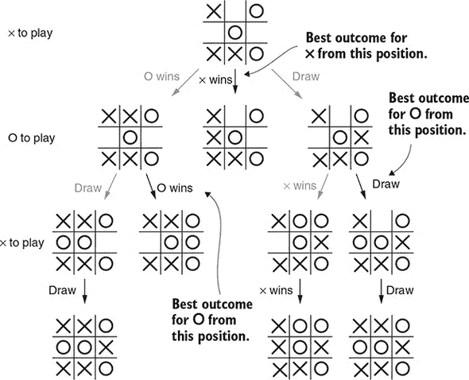

##### 列表 4.7\. 实现最小-最大搜索

```
    best_result_so_far = GameResult.loss
    for candidate_move in game_state.legal_moves():
        next_state = game_state.apply_move(candidate_move)       *1*
        opponent_best_result = best_result(next_state)           *2*
        our_result = reverse_game_result(opponent_best_result)   *3*
        if our_result.value > best_result_so_far.value:          *4*
            best_result_so_far = our_result
    return best_result_so_far
```

+   ***1* 看看如果你走这步棋，棋盘会是什么样子。**

+   ***2* 找出你的对手的最佳走法。**

+   ***3* 无论你的对手想要什么，你想要的是相反的。**

+   ***4* 看看这个结果是否比迄今为止看到的最优结果更好。**

如果你将这个算法应用于像井字棋这样的简单游戏，你会得到一个不可战胜的对手。你可以与之对弈，亲自看看：尝试 GitHub 上的 play_ttt.py 示例（[`mng.bz/gYPe`](http://mng.bz/gYPe)）。从理论上讲，这个算法也适用于国际象棋、围棋或其他任何确定性的、完美信息游戏。实际上，这个算法对于这些游戏来说速度太慢了。

### 4.4\. 通过剪枝减少搜索空间

在我们的井字棋游戏中，你计算了每一种可能的棋局，以找到完美的策略。井字棋的可能棋局少于 300,000 种，对于现代计算机来说微不足道。你能将同样的技术应用于更有趣的游戏吗？例如，国际象棋有大约 5000 亿亿（即 5 后面跟着 20 个零）种可能的棋盘位置。在技术上，可以在现代计算机集群上搜索它们，但这需要数年。在国际象棋和围棋中，可能的棋盘位置比宇宙中的原子还多（正如他们的粉丝乐于指出）。搜索所有这些位置是不可能的。

要使用树搜索来玩复杂的游戏，你需要一种策略来消除树的一部分。确定你可以跳过的树的部分被称为*剪枝*。

游戏树是二维的：它们有宽度和深度。*宽度*是从给定棋盘位置的可能走法数量。*深度*是从棋盘位置到最终游戏状态（可能的游戏结束）的回合数。在游戏中，这两个数量在每一回合都会变化。

你通常通过考虑特定游戏的典型宽度和典型深度来估计树的大小。游戏树中的棋盘位置数量大致由公式 *W^d* 给出，其中 *W* 是平均宽度，*d* 是平均深度。图 4.6 和 4.7 展示了负三子棋游戏树的宽度和深度。例如，在国际象棋中，玩家通常每步有大约 30 种选择，游戏大约持续 80 步；树的大小大约是 30⁸⁰ ≈ 10¹¹⁸ 个位置。围棋通常每轮有 250 种合法移动，游戏可能持续 150 轮。这给出了一个游戏树大小为 250¹⁵⁰ ≈ 10³⁵⁹ 个位置。

##### 图 4.6\. 负三子棋游戏树的宽度：最大宽度为 9，因为第一步你有 9 种可能的选择。但随着每一轮的进行，合法移动的数量会减少，所以平均宽度为 4 或 5 次移动。

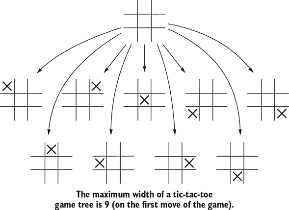

##### 图 4.7\. 负三子棋游戏树的深度：最大深度为 9 次移动；之后，棋盘就满了。

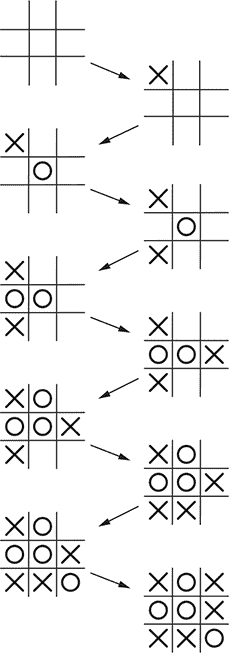

这个公式，*W^d*，是指数增长的例子：随着搜索深度的增加，需要考虑的位置数量会迅速增长。想象一下一个平均宽度和深度约为 10 的游戏。完整的游戏树将包含 10¹⁰，即 10 亿，个棋盘位置需要搜索。

现在假设你提出了适度的剪枝方案。首先，你找出如何快速消除每一轮考虑的两个移动，将有效宽度减少到 8。其次，你决定你可以通过查看 9 次而不是 10 次来推断游戏结果。这让你有 8⁹ 个位置需要搜索，大约为 1.3 亿。与全搜索相比，你已经消除了超过 98% 的计算！关键点是，即使稍微减少搜索的宽度或深度，也可以大幅减少选择移动所需的时间。图 4.8 展示了剪枝对小型树的影响。

##### 图 4.8\. 剪枝可以快速缩小游戏树。这个树宽度为 4，高度为 3，总共有 64 个叶子需要检查。假设你找到了一种方法，在每一轮中消除 4 种可能选择中的 1 种。那么你最终只需要访问 27 个叶子。

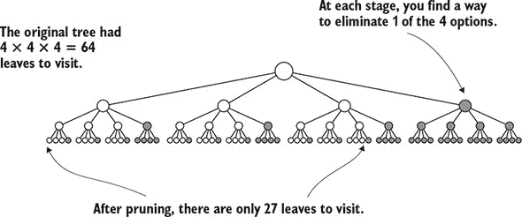

在本节中，我们介绍了两种剪枝技术：用于减少搜索深度的 *位置评估函数*，以及用于减少搜索宽度的 *alpha-beta 剪枝*。这两种技术共同构成了经典棋类人工智能的骨架。

#### 4.4.1\. 使用位置评估减少搜索深度

如果你将游戏树一直追踪到游戏结束，你可以计算出胜者。那么游戏早期呢？人类玩家通常在整个中盘阶段都有一种领先的感觉。即使是围棋初学者也有一种本能的感觉，知道他们是控制对手还是挣扎求生。如果你能在计算机程序中捕捉到这种感觉，你可以减少需要搜索的深度。一个模仿这种领先感觉及其程度的函数是一个*位置评估函数*。

对于许多游戏，位置评估函数可以通过使用游戏知识手工制作。例如：

+   ***跳棋*—** 计算棋盘上每个普通棋子的价值，加上每个国王两分。计算你棋子的价值并减去你对手棋子的价值。

+   ***国际象棋*—** 每个兵算一分，每个象或马算三分，每个车算五分，而皇后算九分。计算你棋子的价值并减去你对手棋子的价值。

这些评估函数高度简化；顶尖的跳棋和象棋引擎使用更复杂的启发式方法。但在两种情况下，AI 都有动机捕获对手的棋子并保留自己的棋子。此外，它愿意用较弱的棋子交换以捕获更强的棋子。

在围棋中，等效的启发式方法是计算你捕获的棋子总数，然后减去你对手捕获的棋子数。（等价地，你可以计算棋盘上棋子数量的差异。）列表 4.8 计算了这个启发式方法。结果发现这并不是一个有效的评估函数。在围棋中，*威胁*捕获棋子的重要性远大于*实际*捕获棋子。一个游戏持续 100 回合或更长时间才出现任何棋子被捕获的情况是很常见的。制作一个能够准确捕捉游戏状态细微差异的棋盘评估函数证明是极其困难的。

话虽如此，你可以使用这个过于简单的启发式方法来演示剪枝技术。这不会产生一个强大的机器人，但比完全随机选择动作要好。在第十一章和 12 章中，我们介绍了如何使用深度学习来生成更好的评估函数。

在你选择了一个评估函数之后，你可以实现*深度剪枝*。你不需要搜索到游戏结束并看到谁赢了，而是搜索固定数量的步数，并使用评估函数来估计谁更有可能获胜。

##### 列表 4.8\. 围棋的一个高度简化的棋盘评估启发式方法

```
def capture_diff(game_state):
    black_stones = 0
    white_stones = 0
    for r in range(1, game_state.board.num_rows + 1):
        for c in range(1, game_state.board.num_cols + 1):
            p = gotypes.Point(r, c)
            color = game_state.board.get(p)
            if color == gotypes.Player.black:
                black_stones += 1
            elif color == gotypes.Player.white:
                white_stones += 1
    diff = black_stones - white_stones                   *1*
    if game_state.next_player == gotypes.Player.black:   *2*
        return diff                                      *2*
    return -1 * diff                                     *3*
```

+   ***1* 计算棋盘上黑子与白子的数量差异。除非一方提前弃权，否则这将是捕获数量差异相同。**

+   ***2* 如果是黑方的回合，返回（黑子数）-（白子数）。**

+   ***3* 如果是白方的回合，返回（白方棋子数）-（黑方棋子数）。**

图 4.9 展示了一个带有深度剪枝的局部棋树。（我们为了节省空间，省略了大部分分支，但算法也会检查这些分支。）

##### 图 4.9\. 一个部分围棋棋树。在这里，你搜索到 2 步棋的深度。在那个点上，你查看捕获的棋子数量来评估棋盘。如果黑方选择最右侧的分支，白方可以吃掉一个棋子，给黑方的评估结果是-1。如果黑方选择中间的分支，黑方的棋子现在安全（暂时如此）。这个分支的评估分数是 0。因此，黑方选择中间的分支。

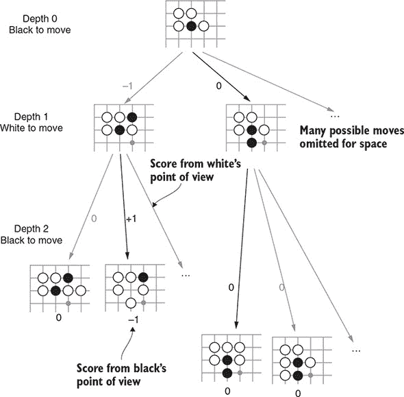

在这个树中，你搜索到 2 步棋的深度，并使用捕获的棋子数量作为棋盘评估函数。原始位置显示黑方走棋；黑方有一个只有一活路的棋子。黑方应该怎么做？如果黑方像中间分支所示那样直接向下延伸，棋子现在安全（暂时如此）。如果黑方在其他地方走棋，白方可以吃掉这个棋子——左分支显示了这种情况可能发生的一种方式。

在看两步棋之后，你将评估函数应用于位置。在这种情况下，任何白方捕获棋子的分支都会给白方+1 分，给黑方-1 分。所有其他分支的分数都是 0（在两步内没有其他方式可以捕获棋子）。在这种情况下，黑方选择唯一一个保护棋子的走法。

列表 4.9 展示了如何实现深度剪枝。代码看起来与列表 4.7 中的完整 minimax 代码相似：可能有助于将它们并排比较。注意它们之间的差异：

+   而不是返回一个赢/输/平局的枚举值，你返回一个表示你的棋盘评估函数值的数字。我们的约定是分数是从下一个回合玩家的角度出发的：高分意味着下一个回合的玩家预计会赢。当你从对手的角度评估棋盘时，你将分数乘以-1 以转换回你的视角。

+   `max_depth` 参数控制你想要搜索的步数。在每一回合，你从这个值中减去 1。

+   当 `max_depth` 达到 0 时，你停止搜索并调用你的棋盘评估函数。

##### 列表 4.9\. 深度剪枝的 minimax 搜索

```
def best_result(game_state, max_depth, eval_fn):
    if game_state.is_over():                                 *1*
        if game_state.winner() == game_state.next_player:    *1*
            return MAX_SCORE                                 *1*
        else:                                                *1*
            return MIN_SCORE                                 *1*

    if max_depth == 0:                                       *2*
        return eval_fn(game_state)                           *2*

    best_so_far = MIN_SCORE
    for candidate_move in game_state.legal_moves():          *3*
        next_state = game_state.apply_move(candidate_move)   *4*
        opponent_best_result = best_result(                  *5*
            next_state, max_depth - 1, eval_fn)              *5*
        our_result = -1 * opponent_best_result               *6*
        if our_result > best_so_far:                         *7*
            best_so_far = our_result                         *7*

    return best_so_far
```

+   ***1* 如果游戏已经结束，你知道赢家是谁。**

+   ***2* 你已经达到了最大搜索深度。使用你的启发式算法来决定这个序列的好坏。**

+   ***3* 遍历所有可能的走法。**

+   ***4* 看看如果你走这步棋，棋盘会是什么样子。**

+   ***5* 从这个位置找到对手的最佳结果。**

+   ***6* 无论对手想要什么，你想要的是相反的。**

+   ***7* 看看这是否比迄今为止看到的最优结果更好。**

随意尝试你自己的评估函数。看看它们如何影响你的机器人性格可能会很有趣，而且你肯定可以比我们的简单例子做得更好。

#### 4.4.2\. 使用 alpha-beta 剪枝减少搜索宽度

看一下 图 4.10 中的图。现在是黑子的回合，你正在考虑在用方框标记的点进行落子。如果你这样做，白色可以在 A 点进行回应，从而吃掉四颗棋子。显然这对黑色来说是个灾难！如果白色在 B 点回应呢？好吧，谁在乎呢？白色在 A 点的回应已经足够糟糕了。从黑子的角度来看，你并不真的在乎 A 是否是白色能选择的绝对最佳走法。一旦你找到一个强有力的回应，你就可以拒绝在方框标记的点落子，并转向下一个选项。这就是 *alpha-beta 剪枝* 的理念。

##### 图 4.10\. 黑色玩家正在考虑在用方框标记的点进行落子。如果黑色在那里落子，白色可以在 A 点进行回应，从而吃掉四颗棋子。这个结果对黑色来说非常糟糕，以至于你可以立即拒绝在方框上落子；黑色没有必要考虑其他白色的回应，例如 B。

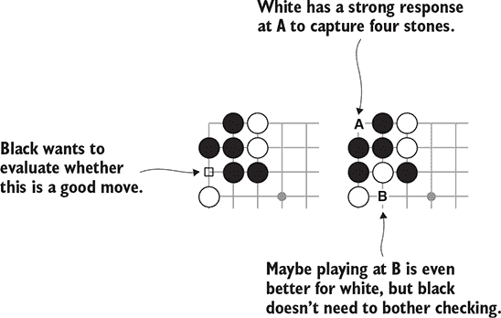

让我们来看一下 alpha-beta 算法如何应用于这个位置。Alpha-beta 剪枝开始就像一个常规的深度剪枝树搜索。图 4.11 展示了第一步。你选择第一个评估的黑子走法；这个走法在图中用 A 标记。然后你完全评估这个走法，直到深度为 3。你可以看到无论白色如何回应，黑色至少可以吃掉两颗棋子。所以你将这个分支评估为黑子 +2 分。

##### 图 4.11\. Alpha-beta 剪枝的第 1 步：你完全评估了第一个可能的黑子走法；这个走法被评估为黑子 +2 分。到目前为止，算法与上一节中介绍的深度剪枝搜索完全相同。

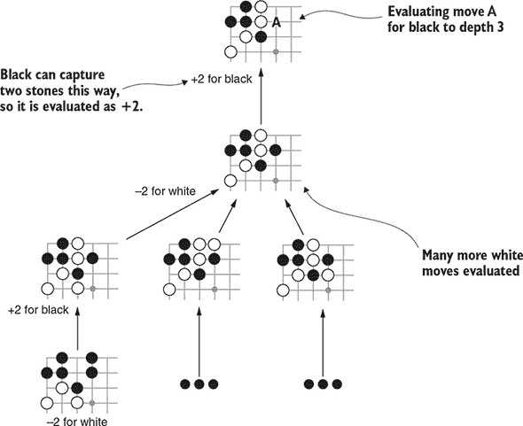

现在考虑黑子的下一个候选走法，标记为 B 在 图 4.12 中。就像在深度剪枝搜索中一样，你查看所有可能的白子回应并逐一评估它们。白色可以在左上角落子以吃掉四颗棋子；这个分支被评估为黑子 –4 分。现在，你已经知道如果黑色在 A 点落子，黑色至少可以保证得到 +2 分。如果黑色在 B 点落子，你刚刚看到了白色如何将黑色限制在 –4 分；白色可能做得更好。但是因为 –4 已经比 +2 差，所以没有必要进一步搜索。你可以跳过评估其他十几个白子回应——而且每个位置后面都有更多组合。你节省的计算量很快就会累积起来，而你仍然会选择与深度搜索到 3 层时完全相同的走法。

##### 图 4.12\. alpha-beta 剪枝的第二步：现在评估第二个可能的黑方走法。在这里，白方有一个回应，可以吃掉四颗棋子。这个分支对黑方的评估结果是 –4。一旦评估了白方的回应，你就可以完全放弃这个黑方的走法，并跳过其他可能的白方回应。可能白方有一个更好的回应你没有评估，但你需要知道的是，在 B 点下棋对黑方来说比在 A 点下棋更糟。

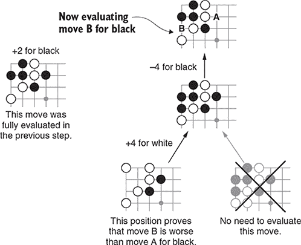

在这个例子中，我们选择了一个特定的顺序来评估走法，以说明剪枝是如何工作的。我们的实际实现是按照棋盘坐标的顺序评估走法的。通过 alpha-beta 剪枝获得的时间节省取决于你多快找到好的分支。如果你碰巧早期就评估了最好的分支，你可以快速消除其他分支。在最坏的情况下，你最后评估最好的分支，那么 alpha-beta 剪枝并不比全深度剪枝搜索更快。

要实现该算法，你必须在搜索过程中跟踪每个玩家的最佳结果。这些值传统上被称为 *alpha* 和 *beta*，这也是算法名称的由来。在我们的实现中，我们称这些值为 `best_black` 和 `best_white`。

##### 列表 4.10\. 检查你是否可以停止评估一个分支

```
def alpha_beta_result(game_state, max_depth,
                      best_black, best_white, eval_fn):
...
        if game_state.next_player == Player.white:
            # Update our benchmark for white.
            if best_so_far > best_white:          *1*
                best_white = best_so_far          *1*
            outcome_for_black = -1 * best_so_far  *2*
            if outcome_for_black < best_black:    *2*
                return best_so_far                *2*
```

+   ***1* 更新白方的基准。**

+   ***2* 你正在为白方选择走法；它只需要足够强大，能够消除黑方的上一个走法。一旦你找到了能够击败黑方最佳选择的东西，你就可以停止搜索。**

你可以将深度剪枝的实现扩展到包括 alpha-beta 剪枝。列表 4.10 显示了关键的新添加。这个块是从白方的角度实现的；你需要一个类似的块来为黑方实现。

首先，检查你是否需要更新 `best_white` 分数。接下来，检查你是否可以停止评估白方的走法。你通过比较当前分数与你在 *任何* 分支中找到的黑方的最佳分数来进行。如果白方可以将黑方的分数限制在一个更低的水平，黑方不会选择这个分支；你不需要找到绝对的最佳分数。

alpha-beta 剪枝的完整实现如下所示。

##### 列表 4.11\. alpha-beta 剪枝的完整实现

```
def alpha_beta_result(game_state, max_depth,
                      best_black, best_white, eval_fn):
    if game_state.is_over():                                   *1*
        if game_state.winner() == game_state.next_player:      *1*
            return MAX_SCORE                                   *1*
        else:                                                  *1*
            return MIN_SCORE                                   *1*

    if max_depth == 0:                                         *2*
        return eval_fn(game_state)                             *2*

    best_so_far = MIN_SCORE
    for candidate_move in game_state.legal_moves():            *3*
        next_state = game_state.apply_move(candidate_move)     *4*
        opponent_best_result = alpha_beta_result(              *5*
            next_state, max_depth - 1,                         *5*
            best_black, best_white,                            *5*
            eval_fn)                                           *5*
        our_result = -1 * opponent_best_result                 *6*

        if our_result > best_so_far:
            best_so_far = our_result                           *7*
        if game_state.next_player == Player.white:             *7*
            if best_so_far > best_white:                       *8*
                best_white = best_so_far                       *8*
            outcome_for_black = -1 * best_so_far               *9*
            if outcome_for_black < best_black:                 *9*
                return best_so_far                             *9*
        elif game_state.next_player == Player.black:
            if best_so_far > best_black:                       *10*
                best_black = best_so_far                       *10*
            outcome_for_white = -1 * best_so_far               *11*
            if outcome_for_white < best_white:                 *11*
                return best_so_far                             *11*

    return best_so_far
```

+   ***1* 检查游戏是否已经结束。**

+   ***2* 你已经达到了最大搜索深度。使用你的启发式方法来决定这个序列有多好。**

+   ***3* 遍历所有有效的走法。**

+   ***4* 看看如果你走这步棋，棋盘会是什么样子。**

+   ***5* 从那个位置找出对手的最佳结果。**

+   ***6* 无论你的对手想要什么，你想要的是相反的。**

+   ***7* 看看这个结果是否比迄今为止看到的最优结果更好。**

+   ***8* 更新白方的基准。**

+   ***9* 你正在为白方选择走法；它只需要足够强大，能够消除黑方的上一个走法。**

+   ***10* 更新黑方的基准。**

+   ***11* 你正在为黑方选择一步棋；它只需要足够强大，以消除白方的上一步棋。**

### 4.5. 使用蒙特卡洛树搜索评估游戏状态

对于 alpha-beta 剪枝，你使用位置评估函数来帮助减少你必须考虑的位置数量。但在围棋中，位置评估非常、非常困难：你基于捕获的简单启发式方法不会欺骗许多围棋玩家。*蒙特卡洛树搜索*（MCTS）提供了一种评估游戏状态的方法，而无需对游戏有任何战略知识。MCTS 算法不是使用特定于游戏的启发式方法，而是通过模拟随机游戏来估计位置的好坏。其中一种随机游戏被称为 *模拟游戏* 或 *模拟走法*。在这本书中，我们使用术语 *模拟游戏*。

蒙特卡洛树搜索是更大类别的 *蒙特卡洛算法* 的一部分，这些算法使用随机性来分析极其复杂的情况。随机性的元素启发了这个名字，是对摩纳哥著名的赌场区的暗喻。

从随机移动中构建出良好策略似乎是不可能的。当然，完全随机移动的游戏 AI 会非常弱。但是当你让两个随机 AI 相互对抗时，对手同样毫无头绪。如果黑方比白方赢得更多，那一定是因为黑方一开始就占据了优势。因此，你可以通过从那里开始随机游戏来找出某个位置是否给一方提供了优势。而且你不需要对为什么这个位置是好的有任何理解就可以做到这一点。

有可能由于偶然而得到不平衡的结果。如果你模拟了 10 个随机游戏，白方赢了 7 个，你有多大的信心认为白方有优势？不太大：白方只比随机预期多赢了 2 个游戏。如果黑方和白方完全平衡，看到 7 比 10 的结果大约有 30% 的可能性。另一方面，如果白方在 100 个随机游戏中赢了 70 个，你可以几乎肯定起始位置确实对白方有利。关键思想是，随着你进行更多的模拟游戏，你的估计会变得更加准确。

MCTS 算法的每一轮包含三个步骤：

1.  将一个新的棋盘位置添加到 MCTS 树中。

1.  从该位置模拟一个随机游戏。

1.  使用随机游戏的结果更新树统计信息。

你尽可能地重复这个过程。然后树顶部的统计数据告诉你选择哪个移动。

让我们逐步分析 MCTS 算法的一轮。图 4.13 图 4.13 展示了一个 MCTS 树。在这个算法的当前点，你已经完成了一系列的模拟游戏并构建了一个部分树。每个节点跟踪从该节点之后任何棋盘位置开始的模拟游戏的胜负计数。每个节点的计数包括其所有子节点的总和。（通常，在这个点上树会有更多的节点；在图中，我们省略了许多节点以节省空间。）

##### 图 4.13\. MCTS 游戏树。树的顶部代表当前的棋盘位置；你正在尝试找到黑方的下一个移动。在这个算法的这一点，你已经从各种可能的位置进行了 70 次随机 rollout。每个节点跟踪从其任何子节点开始的全部 rollout 的统计数据。

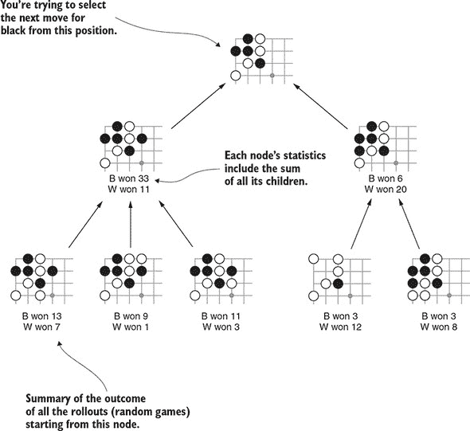

在每一轮中，你将一个新的游戏位置添加到树中。首先，你选择树底部的节点（一个 *叶节点*），你想要在这里添加一个新的子节点。这个树有五个叶节点。为了获得最佳结果，你需要对选择叶节点的方式稍微小心一些；第 4.5.2 节 讨论了这样做的一个好策略。现在，假设你已经沿着最左边的分支走到底。从那个点开始，你随机选择下一个移动，计算新的棋盘位置，并将该节点添加到树中。图 4.14 展示了该过程之后树的样子。

##### 图 4.14\. 向 MCTS 树中添加一个新节点。在这里，你选择最左边的分支作为插入新节点的地方。然后，你从这个位置随机选择下一个移动来在树中创建新节点。

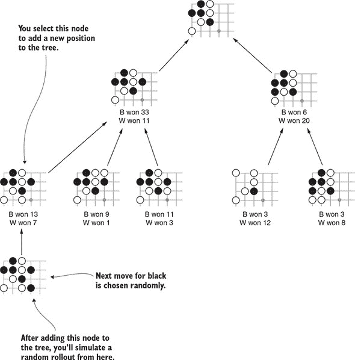

树中的新节点是随机游戏的起点。你模拟剩余的游戏，实际上就是每一步随机选择任何合法的走法，直到游戏结束。然后你计算分数并找出赢家。在这个例子中，假设赢家是白方。你将这个 rollout 的结果记录在新节点中。此外，你向上走到所有节点的祖先节点，并将新的 rollout 添加到它们的计数中。图 4.15 展示了这一步完成后树的样子。

##### 图 4.15\. 在新的 rollout 后更新 MCTS。在这个场景中，rollout 对白方是胜利。你将这个胜利添加到新的树节点及其所有父节点中。

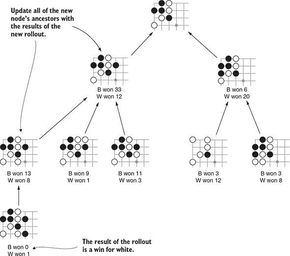

整个过程是 MCTS 的一次单轮搜索。每次重复这个过程，树会变得更大，顶部的估计也会更加准确。通常，你会在固定轮数或固定时间过后停止。到那时，你选择具有最高胜率的移动。

#### 4.5.1\. 在 Python 中实现蒙特卡洛树搜索

现在你已经走过了 MCTS 算法，让我们看看实现细节。首先，你将设计一个数据结构来表示 MCTS 树。接下来，你将编写一个函数来执行 MCTS rollout。

如 代码清单 4.12 所示，你首先定义一个新的类，`MCTSNode`，来表示树中的任何节点。每个 `MCTSNode` 将跟踪以下属性：

+   `game_state`—树中此节点的当前游戏状态（棋盘位置和下一位玩家）。

+   `parent`—导致此节点的父 `MCTSNode`。你可以将 `parent` 设置为 `None` 来表示树的根。

+   `move`—直接导致此节点的最后一个移动。

+   `children`—树中所有子节点的列表。

+   `win_counts` 和 `num_rollouts`—从该节点开始的滚动统计信息。

+   `unvisited_moves`—一个列表，包含从当前位置出发的所有合法移动，这些移动尚未成为树的一部分。每次你向树中添加一个新节点时，你都会从`unvisited_moves`中取出一个移动，为它生成一个新的`MCTSNode`，并将其添加到`children`列表中。

##### 列表 4.12\. 用于表示 MCTS 树的数据结构

```
class MCTSNode(object):
    def __init__(self, game_state, parent=None, move=None):
        self.game_state = game_state
        self.parent = parent
        self.move = move
        self.win_counts = {
            Player.black: 0,
            Player.white: 0,
        }
        self.num_rollouts = 0
        self.children = []
        self.unvisited_moves = game_state.legal_moves()
```

`MCTSNode` 可以通过两种方式修改。你可以向树中添加一个新的子节点，并可以更新其滚动统计信息。以下列表显示了这两个函数。

##### 列表 4.13\. 更新 MCTS 树中节点的方法

```
    def add_random_child(self):
        index = random.randint(0, len(self.unvisited_moves) - 1)
        new_move = self.unvisited_moves.pop(index)
        new_game_state = self.game_state.apply_move(new_move)
        new_node = MCTSNode(new_game_state, self, new_move)
        self.children.append(new_node)
        return new_node

    def record_win(self, winner):
        self.win_counts[winner] += 1
        self.num_rollouts += 1
```

最后，你添加了三个方便的方法来访问树节点的有用属性：

+   `can_add_child` 报告此位置是否有任何尚未添加到树中的合法移动。

+   `is_terminal` 报告在此节点处游戏是否结束；如果是，你从这里就不能再进一步搜索了。

+   `winning_frac` 返回给定玩家赢得的滚动比例。

这些函数在以下列表中实现。

##### 列表 4.14\. 访问有用的 MCTS 树属性的辅助方法

```
    def can_add_child(self):
        return len(self.unvisited_moves) > 0

    def is_terminal(self):
        return self.game_state.is_over()

    def winning_frac(self, player):
        return float(self.win_counts[player]) / float(self.num_rollouts)
```

在定义了树的数据库结构之后，你现在可以实现 MCTS 算法。你首先创建一个新的树。根节点是当前游戏状态。然后你反复生成滚动。在这个实现中，你为每一回合循环固定次数；其他实现可能运行特定长度的而不是固定次数。

每一轮都是从树中向下遍历，直到找到一个可以添加子节点（任何具有合法移动且尚未在树中的棋盘位置）。`select_move` 函数隐藏了选择最佳分支进行探索的工作；我们将在下一节中详细介绍。

找到合适的节点后，你调用`add_random_child`来选择任何后续移动并将其添加到树中。此时，`node`是一个新创建的`MCTSNode`，它没有滚动。

你现在从这个节点开始滚动，通过调用`simulate_random_game`。`simulate_random_game`的实现与第三章中介绍的`bot_v_bot`示例相同。

最后，你更新新创建节点的胜利次数以及所有祖先节点的胜利次数。整个过程在以下列表中实现。

##### 列表 4.15\. MCTS 算法

```
class MCTSAgent(agent.Agent):
    def select_move(self, game_state):
        root = MCTSNode(game_state)

        for i in range(self.num_rounds):
            node = root
            while (not node.can_add_child()) and (not node.is_terminal()):
                node = self.select_child(node)

            if node.can_add_child():                             *1*
                node = node.add_random_child()                   *1*

            winner = self.simulate_random_game(node.game_state)  *2*

            while node is not None:                              *3*
                node.record_win(winner)                          *3*
                node = node.parent                               *3*
```

+   ***1* 在树中添加一个新的子节点**

+   ***2* 从此节点模拟随机游戏**

+   ***3* 将分数传播回树**

在完成分配的回合后，你需要选择一个移动。为此，你只需遍历所有顶级分支，并选择具有最佳胜利百分比的分支。以下列表显示了如何实现这一点。

##### 列表 4.16\. 完成 MCTS 滚动后选择移动

```
class MCTSAgent:
...
    def select_move(self, game_state):
...
        best_move = None
        best_pct = -1.0
        for child in root.children:
            child_pct = child.winning_pct(game_state.next_player)
            if child_pct > best_pct:
                best_pct = child_pct
                best_move = child.move
        return best_move
```

#### 4.5.2\. 如何选择要探索的分支

你的游戏 AI 在每一回合上有一定的时间限制，这意味着你只能执行固定数量的模拟。每次模拟都会提高你对单个可能移动的评估。将你的模拟视为一种有限的资源：如果你在移动 A 上多花费一次模拟，你就要在移动 B 上少花费一次模拟。你需要一种策略来决定如何分配你的有限预算。标准的策略被称为*树的上置信界*，或*UCT 公式*。UCT 公式在两个冲突的目标之间取得平衡。

第一个目标是把时间花在查看最佳移动上。这个目标被称为*利用*（你想要利用你迄今为止发现的任何优势）。你会在估计获胜率最高的移动上花费更多的模拟。现在，其中一些移动的获胜率很高只是偶然。但随着你通过这些分支完成更多的模拟，你的估计会变得更加准确。错误阳性将会在列表的下方降低。

另一方面，如果你只访问了一个节点几次，你的估计可能会大错特错。纯粹出于偶然，你可能对实际上很好的移动给出了一个较低的估计。在那些节点上多进行几次模拟可能会揭示其真正的质量。因此，你的第二个目标是为你访问最少的分支获得更准确的评估。这个目标被称为*探索*。

图 4.16 比较了偏向于利用的搜索树与偏向于探索的树。利用-探索权衡是试错算法的常见特征。当我们稍后在本章中查看强化学习时，它还会再次出现。

##### 图 4.16。利用-探索权衡。在两个游戏树中，你都访问了七个棋盘位置。在上部，搜索更偏向于利用：最有希望的移动的树更深。在下部，搜索更偏向于探索：它尝试了更多的移动，但深度较小。

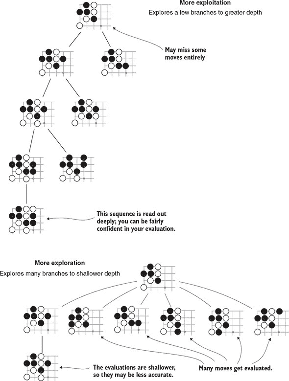

对于你正在考虑的每个节点，你计算获胜率 *w* 来表示利用目标。为了表示探索，你计算，其中 *N* 是模拟的总次数，*n* 是以考虑中的节点开始的模拟次数。这个特定的公式有一个理论基础；就我们的目的而言，只需注意其值将对于你访问最少的节点最大。

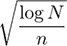

你将这两个组件结合起来得到 UCT 公式：

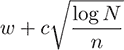

在这里，*c* 是一个参数，它代表你希望在利用和探索之间偏好的平衡。UCT 公式为每个节点给出一个分数，具有最高 UCT 分数的节点是下一次模拟的起点。

当*c*的值较大时，你将花费更多时间访问最少探索的节点。当*c*的值较小时，你将花费更多时间收集对最有希望节点的更好评估。使游戏玩家最有效的*c*的选择通常是通过试错来找到的。我们建议从大约 1.5 开始，并从那里进行实验。参数*c*有时被称为*温度*。当温度“更高”时，你的搜索将更加波动，而当温度“更低”时，你的搜索将更加专注。

列表 4.17 展示了如何实现此策略。在你确定了想要使用的度量标准之后，选择一个子节点就是一个简单的问题，即计算每个节点的公式并选择具有最大值的节点。就像在 minimax 搜索中一样，你需要在每个回合切换你的视角。你从选择下一个移动的玩家的角度计算胜率，因此随着你沿着树向下走，这个视角在黑和白之间交替。

##### 列表 4.17\. 使用 UCT 公式选择要探索的分支

```
def uct_score(parent_rollouts, child_rollouts, win_pct, temperature):
    exploration = math.sqrt(math.log(parent_rollouts) / child_rollouts)
    return win_pct + temperature * exploration

class MCTSAgent:
...
    def select_child(self, node):
        total_rollouts = sum(child.num_rollouts for child in node.children)

        best_score = -1
        best_child = None
        for child in node.children:
            score = uct_score(
                total_rollouts,
                child.num_rollouts,
                child.winning_pct(node.game_state.next_player),
                self.temperature)
            if score > best_score:
                best_score = uct_score
                best_child = child
        return best_child
```

#### 4.5.3\. 将蒙特卡洛树搜索应用于围棋

在上一节中，你实现了 MCTS 算法的通用形式。简单的 MCTS 实现可以达到围棋业余 1 段的水平，即一个强大的业余玩家的水平。将 MCTS 与其他技术相结合可以产生一个比那强得多的机器人；今天许多顶尖的围棋 AI 都使用了 MCTS 和深度学习。如果你对你的 MCTS 机器人达到竞争水平感兴趣，本节涵盖了需要考虑的一些实际细节。

##### 快速的代码使机器人强大

MCTS 开始成为全尺寸（19 × 19）围棋的可行策略，大约在每回合 10,000 次 rollout 时。本章中的实现还不够快，你将等待几分钟才能选择每个移动。你需要对你的实现进行一些优化，以便在合理的时间内完成那么多的 rollout。另一方面，在小棋盘上，即使是你的参考实现也是一个有趣的对手。

在所有其他条件相同的情况下，更多的 rollout 意味着更好的决策。你总是可以通过加快代码的速度来使你的机器人更强，这样你就可以在相同的时间内挤入更多的 rollout。这不仅与 MCTS 特定的代码相关。例如，计算捕获的代码在每个 rollout 中被调用数百次。所有基本游戏逻辑都是优化对象。

##### 更好的 rollout 策略产生更好的评估

在随机走法中选择走法的算法称为*走法策略*。你的走法策略越现实，你的评估就越准确。在第三章中，你实现了一个`RandomAgent`来玩围棋；在这一章中，你使用了你的`RandomAgent`作为走法策略。但`RandomAgent`并不是完全随机选择走法，没有任何围棋知识。首先，你编程让它不会在棋盘填满之前放弃或认输。其次，你编程让它不会填自己的眼，这样它就不会在游戏结束时杀死自己的棋子。没有这个逻辑，走法就会不准确。

一些 MCTS 实现进一步扩展，并在他们的走法策略中实现更多围棋特定的逻辑。带有游戏特定逻辑的走法有时被称为*重型*走法；相比之下，接近纯随机的走法有时被称为*轻型*走法。

实现大量走法的一种方法是在围棋中常见的、带有已知反应的基本战术形状列表。无论你在棋盘上找到哪个已知的形状，你都应该查找已知的反应并提高其被选中的概率。你不希望总是将已知的反应作为一条硬性规则来选择；这将从算法中去除必要的随机元素。

一个例子可以在图 4.17 中找到。这是一个 3×3 的局部模式，其中黑子在下一次白棋的回合有被吃掉的危险。黑子可以通过延伸来至少暂时地救它。这并不总是最好的走法；甚至都不一定是好走法。但它比棋盘上任何随机点更有可能是一个好走法。

##### 图 4.17\. 这是一个局部战术模式的例子。当你看到左边的形状时，你应该考虑右边的反应。遵循这种战术模式的策略不会特别强大，但会比完全随机选择走法强得多。

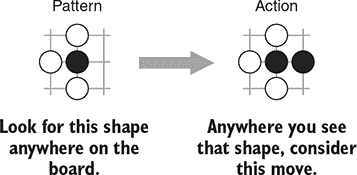

建立一个良好的这些模式列表需要一些围棋战术知识。如果你对在大量走法中使用的其他战术模式感兴趣，我们建议查看 Fuego([`fuego.sourceforge.net/`](http://fuego.sourceforge.net/))或 Pachi([`github.com/pasky/pachi`](https://github.com/pasky/pachi))的源代码，这两个是开源的 MCTS 围棋引擎。

实施大量走法时要小心。如果你的走法策略中的逻辑计算速度慢，你将无法执行那么多走法。你可能会失去更复杂策略的收益。

##### 一个有礼貌的机器人知道何时认输

制作游戏人工智能不仅仅是开发最佳算法的练习。它还涉及到为人类对手创造一个有趣的体验。其中一部分乐趣来自于给予人类玩家获胜的满足感。本书中你首先实现的围棋机器人`RandomAgent`与人类玩家对战时非常令人沮丧。在人类玩家不可避免地领先之后，随机机器人坚持继续游戏直到整个棋盘填满。没有任何东西阻止人类玩家离开并心理上判定游戏为胜利。但这种方式似乎有些不公平。如果您的机器人能够优雅地认输，那么体验会更好。

你可以轻松地在基本的 MCTS 实现上添加人类友好的认输逻辑。MCTS 算法在选择走法的过程中计算估计的获胜百分比。在单次回合中，你比较这些数字来决定选择哪个走法。但你也可以比较同一游戏中不同点的估计获胜百分比。如果这些数字在下降，游戏正在向人类玩家倾斜。当最佳选项的获胜百分比足够低时，比如 10%，你可以让你的机器人认输。

### 4.6\. 概述

+   树搜索算法评估许多可能的决策序列以找到最佳方案。树搜索不仅出现在游戏中，也出现在一般的优化问题中。

+   适用于游戏的树搜索变体是*最小-最大树搜索*。在最小-最大搜索中，你交替两个具有对立目标的玩家。

+   在极其简单的游戏中（例如井字棋），全最小-最大树搜索是实用的。要将它应用于复杂的游戏（如国际象棋或围棋），你需要减小搜索树的大小。

+   *位置评估函数*估计从给定棋盘位置哪个玩家更有可能获胜。有了良好的位置评估函数，你不必搜索到游戏结束才能做出决定。这种策略被称为*深度剪枝*。

+   Alpha-beta 剪枝减少了每个回合需要考虑的走法数量，使其适用于像国际象棋这样复杂的游戏。Alpha-beta 剪枝的想法是直观的：在评估一个可能的走法时，如果你发现对手有一个强有力的反击，你可以立即将该走法从考虑中排除。

+   当你没有良好的位置评估启发式方法时，有时可以使用*蒙特卡洛树搜索*。此算法从特定位置模拟随机游戏，并跟踪哪个玩家获胜的频率更高。

## 第五章\. 开始使用神经网络

*本章涵盖*

+   介绍人工神经网络的基本原理

+   教会网络识别手写数字

+   通过组合层创建神经网络

+   理解神经网络如何从数据中学习

+   从零开始实现简单的神经网络

本章介绍了人工神经网络（ANNs）的核心概念，这是现代深度学习中的一个核心算法类别。人工神经网络的历史非常悠久，可以追溯到 20 世纪 40 年代初。它花了数十年时间，其应用才在许多领域取得了巨大成功，但基本思想仍然有效。

ANNs 的核心思想是借鉴神经科学，并构建一类算法，其工作方式与我们假设大脑部分功能的方式相似。特别是，我们使用*神经元*作为我们人工网络的原子块。神经元形成称为*层*的组，这些层以特定方式相互*连接*，形成一个*网络*。给定输入数据，神经元可以通过连接逐层传递信息，如果信号足够强，我们说它们*激活*。通过这种方式，数据在网络中传播，直到我们到达最后一步，即输出层，从那里我们得到我们的*预测*。然后，我们可以将这些预测与*预期输出*进行比较，以计算预测的*误差*，网络使用这个误差来学习和改进未来的预测。

虽然大脑启发的架构类比有时很有用，但我们不想在这里过分强调它。我们确实对大脑的视觉皮层了解很多，但类比有时可能会误导甚至有害。我们认为，将 ANNs 视为试图揭示*生物体学习指导原则*的方法会更好，就像飞机利用空气动力学，但并不试图模仿鸟。

为了使本章的内容更加具体，我们提供了一个神经网络的基本实现，供大家参考——从头开始。你将应用这个网络来解决一个来自*光学字符识别*（OCR）的问题；即如何让计算机预测手写数字图像上显示的哪个数字。

我们 OCR 数据集中的每一张图像都是由网格上排列的像素组成的，你必须分析像素之间的空间关系，以确定它代表的数字。围棋，像许多其他棋类游戏一样，是在网格上进行的，你必须考虑棋盘上的空间关系，以便选择一个好的走法。你可能希望 OCR 的机器学习技术也能应用于围棋等游戏。事实上，它们确实可以。第六章到第八章展示了如何将这些方法应用于游戏。

在本章中，我们将保持数学内容相对简单。如果你不熟悉线性代数、微积分和概率论的基础，或者需要简要的实用提醒，我们建议你首先阅读附录 A。此外，神经网络学习过程中的难点部分可以在附录 B 中找到。如果你了解神经网络但从未实现过，我们建议你直接跳转到第 5.5 节。如果你熟悉实现网络，可以直接跳转到第六章，在该章中，你将应用神经网络来预测第四章中生成的游戏动作。

### 5.1\. 一个简单的用例：手写数字分类

在详细介绍神经网络之前，让我们从一个具体的用例开始。在本章中，你将构建一个应用程序，它可以合理地预测手写图像数据中的数字，准确率约为 95%。值得注意的是，你将通过仅向神经网络暴露图像的像素值来完成所有这些工作；算法将学会自行提取有关数字结构的相关信息。

你将使用修改后的国家标准与技术研究院（MNIST）手写数字数据集来完成这项工作，这是机器学习从业者中一个研究广泛的数据集，也是深度学习的“果蝇”。

在本章中，你将使用 NumPy 库来处理底层数学运算。NumPy 是 Python 中机器学习和数学计算的行业标准库，你将在本书的其余部分使用它。在尝试本章中的任何代码示例之前，你应该使用你喜欢的包管理器安装 NumPy。如果你使用 pip，请在 shell 中运行`pip install numpy`来安装它。如果你使用 Conda，请运行`conda install numpy`。

#### 5.1.1\. 手写数字的 MNIST 数据集

MNIST 数据集包含 60,000 张图像，每张图像为 28 × 28 像素。该数据集的一些示例显示在图 5.1 中。对于人类来说，识别这些示例中的大多数是一个简单任务，你可以轻松地读取第一行的示例为 7，5，3，9，3，0 等等。但在某些情况下，即使是人类也很难理解图片代表什么。例如，图 5.1 中第五行的第四张图片很容易被识别为 4 或 9。

##### 图 5.1\. 来自 MNIST 手写数字数据集的一些样本，这是光学字符识别领域的一个研究广泛的实体

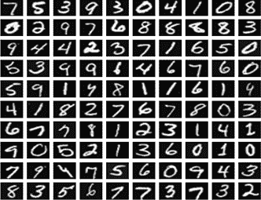

MNIST 中的每张图像都标注了一个*标签*，一个从 0 到 9 的数字，代表图像上所表示的真实值。

在你能够查看数据之前，你需要首先加载它。在我们的 GitHub 仓库中，你可以找到一个名为 mnist.pkl.gz 的文件，位于[`mng.bz/P8mn`](http://mng.bz/P8mn)文件夹中。

在这个文件夹中，你还可以找到本章中将要编写的所有代码。和之前一样，我们建议你遵循本章的流程，并在编写代码的同时构建代码库，但你也可以运行 GitHub 仓库中找到的代码。

#### 5.1.2\. MNIST 数据预处理

因为这个数据集中的标签是 0 到 9 的整数，所以你会使用一种称为 *独热编码* 的技术，将数字 1 转换为一个长度为 10 的向量，除了在位置 1 放置一个 1 之外，其余都是 0。这种表示在机器学习环境中非常有用且广泛使用。在向量中为标签 1 保留第一个槽位，使得像神经网络这样的算法更容易区分标签。使用独热编码，例如，数字 2 的表示如下：`[0, 0, 1, 0, 0, 0, 0, 0, 0, 0]`。

##### 列表 5.1\. MNIST 标签的独热编码

```
import six.moves.cPickle as pickle
import gzip
import numpy as np

def encode_label(j):         *1*
    e = np.zeros((10, 1))
    e[j] = 1.0
    return e
```

+   ***1* 将索引进行独热编码为长度为 10 的向量。**

独热编码的好处是每个数字都有自己的“槽位”，你可以使用神经网络为输入图像输出 *概率*，这将在以后变得很有用。

检查文件 mnist.pkl.gz 的内容，你可以访问三个数据集：训练数据、验证数据和测试数据。回想一下第一章，你使用训练数据来训练或拟合机器学习算法，并使用测试数据来评估算法学习的好坏。验证数据可以用来调整和验证算法的配置，但在这章中可以安全地忽略。

MNIST 数据集中的图像是二维的，高度和宽度都是 28 像素。你将图像数据加载到大小为 784 的 *特征向量* 中，即 28 × 28；你完全丢弃了图像结构，只看表示为向量的像素。这个向量中的每个值代表一个介于 0 和 1 之间的灰度值，其中 0 表示白色，1 表示黑色。

##### 列表 5.2\. 调整 MNIST 数据形状并加载训练和测试数据

```
def shape_data(data):
    features = [np.reshape(x, (784, 1)) for x in data[0]]        *1*

    labels = [encode_label(y) for y in data[1]]                  *2*

    return zip(features, labels)                                 *3*

def load_data():
    with gzip.open('mnist.pkl.gz', 'rb') as f:
        train_data, validation_data, test_data = pickle.load(f)  *4*

    return shape_data(train_data), shape_data(test_data)         *5*
```

+   ***1* 将输入图像展平为长度为 784 的特征向量。**

+   ***2* 所有标签都进行独热编码。**

+   ***3* 创建特征和标签的配对。**

+   ***4* 解压并加载 MNIST 数据得到三个数据集。**

+   ***5* 在这里丢弃验证数据，并调整其他两个数据集的形状。**

现在，你有了 MNIST 数据集的简单表示；特征和标签都编码为向量。你的任务是设计一个机制，使其能够准确地将特征映射到标签。具体来说，你想要设计一个算法，该算法接受训练特征和标签进行学习，以便它可以预测测试特征的标签。

神经网络可以很好地完成这项工作，正如你将在下一节中看到的，但让我们首先讨论一种天真方法，这将向你展示你必须解决这个应用的一般问题。对于人类来说，识别数字是一个相对简单的工作，但很难确切地解释如何做以及我们如何知道我们所知道的东西。这种知道得比能解释得多的现象被称为**波利尼悖论**。这使得向机器**明确地**描述如何解决这个问题尤其困难。

一个起着关键作用方面是**模式识别**——每个手写数字都有某些来自其典型、数字版本的特性。例如，0 大约是一个椭圆形，在许多国家，1 只是一个垂直线。根据这个启发式方法，你可以天真地通过比较它们来对手写数字进行分类：给定一个 8 的图像，这个图像应该比任何其他数字更接近 8 的平均图像。下面的 `average_digit` 函数为你做这件事。

##### 列表 5.3\. 计算表示相同数字的图像的平均值

```
import numpy as np
from dlgo.nn.load_mnist import load_data
from dlgo.nn.layers import sigmoid_double

def average_digit(data, digit):                                      *1*
    filtered_data = [x[0] for x in data if np.argmax(x[1]) == digit]
    filtered_array = np.asarray(filtered_data)
    return np.average(filtered_array, axis=0)

train, test = load_data()
avg_eight = average_digit(train, 8)                                  *2*
```

+   ***1* 计算表示给定数字的所有样本的平均值。**

+   ***2* 使用平均 8 作为简单模型检测 8 的参数。**

你的训练集中的平均 8 看起来是什么样子？图 5.2 给出了答案。

##### 图 5.2\. 这就是 MNIST 训练集中平均手写 8 的样子。平均数百张图像通常会导致一个无法识别的块状物，但这个平均 8 仍然非常像 8。

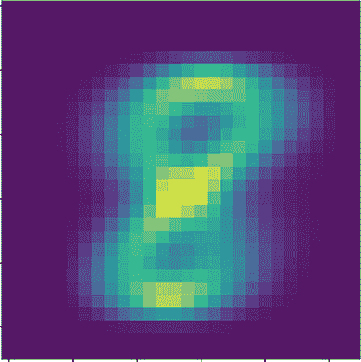

由于手写体可能因人而异，正如预期的那样，平均 8 略微模糊，但它仍然明显地呈现出 8 的形状。也许你可以使用这种表示来识别数据集中的其他 8？你使用以下代码来计算并显示 图 5.2。

##### 列表 5.4\. 计算并显示训练集中的平均 8

```
from matplotlib import pyplot as plt

img = (np.reshape(avg_eight, (28, 28)))
plt.imshow(img)
plt.show()
```

在 MNIST 训练集中，这个 8 的平均表示 `avg_eight` 应该包含大量关于图像上有一个 8 的含义的信息。你将使用 `avg_eight` 作为简单模型的**参数**来决定给定的输入向量 `x`（表示一个数字）是否是 8。在神经网络中，当我们提到参数时，我们经常说**权重**，而 `avg_eight` 将作为你的权重。

为了方便，你将使用转置并定义 `W = np.transpose(avg_eight)`。然后你可以计算 `W` 和 `x` 的**点积**，这相当于对 `W` 和 `x` 的值进行逐点乘法并求和所有 784 个结果值。如果你的启发式方法是正确的，如果 `x` 是一个 8，那么单个像素应该在大约与 `W` 相同的位置上具有较深的色调，反之亦然。相反，如果 `x` 不是一个 8，那么重叠应该更少。让我们在几个例子中测试这个假设。

##### 列表 5.5\. 使用点积计算数字与你的权重接近程度

```
x_3 = train[2][0]            *1*
x_18 = train[17][0]          *2*

W = np.transpose(avg_eight)
np.dot(W, x_3)               *3*
np.dot(W, x_18)              *4*
```

+   ***1* 索引为 2 的训练样本是一个 4**

+   ***2* 索引为 17 的训练样本是一个 8**

+   ***3* 这个结果大约是 20.1。**

+   ***4* 这个值要大得多，大约是 54.2。**

你计算了权重`W`与两个 MNIST 样本的点积，一个代表 4，另一个代表 8。你可以看到，对于 8 的后者结果 54.2 远高于 4 的 20.1 结果。所以，你似乎找到了一些东西。现在，你如何决定一个结果值是否足够高，可以预测它为 8？原则上，两个向量的点积可以输出任何实数。你如何处理这个问题是将点积的输出*转换*到[0, 1]的范围。这样做后，例如，你可以尝试定义一个截止值在 0.5，并宣布所有高于这个值的都是 8。

实现这一点的其中一种方法是使用*sigmoid*函数。sigmoid 函数通常用希腊字母*sigma*表示，记作 s。对于实数*x*，sigmoid 函数定义为：

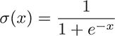

图 5.3 展示了如何获得一些直观感受。

##### 图 5.3\. sigmoid 函数的图像。sigmoid 将实数值映射到[0, 1]的范围。在 0 附近，斜率相当陡峭，曲线在小的和大的值上都变平。

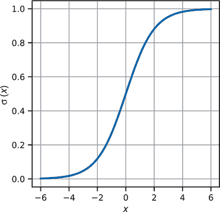

接下来，在你将 sigmoid 函数应用于点积的输出之前，让我们用 Python 编写 sigmoid 函数。

##### 列表 5.6\. 双值和向量的 sigmoid 函数的简单实现

```
def sigmoid_double(x):
    return 1.0 / (1.0 + np.exp(-x))

def sigmoid(z):
    return np.vectorize(sigmoid_double)(z)
```

注意，你提供了`sigmoid_double`，它操作双值，以及一个用于计算向量的 sigmoid 版本，你将在本章中广泛使用。在你将 sigmoid 应用于之前的计算之前，请注意，2 的 sigmoid 值已经接近 1，所以对于你之前计算的两个样本，sigmoid(54.2)和 sigmoid(20.1)实际上是无法区分的。你可以通过*平移*点积的输出向 0 来解决这个问题。这样做被称为应用一个*偏差项*，我们通常称之为*b*。从样本中，你可以计算出偏差项的一个好的猜测可能是*b* = –45。使用权重和偏差项，你现在可以按照以下方式计算模型的*预测*。

##### 列表 5.7\. 使用点积和 sigmoid 计算权重和偏差的预测

```
def predict(x, W, b):                           *1*
    return sigmoid_double(np.dot(W, x) + b)

b = -45                                         *2*

print(predict(x_3, W, b))                       *3*
print(predict(x_18, W, b))                      *4*
```

+   ***1* 简单预测是通过将 np.doc(W, x) + b 的输出应用 sigmoid 函数来定义的。**

+   ***2* 根据到目前为止计算的示例，你将偏差项设置为–45。**

+   ***3* 对于 4 的预测接近于 0。**

+   ***4* 这里对 8 的预测是 0.96。你的启发式方法似乎很有道理。**

在两个例子 `x_3` 和 `x_18` 上，你得到了令人满意的结果。对于后者，预测值接近 1，而对于前者则几乎为 0。这种将输入向量 *x* 映射到 s(*Wx* + b) 的过程，其中 *W* 是一个与 *x* 大小相同的向量，被称为 *逻辑回归*。图 5.4 以 4 维向量为例，示意了该算法。

##### 图 5.4\. 逻辑回归的一个例子，将长度为 4 的输入向量 *x* 映射到 0 到 1 之间的输出值 *y*。示意图表明输出 *y* 如何依赖于输入向量 *x* 中的所有四个值。

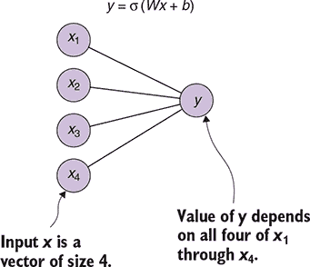

为了更好地了解这个过程的性能，让我们计算所有训练和测试样本的预测。如前所述，你定义一个截止点或决策 *阈值* 来决定一个预测是否被计为 8。在这里，你选择 *准确率* 作为评估指标；你计算所有预测中正确预测的比例。

##### 列表 5.8\. 使用决策阈值评估模型的预测

```
def evaluate(data, digit, threshold, W, b):                               *1*
    total_samples = 1.0 * len(data)
    correct_predictions = 0
    for x in data:
        if predict(x[0], W, b) > threshold and np.argmax(x[1]) == digit:  *2*
            correct_predictions += 1
        if predict(x[0], W, b) <= threshold and np.argmax(x[1]) != digit: *3*
            correct_predictions += 1
    return correct_predictions / total_samples
```

+   ***1* 对于评估指标，你选择了准确率，即所有正确预测的比例。**

+   ***2* 将一个 8 的实例预测为 8 是一个正确的预测。**

+   ***3* 如果预测低于你的阈值且样本不是 8，你也做出了正确的预测。**

让我们使用这个评估函数来评估三个数据集（训练集、测试集和测试集中所有 8 的集合）的预测质量。你使用 0.5 的阈值以及之前的权重 `W` 和偏置项 `b` 来做这件事。

##### 列表 5.9\. 计算三个数据集的预测准确率

```
evaluate(data=train, digit=8, threshold=0.5, W=W, b=b)        *1*

evaluate(data=test, digit=8, threshold=0.5, W=W, b=b)         *2*

eight_test = [x for x in test if np.argmax(x[1]) == 8]
evaluate(data=eight_test, digit=8, threshold=0.5, W=W, b=b)   *3*
```

+   ***1* 你的简单模型在训练数据上的准确率为 78%（0.7814）。**

+   ***2* 测试数据上的准确率略低，为 77%（0.7749）。**

+   ***3* 仅在测试集中的 8 的集合上评估结果只有 67% 的准确率（0.6663）。**

你可以看到，在训练集上的准确率最高，大约为 78%。这并不令人惊讶，因为你已经在训练集上 *校准* 了你的模型。特别是，在训练集上进行评估没有意义，因为它不能告诉你你的算法 *泛化能力*（在之前未见过的数据上的表现）如何。测试数据的表现接近训练数据，大约为 77%，但值得注意的是最后一个准确率项。在测试集中所有 8 的集合上，你只达到了 66%，所以使用你的简单模型，在三个未见过的 8 的案例中只有两个是正确的。这个结果可能作为第一个基线是可以接受的，但离你能做到的最好水平还远。出了什么问题，你还能做什么改进？

+   你的模型只能区分特定的数字（在这里是一个 8）和所有其他数字。因为在训练集和测试集中每个数字的图像数量都是*平衡的*，所以只有大约 10%是 8。因此，一个总是预测 0 的模型将产生大约 90%的准确率。记住在分析此类分类问题时存在的*类别不平衡*。鉴于这一点，你在测试数据上的 77%准确率看起来不再那么强劲。*你需要定义一个可以准确预测所有 10 个数字的模型*。

+   你的模型参数相当小。对于一个包含成千上万种不同手写图像的集合，你只有一组与其中一张图像大小相当的权重。相信你可以用如此小的模型捕捉到这些图像上发现的书写变化是不现实的。*你必须找到一类算法，它使用更多的参数有效地捕捉数据中的变化*。

+   对于给定的预测，你只需选择一个截止值来宣布一个数字是 8 还是不是。你没有使用实际的预测值来评估你模型的质量。例如，在 0.95 的准确率下做出正确的预测肯定比在 0.51 的准确率下做出正确的预测结果要强。*你必须形式化预测与实际结果接近的概念*。

+   你通过直觉手工调整了模型的参数。尽管这可能是一个好的起点，但机器学习的承诺是，你不必将自己的观点强加于数据，而是让算法从数据中学习。每当你的模型做出正确的预测时，你需要强化这种行为，每当输出错误时，你需要相应地调整你的模型。换句话说，*你需要设计一种机制，根据你在训练数据上的预测效果来更新模型参数*。

尽管对这个小用例和构建的朴素模型进行讨论可能看起来不多，但你已经看到了构成神经网络的多部分。在下一节中，你将利用围绕这个用例构建的直觉，通过解决这四个点中的每一个来迈出与神经网络的第一步。

### 5.2. 神经网络的基本原理

你如何改进你的 OCR 模型？正如我们在引言中暗示的那样，神经网络可以在这个任务上做得很好——比我们手工制作的模型要好得多。但手工制作的模型确实说明了你构建神经网络时将使用的关键概念。本节将使用神经网络的语言描述上一节中的模型。

#### 5.2.1. 逻辑回归作为简单的人工神经网络

在 5.1 节 中，你看到了逻辑回归用于 *二元分类*。为了回顾，你取了一个特征向量 *x*，代表一个数据样本，通过首先将其乘以权重矩阵 *W*，然后加上偏差项 *b*，将其输入算法。为了得到一个介于 0 和 1 之间的预测 *y*，你对其应用了 sigmoid 函数：*y =* s*(Wx + b)*

你应该注意这里的一些事情。首先，特征向量 *x* 可以被解释为一组神经元，有时被称为 *单元*，通过 *W* 和 *b* 与 *y* 连接，你已经在 图 5.4 中看到了。接下来，请注意，sigmoid 可以被视为一个激活函数，因为它将 *Wx* + *b* 的结果映射到[0,1]的范围内。如果你将接近 1 的值解释为神经元 *y* 激活，反之，如果它接近 0 则不激活，这个设置可以被视为一个人工神经网络的小型示例。

#### 5.2.2\. 具有多个输出维度的网络

在 5.1 节 的用例中，你将识别手写数字的问题简化为二元分类问题；即区分 8 和其他所有数字。但你感兴趣的是预测 10 个类别，每个数字一个。至少在形式上，你可以通过改变你表示的 *y*、*W* 和 *b* 来轻松实现这一点；你改变了模型的输出、权重和偏差。

首先，你将 *y* 设为一个长度为 10 的向量；*y* 将包含一个值，表示每个 10 个数字中每个数字的可能性：

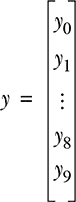

接下来，相应地调整权重和偏差。回想一下，到目前为止 *W* 是一个长度为 784 的向量。相反，你将 *W* 转换为一个维度为（10，784）的矩阵。这样，你可以对 *W* 和输入向量 *x* 进行矩阵乘法，即 *Wx*，其结果将是一个长度为 10 的向量。继续，如果你将偏差项设为一个长度为 10 的向量，你可以将其加到 *Wx* 上。最后，请注意，你可以通过将其应用于其每个分量来计算向量 *z* 的 sigmoid 值：

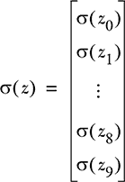

图 5.5 描述了这种稍微修改过的四个输入和两个输出神经元的设置。

##### 图 5.5\. 在这个简单的网络中，四个输入神经元通过先乘以一个 2x4 的矩阵，加上一个二维偏差项，然后逐分量应用 sigmoid 函数，与两个输出神经元相连。

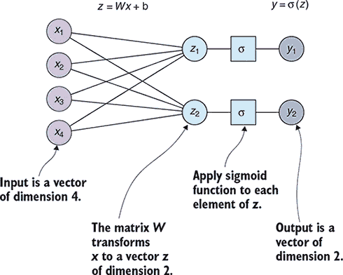

现在，你得到了什么？你现在可以将输入向量 *x* 映射到输出向量 *y*，而之前，*y* 只是一个单一值。这个好处是，没有任何东西阻止你多次进行这种向量到向量的转换，从而构建我们所说的 *前馈网络*。

### 5.3\. 前馈网络

快速回顾一下上一节你做了什么。从高层次来看，你执行了以下步骤：

1.  你从一个输入神经元向量*x*开始，并对其应用了一个简单的转换，即*z* = *Wx* + *b*。在线性代数的语言中，这些转换被称为*仿射线性*。在这里，你使用*z*作为中间变量，以简化后续的表示。

1.  你应用了一个激活函数，sigmoid *y* = s(*z*), 以获得输出神经元*y*。应用 s 的结果告诉你*y*激活的程度。

在前馈网络的核心是这样一个想法：你可以迭代地应用这个过程，因此可以多次应用这两个步骤指定的简单构建块。这些构建块形成了我们所说的*层*。用这种表示法，你可以说你*堆叠了许多层*来形成一个*多层神经网络*。让我们通过引入一个额外的层来修改我们的最后一个例子。你现在必须运行以下步骤：

1.  从输入*x*开始，计算*z*¹ = *W*¹*x* + *b*¹。

1.  从中间结果*z*¹，通过计算*y* = *W*²*z*¹ + *b*²得到输出*y*。

注意，你在这里使用上标来表示你所在的层，下标来表示向量或矩阵中的位置。使用两个层而不是一个层的操作规定在图 5.6 中得到了可视化。

##### 图 5.6\. 具有两个层的神经网络。输入神经元*x*连接到中间单元集合*z*，而*z*本身又连接到输出神经元*y*。

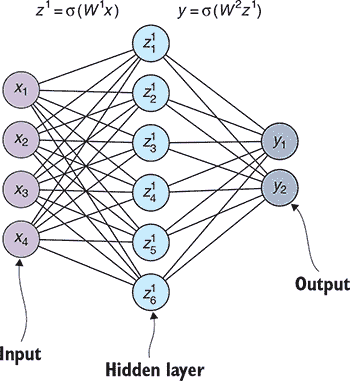

到目前为止，应该已经很清楚，你不需要堆叠特定数量的层。你可以使用更多。此外，你不必始终使用逻辑 sigmoid 作为激活函数。你有大量的激活函数可供选择，我们将在下一章介绍其中的一些。将网络中所有层的这些函数按顺序应用于一个或多个数据点通常被称为*前向传播*。它被称为*前向*，因为数据总是只向前流动，从输入到输出（在图中，从左到右），永远不会向后流动。

使用这种表示法，用三个层描述的常规前馈网络看起来像图 5.7。

##### 图 5.7\. 具有三个层的神经网络。在定义神经网络时，你既不受层数的限制，也不受每层神经元数量的限制。


为了回顾你到目前为止学到的内容，让我们将我们提到的所有概念汇总成一个简洁的列表：

+   *顺序神经网络*是将特征或输入神经元*x*映射到预测或输出神经元*y*的机制。你通过按顺序逐个堆叠简单函数的层来实现这一点。

+   *层*是将给定输入映射到输出的规定。对一批数据的层输出计算称为*前向传播*。同样，计算顺序网络的向前传播就是按顺序计算每一层的向前传播，从输入开始。

+   Sigmoid 函数是一种激活函数，它将实值神经元的向量 *激活*，使它们映射到范围 [0,1]。你将接近 1 的值解释为激活。

+   给定权重矩阵 *W* 和偏置项 *b*，应用仿射线性变换 *Wx* + *b* 形成一个层。这种类型的层通常称为 *密集层* 或 *全连接层*。向前推进，我们将坚持使用 *密集层* 这个名称。

+   根据实现方式，密集层可能内置了激活，你可能看到 s(*Wx* + *b*) 作为层，而不仅仅是仿射线性变换。另一方面，通常只考虑激活函数为一个层，你也会在实现中这样做。最终，是否将激活添加到你的密集层中，只是对如何将函数的部分拆分和分组为逻辑单元的略微不同的看法。

+   前馈神经网络是由具有激活的密集层组成的顺序网络。由于历史原因，我们没有空间深入探讨，这种架构也常被称为 *多层感知器*，或简称为 *MLP*。

+   所有既不是输入也不是输出神经元的神经元都称为 *隐藏单元*。相比之下，输入和输出神经元有时被称为 *可见单元*。背后的直觉是隐藏单元是 *网络内部的*，而可见单元是直接可观察的。这有点牵强，因为你通常可以访问系统的任何部分，但了解这个术语还是有用的。因此，输入和输出之间的层被称为 *隐藏层*：每个至少有两个层的顺序网络至少有一个隐藏层。

+   如果没有特别说明，*x* 将代表网络的输入，*y* 代表输出；有时会使用下标来表示你正在考虑的哪个样本。将多层堆叠以构建具有许多隐藏层的大型网络称为 *深度神经网络*，因此得名 *深度学习*。


**非顺序神经网络**

在本书的这一部分，你只关心 *顺序型* 神经网络，其中层形成序列。在顺序网络中，你从输入开始，每个后续（隐藏）层恰好有一个前驱和一个后继，最终到达输出层。这足以涵盖你应用深度学习到围棋游戏所需的一切。

通常，神经网络理论允许任意非顺序架构。例如，在某些应用中，将两个层的输出连接或相加是有意义的（你合并两个或更多之前的层）。在这种情况下，你合并多个输入并输出一个结果。

在其他应用中，将输入分成几个输出可能是有用的。一般来说，一层可以有多个输入和输出。我们在第十一章和第十二章分别介绍了多输入和多输出网络。


具有 l 层的多层感知器的设置完全由权重集*W* = *W*¹，...，*W^l*、偏置集*b* = *b*¹，...，*b^l*以及为每一层选择的激活函数集描述。但学习数据和更新参数的一个关键成分仍然缺失：损失函数及其优化方法。

### 5.4\. 我们的预测有多好？损失函数和优化

第 5.3 节定义了如何设置前馈神经网络并传递输入数据，但你仍然不知道如何评估预测的质量。为了做到这一点，你需要一个度量来定义预测和实际结果之间的接近程度。

#### 5.4.1\. 什么是损失函数？

为了量化你的预测与目标之间的差距，我们引入了*损失函数*的概念，通常也称为*目标函数*。假设你有一个带有权重*W*、偏置*b*和 sigmoid 激活函数的前馈网络。对于给定的一组输入特征*X*[1]，...，*Xk*和相应的标签*ŷ*[1]，...，*ŷ[k]*（标签的符号*ŷ*读作*y-hat*），使用你的网络你可以计算出预测值*y*[1]，...，*y[k]*。在这种情况下，损失函数的定义如下：

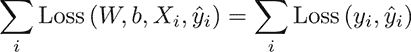

在这里，Loss(*y[i]*,*ŷ[i]*) ≥ 0，且 Loss 是一个*可微函数*。损失函数是一个平滑函数，它为每个（预测，标签）对分配一个非负值。一组特征和标签的损失是样本损失的加和。损失函数评估了你的算法参数在给定数据时的拟合度。你的训练目标是*最小化损失*，通过找到适应参数的良好策略来实现。

#### 5.4.2\. 均方误差

广泛使用的损失函数之一是*均方误差*（MSE）。尽管 MSE 对于我们的用例来说并不理想，但它是最直观的损失函数之一。你通过测量预测值与实际标签之间的平方距离，并对所有观察到的示例进行平均来衡量你的预测有多接近实际标签。用*ŷ* = *ŷ*[1]，...，*ŷ[k]*表示标签，用*y* = *y*[1]，...，*y[k]*表示预测，均方误差的定义如下：

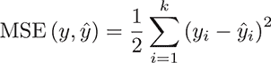

在你看到这里所提出的理论的应用之后，我们将介绍各种损失函数的优缺点。现在，让我们在 Python 中实现均方误差。

##### 列表 5.10\. 均方误差损失函数及其导数

```
import random
import numpy as np

class MSE:                                        *1*

    def __init__(self):
        pass

    @staticmethod
    def loss_function(predictions, labels):
        diff = predictions - labels
        return 0.5 * sum(diff * diff)[0]          *2*

    @staticmethod
    def loss_derivative(predictions, labels):
        return predictions - labels               *3*
```

+   ***1* 使用均方误差作为你的损失函数。**

+   ***2* 通过将均方误差定义为预测值与标签之间平方差的 0.5 倍...**

+   ***3* ...损失导数仅仅是预测值减去标签。**

注意，你不仅实现了损失函数本身，还实现了它相对于预测的导数：`loss_derivative`。这个导数是一个向量，通过从预测中减去标签来获得。

接下来，你将看到这样的导数在训练神经网络中扮演着至关重要的角色。

#### 5.4.3\. 在损失函数中寻找最小值

对于一组预测和标签的损失函数会告诉你你的模型参数调整得有多好。损失越小，你的预测越好，反之亦然。损失函数本身是网络参数的函数。在你的均方误差（MSE）实现中，你并不直接提供权重，但它们通过 `predictions` *隐式地*给出，因为你使用权重来计算它们。

从理论上讲，你知道从微积分中，为了最小化损失，你需要计算它的 *导数* 并将其设置为 0。我们称这个点的参数集为一个 *解*。计算函数的导数并在特定点进行评估称为 *计算梯度*。你在 MSE 实现中已经完成了计算导数的第一个步骤，但还有更多。你的目标是明确计算网络中所有权重和偏置项的梯度。

如果你需要复习微积分的基础知识，请务必查看附录 A。图 5.8 展示了三维空间中的一个表面。这个表面可以解释为二维输入的损失函数。前两个轴代表你的权重，第三个向上指的轴表示损失值。

##### 图 5.8\. 二维输入的损失函数示例（一个损失表面）。这个表面在右下角的暗区有一个最小值，可以通过求解损失函数的导数来计算。

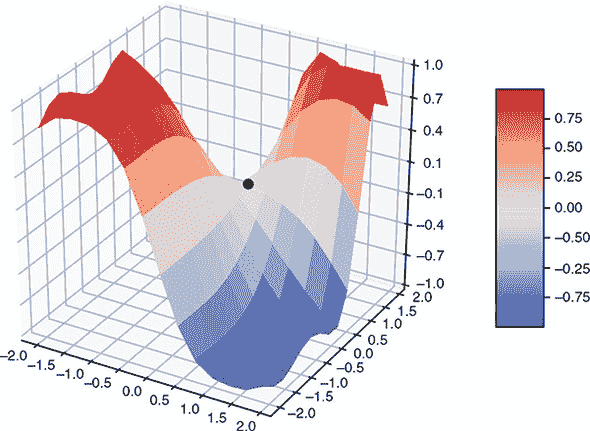

#### 5.4.4\. 使用梯度下降寻找最小值

直观地说，当你对一个给定点的函数计算梯度时，这个梯度指向最陡上升的方向。从一个损失函数 Loss 和一组参数 *W* 开始，梯度下降算法寻找该函数的最小值如下：

1.  计算当前参数集 *W* 的 Loss 的梯度 Δ（计算 Loss 对每个权重 *W* 的导数）。

1.  通过从 *W* 中减去 Δ 来更新 *W*。我们称这一步为 *跟随梯度*。因为 Δ 指向最陡上升的方向，减去它会使你朝着最陡下降的方向前进。

1.  重复直到 Δ 为 0。

因为你的损失函数是非负的，你知道它有一个最小值。它可能有多个，甚至无限多个最小值。例如，如果你考虑一个平坦的表面，*表面上的每个点*都是一个最小值。


**局部和全局最小值**

梯度下降达到的零梯度点是定义上的最小值。对于多变量可微函数的最小值的精确数学定义相对复杂，并使用了关于函数**曲率**的信息。

使用梯度下降，你最终会找到一个最小值；你可以跟随函数的梯度，直到找到一个零梯度点。只有一个注意事项：你不知道这个最小值是**局部**还是**全局**最小值。你可能被困在一个局部最小值上，这个局部最小值是函数可以取到的最小点，但其他点可能有更小的绝对值。图 5.8 中的标记点是一个局部最小值，但显然在这个表面上存在更小的值。

我们为了解决这个问题所采取的做法可能让你觉得奇怪：我们忽略它。在实践中，梯度下降通常会导致令人满意的结果，因此在神经网络损失函数的上下文中，我们倾向于忽略最小值是局部还是全局的问题。我们通常甚至不会运行算法直到收敛，而是在预定义的步骤数后停止。


图 5.9 展示了从图 5.8 的损失表面以及右上角标记点所指示的参数选择中，梯度下降是如何工作的。

##### 图 5.9\. 依次跟随损失函数的梯度最终会引导你到达最小值。

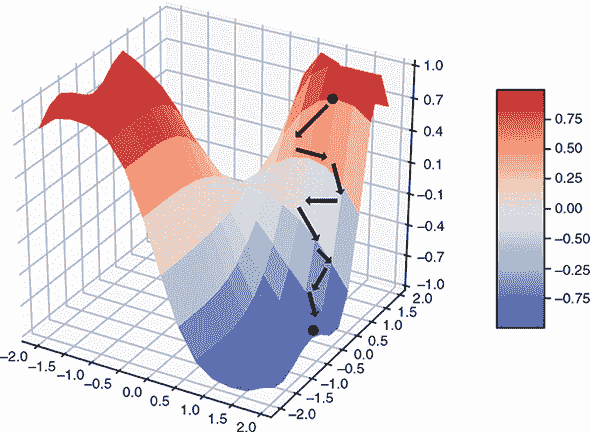

在你的均方误差(MSE)实现中，你已经看到均方误差损失的导数很容易**形式化**计算：它是标签和预测之间的差异。但为了**评估**这样的导数，你必须首先计算预测值。为了查看所有参数的梯度，你必须评估和聚合训练集中每个样本的导数。鉴于你通常要处理成千上万，甚至数百万的数据样本，这在大多数情况下实际上是不切实际的。相反，你使用一种称为**随机梯度下降**的技术来近似梯度计算。

#### 5.4.5\. 损失函数的随机梯度下降

为了计算梯度并应用神经网络中的梯度下降，你必须评估损失函数及其相对于网络参数的导数，在训练集中的每一个点上，这在大多数情况下太昂贵了。相反，你使用一种称为**随机梯度下降**（SGD）的技术。要运行 SGD，你首先从你的训练集中选择一些样本，这些样本被称为**小批量**。每个小批量以一个固定的长度被选择，我们称之为**小批量大小**。对于你正在处理的分类问题，例如手写数字问题，选择一个与小批量标签数量同数量级的批量大小是一个好的实践，以确保每个标签在小批量中都有代表。

对于一个具有**l**层和输入数据迷你批次**x**[1]，...，**x[k]**的迷你批次大小**k**的前馈神经网络，你可以计算你神经网络的正向传播并计算该迷你批次的损失。对于这个批次中的每个样本**x[j]**，你可以然后评估你的损失函数相对于你网络中任何参数的梯度。我们称层**i**中的权重和偏置梯度分别为Δ*[j]W^i*和Δ*[j]b^i*。

对于每个层和批次中的每个样本，你计算相应的梯度并使用以下**更新规则**来更新参数：

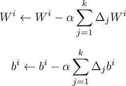

你通过减去为该批次收到的累积误差来更新你的参数。这里*a* > 0 表示**学习率**，这是一个在训练网络之前指定的实体。

如果你一次性对所有训练样本求和，你会得到关于梯度的更精确信息。使用迷你批次是在梯度精度和计算效率之间的折衷。我们称这种方法为**随机**梯度下降，因为迷你批次样本是随机选择的。虽然在梯度下降中你有理论上的保证可以接近局部最小值，但在 SGD 中则不是这样。图 5.10 显示了 SGD 的典型行为。你的一些近似随机梯度可能不会指向下降方向，但给定足够的迭代次数，你通常会接近一个（局部）最小值。

##### 图 5.10\. 随机梯度不够精确，所以在沿着损失表面追踪时，你可能会在接近局部最小值之前走一些弯路。


| |
| --- |

**优化器**

计算随机梯度是由微积分的基本原理定义的。你使用梯度来更新参数的方式则不是。像 SGD 的更新规则这样的技术被称为**优化器**。

存在许多其他优化器，以及更复杂的随机梯度下降版本。我们在第七章（kindle_split_019.xhtml#ch07）中介绍了 SGD 的一些扩展。这些扩展大多围绕随着时间的推移调整学习率或对单个权重进行更细粒度的更新。

| |
| --- |

#### 5.4.6\. 通过你的网络反向传播梯度

我们讨论了如何通过使用随机梯度下降来更新神经网络的参数，但没有解释如何得到梯度。用于计算这些梯度的算法被称为**反向传播**算法，并在附录 B（kindle_split_029.xhtml#app02）中详细说明。本节为你提供了反向传播的直觉以及实现前馈网络所需的必要构建块。

回想一下，在一个前馈网络中，你通过计算一个简单的构建块之后另一个构建块来运行前向传播。从最后一层的输出，即网络的预测和标签，你可以计算损失。损失函数本身是更简单函数的*组合*。为了计算损失函数的导数，你可以使用微积分的一个基本性质：链式法则。这条规则大致说明，复合函数的导数是这些函数导数的组合。因此，正如你逐层传递输入数据一样，你也可以逐层传递导数。你通过你的网络传播导数，因此得名*反向传播*。在图 5.11 中，你可以看到对于具有两个密集层和 sigmoid 激活函数的前馈网络的反向传播的实际应用。

##### 图 5.11\. 具有 sigmoid 激活函数和 MSE 损失函数的两个层前馈神经网络的正向和反向传播

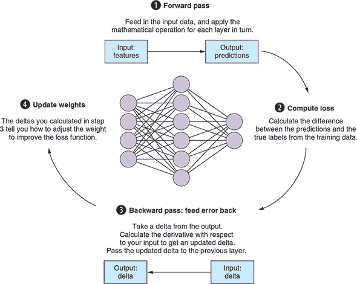

为了引导你通过图 5.11，让我们一步一步来：

1.  ***在训练数据上的前向传播。*** 在这一步，你取一个输入数据样本 *x* 并将其通过网络以得到一个预测，如下所示：

    1.  你计算仿射线性部分：*Wx* + *b*。

    1.  你将 sigmoid 函数 σ(*x*) 应用到结果上。注意，我们在计算步骤中稍微滥用符号，这里的 *x* 指的是前一个结果的输出。

    1.  你重复这些两个步骤，直到你到达输出层。在这个例子中，我们选择了两个层，但层数并不重要。

1.  ***损失函数评估。*** 在这一步，你取样本 *x* 的标签 *ŷ* 并通过计算损失值将其与你的预测 *y* 进行比较。在这个例子中，你选择均方误差作为你的损失函数。

1.  ***反向传播错误项。*** 在这一步，你取你的损失值并将其通过网络反向传播。你是通过逐层计算导数来做到这一点的，这是由于链式法则。当前向传播将输入数据通过网络单向传递时，反向传播将错误项反向传递。

    1.  你以与前向传播相反的顺序传播错误项，或称为 Δ。

    1.  首先，你计算损失函数的导数，这将作为你的初始 Δ。同样，正如在前向传播中一样，我们滥用符号，在过程中的每一步都称传播的错误项为 Δ。

    1.  你计算 sigmoid 关于其输入的导数，这简单地是 σ·(1 – σ)。为了将 Δ 传递到下一层，你可以进行逐元素乘法：σ(1 – σ) · Δ。

    1.  你对仿射线性变换 *Wx* + *b* 关于 *x* 的导数简单地是 *W*。为了传递 Δ，你计算 *W^t* · Δ。

    1.  这两个步骤会重复进行，直到你达到网络的第 1 层。

1.  ***使用梯度信息更新权重。*** 在最后一步，你使用沿途计算出的 delta 来更新你的网络参数（权重和偏置项）。

    1.  Sigmoid 函数没有参数，所以你没有什么可做的。

    1.  每个层中的偏置项接收的更新 Δ*b* 简单地是 Δ。

    1.  层中权重的更新 Δ*W* 由 Δ · *x*^T 给出（你需要在乘以 delta 之前将 *x* 转置）。

    1.  注意，我们最初说 *x* 是一个单独的样本。然而，我们讨论的所有内容都适用于小批量。如果 *x* 表示样本的小批量（*x* 是一个矩阵，其中每一列是一个输入向量），则前向和反向传递的计算看起来完全相同。

现在你已经涵盖了构建和运行前馈网络所需的所有必要数学知识，让我们通过从头开始构建神经网络实现来应用你在理论层面学到的知识。

### 5.5. 训练神经网络步骤详解

前一节涵盖了大量的理论内容，但在概念层面上，你只需通过几个基本概念就能完成任务。对于我们的实现，你只需要关注三件事：一个 `Layer` 类，一个通过逐个添加 `Layer` 对象构建的 `SequentialNetwork` 类，以及网络需要用于反向传播的 `Loss` 类。这三个类将在下面介绍，之后你将加载和检查手写数字数据，并将你的网络实现应用于它。图 5.12 展示了这些 Python 类如何组合在一起以实现前一节中描述的前向和反向传递。

##### 图 5.12. Python 实现的前馈网络的类图。一个 `SequentialNetwork` 包含多个 `Layer` 实例。每个 `Layer` 实现一个数学函数及其导数。前向和反向方法分别实现前向和反向传递。一个 `Loss` 实例计算你的损失函数，即预测与训练数据之间的误差。

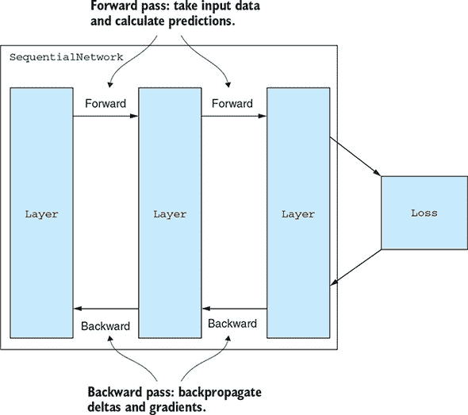

#### 5.5.1. Python 中的神经网络层

首先，从通用的 `Layer` 类开始，请注意，正如我们之前讨论的那样，层不仅包含处理输入数据（前向传递）的规范，而且还包含一个机制来 *反向传播* 错误项。为了不在反向传递中重新计算激活值，对于两个传递，维护数据进入和离开层的 *状态* 是实用的。话虽如此，以下对 `Layer` 的初始化应该是直截了当的。你将开始创建一个层模块；在本章的后面，你将使用该模块中的组件来构建神经网络。

##### 列表 5.11. 基础层实现

```
import numpy as np

class Layer:                        *1*
    def __init__(self):
        self.params = []

        self.previous = None        *2*
        self.next = None            *3*

        self.input_data = None      *4*
        self.output_data = None

        self.input_delta = None     *5*
        self.output_delta = None
```

+   ***1* 层被堆叠以构建一个顺序神经网络。**

+   ***2* 一层知道其前驱（上一个）...**

+   ***3* ...及其后续者（下一个）。**

+   ***4* 每个层可以在前向传递中持久化流入和流出它的数据。**

+   ***5* 类似地，层在反向传播中持有输入和输出数据。**

一层有一个参数列表，并存储其当前输入和输出数据，以及反向传播的相应输入和输出 delta。

此外，因为你关注的是顺序神经网络，所以给每个层一个后续者和前驱是有意义的。继续定义，你添加以下内容。

##### 列表 5.12\. 通过后续者和前驱连接层

```
    def connect(self, layer):        *1*
        self.previous = layer
        layer.next = self
```

+   ***1* 此方法将一层连接到顺序网络中的直接邻居。**

接下来，你为抽象的 `Layer` 类提供前向和反向传播的存根，子类必须实现。

##### 列表 5.13\. 顺序神经网络层的前向和反向传播

```
    def forward(self):                           *1*
        raise NotImplementedError

    def get_forward_input(self):                 *2*
        if self.previous is not None:
            return self.previous.output_data
        else:
            return self.input_data

    def backward(self):                          *3*
        raise NotImplementedError

    def get_backward_input(self):                *4*
        if self.next is not None:
            return self.next.output_delta
        else:
            return self.input_delta

    def clear_deltas(self):                      *5*
        pass

    def update_params(self, learning_rate):      *6*
        pass

    def describe(self):                          *7*
        raise NotImplementedError
```

+   ***1* 每个层实现必须提供一个函数来提供前向输入数据。**

+   ***2* 输入数据保留用于第一层；所有其他层都从前一个输出获取输入。**

+   ***3* 层必须实现误差项的反向传播——一种将输入误差反向传递通过网络的方式。**

+   ***4* 输入 delta 保留用于最后一层；所有其他层都从其后续层获取误差项。**

+   ***5* 你计算并累积每个 mini-batch 的 delta，之后你需要重置这些 delta。**

+   ***6* 根据当前 delta 更新层参数，使用指定的学习率。**

+   ***7* 层实现可以打印它们的属性。**

作为辅助函数，你提供了 `get_forward_input` 和 `get_backward_input`，这些函数只是检索相应传递的输入，但特别关注输入和输出神经元。此外，你实现了 `clear_deltas` 方法，定期重置你的 delta，在累积 mini-batch 上的 delta 之后，以及 `update_params`，它负责在网络的这个层使用它之后更新该层的参数。

注意，作为最后的功能部分，你添加了一个方法，让层打印其自身的描述，这为了方便获取网络更容易的概览而添加。

#### 5.5.2\. 神经网络中的激活层

接下来，你需要提供第一层，一个 `ActivationLayer`。你将使用 sigmoid 函数，该函数你已经实现过了。为了进行反向传播，你还需要它的导数，这可以很容易地实现。

##### 列表 5.14\. Sigmoid 函数的导数实现

```
def sigmoid_prime_double(x):
    return sigmoid_double(x) * (1 - sigmoid_double(x))

def sigmoid_prime(z):
    return np.vectorize(sigmoid_prime_double)(z)
```

注意，对于 sigmoid 本身，你提供了标量和向量版本的导数。现在，为了定义一个内置 sigmoid 函数作为激活的 `ActivationLayer`，你注意到 sigmoid 函数没有参数，所以你目前不需要担心更新任何参数。

##### 列表 5.15\. Sigmoid 激活层

```
class ActivationLayer(Layer):                             *1*
    def __init__(self, input_dim):
        super(ActivationLayer, self).__init__()

        self.input_dim = input_dim
        self.output_dim = input_dim

    def forward(self):
        data = self.get_forward_input()
        self.output_data = sigmoid(data)                  *2*

    def backward(self):
        delta = self.get_backward_input()
        data = self.get_forward_input()
        self.output_delta = delta * sigmoid_prime(data)   *3*

    def describe(self):
        print("|-- " + self.__class__.__name__)
        print("  |-- dimensions: ({},{})"
              .format(self.input_dim, self.output_dim))
```

+   ***1* 此激活层使用 sigmoid 函数来激活神经元。**

+   ***2* 正向传播仅仅是将 sigmoid 应用于输入数据。**

+   ***3* 反向传播是误差项与在此层输入处评估的 sigmoid 导数的逐元素乘积。**

仔细检查梯度实现，看看它如何与 图 5.11 中描述的图景相符。对于这一层，反向传播仅仅是层当前 delta 与在此层输入处评估的 sigmoid 导数的逐元素乘积：σ(*x*) · (1 – σ(*x*)) · Δ。

#### 5.5.3\. Python 中的密集层作为前馈网络的构建块

为了继续你的实现，你接下来转向 `DenseLayer`，这是更复杂的层来实现，但也是本章你要解决的最后一个问题。初始化这个层需要更多的变量，因为这次你还要注意权重矩阵、偏置项及其各自的梯度。

##### 列表 5.16\. 密集层权重初始化

```
class DenseLayer(Layer):

    def __init__(self, input_dim, output_dim):                 *1*

        super(DenseLayer, self).__init__()

        self.input_dim = input_dim
        self.output_dim = output_dim

        self.weight = np.random.randn(output_dim, input_dim)   *2*
        self.bias = np.random.randn(output_dim, 1)

        self.params = [self.weight, self.bias]                 *3*

        self.delta_w = np.zeros(self.weight.shape)             *4*
        self.delta_b = np.zeros(self.bias.shape)
```

+   ***1* 密集层具有输入和输出维度。**

+   ***2* 随机初始化权重矩阵和偏置向量。**

+   ***3* 层参数包括权重和偏置项。**

+   ***4* 权重和偏置的 delta 被设置为 0。**

注意，你应随机初始化 *W* 和 *b*。初始化神经网络权重的方法有很多。随机初始化是一个可接受的基线，但还有许多更复杂的方法来初始化参数，以便它们更准确地反映你的输入数据结构。


**参数初始化作为优化的起点**

参数初始化是一个有趣的话题，我们将在 第六章 中讨论一些其他初始化技术。

目前，只需记住初始化会影响你的学习行为。如果你考虑 图 5.10 中的损失表面，参数的初始化意味着 *选择一个优化起点*；你可以很容易地想象，图 5.10 中损失表面的不同起点可能导致不同的结果。这使得初始化成为神经网络研究中的一个重要主题。


现在，密集层的正向传播是直接的。

##### 列表 5.17\. 密集层正向传播

```
    def forward(self):
        data = self.get_forward_input()
        self.output_data = np.dot(self.weight, data) + self.bias    *1*
```

+   ***1* 密集层的正向传播是权重和偏置定义的输入数据的仿射线性变换。**

对于反向传播，回想一下，为了计算这一层的 delta，你只需要转置 *W* 并将其与输入的 delta 相乘：*W*^tΔ。*W* 和 *b* 的梯度也容易计算：Δ*W* = Δ*yt* 和 Δ*b* = Δ，其中 *y* 表示这一层的输入（使用你当前使用的数据进行评估）。

##### 列表 5.18\. 密集层反向传播

```
    def backward(self):
        data = self.get_forward_input()
        delta = self.get_backward_input()                          *1*

        self.delta_b += delta                                      *2*

        self.delta_w += np.dot(delta, data.transpose())            *3*

        self.output_delta = np.dot(self.weight.transpose(), delta) *4*
```

+   ***1* 对于反向传播，你首先获取输入数据和 delta。**

+   ***2* 将当前的 delta 添加到偏置 delta。**

+   ***3* 然后将此项添加到权重 delta。**

+   ***4* 通过将输出 delta 传递给前一层来完成反向传播。**

这个层的更新规则是通过累积 delta 来给出的，根据你为网络指定的学习率。

##### 列表 5.19\. 密集层权重更新机制

```
    def update_params(self, rate):                       *1*
        self.weight -= rate * self.delta_w
        self.bias -= rate * self.delta_b

    def clear_deltas(self):                              *2*
        self.delta_w = np.zeros(self.weight.shape)
        self.delta_b = np.zeros(self.bias.shape)

    def describe(self):                                  *3*
        print("|--- " + self.__class__.__name__)
        print("  |-- dimensions: ({},{})"
              .format(self.input_dim, self.output_dim))
```

+   ***1* 使用权重和偏差 delta，你可以使用梯度下降更新模型参数。**

+   ***2* 更新参数后，你应该重置所有 delta。**

+   ***3* 一个密集层可以通过其输入和输出维度来描述。**

#### 5.5.4\. 使用 Python 的顺序神经网络

在处理了层作为网络构建块之后，让我们转向网络本身。你通过装备一个空的层列表并让它使用 MSE 作为损失函数（除非提供其他方式）来初始化顺序神经网络。

##### 列表 5.20\. 顺序神经网络初始化

```
class SequentialNetwork:                    *1*
    def __init__(self, loss=None):
        print("Initialize Network...")
        self.layers = []
        if loss is None:
            self.loss = MSE()               *2*
```

+   ***1* 在顺序神经网络中，你按顺序堆叠层。**

+   ***2* 如果没有提供损失函数，则使用 MSE。**

接下来，你添加了逐个添加层的功能。

##### 列表 5.21\. 顺序添加层

```
    def add(self, layer):                           *1*
        self.layers.append(layer)
        layer.describe()
        if len(self.layers) > 1:
            self.layers[-1].connect(self.layers[-2])
```

+   ***1* 每当你添加一个层时，你将其连接到其前驱并让它描述自己。**

在你的网络实现的核心是*train*方法。你使用小批量作为输入：你打乱训练数据并将其分成大小为`mini_batch_size`的批次。为了训练你的网络，你一次又一次地以批量的形式提供你的训练数据。我们说我们进行了多次*epochs*的训练。对于每个小批量，你调用`train_batch`方法。如果提供了`test_data`，你将在每个 epoch 后评估网络性能。

##### 列表 5.22\. 在顺序网络上的训练方法

```
    def train(self, training_data, epochs, mini_batch_size,
              learning_rate, test_data=None):
        n = len(training_data)
        for epoch in range(epochs):                                     *1*
            random.shuffle(training_data)
            mini_batches = [
                training_data[k:k + mini_batch_size] for
                k in range(0, n, mini_batch_size)                       *2*
            ]
            for mini_batch in mini_batches:
                self.train_batch(mini_batch, learning_rate)             *3*
            if test_data:
                n_test = len(test_data)
                print("Epoch {0}: {1} / {2}"
                      .format(epoch, self.evaluate(test_data), n_test)) *4*
            else:
                print("Epoch {0} complete".format(epoch))
```

+   ***1* 要训练你的网络，你需要遍历数据，次数与 epoch 数相同。**

+   ***2* 打乱训练数据并创建小批量。**

+   ***3* 对于每个小批量，你训练你的网络。**

+   ***4* 如果你提供了测试数据，你将在每个 epoch 后评估你的网络。**

现在，你的`train_batch`计算这个小批量上的前向和反向传播，并在之后更新参数。

##### 列表 5.23\. 在数据批次上训练顺序神经网络

```
    def train_batch(self, mini_batch, learning_rate):
        self.forward_backward(mini_batch)              *1*

        self.update(mini_batch, learning_rate)         *2*
```

+   ***1* 要在小批量上训练网络，你计算前向和反向传播...**

+   ***2* ...然后相应地更新模型参数。**

这两个步骤，`update`和`forward_backward`，计算如下。

##### 列表 5.24\. 网络的更新规则和前向和反向传播

```
    def update(self, mini_batch, learning_rate):
        learning_rate = learning_rate / len(mini_batch)                   *1*
        for layer in self.layers:
            layer.update_params(learning_rate)                            *2*
        for layer in self.layers:
            layer.clear_deltas()                                          *3*

    def forward_backward(self, mini_batch):
        for x, y in mini_batch:
            self.layers[0].input_data = x
            for layer in self.layers:
                layer.forward()                                           *4*
            self.layers[-1].input_delta = \
                self.loss.loss_derivative(self.layers[-1].output_data, y) *5*
            for layer in reversed(self.layers):
                layer.backward()                                          *6*
```

+   ***1* 一种常见的技巧是将学习率通过小批量大小进行归一化。**

+   ***2* 更新所有层的参数。**

+   ***3* 清除每个层中的所有 delta。**

+   ***4* 对于小批量中的每个样本，逐层前向传播特征。**

+   ***5* 计算输出数据的损失导数。**

+   ***6* 对误差项进行逐层反向传播。**

实现很简单，但有几个值得注意的点。首先，您通过您的 mini-batch 大小来归一化学习率，以保持更新较小。其次，在通过反向顺序遍历层来计算完整的反向传递之前，您计算网络输出的损失导数，这作为反向传递的第一个输入 delta。

您的`SequentialNetwork`实现剩余部分涉及模型性能和评估。为了在测试数据上评估您的网络，您需要将数据前向传递通过您的网络，这正是`single_forward`所做的事情。评估发生在`evaluate`中，您返回正确预测的结果数量以评估准确性。

##### 列表 5.25\. 评估

```
    def single_forward(self, x):              *1*
        self.layers[0].input_data = x
        for layer in self.layers:
                layer.forward()
        return self.layers[-1].output_data

    def evaluate(self, test_data):            *2*
        test_results = [(
            np.argmax(self.single_forward(x)),
            np.argmax(y)
        ) for (x, y) in test_data]
        return sum(int(x == y) for (x, y) in test_results)
```

+   ***1* 前向传递单个样本并返回结果。**

+   ***2* 在测试数据上计算准确率。**

#### 5.5.5\. 将您的网络应用于手写数字分类

在实现了前向网络之后，让我们回到我们的初始用例，即预测 MNIST 数据集的手写数字。在导入您刚刚构建的必要类之后，您加载 MNIST 数据，初始化一个网络，向其中添加层，然后使用您的数据训练和评估网络。

在构建网络时，请记住您的输入维度是 784，输出维度是 10，即数字的数量。您选择三个输出维度分别为 392、196 和 10 的密集层，并在每个密集层之后添加 sigmoid 激活函数。通过每个新的密集层，您实际上是在将层容量减半。层的大小和层数是该网络的*超参数*。您选择了这些值来设置网络架构。我们鼓励您尝试其他层大小，以获得关于网络学习过程与其架构之间关系的直觉。

##### 列表 5.26\. 实例化一个神经网络

```
from dlgo.nn import load_mnist
from dlgo.nn import network
from dlgo.nn.layers import DenseLayer, ActivationLayer

training_data, test_data = load_mnist.load_data()  *1*

net = network.SequentialNetwork()                  *2*

net.add(DenseLayer(784, 392))                      *3*
net.add(ActivationLayer(392))
net.add(DenseLayer(392, 196))
net.add(ActivationLayer(196))
net.add(DenseLayer(196, 10))
net.add(ActivationLayer(10))                       *4*
```

+   ***1* 加载训练和测试数据。**

+   ***2* 初始化一个序列神经网络。**

+   ***3* 您可以逐个添加密集和激活层。**

+   ***4* 最终层的大小为 10，即预测的类别数量。**

您可以通过调用`train`并传入所有必需参数来在数据上训练网络。您进行 10 个 epoch 的训练，并将学习率设置为 3.0。对于 mini-batch 大小，您选择 10，即类别数量。如果您几乎完美地打乱训练数据，那么在大多数批次中每个类别都会被表示，从而产生良好的随机梯度。

##### 列表 5.27\. 在训练数据上运行神经网络实例

```
net.train(training_data, epochs=10, mini_batch_size=10,
          learning_rate=3.0, test_data=test_data)          *1*
```

+   ***1* 您现在可以通过指定训练和测试数据、epoch 数量、mini-batch 大小和学习率来轻松训练模型。**

现在，在命令行上运行此操作：

```
python run_network.py
```

这会产生以下提示：

```
Initialize Network...
|--- DenseLayer
  |-- dimensions: (784,392)
|-- ActivationLayer
  |-- dimensions: (392,192)
|--- DenseLayer
  |-- dimensions: (192,10)
|-- ActivationLayer
  |-- dimensions: (10,10)
Epoch 0: 6628 / 10000
Epoch 1: 7552 / 10000
...
```

对于每个 epoch 得到的数字在这里并不重要，除了结果高度依赖于权重的初始化。但值得注意的是，你通常在不到 10 个 epoch 内就能达到超过 95%的准确率。这已经是一项相当大的成就了，尤其是考虑到你是从头开始的。特别是，这个模型从一开始就比你的朴素模型表现要好得多。尽管如此，你还能做得更好。

注意，对于你所研究的用例，你完全忽略了输入图像的空间结构，将它们视为向量。但应该清楚的是，给定像素的邻域是重要的信息，应该被利用。最终，你希望回到围棋游戏，你在第二章和第三章中已经看到，(一串)棋子的邻域是多么重要。

在下一章中，你将看到如何构建一种更适合检测空间数据模式（如图像或围棋盘）的特定类型的神经网络。这将使你更接近于在第七章中开发围棋机器人。

### 5.6\. 概述

+   *顺序神经网络*是由线性堆叠的层组成的简单人工神经网络。你可以将神经网络应用于广泛的机器学习问题，包括图像识别。

+   *前馈网络*是由具有激活函数的密集层组成的顺序网络。

+   *损失函数*评估我们预测的质量。*均方误差*是实践中最常用的损失函数之一。损失函数为你提供了一个严格的方式来量化模型的准确性。

+   *梯度下降*是一种最小化函数的算法。梯度下降涉及跟随函数的最陡斜率。在机器学习中，你使用梯度下降来找到最小的损失。

+   *随机梯度下降*是梯度下降算法的一种变体。在随机梯度下降中，你在训练集的一个小子集上计算梯度，这个小子集被称为*批处理*，然后根据每个批处理更新网络权重。随机梯度下降通常比常规梯度下降在大训练集上快得多。

+   使用顺序神经网络，你可以使用**反向传播算法**来高效地计算梯度。反向传播和批处理的结合使得训练足够快，可以在大型数据集上实际应用。

## 第六章\. 为围棋数据设计神经网络

*本章涵盖*

+   构建一个可以从数据预测下一个围棋走法的深度学习应用

+   介绍 Keras 深度学习框架

+   理解卷积神经网络

+   构建神经网络以分析空间围棋数据

在前一章中，你看到了神经网络的基本原理在实际中的应用，并从头开始实现了前馈网络。在本章中，你将把注意力转回围棋游戏，并解决如何使用深度学习技术预测围棋游戏任何给定棋盘情况下的下一步问题。特别是，你将使用在第四章（kindle_split_016.xhtml#ch04）中开发的树搜索技术生成围棋游戏数据，然后你可以使用这些数据来训练一个神经网络。图 6.1 概述了本章将要构建的应用。

##### 图 6.1\. 如何使用深度学习预测围棋游戏中的下一步

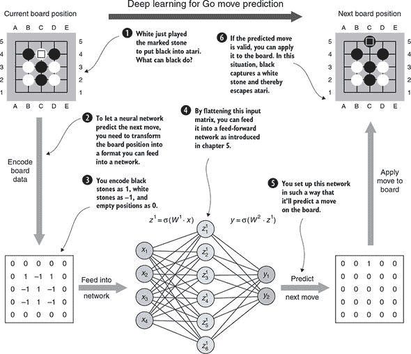

如图 6.1 所示，为了将前一章中关于神经网络的工作知识联系起来，你首先需要解决几个关键步骤：

1.  在第三章（kindle_split_014.xhtml#ch03）中，你专注于通过在围棋棋盘上实现游戏玩法来教机器围棋的规则。第四章使用了这些结构进行树搜索。但在第五章（kindle_split_017.xhtml#ch05）中，你看到神经网络需要*数值输入*；对于你实现的前馈架构，需要*向量*。

1.  为了将围棋棋盘位置转换为一个可以输入神经网络的输入向量，你必须创建一个*编码器*来完成这项工作。图 6.1 中，我们草拟了一个简单的编码器，你将在第 6.1 节（#ch06lev1sec1）中实现它；棋盘被编码为一个棋盘大小的矩阵，白子表示为-1，黑子表示为 1，空点表示为 0。这个矩阵可以被展平为一个向量，就像你在前一章中处理 MNIST 数据时做的那样。尽管这种表示方法对于移动预测来说过于简单，无法提供优秀的结果，但它是在正确方向上的第一步。在第七章（kindle_split_019.xhtml#ch07）中，你将看到更复杂、更有用的编码棋盘的方法。

1.  为了训练一个神经网络来预测移动，你首先需要获取可以输入到其中的数据。在第 6.2 节（#ch06lev1sec2）中，你将学习第四章（kindle_split_016.xhtml#ch04）中的技术来生成游戏记录。你将按照前面讨论的方式将每个棋盘位置编码，这将成为你的特征，并将每个位置的下一步作为标签存储。

1.  虽然像第五章（kindle_split_017.xhtml#ch05）中那样实现了一个神经网络是有用的，但现在通过引入一个更成熟的深度学习库来获得更多速度和可靠性同样重要。为此，第 6.3 节（#ch06lev1sec3）介绍了*Keras*，这是一个用 Python 编写的流行的深度学习库。你将使用 Keras 来为移动预测建模网络。

1.  在这一点上，你可能想知道为什么你通过将编码的棋盘展平为向量而完全丢弃了围棋棋盘的空间结构。在第 6.4 节中，你将了解一种新的层类型，称为*卷积层*，它非常适合你的使用场景。你将使用这些层来构建一个新的架构，称为*卷积神经网络*。

1.  在本章的结尾部分，你将了解更多现代深度学习的关键概念，这些概念将进一步提高移动预测的准确性，例如在第 6.5 节中高效地使用*softmax*预测概率，或者在第 6.6 节中使用一个有趣的激活函数*ReLU*（修正线性单元）构建更深的神经网络。

### 6.1\. 为神经网络编码围棋游戏位置

在第三章中，你构建了一个 Python 类库，代表了围棋游戏中的所有实体：`Player`、`Board`、`GameState`等。现在你想要将机器学习应用于围棋问题。但是，像神经网络这样的数学模型不能在像我们的`GameState`类这样的高级对象上操作；它们只能处理数学对象，例如向量和矩阵。在本节中，你将创建一个`Encoder`类，将你的本地游戏对象转换为数学形式。在整个本章的其余部分，你可以将这种数学表示形式输入到你的机器学习工具中。

构建围棋移动预测的深度学习模型的第一个步骤是加载可以输入到神经网络中的数据。你通过定义一个简单的*编码器*来实现这一点，该编码器在图 6.1 中介绍。编码器是将你在第三章中实现的围棋棋盘以适当方式转换的一种方法。你到目前为止所学习的神经网络，多层感知器，以向量作为输入，但在第 6.4 节中你将看到另一种网络架构，它操作于更高维度的数据。图 6.2 为你提供了一个关于如何定义这样一个编码器的主意。

##### 图 6.2\. `Encoder`类的示意图。它将你的`GameState`类转换为数学形式——NumPy 数组。

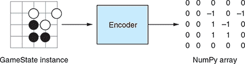

在核心上，编码器必须知道如何编码完整的围棋游戏状态。特别是，它应该定义如何编码棋盘上的一个点。有时逆操作也很有趣：如果你使用网络预测了下一步，那么这一步将被编码，你需要将其转换回棋盘上的实际移动。这个操作，称为*解码*，对于应用预测的移动至关重要。

考虑到这一点，你现在可以定义你的 `Encoder` 类，这是你将在本章和下一章中创建的编码器的接口。你将在 dlgo 中定义一个新的模块，名为 *encoders*，并用一个空的 __init__.py 初始化它，然后将文件 base.py 放入其中。然后你将在该文件中放入以下定义。

##### 列表 6.1\. 抽象 `Encoder` 类用于编码围棋游戏状态

```
class Encoder:
    def name(self):                      *1*
        raise NotImplementedError()

    def encode(self, game_state):        *2*
        raise NotImplementedError()

    def encode_point(self, point):       *3*
        raise NotImplementedError()

    def decode_point_index(self, index): *4*
        raise NotImplementedError()

    def num_points(self):                *5*
        raise NotImplementedError()

    def shape(self):                     *6*
        raise NotImplementedError()
```

+   ***1* 允许你支持记录或保存模型使用的编码器的名称**

+   ***2* 将围棋棋盘转换为数值数据**

+   ***3* 将围棋棋盘点转换为整数索引**

+   ***4* 将整数索引转换回围棋棋盘点**

+   ***5* 棋盘上的点数——棋盘宽度乘以棋盘高度**

+   ***6* 编码棋盘结构的形状**

编码器的定义很简单，但我们想在 base.py 中添加一个额外的便利功能：一个通过名称（一个字符串）创建编码器的函数，而不是显式创建对象。你通过将 `get_encoder_by_name` 函数附加到编码器的定义来实现这一点。

##### 列表 6.2\. 通过名称引用围棋棋盘编码器

```
import importlib

def get_encoder_by_name(name, board_size):                      *1*
    if isinstance(board_size, int):
        board_size = (board_size, board_size)                   *2*
    module = importlib.import_module('dlgo.encoders.' + name)
    constructor = getattr(module, 'create')                     *3*
    return constructor(board_size)
```

+   ***1* 你可以通过引用它们的名称来创建编码器实例。**

+   ***2* 如果 board_size 是一个整数，你将用它创建一个正方形棋盘。**

+   ***3* 每个编码器实现都必须提供一个“创建”函数，该函数提供一个实例。**

现在你已经知道了编码器是什么以及如何构建一个，让我们将 图 6.2 中的想法实现为你的第一个编码器：一种颜色表示为 1，另一种颜色表示为 –1，空点表示为 0。为了做出准确的预测，模型还需要知道是谁的回合。所以，你不会用 1 表示黑子，用 –1 表示白子，而是用 1 表示下一个回合的人，用 –1 表示对手。你会称这个为 `OnePlaneEncoder`，因为你会将围棋棋盘编码成一个与棋盘大小相同的单矩阵或平面。在 第七章 中，你会看到具有更多 *特征平面* 的编码器；例如，你会实现一个具有黑白棋子各一个平面和一个平面来捕捉“活”的编码器。现在，你将坚持使用我们在 encoders 模块中的 oneplane.py 中实现的简单单平面编码想法。以下列表显示了第一部分。

##### 列表 6.3\. 使用简单的单平面围棋棋盘编码器编码游戏状态

```
import numpy as np

from dlgo.encoders.base import Encoder
from dlgo.goboard import Point

class OnePlaneEncoder(Encoder):
    def __init__(self, board_size):
        self.board_width, self.board_height = board_size
        self.num_planes = 1

    def name(self):                             *1*
        return 'oneplane'

    def encode(self, game_state):               *2*
        board_matrix = np.zeros(self.shape())
        next_player = game_state.next_player
        for r in range(self.board_height):
            for c in range(self.board_width):
                p = Point(row=r + 1, col=c + 1)
                go_string = game_state.board.get_go_string(p)
                if go_string is None:
                    continue
                if go_string.color == next_player:
                    board_matrix[0, r, c] = 1
                else:
                    board_matrix[0, r, c] = -1
        return board_matrix
```

+   ***1* 你可以通过名称 oneplane 来引用这个编码器。**

+   ***2* 编码时，你用一个矩阵填充 1，如果该点包含当前玩家的棋子，用 –1 如果该点包含对手的棋子，如果该点是空的，则用 0。**

在定义的第二部分中，你将处理编码和解码棋盘的单个点。编码是通过将棋盘上的一个点映射到一个长度为棋盘宽度乘以棋盘高度的向量来完成的；解码从这样的向量中恢复点坐标。

##### 列表 6.4\. 使用您的单平面围棋棋盘编码器进行编码和解码点

```
    def encode_point(self, point):                                   *1*
        return self.board_width * (point.row - 1) + (point.col - 1)

    def decode_point_index(self, index):                             *2*
        row = index // self.board_width
        col = index % self.board_width
        return Point(row=row + 1, col=col + 1)

    def num_points(self):
        return self.board_width * self.board_height

    def shape(self):
        return self.num_planes, self.board_height, self.board_width
```

+   ***1* 将棋盘点转换为整数索引**

+   ***2* 将整数索引转换为棋盘点**

这就结束了我们对围棋棋盘编码器的讨论。你现在可以继续创建可以编码并输入到神经网络中的数据。

### 6.2\. 生成树搜索游戏作为网络训练数据

在你能够将机器学习应用于围棋游戏之前，你需要一组训练数据。幸运的是，强大的玩家一直在公共围棋服务器上玩游戏。第七章介绍了如何找到和处理这些游戏记录以创建训练数据。目前，你可以生成自己的游戏记录。本节展示了如何使用你在第四章中创建的树搜索机器人生成游戏记录。在本章的其余部分，你可以使用这些机器人游戏记录作为训练数据来尝试深度学习。

使用机器学习来模仿经典算法看起来很愚蠢吗？不是如果传统算法很慢的话！在这里，你希望使用机器学习来获得对慢速树搜索的快速近似。这个概念是 AlphaGo Zero（AlphaGo 的最强版本）的关键部分。第十四章介绍了 AlphaGo Zero 的工作原理。

创建一个名为 generate_mcts_games.py 的文件，位于 dlgo 模块外部。正如文件名所暗示的，你将编写生成带有 MCTS 的游戏的代码。然后，这些游戏中的每一步都将使用你的`OnePlaneEncoder`（来自第 6.1 节）进行编码，并存储在`numpy`数组中以供将来使用。首先，在 generate_mcts_games.py 的顶部放置以下`import`语句。

##### 列表 6.5\. 生成编码蒙特卡洛树搜索游戏数据的导入

```
import argparse
import numpy as np

from dlgo.encoders import get_encoder_by_name
from dlgo import goboard_fast as goboard
from dlgo import mcts
from dlgo.utils import print_board, print_move
```

从这些导入中，你可以看到你将使用哪些工具来完成这项工作：mcts 模块、你在第三章中实现的 goboard，以及你刚刚定义的 encoders 模块。让我们继续创建一个函数，该函数将为你生成游戏数据。在`generate_game`中，你让一个来自第四章的`MCTSAgent`实例与自己玩游戏（回想一下第四章中，MCTS 代理的温度调节了你的树搜索的波动性）。对于每一步，你在移动之前编码棋盘状态，将移动编码为一个独热向量，然后将移动应用到棋盘上。

##### 列表 6.6\. 为本章生成 MCTS 游戏

```
def generate_game(board_size, rounds, max_moves, temperature):
    boards, moves = [], []                                      *1*

    encoder = get_encoder_by_name('oneplane', board_size)       *2*

    game = goboard.GameState.new_game(board_size)               *3*

    bot = mcts.MCTSAgent(rounds, temperature)                   *4*

    num_moves = 0
    while not game.is_over():
        print_board(game.board)
        move = bot.select_move(game)                            *5*
        if move.is_play:
            boards.append(encoder.encode(game))                 *6*

            move_one_hot = np.zeros(encoder.num_points())
            move_one_hot[encoder.encode_point(move.point)] = 1
            moves.append(move_one_hot)                          *7*

        print_move(game.next_player, move)
        game = game.apply_move(move)                            *8*
        num_moves += 1
        if num_moves > max_moves:                               *9*
            break

    return np.array(boards), np.array(moves)
```

+   ***1* 在棋盘上存储编码的棋盘状态；动作列表用于编码动作。**

+   ***2* 使用名称和给定的棋盘大小初始化 OnePlaneEncoder。**

+   ***3* 实例化一个大小为 board_size 的新游戏。**

+   ***4* 具有指定轮数和温度的蒙特卡洛树搜索代理将作为你的机器人。**

+   ***5* 机器人选择下一步。**

+   ***6* 将编码的棋盘情况附加到棋盘列表中。**

+   ***7* 将独热编码的下一步动作附加到动作列表中。**

+   ***8* 之后，将机器人移动应用到棋盘上。**

+   ***9* 您将继续进行下一步，除非达到最大步数。**

现在您有了使用蒙特卡洛树搜索创建和编码游戏数据的方法，您可以定义一个`main`方法来运行几场比赛，并在之后持久化它们，您也可以将它们放入 generate_mcts_games.py 中。

##### 列表 6.7\. 为本章生成 MCTS 游戏的主体应用

```
def main():
    parser = argparse.ArgumentParser()
    parser.add_argument('--board-size', '-b', type=int, default=9)
    parser.add_argument('--rounds', '-r', type=int, default=1000)
    parser.add_argument('--temperature', '-t', type=float, default=0.8)
    parser.add_argument('--max-moves', '-m', type=int, default=60,
                        help='Max moves per game.')
    parser.add_argument('--num-games', '-n', type=int, default=10)
    parser.add_argument('--board-out')
    parser.add_argument('--move-out')

    args = parser.parse_args()              *1*
    xs = []
    ys = []

    for i in range(args.num_games):
        print('Generating game %d/%d...' % (i + 1, args.num_games))
        x, y = generate_game(args.board_size, args.rounds, args.max_moves,
 args.temperature)                        *2*
        xs.append(x)
        ys.append(y)

    x = np.concatenate(xs)                  *3*
    y = np.concatenate(ys)

    np.save(args.board_out, x)              *4*
    np.save(args.move_out, y)

if __name__ == '__main__':
    main()
```

+   ***1* 此应用程序允许通过命令行参数进行自定义。**

+   ***2* 对于指定的游戏数量，您将生成游戏数据。**

+   ***3* 在所有游戏生成完毕后，您分别连接特征和标签。**

+   ***4* 您将特征和标签数据存储到由命令行选项指定的单独文件中。**

使用这个工具，您现在可以轻松地生成游戏数据。假设您想为 20 场 9×9 围棋游戏创建数据，并将特征存储在 features.npy 中，将标签存储在 labels.npy 中。以下命令将完成这项工作：

```
python generate_mcts_games.py -n 20 --board-out features.npy
 --move-out labels.npy
```

注意，生成此类游戏可能相当慢，因此生成大量游戏需要一段时间。您始终可以减少 MCTS 的回合数，但这也会降低机器人的游戏水平。因此，我们已经为您生成了游戏数据，您可以在 GitHub 仓库中的 generated_games 文件夹下找到。您可以在 features-40k.npy 和 labels-40k.npy 中找到输出；它包含了几百场比赛中的大约 40,000 步。我们为每一步生成了 5,000 个 MCTS 回合。在这个设置下，MCTS 引擎主要玩合理的棋步，所以我们有理由希望神经网络可以学会模仿它。

到目前为止，您已经完成了将神经网络应用于生成数据所需的所有预处理工作。您可以用第五章中的网络实现以直接的方式完成这项工作——这样做也是一个很好的练习——但是向前看，您需要一个更强大的工具来满足您处理越来越复杂的深度神经网络的需求。为此，我们接下来介绍 Keras。

### 6.3\. 使用 Keras 深度学习库

由于许多强大的深度学习库的出现，神经网络梯度和反向传播的计算变得越来越像一门失传的艺术。在前一章中从头开始实现神经网络是件好事，但现在我们该转向更成熟且功能丰富的软件了。

Keras 深度学习库是一个特别优雅且流行的 Python 编写的深度学习工具。这个开源项目创建于 2015 年，并迅速积累了强大的用户基础。代码托管在[`github.com/keras-team/keras`](https://github.com/keras-team/keras)，并且有优秀的文档，可以在[`keras.io`](https://keras.io)找到。

#### 6.3.1\. 理解 Keras 设计原则

Keras 的一个优点是它具有直观且易于学习的 API，允许快速原型设计和快速实验周期。这使得 Keras 在许多数据科学挑战中很受欢迎，例如在 [`kaggle.com`](https://kaggle.com) 上。Keras 由模块化构建块组成，最初受到其他深度学习工具（如 Torch）的启发。Keras 的另一个优点是其可扩展性。添加新的自定义层或增强现有功能相对简单。

Keras 易于入门的另一个方面是它自带了所有必要的组件。例如，许多流行的数据集，如 MNIST，可以直接使用 Keras 加载，您可以在 GitHub 仓库中找到很多好的示例。除此之外，还有一个由社区构建的 Keras 扩展和独立项目的生态系统，位于 [`github.com/fchollet/keras-resources`](https://github.com/fchollet/keras-resources)。

Keras 的一个显著特点是 *后端* 的概念：它使用强大的引擎，可以根据需要更换。一种思考 Keras 的方式是将其视为深度学习的 *前端*，这是一个提供方便的、高级抽象和功能的库，以运行您的模型，但背后有一个选择的后端，在后台完成繁重的工作。截至本书编写时，Keras 有三个官方后端可供选择：TensorFlow、Theano 和微软认知工具包。在本书中，您将专门使用 Google 的 TensorFlow 库，这也是 Keras 的默认后端。但如果您更喜欢另一个后端，您不需要花费太多精力就可以切换；Keras 会为您处理大部分差异。

在本节中，您首先将安装 Keras。然后您将通过运行来自 第五章 的手写数字分类示例来了解其 API，然后继续进行围棋移动预测的任务。

#### 6.3.2\. 安装 Keras 深度学习库

要开始使用 Keras，您需要首先安装一个后端。您可以从 TensorFlow 开始，它可以通过运行以下命令通过 pip 最容易地安装：

```
pip install tensorflow
```

如果您的机器安装了 NVIDIA GPU 和当前的 CUDA 驱动程序，您可以尝试安装 TensorFlow 的 GPU 加速版本：

```
pip install tensorflow-gpu
```

如果 `tensorflow-gpu` 与您的硬件和驱动程序兼容，这将为您带来巨大的速度提升。

一些有助于模型序列化和可视化的可选依赖项可以用于 Keras，但您现在可以跳过它们，直接安装库本身：

```
pip install Keras
```

#### 6.3.3\. 使用 Keras 运行熟悉的第一示例

在本节中，您将看到定义和运行 Keras 模型遵循以下四个步骤的工作流程：

1.  ***数据预处理*—** 加载并准备一个数据集以供神经网络输入。

1.  ***模型定义*—** 实例化一个模型并根据需要添加层。

1.  ***模型编译*—** 使用优化器、损失函数和可选的评估指标列表编译你之前定义的模型。

1.  ***模型训练和评估*—** 将你的深度学习模型拟合到数据并对其进行评估。

要开始使用 Keras，我们将通过一个例子来引导你，这个例子是你之前章节中遇到的使用案例：使用 MNIST 数据集预测手写数字。正如你将看到的，我们第五章（kindle_split_017.xhtml#ch05）中的简单模型与 Keras 语法已经非常接近，所以使用 Keras 应该会更加容易。

使用 Keras，你可以定义两种类型的模型：顺序模型和更通用的非顺序模型。在这里，你将只使用顺序模型。这两种模型类型都可以在 keras.models 中找到。要定义一个顺序模型，你必须向其中添加层，就像你在第五章（kindle_split_017.xhtml#ch05）中的实现中做的那样。Keras 层可以通过 keras.layers 模块获得。使用 Keras 加载 MNIST 数据非常简单；数据集可以在 keras.datasets 模块中找到。让我们首先导入处理这个应用所需的所有内容。

##### 列表 6.8\. 从 Keras 导入模型、层和数据集

```
import keras
from keras.datasets import mnist
from keras.models import Sequential
from keras.layers import Dense
```

接下来，你加载并预处理 MNIST 数据，这只需几行代码即可完成。加载后，你将 60,000 个训练样本和 10,000 个测试样本展平，将它们转换为 `float` 类型，然后通过除以 255 来归一化输入数据。这样做是因为数据集的像素值范围从 0 到 255，你需要将这些值归一化到 [0, 1] 的范围内，因为这将有助于你的网络更好地训练。此外，标签也需要进行 one-hot 编码，就像你在第五章（kindle_split_017.xhtml#ch05）中做的那样。下面的列表展示了如何使用 Keras 实现我们刚才描述的内容。

##### 列表 6.9\. 使用 Keras 加载和预处理 MNIST 数据

```
(x_train, y_train), (x_test, y_test) = mnist.load_data()

x_train = x_train.reshape(60000, 784)
x_test = x_test.reshape(10000, 784)
x_train = x_train.astype('float32')
x_test = x_test.astype('float32')
x_train /= 255
x_test /= 255

y_train = keras.utils.to_categorical(y_train, 10)
y_test = keras.utils.to_categorical(y_test, 10)
```

数据准备就绪后，你现在可以继续定义一个神经网络来运行。在 Keras 中，你初始化一个 `Sequential` 模型，然后逐个添加层。在第一层中，你必须提供通过 `input_shape` 提供的输入数据 *形状*。在我们的例子中，输入数据是一个长度为 784 的向量，所以你必须提供 `input_shape=(784,)` 作为形状信息。Keras 中的 `Dense` 层可以通过 `activation` 关键字创建，以向层提供激活函数。你会选择 `sigmoid`，因为这是你迄今为止知道的唯一激活函数。Keras 有许多其他的激活函数，其中一些我们将在更详细的讨论中介绍。

##### 列表 6.10\. 使用 Keras 构建一个简单的顺序模型

```
model = Sequential()
model.add(Dense(392, activation='sigmoid', input_shape=(784,)))
model.add(Dense(196, activation='sigmoid'))
model.add(Dense(10, activation='sigmoid'))
model.summary()
```

创建 Keras 模型的下一步是使用损失函数和优化器来*编译*模型。你可以通过指定字符串来完成此操作，你将选择`sgd`（随机梯度下降）作为优化器，并将`mean_squared_error`作为损失函数。同样，Keras 有更多损失函数和优化器，但为了入门，你将使用你在第五章中已经遇到的那些。你还可以将一个评估指标列表作为参数传递给 Keras 模型的编译步骤。对于你的第一个应用，你将使用`accuracy`作为唯一的指标。`accuracy`指标表示模型最高得分的预测与真实标签匹配的频率。

##### 列表 6.11\. 编译 Keras 深度学习模型

```
model.compile(loss='mean_squared_error',
              optimizer='sgd',
              metrics=['accuracy'])
```

对于这个应用，最后一步是执行网络的训练步骤，然后在测试数据上评估它。这是通过在`model`上调用`fit`来完成的，不仅要提供训练数据，还要提供要处理的迷你批大小和要运行的 epoch 数量。

##### 列表 6.12\. 训练和评估 Keras 模型

```
model.fit(x_train, y_train,
          batch_size=128,
          epochs=20)
score = model.evaluate(x_test, y_test)
print('Test loss:', score[0])
print('Test accuracy:', score[1])
```

回顾一下，构建和运行 Keras 模型分为四个步骤：数据预处理、模型定义、模型编译以及模型训练和评估。Keras 的一个核心优势是这四个步骤可以快速完成，这导致了一个快速的实验周期。这非常重要，因为通常你的初始模型定义可以通过调整参数得到很大的改进。

#### 6.3.4\. 在 Keras 中使用前馈神经网络进行走棋预测

现在你已经知道了 Keras 序列神经网络的 API 看起来是什么样子，让我们回到我们的 Go 走棋预测用例。图 6.3 说明了这个过程的一个步骤。你首先从第 6.2 节加载生成的 Go 数据，如列表 6.13 所示。请注意，与 MNIST 之前一样，你需要将 Go 棋盘数据展平成向量。

##### 图 6.3\. 神经网络可以预测游戏走法。已经将游戏状态编码为矩阵后，你可以将这个矩阵输入到走棋预测模型中。模型输出一个向量，表示每个可能走法的概率。

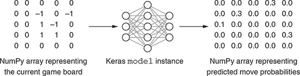

##### 列表 6.13\. 加载和预处理之前存储的 Go 棋局数据

```
import numpy as np
from keras.models import Sequential
from keras.layers import Dense

np.random.seed(123)                                     *1*
X = np.load('../generated_games/features-40k.npy')      *2*
Y = np.load('../generated_games/labels-40k.npy')
samples = X.shape[0]
board_size = 9 * 9

X = X.reshape(samples, board_size)                      *3*
Y = Y.reshape(samples, board_size)

train_samples = int(0.9 * samples)                      *4*
X_train, X_test = X[:train_samples], X[train_samples:]
Y_train, Y_test = Y[:train_samples], Y[train_samples:]
```

+   ***1* 通过设置随机种子，你可以确保这个脚本是完全可复制的。**

+   ***2* 将样本数据加载到 NumPy 数组中。**

+   ***3* 将输入转换为 81 维的向量，而不是 9×9 的矩阵。**

+   ***4* 保留 10%的数据作为测试集；其余 90%用于训练。**

接下来，让我们定义并运行一个模型来预测你刚刚定义的特征*X*和标签*Y*的围棋移动。对于一个 9×9 的棋盘，有 81 种可能的移动，所以你需要用你的网络预测 81 个类别。作为一个基线，假设你只是闭上眼睛，随机在棋盘上指一个点。你有 1/81 的机会通过纯粹的运气找到下一个移动，或者 1.2%。所以你希望看到你的模型显著超过 1.2%的准确率。

你定义了一个简单的 Keras MLP，包含三个`Dense`层，每个层都有`sigmoid`激活函数，你用均方误差损失和随机梯度下降优化器来编译它。然后你让这个网络训练 15 个周期，并在测试数据上评估它。

##### 列表 6.14\. 在生成的围棋数据上运行 Keras 多层感知器

```
model = Sequential()
model.add(Dense(1000, activation='sigmoid', input_shape=(board_size,)))
model.add(Dense(500, activation='sigmoid'))
model.add(Dense(board_size, activation='sigmoid'))
model.summary()

model.compile(loss='mean_squared_error',
              optimizer='sgd',
              metrics=['accuracy'])

model.fit(X_train, Y_train,
          batch_size=64,
          epochs=15,
          verbose=1,
          validation_data=(X_test, Y_test))

score = model.evaluate(X_test, Y_test, verbose=0)
print('Test loss:', score[0])
print('Test accuracy:', score[1])
```

运行此代码，你应该会在控制台看到模型摘要和评估指标打印出来：

```
_________________________________________________________________
Layer (type)                 Output Shape              Param #
=================================================================
dense_1 (Dense)              (None, 1000)              82000
_________________________________________________________________
dense_2 (Dense)              (None, 500)               500500
_________________________________________________________________
dense_3 (Dense)              (None, 81)                40581
=================================================================
Total params: 623,081
Trainable params: 623,081
Non-trainable params: 0
_________________________________________________________________

...

Test loss: 0.0129547887068
Test accuracy: 0.0236486486486
```

注意输出中的行`Trainable params: 623,081`；这意味着训练过程正在更新超过 600,000 个单独权重的值。这是模型计算强度的粗略指标。它也给你一个关于模型*容量*的粗略感觉：其学习复杂关系的能力。当你比较不同的网络架构时，参数的总数提供了一个方法来大致比较模型的总大小。

正如你所见，你实验的预测准确率只有大约 2.3%，乍一看并不令人满意。但回想一下，你随机猜测移动的基线大约是 1.2%。这告诉你，尽管性能并不出色，但模型正在学习，并且能够比随机猜测更好地预测移动。

你可以通过向模型提供样本棋盘位置来了解模型的一些信息。图 6.4 展示了我们设计的一个棋盘，使得正确的移动显而易见。下一个回合的玩家可以在 A 或 B 处移动，从而捕获两个对手的棋子。这个位置并不出现在我们的训练集中。

##### 图 6.4\. 测试我们模型的示例游戏位置。在这个位置，黑方可以通过在 A 处移动来捕获两个棋子，或者白方可以通过在 B 处移动来捕获两个棋子。在那个区域首先移动的一方在游戏中拥有巨大的优势。

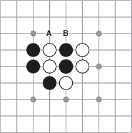

现在，你可以将这个棋盘位置输入到训练好的模型中，并打印出它的预测结果。

##### 列表 6.15\. 在已知棋盘位置上评估模型

```
test_board = np.array([[
    0, 0,  0,  0,  0, 0, 0, 0, 0,
    0, 0,  0,  0,  0, 0, 0, 0, 0,
    0, 0,  0,  0,  0, 0, 0, 0, 0,
    0, 1, -1,  1, -1, 0, 0, 0, 0,
    0, 1, -1,  1, -1, 0, 0, 0, 0,
    0, 0,  1, -1,  0, 0, 0, 0, 0,
    0, 0,  0,  0,  0, 0, 0, 0, 0,
    0, 0,  0,  0,  0, 0, 0, 0, 0,
    0, 0,  0,  0,  0, 0, 0, 0, 0,
]])
move_probs = model.predict(test_board)[0]
i = 0
for row in range(9):
    row_formatted = []
    for col in range(9):
        row_formatted.append('{:.3f}'.format(move_probs[i]))
        i += 1
    print(' '.join(row_formatted))
```

输出看起来像这样：

```
0.037 0.037 0.038 0.037 0.040 0.038 0.039 0.038 0.036
0.036 0.040 0.040 0.043 0.043 0.041 0.042 0.039 0.037
0.039 0.042 0.034 0.046 0.042 0.044 0.039 0.041 0.038
0.039 0.041 0.044 0.046 0.046 0.044 0.042 0.041 0.038
0.042 0.044 0.047 0.041 0.045 0.042 0.045 0.042 0.040
0.038 0.042 0.045 0.045 0.045 0.042 0.045 0.041 0.039
0.036 0.040 0.037 0.045 0.042 0.045 0.037 0.040 0.037
0.039 0.040 0.041 0.041 0.043 0.043 0.041 0.038 0.037
0.036 0.037 0.038 0.037 0.040 0.039 0.037 0.039 0.037
```

这个矩阵映射到原始的 9×9 棋盘：每个数字代表模型在下一个点下棋的信心。这个结果并不太令人印象深刻；它甚至还没有学会不在已经有棋子的地方下棋。但请注意，棋盘边缘的分数始终低于靠近中心的分数。围棋的常规智慧是，你应该避免在棋盘的边缘下棋，除非是在游戏结束时或其他特殊情况下。所以模型已经学习了一个关于游戏的合法概念：不是通过理解策略或效率，而是仅仅通过复制我们的 MCTS 机器人所做的。这个模型不太可能预测出很多出色的走法，但它已经学会了避免一类糟糕的走法。

这确实是一个进步，但你还能做得更好。本章的其余部分将解决你第一次实验的不足，并在提高围棋走法预测准确性的过程中进行改进。你需要注意以下要点：

+   你用于这个预测任务的数据是通过使用树搜索生成的，它具有强烈的随机性元素。有时 MCTS 引擎会生成奇怪的走法，尤其是在游戏领先或落后很多的情况下。在第七章（chapter 7）中，你将创建一个从人类游戏玩法中学习深度学习模型。当然，人类也是不可预测的，但他们不太可能玩出无意义的走法。

+   你使用的神经网络架构可以大幅改进。多层感知器不适合捕捉围棋盘数据。你必须将二维的棋盘数据展平成一个扁平向量，从而丢失了关于棋盘的所有空间信息。在第 6.4 节（section 6.4）中，你将了解一种新的网络类型，它非常适合捕捉围棋盘结构。

+   在迄今为止的所有网络中，你只使用了`sigmoid`激活函数。在第 6.5 节（sections 6.5）和 6.6 节（6.6）中，你将了解两种新的激活函数，它们通常会导致更好的结果。

+   到目前为止，你只将 MSE 用作损失函数，这是直观的，但并不适合你的用例。在第 6.5 节（section 6.5）中，你将使用一个针对我们这种分类任务定制的损失函数。

在解决这些问题的大部分之后，在本章结束时，你将能够构建一个比你的第一次尝试预测更好的神经网络。你将在第七章（chapter 7）中学习构建一个显著更强的机器人的关键技巧。

请记住，最终，你感兴趣的并不是尽可能准确地预测走法，而是创建一个尽可能会玩的机器人。即使你的深度神经网络可能永远不会从历史数据中预测出非常出色的下一步，深度学习的力量在于它们仍然会隐式地学习游戏的*结构*，并玩出合理甚至非常好的走法。

### 6.4\. 使用卷积网络分析空间

在围棋中，你经常会看到石头排列的特定局部模式反复出现。人类玩家学会识别这些形状中的几十种，并且经常给它们起一些富有启发性的名字（比如*老虎嘴*、*竹节*，或者我个人最喜欢的，*毛毛六*）。为了像人类一样做出决策，我们的围棋 AI 也必须识别许多局部的空间排列。一种称为*卷积网络*的特定类型的神经网络专门设计用于检测这种空间关系。卷积神经网络，或 CNN，在游戏之外有许多应用：你会在图像、音频甚至文本中找到它们。本节展示了如何构建 CNN 并将它们应用于围棋游戏数据。首先，我们介绍卷积的概念。接下来，我们展示如何在 Keras 中构建 CNN。最后，我们展示了处理卷积层输出的有用方法。

#### 6.4.1\. 什么是直观上的卷积

卷积层以及我们从它们构建的网络得名于计算机视觉中的一个传统操作：*卷积*。卷积是一种直接将图像或应用过滤器的方式。对于两个相同大小的矩阵，简单的卷积是通过以下步骤计算的：

1.  将这两个矩阵逐元素相乘

1.  求和结果矩阵的所有值

这样简单卷积的输出是一个标量值。图 6.5 展示了这种操作的例子，通过卷积两个 3×3 矩阵来计算一个标量。

##### 图 6.5\. 在简单的卷积中，你将两个相同大小的矩阵逐元素相乘，然后求和所有值。

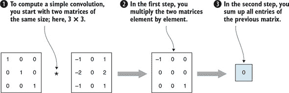

这些简单的卷积本身并不能立即帮助你，但它们可以用来计算更复杂的卷积，这些卷积对于你的用例非常有用。不是从两个相同大小的矩阵开始，让我们固定第二个矩阵的大小，并任意增加第一个矩阵的大小。在这种情况下，你称第一个矩阵为*输入图像*，第二个矩阵为*卷积核*，或者简单地称为*核*（有时你也看到使用*过滤器*）。因为核比输入图像小，你可以在输入图像的许多*块*上计算简单的卷积。在图 6.6 中，你可以看到这种卷积操作的实例，一个 10×10 的输入图像与一个 3×3 的核进行卷积操作。

##### 图 6.6\. 通过在输入图像的块上传递卷积核，你可以计算图像与核的卷积。在这个例子中选择的核是一个垂直边缘检测器。

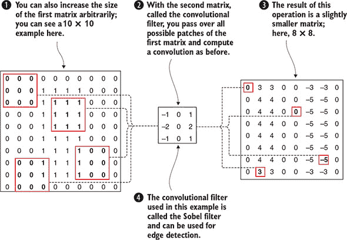

图 6.6 中的例子可能会让你对为什么卷积对我们来说很有趣有一个初步的了解。输入图像是一个由 1s 组成的 10 × 10 矩阵，中心是一个 4 × 8 的块，周围是 0。核的选择使得矩阵的第一列（-1, -2, -1）是第三列（-1, -2, -1）的相反数，中间列全是 0。因此，以下各点是正确的：

+   无论何时你将这个核应用于输入图像的 3 × 3 块，其中所有像素值都相同，卷积的输出将是 0。

+   当你将这个卷积核应用于一个左列值高于右列的图像块时，卷积结果将是负数。

+   当你将这个卷积核应用于一个右列值高于左列的图像块时，卷积结果将是正数。

卷积核被选择来检测输入图像中的*垂直边缘*。物体左侧的边缘将具有正值；右侧的边缘将具有负值。这正是你在图 6.6 中卷积的结果中可以看到的。

图 6.6 中的核是许多应用中使用的经典核，称为*索贝尔核*。如果你将这个核旋转 90 度，你将得到一个水平边缘检测器。同样，你可以定义卷积核来模糊或锐化图像，检测角点，以及许多其他功能。许多这些核可以在标准的图像处理库中找到。

有趣的是，可以看到卷积可以用来从图像数据中提取有价值的信息，这正是你从围棋数据中预测下一步的目的。尽管在先前的例子中我们选择了一个特定的卷积核，但在神经网络中使用卷积的方式是，这些核通过反向传播从数据中学习。

到目前为止，我们讨论了如何将一个卷积核应用于一个输入图像。一般来说，将多个核应用于多个图像以产生多个输出图像是有用的。你该如何做呢？假设你有四个输入图像并定义了四个核。然后你可以对每个输入的卷积进行求和，得到一个输出图像。在接下来的内容中，你将称这种卷积的输出图像为*特征图*。现在，如果你想得到五个结果特征图而不是一个，你可以在每个输入图像上定义五个核而不是一个。通过使用*n* × *m*个卷积核将*n*个输入图像映射到*m*个特征图，称为*卷积层*。图 6.7 说明了这种情况。

##### 图 6.7。在一个卷积层中，多个输入图像通过卷积核进行处理，以产生指定数量的特征图。

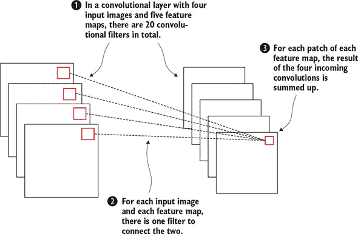

从这个角度来看，卷积层是将多个输入图像转换为输出图像的一种方式，从而提取输入的相关空间信息。特别是，正如你可能预料的那样，卷积层可以**串联**，从而形成一个由卷积层组成的神经网络。通常，只由卷积层和密集层组成的网络被称为**卷积神经网络**，或简称**卷积网络**。


**深度学习中的张量**

我们指出卷积层的输出是一系列图像。虽然这样想确实有助于理解，但其中还有更多内容。正如向量（一维）由单个条目组成，它们不仅仅是数字的集合。同样，矩阵（二维）由列向量组成，但具有矩阵乘法和其他操作（如卷积）中使用的固有二维结构。卷积层的输出具有三维结构。卷积层中的过滤器甚至还有一个维度，具有四维结构（每个输入和输出图像组合都有一个二维过滤器）。而且这还没有结束——高级深度学习技术通常处理更高维度的数据结构。

在线性代数中，向量和矩阵的高维等价物是**张量**。附录 A 中会详细介绍，但在这里我们无法给出张量的定义。在这本书的其余部分，你不需要任何正式的张量定义。但除了听说过这个概念外，张量为我们提供了在后续章节中使用的方便术语。例如，从卷积层输出的图像集合可以被称为 3-张量。卷积层中的 4 维过滤器形成了一个 4-张量。因此，可以说卷积是一个操作，其中 4-张量（卷积过滤器）作用于 3-张量（输入图像），将其转换为另一个 3-张量。

更一般地说，可以说一个序列神经网络是一种逐步转换不同维度张量的机制。这种通过使用张量使输入数据“流动”通过网络的想法导致了 TensorFlow 这个名称，这是谷歌流行的机器学习库，你将使用它来运行你的 Keras 模型。


注意，在所有这些讨论中，我们只讨论了如何将数据通过卷积层，但没有讨论反向传播的工作方式。我们故意省略了这部分内容，因为它在数学上超出了本书的范围，但更重要的是，Keras 会为我们处理反向传播。

通常，卷积层的参数数量比相应的密集层要少得多。如果你在 28 × 28 输入图像上定义一个大小为 (3, 3) 的卷积层，导致输出大小为 26 × 26，那么卷积层将有 3 × 3 = 9 个参数。在卷积层中，你通常还会有一个添加到每个卷积输出的 *偏置项*，从而总共达到 10 个参数。如果你将此与连接 28 × 28 长度输入向量到 26 × 26 长度输出向量的密集层进行比较，这样的密集层将有 28 × 28 × 26 × 26 = 529,984 个参数，不包括偏置项。同时，卷积操作在计算上比密集层中使用的常规矩阵乘法更昂贵。

#### 6.4.2\. 使用 Keras 构建卷积神经网络

要使用 Keras 构建和运行卷积神经网络，你需要与一种新的层类型 `Conv2D` 一起工作，该层对二维数据进行卷积，例如围棋棋盘数据。你还将了解另一个名为 `Flatten` 的层，它将卷积层的输出展平为向量，然后可以将其输入到密集层。

首先，你的输入数据的预处理步骤现在看起来与之前略有不同。你不再展平围棋棋盘，而是保持其二维结构完整。

##### 列表 6.16\. 加载和预处理用于卷积神经网络的围棋数据

```
import numpy as np
from keras.models import Sequential
from keras.layers import Dense
from keras.layers import Conv2D, Flatten            *1*

np.random.seed(123)
X = np.load('../generated_games/features-40k.npy')
Y = np.load('../generated_games/labels-40k.npy')

samples = X.shape[0]
size = 9
input_shape = (size, size, 1)                       *2*

X = X.reshape(samples, size, size, 1)               *3*

train_samples = int(0.9 * samples)
X_train, X_test = X[:train_samples], X[train_samples:]
Y_train, Y_test = Y[:train_samples], Y[train_samples:]
```

+   ***1* 导入两个新的层，一个 2D 卷积层和一个将输入展平为向量的层。**

+   ***2* 输入数据形状是三维的；你使用 9 × 9 棋盘表示的一个平面。**

+   ***3* 然后相应地调整你的输入数据。**

现在，你可以使用 Keras 的 `Conv2D` 对象来构建网络。你使用两个卷积层，然后将第二个卷积层的输出 *展平*，接着添加两个密集层，以得到之前的大小 9 × 9 的输出。

##### 列表 6.17\. 使用 Keras 为围棋数据构建简单的卷积神经网络

```
model = Sequential()
model.add(Conv2D(filters=48,                         *1*
                 kernel_size=(3, 3),                 *2*
                 activation='sigmoid',
                 padding='same',                     *3*
                 input_shape=input_shape))

model.add(Conv2D(48, (3, 3),                         *4*
                 padding='same',
                 activation='sigmoid'))

model.add(Flatten())                                 *5*

model.add(Dense(512, activation='sigmoid'))
model.add(Dense(size * size, activation='sigmoid'))  *6*
model.summary()
```

+   ***1* 你的网络中的第一层是一个具有 48 个输出滤波器的 Conv2D 层。**

+   ***2* 对于这个层，你选择一个 3 × 3 的卷积核。**

+   ***3* 通常，卷积的输出小于输入。通过添加 padding='same'，你要求 Keras 在矩阵边缘填充 0，以便输出与输入具有相同的维度。**

+   ***4* 第二层是另一个卷积。为了简洁起见，你省略了 filters 和 kernel_size 参数。**

+   ***5* 然后展平之前卷积层的 3D 输出...**

+   ***6* ...然后像在 MLP 示例中那样添加两个更多的密集层。**

该模型的编译、运行和评估可以与 MLP 示例中的完全相同。你唯一改变的是输入数据形状和模型本身的指定。

如果你运行前面的模型，你会看到测试准确率几乎没有变化：它应该再次落在 2.3%左右。这完全没问题——你还有一些技巧可以解锁卷积模型的全威力。在本章的剩余部分，你将介绍更多高级的深度学习技术来提高你的移动预测准确率。

#### 6.4.3. 使用池化层减少空间

你会在大多数具有卷积层的深度学习应用中找到的一种常见技术是*池化*。你使用池化来缩小图像，以减少前一层中的神经元数量。

池化概念很容易解释：通过将图像的图像块分组或池化成一个单一值来下采样图像。图 6.8 的例子展示了如何通过只保留图像中每个不重叠的 2×2 块中的最大值，将图像按 4 倍因子切割。

##### 图 6.8. 通过应用 2×2 最大池化核将 8×8 图像减少到大小为(4, 4)的图像

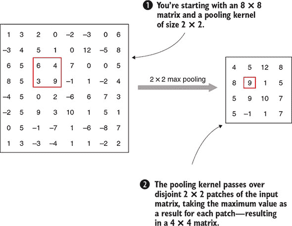

这种技术称为*最大池化*，用于池化的不重叠块的大小被称为*池大小*。你也可以定义其他类型的池化；例如，计算块中值的平均值。这个版本被称为*平均池化*。

你可以定义一个神经网络层，通常位于卷积层之前或之后，如下所示。

##### 列表 6.18. 在 Keras 模型中添加大小为(2, 2)的最大池化层

```
model.add(MaxPooling2D(pool_size=(2, 2)))
```

你还可以在列表 6.4 中尝试用`AveragePooling2D`替换`MaxPooling2D`。在图像识别等情况下，池化在实践中通常不可或缺，用于减少卷积层的输出大小。尽管通过下采样图像操作会丢失一些信息，但它通常会保留足够的信息以进行准确的预测，同时大幅减少所需的计算量。

在你看到池化层实际应用之前，让我们讨论一些其他工具，这些工具将使你的围棋移动预测更加准确。

### 6.5. 预测围棋移动概率

自从我们在第五章首次介绍神经网络以来，你一直只使用了一个激活函数：逻辑 sigmoid 函数。而且，你一直使用均方误差作为损失函数。这两个选择都是好的起点，并且在你的深度学习工具箱中当然有它们的位置，但它们并不特别适合我们的用例。

最后，当你预测围棋走法时，你真正追求的是这个问题：对于棋盘上每个可能的走法，这个走法成为下一步的概率有多大？在每一个时间点，棋盘上通常有很多好的走法。你设置你的深度学习实验，从算法中输入的数据中找到 *下一个* 走法，但最终，表示学习和深度学习，特别是深度学习的承诺是，你可以了解足够多的游戏结构来预测走法的可能性。你想要预测所有可能走法的 *概率分布*。这不能通过 sigmoid 激活函数来保证。相反，你引入了 softmax 激活函数，它在最后一层用于预测概率。

#### 6.5.1\. 在最后一层使用 softmax 激活函数

softmax 激活函数是对逻辑 sigmoid σ 的直接推广。为了计算向量 *x* = (*x*[1], ..., *x[l]*) 的 softmax 函数，你首先对每个分量应用指数函数；你计算 *ex[i]*。然后你将这些值中的每一个通过所有值的总和进行归一化：

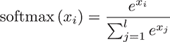

根据定义，softmax 函数的分量都是非负的，并且加起来等于 1，这意味着 softmax 输出的是概率。让我们计算一个例子来看看它是如何工作的。

##### 列表 6.19\. 在 Python 中定义 softmax 激活函数

```
import numpy as np

def softmax(x):
    e_x = np.exp(x)
    e_x_sum = np.sum(e_x)
    return e_x / e_x_sum

x = np.array([100, 100])
print(softmax(x))
```

在 Python 中定义 softmax 之后，你在一个长度为 2 的向量上计算它；即，*x* = (100, 100)。如果你计算 *x* 的 sigmoid，结果将接近 (1, 1)。但是计算这个示例的 softmax 得到的是 (0.5, 0.5)。这正是你所期望的：因为 softmax 函数的值加起来等于 1，而且两个条目都是相同的，softmax 将两个分量分配了相同的概率。

通常情况下，你会在神经网络的最外层看到 softmax 激活函数被用作激活函数，这样你可以确保预测输出概率。

##### 列表 6.20\. 向 Keras 模型添加大小为 (2, 2) 的最大池化层

```
model.add(Dense(9*9, activation='softmax'))
```

#### 6.5.2\. 用于分类问题的交叉熵损失

在上一章中，你开始使用均方误差作为你的损失函数，我们指出这并不是你用例的最佳选择。为了继续这个话题，让我们更仔细地看看可能出错的地方，并提出一个可行的替代方案。

回想一下，你将你的动作预测用例表述为一个*分类问题*，其中你有 9 × 9 个可能的类别，只有一个类别是正确的。正确的类别被标记为 1，所有其他类别都被标记为 0。你对每个类别的预测将始终是一个介于 0 和 1 之间的值。这是对你预测数据外观的强烈假设，你使用的损失函数应该反映这一点。如果你看看 MSE 做了什么，它取预测和标签之间差异的平方，它没有使用你被限制在 0 到 1 范围内的这一事实。实际上，MSE 最适合*回归问题*，其中输出是一个连续的范围。想想预测一个人的身高。在这种情况下，MSE 会惩罚*大的*差异。在你的场景中，预测和实际结果之间最大的绝对差异是 1。

MSE 的另一个问题是它以相同的方式惩罚所有 81 个预测值。最终，你只关心预测正确的类别，即标记为 1 的类别。假设你有一个模型，它用 0.6 的值预测正确的动作，其他所有动作都是 0，除了一个，模型将其分配为 0.4。在这种情况下，均方误差是(1 – 0.6)² + (0 – 0.4)² = 2 × 0.4²，大约是 0.32。你的预测是正确的，但你将相同的损失值分配给所有非零预测：大约是 0.16。这真的值得对较小的值给予同样的重视吗？如果你将这种情况与正确的动作再次得到 0.6，但两个其他动作被预测为 0.2 的情况进行比较，那么 MSE 是(0.4)² + 2 × 0.2²，大约是 0.24，比前一种情况低得多。但如果是 0.4 的值确实更准确，即它只是一个*也可能成为下一个动作候选者*的强动作，你应该真的用你的损失函数来惩罚它吗？

为了解决这些问题，我们引入了*分类交叉熵损失函数*，或简称为*交叉熵损失*。对于模型的标签*ŷ*和预测*y*，这个损失函数的定义如下：

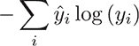

注意，尽管这看起来像是由许多项组成的和，涉及大量的计算，但对于我们的用例来说，这个公式简化为只有一个项：即*ŷ[i]*为 1 的那个项。对于*ŷ[i]* = 1 的索引*i*，交叉熵误差简单地是 –log(*y[i]*)。这很简单，但你从中得到了什么？

+   因为交叉熵损失只惩罚标签为 1 的项，所以其他所有值的分布不会直接受到影响。特别是，在你预测下一个动作的概率为 0.6 的情况下，将一个其他动作赋予 0.4 的概率或两个动作各赋予 0.2 的概率之间没有区别。在两种情况下，交叉熵损失都是 –log(0.6) = 0.51。

+   交叉熵损失针对的范围是 [0,1]。如果你的模型预测了一个实际发生的动作的概率为 0，那么这是最错误的情况。你知道 log(1) = 0，并且当 *x* 在 0 和 1 之间时，-log(*x*) 随着 *x* 接近 0 而趋近于无穷大，这意味着 -log(*x*) 变得任意大（而不仅仅是平方增长，如 MSE）。

+   此外，当 *x* 接近 1 时，均方误差下降得更快，这意味着对于不太确定的预测，你会得到更小的损失。图 6.9 给出了 MSE 和交叉熵损失的视觉比较。

##### 图 6.9. 标记为 1 的类的 MSE 与交叉熵损失的对比图。交叉熵损失将 [0,1] 范围内的每个值分配更高的损失。

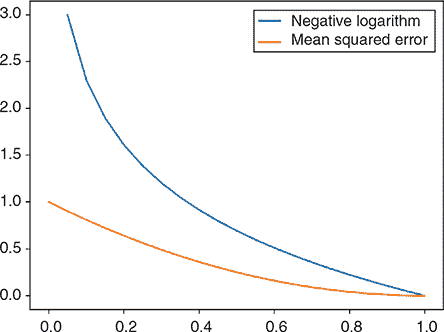

另一个区分交叉熵损失和均方误差的关键点是它在使用随机梯度下降（SGD）进行*学习*时的行为。事实上，随着你接近更高的预测值（*y* 越来越接近 1），均方误差的梯度更新会越来越小；学习通常会减慢。相比之下，交叉熵损失在 SGD 中没有显示出这种减速，参数更新与预测值和真实值之间的差异成正比。我们这里不深入细节，但这对我们移动预测用例来说是一个巨大的好处。

使用分类交叉熵损失而不是 MSE 编译 Keras 模型，同样简单易行。

##### 列表 6.21. 使用分类交叉熵编译 Keras 模型

```
model.compile(loss='categorical_crossentropy'...)
```

在你的工具箱中有了交叉熵损失和 softmax 激活，你现在处理分类标签和用神经网络预测概率的能力大大增强。为了完成这一章，让我们添加两种技术，这将使你能够构建更深的网络——具有更多层的网络。

### 6.6. 使用 dropout 和修正线性单元构建更深的网络

到目前为止，你还没有构建超过两到四层的神经网络。可能会让人想只是添加更多相同类型的层，希望结果会改善。如果这样简单就好了，但在实践中，你需要考虑几个方面。虽然不断构建更深层次的神经网络会增加模型拥有的参数数量，从而提高其适应输入数据的适应能力，但你可能会遇到一些问题。可能导致失败的主要原因之一是 *过拟合*：你的模型在预测 *训练* 数据方面越来越好，但在 *测试* 数据上的表现不佳。如果到了极端，一个能够几乎完美预测，甚至记住之前所见，但面对稍微不同的数据却不知道如何应对的模型是没有用的。你需要能够进行泛化。这在预测像围棋这样复杂的游戏中的下一步尤其重要。无论你花多少时间收集训练数据，在游戏过程中总会出现模型之前未曾遇到的情况。无论如何，找到强有力的下一步是非常重要的。

#### 6.6.1\. 通过丢弃神经元进行正则化

防止过拟合是机器学习中一个常见的挑战。你可以找到很多关于旨在解决过拟合问题的 *正则化技术* 的文献。对于深度神经网络，你可以应用一个简单而有效的技术，称为 *dropout*。在网络的层上应用 dropout，对于每个训练步骤，你随机选择一定数量的神经元并将其设置为 0；你将这些神经元完全从训练过程中 *丢弃*。在每个训练步骤中，你随机选择新的神经元进行丢弃。这通常通过指定一个 *dropout rate*，即当前层的神经元丢弃百分比来完成。 展示了一个示例 dropout 层，其中每个小批量（正向和反向传播）以概率丢弃一半的神经元。

##### 图 6.10\. 一个具有 50% 丢弃率的 `dropout` 层会在网络中为每个输入到网络的数据的小批量随机丢弃一半的神经元。

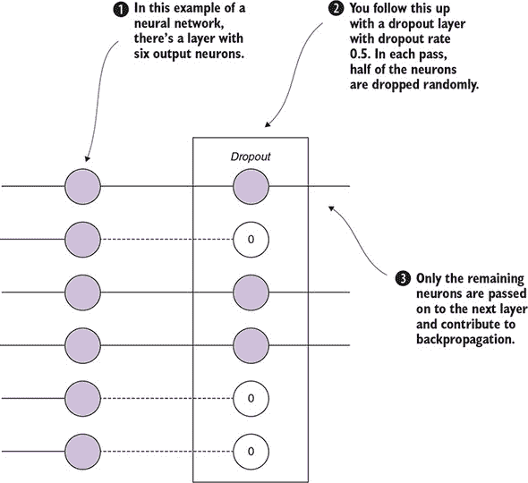

这个过程的原理是通过随机丢弃神经元，防止单个层，以及整个网络对给定数据过度专门化。层必须足够灵活，不要过度依赖单个神经元。通过这样做，你可以防止你的神经网络过拟合。

在 Keras 中，你可以通过以下方式定义具有 `dropout` `rate` 的 `Dropout` 层。

##### 列表 6.22\. 将 `Dropout` 层导入并添加到 Keras 模型中

```
from keras.layers import Dropout

...
model.add(Dropout(rate=0.25))
```

你可以在顺序网络中，在每一层之前或之后添加 `dropout` 层。特别是在更深的架构中，添加 `dropout` 层通常是必不可少的。

#### 6.6.2\. 矩形线性单元激活函数

作为本章的最后一个构建块，你将了解*修正线性单元*（ReLU）激活函数，它最终往往比 sigmoid 和其他激活函数对深度网络产生更好的结果。图 6.11 显示了 ReLU 的样子。

##### 图 6.11. ReLU 激活函数将负输入设置为 0，而将正输入保持不变。

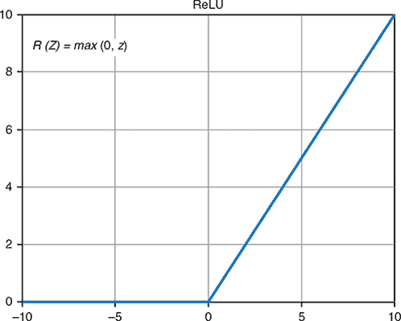

ReLU 通过将它们设置为 0 来忽略负输入，并返回未更改的正输入。正信号越强，ReLU 的激活作用就越强。根据这种解释，修正线性单元激活函数与大脑中神经元的一个简单模型非常接近，其中弱信号被忽略，但强信号会导致神经元放电。除了这个基本类比之外，我们不会为或反对 ReLU 的任何理论优势进行辩论，但只是指出，使用它们通常会导致令人满意的结果。要在 Keras 中使用 ReLU，你只需在层的`activation`参数中将`sigmoid`替换为`relu`。

##### 列表 6.23. 向`Dense`层添加修正线性激活

```
from keras.layers import Dense

...
model.add(Dense(activation='relu'))
```

### 6.7. 将所有内容组合起来以增强围棋走法预测网络

前面的章节涵盖了大量的内容，不仅介绍了带有最大池化层的卷积网络，还介绍了交叉熵损失、最后一层的 softmax 激活、用于正则化的 dropout 以及 ReLU 激活来提高网络的性能。为了结束本章，让我们将你所学到的每一个新元素组合到一个神经网络中，用于你的围棋走法预测用例，并看看你现在做得怎么样。

首先，让我们回顾一下如何加载使用简单单平面编码器编码的围棋数据，并将其重塑为卷积网络。

##### 列表 6.24. 加载和预处理用于卷积神经网络的围棋数据

```
import numpy as np
from keras.models import Sequential
from keras.layers import Dense, Dropout, Flatten
from keras.layers import Conv2D, MaxPooling2D

np.random.seed(123)
X = np.load('../generated_games/features-40k.npy')
Y = np.load('../generated_games/labels-40k.npy')

samples = X.shape[0]
size = 9
input_shape = (size, size, 1)

X = X.reshape(samples, size, size, 1)

train_samples = int(0.9 * samples)
X_train, X_test = X[:train_samples], X[train_samples:]
Y_train, Y_test = Y[:train_samples], Y[train_samples:]
```

接下来，让我们按照以下方式增强你之前的卷积网络列表 6.3：

+   保持基本架构不变，从两个卷积层开始，然后是一个最大池化层，最后是两个密集层来完成。

+   添加三个 dropout 层进行正则化：在每个卷积层之后以及第一个密集层之后各一个。使用 50%的 dropout 率。

+   将输出层更改为 softmax 激活，并将内部层更改为 ReLU 激活。

+   将损失函数改为交叉熵损失，而不是均方误差。

让我们看看这个模型在 Keras 中的样子。

##### 列表 6.25. 使用 dropout 和 ReLU 构建用于围棋数据的卷积网络

```
model = Sequential()
model.add(Conv2D(48, kernel_size=(3, 3),
                 activation='relu',
                 padding='same',
                 input_shape=input_shape))
model.add(Dropout(rate=0.5))
model.add(Conv2D(48, (3, 3),
                 padding='same', activation='relu'))
model.add(MaxPooling2D(pool_size=(2, 2)))
model.add(Dropout(rate=0.5))
model.add(Flatten())
model.add(Dense(512, activation='relu'))
model.add(Dropout(rate=0.5))
model.add(Dense(size * size, activation='softmax'))
model.summary()

model.compile(loss='categorical_crossentropy',
              optimizer='sgd',
              metrics=['accuracy'])
```

最后，为了评估这个模型，你可以运行以下代码。

##### 列表 6.26. 评估增强的卷积网络

```
model.fit(X_train, Y_train,
          batch_size=64,
          epochs=100,
          verbose=1,
          validation_data=(X_test, Y_test))
score = model.evaluate(X_test, Y_test, verbose=0)
print('Test loss:', score[0])
print('Test accuracy:', score[1])
```

注意，这个例子将 epoch 的数量增加到 100，而你之前使用的是 15。输出看起来大致如下：

```
_________________________________________________________________
Layer (type)                 Output Shape              Param #
=================================================================
conv2d_1 (Conv2D)            (None, 9, 9, 48)          480
_________________________________________________________________
dropout_1 (Dropout)          (None, 9, 9, 48)          0
_________________________________________________________________
conv2d_2 (Conv2D)            (None, 9, 9, 48)          20784
_________________________________________________________________
max_pooling2d_1 (MaxPooling2 (None, 4, 4, 48)          0
_________________________________________________________________
dropout_2 (Dropout)          (None, 4, 4, 48)          0
_________________________________________________________________
flatten_1 (Flatten)          (None, 768)               0
_________________________________________________________________
dense_1 (Dense)              (None, 512)               393728
_________________________________________________________________
dropout_3 (Dropout)          (None, 512)               0
_________________________________________________________________
dense_2 (Dense)              (None, 81)                41553
=================================================================
Total params: 456,545
Trainable params: 456,545
Non-trainable params: 0
_________________________________________________________________
...
Test loss: 3.81980572336
Test accuracy: 0.0834942084942
```

使用这个模型，你的测试准确度上升到超过 8%，这比你的基线模型有显著的提升。此外，注意输出中的`Trainable params: 456,545`。回想一下，你的基线模型有超过 600,000 个可训练参数。在将准确度提高三倍的同时，你也减少了权重的数量。这意味着改进的功劳必须归功于你新模型的*结构*，而不仅仅是其大小。

在负面方面，训练时间大大延长，这在很大程度上是因为你增加了 epoch 的数量。这个模型正在学习更复杂的概念，需要更多的训练遍历。如果你有耐心将`epochs`设置得更高，你可以用这个模型提高几个百分点的准确度。第七章介绍了可以加快这一过程的先进优化器。

接下来，让我们将示例棋盘输入到模型中，看看它推荐了哪些走法：

```
0.000 0.001 0.001 0.002 0.001 0.001 0.000 0.000 0.000
0.001 0.006 0.011 0.023 0.017 0.010 0.005 0.002 0.000
0.001 0.011 0.001 0.052 0.037 0.026 0.001 0.003 0.001
0.002 0.020 0.035 0.045 0.043 0.030 0.014 0.006 0.001
0.003 0.020 0.030 0.031 0.039 0.039 0.018 0.007 0.001
0.001 0.021 0.033 0.048 0.050 0.032 0.017 0.006 0.001
0.001 0.010 0.001 0.039 0.035 0.022 0.001 0.004 0.001
0.000 0.006 0.008 0.017 0.017 0.010 0.007 0.002 0.000
0.000 0.000 0.001 0.001 0.002 0.001 0.001 0.000 0.000
```

棋盘上评分最高的走法得分为 0.052——对应于图 6.4 中的点 A，那里黑方吃掉了两个白子。你的模型可能还不是一位大师级的战术家，但它确实学到了一些关于吃子的事情！当然，结果远非完美：它仍然会给很多已经有子的情况赋予高分数。

到目前为止，我们鼓励你尝试这个模型并看看会发生什么。以下是一些帮助你开始的想法：

+   在这个问题上最有效的是最大池化、平均池化，还是不池化？（记住，移除池化层会增加模型中的可训练参数数量；所以如果你看到任何额外的准确度，请记住你是在用额外的计算来支付这笔费用。）

+   添加第三个卷积层，还是增加现有两个层的滤波器数量更有效？

+   你可以将倒数第二层的`Dense`层缩小到多小，同时还能得到良好的结果？

+   你能否通过改变 dropout 率来提高结果？

+   不使用卷积层，你能将模型的准确度提升到多高？该模型的大小和训练时间与你的 CNN 最佳结果相比如何？

在下一章中，你将应用在这里学到的所有技术来构建一个在真实游戏数据上训练的深度学习围棋机器人，而不仅仅是模拟游戏。你还将看到编码输入的新方法，这将提高模型性能。结合这些技术，你可以构建一个能够做出合理走法并且至少能击败初学者的机器人。

### 6.8. 摘要

+   使用编码器，你可以将围棋棋盘状态转换为神经网络的输入，这是将深度学习应用于围棋的重要第一步。

+   通过树搜索生成围棋数据，为你提供了一个应用神经网络的第一个围棋数据集。

+   Keras 是一个强大的深度学习库，你可以用它创建许多相关的深度学习架构。

+   使用卷积神经网络，您可以利用输入数据的空间结构来提取相关特征。

+   通过池化层，您可以减小图像大小以降低计算复杂度。

+   在网络的最后一层使用 softmax 激活函数，您可以预测输出概率。

+   将类别交叉熵作为损失函数用于围棋走法预测网络比均方误差更自然。当您试图预测连续范围内的数字时，均方误差更有用。

+   使用 dropout 层，您有一个简单的工具来避免深度网络架构的过拟合。

+   使用 ReLU 激活函数而不是 sigmoid 激活函数可以带来显著的性能提升。

## 第七章. 从数据中学习：深度学习机器人

*本章涵盖*

+   下载和处理实际的围棋游戏记录

+   理解存储围棋的标准格式

+   使用此类数据训练用于走法预测的深度学习模型

+   使用复杂的围棋棋盘编码器来创建强大的机器人

+   运行自己的实验并评估它们

在上一章中，您看到了构建深度学习应用的基本要素，并且构建了一些神经网络来测试您所学的工具。您仍然缺少的是好的学习数据。监督式深度神经网络的好坏取决于您输入的数据——到目前为止，您只有自生成的数据可供使用。

在本章中，您将了解围棋数据最常见的数据格式，即智能游戏格式（SGF）。您可以从几乎每个流行的围棋服务器获取 SGF 格式的历史游戏记录。为了为围棋走法预测的深度神经网络提供动力，在本章中，您将从围棋服务器下载许多 SGF 文件，以智能的方式对它们进行编码，并使用这些数据训练一个神经网络。所得到的训练网络将比早期章节中的任何先前模型都要强大。

图 7.1 展示了本章结束时您可以构建的内容。

##### 图 7.1. 使用真实世界的围棋数据进行深度学习围棋机器人构建。您可以从公共围棋服务器找到用于训练机器人的游戏记录。在本章中，您将学习如何找到这些记录，将它们转换为训练集，并训练一个 Keras 模型来模仿人类玩家的决策。

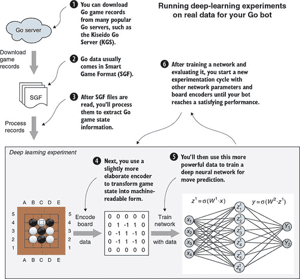

在本章结束时，您可以使用复杂的神经网络进行自己的实验，完全独立地构建一个强大的机器人。要开始，您需要访问真实世界的围棋数据。

### 7.1. 导入围棋游戏记录

到目前为止，你使用的所有 Go 数据都是由你自己生成的。在前一章中，你训练了一个深度神经网络来预测生成数据的走法。你所能期望的最好结果是，你的网络能够完美地预测这些走法，在这种情况下，网络的表现将和生成数据的树搜索算法一样好。从某种意义上说，你输入网络的数据为从它训练的深度学习机器人提供了一个上限。机器人无法超越生成数据的玩家的实力。

通过将强大人类对手对弈的记录作为输入提供给你的深度神经网络，你可以显著提高你机器人的实力。你将使用来自 KGS 围棋服务器（以前称为 Kiseido 围棋服务器）的游戏数据，这是世界上最受欢迎的围棋平台之一。在解释如何从 KGS 下载和处理数据之前，我们首先向你介绍你的围棋数据所采用的数据格式。

#### 7.1.1. SGF 文件格式

智能游戏格式（SGF），最初被称为智能围棋格式，自 80 年代末以来一直在开发。其当前第四个主要版本（表示为 `FF[4]`）在 90 年代末发布。SGF 是一种简单、基于文本的格式，可以用来表达围棋游戏、围棋游戏的变体（例如，专业玩家的扩展游戏评论）以及其他棋类游戏。在本章的其余部分，你将假设你处理的 SGF 文件仅包含没有变体的围棋游戏。在本节中，我们教你一些关于这个丰富游戏格式的基础知识，但如果你想了解更多，可以从 Sensei’s Library 的 [`senseis.xmp.net/?SmartGameFormat`](https://senseis.xmp.net/?SmartGameFormat) 开始学习。

SGF 的核心是关于游戏和走法的元数据。你可以通过两个大写字母来指定元数据，编码一个属性及其对应的值，放在方括号中。例如，在一个 9 × 9 大小的棋盘上进行的围棋游戏在 SGF 中会被编码为 `SZ[9]`。围棋的走法编码如下：棋盘第三行第三列的白色走法在 SGF 中表示为 `W[cc]`，而第七行第三列的黑色走法表示为 `B[gc]`；字母 `B` 和 `W` 代表棋子的颜色，行和列的坐标按字母顺序索引。要表示弃权，你使用空走法 `B[]` 和 `W[]`。

以下 SGF 文件的示例取自 第二章 结尾的完整 9 × 9 示例。它展示了一局围棋游戏（在 SGF 中，围棋的游戏编号为 1，或 `GM[1]`），在当前 SGF 版本（`FF[4]`）下进行，棋盘大小为零（`HA[0]`），白方有 6.5 点的 komi 以补偿黑方先走一步（`KM[6.5]`）。游戏按照日本规则设置（`RU[Japanese]`）进行，最终白方以 9.5 点的胜利结束（`RE[W+9.5]`）：

```
(;FF[4] GM[1] SZ[9] HA[0] KM[6.5] RU[Japanese] RE[W+9.5]
;B[gc];W[cc];B[cg];W[gg];B[hf];W[gf];B[hg];W[hh];B[ge];W[df];B[dg]
;W[eh];B[cf];W[be];B[eg];W[fh];B[de];W[ec];B[fb];W[eb];B[ea];W[da]
;B[fa];W[cb];B[bf];W[fc];B[gb];W[fe];B[gd];W[ig];B[bd];W[he];B[ff]
;W[fg];B[ef];W[hd];B[fd];W[bi];B[bh];W[bc];B[cd];W[dc];B[ac];W[ab]
;B[ad];W[hc];B[ci];W[ed];B[ee];W[dh];B[ch];W[di];B[hb];W[ib];B[ha]
;W[ic];B[dd];W[ia];B[];
 TW[aa][ba][bb][ca][db][ei][fi][gh][gi][hf][hg][hi][id][ie][if]
  [ih][ii]
 TB[ae][af][ag][ah][ai][be][bg][bi][ce][df][fe][ga]
 W[])
```

SGF 文件组织为一系列 *节点*，它们由分号分隔。第一个节点包含关于游戏的数据：棋盘大小、规则集、游戏结果以及其他背景信息。每个后续节点代表游戏中的一步棋。空白字符完全不重要；你可以将整个示例字符串压缩成一行，它仍然是一个有效的 SGF。最后，你还会看到属于白方的领地得分，列在 `TW` 下，以及属于黑方的得分，列在 `TB` 下。请注意，领地指示符是白方最后一步棋（`W[]`，表示弃权）的同一节点的一部分：你可以把它们看作是对游戏中该位置的某种注释。

这个例子说明了 SGF 文件的一些核心属性，并展示了为了生成训练数据而回放游戏记录所需的一切。SGF 格式支持更多功能，但那些主要用于为游戏记录添加注释和说明，所以在这本书中你不需要它们。

#### 7.1.2\. 从 KGS 下载并回放围棋游戏记录

如果你访问页面 [`u-go.net/gamerecords/`](https://u-go.net/gamerecords/)，你会看到一个表格，其中列出了以各种格式（zip、tar.gz）可下载的游戏记录。这些游戏数据自 2001 年以来从 KGS 围棋服务器收集，只包含至少一名玩家为 7 段或以上，或者两名玩家都是 6 段的比赛。回想一下第二章，段位是大师级段位，从 1 段到 9 段不等，所以这些是高手之间的比赛。此外，请注意，所有这些比赛都是在 19×19 的棋盘上进行的，而在第六章中，我们只使用了为 9×9 棋盘这种远没有那么复杂的情况生成的数据。

这是一个用于围棋走法预测的极其强大的数据集，你将在本章中使用它来为一个强大的深度学习机器人提供动力。你希望以自动化的方式下载这些数据，通过获取包含指向单个文件链接的 HTML，解压文件，然后处理其中包含的 SGF 游戏记录。

作为使用这些数据作为深度学习模型输入的第一步，你在主 dlgo 模块中创建一个新的子模块叫做 *data*，并像往常一样提供一个空的 __init__.py 文件。这个子模块将包含这本书需要的所有与围棋数据处理相关的信息。

接下来，为了下载比赛数据，你需要在数据子模块中的新文件 index_processor.py 中创建一个名为`KGSIndex`的类。因为这个步骤完全是技术性的，既不增加你的围棋知识，也不增加你的机器学习知识，所以我们在这里省略了实现细节。如果你对细节感兴趣，代码可以在我们的 GitHub 仓库中找到。那里找到的`KGSIndex`实现有一个你稍后会用到的确切方法：`download_files`。这个方法将镜像页面[`u-go.net/gamerecords/`](https://u-go.net/gamerecords/)，找到所有相关的下载链接，然后在名为 data 的单独文件夹中下载相应的 tar.gz 文件。以下是你可以如何调用它的方法。

##### 列表 7.1\. 从 KGS 创建包含围棋数据的 zip 文件的索引

```
from dlgo.data.index_processor import KGSIndex

index = KGSIndex()
index.download_files()
```

运行此命令应该会产生如下所示的命令行输出：

```
>>> Downloading index page
KGS-2017_12-19-1488-.tar.gz 1488
KGS-2017_11-19-945-.tar.gz 945

...

>>> Downloading data/KGS-2017_12-19-1488-.tar.gz
>>> Downloading data/KGS-2017_11-19-945-.tar.gz

...
```

现在你已经将数据存储在本地，让我们继续处理它，以便在神经网络中使用。

### 7.2\. 准备围棋数据以进行深度学习

在第六章中，你看到了一个用于围棋数据的简单*编码器*，它已经在第三章中引入的`Board`和`GameState`类的基础上进行了介绍。当与 SGF 文件一起工作时，你必须首先提取它们的内容（我们之前提到的*解包*），然后从它们中重放游戏，以便为你的围棋游戏框架创建必要的游戏状态信息。

#### 7.2.1\. 从 SGF 记录中重放围棋比赛

读取 SGF 文件以获取围棋比赛状态信息意味着理解和实现格式规范。尽管这并不特别困难（最终，这只是对文本字符串施加一组固定的规则），但它也不是构建围棋机器人最令人兴奋的方面，而且要完美地完成它需要大量的努力和时间。出于这些原因，我们将在 dlgo 中引入另一个子模块，称为 gosgf，该模块负责处理所有 SGF 文件的处理逻辑。在本章中，我们将这个子模块视为一个黑盒，并建议你参考我们的 GitHub 仓库以获取有关如何使用 Python 读取和解释 SGF 的更多信息。

| |
| --- |

##### 注意

gosgf 模块是从 Gomill Python 库改编的，可在[`mjw.woodcraft.me.uk/gomill/`](https://mjw.woodcraft.me.uk/gomill/)找到。

| |
| --- |

你只需要从 gosgf 中获取一个实体，这个实体足以处理你需要的一切：`Sgf_game`。让我们看看如何使用`Sgf_game`来加载一个示例 SGF 游戏，逐个读取游戏信息，并将这些移动应用到`GameState`对象上。图 7.2 展示了从 SGF 命令的角度来看的围棋比赛的开始。

##### 图 7.2\. 从 SGF 文件中重放游戏记录。原始 SGF 文件使用如`B[ee]`之类的字符串编码游戏移动。`Sgf_game`类解码这些字符串，并将它们作为 Python 元组返回。然后你可以将这些移动应用到你的`GameState`对象上，以重建游戏，如下所示。

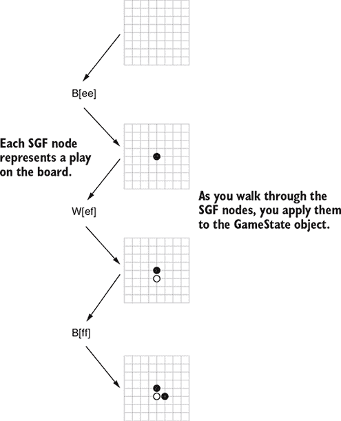

##### 列表 7.2\. 使用你的围棋框架重放 SGF 文件中的走棋

```
from dlgo.gosgf import Sgf_game                            *1*
from dlgo.goboard_fast import GameState, Move
from dlgo.gotypes import Point
from dlgo.utils import print_board

sgf_content = "(;GM[1]FF[4]SZ[9];B[ee];W[ef];B[ff]" + \    *2*
              ";W[df];B[fe];W[fc];B[ec];W[gd];B[fb])"

sgf_game = Sgf_game.from_string(sgf_content)               *3*

game_state = GameState.new_game(19)

for item in sgf_game.main_sequence_iter():                *4*

    color, move_tuple = item.get_move()                   *5*
    if color is not None and move_tuple is not None:
        row, col = move_tuple
        point = Point(row + 1, col + 1)
        move = Move.play(point)
        game_state = game_state.apply_move(move)          *6*
        print_board(game_state.board)
```

+   ***1* 首先从新的 gosgf 模块导入 Sgf_game 类。**

+   ***2* 定义一个样本 SGF 字符串。此内容将来自稍后下载的数据。**

+   ***3* 使用 from_string 方法，你可以创建一个 Sgf_game。**

+   ***4* 遍历游戏的主序列；你忽略变体和注释。**

+   ***5* 主序列中的项以 (颜色，走法) 对的形式出现，其中“走法”是一对棋盘坐标。**

+   ***6* 然后将读取出的走棋应用到当前游戏状态。**

从本质上讲，在你有一个有效的 SGF 字符串之后，你可以从中创建一个游戏，你可以遍历其主序列并按需处理。 列表 7.2 是本章的核心，为你提供了一个如何处理围棋数据以进行深度学习的粗略概述：

1.  下载并解压压缩的围棋游戏文件。

1.  遍历这些文件中包含的每个 SGF 文件，将它们作为 Python 字符串读取，并从这些字符串创建一个 `Sgf_game`。

1.  读取每个 SGF 字符串的围棋游戏主序列，确保注意重要细节，例如放置让子石，并将生成的走棋数据输入到 `GameState` 对象中。

1.  对于每一步棋，使用 `Encoder` 将当前棋盘信息编码为特征，并将该步棋本身作为标签存储，然后再将其放置在棋盘上。这样，你就可以实时创建用于深度学习的走棋预测数据。

1.  将生成的特征和标签存储在合适的格式中，以便你可以稍后将其拾取并输入到深度神经网络中。

在接下来的几节中，你将详细处理这五个任务。处理完这些数据后，你可以回到你的走棋预测应用程序，看看这些数据如何影响走棋预测的准确性。

#### 7.2.2\. 构建 Go 数据处理器

在本节中，你将构建一个围棋 *数据处理器*，可以将原始 SGF 数据转换为机器学习算法的特征和标签。这将是一个相对较长的实现，所以我们将其分为几个部分。完成之后，你将准备好在真实数据上运行深度学习模型。

要开始，在你的新数据子模块中创建一个名为 processor.py 的新文件。与之前一样，你也可以完全按照 GitHub 仓库中的 processor.py 的实现来操作。让我们导入一些你将在 processor.py 中使用的核心 Python 库。除了 NumPy 用于数据外，你还需要许多用于处理文件的包。

##### 列表 7.3\. 用于数据和处理文件所需的 Python 库

```
import os.path
import tarfile
import gzip
import glob
import shutil

import numpy as np
from keras.utils import to_categorical
```

对于 dlgo 本身所需的功能，你需要导入你迄今为止构建的许多核心抽象。

##### 列表 7.4\. 从 `dlgo` 模块导入的数据处理导入。

```
from dlgo.gosgf import Sgf_game
from dlgo.goboard_fast import Board, GameState, Move
from dlgo.gotypes import Player, Point
from dlgo.encoders.base import get_encoder_by_name

from dlgo.data.index_processor import KGSIndex
from dlgo.data.sampling import Sampler                 *1*
```

+   ***1* 样本器将被用来从文件中采样训练和测试数据**

我们还没有讨论列表中的最后两个导入（`Sampler`和`DataGenerator`），但将在构建我们的 Go 数据处理器时介绍它们。继续使用 processor.py，通过提供一个`Encoder`字符串和一个用于存储 SGF 数据的`data_directory`来初始化`GoDataProcessor`。

##### **列表 7.5\. 使用编码器和本地数据目录初始化 Go 数据处理器**

```
class GoDataProcessor:
    def __init__(self, encoder='oneplane', data_directory='data'):
        self.encoder = get_encoder_by_name(encoder, 19)
        self.data_dir = data_directory
```

接下来，您将实现主要的数据处理方法，称为`load_go_data`。在这个方法中，您可以指定您想要处理的比赛数量，以及要加载的数据类型，这意味着可以是*训练*或*测试*数据。`load_go_data`将从 KGS 下载在线围棋记录，采样指定数量的比赛，通过创建特征和标签来处理它们，然后将结果以 NumPy 数组的形式本地持久化。

##### **列表 7.6\. `load_go_data`加载数据、处理数据并存储数据**

```
    def load_go_data(self, data_type='train',                          *1*
                     num_samples=1000):                                *2*
        index = KGSIndex(data_directory=self.data_dir)
        index.download_files()                                         *3*

        sampler = Sampler(data_dir=self.data_dir)
        data = sampler.draw_data(data_type, num_samples)               *4*

        zip_names = set()
        indices_by_zip_name = {}
        for filename, index in data:
            zip_names.add(filename)                                    *5*
            if filename not in indices_by_zip_name:
                indices_by_zip_name[filename] = []
            indices_by_zip_name[filename].append(index)                *6*
        for zip_name in zip_names:
            base_name = zip_name.replace('.tar.gz', '')
            data_file_name = base_name + data_type
            if not os.path.isfile(self.data_dir + '/' + data_file_name):
                self.process_zip(zip_name, data_file_name,
                                 indices_by_zip_name[zip_name])        *7*

        features_and_labels = self.consolidate_games(data_type, data)  *8*
        return features_and_labels
```

+   ***1* 对于数据类型，您可以选择 train 或 test。**

+   ***2* num_samples 指的是从游戏中加载数据的数量。**

+   ***3* 将所有游戏从 KGS 下载到您的本地数据目录。如果数据可用，则不会再次下载。**

+   ***4* Sampler 实例选择指定数量的游戏用于数据类型。**

+   ***5* 将数据中包含的所有 zip 文件名收集到一个列表中。**

+   ***6* 将所有 SGF 文件索引按 zip 文件名分组。**

+   ***7* 然后逐个处理 zip 文件。**

+   ***8* 然后将每个 zip 的特征和标签汇总并返回。**

注意，在下载数据后，您可以使用`Sampler`实例来分割它。这个采样器所做的只是确保它随机选择指定数量的比赛，但更重要的是，确保*训练和测试数据在任何方面都不重叠*。`Sampler`通过在文件级别上分割训练和测试数据来实现这一点，简单地将 2014 年之前玩的游戏声明为测试数据，而较新的游戏作为训练数据。这样做可以确保测试数据中可用的任何游戏信息（部分）都不会包含在训练数据中，这可能导致模型过拟合。


**分割训练和测试数据**

您将数据分割成训练和测试数据的原因是为了获得可靠的性能指标。您在训练数据上训练一个模型，并在测试数据上评估它，以查看模型如何适应*之前未见过的情景*，如何从训练阶段学到的内容外推到现实世界。适当的数据收集和分割对于信任从模型中获得的结果至关重要。

直接加载所有数据，打乱顺序，并将其随机分成训练数据和测试数据可能会很有吸引力。根据问题的性质，这种天真方法可能或可能不是好主意。如果您考虑围棋游戏记录，单个游戏中的动作相互依赖。在包含在测试集中的动作集上训练模型可能会导致找到强大模型的错觉。但实际中您的机器人可能并不那么强大。确保花时间分析您的数据，并找到一个有意义的分割。


在下载和采样数据后，`load_go_data` 主要依赖于辅助程序来处理数据：`process_zip` 读取单个 zip 文件，以及 `consolidate_games` 将每个 zip 文件的结果组合成一组特征和标签。接下来，让我们看看 `process_zip`，它为您执行以下步骤：

1.  使用 `unzip_data` 解压当前文件。

1.  初始化一个 `Encoder` 实例来编码 SGF 记录。

1.  初始化具有正确形状的特征和标签 NumPy 数组。

1.  遍历游戏列表并逐个处理游戏。

1.  对于每个游戏，首先应用所有让子。

1.  然后读取 SGF 记录中找到的每个动作。

1.  对于每个下一个动作，将其编码为 `label`。

1.  将当前棋盘状态编码为 `feature`。

1.  将下一个动作应用于棋盘并继续。

1.  在本地文件系统中存储特征和标签的小块。

这里是如何在 `process_zip` 中实现前九个步骤的示例。请注意，为了简洁起见，省略了技术实用方法 `unzip_data`，但可以在我们的 GitHub 仓库中找到。在 图 7.3 中，您可以看到将压缩 SGF 文件处理成编码棋局状态的工作方式。

##### 图 7.3\. `process_zip` 函数。您遍历包含许多 SGF 文件的 zip 文件。每个 SGF 文件包含一系列游戏动作；您使用这些动作来重建 `GameState` 对象。然后您使用 `Encoder` 对象将每个游戏状态转换为 NumPy 数组。

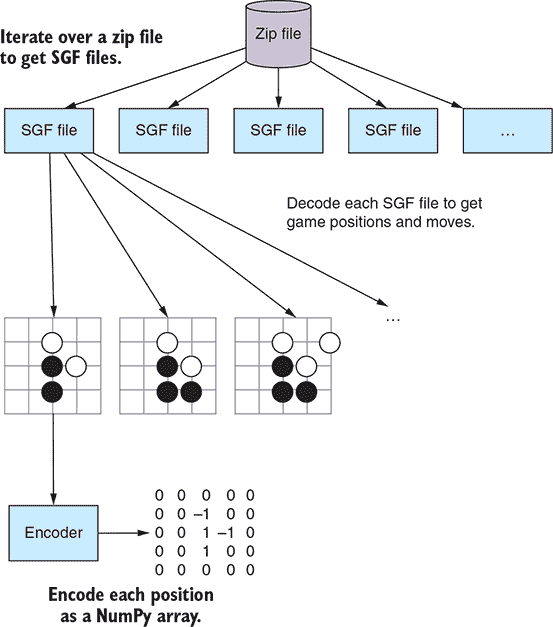

接下来，您可以定义 `process_zip`。

##### 列表 7.7\. 将存储在 zip 文件中的 Go 记录处理成编码特征和标签

```
    def process_zip(self, zip_file_name, data_file_name, game_list):
        tar_file = self.unzip_data(zip_file_name)
        zip_file = tarfile.open(self.data_dir + '/' + tar_file)
        name_list = zip_file.getnames()
        total_examples = self.num_total_examples(zip_file, game_list,
                                                 name_list)                *1*

        shape = self.encoder.shape()                                       *2*
        feature_shape = np.insert(shape, 0, np.asarray([total_examples]))
        features = np.zeros(feature_shape)
        labels = np.zeros((total_examples,))

        counter = 0
        for index in game_list:
            name = name_list[index + 1]
            if not name.endswith('.sgf'):
                raise ValueError(name + ' is not a valid sgf')
            sgf_content = zip_file.extractfile(name).read()
            sgf = Sgf_game.from_string(sgf_content)                        *3*

            game_state, first_move_done = self.get_handicap(sgf)           *4*

            for item in sgf.main_sequence_iter():                          *5*
                color, move_tuple = item.get_move()
                point = None
                if color is not None:
                    if move_tuple is not None:                             *6*
                        row, col = move_tuple
                        point = Point(row + 1, col + 1)
                        move = Move.play(point)
                    else:
                        move = Move.pass_turn()                            *7*
                    if first_move_done and point is not None:
                        features[counter] = self.encoder.encode(game_state)*8*
                        labels[counter] = self.encoder.encode_point(point) *9*
                        counter += 1
                    game_state = game_state.apply_move(move)               *10*
                    first_move_done = True
```

+   ***1* 确定该 zip 文件中所有游戏中动作的总数**

+   ***2* 从您使用的编码器推断特征和标签的形状**

+   ***3* 读取解压 zip 文件后的 SGF 内容作为字符串**

+   ***4* 通过应用所有让子来推断初始棋局状态**

+   ***5* 遍历 SGF 文件中的所有动作**

+   ***6* 读取要放置的棋子的坐标...**

+   ***7* ...如果没有，则跳过**

+   ***8* 将当前棋局状态编码为特征...**

+   ***9* ...并且下一个动作作为特征的标签**

+   ***10* 之后，将动作应用于棋盘，并继续下一个动作。**

注意`for`循环与你在列表 7.2 中概述的过程是多么相似，因此这段代码应该对你来说很熟悉。`process_zip`使用两个你将在下一个步骤中实现的辅助方法。第一个是`num_total_examples`，它预先计算每个 zip 文件中可用的移动次数，这样你可以有效地确定特征和标签数组的大小。

##### 列表 7.8\. 计算当前 zip 文件中可用的总移动次数

```
    def num_total_examples(self, zip_file, game_list, name_list):
        total_examples = 0
        for index in game_list:
            name = name_list[index + 1]
            if name.endswith('.sgf'):
                sgf_content = zip_file.extractfile(name).read()
                sgf = Sgf_game.from_string(sgf_content)
                game_state, first_move_done = self.get_handicap(sgf)

                num_moves = 0
                for item in sgf.main_sequence_iter():
                    color, move = item.get_move()
                    if color is not None:
                        if first_move_done:
                            num_moves += 1
                        first_move_done = True
                total_examples = total_examples + num_moves
            else:
                raise ValueError(name + ' is not a valid sgf')
        return total_examples
```

你使用第二个辅助方法来确定当前游戏有多少让子石，并将这些移动应用于空棋盘。

##### 列表 7.9\. 获取让子石并将其应用于空围棋棋盘

```
    @staticmethod
    def get_handicap(sgf):
        go_board = Board(19, 19)
        first_move_done = False
        move = None
        game_state = GameState.new_game(19)
        if sgf.get_handicap() is not None and sgf.get_handicap() != 0:
            for setup in sgf.get_root().get_setup_stones():
                for move in setup:
                    row, col = move
                    go_board.place_stone(Player.black,
                                         Point(row + 1, col + 1))
            first_move_done = True
            game_state = GameState(go_board, Player.white, None, move)
        return game_state, first_move_done
```

为了完成`process_zip`的实现，你将特征和标签的块存储在单独的文件中。

##### 列表 7.10\. 以小块形式在本地持久化特征和标签

```
        feature_file_base = self.data_dir + '/' + data_file_name +
     '_features_%d'
        label_file_base = self.data_dir + '/' + data_file_name + '_labels_%d'

        chunk = 0  # Due to files with large content, split up after chunksize
        chunksize = 1024
        while features.shape[0] >= chunksize:                              *1*
            feature_file = feature_file_base % chunk
            label_file = label_file_base % chunk
            chunk += 1
            current_features, features = features[:chunksize],
 features[chunksize:]
            current_labels, labels = labels[:chunksize], labels[chunksize:]*2*
            np.save(feature_file, current_features)
            np.save(label_file, current_labels)                            *3*
```

+   ***1* 你以 1024 大小的块处理特征和标签。**

+   ***2* 当前块从特征和标签中切分出来...**

+   ***3* ... 然后存储在单独的文件中。**

你存储小块的原因是 NumPy 数组可以迅速变得很大，将数据存储在较小的文件中可以在以后提供更多的灵活性。例如，你可以合并所有块的数据，或者根据需要加载块到内存中。你将使用这两种方法。虽然后者——在前进过程中动态加载数据批次——稍微复杂一些，但合并数据是直接的。作为旁注，在我们的实现中，你可能在`while`循环中丢失最后一块的最后一部分，但这微不足道，因为你手头有足够多的数据。

继续使用`processor.py`和我们的`GoDataProcessor`定义，你只需将所有数组连接成一个。

##### 列表 7.11\. 将特征和标签的单独 NumPy 数组合并成一个集合

```
    def consolidate_games(self, data_type, samples):
        files_needed = set(file_name for file_name, index in samples)
        file_names = []
        for zip_file_name in files_needed:
            file_name = zip_file_name.replace('.tar.gz', '') + data_type
            file_names.append(file_name)

        feature_list = []
        label_list = []
        for file_name in file_names:
            file_prefix = file_name.replace('.tar.gz', '')
            base = self.data_dir + '/' + file_prefix + '_features_*.npy'
            for feature_file in glob.glob(base):
                label_file = feature_file.replace('features', 'labels')
                x = np.load(feature_file)
                y = np.load(label_file)
                x = x.astype('float32')
                y = to_categorical(y.astype(int), 19 * 19)
                feature_list.append(x)
                label_list.append(y)
        features = np.concatenate(feature_list, axis=0)
        labels = np.concatenate(label_list, axis=0)
        np.save('{}/features_{}.npy'.format(self.data_dir, data_type),
 features)
        np.save('{}/labels_{}.npy'.format(self.data_dir, data_type), labels)

        return features, labels
```

你可以通过以下方式加载 100 个游戏的特征和标签来测试这个实现。

##### 列表 7.12\. 从 100 个游戏记录中加载训练数据

```
from dlgo.data.processor import GoDataProcessor

processor = GoDataProcessor()
features, labels = processor.load_go_data('train', 100)
```

这些特征和标签已经使用你的`oneplane`编码器从第六章中编码，这意味着它们具有完全相同的结构。特别是，你可以使用你刚刚创建的数据来训练你在第六章中创建的任何网络。如果你这样做，不要对评估性能期望过高。尽管这个现实世界的游戏数据比第六章中生成的游戏数据要好得多，但你现在正在处理 19 × 19 的围棋数据，这比在 9 × 9 棋盘上玩的游戏要复杂得多。

将大量较小的文件加载到内存中进行合并的过程可能会导致在加载大量数据时出现内存不足异常。你将在下一节中通过使用*数据生成器*来提供仅用于模型训练所需的下一个迷你批次数据来解决此问题。

#### 7.2.3\. 构建围棋数据生成器以有效地加载数据

你从[`u-go.net/gamerecords/`](https://u-go.net/gamerecords/)下载的 KGS 索引包含超过 170,000 场比赛，这转化为数百万个需要预测的围棋走法。随着你加载越来越多的游戏记录，将这些数据点全部加载到单个 NumPy 数组中将会变得越来越困难。你合并游戏的方法注定会在某个时刻崩溃。

相反，我们建议在`GoDataProcessor`中使用`consolidate_games`的智能替代方案。请注意，最终，神经网络训练所需的只是你一个接一个地给它提供特征和标签的小批量数据。没有必要始终将数据保留在内存中。因此，你接下来要构建的是 Go 数据的*生成器*。如果你了解 Python 中的生成器概念，你会立即认出你正在构建的模式。如果不了解，可以把生成器想象成一个函数，它高效地在你需要时只提供你需要的下一个数据批次。

首先，让我们初始化一个`DataGenerator`。将此代码放入`data`模块内的`generator.py`文件中。你可以通过提供一个本地数据目录和由`GoDataProcessor`中的`Sampler`提供的样本来初始化这样的生成器。

##### 列表 7.13。Go 数据生成器的签名

```
import glob
import numpy as np
from keras.utils import to_categorical

class DataGenerator:
    def __init__(self, data_directory, samples):
        self.data_directory = data_directory
        self.samples = samples
        self.files = set(file_name for file_name, index in samples)    *1*
        self.num_samples = None

    def get_num_samples(self, batch_size=128, num_classes=19 * 19):    *2*
        if self.num_samples is not None:
            return self.num_samples
        else:
            self.num_samples = 0
            for X, y in self._generate(batch_size=batch_size,
                                       num_classes=num_classes):
                self.num_samples += X.shape[0]
            return self.num_samples
```

+   ***1* 你的生成器可以访问你之前采样的文件集。**

+   ***2* 根据应用的不同，你可能需要知道你有多少个示例。**

接下来，你将实现一个私有`_generate`方法，该方法创建并返回数据批次。此方法遵循与`consolidate_games`类似的总体逻辑，但有一个重要区别。以前你为特征和标签创建了一个大的 NumPy 数组，而现在你只返回或`yield`下一个数据批次。

##### 列表 7.14。生成并产生下一个 Go 数据批次的私有方法

```
    def _generate(self, batch_size, num_classes):
        for zip_file_name in self.files:
            file_name = zip_file_name.replace('.tar.gz', '') + 'train'
            base = self.data_directory + '/' + file_name + '_features_*.npy'
            for feature_file in glob.glob(base):
                label_file = feature_file.replace('features', 'labels')
                x = np.load(feature_file)
                y = np.load(label_file)
                x = x.astype('float32')
                y = to_categorical(y.astype(int), num_classes)
                while x.shape[0] >= batch_size:
                    x_batch, x = x[:batch_size], x[batch_size:]
                    y_batch, y = y[:batch_size], y[batch_size:]
                    yield x_batch, y_batch                        *1*
```

+   ***1* 你在过程中返回或`yield`数据批次。**

你所缺少的只是生成器的一个返回生成器的方法。拥有一个生成器后，你可以显式地调用`next()`来为你的用例生成数据批次。这可以通过以下方式完成。

##### 列表 7.15。调用`generate`方法以获得用于模型训练的生成器

```
    def generate(self, batch_size=128, num_classes=19 * 19):
        while True:
            for item in self._generate(batch_size, num_classes):
                yield item
```

在我们向你展示如何使用这样的生成器来训练神经网络之前，我们必须解释如何将这个概念融入你的`GoDataProcessor`。

#### 7.2.4。并行 Go 数据处理和生成器

您可能已经注意到，在列表 7.3 中仅加载 100 场比赛记录比您预期的要慢一些。虽然您自然需要首先下载数据，但处理本身相对较慢。回想一下您的实现，您是*顺序地*处理 zip 文件的。在您完成一个文件后，您继续处理下一个。但如果您仔细观察，我们展示的围棋数据处理方式可以称为*令人尴尬的并行*。只需一点努力，就可以通过在您的计算机的所有 CPU 之间分配工作负载来并行处理 zip 文件；例如，使用 Python 的 multiprocessing 库。

在我们的 GitHub 仓库中，您将在`parallel_processor.py`的数据模块中找到一个`GoDataProcessor`的并行实现。如果您对如何详细工作感兴趣，我们鼓励您查看那里提供的实现。我们在这里省略细节的原因是，尽管并行化的加速对您来说有即时的好处，但实现细节使得代码难以阅读。

使用`GoDataProcessor`的并行版本带来的另一个好处是，您可以选择使用它来与您的`DataGenerator`一起使用，以返回一个生成器而不是数据。

##### 列表 7.16\. `load_go_data`的并行版本可以可选地返回一个生成器

```
    def load_go_data(self, data_type='train', num_samples=1000,
                     use_generator=False):
        index = KGSIndex(data_directory=self.data_dir)
        index.download_files()

        sampler = Sampler(data_dir=self.data_dir)
        data = sampler.draw_data(data_type, num_samples)

        self.map_to_workers(data_type, data)                              *1*
        if use_generator:
            generator = DataGenerator(self.data_dir, data)
            return generator                                              *2*
        else:
            features_and_labels = self.consolidate_games(data_type, data)
            return features_and_labels                                    *3*
```

+   ***1* 将工作负载映射到 CPU。**

+   ***2* 要么返回一个围棋数据生成器...**

+   ***3* ...或者像以前一样返回合并后的数据**

除了并行扩展中的`use_generator`标志外，`GoDataProcessor`的两个版本共享相同的接口。通过`GoDataProcessor`从`dlgo.data.parallel_processor`，您现在可以使用生成器提供围棋数据，如下所示。

##### 列表 7.17\. 从 100 场比赛记录中加载数据

```
from dlgo.data.parallel_processor import GoDataProcessor

processor = GoDataProcessor()
generator = processor.load_go_data('train', 100, use_generator=True)

print(generator.get_num_samples())
generator = generator.generate(batch_size=10)
X, y = generator.next()
```

初始加载数据仍然需要时间，尽管它应该与您机器中处理器的数量成比例地加速。一旦创建生成器，调用`next()`会立即返回批次。此外，这种方式，您也不会遇到超出内存的问题。

### 7.3\. 在人类游戏数据上训练深度学习模型

现在您已经可以访问高段位的围棋数据，并且已经将其处理以适应移动预测模型，让我们连接这些点，并为此数据构建一个深度神经网络。在我们的 GitHub 仓库中，您将在我们的`dlgo`包中找到一个名为`*networks*`的模块，您将使用它来提供神经网络示例架构，您可以使用这些架构作为构建强大移动预测模型的基线。例如，您将在`networks`模块中找到三个不同复杂性的卷积神经网络，分别称为`small.py`、`medium.py`和`large.py`。这些文件中的每个文件都包含一个`layers`函数，该函数返回一个可以添加到顺序 Keras 模型的层列表。

你将构建一个由四个卷积层组成、后面跟着一个最终的全连接层、所有层都使用 ReLU 激活的卷积神经网络。在此之上，你将在每个卷积层之前使用一个新的实用层——一个`ZeroPadding2D`层。零填充是一种操作，其中输入特征被*填充*为 0。假设你使用第六章中的单平面编码器将棋盘编码为一个 19 × 19 的矩阵。如果你指定填充为 2，这意味着你在矩阵的左侧和右侧各添加两列 0，以及在矩阵的顶部和底部各添加两行 0，从而得到一个扩大的 23 × 23 矩阵。在这种情况下，你使用零填充来人为地增加卷积层的输入，这样卷积操作就不会过度缩小图像。 

在我们向您展示代码之前，我们必须讨论一个小技术问题。回想一下，卷积层的输入和输出都是四维的：我们提供一个包含多个二维滤波器的小批量（即，它们有宽度和高度）。这四个维度（小批量大小、滤波器数量、宽度和高度）的表示顺序是一个约定问题，在实践中你主要会找到两种这样的顺序。请注意，滤波器也经常被称为通道（`C`），小批量大小也称为示例数量（`N`）。此外，你可以使用缩写表示宽度（`W`）和高度（`H`）。用这种表示法，两种主要的顺序是 NWHC 和 NCWH。在 Keras 中，这种顺序被称为`data_format`，NWHC 被称为`channels_last`，而 NCWH 被称为`channels_first`，这是出于某些明显的原因。现在，你构建的第一个围棋棋盘编码器，即单平面编码器，遵循*channels first*约定（一个编码的棋盘形状为 1,19,19，这意味着单个编码平面是*首先*）。这意味着你必须将`data_format=channels_first`作为参数提供给所有卷积层。让我们看看 small.py 中的模型看起来像什么。

##### 列表 7.18\. 为围棋走法预测构建的小卷积网络指定层

```
from keras.layers.core import Dense, Activation, Flatten
from keras.layers.convolutional import Conv2D, ZeroPadding2D

def layers(input_shape):
    return [
        ZeroPadding2D(padding=3, input_shape=input_shape,
                      data_format='channels_first'),                *1*
        Conv2D(48, (7, 7), data_format='channels_first'),
        Activation('relu'),

        ZeroPadding2D(padding=2, data_format='channels_first'),     *2*
        Conv2D(32, (5, 5), data_format='channels_first'),
        Activation('relu'),

        ZeroPadding2D(padding=2, data_format='channels_first'),
        Conv2D(32, (5, 5), data_format='channels_first'),
        Activation('relu'),

        ZeroPadding2D(padding=2, data_format='channels_first'),
        Conv2D(32, (5, 5), data_format='channels_first'),
        Activation('relu'),

        Flatten(),
        Dense(512),
        Activation('relu'),
    ]
```

+   ***1* 使用零填充层来扩大输入图像。**

+   ***2* 通过使用 channels_first，你指定了你的特征输入平面的维度是第一个。**

`layers`函数返回一个 Keras 层的列表，你可以逐个将这些层添加到一个`Sequential`模型中。使用这些层，你现在可以构建一个应用程序，执行概述中的前五步图 7.1——一个下载、提取和编码围棋数据并使用它来训练神经网络的程序。在训练部分，你将使用你构建的*数据生成器*。但首先，让我们导入你不断增长的围棋机器学习库的一些基本组件。你需要一个围棋数据处理器、一个编码器和构建此应用程序所需的神经网络架构。

##### 列表 7.19\. 构建围棋数据神经网络的核心导入

```
from dlgo.data.parallel_processor import GoDataProcessor
from dlgo.encoders.oneplane import OnePlaneEncoder

from dlgo.networks import small
from keras.models import Sequential
from keras.layers.core import Dense
from keras.callbacks import ModelCheckpoint         *1*
```

+   ***1* 使用模型检查点，你可以存储耗时实验的进度。**

最后一个导入提供了一个方便的 Keras 工具，称为`ModelCheckpoint`。由于你有大量的数据用于训练，完成某些 epoch 的完整模型训练可能需要几个小时甚至几天。如果这样的实验由于某种原因失败，你最好有一个备份。这正是模型检查点为你做的事情：在每个 epoch 的训练后持久化模型的快照。即使出现问题，你也可以从最后一个检查点恢复训练。

接下来，让我们定义训练和测试数据。为此，你首先初始化一个`OnePlaneEncoder`，你用它来创建一个`GoDataProcessor`。使用这个处理器，你可以实例化一个训练和测试数据生成器，你将使用这个生成器与 Keras 模型一起使用。

##### 列表 7.20\. 创建训练和测试生成器

```
go_board_rows, go_board_cols = 19, 19
num_classes = go_board_rows * go_board_cols
num_games = 100

encoder = OnePlaneEncoder((go_board_rows, go_board_cols))                  *1*

processor = GoDataProcessor(encoder=encoder.name())                        *2*

generator = processor.load_go_data('train', num_games, use_generator=True) *3*
test_generator = processor.load_go_data('test', num_games, use_generator=True)
```

+   ***1* 首先创建一个棋盘大小的编码器。**

+   ***2* 然后使用它初始化一个 Go 数据处理器。**

+   ***3* 从处理器中，你创建了两个数据生成器，用于训练和测试。**

作为下一步，你通过使用 dlgo.networks.small 中的`layers`函数，用 Keras 定义一个神经网络。你逐个将这个小网络中的层添加到一个新的序列网络中，然后通过添加一个具有 softmax 激活的最终`Dense`层来完成。然后你使用分类交叉熵损失编译这个模型，并用 SGD 进行训练。

##### 列表 7.21\. 从你的小层架构定义 Keras 模型

```
input_shape = (encoder.num_planes, go_board_rows, go_board_cols)
network_layers = small.layers(input_shape)
model = Sequential()
for layer in network_layers:
    model.add(layer)
model.add(Dense(num_classes, activation='softmax'))
model.compile(loss='categorical_crossentropy', optimizer='sgd',
     metrics=['accuracy'])
```

使用生成器训练 Keras 模型与使用数据集训练略有不同。现在你不需要在模型上调用`fit`，而是需要调用`fit_generator`，并且用`evaluate_generator`替换`evaluate`。此外，这些方法的签名与之前看到的不同。使用`fit_generator`是通过指定一个`generator`、`epochs`的数量以及每个 epoch 的训练步数来实现的，这些步数通过`steps_per_epoch`提供。这三个参数提供了训练模型所需的最小信息。你还需要在测试数据上验证你的训练过程。为此，你提供`validation_data`作为你的测试数据生成器，并指定每个 epoch 的验证步数作为`validation_steps`。最后，你向模型添加一个`callback`。回调允许你在训练过程中跟踪和返回额外的信息。在这里，你使用回调将`ModelCheckpoint`实用工具钩入，以便在每个 epoch 后存储 Keras 模型。作为一个例子，你在一个批量为 128 的情况下对一个模型进行了五个 epoch 的训练。

##### 列表 7.22\. 使用生成器拟合和评估 Keras 模型

```
epochs = 5
batch_size = 128
model.fit_generator(
  generator=generator.generate(batch_size, num_classes),            *1*
  epochs=epochs,
  steps_per_epoch=generator.get_num_samples() / batch_size,         *2*
  validation_data=test_generator.generate(
    batch_size, num_classes),                                       *3*
  validation_steps=test_generator.get_num_samples() / batch_size,   *4*
  callbacks=[
    ModelCheckpoint('../checkpoints/small_model_epoch_{epoch}.h5')
  ])                                                                *5*
model.evaluate_generator(
  generator=test_generator.generate(batch_size, num_classes),
  steps=test_generator.get_num_samples() / batch_size)              *6*
```

+   ***1* 你指定一个训练数据生成器用于你的批量大小...**

+   ***2* ...以及每个 epoch 执行的训练步数。**

+   ***3* 使用额外的生成器进行验证...**

+   ***4* ...这同样需要一个步数。**

+   ***5* 每个 epoch 结束后，你将保存模型的检查点。**

+   ***6* 对于评估，你还需要指定生成器和步数。**

注意，如果你亲自运行这段代码，你应该意识到完成这个实验可能需要的时间。如果你在 CPU 上运行，训练一个 epoch 可能需要几个小时。实际上，机器学习中使用的数学与计算机图形学中使用的数学有很多相似之处。因此，在某些情况下，你可以将你的神经网络计算移动到 GPU 上，从而获得很大的速度提升。使用 GPU 进行计算将极大地加快计算速度，通常对于卷积神经网络来说，速度提升可达一个或两个数量级。如果你的机器上有合适的驱动程序可用，TensorFlow 提供了广泛的对于将计算移动到某些 GPU 的支持。

| |
| --- |

##### 注意

如果你想要为机器学习使用 GPU，配备 Windows 或 Linux 操作系统的 NVIDIA 芯片是最好的组合。其他组合也是可能的，但你可能需要花费大量时间调整驱动程序。

| |
| --- |

如果你不打算亲自尝试，或者只是现在不想做，我们已经为你预先计算了这个模型。查看我们的 GitHub 仓库，看看存储在`checkpoints`中的五个检查点模型，每个完成的 epoch 一个。以下是那次训练运行的输出（在一个旧 CPU 上计算，以鼓励你立即购买一个快速的 GPU）：

```
Epoch 1/5
12288/12288 [==============================] - 14053s 1s/step - loss: 3.5514
 - acc: 0.2834 - val_loss: 2.5023 - val_acc: 0.6669
Epoch 2/5
12288/12288 [==============================] - 15808s 1s/step - loss: 0.3028
 - acc: 0.9174 - val_loss: 2.2127 - val_acc: 0.8294
Epoch 3/5
12288/12288 [==============================] - 14410s 1s/step - loss: 0.0840
 - acc: 0.9791 - val_loss: 2.2512 - val_acc: 0.8413
Epoch 4/5
12288/12288 [==============================] - 14620s 1s/step - loss: 0.1113
 - acc: 0.9832 - val_loss: 2.2832 - val_acc: 0.8415
Epoch 5/5
12288/12288 [==============================] - 18688s 2s/step - loss: 0.1647
 - acc: 0.9816 - val_loss: 2.2928 - val_acc: 0.8461
```

如你所见，经过三个 epoch 后，你在训练数据上达到了 98%的准确率，在测试数据上达到了 84%。这比你在第六章中计算出的模型有了巨大的改进！似乎在真实数据上训练更大的网络是值得的：你的网络学会了几乎完美地预测 100 场比赛的走法，但泛化能力相当好。你可以对 84%的验证准确率感到非常满意。另一方面，100 场比赛的走法仍然是一个很小的数据集，你还不清楚在一个更大的游戏数据集上你会做得如何。毕竟，你的目标是构建一个能够与强大对手竞争的强大围棋机器人，而不是仅仅压倒一个玩具数据集。

要构建一个真正强大的对手，你需要与更好的围棋数据编码器合作。你从第六章中的单平面编码器是一个好的起点，但它无法捕捉到你正在处理的复杂性。在第 7.4 节中，你将了解两种更复杂的编码器，这些编码器将提高你的训练性能。

### 7.4. 构建更真实的围棋数据编码器

第二章 和 第三章 在围棋中相当详细地介绍了劫的规则。回想一下，这个规则存在是为了防止游戏中的无限循环：你不能下出一个会导致棋盘上之前情况的棋子。如果我们给你一个随机的围棋棋盘位置，你必须决定是否正在进行劫，你就必须猜测。没有看到导致该位置的前一个序列，你无法知道。特别是，你的单平面编码器，它将黑棋编码为 -1，白棋编码为 1，空位置编码为 0，不可能学习到关于劫的任何东西。这只是例子之一，但它表明你在第六章中构建的 `OnePlaneEncoder` 稍显简单，无法捕捉到构建强大的围棋机器人所需的所有内容。

在本节中，我们将为您提供两个更详细的编码器，这些编码器在文献中导致了相对较强的移动预测性能。第一个我们称之为 `SevenPlaneEncoder`，它由以下七个特征平面组成。每个平面是一个 19 × 19 矩阵，描述了一组不同的特征：

+   第一个平面对于每个恰好有一个**自由**的**白色**棋子有一个 1，否则为 0。

+   第二和第三个特征平面分别对白色棋子有两个或至少三个自由度有一个 1。

+   第四到第六个平面对黑棋做同样的处理；它们用一、二或至少三个自由度来编码黑棋。

+   最后一个特征平面用 1 标记由于劫而不能落子的点。

除了明确编码**劫**的概念外，这组特征还模拟了自由度，并区分了黑白棋子。只有一个自由度的棋子具有额外的战术意义，因为它们在下一次回合中可能会被捕获。（围棋玩家说，只有一个自由度的棋子处于**劫**中。）因为模型可以直接“看到”这个属性，所以它更容易捕捉到这对游戏的影响。通过为诸如劫和自由度数量等概念创建平面，您向模型暗示这些概念很重要，而无需解释它们为什么或如何重要。

让我们看看如何通过扩展编码器模块中的基本 `Encoder` 来实现这一点。将以下代码保存到 sevenplane.py 中。

##### 列表 7.23\. 初始化一个简单的七平面编码器

```
import numpy as np

from dlgo.encoders.base import Encoder
from dlgo.goboard import Move, Point

class SevenPlaneEncoder(Encoder):
    def __init__(self, board_size):
        self.board_width, self.board_height = board_size
        self.num_planes = 7

    def name(self):
        return 'sevenplane'
```

有趣的部分是编码棋盘位置，它如下进行。

##### 列表 7.24\. 使用 `SevenPlaneEncoder` 编码游戏状态

```
    def encode(self, game_state):
        board_tensor = np.zeros(self.shape())
        base_plane = {game_state.next_player: 0,
                      game_state.next_player.other: 3}
        for row in range(self.board_height):
            for col in range(self.board_width):
                p = Point(row=row + 1, col=col + 1)
                go_string = game_state.board.get_go_string(p)
                if go_string is None:
                    if
     game_state.does_move_violate_ko(game_state.next_player,
                                                       Move.play(p)):
                        board_tensor[6][row][col] = 1                  *1*
                else:
                    liberty_plane = min(3, go_string.num_liberties) - 1
                    liberty_plane += base_plane[go_string.color]
                    board_tensor[liberty_plane][row][col] = 1          *2*
        return board_tensor
```

+   **1* 编码由劫规则禁止的移动**

+   **2* 使用 1、2 或更多自由来编码黑白棋子**

为了完成这个定义，您还需要实现一些便利方法，以满足 `Encoder` 接口。

##### 列表 7.25\. 为你的七平面编码器实现所有其他 `Encoder` 方法

```
    def encode_point(self, point):
        return self.board_width * (point.row - 1) + (point.col - 1)

    def decode_point_index(self, index):
        row = index // self.board_width
        col = index % self.board_width
        return Point(row=row + 1, col=col + 1)

    def num_points(self):
        return self.board_width * self.board_height

    def shape(self):
        return self.num_planes, self.board_height, self.board_width

def create(board_size):
    return SevenPlaneEncoder(board_size)
```

我们在这里讨论的另一个编码器，并将指向 GitHub 中的代码，是一个具有 11 个特征平面的编码器，类似于`SevenPlaneEncoder`。在这个被称为`SimpleEncoder`的编码器中，你可以在 GitHub 的 encoders 模块下的 simple.py 中找到，你使用以下特征平面：

+   前四个特征平面描述了带有一个、两个、三个或四个眼位的黑子。

+   第二个四个平面描述了带有一个、两个、三个或四个眼位的白子。

+   第九个平面在黑子轮到时设置为 1，第十个平面在白子轮到时设置为 1。

+   最后一个特征平面再次保留用于指示劫争。

这个具有 11 个平面的编码器接近上一个编码器，但更明确地指出了轮到谁走棋，以及一个子有多少眼位。这两个都是优秀的编码器，将导致模型性能的显著提升。

在第五章和第六章中，你学习了许多提高你的深度学习模型的技术，但所有实验中都有一个共同的成分：你使用了随机梯度下降作为优化器。尽管 SGD 提供了一个很好的基线，但在下一节中，我们将教你关于*Adagrad*和*Adadelta*，这两个优化器将极大地提高你的训练过程。

### 7.5. 使用自适应梯度高效训练

为了进一步提高你的围棋走法预测模型的性能，我们将在本章介绍最后一组工具——除了随机梯度下降之外的优化器。回想一下第五章，SGD 有一个相当简单的更新规则。对于一个参数*W*，如果你收到一个反向传播误差Δ*W*，并且你有一个学习率α被指定，那么使用 SGD 更新这个参数简单地说就是计算*W* – αΔ*W*。

在许多情况下，这个更新规则可以带来良好的结果，但也存在一些缺点。为了解决这些问题，你可以使用许多优秀的扩展来改进普通的 SGD。

#### 7.5.1. SGD 中的衰减和动量

例如，一个广泛使用的方法是让学习率*衰减*随时间变化；随着你采取的每个更新步骤，学习率会变得更小。这种技术通常效果很好，因为一开始你的网络还没有学到任何东西，大的更新步骤可能有助于接近损失函数的最小值。但是，在训练过程达到一定水平后，你应该减小更新，并对学习过程进行适当的细化，以避免破坏进度。通常，你通过一个*衰减率*来指定学习率衰减，这是一个百分比，表示你将减少下一步的值。

另一种流行的技术是**动量**，其中将上一步更新的一部分加到当前步骤中。例如，如果*W*是你想要更新的参数向量，*]W*是针对*W*计算出的当前梯度，并且如果你上一次使用的更新是*U*，那么下一次更新步骤将如下所示：

| *W* ← *W* – α(γ*U* + (1 + γ)∂*W*) |
| --- |

这个从上次更新中保留的分数 *g* 被称为 *动量项*。如果两个梯度项大致指向同一方向，你的下一个更新步骤会得到加强（获得动量）。如果梯度项指向相反方向，它们会相互抵消，梯度会减弱。这种技术被称为 *动量*，因为它与同名物理概念的相似性。将你的损失函数视为一个表面，而该表面上的参数作为一个球。那么参数更新描述了球体的运动。因为你在做梯度下降，你可以甚至将这视为球体沿着表面滚动，逐个接收运动。如果最后几个（梯度）步骤都指向大致相同的方向，球体会加速并更快地到达目的地，即表面的最小值。动量技术利用了这种类比。

如果你想在 Keras 中的 SGD 中使用衰减、动量或两者，只需向 `SGD` 实例提供相应的速率即可。假设你想要一个学习率为 0.1、衰减率为 1%、动量为 90% 的 SGD；你会这样做。

##### 列表 7.26\. 在 Keras 中使用动量和学习率衰减初始化 SGD

```
from keras.optimizers import SGD
sgd = SGD(lr=0.1, momentum=0.9, decay=0.01)
```

#### 7.5.2\. 使用 Adagrad 优化神经网络

学习率衰减和动量在改进普通的 SGD 方面都做得很好，但仍然存在一些弱点。例如，如果你考虑围棋盘，专业人士几乎只在第三到第五行上玩他们的前几步棋，但无一例外，决不在第一或第二行上。在残局中，情况有所逆转，因为在棋盘边缘发生了很多最后一步棋。在迄今为止你使用的所有深度学习模型中，最后一层是一个大小为 (这里 19 × 19) 的密集层。这个层的每个神经元对应于棋盘上的一个位置。如果你使用 SGD，无论是否有动量或衰减，*每个这些神经元都使用相同的学习率*。这可能很危险。也许你在洗牌训练数据时做得不好，学习率已经衰减得太多，以至于第一和第二行的残局移动不再得到任何显著更新——这意味着，没有学习。一般来说，你想要确保不常观察到的模式仍然得到足够大的更新，而频繁的模式则接收越来越小的更新。

为了解决设置全局学习率引起的问题，你可以使用使用 *自适应* 梯度方法的技巧。我们将向你展示这两种方法：*Adagrad* 和 *Adadelta*。

在 Adagrad 中，没有全局学习率。你 *按参数调整学习率*。当数据量很大且数据中的模式很少被发现时，Adagrad 工作得相当好。这两个标准都适用于我们的情况：你有很多数据，而且职业围棋游戏非常复杂，尽管这些移动组合在专业玩家的数据集中出现频率不高，但它们被认为是标准的游戏方式。

假设你有一个长度为 *l* 的权重向量 *W*（在这里更容易想象向量，但这项技术更普遍地适用于张量）以及单个条目 *W[i]*。对于这些参数的给定梯度 *]W*，在具有学习率 *a* 的简单 SGD 中，每个 *W[i]* 的更新规则如下：

| *W[i]* ← *W[i]* – α∂*W[i]* |
| --- |

在 Adagrad 中，你用一个动态调整每个索引 *i* 的项替换 α，通过查看你过去更新 *W[i]* 的程度。事实上，在 Adagrad 中，个别学习率将与之前的更新成反比。更准确地说，在 Adagrad 中，你按以下方式更新参数：


在这个公式中，e 是一个很小的正值，以确保你不会除以 0，而 *Gi,i* 是直到这个点收到的平方梯度的总和。我们将其写作 *Gi,i*，因为你可以将这个项视为一个长度为 *l* 的平方矩阵 *G* 的一部分，其中所有对角线元素 *Gj,j* 都具有我们刚刚描述的形式，而所有非对角线项都是 0。这种形式的矩阵被称为 *对角矩阵*。你会在每次参数更新后更新 *G*，通过将最新的梯度贡献添加到对角元素中。这就是定义 Adagrad 的全部内容，但如果你想要以独立于索引 i 的简洁形式写出这个更新规则，这就是你该这样做的方式：


注意，因为 *G* 是一个矩阵，所以你需要将 e 添加到每个条目 *Gi,j* 中，并将 α 除以每个这样的条目。此外，通过 *G*·*]W* 你意味着 *G* 与 *]W* 的矩阵乘法。要使用 Adagrad 与 Keras，使用此优化器编译模型的工作方式如下。

##### 列表 7.27\. 使用 Adagrad 优化器为 Keras 模型

```
from keras.optimizers import Adagrad
adagrad = Adagrad()
```

Adagrad 相比于其他 SGD 技术的一个关键优点是，你不必手动设置学习率——又少了一件要担心的事情。找到好的网络架构并调整模型的所有参数已经很困难了。实际上，你可以通过使用 `Adagrad(lr=0.02)` 在 Keras 中改变初始学习率，但这样做并不推荐。

#### 7.5.3\. 使用 Adadelta 精炼自适应梯度

与 Adagrad 类似且是其扩展的优化器是 *Adadelta*。在这个优化器中，你不会在 *G* 中累积所有过去的（平方的）梯度，而是使用我们在动量技术中向你展示的相同想法，只保留上一次更新的 *一部分* 并将其添加到当前梯度中：

| *G* ← γ*G* + (1 – γ)∂*W* |
| --- |

虽然这个想法大致上是 Adadelta 发生的事情，但使这个优化器工作并导致其精确更新规则的细节过于复杂，无法在此展示。我们建议你查阅原始论文以获取更多详细信息（[`arxiv.org/abs/1212.5701`](https://arxiv.org/abs/1212.5701)）。

在 Keras 中，你可以这样使用 Adadelta 优化器。

##### 列表 7.28\. 使用 Adadelta 优化器进行 Keras 模型

```
from keras.optimizers import Adadelta
adadelta = Adadelta()
```

与随机梯度下降相比，Adagrad 和 Adadelta 对于在围棋数据上训练深度神经网络非常有用。在后面的章节中，你经常会在更高级的模型中使用其中一个作为优化器。

### 7.6\. 运行自己的实验和评估性能

在第五章、第六章和这一章中，我们向您展示了许多深度学习技术。我们提供了一些作为基线有意义的提示和示例架构，但现在是你训练自己的模型的时候了。在机器学习实验中，尝试各种*超参数*的组合至关重要，例如层数的数量、选择哪些层、训练多少个周期等。特别是，对于深度神经网络，你面临的选择可能令人不知所措。调整特定旋钮如何影响模型性能并不总是那么清晰。深度学习研究人员可以依靠数十年的研究的大量实验结果和进一步的理论论证来支持他们的直觉。我们无法提供如此深入的知识水平，但我们可以帮助你开始建立自己的直觉。

在我们这样的实验设置中取得良好结果的关键因素——即训练一个神经网络尽可能准确地预测围棋走法——是一个*快速实验周期*。你构建模型架构、开始模型训练、观察和评估性能指标，然后返回调整你的模型并重新开始这个过程所需的时间必须很短。当你查看像 kaggle.com 上举办的数据科学挑战时，通常获胜的是那些*尝试最多*的团队。幸运的是，Keras 是以快速实验为前提构建的。这也是我们选择它作为本书深度学习框架的主要原因之一。我们希望你能同意，你可以用 Keras 快速构建神经网络，而且改变你的实验设置是自然而然的。

#### 7.6.1\. 测试架构和超参数的指南

让我们看看在构建走法预测网络时的一些实际考虑因素：

+   卷积神经网络是围棋走法预测网络的理想候选者。确保你确信仅使用密集层会导致预测质量较差。通常，构建由多个卷积层和末尾的一到两个密集层组成的网络是必须的。在后面的章节中，你将看到更复杂的架构，但就目前而言，使用卷积网络。

+   在你的卷积层中，改变核大小以观察这种变化如何影响模型性能。作为一个经验法则，核大小在 2 到 7 之间是合适的，你不应该做得更大。

+   如果你使用池化层，确保尝试最大池化和平均池化，但更重要的是，不要选择过大的池化尺寸。在你的情况下，一个实用的上限可能是 3。你可能还想要尝试构建没有池化层的网络，这可能会在计算上更昂贵，但可以工作得相当好。

+   使用 dropout 层进行正则化。在第六章中，你看到了如何使用 dropout 来防止你的模型过拟合。只要你不使用太多的 dropout 层，并且不将 dropout 率设置得太高，你的网络通常都会从添加 dropout 层中受益。

+   在你的最后一层使用 softmax 激活函数，因为它可以产生概率分布，并且与适合你情况的分类交叉熵损失函数结合使用。

+   尝试不同的激活函数。我们已经向你介绍了 ReLU，它现在应该作为你的默认选择，以及 sigmoid 激活。你可以在 Keras 中使用许多其他激活函数，如 elu、selu、PReLU 和 LeakyReLU。我们在这里不能讨论这些 ReLU 变体，但它们的用法在[`keras.io/activations/`](https://keras.io/activations/)上有很好的描述。

+   变化的批大小对模型性能有影响。在预测问题，如第五章中的 MNIST（章节 5），通常建议选择与类别数量同数量级的批大小。对于 MNIST，你经常看到批大小在 10 到 50 之间。如果数据完全随机化，这样，每个梯度都会从每个类别接收信息，这使得 SGD 通常表现更好。在我们的用例中，一些围棋走法比其他走法更常被使用。例如，棋盘的四个角落很少被使用，尤其是与星点相比。我们称这种数据为*类别不平衡*。在这种情况下，你不能期望一个批大小涵盖所有类别，而应该使用 16 到 256（这在文献中有所发现）的批大小。优化器的选择也对网络学习效果有相当大的影响。带有或没有学习率衰减的 SGD，以及 Adagrad 和 Adadelta，已经为你提供了实验的选项。在[`keras.io/optimizers/`](https://keras.io/optimizers/)下，你会找到其他可能对你的模型训练过程有益的优化器。用于训练模型的 epoch 数量必须适当选择。如果你使用模型检查点和跟踪每个 epoch 的各种性能指标，你可以有效地测量训练何时停止改进。在下一节和本章的最后一节中，我们简要讨论了如何评估性能指标。作为一个一般性的指导原则，如果计算能力足够，将 epoch 数量设置得高一些而不是低一些。如果模型训练停止改进或甚至变得更差，你可以仍然使用早期检查点的模型为你的机器人服务。


**权重初始化器**

调整深度神经网络的一个另一个关键方面是在训练开始之前如何初始化权重。因为优化网络意味着在损失曲面上找到一组对应于最小值的权重，你开始时的权重很重要。在你的网络实现中，你*随机地*分配了初始权重，这通常是一个坏主意。

权重初始化是一个有趣的研究主题，几乎值得一个章节。Keras 有许多权重初始化方案，每个带有权重的层都可以相应地初始化。你不在正文中介绍它们的原因是，Keras 默认选择的初始化器通常非常好，不值得麻烦去改变它们。通常，你的网络定义的其他方面需要关注。但了解这些差异是好的，高级用户可能想要实验 Keras 初始化器，这些初始化器可以在[`keras.io/initializers/`](https://keras.io/initializers/)找到。


#### 7.6.2\. 训练和测试数据性能指标的评估

在第 7.3 节中，我们展示了在一个小数据集上进行的训练运行的结果。我们使用的网络是一个相对较小的卷积网络，我们训练了这个网络五个 epoch。在这个实验中，我们跟踪了训练数据上的损失和准确率，并使用测试数据进行了验证。最后，我们在测试数据上计算了准确率。这就是你应该遵循的一般工作流程，但你怎么判断何时停止训练或检测到有问题呢？以下是一些指导原则：

+   你的训练准确率和损失应该通常在每个 epoch 中都有所提高。在后期 epoch 中，这些指标会逐渐减少，有时会有轻微的波动。如果你在几个 epoch 内看不到任何改进，你可能想停止训练。

+   同时，你应该看看你的验证损失和准确率看起来如何。在早期 epoch 中，验证损失会持续下降，但在后期 epoch 中，你经常看到的是它开始平台期，并经常再次开始增加。这是网络开始对训练数据过拟合的明确迹象。

+   如果你使用模型检查点，请选择在具有高训练准确率的同时仍具有低验证误差的 epoch 中的模型。

+   如果训练和验证损失都很高，尝试选择更深的网络架构或其他超参数。

+   如果你的训练误差很低，但验证误差很高，那么你的模型可能过拟合了。这种情况在你拥有真正庞大的训练数据集时通常不会发生。有了超过 170,000 场围棋比赛和数百万个可供学习的走法，你应该没问题。

+   选择一个适合你硬件要求的训练数据大小。如果训练一个 epoch 需要几个小时以上，那就不是那么有趣了。相反，尝试在中等大小的数据集上尝试许多模型，并从中找到一个表现良好的模型，然后在这个可能的最大数据集上再次训练这个模型。

+   如果你没有好的 GPU，你可能想选择在云中训练你的模型。在附录 D 中，我们将向你展示如何使用亚马逊网络服务（AWS）在 GPU 上训练模型。

+   当比较运行结果时，不要过早地停止看起来比之前运行更差的运行。一些学习过程比其他过程慢——最终可能会赶上甚至超越其他模型。

你可能会问自己，使用本章介绍的方法，你能够构建多强大的机器人。一个理论上的上限是：网络在玩围棋方面永远不会比它所接受的数据更好。特别是，仅仅使用你在前三章中使用的监督深度学习技术，不会超越人类的游戏水平。在实践中，只要有足够的计算能力和时间，肯定可以达到大约 2 段水平的成果。

要达到超越人类水平的游戏表现，您需要使用在第九章到第十二章中介绍的*强化学习*技术。之后，您可以将第四章中的树搜索、强化学习和监督深度学习结合起来，在第十三章和第十四章中构建更强大的机器人。

但在您深入探讨构建更强大机器人方法之前，在下一章中我们将向您展示如何*部署*一个机器人，并通过与人类对手或其他机器人进行比赛来让它与环境互动。

### 7.7\. 摘要

+   适用于围棋和其他游戏记录的通用智能游戏格式（SGF）对于构建神经网络数据很有用。

+   围棋数据可以并行处理以提高速度，并有效地表示为生成器。

+   使用强大的业余到专业游戏记录，您可以构建预测围棋走法相当好的深度学习模型。

+   如果您知道训练数据中某些重要的属性，您可以在*特征平面*中明确编码它们。然后模型可以快速学习特征平面与您试图预测的结果之间的联系。对于围棋机器人，您可以添加代表诸如石块串的空点数（相邻空点）等概念的特征平面。

+   您可以通过使用自适应梯度技术，如 Adagrad 或 Adadelta，来更有效地训练。这些算法在训练过程中动态调整学习率。

+   端到端模型训练可以通过一个相对较小的脚本实现，您可以用它作为自己实验的模板。

## 第八章\. 在野外部署机器人

*本章涵盖*

+   构建一个端到端应用程序来训练和运行围棋机器人

+   运行前端与您的机器人进行比赛

+   让您的机器人本地与其他机器人进行比赛

+   在在线围棋服务器上部署您的机器人

到现在为止，您已经知道如何构建和训练一个强大的深度学习模型用于围棋走法预测——但是如何将其集成到与对手玩游戏的应用程序中呢？训练神经网络只是构建端到端应用程序的一部分，无论您是在自己玩游戏还是让您的机器人与其他机器人竞争。训练好的模型必须集成到一个可以与之对战的引擎中。

在本章中，你将构建一个简单的 Go 模型服务器和两个前端。首先，我们为你提供了一个 HTTP 前端，你可以用它来与你的机器人对战。然后，我们向你介绍 Go 文本协议（GTP），这是一个广泛使用的协议，Go 机器人使用它来交换信息，因此你的机器人可以与其他机器人如*GNU Go*或*Pachi*对战，这两个基于 GTP 的免费 Go 程序。最后，我们向你展示如何将你的 Go 机器人部署在亚马逊网络服务（AWS）上，并将其连接到在线围棋服务器（OGS）。这样做将允许你的机器人在真实环境中进行排名对战，与世界各地的其他机器人和人类玩家竞争，甚至参加锦标赛。为了完成所有这些，我们将向你展示如何完成以下任务：

+   **构建移动预测代理**——**你在第六章和第七章中训练的神经网络需要集成到一个框架中，以便你在游戏中使用它们。在第 8.1 节中，我们将从第三章（其中你创建了一个随机播放的代理）中提取*代理*的概念，作为构建深度学习机器人的基础。

+   **提供图形界面**——**作为人类，为了方便地与 Go 机器人对战，我们需要某种（图形）界面。虽然到目前为止我们一直对命令行界面感到满意，但在第 8.2 节中，我们将为你提供一款有趣的机器人前端。

+   **在云端部署机器人**——**如果你的电脑中没有强大的 GPU，你将无法训练出强大的 Go 机器人。幸运的是，大多数大型云服务提供商都提供按需的 GPU 实例。即使你有足够的 GPU 来训练，你仍然可能希望将之前训练好的模型托管在服务器上。在第 8.3 节中，我们将向你展示如何做到这一点，并参考附录 D 以获取更多关于如何在 AWS 中设置一切的详细信息。

+   **与其他机器人交流**——**人类使用图形和其他界面进行交互。对于机器人来说，通过标准化协议进行通信是惯例。在第 8.4 节中，我们将向你介绍常见的 Go 文本协议（GTP）。这是以下两个要点的基础：

    +   **与其他机器人对战**——**你将构建一个 GTP 前端，让你的机器人可以在第 8.5 节中与其他程序对战。我们将向你展示如何让你的机器人本地与两个其他 Go 程序对战，以了解你的创作表现如何。

    +   ***在在线围棋服务器上部署机器人*—** 在 第 8.6 节 中，我们将最终向你展示如何在在线围棋平台上部署机器人，以便注册用户和其他机器人可以与你的机器人竞争。这样，你的机器人甚至可以进入排名游戏和参加锦标赛，所有这些我们将在本节的最后部分展示。由于大部分内容都是技术性的，你将在 附录 E 中找到大部分细节）。

### 8.1\. 从深度神经网络创建移动预测代理

现在你已经拥有了构建强大的围棋数据神经网络的所有构建块，让我们将这些网络集成到一个 *代理* 中，以便为其提供服务。回顾一下 第三章 中的 `Agent` 概念。我们将其定义为一种可以实施 `select_move` 方法来选择当前游戏状态的下一步移动的类。让我们通过使用 Keras 模型和我们的围棋盘 `Encoder` 概念来编写一个 `DeepLearningAgent`（将此代码放入 dlgo 模块中的 predict.py 文件中）。

##### 列表 8.1\. 使用 Keras 模型和围棋盘编码器初始化代理

```
import numpy as np

from dlgo.agent.base import Agent
from dlgo.agent.helpers import is_point_an_eye
from dlgo import encoders
from dlgo import goboard
from dlgo import kerasutil

class DeepLearningAgent(Agent):
    def __init__(self, model, encoder):
        Agent.__init__(self)
        self.model = model
        self.encoder = encoder
```

你将使用编码器将棋盘状态转换为特征，并使用模型来预测下一步移动。实际上，你将使用模型来计算可能的整个移动概率分布，然后从其中采样。

##### 列表 8.2\. 使用模型编码棋盘状态并预测移动概率

```
    def predict(self, game_state):
        encoded_state = self.encoder.encode(game_state)
        input_tensor = np.array([encoded_state])
        return self.model.predict(input_tensor)[0]

    def select_move(self, game_state):
        num_moves = self.encoder.board_width * self.encoder.board_height
        move_probs = self.predict(game_state)
```

接下来，你稍微改变存储在 `move_probs` 中的概率分布。首先，计算所有值的立方，以极大地增加更可能和不太可能的移动之间的距离。你希望最佳可能的移动被选择得更加频繁。然后，你使用一种称为 *裁剪* 的技巧，防止移动概率过于接近 0 或 1。这是通过定义一个小的正数 ϵ = 0.000001，并将小于 ϵ 的值设置为 ϵ，将大于 1 – ϵ 的值设置为 1 – ϵ 来实现的。之后，你将得到的值归一化，以再次得到一个概率分布。

##### 列表 8.3\. 缩放、裁剪和重新归一化你的移动概率分布

```
        move_probs = move_probs ** 3                        *1*
        eps = 1e-6
        move_probs = np.clip(move_probs, eps, 1 - eps)      *2*
        move_probs = move_probs / np.sum(move_probs)        *3*
```

+   ***1* 增加更可能和最不可能移动之间的距离**

+   ***2* 防止移动概率卡在 0 或 1**

+   ***3* 重新归一化以获得另一个概率分布**

你进行这种转换是因为你想要根据它们的概率从这个分布中采样移动。除了采样移动之外，另一种可行的策略是始终选择最可能的移动（在分布上取最大值）。你正在采取的方法的好处是，有时其他移动会被选择，这可能在没有单一移动突出时特别有用。

##### 列表 8.4\. 尝试应用排名候选列表中的移动

```
        candidates = np.arange(num_moves)                                *1*
        ranked_moves = np.random.choice(
            candidates, num_moves, replace=False, p=move_probs)          *2*
        for point_idx in ranked_moves:
            point = self.encoder.decode_point_index(point_idx)
            if game_state.is_valid_move(goboard.Move.play(point)) and \
                    not is_point_an_eye(game_state.board, point,
     game_state.next_player):                                            *3*
                return goboard.Move.play(point)
        return goboard.Move.pass_turn()                                  *4*
```

+   ***1* 将概率转换为移动的排名列表**

+   ***2* 样本潜在候选人**

+   ***3* 从顶部开始，找到一个有效且不会减少势的走法**

+   ***4* 如果没有合法且非自杀性的走法，则跳过**

为了方便，你还需要持久化一个`DeepLearningAgent`，这样你可以在以后的时间点重新使用它。在实践中，典型的场景是这样的：你训练一个深度学习模型并创建一个代理，然后将其持久化。在以后的时间点，这个代理被反序列化并托管，以便人类玩家或其他机器人可以与之对弈。为了执行序列化步骤，你篡改了 Keras 的序列化格式。当你持久化一个 Keras 模型时，它会被存储在 HDF5 中，这是一种高效的序列化格式。HDF5 文件包含灵活的*组*，用于存储*元信息*和*数据*。对于任何 Keras 模型，你可以调用`model.save("model_path.h5")`来持久化整个模型，这意味着神经网络架构和所有权重都会被保存到本地的`model_path.h5`文件中。在持久化这样的 Keras 模型之前，你需要安装 Python 库 h5py；例如，使用`pip install h5py`。

要存储一个完整的代理，你可以为你的围棋棋盘编码器添加一个额外的信息组。

##### 列表 8.5\. 序列化深度学习代理

```
    def serialize(self, h5file):
        h5file.create_group('encoder')
        h5file['encoder'].attrs['name'] = self.encoder.name()
        h5file['encoder'].attrs['board_width'] = self.encoder.board_width
        h5file['encoder'].attrs['board_height'] = self.encoder.board_height
        h5file.create_group('model')
        kerasutil.save_model_to_hdf5_group(self.model, h5file['model'])
```

最后，在你序列化了一个模型之后，你还需要知道如何从 HDF5 文件中加载它。

##### 列表 8.6\. 从 HDF5 文件反序列化`DeepLearningAgent`

```
def load_prediction_agent(h5file):
    model = kerasutil.load_model_from_hdf5_group(h5file['model'])
    encoder_name = h5file['encoder'].attrs['name']
    if not isinstance(encoder_name, str):
        encoder_name = encoder_name.decode('ascii')
    board_width = h5file['encoder'].attrs['board_width']
    board_height = h5file['encoder'].attrs['board_height']
    encoder = encoders.get_encoder_by_name(
        encoder_name, (board_width, board_height))
    return DeepLearningAgent(model, encoder)
```

这完成了我们对深度学习代理的定义。作为下一步，你必须确保这个代理能够连接并与环境交互。你通过将`DeepLearningAgent`嵌入到一个人类玩家可以在浏览器中与之对弈的 Web 应用程序中来实现这一点。

### 8.2\. 将你的围棋机器人托管到 Web 前端

在第六章和第七章中，你设计和训练了一个神经网络，用于预测人类在围棋游戏中的下一步棋。在第 8.1 节中，你将这个用于*预测*的模型转换成了一个`DeepLearningAgent`，用于*选择*走棋。下一步就是让你的机器人下棋！回到第三章，你构建了一个基本的界面，你可以通过键盘输入走棋，而你那无知的`RandomBot`会将它的回复打印到控制台。现在你已经构建了一个更复杂的机器人，它值得一个更好的前端来与人类玩家进行交互。

在本节中，你将连接`DeepLearningAgent`到一个 Python 网络应用，这样你就可以在浏览器中与之对弈。你将使用轻量级的 Flask 库通过 HTTP 提供这样的代理。在浏览器端，你将使用一个名为 jgoboard 的 JavaScript 库来渲染人类可以使用的围棋盘。代码可以在我们 GitHub 上的仓库中找到，在 dlgo 的 httpfrontend 模块中。我们在这里没有明确讨论这段代码，因为我们不想通过涉及其他语言的 Web 开发技术（如 HTML 或 JavaScript）来分散对构建围棋 AI 这一主要主题的注意力。相反，我们将提供一个关于应用程序做什么以及如何在端到端示例中使用它的概述。图 8.1 提供了你将在本章中构建的应用程序概述。

##### 图 8.1\. 为你的围棋机器人构建一个网络前端。httpfrontend 模块启动一个 Flask 网络服务器，它解码 HTTP 请求并将它们传递给一个或多个围棋机器人代理。在浏览器中，基于 jgoboard 库的客户端通过 HTTP 与服务器通信。


如果你查看 httpfrontend 的结构，你会找到一个名为 server.py 的文件，它有一个单一、文档良好的方法`get_web_app`，你可以使用它来返回一个要运行的网络应用。以下是如何使用`get_web_app`加载一个随机机器人并为其提供服务的示例。

##### 列表 8.7\. 注册一个随机代理并使用它启动网络应用

```
from dlgo.agent.naive import RandomBot
from dlgo.httpfrontend.server import get_web_app

random_agent = RandomBot()
web_app = get_web_app({'random': random_agent})
web_app.run()
```

当你运行这个示例时，一个网络应用将在本地主机（127.0.0.1）上启动，监听端口 5000，这是 Flask 应用中使用的默认端口。你刚刚注册的`RandomBot`作为`random`对应于 httpfrontend 中的静态文件夹中的一个 HTML 文件：play_random_99.html。在这个文件中，一个围棋盘被渲染出来，这也是定义人机游戏规则的地方。人类对手开始时使用黑子；机器人使用白子。每当人类移动后，就会触发 route/select-move/random 来从机器人那里接收下一步移动。收到机器人的移动后，它将被应用到棋盘上，然后轮到人类移动。要与此机器人对弈，请在浏览器中导航到 http://127.0.0.1:5000/static/play_random_99.html。你应该会看到一个可玩演示，如图 8.2 所示。

##### 图 8.2\. 在浏览器中运行 Python 网络应用以与围棋机器人对弈


在接下来的章节中，你将添加越来越多的机器人，但到目前为止请注意，在 play_predict_19.html 下还有一个可用的前端。这个网络前端与一个名为 predict 的机器人通信，可以用来玩 19×19 的游戏。因此，如果你在围棋数据上训练一个 Keras 神经网络模型并使用一个围棋盘`encoder`，你可以首先创建一个实例`agent = DeepLearningAgent(model, encoder)`，然后将其注册到一个网络应用`web_app = get_web_app({'predict': agent})`中，然后你可以通过`web_app.run()`启动它。

#### 8.2.1\. 一个端到端的围棋机器人示例

图 8.3 展示了涵盖整个过程的端到端示例（与我们在第七章开头介绍的过程相同）。您从所需的导入开始，并使用编码器和围棋数据处理器将围棋数据加载到特征*X*和标签*y*中，如列表 8.8 所示。

##### 列表 8.8\. 使用处理器从围棋数据中加载特征和标签

```
import h5py

from keras.models import Sequential
from keras.layers import Dense

from dlgo.agent.predict import DeepLearningAgent, load_prediction_agent
from dlgo.data.parallel_processor import GoDataProcessor
from dlgo.encoders.sevenplane import SevenPlaneEncoder
from dlgo.httpfrontend import get_web_app
from dlgo.networks import large

go_board_rows, go_board_cols = 19, 19
nb_classes = go_board_rows * go_board_cols
encoder = SevenPlaneEncoder((go_board_rows, go_board_cols))
processor = GoDataProcessor(encoder=encoder.name())

X, y = processor.load_go_data(num_samples=100)
```

##### 图 8.3\. 深度学习围棋机器人的训练过程


配备了特征和标签，您可以使用深度卷积神经网络并使用 Adadelta 作为优化器来训练它。这次，您从 dlgo.networks 中选择大型网络。

##### 列表 8.9\. 使用 Adadelta 构建和运行大型围棋移动预测模型

```
input_shape = (encoder.num_planes, go_board_rows, go_board_cols)
model = Sequential()
network_layers = large.layers(input_shape)
for layer in network_layers:
    model.add(layer)
model.add(Dense(nb_classes, activation='softmax'))
model.compile(loss='categorical_crossentropy', optimizer='adadelta',
     metrics=['accuracy'])

model.fit(X, y, batch_size=128, epochs=20, verbose=1)
```

模型训练完成后，您可以从它创建一个围棋机器人并将其保存为 HDF5 格式。

##### 列表 8.10\. 创建并持久化一个`DeepLearningAgent`

```
deep_learning_bot = DeepLearningAgent(model, encoder)
deep_learning_bot.serialize("../agents/deep_bot.h5")
```

最后，您可以从文件中加载机器人并将其托管在 Web 应用程序中。

##### 列表 8.11\. 将机器人加载回内存并在 Web 应用程序中托管它

```
model_file = h5py.File("../agents/deep_bot.h5", "r")
bot_from_file = load_prediction_agent(model_file)

web_app = get_web_app({'predict': bot_from_file})
web_app.run()
```

当然，如果您已经训练了一个强大的机器人，您可以跳过除了最后部分之外的所有内容。例如，您可以加载存储在第七章检查点中的一个模型，并通过相应地更改 model_file 来查看它们作为对手的表现。

### 8.3\. 在云端训练和部署围棋机器人

到目前为止，所有开发都是在您家里的本地机器上进行的。如果您幸运地能在电脑上使用现代 GPU，那么训练我们在第五章–第七章中开发的深度神经网络对您来说不是问题。如果您没有强大的 GPU 或无法在它上面节省任何计算时间，那么在云端租用 GPU 的计算时间通常是一个不错的选择。

如果您现在不考虑训练，并假设您已经有一个强大的机器人，那么托管这个机器人是云服务提供商可以派上用场的情况之一。在第 8.2 节中，您通过本地主机托管的一个 Web 应用程序运行了一个机器人。如果您想与朋友分享您的机器人或使其公开，这并不完全理想。您既不想确保您的电脑日夜运行，也不想让公众访问您的机器。通过在云端托管您的机器人，您可以分离开发和部署，并可以简单地与任何对玩您的机器人感兴趣的人分享一个 URL。

因为这个话题很重要，但有些特殊，并且仅与机器学习间接相关，所以我们完全将其外包给了 附录 D。阅读并应用附录中的技术是可选的，但推荐。在 附录 D 中，你将学习如何开始使用一个特定的云服务提供商，亚马逊网络服务（AWS）。附录中你将学习以下技能：

+   在 AWS 上创建账户

+   灵活地设置、运行和终止虚拟服务器实例

+   在云 GPU 上以合理的成本创建适合深度学习模型训练的 AWS 实例

+   在一个（几乎）免费的服务器上部署通过 HTTP 服务的 Go 机器人

在学习这些有用的技能的基础上，附录 D 也是部署一个连接到在线围棋服务器的完整 Go 机器人的先决条件，我们将在第 8.6 节中介绍这个话题。

### 8.4. 与其他机器人交谈：Go 文本协议

在 第 8.2 节 中，你看到了如何将你的机器人框架集成到网页前端。为了实现这一点，你处理了机器人和人类玩家之间的通信，使用了超文本传输协议（HTTP），这是运行网络的核心理协议之一。为了避免分心，我们故意省略了所有细节，但有一个 *标准化协议* 在位是必要的。人类和机器人没有共享的语言来交换围棋走法，但协议可以作为一座桥梁。

Go 文本协议（GTP）是全球围棋服务器使用的默认标准，用于连接其平台上的人类和机器人。许多离线围棋程序也基于 GTP。本节通过示例介绍 GTP；你将在 Python 中实现协议的一部分，并使用这个实现让你的机器人与其他围棋程序对弈。

在 附录 C 中，我们解释了如何安装 GNU Go 和 Pachi，这两种常见的围棋程序几乎适用于所有操作系统。我们建议安装这两个程序，所以请确保你的系统上安装了这两个程序。你不需要任何前端，只需要纯命令行工具。如果你已经安装了 GNU Go，你可以通过运行以下命令以 GTP 模式启动它：

```
gnugo --mode gtp
```

使用此模式，你现在可以探索 GTP 的工作原理。GTP 是一种基于文本的协议，因此你可以在你的终端中输入命令并按 Enter 键。例如，要设置一个 9 × 9 的棋盘，你可以输入 `boardsize 9`。这将触发 GNU Go 返回响应并确认命令已正确执行。每个成功的 GTP 命令都会触发一个以符号 `=` 开头的响应，而失败的命令则会导致一个 `?`。要检查当前棋盘状态，你可以发出 `showboard` 命令，这将打印出一个空白的 9 × 9 棋盘，正如预期的那样。

在实际游戏中，两个命令是最重要的：`genmove`和`play`。第一个命令`genmove`用于请求 GTP 机器人生成下一步棋。GTP 机器人通常会将其应用于其游戏状态。这个命令需要的参数只有玩家颜色，即黑或白。例如，要生成白棋并将其放置在 GNU Go 的棋盘上，请输入`genmove white`。这将导致一个响应，如`= C4`，这意味着 GNU Go 接受这个命令（`=`）并在 C4 放置一个白棋。正如你所看到的，GTP 接受标准坐标，如第二章和第三章中介绍的那样。

对于我们来说，与游戏玩法相关的另一个操作是`play`。这个命令用于让一个 GTP 机器人知道它需要在棋盘上走一步棋。例如，你可以通过发出`play black D4`来告诉 GNU Go 你想让它走 D4 的黑棋，这将返回一个`=`来确认这个命令。当两个机器人相互对战时，它们会轮流要求对方生成下一步棋，然后在它们自己的棋盘上`play`这一步棋。这一切都很直接——但我们省略了很多细节。一个完整的 GTP 客户端有很多更多的命令来处理，从处理让子棋到管理时间设置和计分规则。如果你对 GTP 的细节感兴趣，请参阅[`mng.bz/MWNQ`](http://mng.bz/MWNQ)。话虽如此，在基本层面上，`genmove`和`play`将足以让你的深度学习机器人与 GNU Go 和 Pachi 对战。

为了处理 GTP 并包装你的`Agent`概念，以便可以通过使用此协议交换围棋走法，你创建了一个新的 dlgo 模块，名为 gtp。你仍然可以尝试跟随本正文中的实现，但从本章开始，我们建议直接跟随我们在 GitHub 上的实现[`mng.bz/a4Wj`](http://mng.bz/a4Wj)。

首先，让我们正式化 GTP 命令的定义。为此，我们必须注意，在许多围棋服务器上，命令会得到一个序列号以确保我们可以匹配命令和响应。这些序列号是可选的，可以是`None`。对于我们来说，一个 GTP 命令由一个序列号、一个命令以及可能对该命令的多个参数组成。你将这个定义放在`command.py`中的`gtp`模块。

##### 列表 8.12\. Python 实现 GTP 命令

```
class Command:

    def __init__(self, sequence, name, args):
        self.sequence = sequence
        self.name = name
        self.args = tuple(args)

    def __eq__(self, other):
        return self.sequence == other.sequence and \
            self.name == other.name and \
            self.args == other.args

    def __repr__(self):
        return 'Command(%r, %r, %r)' % (self.sequence, self.name, self.args)

    def __str__(self):
        return repr(self)
```

接下来，你想要将命令行中的文本输入解析为`Command`。例如，解析“999 play white D4”应该得到`Command(999, 'play', ('white', 'D4'))`。用于此的`parse`函数也包含在`command.py`中。

##### 列表 8.13\. 从纯文本解析 GTP `Command`

```
def parse(command_string):
    pieces = command_string.split()
    try:
        sequence = int(pieces[0])       *1*
        pieces = pieces[1:]
    except ValueError:                  *2*
        sequence = None
    name, args = pieces[0], pieces[1:]
    return Command(sequence, name, args)
```

+   **1* GTP 命令可以有一个可选的序列号。**

+   **2* 如果第一个棋子不是数字，则没有序列号。**

我们刚刚论证了 GTP 坐标以标准记号的形式出现，因此将 GTP 坐标解析为`Board`位置以及相反的操作是简单的。你定义了两个辅助函数，在 gtp 中的`board.py`内将坐标和棋盘位置之间进行转换。

##### 列表 8.14\. 在 GTP 坐标和你的内部`Point`类型之间进行转换

```
from dlgo.gotypes import Point
from dlgo.goboard_fast import Move

def coords_to_gtp_position(move):
    point = move.point
    return COLS[point.col - 1] + str(point.row)

def gtp_position_to_coords(gtp_position):
    col_str, row_str = gtp_position[0], gtp_position[1:]
    point = Point(int(row_str), COLS.find(col_str.upper()) + 1)
    return Move(point)
```

### 8.5\. 在本地与其他机器人竞争

现在你已经了解了 GTP 的基础知识，让我们直接进入一个应用，并构建一个程序，该程序加载你的一个机器人，并让它与 GNU Go 或 Pachi 进行竞争。在我们介绍这个程序之前，我们还有一个技术问题需要解决——当我们的机器人应该辞职或通过时。

#### 8.5.1\. 机器人何时应该通过或辞职

在当前的开发状态下，你的深度学习机器人没有知道何时停止游戏的方法。到目前为止，你设计它们的方式是，你的机器人将始终选择最佳的行动。这可能在游戏的后期阶段是有害的，当情况看起来有点糟糕时，最好是通过或甚至辞职。因此，你会实施*终止策略*：你将明确告诉机器人何时停止。在第十三章和 14 章中，你将学习到强大的技术，这将使这个概念完全无用（你的机器人将学会判断当前的棋盘情况，并因此学会有时最好停止）。但现在，这个概念是有用的，并将帮助你部署一个机器人对抗其他对手。

你在 dlgo 的 agent 模块中的`termination.py`文件中构建以下`TerminationStrategy`。它所做的只是决定你何时应该通过或辞职——默认情况下，你永远不会通过或辞职。

##### 列表 8.15\. 终止策略告诉你的机器人何时结束游戏

```
from dlgo import goboard
from dlgo.agent.base import Agent
from dlgo import scoring

class TerminationStrategy:

    def __init__(self):
        pass

    def should_pass(self, game_state):
        return False

    def should_resign(self, game_state):
        return False
```

一个简单的停止游戏的经验法则是当对手通过时你也通过。你必须依赖对手知道何时通过的事实，但这是一个开始，并且它对 GNU Go 和 Pachi 非常有效。

##### 列表 8.16\. 当对手通过时通过

```
class PassWhenOpponentPasses(TerminationStrategy):

    def should_pass(self, game_state):
        if game_state.last_move is not None:
            return True if game_state.last_move.is_pass else False

def get(termination):
    if termination == 'opponent_passes':
        return PassWhenOpponentPasses()
    else:
        raise ValueError("Unsupported termination strategy: {}"
                         .format(termination))
```

在`termination.py`文件中，你还可以找到一个名为`ResignLargeMargin`的策略，该策略会在游戏评分估计值过于有利于对手时辞职。你可以想出许多其他这样的策略，但请记住，最终你可以通过机器学习摆脱这个拐杖。

为了让机器人相互对战，你需要给一个`Agent`配备一个`TerminationStrategy`，以便在适当的时候通过或辞职。这个`TerminationAgent`类也包含在`termination.py`中。

##### 列表 8.17\. 使用终止策略包装代理

```
class TerminationAgent(Agent):

    def __init__(self, agent, strategy=None):
        Agent.__init__(self)
        self.agent = agent
        self.strategy = strategy if strategy is not None \
            else TerminationStrategy()

    def select_move(self, game_state):
        if self.strategy.should_pass(game_state):
            return goboard.Move.pass_turn()
        elif self.strategy.should_resign(game_state):
            return goboard.Move.resign()
        else:
            return self.agent.select_move(game_state)
```

#### 8.5.2\. 让你的机器人与其他围棋程序对战

在讨论了终止策略之后，你现在可以转向将围棋机器人与其他程序配对。在 gtp 模块的`play_local.py`中，找到一个设置你的一个机器人与 GNU Go 或 Pachi 之间游戏的脚本。逐步执行这个脚本，从必要的导入开始。

##### 列表 8.18\. 你本地机器人运行器的导入

```
import subprocess
import re
import h5py

from dlgo.agent.predict import load_prediction_agent
from dlgo.agent.termination import PassWhenOpponentPasses, TerminationAgent
from dlgo.goboard_fast import GameState, Move
from dlgo.gotypes import Player
from dlgo.gtp.board import gtp_position_to_coords, coords_to_gtp_position
from dlgo.gtp.utils import SGFWriter
from dlgo.utils import print_board
from dlgo.scoring import compute_game_result
```

你应该能识别大部分导入，除了`SGFWriter`。这是一个来自 dlgo.gtp.utils 的小工具类，它跟踪游戏并在结束时写入一个 SGF 文件。

要初始化你的游戏运行器`LocalGtpBot`，你需要提供一个深度学习代理和可选的终止策略。你也可以指定应该使用多少贴子和应该与哪个机器人对手对战。对于后者，你可以选择`gnugo`和`pachi`。`LocalGtpBot`将初始化这些程序之一作为子进程，你的机器人和它的对手将通过 GTP 进行通信。

##### 列表 8.19\. 初始化一个运行器以对抗两个机器人对手

```
class LocalGtpBot:

    def __init__(self, go_bot, termination=None, handicap=0,
                 opponent='gnugo', output_sgf="out.sgf",
                 our_color='b'):
        self.bot = TerminationAgent(go_bot, termination)    *1*
        self.handicap = handicap
        self._stopped = False                               *2*
        self.game_state = GameState.new_game(19)
        self.sgf = SGFWriter(output_sgf)                    *3*

        self.our_color = Player.black if our_color == 'b' else Player.white
        self.their_color = self.our_color.other

        cmd = self.opponent_cmd(opponent)                   *4*
        pipe = subprocess.PIPE
        self.gtp_stream = subprocess.Popen(
            cmd, stdin=pipe, stdout=pipe                    *5*
        )

    @staticmethod
    def opponent_cmd(opponent):
        if opponent == 'gnugo':
            return ["gnugo", "--mode", "gtp"]
        elif opponent == 'pachi':
            return ["pachi"]
        else:
            raise ValueError("Unknown bot name {}".format(opponent))
```

+   ***1* 你从一个代理和一个终止策略初始化一个机器人。**

+   ***2* 你会一直玩，直到其中一个玩家停止游戏。**

+   ***3* 最后，你将游戏写入提供的文件，格式为 SGF。**

+   ***4* 你的对手将是 GNU Go 或 Pachi。**

+   ***5* 你从命令行读取和写入 GTP 命令。**

我们在这里展示的工具中使用的最主要的方法之一是`command_and_response`，它发送一个 GTP 命令并读取该命令的响应。

##### 列表 8.20\. 发送 GTP 命令并接收响应

```
    def send_command(self, cmd):
        self.gtp_stream.stdin.write(cmd.encode('utf-8'))

    def get_response(self):
        succeeded = False
        result = ''
        while not succeeded:
            line = self.gtp_stream.stdout.readline()
            if line[0] == '=':
                succeeded = True
                line = line.strip()
                result = re.sub('^= ?', '', line)
        return result

    def command_and_response(self, cmd):
        self.send_command(cmd)
        return self.get_response()
```

玩游戏的工作方式如下：

1.  使用 GTP 的`boardsize`命令设置棋盘。在这里，你只允许 19×19 的棋盘，因为你的深度学习机器人是为这个定制的。

1.  在`set_handicap`方法中设置正确的贴数。

1.  玩游戏本身，你将在`play`方法中介绍。

1.  将游戏记录持久化为 SGF 文件。

##### 列表 8.21\. 设置棋盘，让对手玩游戏，并持久化它

```
    def run(self):
        self.command_and_response("boardsize 19\n")
        self.set_handicap()
        self.play()
        self.sgf.write_sgf()

    def set_handicap(self):
        if self.handicap == 0:
            self.command_and_response("komi 7.5\n")
            self.sgf.append("KM[7.5]\n")
        else:
            stones = self.command_and_response("fixed_handicap
     {}\n".format(self.handicap))
            sgf_handicap = "HA[{}]AB".format(self.handicap)
            for pos in stones.split(" "):
                move = gtp_position_to_coords(pos)
                self.game_state = self.game_state.apply_move(move)
                sgf_handicap = sgf_handicap + "[" +
     self.sgf.coordinates(move) + "]"
            self.sgf.append(sgf_handicap + "\n")
```

你的机器人对抗游戏玩法逻辑很简单：在对手没有停止的情况下，轮流继续走棋。机器人分别在`play_our_move`和`play_their_move`方法中这样做。你也会清除屏幕，并打印出当前的棋盘情况和粗略的结局估计。

##### 列表 8.22\. 当对手发出停止信号时游戏结束

```
    def play(self):
        while not self._stopped:
            if self.game_state.next_player == self.our_color:
                self.play_our_move()
            else:
                self.play_their_move()
            print(chr(27) + "[2J")
            print_board(self.game_state.board)
            print("Estimated result: ")
            print(compute_game_result(self.game_state))
```

为你的机器人走棋意味着要求它使用`select_move`生成一步棋，将其应用到你的棋盘上，然后将这步棋翻译并发送到 GTP。这需要对认输和放弃进行特殊处理。

##### 列表 8.23\. 请求你的机器人生成并玩一个翻译成 GTP 的棋步

```
    def play_our_move(self):
        move = self.bot.select_move(self.game_state)
        self.game_state = self.game_state.apply_move(move)

        our_name = self.our_color.name
        our_letter = our_name[0].upper()
        sgf_move = ""
        if move.is_pass:
            self.command_and_response("play {} pass\n".format(our_name))
        elif move.is_resign:
            self.command_and_response("play {} resign\n".format(our_name))
        else:
            pos = coords_to_gtp_position(move)
            self.command_and_response("play {} {}\n".format(our_name, pos))
            sgf_move = self.sgf.coordinates(move)
        self.sgf.append(";{}[{}]\n".format(our_letter, sgf_move))
```

让你的对手走棋的结构与你的走棋相似。你要求 GNU Go 或 Pachi 使用`genmove`走一步棋，你必须负责将 GTP 响应转换成你的机器人能理解的棋步。唯一其他你需要做的是，当对手认输或双方都认输时停止游戏。

##### 列表 8.24\. 你的对手通过响应`genmove`来走棋

```
    def play_their_move(self):
        their_name = self.their_color.name
        their_letter = their_name[0].upper()

        pos = self.command_and_response("genmove {}\n".format(their_name))
        if pos.lower() == 'resign':
            self.game_state = self.game_state.apply_move(Move.resign())
            self._stopped = True
        elif pos.lower() == 'pass':
            self.game_state = self.game_state.apply_move(Move.pass_turn())
            self.sgf.append(";{}[]\n".format(their_letter))
            if self.game_state.last_move.is_pass:
                self._stopped = True
        else:
            move = gtp_position_to_coords(pos)
            self.game_state = self.game_state.apply_move(move)
            self.sgf.append(";{}[{}]\n".format(their_letter,
 self.sgf.coordinates(move)))
```

这就完成了你的 play_local.py 实现，你现在可以按照以下方式测试它。

##### 列表 8.25\. 让你的一个机器人自由地在 Pachi 上玩

```
from dlgo.gtp.play_local import LocalGtpBot
from dlgo.agent.termination import PassWhenOpponentPasses
from dlgo.agent.predict import load_prediction_agent
import h5py

bot = load_prediction_agent(h5py.File("../agents/betago.hdf5", "r"))

gtp_bot = LocalGtpBot(go_bot=bot, termination=PassWhenOpponentPasses(),
                      handicap=0, opponent='pachi')
gtp_bot.run()
```

你应该看到机器人之间的游戏展开方式，如图 8.4 所示。

##### 图 8.4\. Pachi 和你的机器人如何观察和评估他们之间的游戏的一个快照


在图的上半部分，你看到你打印的棋盘，然后是你的当前估计。在下半部分，你看到 Pachi 的游戏状态（与你的相同）在左侧，右侧 Pachi 给你一个关于他认为棋盘哪一部分属于哪个玩家的游戏评估。

这是一个希望令人信服且令人兴奋的演示，展示了你的机器人现在可以做什么，但这并不是故事的结束。在下一节中，我们将更进一步，展示如何将你的机器人连接到真实的围棋服务器。

### 8.6\. 将围棋机器人部署到在线围棋服务器

注意，play_local.py 实际上是一个为两个机器人对手相互对战而设计的微型的 Go 服务器。它接受并发送 GTP 命令，并知道何时开始和结束游戏。这会产生开销，因为程序扮演了裁判的角色，控制对手如何互动。

如果你想要将一个机器人连接到一个实际的围棋服务器，这个服务器将处理所有的游戏逻辑，你可以完全专注于发送和接收 GTP 命令。一方面，你的命运变得更容易，因为你需要担心的事情更少。另一方面，连接到一个合适的围棋服务器意味着你必须确保支持该服务器支持的完整范围的 GTP 命令，否则你的机器人可能会崩溃。

为了确保这种情况不会发生，让我们更正式地处理 GTP 命令。首先，你实现一个适当的 GTP 响应类，用于成功和失败的命令。

##### 列表 8.26\. 编码和序列化 GTP 响应

```
class Response:
    def __init__(self, status, body):
        self.success = status
        self.body = body

def success(body=''):                                 *1*
    return Response(status=True, body=body)

def error(body=''):                                   *2*
    return Response(status=False, body=body)

def bool_response(boolean):                           *3*
    return success('true') if boolean is True else success('false')

def serialize(gtp_command, gtp_response):             *4*
    return '{}{} {}\n\n'.format(
        '=' if gtp_response.success else '?',
        '' if gtp_command.sequence is None else str(gtp_command.sequence),
        gtp_response.body
    )
```

+   **1* 创建一个带有响应体的成功 GTP 响应**

+   **2* 创建一个错误的 GTP 响应**

+   **3* 将 Python 布尔值转换为 GTP**

+   **4* 将 GTP 响应序列化为字符串**

这让你需要实现本节的主要类 `GTPFrontend`。你将这个类放入 gtp 模块中的 frontend.py 文件。你需要以下导入，包括来自你的 gtp 模块的 `command` 和 `response`。

##### 列表 8.27\. 你的 GTP 前端所需的 Python 导入

```
import sys

from dlgo.gtp import command, response
from dlgo.gtp.board import gtp_position_to_coords, coords_to_gtp_position
from dlgo.goboard_fast import GameState, Move
from dlgo.agent.termination import TerminationAgent
from dlgo.utils import print_board
```

要初始化一个 GTP 前端，你需要指定一个 `Agent` 实例和一个可选的终止策略。`GTPFrontend` 然后实例化一个 GTP 事件字典，你将处理这些事件。这些事件包括 `play` 等常见命令，你将需要实现它们。

##### 列表 8.28\. 初始化 `GTPFrontend`，它定义了 GTP 事件处理器

```
HANDICAP_STONES = {
    2: ['D4', 'Q16'],
    3: ['D4', 'Q16', 'D16'],
    4: ['D4', 'Q16', 'D16', 'Q4'],
    5: ['D4', 'Q16', 'D16', 'Q4', 'K10'],
    6: ['D4', 'Q16', 'D16', 'Q4', 'D10', 'Q10'],
    7: ['D4', 'Q16', 'D16', 'Q4', 'D10', 'Q10', 'K10'],
    8: ['D4', 'Q16', 'D16', 'Q4', 'D10', 'Q10', 'K4', 'K16'],
    9: ['D4', 'Q16', 'D16', 'Q4', 'D10', 'Q10', 'K4', 'K16', 'K10'],
}

class GTPFrontend:

    def __init__(self, termination_agent, termination=None):
        self.agent = termination_agent
        self.game_state = GameState.new_game(19)
        self._input = sys.stdin
        self._output = sys.stdout
        self._stopped = False

        self.handlers = {
            'boardsize': self.handle_boardsize,
            'clear_board': self.handle_clear_board,
            'fixed_handicap': self.handle_fixed_handicap,
            'genmove': self.handle_genmove,
            'known_command': self.handle_known_command,
            'komi': self.ignore,
            'showboard': self.handle_showboard,
            'time_settings': self.ignore,
            'time_left': self.ignore,
            'play': self.handle_play,
            'protocol_version': self.handle_protocol_version,
            'quit': self.handle_quit,
        }
```

在你使用以下 `run` 方法开始游戏后，你将不断地读取转发到相应事件处理器的 GTP 命令，这是通过 `process` 方法完成的。

##### 列表 8.29\. 前端解析输入流直到游戏结束

```
    def run(self):
        while not self._stopped:
            input_line = self._input.readline().strip()
            cmd = command.parse(input_line)
            resp = self.process(cmd)
            self._output.write(response.serialize(cmd, resp))
            self._output.flush()

    def process(self, cmd):
        handler = self.handlers.get(cmd.name, self.handle_unknown)
        return handler(*cmd.args)
```

完成`GTPFrontend`所剩无几的是实现单个 GTP 命令。以下列表显示了最重要的三个；其他部分请参考 GitHub 仓库。

##### 列表 8.30\. 你 GTP 前端最重要的几个事件响应

```
    def handle_play(self, color, move):
        if move.lower() == 'pass':
            self.game_state = self.game_state.apply_move(Move.pass_turn())
        elif move.lower() == 'resign':
            self.game_state = self.game_state.apply_move(Move.resign())
        else:
            self.game_state =
     self.game_state.apply_move(gtp_position_to_coords(move))
        return response.success()

    def handle_genmove(self, color):
        move = self.agent.select_move(self.game_state)
        self.game_state = self.game_state.apply_move(move)
        if move.is_pass:
            return response.success('pass')
        if move.is_resign:
            return response.success('resign')
        return response.success(coords_to_gtp_position(move))

    def handle_fixed_handicap(self, nstones):
        nstones = int(nstones)
        for stone in HANDICAP_STONES[nstones]:
            self.game_state = self.game_state.apply_move(
                gtp_position_to_coords(stone))
        return response.success()
```

你现在可以使用这个 GTP 前端在一个小脚本中启动它，从命令行启动。

##### 列表 8.31\. 从命令行启动你的 GTP 接口

```
from dlgo.gtp import GTPFrontend
from dlgo.agent.predict import load_prediction_agent
from dlgo.agent import termination
import h5py

model_file = h5py.File("agents/betago.hdf5", "r")
agent = load_prediction_agent(model_file)
strategy = termination.get("opponent_passes")
termination_agent = termination.TerminationAgent(agent, strategy)

frontend = GTPFrontend(termination_agent)
frontend.run()
```

在这个程序运行后，你可以像在第 8.4 节测试 GNU Go 一样使用它：你可以向它发送 GTP 命令，它将正确处理它们。你可以通过使用`genmove`生成走法或使用`showboard`打印出棋盘状态来测试它。在`GTPFrontend`的事件处理程序中覆盖的任何命令都是可行的。

#### 8.6.1\. 在在线围棋服务器上注册一个机器人

现在你的 GTP 前端已经完成并且与本地 GNU Go 和 Pachi 的工作方式相同，你可以在使用 GTP 进行通信的在线平台上注册你的机器人。你会发现大多数流行的围棋服务器都是基于 GTP 的，附录 C 明确介绍了其中三个。欧洲和北美最受欢迎的服务器之一是在线围棋服务器（OGS）。我们选择 OGS 作为平台来展示如何运行机器人，但你也可以用大多数其他平台做同样的事情。

由于你在 OGS 上注册机器人的过程有些复杂，而且连接你的机器人到 OGS 的软件是一个用 JavaScript 编写的工具，我们将这部分内容放在了附录 E 中。你可以现在阅读这个附录然后回来，或者如果你不感兴趣运行自己的机器人在线，也可以跳过它。当你完成附录 E 后，你将学会以下技能：

+   在 OGS 上创建两个账户，一个用于你的机器人，另一个用于你管理你的机器人账户

+   将你的机器人连接到本地计算机以进行测试

+   将你的机器人部署在 AWS 实例上，以连接到 OGS，持续的时间由你决定

这将允许你在线上与自己的创作进行（排名）游戏。此外，任何拥有 OGS 账户的人都可以在这个时候玩你的机器人，看到这一点可能会很有动力。更重要的是，你的机器人甚至可以参加在 OGS 上举办的锦标赛！

### 8.7\. 摘要

+   通过在你的代理框架中构建深度网络，你可以让你的模型与环境进行交互。

+   通过构建一个 HTTP 前端在 Web 应用程序中注册一个代理，你可以通过图形界面与自己的机器人进行对战。

+   使用像 AWS 这样的云服务提供商，你可以租用 GPU 上的计算能力来高效地运行你的深度学习实验。

+   在 AWS 上部署你的 Web 应用程序，你可以轻松地分享你的机器人，并让它与其他人进行对战。

+   通过让你的机器人发出和接收围棋文本协议（GTP）命令，它可以以标准化的方式在本地与其他围棋程序进行对战。

+   为您的机器人构建一个 GTP 前端是将其注册到在线围棋平台上的最重要步骤。

+   在云中部署机器人，您可以让它进入在线围棋服务器（OGS）的常规游戏和锦标赛，并且可以随时与之对弈。

## 第九章：通过练习学习：强化学习

*本章涵盖*

+   定义强化学习任务

+   为游戏构建学习代理

+   收集自我对弈经验用于训练

我可能读过关于围棋的十几本书，都是由来自中国、韩国和日本的强大职业选手所写。然而，我只是一个中级业余选手。为什么我没有达到这些传奇选手的水平？我是不是忘记了他们的教诲？我不认为是这样；我可以几乎背诵 Toshiro Kageyama 的《围棋基础教程》（Ishi Press，1978）的内容。也许我只是需要阅读更多的书籍....。

我不知道成为顶级围棋明星的完整秘方，但我知道我和围棋职业选手至少有一点不同：练习。一个围棋选手可能在成为职业选手之前要下五到一万场比赛。练习创造知识，有时这是你无法直接传达的知识。你可以**总结**这些知识——这就是它成为围棋书籍的原因。但是，细微之处在翻译中丢失了。如果我期望掌握我所阅读的教训，我需要投入类似的练习水平。

如果练习对人类来说如此有价值，那么对于计算机呢？一个计算机程序能否通过练习来学习？这就是**强化学习**的承诺。在强化学习（RL）中，你通过让程序反复尝试一个任务来改进它。当它有好的结果时，你修改程序以重复其决策。当它有坏的结果时，你修改程序以避免那些决策。这并不意味着你在每次试验后都编写新的代码：RL 算法提供了自动化的方法来执行这些修改。

强化学习不是免费的午餐。一方面，它很慢：你的机器人需要玩数千场比赛才能实现可测量的改进。此外，训练过程很繁琐，难以调试。但如果你投入努力使这些技术为你所用，回报是巨大的。你可以构建应用复杂策略来解决各种任务的软件，即使你自己无法描述这些策略。

本章从强化学习周期的鸟瞰图开始。接下来，你将看到如何设置一个围棋机器人，使其以适合强化学习过程的方式与自己对弈。第十章展示了如何使用自我对弈数据来提高你的机器人性能。

### 9.1. 强化学习周期

许多算法实现了强化学习的机制，但它们都在一个标准框架内工作。本节描述了强化学习周期，其中计算机程序通过反复尝试一个任务来提高。说明了这个周期。

##### 图 9.1. 强化学习周期。你可以用许多方式实现强化学习，但整体过程有一个共同的结构。首先，一个计算机程序反复尝试一个任务。这些尝试的记录被称为*经验数据*。接下来，你修改行为以模仿更成功的尝试；这个过程是*训练*。然后你定期评估性能以确认程序正在改进。通常，你需要重复这个过程许多周期。


在强化学习的语言中，你的围棋机器人是一个*智能体*：一个为了完成任务而做出决策的程序。在本书的前面部分，你实现了几个版本的`Agent`类，它可以选择围棋走法。在那些情况下，你为智能体提供了一个情况——一个`GameState`对象——然后它响应一个决策——一个要下的走法。尽管当时你没有使用强化学习，但智能体的概念是相同的。

强化学习的目标是使智能体尽可能有效。在这种情况下，你希望你的智能体在围棋中获胜。

首先，让你的围棋机器人与自身玩一批游戏；在每场比赛中，它应该记录每一回合和最终结果。这些游戏记录被称为它的*经验*。

接下来，你通过更新其在自我对弈游戏中发生的行为来*训练*你的机器人。这个过程类似于第六章和第七章中介绍的神经网络训练。核心思想是，你希望机器人重复它在赢得的游戏中做出的决策，并停止在它输掉的游戏中做出的决策。训练算法与你的智能体结构捆绑在一起：你需要能够系统地修改智能体的行为以便进行训练。有许多算法可以做到这一点；本书中我们介绍了三种。在本章和下一章中，我们首先介绍*策略梯度*算法。在第十一章第十一章中，我们介绍了*Q 学习*算法。第十二章介绍了*演员-评论家*算法。

训练后，你期望你的机器人变得更强大一些。但是，训练过程有很多出错的方式，所以评估机器人的进度以确认其强度是个好主意。为了评估一个游戏智能体，让它玩更多的游戏。你可以让你的智能体与它的早期版本对弈来衡量其进步。作为一个理智的检查，你还可以定期将你的机器人与其他 AI 或自己对其玩来进行比较。

然后你可以无限重复这个整个周期：

+   收集经验

+   训练

+   评估

我们将把这个循环分解成多个脚本。在本章中，你将实现一个`self_play`脚本，该脚本将模拟自我对弈游戏并将经验数据保存到磁盘。在下一章中，你将制作一个`train`脚本，该脚本将经验数据作为输入，相应地更新智能体，并保存新的智能体。

### 9.2. 经验包含什么？

在第三章中，你设计了一套数据结构来表示围棋游戏。你可以想象如何使用`Move`、`GoBoard`和`GameState`等类来存储整个游戏记录。但是强化学习算法是通用的：它们处理问题的非常抽象的表示，这样相同的算法可以应用于尽可能多的问题域。本节将展示如何用强化学习的语言描述游戏记录。

在游戏玩法的案例中，你可以将你的经验分成单个游戏，或称之为一*场景*。一个场景有一个明确的结束，一个场景中做出的决策不会影响下一个场景发生的事情。在其他领域，你可能没有明显的方法将经验分成场景；例如，一个设计用于连续操作的机器人会做出无限序列的决策。你仍然可以将强化学习应用于此类问题，但这里的场景边界使问题稍微简单一些。

在一个场景中，智能体面临其环境的*状态*。基于当前状态，智能体必须选择一个*动作*。在选择动作后，智能体将看到一个新的状态；下一个状态取决于所选动作和环境中的其他任何活动。在围棋的情况下，你的 AI 将看到棋盘位置（状态），然后选择一个合法的移动（动作）。之后，AI 将在其下一回合看到一个新的棋盘位置（下一个状态）。

注意，在智能体选择一个动作后，下一个状态也包括对手的动作。你不能仅从当前状态和你选择的动作中确定下一个状态：你还必须等待对手的动作。对手的行为是智能体必须学会导航的*环境*的一部分。

为了提高，你的智能体需要关于它是否达到目标的反馈。你通过计算其*奖励*来提供这种反馈，这是一个用于达成目标的数值分数。对于你的围棋 AI，目标是赢得游戏，所以每次它获胜时，你将传达一个奖励 1，每次它失败时，你将传达一个奖励-1。强化学习算法将修改智能体的行为，以便增加它积累的奖励量。图 9.2 说明了如何用状态、动作和奖励来描述围棋游戏。

##### 图 9.2\. 将 5 × 5 Go 游戏翻译成强化学习语言。你想要训练的智能体是黑方玩家。它看到一系列状态（棋盘位置）并选择动作（合法棋步）。在游戏结束（完整游戏）时，它会获得一个奖励以指示它是否实现了目标。在这种情况下，黑方赢得了游戏，所以智能体看到一个 +1 的奖励。


Go 和类似的游戏是特殊情况：奖励在游戏结束时一次性到来。而且只有两种可能的奖励：你赢了或你输了，你不在乎游戏中发生的其他事情。在其他领域，奖励可能分散。想象一下制作一个 AI 来玩 Scrabble。在每一轮，AI 都会放置一个单词并得分，然后对手也会这样做。在这种情况下，你可以为 AI 的得分计算一个正奖励，为对手的得分计算一个负奖励。然后 AI 不必等到游戏结束才能获得奖励；它在每次采取行动后都会获得其奖励的一部分。

强化学习中的一个关键思想是，一个动作可能对很久以后才到来的奖励负责。想象一下，你在游戏的第 35 棋步上做出了一步特别聪明的棋，并在接下来的 200 棋步中继续获胜。你早期的良好棋步至少应该得到一些胜利的功劳。你必须以某种方式将奖励的功劳分配到游戏中所有棋步上。你的智能体在动作之后看到的未来奖励被称为该动作的*回报*。为了计算动作的回报，你需要将智能体在该动作之后看到的所有奖励加起来，直到游戏结束，如列表 9.1 所示。这表示你事先不知道哪些棋步导致了胜利或失败。责任在于学习算法在各个单独的棋步之间分配功劳或责任。

##### 列表 9.1\. 计算动作的回报

```
for exp_idx in range(exp_length):
    total_return[exp_idx] = reward[exp_idx]                   *1*
    for future_reward_idx in range(exp_idx + 1, exp_length):  *2*
               total_return[exp_idx] += reward[future_reward_idx]    *2*
```

+   ***1* reward[i] 是智能体在动作 i 后立即看到的奖励。**

+   ***2* 遍历所有未来奖励并将它们加到回报中**

这种假设并不适用于每个问题。再次考虑我们的 Scrabble 例子。你在第一轮做出的决定可能合理地影响你第三轮的得分——也许你保留了一个高分 X，直到你可以与一个加分方格结合。但很难想象你在第三轮做出的决定如何影响你的第二十轮。为了在回报计算中表达这个概念，你可以计算每个动作的未来奖励的加权总和。随着你离动作越来越远，权重应该越来越小，这样远期奖励的影响力就比即时奖励小。

这种技术被称为**折现**奖励。代码清单 9.2 展示了如何计算折现回报。在那个例子中，每个动作都获得了紧随其后的奖励的全部信用。但下一个步骤的奖励只占 75%的重要性；两步之外的奖励占 75% × 75% = 56%的重要性；以此类推。75%的选择只是一个例子；正确的折现率将取决于你的特定领域，你可能需要做一些实验来找到最有效的数字。

##### 代码清单 9.2\. 计算折现回报

```
for exp_idx in range(exp_length):
    discounted_return[exp_idx] = reward[exp_idx]
    discount_amount = 0.75
    for future_reward_idx in range(exp_idx + 1, exp_length):
        discounted_return[exp_idx] +=
            discount_amount * reward[future_reward_idx]
        discount_amount *= 0.75                           *1*
```

+   ***1* 折现**金额随着你离原始动作越来越远而越来越小**。

在构建围棋 AI 的情况下，唯一的可能奖励是胜利或失败。这让你在回报计算中可以走捷径。当你的智能体获胜时，游戏中每个动作的回报都是 1。当你的智能体失败时，每个动作的回报都是-1。

### 9.3\. 构建一个能够学习的智能体

强化学习不能凭空创造出围棋 AI 或任何其他类型的智能体。它只能**改进**已经在游戏参数内运行的机器人。要开始，你需要一个至少能够完成游戏的智能体。本节将展示如何创建一个通过使用神经网络选择走法的围棋机器人。如果你从一个未训练的神经网络开始，机器人将表现得和你的原始`RandomAgent`（来自第三章）一样糟糕。之后，你可以通过强化学习来改进这个神经网络。

**策略**是一个从给定状态中选择动作的函数。在早期章节中，你看到了几个`Agent`类的实现，它们都有一个`select_move`函数。每个`select_move`函数都是一个策略：一个游戏状态进来，一个走法出来。你迄今为止实现的所有策略都是有效的，从它们产生合法走法的意义上说。但它们并不同等有效：第四章中的`MCTSAgent`将比第三章中的`RandomAgent`更频繁地击败它。如果你想改进这些智能体之一，你需要考虑算法的改进，编写新的代码，并对其进行测试——这是标准的软件开发过程。

要使用强化学习，你需要一个可以自动更新的策略，使用另一个计算机程序。在第六章中，你学习了一类函数，它允许你做到这一点：卷积神经网络。深度神经网络可以计算复杂的逻辑，你可以通过使用梯度下降算法来修改其行为。

你在第六章和第七章中设计的移动预测神经网络为棋盘上的每个点输出一个值向量；该值表示网络对该点将是下一个游戏的信心。你如何从这样的输出中形成一个策略？一种方法就是简单地选择具有最高值的移动。如果你的网络已经被训练来选择好的移动，这将产生良好的结果。但它会为任何给定的棋盘位置选择相同的移动。这为强化学习带来了问题。为了通过强化学习进行改进，你需要选择各种移动。一些会更好，一些会更差；你可以通过查看它们产生的结果来检测好的移动。但你需要这种多样性才能进行改进。

你不希望总是选择评分最高的移动，你想要一个随机策略。在这里，*随机*意味着如果你两次输入完全相同的棋盘位置，你的智能体可能会选择不同的移动。这涉及到随机性，但与你的第三章中的 `RandomAgent` 不同。`RandomAgent` 选择移动时，不考虑游戏中的情况。随机策略意味着你的移动选择将取决于棋盘的状态，但不会是 100% 可预测的。

#### 9.3.1\. 从概率分布中进行采样

对于任何棋盘位置，你的神经网络将为你提供一个向量，其中每个棋盘位置都有一个元素。要从这个向量中创建一个策略，你可以将向量的每个元素视为选择特定移动的概率。本节将展示如何根据这些概率选择移动。

例如，如果你在玩剪刀石头布，你可以遵循以下策略：50% 的时间选择石头，30% 的时间选择纸，20% 的时间选择剪刀。50%-30%-20% 的分配是三种选择上的 *概率分布*。请注意，概率总和正好是 100%：这是因为你的策略必须始终从列表中选择一个项目。这是概率分布的必要属性；50%-30%-10% 的策略会在 10% 的时间里让你无法做出决定。

以这种比例随机选择这些项目之一的过程称为从该概率分布中进行 *采样*。以下列表展示了一个 Python 函数，该函数将根据该策略选择这些选项之一。

##### 列表 9.3\. 从概率分布中进行采样的示例

```
import random

def rps():
    randval = random.random()
    if 0.0 <= randval < 0.5:
        return 'rock'
    elif 0.5 <= randval < 0.8:
        return 'paper'
    else:
        return 'scissors'
```

尝试运行这个片段几次，看看它的表现。你会发现 `rock` 比 `paper` 出现得多，而 `paper` 比 `scissors` 出现得多。但所有三种都会定期出现。

从概率分布中进行采样的逻辑已经内置到 NumPy 中的 `np.random.choice` 函数。以下列表展示了使用 NumPy 实现的相同行为。

##### 列表 9.4\. 使用 NumPy 从概率分布中进行采样

```
import numpy as np

def rps():
    return np.random.choice(
        ['rock', 'paper', 'scissors'],
        p=[0.5, 0.3, 0.2])
```

此外，`np.random.choice` 将处理从同一分布的**重复**采样。它将从你的分布中采样一次，从列表中移除该项目，然后再次从剩余的项目中采样。这样，你得到一个半随机排序的列表。高概率的项目可能出现在列表的前面，但仍然有一些多样性。以下列表显示了如何使用 `np.random.choice` 进行重复采样。你传递 `size=3` 来表示你想要三个不同的项目，并且传递 `replace=False` 来表示你不想有任何重复的结果。

##### 列表 9.5\. 使用 NumPy 从概率分布中重复采样

```
import numpy as np

def repeated_rps():
    return np.random.choice(
        ['rock', 'paper', 'scissors'],
        size=3,
        replace=False,
        p=[0.5, 0.3, 0.2])
```

重复采样在围棋策略建议无效走法时将很有用。在这种情况下，你可能想要选择另一个走法。你可以调用一次 `np.random.choice`，然后只需按照它生成的列表向下工作。

#### 9.3.2\. 剪切概率分布

强化学习过程可能相当不稳定，尤其是在早期。代理可能会对几次偶然的胜利反应过度，并暂时将很高的概率分配给实际上并不那么好的走法。（在这方面，它与人类初学者没有太大区别！）某个特定走法的概率可能会达到 1。这会创建一个微妙的问题：因为你的代理将始终选择相同的走法，它没有机会去学习它。

为了防止这种情况，你需要**剪切**概率分布，以确保没有概率被推到 0 或 1。你已经在第八章（chapter 8）中的 `DeepLearningAgent` 做过同样的操作。NumPy 的 `np.clip` 函数在这里处理了大部分工作。

##### 列表 9.6\. 剪切概率分布

```
def clip_probs(original_probs):
    min_p = 1e-5
    max_p = 1 - min_p
    clipped_probs = np.clip(original_probs, min_p, max_p)
    clipped_probs = clipped_probs / np.sum(clipped_probs)      *1*
    return clipped_probs
```

+   ***1* 确保结果仍然是一个有效的概率分布。**

#### 9.3.3\. 初始化代理

让我们开始构建一种新的代理类型，即 `PolicyAgent`，它根据随机策略选择走法，并可以从经验数据中学习。这个模型可以与第六章（chapters 6）和第七章（chapters 7）中的走法预测模型相同；唯一的区别在于你如何训练它。你将在 dlgo/agent/pg.py 模块中将这个添加到你的 dlgo 库中。

回顾前几章，你的模型需要一个匹配的棋盘编码方案。`PolicyAgent` 类可以在构造函数中接受模型和棋盘编码器。这创建了一个很好的关注点分离。`PolicyAgent` 类负责根据模型选择走法，并根据其经验改变其行为。但它可以忽略模型结构和棋盘编码方案的细节。

##### 列表 9.7\. `PolicyAgent` 类的构造函数

```
class PolicyAgent(Agent):
    def __init__(self, model, encoder):
        self.model = model              *1*
        self.encoder = encoder          *2*
```

+   ***1* 一个 Keras Sequential 模型实例**

+   ***2* 实现编码器接口**

要开始强化学习过程，你首先构建一个棋盘编码器，然后是一个模型，最后是代理。以下列表显示了此过程。

##### 列表 9.8\. 构建一个新的学习代理

```
encoder = encoders.simple.SimpleEncoder((board_size, board_size))
model = Sequential()                                              *1*
for layer in dlgo.networks.large.layers(encoder.shape()):         *1*
    model.add(layer)                                              *1*
model.add(Dense(encoder.num_points()))                            *2*
model.add(Activation('softmax'))                                  *2*
new_agent = agent.PolicyAgent(model, encoder)
```

+   ***1* 使用 dlgo.networks.large 中描述的层构建一个 Sequential 模型（在第六章中介绍）**

+   ***2* 添加一个输出层，该层将返回棋盘上各点的概率分布**

当你使用新创建的模型构建这样的代理时，Keras 将初始化模型权重为小的随机值。在这个时候，代理的策略将接近*均匀随机*：它将以大致相等的概率选择任何有效的移动。后来，训练模型将为它的决策添加结构。

#### 9.3.4\. 从磁盘加载和保存你的代理

强化学习过程可以无限期进行；你可能需要花费几天甚至几周的时间来训练你的机器人。你可能会定期将你的机器人持久化到磁盘，以便你可以开始和停止训练过程，并在训练周期的不同点比较其性能。

你可以使用我们在第八章中介绍的 HDF5 文件格式来存储你的代理。HDF5 格式是存储数值数组的一种方便方式，并且与 NumPy 和 Keras 集成良好。

在你的`PolicyAgent`类上实现一个`serialize`方法可以将它的编码器和模型持久化到磁盘，这足以重新创建代理。

##### 列表 9.9\. 将`PolicyAgent`序列化到磁盘

```
class PolicyAgent(Agent):
...
    def serialize(self, h5file):
        h5file.create_group('encoder')
        h5file['encoder'].attrs['name'] = self.encoder.name() *1*
        h5file['encoder'].attrs['board_width'] = \            *1*
            self.encoder.board_width                          *1*
        h5file['encoder'].attrs['board_height'] = \           *1*
            self.encoder.board_height                         *1*
        h5file.create_group('model')
        kerasutil.save_model_to_hdf5_group(                   *2*
            self._model, h5file['model'])                     *2*
```

+   ***1* 存储足够的信息来重建棋盘编码器**

+   ***2* 使用内置的 Keras 功能来持久化模型及其权重**

`h5file`参数可以是`h5py.File`对象，也可以是`h5py.File`内部的组。这允许你将其他数据与代理捆绑在一个 HDF5 文件中。

要使用这个`serialize`方法，你首先创建一个新的 HDF5 文件，然后传递文件句柄。

##### 列表 9.10\. 使用`serialize`函数的示例

```
import h5py

with h5py.File(output_file, 'w') as outf:
    agent.serialize(outf)
```

然后相应的`load_policy_agent`函数将执行相反的操作。

##### 列表 9.11\. 从文件中加载策略代理

```
def load_policy_agent(h5file):
    model = kerasutil.load_model_from_hdf5_group(           *1*
        h5file['model'])                                    *1*
    encoder_name = h5file['encoder'].attrs['name']          *2*
    board_width = h5file['encoder'].attrs['board_width']    *2*
    board_height = h5file['encoder'].attrs['board_height']  *2*
    encoder = encoders.get_encoder_by_name(                 *2*
        encoder_name,                                       *2*
        (board_width, board_height))                        *2*
    return PolicyAgent(model, encoder)                      *3*
```

+   ***1* 使用内置的 Keras 函数来加载模型结构和权重**

+   ***2* 恢复棋盘编码器**

+   ***3* 重建代理**

#### 9.3.5\. 实现移动选择

在你可以开始自我对弈之前，`PolicyAgent`需要另一个函数：`select_move`实现。这个函数将类似于你在第八章中添加到`DeepLearningAgent`的`select_move`函数。第一步是将棋盘编码为适合输入模型的张量（矩阵堆栈；参见附录 A）。接下来，你将棋盘张量输入到模型中，并得到移动的概率分布。然后你剪辑分布，以确保没有概率完全达到 1 或 0。图 9.3(#ch09fig03)说明了这个过程。列表 9.12(#ch09ex12)展示了如何实现这些步骤。

##### 列表 9.12\. 使用神经网络选择移动

```
class PolicyAgent(Agent):
...
    def select_move(self, game_state):
        board_tensor = self._encoder.encode(game_state)
        X = np.array([board_tensor])                             *1*
        move_probs = self._model.predict(X)[0]                   *1*

        move_probs = clip_probs(move_probs)

        num_moves = self._encoder.board_width * \                *2*
            self._encoder.board_height                           *2*
        candidates = np.arange(num_moves)                        *2*
        ranked_moves = np.random.choice(                         *3*
            candidates, num_moves,                               *3*
            replace=False, p=move_probs)                         *3*

        for point_idx in ranked_moves:                           *4*
            point = self._encoder.decode_point_index(point_idx)  *4*
            move = goboard.Move.play(point)                      *4*
            is_valid = game_state.is_valid_move(move)            *4*
            is_an_eye = is_point_an_eye(                         *4*
                game_state.board,                                *4*
                point,                                           *4*
                game_state.next_player)                          *4*
            if is_valid and (not is_an_eye):                     *4*
                return goboard.Move.play(point)                  *4*
        return goboard.Move.pass_turn()                          *5*
```

+   ***1* Keras 的 predict 调用进行批量预测，所以你需要将单个板包裹在一个数组中，并从结果数组中提取第一个元素。**

+   ***2* 创建一个包含棋盘上每个点索引的数组**

+   ***3* 根据策略从板上的点中抽取 3 个样本，创建一个要尝试的点的排名列表**

+   ***4* 遍历每个点，检查它是否是有效的走法，并选择第一个有效的走法**

+   ***5* 如果你从这里掉下来，就没有合理的走法了。**

##### 图 9.3\. 移动选择过程。首先，将游戏状态编码为一个数值张量；然后，你可以将这个张量传递给你的模型以获取移动概率。你根据移动概率从棋盘上的所有点中进行采样，以获得尝试移动的顺序。


### 9.4\. 自对弈：计算机程序如何练习

现在你已经有一个能够完成游戏的智能体，你可以开始收集经验数据。对于一个围棋 AI 来说，这意味着要玩成千上万场比赛。本节展示了如何实现这个过程。首先，我们描述了一些数据结构，以便更方便地处理经验数据。接下来，我们展示了如何实现自对弈驱动程序。

#### 9.4.1\. 表示经验数据

经验数据包含三个部分：状态、动作和奖励。为了帮助保持这些内容的组织，你可以创建一个单一的数据结构来保存这三个部分。

`ExperienceBuffer`类是一个经验数据集的最小容器。它有三个属性：`states`、`actions`和`rewards`。所有这些都以 NumPy 数组的形式表示；你的智能体将负责将其状态和动作编码为数值结构。`ExperienceBuffer`只是一个用于传递数据集的容器。在这个实现中，没有任何内容是特定于策略梯度学习的；你可以在后续章节中使用这个类与其他 RL 算法。因此，你需要将这个类添加到 dlgo/rl/experience.py 模块中。

##### 列表 9.13\. 经验缓冲区的构造函数

```
class ExperienceBuffer:
    def __init__(self, states, actions, rewards):
        self.states = states
        self.actions = actions
        self.rewards = rewards
```

在收集了大量经验缓冲区之后，你将需要一个方法将其持久化到磁盘。HDF5 文件格式再次成为完美的选择。你可以在`ExperienceBuffer`类中添加一个`serialize`方法。

##### 列表 9.14\. 将经验缓冲区保存到磁盘

```
class ExperienceBuffer:
...
    def serialize(self, h5file):
        h5file.create_group('experience')
        h5file['experience'].create_dataset(
            'states', data=self.states)
        h5file['experience'].create_dataset(
            'actions', data=self.actions)
        h5file['experience'].create_dataset(
            'rewards', data=self.rewards)
```

你还需要一个相应的函数，`load_experience`，来从文件中读取经验缓冲区。注意，在读取时，你需要将每个数据集转换为`np.array`：这将把整个数据集读入内存。

##### 列表 9.15\. 从 HDF5 文件中恢复`ExperienceBuffer`

```
def load_experience(h5file):
    return ExperienceBuffer(
        states=np.array(h5file['experience']['states']),
        actions=np.array(h5file['experience']['actions']),
        rewards=np.array(h5file['experience']['rewards']))
```

现在您有一个简单的容器来传递经验数据。您仍然需要一种方式来填充它，以包含智能体的决策。复杂性在于智能体一次做出一个决策，但直到游戏结束并且您知道谁赢了，它才获得奖励。为了解决这个问题，您需要跟踪当前回合中所有决策，直到它完成。一个选项是将此逻辑直接放入智能体中，但这将使 `PolicyAgent` 的实现变得杂乱。或者，您可以将其分离成一个离散的 `ExperienceCollector` 对象，其唯一责任是逐回合记账。

`ExperienceCollector` 实现了四个方法：

+   `begin_episode` 和 `complete_episode`，由自玩驱动程序调用以指示单个游戏的开始和结束。

+   `record_decision`，由智能体调用以指示它选择的一个动作。

+   `to_buffer`，它将 `ExperienceCollector` 记录的所有内容打包并返回一个 `ExperienceBuffer`。自玩驱动程序将在自玩会话结束时调用此方法。

完整的实现细节如下所示。

##### 列表 9.16\. 跟踪单个回合内决策的对象

```
class ExperienceCollector:
    def __init__(self):
        self.states = []
        self.actions = []
        self.rewards = []
        self.current_episode_states = []
        self.current_episode_actions = []

    def begin_episode(self):
        self.current_episode_states = []
        self.current_episode_actions = []

    def record_decision(self, state, action):
        self.current_episode_states.append(state)             *1*
        self.current_episode_actions.append(action)           *1*

    def complete_episode(self, reward):
        num_states = len(self.current_episode_states)
        self.states += self.current_episode_states
        self.actions += self.current_episode_actions
        self.rewards += [reward for _ in range(num_states)]   *2*

        self.current_episode_states = []
        self.current_episode_actions = []

    def to_buffer(self):
               return ExperienceBuffer(
                         states=np.array(self.states),
            actions=np.array(self.actions),                   *3*
            rewards=np.array(self.rewards)                    *3*
        )
```

+   ***1* 在当前回合中保存单个决策；智能体负责编码状态和动作。**

+   ***2* 将最终奖励分配给游戏中的每个动作**

+   ***3* ExperienceCollector 累积 Python 列表；这会将它们转换为 NumPy 数组。**

要将 `ExperienceCollector` 集成到您的智能体中，您可以添加一个 `set_collector` 方法，告诉智能体将经验发送到何处。然后，在 `select_move` 内部，智能体将每次做出决策时通知收集器。

##### 列表 9.17\. 将 `ExperienceCollector` 集成到 `PolicyAgent`

```
class PolicyAgent:
...
    def set_collector(self, collector):           *1*
        self.collector = collector                *1*
...
    def select_move(self, game_state):
...
        if self.collector is not None:            *2*
                self.collector.record_decision(   *2*
                    state=board_tensor,           *2*
                    action=point_idx              *2*
                )
        return goboard.Move.play(point)
```

+   ***1* 允许自玩驱动程序将收集器附加到智能体**

+   ***2* 在它选择移动时，通知收集器决策**

#### 9.4.2\. 模拟游戏

下一步是玩游戏。您在书中已经做过两次：在第三章的 `bot_v_bot` 演示中，以及在第四章的蒙特卡洛树搜索实现中。您可以使用相同的 `simulate_game` 实现在这里。

##### 列表 9.18\. 模拟两个智能体之间的游戏

```
def simulate_game(black_player, white_player):
    game = GameState.new_game(BOARD_SIZE)
    agents = {
        Player.black: black_player,
        Player.white: white_player,
    }
    while not game.is_over():
        next_move = agents[game.next_player].select_move(game)
        game = game.apply_move(next_move)
    game_result = scoring.compute_game_result(game)
    return game_result.winner
```

在此函数中，`black_player` 和 `white_player` 可以是您的 `Agent` 类的任何实例。您可以将您正在训练的 `PolicyAgent` 与任何对手相匹配。理论上，对手可以是人类玩家，尽管通过这种方式收集足够多的经验数据需要很长时间。或者，您的学习者可以与第三方围棋机器人对战，也许可以使用第八章中提到的 GTP 框架来处理通信。

您也可以将您的学习智能体与自身的副本相匹配。除了这种解决方案的简单性之外，还有两个具体优势。

首先，强化学习需要大量的成功和失败来学习。想象一下，你第一次与一位围棋或国际象棋大师对弈。作为一个新手，你会落后太多，以至于无法判断自己哪里出错，而经验丰富的玩家可能犯几个错误仍然可以轻松获胜。因此，双方都不会从游戏中学到很多。相反，初学者通常先与其他初学者对弈，然后慢慢提升。同样的原则也适用于强化学习。当你的机器人与自己对弈时，它将始终面对一个实力相当的对手。

其次，通过让你的代理与自己对弈，你可以以一当二。因为相同的决策过程被用于游戏的双方，你可以从胜利方和失败方都学到东西。强化学习需要大量的游戏，因此将游戏生成速度提高一倍是一个很好的额外奖励。

要开始自我对弈过程，你需要构建你代理的两个副本，并为每个副本分配一个 `ExperienceCollector`。每个代理都需要自己的收集器，因为两个代理在游戏结束时将看到不同的奖励。列表 9.19 展示了这个初始化步骤。


**强化学习超越游戏**

自我对弈是收集棋类游戏经验数据的一个很好的技术。在其他领域，你需要单独构建一个模拟环境来运行你的代理。例如，如果你想使用强化学习为机器人构建控制系统，你需要对机器人将运行的物理环境进行详细的模拟。

如果你想要进一步实验强化学习，OpenAI Gym ([`github.com/openai/gym`](https://github.com/openai/gym)) 是一个有用的资源。它为各种棋类游戏、视频游戏和物理模拟提供了环境。


##### 列表 9.19\. 生成一批经验数据的初始化

```
agent1 = agent.load_policy_agent(h5py.File(agent_filename))
agent2 = agent.load_policy_agent(h5py.File(agent_filename))
collector1 = rl.ExperienceCollector()
collector2 = rl.ExperienceCollector()
agent1.set_collector(collector1)
agent2.set_collector(collector2)
```

现在你已经准备好实现模拟自我对弈游戏的主循环了。在这个循环中，`agent1` 将始终扮演黑方，而 `agent2` 将始终扮演白方。这是可以的，只要 `agent1` 和 `agent2` 是相同的，并且你打算将它们的经验合并用于训练。如果你的学习代理在与另一个参考代理对弈，你希望它交替扮演黑方和白方。在围棋中，由于黑方先走，黑和白有略微不同的性格，因此学习代理需要从双方进行练习。

##### 列表 9.20\. 玩一批游戏

```
for i in range(num_games):
    collector1.begin_episode()
    collector2.begin_episode()

    game_record = simulate_game(agent1, agent2)
    if game_record.winner == Player.black:
        collector1.complete_episode(reward=1)       *1*
        collector2.complete_episode(reward=-1)      *1*
    else:
        collector2.complete_episode(reward=1)       *2*
        collector1.complete_episode(reward=-1)      *2*
```

+   ***1* agent1 赢得了游戏，因此获得正奖励。**

+   ***2* agent2 赢得了游戏。**

当自我对弈完成时，最后一步是将所有收集到的经验合并并保存到文件中。该文件为训练脚本提供输入，我们将在下一章中介绍。

##### 列表 9.21\. 保存一批经验数据

```
experience = rl.combine_experience([                           *1*
    collector1,
    collector2])
with h5py.File(experience_filename, 'w') as experience_outf:   *2*
    experience.serialize(experience_outf)
```

+   ***1* 将两个代理的经验合并到一个缓冲区中**

+   ***2* 保存到 HDF5 文件中**

到目前为止，你已经准备好生成自我对弈游戏了。下一章将展示如何从自我对弈数据中开始改进你的机器人。

### 9.5. 概述

+   *智能体*是一个旨在完成特定任务的计算机程序。例如，我们的围棋人工智能是一个以赢得围棋比赛为目标的智能体。

+   强化学习周期包括收集经验数据、从经验数据中训练智能体以及评估更新的智能体。在一个周期结束时，你期望智能体的性能有轻微的改进。理想情况下，你可以重复这个周期多次，以持续改进你的智能体。

+   要将强化学习应用于一个问题，你必须用*状态*、*动作*和*奖励*来描述这个问题。

+   奖励是你控制强化学习智能体行为的方式。你可以为智能体想要实现的结果提供正奖励，为智能体想要避免的结果提供负奖励。

+   *策略*是从给定状态做出决策的规则。在围棋人工智能中，从棋盘位置选择走法的算法是其策略。

+   你可以通过将输出向量视为可能动作的*概率分布*，然后从概率分布中进行*采样*，从神经网络中制作出一个策略。

+   当将强化学习应用于游戏时，你可以通过*自我对弈*收集经验数据：你的智能体与自身的副本进行游戏。

## 第十章. 基于策略梯度的强化学习

*本章涵盖*

+   使用策略梯度学习提高游戏表现

+   在 Keras 中实现策略梯度学习

+   调整策略梯度学习的优化器

第九章向你展示了如何制作一个围棋程序与自身对弈并将结果保存为经验数据。这是强化学习的一半；下一步是使用经验数据来改进智能体，使其赢得比赛的机会更多。上一章中的智能体使用神经网络来选择要走的棋。作为一个思想实验，想象你将网络中的每个权重随机改变一个量。然后智能体将选择不同的走法。仅凭运气，其中一些新走法可能比旧的好；而另一些则更差。总的来说，更新后的智能体可能比之前的版本稍微强或稍微弱。它将走向何方取决于运气。

你能做得更好吗？本章涵盖了一种*策略梯度学习*的形式。策略梯度方法提供了一种估计如何移动权重以使智能体在其任务上表现更好的方案。你不必随机移动每个权重，你可以分析经验数据来猜测是否应该增加或减少特定的权重。随机性仍然发挥作用，但策略梯度学习提高了你的机会。

回想一下第九章，你正在使用随机策略进行决策——一个为智能体可以做出的每个可能的移动指定概率的函数。本章中我们介绍的策略学习方法是这样的：

1.  当智能体获胜时，增加它选择的每个移动的概率。

1.  当智能体失败时，减少它选择的每个移动的概率。

首先，你将通过一个简化的例子来展示如何通过这种方法改进策略，从而赢得更多游戏。接下来，你将看到如何使用梯度下降来在神经网络中实现你想要的改变——增加或减少特定移动的概率。我们最后总结了一些关于管理训练过程的实际技巧。

### 10.1. 随机游戏如何识别好的决策

为了介绍策略学习，我们将从一个比围棋更简单的游戏开始。让我们称这个游戏为“加起来”。以下是规则：

+   在每一轮中，每位玩家选择一个介于 1 到 5 之间的数字。

+   经过 100 轮后，每位玩家将他们选择的数字加起来。

+   总数较高的玩家获胜。

是的，这意味着最佳策略是在每一轮都选择 5。不，这不是一个好游戏。我们将使用这个游戏来说明*策略学习*，即根据游戏结果逐渐改进随机策略。因为你知道这个游戏的正确策略，你可以看到策略学习如何引导玩家走向完美游戏。

“加起来”是一个简单的游戏，但我们可以用它来比喻像围棋这样的更严肃的游戏。就像围棋一样，“加起来”这个游戏很长，玩家在同一个游戏中有很多机会做出好的或糟糕的决策。要从游戏结果中更新策略，你需要确定哪些移动值得赞扬或责备，以赢得或输掉特定的游戏。这被称为*信用分配*问题，它是强化学习中的核心问题之一。本节展示了如何通过平均许多游戏结果来为个别决策分配信用。在第十二章中，你将在此基础上构建一个更复杂和鲁棒的信用分配算法。

让我们从一种纯粹随机的策略开始，其中你以相等的概率选择五个选项中的任何一个。（这样的策略被称为*均匀随机*。）在整个游戏过程中，你预计该策略会选择 1 大约 20 次，2 大约 20 次，3 大约 20 次，依此类推。但你不会期望 1 恰好出现 20 次；它会在每一轮游戏中有所不同。以下列表显示了一个 Python 函数，该函数模拟了这样一个智能体在游戏中将做出的所有选择。图 10.1 显示了几个样本运行的结果；你可以自己尝试几次并看看。

##### 列表 10.1. 从 1 到 5 随机抽取一个数字

```
import numpy as np

counts = {1: 0, 2: 0, 3: 0, 4: 0, 5: 0}
for i in range(100):
    choice = np.random.choice([1, 2, 3, 4, 5],
                              p=[0.2, 0.2, 0.2, 0.2, 0.2])
    counts[choice] += 1
print(counts)
```

##### 图 10.1\. 此图显示了随机代理玩过的四个样本游戏。条形表示代理在每场比赛中选择五种可能走法的频率。尽管代理在所有游戏中都使用了相同的策略，但每场比赛的确切计数差异很大。


尽管代理在每场比赛中都遵循完全相同的策略，但策略的随机性质导致每场比赛之间的差异。你可以利用这种差异来改进策略。

以下列表展示了一个模拟完整游戏“加起来”的函数，跟踪每个玩家所做的决策，并计算赢家。

##### 列表 10.2\. 模拟“加起来”游戏

```
def simulate_game(policy):
    """Returns a tuple of (winning choices, losing choices)"""
    player_1_choices = {1: 0, 2: 0, 3: 0, 4: 0, 5: 0}
    player_1_total = 0
    player_2_choices = {1: 0, 2: 0, 3: 0, 4: 0, 5: 0}
    player_2_total = 0
    for i in range(100):
        player_1_choice = np.random.choice([1, 2, 3, 4, 5],
                                           p=policy)
        player_1_choices[player_1_choice] += 1
        player_1_total += player_1_choice
        player_2_choice = np.random.choice([1, 2, 3, 4, 5],
                                           p=policy)
        player_2_choices[player_2_choice] += 1
        player_2_total += player_2_choice
    if player_1_total > player_2_total:
        winner_choices = player_1_choices
        loser_choices = player_2_choices
    else:
        winner_choices = player_2_choices
        loser_choices = player_1_choices
    return (winner_choices, loser_choices)
```

进行几场比赛并查看结果；列表 10.3 显示了几个示例运行。通常，赢家选择 1 的次数较少，但并不总是如此。有时赢家选择 5 的次数更多，但这也不是保证的。

##### 列表 10.3\. 列表 10.2 的示例输出

```
>>> policy = [0.2, 0.2, 0.2, 0.2, 0.2]
>>> simulate_game(policy)
({1: 20, 2: 23, 3: 15, 4: 25, 5: 17},   *1*
 {1: 21, 2: 20, 3: 24, 4: 16, 5: 19})   *2*
>>> simulate_game(policy)
({1: 22, 2: 22, 3: 19, 4: 20, 5: 17},
 {1: 28, 2: 23, 3: 17, 4: 13, 5: 19})
>>> simulate_game(policy)
({1: 13, 2: 21, 3: 19, 4: 23, 5: 24},
 {1: 22, 2: 20, 3: 19, 4: 19, 5: 20})
>>> simulate_game(policy)
({1: 20, 2: 19, 3: 15, 4: 21, 5: 25},
 {1: 19, 2: 23, 3: 20, 4: 17, 5: 21})
```

+   ***1* 赢家的选择**

+   ***2* 输家的选择**

如果你平均来看列表 10.3 中的四个示例游戏，你会发现赢家平均每场比赛选择 1 的次数为 18.75 次，而输家平均每场比赛选择 1 的次数为 22.5 次。这很有道理，因为 1 是一个糟糕的走法。尽管所有这些游戏都是从同一策略中抽取的样本，但赢家和输家之间的分布是不同的，因为更频繁地选择 1 会导致代理输掉游戏。

代理在胜利和失败中选择的走法之间的差异告诉你哪些走法更好。为了改进策略，你可以根据这些差异更新概率。在这种情况下，你可以为每次走法在胜利中出现添加一个小固定量，并为每次走法在失败中出现减去一个小固定量。然后概率分布将逐渐向在胜利中出现次数更多的走法（你假设是好的走法）移动。对于“加起来”游戏，这个算法效果很好。要学习像围棋这样复杂的游戏，你需要一个更复杂的方案来更新概率；我们将在第 10.2 节中介绍。

##### 列表 10.4\. 简单游戏“加起来”的策略学习实现

```
def normalize(policy):                                       *1*
    policy = np.clip(policy, 0, 1)                           *1*
    return policy / np.sum(policy)                           *1*

choices = [1, 2, 3, 4, 5]
policy = np.array([0.2, 0.2, 0.2, 0.2, 0.2])
learning_rate = 0.0001                                       *2*
for i in range(num_games):
    win_counts, lose_counts = simulate_game(policy)
    for i, choice in enumerate(choices):
        net_wins = win_counts[choice] - lose_counts[choice]  *3*
        policy[i] += learning_rate * net_wins
    policy = normalize(policy)
    print('%d: %s' % (i, policy))
```

+   ***1* 确保策略是一个有效的概率分布，通过确保其总和为 1**

+   ***2* 控制你更新策略速度的设置**

+   ***3* 如果选择在胜利中出现的次数多于在失败中出现的次数，net_wins 将是正数；如果选择在失败中出现的次数多于在胜利中出现的次数，它将是负数。**

图 10.2 展示了在此演示过程中策略是如何演变的。大约经过一千场比赛后，算法学会了停止选择最差的走法。在另一千场左右的比赛中，它或多或少已经达到了完美的策略：每轮选择 5。曲线并不完全平滑。有时代理会在一场比赛中选择很多 1，但仍然获胜；然后策略将（错误地）偏向 1。你依赖于这些错误在许多许多场比赛中得到平滑。

##### 图 10.2. 此图显示了在你的简化策略学习方案下策略是如何演变的。在数百场比赛的过程中，代理逐渐变得不太可能选择最差的走法（玩 1）。同样，代理逐渐变得更有可能选择最好的走法（玩 5）。两条曲线都是摇摆不定的，因为策略有时会朝着错误的方向迈出小步。


### 10.2. 使用梯度下降修改神经网络策略

在学习玩“加起来”和学会玩围棋之间有一个明显的区别。你在“加起来”示例中使用的策略在没有任何方式上依赖于游戏状态。选择 5 始终是一个好策略，而选择 1 始终是一个坏策略。在围棋中，当我们说我们想要增加特定走法的概率时，我们实际上想要增加该走法在类似情况下的概率。但“类似情况”的定义是难以言表的模糊。在这里，我们依靠神经网络的力量来揭示“类似情况”真正意味着什么。

当你在第九章中创建神经网络策略时，你构建了一个函数，该函数以棋盘位置作为输入，并产生一个关于走法的概率分布作为输出。对于你的经验数据中的每一个棋盘位置，你都想增加所选走法的概率（如果它导致了胜利），或者减少所选走法的概率（如果它导致了失败）。但你不能像在第 9.1 节中那样强制修改策略中的概率。相反，你必须修改神经网络的权重，以实现你期望的结果。梯度下降是使这成为可能的工具。使用梯度下降修改策略被称为*策略梯度学习*。这个想法有一些变体；我们在本章中描述的特定学习算法有时被称为*蒙特卡洛策略梯度*，或*REINFORCE*方法。图 10.3 展示了这个过程如何应用于游戏的高级流程。

##### 图 10.3。策略梯度学习的流程图。你从一个游戏记录集合及其结果开始。对于智能体选择的每个移动，你想要要么增加该移动的概率（如果智能体赢得了游戏），要么降低该移动的概率（如果智能体输掉了游戏）。梯度下降处理策略权重的更新机制。经过一次梯度下降后，概率将按照期望的方向移动。


| |
| --- |

##### 备注

*REINFORCE*方法代表*REward Increment = Nonnegative Factor times Offset Reinforcement times Characteristic Eligibility*，它阐明了梯度更新的公式。

| |
| --- |

让我们回顾一下带有梯度下降的有监督学习是如何工作的，如第五章所述。第五章。你选择了一个损失函数，它表示你的函数与训练数据之间的距离，并计算了它的梯度。目标是使损失函数的值更小，这意味着学习到的函数将更好地匹配训练数据。梯度下降——逐渐更新损失函数梯度的方向上的权重——提供了减少损失函数的机制。梯度告诉你每个权重偏移的方向，以减少损失函数。

对于策略学习，你需要找到每个权重偏移的方向，以便将策略偏向（或远离）特定的移动。你可以设计一个损失函数，使其梯度具有这种特性。当你有了这个，你就可以利用 Keras 提供的快速灵活的基础设施来修改你的策略网络权重。

回想一下你在第七章中进行的监督学习。第七章。对于每个游戏状态，你也知道游戏中发生的人类移动。你创建了一个目标向量，其中每个棋盘位置都有一个 0，用 1 表示人类移动。损失函数测量预测概率分布与目标分布之间的差距，其梯度指示了缩小差距的方向。完成一批梯度下降后，预测的人类移动概率略有增加。

这正是你想要达到的效果：增加特定移动的概率。对于你的智能体赢得的游戏，你可以为智能体的移动构建与真实游戏记录中的人类移动完全相同的目标向量。然后，Keras 的`fit`函数将更新策略到正确的方向。

那么输掉游戏的情况呢？在这种情况下，你想要降低所选移动的概率，但你不知道实际的最佳移动。理想情况下，更新应该与赢得游戏时的效果正好相反。

结果表明，如果你使用交叉熵损失函数进行训练，你只需在目标向量中插入一个-1 而不是 1。这将反转损失函数梯度的符号，这意味着你的权重将向完全相反的方向移动，从而降低概率。

要执行这个技巧，你必须使用交叉熵损失；其他损失函数，如均方误差，不会以相同的方式工作。在第七章中，你选择了交叉熵损失，因为它是训练网络选择固定数量选项中最有效的方法。在这里，你选择它是因为一个不同的特性：在目标向量中将-1 替换为 1 将反转梯度的方向。

回想一下，你的经验数据由三个并行数组组成：

+   `states[i]`代表你的代理在自我对弈中遇到的一个特定棋盘位置。

+   `actions[i]`代表你的代理在给定位置时选择的移动。

+   `rewards[i]`包含一个 1，如果代理赢得了游戏，否则为-1。

以下列表实现了一个`prepare_experience_data`函数，该函数将经验缓冲区打包成适合 Keras `fit`的目标数组。

##### 列表 10.5：将经验数据编码为目标向量

```
def prepare_experience_data(experience, board_width, board_height):
    experience_size = experience.actions.shape[0]
    target_vectors = np.zeros((experience_size, board_width * board_height))
    for i in range(experience_size):
        action = experience.actions[i]
        reward = experience.rewards[i]
        target_vectors[i][action] = reward
    return target_vectors
```

以下列表展示了如何在你的`PolicyAgent`类上实现一个`train`函数。

##### 列表 10.6：使用策略梯度学习从经验数据训练代理

```
class PolicyAgent(Agent):
...
    def train(self, experience, lr, clipnorm, batch_size):   *1*
        self._model.compile(                                 *2*
            loss='categorical_crossentropy',                 *2*
            optimizer=SGD(lr=lr, clipnorm=clipnorm))         *2*

        target_vectors = prepare_experience_data(
            experience,
            self._encoder.board_width,
            self._encoder.board_height)

        self._model.fit(
            experience.states, target_vectors,
            batch_size=batch_size,
            epochs=1)
```

+   ***1* 学习率（lr）、clipnorm 和 batch_size 允许你微调训练过程；我们将在以下文本中详细介绍这些内容。**

+   ***2* 编译方法将优化器分配给模型；在这种情况下，是随机梯度下降（SGD）优化器。**

除了经验缓冲区外，这个`train`函数还接受三个参数，这些参数会修改优化器的行为：

+   `lr`是*学习率*，它控制每个步骤中权重移动的距离。

+   `clipnorm`为任何单个步骤中权重移动的距离提供了一个硬上限。

+   `batch_size`控制从经验数据中组合到单个权重更新中的移动数量。

你可能需要调整这些参数才能使用策略梯度学习获得良好的结果。在第 10.3 节中，我们提供了帮助你找到正确设置的提示。

在第七章中，你使用了 Adadelta 和 Adagrad 优化器，它们会在整个训练过程中自动调整学习率。不幸的是，它们都做出了不一定适用于策略梯度学习的假设。相反，你应该使用基本的随机梯度下降优化器并手动设置学习率。我们想强调的是，95%的时间，自适应优化器如 Adadelta 或 Adagrad 是最好的选择；你将看到更快的训练速度和更少的麻烦。但在罕见的情况下，你需要回退到普通的 SGD，并且了解如何手动设置学习率是很好的。

注意，你只在经验缓冲区上运行单个时期的训练。这与 第七章 不同，在那里你在同一个训练集上运行了多个时期。关键的区别在于 第七章 中的训练数据是已知的良好数据。该数据集中的每一步都是一名熟练的人类玩家在真实游戏中选择的步骤。在你的自我对弈数据中，游戏结果部分是随机化的，你不知道哪些步骤应该得到胜利的认可。你依赖大量的游戏来平滑错误。因此，你不想重复使用任何单个游戏记录：这将放大其中包含的任何误导性数据。

幸运的是，通过强化学习，你有无限的训练数据。你不需要在同一个训练集上运行多个时期，你应该运行另一批自我对弈并生成一个新的训练集。

现在你已经准备好了一个 `train` 函数，以下列表显示了进行训练的脚本。你可以在 GitHub 上的 train_pg.py 中找到完整的脚本。它消耗由自我对弈脚本从 第九章 生成的经验数据文件。

##### 列表 10.7\. 在之前保存的经验数据上训练

```
learning_agent = agent.load_policy_agent(h5py.File(learning_agent_filename))
for exp_filename in experience_files:                                      *1*
    exp_buffer = rl.load_experience(h5py.File(exp_filename))
    learning_agent.train(
        exp_buffer,
        lr=learning_rate,
        clipnorm=clipnorm,
        batch_size=batch_size)
with h5py.File(updated_agent_filename, 'w') as updated_agent_outf:
    learning_agent.serialize(updated_agent_outf)
```

+   ***1* 你可能拥有的训练数据比一次能放入内存的要多；这个实现将一次读取一个数据块，从多个文件中读取。**

### 10.3\. 使用自我对弈训练的技巧

调整训练过程可能很困难。训练大型网络很慢，这意味着你可能需要等待很长时间才能检查你的结果。你应该准备好进行一些尝试和错误以及几次失败。本节提供了管理长时间训练过程的一些技巧。首先，我们提供如何测试和验证你的机器人进度的详细信息。然后我们深入探讨一些影响训练过程的调整参数。

强化学习很慢：如果你在训练围棋 AI，你可能需要 10,000 次自我对弈或更多才能看到明显的改进。我们建议从较小的棋盘开始你的实验，例如 9×9 或甚至 5×5。在小棋盘上，游戏更短，因此你可以更快地生成自我对弈游戏；游戏也更简单，因此你需要更少的训练数据来取得进展。这样，你可以更快地测试你的代码和调整训练过程。一旦你对你的代码有信心，你就可以升级到更大的棋盘大小。

#### 10.3.1\. 评估你的进度

在像围棋这样复杂的游戏中，强化学习可能需要很长时间——尤其是如果你没有访问专用硬件的话。没有什么比花费几天时间运行训练过程，最后发现几个小时前就出了问题更令人沮丧的了。我们建议定期检查你的学习代理的进度。你可以通过模拟更多游戏来实现这一点。eval_pg_bot.py 脚本将你的机器人的两个版本相互对抗；以下列表显示了它是如何工作的。

##### 列表 10.8. 比较两个代理实力的脚本

```
wins = 0                                    *1*
losses = 0                                  *1*
color1 = Player.black                       *2*
for i in range(num_games):
    print('Simulating game %d/%d...' % (i + 1, num_games))
    if color1 == Player.black:
        black_player, white_player = agent1, agent2
    else:
        white_player, black_player = agent1, agent2
    game_record = simulate_game(black_player, white_player)
    if game_record.winner == color1:
        wins += 1
    else:
        losses += 1
    color1 = color1.other                   *3*
print('Agent 1 record: %d/%d' % (wins, wins + losses))
```

+   ***1* 此脚本从 agent1 的角度跟踪胜负。**

+   ***2* color1 是 agent1 使用的颜色；agent2 得到相反的颜色。**

+   ***3* 在每场比赛后交换颜色，以防任何一个代理对某种颜色有更好的表现。**

在每批训练之后，你可以让更新的代理与原始代理对抗，以确认更新的代理正在改进，或者至少没有变得更差。

#### 10.3.2. 衡量实力的小差异

在训练了数千场自我对弈游戏之后，你的机器人可能只比它的前辈提高了几个百分点。衡量这么小的差异相当困难。假设你已经完成了一轮训练。为了评估，你让你的更新后的机器人与之前的版本进行 100 场比赛。更新后的机器人赢得了 53 场。新的机器人真的强了 3 个百分点吗？或者它只是运气好？你需要一种方法来判断你是否拥有足够的数据来准确评估你的机器人实力。

假设你的训练没有任何效果，更新的机器人与之前的版本完全相同。那么，相同的机器人赢得至少 53 场比赛的概率是多少？统计学家使用一个称为*二项式检验*的公式来计算这个概率。Python 包 scipy 提供了一个方便的二项式检验实现：

```
>>> from scipy.stats import binom_test
>>> binom_test(53, 100, 0.5)
0.61729941358925255
```

在那个片段中：

+   53 代表你观察到的胜利次数。

+   100 代表你模拟的游戏数量。

+   0.5 代表如果你的机器人与对手完全相同，它赢得单场比赛的概率。

二项式检验给出了 61.7%的值。如果你的机器人确实与对手完全相同，它仍然有 61.7%的几率赢得 53 场或更多的游戏。这个概率有时被称为*p-value*。这*并不*意味着你的机器人有 61.7%的几率什么都没学到——它只是意味着你没有足够的证据来判断这一点。如果你想有信心认为你的机器人已经改进，你需要进行更多的试验。

实际上，你需要进行相当多的试验才能可靠地衡量这么小的实力差异。如果你运行了 1000 场比赛并赢得了 530 场，二项式检验给出的 p-value 大约是 6%。一个常见的指导原则是在做出决定之前寻找低于 5%的 p-value。但那个 5%的阈值并没有什么神奇之处。相反，将 p-value 视为一个范围，表示你应该对机器人获胜记录有多大的怀疑，并使用你的判断力。

#### 10.3.3. 调整随机梯度下降（SGD）优化器

SGD 优化器有几个参数可以影响其性能。通常，它们在速度和准确性之间有一个权衡。策略梯度学习通常比监督学习对准确性更敏感，因此你需要适当地设置参数。

你必须设置的第一个参数是学习率。为了正确设置学习率，你应该了解设置错误的学习率可能引起的问题。在本节中，你将参考图 10.4。这显示了一个你试图最小化的假设目标函数。从概念上讲，这个图与你在第 5.4 节中学习的图示是相同的；但在这里我们将其限制为一维以说明几个具体点。实际上，你通常是在数千维上优化一个函数。

##### 图 10.4。此图显示了假设目标函数如何随可学习权重变化。你希望将*u*（希腊字母 theta）的值从当前位置移动到最小值。你可以将梯度下降想象成使权重滚下山谷。


在第五章中，你试图优化一个损失函数，该函数衡量你的预测与已知正确示例之间的误差。在这种情况下，目标是你的机器人胜率。（技术上，在胜率的情况下，你希望最大化目标。这两种情况下的原则相同，只是上下颠倒。）与损失函数不同，你不能直接计算胜率，但你可以从自我对弈数据中估计其梯度。在图 10.4 中，x 轴代表你网络中的某个权重，y 轴显示目标值如何随该权重变化。标记的点表示网络的当前状态。在理想情况下，你可以想象梯度下降会使标记的点滚下山谷并稳定在山谷中。

如果学习率太小，如图 10.5 所示，优化器会将权重移动到正确的方向，但需要经过许多轮次的训练才能达到最小值。为了提高效率，你希望学习率尽可能大，同时不引起问题。

##### 图 10.5。在这个例子中，学习率太小，需要经过多次更新才能使权重达到最小值。


如果你稍微超出一点，目标可能不会像理论上那样提高得那么多。但下一个梯度将指向正确的方向，所以它可能会像图 10.6 所示的那样来回弹跳一段时间。

##### 图 10.6。在这里，学习率太大。权重超出了目标。在下一轮学习中，梯度将指向相反方向，但很可能会在下一轮再次超出。这可能导致权重在真实最小值周围来回弹跳。


在示例目标函数中，如果你超出了很多，权重最终会落在右边的平坦区域。图 10.7 展示了这种情况是如何发生的。在那个区域，梯度接近于零，这意味着梯度下降不再给你提供关于权重移动方向的线索。在这种情况下，目标函数可能会永久地卡住。这不仅仅是一个理论问题：这些平坦区域在具有整流线性单元的网络中很常见，我们在第六章中介绍了这种单元。深度学习工程师有时将这个问题称为*死 ReLUs*：它们被认为是“死”的，因为它们卡在返回 0 的值，并停止对整体学习过程做出贡献。

##### 图 10.7。在这种情况下，学习率太大，权重跳到了右边的平坦区域。在那个区域，梯度为 0，所以优化器不再知道该朝哪个方向移动。权重可能会永久地卡在那里。这是使用整流线性单元的神经网络中常见的问题。


这些是在正确方向上超出时可能发生的问题。在策略梯度学习中，问题更加复杂，因为你不知道你试图跟随的真实梯度。在宇宙的某个地方，有一个理论函数将你的智能体的游戏强度与其策略网络的权重联系起来。但你无法写下这个函数；你能做的最好的事情是从训练数据中估计梯度。这个估计是有噪声的，有时会指向错误的方向。（回想一下图 10.2 来自第 10.1 节；选择最佳移动的概率经常在错误的方向上迈出小步。围棋或类似复杂游戏的自我对弈数据将比这更嘈杂。）

如果你向错误的方向移动得太远，权重可能会落在左边的另一个山谷中。图 10.8 展示了这种情况是如何发生的。这被称为*遗忘*：网络学会了处理数据集的某些属性，然后突然这种属性被撤销了。

##### 图 10.8。在策略梯度学习中，你试图从一个非常嘈杂的信号中估计真实的梯度。有时一个单一的估计会指向错误的方向。如果你将权重向错误的方向移动得太远，它可能会从中间的真实最小值跳到左边的局部最小值，并且可能会在那里停留一段时间。


你也可以采取步骤来改进梯度估计。回想一下，随机梯度下降在迷你批次上工作：优化器从训练集的小子集中取出一部分，仅从这些点计算梯度，然后更新所有权重。较大的批次大小往往可以平滑错误。Keras 中的默认批次大小是 32，这对于许多监督学习问题来说是个不错的选择。对于策略学习，我们建议将其做得更大：尝试 1,024 或甚至 2,048 开始。

最后，策略梯度学习容易陷入**局部最大值**——这是任何策略的增量变化都会使机器人变弱的情况。有时，通过在自我对弈中引入一点额外的随机性，你可以逃离局部最大值。有时（比如说，1%或 0.5%的回合），代理可以偏离策略并选择一个完全随机的动作。

实际上，策略梯度训练过程如下：

1.  生成大量自我对弈游戏（尽可能多，以适应内存）。

1.  训练。

1.  对更新的机器人进行与之前版本的测试。

1.  如果机器人明显更强，切换到这个新版本。

1.  如果机器人的实力大致相同，生成更多游戏并重新训练。

1.  如果机器人明显变弱，调整优化器设置并重新训练。

调整优化器可能感觉像是在针尖上跳舞，但通过一点练习和实验，你可以培养出对它的感觉。表 10.1 总结了本节中我们涵盖的技巧。

##### 表 10.1\. 策略学习故障排除

| 症状 | 可能的原因 | 解决方案 |
| --- | --- | --- |
| 胜率卡在 50%。 | 学习率太小。 | 增加学习率。 |
|   | 策略处于局部最大值。 | 在自我对弈中添加更多随机性。 |
| 胜率显著下降。 | 超出预期 | 降低学习率。 |
|   | 梯度估计不良 | 增加批次大小。 |
|   |   | 收集更多自我对弈游戏。 |

### 10.4\. 概述

+   策略学习是一种强化学习技术，它通过经验数据更新策略。在游戏玩法的案例中，这意味着根据代理的游戏结果更新机器人以选择更好的动作。

+   一种策略学习的形式是增加在胜利中发生的每个动作的概率，并减少在失败中发生的每个动作的概率。经过数千场比赛，这个算法将逐渐更新策略，使其赢得比赛的机会更多。这个算法是**策略梯度学习**。

+   **交叉熵损失**是一种为选择固定选项集中的一个而设计的损失函数。在第七章中，你使用交叉熵损失来预测在给定游戏情况下人类会选择哪个动作。你还可以将交叉熵损失应用于策略梯度学习。

+   你可以通过在 Keras 框架中正确编码经验，然后使用交叉熵损失进行训练，有效地实现策略梯度学习。

+   政策梯度训练可能需要手动调整优化器的设置。对于政策梯度学习，你可能需要一个比监督学习更小的学习率和一个更大的批量大小。

## 第十一章. 使用价值方法的强化学习

*本章涵盖*

+   使用 Q 学习算法制作自我改进的游戏 AI

+   在 Keras 中定义和训练多输入神经网络

+   使用 Keras 构建和训练 Q 学习代理

你是否曾经阅读过关于高级象棋或围棋锦标赛比赛的专家评论？你经常会看到这样的评论，“黑方此时落后很多”或者“到目前为止，白方的结果略好。”在这样一场策略游戏中，“领先”或“落后”是什么意思？这并不是篮球，有实时比分可以参考。相反，评论员的意思是棋盘位置对某一方有利。如果你想精确地定义它，你可以用一个思想实验来定义。找出一百对实力相当的对局。给每一对对局提供游戏中间的棋盘位置，并告诉他们从这里开始对局。如果执黑方的玩家赢得大多数游戏——比如说，100 场中的 55 场——你可以说这个位置对黑方略有利。

当然，评论员并没有这样做。相反，他们依赖自己在数千场比赛中积累的直觉来判断可能发生的事情。在本章中，我们将展示如何训练计算机游戏玩家做出类似的判断。计算机将以与人类相似的方式学习这样做：通过玩很多很多游戏。

本章介绍了*Q 学习*算法。Q 学习是一种训练强化学习代理以预测未来可以期待多少奖励的方法。（在游戏的背景下，“奖励”意味着“赢得游戏”）。首先，我们描述了 Q 学习代理如何做出决策并在时间上改进。之后，我们展示了如何在 Keras 框架内实现 Q 学习。然后你将准备好训练另一个自我改进的游戏 AI，它具有与第十章中政策学习代理不同的个性。第十章。

### 11.1. 使用 Q 学习玩游戏

假设你有一个函数，告诉你执行特定移动后赢得比赛的机会。这被称为*动作值函数*——它告诉你特定动作的价值。那么玩游戏就会变得简单：你只需在每个回合选择价值最高的移动。那么问题来了，你是如何提出动作值函数的。

本节描述了*Q 学习*，这是一种通过强化学习训练动作值函数的技术。当然，你永远无法学习围棋中移动的真实动作值函数：那将需要读取整个游戏树，包括其数万亿的数万亿的可能性。但你可以通过自我对弈迭代地改进动作值函数的*估计*。随着估计越来越准确，依赖于这个估计的机器人将变得更强大。

*Q 学习*这个名字来源于标准的数学符号。传统上，*Q*(s,*a*)用来表示动作值函数。这是一个两个变量的函数：*s*代表代理所面临的状态（例如，棋盘位置）；*a*代表代理正在考虑的动作（下一个可能的移动）。图 11.1 说明了动作值函数的输入。本章重点介绍*深度 Q 学习*，其中你使用神经网络来估计 Q 函数。但大多数原则也适用于经典 Q 学习，其中你用一个简单的表格来近似 Q 函数，该表格为每个可能的状态有一行，为每个可能的动作有一列。

##### 图 11.1\. *动作值函数*接受两个输入：一个状态（棋盘位置）和一个动作（提议的移动）。如果代理选择这个动作，它返回预期的回报（赢得游戏的概率）的估计。在数学符号中，动作值函数传统上被称为*Q*。


在上一节中，你通过直接学习策略——选择移动的规则——来学习强化学习。Q 学习的结构看起来很熟悉。首先，你让代理与自己对弈，记录所有决策和游戏结果；游戏结果告诉你关于决策是否良好的信息；然后你根据这些结果相应地更新代理的行为。Q 学习与策略学习不同，它在于代理在游戏中的决策方式以及它根据结果更新行为的方式。

要从 Q 函数构建一个游戏代理，你需要将 Q 函数转换为策略。一个选项是将每个可能的移动插入到 Q 函数中，并选择具有最高预期回报的移动，如图 11.2 所示。这种策略被称为*贪婪*策略。

##### 图 11.2\. 在*贪婪*的动作值策略中，你遍历每个可能的移动并估计动作值。然后你选择估计值最高的动作。（为了节省空间，省略了许多合法的移动。）


如果你对自己的动作值估计有信心，那么贪婪策略是最好的选择。但为了*改进*你的估计，你需要你的机器人偶尔探索未知领域。这被称为ϵ*-贪婪*策略：在一段时间内，策略会随机选择；其余时间，它是一个正常的贪婪策略。图 11.3 展示了这个过程的流程图。

##### 图 11.3\. ϵ-*贪婪*动作价值策略的流程图。这个策略试图在玩最佳移动和探索未知移动之间取得平衡。ϵ的值控制着这种平衡。


##### 注意

ϵ是希腊字母 epsilon，通常用来表示一个小分数。


##### 列表 11.1\. ϵ-贪婪策略的伪代码

```
def select_action(state, epsilon):
    possible_actions = get_possible_actions(state)
    if random.random() < epsilon:                                 *1*
        return random.choice(possible_actions)                    *1*
    best_action = None                                            *2*
    best_value = MIN_VALUE                                        *2*
    for action in get_possible_actions(state):                    *2*
        action_value = self.estimate_action_value(state, action)  *2*
        if action_value > best_value:                             *2*
            best_action = action                                  *2*
            best_value = action_value                             *2*
    return best_action
```

+   ***1* 随机探索案例**

+   ***2* 选择最佳已知移动**

ϵ的选择代表了一种权衡。当它接近 0 时，智能体将根据其当前的动作值估计选择最佳移动；但智能体将没有机会尝试新的移动，从而改善其估计。当ϵ较高时，智能体会输掉更多游戏，但作为交换，它会了解许多未知移动。

你可以将人类学习技能的方式与之类比，无论是下围棋还是弹钢琴。学习者达到平台期是很常见的——在这个阶段，他们对一定范围内的技能感到舒适，但已经停止了进步。为了克服障碍，你需要强迫自己走出舒适区，尝试新事物。也许是在钢琴上尝试新的指法和节奏，或者在围棋中尝试新的开局和策略。在你发现自己处于不熟悉的情况时，你的表现可能会变差，但当你学会了新技术的运作方式后，你将比以前更强大。

在 Q 学习中，你通常从一个相对较高的值开始，比如 0.5。随着智能体能力的提升，你逐渐减小ϵ。请注意，如果ϵ降至 0，你的智能体将停止学习：它将反复玩同样的游戏。

在生成大量游戏后，Q 学习的训练过程类似于监督学习。智能体采取的行动提供你的训练集，你可以将游戏结果视为已知的好标签。当然，训练集中会有一些幸运的胜利；但在数千场游戏的进程中，你可以依靠同样数量的失败来抵消它们。

就像第七章中提到的移动预测模型从它从未见过的游戏中学习预测人类移动一样，动作价值模型可以学习预测它从未玩过的移动的价值。你可以将游戏结果作为训练过程的目标，如图 11.4 所示。为了使它以这种方式泛化，你需要适当的神经网络设计和大量的训练数据。

##### 图 11.4\. 设置深度 Q-learning 的训练数据。在顶部，我们展示了如何为你在 第六章 和 第七章 中使用的移动预测网络创建训练数据。棋盘位置是输入，实际移动是输出。底部显示了 Q-learning 训练数据的结构。棋盘位置和选择的移动都是输入；输出是游戏结果：胜利为 1，失败为 -1。


### 11.2\. 使用 Keras 的 Q-learning

本节展示了如何在 Keras 框架中实现 Q-learning 算法。到目前为止，你已使用 Keras 训练具有一个输入和一个输出的函数。因为动作值函数有两个输入，你需要使用新的 Keras 功能来设计合适的网络。在介绍了 Keras 中的双输入网络后，我们展示了如何评估移动、组装训练数据以及训练你的智能体。

#### 11.2.1\. 在 Keras 中构建双输入网络

在前面的章节中，你使用了 Keras 的 `Sequential` 模型来定义你的神经网络。以下列表展示了使用顺序 API 定义的示例模型。

##### 列表 11.2\. 使用 Keras 顺序 API 定义模型

```
from keras.models import Sequential
from keras.layers import Dense

model = Sequential()
model.add(Dense(32, input_shape=(19, 19)))
model.add(Dense(24))
```

Keras 提供了定义神经网络的第二个 API：*功能性* API。功能性 API 提供了顺序 API 功能的超集。你可以用功能性风格重写任何顺序网络，也可以创建无法用顺序风格描述的复杂网络。

主要区别在于指定层之间连接的方式。要在顺序模型中连接层，你需要在模型对象上反复调用 `add`；这会自动将最后一层的输出连接到新层的输入。要在功能性模型中连接层，你需要使用类似于函数调用的语法将输入层传递给下一层。因为你正在显式地创建每个连接，所以你可以描述更复杂的网络。以下列表展示了如何使用功能性风格创建与 列表 11.2 相同的网络。

##### 列表 11.3\. 使用 Keras 功能性 API 定义相同模型

```
from keras.models import Model
from keras.layers import Dense, Input

model_input = Input(shape=(19, 19))
hidden_layer = Dense(32)(model_input)       *1*
output_layer = Dense(24)(hidden_layer)      *2*

model = Model(inputs=[model_input], outputs=[output_layer])
```

+   ***1* 将模型输入连接到 Dense 层的输入，并将该层命名为 hidden_layer**

+   ***2* 将 hidden_layer 连接到新 Dense 层的输入，并将该层命名为 output_layer**

这两个模型是相同的。顺序 API 是描述最常见神经网络的便捷方式，而功能性 API 提供了指定多个输入和输出或复杂连接的灵活性。

因为您的动作值网络有两个输入和一个输出，所以您需要在某个时候将两个输入链合并在一起。Keras 的`Concatenate`层让您能够完成这个任务。一个`Concatenate`层不做任何计算；它只是将两个向量或张量粘合在一起，如图 11.5 所示。它接受一个可选的`axis`参数，指定要连接的维度；默认为最后一个维度，这正是您想要的。所有其他维度的大小必须相同。

##### 图 11.5\. Keras 的`Concatenate`层将两个张量连接到一起。


现在您可以设计一个网络来学习动作值函数。回想一下您在第六章和第七章中用于移动预测的卷积网络。您可以从概念上将网络分成两个步骤：首先，卷积层识别棋盘上重要的棋子形状；然后一个密集层基于这些形状做出决策。图 11.6 显示了移动预测网络中的层如何执行两个不同的角色。

##### 图 11.6\. 一种移动预测网络，如第六章和第七章所述。尽管有很多层，但你可以从概念上将其视为两个步骤。卷积层处理原始棋子并将它们组织成逻辑组和战术形状。从这个表示中，密集层可以选择一个动作。


对于动作值网络，您仍然希望将棋盘处理成重要的形状和棋子组。任何与移动预测相关的形状都可能对估计动作值也相关，因此这部分网络可以借用相同的结构。区别在于决策步骤。您不仅基于识别的棋子组做出决策，还想根据处理过的棋盘和提出的动作估计一个值。因此，您可以在卷积层之后引入提出的移动向量。图 11.8 说明了这样的网络。

因为您用-1 来表示损失，用 1 来表示胜利，所以动作值应该在-1 到 1 的范围内。为了实现这一点，您添加了一个大小为 1 的`Dense`层，并使用`tanh`激活函数。您可能知道 tanh 是三角学中的双曲正切函数。在深度学习中，您根本不关心 tanh 的三角学属性。相反，您使用它是因为它是一个平滑的函数，其值在-1 以下且在 1 以上有界。无论网络的早期层计算什么，输出都将处于所需的范围内。图 11.7 显示了 tanh 函数的图像。

##### 图 11.7\. 双曲正切（hyperbolic tangent）函数，其值被限制在-1 和 1 之间


您的动作值网络的完整规范如下所示。

##### 列表 11.4. 一个双输入动作值网络

```
from keras.models import Model
from keras.layers import Conv2D, Dense, Flatten, Input
from keras.layers import ZeroPadding2D, concatenate

board_input = Input(shape=encoder.shape(), name='board_input')
action_input = Input(shape=(encoder.num_points(),),
                          name='action_input')

conv1a = ZeroPadding2D((2, 2))(board_input)                     *1*
conv1b = Conv2D(64, (5, 5), activation='relu')(conv1a)          *1*
                                                                *1*
conv2a = ZeroPadding2D((1, 1))(conv1b)                          *1*
conv2b = Conv2D(64, (3, 3), actionvation='relu')(conv2a)        *1*

flat = Flatten()(conv2b)
processed_board = Dense(512)(flat)

board_and_action = concatenate([action_input, processed_board])
hidden_layer = Dense(256, activation='relu')(board_and_action)  *2*
value_output = Dense(1, activation='tanh')(hidden_layer)        *3*

model = Model(inputs=[board_input, action_input],
                outputs=value_output)
```

+   ***1* 添加尽可能多的卷积层。任何对移动预测有效的东西在这里也应该有效。**

+   ***2* 您可能想尝试调整这个隐藏层的大小。**

+   ***3* tanh 激活层将输出限制在-1 和 1 之间。**

##### 图 11.8. 第 11.4 列表中描述的两个输入神经网络。游戏棋盘经过几个卷积层，就像第七章中移动预测网络一样。提议的移动进入一个单独的输入。提议的移动与卷积层的输出结合，并通过另一个密集层传递。


#### 11.2.2. 使用 Keras 实现ε-greedy 策略

让我们开始构建一个可以通过 Q 学习学习的`QAgent`；此代码将位于 dlgo/rl/q.py 模块中。列表 11.5 显示了构造函数：就像我们的策略学习智能体一样，它接受一个模型和一个棋盘编码器。您还定义了两个实用方法。`set_temperature`方法允许您更改ϵ的值，您将在训练过程中想要改变这个值。正如第九章中所述，`set_collector`方法允许您附加一个`ExperienceCollector`对象以存储用于后续训练的经验数据。

##### 列表 11.5. Q 学习智能体的构造函数和实用方法

```
class QAgent(Agent):
    def __init__(self, model, encoder):
        self.model = model
        self.encoder = encoder
        self.collector = None
        self.temperature = 0.0

    def set_temperature(self, temperature):   *1*
        self.temperature = temperature        *1*

    def set_collector(self, collector):       *2*
        self.collector = collector            *2*
```

+   ***1* 温度是控制策略随机化的ϵ值。**

+   ***2* 有关使用收集器对象记录智能体经验的更多信息，请参见第九章。**

接下来，您实现ε-greedy 策略。不是只选择评分最高的移动，而是对所有移动进行排序并按顺序尝试。正如第九章中所述，这可以防止智能体在赢得游戏结束时自我毁灭。

##### 列表 11.6. 为 Q 学习智能体选择移动

```
class QAgent(Agent):
    ...
    def select_move(self, game_state):
        board_tensor = self.encoder.encode(game_state)

        moves = []                                              *1*
        board_tensors = []                                      *1*
        for move in game_state.legal_moves():                   *1*
            if not move.is_play:                                *1*
                continue                                        *1*
            moves.append(self.encoder.encode_point(move.point)) *1*
            board_tensors.append(board_tensor)                  *1*
        if not moves:                                           *2*
            return goboard.Move.pass_turn()                     *2*

        num_moves = len(moves)
        board_tensors = np.array(board_tensors)
        move_vectors = np.zeros(                                *3*
            (num_moves, self.encoder.num_points()))             *3*
        for i, move in enumerate(moves):                        *3*
            move_vectors[i][move] = 1                           *3*

        values = self.model.predict(                            *4*
            [board_tensors, move_vectors])                      *4*
        values = values.reshape(len(moves))                     *4* *5*

        ranked_moves = self.rank_moves_eps_greedy(values)       *6*

        for move_idx in ranked_moves:                           *7*
            point = self.encoder.decode_point_index(            *7*
                moves[move_idx])                                *7*
            if not is_point_an_eye(game_state.board,            *7*
                                   point,                       *7*
                                   game_state.next_player):     *7*
                if self.collector is not None:                  *8*
                    self.collector.record_decision(             *8*
                        state=board_tensor,                     *8*
                        action=moves[move_idx],                 *8*
                    )                                           *8*
                return goboard.Move.play(point)
        return goboard.Move.pass_turn()                         *9*
```

+   ***1* 生成所有有效移动的列表**

+   ***2* 如果没有有效的移动，智能体可以简单地跳过。**

+   ***3* 对所有有效移动进行 one-hot 编码（有关 one-hot 编码的更多信息，请参见第五章）。**

+   ***4* 这是预测的两个输入形式：您将两个输入作为列表传递。**

+   ***5* 值将是一个*N* × 1 的矩阵，其中*N*是合法移动的数量；reshape 调用将其转换为大小为*N*的向量。**

+   ***6* 根据ε-greedy 策略对移动进行排序**

+   ***7* 选择列表中的第一个非自我毁灭性移动，类似于第九章中自我博弈智能体**

+   ***8* 在经验缓冲区中记录决策；参见第九章**

+   ***9* 如果所有有效移动都被判定为自我毁灭性，您将在这里掉落。**


**Q 学习与树搜索**

`select_move`实现的架构与我们在第四章中介绍的一些树搜索算法类似。例如，alpha-beta 搜索依赖于一个棋盘评估函数：一个接受棋盘位置并估计哪个玩家领先以及领先多少的函数。这与我们在本章中介绍的动作值函数类似，但并不相同。假设代理正在扮演黑方并评估某个移动*X*。它为*X*得到一个估计的动作值 0.65。现在，你知道在玩移动*X*后棋盘将是什么样子，你也知道黑方的胜利意味着白方的失败。因此，你可以认为下一个棋盘位置对白方的价值为-0.65。

从数学上描述这种关系如下：

+   *Q*(*s,a*) = –*V*(*s*′)

其中*s*’是黑方选择移动*a*后白方看到的那个状态。

虽然 Q 学习在一般情况下可以应用于任何环境，但这种一个状态的动作值与下一个状态的价值之间的等价性只在确定性游戏中成立。

第十二章介绍了一种第三种强化学习技术，它包括直接学习价值函数，而不是动作值函数。第十三章和第十四章展示了将此类价值函数与树搜索算法集成的方 法。

| |
| --- |

所有剩下的就是按照从最有价值到最无价值排序移动的代码。复杂性在于你有两个并行数组：`values`和`moves`。NumPy 的`argsort`函数提供了一个方便的方式来处理这个问题。`argsort`不是在原地排序数组，而是返回一个索引列表。然后你可以根据这些索引读取并行数组的元素。图 11.9 说明了`argsort`是如何工作的。列表 11.7 展示了如何使用`argsort`来对移动进行排序。

##### 图 11.9\. NumPy 库中`argsort`函数的说明。`argsort`接受一个要排序的值向量。它不是直接排序这些值，而是返回一个索引向量，这些索引将给出排序后的值。因此，输出向量的第一个值是输入中最小值的索引，输出向量的最后一个值是输入中最大值的索引。


##### 列表 11.7\. 为 Q 学习代理选择移动

```
class QAgent(Agent):
    ...
    def rank_moves_eps_greedy(self, values):
        if np.random.random() < self.temperature:    *1*
            values = np.random.random(values.shape)  *1*
        ranked_moves = np.argsort(values)            *2*
        return ranked_moves[::-1]                    *3*
```

+   ***1* 在探索的情况下，通过随机数而不是真实值来对移动进行排序。**

+   ***2* 获取从最低值到最高值的移动索引**

+   ***3* NumPy 中[::-1]语法是反转向量的最有效方式。这将以从最高值到最低值的顺序返回移动。**

在此基础上，你就可以使用你的 Q 学习代理生成自我对弈游戏了。接下来，我们将介绍如何训练动作值网络。

#### 11.2.3\. 训练动作值函数

在你有一批经验数据后，你就可以更新代理的网络了。使用策略梯度学习，你知道你想要的近似梯度，但你必须想出一个复杂的方案来在 Keras 框架内应用该梯度更新。相比之下，使用 Q-learning 进行训练是 Keras `fit`函数的直接应用。你可以直接将游戏结果放入目标向量中。

第六章介绍了两种损失函数：均方误差和交叉熵损失。当你想要匹配一组离散项目中的一个时，你使用了交叉熵损失：在这种情况下，你试图匹配围棋棋盘上的一个点。另一方面，Q 函数有一个连续值，可以在-1 到 1 的范围内任何地方。对于这个问题，我们更喜欢均方误差。

以下列表展示了`QAgent`类的`train`函数的实现。

##### 列表 11.8\. 从其经验中训练 Q-learning 代理

```
class QAgent(Agent):
...
    def train(self, experience, lr=0.1, batch_size=128):      *1*
        opt = SGD(lr=lr)
        self.model.compile(loss='mse', optimizer=opt)         *2*

        n = experience.states.shape[0]
        num_moves = self.encoder.num_points()
        y = np.zeros((n,))
        actions = np.zeros((n, num_moves))
        for i in range(n):
            action = experience.actions[i]
            reward = experience.rewards[i]
            actions[i][action] = 1
            y[i] = reward

        self.model.fit(
            [experience.states, actions], y,                  *3*
            batch_size=batch_size,
            epochs=1)
```

+   ***1* lr 和 batch_size 是用于微调训练过程的选项。有关更多讨论，请参阅第十章。**

+   ***2* mse 是均方误差。你使用 mse 而不是 categorical_crossentropy，因为你试图学习一个连续值。**

+   ***3* 将两个不同的输入作为列表传递**

### 11.3\. 概述

+   *动作值函数*估计代理在采取特定动作后可以期望获得多少奖励。在游戏的情况下，这意味着预期的获胜概率。

+   *Q-learning* 是一种通过估计动作值函数（传统上表示为 Q）的强化学习技术。

+   在训练 Q-learning 代理时，你通常使用一个ϵ*-greedy 策略*。在这个策略下，代理将选择最高价值的移动一部分时间，其余时间随机移动。参数ϵ控制代理将探索未知移动以了解更多信息。

+   Keras 功能 API 允许你设计具有多个输入、多个输出或复杂内部连接的神经网络。对于 Q-learning，你可以使用功能 API 构建一个具有游戏状态和提议移动的单独输入的网络。

## 第十二章\. 使用 actor-critic 方法的强化学习

*本章涵盖*

+   利用优势提高强化学习的效率

+   使用 actor-critic 方法制作自我改进的游戏 AI

+   在 Keras 中设计和训练多输出神经网络

如果你正在学习玩围棋，提高水平的一种最好的方法是让一个更强的玩家来回顾你的比赛。有时最有用的反馈只是指出你在哪里赢了或输了比赛。评论者可能会给出这样的评论：“你在第 30 步时就已经落后很多”或“在第 110 步时，你处于胜利的位置，但你的对手在第 130 步时扭转了局势。”

为什么这种反馈有帮助？你可能没有时间仔细审查游戏中所有的 300 步，但你可以将全部注意力集中在 10 步或 20 步的序列上。评论者会让你知道游戏的哪些部分是重要的。

强化学习研究人员将这一原则应用于*演员-评论家学习*，这是一种策略学习（如第十章所述）和价值学习（如第十一章所述）的结合。策略函数扮演着*演员*的角色：它选择要采取的步骤。价值函数是*评论家*：它跟踪代理在游戏过程中的领先或落后情况。这种反馈引导训练过程，就像游戏评论可以指导你的学习一样。

本章描述了如何使用演员-评论家学习制作一个自我改进的游戏人工智能。使这一切都发挥作用的关键概念是"优势"，即实际游戏结果与预期结果之间的差异。我们首先说明优势如何改善训练过程。之后，我们就准备好构建一个演员-评论家游戏代理。首先，我们展示如何实现移动选择；然后，我们实现新的训练过程。在这两个函数中，我们大量借鉴了第十章和第十一章中的代码示例。最终结果是两者的最佳结合：它将策略学习和 Q 学习的优点结合到一个代理中。

### 12.1\. 优势告诉你哪些决策是重要的

在第十章中，我们简要提到了信用分配问题。假设你的学习代理玩了一款 200 步的游戏并最终赢得了比赛。因为它赢了，你可以假设它至少选择了一些好的步骤，但可能也选择了一些不好的步骤。"信用分配"是将你想要强化的好步骤与应该忽略的坏步骤分开的问题。本节介绍了"优势"的概念，这是一个估计特定决策对最终结果贡献大小的公式。首先，我们描述优势如何帮助信用分配；然后，我们提供代码示例来展示如何计算它。

#### 12.1.1\. 什么是优势？

想象你正在观看一场篮球比赛；当第四节时间即将结束时，你最喜欢的球员投中了一个三分球。你会有多兴奋？这取决于比赛的状态。如果比分是 80 比 78，你可能会从座位上跳起来。如果比分是 110 比 80，你可能就无所谓了。有什么区别呢？在一场接近的比赛里，三分球的得分会极大地改变比赛的预期结果。另一方面，如果比赛是一场一边倒的比赛，单次进攻并不会影响结果。最重要的比赛发生在结果仍然不确定的时候。在强化学习中，优势是一个量化这一概念的公式。

要计算收益，你首先需要一个状态的值估计，我们用*V*(*s*)表示。这是代理在到达特定状态*s*时预期的回报。在游戏中，你可以将*V*(*s*)视为指示棋盘位置对黑方或白方是否有利。如果*V*(*s*)接近 1，你的代理处于有利位置；如果*V*(*s*)接近-1，你的代理处于劣势。

如果你回忆起上一章中的动作值函数*Q*(*s*,*a*)，概念是相似的。区别在于*V*(*s*)代表在你选择走法之前棋盘的优劣；*Q*(*s*,*a*)代表在你选择走法之后棋盘的优劣。

收益的定义通常如下所述：

| *A* = *Q*(*s*, *a*) – *V*(*s*) |
| --- |

可以这样理解：如果你处于一个好的状态（即*V*(*s*)较高），但你却做出了一步糟糕的走法（*Q*(*s*,*a*)较低），你就失去了你的优势：因此计算结果是负数。然而，这个公式的缺点是，你不知道如何计算*Q*(*s*,*a*)。但你可以考虑游戏结束时的奖励作为对真实*Q*的无偏估计。因此，你可以等待获得奖励*R*，然后按照以下方式估计收益：

| *A* = *R* – *V*(*s*) |
| --- |

这就是本章中用来估计收益的计算方法。让我们看看这个值是如何有用的。

为了说明目的，你将假装你已经找到了一种准确估计*V*(*s*)的方法。实际上，你的代理同时学习其价值估计函数和策略函数。下一节将介绍这是如何工作的。

让我们通过几个例子来分析：

+   在游戏开始时，*V*(*s*) = 0：两位玩家有大致相等的胜算。假设你的代理赢得了游戏；那么它的奖励将是 1，因此它的第一步的收益是 1 – 0 = 1。

+   假设游戏即将结束，你的代理实际上已经锁定了游戏，因此 V(s) = 0.95。如果代理确实赢得了游戏，那么从该状态获得的收益是 1 – 0.95 = 0.05。

+   现在想象你的代理又有一个获胜的位置，其中*V*(*s*)再次等于 0.95。但在这次游戏中，你的机器人不知何故在游戏结束时犯了大错，输掉了比赛，得到了-1 的奖励。从该状态获得的收益是-1 – 0.95 = -1.95。

图 12.1 和 12.2 展示了一个假设游戏的收益计算。在这个游戏中，你的学习代理在最初的几步中逐渐领先；然后它犯了一些大错误，一路跌落到失败的位置。在 150 步之前，它突然设法扭转了局势，并最终顺利获胜。在第十章中提到的策略梯度技术下，你会在游戏中对每一步给予相同的权重。在演员-评论家学习（actor-critic learning）中，你希望找到最重要的步骤并给予它们更大的权重。收益计算就展示了这一点。

##### 图 12.1\. 在一个假设游戏过程中的估计值。这个游戏持续了 200 步。一开始，学习智能体略微领先；然后它落后很远；然后它突然逆转游戏并取得胜利。


因为学习智能体获胜，所以优势由 *A*(s) = 1 – *V*(s) 给出。在图 12.2 中，你可以看到优势曲线与估计值曲线形状相同，但上下颠倒。最大的优势出现在智能体落后很远的时候。因为大多数玩家在这种糟糕的情况下会输，智能体一定在某个地方做出了伟大的决策。

##### 图 12.2\. 假设游戏中每一步的优势。学习智能体赢得了游戏，所以它的最终奖励是 1。导致逆转的步骤具有接近 2 的优势，因此在训练中会得到强烈的强化。游戏接近结束时，结果已经确定，这些步骤的优势接近于 0，因此在训练中几乎会被忽略。


在智能体已经领先并拉开距离，大约在第 160 步左右之后，其决策就不再有趣了：游戏已经结束。那一部分的领先优势接近于 0。

在本章的后面部分，我们将展示如何根据优势调整训练过程。在那之前，你需要通过自我对弈过程计算并存储优势。

#### 12.1.2\. 在自我对弈中计算优势

要计算优势，你需要更新你在第九章中定义的 `ExperienceCollector`。最初，经验缓冲区跟踪三个并行数组：状态、动作和奖励。你可以添加一个第四个并行数组来跟踪优势。要填充这个数组，你需要每个状态的估计值和最终的游戏结果。你不会在游戏结束前得到后者；所以在游戏中间，你可以累积估计值，当游戏结束时，你可以将这些转换成优势。

##### 列表 12.1\. 更新 `ExperienceCollector` 以跟踪优势

```
class ExperienceCollector:
    def __init__(self):
        self.states = []                            *1*
        self.actions = []                           *1*
        self.rewards = []                           *1*
        self.advantages = []                        *1*
        self._current_episode_states = []           *2*
        self._current_episode_actions = []          *2*
        self._current_episode_estimated_values = [] *2*
```

+   ***1* 这些可以跨越多个游戏片段。**

+   ***2* 这些在每一个游戏片段结束时都会重置。**

同样，你需要更新 `record_decision` 方法以接受一个估计值以及状态和动作。

##### 列表 12.2\. 更新 `ExperienceCollector` 以存储估计值

```
class ExperienceCollector:
...
    def record_decision(self, state, action,
            estimated_value=0):
        self._current_episode_states.append(state)
        self._current_episode_actions.append(action)
        self._current_episode_estimated_values.append(
            estimated_value)
```

然后，在 `complete_episode` 方法中，你可以计算智能体做出的每个决策的优势。

##### 列表 12.3\. 在一个游戏片段结束时计算优势

```
class ExperienceCollector:
...
    def complete_episode(self, reward):
        num_states = len(self._current_episode_states)
        self.states += self._current_episode_states
        self.actions += self._current_episode_actions
        self.rewards += [reward for _ in range(num_states)]

        for i in range(num_states):
            advantage = reward - \                          *1*
                self._current_episode_estimated_values[i]   *1*
            self.advantages.append(advantage)               *1*

        self._current_episode_states = []                   *2*
        self._current_episode_actions = []                  *2*
        self._current_episode_estimated_values = []         *2*
```

+   ***1* 计算每个决策的优势**

+   ***2* 重置每个游戏片段的缓冲区。**

你还需要更新 `ExperienceBuffer` 类和 `combine_experience` 辅助函数以处理优势。

##### 列表 12.4\. 将优势添加到 `ExperienceBuffer` 结构中

```
class ExperienceBuffer:
    def __init__(self, states, actions, rewards, advantages):
        self.states = states
        self.actions = actions
        self.rewards = rewards
        self.advantages = advantages

    def serialize(self, h5file):
        h5file.create_group('experience')
        h5file['experience'].create_dataset('states',
data=self.states)
        h5file['experience'].create_dataset('actions',
data=self.actions)
        h5file['experience'].create_dataset('rewards',
data=self.rewards)
        h5file['experience'].create_dataset('advantages',
data=self.advantages)

def combine_experience(collectors):
    combined_states = np.concatenate(
       [np.array(c.states) for c in collectors])
    combined_actions = np.concatenate(
       [np.array(c.actions) for c in collectors])
    combined_rewards = np.concatenate(
       [np.array(c.rewards) for c in collectors])
    combined_advantages = np.concatenate([
        np.array(c.advantages) for c in collectors])

    return ExperienceBuffer(
        combined_states,
        combined_actions,
        combined_rewards,
        combined_advantages)
```

你的经验类别现在可以跟踪优势。你仍然可以使用这些类别与不依赖于优势的技术；只是在训练时忽略 `advantages` 缓冲区的内容。

### 12.2\. 设计用于演员-评论家学习的神经网络

第十一章 介绍了如何在 Keras 中定义具有两个输入的神经网络。Q-learning 网络有一个用于棋盘的输入和一个用于提议移动的输入。对于演员-评论家学习，你希望有一个具有一个输入和两个输出的网络。输入是棋盘状态的表示。一个输出是移动的概率分布——演员。另一个输出表示从当前位置的预期回报——评论家。

构建具有两个输出的网络带来一个意想不到的额外好处：每个输出都充当另一种意义上的正则化。 (回想一下 第六章 中的 *正则化* 是任何防止你的模型对训练数据集过度拟合的技术。) 假设棋盘上的一组石头有被捕获的危险。这个事实对值输出是相关的，因为拥有弱石头的玩家可能落后。这也与动作输出相关，因为你可能想要攻击或防御弱石头。如果你的网络在早期层学习到“弱石头”检测器，这对两个输出都是相关的。在两个输出上训练迫使网络学习一个对两个目标都有用的表示。这通常可以改善泛化，有时甚至可以加快训练速度。

第十一章 介绍了 Keras 功能 API，它让你有完全的自由来以你喜欢的任何方式连接网络中的层。你将再次使用它来构建 图 12.3 中描述的网络；这段代码放在 `init_ac_agent.py` 脚本中。

##### 列表 12.5\. 具有策略输出和值输出的双输出网络

```
from keras.models import Model
from keras.layers import Conv2D, Dense, Flatten, Input

board_input = Input(shape=encoder.shape(), name='board_input')

conv1 = Conv2D(64, (3, 3),                        *1*
               padding='same',                    *1*
               activation='relu')(board_input)    *1*
conv2 = Conv2D(64, (3, 3),                        *1*
               padding='same',                    *1*
               activation='relu')(conv1)          *1*
conv3 = Conv2D(64, (3, 3),                        *1*
               padding='same',                    *1*
               activation='relu')(conv2)          *1*

flat = Flatten()(conv3)
processed_board = Dense(512)(flat)                *2*

policy_hidden_layer = Dense(                      *3*
    512, activation='relu')(processed_board)      *3*
policy_output = Dense(                            *3*
    encoder.num_points(), activation='softmax')(  *3*
    policy_hidden_layer)                          *3*

value_hidden_layer = Dense(                       *4*
    512, activation='relu')(                      *4*
    processed_board)                              *4*
value_output = Dense(1, activation='tanh')(       *4*
    value_hidden_layer)                           *4*

model = Model(inputs=board_input,
  outputs=[policy_output, value_output])
```

+   ***1* 添加尽可能多的卷积层。**

+   ***2* 此示例使用大小为 512 的隐藏层。实验以找到最佳大小。三个隐藏层不需要相同的大小。**

+   ***3* 此输出产生策略函数。**

+   ***4* 此输出产生值函数。**

##### 图 12.3\. 适用于围棋的演员-评论家学习的神经网络。此网络有一个单一输入，它接受当前棋盘位置的表示。网络产生两个输出。一个输出指示它应该玩哪些移动——这是策略输出或演员。另一个输出指示游戏中哪位玩家领先——这是值输出或评论家。评论家在玩游戏时没有被使用，但有助于训练过程。


这个网络有三个卷积层，每个层有 64 个过滤器。对于围棋网络来说，这属于较小的规模，但它有训练速度更快的优势。一如既往，我们鼓励你在这里尝试不同的网络结构。

策略输出表示了可能动作的概率分布。维度等于棋盘上的点数，你使用 softmax 激活函数来确保策略的总和为 1。

值输出是一个介于-1 到 1 之间的单个数字。这个输出的维度是 1，你使用 tanh 激活函数来限制这个值。

### 12.3\. 与演员-评论家智能体玩游戏

选择动作几乎与第十章中的策略智能体完全相同。你做了两个修改。首先，因为模型现在产生两个输出，你需要一点额外的代码来解包结果。其次，你需要将估计的值传递给经验收集器，同时传递状态和动作。从概率分布中挑选动作的过程是相同的。下面的列表显示了更新的`select_move`实现。我们指出了它与第十章策略智能体实现的不同之处。

##### 列表 12.6\. 为演员-评论家智能体选择动作

```
class ACAgent(Agent):
...
    def select_move(self, game_state):
        num_moves = self.encoder.board_width * \
self.encoder.board_height

        board_tensor = self.encoder.encode(game_state)
        X = np.array([board_tensor])

        actions, values = self.model.predict(X)            *1*
        move_probs = actions[0]                            *2*
        estimated_value = values[0][0]                     *3*

        eps = 1e-6
        move_probs = np.clip(move_probs, eps, 1 - eps)
        move_probs = move_probs / np.sum(move_probs)

        candidates = np.arange(num_moves)
        ranked_moves = np.random.choice(
            candidates, num_moves, replace=False, p=move_probs)
        for point_idx in ranked_moves:
            point = self.encoder.decode_point_index(point_idx)
            move = goboard.Move.play(point)
            move_is_valid = game_state.is_valid_move(move)
            fills_own_eye = is_point_an_eye(
                game_state.board, point,
game_state.next_player)
            if move_is_valid and (not fills_own_eye):
                if self.collector is not None:
                    self.collector.record_decision(        *4*
                        state=board_tensor,                *4*
                        action=point_idx,                  *4*
                        estimated_value=estimated_value    *4*
                    )
                return goboard.Move.play(point)
        return goboard.Move.pass_turn()
```

+   ***1* 因为这是一个双输出模型，预测返回一个包含两个 NumPy 数组的元组。**

+   ***2* predict 是一个批处理调用，可以同时处理多个棋盘，所以你必须选择数组中的第一个元素来获取你想要的概率分布。**

+   ***3* 值被表示为一个一维向量，因此你必须取出第一个元素来获取作为普通浮点数的值。**

+   ***4* 将估计的值包含在经验缓冲区中。**

### 12.4\. 从经验数据训练演员-评论家智能体

训练你的演员-评论家网络看起来像是第十章中的策略网络和第十一章中的动作-价值网络的训练组合。为了训练一个双输出网络，你为每个输出构建一个单独的训练目标，并为每个输出选择一个单独的损失函数。本节描述了如何将经验数据转换为训练目标，以及如何使用 Keras 的`fit`函数处理多个输出。

回想一下你是如何为策略梯度学习编码训练数据的。对于任何游戏位置，训练目标是与棋盘大小相同的向量，在对应所选移动的槽位中有一个 1 或-1；1 表示胜利，-1 表示失败。在你的演员-评论家学习中，你使用相同的编码方案来处理训练数据，但将 1 或-1 替换为移动的优势。优势将与最终奖励的符号相同，因此游戏决策的概率将与简单策略学习中的方向相同。但对于被认为重要的动作，它会移动得更远，而对于优势接近零的动作，它只会移动一小点。

对于价值输出，训练目标是总奖励。这看起来与 Q 学习的训练目标完全相同。图 12.4 说明了训练设置。

##### 图 12.4\. 演员评论家学习的训练设置。神经网络有两个输出：一个用于策略，一个用于价值。每个都有自己的训练目标。策略输出针对与棋盘大小相同的向量进行训练。向量中对应所选移动的单元格填充了为该移动计算的优势；其余为 0。价值输出针对游戏的最终结果进行训练。


当你在网络中有多个输出时，你可以为每个输出选择不同的损失函数。你将使用交叉熵来处理策略输出，使用均方误差来处理价值输出。（参考第十章和第十一章了解为什么这些损失函数适用于这些目的。）

你将使用的一个新的 Keras 特性是*损失权重*。默认情况下，Keras 将每个输出的损失函数相加以获得整体损失函数。如果你指定了损失权重，Keras 将在求和之前对每个单独的损失函数进行缩放。这允许你调整每个输出的相对重要性。在我们的实验中，我们发现价值损失相对于策略损失较大，所以我们把价值损失缩小了一半。根据你确切的网络和训练数据，你可能需要适当地调整损失权重。

| |
| --- |

##### 小贴士

每次你调用`fit`时，Keras 都会打印出计算出的损失值。对于有两个输出的网络，它会分别打印出两个损失。你可以检查那里，看看幅度是否相当。如果一个损失远大于另一个，考虑调整权重。不用担心过于精确。

| |
| --- |

下面的列表显示了如何将经验数据编码为训练数据，然后对训练目标调用`fit`。结构与第十章和第十一章中的`train`实现类似。

##### 列表 12.7\. 为演员-评论家代理选择移动

```
class ACAgent(Agent):
...
    def train(self, experience, lr=0.1, batch_size=128):         *1*
        opt = SGD(lr=lr)
        self.model.compile(
            optimizer=opt,
            loss=['categorical_crossentropy', 'mse'],            *2*
    loss_weights=[1.0, 0.5])                                     *3*

        n = experience.states.shape[0]
        num_moves = self.encoder.num_points()
        policy_target = np.zeros((n, num_moves))
        value_target = np.zeros((n,))
        for i in range(n):
            action = experience.actions[i]                       *4*
            policy_target[i][action] = experience.advantages[i]  *4*
            reward = experience.rewards[i]                       *5*
            value_target[i] = reward                             *5*

        self.model.fit(
            experience.states,
            [policy_target, value_target],
            batch_size=batch_size,
            epochs=1)
```

+   ***1* lr（学习率）和 batch_size 是优化器的调整参数；有关更多讨论，请参阅第十章。

+   ***2* categorical_crossentropy 用于策略输出，就像在第十章中一样。第十章。mse（均方误差）用于价值输出，就像在第十一章中一样。这里的顺序与清单 12.5 中模型构造函数中的顺序相同。

+   ***3* 权重 1.0 应用于策略输出；权重 0.5 应用于价值输出。

+   ***4* 这与第十章中使用的编码方案相同，但按优势加权。

+   ***5* 这与第十一章中使用的编码方案相同。第十一章。

现在我们已经拥有了所有部件，让我们尝试端到端演员-评论家学习。你将从一个 9×9 的机器人开始，这样你可以更快地看到结果。循环将是这样进行的：

1.  以 5,000 个为单位生成自玩游戏。

1.  在每个块之后，训练代理并与你机器人的上一个版本进行比较。

1.  如果新机器人能在 100 场比赛中击败前机器人 60 场，那么你已经成功改进了你的代理！用新机器人重新开始这个过程。

1.  如果更新后的机器人赢得的 100 场比赛中少于 60 场，则生成另一个自玩游戏块并重新训练。继续训练，直到新机器人足够强大。

60 胜 100 场的基准是有些任意的；这是一个很好的圆数，让你有合理的信心认为你的机器人确实更强，而不仅仅是运气好。

首先，使用 init_ac_agent 脚本初始化一个机器人（如清单 12.5 所示）：

```
python init_ac_agent.py --board-size 9 ac_v1.hdf5
```

在此之后，你应该有一个包含新机器人权重的 ac_v1.hdf5 新文件。此时，机器人的游戏和其价值估计基本上是随机的。你现在可以开始生成自玩游戏：

```
python self_play_ac.py \
--board-size 9 \
--learning-agent ac_v1.hdf5 \
--num-games 5000 \
--experience-out exp_0001.hdf5
```

如果你没有足够幸运能够访问到快速的 GPU，这是一个出去喝咖啡或遛狗的好时机。当 self_play 脚本完成后，输出将看起来像这样：

```
Simulating game 1/5000...
 9 ooxxxxxxx
 8 ooox.xx.x
 7 oxxxxooxx
 6 oxxxxxox.
 5 oooooxoxx
 4 ooo.oooxo
 3 ooooooooo
 2 .oo.ooo.o
 1 ooooooooo
   ABCDEFGHJ
W+28.5
...
Simulating game 5000/5000...
 9 x.x.xxxxx
 8 xxxxx.xxx
 7 .x.xxxxoo
 6 xxxx.xo.o
 5 xxxxxxooo
 4 xooooooxo
 3 xoooxxxxo
 2 o.o.oxxxx
 1 ooooox.x.
   ABCDEFGHJ
B+15.5
```

在此之后，你应该有一个包含大量游戏记录的 exp_0001.hdf5 文件。下一步是训练：

```
python train_ac.py \
--learning-agent bots/ac_v1.hdf5 \
--agent-out bots/ac_v2.hdf5 \
--lr 0.01 --bs 1024 \
exp_0001.hdf5
```

这将使用当前存储在 ac_v1.hdf1 中的神经网络，对 exp_0001.hdf 中的数据进行单次训练周期，并将更新的代理保存到 ac_v2.hdf5。优化器将使用学习率为 0.01，批大小为 1,024。你应该看到类似这样的输出：

```
Epoch 1/1
574234/574234 [==============================] - 15s 26us/step - loss:
 1.0277 - dense_3_loss: 0.6403 - dense_5_loss: 0.7750
```

注意，现在损失被分解为两个值：`dense_3_loss`和`dense_5_loss`，分别对应策略输出和价值输出。

在此之后，你可以使用 eval_ac_bot.py 脚本来比较更新后的机器人与其前辈：

```
python eval_ac_bot.py \
--agent1 bots/ac_v2.hdf5 \
--agent2 bots/ac_v1.hdf5 \
--num-games 100
```

输出应该看起来像这样：

```
...
Simulating game 100/100...
 9 oooxxxxx.
 8 .oox.xxxx
 7 ooxxxxxxx
 6 .oxx.xxxx
 5 oooxxx.xx
 4 o.ox.xx.x
 3 ooxxxxxxx
 2 ooxx.xxxx
 1 oxxxxxxx.
   ABCDEFGHJ
B+31.5
Agent 1 record: 60/100
```

在这种情况下，输出显示你正好达到了 60 次胜利的阈值：你可以有理由相信你的机器人已经学到了一些有用的东西。（这只是一个示例输出，当然；你的实际结果可能会有所不同，这是正常的。）因为 ac_v2 机器人比 ac_v1 机器人明显更强，你可以切换到生成 ac_v2 的游戏：

```
python self_play_ac.py \
--board-size 9 \
--learning-agent ac_v2.hdf5 \
--num-games 5000 \
--experience-out exp_0002.hdf5
```

完成后，你可以再次进行训练和评估：

```
python train_ac.py \
--learning-agent bots/ac_v2.hdf5 \
--agent-out bots/ac_v3.hdf5 \
--lr 0.01 --bs 1024 \
exp_0002.hdf5
python eval_ac_bot.py \
--agent1 bots/ac_v3.hdf5 \
--agent2 bots/ac_v2.hdf5 \
--num-games 100
```

这次的情况并不像上次那么成功：

```
Agent 1 record: 51/100
```

在 100 次对决中，ac_v3 机器人只打败了 ac_v2 机器人 51 次。根据这些结果，很难说 ac_v3 是否稍微强一些；最安全的结论是，它的实力基本上与 ac_v2 相当。但不要灰心。你可以生成更多的训练数据并再次尝试：

```
python self_play_ac.py \
--board-size 9 \
--learning-agent ac_v2.hdf5 \
--num-games 5000 \
--experience-out exp_0002a.hdf5
```

train_ac 脚本将在命令行接受多个训练数据文件：

```
python train_ac.py \
--learning-agent ac_v2.hdf5 \
--agent-out ac_v3.hdf5 \
--lr 0.01 --bs 1024 \
exp_0002.hdf5 exp_0002a.hdf5
```

在每批额外的游戏之后，你可以再次与 ac_v2 进行比较。在我们的实验中，我们需要三批 5,000 场游戏——总共 15,000 场游戏——才能得到令人满意的结果：

```
Agent 1 record: 62/100
```

成功！在对 ac_v2 取得 62 次胜利后，你可以有信心认为 ac_v3 比 ac_v2 更强。现在你可以切换到使用 ac_v3 生成自我对弈游戏，并再次重复这个循环。

单独使用这个演员-评论家实现，很难说围棋机器人能达到多强的水平。我们已经展示了你可以训练一个机器人学习基本策略，但它的实力最终会达到一个顶点。通过将强化学习与一种树搜索深度融合，你可以训练出一个比任何人类玩家都强的机器人；第十四章介绍了这项技术。

### 12.5. 摘要

+   *演员-评论家学习*是一种强化学习技术，其中你同时学习策略函数和值函数。策略函数告诉你如何做出决策，而值函数有助于改进值函数的训练过程。你可以将演员-评论家学习应用于与策略梯度学习相同类型的问题，但演员-评论家学习通常更稳定。

+   *优势*是代理看到的实际奖励与在某个时刻的期望奖励之间的差异。对于游戏来说，这是实际游戏结果（胜利或失败）与期望值（由代理的价值模型估计）之间的差异。

+   优势有助于识别游戏中的重要决策。如果一个学习代理赢得了游戏，那么它在从均势或劣势位置做出的移动的优势将最大。它在游戏已经决定后的移动的优势将接近零。

+   Keras 顺序网络可以有多个输出。在演员-评论家学习中，这让你可以创建一个单一的网络来模拟策略函数和值函数。
