## 第三部分. 集体大于部分之和

在这一点上，你已经学习了许多从经典树搜索、机器学习和强化学习中汲取的 AI 技术。每一种技术本身都很强大，但每一种也都有局限性。要打造一个真正强大的围棋 AI，你需要将迄今为止所学的一切结合起来。整合所有这些元素是一项重大的工程壮举。本部分将介绍 AlphaGo 的架构，这是震撼围棋世界——以及 AI 世界的 AI！为了结束本书，你将了解 AlphaGo Zero 的优雅简单设计，这是迄今为止 AlphaGo 的最强版本。

## 第十三章. AlphaGo：集大成之作

*本章涵盖*

+   深入研究引导围棋机器人以超人类水平进行游戏的指导原则

+   使用树搜索、监督深度学习和强化学习来构建这样的机器人

+   实现 DeepMind 的 AlphaGo 引擎的自己的版本

当 DeepMind 的围棋机器人 AlphaGo 在 2016 年与李世石进行第二局比赛的第 37 步时，它引起了围棋世界的轰动。解说员迈克尔·雷德蒙德，一个拥有近千场顶级比赛的职业选手，在直播中惊讶地停顿了一下；他甚至短暂地从演示板上取下了棋子，四处张望，好像要确认 AlphaGo 走的是正确的棋。雷德蒙德第二天告诉美国的围棋电子杂志：“我仍然不太理解它的机制。”过去十年间全球主导的选手李世石在回应之前花费了 12 分钟研究棋盘。图 13.1 展示了这一传奇般的走法。

##### 图 13.1\. AlphaGo 在与李世石系列赛的第二局中对李世石进行的传奇肩击。这一走法让许多职业选手感到震惊。

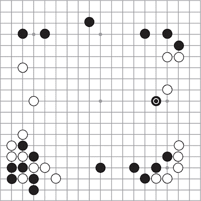

这一步违反了传统的围棋理论。对角线方法，或称*肩击*，是邀请白子沿着边延伸并形成坚固的墙壁。如果白子位于第三线而黑子位于第四线，这被认为是一种大致均等的交换：白子获得边上的分数，而黑子获得向中心的势力。但是当白子位于第四线时，墙壁锁定了过多的领地。（对于正在阅读的任何强大的围棋选手，我们为过于简化这一过程表示歉意。）第五线的肩击看起来有点业余——至少在“Alpha 教授”在与传奇人物的四局比赛中赢得四局之前是这样的。肩击是 AlphaGo 带来的许多惊喜中的第一个。快进一年，从顶级职业选手到业余俱乐部选手，每个人都开始尝试 AlphaGo 的走法。

在本章中，你将通过实现所有构建块来学习 AlphaGo 是如何工作的。AlphaGo 是监督深度学习（你已经在 第五章–第八章 中了解过）与自我对弈的深度强化学习（在第 第九章–第十二章 中介绍）的巧妙结合，以及以新颖的方式使用这些深度网络来改进树搜索。你可能会惊讶于你对 AlphaGo 成分的了解程度。更准确地说，我们将详细描述的 AlphaGo 系统工作如下：

+   你首先训练 *两个* 深度卷积神经网络（*策略网络*）来进行移动预测。其中一个网络架构稍微深一些，*产生更准确的结果*，而另一个则更小，*评估更快*。我们将分别称它们为 *强大* 和 *快速* 策略网络。

+   强大且快速的策略网络使用一个稍微复杂一些的棋盘编码器，具有 48 个特征平面。它们还使用比你在 第六章 和 第七章 中看到的更深的架构，但除此之外，它们应该看起来很熟悉。第 13.1 节 介绍了 AlphaGo 的策略网络架构。

+   在完成策略网络的第一次训练步骤后，你将强大的策略网络作为自我对弈的起点，这在 第 13.2 节 中有说明。如果你使用大量的计算能力来做这件事，这将导致你的机器人有巨大的改进。

+   作为下一步，你从强大的自我对弈网络中导出一个 *价值网络*，这在 第 13.3 节 中有详细说明。这完成了网络训练阶段，之后你不再进行任何深度学习。

+   要玩围棋，你使用树搜索作为游戏的基础，但与 第四章 中的纯蒙特卡洛滚动不同，你使用快速策略网络来指导下一步。同时，你平衡这个树搜索算法的输出与你的价值函数告诉你的信息。我们将在 第 13.4 节 中详细介绍这一创新。

+   从训练策略到自我对弈，再到在超人类水平上运行带有搜索的游戏，整个过程需要大量的计算资源和时间。第 13.5 节 会给你一些关于 AlphaGo 如何变得如此强大以及你可以从自己的实验中期待什么的想法。

图 13.2 给出了我们刚刚概述的整个过程的概览。在整个章节中，我们将深入探讨这个图的部分，并在相应的章节中提供更多细节。

##### 图 13.2\. 如何训练驱动 AlphaGo 人工智能的三个神经网络。从一组人类游戏记录开始，你可以训练两个神经网络来预测下一步棋：一个小巧快速的神经网络和一个大而强大的神经网络。然后，你可以通过强化学习进一步改进大网络的竞技强度。自我对弈游戏也提供了数据来训练一个价值网络。AlphaGo 然后使用一个树搜索算法，该算法可以产生极其强大的游戏表现。

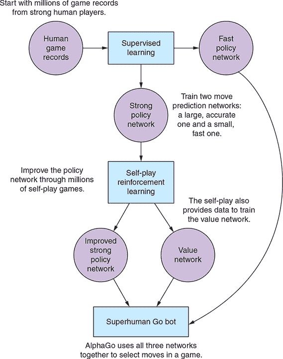

### 13.1\. 为 AlphaGo 训练深度神经网络

在介绍中，你了解到 AlphaGo 使用三个神经网络：两个策略网络和一个价值网络。虽然一开始这可能看起来很多，但在本节中，你会发现这些网络以及输入到它们中的特征在概念上彼此非常接近。AlphaGo 中使用的深度学习最令人惊讶的部分可能就是，在完成第五章 chapters 5 到第十二章 chapters 12 后，你已经对其了解了很多。在我们深入探讨这些神经网络是如何构建和训练的细节之前，让我们快速讨论它们在 AlphaGo 系统中的作用：

+   ***快速策略网络*—** 这个围棋走棋预测网络的大小与你在第七章 chapters 7 和第八章 chapters 8 中训练的网络相当。它的目的不是成为最准确的走棋预测器，而是一个真正快速预测走棋的好预测器。这个网络在 第 13.4 节 的树搜索展开中使用——你在第四章 chapters 4 中看到，你需要快速创建很多这样的网络，以便树搜索成为可能。我们将对这个网络稍微减少关注，并专注于以下两个。

+   ***强大策略网络*—** 这个走棋预测网络优化的是准确性，而不是速度。它是一个比快速版本更深层的卷积网络，在预测围棋走棋方面可以比快速版本好两倍以上。与快速版本一样，这个网络是在人类游戏数据上训练的，就像你在第七章 chapters 7 中做的那样。完成这个训练步骤后，强大策略网络将作为自我对弈的起点，使用第九章 chapters 9 和第十章 chapters 10 中的强化学习技术。这一步将使这个策略网络变得更强大。

+   ***价值网络*—** 强大策略网络进行的自我对弈游戏产生了一个新的数据集，你可以用它来训练一个价值网络。具体来说，你使用这些游戏的结局和第十一章 chapters 11 和第十二章 chapters 12 中的技术来学习一个价值函数。这个价值网络将在 第 13.4 节 中扮演一个核心角色。

#### 13.1.1\. AlphaGo 中的网络架构

现在，您大致了解了 AlphaGo 中三个深度神经网络各自的作用，我们可以向您展示如何使用 Keras 在 Python 中构建这些网络。在我们展示代码之前，这里是对网络架构的简要描述。如果您需要关于卷积网络的术语复习，请再次查看第七章。

+   强策略网络是一个 13 层的卷积网络。所有这些层都产生 19 × 19 的滤波器；您在整个网络中一致地保持原始棋盘大小。为了实现这一点，您需要相应地填充输入，就像在第七章中所做的那样。第一层卷积的核大小为 5，所有后续层都使用 3 核大小。最后一层使用 softmax 激活，有一个输出滤波器，前 12 层使用 ReLU 激活，每个有 192 个输出滤波器。

+   价值网络是一个 16 层的卷积网络，其中前 12 层与强策略网络完全相同。第 13 层是一个额外的卷积层，结构与第 2-12 层相同。第 14 层是一个核大小为 1 的卷积层，有一个输出滤波器。网络顶部有两个密集层，一个有 256 个输出和 ReLU 激活，另一个有一个输出和 tanh 激活。

如您所见，AlphaGo 中的策略网络和价值网络与您在第六章中遇到的相同类型的深度卷积神经网络。这两个网络如此相似的事实使得您可以用单个 Python 函数来定义它们。在这样做之前，我们介绍一个 Keras 中的小技巧，它可以大大缩短网络定义的长度。回想一下第七章，您可以使用 `ZeroPadding2D` 实用层在 Keras 中填充输入图像。这样做是可以的，但您可以通过将填充移动到 `Conv2D` 层来节省一些模型定义中的墨水。在价值和策略网络中，您想要对每个卷积层的输入进行填充，以便输出滤波器的大小与输入相同（19 × 19）。例如，您不需要明确地将第一层的 19 × 19 输入填充到 23 × 23 图像，以便后续的 5 核大小的卷积层产生 19 × 19 的输出滤波器，而是告诉卷积层保留输入大小。您通过向卷积层提供 `padding='same'` 参数来实现这一点，这将为您处理填充。有了这个巧妙的快捷方式，让我们定义 AlphaGo 的策略网络和价值网络共有的前 11 层。您可以在我们的 GitHub 仓库中找到这个定义，在 alphago.py 的 dlgo.networks 模块中。

##### 列表 13.1\. 在 AlphaGo 中初始化策略网络和价值网络的神经网络

```
from keras.models import Sequential
from keras.layers.core import Dense, Flatten
from keras.layers.convolutional import Conv2D

def alphago_model(input_shape, is_policy_net=False,       *1*
                  num_filters=192,                        *2*
                  first_kernel_size=5,
                  other_kernel_size=3):                   *3*

    model = Sequential()
    model.add(
        Conv2D(num_filters, first_kernel_size, input_shape=input_shape,
     padding='same',
               data_format='channels_first', activation='relu'))

    for i in range(2, 12):                                *4*
        model.add(
            Conv2D(num_filters, other_kernel_size, padding='same',
                   data_format='channels_first', activation='relu'))
```

+   ***1* 使用这个布尔标志，您指定您想要策略网络还是价值网络。**

+   ***2* 除了最后的卷积层外，所有层的过滤器数量相同。**

+   ***3* 第一层的核大小为 5，所有其他层只有 3。**

+   ***4* AlphaGo 的策略网络和价值网络的前 12 层是相同的。**

注意，你还没有指定第一层的输入形状。这是因为策略网络和价值网络的形状略有不同。当你我们在下一节介绍 AlphaGo 棋盘编码器时，你会看到这种差异。为了继续定义`model`，你只需要一个最终的卷积层就可以定义强大的策略网络。

##### 列表 13.2\. 在 Keras 中创建 AlphaGo 的强大策略网络

```
    if is_policy_net:
        model.add(
            Conv2D(filters=1, kernel_size=1, padding='same',
                   data_format='channels_first', activation='softmax'))
        model.add(Flatten())
        return model
```

如你所见，你添加了一个最终的`Flatten`层来展平预测并确保与第五章到第八章中之前的模型定义的一致性。

如果你想要返回 AlphaGo 的价值网络，添加两个额外的`Conv2D`层、两个`Dense`层和一个`Flatten`层来连接它们即可。

##### 列表 13.3\. 在 Keras 中构建 AlphaGo 的价值网络

```
    else:
        model.add(
            Conv2D(num_filters, other_kernel_size, padding='same',
                   data_format='channels_first', activation='relu'))
        model.add(
            Conv2D(filters=1, kernel_size=1, padding='same',
                   data_format='channels_first', activation='relu'))
        model.add(Flatten())
        model.add(Dense(256, activation='relu'))
        model.add(Dense(1, activation='tanh'))
        return model
```

我们在这里没有明确讨论快速策略网络的架构；快速策略的输入特征和网络架构的定义在技术上比较复杂，并不有助于更深入地理解 AlphaGo 系统。对于你自己的实验，使用我们 dlgo.networks 模块中的一个网络，如`small`、`medium`或`large`，是完全可行的。快速策略的主要思想是拥有一个比强大策略更小的网络，可以快速评估。我们将在接下来的章节中更详细地指导你进行训练过程。

#### 13.1.2\. AlphaGo 棋盘编码器

现在你已经了解了 AlphaGo 使用的网络架构，让我们来讨论如何以 AlphaGo 的方式编码围棋棋盘数据。你已经在第六章和第七章中实现了相当多的棋盘编码器，包括`oneplane`、`sevenplane`或`simple`，所有这些你都已经存储在 dlgo.encoders 模块中。AlphaGo 使用的特征平面比之前遇到的情况稍微复杂一些，但代表了迄今为止显示的编码器的自然延续。

AlphaGo 用于策略网络的棋盘编码器有 48 个特征平面；对于价值网络，你增加一个额外的平面来增强这些特征。这 48 个平面由 11 个概念组成，其中一些你之前已经使用过，而其他的是新的。我们将更详细地讨论每一个。总的来说，AlphaGo 比我们之前讨论的棋盘编码器例子更多地使用了围棋特定的战术情况。一个典型的例子是将*梯形捕捉和逃脱*的概念（见图 13.3）纳入特征集。

##### 图 13.3\. AlphaGo 直接将许多围棋战术概念编码到其特征平面中，包括*梯子*。在第一个例子中，一个白子只有一个自由度——这意味着黑子在下一次回合可以吃掉它。白子玩家延伸白子以获得额外的自由度。但黑子可以再次将白子减少到只有一个自由度。这个序列一直持续到触及棋盘边缘，此时白子被吃掉。另一方面，如果梯子路径上有白子，白子可能能够逃脱被吃掉。AlphaGo 包含了表示梯子是否成功的特征平面。

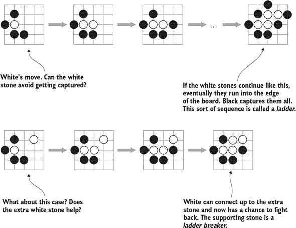

你在所有围棋棋盘编码器中一直使用的技术，AlphaGo 也有，那就是使用*二进制特征*。例如，在吃自由度（棋盘上的空相邻点）时，你不仅仅使用一个特征平面来为棋盘上的每个石头计算自由度，而是选择了一个二进制表示，其中平面表示石头是否有 1、2、3 个或更多自由度。在 AlphaGo 中，你看到的是完全相同的概念，但使用了八个特征平面来二进制化计数。在自由度的例子中，这意味着有八个平面来表示 1、2、3、4、5、6、7 个或至少 8 个自由度。

与你在第六章到第八章中看到的内容相比，唯一的根本区别是 AlphaGo 在*单独*的特征平面中明确编码了石头颜色。回想一下，在第七章的`sevenplane`编码器中，你既有黑子的自由度平面，也有白子的自由度平面。在 AlphaGo 中，你只有一套计算自由度的特征。此外，所有特征都是以下一个玩家的角度来表达的。例如，计算吃子大小的特征集，即计算一个移动会吃掉多少子，它计算的是*当前*玩家会吃掉的子，无论是什么颜色。

表 13.1 总结了 AlphaGo 中使用的所有特征。前 48 个平面用于策略网络，最后一个仅用于价值网络。

##### 表 13.1\. AlphaGo 使用的特征平面

| 特征名称 | 平面数量 | 描述 |
| --- | --- | --- |
| 石头颜色 | 3 | 三个表示石头颜色的特征平面——分别用于当前玩家、对手和棋盘上的空点。 |
| 1s | 1 | 一个完全填充值为 1 的特征平面。 |
| 0s | 1 | 一个完全填充值为 0 的特征平面。 |
| 敏感性 | 1 | 在这个平面上，如果移动是合法的并且不会填满当前玩家的眼位，则移动得分为 1，否则为 0。 |
| 自由度自上次移动以来 | 8 | 这组八个二进制平面表示移动发生前的移动次数。 |
| 自由度 | 8 | 该移动所属的石头串的自由度数量，分为八个二进制平面。 |
| 移动后的自由度 | 8 | 如果这个移动被实施，会产生多少自由度？ |
| 捕获大小 | 8 | 这个移动将捕获多少对手的棋子？ |
| 自我阿塔里大小 | 8 | 如果执行这个移动，你的多少自己的棋子会被放入阿塔里并可能在下一轮被对手捕获？ |
| 梯子捕获 | 1 | 这颗棋子能否在梯子中被捕获？ |
| 梯子逃脱 | 1 | 这颗棋子能否逃脱所有可能的梯子？ |
| 当前玩家颜色 | 1 | 如果当前玩家是黑子，则用 1 填充的平面，如果玩家是白子，则用 0 填充。 |

这些功能的实现可以在我们的 GitHub 仓库中找到，位于 dlgo.encoders 模块下的 alphago.py。虽然从表 13.1 实现每个特征集并不困难，但与 AlphaGo 中仍在我们面前的所有令人兴奋的部分相比，这也不算特别有趣。实现梯子捕获有些棘手，而编码自移动以来经过的回合数需要对你的围棋棋盘定义进行修改。所以如果你对如何实现这一点感兴趣，请查看我们在 GitHub 上的实现。

让我们快速看看如何初始化`AlphaGoEncoder`，这样你就可以用它来训练深度神经网络。你提供一个围棋棋盘大小和一个名为`use_player_plane`的布尔值，表示是否使用第 49 个特征平面。这如下面的列表所示。

##### 列表 13.4\. AlphaGo 棋盘编码器的签名和初始化

```
class AlphaGoEncoder(Encoder):
    def __init__(self, board_size, use_player_plane=False):
        self.board_width, self.board_height = board_size
        self.use_player_plane = use_player_plane
        self.num_planes = 48 + use_player_plane
```

#### 13.1.3\. 训练 AlphaGo 风格的策略网络

准备好网络架构和输入特征后，训练 AlphaGo 策略网络的第一个步骤遵循我们在第七章中介绍的确切程序：指定棋盘编码器和代理，加载围棋数据，并使用这些数据训练代理。图 13.4 说明了这个过程。你使用稍微更详细的特征和网络并不改变这一点。

##### 图 13.4\. AlphaGo 策略网络的监督训练过程与第六章和第七章中覆盖的流程完全相同。你回放人类游戏记录并重现游戏状态。每个游戏状态都被编码为一个张量（此图显示了一个只有两个平面的张量；AlphaGo 使用了 48 个平面）。训练目标是与棋盘大小相同的向量，在人类实际落子处为 1。

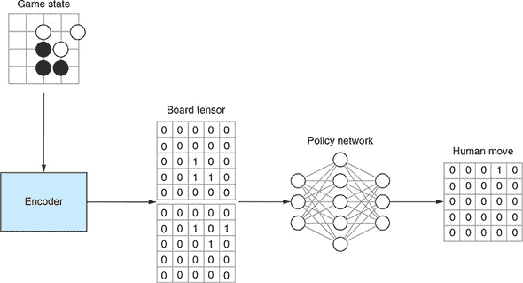

要初始化和训练 AlphaGo 的强大策略网络，你首先需要实例化一个`AlphaGoEncoder`，并为训练和测试创建两个围棋数据生成器，就像你在第七章中所做的那样。你可以在 GitHub 上的 examples/alphago/alphago_policy_sl.py 找到这一步。

##### 列表 13.5\. 加载 AlphaGo 策略网络训练的第一步数据

```
from dlgo.data.parallel_processor import GoDataProcessor
from dlgo.encoders.alphago import AlphaGoEncoder
from dlgo.agent.predict import DeepLearningAgent
from dlgo.networks.alphago import alphago_model

from keras.callbacks import ModelCheckpoint
import h5py

rows, cols = 19, 19
num_classes = rows * cols
num_games = 10000

encoder = AlphaGoEncoder()
processor = GoDataProcessor(encoder=encoder.name())
generator = processor.load_go_data('train', num_games, use_generator=True)
test_generator = processor.load_go_data('test', num_games,
 use_generator=True)
```

接下来，你可以使用本节之前定义的 `alphago_model` 函数加载 AlphaGo 的策略网络，并使用分类交叉熵和随机梯度下降编译这个 Keras 模型。我们称这个模型为 alphago_sl_policy，以表明它是一个通过监督学习（*sl*）训练的策略网络。

##### 列表 13.6\. 使用 Keras 创建 AlphaGo 策略网络

```
input_shape = (encoder.num_planes, rows, cols)
alphago_sl_policy = alphago_model(input_shape, is_policy_net=True)

alphago_sl_policy.compile('sgd', 'categorical_crossentropy',
 metrics=['accuracy'])
```

现在第一阶段训练剩下的就是调用这个策略网络的 `fit_generator` 方法，使用训练和测试生成器，就像你在第七章（kindle_split_019.xhtml#ch07）中做的那样。除了使用更大的网络和更复杂的编码器外，这正是你在第六章（kindle_split_018.xhtml#ch06）到第八章（kindle_split_020.xhtml#ch08）中所做的。

训练完成后，你可以从 `model` 和 `encoder` 创建一个 `DeepLearningAgent` 并将其存储起来，以备我们接下来讨论的下一个训练阶段使用。

##### 列表 13.7\. 训练和持久化策略网络

```
epochs = 200
batch_size = 128
alphago_sl_policy.fit_generator(
    generator=generator.generate(batch_size, num_classes),
    epochs=epochs,
    steps_per_epoch=generator.get_num_samples() / batch_size,
    validation_data=test_generator.generate(batch_size, num_classes),
    validation_steps=test_generator.get_num_samples() / batch_size,
    callbacks=[ModelCheckpoint('alphago_sl_policy_{epoch}.h5')]
)

alphago_sl_agent = DeepLearningAgent(alphago_sl_policy, encoder)

with h5py.File('alphago_sl_policy.h5', 'w') as sl_agent_out:
    alphago_sl_agent.serialize(sl_agent_out)
```

为了简化起见，在本章中，你不需要像原始 AlphaGo 论文中那样分别训练快速且强大的策略网络。你不需要训练一个更小、更快的第二个策略网络，而是可以使用 alphago_sl_agent 作为快速策略。在下一节中，你将看到如何使用这个智能体作为强化学习的起点，这将导致一个更强大的策略网络。

### 13.2\. 从策略网络启动自我对弈

在使用 alphago_sl_agent 训练了一个相对强大的策略智能体之后，你现在可以使用这个智能体让它与自己对弈，使用第十章（kindle_split_022.xhtml#ch10）中介绍的政策梯度算法。正如你将在第 13.5 节（#ch13lev1sec5）中看到的，在 DeepMind 的 AlphaGo 中，你让 *不同版本的强大策略网络* 与当前最强的版本对弈。这可以防止过拟合，并导致整体性能更好，但我们的简单方法让 alphago_sl_agent 与自己对弈传达了使用自我对弈来使策略智能体变得更强大的基本思想。

对于下一个训练阶段，你首先加载监督学习策略网络 alphago_sl_agent 两次：一个版本作为你的新强化学习智能体，称为 alphago_rl_agent，另一个作为其对手。这一步骤可以在 GitHub 上的 examples/alphago/alphago_policy_sl.py 中找到。

##### 列表 13.8\. 加载训练好的策略网络两次以创建两个自我对弈对手

```
from dlgo.agent.pg import PolicyAgent
from dlgo.agent.predict import load_prediction_agent
from dlgo.encoders.alphago import AlphaGoEncoder
from dlgo.rl.simulate import experience_simulation
import h5py

encoder = AlphaGoEncoder()

sl_agent = load_prediction_agent(h5py.File('alphago_sl_policy.h5'))
sl_opponent = load_prediction_agent(h5py.File('alphago_sl_policy.h5'))

alphago_rl_agent = PolicyAgent(sl_agent.model, encoder)
opponent = PolicyAgent(sl_opponent.model, encoder)
```

接下来，你可以使用这两个智能体进行自我对弈并存储由此产生的经验数据，用于训练目的。这些经验数据用于训练 alphago_rl_agent。然后你将训练好的强化学习策略智能体和通过自我对弈获得的经验数据存储起来，因为你还需要这些数据来训练 AlphaGo 的价值网络。

##### 列表 13.9\. 为你的 `PolicyAgent` 生成自我对弈数据

```
num_games = 1000
experience = experience_simulation(num_games, alphago_rl_agent, opponent)

alphago_rl_agent.train(experience)

with h5py.File('alphago_rl_policy.h5', 'w') as rl_agent_out:
    alphago_rl_agent.serialize(rl_agent_out)

with h5py.File('alphago_rl_experience.h5', 'w') as exp_out:
    experience.serialize(exp_out)
```

注意，这个例子使用了一个名为`experience_simulation`的效用函数，来自 dlgo.rl.simulate。实现可以在 GitHub 上找到，但这个函数所做的只是设置两个代理进行指定数量的游戏（`num_games`）的自我对弈，并将经验数据作为`ExperienceCollector`返回，这是一个在第九章中引入的概念。

当 AlphaGo 在 2016 年进入舞台时，最强的开源围棋机器人是 *Pachi*（你可以在附录 C 中了解更多信息），大约是 2 段业余水平。仅仅让强化学习代理 alphago_rl_agent 选择下一步就导致了 AlphaGo 对 Pachi 的 85%的胜率，这是一个令人印象深刻的胜率。在之前，卷积神经网络被用于围棋走法预测，但从未在 Pachi 上表现出超过 10%的胜率。这显示了自我对弈相对于纯监督学习使用深度神经网络的相对强度增益。如果你运行自己的实验，不要期望你的机器人一开始就有如此高的排名——你很可能没有（或负担不起）必要的计算能力。

### 13.3\. 从自我对弈数据中推导价值网络

AlphaGo 网络训练过程的第三步和最后一步是从你刚刚用于 alphago_rl_agent 的相同自我对弈经验数据中训练一个价值网络。这一步骤在结构上与上一步相似。你首先初始化一个 AlphaGo 价值网络，并使用一个 AlphaGo 棋盘编码器创建一个`ValueAgent`。这个训练步骤也可以在 GitHub 上的 examples/alphago/alphago_value.py 中找到。

##### 列表 13.10\. 初始化 AlphaGo 价值网络

```
from dlgo.networks.alphago import alphago_model
from dlgo.encoders.alphago import AlphaGoEncoder
from dlgo.rl import ValueAgent, load_experience
import h5py

rows, cols = 19, 19
encoder = AlphaGoEncoder()
input_shape = (encoder.num_planes, rows, cols)
alphago_value_network = alphago_model(input_shape)

alphago_value = ValueAgent(alphago_value_network, encoder)
```

现在，你可以再次从自我对弈中获取经验数据，并用它来训练你的价值代理，之后就像之前的两个一样持久化代理。

##### 列表 13.11\. 从经验数据中训练价值网络

```
experience = load_experience(h5py.File('alphago_rl_experience.h5', 'r'))

alphago_value.train(experience)

with h5py.File('alphago_value.h5', 'w') as value_agent_out:
    alphago_value.serialize(value_agent_out)
```

在这一点上，如果你要打破 DeepMind 的 AlphaGo 团队的前提（你不应该）并假设团队成员使用 Keras 的方式与你训练 AlphaGo 的方式相同（他们没有），那么你将能够接触到快速策略、强策略和价值网络的网络参数，你将拥有一个在超人类水平上玩围棋的围棋机器人。也就是说，前提是你知道如何在树搜索算法中适当地使用这三个深度网络。下一节将全部关于这一点。

### 13.4\. 使用策略和价值网络进行更好的搜索

回想一下第四章，在纯蒙特卡洛树搜索应用于围棋游戏中，你通过使用这四个步骤来构建游戏状态树：

1.  ***选择***—** 你通过在 *子节点* 中随机选择来遍历游戏树。

1.  ***扩展***—** 你向树中添加一个新的 *节点*（一个新的游戏状态）。

1.  ***评估***—** 从这个状态开始，有时也被称为 *叶节点*，完全随机地模拟一场游戏。

1.  ***更新***—** 模拟完成后，相应地更新你的树统计信息。

模拟许多游戏将导致越来越准确的统计数据，然后你可以使用这些数据来选择下一步。

AlphaGo 系统使用更复杂的树搜索算法，但你仍然会认出其中许多部分。前四个步骤仍然是 AlphaGo 的蒙特卡洛树搜索算法的核心，但你将巧妙地使用深度神经网络来评估位置、扩展节点和跟踪统计数据。在本章的其余部分，我们将向你展示具体如何操作，并在过程中开发 AlphaGo 的树搜索版本。

#### 13.4.1. 使用神经网络改进蒙特卡洛树搜索

第 13.1 节、13.2 节和 13.3 节详细描述了如何训练三个神经网络用于 AlphaGo：快速且强大的策略网络和值网络。你如何使用这些网络来改进蒙特卡洛树搜索？首先想到的是停止随机玩游戏，而是使用策略网络来引导模拟。这正是快速策略网络的作用，这也解释了其名称——模拟需要**快速**以执行大量操作。

下面的列表展示了如何从给定的围棋游戏状态中贪婪地选择策略网络中的移动。你选择最佳可能的移动，直到游戏结束，如果当前玩家获胜则返回 1，否则返回-1。

##### 列表 13.12. 使用快速策略网络进行模拟

```
def policy_rollout(game_state, fast_policy):
    next_player = game_state.next_player()
    while not game_state.is_over():
        move_probabilities = fast_policy.predict(game_state)
        greedy_move = max(move_probabilities)
        game_state = game_state.apply_move(greedy_move)

    winner = game_state.winner()
    return 1 if winner == next_player else -1
```

使用这种模拟策略本身就是有益的，因为策略网络在选择移动方面比抛硬币要自然得多。但你的改进空间仍然很大。

例如，当你到达树中的叶节点并需要扩展它时，你不必随机选择一个新节点进行扩展，而是可以**向强大的策略网络请求好的移动**。策略网络为你提供所有下一步的概率分布，每个节点可以跟踪这个概率，这样根据策略的强移动比其他移动更有可能被选择。我们称这些节点概率为**先验概率**，因为它们在执行任何树搜索之前就为我们提供了关于移动强度的先验知识。

最后，这是价值网络如何发挥作用。你已经通过用策略网络替换随机猜测来改进了你的 rollout 机制。尽管如此，在每一片叶子你只计算一个游戏的结局来估计叶子的价值。但估计位置的价值正是你训练价值网络擅长的事情，所以你已经有了一个复杂的猜测。AlphaGo 做的是 *权衡* rollout 的结果和价值网络的输出。如果你这么想，那和你作为一个人类玩游戏时做决定的方式很相似：你试图尽可能长远地展望，但你也考虑游戏的经验。如果你可以读出一个可能对你有利的移动序列，那么它可以超越你认为位置不是那么好的直觉，反之亦然。

现在你大致知道了 AlphaGo 中使用的三个深度神经网络的作用以及如何通过它们改进树搜索，让我们更详细地看看细节。

#### 13.4.2\. 带有组合价值函数的树搜索

在 第十一章 中，你看到了动作值，也称为 *Q 值*，应用于围棋游戏。为了回顾，对于一个当前棋盘状态 *s* 和一个潜在的下一步棋 *a*，动作值 *Q*(*s*,*a*) 估计在情况 *s* 下棋 *a* 会是好是坏。你很快就会看到如何定义 *Q*(*s*,*a*)；现在，只需注意 AlphaGo 搜索树中的每个节点都存储 Q 值。此外，每个节点还跟踪 *访问次数*，即这个节点被搜索遍历的频率，以及 *先验概率 P*(*s*,*a*)，或者强策略网络认为从 *s* 出发动作 *a* 的价值如何。

树中的每个节点恰好有一个父节点，但可能有多个 *子节点*，你可以将它们编码为 Python 字典，将移动映射到其他节点。按照这个约定，你可以定义一个 `AlphaGoNode` 如下。

##### 列表 13.13\. AlphaGo 树中一个节点的简单视图

```
class AlphaGoNode:
    def __init__(self, parent, probability):
        self.parent = parent
        self.children = {}

        self.visit_count = 0
        self.q_value = 0
        self.prior_value = probability
```

假设你被扔进一个正在进行的游戏，已经构建了一个大树，收集了访问次数和动作值的好估计。你想要模拟几场比赛并跟踪游戏统计数据，以便在模拟结束时，你可以选择你找到的最佳移动。你如何遍历树来模拟游戏？如果你处于游戏状态 *s*，并且分别表示访问次数为 *N*(*s*)，你可以选择一个动作如下：

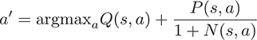

这可能一开始看起来有点复杂，但你可以将这个方程分解：

+   argmax 符号表示你取公式 *Q*(*s*,*a*) + *P*(*s*,*a*) / (1 + *N*(s,*a*)) 最大的 *a* 参数。

+   你要最大化的术语由两部分组成，Q 值和通过访问次数 *标准化* 的先验概率。

+   在开始时，访问次数为零，这意味着你通过最大化 *Q*(*s*,*a*) + *P*(*s*,*a*) 来对 Q 值和先验概率给予相同的权重。

+   如果访问次数变得非常大，项 *P*(*s*,*a*) / (1 + *N*(*s*,*a*)) 变得可以忽略不计，这实际上让你只剩下 *Q*(*s*,*a*)。

+   我们称这个效用函数为 *u*(*s*,*a*) = *P*(*s*,*a*) / (1 + *N*(*s*,*a*))。在下一节中，你将稍微修改 *u*(*s*,*a*)，但这个版本包含了你需要来推理它的所有组件。有了这个符号，你也可以为移动选择写出 a’ = argmax[a]*Q*(s,*a*) + *u*(*s*,*a*)。

总结一下，你通过权衡先验概率和 Q 值来选择动作。当你遍历树时，累积访问次数，并得到更好的 Q 值估计，你逐渐忘记你的 *先验估计*，并且越来越信任 Q 值。你也可以说，你依赖先验知识较少，探索更多。这可能与你的游戏体验相似。比如说，你整夜都在玩你最喜欢的策略棋盘游戏。在夜幕降临之初，你把所有先前的经验都带到桌面上，但随着夜晚的进行，你（希望）尝试新事物，并更新你对什么有效、什么无效的信念。

因此，这就是 AlphaGo 从现有树中选择动作的方式，但如果你到达了叶节点 *l*，如何 *扩展* 树呢？参见图 13.5。首先，你计算强策略网络 *P*(*l*) 的预测，并将它们作为 *l* 的每个子节点的先验概率存储。然后你通过以下方式 *评估* 叶节点：将策略回滚和价值网络 *结合*。

| *V*(*l*) = λ · value(*l*) + (1 – λ) · rollout(*l*) |
| --- |

在这个方程中，value(*l*) 是你的价值网络对 *l* 的结果，rollout(*l*) 表示从 *l* 出发的一个快速策略回滚的游戏结果，l 是介于 0 和 1 之间的一个值，你默认将其设置为 0.5。

##### 图 13.5。为了评估可能的棋盘位置，AlphaGo 结合了两个独立的评估。首先，它将棋盘位置输入到其价值网络中，该网络直接返回一个估计的获胜概率。其次，它使用快速策略网络从这个位置完成游戏，并观察谁获胜。在树搜索中使用的评估是这两个部分的加权总和。

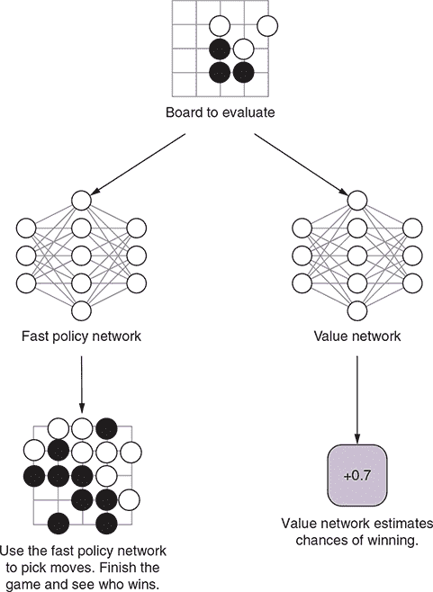

退一步来说，记住你希望通过树搜索模拟总共 *n* 场游戏来在最后选择一步棋。为了使这成为可能，你需要在模拟结束时更新访问次数和 Q 值。访问次数很容易；如果一个节点被搜索遍历，你只需将其计数增加 1。要更新 Q 值，你需要对所有访问过的叶节点 *l* 的 *V*(*l*) 求和，然后除以访问次数：

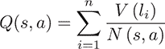

在这里，你将所有*n*次模拟的总和加起来，如果模拟遍历了对应于(*s*,*a*)的节点，则添加第*i*次模拟的叶节点值。为了总结整个过程，让我们看看你是如何修改了第四章中的四个步骤树搜索过程的：

1.  ***选择*—** 你通过选择最大化*Q*(*s*,*a*) + *u*(*s*,*a*)的动作来遍历游戏树。

1.  ***扩展*—** 当扩展一个新的叶节点时，你将一次询问强策略网络以存储每个子节点的先验概率。

1.  ***评估*—** 在模拟结束时，通过将值网络的输出与使用快速策略的 rollout 结果平均来评估一个叶节点。

1.  ***更新*—** 在完成所有模拟后，你更新模拟中访问的次数和 Q 值。

我们还没有讨论的一件事是在模拟完成后如何选择一个动作来*玩*。这很简单：你选择访问次数最多的节点！这甚至可能看起来有点过于简单，但请记住，随着 Q 值的提高，节点会越来越多地被访问。在你完成足够的模拟后，节点访问次数将为你提供关于动作相对价值的良好指示。

#### 13.4.3\. 实现 AlphaGo 的搜索算法

在讨论了 AlphaGo 如何结合树搜索使用神经网络之后，让我们继续在 Python 中实现这个算法。你的目标是创建一个具有`select_move`方法的`Agent`，该方法由 AlphaGo 方法论指定。本节的代码可以在 GitHub 上的 dlgo/agent/alphago.py 下找到。

你从 AlphaGo 树节点的完整定义开始，这在前面一节中已经草拟了。`AlphaGoNode`有一个父节点和子节点，它们以移动到其他节点的字典形式表示。节点还包含一个`visit_count`、一个`q_value`和一个`prior_value`。此外，你存储这个节点的*效用函数* `u_value`。

##### 列表 13.14\. 在 Python 中定义 AlphaGo 树节点

```
import numpy as np
from dlgo.agent.base import Agent
from dlgo.goboard_fast import Move
from dlgo import kerasutil
import operator

class AlphaGoNode:
    def __init__(self, parent=None, probability=1.0):
        self.parent = parent                          *1*
        self.children = {}                            *1*

        self.visit_count = 0
        self.q_value = 0
        self.prior_value = probability                *2*
        self.u_value = probability                    *3*
```

+   ***1* 树节点有一个父节点和可能有很多子节点。**

+   ***2* 节点以一个先验概率初始化。**

+   ***3* 效用函数将在搜索过程中更新。**

这样的节点将在树搜索算法的三个地方使用：

1.  **`select_child`—** 在模拟中遍历树时，你根据 argmax[a]*Q*(*s*,*a*) + *u*(*s*,*a*)选择节点的子节点；你选择最大化 Q 值和效用函数总和的动作。

1.  **`expand_children`—** 在一个叶节点，你会要求强策略评估从这个位置出发的所有合法移动，并为每个移动添加一个新的`AlphaGoNode`实例。

1.  **`update_values`—** 最后，在完成所有模拟后，你相应地更新`visit_count`、`q_value`和`u_value`。

如下所示，前两种方法很简单。

##### 列表 13.15\. 通过最大化 Q 值选择 AlphaGo 子节点

```
class AlphaGoNode():
...

    def select_child(self):
        return max(self.children.items(),
                   key=lambda child: child[1].q_value + \
                   child[1].u_value)

    def expand_children(self, moves, probabilities):
        for move, prob in zip(moves, probabilities):
            if move not in self.children:
                self.children[move] = AlphaGoNode(probability=prob)
```

更新 AlphaGo 节点汇总统计的第三种方法稍微复杂一些。首先，您使用一个稍微复杂一点的效用函数：

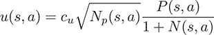

与上一节中引入的版本相比，这个效用有两个额外的项。第一个项 *c[u]*，我们在代码中将其称为 `c_u`，通过一个固定的 *constant* 缩放所有节点的效用，我们默认设置为 5。第二个项通过父节点访问次数的平方根进一步缩放效用（您用 *Np* 表示所讨论节点的父节点）。这导致父节点被访问得更频繁的节点具有更高的效用。

##### 列表 13.16\. 更新 AlphaGo 节点的访问次数、Q 值和效用

```
class AlphaGoNode():
...

    def update_values(self, leaf_value):
        if self.parent is not None:
            self.parent.update_values(leaf_value)                   *1*

        self.visit_count += 1                                       *2*

        self.q_value += leaf_value / self.visit_count               *3*

        if self.parent is not None:
            c_u = 5
            self.u_value = c_u * np.sqrt(self.parent.visit_count) \
                * self.prior_value / (1 + self.visit_count)         *4*
```

+   ***1* 首先更新父节点以确保从上到下遍历树。**

+   ***2* 增加此节点的访问次数。**

+   ***3* 将指定的叶值添加到 Q 值中，并按访问次数进行归一化。**

+   ***4* 使用当前访问次数更新效用。**

这完成了 `AlphaGoNode` 的定义。现在您可以使用这个树结构在 AlphaGo 中使用的搜索算法。您将要实现的 `AlphaGoMCTS` 类是一个 `Agent`，它通过多个参数进行初始化。首先，您为这个代理提供一个快速且强大的策略和一个值网络。其次，您需要指定 AlphaGo 特定的回滚和评估参数：

+   **`lambda_value`—** 这是您用于权衡回滚和值函数的 l 值：*V*(*l*) = l·value(*l*) + (1 – l) · rollout(*l*).

+   **`num_simulations`—** 此值指定在移动选择过程中将运行多少次模拟。

+   **`depth`—** 使用此参数，您告诉算法每个模拟需要前瞻多少步（您指定搜索深度）。

+   **`rollout_limit`—** 在确定叶值时，您运行一个策略回滚 rollout(*l*)。您使用参数 `rollout_limit` 来告诉 AlphaGo 在判断结果之前需要回滚多少步。

##### 列表 13.17\. 初始化 `AlphaGoMCTS` 围棋玩代理

```
class AlphaGoMCTS(Agent):
    def __init__(self, policy_agent, fast_policy_agent, value_agent,
                 lambda_value=0.5, num_simulations=1000,
                 depth=50, rollout_limit=100):
        self.policy = policy_agent
        self.rollout_policy = fast_policy_agent
        self.value = value_agent

        self.lambda_value = lambda_value
        self.num_simulations = num_simulations
        self.depth = depth
        self.rollout_limit = rollout_limit
        self.root = AlphaGoNode()
```

现在是时候实现这个新 `Agent` 的 `select_move` 方法了，这个方法在这个算法中做了大部分繁重的工作。我们在上一节中概述了 AlphaGo 的树搜索过程，但让我们再次过一遍步骤：

+   当您想要移动时，您首先在您的游戏树上运行 `num_simulations` 次模拟。

+   在每次模拟中，你执行前瞻搜索，直到达到指定的 `depth`。

+   如果一个节点没有任何子节点，则通过为每个合法移动添加新的 `AlphaGoNode` 来 *扩展* 树，使用强大的策略网络作为先验概率。

+   如果一个节点有子节点，则通过选择最大化 Q 值加效用的移动来 *选择* 一个。

+   在围棋盘上播放这个模拟中使用的移动。

+   当达到深度时，通过计算值网络和政策回滚的联合值函数来评估此叶节点。

+   使用模拟的叶值更新所有 AlphaGo 节点。

这个过程正是你将在 `select_move` 中实现的内容。请注意，这个方法使用了两个我们稍后将要讨论的其他实用方法：`policy_probabilities` 和 `policy_rollout`。

##### 列表 13.18\. AlphaGo 树搜索过程中的主方法

```
class AlphaGoMCTS(Agent):
...

    def select_move(self, game_state):
        for simulation in range(self.num_simulations):          *1*
            current_state = game_state
            node = self.root
            for depth in range(self.depth):                     *2*
                if not node.children:                           *3*
                    if current_state.is_over():
                        break
                    moves, probabilities =
     self.policy_probabilities(current_state)                   *4*
                    node.expand_children(moves, probabilities)

                move, node = node.select_child()                *5*
                current_state = current_state.apply_move(move)  *5*

            value = self.value.predict(current_state)           *6*
            rollout = self.policy_rollout(current_state)        *6*

            weighted_value = (1 - self.lambda_value) * value + \
                self.lambda_value * rollout                     *7*

            node.update_values(weighted_value)                  *8*
```

+   ***1* 从当前状态开始，执行一系列模拟。**

+   ***2* 执行移动直到达到指定的深度。**

+   ***3* 如果当前节点没有任何子节点...**

+   ***4* ...使用强策略的概率来扩展它们。**

+   ***5* 如果有子节点，你可以选择一个并执行相应的移动。**

+   ***6* 计算价值网络输出和快速策略的模拟。**

+   ***7* 确定组合价值函数。**

+   ***8* 在备份阶段更新此节点的值。**

你可能已经注意到，尽管你运行了所有模拟，但你还没有执行任何移动。你通过执行最常访问的节点来完成这一操作，之后唯一剩下的事情就是相应地设置一个新的 `root` 节点并返回建议的移动。

##### 列表 13.19\. 选择最常访问的节点并更新树的根节点

```
class AlphaGoMCTS(Agent):
...
    def select_move(self, game_state):
    ...

        move = max(self.root.children, key=lambda move:       *1*
                   self.root.children.get(move).visit_count)  *1*

        self.root = AlphaGoNode()
        if move in self.root.children:                        *2*
            self.root = self.root.children[move]
            self.root.parent = None

        return move
```

+   ***1* 选择根节点的最常访问子节点作为下一个移动。**

+   ***2* 如果选择的移动是一个子节点，将新的根设置为这个子节点。**

这已经完成了 AlphaGo 树搜索的主要过程，所以让我们看看我们之前忽略的两个实用方法。`policy_probabilities`，在节点扩展中使用，计算强策略网络的预测，将预测限制在合法移动上，然后对剩余的预测进行归一化。该方法返回合法移动及其归一化的策略网络预测。

##### 列表 13.20\. 计算棋盘上合法移动的正常化强策略值

```
class AlphaGoMCTS(Agent):
...

    def policy_probabilities(self, game_state):
        encoder = self.policy._encoder
        outputs = self.policy.predict(game_state)
        legal_moves = game_state.legal_moves()
        if not legal_moves:
            return [], []
        encoded_points = [encoder.encode_point(move.point) for move in
 legal_moves if move.point]
        legal_outputs = outputs[encoded_points]
        normalized_outputs = legal_outputs / np.sum(legal_outputs)
        return legal_moves, normalized_outputs
```

你需要的最后一个辅助方法是 `policy_rollout`，用于使用快速策略计算模拟的游戏结果。这个方法所做的只是根据快速策略 *贪婪地* 选择最强的移动，直到达到模拟限制，然后查看谁赢了。如果你移动的玩家赢了，则返回 1，如果另一个玩家赢了，则返回 –1，如果没有达到结果，则返回 0。

##### 列表 13.21\. 继续游戏直到达到 `rollout_limit`

```
class AlphaGoMCTS(Agent):
...

    def policy_rollout(self, game_state):
        for step in range(self.rollout_limit):
            if game_state.is_over():
                break
            move_probabilities = self.rollout_policy.predict(game_state)
            encoder = self.rollout_policy.encoder
            valid_moves = [m for idx, m in enumerate(move_probabilities)
                           if Move(encoder.decode_point_index(idx)) in
 game_state.legal_moves()]
            max_index, max_value = max(enumerate(valid_moves),
 key=operator.itemgetter(1))
            max_point = encoder.decode_point_index(max_index)
            greedy_move = Move(max_point)
            if greedy_move in game_state.legal_moves():
                game_state = game_state.apply_move(greedy_move)

        next_player = game_state.next_player
        winner = game_state.winner()
        if winner is not None:
            return 1 if winner == next_player else -1
        else:
            return 0
```

在你投入大量工作开发 `Agent` 框架并实现 AlphaGo 代理之后，你现在可以使用 `AlphaGoMCTS` 实例轻松地玩游戏。

##### 列表 13.22\. 使用三个深度神经网络初始化 AlphaGo 代理

```
from dlgo.agent import load_prediction_agent, load_policy_agent, AlphaGoMCTS
from dlgo.rl import load_value_agent
import h5py

fast_policy = load_prediction_agent(h5py.File('alphago_sl_policy.h5', 'r'))
strong_policy = load_policy_agent(h5py.File('alphago_rl_policy.h5', 'r'))
value = load_value_agent(h5py.File('alphago_value.h5', 'r'))

alphago = AlphaGoMCTS(strong_policy, fast_policy, value)
```

这个代理可以像你在第七章（kindle_split_019.xhtml#ch07）到第十二章（kindle_split_024.xhtml#ch12）中开发的其它所有代理一样使用。特别是，你可以为这个代理注册 HTTP 和 GTP 前端，就像你在第八章（kindle_split_020.xhtml#ch08）中所做的那样。这使得你可以与你的 AlphaGo 机器人玩游戏，让其他机器人与之对抗，甚至可以在在线围棋服务器（如附录 E 中所示的 OGS）上注册和运行它。

### 13.5. 训练自己的 AlphaGo 的实际考虑因素

在上一节中，你开发了一个 AlphaGo 使用的树搜索算法的初步版本。这个算法*可以*达到超凡的围棋游戏水平，但你需要仔细阅读说明才能达到那个水平。你需要不仅确保你训练好 AlphaGo 中使用的所有三个深度神经网络，还要确保树搜索中的模拟运行得足够快，这样你就不必连续等待数小时等待 AlphaGo 提出下一步棋。以下是一些帮助你充分利用它的提示：

+   训练的第一步，策略网络的监督学习，是在 160,000 场 KGS 比赛语料库上进行的，这相当于大约 3000 万个游戏状态。DeepMind 的 AlphaGo 团队总共计算了 3.4 亿个训练步骤。

+   好消息是，你可以访问完全相同的数据集；DeepMind 使用了我们在第七章中介绍过的 KGS 训练集。原则上，没有任何东西阻止你运行相同数量的训练步骤。坏消息是，即使你拥有最先进的 GPU，训练过程可能需要数月甚至数年。

+   AlphaGo 团队通过在 50 个 GPU 上*分配*训练任务，将训练时间缩短至三周来解决这一问题。这对你来说可能不是一个可行的选项，尤其是因为我们还没有讨论如何以分布式方式训练深度网络。

+   为了得到令人满意的结果，你可以缩小方程的每一部分。使用第七章或第八章中的某个棋盘编码器，并使用比本章中介绍的 AlphaGo 策略网络和价值网络小得多的网络。此外，首先从一个小的训练集开始，这样你就能对训练过程有一个感觉。

+   在自我对弈中，DeepMind 生成了 3000 万个不同的位置。这远远超过你实际希望创造的。一般来说，尝试生成尽可能多的自我对弈位置，就像从监督学习中生成的人类游戏位置一样。

+   如果你只是简单地使用本章中介绍的大型网络，并在非常少的数据上进行训练，你很可能会比在更多数据上运行较小的网络效果更差。

+   在模拟中，快速策略网络被频繁使用，所以为了加快树搜索速度，确保你的快速策略一开始就非常小，例如第六章中使用的网络。

+   你在上一节中实现的树搜索算法是*顺序*计算模拟的。为了加快这个过程，DeepMind 对搜索进行了并行化，并使用了总共 40 个搜索线程。在这个并行版本中，多个 GPU 被用来并行评估深度网络，而多个 CPU 被用来执行树搜索的其他部分。

+   在多个 CPU 上运行树搜索在原则上是可以实现的（回想一下，你在第七章中也是使用了多线程进行数据准备），但内容过于复杂，这里不便详细展开。

+   你可以通过减少模拟次数和搜索深度来提高游戏体验，以速度换取强度。这不会导致超凡的表现，但至少系统变得可玩。

如你所见，虽然将监督学习和强化学习与树搜索以这种新颖的方式相结合是一种令人印象深刻的成就，但将网络训练、评估和树搜索扩展到规模所需的工程努力，在构建第一个能比顶尖职业选手玩得更好的围棋机器人方面，也应得到应有的认可。

在上一章中，你将看到 AlphaGo 系统的下一个发展阶段。它不仅跳过了从人类游戏记录中进行的监督学习，而且比本章实现的原始 AlphaGo 系统表现得更加出色。

### 13.6. 概述

+   为了驱动 AlphaGo 系统，你必须训练三个深度神经网络：两个策略网络和一个价值网络。

+   快速策略网络从人类游戏数据中训练，并且必须足够快，以便在 AlphaGo 的树搜索算法中运行多次滚动。滚动结果用于评估叶位置。

+   强策略网络首先在人类数据上训练，然后通过自我对弈和策略梯度算法进行改进。你使用这个网络在 AlphaGo 中计算节点选择的先验概率。

+   价值网络在自我对弈生成的经验数据上训练，用于评估叶节点的位置，并与策略滚动一起使用。

+   使用 AlphaGo 选择走法意味着生成大量模拟，遍历游戏树。在模拟步骤完成后，选择访问次数最多的节点。

+   在模拟中，节点是通过最大化 Q 值加上效用值来选择的。

+   当达到叶节点时，节点通过使用强策略来扩展先验概率。

+   叶节点通过一个组合价值函数进行评估，该函数将价值网络的输出与快速策略滚动的结果混合。

+   在算法的备份阶段，访问次数、Q 值和效用值根据所选动作进行更新。

## 第十四章. AlphaGo Zero：将树搜索与强化学习集成

*本章涵盖*

+   使用蒙特卡洛树搜索的变体玩游戏

+   将树搜索集成到自我对弈的强化学习中

+   训练神经网络以增强树搜索算法

在 DeepMind 公布了 AlphaGo 的第二个版本，代号为 *Master* 之后，全世界的围棋爱好者都仔细审视了其令人震惊的棋风。Master 的比赛充满了令人惊讶的新走法。尽管 Master 是从人类游戏中启动的，但它通过强化学习不断得到增强，这使得它能够发现人类未曾玩过的走法。

这引发了一个明显的问题：如果 AlphaGo 完全不依赖人类游戏，而是完全使用强化学习来学习，它是否还能达到超人类水平，或者它会陷入与初学者的对局？它会重新发现人类大师所玩过的模式，还是会以一种难以理解的新外星风格进行游戏？当 AlphaGo Zero（AGZ）在 2017 年宣布时，所有这些问题都得到了解答。

AlphaGo Zero 是基于一个改进的强化学习系统构建的，并且它从零开始自我训练，没有任何来自人类游戏的输入。尽管它的第一场比赛比任何人类初学者的比赛都要差，但 AGZ 不断稳步提升，并迅速超越了 AlphaGo 的所有先前版本。

对我们来说，AlphaGo Zero 最令人惊讶的事情是它如何以更少的资源做更多的事情。在许多方面，AGZ 比原始的 AlphaGo 简单得多。不再有手工制作的特征平面。不再有人类游戏记录。不再有蒙特卡洛模拟。AlphaGo Zero 使用一个神经网络和一个训练过程，而不是两个神经网络和三个训练过程。

然而，AlphaGo Zero 比原始的 AlphaGo 更强大！这是如何实现的？

首先，AGZ 使用了一个真正庞大的神经网络。最强版本运行在一个容量大约相当于 80 个卷积层的网络上——是原始 AlphaGo 网络的四倍以上。

第二，AGZ 使用了一种创新的新的强化学习技术。原始的 AlphaGo 单独训练其策略网络，方式与我们第十章（kindle_split_022.xhtml#ch10）中描述的类似；后来该策略网络被用来改进树搜索。相比之下，AGZ 从一开始就将树搜索与强化学习相结合。这个算法是本章的重点。

首先，我们概述 AGZ 训练的神经网络结构。接下来，我们深入描述树搜索算法。AGZ 在自我对局和竞技比赛中都使用相同的树搜索。然后，我们介绍 AGZ 如何从其经验数据中训练其网络。最后，我们简要介绍一些 AGZ 用来使训练过程稳定和高效的实用技巧。

### 14.1. 构建用于树搜索的神经网络

AlphaGo Zero 使用了一个具有一个输入和两个输出的单一神经网络：一个输出产生对移动的概率分布，另一个输出产生一个代表游戏是否有利于白方或黑方的单一值。这正是我们在第十二章（kindle_split_024.xhtml#ch12）中使用的演员-评论家学习结构。

AGZ 网络的输出与我们第十二章中使用的网络输出之间有一个小的差异，差异在于游戏中的“过”。在之前我们实现自我对弈的案例中，我们硬编码了关于“过”的逻辑以结束游戏。例如，第九章中的 `PolicyAgent` 自我对弈机器人包含了自定义逻辑，这样它就不会填满自己的眼位，从而杀死自己的棋子。如果唯一的合法移动是自我毁灭性的，`PolicyAgent` 将会“过”。这确保了自我对弈游戏以一个合理的位置结束。

因为 AGZ 在自我对弈时使用树搜索，所以你不需要那种自定义逻辑。你可以将“过”视为与其他任何移动一样，并期望机器人学习何时应该“过”。如果树搜索显示下棋会输掉游戏，它将选择“过”。这意味着你的动作输出需要为每个棋盘上的点返回一个“过”的概率。而不是返回一个表示棋盘上每个点的 19 × 19 = 361 大小的向量，你的网络将生成一个 19 × 19 + 1 = 362 大小的向量来表示棋盘上的每个点以及“过”的移动。图 14.1 展示了这种新的移动编码。

##### 图 14.1\. 将可能的移动编码为向量。与之前的章节一样，AGZ 使用一个向量，其中每个元素映射到游戏板上的一个点。AGZ 添加了一个映射到“过”移动的最后一个元素。这个例子是在一个 5 × 5 的棋盘上，所以向量维度为 26：25 个表示棋盘上的点，1 个表示“过”。

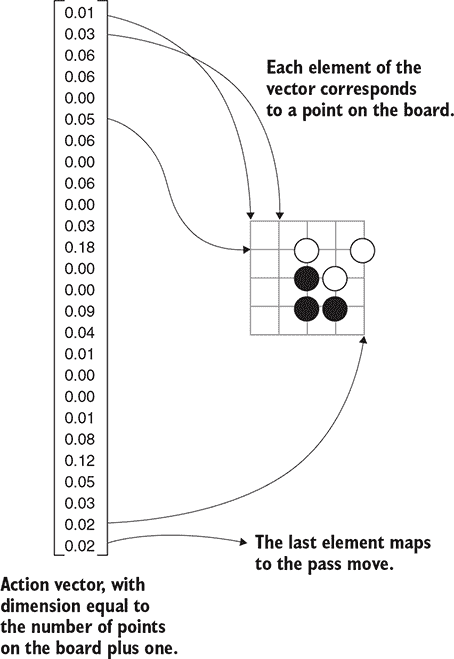

这意味着你必须稍微修改棋盘编码器。在之前的棋盘编码器中，你实现了 `encode_point` 和 `decode_point_index`，它们在向量的元素和棋盘上的点之间进行转换。对于 AGZ 风格的机器人，你将用新的函数 `encode_move` 和 `decode_move_index` 替换这些函数。下棋的编码保持不变；你使用下一个索引来表示“过”。

##### 列表 14.1\. 修改棋盘编码器以包含“过”

```
class ZeroEncoder(Encoder):
...
    def encode_move(self, move):
        if move.is_play:
            return (self.board_size * (move.point.row - 1) +  *1*
                (move.point.col - 1))                         *1*
        elif move.is_pass:
            return self.board_size * self.board_size          *2*
        raise ValueError('Cannot encode resign move')         *3*

    def decode_move_index(self, index):
        if index == self.board_size * self.board_size:
            return Move.pass_turn()
        row = index // self.board_size
        col = index % self.board_size
        return Move.play(Point(row=row + 1, col=col + 1))

    def num_moves(self):
        return self.board_size * self.board_size + 1
```

+   ***1* 与之前编码器使用的相同点编码**

+   ***2* 使用下一个索引来表示“过”**

+   ***3* 神经网络不会学习认输。**

除了对“过”的处理外，AGZ 网络的输入和输出与我们第十二章中介绍的内容相同。对于网络的内部层，AGZ 使用了极其深的卷积层堆叠，并添加了一些现代改进以使训练更加平滑（我们将在本章末尾简要介绍这些改进）。大型网络功能强大，但也需要更多的计算，无论是训练还是自我对弈。如果你没有像 DeepMind 那样的硬件，你可能用较小的网络会有更好的运气。请随意实验，以找到满足你需求的功率和速度的最佳平衡。

至于棋盘编码，您可以使用本书中提到的任何编码方案，从第六章中的基本编码器到第十三章中的 48 平面编码器。AlphaGo Zero 使用了最简单的编码器：只是棋盘上黑白棋子的位置，加上一个表示轮到谁的平面。（为了处理劫争，AGZ 还包括了前七个棋盘位置的平面。）但是，没有技术理由说明您不能使用特定于游戏的特征平面，而且它们可能会使学习更快。在某种程度上，研究人员想要尽可能多地移除人类知识，只是为了证明这是可能的。在您自己的实验中，您应该可以自由尝试使用 AGZ 强化学习算法的不同特征平面组合。

### 14.2. 使用神经网络引导树搜索

在强化学习中，一个*策略*是一个算法，它告诉智能体如何做出决策。在之前的强化学习示例中，策略相对简单。在策略梯度学习（第十章）和演员-评论家学习（第十二章）中，神经网络直接告诉您选择哪个走法：这就是策略。在 Q 学习（第十一章）中，策略涉及到计算每个可能走法的 Q 值；然后您选择 Q 值最高的走法。

AGZ 的策略包括一种树搜索形式。您仍然会使用神经网络，但神经网络的目的在于引导树搜索，而不是直接选择或评估走法。在自我对弈中包含树搜索意味着自我对弈的游戏更加真实。反过来，这意味着训练过程更加稳定。

树搜索算法建立在您已经学习过的想法之上。如果您已经学习了蒙特卡洛树搜索算法（第四章）和原始 AlphaGo（第十三章），那么 AlphaGo Zero 的树搜索算法将看起来很熟悉；表 14.1 比较了这三种算法。首先，我们将描述 AGZ 用来表示游戏树的数据结构。接下来，我们将介绍 AGZ 用来向游戏树添加新位置的计算方法。

##### 表 14.1. 比较树搜索算法

|   | MCTS | AlphaGo | AlphaGo Zero |
| --- | --- | --- | --- |
| **分支选择** | UCT 分数 | UCT 分数 + 策略网络的先验 | UCT 分数 + 结合网络的先验 |
| **分支评估** | 随机模拟 | 值网络 + 随机模拟 | 结合网络的值 |

树搜索算法的一般思想，如应用于棋类游戏，是找到导致最佳结果的一步棋。你通过检查可能跟随的移动序列来确定这一点。但是，可能的序列数量是巨大的，因此你需要在检查可能的序列的一小部分时做出决定。树搜索算法的艺术和科学在于如何选择要探索的分支，以便在尽可能短的时间内获得最佳结果。

正如在 MCTS 中，AGZ 树搜索算法运行一定数量的回合，并且在每个回合中，它将另一个棋盘位置添加到树中。随着你执行越来越多的回合，树继续变大，算法的估计变得更加准确。为了说明目的，想象你已经处于算法的中间：你已经建立了一个部分树，并且你想用一个新的棋盘位置扩展树。图 14.2 显示了这样一个示例游戏树。

##### 图 14.2\. 一种部分 AGZ 风格的搜索树。在这种情况下，轮到黑方移动，搜索已经探索了三种可能的游戏状态。树还包含代表搜索尚未访问的移动的分支；为了节省空间，大多数这些分支都被省略了。

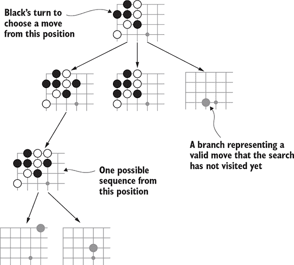

游戏树中的每个节点代表一个可能的棋盘位置。从该位置，你也知道哪些后续移动是合法的。算法已经访问了一些后续移动，但并非全部。对于每个后续移动，无论你是否访问过，你都会创建一个*分支*。每个分支跟踪以下内容：

+   移动的*先验概率*，表示在尝试访问之前你期望这个移动有多好。

+   在树搜索期间你访问该分支的次数。这可能为零。

+   所有通过此分支的访问的*期望值*。这是对所有通过树的访问的平均值。为了使更新这个平均值更容易，你存储值的总和；然后你可以除以访问次数来得到平均值。

对于你*已经访问过的每个分支*，节点还包含一个指向*子节点*的指针。在以下列表中，你定义了一个最小的`Branch`结构来包含分支统计信息。

##### 列表 14.2\. 跟踪分支统计的结构

```
class Branch:
    def __init__(self, prior):
        self.prior = prior
        self.visit_count = 0
        self.total_value = 0.0
```

现在，你已经准备好构建表示搜索树的结构的结构了。以下列表定义了一个`ZeroTreeNode`类。

##### 列表 14.3\. AGZ 风格搜索树中的一个节点

```
class ZeroTreeNode:
    def __init__(self, state, value, priors, parent, last_move):
        self.state = state
        self.value = value
        self.parent = parent                      *1*
        self.last_move = last_move                *1*
        self.total_visit_count = 1
        self.branches = {}
        for move, p in priors.items():
            if state.is_valid_move(move):
                self.branches[move] = Branch(p)
        self.children = {}                        *2*

    def moves(self):                              *3*
        return self.branches.keys()               *3*

    def add_child(self, move, child_node):        *4*
        self.children[move] = child_node          *4*

    def has_child(self, move):                    *5*
        return move in self.children              *6*
```

+   ***1* 在树的根节点中，parent 和 last_move 将是 None。**

+   ***2* 之后，子节点将从一个移动映射到另一个 ZeroTreeNode。**

+   ***3* 返回从该节点出发的所有可能的移动**

+   ***4* 允许将新节点添加到树中**

+   ***5* 检查是否存在特定移动的子节点**

+   ***6* 返回特定的子节点**

`ZeroTreeNode`类还包括一些辅助函数，用于从其子节点读取统计数据。

##### 列表 14.4. 从树节点读取分支信息的辅助函数

```
class ZeroTreeNode:
...
    def expected_value(self, move):
        branch = self.branches[move]
        if branch.visit_count == 0:
            return 0.0
        return branch.total_value / branch.visit_count

    def prior(self, move):
        return self.branches[move].prior

    def visit_count(self, move):
        if move in self.branches:
            return self.branches[move].visit_count
        return 0
```

#### 14.2.1. 向下走树

在搜索的每一轮中，你首先从树中向下走。目的是看看可能的未来棋盘位置是什么，以便评估它是否好。为了获得准确的评估，你应该假设你的对手将以最强烈的方式对你的移动做出回应。当然，你还不确定最强的回应是什么；你必须尝试各种移动来找出哪些是好的。本节描述了一个在不确定性面前选择强移动的算法。

期望值提供了对每个可能移动的好坏的估计。但这些估计并不完全准确。如果你在某个特定分支上花费了更多时间阅读，其估计将更好。

你可以继续更详细地阅读其中一种最佳变化，这将进一步提高其估计。或者，你可以阅读你探索较少的分支，以改善你的估计。也许这个移动比你最初想象的要好；唯一找到的方法是进一步扩展它。再次，你看到了*利用*和*探索*的对立目标。

原始的 MCTS 算法使用了 UCT（树的置信上限；见第四章 chapter 4）公式来平衡这些目标。UCT 公式平衡了两个优先级：

+   如果你多次访问过某个分支，你会信任它的期望值。在这种情况下，你更倾向于选择具有更高估计值的分支。

+   如果你只访问过某个分支几次，其期望值可能相差甚远。无论其期望值是好是坏，你都想访问它几次以提高其估计。

AGZ 添加了第三个因素：

+   在访问次数较少的分支中，你更喜欢那些具有高先验概率的分支。这些是在考虑游戏的详细细节之前直观上看起来很好的移动。

从数学上讲，AGZ 的评分函数看起来是这样的：

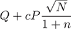

方程式的各个部分如下：

+   *Q* 是通过分支访问的所有访问的平均期望值。（如果你还没有访问过该分支，则为零。）

+   *P* 是考虑中的移动的先验概率。

+   *N* 是访问父节点的次数。

+   *n* 是访问子分支的次数。

+   *c* 是平衡探索和利用的一个因素（通常，你必须通过试错来设置这个值）。

看看图 14.3 的例子。分支 A 已被访问两次，Q = 0.1 的评估略好。分支 B 已被访问一次，评估不好：Q = –0.5。分支 C 尚未访问，但先验概率为 P = 0.038。

##### 图 14.3\. 在 AGZ 树搜索中选择要跟随的分支。在这个例子中，你正在考虑从起始位置出发的三条分支。（实际上，会有更多的可能移动，但我们为了节省空间而省略了。）为了选择一个分支，你考虑你已经访问该分支的次数、对该分支的估计值以及移动的先验概率。

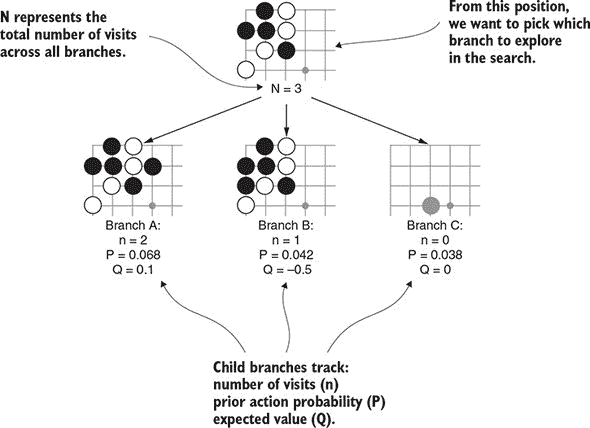

表 14.2 展示了如何计算不确定性成分。分支 A 具有最高的 Q 成分，表明你已经在它下面看到了一些好的棋盘位置。分支 C 具有最高的 UCT 成分：我们从未访问过，所以我们对该分支的不确定性最高。分支 B 的评估低于 A，访问次数多于 C，所以在这个时候它不太可能是一个好的选择。

##### 表 14.2\. 选择要跟随的分支

|   | Q | n | N | P√N / (n + 1) |
| --- | --- | --- | --- | --- | --- |
| **分支 A** | 0.1 | 2 | 3 | 0.068 | 0.039 |
| **分支 B** | –0.5 | 1 | 3 | 0.042 | 0.036 |
| **分支 C** | 0 | 0 | 3 | 0.038 | 0.065 |

假设你已经排除了分支 B，你如何在分支 A 和分支 C 之间进行选择？这取决于参数 *c* 的值。*c* 的较小值倾向于高值分支（在这种情况下，A）。*c* 的较大值倾向于具有最多不确定性的分支（在这种情况下，C）。例如，在 *c* = 1.0 时，你会选择 A（得分为 0.139 到 0.065）。在 *c* = 4.0 时，你会选择 C（0.260 到 0.256）。这都不是客观正确的；这只是权衡。下面的列表展示了如何在 Python 中计算这个分数。

##### 列表 14.5\. 选择子分支

```
class ZeroAgent(Agent):
...
    def select_branch(self, node):
        total_n = node.total_visit_count

        def score_branch(move):
            q = node.expected_value(move)
            p = node.prior(move)
            n = node.visit_count(move)
            return q + self.c * p * np.sqrt(total_n) / (n + 1)

        return max(node.moves(), key=score_branch)             *1*
```

+   ***1*** node.moves() 是一个移动列表。当你传入 key=score_branch 时，max 将返回具有最高 score_branch 函数值的移动。

在你选择了一个分支之后，你会在其子节点上重复相同的计算来选择下一个分支。你继续这个过程，直到你到达一个没有子节点的分支。

##### 列表 14.6\. 沿着搜索树下行

```
class ZeroAgent(Agent):
...
    def select_move(self, game_state):
        root = self.create_node(game_state)            *1*

        for i in range(self.num_rounds):               *2*
            node = root
            next_move = self.select_branch(node)
            while node.has_child(next_move):           *3*
                node = node.get_child(next_move)
                next_move = self.select_branch(node)
```

+   ***1*** 下一个部分展示了 create_node 的实现。

+   ***2*** 这是每次移动中重复多次的过程的第一步。self.num_moves 控制你重复搜索过程的次数。

+   ***3*** 当 has_child 返回 False 时，你已经到达了树的底部。

#### 14.2.2\. 扩展树

在这一点上，你已经到达了树的未扩展分支。你不能进一步搜索，因为没有节点在树中对应当前的移动。下一步是创建一个新的节点并将其添加到树中。

要创建一个新节点，你将前一个游戏状态应用于当前走法以获得一个新的游戏状态。然后，你可以将新的游戏状态输入到你的神经网络中，这会给你两件有价值的事情。首先，你得到从新游戏状态出发的所有可能后续走法的先验估计。其次，你得到新游戏状态的价值估计。你使用这些信息来初始化从这个新节点出发的分支的统计信息。

##### 列表 14.7\. 在搜索树中创建一个新节点

```
class ZeroAgent(Agent):
...
    def create_node(self, game_state, move=None, parent=None):
        state_tensor = self.encoder.encode(game_state)
        model_input = np.array([state_tensor])            *1*
        priors, values = self.model.predict(model_input)
        priors = priors[0]                                *2*
        value = values[0][0]                              *2*
        move_priors = {                                   *3*
            self.encoder.decode_move_index(idx): p        *3*
            for idx, p in enumerate(priors)               *3*
        }                                                 *3*
        new_node = ZeroTreeNode(
            game_state, value,
            move_priors,
            parent, move)
        if parent is not None:
            parent.add_child(move, new_node)
        return new_node
```

+   ***1* Keras 的 predict 函数是一个批量函数，它接受一个示例数组。你必须将你的 board_tensor 包裹在一个数组中。**

+   ***2* 同样，预测具有多个结果的回报数组，因此你必须提取第一个项目。**

+   ***3* 将先验向量拆分为一个字典，将走法对象映射到它们对应的先验概率。**

最后，你沿着树向上走，并更新导致此节点的每个父节点的统计信息，如图 图 14.4 所示。对于路径中的每个节点，你增加访问次数并更新总期望价值。在每个节点，视角会在黑方和白方之间切换，因此你需要在每个步骤中翻转价值的符号。

##### 列表 14.8\. 扩展搜索树并更新所有节点统计信息

```
class ZeroTreeNode:
...
    def record_visit(self, move, value):
        self.total_visit_count += 1
        self.branches[move].visit_count += 1
        self.branches[move].total_value += value

class ZeroAgent(Agent):
...
    def select_move(self, game_state):
...
            new_state = node.state.apply_move(next_move)
            child_node = self.create_node(
                new_state, parent=node)

            move = next_move
            value = -1 * child_node.value          *1*
            while node is not None:
                node.record_visit(move, value)
                move = node.last_move
                node = node.parent
                value = -1 * value
```

+   ***1* 在树的每个级别上，你会在两个玩家之间切换视角。因此，你必须将值乘以 –1：对黑方有利的就是对白方不利，反之亦然。**

##### 图 14.4\. 扩展 AGZ 风格的搜索树。首先，你计算一个新的游戏状态。从这个游戏状态创建一个新的节点并将其添加到树中。然后，神经网络为你提供该游戏状态的价值估计。最后，你更新新节点的所有父节点的统计信息。你将访问次数 *N* 增加 1 并更新平均价值 *V*。在这里，*T* 代表通过节点的所有访问的总价值；这只是为了便于重新计算平均值而进行的簿记。

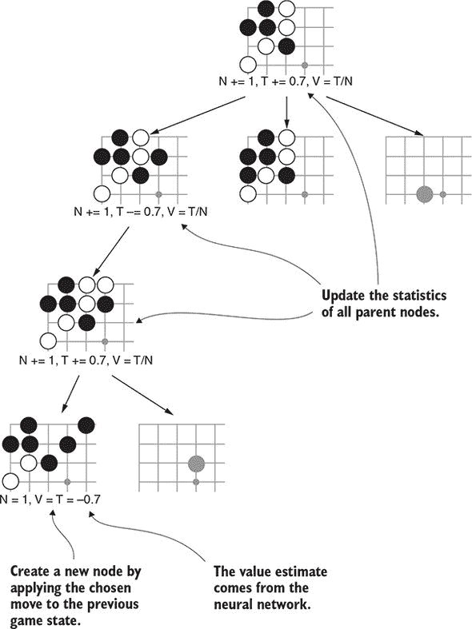

整个过程会反复进行，每次都会扩展树。AGZ 在自我对弈过程中每个走法使用了 1,600 轮。在竞技游戏中，你应该运行尽可能多的轮数。随着进行更多的轮数，机器人会选择越来越好的走法。

#### 14.2.3\. 选择走法

在你尽可能深地构建搜索树之后，是时候选择一个走法了。选择走法的最简单规则是选择访问次数最高的走法。

为什么使用访问次数而不是期望值？你可以假设访问次数最多的分支具有高期望值。原因如下。参考前面的分支选择公式。随着对分支的访问次数增加，1 / (*n* + 1) 这个因子会越来越小。因此，分支选择函数将仅基于 Q 值进行选择。具有更高 Q 值的分支会获得更多的访问次数。

现在，如果一个分支只有少数访问次数，任何情况都是可能的。它可能有一个小的 Q 值或一个巨大的 Q 值。但你也不能基于少量访问次数来信任它的估计。如果你只是选择了具有最高 Q 值的分支，你可能会得到一个只有一次访问的分支，而它的真实值可能要小得多。这就是为什么你基于访问次数进行选择的原因。这保证了你选择一个具有高估计值并且可靠的估计的分支。

##### 列表 14.9\. 选择具有最高访问次数的移动

```
class ZeroAgent(Agent):
...
    def select_move(self, game_state):
...
        return max(root.moves(), key=root.visit_count)
```

与本书中其他自我对弈代理不同，`ZeroAgent` 在何时传递方面没有特殊的逻辑。这是因为你在搜索树中包含了传递：你可以将其视为任何其他移动。

在我们的 `ZeroAgent` 实现完成后，你现在可以为你自己的 `simulate_game` 函数实现自我对弈。

##### 列表 14.10\. 模拟自我对弈游戏

```
def simulate_game(
        board_size,
        black_agent, black_collector,
        white_agent, white_collector):
    print('Starting the game!')
    game = GameState.new_game(board_size)
    agents = {
        Player.black: black_agent,
        Player.white: white_agent,
    }

    black_collector.begin_episode()
    white_collector.begin_episode()
    while not game.is_over():
        next_move = agents[game.next_player].select_move(game)
        game = game.apply_move(next_move)

    game_result = scoring.compute_game_result(game)
    if game_result.winner == Player.black:
        black_collector.complete_episode(1)
        white_collector.complete_episode(-1)
    else:
        black_collector.complete_episode(-1)
        white_collector.complete_episode(1)
```

### 14.3\. 训练

对于值输出的训练目标是，如果代理赢得了游戏，则为 1，如果它输了，则为 -1。通过平均许多游戏，你可以学习到一个介于这两个极端之间的值，这表明你的机器人获胜的机会。这与你在第十一章（章节 11）中使用的 Q-learning 以及在第十二章（章节 12）中使用的演员-评论家学习设置完全相同。

动作输出略有不同。正如在策略学习（章节 10）和演员-评论家学习（章节 12）中一样，神经网络有一个输出，它产生一个覆盖合法移动的概率分布。在策略学习中，你训练了一个网络来匹配代理选择的精确移动（在代理赢得游戏的情况下）。AGZ 以一种微妙的方式有所不同。它训练其网络来匹配在树搜索期间每个移动被访问的次数。

为了说明这如何提高其游戏强度，考虑一下 MCTS 风格的搜索算法是如何工作的。暂时假设你有一个至少大致正确的值函数；只要它大致区分了获胜位置和失败位置，它就不需要非常精确。然后想象一下，你完全抛弃了先验概率并运行搜索算法。按照设计，搜索将在最有希望的分支上花费更多时间。分支选择逻辑使得这一点发生：UCT 公式中的 Q 部分意味着高价值分支被选择得更频繁。如果你有无限的时间来运行搜索，它最终会收敛到最佳移动。

在树搜索中进行足够多的回合后，你可以将访问次数视为真理的来源。你知道这些移动是好是坏，因为你检查了如果你玩这些移动会发生什么。因此，搜索计数成为你训练先验函数的目标值。

先验函数试图预测如果给它足够的时间运行，树搜索会在哪里花费时间。如果你使用在先前运行上训练的函数，你的树搜索可以节省时间并直接搜索更重要的分支。具有准确的先验函数，你的搜索算法只需少量模拟，但可以得到与需要大量模拟的较慢搜索相似的结果。从某种意义上说，你可以认为网络“记住”了先前搜索中发生的事情，并使用这些知识来跳过。

为了以这种方式设置训练，你需要存储每次移动后的搜索计数。在之前的章节中，你使用了一个通用的 `ExperienceCollector`，它可以应用于许多强化学习实现。然而，在这种情况下，搜索计数是特定于 AGZ 的，所以你需要创建一个自定义收集器。结构大致相同。

##### 列表 14.11\. 适用于 AGZ 风格学习的专用经验收集器

```
class ZeroExperienceCollector:
    def __init__(self):
        self.states = []
        self.visit_counts = []
        self.rewards = []
        self._current_episode_states = []
        self._current_episode_visit_counts = []

    def begin_episode(self):
        self._current_episode_states = []
        self._current_episode_visit_counts = []

    def record_decision(self, state, visit_counts):
        self._current_episode_states.append(state)
        self._current_episode_visit_counts.append(visit_counts)

    def complete_episode(self, reward):
        num_states = len(self._current_episode_states)
        self.states += self._current_episode_states
        self.visit_counts += self._current_episode_visit_counts
        self.rewards += [reward for _ in range(num_states)]

        self._current_episode_states = []
        self._current_episode_visit_counts = []
```

##### 列表 14.12\. 将决策传递给经验收集器

```
class ZeroAgent(Agent):
...
    def select_move(self, game_state):
...
        if self.collector is not None:
            root_state_tensor = self.encoder.encode(game_state)
            visit_counts = np.array([
                root.visit_count(
                    self.encoder.decode_move_index(idx))
                for idx in range(self.encoder.num_moves())
            ])
            self.collector.record_decision(
                root_state_tensor, visit_counts)
```

你的神经网络的动作输出使用 softmax 激活。回想一下，softmax 激活确保其值求和为 1。对于训练，你也应该确保训练目标求和为 1。为此，将总访问计数除以其总和；这个操作称为 *正则化*。图 14.5 展示了一个示例。

##### 图 14.5\. 向量正则化。在自我对弈过程中，你跟踪访问每个移动的次数。对于训练，你必须使向量求和为 1。

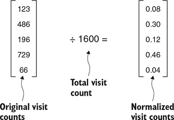

除了这一点，训练过程看起来与第十二章中训练演员-评论家网络的过程相似。以下列表显示了实现方式。

##### 列表 14.13\. 训练组合网络

```
class ZeroAgent(Agent):
...
    def train(self, experience, learning_rate, batch_size):     *1*
        num_examples = experience.states.shape[0]

        model_input = experience.states

        visit_sums = np.sum(                                    *2*
            experience.visit_counts, axis=1).reshape(           *2*
            (num_examples, 1))                                  *2*
        action_target = experience.visit_counts / visit_sums    *2*

        value_target = experience.rewards

        self.model.compile(
            SGD(lr=learning_rate),
            loss=['categorical_crossentropy', 'mse'])
        self.model.fit(
            model_input, [action_target, value_target],
            batch_size=batch_size)
```

+   ***1* 关于学习率（learning_rate）和批量大小（batch_size）的讨论，请参阅第十章（kindle_split_022.xhtml#ch10）。**

+   ***2* 正则化访问次数。当你使用 np.sum 并设置 axis=1 时，它会沿着矩阵的每一行进行求和。reshape 调用重新组织这些求和结果到匹配的行。然后你可以将原始计数除以它们的总和。**

整个强化学习循环与你在第九章到第十二章中学习的内容相同：

1.  生成大量自我对弈游戏。

1.  在经验数据上训练模型。

1.  对更新的模型与上一个版本进行测试。

1.  如果新版本明显更强，则切换到新版本。

1.  如果不是，生成更多自我对弈游戏并再次尝试。

1.  需要多少次就重复多少次。

列表 14.14 展示了运行此过程单次循环的示例。警告：你需要大量的自我对弈游戏才能从零开始构建一个强大的围棋 AI。AlphaGo Zero 达到了超人类的水平，但为此需要近 500 万次自我对弈游戏。

##### 列表 14.14\. 强化学习过程的单次循环

```
board_size = 9
encoder = zero.ZeroEncoder(board_size)

board_input = Input(shape=encoder.shape(), name='board_input')
pb = board_input
for i in range(4):                                          *1*
    pb = Conv2D(64, (3, 3),                                 *1*
        padding='same',                                     *1*
        data_format='channels_first',                       *1*
        activation='relu')(pb)                              *1*

policy_conv = \                                             *2*
    Conv2D(2, (1, 1),                                       *2*
        data_format='channels_first',                       *2*
        activation='relu')(pb)                              *2*
policy_flat = Flatten()(policy_conv)                        *2*
policy_output = \                                           *2*
    Dense(encoder.num_moves(), activation='softmax')(       *2*
        policy_flat)                                        *2*

value_conv = \                                              *3*
    Conv2D(1, (1, 1),                                       *3*
        data_format='channels_first',                       *3*
        activation='relu')(pb)                              *3*
value_flat = Flatten()(value_conv)                          *3*
value_hidden = Dense(256, activation='relu')(value_flat)    *3*
value_output = Dense(1, activation='tanh')(value_hidden)    *3*

model = Model(
    inputs=[board_input],
    outputs=[policy_output, value_output])

black_agent = zero.ZeroAgent(
    model, encoder, rounds_per_move=10, c=2.0)              *4*
white_agent = zero.ZeroAgent(
    model, encoder, rounds_per_move=10, c=2.0)
c1 = zero.ZeroExperienceCollector()
c2 = zero.ZeroExperienceCollector()
black_agent.set_collector(c1)
white_agent.set_collector(c2)

for i in range(5):                                          *5*
    simulate_game(board_size, black_agent, c1, white_agent, c2)

exp = zero.combine_experience([c1, c2])
black_agent.train(exp, 0.01, 2048)
```

+   ***1* 构建一个包含四个卷积层的网络。为了构建一个强大的机器人，你可以添加更多的层。**

+   ***2* 将动作输出添加到网络中。**

+   ***3* 将值输出添加到网络中。**

+   ***4* 在这里，我们每一步使用 10 轮只是为了使演示运行得更快。对于真正的训练，你需要更多；AGZ 使用了 1,600。**

+   ***5* 在训练之前模拟五场比赛。对于真正的训练，你将需要在更大的批次（数千场比赛）上进行训练。**

### 14.4\. 使用狄利克雷噪声改进探索

自我博弈强化学习是一个本质上随机的进程。你的机器人很容易漂移到一个奇怪的方向，尤其是在训练的早期。为了防止机器人陷入困境，提供一点随机性是很重要的。这样，如果机器人专注于一个非常糟糕的动作，它将有机会学习更好的动作。在本节中，我们描述了 AGZ 用来确保良好探索的一个技巧。

在前面的章节中，你使用了几种不同的技术来为机器人的选择增加多样性。例如，在第九章 中，你从机器人的策略输出中随机采样；在第十一章 中，你使用了 ϵ-greedy 算法：一部分时间 ϵ，机器人会完全忽略其模型并选择一个完全随机的动作。在这两种情况下，你都是在机器人做出决策时添加随机性。AGZ 使用不同的方法在搜索过程中早期引入随机性。

想象一下，在每一轮中，你人工增强了一到两个随机选择的动作的先验概率。在搜索过程的早期，先验概率控制着哪些分支被探索，因此这些动作将获得额外的访问。如果它们最终证明是糟糕的动作，搜索将迅速转移到其他分支，所以没有造成伤害。但这样会确保偶尔每个动作都会得到几次访问，这样搜索就不会发展出盲点。

AGZ 通过向每个搜索树的根节点添加噪声（小的随机数）来达到类似的效果。通过从 *狄利克雷分布* 中抽取噪声，你得到之前描述的精确效果：一些动作得到人工的增强，而其他动作保持不变。在本节中，我们解释了狄利克雷分布的特性，并展示了如何使用 NumPy 生成狄利克雷噪声。

在整本书中，你使用了游戏动作的概率分布。当你从这样的分布中采样时，你会得到一个特定的动作。狄利克雷分布是概率分布的概率分布：当你从狄利克雷分布中采样时，你会得到另一个概率分布。NumPy 函数 `np.random.dirichlet` 生成狄利克雷分布的样本。它接受一个向量参数并返回一个相同维度的向量。以下列表显示了一些示例抽取：结果是向量，并且总是加起来为 1——这意味着结果是有效的概率分布。

##### 列表 14.15\. 使用 `np.random.dirichlet` 从 Dirichlet 分布中采样

```
>>> import numpy as np
>>> np.random.dirichlet([1, 1, 1])
array([0.1146, 0.2526, 0.6328])
>>> np.random.dirichlet([1, 1, 1])
array([0.1671, 0.5378, 0.2951])
>>> np.random.dirichlet([1, 1, 1])
array([0.4098, 0.1587, 0.4315])
```

你可以使用一个*浓度*参数来控制 Dirichlet 分布的输出，通常表示为α。当α接近 0 时，Dirichlet 分布将生成“块状”向量：大多数值将接近 0，只有少数值会较大。当α较大时，样本将“平滑”：值将更接近彼此。以下列表显示了改变浓度参数的效果。

##### 列表 14.16\. 当α接近零时从 Dirichlet 分布中抽取

```
>>> import numpy as np

>>> np.random.dirichlet([0.1, 0.1, 0.1, 0.1])   *1*
array([0\.    , 0.044 , 0.7196, 0.2364])
>>> np.random.dirichlet([0.1, 0.1, 0.1, 0.1])
array([0.0015, 0.0028, 0.9957, 0\.    ])
>>> np.random.dirichlet([0.1, 0.1, 0.1, 0.1])
array([0\.    , 0.9236, 0.0002, 0.0763])

>>> np.random.dirichlet([10, 10, 10, 10])       *2*
array([0.3479, 0.1569, 0.3109, 0.1842])
>>> np.random.dirichlet([10, 10, 10, 10])
array([0.3731, 0.2048, 0.0715, 0.3507])
>>> np.random.dirichlet([10, 10, 10, 10])
array([0.2119, 0.2174, 0.3042, 0.2665])
```

+   ***1* 使用小浓度参数从 Dirichlet 分布中抽取。结果是“块状”的：大部分质量集中在向量的一或两个元素上。**

+   ***2* 使用大浓度参数从 Dirichlet 分布中抽取。在每个结果中，质量均匀分布在向量的所有元素上。**

这展示了修改你的先验概率的配方。通过选择一个小的α，你得到一个分布，其中少数移动具有较高的概率，其余的接近零。然后你可以对真实的先验概率与 Dirichlet 噪声进行加权平均。AGZ 使用了 0.03 的浓度参数。

### 14.5\. 深度神经网络的现代技术

神经网络设计是一个热门的研究课题。一个永无止境的问题是如何在更深层次的网络中使训练稳定。AlphaGo Zero 应用了几项迅速成为标准的尖端技术。这些细节超出了本书的范围，但我们在这里以高层次介绍它们。

#### 14.5.1\. 批标准化

深度神经网络的想法是每一层都可以学习原始数据的一个越来越高级的表示。但究竟是什么表示呢？我们的意思是，原始数据的一些有意义属性将作为一个特定神经元的激活中的特定数值出现。但实际数值之间的映射是完全任意的。例如，如果你将一个层中每个激活乘以 2，你并没有丢失任何信息：你只是改变了尺度。原则上，这种变换不会影响网络的学习能力。

但激活的绝对值可能会影响实际的训练性能。*批标准化*的想法是将每一层的激活移动到以 0 为中心，并缩放它们，使方差为 1。在训练开始时，你不知道激活会是什么样子。批标准化提供了一种在训练过程中动态学习正确偏移和缩放的方案；归一化变换会根据其输入在训练过程中的变化进行调整。

批归一化如何提高训练效果？这仍然是一个开放的研究领域。原始研究人员开发批归一化是为了减少**协变量偏移**。任何层的激活在训练过程中往往会漂移。批归一化纠正了这种漂移，减轻了后续层的学习负担。但最新的研究表明，协变量偏移可能不像最初认为的那么重要。相反，其价值可能在于批归一化使损失函数变得更平滑的方式。

尽管研究人员仍在研究**为什么**批归一化有效，但已经确定它**确实**有效。Keras 提供了一个`BatchNormalization`层，你可以将其添加到你的网络中。以下列表显示了在 Keras 中向卷积层添加批归一化的示例。

##### 列表 14.17\. 将批归一化添加到 Keras 网络中

```
from keras.models import Sequential
from keras.layers import Activation, BatchNormalization, Conv2D

model = Sequential()
model.add(Conv2D(64, (3, 3), data_format='channels_first'))
model.add(BatchNormalization(axis=1))                        *1*
model.add(Activation('relu'))                                *2*
```

+   **1** 轴应该与卷积数据格式匹配。对于 channels_first，使用 axis=1（第一个轴）。对于 channels_last，使用 axis=-/1（最后一个轴）。

+   **2** 正规化发生在卷积和 relu 激活之间。

#### 14.5.2\. 残差网络

假设你已经成功训练了一个具有中间三层隐藏层的神经网络。如果你添加一个第四层会发生什么？从理论上讲，这应该严格增加你网络的容量。在最坏的情况下，当你训练四层网络时，前三层可能会学习与三层网络中相同的内容，而第四层只是未改变地传递其输入。你希望它也能学习**更多**，但你不会期望它学习**更少**。至少，你期望更深的网络应该能够过拟合（以某种方式记住训练集，但这并不一定适用于新示例）。

在现实中，这种情况并不总是发生。当你尝试训练一个四层网络时，组织数据的方式比三层网络要多得多。有时，由于在复杂的损失表面上随机梯度下降的怪异之处，你可能会增加更多层，却发现甚至无法过拟合。**残差网络**的想法是简化额外层试图学习的内容。如果三层可以很好地学习一个问题，你可以迫使第四层专注于学习前三层学习的内容与目标之间的差距。（这个差距就是**残差**，因此得名。）

为了实现这一点，你将额外层的**输入**与额外层的**输出**相加，如图 14.6 所示。从前一层的连接到求和层的连接称为**跳跃连接**。通常，残差网络被组织成小的块；每个块大约有两到三层，旁边有一个跳跃连接。然后你可以根据需要堆叠尽可能多的块。

##### 图 14.6。残差块。两个内部层的输出被添加到前一层的输出中。其效果是内部层学习目标与前一层学习内容之间的差异或残差。

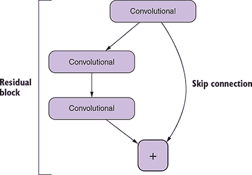

### 14.6。探索额外资源

如果你感兴趣于尝试 AlphaGo Zero 风格的机器人，有许多开源项目受到原始 AGZ 论文的启发。如果你想拥有一个超越人类的围棋 AI，无论是用来对弈还是研究源代码，你将拥有丰富的资源。

+   Leela Zero 是一个 AGZ 风格机器人的开源实现。自我对弈过程是分布式的：如果你有多余的 CPU 周期，你可以生成自我对弈游戏并将它们上传进行训练。截至本文写作时，社区已经贡献了超过 800 万场比赛，Leela Zero 已经足够强大，可以击败职业围棋选手。[`zero.sjeng.org/`](http://zero.sjeng.org/)

+   Minigo 是另一个开源实现，用 Python 和 TensorFlow 编写。它与 Google Cloud Platform 完全集成，因此你可以使用 Google 的公共云来运行实验。[`github.com/tensorflow/minigo`](https://github.com/tensorflow/minigo)

+   Facebook AI Research 在其 ELF 强化学习平台上实现了 AGZ 算法。结果是 ELF OpenGo，现在它是免费可用的，并且是目前最强的围棋 AI 之一。[`facebook.ai/developers/tools/elf`](https://facebook.ai/developers/tools/elf)

+   腾讯也实施并训练了一个 AGZ 风格的机器人，他们将其作为 PhoenixGo 发布。这个机器人在 Fox 围棋服务器上也被称作 BensonDarr，在那里它击败了许多世界顶级选手。[`github.com/Tencent/PhoenixGo`](https://github.com/Tencent/PhoenixGo)

+   如果你不喜欢围棋，Leela Chess Zero 是 Leela Zero 的一个分支，它已经被调整为学习国际象棋。它已经至少与人类围棋大师一样强大，并且国际象棋爱好者对其激动人心和富有创造性的玩法给予了赞扬。[`github.com/LeelaChessZero/lczero`](https://github.com/LeelaChessZero/lczero)

### 14.7。总结

这就结束了我们对现代围棋 AI 所使用的尖端 AI 技术的介绍。我们鼓励你从现在开始自己动手：要么尝试自己的围棋机器人，要么尝试将这些现代技术应用到其他游戏中。

但也要超越游戏。当你阅读有关机器学习最新应用的内容时，你现在有一个框架来理解正在发生的事情。考虑以下问题：

+   模型或神经网络结构是什么？

+   损失函数或训练目标是什么？

+   训练过程是什么？

+   输入和输出是如何编码的？

+   模型如何与传统算法或实际软件应用相结合？

我们希望我们已经激发了你尝试自己进行深度学习实验的灵感，无论是游戏还是其他领域。

### 14.8。总结

+   AlphaGo Zero 使用一个具有两个输出的单一神经网络。一个输出指示哪些移动是重要的，另一个输出指示哪个玩家领先。

+   AlphaGo Zero 的树搜索算法类似于蒙特卡洛树搜索，但有两个主要区别。它不是使用随机游戏来评估位置，而是完全依赖于神经网络。此外，它还使用神经网络来引导搜索走向新的分支。

+   AlphaGo Zero 的神经网络是通过在搜索过程中访问特定移动的次数进行训练的。这样，它专门训练来增强树搜索，而不是直接选择移动。

+   *狄利克雷分布* 是一种概率分布，它是在概率分布上的概率分布。集中参数控制着结果概率分布的密集程度。AlphaGo Zero 使用狄利克雷噪声为其搜索过程添加受控的随机性，以确保偶尔探索所有移动。

+   批标准化和残差网络是两种现代技术，可以帮助你训练非常深的神经网络。
