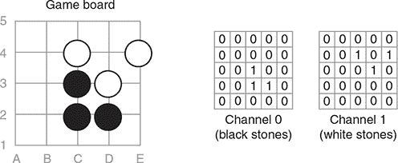
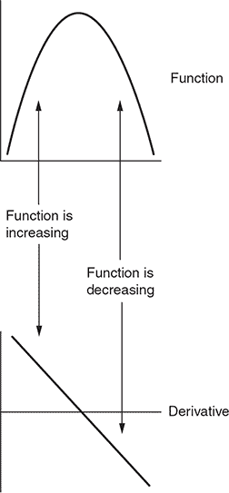

## 附录 A. 数学基础

没有数学就无法进行机器学习。特别是，线性代数和微积分是必不可少的。本附录的目的是提供足够的数学背景，帮助你理解书中的代码示例。我们没有足够的空间彻底覆盖这些庞大的主题；如果你想更好地理解这些主题，我们提供了一些进一步阅读的建议。

如果你已经熟悉高级机器学习技术，你可以安全地跳过这个附录。

| |
| --- |

**进一步阅读**

在这本书中，我们只能涵盖一些数学基础知识。如果你对机器学习的数学基础感兴趣，这里有一些建议：

+   对于线性代数的全面处理，我们建议阅读舍伦德·阿克勒的《线性代数：正确之道》（Springer, 2015）。

+   对于包括向量微积分在内的微积分的全面和实用指南，我们推荐詹姆斯·斯图尔特的《微积分：早期超越》（Cengage Learning, 2015）。

+   如果你认真想要理解微积分如何以及为什么有效运用的数学理论，很难超越沃尔特·鲁宾的经典著作《数学分析原理》（McGraw Hill, 1976）。

| |
| --- |

### 向量、矩阵以及更多：线性代数入门

线性代数提供了处理称为**向量**、**矩阵**和**张量**的数据数组的工具。你可以使用 NumPy 的`array`类型在 Python 中表示所有这些对象。

线性代数是机器学习的基础。本节仅涵盖最基本操作，重点介绍如何在 NumPy 中实现它们。

#### 向量：一维数据

**向量**是一个一维数字数组。数组的大小是向量的维度。你使用 NumPy 数组在 Python 代码中表示向量。

| |
| --- |

##### 注意

这不是向量的真正数学定义，但就我们本书的目的而言，已经足够接近了。

| |
| --- |

你可以使用`np.array`函数将数字列表转换为 NumPy 数组。`shape`属性让你可以检查维度：

```
>>> import numpy as np
>>> x = np.array([1, 2])
>>> x
array([1, 2])
>>> x.shape
(2,)
>>> y = np.array([3, 3.1, 3.2, 3.3])
>>> y
array([3\. , 3.1, 3.2, 3.3])
>>> y.shape
(4,)
```

注意，`shape`始终是一个元组；这是因为数组可以是多维的，你将在下一节中看到。

你可以访问向量的单个元素，就像它是一个 Python 列表：

```
>>> x = np.array([5, 6, 7, 8])
>>> x[0]
5
>>> x[1]
6
```

向量支持一些基本的代数运算。你可以添加相同维度的两个向量。结果是相同维度的第三个向量。和向量的每个元素是原始向量中匹配元素的和：

```
>>> x = np.array([1, 2, 3, 4])
>>> y = np.array([5, 6, 7, 8])
>>> x + y
array([ 6,  8, 10, 12])
```

同样，你也可以使用`*`运算符逐元素乘以两个向量。（这里，逐元素意味着你分别乘以每一对对应的元素。）

```
>>> x = np.array([1, 2, 3, 4])
>>> y = np.array([5, 6, 7, 8])
>>> x * y
array([ 5, 12, 21, 32])
```

元素级乘积也称为**Hadamard 乘积**。

你还可以将一个向量与单个浮点数（或**标量**）相乘。在这种情况下，你将向量中的每个值乘以标量：

```
>>> x = np.array([1, 2, 3, 4])
>>> 0.5 * x
array([0.5, 1\. , 1.5, 2\. ])
```

向量支持第三种乘法，即点积或内积。要计算点积，你需要将每一对对应元素相乘并求和。因此，两个向量的点积是一个单一的浮点数。NumPy 函数`np.dot`计算点积。在 Python 3.5 及以后的版本中，`@`运算符做同样的事情。（在这本书中，我们使用`np.dot`。）

```
>>> x = np.array([1, 2, 3, 4])
>>> y = np.array([4, 5, 6, 7])
>>> np.dot(x, y)
60
>>> x @ y
60
```

#### 矩阵：二维数据

数字构成的二维数组称为矩阵。你还可以使用 NumPy 数组来表示矩阵。在这种情况下，如果你将一个列表的列表传递给`np.array`，你会得到一个二维矩阵：

```
>>> x = np.array([
  [1, 2, 3],
  [4, 5, 6]
 ])
>>> x
array([[1, 2, 3],
       [4, 5, 6]])
>>> x.shape
(2, 3)
```

注意，矩阵的形状是一个包含两个元素的元组：第一个是行数，第二个是列数。你可以使用双重下标符号访问单个元素：先行后列。或者，NumPy 允许你以`[行, 列]`格式传递索引。两者是等效的：

```
>>> x = np.array([
  [1, 2, 3],
  [4, 5, 6]
 ])
>>> x[0][1]
2
>>> x[0, 1]
2
>>> x[1][0]
4
>>> x[1, 0]
4
```

你也可以从一个矩阵中拉出一整行得到一个向量：

```
>>> x = np.array([
  [1, 2, 3],
  [4, 5, 6]
 ])
>>> y = x[0]
>>> y
array([1, 2, 3])
>>> y.shape
(3,)
```

要提取一列，你可以使用看起来很奇怪的符号`[:, n]`。如果你有帮助，可以把`:`看作 Python 的列表切片运算符；所以`[:, n]`意味着“给我所有行，但只有列*n*。”以下是一个例子：

```
>>> x = np.array([
  [1, 2, 3],
  [4, 5, 6]
 ])
>>> z = x[:, 1]
>>> z
array([2, 5])
```

就像向量一样，矩阵支持逐元素加法、逐元素乘法和标量乘法：

```
>>> x = np.array([
  [1, 2, 3],
  [4, 5, 6]
 ])
>>> y = np.array([
  [3, 4, 5],
  [6, 7, 8]
 ])
>>> x + y
array([[ 4,  6,  8],
       [10, 12, 14]])
>>> x * y
array([[ 3,  8, 15],
       [24, 35, 48]])
>>> 0.5 * x
array([[0.5, 1\. , 1.5],
       [2\. , 2.5, 3\. ]])
```

### 三阶张量

围棋是在一个网格上进行的；象棋、跳棋以及许多其他经典游戏也是如此。网格上的任何一点都可以包含多种不同的棋子。你如何将棋盘的内容表示为一个数学对象？一个解决方案是将棋盘表示为矩阵堆叠，每个矩阵的大小与棋盘相同。

堆叠中的每个单独的矩阵称为*平面*或*通道*。每个通道可以表示棋盘上可以放置的单种类型的棋子。在围棋中，你可能有一个通道用于黑子，另一个通道用于白子；图 A.1 显示了一个例子。在象棋中，可能有一个通道用于兵，另一个通道用于象，一个通道用于马，等等。你可以将整个矩阵堆叠表示为一个单一的三维数组；这被称为*三阶张量*。

##### 图 A.1\. 使用二维张量表示围棋棋盘。这是一个 5 × 5 的棋盘。你用一个通道表示黑子，另一个通道表示白子。因此，你使用一个 2 × 5 × 5 的张量来表示棋盘。



另一个常见的情况是表示图像。假设你想用一个 NumPy 数组来表示一个 128 × 64 像素的图像。在这种情况下，你从一个与图像中的像素相对应的网格开始。在计算机图形学中，你通常将颜色分解为红色、绿色和蓝色成分。因此，你可以用一个 3 × 128 × 64 的张量来表示那个图像：你有一个红色通道、一个绿色通道和一个蓝色通道。

再次强调，你可以使用`np.array`来构建一个张量。形状将是一个包含三个组件的元组，你可以使用下标来提取单个通道：

```
>>> x = np.array([
 [[1, 2, 3],
  [2, 3, 4]],
 [[3, 4, 5],
  [4, 5, 6]]
])
>>> x.shape
(2, 2, 3)
>>> x[0]
array([[1, 2, 3],
       [2, 3, 4]])
>>> x[1]
array([[3, 4, 5],
       [4, 5, 6]])
```

与向量和矩阵一样，张量支持元素级加法、元素级乘法和标量乘法。

如果你有一个 8 × 8 的网格，有三个通道，你可以用一个 3 × 8 × 8 的张量或一个 8 × 8 × 3 的张量来表示它。唯一的区别在于你索引的方式。当你用库函数处理张量时，你必须确保函数知道你选择了哪种索引方案。你用来设计神经网络的 Keras 库将这些两个选项称为`channels_first`和`channels_last`。在大多数情况下，选择并不重要：你只需要选择一个并始终如一地坚持。在这本书中，我们使用`channels_first`格式。


##### 注意

如果你需要一个选择格式的动机，某些 NVIDIA GPU 对`channels_first`格式有特殊的优化。


#### 秩为 4 的张量

在这本书的许多地方，我们使用秩为 3 的张量来表示棋盘。为了效率，你可能希望一次传递多个棋盘到函数中。一个解决方案是将棋盘张量打包到一个四维 NumPy 数组中：这是一个秩为 4 的张量。你可以把这个四维数组想象成一个秩为 3 的张量列表，每个张量代表一个单独的棋盘。

矩阵和向量只是张量的特殊情况：矩阵是一个秩为 2 的张量，向量是一个秩为 1 的张量。而秩为 0 的张量是一个普通的数字。

| Rank 4 tensors | 是这本书中你将看到的最高阶张量，但 NumPy 可以处理任何阶的张量。可视化高维张量很困难，但代数是相同的。

### 五分钟掌握微积分：导数和求极值

在微积分中，函数的变化率被称为其*导数*。表 A.1 列出了几个现实世界的例子。

##### 表 A.1\. 导数的例子

| 量 | 导数 |
| --- | --- |
| 你已经走了多远 | 你移动的速度 |
| 水桶中有多少水 | 水排出的速度 |
| 你有多少客户 | 你获得（或失去）多少客户 |

导数不是一个固定量：它是一个随时间或空间变化的另一个函数。在开车旅行的过程中，你会在不同的时间开得快或慢。但你的速度始终与你覆盖的距离相关。如果你有你在一段时间内精确的位置记录，你就可以回过头来计算出你在旅途中任何一点的行驶速度。这就是导数的概念。

当一个函数在增加时，其导数是正的。当一个函数在减少时，其导数是负的。图 A.2 说明了这个概念。有了这个知识，你可以使用导数来找到一个*局部最大值*或*局部最小值*。任何导数为正的地方，你都可以稍微向右移动一点，找到一个更大的值。如果你超过了最大值，函数现在必须是在减少，其导数是负的。在这种情况下，你想要稍微向左移动一点。在局部最大值处，导数将正好为零。寻找局部最小值的逻辑是相同的，只是你向相反的方向移动。

##### 图 A.2\. 一个函数及其导数。导数为正的地方，函数在增加。导数为负的地方，函数在减少。当导数正好为零时，函数处于局部最小值或最大值。使用这个逻辑，你可以使用导数来找到局部最小值或最大值。



在机器学习中出现的许多函数都接受一个高维向量作为输入，并计算出一个单一的数字作为输出。你可以将同样的想法扩展到最大化或最小化这样的函数。这种函数的导数是一个与输入相同维度的向量，称为*梯度*。对于梯度的每一个元素，其符号告诉你该向哪个方向移动该坐标。跟随梯度来最大化一个函数被称为*梯度上升*；如果你在最小化，该技术被称为*梯度下降*。

在这种情况下，想象函数为一个等高线图可能会有所帮助。在任何一点，梯度指向表面的最陡坡度。

要使用梯度上升，你必须有一个你试图最大化的函数的导数公式。大多数简单的代数函数都有一个已知的导数；你可以在任何微积分教科书中查找它们。如果你通过将许多简单函数链接在一起来定义一个复杂的函数，一个称为*链式法则*的公式描述了如何计算复杂函数的导数。像 TensorFlow 和 Theano 这样的库利用链式法则自动计算复杂函数的导数。如果你在 Keras 中定义了一个复杂的函数，你不需要自己找出梯度的公式：Keras 会将这项工作转交给 TensorFlow 或 Theano。
