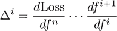
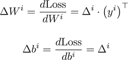
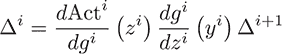

## 附录 B. 反向传播算法

第五章介绍了顺序神经网络和特别的前馈网络。我们简要地谈到了**反向传播算法**，它是用来训练神经网络的。这个附录更详细地解释了如何得到我们简单陈述和使用的梯度以及参数更新。

我们首先推导前馈神经网络的反向传播算法，然后讨论如何将算法扩展到更一般的顺序和非顺序网络。在深入数学之前，让我们定义我们的设置并介绍沿途将帮助的符号。

### 一些符号

在本节中，你将使用一个具有 *l* 层的前馈神经网络。每一层都有一个 Sigmoid 激活函数。第 *i* 层的权重被称为 *W^i*，偏差项为 *b^i*。你用 *x* 表示网络输入数据的批大小为 *k* 的小批量，用 *y* 表示输出。在这里，安全地将 *x* 和 *y* 视为向量，但所有操作都适用于小批量。此外，我们引入以下符号：

+   我们用 *y^(i+1)* 表示带有激活的第 *i* 层的输出；即，*y^(i+1)* = s(*W^iy^i* + *b^i*)。请注意，*y^(i+1)* 也是第 *i* +1 层的**输入**。

+   我们用 *z^i* 表示没有激活的第 *i* 层的输出；即，*z^i* = *W^i* · *y^i* + *b^i*。

+   介绍这种方便的中间输出写法后，你现在可以写出 *z^i* = *W^i* · *y^i* + *b^i* 和 *y^(i+1)* = s(*z^i*)。请注意，使用这个符号，你也可以将输出写成 *y* = *y^l*，输入写成 *x* = *y⁰*，但我们在以下内容中不会使用这个符号。

+   作为最后一个符号，我们有时会写 *f^i*(*y^i*) 表示 s(*W^iy^i* + *b^i*)。

### 前馈网络的反向传播算法

按照前面的约定，现在可以写出你的神经网络第 *i* 层的前向传递如下：

| *y*^(*i*+1) = σ(*W^iy^i* + *b^i*) = *f^i* · *y^i* |
| --- |

你可以使用这个定义递归地对每一层进行预测，如下所示：

| *y* = *f^n* ··· *f*¹(*x*) |
| --- |

因为你是从预测 *y* 和标签 *ŷ* 计算损失函数 *Loss*，所以你可以以类似的方式拆分损失函数：

| 损失(*y*,*ŷ*) = 损失函数的 *f^n* ··· *f*¹(*x*) |
| --- |

计算和使用如上所示的损失函数的导数是通过智能应用函数的**链式法则**，这是多元微积分的一个基本结果。直接将链式法则应用于前面的公式得到以下结果：

现在，你定义第 *i* 层的 *delta* 如下：

然后，你可以以类似的方式表达 delta，就像之前的正向传递，你称之为**反向传递**——即，通过以下关系：

注意，对于 delta 值，索引是递减的，因为你在反向通过计算时。形式上，计算反向传播在结构上等同于简单的正向传播。你现在将明确计算涉及的导数。sigmoid 和 affine 线性函数相对于其输入的导数可以快速推导出来：

使用这两个最后方程，你现在可以写下如何将第(*i* + 1)层的误差项 D*^(i+1)*反向传播到第*i*层：

| Δ^i = (*W^i*)^⊤ · (Δ^(*i*+1) ⊙ σ′ (*z^i))* |
| --- |

在这个公式中，上标 *T* 表示矩阵转置。⊙，或*Hadamard 积*，表示两个向量的逐元素乘法。前面的计算分为两部分，一部分是密集层，另一部分是激活：

| Δ^σ = Δ^(*i*+1) ⊙ σ′ (*z^i*) Δ^(*i*) = (*W^i*)^⊤ · Δ^σ |
| --- |

最后一步是计算每一层的参数 *W^i* 和 *b^i* 的梯度。现在你已经准备好了 D*^i*，你可以立即从那里读取参数梯度：

使用这些误差项，你可以根据需要更新你的神经网络参数，这意味着使用任何你喜欢的优化器或更新规则。

### 顺序神经网络的反向传播

通常，顺序神经网络可以比我们之前讨论的更有趣的层。例如，你可能关心卷积层，如第六章第六章中描述的，或者其他激活函数，如第六章第六章中讨论的 softmax 激活函数。无论顺序网络中的实际层是什么，反向传播都遵循相同的一般概述。如果 *g^i* 表示没有激活的前向传播，而 *Act^i* 表示相应的激活函数，将Δ*^(i+1)*传播到第*i*层需要你计算以下转换：

你需要计算在中间输出*z^i*处评估的激活函数的导数以及第*i*层输入的层函数*g^i*的导数。知道了所有的 delta 值，你通常可以快速推导出层中所有参数的梯度，就像你在前馈层中为权重和偏置项所做的那样。从这个角度来看，每一层都知道如何正向传递数据并反向传播错误，而不需要明确知道周围层的结构。

### 通用神经网络的反向传播

在这本书中，我们只关注顺序神经网络，但讨论当你离开顺序约束时会发生什么仍然很有趣。在非顺序网络中，一个层可以有多个输出、多个输入，或者两者都有。

假设一个层有 *m* 个输出。一个典型的例子可能是将一个向量分成 *m* 个部分。对于这个层，前向传递可以分成 *k 个独立的* 函数。在反向传递中，这些函数的导数也可以分别计算，并且每个导数都对传递给前一层的 delta 贡献相同。

在我们必须处理的情况下，*n* 个输入和一个输出，情况有些相反。前向传递是通过一个输出单个值的单一函数，从 *n* 个输入组件计算得出的。在反向传递中，你从下一层接收一个 delta，并必须计算 *n* 个输出 delta 以传递给每个进入的 *n* 层。这些导数可以独立计算，并在各自的输入上进行评估。

对于 *n* 个输入和 *m* 个输出的通用情况，是通过结合前两个步骤来实现的。每个神经网络，无论设置多么复杂或总共有多少层，在局部看起来都像这样。

### 反向传播的计算挑战

你可能会争辩说，反向传播只是链式法则对特定类别机器学习算法的简单应用。尽管在理论上可能看起来是这样，但在实践中实现反向传播时还有很多需要考虑的因素。

最值得注意的是，为了计算任何层的 delta 和梯度更新，你必须准备好前向传递的相应输入以供评估。如果你简单地丢弃前向传递的结果，你必须在反向传递中重新计算它们。因此，通过高效地缓存这些值会是一个不错的选择。在你的第五章从头开始实现中，每一层都持续保存自己的状态，包括输入和输出数据，以及输入和输出 delta。构建依赖于处理大量数据的网络时，你应该确保有一个既计算效率高又内存占用低的实现。

另一个相关的有趣考虑是重用中间值。例如，我们曾争论，在简单的前馈网络简单情况下，我们可以将仿射线性变换和 sigmoid 激活视为一个单元，或者将它们分成两层。仿射线性变换的输出需要用于计算激活函数的反向传递，因此你应该保留前向传递中的这些中间信息。另一方面，因为 sigmoid 函数没有参数，你一次就可以计算反向传递：

| Δ^i = (*W^i*)^⊤ (Δ^(i+1) ⊙ σ′ (z^i))* |
| --- |

这在计算上可能比分两步来做更有效率。自动检测哪些操作可以一起执行可以带来很多速度上的提升。在更复杂的情况下（例如循环神经网络的情况，其中一层将基本上使用来自最后一步的输入进行*循环*计算），管理中间状态变得尤为重要。
