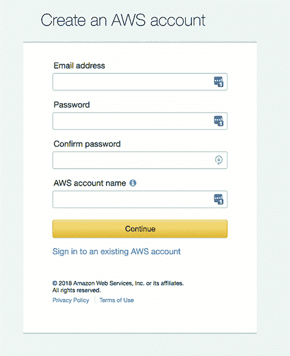
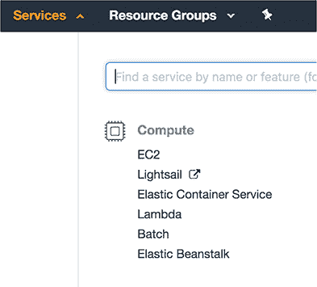
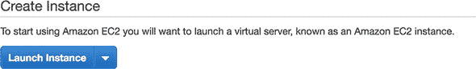
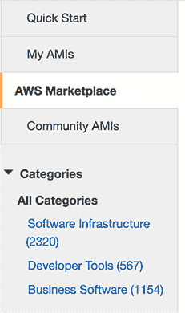
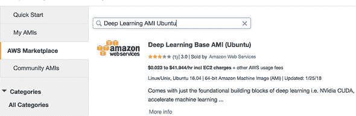
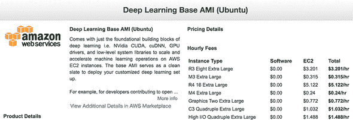
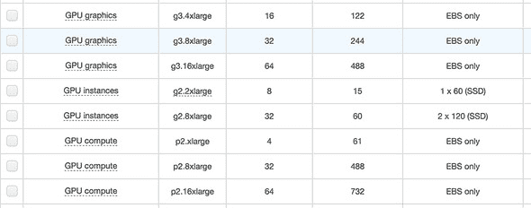
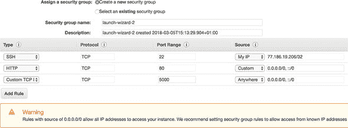
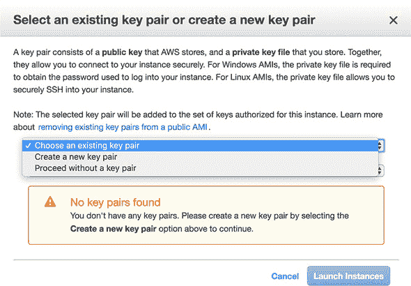
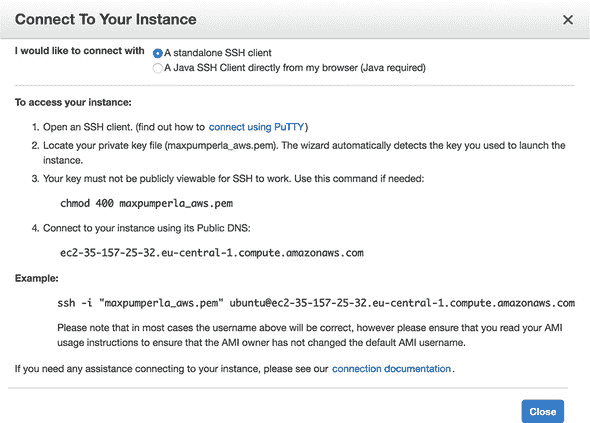

## 附录 D. 使用亚马逊网络服务进行机器人和部署

在本附录中，你将学习如何使用云服务亚马逊网络服务（AWS）来构建和部署你的深度学习模型。了解如何使用云服务和托管模型是一项有用的技能，不仅适用于这个 Go 机器人用例。你将学习以下技能：

+   使用 AWS 设置虚拟服务器以训练深度学习模型

+   在云中运行深度学习实验

+   在服务器上部署具有 Web 界面的 Go 机器人以与他人共享

尽管截至本文撰写时，AWS 是世界上最大的云服务提供商，并提供了许多好处，但我们本可以选择许多其他云服务来编写本附录。因为大型云服务提供商在提供的产品方面有很大重叠，所以使用其中一个开始将帮助你了解其他云服务。

要开始使用 AWS，请访问[`aws.amazon.com/`](https://aws.amazon.com/)查看 AWS 提供的广泛产品。亚马逊的云服务为你提供了几乎令人敬畏的大量产品，但就这本书而言，你只需使用单一服务：亚马逊弹性计算云（EC2）。EC2 让你轻松访问云中的虚拟服务器。根据你的需求，你可以为这些服务器或实例配备各种硬件规格。为了高效训练深度神经网络，你需要访问强大的 GPU。尽管 AWS 可能并不总是提供最新一代的 GPU，但在云 GPU 上灵活购买计算时间是一种在不前期投入过多硬件的情况下开始的好方法。

你需要做的第一件事是在[`portal.aws.amazon.com/billing/signup`](https://portal.aws.amazon.com/billing/signup)注册 AWS 账户；填写如图 D.1 所示的表格。

##### 图 D.1. 注册 AWS 账户



注册后，在页面右上角（[`aws.amazon.com/`](https://aws.amazon.com/））你应该点击“登录控制台”并输入你的账户凭证。这会把你重定向到你的主要仪表板。从顶部菜单栏，点击“服务”，这将打开一个面板，显示 AWS 核心产品。在计算类别中点击 EC2 选项，如图 D.2 所示。

##### 图 D.2. 从服务菜单中选择弹性云计算（EC2）服务



这将把你带到 EC2 仪表板，它为你提供了当前运行实例及其状态的概览。鉴于你刚刚注册，你应该看到 0 个正在运行的实例。要启动一个新的实例，点击“启动实例”按钮，如图 D.3 所示。

##### 图 D.3. 启动新的 AWS 实例



在此阶段，您需要选择一个亚马逊机器镜像（AMI），这是您在启动的实例上可用的软件的蓝图。为了快速开始，您将选择专门针对深度学习应用的 AMI。在左侧边栏中，您会找到 AWS Marketplace（见 图 D.4），它有很多有用的第三方 AMI。

##### 图 D.4\. 选择 AWS Marketplace



在 Marketplace 中搜索“Deep Learning AMI Ubuntu”，如图 图 D.5 所示。正如其名所示，此实例运行在 Ubuntu Linux 上，并已预先安装了许多有用的组件。例如，在此 AMI 上，您会发现 TensorFlow 和 Keras 可用，以及为您预先安装的所有必要的 GPU 驱动程序。因此，当实例准备就绪时，您可以立即开始您的深度学习应用，而不是花费时间和精力安装软件。

##### 图 D.5\. 选择适合深度学习的 AMI



选择这个特定的 AMI 成本较低，但并非完全免费。如果您想使用免费实例，请寻找带有 *免费层合格* 标签的选项。例如，在前面显示的快速入门部分 图 D.4 中，其中大多数显示的 AMI 您 *可以* 免费获得。

在选择您选择的 AMI 后点击“选择”，将打开一个标签页，显示此 AMI 的定价，具体取决于您选择的实例类型；见 图 D.6。

##### 图 D.6\. 根据您选择的实例类型为您的深度学习 AMI 定价



继续操作，您现在可以选择您的实例类型。在 图 D.7 中，您可以看到所有针对 GPU 性能优化的实例类型。选择 p2.xlarge 是一个不错的入门选项，但请记住，所有 GPU 实例相对较贵。如果您首先想对 AWS 有所了解，并熟悉这里展示的功能，请首先选择一个价格低廉的 t2.small 实例。如果您只对部署和托管模型感兴趣，t2.small 实例也足够了；只是模型训练需要更昂贵的 GPU 实例。

##### 图 D.7\. 选择适合您需求的实例类型



在您选择了一个实例类型后，您可以直接点击右下角的“审查和启动”按钮立即启动实例。但因为你还需要配置一些事情，所以您将选择“下一步：配置实例详情”。在随后的对话框中的步骤 3 到 5 可以现在安全跳过，但步骤 6（配置安全组）需要一些注意。AWS 上的 *安全组* 通过定义 *规则* 来指定实例的访问权限。您希望授予以下访问权限：

+   主要的，您希望通过 SSH 登录来访问您的实例。实例上的 SSH 端口 22 应该已经打开（这是新实例上唯一指定的规则），但您需要限制访问，只允许从您的本地机器连接。您这样做是出于安全原因，这样其他人就无法访问您的 AWS 实例；只有您的 IP 被授予访问权限。这可以通过在源下选择我的 IP 来实现。

+   因为您还想要部署一个 Web 应用程序，甚至是一个连接到其他 Go 服务器的机器人，您还必须打开 HTTP 端口 80。您可以通过首先点击添加规则并选择 HTTP 作为类型来实现这一点。这将自动为您选择端口 80。因为您希望人们可以从任何地方连接到您的机器人，所以您应该将源选择为任何地方。

+   来自第八章的 HTTP Go 机器人运行在端口 5000 上，因此您也应该打开这个端口。在生产环境中，您通常会部署一个合适的 Web 服务器，监听端口 80（您在上一步骤中已配置）；它内部将流量重定向到端口 5000。为了简化操作，您以方便为代价牺牲了安全性，直接打开了端口 5000。您可以通过添加另一条规则，选择自定义 TCP 规则作为类型，并将 5000 作为端口范围来实现这一点。至于 HTTP 端口，您将源设置为任何地方。这将提示一个安全警告，但您可以忽略它，因为您没有处理任何敏感或专有数据或应用程序。

如果您配置了如我们刚才描述的访问规则，您的设置应该看起来像图 D.8 中的那样。

##### 图 D.8. 配置您的 AWS 实例的安全组



完成安全设置后，您可以点击“审查和启动”，然后点击“启动”。这将打开一个窗口，要求您创建一个新的密钥对或选择一个现有的密钥对。您需要从下拉菜单中选择创建一个新的密钥对。您需要做的唯一事情是选择一个*密钥对名称*，然后通过点击下载密钥对来下载*秘密*密钥。下载的密钥将具有您给出的名称，并带有.pem 文件签名。请确保将这个私钥存储在安全的位置。您的私钥的公钥由 AWS 管理，并将放置在您即将启动的实例上。有了私钥，您就可以连接到该实例。创建密钥后，您可以通过选择选择现有的密钥对来在未来重用它。在图 D.9 中，您可以看到我们如何创建了一个名为 maxpumperla_aws.pem 的密钥对。

##### 图 D.9. 创建新的密钥对以访问您的 AWS 实例



这就是最后一步，现在您可以通过点击“启动实例”来启动您的实例。您将看到一个名为“启动状态”的概览，您可以通过在右下角选择“查看实例”来继续操作。这将使您回到从“启动实例”开始的主仪表板。您应该在那里看到您的实例列表。等待一段时间后，您应该会看到实例状态为“运行”，并且状态旁边有一个绿色的点。这意味着您的实例已准备好，您现在可以连接到它。您可以通过首先选择实例左侧的复选框来这样做，这将激活顶部的“连接”按钮。点击此按钮将打开一个类似于图 D.10 中所示的窗口。

##### 图 D.10\. 创建新的密钥对以访问您的 AWS 实例



此窗口包含许多连接到您的实例的有用信息，因此请仔细阅读。特别是，它提供了如何使用 `ssh` 连接到您的实例的说明。如果您打开一个终端并将示例下列出的 `ssh` 命令复制并粘贴，您应该能够建立到您的 AWS 实例的连接。此命令如下：

```
ssh -i "<full-path-to-secret-key-pem>" <username>@<public-dns-of-your-instance>
```

这是一个较长的命令，可能有点不便使用，尤其是当您正在处理多个实例或同时处理到其他机器的 SSH 连接时。为了使生活更简单，我们将使用一个 SSH 配置文件。在 UNIX 环境中，此配置文件通常存储在 ~/.ssh/config。在其他系统中，此路径可能不同。如果需要，创建此文件和 .ssh 文件夹，并将以下内容放入此文件中：

```
Host aws
  HostName <public-dns-of-your-instance>
  User ubuntu
  Port 22
  IdentityFile <full-path-to-secret-key-pem>
```

存储此文件后，您现在可以通过在终端中输入 `ssh aws` 来连接到您的实例。当您第一次连接时，系统会询问您是否想要连接。键入 `yes` 并通过按 Enter 键提交此命令。您的密钥将被永久添加到实例中（您可以通过运行 `cat ~/.ssh/authorized_keys` 来检查，这将返回您密钥对的安全散列），并且您将不会被再次询问。

第一次成功登录到 Deep Learning AMI Ubuntu AMI 的实例（如果您选择了这个选项），您将获得几个 Python 环境供您选择。一个提供 Python 3.6 完整 Keras 和 TensorFlow 安装的选项是 `source activate tensorflow_p36`，或者如果您更喜欢 Python 2.7，则使用 `source activate tensorflow_p27`。在本附录的其余部分，我们假设您跳过此步骤，并使用此实例上已提供的基本 Python 版本进行工作。

在您开始在实例上运行应用程序之前，让我们快速讨论如何终止实例。这一点很重要，因为如果您忘记关闭昂贵的实例，您可能会轻易地每月产生几百美元的费用。要终止实例，您选择它（通过点击它旁边的复选框，就像您之前做的那样），然后点击页面顶部的“操作”按钮，接着选择“实例状态”和“终止”。终止实例将删除它，包括您存储在其上的所有内容。在终止之前，请确保复制您需要的所有内容（例如，您训练的模型）（我们将在稍后向您展示）。另一个选项是停止实例，这允许您稍后启动它。请注意，然而，根据您的实例配备的存储，这仍然可能导致数据丢失。在这种情况下，您将收到警告提示。

### AWS 上的模型训练

在 AWS 上运行深度学习模型的方式与在本地运行的方式相同，在您已经设置好所有内容之后。您首先需要确保您在实例上拥有所有需要的代码和数据。一种简单的方法是通过使用 `scp` 以安全的方式将其复制到那里。例如，从您的本地机器，您可以运行以下命令来计算一个端到端示例：

```
git clone https://github.com/maxpumperla/deep_learning_and_the_game_of_go
cd deep_learning_and_the_game_of_go
scp -r ./code aws:~/code              *1*
ssh aws                               *2*
cd ~/code
python setup.py develop               *3*
cd examples
python end_to_end.py                  *4*
```

+   ***1* 将代码从本地复制到您的远程 AWS 实例。**

+   ***2* 使用 ssh 登录到实例。**

+   ***3* 安装您的 dlgo Python 库。**

+   ***4* 运行一个端到端示例。**

在这个例子中，我们假设您首先通过克隆我们的 GitHub 仓库来从头开始。在实践中，您可能已经完成了这项工作，并希望构建自己的实验。您可以通过创建您想要训练的深度神经网络并运行您想要的示例来完成此操作。我们刚刚展示的 end_to_end.py 示例将在以下路径生成一个序列化的深度学习机器人：相对于示例文件夹的 ../agents/deep_bot.h5\. 示例运行完毕后，您可以选择将模型留在那里（例如，托管它或继续工作）或从 AWS 实例检索它并将其复制回您的机器。例如，从您本地机器的终端，您可以按照以下方式将名为 deep_bot.h5 的机器人从 AWS 复制到本地：

```
cd deep_learning_and_the_game_of_go/code
scp aws:~/code/agents/deep_bot.h5 ./agents
```

这使得模型训练工作流程相对简洁，我们可以总结如下：

1.  使用 dlgo 框架在本地设置和测试您的深度学习实验。

1.  安全地复制您对 AWS 实例所做的更改。

1.  登录到远程机器并开始您的实验。

1.  训练完成后，评估您的结果，调整您的实验，并从步骤 1 开始新的实验周期。

1.  如果您愿意，可以将您的训练模型复制到您的本地机器以供将来使用或以其他方式处理。

### 在 AWS 上通过 HTTP 托管机器人

第八章向您展示了如何通过 HTTP 服务一个机器人，这样您和您的朋友就可以通过一个便捷的 Web 界面与之对战。缺点是您只需在您的机器上启动一个 Python Web 服务器。因此，其他人要测试您的机器人，他们必须直接访问您的计算机。通过在 AWS 上部署这个 Web 应用程序并打开必要的端口（就像您设置实例时做的那样），您可以通过共享一个 URL 来与他人分享您的机器人。

运行您的 HTTP 前端与之前的方式相同。您需要做的只是以下几步：

```
ssh aws
cd ~/code
python web_demo.py \
  --bind-address 0.0.0.0 \
  --pg-agent agents/9x9_from_nothing/round_007.hdf5 \
  --predict-agent  agents/betago.hdf5
```

这将在 AWS 上托管您机器人的可玩演示，并在以下地址下提供：

```
http://<public-dns-of-your-instance>:5000/static/play_predict_19.html
```

就这样！在附录 E 中，我们将进一步展示如何使用这里介绍的 AWS 基础知识来部署一个完整的机器人，该机器人通过 Go 文本协议（GTP）连接到在线围棋服务器（OGS）。
