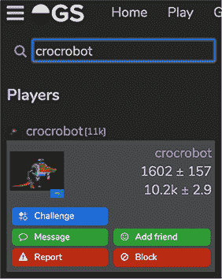
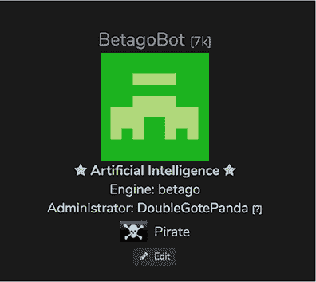
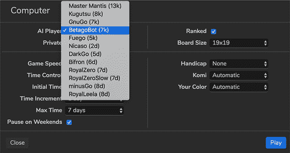

## 附录 E. 将机器人提交到在线围棋服务器

在这个附录中，你将学习如何将机器人部署到流行的在线围棋服务器。为此，你将使用本书前八章中的机器人框架在云提供的亚马逊网络服务（AWS）上部署机器人，并通过围棋文本协议（GTP）进行通信。请确保阅读前八章以了解该框架的基本知识，并阅读附录 D 以了解 AWS 基础知识。

### 在 OGS 注册并激活你的机器人

*在线围棋服务器*（OGS）是一个流行的平台，你可以在这里与其他人类玩家和机器人对弈围棋。附录 C 向你展示了几个其他的围棋服务器，但我们选择 OGS 在这个附录中演示如何部署机器人。OGS 是一个现代的基于网络的平台，你可以在[`online-go.com`](https://online-go.com)上探索。要注册 OGS，你必须注册[`online-go.com/register`](https://online-go.com/register)。如果你想要使用 OGS 部署机器人，你需要创建 *两个* 账户：

1.  为你自己作为一个人类玩家注册一个账户。选择一个可用的用户名、密码，并可选地输入你的电子邮件地址。你也可以通过 Google、Facebook 或 Twitter 进行注册。以下我们将称这个账户为 `<human>`。

1.  再回到注册页面一次，注册另一个账户。这个账户将作为你的机器人账户，所以给它起一个合适的名字，表明它是一个机器人。以下我们将称这个账户为 `<bot>`。

到目前为止，你只有两个普通账户。你想要实现的是将第二个账户变成一个由 *用户账户* 拥有和管理的 *机器人账户*。为了实现这一点，你首先需要使用你的人类账户在 OGS 上登录，并找到一个可以激活你的机器人账户的 OGS 管理员。在左上角，紧挨着 OGS 标志，你可以打开菜单并通过名字搜索用户。OGS 管理员 `crocrobot` 和 `anoek` 为这本书的注册过程提供了帮助。如果你搜索这两个名字之一，然后点击搜索结果中的账户名，应该会打开一个类似于图 E.1 所示的弹出框。

##### 图 E.1\. 联系 OGS 管理员以激活你的机器人账户



在这个框中，点击“消息”与管理员取得联系。在右下角应该会打开一个消息框。你必须告诉管理员你想要为 `<bot>` 激活一个机器人账户，并且这个机器人属于人类账户 `<human>`（你当前登录的账户）。通常，OGS 管理员会在 24 小时内回复你，但你可能需要有点耐心。你可以在 OGS 顶部菜单的“聊天”选项下找到管理员；名字旁边带有锤子符号的每个用户都是 OGS 管理员。如果管理员正在度假或忙碌，你可能找到其他人可以帮助你。

如果你直接联系调解员有困难，你还可以尝试在 OGS 论坛([`forums.online-go.com`](https://forums.online-go.com))的开发部分创建一条消息。记住，调解员都是志愿者，他们在业余时间提供帮助，所以请耐心等待！

在你收到你联系上的调解员的回复后，你可以登录到你的`<bot>`账户。点击 OGS 页面左上角的菜单符号，选择个人资料以查看你的机器人个人资料页面。如果一切顺利，你的`<bot>`账户应列在人工智能下，并应有一个管理员，即你的`<human>`账户。简而言之，你的机器人个人资料应类似于你在图 E.2 中看到的`BetagoBot`账户，该账户由 Max 的人类账户`DoubleGotePanda`管理。

##### 图 E.2\. 检查你的机器人个人资料页面以查看它已被激活



接下来，从你的`<bot>`账户登出，然后重新登录到你的`<human>`账户。你需要这样做是为了为你的机器人生成一个 API 密钥，这只能通过其人类管理员账户完成。登录到`<human>`后，访问`<bot>`的个人信息页面（例如，通过搜索并点击`<bot>`）。向下滚动一点，你会找到一个包含生成 API 密钥按钮的机器人控制框。点击此按钮生成你的 API 密钥，然后点击保存以存储它。在本附录的其余部分，我们假设你的 API 密钥名为`<api-key>`。

现在你已经在 OGS 上设置了一切，你将继续使用你的机器人名称和 API 密钥将一个 GTP 机器人连接到 OGS。

### 在本地测试你的 OGS 机器人

在第八章中，你开发了一个能够理解和发出 GTP 命令的机器人。现在你也在 OGS 上拥有了一个机器人账户。连接这两个账户缺失的环节是一个名为`gtp2ogs`的工具，它通过你的机器人名称和 API 密钥在拥有你的机器人和 OGS 之间建立连接。`gtp2ogs`是一个用 Node.js 构建的开源库，可以在官方 OGS GitHub 仓库[`github.com/online-go/gtp2ogs`](https://github.com/online-go/gtp2ogs)中找到。你不需要下载或安装这个工具，因为我们已经在我们的 GitHub 仓库中为你提供了一个副本。在你的本地副本[`mng.bz/gYPe`](http://mng.bz/gYPe)中，你应该会看到一个名为 gtp2ogs.js 的文件和一个名为 package.json 的 JSON 文件。后者用于安装依赖项；前者是工具本身。

当将机器人部署到 OGS 时，你希望这个机器人能够长时间地对所有人开放，以便人们可以玩。这个部署任务是一个*长时间运行的过程*。因此，从（远程）服务器上提供服务是有意义的。你将在下一节中做这件事，但首先你可以快速测试一下是否一切正常，使用你的本地机器。为此，请确保你的系统上已经安装了 Node.js 及其包管理器（npm）。在大多数系统上，你可以从你选择的包管理器中获取这两个工具（例如，在 Mac 上运行`brew install node npm`或在 Ubuntu 上运行`sudo apt-get install npm nodejs-legacy`），但你也可以从[`nodejs.org/en/download/`](https://nodejs.org/en/download/)下载并安装这些工具。

接下来，你需要将你从我们的 GitHub 仓库顶层找到的 run_gtp.py Python 脚本放在你的*系统路径*中。在 Unix 环境中，你可以通过执行以下命令在命令行中完成此操作：

```
export PATH=/path/to/deep_learning_and_the_game_of_go/code:$PATH
```

这将 run_gtp.py 放在你的路径中，这样你就可以在任何命令行位置调用它。特别是，它将对 gtp2ogs 可用，每当在 OGS 上请求为你的机器人创建新游戏时，它将使用 run_gtp.py 启动一个新的机器人。现在只剩下安装必要的 Node.js 包并运行应用程序了。你将使用 Node.js 包*forever*来确保应用程序保持运行状态，并在出现故障时重新启动：

```
cd deep_learning_and_the_game_of_go/code
npm install

forever start gtp2ogs.js \
  --username <bot> \
  --apikey <api-key> \
  --hidden \
  --persist \
  --boardsize 19 \
  --debug -- run_gtp.py
```

让我们分解一下这个命令行：

+   `--username`和`--apikey`指定如何连接到服务器。

+   `--hidden`将您的机器人排除在公共机器人列表之外，这将给您一个机会在其他玩家开始挑战您的机器人之前测试一切。

+   `--persist`使你的机器人在移动之间保持运行（否则，gtp2ogs 将在每次需要移动时重新启动你的机器人）。

+   `--boardsize 19`限制你的机器人只能接受 19×19 的游戏；如果你训练你的机器人玩 9×9（或任何其他大小），请使用那个大小。

+   `--debug`会打印出额外的日志，这样你可以看到你的机器人正在做什么。

当你的机器人正在运行时，前往 OGS，登录你的`<human>`账户，点击左侧菜单。在搜索框中输入你的机器人名称，点击其名称，然后点击挑战按钮。然后你可以开始与你的机器人对弈并开始游戏。

如果你能够选择你的机器人，那么一切可能都进行得很顺利，你现在可以开始与你自己的创造物进行第一场比赛了。在你成功测试连接你的机器人之后，通过输入`forever stopall`来停止运行你的机器人的 Node.js 应用程序。

### 在 AWS 上部署您的 OGS 机器人

接下来，我们将向您展示如何免费在 AWS 上部署您的机器人，这样您和世界各地的许多玩家都可以随时与之对弈（无需在您的本地计算机上运行 Node.js 应用程序）。

对于这部分，我们假设你已经遵循了附录 D 并配置了 SSH 配置，以便你可以使用 `ssh aws` 访问你的 AWS 实例。你使用的实例可以有限制，因为你不需要太多的计算能力来从已经训练的深度学习模型中生成预测。实际上，你可以使用 AWS 上免费层资格的实例之一，如 t2.micro。如果你严格按照附录 D 执行并选择在 t2.small 上运行的 Ubuntu 深度学习 AMI，那么这不会完全免费，但每月只需几美元——如果你想在 OGS 上保持你的机器人运行的话。

在我们的 GitHub 仓库中，你可以找到一个名为 run_gtp_aws.py 的脚本，它如下所示。列表 E.1。第一行，以 `#!` 开头，告诉 Node.js 进程使用哪个 Python 安装来运行你的机器人。你的 AWS 实例上的基本 Python 安装应该是类似于 /usr/bin/python 的样子，你可以在终端中通过输入 `which python` 来检查。确保这一行指向你用来安装 dlgo 的 Python 版本。

##### 列表 E.1\. run_gtp_aws.py 在 AWS 上运行连接到 OGS 的机器人

```
#!/usr/bin/python                                  *1*
from dlgo.gtp import GTPFrontend
from dlgo.agent.predict import load_prediction_agent
from dlgo.agent import termination
import h5py

model_file = h5py.File("agents/betago.hdf5", "r")
agent = load_prediction_agent(model_file)
strategy = termination.get("opponent_passes")
termination_agent = termination.TerminationAgent(agent, strategy)

frontend = GTPFrontend(termination_agent)
frontend.run()
```

+   ***1* 确保这一点与你的实例上“which python”的输出相匹配是非常重要的。**

此脚本从文件中加载一个代理，初始化一个终止策略，并运行一个 `GTPFrontend` 实例，如第八章中定义。所选择的代理和终止策略仅用于说明目的。你可以根据需要修改这两个，并使用你自己的训练模型和策略。但为了开始并熟悉提交机器人的过程，你现在可以暂时保留脚本不变。

接下来，你需要确保你的 AWS 实例上已经安装了运行机器人所需的所有软件。让我们从头开始，本地克隆你的 GitHub 仓库，将其复制到 AWS 实例上，登录实例，并安装 dlgo 包：

```
git clone https://github.com/maxpumperla/deep_learning_and_the_game_of_go
cd deep_learning_and_the_game_of_go
scp -r ./code aws:~/code
ssh aws
cd ~/code
python setup.py develop
```

这实际上是与在附录 D 中运行端到端示例所执行的相同步骤。附录 D。为了运行 *forever* 和 *gtp2ogs*，你还需要确保你有 Node.js 和 npm。通过在 AWS 上使用 apt 安装这些程序后，你可以像本地一样安装 gtp2ogs：

```
sudo apt install npm
sudo apt install nodejs-legacy
npm install
sudo npm install forever -g
```

最后一步是使用 gtp2ogs 运行 GTP 机器人。你将当前工作目录导出到系统路径，并这次使用 run_gtp_aws.py 作为机器人运行器：

```
PATH=/home/ubuntu/code:$PATH forever start gtp2ogs.js \
  --username <bot> \
  --apikey <api-key> \
  --persist \
  --boardsize 19 \
  --debug -- run_gtp_aws.py > log 2>&1 &
```

注意，您需要将标准输出和错误消息重定向到一个名为`log`的日志文件中，并使用`&`作为后台进程启动程序。这样，实例上的命令行就不会被服务器日志所杂乱，您可以在该机器上继续工作。正如您在本地测试 OGS 机器人时一样，现在您应该能够连接到 OGS 并与其机器人进行游戏。如果出现问题或不符合预期，您可以通过检查`tail log`来查看您最新的机器人日志。 

就这些了。虽然设置这个管道需要一些时间（特别是创建 AWS 实例和设置两个 OGS 账户），但在基础设置完成之后，部署一个机器人相当直接。当您在本地开发了一个新的机器人并想要部署它时，您只需执行以下操作：

```
scp -r ./code aws:~/code
ssh aws
cd ~/code
PATH=/home/ubuntu/code:$PATH node gtp2ogs.js \
  --username <bot> \
  --apikey <api-key> \
  --persist \
  --boardsize 19 \
  --debug -- run_gtp_aws.py > log 2>&1 &
```

现在您的机器人已经没有使用`--hidden`选项运行，它对整个服务器的挑战开放。要找到您的机器人，请登录您的`<human>`账户，并在主菜单上点击“播放”。在快速匹配查找器中，点击“计算机”以选择一个机器人进行对战。您的机器人名称`<bot>`应显示在下拉菜单中的“AI 玩家”选项中。在图 E.3 中，您可以看到 Max 和 Kevin 开发的 BetagoBot。目前，在 OGS 上您可能只找到少数几个机器人——也许您可以添加一个有趣的机器人？这完成了附录。现在，您可以部署一个端到端的机器学习管道，在在线围棋平台上实现一个可玩的机器人。

##### 图 E.3。您的机器人现在应该显示为 OGS 匹配查找器中的计算机对手。


