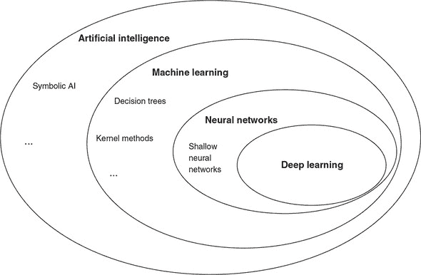
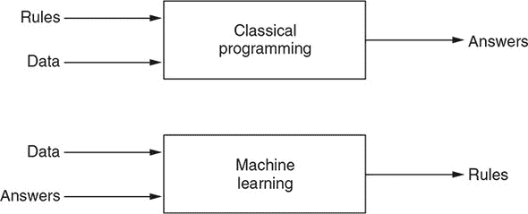
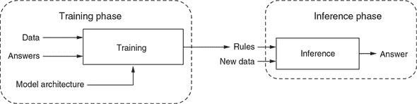
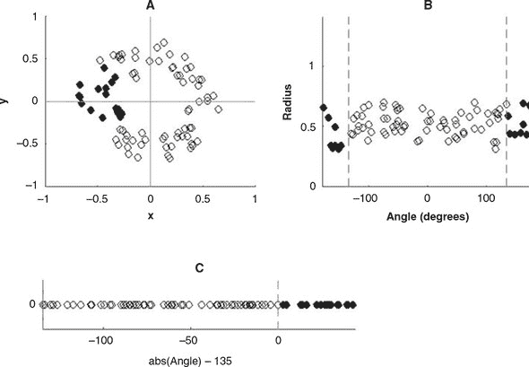
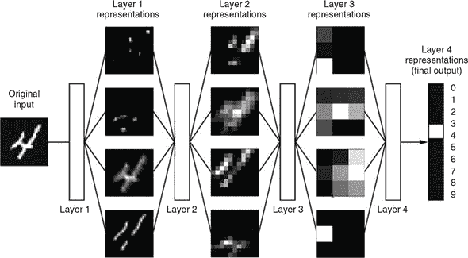
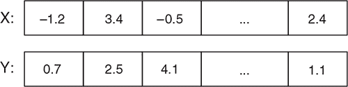
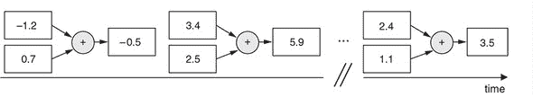
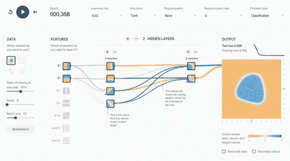
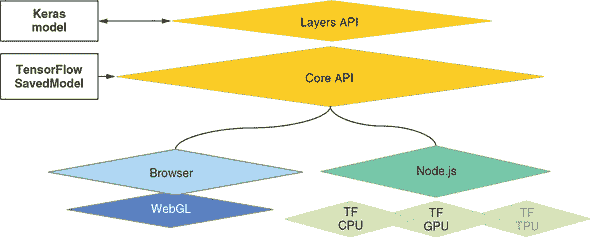

## 第一章：深度学习和 JavaScript

*本章内容*

+   深度学习是什么以及它与人工智能（AI）和机器学习的关系

+   使深度学习在各种机器学习技术中脱颖而出的因素，以及导致当前“深度学习革命”的因素

+   使用 TensorFlow.js 进行 JavaScript 中深度学习的原因

+   本书的总体组织

人工智能（AI）周围的热议完全有其原因：即所谓的深度学习革命确实已经发生。 *深度学习革命* 指的是从 2012 年开始并持续至今的深度神经网络速度和技术上的迅速进步。自那时以来，深度神经网络已被应用到越来越广泛的问题中，在某些情况下使得机器能够解决以前无法解决的问题，并在其他情况下显著提高了解决方案的准确性（有关示例，请参见 表 1.1）。 对于 AI 专家来说，神经网络在许多方面的突破是令人震惊的。对于使用神经网络的工程师来说，这一进步所带来的机遇是令人振奋的。

##### 表 1.1。自 2012 年深度学习革命开始以来，由于深度学习技术的显著改进而导致准确性显著提高的任务示例。这个列表并不全面。在未来的几个月和年份中，进展的速度无疑将继续。

| 机器学习任务 | 代表性深度学习技术 | 我们在本书中使用 TensorFlow.js 执行类似任务的地方 |
| --- | --- | --- |
| 图像内容分类 | 深度卷积神经网络（卷积网络）如 ResNet^([a]) 和 Inception^([b]) 将 ImageNet 分类任务的错误率从 2011 年的约 25%降至 2017 年的不到 5%。^([c]) | 为 MNIST 训练卷积网络（第四章）；MobileNet 推断和迁移学习（第五章) |
| 本地化对象和图像 | 深度卷积网络的变体^([d])将 2012 年的定位误差从 0.33 减少到 2017 年的 0.06。 | 在 TensorFlow.js 中使用 YOLO (section 5.2) |
| 将一种自然语言翻译成另一种自然语言 | Google 的神经机器翻译（GNMT）相比于最佳传统机器翻译技术减少了约 60%的翻译错误。^([e]) | 基于长短期记忆（LSTM）的序列到序列模型与注意力机制（第九章) |
| 大词汇量连续语音识别 | 基于 LSTM 的编码器-注意力-解码器架构比最佳非深度学习语音识别系统具有更低的词错误率。^([f]) | 基于注意力的 LSTM 小词汇量连续语音识别（第九章) |
| 生成逼真图像 | 生成对抗网络（GANs）现在能够根据训练数据生成逼真的图像（参见[`github.com/junyanz/CycleGAN`](https://github.com/junyanz/CycleGAN)）。 | 使用变分自编码器（VAEs）和 GANs 生成图像（第九章） |
| 生成音乐 | 循环神经网络（RNNs）和变分自编码器（VAEs）正在帮助创作音乐乐谱和新颖的乐器声音（参见[`magenta.tensorflow.org/demos`](https://magenta.tensorflow.org/demos)）。 | 训练 LSTMs 生成文本（第九章） |
| 学习玩游戏 | 深度学习结合强化学习（RL）使机器能够学习使用原始像素作为唯一输入来玩简单的雅达利游戏。^([g]) 结合深度学习和蒙特卡洛树搜索，Alpha-Zero 纯粹通过自我对弈达到了超人类水平的围棋水平。^([h]) | 使用 RL 解决杆-极控制问题和一个贪吃蛇视频游戏（第十一章） |
| 使用医学图像诊断疾病 | 深度卷积网络能够根据患者视网膜图像诊断糖尿病视网膜病变，其特异性和敏感性与训练有素的人类眼科医生相当。^([i]) | 使用预训练的 MobileNet 图像模型进行迁移学习（第五章）。 |

> ^a
> 
> Kaiming He 等人，“深度残差学习用于图像识别”，*IEEE 计算机视觉与模式识别会议* (CVPR)论文集，2016 年，第 770–778 页，[`mng.bz/PO5P`](http://mng.bz/PO5P)。
> 
> ^b
> 
> Christian Szegedy 等人，“使用卷积进一步深入”，*IEEE 计算机视觉与模式识别会议* (CVPR)论文集，2015 年，第 1–9 页，[`mng.bz/JzGv`](http://mng.bz/JzGv)。
> 
> ^c
> 
> 2017 年大规模视觉识别挑战（ILSVRC2017）结果，[`image-net.org/challenges/LSVRC/2017/results`](http://image-net.org/challenges/LSVRC/2017/results)。
> 
> ^d
> 
> Yunpeng Chen 等人，“双路径网络”，[`arxiv.org/pdf/1707.01629.pdf`](https://arxiv.org/pdf/1707.01629.pdf)。
> 
> ^e
> 
> Yonghui Wu 等人，“谷歌的神经机器翻译系统：弥合人机翻译差距”，提交于 2016 年 9 月 26 日，[`arxiv.org/abs/1609.08144`](https://arxiv.org/abs/1609.08144)。
> 
> ^f
> 
> Chung-Cheng Chiu 等人，“基于序列到序列模型的最新语音识别技术”，提交于 2017 年 12 月 5 日，[`arxiv.org/abs/1712.01769`](https://arxiv.org/abs/1712.01769)。
> 
> ^g
> 
> Volodymyr Mnih 等人，“使用深度强化学习玩雅达利游戏”，2013 年 NIPS 深度学习研讨会，[`arxiv.org/abs/1312.5602`](https://arxiv.org/abs/1312.5602)。
> 
> ^h
> 
> David Silver 等人，“通过自我对弈用通用强化学习算法掌握国际象棋和将棋”，提交于 2017 年 12 月 5 日，[`arxiv.org/abs/1712.01815`](https://arxiv.org/abs/1712.01815)。
> 
> ^i
> 
> Varun Gulshan 等人，“开发和验证用于检测视网膜底片中糖尿病视网膜病变的深度学习算法”，《JAMA》，第 316 卷，第 22 期，2016 年，第 2402–2410 页，[`mng.bz/wlDQ`](http://mng.bz/wlDQ)。

JavaScript 是一种传统上用于创建 Web 浏览器 UI 和后端业务逻辑（使用 Node.js）的语言。作为一个在 JavaScript 中表达想法和创造力的人，您可能会对深度学习革命感到有些被排斥，因为它似乎是 Python、R 和 C++等语言的专属领域。本书旨在通过名为 TensorFlow.js 的 JavaScript 深度学习库将深度学习和 JavaScript 结合起来。我们这样做是为了让像您这样的 JavaScript 开发人员学会如何编写深度神经网络而不需要学习一门新的语言；更重要的是，我们相信深度学习和 JavaScript 是一对天生的组合。

交叉汇合将创造独特的机会，这是任何其他编程语言都无法提供的。对 JavaScript 和深度学习都是如此。通过 JavaScript，深度学习应用可以在更多平台上运行，触及更广泛的受众，并变得更具视觉和交互性。通过深度学习，JavaScript 开发人员可以使他们的 Web 应用程序更加智能。我们将在本章后面描述如何做到这一点。

表 1.1 列出了迄今为止在这场深度学习革命中我们所见过的一些最令人兴奋的成就。在本书中，我们选择了其中一些应用，并创建了如何在 TensorFlow.js 中实现它们的示例，无论是完整形式还是简化形式。这些示例将在接下来的章节中深入介绍。因此，你不仅仅会对这些突破感到惊叹：你还可以学习它们、理解它们，并在 JavaScript 中实现它们。

但在您深入研究这些令人兴奋的、实用的深度学习示例之前，我们需要介绍有关人工智能、深度学习和神经网络的基本背景。

### 1.1\. 人工智能、机器学习、神经网络和深度学习

*AI*、*机器学习*、*神经网络*和*深度学习*等短语意味着相关但不同的事物。为了在令人眼花缭乱的人工智能世界中找到方向，您需要了解它们指代的内容。让我们定义这些术语及其之间的关系。

#### 1.1.1\. 人工智能

如图 1.1 中的维恩图所示，人工智能是一个广泛的领域。该领域的简明定义如下：*自动执行通常由人类执行的智力任务的努力*。因此，人工智能涵盖了机器学习、神经网络和深度学习，但它还包括许多与机器学习不同的方法。例如，早期的国际象棋程序涉及由程序员精心制定的硬编码规则。这些不被视为机器学习，因为机器是明确地编程来解决问题，而不是允许它们通过从数据中学习来发现解决问题的策略。很长一段时间以来，许多专家相信通过手工制作一套足够庞大的明确规则来操纵知识并做出决策，可以实现人类级别的人工智能。这种方法被称为*符号人工智能*，并且它是从 1950 年代到 1980 年代末人工智能的主导范式。^([1])

> ¹
> 
> 一个重要的符号人工智能类型是*专家系统*。请参阅[这篇 Britannica 文章](http://mng.bz/7zmy)了解它们。

##### 图 1.1\. 人工智能、机器学习、神经网络和深度学习之间的关系。正如这个维恩图所示，机器学习是人工智能的一个子领域。人工智能的一些领域使用与机器学习不同的方法，如符号人工智能。神经网络是机器学习的一个子领域。存在非神经网络的机器学习技术，如决策树。深度学习是创建和应用“深度”神经网络的科学与艺术——多“层”的神经网络——与“浅层”神经网络——层次较少的神经网络相对。



#### 1.1.2\. 机器学习：它与传统编程的不同之处

作为与符号人工智能不同的人工智能子领域，机器学习是从一个问题中产生的：计算机是否能超越程序员所知道的如何编程来执行，并且自行学习如何执行特定任务？正如你所看到的，机器学习的方法与符号人工智能的方法根本不同。而符号人工智能依赖于硬编码的知识和规则，机器学习则试图避免这种硬编码。那么，如果一台计算机没有明确指示如何执行任务，它将如何学习如何执行任务呢？答案是通过从数据中学习示例。

这打开了一个新的编程范式（图 1.2）。举个机器学习范例，假设你正在开发一个处理用户上传照片的 Web 应用程序。你希望应用程序的一个功能是自动将照片分类为包含人脸和不包含人脸的照片。应用程序将针对人脸图像和非人脸图像采取不同的操作。为此，你想创建一个程序，在给定任何输入图像（由像素数组组成）时输出二进制的人脸/非人脸答案。

##### 图 1.2\. 比较传统编程范式和机器学习范式



我们人类可以在一瞬间完成这个任务：我们大脑的基因硬编码和生活经验赋予了我们这样做的能力。然而，对于任何程序员来说，无论多么聪明和经验丰富，都很难用编程语言（人类与计算机交流的唯一实用方式）编写出如何准确判断图像是否包含人脸的一套明确规则。你可以花费几天的时间查看对 RGB（红绿蓝）像素值进行算术运算的代码，以便检测看起来像脸、眼睛和嘴巴的椭圆轮廓，以及设计关于轮廓之间几何关系的启发式规则。但你很快会意识到，这样的努力充满了难以证明的逻辑和参数的任意选择。更重要的是，很难让它工作得好！^([2]) 你想出的任何启发式方法在面对现实生活图像中人脸可能呈现的各种变化时都很可能不够用，比如脸部的大小、形状和细节的差异；面部表情；发型；肤色；方向；部分遮挡的存在或不存在；眼镜；光照条件；背景中的物体；等等。

> ²
> 
> 实际上，以前确实尝试过这样的方法，但效果并不好。这份调查报告提供了深度学习出现之前人脸检测的手工制定规则的很好的例子：Erik Hjelmås 和 Boon Kee Low，“Face Detection: A Survey”，*计算机视觉与图像理解*，2001 年 9 月，第 236–274 页，[`mng.bz/m4d2`](http://mng.bz/m4d2)。

在机器学习范式中，你意识到为这样的任务手工制定一套规则是徒劳的。相反，你找到一组图像，其中一些有脸，一些没有。然后，你为每个图像输入期望的（即正确的）脸部或非脸部答案。这些答案被称为*标签*。这是一个更容易处理的（事实上，微不足道的）任务。如果图像很多，可能需要一些时间来为它们标记标签，但是标记任务可以分配给几个人，并且可以并行进行。一旦你标记了图像，你就应用机器学习，让机器自己发现一套规则。如果你使用正确的机器学习技术，你将得到一套训练有素的规则，能够以超过 99% 的准确率执行脸部/非脸部任务——远远优于任何你希望通过手工制定规则实现的东西。

从前面的例子中，我们可以看到机器学习是自动发现解决复杂问题规则的过程。这种自动化对于像面部检测这样的问题非常有益，人类直觉地知道规则并且可以轻松标记数据。对于其他问题，规则并不是直观的。例如，考虑预测用户是否会点击网页上显示的广告的问题，给定页面和广告的内容以及时间和位置等其他信息。一般来说，没有人能准确预测这种问题。即使有人能够，模式也可能随着时间和新内容、新广告的出现而变化。但是标记的训练数据来自广告服务的历史：它来自广告服务器的日志。仅凭数据和标签的可用性就使机器学习成为解决这类问题的良好选择。

在图 1.3 中，我们更详细地探讨了机器学习涉及的步骤。有两个重要阶段。第一个是*训练阶段*。这个阶段使用数据和答案，称为*训练数据*。每对输入数据和期望的答案被称为*例子*。借助这些例子，训练过程产生了自动发现的*规则*。尽管规则是自动发现的，但它们并不是完全从零开始发现的。换句话说，机器学习算法并不创造性地提出规则。特别是，人类工程师在训练开始时提供规则的蓝图。这个蓝图被封装在一个*模型*中，形成了机器可能学习的规则的*假设空间*。如果没有这个假设空间，就会有一个完全不受限制的、无限的可能规则搜索空间，这不利于在有限的时间内找到好的规则。我们将详细描述可用的模型种类以及根据手头的问题选择最佳模型的方法。目前，可以说，在深度学习的背景下，模型在神经网络由多少层、它们是什么类型的层以及它们如何连接方面有所不同。

##### 图 1.3\. 比图 1.2 中更详细的机器学习范式视角。机器学习的工作流程包括两个阶段：训练和推断。训练是机器自动发现将数据转换为答案的规则的过程。学习到的规则被封装在一个经过训练的“模型”中，是训练阶段的成果，并构成推断阶段的基础。推断意味着使用模型为新数据获取答案。



使用训练数据和模型架构，训练过程会产生学习到的规则，封装在一个训练模型中。 这个过程采用蓝图，并以各种方式改变（或调整）它，使模型的输出逐渐接近期望的输出。 训练阶段的时间可以从毫秒到数天不等，这取决于训练数据的数量，模型架构的复杂性以及硬件的速度。 这种机器学习风格——即使用标记的示例逐渐减少模型输出中的错误——被称为*监督学习*。[3] 本书中涵盖的大部分深度学习算法都是监督学习。 一旦我们有了训练好的模型，就可以将学到的规则应用到新数据上——即训练过程从未见过的数据。 这是第二阶段，或*推断阶段*。 推断阶段的计算负荷比训练阶段小，因为 1）推断通常一次只处理一个输入（例如，一个图像），而训练涉及遍历所有训练数据； 2）在推断期间，模型不需要被改变。

> ³
> 
> 另一种机器学习的风格是*无监督学习*，其中使用未标记的数据。 无监督学习的例子包括聚类（发现数据集中的不同子集）和异常检测（确定给定示例与训练集中的示例是否足够不同）。

##### 学习数据的表示

机器学习是关于从数据中学习的。 但*究竟*学到了什么？ 答案：一种有效地转换数据的方式，或者换句话说，将数据的旧表示改变为一个新表示，使我们更接近解决手头的问题。

在我们进一步讨论之前，什么是表示？其核心是一种看待数据的方式。 相同的数据可以以不同的方式来看待，从而导致不同的表示。 例如，彩色图像可以有 RGB 或 HSV（色相-饱和度-值）编码。 这里，*编码* 和 *表示* 这两个词基本上是指相同的事物，可以互换使用。 当以这两种不同格式进行编码时，代表像素的数值完全不同，即使它们是同一图像的。 不同的表示对于解决不同的问题非常有用。 例如，要找出图像中所有红色部分，RGB 表示更有用； 但是要找出相同图像的色饱和部分，HSV 表示更有用。 这基本上就是机器学习的全部内容：找到一种适当的转换，将输入数据的旧表示转换为一个新表示——这个新表示适合解决特定的任务，比如在图像中检测汽车的位置或决定图像中是否包含猫和狗。

为了给出一个视觉示例，我们在一个平面上有一组白点和几个黑点（图 1.4）。假设我们想要开发一个算法，可以接受点的二维（x，y）坐标并预测该点是黑色还是白色。在这种情况下，

+   输入数据是点的二维笛卡尔坐标（x 和 y）。

+   输出是点的预测颜色（是黑色还是白色）。

##### 图 1.4\. 机器学习的表示转换的玩具示例。面板 A：平面中由黑点和白点组成的数据集的原始表示。面板 B 和 C：两个连续的转换步骤将原始表示转换为更适合颜色分类任务的表示。



数据显示了图 1.4 的面板 A 中的模式。机器如何根据 x 和 y 坐标决定点的颜色呢？它不能简单地将 x 与一个数字进行比较，因为白点的 x 坐标范围与黑点的 x 坐标范围重叠！同样，算法不能依赖于 y 坐标。因此，我们可以看到点的原始表示不适合黑白分类任务。

我们需要的是一种将两种颜色分开的新表示方式。在这里，我们将原始的笛卡尔 x-y 表示转换为极坐标系统表示。换句话说，我们通过以下方式表示一个点：1）它的角度——x 轴和连接原点与点的线之间形成的角度（参见图 1.4 的面板 A 中的示例）和 2）它的半径——它到原点的距离。经过这个转换，我们得到了相同数据集的新表示，如图 1.4 的面板 B 所示。这个表示更适合我们的任务，因为黑点和白点的角度值现在完全不重叠。然而，这种新的表示仍然不是理想的，因为黑白颜色分类不能简单地与阈值值（如零）进行比较。

幸运的是，我们可以应用第二个转换来实现这一点。这个转换基于简单的公式

```js
(absolute value of angle) - 135 degrees
```

结果表示，如面板 C 所示，是一维的。与面板 B 中的表示相比，它舍弃了关于点到原点的距离的无关信息。但它是一个完美的表示，因为它允许完全直接的决策过程：

```js
if the value < 0, the point is classified as white;
     else, the point is classified as black
```

在这个示例中，我们手动定义了数据表示的两步转换。但是，如果我们尝试使用关于正确分类百分比的反馈来自动搜索不同可能的坐标转换，那么我们就会进行机器学习。在解决实际机器学习问题时涉及的转换步骤数量通常远远大于两步，特别是在深度学习中，可以达到数百步。此外，实际机器学习中所见到的表示转换类型可能比这个简单示例中所见到的要复杂得多。深度学习中的持续研究不断发现更复杂、更强大的转换方式。但是，图 1.4 中的示例捕捉到了寻找更好表示的本质。这适用于所有的机器学习算法，包括神经网络、决策树、核方法等。

#### 1.1.3\. 神经网络与深度学习

神经网络是机器学习的一个子领域，其中数据表示的转换是由一个系统完成的，其架构 loosely 受到人类和动物大脑中神经元连接方式的启发。神经元在大脑中如何连接到彼此？这在物种和脑区之间有所不同。但是神经元连接的一个经常遇到的主题是层组织。许多哺乳动物的大脑部分都是以分层方式组织的。例如视网膜、大脑皮层和小脑皮层。

至少在表面上，这种模式在某种程度上与*人工神经网络*的一般组织方式相似（在计算机领域简称为*神经网络*，这里几乎没有混淆的风险），其中数据在多个可分隔阶段中进行处理，适当地称为*层*。这些层通常被堆叠在一起，仅在相邻层之间存在连接。图 1.5 显示了一个具有四层的简单（人工）神经网络。输入数据（在本例中为图像）流入第一层（图中的左侧），然后依次从一层流向下一层。每个层对数据的表示应用新的转换。随着数据通过层的流动，表示与原始数据越来越不同，并且越来越接近神经网络的目标，即为输入图像应用正确的标签。最后一层（图中的右侧）发出神经网络的最终输出，即图像分类任务的结果。

##### 图 1.5\. 神经网络的示意图，按层组织。这个神经网络对手写数字的图像进行分类。在层之间，你可以看到原始数据的中间表示。经授权转载自 François Chollet 的《用 Python 进行深度学习》，Manning 出版社，2017 年。



神经网络的一层类似于一个数学函数，因为它是从输入值到输出值的映射。然而，神经网络的层与纯粹的数学函数不同，因为它们通常是*有状态的*。换句话说，它们持有内部记忆。一个层的记忆体现在它的*权重*中。什么是权重？它们只是一组属于该层的数值，决定了每个输入表示在该层如何被转换为输出表示。例如，常用的*密集*层通过将其输入数据与矩阵相乘，并将结果加上一个向量来进行转换。矩阵和向量就是密集层的权重。当一个神经网络通过接触训练数据进行训练时，权重会以一种系统化的方式发生变化，目的是最小化一个称为*损失函数*的特定值，我们将在第二章和第三章中通过具体例子详细介绍这一点。

尽管神经网络的灵感来源于大脑，但我们应该小心不要过度赋予它们人性化。神经网络的目的是*不是*研究或模拟大脑的工作方式。这是神经科学的领域，是一个独立的学术学科。神经网络的目的是通过从数据中学习，让机器执行有趣的实际任务。虽然一些神经网络在结构和功能上与生物大脑的某些部分相似，确实值得注意，但这是否只是巧合超出了本书的范围。无论如何，我们不应过度解读这些相似性。重要的是，没有证据表明大脑是通过任何形式的梯度下降学习的，而梯度下降是训练神经网络的主要方式（在下一章中介绍）。许多神经网络中的重要技术帮助推动了深度学习革命，它们的发明和采用并不是因为得到了神经科学的支持，而是因为它们帮助神经网络更好、更快地解决实际学习任务。

> ⁴
> 
> 关于功能相似性的一个引人注目的例子，请看那些最大化激活卷积神经网络不同层的输入（参见第四章），这些输入与人类视觉系统不同部分的神经元感受野有着密切的相似之处。

现在你知道什么是神经网络了，我们可以告诉你什么是*深度学习*。深度学习是研究和应用*深度神经网络*的学科，简单地说，就是具有*许多层次*（通常是从几十到数百层）的神经网络。在这里，*深度*一词指的是大量连续层次的表示法的概念。构成数据模型的层数称为模型的*深度*。该领域的其他合适名称可能是“层次表示学习”或“分层表示学习”。现代深度学习通常涉及数十到数百个连续的表示层次，它们都是自动从训练数据中学习的。与此同时，其他机器学习方法往往集中于仅学习一到两层数据表示；因此，它们有时被称为*浅层学习*。

在深度学习中，“深度”一词被误解为对数据的任何深层次理解，即，“深度”意味着理解像“自由不是免费的”这样的句子背后的含义，或者品味 M.C. Escher 的作品中的矛盾和自指。这种“深度”对于人工智能研究者来说仍然是一个难以捉摸的目标。[5]未来，深度学习可能会让我们更接近这种深度，但这肯定比给神经网络添加层次更难量化和实现。

> ⁵
> 
> Douglas Hofstadter，《Google 翻译的浅薄》，《大西洋月刊》，2018 年 1 月 30 日，[`mng.bz/5AE1`](http://mng.bz/5AE1)。

|  |
| --- |

**不仅仅是神经网络：其他流行的机器学习技术**

我们直接从 图 1.1 的 Venn 图中的“机器学习”圈子转到内部的“神经网络”圈子。然而，值得我们简要讨论一下不是神经网络的机器学习技术，不仅因为这样做会给我们更好的历史背景，而且因为您可能会在现有代码中遇到一些这样的技术。

*朴素贝叶斯分类器*是最早的机器学习形式之一。简而言之，贝叶斯定理是关于如何估计事件概率的定理，给定 1) 事件发生的先验信念有多大可能性和 2) 与事件相关的观察事实（称为*特征*）。这个定理可以用来通过选择给定观察事实的最大概率（似然）的类别，将观察到的数据点分类到许多已知类别之一。朴素贝叶斯基于观察到的事实相互独立的假设（一个强假设和天真的假设，因此得名）。

*逻辑回归*（或 *logreg*）也是一种分类技术。由于它的简单和多才多艺的性质，它仍然很受欢迎，通常是数据科学家在尝试了解手头分类任务的感觉后尝试的第一件事情。

*核方法*，其中支持向量机（SVM）是最著名的例子，通过将原始数据映射到更高维度的空间，并找到一个最大化两类示例之间距离（称为*边距*）的转换来解决二元（即两类）分类问题。

*决策树*是类似流程图的结构，允许您对输入数据点进行分类或根据输入预测输出值。在流程图的每个步骤中，您需要回答一个简单的是/否问题，例如，“特征 X 是否大于某个阈值？”根据答案是是还是否，您将前进到两个可能的下一个问题之一，这只是另一个是/否问题，依此类推。一旦到达流程图的末尾，您将得到最终答案。因此，决策树易于人类可视化和解释。

随机森林和梯度提升机通过形成大量专门的个体决策树的集成来提高决策树的准确性。*集成*，也称为*集成学习*，是训练一组（即集成）个体机器学习模型并在推理过程中使用它们的输出的技术。如今，梯度提升可能是处理非感知数据（例如，信用卡欺诈检测）的最佳算法之一，如果不是最佳算法。与深度学习并列，它是数据科学竞赛（例如 Kaggle 上的竞赛）中最常用的技术之一。

|  |
| --- |

##### 神经网络的兴起、衰退和再兴起，以及背后的原因

神经网络的核心思想早在 1950 年代就形成了。训练神经网络的关键技术，包括反向传播，是在 1980 年代发明的。然而，在 1980 年代到 2010 年代的很长一段时间里，神经网络几乎完全被研究界忽视，部分原因是由于竞争方法（如 SVM）的流行，部分原因是由于缺乏训练深度（多层）神经网络的能力。但是大约在 2010 年左右，一些仍然在研究神经网络的人开始取得重要的突破：加拿大多伦多大学的 Geoffrey Hinton 小组，蒙特利尔大学的 Yoshua Bengio 小组，纽约大学的 Yann LeCun 小组，以及瑞士达勒莫勒人工智能研究所（IDSIA）的研究人员。这些团队取得了重要的里程碑，包括在图形处理单元（GPU）上实现深度神经网络的第一个实际应用，并将 ImageNet 计算机视觉挑战的错误率从约 25%降低到不到 5%。

自 2012 年以来，深度*卷积神经网络*（卷积网络）已成为所有计算机视觉任务的首选算法；更一般地，它们适用于所有感知任务。非计算机视觉感知任务的例子包括语音识别。在 2015 年和 2016 年的主要计算机视觉会议上，几乎不可能找到不涉及卷积网络的演示。同时，深度学习还在许多其他类型的问题中找到了应用，如自然语言处理。它已经完全取代了支持向量机（SVM）和决策树在广泛应用的范围内。例如，多年来，欧洲核子研究组织（CERN）使用基于决策树的方法来分析大型强子对撞机中的 ATLAS 探测器的粒子数据；但由于其在大型数据集上的性能更高且更容易训练，CERN 最终转向了深度神经网络。

那么，是什么让深度学习在众多可用的机器学习算法中脱颖而出呢？（请参阅信息框 1.1 查看一些不是深度神经网络的流行机器学习技术列表。）深度学习迅速崛起的主要原因之一是它在许多问题上提供了更好的性能。但这并不是唯一的原因。深度学习还使问题解决变得更容易，因为它自动化了曾经是机器学习工作流程中最关键和最困难的步骤：*特征工程*。

以前的机器学习技术——浅层学习——只涉及将输入数据转换为一个或两个连续的表示空间，通常通过简单的转换，如高维非线性投影（核方法）或决策树。但是，复杂问题所需的精细表示通常无法通过这些技术获得。因此，人工工程师不得不费尽心思地使初始输入数据更容易被这些方法处理：他们不得不手动为其数据设计出良好的表示层。这就是*特征工程*。另一方面，深度学习自动化了这一步骤：通过深度学习，您可以一次学习所有特征，而不是自己设计它们。这极大地简化了机器学习工作流程，通常用单个、简单的端到端深度学习模型替代了复杂的多阶段管道。通过自动化特征工程，深度学习使机器学习变得更少劳动密集和更加健壮——一举两得。

这是深度学习从数据中学习的两个基本特征：逐层增量地开发越来越复杂的表示方式；以及这些中间增量表示是共同学习的，每层都更新以满足其上层和下层的表示需求。这两个属性共同使深度学习比以前的机器学习方法更加成功。

#### 1.1.4\. 为什么深度学习？为什么是现在？

如果神经网络的基本思想和核心技术早在 1980 年代就已存在，为什么深度学习革命直到 2012 年才开始发生？两者之间发生了什么变化？总的来说，推动机器学习进步的有三个技术力量：

+   硬件

+   数据集和基准测试

+   算法进展

让我们逐一探讨这些因素。

##### 硬件

深度学习是一门由实验结果指导而非理论指导的工程科学。只有当适当的硬件可用于尝试新的想法（或扩大旧想法的规模，通常情况下）时，算法进展才能成为可能。用于计算机视觉或语音识别的典型深度学习模型所需的计算能力比您的笔记本电脑提供的数量级更高。

在整个 21 世纪的头十年中，NVIDIA 和 AMD 等公司投入了数十亿美元开发快速、大规模并行芯片——用于提供越来越逼真的视频游戏图形的单一用途超级计算机，旨在实时在您的屏幕上渲染复杂的 3D 场景。当 NVIDIA 于 2007 年推出 CUDA（短语 Compute Unified Device Architecture）时，这些投资开始让科学界受益。CUDA 是其 GPU 产品线的通用编程接口。在各种高度可并行化的应用程序中，一小部分 GPU 开始取代大型 CPU 集群，从物理建模开始。由许多矩阵乘法和加法组成的深度神经网络也是高度可并行化的。

在 2011 年左右，一些研究人员开始编写神经网络的 CUDA 实现，丹·希雷赞和亚历克斯·克里兹弗斯基是其中的先驱之一。如今，高端 GPU 在训练深度神经网络时可以提供比 typical CPU 高出数百倍的并行计算能力。如果没有现代 GPU 的强大计算能力，许多最先进的深度神经网络的训练是不可能的。

##### 数据和基准测试

如果硬件和算法是深度学习革命的蒸汽机，那么数据就是它的煤炭：是驱动我们智能机器的原材料，没有它什么也不可能。在数据方面，除了过去 20 年存储硬件的指数级进步（遵循摩尔定律）之外，游戏变革者是互联网的崛起，使得收集和分发用于机器学习的大型数据集成为可能。今天，大型公司处理图像数据集、视频数据集和自然语言数据集，而这些数据集没有互联网是无法收集的。Flickr 上用户生成的图像标签，例如，已成为计算机视觉的数据宝库。YouTube 视频也是如此。而维基百科是自然语言处理的关键数据集。

如果有一个数据集促进了深度学习的崛起，那就是 ImageNet，它由 140 万张手动注释的图片组成，涵盖 1000 个分类。使 ImageNet 特殊的不仅仅是其规模庞大；还有与之相关的年度比赛。自 2010 年以来，像 ImageNet 和 Kaggle 这样的公开竞赛是激励研究人员和工程师去突破极限的极佳方式。拥有共同的基准让研究人员竞争超越已经极大地推动了深度学习的最近崛起。

##### 算法进步

除了硬件和数据之外，在 2000 年代后期之前，我们还缺乏一种可靠的方法来训练非常深的神经网络。因此，神经网络仍然是相当浅的，只使用一两层表示；因此，它们无法与更精细的浅层方法（如 SVM 和随机森林）相媲美。关键问题在于通过深层堆栈的层传播梯度。用于训练神经网络的反馈信号会随着层数的增加而减弱。

这种情况在 2009 年至 2010 年发生了变化，随着几个简单但重要的算法改进的出现，使梯度传播变得更好：

+   更好的激活函数用于神经网络层（如线性整流单元，或 relu）

+   更好的权重初始化方案（例如，Glorot 初始化）

+   更好的优化方案（例如，RMSProp 和 ADAM 优化器）

只有当这些改进开始允许训练具有 10 层或更多层的模型时，深度学习才开始发光发热。最终，在 2014 年、2015 年和 2016 年，还发现了更先进的帮助梯度传播的方法，如批归一化、残差连接和深度可分离卷积。今天，我们可以从头开始训练数千层深的模型。

### 1.2\. 为什么要结合 JavaScript 和机器学习？

机器学习，像人工智能和数据科学的其他分支一样，通常使用传统的后端语言进行，比如 Python 和 R，运行在服务器或工作站上而不是在 web 浏览器中。^([6]) 这种现状并不令人意外。深度神经网络的训练通常需要多核和 GPU 加速的计算，这在浏览器选项卡中直接不可用；有时需要大量数据来训练这样的模型，最方便的方式是在后端进行摄取：例如，从几乎无限大小的本地文件系统中。直到最近，许多人认为“JavaScript 中的深度学习”是一种新奇事物。在本节中，我们将阐述为什么对于许多种类的应用来说，在浏览器环境中使用 JavaScript 进行深度学习是一个明智的选择，并解释如何结合深度学习和 web 浏览器的力量创造独特的机会，特别是在 TensorFlow.js 的帮助下。

> ⁶
> 
> Srishti Deoras，“数据科学家学习的前 10 种编程语言”，《Analytics India Magazine》，2018 年 1 月 25 日，[`mng.bz/6wrD`](http://mng.bz/6wrD)。

首先，一旦训练了机器学习模型，就必须将其部署到某个地方，以便对真实数据进行预测（例如对图像和文本进行分类，检测音频或视频流中的事件等）。没有部署，对模型进行训练只是浪费计算资源。通常情况下，希望或必须将“某个地方”设置为 web 前端。本书的读者可能会意识到 web 浏览器的整体重要性。在台式机和笔记本电脑上，通过 web 浏览器是用户访问互联网上的内容和服务的主要方式。这是用户在使用这些设备时花费大部分时间的方式，远远超过第二名。这是用户完成大量日常工作、保持联系和娱乐自己的方式。运行在 web 浏览器中的各种应用程序为应用客户端机器学习提供了丰富的机会。对于移动前端来说，Web 浏览器在用户参与度和时间上落后于原生移动应用程序。但是，移动浏览器仍然是一股不可忽视的力量，因为它们具有更广泛的覆盖范围、即时访问和更快的开发周期。^([7]) 实际上，由于它们的灵活性和易用性，许多移动应用程序，例如 Twitter 和 Facebook，对于某些类型的内容会在启用 JavaScript 的 web 视图中运行。

> ⁷
> 
> Rishabh Borde，“移动应用中花费在互联网上的时间，2017–19：比移动网络多了 8 倍”，DazeInfo，2017 年 4 月 12 日，[`mng.bz/omDr`](http://mng.bz/omDr)。

由于其广泛的覆盖范围，Web 浏览器是部署深度学习模型的一个合理选择，只要模型所需的数据类型在浏览器中可用。但是，浏览器中有哪些类型的数据可用呢？答案是，很多！例如，深度学习的最流行应用：图像和视频中的对象分类和检测、语音转录、语言翻译和文本内容分析。Web 浏览器配备了可能是最全面的技术和 API，用于呈现（以及在用户许可的情况下捕获）文本、图像、音频和视频数据。因此，强大的机器学习模型可以直接在浏览器中使用，例如，使用 TensorFlow.js 和简单的转换过程。在本书的后几章中，我们将涵盖许多在浏览器中部署深度学习模型的具体示例。例如，一旦您从网络摄像头捕获了图像，您可以使用 TensorFlow.js 运行 MobileNet 对对象进行标记，运行 YOLO2 对检测到的对象放置边界框，运行 Lipnet 进行唇读，或者运行 CNN-LSTM 网络为图像应用标题。

一旦您使用浏览器的 WebAudio API 从麦克风捕获了音频，TensorFlow.js 就可以运行模型执行实时口语识别。文本数据也有令人兴奋的应用，例如为用户文本（如电影评论）分配情感分数（第九章）。除了这些数据模态，现代 Web 浏览器还可以访问移动设备上的一系列传感器。例如，HTML5 提供了对地理位置（纬度和经度）、运动（设备方向和加速度）和环境光（参见 [`mobilehtml5.org`](http://mobilehtml5.org)）的 API 访问。结合深度学习和其他数据模态，来自这些传感器的数据为许多令人兴奋的新应用打开了大门。

基于浏览器的深度学习应用具有五个额外的好处：降低服务器成本、减少推理延迟、数据隐私、即时 GPU 加速和即时访问：

+   *服务器成本*在设计和扩展 Web 服务时通常是一个重要考虑因素。及时运行深度学习模型所需的计算通常是相当大的，这就需要使用 GPU 加速。如果模型没有部署到客户端，它们就需要部署在支持 GPU 的机器上，比如来自 Google Cloud 或 Amazon Web Services 的具有 CUDA GPU 的虚拟机。这样的云 GPU 机器通常价格昂贵。即使是最基本的 GPU 机器目前也在每小时约$0.5–1 左右（见 [`www.ec2instances.info`](https://www.ec2instances.info) 和 [`cloud.google.com/gpu`](https://cloud.google.com/gpu)）。随着流量的增加，运行一系列云 GPU 机器的成本变得更高，更不用说可伸缩性的挑战以及服务器堆栈的复杂性。所有这些问题都可以通过将模型部署到客户端来消除。客户端下载模型的开销（通常是数兆字节或更多）可以通过浏览器的缓存和本地存储功能来减轻（第二章）。

+   *降低推理延迟*—对于某些类型的应用程序，延迟的要求非常严格，以至于深度学习模型必须在客户端上运行。任何涉及实时音频、图像和视频数据的应用程序都属于此类。考虑一下如果图像帧需要传输到服务器进行推理会发生什么。假设图像以每秒 10 帧的速率从摄像头捕获，大小适中为 400 × 400 像素，具有三个颜色通道（RGB）和每个颜色通道 8 位深度。即使使用 JPEG 压缩，每个图像的大小也约为 150 Kb。在具有约 300 Kbps 上传带宽的典型移动网络上，每个图像的上传可能需要超过 500 毫秒，导致一个可察觉且可能不可接受的延迟，对于某些应用程序（例如游戏）来说。这个计算没有考虑到网络连接的波动（和可能的丢失）、下载推理结果所需的额外时间以及大量的移动数据使用量，每一项都可能是一个停滞点。客户端推理通过在设备上保留数据和计算来解决这些潜在的延迟和连接性问题。在没有模型纯粹在客户端上运行的情况下，无法运行实时的机器学习应用程序，比如在网络摄像头图像中标记对象和检测姿势。即使对于没有延迟要求的应用程序，减少模型推理延迟也可以提高响应性，从而改善用户体验。

+   *数据隐私*——将训练和推断数据留在客户端的另一个好处是保护用户的隐私。数据隐私的话题在今天变得越来越重要。对于某些类型的应用程序，数据隐私是绝对必要的。与健康和医疗数据相关的应用程序是一个突出的例子。考虑一个“皮肤病诊断辅助”应用，它从用户的网络摄像头收集患者皮肤的图像，并使用深度学习生成皮肤状况的可能诊断。许多国家的健康信息隐私法规将不允许将图像传输到集中式服务器进行推断。通过在浏览器中运行模型推断，用户的数据永远不需要离开用户的手机或存储在任何地方，确保用户健康数据的隐私。再考虑另一个基于浏览器的应用程序，它使用深度学习为用户提供建议，以改善他们在应用程序中编写的文本。一些用户可能会使用此应用程序编写诸如法律文件之类的敏感内容，并且不希望数据通过公共互联网传输到远程服务器。在客户端浏览器 JavaScript 中纯粹运行模型是解决此问题的有效方法。

+   *即时的 WebGL 加速* — 除了数据可用性外，将机器学习模型在 Web 浏览器中运行的另一个先决条件是通过 GPU 加速获得足够的计算能力。 正如前面提到的，许多最先进的深度学习模型在计算上是如此密集，以至于通过 GPU 上的并行计算加速是必不可少的（除非您愿意让用户等待几分钟才能获得单个推断结果，在真实应用中很少发生）。 幸运的是，现代 Web 浏览器配备了 WebGL API，尽管它最初是为了加速 2D 和 3D 图形的渲染而设计的，但可以巧妙地利用它来进行加速神经网络所需的并行计算。 TensorFlow.js 的作者们费尽心思地将基于 WebGL 的深度学习组件加速包装在库中，因此通过一行 JavaScript 导入即可为您提供加速功能。 基于 WebGL 的神经网络加速可能与本机的、量身定制的 GPU 加速（如 NVIDIA 的 CUDA 和 CuDNN，用于 Python 深度学习库，如 TensorFlow 和 PyTorch）不完全相匹配，但它仍然会大大加快神经网络的速度，并实现实时推断，例如 PoseNet 对人体姿势的提取。 如果对预训练模型进行推断是昂贵的，那么对这些模型进行训练或迁移学习的成本就更高了。 训练和迁移学习使得诸如个性化深度学习模型、前端可视化深度学习和联邦学习（在许多设备上训练相同的模型，然后聚合训练结果以获得良好的模型）等令人兴奋的应用成为可能。 TensorFlow.js 的 WebGL 加速使得在 Web 浏览器中纯粹进行训练或微调神经网络成为可能。

+   *即时访问* — 一般来说，运行在浏览器中的应用程序具有“零安装”的天然优势：访问应用程序所需的全部步骤就是输入 URL 或单击链接。 这省去了任何可能繁琐和容易出错的安装步骤，以及在安装新软件时可能存在的风险访问控制。 在浏览器中进行深度学习的背景下，TensorFlow.js 提供的基于 WebGL 的神经网络加速不需要特殊类型的图形卡或为此类卡安装驱动程序，这通常是一个不平凡的过程。 大多数合理更新的台式机、笔记本电脑和移动设备都配备了供浏览器和 WebGL 使用的图形卡。 只要安装了与 TensorFlow.js 兼容的 Web 浏览器（门槛很低），这些设备就可以自动准备好运行 WebGL 加速的神经网络。 这在访问便利至关重要的地方尤为吸引人，例如深度学习的教育。

|  |
| --- |

**使用 GPU 和 WebGL 加速计算**

训练机器学习模型并将其用于推断需要大量的数学运算。例如，广泛使用的“密集”神经网络层涉及将大矩阵与向量相乘，并将结果添加到另一个向量中。这种类型的典型操作涉及数千或数百万次浮点运算。关于这类操作的一个重要事实是它们通常是*可并行化*的。例如，将两个向量相加可以分解为许多较小的操作，比如将两个单独的数字相加。这些较小的操作不相互依赖。例如，您不需要知道两个向量在索引 0 处的两个元素的和来计算索引 1 处的两个元素的和。因此，这些较小的操作可以同时进行，而不是一个接一个地进行，无论向量有多大。串行计算，例如向量加法的简单 CPU 实现，被称为单指令单数据（SISD）。GPU 上的并行计算称为单指令多数据（SIMD）。通常，CPU 计算每个单独的加法所需的时间比 GPU 更少。但是，在这么大量的数据上的总成本导致 GPU 的 SIMD 胜过 CPU 的 SISD。深度神经网络可以包含数百万个参数。对于给定的输入，可能需要进行数十亿次逐元素数学运算（如果不是更多）。GPU 能够执行的大规模并行计算在这个规模下表现出色。

任务：逐个元素添加两个向量：



CPU 上的计算



GPU 上的计算


**WebGL 加速如何利用 GPU 的并行计算能力来实现比 CPU 更快的向量操作**

精确来说，现代 CPU 也能够执行一定级别的 SIMD 指令。但是，GPU 配备了更多的处理单元（数量在数百到数千之间），可以同时对输入数据的多个片段执行指令。向量加法是一个相对简单的 SIMD 任务，因为每个计算步骤只查看一个索引，并且不同索引处的结果彼此独立。在机器学习中看到的其他 SIMD 任务更复杂。例如，在矩阵乘法中，每个计算步骤使用多个索引处的数据，并且索引之间存在依赖关系。但是通过并行化加速的基本思想是相同的。

有趣的是，GPU 最初并不是为加速神经网络而设计的。这可以从名称中看出：*图形处理单元*。GPU 的主要用途是处理 2D 和 3D 图形。在许多图形应用中，例如 3D 游戏，至关重要的是要尽可能地快速处理，以便屏幕上的图像可以以足够高的帧率更新，以获得流畅的游戏体验。这是 GPU 的创建者利用 SIMD 并行化时的最初动机。但令人惊喜的是，GPU 能够进行的并行计算也正适合机器学习的需求。

用于 GPU 加速的 WebGL 库 TensorFlow.js 最初是为在网络浏览器中渲染 3D 对象上的纹理（表面图案）等任务而设计的。但是，纹理只是一组数字！因此，我们可以假装这些数字是神经网络的权重或激活，并重新利用 WebGL 的 SIMD 纹理操作来运行神经网络。这正是 TensorFlow.js 在浏览器中加速神经网络的方式。

|  |
| --- |

除了我们描述的优势之外，基于网络的机器学习应用享受与不涉及机器学习的通用网络应用相同的好处：

+   与原生应用开发不同，使用 TensorFlow.js 编写的 JavaScript 应用程序将在许多设备系列上运行，从 Mac、Windows 和 Linux 桌面到 Android 和 iOS 设备。

+   凭借其优化的二维和三维图形能力，网络浏览器是数据可视化和交互性最丰富、最成熟的环境。在人们希望向人类展示神经网络的行为和内部机制时，很难想象有哪种环境能比得上浏览器。以 TensorFlow Playground 为例（[`playground.tensorflow.org`](https://playground.tensorflow.org)）。这是一个非常受欢迎的 Web 应用程序，您可以使用其中与神经网络交互式解决分类问题。您可以调整神经网络的结构和超参数，并观察其隐藏层和输出的变化（见图 1.6）。如果您之前还没有尝试过，我们强烈建议您试试。许多人表示，这是他们在神经网络主题上看到的最具有教育性和愉悦性的教育材料之一。事实上，TensorFlow Playground 实际上是 TensorFlow.js 的重要前身。作为 Playground 的衍生品，TensorFlow.js 具有更广泛的深度学习功能和更优化的性能。此外，它还配备了一个专门用于深度学习模型可视化的组件（在第七章中有详细介绍）。无论您是想构建基本的教育应用程序，还是以视觉上吸引人和直观的方式展示您的前沿深度学习研究，TensorFlow.js 都将帮助您在实现目标的道路上走得更远（参见诸如实时 tSNE 嵌入可视化的示例^([8])）。

    > ¹⁰
    > 
    > 参见 Nicola Pezzotti，“使用 TensorFlow.js 进行实时 tSNE 可视化”，*googblogs*，[`mng.bz/nvDg`](http://mng.bz/nvDg)。

##### 图 1.6\. TensorFlow Playground 的屏幕截图（[`playground.tensorflow.org`](https://playground.tensorflow.org)），这是一个由谷歌的 Daniel Smilkov 及其同事开发的受欢迎的基于浏览器的用户界面，用于教授神经网络的工作原理。TensorFlow Playground 也是后来 TensorFlow.js 项目的重要前身。



#### 1.2.1\. 使用 Node.js 进行深度学习

为了安全和性能考虑，Web 浏览器被设计为资源受限的环境，具有有限的内存和存储配额。这意味着，尽管浏览器对许多类型的推断、小规模训练和迁移学习任务（需要较少的资源）非常理想，但对于使用大量数据训练大型机器学习模型来说，并不是理想的环境。然而，Node.js 完全改变了这一方程。Node.js 使 JavaScript 能够在 Web 浏览器之外运行，从而赋予它对所有本机资源（如 RAM 和文件系统）的访问权限。TensorFlow.js 带有一个 Node.js 版本，称为*tfjs-node*。它直接绑定到从 C++和 CUDA 代码编译的本机 TensorFlow 库，并且使用户能够使用与 TensorFlow（在 Python 中）底层使用的并行化 CPU 和 GPU 操作内核相同的内核。正如可以通过实证显示的那样，在 tfjs-node 中模型训练的速度与 Python 中 Keras 的速度相当。因此，tfjs-node 是一个适合用于训练大型机器学习模型的环境。在本书中，您将看到一些示例，我们在其中使用 tfjs-node 来训练超出浏览器能力范围的大型模型（例如，第五章中的单词识别器和第九章中的文本情感分析器）。

但是，相对于更成熟的 Python 环境来训练机器学习模型，选择 Node.js 的可能原因是什么呢？答案是 1）性能和 2）与现有堆栈和开发人员技能集的兼容性。首先，在性能方面，如 Node.js 所使用的 V8 引擎等最新 JavaScript 解释器对 JavaScript 代码进行即时（JIT）编译，导致性能优于 Python。因此，只要模型足够小以至于语言解释器的性能成为决定因素，通常在 tfjs-node 中训练模型比在 Keras（Python）中快。

其次，Node.js 是构建服务器端应用程序的非常流行的环境。如果您的后端已经是用 Node.js 编写的，并且您想要向堆栈中添加机器学习，那么使用 tfjs-node 通常比使用 Python 更好。通过保持代码在一个语言中，您可以直接重用代码库的大部分代码，包括加载和格式化数据的那些部分。这将帮助您更快地设置模型训练管道。通过不向堆栈添加新语言，您还可以降低其复杂性和维护成本，可能节省雇佣 Python 程序员的时间和成本。

最后，用 TensorFlow.js 编写的机器学习代码将在浏览器环境和 Node.js 中都能工作，只有在依赖于仅限于浏览器或仅限于 Node 的 API 的数据相关代码可能会有例外。您在本书中遇到的大多数代码示例都将在这两种环境中工作。我们努力将代码中与环境无关且以机器学习为中心的部分与与环境相关的数据摄取和 UI 代码分开。额外的好处是您只需学习一个库，就能在服务器和客户端都进行深度学习。

#### 1.2.2\. JavaScript 生态系统

当评估 JavaScript 在某种类型的应用程序（如深度学习）中的适用性时，我们不应忽视 JavaScript 是一种具有异常强大生态系统的语言的因素。多年来，JavaScript 在 GitHub 上的存储库数量和拉取活动方面一直稳居数十种编程语言中的第一位（参见 [`githut.info`](http://githut.info)）。在 npm 上，JavaScript 包的事实上公共存储库，截至 2018 年 7 月，已经有超过 600,000 个包。这个数字是 PyPI（Python 包的事实上公共存储库）的包数量的四倍以上（参见 [www.modulecounts.com](http://www.modulecounts.com)）。尽管 Python 和 R 在机器学习和数据科学领域拥有更成熟的社区，但 JavaScript 社区也在建立机器学习相关的数据流水线支持。

想要从云存储和数据库获取数据吗？谷歌云和亚马逊 Web 服务都提供 Node.js API。如今最流行的数据库系统，如 MongoDB 和 RethinkDB，都对 Node.js 驱动程序提供了一流的支持。想要在 JavaScript 中整理数据吗？我们推荐 Ashley Davis 的《使用 JavaScript 进行数据整理》一书（Manning Publications，2018 年，[www.manning.com/books/data-wrangling-with-javascript](http://www.manning.com/books/data-wrangling-with-javascript)）。想要可视化您的数据吗？有成熟和强大的库，如 d3.js、vega.js 和 plotly.js，在许多方面超越了 Python 可视化库。一旦您准备好输入数据，本书的主要内容 TensorFlow.js 将接手处理，并帮助您创建、训练和执行深度学习模型，以及保存、加载和可视化它们。

最后，JavaScript 生态系统仍在以令人振奋的方式不断发展。它的影响力正在从其传统的强项——即 Web 浏览器和 Node.js 后端环境——扩展到新的领域，例如桌面应用程序（例如 Electron）和本地移动应用程序（例如 React Native 和 Ionic）。对于这样的框架编写 UI 和应用程序通常比使用各种平台特定的应用程序创建工具更容易。JavaScript 是一种具有将深度学习的力量带到所有主要平台的潜力的语言。我们在 table 1.2 中总结了将 JavaScript 和深度学习结合使用的主要优点。

##### 表 1.2\. 在 JavaScript 中进行深度学习的利益的简要总结

| 考虑因素 | 示例 |
| --- | --- |
| 与客户端相关的原因 |

+   由于数据局部性而降低推理和训练延迟

+   在客户端脱机时运行模型的能力

+   隐私保护（数据永远不会离开浏览器）

+   降低服务器成本

+   简化的部署栈

|

| 与 Web 浏览器相关的原因 |
| --- |

+   可用于推理和训练的多种数据形式（HTML5 视频、音频和传感器 API）

+   零安装用户体验

+   在广泛范围的 GPU 上通过 WebGL API 进行并行计算的零安装访问

+   跨平台支持

+   理想的可视化和交互环境

+   固有互联环境开启对各种机器学习数据和资源的直接访问

|

| 与 JavaScript 相关的原因 |
| --- |

+   JavaScript 是许多衡量标准中最受欢迎的开源编程语言，因此有大量的 JavaScript 人才和热情。

+   JavaScript 在客户端和服务器端都有着丰富的生态系统和广泛的应用。

+   Node.js 允许应用程序在服务器端运行，而不受浏览器资源约束。

+   V8 引擎使 JavaScript 代码运行速度快。

|

### 1.3\. 为什么选择 TensorFlow.js？

要在 JavaScript 中进行深度学习，您需要选择一个库。TensorFlow.js 是我们这本书的选择。在本节中，我们将描述 TensorFlow.js 是什么以及我们选择它的原因。

#### 1.3.1\. TensorFlow、Keras 和 TensorFlow.js 的简要历史

TensorFlow.js 是一个使您能够在 JavaScript 中进行深度学习的库。顾名思义，TensorFlow.js 旨在与 Python 深度学习框架 TensorFlow 保持一致和兼容。要了解 TensorFlow.js，我们需要简要介绍 TensorFlow 的历史。

TensorFlow 是由谷歌的深度学习团队于 2015 年 11 月开源的。本书的作者是该团队的成员。自从它开源以来，TensorFlow 受到了极大的欢迎。它现在被广泛应用于谷歌和更大的技术社区中的各种工业应用和研究项目中。名称“TensorFlow”是为了反映使用该框架编写的典型程序内部发生的情况：数据表示称为*tensors*（张量）在层和其他数据处理节点之间流动，允许对机器学习模型进行推理和训练。

首先，什么是张量？这只是计算机科学家简明扼要地说“多维数组”的方式。在神经网络和深度学习中，每个数据和每个计算结果都表示为一个张量。例如，灰度图像可以表示为一个数字的 2D 数组——一个 2D 张量；彩色图像通常表示为一个 3D 张量，其中额外的维度是颜色通道。声音、视频、文本和任何其他类型的数据都可以表示为张量。每个张量具有两个基本属性：数据类型（例如 float32 或 int32）和形状。形状描述了张量沿着所有维度的大小。例如，一个 2D 张量可能具有形状`[128, 256]`，而一个 3D 张量可能具有形状`[10, 20, 128]`。一旦数据被转换为给定数据类型和形状的张量，它就可以被馈送到接受该数据类型和形状的任何类型的层中，而不管数据的原始含义是什么。因此，张量是深度学习模型的通用语言。

但是*为什么*使用张量？在前一节中，我们了解到在运行深度神经网络中涉及的大部分计算是作为大规模并行化操作执行的，通常在 GPU 上进行，这需要对多个数据块执行相同的计算。张量是将我们的数据组织成可以在并行中高效处理的结构的容器。当我们将形状为`[128, 128]`的张量 A 加到形状为`[128, 128]`的张量 B 时，非常清楚需要进行`128 * 128`次独立的加法运算。

那么“流”部分呢？想象一下张量就像一种携带数据的流体。在 TensorFlow 中，它通过一个*图*流动——一个由相互连接的数学操作（称为*节点*）组成的数据结构。如图 1.7 所示，节点可以是神经网络中的连续层。每个节点将张量作为输入并产生张量作为输出。随着“张量流体”通过 TensorFlow 图“流动”，它会被转换成不同的形状和不同的值。这对应于表示的转换：也就是我们在前面的章节中描述的神经网络的要点。使用 TensorFlow，机器学习工程师可以编写各种各样的神经网络，从浅层到非常深层的网络，从用于计算机视觉的卷积网络到用于序列任务的循环神经网络（RNN）。图数据结构可以被序列化并部署到运行许多类型设备上，从大型机到手机。  

##### 图 1.7\. 张量“流动”通过多个层，这在 TensorFlow 和 TensorFlow.js 中是一个常见情景。


TensorFlow 的核心设计是非常通用和灵活的：操作可以是任何明确定义的数学函数，不仅仅是神经网络层。例如，它们可以是低级数学操作，比如将两个张量相加和相乘——这种操作发生在神经网络层的*内部*。这使得深度学习工程师和研究人员能够为深度学习定义任意和新颖的操作。然而，对于大部分深度学习从业者来说，操作这样的低级机制比它们值得的麻烦更多。它会导致冗长和更容易出错的代码以及更长的开发周期。大多数深度学习工程师使用少数固定的层类型（例如，卷积、池化或密集层，你将在后面的章节中详细学习）。他们很少需要创建新的层类型。这就是乐高积木的类比适用的地方。使用乐高，只有少数几种积木类型。乐高建筑师不需要考虑制作一块乐高积木需要什么。这与像 Play-Doh 这样的玩具不同，它类似于 TensorFlow 的低级 API。然而，连接乐高积木的能力导致了组合成千上万种可能性和几乎无限的力量。可以用乐高或 Play-Doh 建造一个玩具房子，但除非你对房子的大小、形状、质地或材料有非常特殊的要求，否则用乐高建造房子会更容易更快。对于大多数人来说，我们建造的乐高房子将更加稳固，看起来更漂亮，而不是用 Play-Doh 建造的房子。

在 TensorFlow 的世界中，高级 API 被称为 Keras 是对应的乐高积木^([9])。Keras 提供了一组最常用的神经网络层类型，每个层都有可配置的参数。它还允许用户将层连接在一起形成神经网络。此外，Keras 还提供了以下 API：

> ⁹
> 
> 实际上，自从引入 TensorFlow 以来，出现了许多高级 API，一些是由谷歌工程师创建的，一些是由开源社区创建的。其中最受欢迎的是 Keras、tf.Estimator、tf.contrib.slim 和 TensorLayers 等。对于本书的读者来说，与 TensorFlow.js 最相关的高级 API 无疑是 Keras，因为 TensorFlow.js 的高级 API 是基于 Keras 建模的，并且 TensorFlow.js 在模型保存和加载方面提供了双向兼容性。

+   指定神经网络的训练方式（损失函数、度量指标和优化器）

+   提供数据用于训练或评估神经网络，或使用模型进行推断

+   监控正在进行的训练过程（回调函数）

+   保存和加载模型

+   打印或绘制模型的架构

在 Keras 中，用户只需使用很少的代码即可执行完整的深度学习工作流程。低级 API 的灵活性和高级 API 的易用性使得 TensorFlow 和 Keras 在工业和学术领域的应用方面领先于其他深度学习框架（请参阅[`mng.bz/vlDJ`](http://mng.bz/vlDJ)上的推文）。作为不断推进的深度学习革命的一部分，不应低估它们让更广泛的人群获得深度学习的作用。在 TensorFlow 和 Keras 等框架出现之前，只有那些具有 CUDA 编程技能并且在 C++中有编写神经网络的丰富经验的人能够进行实际的深度学习。通过 TensorFlow 和 Keras，创建基于 GPU 加速的深度神经网络所需的技能和工作量大大减少。但是有一个问题：无法在 JavaScript 或直接在 Web 浏览器中运行 TensorFlow 或 Keras 模型。为了在浏览器中提供经过训练的深度学习模型，我们必须通过 HTTP 请求到后端服务器进行操作。这就是 TensorFlow.js 的用武之地。TensorFlow.js 是由 Google 的深度学习相关数据可视化和人机交互专家 Nikhil Thorat 和 Daniel Smilkov 发起的努力^([10])。正如我们所提到的，深度神经网络的高度流行的 TensorFlow Playground 演示植入了 TensorFlow.js 项目的最初种子。2017 年 9 月，发布了一个名为 deeplearn.js 的库，它具有类似于 TensorFlow 低级 API 的低级 API。 Deeplearn.js 支持 WebGL 加速的神经网络操作，使得在 Web 浏览器中以低延迟运行真实的神经网络成为可能。

> ¹⁰
> 
> 作为一个有趣的历史注释，这些作者还在创建 TensorBoard（TensorFlow 模型的流行可视化工具）方面发挥了关键作用。

在 deeplearn.js 初始成功后，谷歌 Brain 团队的更多成员加入了该项目，并将其更名为 TensorFlow.js。JavaScript API 经过了重大改进，提高了与 TensorFlow 的 API 兼容性。此外，在底层核心之上构建了一个类似 Keras 的高级 API，使用户更容易在 JavaScript 库中定义、训练和运行深度学习模型。今天，我们对于 Keras 的力量和易用性所说的一切对于 TensorFlow.js 也完全适用。为了进一步提高互操作性，构建了转换器，使 TensorFlow.js 可以导入从 TensorFlow 和 Keras 中保存的模型，并将模型导出为它们所用的格式。自从在 2018 年春季全球 TensorFlow 开发者峰会和 Google I/O 上首次亮相以来（参见[www.youtube.com/watch?v=YB-kfeNIPCE](http://www.youtube.com/watch?v=YB-kfeNIPCE) 和 [www.youtube.com/watch?v=OmofOvMApTU](http://www.youtube.com/watch?v=OmofOvMApTU)），TensorFlow.js 快速成为了一个非常受欢迎的 JavaScript 深度学习库，在 GitHub 上类似的库中当前拥有最高的赞数和派生数。

图 1.8 展示了 TensorFlow.js 的架构概述。最底层负责并行计算，用于快速数学运算。尽管大多数用户看不到此层，但它的高性能非常重要，以便在 API 的更高层级中进行模型训练和推断尽可能地快速。在浏览器中，它利用 WebGL 实现 GPU 加速（参见信息框 1.2）。在 Node.js 上，可以直接绑定到多核 CPU 并行化和 CUDA GPU 加速。这些是 TensorFlow 和 Keras 在 Python 中使用的相同的数学后端。在最低的数学层级之上建立了 *Ops API*，它与 TensorFlow 的低级 API 具有良好的对应性，并支持从 TensorFlow 加载 SavedModels。在最高的层级上是类似 Keras 的 *Layers API*。对于使用 TensorFlow.js 的大多数程序员来说，Layers API 是正确的 API 选择，也是本书的主要关注点。Layers API 还支持与 Keras 的双向模型导入/导出。

##### 图 1.8\. TensorFlow.js 的架构一览。它与 Python TensorFlow 和 Keras 的关系也显示出来。



#### 1.3.2\. 为什么选择 TensorFlow.js: 与类似库的简要比较

TensorFlow.js 并不是唯一一个用于深度学习的 JavaScript 库；也不是第一个出现的（例如，brain.js 和 ConvNetJS 的历史要长得多）。那么，为什么 TensorFlow.js 在类似的库中脱颖而出呢？第一个原因是它的全面性——TensorFlow.js 是目前唯一一个支持生产深度学习工作流中所有关键部分的库：

+   支持推断和训练

+   支持 Web 浏览器和 Node.js。

+   利用 GPU 加速（浏览器中的 WebGL 和 Node.js 中的 CUDA 核心）。

+   支持在 JavaScript 中定义神经网络模型架构。

+   支持模型的序列化和反序列化。

+   支持与 Python 深度学习框架之间的转换。

+   与 Python 深度学习框架的 API 兼容。

+   配备了内置的数据摄取支持，并提供了可视化 API。

第二个原因是生态系统。大多数 JavaScript 深度学习库定义了自己独特的 API，而 TensorFlow.js 与 TensorFlow 和 Keras 紧密集成。你有一个来自 Python TensorFlow 或 Keras 的训练模型，想在浏览器中使用它？没问题。你在浏览器中创建了一个 TensorFlow.js 模型，想将其带入 Keras 以获得更快的加速器，如 Google TPU？也可以！与非 JavaScript 框架的紧密集成不仅提升了互操作性，还使开发人员更容易在编程语言和基础设施堆栈之间迁移。例如，一旦你通过阅读本书掌握了 TensorFlow.js，如果想开始使用 Python 中的 Keras，将会非常顺利。反向旅程同样轻松：掌握 Keras 的人应该能够快速学会 TensorFlow.js（假设具备足够的 JavaScript 技能）。最后但同样重要的是，不应忽视 TensorFlow.js 的流行度和其社区的实力。TensorFlow.js 的开发人员致力于长期维护和支持该库。从 GitHub 的星星和分叉数量到外部贡献者的数量，从讨论的活跃程度到在 Stack Overflow 上的问题和答案的数量，TensorFlow.js 无愧于任何竞争库的阴影。

#### 1.3.3\. TensorFlow.js 在世界上是如何被使用的？

对于一个库的力量和流行程度，最有说服力的证明莫过于它在真实应用中的使用方式。TensorFlow.js 的几个值得注意的应用包括以下内容：

+   Google 的 Project Magenta 使用 TensorFlow.js 运行 RNN 和其他类型的深度神经网络，在浏览器中生成音乐乐谱和新颖的乐器声音（[`magenta.tensorflow.org/demos/`](https://magenta.tensorflow.org/demos/)）。

+   丹·希夫曼（Dan Shiffman）和他在纽约大学的同事们构建了 ML5.js，这是一个易于使用的、针对浏览器的各种开箱即用的深度学习模型的高级 API，例如目标检测和图像风格转换（[`ml5js.org`](https://ml5js.org)）。

+   开源开发者 Abhishek Singh 创建了一个基于浏览器的界面，将美国手语翻译成语音，以帮助不能说话或听力受损的人使用智能扬声器，如亚马逊 Echo。^([11])

    > ¹¹
    > 
    > Abhishek Singh，“使用你的网络摄像头和 TensorFlow.js 让 Alexa 响应手语”，*Medium*，2018 年 8 月 8 日，[`mng.bz/4eEa`](http://mng.bz/4eEa)。

+   Canvas Friends 是基于 TensorFlow.js 的类似游戏的网络应用程序，帮助用户提高其绘画和艺术技巧 ([www.y8.com/games/canvas_friends](http://www.y8.com/games/canvas_friends))。

+   MetaCar，一个在浏览器中运行的自动驾驶汽车模拟器，使用 TensorFlow.js 实现了对其模拟至关重要的强化学习算法 ([www.metacar-project.com](http://www.metacar-project.com))。

+   诊所医生，一个基于 Node.js 的应用程序，用于监视服务器端程序的性能，使用 TensorFlow.js 实现了隐马尔可夫模型，并使用它来检测 CPU 使用率的峰值。^([12])

    > ¹²
    > 
    > Andreas Madsen，“Clinic.js Doctor Just Got More Advanced with TensorFlow.js,” *Clinic.js* 博客，2018 年 8 月 22 日，[`mng.bz/Q06w`](http://mng.bz/Q06w)。

+   查看 TensorFlow.js 的优秀应用程序库，由开源社区构建，地址为 [`github.com/tensorflow/tfjs/blob/master/GALLERY.md`](https://github.com/tensorflow/tfjs/blob/master/GALLERY.md)。

#### 1.3.4\. 本书将教授和不会教授你关于 TensorFlow.js 的内容

通过学习本书中的材料，您应该能够使用 TensorFlow.js 构建如下应用程序：

+   一个能够对用户上传的图像进行分类的网站

+   深度神经网络，从浏览器连接的传感器接收图像和音频数据，并在其上执行实时机器学习任务，例如识别和迁移学习

+   客户端自然语言人工智能，如评论情感分类器，可辅助评论审核

+   一个使用千兆字节级别数据和 GPU 加速的 Node.js（后端）机器学习模型训练器

+   一个由 TensorFlow.js 提供支持的强化学习器，可以解决小规模控制和游戏问题

+   一个仪表板，用于说明经过训练的模型的内部情况和机器学习实验的结果

更重要的是，您不仅会知道如何构建和运行这些应用程序，还将了解它们的工作原理。例如，您将具有创建各种类型问题的深度学习模型所涉及的策略和约束的实际知识，以及训练和部署这些模型的步骤和技巧。

机器学习是一个广泛的领域；TensorFlow.js 是一个多才多艺的库。因此，一些应用程序完全可以使用现有的 TensorFlow.js 技术来完成，但超出了本书的范围。例如：

+   在 Node.js 环境中高性能、分布式训练深度神经网络，涉及大量数据（数量级为千兆字节）

+   非神经网络技术，例如 SVM、决策树和随机森林

+   高级深度学习应用程序，如将大型文档缩减为几个代表性句子的文本摘要引擎，从输入图像生成文本摘要的图像到文本引擎，以及增强输入图像分辨率的生成图像模型

然而，这本书将为您提供深度学习的基础知识，使您能够学习与这些高级应用相关的代码和文章。

就像任何其他技术一样，TensorFlow.js 也有其局限性。有些任务超出了它的能力范围。尽管这些限制可能在将来被推动，但了解编写时的边界是很好的：

+   在浏览器标签页中运行内存需求超出 RAM 和 WebGL 限制的深度学习模型。对于浏览器内推断，通常意味着模型总重量超过 ~100 MB。对于训练，需要更多的内存和计算资源，因此即使是较小的模型在浏览器标签页中进行训练也可能太慢了。模型训练通常还涉及比推断更大量的数据，这是评估浏览器内训练可行性时应考虑的另一个限制因素。

+   创建一个高端的强化学习器，例如能够击败人类玩家的围棋游戏。

+   使用 Node.js 进行分布式（多机器）设置来训练深度学习模型。

### 练习

1.  无论您是前端 JavaScript 开发人员还是 Node.js 开发人员，根据本章学到的知识，思考一下在您正在开发的系统中应用机器学习以使其更加智能的几种可能情况。可参考 表 1.1 和 1.2，以及 第 1.3.3 节。一些进一步的示例包括：

    1.  一个出售眼镜等配件的时尚网站使用网络摄像头捕获用户面部图像，并使用运行在 TensorFlow.js 上的深度神经网络检测面部标记点。然后利用检测到的标记点，在用户面部叠加太阳镜的图像，以在网页中模拟试戴体验。由于客户端推断可实现低延迟和高帧率运行，因此体验效果非常逼真。用户的数据隐私得到尊重，因为捕获的面部图像永远不会离开浏览器。

    1.  一个用 React Native（一个用于创建原生移动应用的跨平台 JavaScript 库）编写的移动体育应用程序跟踪用户的运动。使用 HTML5 API，该应用程序从手机的陀螺仪和加速度计获取实时数据。然后将数据传递给由 TensorFlow.js 驱动的模型，该模型自动检测用户当前的活动类型（例如，休息、步行、慢跑或疾跑）。

    1.  一个浏览器扩展程序会自动检测设备使用者是儿童还是成年人（通过每 5 秒一次的摄像头捕获的图像和由 TensorFlow.js 驱动的计算机视觉模型），并根据这些信息来阻止或允许访问特定网站。

    1.  基于浏览器的编程环境使用 TensorFlow.js 实现的循环神经网络来检测代码注释中的拼写错误。

    1.  基于 Node.js 的服务器端应用，使用实时信号如航空公司状态、货物类型和数量、日期/时间和交通信息等来预测每个交易的预计到达时间（ETA）。所有的训练和推理流水线均使用 TensorFlow.js 在 Node.js 中编写，从而简化了服务器堆栈。

### 总结

+   AI 是自动化认知任务的研究。机器学习是 AI 的一个子领域，其中通过学习训练数据中的示例来自动发现执行任务（如图像分类）的规则。

+   机器学习中的一个核心问题是如何将原始数据的表示转换为更适合解决任务的表示。

+   神经网络是机器学习中的一种方法，通过数学运算的不断迭代（或层级）来转换数据表示。深度学习领域则是关注于深度神经网络，即具有多层的神经网络。

+   由于硬件的增强、标记数据的可用性和算法的进步，自 2010 年代初以来，深度学习领域取得了惊人的进展，解决了以前无法解决的问题，创造了令人兴奋的新机会。

+   JavaScript 和 Web 浏览器是部署和训练深度神经网络的适宜环境。

+   本书的重点 TensorFlow.js 是一款全面、多功能和强大的 JavaScript 深度学习开源库。
