## 第二章：入门：TensorFlow.js 中的简单线性回归

*本章内容*

+   一个简单的神经网络的最小示例，用于线性回归这一简单的机器学习任务

+   张量和张量操作

+   基本神经网络优化

没有人喜欢等待，特别是当我们不知道要等多久时，等待就会变得非常烦人。任何用户体验设计师都会告诉你，如果无法隐藏延迟，那么下一个最好的办法就是给用户一个可靠的等待时间估计。估计预期延迟是一个预测问题，而 TensorFlow.js 库可以用于构建一个敏感于上下文和用户的准确下载时间预测，从而使我们能够构建清晰、可靠的体验，尊重用户的时间和注意力。

在本章中，以一个简单的下载时间预测问题作为我们的示例，我们将介绍完整机器学习模型的主要组成部分。我们将从实际角度介绍张量、建模和优化，以便你能够建立对它们是什么、如何工作以及如何适当使用它们的直觉。

深度学习内部的完全理解——这是一个专注研究者通过多年学习构建的类型——需要熟悉许多数学学科。然而，对于深度学习从业者来说，熟练掌握线性代数、微分计算和高维空间的统计学是有帮助的，但并非必需，即使要构建复杂、高性能的系统也是如此。我们在本章和整本书中的目标是根据需要介绍技术主题——尽可能使用代码，而不是数学符号。我们的目标是传达对机器的直觉理解及其目的，而不需要领域专业知识。

### 2.1\. 示例 1：使用 TensorFlow.js 预测下载持续时间

让我们开始吧！我们将构建一个最小的神经网络，使用 TensorFlow.js 库（有时缩写为 tfjs）来预测给定下载大小的下载时间。除非你已经有 TensorFlow.js 或类似库的经验，否则你不会立即理解这个第一个示例的所有内容，但没关系。这里介绍的每个主题都将在接下来的章节中详细介绍，所以如果有些部分对你来说看起来是随意的或神奇的，不要担心！我们必须要从某个地方开始。我们将从编写一个接受文件大小作为输入并输出预测的文件下载时间的简短程序开始。

#### 2.1.1\. 项目概述：持续时间预测

当你第一次学习机器学习系统时，可能会因为各种新概念和术语而感到害怕。因此，先看一下整个工作流程是很有帮助的。这个示例的总体概述如 图 2.1 所示，并且这是我们在本书中将会反复看到的一种模式。

##### 图 2.1\. 下载时间预测系统的主要步骤概述，我们的第一个例子

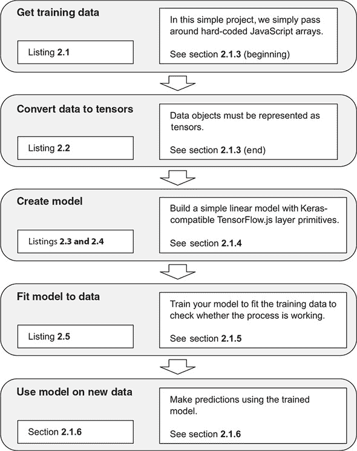

首先，我们将访问我们的训练数据。在机器学习中，数据可以从磁盘中读取，通过网络下载，生成，或者简单地硬编码。在本例中，我们采用了最后一种方法，因为它很方便，并且我们只处理了少量数据。其次，我们将把数据转换成张量，以便将其馈送到我们的模型中。下一步是创建一个模型，就像我们在第一章中看到的那样，这类似于设计一个适当的可训练函数：一个将输入数据映射到我们试图预测的事物的函数。在这种情况下，输入数据和预测目标都是数字。一旦我们的模型和数据可用，我们将训练模型，监视其报告的指标。最后，我们将使用训练好的模型对我们尚未见过的数据进行预测，并测量模型的准确性。

我们将通过每个阶段的可复制粘贴的可运行代码片段以及对理论和工具的解释来进行。

#### 2.1.2\. 有关代码清单和控制台交互的注意事项

本书中的代码将以两种格式呈现。第一种格式是*代码清单*，展示了您将在引用的代码仓库中找到的结构化代码。每个清单都有一个标题和一个编号。例如，清单 2.1 包含了一个非常简短的 HTML 片段，您可以将其逐字复制到一个文件中，例如 /tmp/tmp.html，在您的计算机上然后在您的 Web 浏览器中打开文件:///tmp/tmp.html，尽管它本身不会做太多事情。

第二种代码格式是*控制台交互*。这些更为非正式的代码块旨在传达在 JavaScript REPL（交互式解释器或 shell）^([1]) 中的示例交互，例如浏览器的 JavaScript 控制台（在 Chrome 中是 Cmd-Opt-J、Ctrl+Shift+J 或 F12，但您的浏览器/操作系统可能会有所不同）。控制台交互以前导的大于号开头，就像我们在 Chrome 或 Firefox 中看到的那样，并且它们的输出与控制台中的一样，呈现在下一行。例如，以下交互创建一个数组并打印其值。您在 JavaScript 控制台中看到的输出可能略有不同，但要点应该是相同的：

> ¹
> 
> Read-eval-print-loop，也称为交互式解释器或 shell。REPL 允许我们与我们的代码进行积极的交互，以查询变量和测试函数。

```js
> let a = ['hello', 'world', 2 * 1009]
> a;
(3) ["hello", "world", 2018]
```

在本书中测试、运行和学习代码列表的最佳方式是克隆引用的存储库，然后与其一起玩耍。在本书的开发过程中，我们经常使用 CodePen 作为一个简单、交互式、可共享的存储库（[`codepen.io`](http://codepen.io)）。例如，列表 2.1 可供你在 codepen.io/tfjs-book/pen/VEVMbx 上玩耍。当你导航到 CodePen 时，它应该会自动运行。你应该能够看到输出打印到控制台。点击左下角的 Console 打开控制台。如果 CodePen 没有自动运行，请尝试进行一个小的、无关紧要的更改，例如在末尾添加一个空格，以启动它。

本节的列表可在此 CodePen 集合中找到：codepen.io/collection/Xzwavm/。在只有单个 JavaScript 文件的情况下，CodePen 的效果很好，但我们更大更结构化的示例保存在 GitHub 存储库中，你将在后面的示例中看到。对于这个示例，我们建议你先阅读本节，然后再玩一玩相关的 CodePen。

#### 2.1.3\. 创建和格式化数据

让我们估计一下在一台机器上下载一个文件需要多长时间，只给出其大小（以 MB 为单位）。我们首先使用一个预先创建的数据集，但如果你有动力的话，你可以创建一个类似的数据集，模拟你自己系统的网络统计信息。

##### 列表 2.1\. 硬编码训练和测试数据（来自 CodePen 2-a）

```js
<script src='https://cdn.jsdelivr.net/npm/@tensorflow/tfjs@latest'></script>
<script>
const trainData = {
  sizeMB:  [0.080, 9.000, 0.001, 0.100, 8.000,
            5.000, 0.100, 6.000, 0.050, 0.500,
            0.002, 2.000, 0.005, 10.00, 0.010,
            7.000, 6.000, 5.000, 1.000, 1.000],
  timeSec: [0.135, 0.739, 0.067, 0.126, 0.646,
            0.435, 0.069, 0.497, 0.068, 0.116,
            0.070, 0.289, 0.076, 0.744, 0.083,
            0.560, 0.480, 0.399, 0.153, 0.149]
};
const testData = {
  sizeMB:  [5.000, 0.200, 0.001, 9.000, 0.002,
            0.020, 0.008, 4.000, 0.001, 1.000,
            0.005, 0.080, 0.800, 0.200, 0.050,
            7.000, 0.005, 0.002, 8.000, 0.008],
  timeSec: [0.425, 0.098, 0.052, 0.686, 0.066,
            0.078, 0.070, 0.375, 0.058, 0.136,
            0.052, 0.063, 0.183, 0.087, 0.066,
            0.558, 0.066, 0.068, 0.610, 0.057]
};
</script>
```

在上述 HTML 代码列表中，我们选择了显式包含 `<script>` 标签，演示了如何使用 `@latest` 后缀加载最新版本的 TensorFlow.js 库（在撰写本文时，此代码与 tfjs 0.13.5 兼容）。我们将在后面详细介绍不同的方式将 TensorFlow.js 导入到你的应用程序中，但在以后的过程中，我们将假定 `<script>` 标签已经包含在内。第一个脚本加载 TensorFlow 包并定义了符号 `tf`，它提供了一种引用 TensorFlow 中名称的方式。例如，`tf.add()` 指的是 TensorFlow 加法操作，用于将两个张量相加。在以后的过程中，我们将假设 `tf` 符号已经加载并在全局命名空间中可用，例如，通过之前的方式引用 TensorFlow.js 脚本。

列表 2.1 创建了两个常量，`trainData`和`testData`，分别表示下载文件所需的时间（`timeSec`）和文件大小（`sizeMB`）的 20 个样本。`sizeMB`中的元素与`timeSec`中的元素一一对应。例如，在`trainData`中，`sizeMB`的第一个元素为 0.080 MB，并且下载该文件所需时间为 0.135 秒，即 `timeSec`的第一个元素，依此类推。在这个示例中，我们通过在代码中直接编写数据来创建数据。这种方法在这个简单的示例中是可行的，但是当数据集的大小增长时，它很快就会变得难以管理。未来的示例将演示如何从外部存储或网络上的流数据。

回到数据上。根据图 2.2 中的绘图，我们可以看到文件大小和下载时间之间存在着可预测但并不完美的关系。现实生活中的数据是嘈杂的，但看起来我们应该能够对文件大小给出一个相当好的线性估计值。根据视觉判断，当文件大小为零时，持续时间应该约为 0.1 秒，然后每增加 1MB，持续时间大约增加 0.07 秒。请回忆起第一章中提到的，每个输入-输出对有时被称为*样本*。输出通常被称为*目标*，而输入的元素通常被称为*特征*。在我们的例子中，我们的 40 个样本中每个样本恰好有一个特征`sizeMB`和一个数值目标`timeSec`。

##### 图 2.2\. 下载持续时间与文件大小的测量数据。如果您对如何创建类似的绘图感兴趣，可以参考 CodePen 上的代码[codepen.io/tfjs-book/pen/dgQVze](http://codepen.io/tfjs-book/pen/dgQVze)。

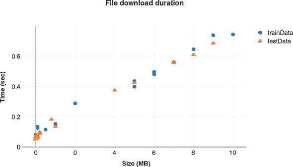

在列表 2.1 中，您可能已经注意到数据被分为两个子集，即`trainData`和`testData`。`trainData`是训练集，它包含了模型将会在上面进行训练的样本。`testData`是测试集，我们将使用它来判断模型在训练完成后的效果如何。如果我们使用完全相同的数据进行训练和评估，那就像是在已经看到答案之后进行考试。在最极端的情况下，模型可以从训练数据中理论上记住每个`sizeMB`对应的`timeSec` 值，这不是一个很好的学习算法。结果可能不是对未来性能的很好评估，因为未来输入特征的值很可能与模型进行训练时的值完全相同。

因此，工作流程如下。首先，我们将在训练数据上拟合神经网络，以便准确预测`timeSec`给定`sizeMB`。然后，我们将要求网络使用测试数据为`sizeMB`生成预测，并测量这些预测与`timeSec`的接近程度。但首先，我们必须将此数据转换为 TensorFlow.js 能够理解的格式，这将是我们对张量的第一个示例用法。代码清单 2.2 中的代码展示了在本书中你将看到的`tf.*`命名空间下的函数的第一个用法。在这里，我们看到了将存储在原始 JavaScript 数据结构中的数据转换为张量的方法。

尽管使用方法非常简单明了，但那些希望在这些 API 中获得更牢固基础的读者应该阅读附录 B，其中不仅涵盖了诸如`tf.tensor2d()`之类的张量创建函数，还涉及执行操作转换和合并张量的函数，以及常见的真实世界数据类型（如图像和视频）如何被惯例地打包成张量的模式。我们在主要文本中没有深入研究底层 API，因为这些材料有些枯燥，并且与具体的示例问题无关。

##### 代码清单 2.2\. 将数据转换为张量（来自 CodePen 2-b）

```js
const trainTensors = {
  sizeMB: tf.tensor2d(trainData.sizeMB, [20, 1]),       ***1***
  timeSec: tf.tensor2d(trainData.timeSec, [20, 1])
};
const testTensors = {
  sizeMB: tf.tensor2d(testData.sizeMB, [20, 1]),
  timeSec: tf.tensor2d(testData.timeSec, [20, 1])
};
```

+   ***1*** 这里的[20, 1]是张量的“形状”。稍后会有更多解释，但在这里这个形状意味着我们希望将数字列表解释为 20 个样本，每个样本是 1 个数字。如果形状从数据数组的结构中明显，则可以省略此参数。

一般来说，所有当前的机器学习系统都使用张量作为它们的基本数据结构。张量对于该领域是至关重要的——以至于 TensorFlow 和 TensorFlow.js 都以它们命名。从第一章快速提醒：在其核心，张量是数据的容器——几乎总是数字数据。因此，它可以被认为是数字的容器。你可能已经熟悉向量和矩阵，它们分别是 1D 和 2D 张量。张量是矩阵向任意维度的泛化。张量的维数和每个维度的大小称为张量的*形状*。例如，一个 3 × 4 矩阵是一个形状为`[3, 4]`的张量。长度为 10 的向量是一个形状为`[10]`的 1D 张量。

在张量的上下文中，维度通常被称为*轴*。在 TensorFlow.js 中，张量是让组件之间通信和协同工作的常见表示，无论是在 CPU、GPU 还是其他硬件上。随着需求的出现，我们将对张量及其常见用例有更多介绍，但现在，让我们继续进行我们的预测项目。

#### 2.1.4\. 定义一个简单的模型

在深度学习的上下文中，从输入特征到目标的函数称为*模型*。模型函数接受特征，运行计算，并产生预测。我们正在构建的模型是一个接受文件大小作为输入并输出持续时间的函数（参见图 2.2）。在深度学习术语中，有时我们将*网络*用作模型的同义词。我们的第一个模型将是*线性回归*的实现。

*回归*，在机器学习的上下文中，意味着模型将输出实值，并尝试匹配训练目标；这与分类相反，后者输出来自一组选项的选择。在回归任务中，模型输出的数字越接近目标越好。如果我们的模型预测一个 1 MB 文件大约需要 0.15 秒，那就比预测一个 1 MB 文件需要约 600 秒要好（正如我们从图 2.2 中看到的）。

线性回归是一种特定类型的回归，其中输出作为输入的函数可以被表示为一条直线（或者类比为在存在多个输入特征时的高维空间中的一个平面）。模型的一个重要特性是它们是*可调的*。这意味着输入-输出计算可以被调整。我们利用这个特性来调整模型以更好地“拟合”数据。在线性情况下，模型的输入-输出关系总是一条直线，但我们可以调整斜率和 y 截距。

让我们构建我们的第一个网络来感受一下。

##### 代码清单 2.3 构建线性回归模型（来自 CodePen 2-c）

```js
const model = tf.sequential();
model.add(tf.layers.dense({inputShape: [1], units: 1}));
```

神经网络的核心构建模块是*层*，一个你可以将其视为从张量到张量的可调函数的数据处理模块。在这里，我们的网络由一个单一的密集层组成。该层对输入张量的形状有约束，由参数`inputShape: [1]`定义。在这里，它意味着该层期望以一维张量形式接收输入，其中恰好有一个值。来自密集层的输出始终是每个示例的一维张量，但该维度的大小由`units`配置参数控制。在这种情况下，我们只需要一个输出数字，因为我们试图预测的恰好是一个数字，即`timeSec`。

核心部分，密集层是每个输入与每个输出之间的可调整乘加。由于只有一个输入和一个输出，这个模型就是你可能从高中数学中记得的简单的`y = m * x + b`线性方程。密集层内部将`m`称为*核*，将`b`称为*偏置*，如图 2.3 所示。在这种情况下，我们构建了一个关于输入(`sizeMB`)和输出(`timeSec`)之间关系的线性模型：

```js
    timeSec = kernel * sizeMB + bias
```

##### 图 2.3\. 我们简单线性回归模型的示意图。该模型只有一个层。模型的可调参数（或权重），即核函数和偏差，显示在密集层内部。

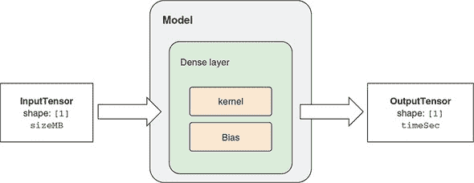

在这个方程中有四个项。就模型训练而言，其中两个是固定的：`sizeMB` 和 `timeSec` 的值由训练数据确定（见 listing 2.1）。另外两个项，即核函数和偏差，是模型的参数。它们的值在模型创建时是随机选择的。这些随机值不能很好地预测下载持续时间。为了进行良好的预测，我们必须通过允许模型从数据中学习来搜索核函数和偏差的良好值。这个搜索过程就是*训练过程*。

要找到核函数和偏差（统称为*权重*）的良好设置，我们需要两样东西：

+   一个告诉我们在给定权重设置下我们做得有多好的度量

+   一种方法来更新权重的值，以便下次我们的表现比当前更好，根据先前提到的度量

这将引导我们解决线性回归问题的下一步。为了使网络准备好进行训练，我们需要选择度量和更新方法，这对应于前面列出的两个必需项。这是 TensorFlow.js 称为*模型编译*步骤的一部分，它采取

+   一个*损失函数*—一个错误度量。这是网络在训练数据上衡量自己性能并使自己朝着正确方向前进的方式。更低的损失更好。当我们训练时，我们应该能够绘制随时间变化的损失并看到它下降。如果我们的模型训练了很长时间，而损失并没有减少，这可能意味着我们的模型没有学会拟合数据。在本书的过程中，您将学会解决此类问题。

+   一个*优化器*—根据数据和损失函数，网络将如何更新其权重（在本例中为核函数和偏差）的算法。

损失函数和优化器的确切目的，以及如何为它们做出良好选择，将在接下来的几章中进行彻底探讨。但现在，以下选择就足够了。

##### 代码清单 2.4\. 配置训练选项：模型编译（来自 CodePen 2-c）

```js
model.compile({optimizer: 'sgd', loss: 'meanAbsoluteError'});
```

我们在模型上调用`compile`方法，指定`'sgd'`作为我们的优化器，`'meanAbsoluteError'`作为我们的损失。`'meanAbsoluteError'`表示我们的损失函数将计算我们的预测与目标的距离，取其绝对值（使它们全部为正数），然后返回这些值的平均值：

```js
meanAbsoluteError = average( absolute(modelOutput - targets) )
```

例如，给定

```js
modelOutput = [1.1, 2.2, 3.3, 3.6]
targets =     [1.0, 2.0, 3.0, 4.0]
```

那么，

```js
meanAbsoluteError = average([|1.1 - 1.0|, |2.2 - 2.0|,
                             |3.3 - 3.0|, |3.6 - 4.0|])

                  = average([0.1, 0.2, 0.3, 0.4])
                  = 0.25
```

如果我们的模型做出非常糟糕的预测，与目标差距很大，那么`meanAbsoluteError`将非常大。相反，我们可能做的最好的事情是准确预测每一个，这样我们的模型输出和目标之间的差异将为零，因此损失（`meanAbsoluteError`）将为零。

在 list 2.4 中的`sgd`代表*随机梯度下降*，我们将在 section 2.2 中稍作描述。简而言之，这意味着我们将使用微积分来确定应该对权重进行哪些调整以减少损失；然后我们将进行这些调整并重复该过程。

我们的模型现在已经准备好适应我们的训练数据了。

#### 2.1.5\. 将模型拟合到训练数据

在 TensorFlow.js 中训练模型是通过调用模型的`fit()`方法来完成的。我们将模型与训练数据拟合。在这里，我们将`sizeMB`张量作为我们的输入，将`timeSec`张量作为我们期望的输出。我们还传入一个配置对象，其中包含一个`epochs`字段，该字段指定我们想要完全遍历我们的训练数据 10 次。在深度学习中，通过完整训练集的每次迭代称为*epoch*。

##### list 2.5\. 拟合线性回归模型（来自 CodePen 2-c）

```js
(async function() {
  await model.fit(trainTensors.sizeMB,
                  trainTensors.timeSec,
                  {epochs: 10});
})();
```

`fit()`方法通常运行时间较长，持续几秒钟或几分钟。因此，我们利用 ES2017/ES8 的*async/await*特性，以便在浏览器中运行时该函数不会阻塞主 UI 线程。这与 JavaScript 中其他可能运行时间较长的函数类似，例如`async fetch`。在这里，我们等待`fit()`调用完成后再继续进行，使用立即调用的异步函数表达式^([2])模式，但未来的示例将在前台线程中进行其他工作的同时在后台线程中进行训练。

> ²
> 
> 有关立即调用的函数表达式的更多信息，请参见[`mng.bz/RPOZ`](http://mng.bz/RPOZ)。

一旦我们的模型完成拟合，我们就会想要看看它是否起作用。至关重要的是，我们将在训练期间未使用的数据上评估模型。在本书中，将反复出现将测试数据与训练数据分离（因此避免在测试数据上训练）的主题。这是机器学习工作流程的重要部分，你应该内化。

模型的`evaluate()`方法计算应用于提供的示例特征和目标的损失函数。它与`fit()`方法类似，因为它计算相同的损失，但`evaluate()`不会更新模型的权重。我们使用`evaluate()`来估计模型在测试数据上的质量，以便了解模型在将来应用中的表现：

```js
> model.evaluate(testTensors.sizeMB, testTensors.timeSec).print();
Tensor
    0.31778740882873535
```

在这里，我们看到损失在测试数据上平均约为 0.318。考虑到，默认情况下，模型是从随机初始状态训练的，你会得到不同的值。另一种说法是，该模型的平均绝对误差（MAE）略高于 0.3 秒。这个好吗？比只估算一个常量好吗？我们可以选择一个好的常量是平均延迟。让我们看看使用这个常量会得到什么样的误差，使用 TensorFlow.js 对张量进行数学运算的支持。首先，我们将计算在训练集上计算的平均下载时间：

```js
> const avgDelaySec = tf.mean(trainData.timeSec);
> avgDelaySec.print();
Tensor
    0.2950500249862671
```

接下来，让我们手动计算 `meanAbsoluteError`。MAE 简单地是我们的预测值与实际值之间的平均差值。我们将使用 `tf.sub()` 计算测试目标与我们（常量）预测之间的差值，并使用 `tf.abs()` 取绝对值（因为有时我们会偏低，有时偏高），然后使用 `tf.mean` 求平均值：

```js
> tf.mean(tf.abs(tf.sub(testData.timeSec, 0.295))).print();
Tensor
    0.22020000219345093
```

请参见信息框 2.1 了解如何使用简洁的链式 API 执行相同的计算。

|  |
| --- |

**张量链式 API**

除了标准 API 外，在 `tf` 命名空间下可用的张量函数之外，大多数张量函数也可以直接从张量对象本身获得，如果你喜欢，可以采用链式编程风格进行编写。下面的代码在功能上与主文中的 `meanAbsoluteError` 计算完全相同：

```js
// chaining API pattern
> testData.timeSec.sub(0.295).abs().mean().print();
Tensor
    0.22020000219345093
```

|  |
| --- |

看起来平均延迟约为 0.295 秒，总是猜测平均值比我们的网络更好地估计。这意味着我们的模型准确性甚至比一个常识性的、平凡的方法还要差！我们能做得更好吗？可能是我们训练的周期不够。请记住，在训练期间，核心和偏置的值是逐步更新的。在这种情况下，每个周期都是一步。如果模型只训练了少数周期（步骤），参数值可能没有机会接近最优值。让我们再训练几个周期，然后重新评估：

```js
>  model.fit(trainTensors.sizeMB,
             trainTensors.timeSec,
             {epochs: 200});              ***1***

>  model.evaluate(testTensors.sizeMB, testTensors.timeSec).print();
Tensor
    0.04879039153456688
```

+   ***1*** 确保在执行 model.evaluate 之前等待 model.fit 返回的 promise 解析。

好多了！看起来我们之前是*欠拟合*，意味着我们的模型还没有足够地适应训练数据。现在我们的估计平均在 0.05 秒之内。我们比简单地猜测均值要准确四倍。在本书中，我们将提供关于如何避免欠拟合的指导，以及更隐蔽的*过拟合*问题的解决方法，过拟合是指模型对训练数据调整*过多*，导致在未见过的数据上泛化能力较差！

#### 2.1.6 使用我们训练的模型进行预测

好的，太棒了！现在我们有了一个能够根据输入大小准确预测下载时间的模型，但我们如何使用它呢？答案是模型的 `predict()` 方法：

```js
> const smallFileMB = 1;
> const bigFileMB = 100;
> const hugeFileMB = 10000;
> model.predict(tf.tensor2d([[smallFileMB], [bigFileMB],
     [hugeFileMB]])).print();
Tensor
    [[0.1373825  ],
     [7.2438402  ],
     [717.8896484]]
```

在这里，我们可以看到我们的模型预测一个 10,000 MB 的文件下载大约需要 718 秒。请注意，我们的训练数据中没有任何接近这个大小的例子。通常来说，对训练数据范围之外的值进行外推是非常危险的，但对于一个如此简单的问题，它可能是准确的......只要我们不遇到内存缓冲区、输入输出连接等新问题。如果我们能够收集更多在这个范围内的训练数据将会更好。

我们还看到我们需要将输入变量包装到一个适当形状的张量中。在 listing 2.3 中，我们定义`inputShape`为`[1]`，所以模型期望每个例子具有这个形状。`fit()`和`predict()`都可以一次处理多个例子。为了提供`n`个样本，我们将它们堆叠成一个单个输入张量，因此必须具有形状`[n, 1]`。如果我们忘记了，并且向模型提供了形状错误的张量，我们将得到一个形状错误的错误，如下所示：

```js
> model.predict(tf.tensor1d([smallFileMB, bigFileMB, hugeFileMB])).print();
Uncaught Error: Error when checking : expected dense_Dense1_input to have 2
     dimension(s), but got array with shape [3]
```

注意此类形状不匹配的问题，因为这是一种非常常见的错误！

#### 2.1.7\. 我们第一个示例的总结

对于这个小例子来说，可以说明模型的结果。图 2.4 展示了模型在该过程中的四个点（从 10 个周期的欠拟合到收敛）。我们可以看到收敛的模型与数据非常匹配。如果你对如何绘制这种类似于图 2.4 的数据感兴趣，请访问[`codepen.io/tfjs-book/pen/VEVMMd`](http://codepen.io/tfjs-book/pen/VEVMMd)上的 CodePen。

##### 图 2.4\. 训练 10、20、100 和 200 个周期后的线性模型拟合情况

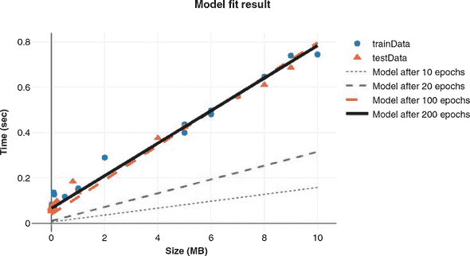

这是我们的第一个示例的结束。你刚刚看到了如何在很少的 JavaScript 代码行中构建、训练和评估一个 TensorFlow.js 模型（参见 listing 2.6）。在下一节中，我们将更深入地了解`model.fit`内部发生的情况。

##### 2.6\. 模型定义、训练、评估和预测

```js
const model = tf.sequential([tf.layers.dense({inputShape: [1], units: 1})]);
model.compile({optimizer: 'sgd', loss: 'meanAbsoluteError'});
(async () => await model.fit(trainTensors.sizeMB,
                             trainTensors.timeSec,
                             {epochs: 10}))();
model.evaluate(testTensors.sizeMB, testTensors.timeSec);
model.predict(tf.tensor2d([[7.8]])).print();
```

### 2.2\. Model.fit()内部: 对示例 1 中的梯度下降进行解剖

在前一节中，我们构建了一个简单的模型并拟合了一些训练数据，展示了在给定文件大小的情况下，我们可以进行相当准确的下载时间预测。它可能不是最令人印象深刻的神经网络，但它的工作方式与我们将要构建的更大、更复杂的系统完全相同。我们看到将其拟合 10 个周期并不好，但将其拟合 200 个周期产生了一个质量较高的模型^([3])。让我们更详细地了解一下模型训练时发生的确切情况。

> ³
> 
> 注意，对于像这个简单的线性模型，存在着简单、高效、封闭形式的解。然而，这种优化方法在我们后面介绍的更复杂的模型中仍然适用。

#### 2.2.1\. 梯度下降优化背后的直觉

回想一下，我们的简单单层模型是在拟合一个线性函数`f(input)`，定义为

```js
output = kernel * input + bias
```

这里的 kernel 和 bias 是稠密层（dense layer）中的可调参数（权重）。这些权重包含了网络从训练数据中学到的信息。

最初，这些权重被随机初始化为小的随机值（一个称为*随机初始化*的步骤）。当 kernel 和 bias 都是随机值时，我们当然不会指望`kernel * input + bias`会产生有用的结果。通过想象力，我们可以想象在不同的参数选择下，MAE 的值会如何变化。我们预期当参数近似于我们在图 2.4 中观察到的直线的斜率和截距时，损失会很低，并且当参数描述非常不同的直线时，损失会变得更糟。这个概念——损失作为所有可调参数的函数——被称为*损失面*。

由于这只是个小例子，我们只有两个可调参数和一个目标，所以可以将损失面绘制为 2D 等高线图，就像图 2.5 展示的那样。这个损失面呈现出一个漂亮的碗状，碗底的全局最小值代表了最佳的参数设置。然而，一个深度学习模型的损失面比这个要复杂得多。它会有多于两个维度，并且可能有很多局部最小值——也就是比附近任何点都更低但不是全局最低点的点。

##### 图 2.5\. 损失面展示了损失以及模型可调参数的等高线图。通过这个俯视图，我们可以看到选择`{bias: 0.08, kernel: 0.07}`（用白色 X 标记）作为低损失程度的合理选择。我们很少能有能力测试*所有*的参数设置来构建这样的图，但如果我们能，优化将会非常容易；只需选择对应最低损失的参数！

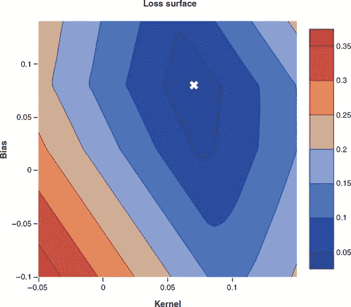

我们可以看到这个损失面的形状像个碗，最好（最低）的值在`{bias: 0.08, kernel: 0.07}`附近。这符合我们的数据所暗示的直线的几何形状，其中下载时间约为 0.10 秒，即使文件大小接近零。我们模型的随机初始化让我们从随机的参数设置开始，类似于地图上的随机位置，然后我们计算我们的初始损失。接下来，我们根据一个反馈信号逐渐调整参数。这个逐渐调整，也称为*训练*，是“机器学习”中的“学习”。这发生在一个*训练循环*中，如图 2.6 所示。

##### 图 2.6\. 描述训练循环，通过梯度下降更新模型

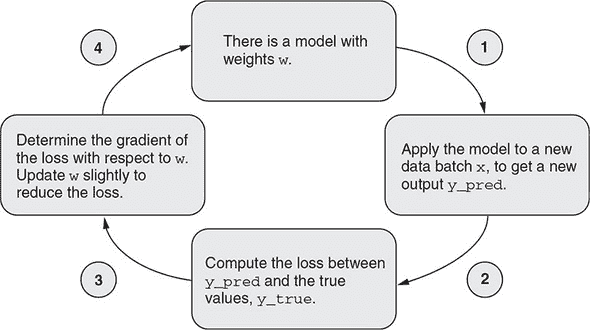

图 2.6 展示了训练循环在需要的情况下如何迭代执行这些步骤：

1.  绘制一批训练样本`x`和相应的目标`y_true`。 一批简单地将若干输入示例组合成张量。 一批中的示例数量称为*批量大小*。 在实际的深度学习中，通常设置为 2 的幂，例如 128 或 256。 示例被批量处理以利用 GPU 的并行处理能力，并使梯度的计算值更稳定（详情请参见第 2.2.2 节）。

1.  在`x`上运行网络（称为*前向传递*）以获得预测`y_pred`。

1.  计算网络在批量上的损失，这是`y_true`和`y_pred`之间不匹配的度量。 请回忆，当调用`model.compile()`时指定了损失函数。

1.  以稍微减少此批次上的损失的方式更新网络中的所有权重（参数）。 单个权重的详细更新由优化器管理，这是我们在`model.compile()`调用中指定的另一个选项。

如果您可以在每一步中降低损失，最终您将获得一个在训练数据上损失较低的网络。 网络已经“学会”将其输入映射到正确的目标。 从远处看，它可能看起来像魔术，但当简化为这些基本步骤时，事实证明它是简单的。

唯一困难的部分是步骤 4：如何确定应该增加哪些权重，应该减少哪些权重，以及数量是多少？ 我们可以简单地猜测和检查，只接受实际减少损失的更新。 对于像这样的简单问题，这样的算法可能有效，但速度会很慢。 对于更大的问题，当我们正在优化数百万个权重时，随机选择良好方向的可能性变得微乎其微。 更好的方法是利用网络中使用的所有操作都是*可微分*的事实，并计算损失相对于网络参数的*梯度*。

什么是梯度？ 不是精确定义它（需要一些微积分），我们可以直观地描述它如下：

> *一个方向，如果你将权重沿着那个方向微小移动，你将在所有可能的方向中最快地增加损失函数*

即使这个定义并不过于技术性，仍然有很多要解释的，所以让我们试着把它分解一下：

+   首先，梯度是一个向量。 它的元素数量与权重相同。 它代表了在所有权重值选择空间中的方向。 如果您的模型的权重由两个数字组成，就像在我们的简单线性回归网络中一样，那么梯度就是一个 2D 向量。 深度学习模型通常具有数千或数百万个维度，这些模型的梯度是具有数千或数百万个元素的向量（方向）。

+   其次，梯度取决于当前的权重值。换句话说，不同的权重值会产生不同的梯度。从图 2.5 可以清楚地看出，最快下降的方向取决于您在损失曲面上的位置。在左边缘，我们必须向右走。接近底部，我们必须向上走，依此类推。

+   最后，梯度的数学定义指定了一个使损失函数*增加*的方向。当然，训练神经网络时，我们希望损失*减少*。这就是为什么我们必须沿着梯度的*相反*方向移动权重的原因。

比喻一下，想象一下在山脉中徒步旅行。假设我们希望前往海拔最低的地方。在这个比喻中，我们可以通过沿着东西和南北轴定义的任意方向改变我们的海拔。我们应该将第一个要点解释为，我们的海拔梯度是指在我们脚下的坡度下最陡的方向。第二个要点有点显而易见，说明最陡的方向取决于我们当前的位置。最后，如果我们希望海拔低，我们应该朝着梯度的*相反*方向迈步。

这个训练过程恰如其分地被命名为*梯度下降*。还记得在清单 2.4 中，当我们用配置`optimizer: 'sgd'`指定我们的模型优化器时吗？随机梯度下降中的梯度下降部分现在应该清楚了。 "随机"部分只是意味着我们在每个梯度下降步骤中从训练数据中抽取随机样本以提高效率，而不是在每个步骤中使用每个训练数据样本。随机梯度下降只是梯度下降的一个针对计算效率的修改。

现在我们有了更完整的工具来解释优化是如何工作的，以及为什么我们的下载时间估算模型的 200 个周期比 10 个周期更好。图 2.7 说明了梯度下降算法如何沿着我们的损失曲面找到一个很好地适应我们的训练数据的权重设置的路径。图 2.7 面板 A 中的等高线图显示了与之前相同的损失曲面，略微放大，并现在叠加了梯度下降算法所遵循的路径。该路径始于*随机初始化*——图像上的一个随机位置。由于我们事先不知道最优值，所以我们必须选择一个随机的起点！路径沿途还标出了其他几个感兴趣的点，说明了对应于欠拟合和良好拟合模型的位置。图 2.7 面板 B 显示了模型损失作为步骤的函数的图，突出显示了类似的感兴趣点。面板 C 说明了使用权重作为在 B 中突出显示的步骤的快照的模型。

##### 图 2.7\. 面板 A：使用梯度下降进行 200 次中等步长引导参数设置到局部最优解。注释突出显示了起始权重以及 20、100 和 200 个周期后的值。面板 B：损失作为周期函数的绘图，突出显示了相同点的损失。面板 C：从 `sizeMB` 到 `timeSec` 的函数，经过 10、20、100 和 200 个周期的训练得到的拟合模型所体现的，这里重复给出以便您轻松比较损失表面位置和模型输出。请访问 [codepen.io/tfjs-book/pen/JmerMM](http://codepen.io/tfjs-book/pen/JmerMM) 以玩耍这段代码。

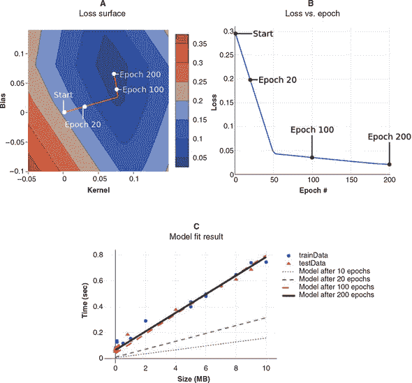

我们简单的线性回归模型是本书唯一一个我们能够如此生动地可视化梯度下降过程的模型。但是当我们后面遇到更复杂的模型时，请记住梯度下降的本质仍然相同：它只是在一个复杂的、高维度表面上迭代地向下走，希望最终能够在一个损失非常低的地方停下来。

在我们的初始尝试中，我们使用了默认步长（由*默认学习率*确定），但是在有限数据上仅循环了 10 次时，步数不足以达到最优值；200 步足够了。一般来说，您如何知道如何设置学习率，或者如何知道训练何时完成？有一些有用的经验法则，我们将在本书的过程中介绍，但没有一条硬性规定能够永远避免麻烦。如果我们使用的学习率太小，导致步长*太小*，我们将无法在合理的时间内达到最优参数。相反，如果我们使用的学习率太大，因此步长*太大*，我们将完全跳过最小值，甚至可能比我们离开的地方的损失更高。这将导致我们模型的参数在逼近最优值时出现剧烈振荡，而不是以直接的方式快速逼近。图 2.8 示例如何当我们的梯度步长过大时会发生什么。在更极端的情况下，大的学习率会导致参数值发散并趋向无穷大，这将进一步在权重中生成 NaN（非数字）值，彻底破坏您的模型。

##### 图 2.8\. 当学习率过高时，梯度步长会过大，新参数可能比旧参数更差。这可能导致振荡行为或其他稳定性问题，导致出现无穷大或 NaN。您可以尝试将 CodePen 代码中的学习率增加到 0.5 或更高以查看此行为。

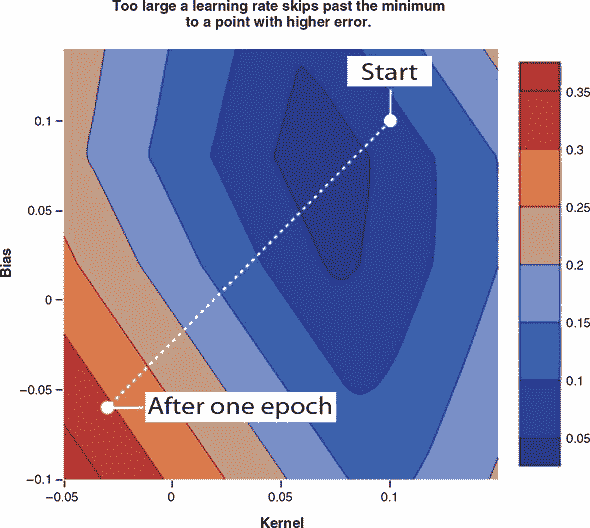

#### 2.2.2\. 反向传播：梯度下降的内部

在上一节中，我们解释了权重更新的步长如何影响梯度下降过程。但是，我们还没有讨论如何计算更新的*方向*。这些方向对于神经网络的学习过程是至关重要的。它们由相对于权重的梯度决定，计算这些梯度的算法称为*反向传播*。反向传播在 20 世纪 60 年代被发明，它是神经网络和深度学习的基础之一。在本节中，我们将使用一个简单的例子来展示反向传播的工作原理。请注意，本节是面向希望理解反向传播的读者。如果您只希望使用 TensorFlow.js 应用算法，这部分内容不是必需的，因为这些机制都被很好地隐藏在`tf.Model.fit()` API 下面；您可以跳过本节，继续阅读第 2.3 节。

考虑一个简单的线性模型

```js
y’ = v * x,
```

其中 `x` 是输入特征，`y’` 是预测输出，`v` 是在反向传播期间要更新的模型唯一的权重参数。假设我们使用平方误差作为损失函数；则我们有以下关系式，描述`loss`、`v`、`x`和`y`（实际目标值）之间的关系:

```js
loss = square(y’ - y) = square(v * x - y)
```

让我们假设以下具体值：两个输入变量的值为 `x = 2` 和 `y = 5`，权重值为 `v = 0`。损失可以计算为 25。这在图 2.9 中逐步显示。图中 A 面板中的每个灰色正方形代表一个输入变量（即`x`和`y`），每个白色方框表示一个操作。总共有三个操作。连接操作的边（以及将可调权重`v`与第一个操作连接的边）标记为`e[1]`、`e[2]`和`e[3]`。

##### 图 2.9。通过一个只有一个可更新权重（`v`）的简单线性模型说明反向传播算法。A 面板：对模型的前向传递（从权重（`v`）和输入（`x`和`y`）计算出损失值）。B 面板：反向传递——从损失到`v`逐步计算损失相对于`v`的梯度。

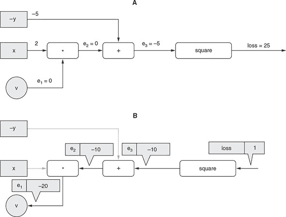

反向传播的一个重要步骤是确定以下量： 

> *假设其他所有内容（*在这种情况下是 `x` 和 `y`）保持不变，如果* `v`*增加一个单位，我们将获得的损失值的变化有多大？*

这个量被称作*相对于* `v` *的损失梯度*。为什么我们需要这个梯度呢？因为一旦我们拥有了它，我们就可以朝着相反的方向改变 `v`，这样就可以得到损失值的减少。请注意，我们不需要相对于 `x` 或 `y` 的损失梯度，因为 `x` 和 `y` 不需要被更新：它们是输入数据，并且是固定的。

这个梯度是逐步计算的，从损失值开始向后退到变量`v`，如图 2.9 B 面所示。计算的方向是这个算法被称为“反向传播”的原因。让我们来看看具体步骤。以下每个步骤都对应着图中的一个箭头：

+   在标记为`loss`的边缘，我们从梯度值为 1 开始。这是一个微不足道的观点，“`loss`的单位增加对应着`loss`本身的单位增加”。

+   在标记为`e[3]`的边缘，我们计算损失相对于`e[3]`当前值的单位变化的梯度。因为中间操作是一个平方，并且从基本微积分我们知道`(e[3])²`相对于`e[3]`的导数(在一维情况下的梯度)是`2 * e[3]`，我们得到一个梯度值为`2 * -5 = -10`。值`-10`与之前的梯度(即 1)相乘，得到边缘`e[3]`上的梯度：`-10`。这是如果`e[3]`增加 1 损失将增加的量。正如你可能已经观察到的，我们用来从损失相对于一个边缘的梯度转移到相对于下一个边缘的梯度的规则是将先前的梯度与当前节点局部计算的梯度相乘。这个规则有时被称为*链式法则*。

+   在边缘`e[2]`，我们计算`e[3]`相对于`e[2]`的梯度。因为这是一个简单的`add`操作，梯度是 1，不管其他输入值是什么(`-y`)。将这个 1 与边缘`e[3]`上的梯度相乘，我们得到边缘`e[2]`上的梯度，即`-10`。

+   在边缘`e[1]`，我们计算`e[2]`相对于`e[1]`的梯度。这里的操作是`x`和`v`之间的乘法，即`x * v`。所以，`e[2]`相对于`e[1]`（即相对于`v`）的梯度是`x`，即 2。值 2 与边缘`e[2]`上的梯度相乘，得到最终的梯度：`2 * -10 = -20`。

到目前为止，我们已经得到了`v`相对于损失的梯度：它是`-20`。为了应用梯度下降，我们需要将这个梯度的负数与学习率相乘。假设学习率是 0.01。然后我们得到一个梯度更新为

```js
-(-20) * 0.01 = 0.2
```

这是我们在训练的这一步将应用于`v`的更新：

```js
v = 0 + 0.2 = 0.2
```

正如你所见，因为我们有`x = 2`和`y = 5`，并且要拟合的函数是`y’ = v * x`，`v`的最佳值是`5/2 = 2.5`。经过一步训练后，`v`的值从 0 变为 0.2。换句话说，权重`v`更接近期望值。在后续的训练步骤中，它将变得越来越接近（忽略训练数据中的任何噪声），这将基于先前描述的相同的反向传播算法。

先前的示例被故意简化，以便易于跟踪。尽管该示例捕获了反向传播的本质，但实际神经网络训练中发生的反向传播与之不同，具有以下方面：

+   通常，不是提供一个简单的训练示例（在我们的例子中是`x = 2`和`y = 5`），而是同时提供许多输入示例的批处理。用于导出梯度的损失值是所有单个示例的损失值的算术平均值。

+   被更新的变量通常有更多的元素。因此，通常涉及矩阵微积分，而不是我们刚刚做的简单的单变量导数。

+   与仅计算一个变量的梯度不同，通常涉及多个变量。图 2.10 显示了一个示例，这是一个略微更复杂的具有两个要优化变量的线性模型。除了`k`之外，模型还有一个偏置项：`y’ = k * x + b`。在这里，有两个梯度要计算，一个是为了`k`，另一个是为了`b`。反向传播的两条路径都从损失开始。它们共享一些共同的边，并形成类似树的结构。

##### 图 2.10\. 示意图显示从损失到两个可更新权重(`k`和`b`)的反向传播。

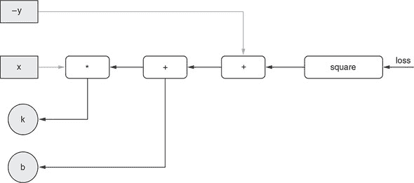

在本节中，我们对反向传播的处理是轻松和高层次的。如果您希望深入了解反向传播的数学和算法，请参考信息框 2.2 中的链接。

在这一点上，您应该对将简单模型拟合到训练数据时发生的情况有很好的理解，因此让我们将我们的小型下载时间预测问题放在一边，并使用 TensorFlow.js 来解决一些更具挑战性的问题。在下一节中，我们将构建一个模型，以同时准确预测多个输入特征的房地产价格。

|  |
| --- |

**有关梯度下降和反向传播的进一步阅读**

优化神经网络背后的微积分绝对是有趣的，并且能够洞察到这些算法的行为；但是在基础知识之上，它绝对*不*是机器学习从业者的必需品，就像理解 TCP/IP 协议的复杂性对于理解如何构建现代 Web 应用程序有用但并不重要一样。我们邀请好奇的读者探索这里的优秀资源，以建立对网络中基于梯度的优化数学的更深入的理解：

+   反向传播演示滚动说明：[`mng.bz/2J4g`](http://mng.bz/2J4g)

+   斯坦福 CS231 讲座 4 课程关于反向传播的课程笔记：[`cs231n.github.io/optimization-2/`](http://cs231n.github.io/optimization-2/)

+   Andrej Karpathy 的“神经网络黑客指南:” [`karpathy.github.io/neuralnets/`](http://karpathy.github.io/neuralnets/)

|  |
| --- |

### 2.3\. 具有多个输入特征的线性回归

在我们的第一个示例中，我们只有一个输入特征`sizeMB`，用它来预测我们的目标`timeSec`。更常见的情况是具有多个输入特征，不确定哪些特征最具预测性，哪些只与目标松散相关，并同时使用它们，并让学习算法来处理。在本节中，我们将解决这个更复杂的问题。

到本节结束时，您将

+   了解如何构建一个模型，该模型接收并从多个输入特征中学习。

+   使用 Yarn、Git 和标准 JavaScript 项目打包结构构建和运行带有机器学习的 Web 应用程序。

+   知道如何对数据进行归一化以稳定学习过程。

+   体会如何在训练过程中使用`tf.Model.fit()`回调来更新 Web UI。

#### 2.3.1\. 波士顿房价数据集

波士顿房价数据集^([4])是 1970 年代末在马萨诸塞州波士顿及周边地区收集的 500 条简单的房地产记录的集合。几十年来，它一直被用作介绍性统计和机器学习问题的标准数据集。数据集中的每个独立记录都包括波士顿社区的数值测量，例如房屋的典型大小、该地区距离最近的高速公路有多远、该地区是否拥有水边物业等。表 2.1 提供了特征的精确排序列表，以及每个特征的平均值。

> ⁴
> 
> 大卫·哈里森（David Harrison）和丹尼尔·鲁宾菲尔德（Daniel Rubinfeld），“享乐主义住房价格与对清洁空气的需求”，《环境经济与管理杂志》，第 5 卷，1978 年，第 81–102 页，[`mng.bz/1wvX`](http://mng.bz/1wvX)。

##### 表 2.1\. 波士顿房屋数据集的特征

| 索引 | 特征简称 | 特征描述 | 平均值 | 范围（最大值-最小值） |
| --- | --- | --- | --- | --- |
| 0 | CRIM | 犯罪率 | 3.62 | 88.9 |
| 1 | ZN | 用于超过 25,000 平方英尺的住宅用地比例 | 11.4 | 100 |
| 2 | INDUS | 城镇中非零售业务用地（工业）比例 | 11.2 | 27.3 |
| 3 | CHAS | 区域是否靠近查尔斯河 | 0.0694 | 1 |
| 4 | NOX | 一氧化氮浓度（百万分之一） | 0.555 | 0.49 |
| 5 | RM | 每个住宅的平均房间数 | 6.28 | 5.2 |
| 6 | AGE | 1940 年前建造的自有住房比例 | 68.6 | 97.1 |
| 7 | DIS | 到五个波士顿就业中心的加权距离 | 3.80 | 11.0 |
| 8 | RAD | 径向公路可达性指数 | 9.55 | 23.0 |
| 9 | TAX | 每 1 万美元的税率 | 408.0 | 524.0 |
| 10 | PTRATIO | 学生-教师比例 | 18.5 | 9.40 |
| 11 | LSTAT | 无高中学历的工作男性比例 | 12.7 | 36.2 |
| 12 | MEDV | 单位为 $1,000 的自有住房的中位数价值 | 22.5 | 45 |

在本节中，我们将构建、训练和评估一个学习系统，以估计邻域房屋价格的中位数值（MEDV），并给出邻域的所有输入特征。你可以把它想象成一个从可测量的邻域属性估计房地产价格的系统。

#### 2.3.2\. 从 GitHub 获取并运行波士顿房屋项目

由于这个问题比下载时间预测示例要复杂一些，并且有更多的组成部分，我们将首先以一个工作代码仓库的形式提供解决方案，然后引导你完成。如果你已经是 Git 源代码控制工作流和 npm/Yarn 包管理的专家，你可能只需快速浏览一下这一小节。有关基本的 JavaScript 项目结构的更多信息，请参阅 信息框 2.3。

我们将从 GitHub 上的源获取项目仓库的副本来开始。获取项目所需的 HTML、JavaScript 和配置文件。除了最简单的那些（这些都托管在 CodePen 上），本书中的所有示例都在两个 Git 仓库之一中收集，然后在仓库中分目录存放。这两个仓库分别是 tensorflow/tfjs-examples 和 tensorflow/tfjs-models，都托管在 GitHub 上。以下命令将克隆我们需要的仓库到本地，并将工作目录切换到波士顿房屋预测项目：

> ⁵
> 
> 本书示例是开源的，托管在 [github.com](http://github.com) 和 [codepen.io](http://codepen.io) 上。如果你想要关于如何使用 Git 源代码控制工具的温习，GitHub 有一个很好的教程，从 [`help.github.com/articles/set-up-git`](https://help.github.com/articles/set-up-git) 开始。如果你发现错误或想通过 GitHub 提交更正，请随时发送修复请求。

```js
git clone https://github.com/tensorflow/tfjs-examples.git
cd tfjs-examples/boston-housing
```

|  |
| --- |

**本书中使用的基本 JavaScript 项目结构**

本书示例中使用的标准项目结构包括三种重要类型的文件。第一种是 HTML。我们将使用的 HTML 文件将是基本的骨架，主要用于承载几个组件。通常只会有一个名为 index.html 的 HTML 文件，其中包含几个 `div` 标签，可能还有几个 UI 元素，以及一个 source 标签来引入 JavaScript 代码，如 index.js。

JavaScript 代码通常会模块化成多个文件，以促进良好的可读性和风格。在波士顿房屋项目中，负责更新可视元素的代码存放在 ui.js 中，而处理数据下载的代码则在 data.js 中。两者均通过 `import` 语句从 index.js 中引用。

我们将使用的第三种重要文件类型是元数据包 .json 文件，这是 npm 包管理器（[www.npmjs.com](http://www.npmjs.com)）的要求。如果您之前没有使用过 npm 或者 Yarn，请我们建议您浏览一下 npm 的“入门”文档（[`docs.npmjs.com/about-npm`](https://docs.npmjs.com/about-npm)），并且熟悉到足以构建和运行示例代码的程度。我们将使用 Yarn 作为我们的包管理器（[`yarnpkg.com/en/`](https://yarnpkg.com/en/)），但是如果您更喜欢使用 npm，可以将 npm 替换为 Yarn。

在存储库内，注意以下重要文件：

+   *index.html*—根 HTML 文件，它提供 DOM 根，并调用 JavaScript 脚本

+   *index.js*—根 JavaScript 文件，该文件加载数据，定义模型和训练循环，并指定 UI 元素

+   *data.js*—下载和访问波士顿房价数据集所需的结构的实现

+   *ui.js*—实现将 UI 元素与操作连接的 UI 钩子的文件；绘图配置的规范

+   *normalization.js*—数值例程，例如从数据中减去均值

+   *package.json*—标准的 npm 包定义，描述了构建和运行此演示所需的依赖项（例如 TensorFlow.js！）

请注意，我们不遵循将 HTML 文件和 JavaScript 文件放在特定类型的子目录中的标准做法。这种模式在更大的存储库中是最佳做法，但对于我们将在本书中使用的较小示例或您可以在 [github.com/tensorflow/tfjs-examples](http://github.com/tensorflow/tfjs-examples) 找到的示例，它更多地是混淆而不是澄清。

|  |
| --- |

要运行此演示，请使用 Yarn：

```js
yarn && yarn watch
```

这将在您的浏览器中打开一个指向 `localhost` 上的端口的新标签，该端口将运行示例。如果您的浏览器没有自动反应，可以在命令行中导航到输出的 URL。点击标记为“Train Linear Regressor”的按钮将触发构建线性模型并将其拟合到波士顿房价数据的过程，然后在每个周期后输出训练和测试数据集的损失的动态图表，如图 2.11 所示。

##### 图 2.11。tfjs-examples 中的波士顿房价线性回归示例

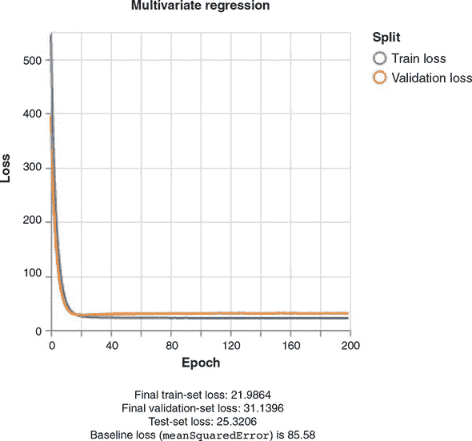

本节的其余部分将介绍构建这个波士顿房价线性回归 Web 应用演示的重要要点。我们首先将回顾数据是如何收集和处理的，以便与 TensorFlow.js 一起使用。然后我们将重点关注模型的构建、训练和评估；最后，我们将展示如何在网页上使用模型进行实时预测。

#### 2.3.3\. 访问波士顿房价数据

在我们的第一个项目中，在清单 2.1 中，我们将数据硬编码为 JavaScript 数组，并使用`tf.tensor2d`函数将其转换为张量。硬编码对于小型演示来说没问题，但显然不适用于更大的应用程序。一般来说，JavaScript 开发人员会发现他们的数据位于某个 URL（可能是本地）的某种序列化格式中。例如，波士顿房屋数据以 CSV 格式公开且免费提供，可以从 Google Cloud 的以下 URL 中获取：

+   [`storage.googleapis.com/tfjs-examples/multivariate-linear-regression/data/train-data.csv`](https://storage.googleapis.com/tfjs-examples/multivariate-linear-regression/data/train-data.csv)

+   [`storage.googleapis.com/tfjs-examples/multivariate-linear-regression/data/train-target.csv`](https://storage.googleapis.com/tfjs-examples/multivariate-linear-regression/data/train-target.csv)

+   [`storage.googleapis.com/tfjs-examples/multivariate-linear-regression/data/test-data.csv`](https://storage.googleapis.com/tfjs-examples/multivariate-linear-regression/data/test-data.csv)

+   [`storage.googleapis.com/tfjs-examples/multivariate-linear-regression/data/test-target.csv`](https://storage.googleapis.com/tfjs-examples/multivariate-linear-regression/data/test-target.csv)

数据已经通过将样本随机分配到训练和测试部分而进行了预拆分。大约有三分之二的样本在训练拆分中，剩下的三分之一用于独立评估经过训练的模型。此外，对于每个拆分，目标特征已经与其他特征分开成为 CSV 文件，导致了表 2.2 中列出的四个文件名。

##### 表 2.2\. 波士顿房屋数据集的拆分和内容的文件名

|   |   | 特征（12 个数字） | 目标（1 个数字） |
| --- | --- | --- | --- |
| **训练-测试拆分** | **训练** | train-data.csv | train-target.csv |
|   | **测试** | test-data.csv | test-target.csv |

为了将这些数据引入我们的应用程序，我们需要能够下载这些数据并将其转换为适当类型和形状的张量。波士顿房屋项目在 data.js 中定义了一个名为`BostonHousingDataset`的类，用于此目的。该类抽象了数据集流操作，提供了一个 API 来检索原始数据作为数字矩阵。在内部，该类使用了公共开源 Papa Parse 库（[www.papaparse.com](http://www.papaparse.com)）来流式传输和解析远程 CSV 文件。一旦文件已加载和解析，库就会返回一个数字数组的数组。然后，使用与第一个示例中相同的 API 将其转换为张量，如下清单所示，这是`index.js`中的一个略微简化的示例，重点放在相关部分上。

##### 清单 2.7\. 在 index.js 中将波士顿房屋数据转换为张量

```js
// Initialize a BostonHousingDataset object defined in data.js.
const bostonData = new BostonHousingDataset();
const tensors = {};

// Convert the loaded csv data, of type number[][] into 2d tensors.
export const arraysToTensors = () => {
  tensors.rawTrainFeatures = tf.tensor2d(bostonData.trainFeatures);
  tensors.trainTarget = tf.tensor2d(bostonData.trainTarget);
  tensors.rawTestFeatures = tf.tensor2d(bostonData.testFeatures);
  tensors.testTarget = tf.tensor2d(bostonData.testTarget);
}

// Trigger the data to load asynchronously once the page has loaded.
let tensors;
document.addEventListener('DOMContentLoaded', async () => {
  await bostonData.loadData();
  arraysToTensors();
}, false);
```

#### 2.3.4\. 精确定义波士顿房屋问题

现在我们可以以我们想要的形式访问我们的数据，现在是时候更准确地澄清我们的任务了。我们说我们想要从其他字段预测 MEDV，但是我们将如何确定我们的工作是否做得好呢？我们如何区分一个好模型和一个更好的模型呢？

我们在第一个例子中使用的度量标准`meanAbsoluteError`将所有错误都视为平等。如果只有 10 个样本，并且我们对所有 10 个样本进行预测，并且我们在其中的第 10 个样本上完全正确，但在其他 9 个样本上偏差为 30，则`meanAbsoluteError`将为 3（因为 30/10 为 3）。如果我们的预测对每个样本都偏差为 3，那么`meanAbsoluteError`仍然为 3。这个“错误的平等性”原则可能似乎是唯一显然正确的选择，但是选择除`meanAbsoluteError`之外的损失度量有很好的理由。

另一种选择是将大错误的权重赋予小错误。我们可以不是取绝对误差的平均值，而是取*平方*误差的平均值。

在进行有关这 10 个样本的案例研究时，这种均方误差（MSE）方法看到了在每个示例上偏差为 3 时（10 × 3² = 90）比在一个示例上偏差为 30 时（1 × 30² = 900）较低的损失。由于对大错误的敏感性，平方误差比绝对误差更敏感于样本异常值。将模型拟合以最小化 MSE 的优化器将更喜欢系统地犯小错误的模型，而不是偶尔给出非常糟糕估计的模型。显然，这两种错误度量都会更喜欢根本没有错误的模型！但是，如果您的应用可能对非常不正确的异常值敏感，那么 MSE 可能比 MAE 更好。选择 MSE 或 MAE 的其他技术原因，但它们在此时并不重要。在本例中，我们将使用 MSE 来增加变化，但 MAE 也足够。

在我们继续之前，我们应该找到损失的基准估计。如果我们不知道从一个非常简单的估计中得出的误差，那么我们就没有能力从一个更复杂的模型中评估它。我们将使用平均房地产价格作为我们的“最佳天真猜测”，并计算总是猜测该值时的误差。

##### 列表 2.8\. 计算猜测平均价格的基线损失

```js
export const computeBaseline = () => {
  const avgPrice = tf.mean(tensors.trainTarget);             ***1***
  console.log(`Average price: ${avgPrice.dataSync()[0]}`);

  const baseline =
      tf.mean(tf.pow(tf.sub(
          tensors.testTarget, avgPrice), 2));                ***2***

  console.log(
      `Baseline loss: ${baseline.dataSync()[0]}`);           ***3***
};
```

+   ***1*** 计算平均价格

+   ***2*** 计算测试数据上的平均平方误差。sub()、pow 和 mean() 调用是计算平均平方误差的步骤。

+   ***3*** 打印出损失值

因为 TensorFlow.js 通过在 GPU 上进行调度来优化其计算，所以张量可能并不总是可供 CPU 访问。在列表 2.8 中对`dataSync`的调用告诉 TensorFlow.js 完成张量的计算，并将值从 GPU 拉到 CPU 中，以便可以打印出来或以其他方式与非 TensorFlow 操作共享。

当执行时，列表 2.8 中的代码将在控制台中产生以下输出：

```js
Average price: 22.768770217895508
Baseline loss: 85.58282470703125
```

这告诉我们，天真的误差率大约为 85.58。如果我们构建一个总是输出 22.77 的模型，该模型在测试数据上将达到 85.58 的 MSE。再次注意，我们在训练数据上计算指标，并在测试数据上评估它，以避免不公平的偏见。

平均*平方*误差为 85.58，所以我们应该取平方根得到平均误差。85.58 的平方根大约是 9.25。因此，我们可以说我们期望我们的（常量）估计平均偏离（上下）约 9.25。根据表 2.1 的数值，以千美元为单位，估计一个常量意味着我们会偏离约 9,250 美元。如果这对我们的应用程序足够好，我们可以停止！明智的机器学习从业者知道何时避免不必要的复杂性。让我们假设我们的价格估计应用程序需要比这更接近。我们将通过拟合我们的数据来查看是否可以获得比 85.58 更好的 MSE 的线性模型。

#### 2.3.5。稍微偏离数据标准化

查看波士顿房屋的特征，我们会看到各种值。NOX 的范围在 0.4 到 0.9 之间，而 TAX 则从 180 到 711。为了拟合线性回归，优化器将尝试找到每个特征的权重，使特征的累加乘以权重大约等于房屋价格。请记住，为了找到这些权值，优化器正在寻找，遵循权重空间中的梯度。如果某些特征与其他特征的比例相差很大，那么某些权重将比其他权重敏感得多。向一个方向的一个非常小的移动将比另一个方向的一个非常大的移动更改输出。这可能导致不稳定，并使得难以拟合模型。

为了对抗这一点，我们将首先*标准化*我们的数据。这意味着我们将缩放我们的特征，使它们的平均值为零，标准差为单位。这种标准化方法很常见，也可以被称为*标准转换*或*z-score 标准化*。做这种操作的算法很简单——我们首先计算每个特征的平均值，并从原始值中减去，使得该特征的平均值为零。然后我们计算特征的标准差与减去的平均值，并进行除法。在伪代码中，

```js
normalizedFeature = (feature - mean(feature)) / std(feature)
```

例如，当特征是`[10, 20, 30, 40]`时，标准化后的版本大约是`[-1.3, -0.4, 0.4, 1.3]`，很明显的平均值为零；肉眼看，标准差大约为一。在波士顿房屋的例子中，标准化代码被分解到一个单独的文件中，normalization.js，其内容在列表 2.9 中。在这里，我们看到两个函数，一个用于计算所提供的二维张量的平均值和标准差，另一个用于在提供预先计算的平均值和标准差的情况下标准化张量。

##### 列表 2.9。数据规范化：零均值，单位标准差

```js
/**
 * Calculates the mean and standard deviation of each column of an array.
 *
 * @param {Tensor2d} data Dataset from which to calculate the mean and
 *                        std of each column independently.
 *
 * @returns {Object} Contains the mean and std of each vector
 *                   column as 1d tensors.
 */
export function determineMeanAndStddev(data) {
  const dataMean = data.mean(0);
  const diffFromMean = data.sub(dataMean);
  const squaredDiffFromMean = diffFromMean.square();
  const variance = squaredDiffFromMean.mean(0);
  const std = variance.sqrt();
  return {mean, std};
}
/**
 * Given expected mean and standard deviation, normalizes a dataset by
 * subtracting the mean and dividing by the standard deviation.
 *
 * @param {Tensor2d} data: Data to normalize.
 *    Shape: [numSamples, numFeatures].
 * @param {Tensor1d} mean: Expected mean of the data. Shape [numFeatures].
 * @param {Tensor1d} std: Expected std of the data. Shape [numFeatures]
 *
 * @returns {Tensor2d}: Tensor the same shape as data, but each column
 * normalized to have zero mean and unit standard deviation.
 */
export function normalizeTensor(data, dataMean, dataStd) {
  return data.sub(dataMean).div(dataStd);
}
```

让我们稍微深入一下这些函数。函数`determineMeanAndStddev`将`data`作为输入，这是一个秩 2 张量。按照惯例，第一个维度是*样本*维度：每个索引对应一个独立，唯一的样本。第二个维度是*特征*维度：其 12 个元素对应于 12 个输入特征（如 CRIM，ZN，INDUS 等）。由于我们要独立计算每个特征的平均值，因此调用

```js
const dataMean = data.mean(0);
```

这个调用中的`0`表示平均值是在第 0 维度（第一维度）上计算的。记得`data`是一个二维张量，因此有两个维度（或轴）。第一个轴，即“批处理”轴，是样本维度。当我们沿着该轴从第一个到第二个到第三个元素移动时，我们引用不同的样本，或者在我们的情况下，不同的房地产部分。第二个维度是特征维度。当我们在该维度的第一个元素移动到第二个元素时，我们引用不同的特征，例如 CRIM，ZN 和 INDUS，来自表 2.1。当我们沿轴 0 取平均值时，我们正在沿样本方向取平均值。结果是具有仅保留特征轴的秩 1 张量。我们拥有每个特征的平均值。如果我们改为沿轴 1 取平均值，我们仍会得到一个秩 1 张量，但剩余轴将是样本维度。这些值将对应于每个房地产部分的平均值，这在我们的应用程序中没有意义。在使用轴进行计算时，请注意在正确方向上进行计算，因为这是常见的错误来源。

果然，如果我们在这里设置一个断点^([6])，我们可以使用 JavaScript 控制台来探索计算出的平均值，我们看到的平均值非常接近我们为整个数据集计算的值。这意味着我们的训练样本是代表性的：

> ⁶
> 
> 在 Chrome 中设置断点的说明在这里：[`mng.bz/rPQJ`](http://mng.bz/rPQJ)。如果您需要 Firefox，Edge 或其他浏览器中断点设置说明，您可以使用您喜欢的搜索引擎搜索“如何设置断点”。

```js
> dataMean.shape
[12]
> dataMean.print();
     [3.3603415, 10.6891899, 11.2934837, 0.0600601, 0.5571442, 6.2656188,
     68.2264328, 3.7099338, 9.6336336, 409.2792969, 18.4480476, 12.5154343]
```

在下一行中，我们通过使用`tf.sub`从我们的数据中减去平均值，从而获得数据的中心版本：

```js
const diffFromMean = data.sub(dataMean);
```

如果您没有 100％的注意力，这一行可能会隐藏一个迷人的小魔术。您看，`data`是一个形状为`[333,12]`的秩 2 张量，而`dataMean`是一个形状为`[12]`的秩 1 张量。通常情况下，不可能减去具有不同形状的两个张量。但是，在这种情况下，TensorFlow 使用广播将第二个张量的形状扩展为在效果上重复它 333 次，而不使其清楚地拼写出来。这种易用性使操作变得更加简单，但是有时广播兼容的形状规则可能有点令人困惑。如果您对广播的细节感兴趣，请直接阅读信息框 2.4。

`determineMeanAndStddev`函数的下几行没有新的惊喜：`tf.square()`将每个元素乘以自身，而`tf.sqrt()`获取元素的平方根。每种方法的详细 API 在 TensorFlow.js API 参考文档中都有记录，[`js.tensorflow.org/api/latest/`](https://js.tensorflow.org/api/latest/)。该文档页面还具有实时的可编辑小部件，可以让您探索如何将函数与自己的参数值一起使用，如图 2.12 所示。

##### 图 2.12。[js.tensorflow.org](http://js.tensorflow.org)的 TensorFlow.js API 文档允许您在文档内直接探索和交互使用 TensorFlow API。这使得理解函数用途和棘手的边界案例变得简单而快速。

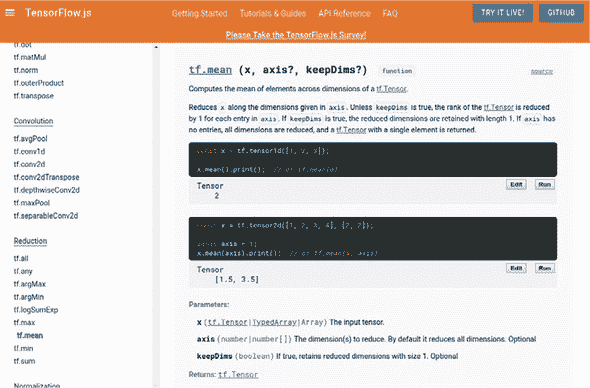

在这个例子中，我们编写了代码以优先考虑阐述的清晰度，但是`determineMeanAndStddev`函数可以更简洁地表达：

```js
const std = data.sub(data.mean(0)).square().mean().sqrt();
```

你应该能够看到，TensorFlow 允许我们在不使用很多样板代码的情况下表达相当多的数字计算。

|  |
| --- |

**广播**

考虑一个张量运算，如`C = tf.someOperation（A，B）`，其中`A`和`B`是张量。如果可能且没有歧义，较小的张量将被扩展到与较大的张量匹配的形状。广播包括两个步骤：

1.  小张量添加轴（称为*广播轴*）以匹配大张量的秩。

1.  较小的张量将沿着这些新轴重复以匹配大张量的完整形状。

在实现方面，实际上没有创建新的张量，因为那将非常低效。重复操作完全是虚拟的，在算法级别而不是在内存级别上发生。但是思考较小张量沿着新轴重复是有帮助的。

通过广播，如果一个张量的形状为`(a, b, ..., n, n + 1, ... m)`，另一个张量的形状为`(n, n + 1, ... , m)`，通常可以对两个张量进行逐元素操作。广播将自动发生在轴`a`到`n - 1`。例如，以下示例通过广播在不同形状的两个随机张量上应用逐元素`maximum`操作：

```js
x = tf.randomUniform([64, 3, 11, 9]);    ***1***
y = tf.randomUniform([11, 9]);           ***2***
z = tf.maximum(x, y);                    ***3***
```

+   ***1*** x 是一个形状为 [64, 3, 11, 9] 的随机张量。

+   ***2*** y 是一个形状为 [11, 9] 的随机张量。

+   ***3*** 输出 z 的形状与 x 相同，为 [64, 3, 11, 9]。

|  |
| --- |

#### 2.3.6\. 波士顿房屋数据的线性回归

我们的数据已经归一化，并且我们已经完成了对数据的尽职调查工作，计算出了一个合理的基线——下一步是构建和拟合一个模型，看看我们是否能超越基线。在 listing 2.10 中，我们定义了一个线性回归模型，就像我们在 section 2.1 中所做的那样（来自 index.js）。代码非常相似；我们从下载时间预测模型看到的唯一区别在于 `inputShape` 配置，它现在接受长度为 12 的向量，而不是 1。单个密集层仍然具有 `units: 1`，表示输出为一个数字。

##### Listing 2.10\. 为波士顿房屋定义线性回归模型

```js
export const linearRegressionModel = () => {
  const model = tf.sequential();
  model.add(tf.layers.dense(
      {inputShape: [bostonData.numFeatures], units: 1}));
  return model;
};
```

在我们的模型被定义之后，但在我们开始训练之前，我们必须通过调用`model.compile`来指定损失和优化器。在 listing 2.11 中，我们看到指定了`'meanSquaredError'`损失，并且优化器使用了自定义的学习率。在我们之前的示例中，优化器参数被设置为字符串`'sgd'`，但现在是`tf.train.sgd(LEARNING_RATE)`。这个工厂函数将返回一个代表随机梯度下降优化算法的对象，但是参数化了我们自定义的学习率。这是 TensorFlow.js 中的一个常见模式，借鉴自 Keras，并且你将看到它被用于许多可配置选项。对于标准、已知的默认参数，字符串标记值可以替代所需的对象类型，TensorFlow.js 将使用良好的默认参数替换所需对象的字符串。在这种情况下，`'sgd'`将被替换为`tf.train.sgd(0.01)`。当需要额外的定制时，用户可以通过工厂函数构建对象并提供所需的定制值。这允许代码在大多数情况下简洁，但允许高级用户在需要时覆盖默认行为。

##### Listing 2.11\. 为波士顿房屋模型编译（来自 index.js）

```js
const LEARNING_RATE = 0.01;
model.compile({
    optimizer: tf.train.sgd(LEARNING_RATE),
    loss: 'meanSquaredError'});
```

现在我们可以使用训练数据集训练我们的模型。在列表 2.12 到 2.14 中，我们将使用`model.fit()`调用的一些附加功能，但本质上它与图 2.6 中的情况相同。在每一步中，它从特征（`tensors.trainFeatures`）和目标（`tensors.trainTarget`）中选择一定数量的新样本，计算损失，然后更新内部权重以减少该损失。该过程将在训练数据上进行`NUM_EPOCHS`次完整的遍历，并且在每一步中将选择`BATCH_SIZE`个样本。

##### 图 2.12. 在波士顿房屋数据上训练我们的模型

```js
await model.fit(tensors.trainFeatures, tensors.trainTarget, {
  batchSize: BATCH_SIZE
  epochs: NUM_EPOCHS,
});
```

在波士顿房价 Web 应用程序中，我们展示了一个图表，显示模型训练时的训练损失。这需要使用`model.fit()`回调功能来更新用户界面。`model.fit()`回调 API 允许用户提供回调函数，在特定事件发生时执行。截至版本 0.12.0，回调触发器的完整列表包括`onTrainBegin`、`onTrainEnd`、`onEpochBegin`、`onEpochEnd`、`onBatchBegin`和`onBatchEnd`。

##### 图 2.13. `model.fit()`中的回调函数

```js
let trainLoss;
await model.fit(tensors.trainFeatures, tensors.trainTarget, {
  batchSize: BATCH_SIZE,
  epochs: NUM_EPOCHS,
  callbacks: {
    onEpochEnd: async (epoch, logs) => {
      await ui.updateStatus(
         `Epoch ${epoch + 1} of ${NUM_EPOCHS} completed.`);
      trainLoss = logs.loss;
      await ui.plotData(epoch, trainLoss);
    }
  }
});
```

这里介绍的最后一个新的自定义是利用验证数据。验证是一个值得解释的机器学习概念。在早期的下载时间示例中，我们将训练数据与测试数据分开，因为我们想要一个对模型在新的、未见过的数据上的性能进行无偏估计。通常情况下，还有一个称为*验证数据*的拆分。验证数据与训练数据和测试数据都是分开的。验证数据用于什么？机器学习工程师将在验证数据上看到结果，并使用该结果来更改模型的某些配置^[7]，以提高验证数据上的准确性。这都很好。然而，如果这个周期足够多次，那么我们实际上是在验证数据上进行调优。如果我们使用相同的验证数据来评估模型的最终准确性，那么最终评估的结果将不再具有泛化性，因为模型已经看到了数据，并且评估结果不能保证反映模型在未来未见数据上的表现。这就是将验证数据与测试数据分开的目的。这个想法是我们将在训练数据上拟合我们的模型，并根据验证数据上的评估来调整其超参数。当我们完成并满意整个过程时，我们将在测试数据上仅对模型进行一次评估，以获得最终的、可推广的性能估计。

> ⁷
> 
> 这些配置的示例包括模型中的层数、层的大小、训练过程中使用的优化器类型和学习率等。它们被称为模型的*超参数*，我们将在下一章的 section 3.1.2 中更详细地介绍。

让我们总结一下训练、验证和测试集在 TensorFlow.js 中的作用以及如何使用它们。并非所有项目都会使用这三种类型的数据。经常，快速探索或研究项目只会使用训练和验证数据，而不会保留一组“纯”数据用于测试。虽然不太严谨，但这有时是对有限资源的最佳利用：

+   *训练数据*—用于梯度下降优化模型权重

    +   *在 TensorFlow.js 中的用法*：通常，使用主要参数（`x`和`y`）对`Model.fit(x, y, config)`进行调用来使用训练数据。

+   *验证数据*—用于选择模型结构和超参数

    +   *在 TensorFlow.js 中的用法*：`Model.fit()` 有两种指定验证数据的方式，都作为`config`参数的一部分。如果您作为用户具有明确的用于验证的数据，则可以指定为`config.validationData`。相反，如果您希望框架拆分一些训练数据并将其用作验证数据，则可以在`config.validationSplit`中指定要使用的比例。框架将确保不使用验证数据来训练模型，因此不会有重叠。

+   *测试数据*—用于对模型性能进行最终、无偏的估计

    +   *在 TensorFlow.js 中的用法*：通过将其作为`x`和`y`参数传递给`Model.evaluate(x, y, config)`，可以向系统公开评估数据。

在 列表 2.14 中，验证损失与训练损失一起计算。`validationSplit: 0.2`字段指示`model.fit()`机制选择最后 20%的训练数据用作验证数据。这些数据将不用于训练（不影响梯度下降）。

##### 列表 2.14\. 在 `model.fit()` 中包含验证数据

```js
let trainLoss;
let valLoss;
await model.fit(tensors.trainFeatures, tensors.trainTarget, {
  batchSize: BATCH_SIZE,
  epochs: NUM_EPOCHS,
  validationSplit: 0.2,
  callbacks: {
    onEpochEnd: async (epoch, logs) => {
      await ui.updateStatus(
          `Epoch ${epoch + 1} of ${NUM_EPOCHS} completed.`);
      trainLoss = logs.loss;
      valLoss = logs.val_loss;
      await ui.plotData(epoch, trainLoss, valLoss);
    }
  }
});
```

在浏览器上将此模型训练到 200 个周期大约需要 11 秒。我们现在可以对我们的测试集上评估模型，以查看它是否比基准更好。下一个列表显示了如何使用`model.evaluate()`来收集模型在我们保留的测试数据上的性能，然后调用我们的自定义 UI 例程来更新视图。

##### 列表 2.15\. 在测试数据上评估我们的模型并更新 UI（来自 index.js）

```js
await ui.updateStatus('Running on test data...');
const result = model.evaluate(
    tensors.testFeatures, tensors.testTarget, {batchSize: BATCH_SIZE});
const testLoss = result.dataSync()[0];
await ui.updateStatus(
    `Final train-set loss: ${trainLoss.toFixed(4)}\n` +
    `Final validation-set loss: ${valLoss.toFixed(4)}\n` +
    `Test-set loss: ${testLoss.toFixed(4)}`);
```

在这里，`model.evaluate()`返回一个标量（记住，一个秩为 0 的张量），其中包含对测试集计算得出的损失。

由于梯度下降中涉及随机性，您可能会得到不同的结果，但以下结果是典型的：

+   最终的训练集损失: 21.9864

+   最终的验证集损失: 31.1396

+   测试集损失: 25.3206

+   基准损失: 85.58

我们从中看到，我们的最终无偏估计错误约为 25.3，远远好于我们的天真基线 85.6。回想一下，我们的错误是使用`meanSquaredError`计算的。取平方根，我们看到基线估计通常偏离了 9.2 以上，而线性模型仅偏离了约 5.0。相当大的改进！如果我们是世界上唯一拥有这些信息的人，我们可能是 1978 年波士顿最好的房地产投资者！除非，以某种方式，有人能够建立一个更准确的估算……

如果你让好奇心超过了自己，并点击了训练神经网络回归器，你已经知道可以得到*更好*的估计。在下一章中，我们将介绍非线性深度模型，展示这样的成就是如何可能的。

### 2.4\. 如何解释你的模型

现在我们已经训练了我们的模型，并且它能够做出合理的预测，自然而然地想知道它学到了什么。有没有办法窥视模型，看看它是如何理解数据的？当模型为输入预测了一个特定的价格时，你能否找到一个可以理解的解释来解释它为什么得出这个值？对于大型深度网络的一般情况，模型理解——也称为模型可解释性——仍然是一个活跃的研究领域，在学术会议上填满了许多海报和演讲。但对于这个简单的线性回归模型来说，情况相当简单。

到本节结束时，你将

+   能够从模型中提取学到的权重。

+   能够解释这些权重，并将它们与你对权重*应该*是什么的直觉进行权衡。

#### 2.4.1\. 从学到的权重中提取含义

我们在 section 2.3 中构建的简单线性模型包含了 13 个学到的参数，包含在一个核和一个偏差中，就像我们在 section 2.1.3 中的第一个线性模型一样：

```js
output = kernel · features + bias
```

核和偏差的值都是在拟合模型时学到的。与 section 2.1.3 中学到的*标量*线性函数相比，这里，特征和核都是*向量*，而“`·`”符号表示*内积*，是标量乘以向量的一般化。内积，也称为*点积*，简单地是匹配元素的乘积的和。清单 2.16 中的伪代码更精确地定义了内积。

我们应该从中得出结论，特征的元素与核的元素之间存在关系。对于每个单独的特征元素，例如表 table 2.1 中列出的“犯罪率”和“一氧化氮浓度”，核中都有一个关联的学到的数字。每个值告诉我们一些关于模型对这个特征学到了什么以及这个特征如何影响输出的信息。

##### 清单 2.16\. 内积伪代码

```js
function innerProduct(a, b) {
    output = 0;
    for (let i = 0 ; i < a.length ; i++) {
        output += a[i] * b[i];
    }
    return output;
}
```

例如，如果模型学到了`kernel[i]`是正的，那么这意味着如果`feature[i]`的值较大，则输出将更大。反之，如果模型学到了`kernel[j]`是负的，那么较大的`feature[j]`值会减少预测的输出。学到的值在大小上非常小意味着模型认为相关特征对预测的影响很小，而具有大幅度的学习值则表明模型对该特征的重视程度很高，并且特征值的微小变化将对预测产生相对较大的影响。^([8])

> ⁸
> 
> 注意，只有在特征已经被归一化的情况下，才能以这种方式比较其大小，就像我们为波士顿房屋数据集所做的那样。

为了具体化，根据绝对值排名，前五个特征值被打印在图 2.13 中，以显示波士顿房屋示例的输出区域中的一个运行。由于初始化的随机性，后续运行可能会学到不同的值。我们可以看到对于我们期望对房地产价格产生负面影响的特征，例如当地居民辍学率和房地产距离理想工作地点的距离，其值是负的。对于我们期望与价格直接相关的特征，例如房产中的房间数量，学到的权重是正的。

##### 图 2.13。根据绝对值排名，这是在波士顿房屋预测问题的线性模型的一个运行中学到的前五个权重。注意对那些你期望对房价产生负面影响的特征的负值。

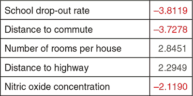

#### 2.4.2。从模型中提取内部权重

学到的模型的模块化结构使得提取相关权重变得容易；我们可以直接访问它们，但是有几个需要通过的 API 级别以获取原始值。重要的是要记住，由于值可能在 GPU 上，而设备间通信是昂贵的，请求这些值是异步的。列表 2.17 中的粗体代码是对 `model.fit` 回调的补充，扩展了 列表 2.14 以在每个 epoch 后说明学到的权重。我们将逐步讲解 API 调用。

给定模型，我们首先希望访问正确的层。这很容易，因为这个模型中只有一个层，所以我们可以在 `model.layers[0]` 处获得它的句柄。现在我们有了层，我们可以使用 `getWeights()` 访问内部权重，它返回一个权重数组。对于密集层的情况，这将始终包含两个权重，即核和偏置，顺序是这样的。因此，我们可以在以下位置访问正确的张量：

```js
> model.layers[0].getWeights()[0]
```

现在我们有了正确的张量，我们可以通过调用其 `data()` 方法来访问其内容。由于 GPU ↔ CPU 通信的异步性质，`data()` 是异步的，并返回张量值的一个承诺，而不是实际值。在 2.17 节 中，通过将承诺的 `then()` 方法传递给回调函数，将张量值绑定到名为 `kernelAsArr` 的变量上。如果取消注释 `console.log()` 语句，则像下面这样的语句，列出内核值，将在每个纪元结束时记录到控制台：

```js
> Float32Array(12) [-0.44015952944755554, 0.8829045295715332,
     0.11802537739276886, 0.9555914402008057, -1.6466193199157715,
     3.386948347091675, -0.36070501804351807, -3.0381457805633545,
     1.4347705841064453, -1.3844640254974365, -1.4223048686981201,
     -3.795234441757202]
```

##### 2.17\. 访问内部模型值

```js
let trainLoss;
let valLoss;
await model.fit(tensors.trainFeatures, tensors.trainTarget, {
  batchSize: BATCH_SIZE,
  epochs: NUM_EPOCHS,
  validationSplit: 0.2,
  callbacks: {
    onEpochEnd: async (epoch, logs) => {
      await ui.updateStatus(
          `Epoch ${epoch + 1} of ${NUM_EPOCHS} completed.`);
      trainLoss = logs.loss;
        valLoss = logs.val_loss;
      await ui.plotData(epoch, trainLoss, valLoss);
      model.layers[0].getWeights()[0].data().then(kernelAsArr => {
        // console.log(kernelAsArr);
        const weightsList = describeKerenelElements(kernelAsArr);
        ui.updateWeightDescription(weightsList);
      });
    }
  }
});
```

#### 2.4.3\. 解释性的注意事项

在 图 2.13 中的权重讲述了一个故事。作为人类读者，你可能会看到这个并说这个模型已经学会了“每栋房子的房间数”特征与价格输出呈正相关，或者房地产的 AGE 特征，由于其较低的绝对大小而未列出，比这前五个特征的重要性要低。由于我们的大脑喜欢讲故事的方式，很容易就把这些数字说得比证据支持的要多。例如，如果两个输入特征强相关，这种分析的一种失败方式是。

考虑一个假想的例子，其中相同的特征被意外地包含了两次。称它们为 FEAT1 和 FEAT2。假设学习到的两个特征的权重分别为 10 和 -5。你可能会倾向于认为增加 FEAT1 会导致输出增加，而 FEAT2 则相反。然而，由于这些特征是等价的，如果权重反转，模型将输出完全相同的值。

还有一个需要注意的地方是相关性与因果关系之间的区别。想象一个简单的模型，我们希望根据屋顶的湿度来预测外面下雨的程度。如果我们有一个屋顶湿度的测量值，我们可能可以预测过去一小时下了多少雨。但是，我们不能够向传感器泼水来制造雨！

### 练习

1.  在 2.1 节 中的硬编码时间估计问题之所以被选中，是因为数据大致上是线性的。其他数据集在拟合过程中将有不同的损失曲面和动态。您可能希望在这里尝试替换自己的数据，以探索模型的反应。您可能需要调整学习率、初始化或规范化来使模型收敛到一些有趣的东西。

1.  在 2.3.5 节 中，我们花了一些时间描述为什么归一化很重要以及如何将输入数据归一化为零均值和单位方差。你应该能够修改示例以去除归一化，并看到模型不再训练。你还应该能够修改归一化例程，例如，使均值不为 0 或标准偏差较低，但不是很低。有些归一化方法会奏效，有些会导致模型永远不收敛。

1.  众所周知，波士顿房价数据集的一些特征比其他特征更具有*预测性*。一些特征只是噪声，意味着它们不携带有用于预测房价的信息。如果我们只移除一个特征，我们应该保留哪个特征？如果我们要保留两个特征：我们该如何选择？尝试使用波士顿房价示例中的代码来探索这个问题。

1.  描述梯度下降如何通过以优于随机的方式更新权重来优化模型。

1.  波士顿房价示例打印出了绝对值最大的五个权重。尝试修改代码以打印与小权重相关联的特征。你能想象为什么这些权重很小吗？如果有人问你这些权重为什么是什么，你可以告诉他们什么？你会告诉那个人如何解释这些值的时候要注意什么？

### 总结

+   使用 TensorFlow.js 在五行 JavaScript 中构建、训练和评估一个简单的机器学习模型非常简单。

+   梯度下降，深度学习背后的基本算法结构，从概念上来说很简单，实际上只是指反复以小步骤更新模型参数，以使模型拟合最佳方向的计算方向。

+   模型的损失曲面展示了模型在一系列参数值的拟合程度。损失曲面通常无法计算，因为参数空间的维数很高，但思考一下并对机器学习的工作方式有直观的理解是很有意义的。

+   一个单独的密集层足以解决一些简单的问题，并且在房地产定价问题上可以获得合理的性能。
