## 第四章：使用卷积神经网络识别图像和声音

*本章内容涵盖*

+   图像和其他知觉数据（例如音频）如何表示为多维张量

+   卷积神经网络是什么、如何工作以及为什么它们特别适用于涉及图像的机器学习任务

+   如何编写和训练一个 TensorFlow.js 中的卷积神经网络来解决手写数字分类的任务

+   如何在 Node.js 中训练模型以实现更快的训练速度

+   如何在音频数据上使用卷积神经网络进行口语识别

持续进行的深度学习革命始于图像识别任务的突破，比如 ImageNet 比赛。涉及图像的有许多有用且技术上有趣的问题，包括识别图像的内容、将图像分割成有意义的部分、在图像中定位对象以及合成图像。这个机器学习的子领域有时被称为*计算机视觉*^([1])。计算机视觉技术经常被移植到与视觉或图像无关的领域（如自然语言处理），这也是为什么学习计算机视觉的深度学习至关重要的另一个原因^([2])。但在深入讨论计算机视觉问题之前，我们需要讨论图像在深度学习中的表示方式。

> ¹
> 
> 需要注意的是，计算机视觉本身是一个广泛的领域，其中一些部分使用了本书范围以外的非机器学习技术。
> 
> ²
> 
> 对于对计算机视觉深度学习特别感兴趣并希望深入了解该主题的读者，可以参考 Mohamed Elgendy 的《*深度学习图像处理入门*》，Manning 出版社，即将出版。

### 4.1。从向量到张量：图像的表示

在前两章中，我们讨论了涉及数值输入的机器学习任务。例如，第二章中的下载时长预测问题将单个数字（文件大小）作为输入。波士顿房价问题的输入是一个包含 12 个数字的数组（房间数量、犯罪率等）。这些问题的共同点是，每个输入示例都可以表示为一维（非嵌套）数字数组，对应于 TensorFlow.js 中的一维张量。图像在深度学习中的表示方式有所不同。

为了表示一张图片，我们使用一个三维张量。张量的前两个维度是熟悉的高度和宽度维度。第三个是颜色通道。例如，颜色通常被编码为 RGB 值。在这种情况下，三个颜色值分别是通道，导致第三个维度的大小为 3。如果我们有一张尺寸为 224 × 224 像素的 RGB 编码颜色图像，我们可以将其表示为一个尺寸为 `[224, 224, 3]` 的三维张量。某些计算机视觉问题中的图像是无颜色的（例如灰度图像）。在这种情况下，只有一个通道，如果将其表示为三维张量，将导致张量形状为 `[height, width, 1]` （参见图 4.1）。^([3])

> ³
> 
> 另一种选择是将图像的所有像素及其关联的颜色值展开为一个一维张量（一个由数字组成的扁平数组）。但是这样做很难利用每个像素的颜色通道与像素间的二维空间关系之间的关联。

##### 图 4.1\. 在深度学习中使用张量表示一个 MNIST 图像。为了可视化，我们将 MNIST 图像从 28 × 28 缩小到 8 × 8。这张图片是一个灰度图像，它的高度-宽度-通道(HWC)形状为`[8, 8, 1]`。这个图示中省略了最后一维的单个颜色通道。

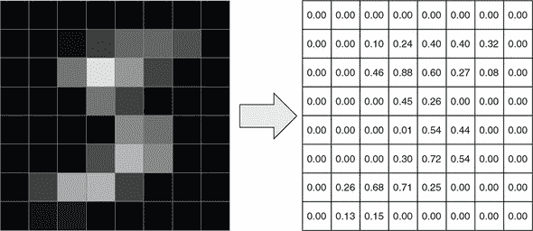

这种编码图像的方式被称为 *高度-宽度-通道(HWC)*。为了在图像上进行深度学习，我们经常将一组图像合并成一个批次以便进行高效的并行计算。当批量处理图像时，各个图像的维度总是第一维。这与我们在 第二章 和 第三章 中将一维张量组合成批量化的二维张量的方式类似。因此，图像的批次是一个四维张量，它的四个维度分别是图像数量（N）、高度（H）、宽度（W）和颜色通道（C）。这个格式被称为 *NHWC*。还有另一种格式，它由四个维度的不同排序得出。它被称为 *NCHW*。顾名思义，NCHW 将通道维度放在高度和宽度维度之前。TensorFlow.js 可以处理 NHWC 和 NCHW 两种格式。但是我们在本书中只使用默认的 NHWC 格式，以保持一致性。

#### 4.1.1\. MNIST 数据集

本章我们将着眼于计算机视觉问题中的 MNIST^([4])手写数字数据集。这个数据集非常重要并且频繁使用，通常被称为计算机视觉和深度学习的“Hello World”。MNIST 数据集比大多数深度学习数据集都要旧，也要小。然而熟悉它是很好的，因为它经常被用作示例并且经常用作新颖深度学习技术的第一个测试。

> ⁴
> 
> MNIST 代表 Modified NIST。名称中的“NIST”部分源自数据集约于 1995 年起源于美国国家标准技术研究所。名称中的“modified”部分反映了对原始 NIST 数据集所做的修改，包括 1）将图像标准化为相同的均匀 28 × 28 像素光栅，并进行抗锯齿处理，以使训练和测试子集更加均匀，以及 2）确保训练和测试子集之间的作者集是不相交的。这些修改使数据集更易于处理，并更有利于模型准确性的客观评估。

MNIST 数据集中的每个示例都是一个 28 × 28 的灰度图像（参见图 4.1 作为示例）。这些图像是从 0 到 9 的 10 个数字的真实手写转换而来的。28 × 28 的图像尺寸足以可靠地识别这些简单形状，尽管它比典型的计算机视觉问题中看到的图像尺寸要小。每个图像都附有一个明确的标签，指示图像实际上是 10 个可能数字中的哪一个。正如我们在下载时间预测和波士顿房屋数据集中看到的那样，数据被分为训练集和测试集。训练集包含 60,000 个图像，而测试集包含 10,000 个图像。MNIST 数据集^([5])大致平衡，这意味着这 10 个类别的示例大致相等（即 10 个数字）。

> ⁵
> 
> 请参阅 Yann LeCun、Corinna Cortes 和 Christopher J.C. Burges 的《手写数字 MNIST 数据库》[`yann.lecun.com/exdb/mnist/`](http://yann.lecun.com/exdb/mnist/)。

### 4.2\. 您的第一个卷积网络

鉴于图像数据和标签的表示，我们知道解决 MNIST 数据集的神经网络应该采用何种输入，以及应该生成何种输出。神经网络的输入是形状为 `[null, 28, 28, 1]` 的 NHWC 格式张量。输出是形状为 `[null, 10]` 的张量，其中第二个维度对应于 10 个可能的数字。这是多类分类目标的经典一热编码。这与我们在第三章中看到的鸢尾花种类的一热编码相同。有了这些知识，我们可以深入了解卷积网络（作为提醒，卷积网络是图像分类任务（如 MNIST）的选择方法）的细节。名称中的“卷积”部分可能听起来很吓人。这只是一种数学运算，我们将详细解释它。

代码位于 tfjs-examples 的 mnist 文件夹中。与前面的示例一样，您可以按以下方式访问和运行代码：

```js
git clone https://github.com/tensorflow/tfjs-examples.git
cd tfjs-examples/mnist
yarn && yarn watch
```

清单 4.1 是 mnist 示例中主要 index.js 代码文件的摘录。这是一个函数，用于创建我们用来解决 MNIST 问题的 convnet。此顺序模型的层数（七层）明显多于我们到目前为止看到的示例（一到三层之间）。

##### 清单 4.1。为 MNIST 数据集定义卷积模型

```js
function createConvModel() {
  const model = tf.sequential();

  model.add(tf.layers.conv2d({                                       ***1***
    inputShape: [IMAGE_H, IMAGE_W, 1],                               ***1***
    kernelSize: 3,                                                   ***1***
    filters: 16,                                                     ***1***
    activation: 'relu'                                               ***1***
  }));                                                               ***1***
  model.add(tf.layers.maxPooling2d({                                 ***2***
    poolSize: 2,                                                     ***2***
      strides: 2                                                     ***2***
  }));                                                               ***2***

  model.add(tf.layers.conv2d({                                       ***3***
    kernelSize: 3, filters: 32, activation: 'relu'}));               ***3***
  model.add(tf.layers.maxPooling2d({poolSize: 2, strides: 2}));

  model.add(tf.layers.flatten());                                    ***4***
  model.add(tf.layers.dense({
    units: 64,
    activation:'relu'
  }));
  model.add(tf.layers.dense({units: 10, activation: 'softmax'}));    ***5***
  model.summary();                                                   ***6***
  return model;
}
```

+   ***1*** 第一个 conv2d 层

+   ***2*** 卷积后进行池化

+   ***3*** conv2d-maxPooling2d 的重复“模式”

+   ***4*** 将张量展平以准备进行密集层

+   ***5*** 用于多类分类问题的 softmax 激活函数

+   ***6*** 打印模型的文本摘要

代码中的顺序模型由清单 4.1 中的代码构建，由`add()`方法调用逐个创建七个层。在我们查看每个层执行的详细操作之前，让我们先看一下模型的整体架构，如图 4.2 所示。如图所示，模型的前五层包括一组 conv2d-maxPooling2d 层的重复模式，后跟一个 flatten 层。conv2d-maxPooling2d 层组是特征提取的主力军。每个层将输入图像转换为输出图像。conv2d 层通过“卷积核”操作，该核在输入图像的高度和宽度维度上“滑动”。在每个滑动位置，它与输入像素相乘，然后将产品相加并通过非线性传递。这产生输出图像中的像素。maxPooling2d 层以类似的方式操作，但没有核。通过将输入图像数据通过连续的卷积和池化层，我们得到越来越小且在特征空间中越来越抽象的张量。最后一个池化层的输出通过展平变成一个 1D 张量。展平的 1D 张量然后进入密集层（图中未显示）。

##### 图 4.2。简单 convnet 架构的高级概述，类似于清单 4.1 中的代码构建的模型。在此图中，图像和中间张量的大小比实际模型中定义的大小要小，以进行说明。卷积核的大小也是如此。还要注意，该图显示每个中间 4D 张量中仅有一个通道，而实际模型中的中间张量具有多个通道。

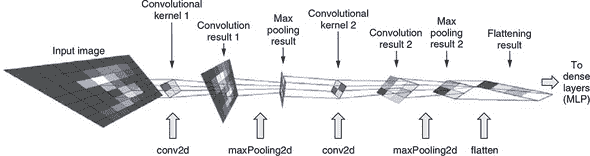

你可以将 convnet 看作是建立在卷积和池化预处理之上的 MLP。MLP 与我们在波士顿房屋和网络钓鱼问题中看到的完全相同：它仅由具有非线性激活的稠密层构成。在这里，convnet 的不同之处在于 MLP 的输入是级联 conv2d 和 maxPooling2d 层的输出。这些层专门设计用于图像输入，以从中提取有用的特征。这种架构是通过多年的神经网络研究发现的：它的准确性明显优于直接将图像的像素值馈入 MLP。

有了对 MNIST convnet 的高层次理解，现在让我们更深入地了解模型层的内部工作。

#### 4.2.1\. conv2d 层

第一层是 conv2d 层，它执行 2D 卷积。这是本书中看到的第一个卷积层。它的作用是什么？conv2d 是一个图像到图像的转换-它将一个 4D（NHWC）图像张量转换为另一个 4D 图像张量，可能具有不同的高度、宽度和通道数量。(conv2d 操作 4D 张量可能看起来有些奇怪，但请记住这里有两个额外的维度，一个是用于批处理示例，一个是用于通道。) 直观地看，它可以被理解为一组简单的“Photoshop 滤镜”^([6])，它会产生图像效果，如模糊和锐化。这些效果是通过 2D 卷积实现的，它涉及在输入图像上滑动一个小的像素块（卷积核，或简称核），并且像素与输入图像的小块重叠时，核与输入图像逐像素相乘。然后逐像素的乘积相加形成结果图像的像素。

> ⁶
> 
> 我们将这种类比归功于 Ashi Krishnan 在 JSConf EU 2018 上的名为“JS 中的深度学习”的演讲：[`mng.bz/VPa0`](http://mng.bz/VPa0)。

与稠密层相比，conv2d 层具有更多的配置参数。`kernelSize`和`filters`是 conv2d 层的两个关键参数。为了理解它们的含义，我们需要在概念层面上描述 2D 卷积是如何工作的。

图 4.3 更详细地说明了 2D 卷积。在这里，我们假设输入图像（左上角）张量由一个简单的例子组成，以便我们可以在纸上轻松地绘制它。我们假设 conv2d 操作配置为`kernelSize = 3`和`filters = 3`。由于输入图像具有两个颜色通道（仅仅是为了图示目的而具有的相当不寻常的通道数），卷积核是一个形状为`[3, 3, 2, 3]`的 3D 张量。前两个数字（3 和 3）是由`kernelSize`确定的核的高度和宽度。第三个维度（2）是输入通道的数量。第四个维度（3）是什么？它是滤波器的数量，等于 conv2d 输出张量的最后一个维度。

##### 图 4.3\. 卷积层的工作原理，并附有一个示例。为简化起见，假设输入张量（左上角）仅包含一幅图像，因此是一个 3D 张量。其维度为高度、宽度和深度（色道）。为简单起见，批次维度被省略。输入图像张量的深度为 2。注意图像的高度和宽度（4 和 5）远小于典型真实图像的高宽。深度（2）也低于更典型的 3 或 4 的值（例如 RGB 或 RGBA）。假设 conv2D 层的 `filters` 属性（滤波器数量）为 3，`kernelSize` 为 `[3, 3]`，`strides` 为 `[1, 1]`，进行 2D 卷积的第一步是沿着高度和宽度维度滑动，并提取原始图像的小块。每个小块的高度为 3，宽度为 3，与层的 `filterSize` 匹配；它的深度与原始图像相同。第二步是计算每个 3 × 3 × 2 小块与卷积核（即“滤波器”）的点积。图 4.4 更详细地说明了每个点积操作。卷积核是一个 4D 张量，由三个 3D 滤波器组成。对三个滤波器分别进行图像小块与滤波器之间的点积。图像小块与滤波器逐像素相乘，然后求和，这导致输出张量中的一个像素。由于卷积核中有三个滤波器，每个图像小块被转换为一个三个像素的堆叠。这个点积操作在所有图像小块上执行，产生的三个像素堆叠被合并为输出张量，这种情况下形状为 `[2, 3, 3]`。

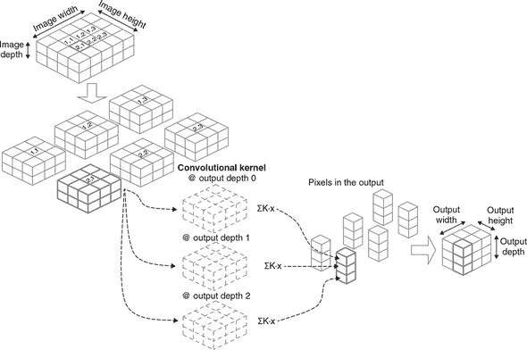

如果将输出视为图像张量（这是一个完全有效的观察方式！），那么滤波器可以理解为输出中通道的数量。与输入图像不同，输出张量中的通道实际上与颜色无关。相反，它们代表从训练数据中学到的输入图像的不同视觉特征。例如，一些滤波器可能对在特定方向上明亮和暗区域之间的直线边界敏感，而其他滤波器可能对由棕色形成的角落敏感，依此类推。稍后再详细讨论。

先前提到的“滑动”动作表示从输入图像中提取小块。每个小块的高度和宽度都等于 `kernelSize`（在这个例子中为 3）。由于输入图像的高度为 4，沿着高度维度只有两种可能的滑动位置，因为我们需要确保 3 × 3 窗口不会超出输入图像的边界。同样，输入图像的宽度（5）给出了三个可能的宽度维度滑动位置。因此，我们最终提取出 `2 × 3 = 6` 个图像小块。

在每个滑动窗口位置，都会进行一次点积操作。回想一下，卷积核的形状为`[3, 3, 2, 3]`。我们可以沿着最后一个维度将 4D 张量分解为三个单独的 3D 张量，每个张量的形状为`[3, 3, 2]`，如图 4.3 中的哈希线所示。我们取图像块和三维张量之一，将它们逐像素相乘，并将所有`3 * 3 * 2 = 18`个值求和以获得输出张量中的一个像素。图 4.4 详细说明了点积步骤。图像块和卷积核切片具有完全相同的形状并非巧合——我们基于内核的形状提取了图像块！这个乘加操作对所有三个内核切片重复进行，得到一组三个数字。然后，该点积操作对其余的图像块重复进行，得到图中六列三个立方体。这些列最终被组合成输出，其 HWC 形状为`[2, 3, 3]`。

##### 图 4.4\. 在 2D 卷积操作中的点积（即乘加）操作的示意图，这是图 4.3 中概述的完整工作流程中的一步。为了说明方便，假设图像块（x）只包含一个颜色通道。图像块的形状为`[3, 3, 1]`，与卷积核切片（K）的大小相同。第一步是逐元素相乘，产生另一个`[3, 3, 1]`张量。新张量的元素被加在一起（由σ表示），和即为结果。

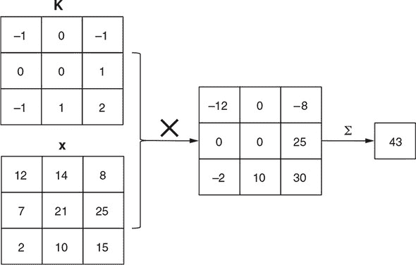

像密集层一样，conv2d 层有一个偏置项，它被加到卷积结果中。此外，conv2d 层通常配置为具有非线性激活函数。在这个例子中，我们使用 relu。回想一下，在第三章的“避免堆叠层而不使用非线性函数的谬论”一节中，我们警告说堆叠两个没有非线性的密集层在数学上等价于使用单个密集层。类似的警告也适用于 conv2d 层：堆叠两个这样的层而没有非线性激活在数学上等价于使用一个具有更大内核的单个 conv2d 层，因此这是一种应该避免的构建卷积网络的低效方式。

哇！关于 conv2d 层如何工作的细节就是这些。让我们退后一步，看看 conv2d 实际上实现了什么。简而言之，这是一种将输入图像转换为输出图像的特殊方式。输出图像通常比输入图像具有较小的高度和宽度。尺寸的减小取决于`kernelSize`配置。输出图像可能具有比输入更少、更多或相同的通道数，这取决于`filters`配置。

conv2d 是一种图像到图像的转换。conv2d 转换的两个关键特性是局部性和参数共享：

+   *局部性* 指的是输出图像中给定像素的值仅受到输入图像中一个小区域的影响，而不是受到输入图像中所有像素的影响。该区域的大小为`kernelSize`。这就是 conv2d 与密集层的不同之处：在密集层中，每个输出元素都受到每个输入元素的影响。换句话说，在密集层中，输入元素和输出元素在“密集连接”（因此称为密集层）；而 conv2d 层是“稀疏连接”的。虽然密集层学习输入中的全局模式，但卷积层学习局部模式——卷积核的小窗口内的模式。

+   *参数共享* 指的是输出像素 A 受其小输入区域影响的方式与输出像素 B 受其输入区域影响的方式完全相同。这是因为每个滑动位置的点积都使用相同的卷积核（图 4.3）。

由于局部性和参数共享，conv2d 层在所需参数数量方面是高效的图像到图像变换。特别地，卷积核的大小不随输入图像的高度或宽度而变化。回到列表 4.1 中的第一个 conv2d 层，核的形状为`[kernelSize, kernelSize, 1, filter]`（即`[5, 5, 1, 8]`），因此总共有 5 * 5 * 1 * 8 = 200 个参数，不管输入的 MNIST 图像是 28 × 28 还是更大。第一个 conv2d 层的输出形状为`[24, 24, 8]`（省略批次维度）。所以，conv2d 层将由 28 * 28 * 1 = 784 个元素组成的张量转换为由 24 * 24 * 8 = 4,608 个元素组成的另一个张量。如果我们要用密集层来实现这个转换，将涉及多少参数？答案是 784 * 4,608 = 3,612,672（不包括偏差），这约是 conv2d 层的 18 千倍！这个思想实验展示了卷积层的效率。

conv2d 的局部性和参数共享之美不仅在于其效率，还在于它（以松散的方式）模拟了生物视觉系统的工作方式。考虑视网膜上的神经元。每个神经元只受到眼睛视野中的一个小区域的影响，称为*感受野*。位于视网膜不同位置的两个神经元对其各自感受野中的光模式的响应方式几乎相同，这类似于 conv2d 层中的参数共享。更重要的是，conv2d 层在计算机视觉问题中表现良好，正如我们将在这个 MNIST 示例中很快看到的那样。conv2d 是一个很棒的神经网络层，它集效率、准确性和与生物学相关性于一身。难怪它在深度学习中被如此广泛地使用。

#### 4.2.2\. maxPooling2d 层

在研究了 conv2d 层之后，让我们看一下顺序模型中的下一层——maxPooling2d 层。像 conv2d 一样，maxPooling2d 是一种图像到图像的转换。但与 conv2d 相比，maxPooling2d 转换更简单。正如图 4.5 所示，它简单地计算小图像块中的最大像素值，并将它们用作输出中的像素值。定义并添加 maxPooling2d 层的代码为

```js
model.add(tf.layers.maxPooling2d({poolSize: 2, strides: 2}));
```

##### 图 4.5\. maxPooling2D 层的工作原理示例。此示例使用一个小的 4 × 4 图像，并假设 maxPooling2D 层配置为`poolSize`为`[2, 2]`和`strides`为`[2, 2]`。深度维度未显示，但 max-pooling 操作独立地在各维度上进行。

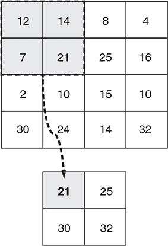

在这种特定情况下，由于指定的`poolSize`值为`[2, 2]`，图像块的高度和宽度为 2 × 2。沿着两个维度，每隔两个像素提取图像块。这些图像块之间的间隔是由我们在此处使用的`strides`值决定的：`[2, 2]`。因此，输出图像的 HWC 形状为`[12, 12, 8]`，高度和宽度是输入图像（形状为`[24, 24, 8]`）的一半，但具有相同数量的通道。

maxPooling2d 层在卷积网络中有两个主要目的。首先，它使卷积网络对输入图像中关键特征的确切位置不那么敏感。例如，我们希望能够识别出数字“8”，无论它是否从 28 × 28 输入图像的中心向左或向右移动（或者从上到下移动），这种特性称为*位置不变性*。要理解 maxPooling2d 层如何增强位置不变性，需要意识到 maxPooling2d 在操作的每个图像块内部，最亮的像素位于何处并不重要，只要它落入该图像块内即可。诚然，单个 maxPooling2d 层在使卷积网络不受位移影响方面能做的事情有限，因为它的池化窗口是有限的。然而，当在同一个卷积网络中使用多个 maxPooling2d 层时，它们共同努力实现了更大程度的位置不变性。这正是我们 MNIST 模型中所做的事情——以及几乎所有实际卷积网络中所做的事情——其中包含两个 maxPooling2d 层。

作为一个思想实验，考虑当两个 conv2d 层（称为 conv2d_1 和 conv2d_2）直接叠加在一起而没有中间的 maxPooling2d 层时会发生什么。假设这两个 conv2d 层的`kernelSize`都为 3；那么 conv2d_2 输出张量中的每个像素都是原始输入到 conv2d_1 的 5 × 5 区域的函数。我们可以说 conv2d_2 层的每个“神经元”具有 5 × 5 的感受野。当两个 conv2d 层之间存在一个 maxPooling2d 层时会发生什么（就像我们的 MNIST 卷积网络中的情况一样）？conv2d_2 层的神经元的感受野变得更大：11 × 11。当卷积网络中存在多个 maxPooling2d 层时，较高层次的层可以具有广泛的感受野和位置不变性。简而言之，它们可以看得更广！

第二，一个 maxPooling2d 层也会使输入张量的高度和宽度尺寸缩小，大大减少了后续层次和整个卷积网络中所需的计算量。例如，第一个 conv2d 层的输出张量形状为`[26, 26, 16]`。经过 maxPooling2d 层后，张量形状变为`[13, 13, 16]`，将张量元素数量减少了 4 倍。卷积网络包含另一个 maxPooling2d 层，进一步缩小了后续层次的权重尺寸和这些层次中的逐元素数学运算的数量。

#### 4.2.3\. 卷积和池化的重复模式

在审查了第一个 maxPooling2d 层后，让我们将注意力集中在卷积网络的接下来的两层上，这两层由 list 4.1 中的这些行定义：

```js
model.add(tf.layers.conv2d(
    {kernelSize: 3, filters: 32, activation: 'relu'}));
model.add(tf.layers.maxPooling2d({poolSize: 2, strides: 2}));
```

这两个层与前面的两个层完全相同（除了 conv2d 层的`filters`配置有一个更大的值并且没有`inputShape`字段）。这种几乎重复的“基本图案”由一个卷积层和一个池化层组成，在 convnets 中经常见到。它发挥了关键作用：分层特征提取。要理解这意味着什么，考虑一个用于图像中动物分类任务的 convnet。在 convnet 的早期阶段，卷积层中的滤波器（即通道）可能编码低级几何特征，如直线、曲线和角落。这些低级特征被转换成更复杂的特征，如猫的眼睛、鼻子和耳朵（见 图 4.6）。在 convnet 的顶层，一层可能具有编码整个猫的滤波器。层级越高，表示越抽象，与像素级值越远。但这些抽象特征正是在 convnet 任务上取得良好准确率所需要的特征，例如在图像中存在猫时检测出猫。此外，这些特征不是手工制作的，而是通过监督学习以自动方式从数据中提取的。这是我们在 第一章 中描述的深度学习的本质，即逐层表示变换的典型示例。

##### 图 4.6\. 通过 convnet 从输入图像中分层提取特征，以猫图像为例。请注意，在此示例中，神经网络的输入在底部，输出在顶部。

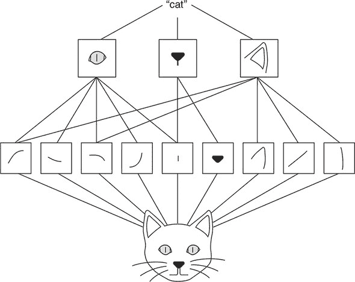

#### 4.2.4\. 压扁和稠密层

在输入张量通过两组 conv2d-maxPooling2d 变换后，它变成了一个形状为`[4, 4, 16]`的 HWC 形状的张量（不包括批次维度）。在 convnet 中的下一层是一个压扁层。这一层在前面的 conv2d-maxPooling2d 层和顺序模型的后续层之间形成了一个桥梁。

Flatten 层的代码很简单，因为构造函数不需要任何配置参数：

```js
model.add(tf.layers.flatten());
```

Flatten 层将多维张量“压缩”成一个一维张量，保留元素的总数。在我们的例子中，形状为`[3, 3, 32]`的三维张量被压扁成一个一维张量`[288]`（不包括批次维度）。对于压扁操作一个明显的问题是如何排序元素，因为原始的三维空间没有固有的顺序。答案是，我们按照这样的顺序排列元素：当你在压扁后的一维张量中向下移动并观察它们的原始索引（来自三维张量）如何变化时，最后一个索引变化得最快，倒数第二个索引变化得次快，依此类推，而第一个索引变化得最慢。这在 图 4.7 中有所说明。

##### 图 4.7\.flatten 层的工作原理。假设输入是一个 3D 张量。为了简单起见，我们让每个维度的大小都设为 2。方块表示元素，元素的索引显示在方块的“面”上。flatten 层将 3D 张量转换成 1D 张量，同时保持元素的总数不变。在展平的 1D 张量中，元素的顺序是这样安排的：当您沿着输出 1D 张量的元素向下走，并检查它们在输入张量中的原始索引时，最后一个维度变化得最快。

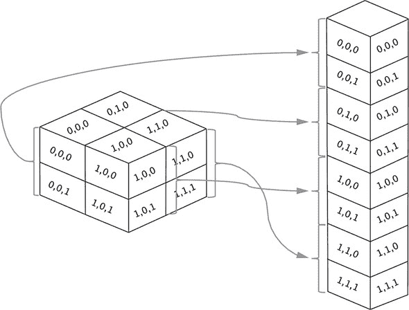

flatten 层在我们的卷积网络中起到什么作用呢？它为随后的密集层做好了准备。就像我们在第二章和第三章学到的那样，由于密集层的工作原理（第 2.1.4 节），它通常需要一个 1D 张量（不包括批次维度）作为其输入。

代码中的下两行，将两个密集层添加到卷积网络中。

```js
   model.add(tf.layers.dense({units: 64, activation: 'relu'}));
   model.add(tf.layers.dense({units: 10, activation: 'softmax'}));
```

为什么要使用两个密集层而不只是一个？与波士顿房产示例和第三章中的网络钓鱼 URL 检测示例的原因相同：添加具有非线性激活的层增加了网络的容量。实际上，您可以将卷积网络视为在此之上堆叠了两个模型：

+   包含 conv2d、maxPooling2d 和 flatten 层的模型，从输入图像中提取视觉特征

+   一个具有两个密集层的多层感知器（MLP），使用提取的特征进行数字分类预测——这本质上就是两个密集层的用途。

在深度学习中，许多模型都显示了这种特征提取层后面跟着 MLPs 进行最终预测的模式。在本书的其余部分中，我们将看到更多类似的示例，从音频信号分类器到自然语言处理的模型都会有。

#### 4.2.5\. 训练卷积网络

现在我们已经成功定义了卷积网络的拓扑结构，下一步是训练并评估训练结果。下一个清单中的代码就是用来实现这个目的的。

##### 清单 4.2\. 训练和评估 MNIST 卷积网络

```js
  const optimizer = 'rmsprop';
  model.compile({
    optimizer,
    loss: 'categoricalCrossentropy',
    metrics: ['accuracy']
  });

  const batchSize = 320;
  const validationSplit = 0.15;
  await model.fit(trainData.xs, trainData.labels, {
    batchSize,
    validationSplit,
    epochs: trainEpochs,
    callbacks: {
      onBatchEnd: async (batch, logs) => {     ***1***
        trainBatchCount++;
        ui.logStatus(
            `Training... (` +
            `${(trainBatchCount / totalNumBatches * 100).toFixed(1)}%` +
            ` complete). To stop training, refresh or close page.`);
        ui.plotLoss(trainBatchCount, logs.loss, 'train');
        ui.plotAccuracy(trainBatchCount, logs.acc, 'train');
      },
      onEpochEnd: async (epoch, logs) => {
        valAcc = logs.val_acc;
        ui.plotLoss(trainBatchCount, logs.val_loss, 'validation');
        ui.plotAccuracy(trainBatchCount, logs.val_acc, 'validation');
      }
    }
  });

  const testResult = model.evaluate(
      testData.xs, testData.labels);           ***2***
```

+   ***1*** 使用回调函数来绘制训练期间的准确率和损失图

+   ***2*** 使用模型没有看见的数据来评估模型的准确性

很多这里的代码都是关于在训练过程中更新用户界面的，例如绘制损失和准确率值的变化。这对于监控训练过程很有用，但对于模型训练来说并不是必需的。让我们来强调一下训练所必需的部分：

+   `trainData.xs`（`model.fit()`的第一个参数）包含作为形状为`[N, 28, 28, 1]`的 NHWC 张量的输入 MNIST 图像表示

+   `trainData.labels`（`model.fit()`的第二个参数）。这包括作为形状为`N, 

+   在 `model.compile()` 调用中使用的损失函数 `categoricalCrossentropy`，适用于诸如 MNIST 的多类分类问题。回想一下，我们在第三章中也使用了相同的损失函数来解决鸢尾花分类问题。

+   在 `model.compile()` 调用中指定的度量函数：`'accuracy'`。该函数衡量了多大比例的示例被正确分类，假设预测是基于卷积神经网络输出的 10 个元素中最大的元素。再次强调，这与我们在新闻线问题中使用的度量标准完全相同。回想一下交叉熵损失和准确度度量之间的区别：交叉熵可微分，因此可以进行基于反向传播的训练，而准确度度量不可微分，但更容易解释。

+   在 `model.fit()` 调用中指定的 `batchSize` 参数。一般来说，使用较大的批量大小的好处是，它会产生对模型权重的更一致和 less 变化的梯度更新，而不是较小的批量大小。但是，批量大小越大，训练过程中所需的内存就越多。您还应该记住，给定相同数量的训练数据，较大的批量大小会导致每个 epoch 中的梯度更新数量减少。因此，如果使用较大的批量大小，请务必相应地增加 epoch 的数量，以免在训练过程中意外减少权重更新的数量。因此，存在一种权衡。在这里，我们使用相对较小的批量大小 64，因为我们需要确保这个示例适用于各种硬件。与其他参数一样，您可以修改源代码并刷新页面，以便尝试使用不同批量大小的效果。

+   在 `model.fit()` 调用中使用的 `validationSplit`。这使得训练过程中排除了 `trainData.xs` 和 `trainData.labels` 的最后 15% 以供验证。就像你在之前的非图像模型中学到的那样，监控验证损失和准确度在训练过程中非常重要。它让你了解模型是否过拟合。什么是过拟合？简单地说，这是指模型过于关注训练过程中看到的数据的细节，以至于其在训练过程中没有看到的数据上的预测准确性受到负面影响。这是监督式机器学习中的一个关键概念。在本书的后面章节（第八章）中，我们将专门讨论如何发现和对抗过拟合。

`model.fit()` 是一个异步函数，因此如果后续操作依赖于 `fit()` 调用的完成，则需要在其上使用 `await`。这正是这里所做的，因为我们需要在模型训练完成后使用测试数据集对模型进行评估。评估是使用 `model.evaluate()` 方法进行的，该方法是同步的。传递给 `model.evaluate()` 的数据是 `testData`，其格式与前面提到的 `trainData` 相同，但包含较少数量的示例。这些示例在 `fit()` 调用期间模型从未见过，确保测试数据集不会影响评估结果，并且评估结果是对模型质量的客观评估。

使用这段代码，我们让模型训练了 10 个 epoch（在输入框中指定），这给我们提供了 figure 4.8 中的损失和准确度曲线。如图所示，损失在训练 epochs 结束时收敛，准确度也是如此。验证集的损失和准确度值与其训练集对应值相差不大，这表明在这种情况下没有明显的过拟合。最终的 `model.evaluate()` 调用给出了约为 99.0% 的准确度（实际值会因权重的随机初始化和训练过程中示例的随机洗牌而略有变化）。

##### 图 4.8\. MNIST 卷积神经网络的训练曲线。进行了十个 epoch 的训练，每个 epoch 大约包含 800 个批次。左图：损失值。右图：准确度值。训练集和验证集的数值由不同颜色、线宽和标记符号表示。验证曲线的数据点比训练数据少，因为验证是在每个 epoch 结束时进行，而不像训练批次那样频繁。

![

99.0% 的准确度如何？从实际角度来看，这是可以接受的，但肯定不是最先进的水平。通过增加卷积层和池化层以及模型中的滤波器数量，可以达到准确率达到 99.5% 的可能性。然而，在浏览器中训练这些更大的卷积神经网络需要更长的时间，以至于最好在像 Node.js 这样资源不受限制的环境中进行训练。我们将在 section 4.3 中准确地介绍如何做到这一点。

从理论角度来看，记住 MNIST 是一个 10 类别分类问题。因此，偶然猜测的准确率是 10%；而 99.0% 远远超过了这个水平。但偶然猜测并不是一个很高的标准。我们如何展示模型中的 conv2d 和 maxPooling2d 层的价值？如果我们坚持使用传统的全连接层，我们会做得像这样吗？

要回答这些问题，我们可以进行一个实验。index.js 中的代码包含了另一个用于模型创建的函数，名为 `createDenseModel()`。与我们在 列表 4.1 中看到的 `createConvModel()` 函数不同，`createDenseModel()` 创建的是仅由展平和密集层组成的顺序模型，即不使用本章学习的新层类型。`createDenseModel()` 确保它所创建的密集模型和我们刚刚训练的卷积网络之间的总参数数量大约相等 —— 约为 33,000，因此这将是一个更公平的比较。

##### 列表 4.3\. 用于与卷积网络进行比较的 MNIST 的展平-仅密集模型

```js
 function createDenseModel() {
  const model = tf.sequential();
  model.add(tf.layers.flatten({inputShape: [IMAGE_H, IMAGE_W, 1]}));
  model.add(tf.layers.dense({units: 42, activation: 'relu'}));
  model.add(tf.layers.dense({units: 10, activation: 'softmax'}));
  model.summary();
  return model;
}
```

列表 4.3 中定义的模型概述如下：

```js
_________________________________________________________________
Layer (type)                 Output shape              Param #
=================================================================
flatten_Flatten1 (Flatten)   [null,784]                0
_________________________________________________________________
dense_Dense1 (Dense)         [null,42]                 32970
_________________________________________________________________
dense_Dense2 (Dense)         [null,10]                 430
=================================================================
Total params: 33400
Trainable params: 33400
Non-trainable params: 0
_________________________________________________________________
```

使用相同的训练配置，我们从非卷积模型中获得的训练结果如 图 4.9 所示。经过 10 次训练周期后，我们获得的最终评估准确率约为 97.0%。两个百分点的差异可能看起来很小，但就误差率而言，非卷积模型比卷积网络差三倍。作为一项动手练习，尝试通过增加 `createDenseModel()` 函数中的隐藏（第一个）密集层的 `units` 参数来增加非卷积模型的大小。你会发现，即使增加了更大的尺寸，仅有密集层的模型也无法达到与卷积网络相当的准确性。这向你展示了卷积网络的强大之处：通过参数共享和利用视觉特征的局部性，卷积网络可以在计算机视觉任务中实现优越的准确性，其参数数量相等或更少于非卷积神经网络。

##### 图 4.9\. 与 图 4.8 相同，但用于 MNIST 问题的非卷积模型，由 列表 4.3 中的 `createDenseModel()` 函数创建

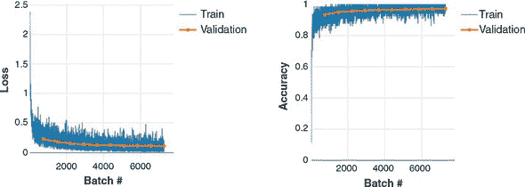

#### 4.2.6\. 使用卷积网络进行预测

现在我们有了一个训练好的卷积网络。我们如何使用它来实际分类手写数字的图像呢？首先，你需要获得图像数据。有许多方法可以将图像数据提供给 TensorFlow.js 模型。我们将列出它们并描述它们何时适用。

##### 从 TypedArrays 创建图像张量

在某些情况下，您想要的图像数据已经存储为 JavaScript 的 `TypedArray`。这就是我们专注于的 tfjs-example/mnist 示例中的情况。详细信息请参见 data.js 文件，我们不会详细说明其中的机制。假设有一个表示正确长度的 MNIST 的 `Float32Array`（例如，一个名为 `imageDataArray` 的变量），我们可以将其转换为我们的模型所期望的形状的 4D 张量，如下所示^([7])：

> ⁷
> 
> 参见附录 B 了解如何使用 TensorFlow.js 中的低级 API 创建张量的更全面教程。

```js
let x = tf.tensor4d(imageDataArray, [1, 28, 28, 1]);
```

`tf.tensor4d()` 调用中的第二个参数指定要创建的张量的形状。这是必需的，因为 `Float32Array`（或一般的 `TypedArray`）是一个没有关于图像尺寸信息的平坦结构。第一个维度的大小为 1，因为我们正在处理 `imageDataArray` 中的单个图像。与之前的示例一样，在训练、评估和推断期间，模型始终期望有一个批次维度，无论是一个图像还是多个图像。如果 `Float32Array` 包含多个图像的批次，则还可以将其转换为单个张量，其中第一个维度的大小等于图像数量：

```js
let x = tf.tensor4d(imageDataArray, [numImages, 28, 28, 1]);
```

##### tf.browser.fromPixels：从 HTML img、canvas 或 video 元素获取图像张量

浏览器中获取图像张量的第二种方法是在包含图像数据的 HTML 元素上使用 TensorFlow.js 函数 `tf.browser.fromPixels()` ——这包括 `img`、`canvas` 和 `video` 元素。

例如，假设网页包含一个如下定义的 `img` 元素

```js
</img>
```

你可以用一行代码获取显示在 `img` 元素中的图像数据：

```js
let x = tf.browser.fromPixels(
         document.getElementById('my-image')).asType('float32');
```

这将生成形状为 `[height, width, 3]` 的张量，其中三个通道用于 RGB 颜色编码。末尾的 `asType0` 调用是必需的，因为 `tf.browser.fromPixels()` 返回一个 int32 类型的张量，但 convnet 期望输入为 float32 类型的张量。高度和宽度由 `img` 元素的大小确定。如果它与模型期望的高度和宽度不匹配，您可以通过使用 TensorFlow.js 提供的两种图像调整方法之一 `tf.image.resizeBilinear()` 或 `tf.image.resizeNearestNeigbor()` 来改变 `tf.browser.fromPixels()` 返回的张量大小：

```js
x = tf.image.resizeBilinear(x, [newHeight, newWidth]);
```

`tf.image.resizeBilinear()` 和 `tf.image.resizeNearestNeighbor()` 具有相同的语法，但它们使用两种不同的算法进行图像调整。前者使用双线性插值来生成新张量中的像素值，而后者执行最近邻采样，通常比双线性插值计算量小。

请注意，`tf.browser.fromPixels()` 创建的张量不包括批次维度。因此，如果张量要被馈送到 TensorFlow.js 模型中，必须首先进行维度扩展；例如，

```js
x = x.expandDims();
```

`expandDims()` 通常需要一个维度参数。但在这种情况下，可以省略该参数，因为我们正在扩展默认为该参数的第一个维度。

除了 `img` 元素外，`tf.browser.fromPixels()` 也适用于 `canvas` 和 `video` 元素。在 `canvas` 元素上应用 `tf.browser.fromPixels()` 对于用户可以交互地改变 canvas 内容然后使用 TensorFlow.js 模型的情况非常有用。例如，想象一下在线手写识别应用或在线手绘形状识别应用。除了静态图像外，在 `video` 元素上应用 `tf.browser.fromPixels()` 对于从网络摄像头获取逐帧图像数据非常有用。这正是在 Nikhil Thorat 和 Daniel Smilkov 在最初的 TensorFlow.js 发布中展示的 Pac-Man 演示中所做的（参见 [`mng.bz/xl0e`](http://mng.bz/xl0e)），PoseNet 演示，^([8]) 以及许多其他使用网络摄像头的基于 TensorFlow.js 的网络应用程序。你可以在 GitHub 上查看源代码 [`mng.bz/ANYK`](http://mng.bz/ANYK)。

> ⁸
> 
> Dan Oved，“使用 TensorFlow.js 在浏览器中进行实时人体姿势估计”，Medium，2018 年 5 月 7 日，[`mng.bz/ZeOO`](http://mng.bz/ZeOO)。

正如我们在前面的章节中所看到的，应该非常小心避免训练数据和推断数据之间的 *偏差*（即不匹配）。在这种情况下，我们的 MNIST 卷积网络是使用范围在 0 到 1 之间的图像张量进行训练的。因此，如果 `x` 张量中的数据范围不同，比如常见的 HTML 图像数据范围是 0 到 255，那么我们应该对数据进行归一化：

```js
x = x.div(255);
```

有了手头的数据，我们现在准备调用 `model.predict()` 来获取预测结果。请参见下面的清单。

##### 清单 4.4。使用训练好的卷积网络进行推断

```js
  const testExamples = 100;
  const examples = data.getTestData(testExamples);

  tf.tidy(() => {                                    ***1***
    const output = model.predict(examples.xs);

    const axis = 1;
    const labels = Array.from(examples.labels.argMax(axis).dataSync());
    const predictions = Array.from(
        output.argMax(axis).dataSync());             ***2***

    ui.showTestResults(examples, predictions, labels);
  });
```

+   ***1*** 使用 tf.tidy() 避免 WebGL 内存泄漏

+   ***2*** 调用 argMax() 函数获取概率最大的类别

该代码假设用于预测的图像批已经以一个单一张量的形式可用，即 `examples.xs`。它的形状是 `[100, 28, 28, 1]`（包括批处理维度），其中第一个维度反映了我们要运行预测的 100 张图像。`model.predict()` 返回一个形状为 `[100, 10]` 的输出二维张量。输出的第一个维度对应于示例，而第二个维度对应于 10 个可能的数字。输出张量的每一行包含为给定图像输入分配的 10 个数字的概率值。为了确定预测结果，我们需要逐个图像找出最大概率值的索引。这是通过以下代码完成的

```js
const axis = 1;
const labels = Array.from(examples.labels.argMax(axis).dataSync());
```

`argMax()` 函数返回沿指定轴的最大值的索引。在这种情况下，这个轴是第二维，`const axis = 1`。`argMax()` 的返回值是一个形状为 `[100, 1]` 的张量。通过调用 `dataSync()`，我们将 `[100, 1]` 形状的张量转换为长度为 100 的 `Float32Array`。然后 `Array.from()` 将 `Float32Array` 转换为由 100 个介于 0 和 9 之间的整数组成的普通 JavaScript 数组。这个预测数组有一个非常直观的含义：它是模型对这 100 个输入图像的分类结果。在 MNIST 数据集中，目标标签恰好与输出索引完全匹配。因此，我们甚至不需要将数组转换为字符串标签。下一行消耗了预测数组，调用了一个 UI 函数，该函数将分类结果与测试图像一起呈现（见 图 4.10）。

##### 图 4.10\. 训练后模型进行预测的几个示例，显示在输入的 MNIST 图像旁边

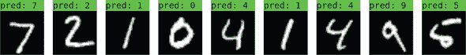

### 4.3\. 超越浏览器：使用 Node.js 更快地训练模型

在前一节中，我们在浏览器中训练了一个卷积网络，测试准确率达到了 99.0%。在本节中，我们将创建一个更强大的卷积网络，它将给我们更高的测试准确率：大约 99.5%。然而，提高的准确性也伴随着代价：模型在训练和推断期间消耗的内存和计算量更多。成本的增加在训练期间更为显著，因为训练涉及反向传播，这与推断涉及的前向运行相比，需要更多的计算资源。较大的卷积网络将过重且速度过慢，在大多数 web 浏览器环境下训练。

#### 4.3.1\. 使用 tfjs-node 的依赖项和导入

进入 TensorFlow.js 的 Node.js 版本！它在后端环境中运行，不受像浏览器标签那样的任何资源限制。TensorFlow.js 的 CPU 版本（此处简称 tfjs-node）直接使用了在 C++ 中编写的多线程数学运算，这些数学运算也被 TensorFlow 的主 Python 版本使用。如果您的计算机安装了支持 CUDA 的 GPU，tfjs-node 还可以使用 CUDA 编写的 GPU 加速数学核心，实现更大的速度提升。

我们增强的 MNIST 卷积神经网络的代码位于 tfjs-examples 的 mnist-node 目录中。与我们所见的示例一样，您可以使用以下命令访问代码：

```js
git clone https://github.com/tensorflow/tfjs-examples.git
cd tfjs-examples/mnist-node
```

与之前的示例不同之处在于，mnist-node 示例将在终端而不是 web 浏览器中运行。要下载依赖项，请使用 `yarn` 命令。

如果你检查 package.json 文件，你会看到依赖项 `@tensorflow/tfjs-node`。通过将 `@tensorflow/tfjs-node` 声明为依赖项，`yarn` 将自动下载 C++ 共享库（在 Linux、Mac 或 Windows 系统上分别命名为 libtensorflow.so、libtensorflw .dylib 或 libtensorflow.dll）到你的 node_modules 目录，以供 TensorFlow.js 使用。

一旦 `yarn` 命令运行完毕，你就可以开始模型训练了

```js
node main.js
```

我们假设你的路径上已经有了节点二进制文件，因为你已经安装了 yarn（如果你需要更多关于这个的信息，请参见附录 A）。

刚刚描述的工作流将允许你在 CPU 上训练增强的 convnet。如果你的工作站和笔记本电脑内置了 CUDA 启用的 GPU，你也可以在 GPU 上训练模型。所涉及的步骤如下：

1.  安装正确版本的 NVIDIA 驱动程序以适配你的 GPU。

1.  安装 NVIDIA CUDA 工具包。这是一个库，可以在 NVIDIA 的 GPU 系列上实现通用并行计算。

1.  安装 CuDNN，这是基于 CUDA 构建的高性能深度学习算法的 NVIDIA 库（有关步骤 1-3 的更多详细信息，请参见附录 A）。

1.  在 package.json 中，将 `@tensorflow/tfjs-node` 依赖项替换为 `@-tensor-flow/tfjs-node-gpu`，但保持相同的版本号，因为这两个软件包的发布是同步的。

1.  再次运行 `yarn`，这将下载包含 TensorFlow.js 用于 CUDA 数学运算的共享库。

1.  在 main.js 中，将该行替换为

    ```js
    require('@tensorflow/tfjs-node');
    ```

    使用

    ```js
    require('@tensorflow/tfjs-node-gpu');
    ```

1.  再次开始训练

    ```js
    node main.js
    ```

如果步骤正确完成，你的模型将在 CUDA GPU 上迅猛地训练，在速度上通常是 CPU 版本（tfjs-node）的五倍。与在浏览器中训练相同模型相比，使用 tfjs-node 的 CPU 或 GPU 版本训练速度都显著提高。

##### 在 tfjs-node 中为 MNIST 训练增强的 convnet

一旦在 20 个周期内完成训练，模型应该显示出约 99.6% 的最终测试（或评估）准确度，这超过了我们在 section 4.2 中取得的 99.0% 的先前结果。那么，导致准确度提高的是这个基于节点的模型和基于浏览器的模型之间的区别是什么呢？毕竟，如果你使用训练数据在 tfjs-node 和 TensorFlow.js 的浏览器版本中训练相同的模型，你应该得到相同的结果（除了随机权重初始化的影响）。为了回答这个问题，让我们来看看基于节点的模型的定义。模型是在文件 model.js 中构建的，这个文件由 main.js 导入。

##### 列表 4.5\. 在 Node.js 中定义一个更大的 MNIST convnet

```js
const model = tf.sequential();
model.add(tf.layers.conv2d({
  inputShape: [28, 28, 1],
  filters: 32,
  kernelSize: 3,
  activation: 'relu',
}));
model.add(tf.layers.conv2d({
  filters: 32,
  kernelSize: 3,
  activation: 'relu',
}));
model.add(tf.layers.maxPooling2d({poolSize: [2, 2]}));
model.add(tf.layers.conv2d({
  filters: 64,
  kernelSize: 3,
  activation: 'relu',
}));
model.add(tf.layers.conv2d({
  filters: 64,
  kernelSize: 3,
  activation: 'relu',
}));
model.add(tf.layers.maxPooling2d({poolSize: [2, 2]}));
model.add(tf.layers.flatten());
model.add(tf.layers.dropout({rate: 0.25}));                    ***1***
model.add(tf.layers.dense({units: 512, activation: 'relu'}));
model.add(tf.layers.dropout({rate: 0.5}));
model.add(tf.layers.dense({units: 10, activation: 'softmax'}));

model.summary();
model.compile({
  optimizer: 'rmsprop',
  loss: 'categoricalCrossentropy',
  metrics: ['accuracy'],
});
```

+   ***1*** 添加了 dropout 层以减少过拟合

模型的摘要如下：

```js
_________________________________________________________________
Layer (type)                 Output shape              Param #
=================================================================
conv2d_Conv2D1 (Conv2D)      [null,26,26,32]           320
_________________________________________________________________
conv2d_Conv2D2 (Conv2D)      [null,24,24,32]           9248
_________________________________________________________________
max_pooling2d_MaxPooling2D1  [null,12,12,32]           0
_________________________________________________________________
conv2d_Conv2D3 (Conv2D)      [null,10,10,64]           18496
_________________________________________________________________
conv2d_Conv2D4 (Conv2D)      [null,8,8,64]             36928
_________________________________________________________________
max_pooling2d_MaxPooling2D2  [null,4,4,64]             0
_________________________________________________________________
flatten_Flatten1 (Flatten)   [null,1024]               0
_________________________________________________________________
dropout_Dropout1 (Dropout)   [null,1024]               0
_________________________________________________________________
dense_Dense1 (Dense)         [null,512]                524800
_________________________________________________________________
dropout_Dropout2 (Dropout)   [null,512]                0
_________________________________________________________________
dense_Dense2 (Dense)         [null,10]                 5130
=================================================================
Total params: 594922
Trainable params: 594922
Non-trainable params: 0
_________________________________________________________________
```

这些是我们的 tfjs-node 模型和基于浏览器的模型之间的关键区别：

+   基于节点的模型具有四个 conv2d 层，比基于浏览器的模型多一个。

+   基于节点的模型的 hidden dense 层比基于浏览器的模型的对应层单元更多（512 与 100）。

+   总体而言，基于节点的模型的权重参数约为基于浏览器的模型的 18 倍。

+   基于节点的模型在 flatten 层和 dense 层之间插入了两个*dropout*层。

列表中的前三个差异使基于节点的模型具有比基于浏览器的模型更高的容量。这也是使基于节点的模型在浏览器中训练速度无法接受的原因。正如我们在第三章中学到的那样，更大的模型容量意味着更大的过拟合风险。第四个差异增加了过拟合风险的减轻，即包括 dropout 层。

##### 使用 dropout 层来减少过拟合。

Dropout 是你在本章中遇到的另一个新的 TensorFlow.js 层类型之一。它是减少深层神经网络过拟合最有效和广泛使用的方式之一。它的功能可以简单地描述为：

+   在训练阶段（在`Model.fit()`调用期间），它随机将输入张量的一部分作为零（或“丢失”），并且其输出张量是 dropout 层的输出张量。对于本示例来说，dropout 层只有一个配置参数：dropout 比例（例如，如列表 4.5 所示的两个`rate`字段）。例如，假设一个 dropout 层被配置为有一个 0.25 的 dropout 比例，并且输入张量是值为`[0.7, -0.3, 0.8, -0.4]` 的 1D 张量，则输出张量可以是`[0.7, -0.3, 0.0, 0.4]`，其中 25％的输入张量元素随机选择并设置为值 0。在反向传播期间，dropout 层的梯度张量也会受到类似的归 0 影响。

+   在推理期间（在`Model.predict()`和`Model.evaluate()`调用期间），dropout 层不会随机将输入张量中的元素置零。相反，输入会简单地作为输出传递，不会发生任何改变（即，一个恒等映射）。

图 4.11 展示了一个带有二维输入张量的 dropout 层在训练和测试时的工作示例。

##### 图 4.11. dropout 层的一个示例。在这个示例中，输入张量是 2D 的，形状为`[4, 2]`。dropout 层的比例被配置为 0.25，导致在训练阶段随机选择输入张量中 25％（即 8 个中的两个）的元素并将它们设置为零。在推理阶段，该层充当一个简单的传递层。

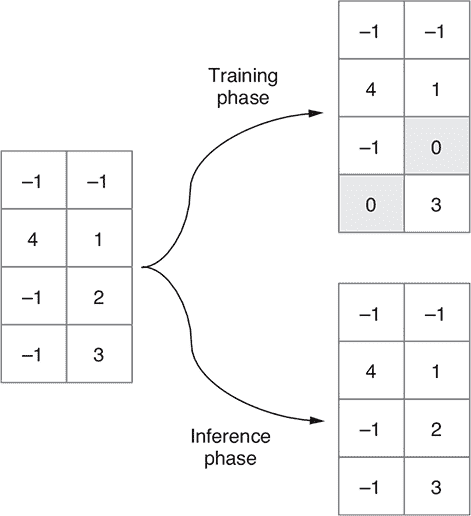

这种简单算法是对抗过拟合最有效的方法之一似乎很奇怪。为什么它有效呢？Geoff Hinton，是 dropout 算法的发明者（神经网络中的许多其他内容也是他的创造），他说他受到了一些银行用于防止员工欺诈的机制的启发。用他自己的话说，

> *我去了我的银行。出纳员不停地换，我问其中一个为什么。他说他不知道，但他们经常被调动。我想这一定是因为需要员工之间的合作才能成功欺诈银行。这让我意识到，随机移除每个示例上的不同子集神经元将防止共谋，从而减少过拟合。*

将这种深度学习的术语引入，向层的输出值引入噪声会破坏不重要的偶然模式，这些模式与数据中的真实模式不相关（Hinton 称之为“共谋”）。在本章末尾的练习 3 中，您应该尝试从 model.js 中的基于节点的卷积网络中移除两个 dropout 层，然后再次训练模型，并查看由此导致的训练、验证和评估准确度的变化。

清单 4.6 显示了我们用于训练和评估增强型卷积网络的关键代码。如果您将此处的代码与 清单 4.2 中的代码进行比较，您就会欣赏到这两个代码块之间的相似之处。两者都围绕着 `Model.fit()` 和 `Model.evaluate()` 调用。语法和样式相同，只是在如何呈现或显示损失值、准确度值和训练进度上有所不同（终端与浏览器）。

这展示了 TensorFlow.js 的一个重要特性，这是一个跨越前端和后端的 JavaScript 深度学习框架：

> *就创建和训练模型而言，在 TensorFlow.js 中编写的代码与您是在 web 浏览器还是在 Node.js 中工作无关。*

##### 列表 4.6\. 在 tfjs-node 中训练和评估增强型卷积网络

```js
  await model.fit(trainImages, trainLabels, {
    epochs,
    batchSize,
    validationSplit
  });

  const {images: testImages, labels: testLabels} = data.getTestData();
  const evalOutput = model.evaluate                                     ***1***
      testImages, testLabels);
  console.log('\nEvaluation result:');
  console.log(
      `  Loss = ${evalOutput[0].dataSync()[0].toFixed(3)}; `+
      `Accuracy = ${evalOutput[1].dataSync()[0].toFixed(3)}`);
```

+   ***1*** 使用模型未见过的数据评估模型

#### 4.3.2\. 从 Node.js 保存模型并在浏览器中加载

训练模型会消耗 CPU 和 GPU 资源，并需要一些时间。您不希望浪费训练的成果。如果不保存模型，下次运行 main.js 时，您将不得不从头开始。本节展示了如何在训练后保存模型，并将保存的模型导出为磁盘上的文件（称为 *检查点* 或 *工件*）。我们还将向您展示如何在浏览器中导入检查点，将其重新构建为模型，并用于推断。main.js 中 `main()` 函数的最后一部分是以下清单中的保存模型代码。

##### 列表 4.7\. 在 tfjs-node 中将训练好的模型保存到文件系统中

```js
  if (modelSavePath != null) {
    await model.save(`file://${modelSavePath}`);
    console.log(`Saved model to path: ${modelSavePath}`);
  }
```

`model`对象的`save()`方法用于将模型保存到文件系统上的目录中。该方法接受一个参数，即以 file://开头的 URL 字符串。请注意，由于我们使用的是 tfjs-node，所以可以将模型保存在文件系统上。TensorFlow.js 的浏览器版本也提供了`model.save()`API，但不能直接访问机器的本地文件系统，因为浏览器出于安全原因禁止了这样做。如果我们在浏览器中使用 TensorFlow.js，则必须使用非文件系统保存目标（例如浏览器的本地存储和 IndexedDB）。这些对应于 file://以外的 URL 方案。

`model.save()`是一个异步函数，因为它通常涉及文件或网络输入输出。因此，在`save()`调用上使用`await`。假设`modelSavePath`的值为/tmp/tfjs-node-mnist；在`model.save()`调用完成后，您可以检查目录的内容，

```js
ls -lh /tmp/tfjs-node-mnist
```

这可能打印出类似以下的文件列表：

```js
-rw-r--r-- 1 user group 4.6K Aug 14 10:38 model.json
     -rw-r--r-- 1 user group 2.3M Aug 14 10:38 weights.bin
```

在那里，你可以看到两个文件：

+   model.json 是一个包含模型保存拓扑的 JSON 文件。这里所说的“拓扑”包括形成模型的层类型、它们各自的配置参数（例如卷积层的`filters`和 dropout 层的`rate`），以及层之间的连接方式。对于 MNIST 卷积网络来说，连接是简单的，因为它是一个顺序模型。我们将看到连接模式不太平凡的模型，这些模型也可以使用`model.save()`保存到磁盘上。

+   除了模型拓扑，model.json 还包含模型权重的清单。该部分列出了所有模型权重的名称、形状和数据类型，以及权重值存储的位置。这将我们带到第二个文件：weights.bin。正如其名称所示，weights.bin 是一个存储所有模型权重值的二进制文件。它是一个没有标记的平面二进制流，没有标明个体权重的起点和终点。这些“元信息”在 model.json 中的权重清单部分中可用于。

要使用 tfjs-node 加载模型，您可以使用`tf.loadLayersModel()`方法，指向 model.json 文件的位置（未在示例代码中显示）：

```js
const loadedModel = await tf.loadLayersModel('file:///tmp/tfjs-node-mnist');
```

`tf.loadLayersModel()`通过反序列化`model.json`中保存的拓扑数据来重建模型。然后，`tf.loadLayersModel()`使用`model.json`中的清单读取`weights.bin`中的二进制权重值，并将模型的权重强制设置为这些值。与`model.save()`一样，`tf.loadLayersModel()`是异步的，所以我们在这里调用它时使用`await`。一旦调用返回，`loadedModel`对象在所有意图和目的上等同于使用 listings 4.5 和 4.6 中的 JavaScript 代码创建和训练的模型。你可以通过调用其`summary()`方法打印模型的摘要，通过调用其`predict()`方法执行推理，通过使用`evaluate()`方法评估其准确性，甚至通过使用`fit()`方法重新训练它。如果需要，也可以再次保存模型。重新训练和重新保存加载的模型的工作流程将在我们讨论第五章的迁移学习时相关。

上一段中所说的内容同样适用于浏览器环境。你保存的文件可以用来在网页中重建模型。重建后的模型支持完整的`tf.LayersModel()`工作流程，但有一个警告，如果你重新训练整个模型，由于增强卷积网络的尺寸较大，速度会特别慢且效率低下。在 tfjs-node 和浏览器中加载模型唯一根本不同的是，你在浏览器中应该使用除`file://`之外的其他 URL 方案。通常，你可以将`model.json`和`weights.bin`文件作为静态资产文件放在 HTTP 服务器上。假设你的主机名是`localhost`，你的文件在服务器路径`my/models/`下可见；你可以使用以下行在浏览器中加载模型：

```js
const loadedModel =
    await tf.loadLayersModel('http:///localhost/my/models/model.json');
```

在浏览器中处理基于 HTTP 的模型加载时，`tf.loadLayersModel()`在底层调用浏览器内置的 fetch 函数。因此，它具有以下特性和属性：

+   支持`http://`和`https://`。

+   支持相对服务器路径。事实上，如果使用相对路径，则可以省略 URL 的`http://`或`https://`部分。例如，如果你的网页位于服务器路径`my/index.html`，你的模型的 JSON 文件位于`my/models/model.json`，你可以使用相对路径`model/model.json`：

    ```js
    const loadedModel = await tf.loadLayersModel('models/model.json');
    ```

+   若要为 HTTP/HTTPS 请求指定额外选项，应该使用`tf.io.browserHTTPRequest()`方法代替字符串参数。例如，在模型加载过程中包含凭据和标头，你可以这样做：

    ```js
        const loadedModel = await tf.loadLayersModel(tf.io.browserHTTPRequest(
          'http://foo.bar/path/to/model.json',
          {credentials: 'include', headers: {'key_1': 'value_1'}}));
    ```

### 4.4\. 语音识别：在音频数据上应用卷积网络

到目前为止，我们已经向您展示了如何使用卷积网络执行计算机视觉任务。但是人类的感知不仅仅是视觉。音频是感知数据的一个重要模态，并且可以通过浏览器 API 进行访问。如何识别语音和其他类型声音的内容和意义？值得注意的是，卷积网络不仅适用于计算机视觉，而且在音频相关的机器学习中也以显著的方式发挥作用。

在本节中，您将看到我们如何使用类似于我们为 MNIST 构建的卷积网络来解决一个相对简单的音频任务。该任务是将短语音片段分类到 20 多个单词类别中。这个任务比您可能在亚马逊 Echo 和 Google Home 等设备中看到的语音识别要简单。特别是，这些语音识别系统涉及比本示例中使用的词汇量更大的词汇。此外，它们处理由多个词连续发音组成的连续语音，而我们的示例处理逐个单词发音。因此，我们的示例不符合“语音识别器”的条件；相反，更准确地描述它为“单词识别器”或“语音命令识别器”。然而，我们的示例仍然具有实际用途（如无需手动操作的用户界面和可访问性功能）。此外，本示例中体现的深度学习技术实际上是更高级语音识别系统的基础。^([9])

> ⁹
> 
> Ronan Collobert、Christian Puhrsch 和 Gabriel Synnaeve，“Wav2Letter: 一种基于端到端卷积网络的语音识别系统”，2016 年 9 月 13 日提交，[`arxiv.org/abs/1609.03193`](https://arxiv.org/abs/1609.03193)。

#### 4.4.1\. 声谱图：将声音表示为图像

与任何深度学习应用一样，如果您想要理解模型的工作原理，首先需要了解数据。要理解音频卷积网络的工作原理，我们需要首先查看声音是如何表示为张量的。请回忆高中物理课上的知识，声音是空气压力变化的模式。麦克风捕捉到空气压力变化并将其转换为电信号，然后计算机的声卡可以将其数字化。现代 Web 浏览器提供了*WebAudio* API，它与声卡通信并提供对数字化音频信号的实时访问（在用户授权的情况下）。因此，从 JavaScript 程序员的角度来看，声音就是一组实值数字的数组。在深度学习中，这种数字数组通常表示为 1D 张量。

你可能会想，迄今为止我们见过的这种卷积网络是如何在 1D 张量上工作的？它们不是应该操作至少是 2D 的张量吗？卷积网络的关键层，包括 conv2d 和 maxPooling2d，利用了 2D 空间中的空间关系。事实证明声音*可以*被表示为称为*声谱图*的特殊类型的图像。声谱图不仅使得可以在声音上应用卷积网络，而且在深度学习之外还具有理论上的解释。

如 图 4.12 所示，频谱图是一个二维数组，可以以与 MNIST 图像基本相同的方式显示为灰度图像。水平维度是时间，垂直维度是频率。频谱图的每个垂直切片是一个短时间窗口内的声音的*频谱*。频谱是将声音分解为不同频率分量的过程，可以粗略地理解为不同的“音高”。就像光可以通过棱镜分解成多种颜色一样，声音可以通过称为*傅里叶变换*的数学操作分解为多个频率。简而言之，频谱图描述了声音的频率内容如何在一系列连续的短时间窗口（通常约为 20 毫秒）内变化。

##### 图 4.12\. “zero” 和 “yes” 这两个孤立口语单词的示例频谱图。频谱图是声音的联合时间-频率表示。你可以将频谱图视为声音的图像表示。沿着时间轴的每个切片（图像的一列）都是时间的短时刻（帧）；沿着频率轴的每个切片（图像的一行）对应于特定的窄频率范围（音调）。图像的每个像素的值表示给定时间点上给定频率区段的声音相对能量。本图中的频谱图被渲染为较暗的灰色，对应着较高的能量。不同的语音有不同的特征。例如，类似于“z”和“s”这样的咝音辅音以在 2–3 kHz 以上频率处集中的准稳态能量为特征；像“e”和“o”这样的元音以频谱的低端（< 3 kHz）中的水平条纹（能量峰值）为特征。在声学中，这些能量峰值被称为*共振峰*。不同的元音具有不同的共振峰频率。所有这些不同语音的独特特征都可以被深度卷积神经网络用于识别单词。

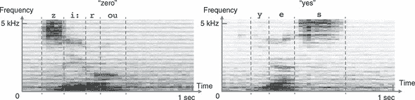

谱图对于以下原因是声音的合适表示。首先，它们节省空间：谱图中的浮点数通常比原始波形中的浮点值少几倍。其次，在宽泛的意义上，谱图对应于生物学中的听力工作原理。内耳内部的一种名为耳蜗的解剖结构实质上执行了傅里叶变换的生物版本。它将声音分解成不同的频率，然后被不同组听觉神经元接收。第三，谱图表示可以更容易地区分不同类型的语音。这在 图 4.12 的示例语音谱图中可以看到：元音和辅音在谱图中都有不同的特征模式。几十年前，在机器学习被广泛应用之前，从谱图中检测不同的元音和辅音的人们实际上尝试手工制作规则。深度学习为我们节省了这种手工制作的麻烦和泪水。

让我们停下来思考一下。看一看 图 4.1 中的 MNIST 图片和 图 4.12 中的声音谱图，你应该能够理解这两个数据集之间的相似之处。两个数据集都包含在二维特征空间中的模式，一双经过训练的眼睛应该能够区分出来。两个数据集都在特征的具体位置、大小和细节上呈现一定的随机性。最后，两个数据集都是多类别分类任务。虽然 MNIST 有 10 个可能的类别，我们的声音命令数据集有 20 个类别（从 0 到 9 的 10 个数字，“上”，“下”，“左”，“右”，“前进”，“停止”，“是”，“否”，以及“未知”词和背景噪音的类别）。正是这些数据集本质上的相似性使得卷积神经网络非常适用于声音命令识别任务。

但是这两个数据集也有一些显著的区别。首先，声音命令数据集中的音频录音有些噪音，可以从 图 4.12 中的示例谱图中看到不属于语音声音的黑色像素点。其次，声音命令数据集中的每个谱图的尺寸为 43×232，与单个 MNIST 图像的 28×28 大小相比显著较大。谱图的尺寸在时间和频率维度之间是不对称的。这些差异将体现在我们将在音频数据集上使用的卷积神经网络中。

定义和训练声音命令卷积神经网络的代码位于 tfjs-models 存储库中。您可以使用以下命令访问代码：

```js
git clone https://github.com/tensorflow/tfjs-models.git
cd speech-commands/training/browser-fft
```

模型的创建和编译封装在 model.ts 中的`createModel()`函数中。

##### **4.8 章节的声音命令谱图分类的卷积神经网络**

```js
function createModel(inputShape: tf.Shape, numClasses: number) {
  const model = tf.sequential();
  model.add(tf.layers.conv2d({                                           ***1***
    filters: 8,
    kernelSize: [2, 8],
    activation: 'relu',
    inputShape
  }));
  model.add(tf.layers.maxPooling2d({poolSize: [2, 2], strides: [2, 2]}));
  model.add(      tf.layers.conv2d({
        filters: 32,
        kernelSize: [2, 4],
        activation: 'relu'
      }));
  model.add(tf.layers.maxPooling2d({poolSize: [2, 2], strides: [2, 2]}));
  model.add(
      tf.layers.conv2d({
        filters: 32,
        kernelSize: [2, 4],
        activation: 'relu'
      }));
  model.add(tf.layers.maxPooling2d({poolSize: [2, 2], strides: [2, 2]}));
  model.add(
      tf.layers.conv2d({
        filters: 32,
        kernelSize: [2, 4],
        activation: 'relu'
      }));
  model.add(tf.layers.maxPooling2d({poolSize: [2, 2], strides: [1, 2]}));
  model.add(tf.layers.flatten());                                        ***2***
  model.add(tf.layers.dropout({rate: 0.25}));                            ***3***
  model.add(tf.layers.dense({units: 2000, activation: 'relu'}));
  model.add(tf.layers.dropout({rate: 0.5}));
  model.add(tf.layers.dense({units: numClasses, activation: 'softmax'}));

  model.compile({                                                        ***4***
    loss: 'categoricalCrossentropy',
    optimizer: tf.train.sgd(0.01),
    metrics: ['accuracy']
  });
  model.summary();
  return model;
}
```

+   ***1*** conv2d+maxPooling2d 的重复模式

+   ***2*** 多层感知器开始

+   ***3*** 使用 dropout 减少过拟合

+   ***4*** 配置多类别分类的损失和指标

我们的音频卷积网络的拓扑结构看起来很像 MNIST 卷积网络。顺序模型以多个重复的 conv2d 层与 maxPooling2d 层组合开始。模型的卷积 - 池化部分在一个展平层结束，在其上添加了 MLP。MLP 有两个密集层。隐藏的密集层具有 relu 激活，最终（输出）层具有适合分类任务的 softmax 激活。模型编译为在训练和评估期间使用 `categoricalCrossentropy` 作为损失函数并发出准确度指标。这与 MNIST 卷积网络完全相同，因为两个数据集都涉及多类别分类。音频卷积网络还显示出与 MNIST 不同的一些有趣之处。特别是，conv2d 层的 `kernelSize` 属性是矩形的（例如，`[2, 8]`）而不是方形的。这些值被选择为与频谱图的非方形形状匹配，该频谱图的频率维度比时间维度大。

要训练模型，首先需要下载语音命令数据集。该数据集源自谷歌 Brain 团队工程师 Pete Warden 收集的语音命令数据集（请参阅 [www.tensorflow.org/tutorials/sequences/audio_recognition](http://www.tensorflow.org/tutorials/sequences/audio_recognition)）。它已经转换为浏览器特定的频谱图格式：

```js
curl -fSsL https://storage.googleapis.com/learnjs-data/speech-
     commands/speech-commands-data- v0.02-browser.tar.gz  -o speech-commands-
     data-v0.02-browser.tar.gz &&
tar xzvf speech-commands-data-v0.02-browser.tar.gz
```

这些命令将下载并提取语音命令数据集的浏览器版本。一旦数据被提取，您就可以使用以下命令启动训练过程：

```js
yarn
yarn train \
    speech-commands-data-browser/ \
    /tmp/speech-commands-model/
```

`yarn train` 命令的第一个参数指向训练数据的位置。以下参数指定了模型的 JSON 文件将保存的路径，以及权重文件和元数据 JSON 文件的路径。就像我们训练增强的 MNIST 卷积网络时一样，音频卷积网络的训练也发生在 tfjs-node 中，有可能利用 GPU。由于数据集和模型的大小都比 MNIST 卷积网络大，训练时间会更长（大约几个小时）。如果您有 CUDA GPU 并且稍微更改命令以使用 tfjs-node-gpu 而不是默认的 tfjs-node（仅在 CPU 上运行），您可以显著加快训练速度。要做到这一点，只需在上一个命令中添加标志 `--gpu`：

```js
      yarn train \
        --gpu \
        speech-commands-data-browser/ \
        /tmp/speech-commands-model/
```

当训练结束时，模型应该达到约 94% 的最终评估（测试）准确率。

训练过的模型保存在上一个命令中指定的路径中。与我们用 tfjs-node 训练的 MNIST 卷积网络一样，保存的模型可以在浏览器中加载以提供服务。然而，您需要熟悉 WebAudio API，以便能够从麦克风获取数据并将其预处理为模型可用的格式。为了方便起见，我们编写了一个封装类，不仅可以加载经过训练的音频卷积网络，还可以处理数据输入和预处理。如果您对音频数据输入流水线的机制感兴趣，可以在 tfjs-model Git 仓库中的 speech-commands/src 文件夹中研究底层代码。这个封装类可以通过 npm 的 @tensorflow-models/speech-commands 名称使用。Listing 4.9 展示了如何使用封装类在浏览器中进行在线语音命令识别的最小示例。

在 tfjs-models 仓库的 speech-commands/demo 文件夹中，您可以找到一个相对完整的示例，该示例展示了如何使用该软件包。要克隆并运行该演示，请在 speech-commands 目录下运行以下命令：

```js
git clone https://github.com/tensorflow/tfjs-models.git
cd tfjs-models/speech-commands
yarn && yarn publish-local
cd demo
yarn && yarn link-local && yarn watch
```

`yarn watch` 命令将自动在默认的网页浏览器中打开一个新的标签页。要看到语音命令识别器的实际效果，请确保您的计算机已准备好麦克风（大多数笔记本电脑都有）。每次识别到词汇表中的一个单词时，屏幕上将显示该单词以及包含该单词的一秒钟的频谱图。所以，这是基于浏览器的单词识别，由 WebAudio API 和深度卷积网络驱动。当然，它没有能力识别带有语法的连接语音？这将需要其他类型的能够处理序列信息的神经网络模块的帮助。我们将在第八章中介绍这些模块。

##### Listing 4.9\. @tensorflow-models/speech-commands 模块的示例用法

```js
import * as SpeechCommands from
    '@tensorflow-models/speech-commands';               ***1***

const recognizer =
    SpeechCommands.create('BROWSER_FFT');               ***2***

console.log(recognizer.wordLabels());                   ***3***

recognizer.listen(result => {                           ***4***
  let maxIndex;
  let maxScore = -Infinity;
  result.scores.forEach((score, i) => {                 ***5***
    if (score > maxScore) {                             ***6***
      maxIndex = i;
      maxScore = score;
    }
  });
  console.log(`Detected word ${recognizer.wordLabels()[maxIndex]}`);
}, {
  probabilityThreshold: 0.75
});

setTimeout(() => recognizer.stopStreaming(), 10e3);     ***7***
```

+   ***1*** 导入 speech-commands 模块。确保它在 package.json 中列为依赖项。

+   ***2*** 创建一个使用浏览器内置快速傅里叶变换（FFT）的语音命令识别器实例

+   ***3*** 您可以查看模型能够识别的单词标签（包括“background-noise”和“unknown”标签）。

+   ***4*** 启动在线流式识别。第一个参数是一个回调函数，每当识别到概率超过阈值（本例为 0.75）的非背景噪声、非未知单词时，都会调用该函数。

+   ***5*** result.scores 包含与 recognizer.wordLabels() 对应的概率得分。

+   ***6*** 找到具有最高得分的单词的索引

+   ***7*** 在 10 秒内停止在线流式识别

### 练习

1.  用于在浏览器中对 MNIST 图像进行分类的卷积网络（listing 4.1）有两组 conv2d 和 maxPooling2d 层。修改代码，将该数量减少到只有一组。回答以下问题：

    1.  这会影响卷积网络可训练参数的总数吗？

    1.  这会影响训练速度吗？

    1.  这会影响训练后卷积网络获得的最终准确率吗？

1.  这个练习与练习 1 相似。但是，与其调整 conv2d-maxPooling2d 层组的数量，不如在卷积网络的 MLP 部分中尝试调整密集层的数量。如果去除第一个密集层，只保留第二个（输出）层，总参数数量、训练速度和最终准确率会发生什么变化，见列表 4.1。 

1.  从 mnist-node 中的卷积网络（列表 4.5）中移除 dropout，并观察训练过程和最终测试准确率的变化。为什么会发生这种情况？这说明了什么？

1.  使用`tf.browser.fromPixels()`方法练习从网页中图像和视频相关元素中提取图像数据，尝试以下操作：

    1.  使用`tf.browser.fromPixels()`通过`img`标签获取表示彩色 JPG 图像的张量。

        +   `tf.browser.fromPixels()`返回的图像张量的高度和宽度是多少？是什么决定了高度和宽度？

        +   使用`tf.image.resizeBilinear()`将图像调整为固定尺寸 100 × 100（高 × 宽）。

        +   重复上一步，但使用替代的调整大小函数`tf.image.resizeNearestNeighbor()`。你能发现这两种调整大小函数的结果之间有什么区别吗？

    1.  创建一个 HTML 画布并在其中绘制一些任意形状，例如使用`rect()`函数。或者，如果愿意，也可以使用更先进的库，如 d3.js 或 three.js，在其中绘制更复杂的 2D 和 3D 形状。然后，使用`tf.browser.fromPixels()`从画布获取图像张量数据。

### 摘要

+   卷积网络通过堆叠的 conv2d 和 maxPooling2d 层的层次结构从输入图像中提取 2D 空间特征。

+   conv2d 层是多通道、可调节的空间滤波器。它们具有局部性和参数共享的特性，使它们成为强大的特征提取器和高效的表示转换器。

+   maxPooling2d 层通过在固定大小的窗口内计算最大值来减小输入图像张量的大小，从而实现更好的位置不变性。

+   卷积网络的 conv2d-maxPooling2d“塔”通常以一个 flatten 层结束，其后是由密集层组成的 MLP，用于分类或回归任务。

+   受限于其资源，浏览器只适用于训练小型模型。要训练更大的模型，建议使用 tfjs-node，即 TensorFlow.js 的 Node.js 版本；tfjs-node 可以使用与 Python 版本的 TensorFlow 相同的 CPU 和 GPU 并行化内核。

+   模型容量增加会增加过拟合的风险。通过在卷积网络中添加 dropout 层可以缓解过拟合。在训练期间，dropout 层会随机将给定比例的输入元素归零。

+   Convnets 不仅对计算机视觉任务有用。当音频信号被表示为频谱图时，卷积神经网络也可以应用于它们，以实现良好的分类准确性。
