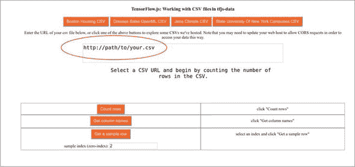
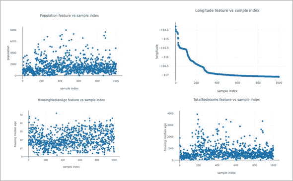
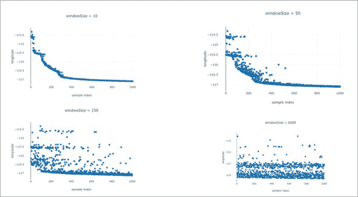
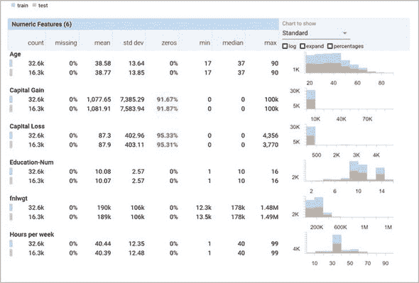
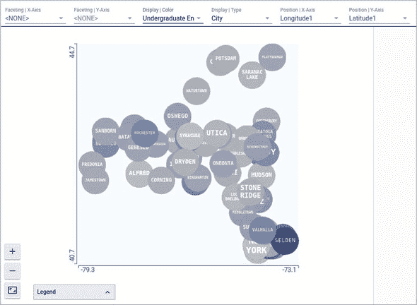

## 第六章：处理数据

*本章涵盖内容*

+   如何使用`tf.data` API 来使用大型数据集训练模型

+   探索您的数据以查找和解决潜在问题

+   如何使用数据增强来创建新的“伪样本”以提高模型质量

大量高质量数据的广泛可用是导致当今机器学习革命的主要因素。如果没有轻松获取大量高质量数据，机器学习的急剧上升就不会发生。现在数据集可以在互联网上随处可得——在 Kaggle 和 OpenML 等网站上免费共享——同样可以找到最先进性能的基准。整个机器学习领域都是通过可用的“挑战”数据集前进的，这些数据集设定了一个标准和一个共同的基准用于社区。如果说机器学习是我们这一代的太空竞赛，那么数据显然就是我们的火箭燃料；它是强大的，它是有价值的，它是不稳定的，它对于一个正常工作的机器学习系统绝对至关重要。更不用说污染的数据，就像污染的燃料一样，很快就会导致系统性失败。这一章是关于数据的。我们将介绍组织数据的最佳实践，如何检测和清除问题，以及如何高效使用数据。

> ¹
> 
> 看看 ImageNet 如何推动目标识别领域，或者 Netflix 挑战对协同过滤做出了什么贡献。
> 
> ²
> 
> 感谢 Edd Dumbill 将这个类比归功于“大数据是火箭燃料”，*大数据*，卷 1，号 2，第 71-72 页。

“但我们不是一直在处理数据吗？”你可能会抗议。没错，在之前的章节中，我们处理过各种数据源。我们使用合成和网络摄像头图像数据集来训练图像模型。我们使用迁移学习从音频样本数据集构建了一个口语识别器，并访问了表格数据集以预测价格。那么还有什么需要讨论的呢？我们不是已经能够熟练处理数据了吗？

在我们之前的例子中回顾我们对数据使用的模式。我们通常需要首先从远程源下载数据。然后我们（通常）对数据应用一些转换，将数据转换为正确的格式，例如将字符串转换为独热词汇向量，或者规范化表格源的均值和方差。然后我们总是需要对数据进行分批处理，并将其转换为表示为张量的标准数字块，然后再连接到我们的模型。这一切都是在我们运行第一个训练步骤之前完成的。

下载 - 转换 - 批处理的模式非常常见，TensorFlow.js 提供了工具，使这些类型的操作更加简单、模块化和不容易出错。本章将介绍 `tf.data` 命名空间中的工具，最重要的是 `tf.data.Dataset`，它可以用于惰性地流式传输数据。惰性流式传输的方法允许按需下载、转换和访问数据，而不是将数据源完全下载并在访问时将其保存在内存中。惰性流式传输使得更容易处理数据源，这些数据源太大，无法放入单个浏览器标签页甚至单台机器的 RAM 中。

我们首先介绍 `tf.data.Dataset` API，并演示如何配置它并与模型连接起来。然后，我们将介绍一些理论和工具，帮助你审查和探索数据，并解决可能发现的问题。本章还介绍了数据增强，这是一种通过创建合成伪示例来扩展数据集，提高模型质量的方法。

### 6.1\. 使用 tf.data 管理数据

如果你的电子邮件数据库有数百 GB 的容量，并且需要特殊凭据才能访问，你该如何训练垃圾邮件过滤器？如果训练图像数据库的规模太大，无法放入单台机器上，你该如何构建图像分类器？

访问和操作大量数据是机器学习工程师的关键技能，但到目前为止，我们所处理的应用程序都可以在可用内存中容纳得下数据。许多应用程序需要处理大型、笨重且可能涉及隐私的数据源，此技术就不适用了。大型应用程序需要一种技术，能够按需逐块从远程数据源中访问数据。

TensorFlow.js 附带了一个集成库，专门用于这种类型的数据管理。它的构建目标是以简洁易读的方式，让用户能够快速地摄取、预处理和路由数据，灵感来自于 TensorFlow Python 版本中的 `tf.data` API。假设你的代码使用类似于 import 语句来导入 TensorFlow.js，像这样：

```js
import * as tf from '@tensorflow/tfjs';
```

这个功能在 `tf.data` 命名空间下可用。

#### 6.1.1\. tf.data.Dataset 对象

与`tfjs-data`的大多数交互都通过一种称为`Dataset`的单一对象类型进行。`tf.data.Dataset`对象提供了一种简单、可配置和高性能的方式来迭代和处理大型（可能是无限的）数据元素列表^([3])。在最粗略的抽象中，你可以将数据集想象成任意元素的可迭代集合，不太不同于 Node.js 中的`Stream`。每当需要从数据集中请求下一个元素时，内部实现将根据需要下载、访问或执行函数来创建它。这种抽象使得模型能够在内存中一次性存储的数据量比可以想象的要多。它还使得在有多个要跟踪的数据集时，将数据集作为一流对象进行共享和组织变得更加方便。`Dataset`通过仅流式传输所需的数据位而不是一次性访问整个数据来提供内存优势。`Dataset` API 还通过预取即将需要的值来提供性能优化。

> ³
> 
> 在本章中，我们将经常使用术语*元素*来指代`Dataset`中的项。在大多数情况下，*元素*与*示例*或*数据点*是同义词——也就是说，在训练数据集中，每个元素都是一个(*x, y*)对。当从 CSV 源中读取数据时，每个元素都是文件的一行。`Dataset`足够灵活，可以处理异构类型的元素，但不建议这样做。

#### 6.1.2\. 创建`tf.data.Dataset`

截至 TensorFlow.js 版本 1.2.7，有三种方法可以将`tf.data.Dataset`连接到某个数据提供程序。我们将对每种方法进行详细介绍，但 table 6.1 中包含了简要摘要。

##### 表 6.1\. 从数据源创建一个`tf.data.Dataset`对象

| 如何获得新的 tf.data.Dataset | API | 如何使用它构建数据集 |
| --- | --- | --- |
| 从 JavaScript 数组中获取元素；也适用于像 Float32Array 这样的类型化数组 | tf.data.array(items) | const dataset = tf.data.array([1,2,3,4,5]); 有关更多信息，请参见 listing 6.1。 |

| 从（可能是远程）CSV 文件中获取，其中每一行都是一个元素 | tf.data.csv( source,

csvConfig) | const dataset = tf.data.csv("https://path/to/my.csv"); 有关更多信息，请参见 listing 6.2。唯一必需的参数是从中读取数据的 URL。此外，csvConfig 接受一个带有键的对象来帮助指导 CSV 文件的解析。例如，

+   columnNames—可以提供一个字符串数组来手动设置列的名称，如果它们在标题中不存在或需要被覆盖。

+   delimiter—可以使用单字符字符串来覆盖默认的逗号分隔符。

+   columnConfigs—可以提供一个从字符串列名到 columnConfig 对象的映射，以指导数据集的解析和返回类型。columnConfig 将通知解析器元素的类型（字符串或整数），或者如果列应被视为数据集标签。

+   configuredColumnsOnly—是否仅返回 CSV 中包含的列或仅返回列配置对象中包含的列的数据。

更多详细信息请查阅[js.tensorflow.org](http://tensorflow.org)上的 API 文档。 |

| 从生成元素的通用生成函数 | tf.data.generator(generatorFunction) | function* countDownFrom10() { for (let i=10; i>0; i--) {

yield(i);

}

}

const dataset =

tf.data.generator(countDownFrom10); 详见清单 6.3。请注意，在没有参数的情况下调用 tf.data.generator()时传递给 tf.data.generator()的参数将返回一个 Generator 对象。 |

##### 从数组创建 tf.data.Dataset

创建新的`tf.data.Dataset`最简单的方法是从一个 JavaScript 数组中构建。假设已经存在一个内存中的数组，您可以使用`tf.data.array()`函数创建一个由该数组支持的数据集。当然，这不会比直接使用数组带来任何训练速度或内存使用上的好处，但通过数据集访问数组提供了其他重要的好处。例如，使用数据集更容易设置预处理，并通过简单的`model.fitDataset()`和`model.evaluateDataset()`API 使我们的训练和评估更加简单，就像我们将在第 6.2 节中看到的那样。与`model.fit(x, y)`相比，`model.fitDataset(myDataset)`不会立即将所有数据移入 GPU 内存，这意味着可以处理比 GPU 能够容纳的更大的数据集。请注意，V8 JavaScript 引擎的内存限制（64 位系统上为 1.4 GB）通常比 TensorFlow.js 一次可以在 WebGL 内存中容纳的内存要大。使用`tf.data` API 也是良好的软件工程实践，因为它使得以模块化的方式轻松地切换到另一种类型的数据而无需改变太多代码。如果没有数据集抽象，很容易让数据集源的实现细节泄漏到模型训练中的使用中，这种纠缠将需要在使用不同实现时解开。

要从现有数组构建数据集，请使用`tf.data.array(itemsAsArray)`，如下面的示例所示。

##### 清单 6.1\. 从数组构建`tf.data.Dataset`

```js
  const myArray = [{xs: [1, 0, 9], ys: 10},
                   {xs: [5, 1, 3], ys: 11},
                   {xs: [1, 1, 9], ys: 12}];
  const myFirstDataset = tf.data.array(myArray);    ***1***
  await myFirstDataset.forEachAsync(
       e => console.log(e));                        ***2***

// Yields output like
// {xs: Array(3), ys: 10}
// {xs: Array(3), ys: 11}
// {xs: Array(3), ys: 12}
```

+   ***1*** 创建由数组支持的 tfjs-data 数据集。请注意，这不会克隆数组或其元素。

+   ***2*** 使用`forEachAsync()`方法迭代数据集提供的所有值。请注意，`forEachAsync()`是一个异步函数，因此应该在其前面使用 await。

我们使用`forEachAsync()`函数迭代数据集的元素，该函数依次生成每个元素。有关`Dataset.forEachAsync`函数的更多详细信息，请参见第 6.1.3 节。

数据集的元素可能包含 JavaScript 基元^([4])（如数字和字符串），以及元组、数组和这些结构的嵌套对象，除了张量。在这个小例子中，数据集的三个元素都具有相同的结构。它们都是具有相同键和相同类型值的对象。`tf.data.Dataset`通常支持各种类型的元素，但常见的用例是数据集元素是具有相同类型的有意义的语义单位。通常，它们应该表示同一类型的示例。因此，除非在非常不寻常的用例中，每个元素都应具有相同的类型和结构。

> ⁴
> 
> 如果您熟悉 Python TensorFlow 中 `tf.data` 的实现，您可能会对 `tf.data.Dataset` 可以包含 JavaScript 基元以及张量感到惊讶。

##### 从 CSV 文件创建 tf.data.Dataset

一种非常常见的数据集元素类型是表示表的一行的键值对象，例如 CSV 文件的一行。下一个列表显示了一个非常简单的程序，该程序将连接并列出波士顿房屋数据集，我们首先在 chapter 2 中使用过的数据集。

##### 列表 6.2\. 从 CSV 文件构建 `tf.data.Dataset`

```js
  const myURL =
      "https://storage.googleapis.com/tfjs-examples/" +
          "multivariate-linear-regression/data/train-data.csv";
  const myCSVDataset = tf.data.csv(myURL);                       ***1***
  await myCSVDataset.forEachAsync(e => console.log(e));          ***2***

// Yields output of 333 rows like
// {crim: 0.327, zn: 0, indus: 2.18, chas: 0, nox: 0.458, rm: 6.998,
// age: 45.8, tax: 222}
// ...
```

+   ***1*** 创建由远程 CSV 文件支持的 tfjs-data 数据集

+   ***2*** 使用 forEachAsync() 方法在数据集提供的所有值上进行迭代。请注意，forEachAsync() 是一个异步函数。

这里我们使用 `tf.data.csv()` 而不是 `tf.data.array()`，并指向 CSV 文件的 URL。这将创建一个由 CSV 文件支持的数据集，并且在数据集上进行迭代将遍历 CSV 行。在 Node.js 中，我们可以通过使用以 file:// 为前缀的 URL 句柄连接到本地 CSV 文件，如下所示：

```js
> const data = tf.data.csv(
     'file://./relative/fs/path/to/boston-housing-train.csv');
```

在迭代时，我们看到每个 CSV 行都被转换为 JavaScript 对象。从数据集返回的元素是具有 CSV 的每列的一个属性的对象，并且属性根据 CSV 文件中的列名命名。这对于与元素交互非常方便，因为不再需要记住字段的顺序。Section 6.3.1 将详细描述如何处理 CSV 并通过一个例子进行说明。

##### 从生成器函数创建 tf.data.Dataset

创建`tf.data.Dataset`的第三种最灵活的方式是使用生成器函数构建。这是使用`tf.data.generator()`方法完成的。`tf.data.generator()`接受一个 JavaScript *生成器函数*（或`function*`）^([5])作为参数。如果您对生成器函数不熟悉，它们是相对较新的 JavaScript 功能，您可能希望花一点时间阅读它们的文档。生成器函数的目的是在需要时“产出”一系列值，可以是永远或直到序列用尽为止。从生成器函数产生的值将流经并成为数据集的值。一个非常简单的生成器函数可以产生随机数，或者从连接的硬件中提取数据的快照。一个复杂的生成器函数可以与视频游戏集成，产生屏幕截图、得分和控制输入输出。在下面的示例中，非常简单的生成器函数产生骰子掷得的样本。

> ⁵
> 
> 了解有关 ECMAscript 生成器函数的更多信息，请访问[`mng.bz/Q0rj`](http://mng.bz/Q0rj)。

##### 清单 6.3。构建用于随机掷骰子的`tf.data.Dataset`

```js
  let numPlaysSoFar = 0;                            ***1***

  function rollTwoDice() {
    numPlaysSoFar++;
    return [Math.ceil(Math.random() * 6), Math.ceil(Math.random() * 6)];
  }

  function* rollTwoDiceGeneratorFn() {              ***2***
    while(true) {                                   ***2***
      yield rollTwoDice();                          ***2***
    }
  }

  const myGeneratorDataset = tf.data.generator(     ***3***
      rollTwoDiceGeneratorFn);                      ***3***
  await myGeneratorDataset.take(1).forEachAsync(    ***4***
      e => console.log(e));                         ***4***

// Prints to the console a value like
// [4, 2]
```

+   ***1*** numPlaysSoFar 被 rollTwoDice()闭合，这使我们可以计算数据集执行该函数的次数。

+   ***2***定义了一个生成器函数（使用 function*语法），可以无限次调用 rollTwoDice()并产生结果。

+   ***3***数据集在此处创建。

+   ***4***获取数据集中仅一个元素的样本。 `take()`方法将在第 6.1.4 节中描述。

关于在清单 6.3 中创建的游戏模拟数据集，有一些有趣的要点。首先，请注意，这里创建的数据集`myGeneratorDataset`是无限的。由于生成器函数永远不会返回，我们可以从数据集中无限次取样。如果我们在此数据集上执行`forEachAsync()`或`toArray()`（参见第 6.1.3 节），它将永远不会结束，并且可能会使我们的服务器或浏览器崩溃，所以要小心。为了使用这样的对象，我们需要创建一些其他数据集，它是无限数据集的有限样本，使用`take(n)`。稍后会详细介绍。

其次，请注意，数据集会关闭局部变量。这对于记录和调试，以确定生成器函数执行了多少次非常有帮助。

此外，请注意数据直到被请求才存在。在这种情况下，我们只能访问数据集的一项样本，并且这会反映在`numPlaysSoFar`的值中。

生成器数据集非常强大且非常灵活，允许开发人员将模型连接到各种提供数据的 API，例如来自数据库查询、通过网络逐段下载的数据，或者来自一些连接的硬件。有关`tf.data.generator()` API 的更多详细信息请参见信息框 6.1。

|  |
| --- |

**tf.data.generator()参数规范**

`tf.data.generator()`API 是灵活且强大的，允许用户将模型连接到许多类型的数据提供者。传递给`tf.data.generator()`的参数必须符合以下规范：

+   它必须可调用且不带参数。

+   在不带参数的情况下调用时，它必须返回符合迭代器和可迭代协议的对象。这意味着返回的对象必须具有一个`next()`方法。当调用`next()`而没有参数时，它应该返回 JavaScript 对象`{value: ELEMENT, done: false}`，以便将值`ELEMENT`传递给下一步。当没有更多值可返回时，它应该返回`{value: undefined, done: true}`。

JavaScript 的生成器函数返回`Generator`对象，符合此规范，因此是使用`tf.data.generator()`的最简单方法。该函数可能闭包于局部变量，访问本地硬件，连接到网络资源等。

表 6.1 包含以下代码，说明如何使用`tf.data.generator()`：

```js
function* countDownFrom10() {
  for (let i = 10; i > 0; i--) {
    yield(i);
  }
}

const dataset = tf.data.generator(countDownFrom10);
```

如果出于某种原因希望避免使用生成器函数，而更愿意直接实现可迭代协议，还可以以以下等效方式编写前面的代码：

```js
function countDownFrom10Func() {
  let i = 10;
  return {
    next: () => {
      if (i > 0) {
        return {value: i--, done: false};
      } else {
        return {done: true};
      }
    }
  }
}

const dataset = tf.data.generator(countDownFrom10Func);
```

|  |
| --- |

#### 6.1.3\. 访问数据集中的数据

一旦将数据作为数据集，您必然会想要访问其中的数据。创建但从不读取数据结构实际上并不实用。有两种 API 可以访问数据集中的数据，但`tf.data`用户应该只需要偶尔使用这些 API。更典型的情况是，高级 API 将为您访问数据集中的数据。例如，在训练模型时，我们使用`model.fitDataset()`API，如第 6.2 节所述，它会为我们访问数据集中的数据，而我们，用户，从不需要直接访问数据。然而，在调试、测试和理解`Dataset`对象工作原理时，了解如何查看内容很重要。

从数据集中访问数据的第一种方法是使用`Dataset.toArray()`将其全部流出到数组中。这个函数的作用正是它的名字听起来的样子。它遍历整个数据集，将所有元素推入数组中，并将该数组返回给用户。用户在执行此函数时应小心，以免无意中生成一个对 JavaScript 运行时来说太大的数组。如果，例如，数据集连接到一个大型远程数据源或是从传感器读取的无限数据集，则很容易犯这个错误。

从数据集中访问数据的第二种方法是使用`dataset.forEachAsync(f)`在数据集的每个示例上执行函数。提供给`forEachAsync()`的参数将逐个应用于每个元素，类似于 JavaScript 数组和集合中的`forEach()`构造——即本地的`Array.forEach()`和`Set.forEach()`。

需要注意的是，`Dataset.forEachAsync()` 和 `Dataset.toArray()` 都是异步函数。这与 `Array.forEach()` 相反，后者是同步的，因此在这里可能很容易犯错。`Dataset.toArray()` 返回一个 Promise，并且通常需要使用 `await` 或 `.then()` 来获取同步行为。要小心，如果忘记使用 `await`，则 Promise 可能不会按照您期望的顺序解析，从而导致错误。一个典型的错误是数据集看起来为空，因为在 Promise 解析之前已经迭代了其内容。

`Dataset.forEachAsync()` 是异步的而 `Array.forEach()` 不是的原因是，数据集正在访问的数据通常需要创建、计算或从远程源获取。异步性使我们能够在等待期间有效地利用可用的计算资源。这些方法在 table 6.2 中进行了总结。

##### 表 6.2\. 迭代数据集的方法

| `tf.data.Dataset` 对象的实例方法 | 功能 | 示例 |
| --- | --- | --- |

| `.toArray()` | 异步地迭代整个数据集，并将每个元素推送到一个数组中，然后返回该数组 | const a = tf.data.array([1, 2, 3, 4, 5, 6]); const arr = await a.toArray();

console.log(arr);

// 1,2,3,4,5,6 |

| `.forEachAsync(f)` | 异步地迭代数据集的所有元素，并对每个元素执行 f | const a = tf.data.array([1, 2, 3]); await a.forEachAsync(e => console.log("hi " + e));

// hi 1

// hi 2

// hi 3 |

#### 6.1.4\. 操作 tfjs-data 数据集

当我们可以直接使用数据而不需要任何清理或处理时，这当然是非常好的。但在作者的经验中，除了用于教育或基准测试目的构建的示例外，这几乎*从未*发生。在更常见的情况下，数据必须在某种程度上进行转换，然后才能进行分析或用于机器学习任务。例如，源代码通常包含必须进行过滤的额外元素；或者需要解析、反序列化或重命名某些键的数据；或者数据已按排序顺序存储，因此在使用它来训练或评估模型之前，需要对其进行随机洗牌。也许数据集必须分割成用于训练和测试的非重叠集。预处理几乎是不可避免的。如果你遇到了一个干净且可直接使用的数据集，很有可能是有人已经为你清理和预处理了！

`tf.data.Dataset` 提供了可链式 API 的方法来执行这些操作，如表 6.3 中所述。每一个这些方法都返回一个新的 `Dataset` 对象，但不要被误导以为所有数据集元素都被复制或每个方法调用都迭代所有数据集元素！`tf.data.Dataset` API 只会懒惰地加载和转换元素。通过将这些方法串联在一起创建的数据集可以看作是一个小程序，它只会在从链的末端请求元素时执行。只有在这个时候，`Dataset` 实例才会爬回操作链，可能一直爬回到请求来自远程源的数据。

##### 表 6.3\. `tf.data.Dataset` 对象上的可链式方法

| tf.data.Dataset 对象的实例方法 | 它的作用 | 示例 |
| --- | --- | --- |
| .filter(谓词) | 返回一个仅包含谓词为真的元素的数据集 | myDataset.filter(x => x < 10); 返回一个数据集，仅包含 myDataset 中小于 10 的值。 |
| .map(转换) | 将提供的函数应用于数据集中的每个元素，并返回一个新数据集，其中包含映射后的元素 | myDataset.map(x => x * x); 返回一个数据集，包含原始数据集的平方值。 |
| .mapAsync(异步转换) | 类似 map，但提供的函数必须是异步的 | myDataset.mapAsync(fetchAsync); 假设 fetchAsync 是一个异步函数，可以从提供的 URL 获取数据，将返回一个包含每个 URL 数据的新数据集。 |

| .batch(批次大小，

smallLastBatch?) | 将连续的元素跨度捆绑成单一元素组，并将原始元素转换为张量 | const a = tf.data.array([1, 2, 3, 4, 5, 6, 7, 8])

.batch(4);

await a.forEach(e => e.print());

// 输出：

// 张量 [1, 2, 3, 4]

// 张量 [5, 6, 7, 8] |

| .concatenate(数据集) | 将两个数据集的元素连接在一起形成一个新的数据集 | myDataset1.concatenate(myDataset2) 返回一个数据集，首先迭代 myDataset1 中的所有值，然后迭代 myDataset2 中的所有值。 |
| --- | --- | --- |
| .repeat(次数) | 返回一个将多次（可能无限次）迭代原始数据集的 dataset | myDataset.repeat(NUM_EPOCHS) 返回一个 dataset，将迭代 myDataset 中所有的值 NUM_EPOCHS 次。如果 NUM_EPOCHS 为负数或未定义，则结果将无限次迭代。 |
| .take(数量) | 返回一个仅包含前数量个示例的数据集 | myDataset.take(10); 返回一个仅包含 myDataset 的前 10 个元素的数据集。如果 myDataset 中的元素少于 10 个，则没有变化。 |
| .skip(count) | 返回一个跳过前 count 个示例的数据集 | myDataset.skip(10); 返回一个包含 myDataset 中除了前 10 个元素之外所有元素的数据集。如果 myDataset 包含 10 个或更少的元素，则返回一个空数据集。 |

| .shuffle( bufferSize,

种子？

) | 生成原始数据集元素的随机洗牌数据集 注意：此洗牌是通过在大小为 bufferSize 的窗口内随机选择来完成的；因此，超出窗口大小的排序被保留。| const a = tf.data.array( [1, 2, 3, 4, 5, 6]).shuffle(3);

await a.forEach(e => console.log(e));

// 输出，例如，2, 4, 1, 3, 6, 5 以随机洗牌顺序输出 1 到 6 的值。洗牌是部分的，因为不是所有的顺序都是可能的，因为窗口比总数据量小。例如，最后一个元素 6 现在成为新顺序中的第一个元素是不可能的，因为 6 需要向后移动超过 bufferSize（3）个空间。|

这些操作可以链接在一起创建简单但强大的处理管道。例如，要将数据集随机分割为训练和测试数据集，可以按照以下列表中的步骤操作（参见 tfjs-examples/iris-fitDataset/data.js）。

##### 列表 6.4\. 使用 `tf.data.Dataset` 创建训练/测试分割

```js
  const seed = Math.floor(
      Math.random() * 10000);                     ***1***
  const trainData = tf.data.array(IRIS_RAW_DATA)
       .shuffle(IRIS_RAW_DATA.length, seed);      ***1***
       .take(N);                                  ***2***
       .map(preprocessFn);
  const testData = tf.data.array(IRIS_RAW_DATA)
       .shuffle(IRIS_RAW_DATA.length, seed);      ***1***
       .skip(N);                                  ***3***
       .map(preprocessFn);
```

+   ***1*** 我们在训练和测试数据中使用相同的洗牌种子；否则它们将独立洗牌，并且一些样本将同时出现在训练和测试中。

+   ***2*** 获取训练数据的前 N 个样本

+   ***3*** 跳过测试数据的前 N 个样本

在这个列表中有一些重要的考虑事项需要注意。我们希望将样本随机分配到训练和测试集中，因此我们首先对数据进行洗牌。我们取前 `N` 个样本作为训练数据。对于测试数据，我们跳过这些样本，取剩下的样本。当我们取样本时，数据以 *相同的方式* 进行洗牌非常重要，这样我们就不会在两个集合中都有相同的示例；因此当同时采样两个管道时，我们使用相同的随机种子。

还要注意，我们在跳过操作之后应用 `map()` 函数。也可以在跳过之前调用 `.map(preprocessFn)`，但是那样 `preprocessFn` 就会对我们丢弃的示例执行——这是一种计算浪费。可以使用以下列表来验证这种行为。

##### 列表 6.5\. 说明 `Dataset.forEach skip()` 和 `map()` 交互

```js
  let count = 0;

  // Identity function which also increments count.
  function identityFn(x) {
    count += 1;
    return x;
  }

  console.log('skip before map');
  await tf.data.array([1, 2, 3, 4, 5, 6])
      .skip(6)                            ***1***
    .map(identityFn)
    .forEachAsync(x => undefined);
  console.log(`count is ${count}`);

  console.log('map before skip');
  await tf.data.array([1, 2, 3, 4, 5, 6])
      .map(identityFn)                    ***2***
    .skip(6)
    .forEachAsync(x => undefined);
  console.log(`count is ${count}`);

// Prints:
// skip before map
// count is 0
// map before skip
// count is 6
```

+   ***1*** 先跳过再映射

+   ***2*** 先映射再跳过

`dataset.map()` 的另一个常见用法是对输入数据进行归一化。我们可以想象一种情况，我们希望将输入归一化为零均值，但我们有无限数量的输入样本。为了减去均值，我们需要先计算分布的均值，但是计算无限集合的均值是不可行的。我们还可以考虑取一个代表性的样本，并计算该样本的均值，但如果我们不知道正确的样本大小，就可能犯错误。考虑一个分布，几乎所有的值都是 0，但每一千万个示例的值为 1e9。这个分布的均值是 100，但如果你在前 100 万个示例上计算均值，你就会相当偏离。

我们可以使用数据集 API 进行流式归一化，方法如下（示例 6.6）。在此示例中，我们将跟踪我们已经看到的样本数量以及这些样本的总和。通过这种方式，我们可以进行流式归一化。此示例操作标量（不是张量），但是针对张量设计的版本具有类似的结构。

##### 示例 6.6\. 使用 `tf.data.map()` 进行流式归一化

```js
  function newStreamingZeroMeanFn() {    ***1***
    let samplesSoFar = 0;
    let sumSoFar = 0;
    return (x) => {
      samplesSoFar += 1;
      sumSoFar += x;
      const estimatedMean = sumSoFar / samplesSoFar;
      return x - estimatedMean;
    }
  }
  const normalizedDataset1 =
     unNormalizedDataset1.map(newStreamingZeroMeanFn());
  const normalizedDataset2 =
     unNormalizedDataset2.map(newStreamingZeroMeanFn());
```

+   ***1*** 返回一个一元函数，它将返回输入减去迄今为止其所有输入的均值。

请注意，我们生成了一个新的映射函数，它在自己的样本计数器和累加器上关闭。这是为了允许多个数据集独立归一化。否则，两个数据集将使用相同的变量来计数调用和求和。这种解决方案并不是没有限制，特别是在 `sumSoFar` 或 `samplesSoFar` 中可能发生数值溢出的情况下，需要谨慎处理。

### 6.2\. 使用 model.fitDataset 训练模型

流式数据集 API 不错，我们已经看到它可以让我们进行一些优雅的数据操作，但是 `tf.data` API 的主要目的是简化将数据连接到模型进行训练和评估的过程。那么 `tf.data` 如何帮助我们呢？

自第二章以来，每当我们想要训练一个模型时，我们都会使用 `model.fit()` API。回想一下，`model.fit()`至少需要两个必要参数 - `xs` 和 `ys`。作为提醒，`xs` 变量必须是一个表示一系列输入示例的张量。`ys` 变量必须绑定到表示相应输出目标集合的张量。例如，在上一章的 示例 5.11 中，我们使用类似的调用对我们的合成目标检测模型进行训练和微调。

```js
model.fit(images, targets, modelFitArgs)
```

其中`images`默认情况下是一个形状为`[2000, 224, 224, 3]`的秩为 4 的张量，表示一组 2000 张图像。`modelFitArgs`配置对象指定了优化器的批处理大小，默认为 128。回顾一下，我们可以看到 TensorFlow.js 被提供了一个内存中^([6])的包含 2000 个示例的集合，表示整个数据集，然后循环遍历该数据，每次以 128 个示例为一批完成每个时期的训练。

> ⁶
> 
> 在*GPU*内存中，通常比系统 RAM 有限！

如果这些数据不足，我们想要用更大的数据集进行训练怎么办？在这种情况下，我们面临着一对不太理想的选择。选项 1 是加载一个更大的数组，然后看看它是否起作用。然而，到某个时候，TensorFlow.js 会耗尽内存，并发出一条有用的错误消息，指示它无法为训练数据分配存储空间。选项 2 是我们将数据上传到 GPU 中的不同块中，并在每个块上调用`model.fit()`。我们需要执行自己的`model.fit()`协调，每当准备好时，就对我们的训练数据的部分进行迭代训练我们的模型。如果我们想要执行多个时期，我们需要回到一开始，以某种（可能是打乱的）顺序重新下载我们的块。这种协调不仅繁琐且容易出错，而且还干扰了 TensorFlow 自己的时期计数器和报告的指标，我们将被迫自己将它们拼接在一起。

Tensorflow.js 为我们提供了一个更方便的工具，使用`model.fitDataset()`API：

```js
model.fitDataset(dataset, modelFitDatasetArgs)
```

`model.fitDataset()` 的第一个参数接受一个数据集，但数据集必须符合特定的模式才能工作。具体来说，数据集必须产生具有两个属性的对象。第一个属性名为`xs`，其值为`Tensor`类型，表示一批示例的特征；这类似于`model.fit()`中的`xs`参数，但数据集一次产生一个批次的元素，而不是一次产生整个数组。第二个必需的属性名为`ys`，包含相应的目标张量。^([7]) 与`model.fit()`相比，`model.fitDataset()`提供了许多优点。首先，我们不需要编写代码来管理和协调数据集的下载——这在需要时以一种高效、按需流式处理的方式为我们处理。内置的缓存结构允许预取预期需要的数据，有效利用我们的计算资源。这个 API 调用也更强大，允许我们在比 GPU 容量更大得多的数据集上进行训练。事实上，我们可以训练的数据集大小现在只受到我们拥有多少时间的限制，因为只要我们能够获得新的训练样本，我们就可以继续训练。这种行为在 tfjs-examples 存储库中的数据生成器示例中有所体现。

> ⁷
> 
> 对于具有多个输入的模型，期望的是张量数组而不是单独的特征张量。对于拟合多个目标的模型，模式类似。

在此示例中，我们将训练一个模型来学习如何估计获胜的可能性，一个简单的游戏机会。和往常一样，您可以使用以下命令来查看和运行演示：

```js
git clone https://github.com/tensorflow/tfjs-examples.git
cd tfjs-examples/data-generator
yarn
yarn watch
```

此处使用的游戏是一个简化的纸牌游戏，有点像扑克牌。每个玩家都会被分发 `N` 张牌，其中 `N` 是一个正整数，并且每张牌由 1 到 13 之间的随机整数表示。游戏规则如下：

+   拥有相同数值牌最多的玩家获胜。例如，如果玩家 1 有三张相同的牌，而玩家 2 只有一对，玩家 1 获胜。

+   如果两名玩家拥有相同大小的最大组，则拥有最大面值组的玩家获胜。例如，一对 5 比一对 4 更大。

+   如果两名玩家甚至都没有一对牌，那么拥有最高单张牌的玩家获胜。

+   平局将随机解决，50/50。

要说服自己，每个玩家都有平等的获胜机会应该很容易。因此，如果我们对自己的牌一无所知，我们应该只能猜测我们是否会赢得比赛的时间一半。我们将构建和训练一个模型，该模型以玩家 1 的牌作为输入，并预测该玩家是否会获胜。在图 6.1 的屏幕截图中，您应该看到我们在大约 250,000 个示例（50 个周期 * 每周期 50 个批次 * 每个批次 100 个样本）训练后，在这个问题上达到了约 75% 的准确率。在这个模拟中，每手使用五张牌，但对于其他数量也可以达到类似的准确率。通过使用更大的批次和更多的周期，可以实现更高的准确率，但是即使在 75% 的情况下，我们的智能玩家也比天真的玩家在估计他们将获胜的可能性时具有显著的优势。

##### 图 6.1\. 数据生成器示例的用户界面。游戏规则的描述和运行模拟的按钮位于左上方。在此下方是生成的特征和数据管道。Dataset-to-Array 按钮运行链接数据集操作，模拟游戏，生成特征，将样本批次化，取 `N` 个这样的批次，将它们转换为数组，并将数组打印出来。右上角有用于使用此数据管道训练模型的功能。当用户点击 Train-Model-Using-Fit-Dataset 按钮时，`model.fitDataset()` 操作接管并从管道中提取样本。下方打印了损失和准确率曲线。在右下方，用户可以输入玩家 1 的手牌值，并按下按钮从模型中进行预测。更大的预测表明模型认为该手牌更有可能获胜。值是有替换地抽取的，因此可能会出现五张相同的牌。


如果我们使用 `model.fit()` 执行此操作，那么我们需要创建和存储一个包含 250,000 个示例的张量，以表示输入特征。这个例子中的数据相当小——每个实例只有几十个浮点数——但是对于上一章中的目标检测任务，250,000 个示例将需要 150 GB 的 GPU 内存，^([8]) 远远超出了 2019 年大多数浏览器的可用范围。

> ⁸
> 
> numExamples × width × height × colorDepth × sizeOfInt32 = 250,000 × 224 × 224 × 3 × 4 bytes 。

让我们深入了解此示例的相关部分。首先，让我们看一下如何生成我们的数据集。下面清单中的代码（从 tfjs-examples/data-generator/index.js 简化而来）与 清单 6.3 中的掷骰子生成器数据集类似，但更复杂一些，因为我们存储了更多信息。

##### 清单 6.7\. 为我们的卡片游戏构建 `tf.data.Dataset`

```js
  import * as game from './game';                    ***1***

  let numSimulationsSoFar = 0;

  function runOneGamePlay() {
    const player1Hand = game.randomHand();           ***2***
    const player2Hand = game.randomHand();           ***2***
    const player1Win = game.compareHands(            ***3***
        player1Hand, player2Hand);                   ***3***
    numSimulationsSoFar++;
    return {player1Hand, player2Hand, player1Win};   ***4***
  }

  function* gameGeneratorFunction() {
    while (true) {
      yield runOneGamePlay();
    }
  }

  export const GAME_GENERATOR_DATASET =
     tf.data.generator(gameGeneratorFunction);

  await GAME_GENERATOR_DATASET.take(1).forEach(
      e => console.log(e));

// Prints
// {player1Hand: [11, 9, 7, 8],
// player2Hand: [10, 9, 5, 1],
// player1Win: 1}
```

+   ***1*** 游戏库提供了 `randomHand()` 和 `compareHands()` 函数，用于从简化的类似扑克牌的卡片游戏生成手牌，以及比较两个这样的手牌以确定哪位玩家赢了。

+   ***2*** 模拟简单的类似扑克牌的卡片游戏中的两名玩家

+   ***3*** 计算游戏的赢家

+   ***4*** 返回两名玩家的手牌以及谁赢了

一旦我们将基本生成器数据集连接到游戏逻辑，我们希望以对我们的学习任务有意义的方式格式化数据。具体来说，我们的任务是尝试从 `player1Hand` 预测 `player1Win` 位。为了做到这一点，我们需要使我们的数据集返回形式为 `[batchOf-Features, batchOfTargets]` 的元素，其中特征是从玩家 1 的手中计算出来的。下面的代码简化自 tfjs-examples/data-generator/index.js。

##### 清单 6.8\. 构建玩家特征的数据集

```js
  function gameToFeaturesAndLabel(gameState) {              ***1***
     return tf.tidy(() => {
      const player1Hand = tf.tensor1d(gameState.player1Hand, 'int32');
      const handOneHot = tf.oneHot(
          tf.sub(player1Hand, tf.scalar(1, 'int32')),
          game.GAME_STATE.max_card_value);

      const features = tf.sum(handOneHot, 0);               ***2***
      const label = tf.tensor1d([gameState.player1Win]);
      return {xs: features, ys: label};
    });
  }

  let BATCH_SIZE = 50;

  export const TRAINING_DATASET =
     GAME_GENERATOR_DATASET.map(gameToFeaturesAndLabel)     ***3***
                                 .batch(BATCH_SIZE);        ***4***

  await TRAINING_DATASET.take(1).forEach(
      e => console.log([e.shape, e.shape]));

// Prints the shape of the tensors:
// [[50, 13], [50, 1]]
```

+   ***1*** 获取一局完整游戏的状态，并返回玩家 1 手牌的特征表示和获胜状态

+   ***2*** `handOneHot` 的形状为 `[numCards, max_value_card]`。此操作对每种类型的卡片进行求和，结果是形状为 `[max_value_card]` 的张量。

+   ***3*** 将游戏输出对象格式的每个元素转换为两个张量的数组：一个用于特征，一个用于目标

+   ***4*** 将 BATCH_SIZE 个连续元素分组成单个元素。如果它们尚未是张量，则还会将数据从 JavaScript 数组转换为张量。

现在我们有了一个符合规范的数据集，我们可以使用 `model.fitDataset()` 将其连接到我们的模型上，如下清单所示（简化自 tfjs-examples/data-generator/index.js）。

##### 清单 6.9\. 构建并训练数据集的模型

```js
  // Construct model.
  model = tf.sequential();
  model.add(tf.layers.dense({
    inputShape: [game.GAME_STATE.max_card_value],
    units: 20,
    activation: 'relu'
  }));
  model.add(tf.layers.dense({units: 20, activation: 'relu'}));
  model.add(tf.layers.dense({units: 1, activation: 'sigmoid'}));
  // Train model
  await model.fitDataset(TRAINING_DATASET, {                              ***1***
    batchesPerEpoch: ui.getBatchesPerEpoch(),                             ***2***
    epochs: ui.getEpochsToTrain(),
    validationData: TRAINING_DATASET,                                     ***3***
    validationBatches: 10,                                                ***4***
    callbacks: {
      onEpochEnd: async (epoch, logs) => {
        tfvis.show.history(
            ui.lossContainerElement, trainLogs, ['loss', 'val_loss'])
        tfvis.show.history(                                               ***5***
            ui.accuracyContainerElement, trainLogs, ['acc', 'val_acc'],
            {zoomToFitAccuracy: true})
      },
    }
  }
```

+   ***1*** 此调用启动训练。

+   ***2*** 一个 epoch 包含多少批次。由于我们的数据集是无限的，因此需要定义此参数，以告知 TensorFlow.js 何时执行 epoch 结束回调。

+   ***3*** 我们将训练数据用作验证数据。通常这是不好的，因为我们会对我们的表现有偏见。但在这种情况下，由于训练数据和验证数据是由生成器保证独立的，所以这不是问题。

+   ***4*** 我们需要告诉 TensorFlow.js 从验证数据集中取多少样本来构成一个评估。

+   ***5*** model.fitDataset() 创建与 tfvis 兼容的历史记录，就像 model.fit() 一样。

正如我们在前面的清单中看到的，将模型拟合到数据集与将模型拟合到一对 x、y 张量一样简单。只要我们的数据集以正确的格式产生张量值，一切都能正常工作，我们能从可能是远程来源的流数据中获益，而且我们不需要自己管理编排。除了传入数据集而不是张量对之外，在配置对象中还有一些差异值得讨论：

+   `batchesPerEpoch`—正如我们在 清单 6.9 中看到的，`model.fitDataset()` 的配置接受一个可选字段来指定构成一个周期的批次数。当我们把整个数据交给 `model.fit()` 时，计算整个数据集中有多少示例很容易。它就是 `data.shape[0]`！当使用 `fitDataset()` 时，我们可以告诉 TensorFlow.js 一个周期何时结束有两种方法。第一种方法是使用这个配置字段，`fitDataset()` 将在那么多批次之后执行 `onEpochEnd` 和 `onEpochStart` 回调。第二种方法是让数据集本身结束作为信号，表明数据集已经耗尽。在 清单 6.7 中，我们可以改变

    ```js
    while (true) { ... }
    ```

    到

    ```js
    for (let i = 0; i<ui.getBatchesPerEpoch(); i++) { ... }
    ```

    模仿这种行为。

+   `validationData`—当使用 `fitDataset()` 时，`validationData` 也可以是一个数据集。但不是必须的。如果你想要的话，你可以继续使用张量作为 `validationData`。验证数据集需要符合返回元素格式的相同规范，就像训练数据集一样。

+   `validationBatches`—如果你的验证数据来自一个数据集，你需要告诉 TensorFlow.js 从数据集中取多少样本来构成一个完整的评估。如果没有指定值，那么 TensorFlow.js 将继续从数据集中提取，直到返回一个完成信号。因为 清单 6.7 中的代码使用一个永不结束的生成器来生成数据集，这永远不会发生，程序会挂起。

其余配置与 `model.fit()` API 完全相同，因此不需要进行任何更改。

### 6.3\. 访问数据的常见模式

所有开发人员都需要一些解决方案，将其数据连接到其模型中。这些连接范围从常见的股票连接，到众所周知的实验数据集，如 MNIST，到完全自定义连接，到企业内的专有数据格式。在本节中，我们将回顾 `tf.data` 如何帮助简化和可维护这些连接。

#### 6.3.1\. 处理 CSV 格式数据

除了使用常见的股票数据集之外，访问数据的最常见方式涉及加载存储在某种文件格式中的准备好的数据。由于其简单性、易读性和广泛支持，数据文件通常存储在 CSV（逗号分隔值）格式^([9]) 中。其他格式在存储效率和访问速度方面具有其他优势，但 CSV 可能被认为是数据集的*共通语言*。在 JavaScript 社区中，我们通常希望能够方便地从某个 HTTP 终端流式传输数据。这就是为什么 TensorFlow.js 提供了对从 CSV 文件中流式传输和操作数据的本机支持。在 section 6.1.2 中，我们简要描述了如何构建由 CSV 文件支持的 `tf.data.Dataset`。在本节中，我们将深入介绍 CSV API，以展示 `tf.data` 如何使与这些数据源的工作变得非常容易。我们将描述一个示例应用程序，该应用程序连接到远程 CSV 数据集，打印其模式，计算数据集的元素数量，并为用户提供选择和打印单个示例的便利。查看使用熟悉的命令的示例：

> ⁹
> 
> 截至 2019 年 1 月，数据科学和机器学习挑战网站 [kaggle.com/datasets](http://kaggle.com/datasets) 拥有 13,971 个公共数据集，其中超过三分之二以 CSV 格式托管。

```js
git clone https://github.com/tensorflow/tfjs-examples.git
cd tfjs-examples/data-csv
yarn && yarn watch
```

这将弹出一个网站，指导我们输入托管的 CSV 文件的 URL，或通过点击建议的四个 URL 之一，例如波士顿房屋 CSV。请参见 figure 6.2 进行说明。在 URL 输入框下方，提供了三个按钮来执行三个操作：1) 计算数据集中的行数，2) 检索 CSV 的列名（如果存在），以及 3) 访问并打印数据集的指定样本行。让我们看看这些是如何工作的，以及 `tf.data` API 如何使它们变得非常容易。

##### 图 6.2\. 我们的 tfjs-data CSV 示例的 Web UI。点击顶部的预设 CSV 按钮之一或输入您自己托管的 CSV 的路径（如果有）。如果您选择自己托管的文件，请确保为您的 CSV 启用 CORS 访问。



我们之前看到，使用类似以下命令从远程 CSV 创建一个 tfjs-data 数据集非常简单：

```js
const myData = tf.data.csv(url);
```

其中 `url` 可以是使用 http://、https:// 或 file:// 协议的字符串标识符，或者是 `RequestInfo`。此调用实际上并不会向 URL 发出任何请求，以检查文件是否存在或是否可访问，这是由于惰性迭代。在 列表 6.10 中，CSV 首先在异步 `myData.forEach()` 调用处获取。我们在 `forEach()` 中调用的函数将简单地将数据集中的元素转换为字符串并打印，但我们可以想象对此迭代器执行其他操作，比如为集合中的每个元素生成 UI 元素或计算报告的统计信息。

##### 列表 6.10\. 打印远程 CSV 文件中的前 10 条记录

```js
  const url = document.getElementById('queryURL').value;
  const myData = tf.data.csv(url);                          ***1***
  await myData.take(10).forEach(
      x => console.log(JSON.stringify(x))));                ***2***

// Output is like
// {"crim":0.26169,"zn":0,"indus":9.9,"chas":0,"nox":0.544,"rm":6.023, ...
// ,"medv":19.4}
// {"crim":5.70818,"zn":0,"indus":18.1,"chas":0,"nox":0.532,"rm":6.75, ...
// ,"medv":23.7}
// ...
```

+   ***1*** 通过提供 URL 到 `tf.data.csv()` 创建 tfjs-data 数据集。

+   ***2*** 创建由 CSV 数据集的前 10 行组成的数据集。然后，使用 forEach() 方法迭代数据集提供的所有值。请注意，forEach() 是一个异步函数。

CSV 数据集通常使用第一行作为包含每列名称的元数据标题。默认情况下，`tf.data.csv()` 假定是这种情况，但可以使用作为第二个参数传递的 `csvConfig` 对象进行控制。如果 CSV 文件本身未提供列名，则可以像这样手动提供：

```js
const myData = tf.data.csv(url, {
     hasHeader: false,
     columnNames: ["firstName", "lastName", "id"]
   });
```

如果为 CSV 数据集提供了手动的 `columnNames` 配置，则它将优先于从数据文件读取的标题行。默认情况下，数据集将假定第一行是标题行。如果第一行不是标题行，则必须配置缺少的部分并手动提供 `columnNames`。

一旦 `CSVDataset` 对象存在，就可以使用 `dataset.columnNames()` 查询其列名，该方法返回列名的有序字符串列表。`columnNames()` 方法是特定于 `CSVDataset` 子类的，不是通常从其他来源构建的数据集中可用的。示例中的 Get Column Names 按钮连接到使用此 API 的处理程序。请求列名将导致 `Dataset` 对象向提供的 URL 发送获取调用以访问和解析第一行；因此，下面列表中的异步调用（从 tfjs-examples/csv-data/index.js 简化而来）。

##### 列表 6.11\. 从 CSV 中访问列名

```js
  const url = document.getElementById('queryURL').value;
  const myData = tf.data.csv(url);
       const columnNames = await myData.columnNames();   ***1***
  console.log(columnNames);
  // Outputs something like [
  //     "crim", "zn", "indus", ..., "tax",
  //     "ptratio", "lstat"] for Boston Housing
```

+   ***1*** 联系远程 CSV 文件以收集和解析列标题。

现在我们有了列名，让我们从数据集中获取一行。在清单 6.12 中，我们展示了 Web 应用程序如何打印 CSV 文件的单个选择的行，用户通过输入元素选择行。为了满足这个请求，我们首先使用`Dataset.skip()`方法创建一个新的数据集，与原始数据集相同，但跳过前`n - 1`个元素。然后，我们将使用`Dataset.take()`方法创建一个在一个元素后结束的数据集。最后，我们将使用`Dataset.toArray()`将数据提取到标准的 JavaScript 数组中。如果一切顺利，我们的请求将产生一个包含指定位置的一个元素的数组。该序列在下面的清单中组合在一起（从 tfjs-examples/csv-data/index.js 中精简）。

##### 清单 6.12\. 访问远程 CSV 中的选择行

```js
  const url = document.getElementById('queryURL').value;
  const sampleIndex = document.getElementById(            ***1***
      'whichSampleInput').valueAsNumber;                  ***1***
  const myData = tf.data.csv(url);                        ***2***
  const sample = await myData
                           .skip(sampleIndex)             ***3***
                           .take(1)                       ***4***
                           .toArray();                    ***5***

  console.log(sample);
  // Outputs something like: [{crim: 0.3237, zn: 0, indus: 2.18, ..., tax:
  // 222, ptratio: 18.7, lstat: 2.94}]
  // for Boston Housing.
```

+   ***1*** sampleIndex 是由 UI 元素返回的一个数字。

+   ***2*** 创建名为 myData 的数据集，配置为从 url 读取，但实际上还没有连接

+   ***3*** 创建一个新的数据集，但跳过前 sampleIndex 个值

+   ***4*** 创建一个新的数据集，但只保留第一个元素。

+   ***5*** 这是实际上导致 Dataset 对象联系 URL 并执行获取的调用。请注意，返回类型是一个对象数组，本例中仅包含一个对象，键对应于标题名称和与那些列关联的值。

现在我们可以取得行的输出，正如你从清单 6.12 中的`console.log`输出中所看到的（在评论中重复），它以将列名映射到值的对象形式呈现，并对其进行样式化以插入到我们的文档中。需要注意的是：如果我们请求一个不存在的行，例如 300 个元素数据集的第 400 个元素，我们将得到一个空数组。

在连接远程数据集时，常常会犯错，使用错误的 URL 或不当的凭证。在这些情况下，最好捕获错误并向用户提供一个合理的错误消息。由于`Dataset`对象实际上直到需要数据时才联系远程资源，因此重要的是要注意将错误处理写在正确的位置。下面的清单显示了我们 CSV 示例 Web 应用程序中如何处理错误的一个简短片段（从 tfjs-examples/csv-data/index.js 中精简）。有关如何连接受身份验证保护的 CSV 文件的更多详细信息，请参见信息框 6.2。

##### 清单 6.13\. 处理由于连接失败引起的错误

```js
  const url = 'http://some.bad.url';
  const sampleIndex = document.getElementById(
      'whichSampleInput').valueAsNumber;
  const myData = tf.data.csv(url);              ***1***
  let columnNames;
  try {
    columnNames = await myData.columnNames();   ***2***
  } catch (e) {
    ui.updateColumnNamesMessage(`Could not connect to ${url}`);
  }
```

+   ***1*** 将这行代码放在 try 块中也没有帮助，因为坏的 URL 在这里并没有被获取。

+   ***2*** 从坏连接引起的错误将在此步骤抛出。

在 6.2 节 中，我们学习了如何使用 `model.fitDataset()`。我们看到该方法需要一个以非常特定形式产生元素的数据集。回想一下，形式是一个具有两个属性 `{xs, ys}` 的对象，其中 `xs` 是表示输入批次的张量，`ys` 是表示相关目标批次的张量。默认情况下，CSV 数据集将返回 JavaScript 对象形式的元素，但我们可以配置数据集以返回更接近我们训练所需的元素。为此，我们将需要使用 `tf.data.csv()` 的 `csvConfig.columnConfigs` 字段。考虑一个关于高尔夫的 CSV 文件，其中有三列：“club”、“strength” 和 “distance”。如果我们希望从俱乐部和力量预测距离，我们可以在原始输出上应用映射函数，将字段排列成 `xs` 和 `ys`；或者，更容易的是，我们可以配置 CSV 读取器来为我们执行此操作。表 6.4 显示了如何配置 CSV 数据集以分离特征和标签属性，并执行批处理，以便输出适合输入到 `model.fitDataset()` 中。

##### 表 6.4\. 配置 CSV 数据集以与 `model.fitDataset()` 一起使用

| 数据集的构建和配置方式 | 构建数据集的代码 | dataset.take(1).toArray()[0] 的结果（从数据集返回的第一个元素） |
| --- | --- | --- |
| 默认的原始 CSV | dataset = tf.data.csv(csvURL) | {club: 1, strength: 45, distance: 200} |

| 在 columnConfigs 中配置标签的 CSV | columnConfigs = {distance: {isLabel: true}};

dataset = tf.data.csv(csvURL,

{columnConfigs}); | {xs: {club: 1, strength: 45}, ys: {distance: 200}} |

| 在 columnConfigs 中配置后进行批处理的 CSV | columnConfigs = {distance: {isLabel: true}};

dataset = tf.data

.csv(csvURL,

{columnConfigs})

.batch(128); | [xs: {club: Tensor, strength: Tensor},

ys: {distance:Tensor}] 这三个张量中的每一个的形状都是 **[128]**。 |

| 在 columnConfigs 中配置后进行批处理和从对象映射到数组的 CSV | columnConfigs = {distance: {isLabel: true}}。

dataset = tf.data

.csv(csvURL,

{columnConfigs})

.map(({xs, ys}) =>

{

return

{xs:Object.values(xs),

ys:Object.values(ys)};

})

.batch(128); | {xs: Tensor, ys: Tensor} 请注意，映射函数返回的项目形式为 {xs: [number, number], ys: [number]}。批处理操作会自动将数值数组转换为张量。因此，第一个张量 (xs) 的形状为 [128,2]。第二个张量 (ys) 的形状为 [128, 1]。 |

|  |
| --- |

**通过认证获取 CSV 数据**

在之前的示例中，我们通过简单提供 URL 来连接到远程文件中的数据。这在 Node.js 和浏览器中都很好用，而且非常容易，但有时我们的数据是受保护的，我们需要提供 `Request` 参数。`tf.data.csv()` API 允许我们在原始字符串 URL 的位置提供 `RequestInfo`，如下面的代码所示。除了额外的授权参数之外，数据集没有任何变化：

```js
>  const url = 'http://path/to/your/private.csv'
>  const requestInfo = new Request(url);
>  const API_KEY = 'abcdef123456789'
>  requestInfo.headers.append('Authorization', API_KEY);
>  const myDataset = tf.data.csv(requestInfo);
```

|  |
| --- |

#### 6.3.2\. 使用 tf.data.webcam() 访问视频数据

TensorFlow.js 项目最令人兴奋的应用之一是直接训练和应用机器学习模型到移动设备上直接可用的传感器。使用移动设备上的内置加速计进行运动识别？使用内置麦克风进行声音或语音理解？使用内置摄像头进行视觉辅助？有很多好主意，而我们才刚刚开始。

在第五章 中，我们探讨了在转移学习的背景下使用网络摄像头和麦克风的工作。我们看到了如何使用摄像头来控制一款“吃豆人”游戏，并使用麦克风来微调语音理解系统。虽然并非每种模态都可以通过方便的 API 调用来使用，但 `tf.data` 对于使用网络摄像头有一个简单易用的 API。让我们来看看它是如何工作以及如何使用它来预测训练好的模型。

使用 `tf.data` API，从网络摄像头获取图像流并创建数据集迭代器非常简单。列表 6.14 展示了来自文档的一个基本示例。我们注意到的第一件事是调用 `tf.data.webcam`()。这个构造函数通过接受一个可选的 HTML 元素作为其输入参数来返回一个网络摄像头迭代器。该构造函数仅在浏览器环境中有效。如果在 Node.js 环境中调用 API，或者没有可用的网络摄像头，则构造函数将抛出一个指示错误来源的异常。此外，浏览器会在打开网络摄像头之前向用户请求权限。如果权限被拒绝，构造函数将抛出一个异常。负责任的开发应该用用户友好的消息来处理这些情况。

##### 列表 6.14\. 使用 `tf.data.webcam()` 和 HTML 元素创建数据集

```js
const videoElement = document.createElement('video');  ***1***
videoElement.width = 100;
videoElement.height = 100;
onst webcam = await tf.data.webcam(videoElement);      ***2***
const img = await webcam.capture();                    ***3***
img.print();
webcam.stop();                                         ***4***
```

+   ***1*** 元素显示网络摄像头视频并确定张量大小

+   ***2*** 视频数据集对象的构造函数。该元素将显示来自网络摄像头的内容。该元素还配置了创建的张量的大小。

+   ***3*** 从视频流中获取一帧并将其作为张量提供

+   ***4*** 停止视频流并暂停网络摄像头迭代器

创建网络摄像头迭代器时，重要的是迭代器知道要生成的张量的形状。有两种方法可以控制这个。第一种方法，如 列表 6.14 所示，使用提供的 HTML 元素的形状。如果形状需要不同，或者视频根本不需要显示，可以通过一个配置对象提供所需的形状，如 列表 6.15 所示。请注意，提供的 HTML 元素参数是未定义的，这意味着 API 将创建一个隐藏的元素在 DOM 中作为视频的句柄。

##### 列表 6.15\. 使用配置对象创建基本网络摄像头数据集

```js
const videoElement = undefined;
const webcamConfig = {
    facingMode: 'user',
    resizeWidth: 100,
   resizeHeight: 100};
const webcam = await tf.data.webcam(
    videoElement, webcamConfig);         ***1***
```

+   ***1*** 使用配置对象构建网络摄像头数据集迭代器，而不是使用 HTML 元素。在这里，我们还指定了设备上要使用的摄像头，对于具有多个摄像头的设备，“user” 指的是面向用户的摄像头；作为“user”的替代，“environment” 指的是后置摄像头。

也可以使用配置对象裁剪和调整视频流的部分。使用 HTML 元素和配置对象并行，API 允许调用者指定要从中裁剪的位置和期望的输出大小。输出张量将插值到所需的大小。请参阅下一个清单，以查看选择方形视频的矩形部分并缩小尺寸以适应小模型的示例。

##### 清单 6.16。从网络摄像头裁剪和调整数据

```js
const videoElement = document.createElement('video');
videoElement.width = 300;
videoElement.height = 300;            ***1***

const webcamConfig = {
    resizeWidth: 150,
    resizeHeight: 100,                ***2***
    centerCrop: true                  ***3***
};

const webcam = await tf.data.webcam(
    videoElement, webcamConfig);      ***4***
```

+   ***1*** 没有显式配置，videoElement 将控制输出大小，这里是 300 × 300。

+   ***2*** 用户请求从视频中提取 150 × 100 的内容。

+   ***3*** 提取的数据将来自原始视频的中心。

+   ***4*** 从此网络摄像头迭代器中捕获的数据取决于 HTML 元素和 webcamConfig。

强调一些这种类型的数据集与我们迄今为止使用的数据集之间的一些明显区别是很重要的。例如，从网络摄像头中产生的值取决于您何时提取它们。与以 CSV 数据集不同，不管它们是以多快或慢的速度绘制的，它们都会按顺序产生行。此外，可以根据用户需要从网络摄像头中提取样本。API 调用者在完成后必须明确告知流结束。

使用 `capture()` 方法从网络摄像头迭代器中访问数据，该方法返回表示最新帧的张量。API 用户应该将这个张量用于他们的机器学习工作，但必须记住使其释放，以防止内存泄漏。由于涉及网络摄像头数据的异步处理的复杂性，最好直接将必要的预处理函数应用于捕获的帧，而不是使用由 `tf.data` 提供的延迟 `map()` 功能。

换句话说，不要使用 `data.map()` 处理数据，

```js
// No:
    let webcam = await tfd.webcam(myElement)
    webcam = webcam.map(myProcessingFunction);
    const imgTensor = webcam.capture();
    // use imgTensor here.
    tf.dispose(imgTensor)
```

将函数直接应用于图像：

```js
// Yes:
    let webcam = await tfd.webcam(myElement);
    const imgTensor = myPreprocessingFunction(webcam.capture());
    // use imgTensor here.
    tf.dispose(imgTensor)
```

不应在网络摄像头迭代器上使用 `forEach()` 和 `toArray()` 方法。为了从设备中处理长序列的帧，`tf.data.webcam()` API 的用户应该自己定义循环，例如使用 `tf.nextFrame()` 并以合理的帧率调用 `capture()`。原因是，如果您在网络摄像头上调用 `forEach()`，那么框架会以浏览器的 JavaScript 引擎可能要求它们从设备获取的速度绘制帧。这通常会比设备的帧速率更快地创建张量，导致重复的帧和浪费的计算。出于类似的原因，不应将网络摄像头迭代器作为 `model.fit()` 方法的参数传递。

示例 6.17 展示了来自我们在第五章中看到的网络摄像头迁移学习（Pac-Man）示例中的简化预测循环。请注意，外部循环将持续到 `isPredicting` 为 true 为止，这由 UI 元素控制。内部上循环的速率由调用 `tf.nextFrame()` 控制，该调用与 UI 的刷新率固定。以下代码来自 tfjs-examples/webcam-transfer-learning/index.js。

##### 示例 6.17\. 在预测循环中使用 `tf.data.webcam()`

```js
async function getImage() {                     ***1***
  return (await webcam.capture())               ***2***
      .expandDims(0)
      .toFloat()
      .div(tf.scalar(127))
      .sub(tf.scalar(1));

while (isPredicting) {
  const img = await getImage();                 ***3***

  const predictedClass = tf.tidy(() => {
    // Capture the frame from the webcam.

    // Process the image and make predictions...
     ...

    await tf.nextFrame();                       ***4***
  }
```

+   ***1*** 从网络摄像头捕获一帧图像，并将其标准化为 -1 到 1 之间。返回形状为 [1, w, h, c] 的批处理图像（1 个元素的批处理）。

+   ***2*** 这里的网络摄像头指的是从 tfd.webcam 返回的迭代器；请参见 示例 6.18 中的 init()。

+   ***3*** 从网络摄像头迭代器绘制下一帧

+   ***4*** 在执行下一个预测之前等待下一个动画帧

最后需要注意的是：在使用网络摄像头时，通常最好在进行预测之前绘制、处理并丢弃一张图像。这样做有两个好处。首先，通过模型传递图像可以确保相关的模型权重已经加载到 GPU 上，防止启动时出现任何卡顿或缓慢。其次，这会给网络摄像头硬件时间来热身并开始发送实际的帧。根据硬件不同，有时在设备启动时，网络摄像头会发送空白帧。在下一节中，您将看到一个片段，展示了如何在网络摄像头迁移学习示例（来自 webcam-transfer-learning/index.js）中完成这个操作。

##### 示例 6.18\. 从 `tf.data.webcam()` 创建视频数据集

```js
async function init() {
  try {
    webcam = await tfd.webcam(
        document.getElementById('webcam'));                 ***1***
  } catch (e) {
    console.log(e);
    document.getElementById('no-webcam').style.display = 'block';
  }
  truncatedMobileNet = await loadTruncatedMobileNet();

  ui.init();

  // Warm up the model. This uploads weights to the GPU and compiles the
  // WebGL programs so the first time we collect data from the webcam it
  // will be quick.
  const screenShot = await webcam.capture();
  truncatedMobileNet.predict(screenShot.expandDims(0));     ***2***
  screenShot.dispose();                                     ***3***
}
```

+   ***1*** 视频数据集对象的构造函数。‘webcam’ 元素是 HTML 文档中的视频元素。

+   ***2*** 对从网络摄像头返回的第一帧进行预测，以确保模型完全加载到硬件上

+   ***3*** 从 `webcam.capture()` 返回的值是一个张量。必须将其销毁以防止内存泄漏。

#### 6.3.3\. 使用 tf.data.microphone() 访问音频数据

除了图像数据外，`tf.data` 还包括专门处理从设备麦克风收集音频数据的功能。与网络摄像头 API 类似，麦克风 API 创建了一个惰性迭代器，允许调用者根据需要请求帧，这些帧被整齐地打包成适合直接输入模型的张量。这里的典型用例是收集用于预测的帧。虽然技术上可以使用此 API 生成训练数据流，但与标签一起压缩它将是具有挑战性的。

示例 6.19 展示了使用 `tf.data.microphone()` API 收集一秒钟音频数据的示例。请注意，执行此代码将触发浏览器请求用户授权访问麦克风。

##### 示例 6.19\. 使用 `tf.data.microphone()` API 收集一秒钟的音频数据

```js
const mic = await tf.data.microphone({               ***1***
  fftSize: 1024,
  columnTruncateLength: 232,
  numFramesPerSpectrogram: 43,
  sampleRateHz: 44100,
  smoothingTimeConstant: 0,
  includeSpectrogram: true,
  includeWaveform: true
});
const audioData = await mic.capture();               ***2***
const spectrogramTensor = audioData.spectrogram;     ***3***
const waveformTensor = audioData.waveform;           ***4***
mic.stop();                                          ***5***
```

+   ***1*** 麦克风配置允许用户控制一些常见的音频参数。我们在正文中详细说明了其中的一些。

+   ***2*** 执行从麦克风捕获音频。

+   ***3*** 音频频谱数据以形状 [43, 232, 1] 的张量返回。

+   ***4*** 除了频谱图数据之外，还可以直接检索波形数据。此数据的形状将为 [fftSize * numFramesPerSpectrogram, 1] = [44032, 1]。

+   ***5*** 用户应该调用 stop() 来结束音频流并关闭麦克风。

麦克风包括一些可配置参数，以使用户对如何将快速傅里叶变换（FFT）应用于音频数据有精细控制。用户可能希望每个频域音频数据的频谱图有更多或更少的帧，或者他们可能只对音频频谱的某个特定频率范围感兴趣，例如对可听到的语音所必需的那些频率。列表 6.19 中的字段具有以下含义：

+   `sampleRateHz`: `44100`

    +   麦克风波形的采样率。这必须是精确的 44,100 或 48,000，并且必须与设备本身指定的速率匹配。如果指定的值与设备提供的值不匹配，将会抛出错误。

+   `fftSize: 1024`

    +   控制用于计算每个不重叠的音频“帧”的样本数。每个帧都经过 FFT 处理，较大的帧具有更高的频率敏感性，但时间分辨率较低，因为帧内的时间信息 *丢失*了。

    +   必须是介于 16 和 8,192 之间的 2 的幂次方，包括 16 和 8,192。在这里，`1024` 意味着在约 1,024 个样本的范围内计算频率带内的能量。

    +   请注意，最高可测频率等于采样率的一半，即约为 22 kHz。

+   `columnTruncateLength: 232`

    +   控制保留多少频率信息。默认情况下，每个音频帧包含 `fftSize` 点，或者在我们的情况下是 1,024，覆盖从 0 到最大值（22 kHz）的整个频谱。然而，我们通常只关心较低的频率。人类语音通常只有高达 5 kHz，因此我们只保留表示零到 5 kHz 的数据部分。

    +   这里，232 = (5 kHz/22 kHz) * 1024。

+   `numFramesPerSpectrogram: 43`

    +   FFT 是在音频样本的一系列不重叠窗口（或帧）上计算的，以创建频谱图。此参数控制每个返回的频谱图中包含多少个窗口。返回的频谱图将具有形状`[numFramesPerSpectrogram, fftSize, 1]`，在我们的情况下为`[43, 232, 1]`。

    +   每个帧的持续时间等于 `sampleRate`/`fftSize`。在我们的情况下，44 kHz * 1,024 约为 0.023 秒。

    +   帧之间没有延迟，因此整个频谱图的持续时间约为 43 * 0.023 = 0.98，或者约为 1 秒。

+   `smoothingTimeConstant: 0`

    +   要将前一帧的数据与本帧混合多少。它必须介于 0 和 1 之间。

+   `includeSpectogram: True`

    +   如果为真，则会计算并提供声谱图作为张量。如果应用程序实际上不需要计算声谱图，则将其设置为 false。这只有在需要波形时才会发生。

+   `includeWaveform: True`

    +   如果为真，则保留波形并将其作为张量提供。如果调用者不需要波形，则可以将其设置为 false。请注意，`includeSpectrogram` 和 `includeWaveform` 中至少一个必须为 true。如果它们都为 false，则会报错。在这里，我们将它们都设置为 true，以显示这是一个有效的选项，但在典型应用中，两者中只需要一个。

与视频流类似，音频流有时需要一些时间才能启动，设备的数据可能一开始就是无意义的。常见的是遇到零和无穷大，但实际值和持续时间是依赖于平台的。最佳解决方案是通过丢弃前几个样本来“预热”麦克风一小段时间，直到数据不再损坏为止。通常，200 毫秒的数据足以开始获得干净的样本。

### 6.4\. 您的数据可能存在缺陷：处理数据中的问题

几乎可以保证您的原始数据存在问题。如果您使用自己的数据源，并且您还没有花费数小时与专家一起研究各个特征、它们的分布和它们的相关性，那么很有可能存在会削弱或破坏您的机器学习模型的缺陷。我们，本书的作者，可以自信地说这一点，因为我们在指导多个领域的许多机器学习系统的构建以及构建一些自己的系统方面具有丰富的经验。最常见的症状是某些模型没有收敛，或者收敛到远低于预期精度的水平。另一个相关但更为阴险和难以调试的模式是模型在验证和测试数据上收敛并表现良好，但在生产中未能达到预期。有时确实存在建模问题、糟糕的超参数或只是倒霉，但到目前为止，这些错误的最常见根本原因是数据存在缺陷。

在幕后，我们使用的所有数据集（如 MNIST、鸢尾花和语音命令）都经过了手动检查、剪裁错误示例、格式化为标准和合适的格式以及其他我们没有讨论的数据科学操作。数据问题可以以多种形式出现，包括缺失字段、相关样本和偏斜分布。在处理数据时存在如此丰富和多样的复杂性，以至于有人可以写一本书来讲述。事实上，请参阅 Ashley Davis 的*用 JavaScript 进行数据整理*，以获取更详尽的阐述！^([10])

> ¹⁰
> 
> 由 Manning Publications 出版，[www.manning.com/books/data-wrangling-with-javascript](http://www.manning.com/books/data-wrangling-with-javascript)。

数据科学家和数据管理人员在许多公司已经成为全职专业角色。这些专业人员使用的工具和他们遵循的最佳实践是多样的，并且通常取决于正在审查的具体领域。在本节中，我们将介绍基础知识，并指出一些工具，帮助你避免长时间模型调试会话的痛苦，只是发现数据本身存在缺陷。对于更全面的数据科学处理，我们将提供你可以进一步学习的参考资料。

#### 6.4.1\. 数据理论

为了知道如何检测和修复*不好*的数据，我们必须首先知道*好*的数据是什么样子。机器学习领域的许多理论基础在于我们的数据来自*概率分布*的假设。在这种表述中，我们的训练数据包含一系列独立的*样本*。每个样本都描述为一个(*x*, *y*)对，其中*y*是我们希望从*x*部分预测出的部分。继续这个假设，我们的推断数据包含一系列来自*与我们的训练数据完全相同分布的样本*。训练数据和推断数据之间唯一重要的区别是在推断时，我们无法看到*y*。我们应该使用从训练数据中学到的统计关系来估计样本的*y*部分。

我们的真实数据有许多方面可能与这种理想情况不符。例如，如果我们的训练数据和推断数据来自*不同*的分布，我们称之为数据集*偏斜*。举个简单例子，如果你正在根据天气和时间等特征来估计道路交通情况，而你所有的训练数据都来自周一和周二，而你的测试数据来自周六和周日，你可以预期模型的准确性将不如最佳。工作日的汽车交通分布与周末的不同。另一个例子，想象一下我们正在构建一个人脸识别系统，我们训练系统来识别基于我们本国的一组标记数据。我们不应该感到惊讶的是，当我们在具有不同人口统计数据的地点使用时，系统会遇到困难和失败。你在真实机器学习环境中遇到的大多数数据偏差问题会比这两个例子更微妙。

数据中偏斜的另一种可能性是在数据收集过程中出现了某种变化。例如，如果我们正在采集音频样本来学习语音信号，然后在构建训练集的过程中，我们的麦克风损坏了一半，所以我们购买了升级版，我们可以预期我们训练集的后半部分会与前半部分具有不同的噪声和音频分布。据推测，在推断时，我们将仅使用新麦克风进行测试，因此训练集和测试集之间也存在偏差。

在某个层面上，数据集的偏斜是无法避免的。对于许多应用程序，我们的训练数据必然来自过去，我们传递给应用程序的数据必然来自现在。产生这些样本的潜在分布必然会随着时间的变化而改变，如文化、兴趣、时尚和其他混淆因素的变化。在这种情况下，我们所能做的就是理解偏斜并尽量减少其影响。因此，生产环境中的许多机器学习模型都会不断使用最新可用的训练数据进行重新训练，以尝试跟上不断变化的分布。

我们的数据样本无法达到理想状态的另一种方式是缺乏独立性。我们的理想状态是样本是*独立同分布*（IID）的。但在某些数据集中，一个样本会提供下一个样本的可能值的线索。这些数据集的样本不是独立的。样本与样本的依赖关系最常见的方式是通过排序现象引入到数据集中。为了访问速度和其他各种很好的理由，我们作为计算机科学家已经接受了对数据进行组织的训练。事实上，数据库系统通常会在我们不经意的情况下为我们组织数据。因此，当你从某个源流式传输数据时，必须非常谨慎，确保结果的顺序没有某种模式。

考虑以下假设。我们希望为房地产应用程序建立一个对加利福尼亚州住房成本的估计。我们获得了一个来自全州各地的住房价格的 CSV 数据集^([11])，以及相关特征，如房间数、开发年龄等。我们可能会考虑立即开始从特征到价格的训练函数，因为我们有数据，而且我们知道如何操作。但是知道数据经常有缺陷，我们决定先看看数据。我们首先使用数据集和 Plotly.js 绘制一些特征与数组中的索引的图。请参考图 6.3 中的插图^([12])和下面的清单（摘自[`codepen.io/tfjs-book/pen/MLQOem`](https://codepen.io/tfjs-book/pen/MLQOem)）了解如何制作这些插图。

> ¹¹
> 
> 关于在这里使用的加利福尼亚住房数据集的描述可在机器学习速成课程的网址[`mng.bz/Xpm6`](http://mng.bz/Xpm6)中找到。
> 
> ¹²
> 
> 图 6.3 中的插图是使用 CodePen 制作的，网址是[`codepen.io/tfjs-book/pen/MLQOem`](https://codepen.io/tfjs-book/pen/MLQOem)。

##### 图 6.3. 四个数据集特征与样本索引的图。理想情况下，在一个干净的 IID 数据集中，我们预期样本索引对特征值没有任何信息。我们可以看到，对于某些特征，y 值的分布显然取决于 x。尤其令人震惊的是，“经度”特征似乎是按照样本索引排序的。



##### 列表 6.20\. 使用 tfjs-data 构建特征与索引的绘图

```js
  const plottingData = {
    x: [],
    y: [],
    mode: 'markers',
    type: 'scatter',
    marker: {symbol: 'circle', size: 8}
  };
  const filename = 'https://storage.googleapis.com/learnjs-data/csv-
     datasets/california_housing_train.csv';
  const dataset = tf.data.csv(filename);
  await dataset.take(1000).forEachAsync(row => {    ***1***
    plottingData.x.push(i++);
    plottingData.y.push(row['longitude']);
  });

  Plotly.newPlot('plot', [plottingData], {
    width: 700,
    title: 'Longitude feature vs sample index',
    xaxis: {title: 'sample index'},
    yaxis: {title: 'longitude'}
  });
```

+   ***1*** 获取前 1,000 个样本并收集它们的值和它们的索引。别忘了等待，否则你的图表可能会是空的！

想象一下，如果我们使用这个数据集构建了一个训练-测试分割，其中我们取前 500 个样本进行训练，剩余的用于测试。会发生什么？从这个分析中可以看出，我们将用来自一个地理区域的数据进行训练，而用来自另一个地理区域的数据进行测试。图 6.3 中的经度面板显示了问题的关键所在：第一个样本来自一个经度更高（更向西）的地方。特征中可能仍然有大量信号，模型会“工作”一定程度，但准确性或质量不如如果我们的数据真正是 IID。如果我们不知道更好的话，我们可能会花费几天甚至几周时间尝试不同的模型和超参数，直到找出问题所在并查看我们的数据！

我们可以做些什么来清理这个问题？修复这个特定问题非常简单。为了消除数据和索引之间的关系，我们可以将数据随机洗牌成随机顺序。然而，这里有一些需要注意的地方。TensorFlow.js 数据集有一个内置的洗牌例程，但它是一个*流式窗口*洗牌例程。这意味着样本在固定大小的窗口内随机洗牌，但没有更进一步。这是因为 TensorFlow.js 数据集流式传输数据，它们可能传输无限数量的样本。为了完全打乱一个永无止境的数据源，你首先需要等待直到它完成。

那么，我们能否使用这个经度特征的流式窗口洗牌？当然，如果我们知道数据集的大小（在这种情况下是 17,000），我们可以指定窗口大小大于整个数据集，然后一切都搞定了。在非常大的窗口大小极限下，窗口化洗牌和我们的常规穷举洗牌是相同的。如果我们不知道我们的数据集有多大，或者大小是不可行的大（即，我们无法一次性在内存缓存中保存整个数据集），我们可能不得不凑合一下。

图 6.4，使用 [`codepen.io/tfjs-book/pen/JxpMrj`](https://codepen.io/tfjs-book/pen/JxpMrj) 创建，说明了使用 `tf.data` 的 `.Dataset` 的 `shuffle()` 方法进行四种不同窗口大小的数据洗牌时会发生什么：

```js
for (let windowSize of [10, 50, 250, 6000]) {
   shuffledDataset = dataset.shuffle(windowSize);
   myPlot(shuffledDataset, windowSize)
}
```

##### 图 6.4\. 四个不同的洗牌数据集的经度与样本索引的四个图。每个洗牌窗口大小不同，从 10 增加到 6,000 个样本。我们可以看到，即使在窗口大小为 250 时，索引和特征值之间仍然存在强烈的关系。在开始附近有更多的大值。直到我们使用的洗牌窗口大小几乎与数据集一样大时，数据的 IID 特性才几乎恢复。



我们看到，即使对于相对较大的窗口大小，索引与特征值之间的结构关系仍然很明显。直到窗口大小达到 6,000 时，我们才能用肉眼看到数据现在可以视为 IID。那么，6,000 是正确的窗口大小吗？在 250 和 6,000 之间是否有一个数字可以起作用？6,000 仍然不足以捕捉我们在这些示例中没有看到的分布问题吗？在这里的正确方法是使用一个`windowSize` >= 数据集中的样本数量来对整个数据集进行洗牌。对于由于内存限制、时间限制或可能是无限数据集而无法进行此操作的数据集，您必须戴上数据科学家的帽子并检查分布以确定适当的窗口大小。

#### 6.4.2\. 检测和清理数据问题

在前一节中，我们已经讨论了如何检测和修复一种类型的数据问题：样本间的依赖关系。当然，这只是数据可能出现的许多问题类型之一。由于出现数据问题的种类和代码出错的种类一样多，因此对所有可能出错的事情进行全面处理远远超出了本书的范围。不过，我们还是要在这里介绍一些问题，这样当你遇到问题时就能识别出它们，并且知道要搜索哪些术语以获取更多信息。

##### 离群值

离群值是我们数据集中非常不寻常的样本，而且在某种程度上不符合基础分布。例如，如果我们正在处理健康统计数据集，我们可能会期望典型成年人的体重在大约 40 至 130 公斤之间。如果我们的数据集中有 99.9%的样本在这个范围内，但偶尔我们遇到了一些荒谬的样本报告，如 145,000 公斤，或者 0 公斤，或者更糟糕的 NaN，我们会将这些样本视为离群值。快速的在线搜索显示，关于处理离群值的正确方式有很多不同的观点。理想情况下，我们的训练数据中应该只有很少的离群值，并且我们应该知道如何找到它们。如果我们能编写一个程序来拒绝离群值，我们就可以将它们从我们的数据集中移除，然后继续训练而不受它们的影响。当然，我们也希望在推断时触发相同的逻辑；否则，我们会引入偏差。在这种情况下，我们可以使用相同的逻辑通知用户，他们的样本构成了系统的离群值，并且他们必须尝试其他方法。

> ¹³
> 
> 在我们的输入特征中摄取 NaN 值将在我们的模型中传播该 NaN 值。

在特征级别处理离群值的另一种常见方法是通过提供合理的最小值和最大值来夹紧数值。在我们的案例中，我们可能会用以下方式替换体重

```js
weight = Math.min(MAX_WEIGHT, Math.max(weight, MIN_WEIGHT));
```

在这种情况下，还有一个好主意是添加一个新的特征，指示异常值已被替换。这样，原始值 40 公斤就可以与被夹为 40 公斤的值-5 公斤区分开来，给网络提供了学习异常状态与目标之间关系的机会，如果这样的关系存在的话：

```js
isOutlierWeight = weight > MAX_WEIGHT | weight < MIN_WEIGHT;
```

##### 缺失数据

经常，我们面临一些样本缺少某些特征的情况。这可能发生在任何数量的原因。有时数据来自手工录入的表单，有些字段被跳过了。有时传感器在数据收集时损坏或失效。对于一些样本，也许一些特征根本没有意义。例如，从未出售过的房屋的最近销售价格是多少？或者没有电话的人的电话号码是多少？

与异常值一样，有许多方法可以解决缺失数据的问题，数据科学家对于在哪些情况下使用哪些技术有不同的意见。哪种技术最好取决于一些考虑因素，包括特征缺失的可能性是否取决于特征本身的值，或者“缺失”是否可以从样本中的其他特征预测出来。信息框 6.3 概述了缺失数据类别的术语表。

|  |
| --- |

**缺失数据的类别**

随机缺失（MAR）：

+   特征缺失的可能性并不取决于隐藏的缺失值，但它可能取决于其他一些观察到的值。

+   示例：如果我们有一个自动化的视觉系统记录汽车交通，它可能记录，除其他外，车牌号码和时间。有时，如果天黑了，我们就无法读取车牌。车牌的存在与车牌值无关，但可能取决于（观察到的）时间特征。

完全随机缺失（MCAR）

+   特征缺失的可能性不取决于隐藏的缺失值或任何观察到的值。

+   示例：宇宙射线干扰我们的设备，有时会破坏我们数据集中的值。破坏的可能性不取决于存储的值或数据集中的其他值。

非随机缺失（MNAR）

+   特征缺失的可能性取决于给定观察数据的隐藏值。

+   示例：个人气象站跟踪各种统计数据，如气压、降雨量和太阳辐射。然而，下雪时，太阳辐射计不会发出信号。

|  |
| --- |

当数据在我们的训练集中缺失时，我们必须应用一些修正才能将数据转换为固定形状的张量，这需要每个单元格中都有一个值。处理缺失数据的四种重要技术。

最简单的技术是，如果训练数据丰富且缺失字段很少，就丢弃具有缺失数据的训练样本。但是，请注意，这可能会在您的训练模型中引入偏差。为了明显地看到这一点，请想象一个问题，其中从正类缺失数据的情况远比从负类缺失数据的情况要常见得多。您最终会学习到错误的类别可能性。只有当您的缺失数据是 MCAR 时，您才完全可以放心地丢弃样本。

##### 第 6.21 列表。通过删除数据处理缺失的特征

```js
  const filteredDataset =
      tf.data.csv(csvFilename)
     .filter(e => e['featureName']);     ***1***
```

+   ***1*** 仅保留值为'truthy'的元素：即不为 0、null、未定义、NaN 或空字符串时

处理缺失数据的另一种技术是用某个值填充缺失数据，也称为*插补*。常见的插补技术包括用该特征的均值、中位数或众数替换缺失的数值特征值。缺失的分类特征可以用该特征的最常见值（也是众数）替换。更复杂的技术包括从可用特征构建缺失特征的预测器，并使用它们。事实上，使用神经网络是处理缺失数据的“复杂技术”之一。使用插补的缺点是学习器不知道特征缺失了。如果缺失信息与目标变量有关，则在插补中将丢失该信息。

##### 第 6.22 列表。使用插补处理缺失的特征

```js
  async function calculateMeanOfNonMissing(              ***1***
      dataset, featureName) {                            ***1***
    let samplesSoFar = 0;
    let sumSoFar = 0;
    await dataset.forEachAsync(row => {
      const x = row[featureName];
      if (x != null) {                                   ***2***
        samplesSoFar += 1;
        sumSoFar += x;
      }
    });
    return sumSoFar / samplesSoFar;                      ***3***
  }

  function replaceMissingWithImputed(                    ***4***
      row, featureName, imputedValue)) {                 ***4***
    const x = row[featureName];
    if (x == null) {
      return {...row, [featureName]: imputedValue};
    } else {
      return row;
    }
  }

  const rawDataset tf.data.csv(csvFilename);
  const imputedValue = await calculateMeanOfNonMissing(
      rawDataset, 'myFeature');
  const imputedDataset = rawDataset.map(                 ***5***
      row => replaceMissingWithImputed(                  ***5***
          row, 'myFeature', imputedValue));              ***5***
```

+   ***1*** 用于计算用于插补的值的函数。在计算均值时，请记住只包括有效值。

+   ***2*** 这里将未定义和 null 值都视为缺失。一些数据集可能使用哨兵值，如 -1 或 0 来表示缺失。请务必查看您的数据！

+   ***3*** 请注意，当所有数据都丢失时，这将返回 NaN。

+   ***4*** 如果 featureName 处的值缺失，则有条件地更新行的函数

+   ***5*** 使用 tf.data.Dataset map()方法将替换映射到所有元素上

有时缺失值会被替换为*哨兵值*。例如，缺失的体重值可能会被替换为 -1，表示未称重。如果您的数据看起来是这种情况，请注意在将其视为异常值之前*先*处理哨兵值（例如，根据我们先前的示例，用 40 kg 替换这个 -1）。

可以想象，如果缺失特征与要预测的目标之间存在关系，模型可能能够使用哨兵值。实际上，模型将花费部分计算资源来学习区分特征何时用作值，何时用作指示器。

管理缺失数据可能最稳健的方法是既使用插补来填补一个值，又添加一个第二个指示特征，以便在该特征缺失时通知模型。在这种情况下，我们将缺失的体重替换为一个猜测值，同时添加一个新特征`weight_missing`，当体重缺失时为 1，提供时为 0。这使得模型可以利用缺失情况，如果有价值的话，并且不会将其与体重的实际值混淆。

##### 列表 6.23\. 添加一个特征来指示缺失

```js
function addMissingness(row, featureName)) {          ***1***
  const x = row[featureName];
  const isMissing = (x == null) ? 1 : 0;
  return {...row, [featureName + '_isMissing']: isMissing};
}

const rawDataset tf.data.csv(csvFilename);
const datasetWithIndicator = rawDataset.map(
      (row) => addMissingness(row, featureName);      ***2***
```

+   ***1*** 将一个新特征添加到每一行的函数，如果特征缺失则为 1，否则为 0

+   ***2*** 使用 tf.data.Dataset map() 方法将附加特征映射到每一行

##### 偏斜

在本章的前面，我们描述了偏斜的概念，即一个数据集与另一个数据集之间的分布差异。当将训练好的模型部署到生产中时，这是机器学习实践者面临的主要问题之一。检测偏斜涉及对数据集的分布进行建模并比较它们是否匹配。快速查看数据集统计信息的简单方法是使用像 Facets（[`pair-code.github.io/facets/`](https://pair-code.github.io/facets/)）这样的工具。参见图 6.5 以查看截图。Facets 将分析和总结您的数据集，以便您查看每个特征的分布，这将帮助您快速发现数据集之间的不同分布问题。

##### 图 6.5\. Facets 的截图显示了 UC Irvine Census Income 数据集的训练集和测试集的每个特征值分布情况（参见[`archive.ics.uci.edu/ml/datasets/Census+Income`](http://archive.ics.uci.edu/ml/datasets/Census+Income)）。该数据集是默认加载在[`pair-code.github.io/facets/`](https://pair-code.github.io/facets/)上的，但您可以导航到该网站并上传自己的 CSV 文件进行比较。这个视图被称为 Facets 概览。



一个简单、基础的偏斜检测算法可能会计算每个特征的均值、中位数和方差，并检查数据集之间的任何差异是否在可接受范围内。更复杂的方法可能会尝试根据样本预测它们来自哪个数据集。理想情况下，这应该是不可能的，因为它们来自相同的分布。如果能够预测数据点是来自训练还是测试，这是偏斜的迹象。

##### 错误字符串

非常常见的情况是，分类数据是以字符串形式提供的特征。例如，当用户访问您的网页时，您可能会记录使用的浏览器，值为`FIREFOX`、`SAFARI`和`CHROME`。通常，在将这些值送入深度学习模型之前，这些值会被转换为整数（通过已知词汇表或哈希），然后映射到一个*n*维向量空间（见 9.2.3 节关于词嵌入）。一个常见的问题是，一个数据集中的字符串与另一个数据集中字符串的格式不同。例如，训练数据可能有`FIREFOX`，而在服务时间，模型收到`FIREFOX\n`，包括换行符，或者`"FIREFOX"`，包括引号。这是一个特别阴险的形式的偏差，应该像处理偏差一样处理。

##### 其他需要注意的数据内容。

除了前面提到的问题之外，在将数据提供给机器学习系统时，还有一些需要注意的事项：

+   *过度不平衡的数据*——如果有一些特征在你的数据集中几乎每个样本都取相同的值，你可以考虑将它们去掉。这种类型的信号很容易过拟合，而深度学习方法对非常稀疏的数据不能很好地处理。

+   *数值/分类区别*——一些数据集将使用整数表示列举集合的元素，而当这些整数的等级顺序没有意义时，这可能会导致问题。例如，如果我们有一个音乐类型的列举集合，比如`ROCK`，`CLASSICAL`等，和一个将这些值映射到整数的词汇表，很重要的是，当我们把这些值传递到模型中时，我们要像处理列举值一样处理这些值。这意味着使用 one-hot 或嵌入（见第九章）对值进行编码。否则，这些数字将被解释为浮点数值，根据它们的编码之间的数字距离，可能会提示虚假的术语之间的关系。

+   *规模巨大的差异*——这是之前提到过的，但在这一节中重申，可以出现数据错误的情况。要注意具有大量差异的数值特征。它们可能导致训练不稳定。通常情况下，在训练之前最好对数据进行 z 标准化（规范化均值和标准差）。只需要确保在服务时间中使用与训练期间相同的预处理即可。你可以在 tensorflow/tfjs-examples iris example 中看到一个例子，我们在第三章中探讨过。

+   *偏见、安全和隐私*——显然，在负责任的机器学习开发中，有很多内容远远超出了一本书章的范围。如果你正在开发机器学习解决方案，花时间了解至少管理偏见、安全和隐私的基本最佳实践至关重要。一个好的起点是谷歌在 [`ai.google/education/responsible-ai-practices`](https://ai.google/education/responsible-ai-practices) 上的负责任 AI 实践页面。遵循这些实践只是做一个好人和一个负责任的工程师的正确选择——显然是重要的目标本身。此外，仔细关注这些问题也是一个明智的选择，因为即使是偏见、安全或隐私的小失误也可能导致令人尴尬的系统性故障，迅速导致客户寻找更可靠的解决方案。

一般来说，你应该花时间确信你的数据符合你的预期。有许多工具可以帮助你做到这一点，从像 Observable、Jupyter、Kaggle Kernel 和 Colab 这样的笔记本，到图形界面工具如 Facets。在 Facets 中，看 图 6.6 ，还有另一种探索数据的方式。在这里，我们使用 Facets 的绘图功能，也就是 Facets Dive，来查看纽约州立大学（SUNY）数据集中的点。Facets Dive 允许用户从数据中选择列，并以自定义的方式直观地表达每个字段。在这里，我们使用下拉菜单将 Longitude1 字段用作点的 x 位置，将 Latitude1 字段用作点的 y 位置，将 City 字符串字段用作点的名称，并将 Undergraduate Enrollment 用作点的颜色。我们期望在二维平面上绘制的纬度和经度能揭示出纽约州的地图，而确实是我们所看到的。地图的正确性可以通过将其与 SUNY 的网页 [www.suny.edu/attend/visit-us/campus-map/](http://www.suny.edu/attend/visit-us/campus-map/) 进行比较来验证。

##### 图 6.6\. Facets 的另一张截图，这次探索的是数据-csv 示例中的纽约州校园数据集。在这里，我们看到 Facets Dive 视图，它允许您探索数据集的不同特征之间的关系。每个显示的点都是数据集中的一个数据点，这里我们将点的 x 位置设置为 Latitude1 特征，y 位置是 Longitude1 特征，颜色与 Undergraduate Enrollment 特征相关，前面的字是设置为 City 特征的，其中包含每个数据点所在的城市的名称。从这个可视化中，我们可以看到纽约州的大致轮廓，西边是布法罗，东南边是纽约。显然，Selden 市包含了一个根据本科生注册人数计算的最大校园之一。



### 6.5\. 数据增强

所以，我们已经收集了我们的数据，我们将其连接到一个`tf.data.Dataset`以便进行简单操作，我们仔细检查并清理了其中的问题。还有什么其他方法可以帮助我们的模型成功呢？

有时，你拥有的数据不足，希望通过程序化地扩展数据集，通过对现有数据进行微小更改来创建新的示例。例如，回顾一下第四章中的 MNIST 手写数字分类问题。MNIST 包含 60,000 个训练图像，共 10 个手写数字，每个数字 6,000 个。这足以学习我们想要为我们的数字分类器提供的所有类型的灵活性吗？如果有人画了一个太大或太小的数字会发生什么？或者稍微旋转了一下？或者有偏斜？或者用笔写得粗或细了？我们的模型还会理解吗？

如果我们拿一个 MNIST 样本数字，并将图像向左移动一个像素，那么数字的语义标签不会改变。向左移动的 9 仍然是一个 9，但我们有了一个新的训练示例。这种从实际示例变异生成的程序化示例称为*伪示例*，将伪示例添加到数据的过程称为*数据增强*。

数据增强采取的方法是从现有的训练样本中生成更多的训练数据。对于图像数据，各种变换如旋转、裁剪和缩放通常会产生看起来可信的图像。其目的是增加训练数据的多样性，以增加训练模型的泛化能力（换句话说，减轻过拟合），这在训练数据集大小较小时特别有用。

图 6.7 展示了应用于由猫图像组成的输入示例的数据增强，来自带标签的图像数据集。通过应用旋转和偏斜等方式增强数据，使得示例的标签即“CAT”不变，但输入示例发生了显著变化。

##### 图 6.7。通过随机数据增强生成猫图片。单个标记示例可以通过提供随机旋转、反射、平移和偏斜来产生整个训练样本族。喵。


如果你使用这个数据增强配置来训练一个新的网络，那么这个网络永远不会看到相同的输入两次。但它所看到的输入仍然存在很强的相互关联性，因为它们来自少量原始图像——你无法产生新的信息，只能重新混合现有信息。因此，这可能不足以完全消除过拟合。使用数据增强的另一个风险是，训练数据现在不太可能与推断数据的分布匹配，引入了偏差。额外训练伪例的好处是否超过偏差成本取决于应用程序，并且这可能只是需要测试和实验的内容。

代码清单 6.24 展示了如何将数据增强作为`dataset.map()`函数包括在内，将允许的变换注入到数据集中。请注意，增强应逐个样本应用。还需要注意的是，不应将增强应用于验证或测试集。如果在增强数据上进行测试，则在推断时不会应用增强，因此会对模型的能力产生偏见。

##### **6**\. 在使用数据增强对数据集进行训练的示例中的代码清单。

```js
  function augmentFn(sample) {                           ***1***
    const img = sample.image;
    const augmentedImg = randomRotate(
        randomSkew(randomMirror(img))));                 ***2***
    return {image: augmentedImg, label: sample.label};
  }

  const (trainingDataset, validationDataset} =           ***3***
      getDatsetsFromSource();                            ***3***
  augmentedDataset = trainingDataset                     ***4***
     .repeat().map(augmentFn).batch(BATCH_SIZE);         ***4***

  // Train model
  await model.fitDataset(augmentedDataset, {             ***5***
    batchesPerEpoch: ui.getBatchesPerEpoch(),
    epochs: ui.getEpochsToTrain(),
    validationData: validationDataset.repeat(),          ***6***
    validationBatches: 10,
    callbacks: { ... },
    }
  }
```

+   ***1*** 数据增强函数以{图像，标签}格式的样本作为输入，并返回相同格式下的新样本。

+   ***2*** 假设随机旋转、随机扭曲和随机镜像在其他地方由某个库定义。旋转、扭曲等的数量在每次调用时随机生成。数据增强只应依赖于特征，而不是样本的标签。

+   ***3*** 该函数返回两个 tf.data.Datasets，每个元素类型为{image, label}。

+   ***4*** 增强应用于单个元素的批处理之前。

+   ***5*** 我们在增强的数据集上拟合模型。

+   ***6*** 重要！不要对验证集应用数据增强。在这里对验证数据进行重复操作，因为数据不会自动循环。每次验证测量只会取 10 批数据，根据配置。

希望本章能让你深刻理解在将机器学习模型应用于数据之前了解数据的重要性。我们介绍了 Facets 等开箱即用的工具，您可以使用它们来检查数据集并深入了解它们。然而，当您需要更灵活和自定义的数据可视化时，需要编写一些代码来完成这项工作。在下一章中，我们将教您 tfjs-vis 的基础知识，这是由 TensorFlow.js 的作者维护的可支持此类数据可视化用例的可视化模块。

### 练习

1.  将第五章的简单物体检测示例扩展，使用`tf.data .generator()`和`model.fitDataset()`代替提前生成完整数据集。此结构有何优势？如果为模型提供更大的图像数据集进行训练，性能会有明显提升吗？

1.  通过对示例中的 MNIST 示例添加小偏移、缩放和旋转来添加数据增强。这是否有助于性能？在使用数据流进行验证和测试时，是否对数据流进行增强更合适，还是只在“真实”的自然样本上测试？

1.  使用第 6.4.1 节中的技术绘制其他章节中使用的一些数据集的一些特征。数据符合独立性的预期吗？有异常值吗？还有缺失值吗？

1.  将我们在这里讨论过的一些 CSV 数据集导入 Facets 工具中。哪些特征看起来可能会引起问题？有什么意外情况吗？

1.  考虑一些我们在早期章节中使用的数据集。哪些数据增强技术适用于那些数据？

### 概要

+   数据是推动深度学习革命的关键力量。没有大型、组织良好的数据集，大多数深度学习应用都无法实现。

+   TensorFlow.js 内置了`tf.data` API，使得流式传输大型数据集、以各种方式转换数据，并将其连接到模型进行训练和预测变得简单。

+   有几种方法可以构建`tf.data.Dataset`对象：从 JavaScript 数组、从 CSV 文件，或者从数据生成函数。从远程 CSV 文件流式传输数据集可以在一行 JavaScript 代码中完成。

+   `tf.data.Dataset`对象具有可链接的 API，使得在机器学习应用中常见的洗牌、过滤、批处理、映射和执行其他操作变得简单而方便。

+   `tf.data.Dataset`以延迟流式传输的方式访问数据。这使得处理大型远程数据集变得简单高效，但付出的代价是处理异步操作。

+   `tf.Model`对象可以直接使用其`fitDataset()`方法从`tf.data.Dataset`进行训练。

+   审计和清理数据需要时间和关注，但这是任何你打算投入实际应用的机器学习系统都必不可少的一步。在数据处理阶段检测和管理偏差、缺失数据和异常值等问题，最终会节省建模阶段的调试时间。

+   数据增强可以用于扩展数据集，包括程序生成的伪示例。这可以帮助模型覆盖原始数据集中未充分表示的已知不变性。
