## 第七章：数据和模型的可视化

*本章内容*

+   如何使用 tfjs-vis 执行自定义数据可视化

+   如何在模型训练后查看内部工作并获得有用的见解

可视化对于机器学习从业者来说是一项重要的技能，因为它涉及到机器学习工作流的每个阶段。在我们构建模型之前，我们通过可视化来检查数据；在模型工程和训练期间，我们通过可视化来监测训练过程；模型训练完毕后，我们使用可视化来了解其工作原理。

在第六章中，你了解到在应用机器学习之前，可视化和了解数据的好处。我们介绍了如何使用 Facets，这是一个基于浏览器的工具，可以帮助你快速、交互式地查看数据。在本章中，我们将介绍一个新工具 tfjs-vis，它可以帮助你以自定义、程序化的方式可视化数据。这样做的好处，相较于只看数据的原始格式或使用 Facets 等现成工具，是更灵活、多样的可视化范式以及更深入理解数据的可能性。

除了数据可视化外，我们还会展示如何在深度学习模型*训练后*使用可视化。我们将使用深入的例子，通过可视化内部激活和计算卷积神经网络层最大程度“激发”的模式，来窥视神经网络“黑盒”的潜力。这将完整展现可视化如何在每个阶段与深度学习相辅相成的故事。

完成本章后，你应该知道为什么可视化是任何机器学习工作流不可或缺的一部分。你还应该熟悉在 TensorFlow.js 框架中可视化数据和模型的标准方式，并能够将它们应用到自己的机器学习问题中。

### 7.1 数据可视化

让我们从数据可视化开始，因为这是机器学习实践者在解决新问题时首先做的事情。我们假设可视化任务比 Facets 能够覆盖的更高级（例如，数据不在一个小的 CSV 文件中）。因此，我们首先会介绍一个基本的图表 API，它可以帮助你在浏览器中创建简单且广泛使用的绘图类型，包括折线图、散点图、条形图和直方图。在完成使用手工编写的数据的基本示例后，我们将通过一个涉及可视化有趣真实数据集的示例将事物整合起来。

#### 7.1.1 使用 tfjs-vis 可视化数据

tfjs-vis 是一个与 TensorFlow.js 紧密集成的可视化库。本章将介绍其许多功能之一，即其 `tfvis.render.*` 命名空间下的轻量级图表 API。这个简单直观的 API 允许你在浏览器中制作图表，重点关注机器学习中最常用的图表类型。为了帮助你开始使用 `tfvis.render`，我们将给你介绍一个 CodePen，地址为 [`codepen.io/tfjs-book/pen/BvzMZr`](https://codepen.io/tfjs-book/pen/BvzMZr)，该 CodePen 展示了如何使用 `tfvis.render` 创建各种基本数据图。

> ¹
> 
> 此绘图 API 是建立在 Vega 可视化库之上的：[`vega.github.io/vega/`](https://vega.github.io/vega/)。

##### tfjs-vis 的基础知识

首先，注意 tfjs-vis 是独立于主要的 TensorFlow.js 库的。你可以从 CodePen 如何用 `<script>` 标签导入 tfjs-vis 来看出这一点：

```js
<script src="https://cdn.jsdelivr.net/npm/@tensorflow/tfjs-vis@latest">
</script>
```

这与导入主要的 TensorFlow.js 库的方式不同：

```js
<script src="https://cdn.jsdelivr.net/npm/@tensorflow/tfjs@latest">
</script>
```

tfjs-vis 和 TensorFlow.js 的 npm 包有所不同（分别是 `@tensorflow/tfjs-vis` 和 `@tensorflow/tfjs`）。在一个依赖于 TensorFlow.js 和 tfjs-vis 的网页或 JavaScript 程序中，这两个依赖都必须被导入。

##### 线图

最常用的图表类型可能是 *线图*（一个曲线，将一个数量绘制成有序数量）。线图有一个水平轴和一个垂直轴，通常分别称为 *x 轴* 和 *y 轴*。这种类型的可视化在生活中随处可见。例如，我们可以通过线图将一天中温度的变化情况绘制出来，其中水平轴是一天中的时间，垂直轴是温度计的读数。线图的水平轴也可以是其他东西。例如，我们可以使用线图来显示高血压药物的治疗效应（它降低了多少血压）与剂量（每天使用多少药物）之间的关系。这样的绘图被称为 *剂量-反应曲线*。另一个非时间线图的很好的例子是我们在第三章中讨论的 ROC 曲线。那里，x 轴和 y 轴都与时间无关（它们是二元分类器的假阳性和真阳性率）。

要使用 `tfvis.render` 创建线图，可以使用 `linechart()` 函数。正如 CodePen 的第一个示例（也是清单 7.1）所示，该函数需要三个参数：

1.  第一个参数是用于绘制图表的 HTML 元素。可以使用空的 `<div>` 元素。

1.  第二个参数是图表中数据点的值。这是一个包含`value`字段并指向一个数组的普通 JavaScript 对象（POJO）。数组由多个 x-y 值对组成，每个值对由一个包含名为`x`和`y`字段的 POJO 表示。`x`和`y`值分别是数据点的 x 和 y 坐标。

1.  第三个参数（可选）包含线图的其他配置字段。在这个例子中，我们使用`width`字段来指定结果图的宽度（以像素为单位）。在后面的例子中您将看到更多的配置字段。^([2])

    > ²
    > 
    > [`js.tensorflow.org/api_vis/latest/`](https://js.tensorflow.org/api_vis/latest/) 包含 tfjs-vis API 的完整文档，在这里您可以找到关于此函数的其他配置字段的信息。

##### 清单 7.1\. 使用`tfvis.render.linechart()`创建一个简单的折线图

```js
let values = [{x: 1, y: 20}, {x: 2, y: 30},
              {x: 3, y: 5}, {x: 4, y: 12}];                ***1***
tfvis.render.linechart(document.getElementById('plot1'),   ***2***
                      {values},                            ***3***
                      {width: 400});                       ***4***
```

+   ***1*** 数据系列是一个包含 x-y 对的数组。

+   ***2*** 第一个参数是将绘制图表的 HTML 元素。这里的'plot1'是一个空的 div 的 ID。

+   ***3*** 第二个参数是一个包含键“值”的对象。

+   ***4*** 自定义配置作为第三个参数传递。在这种情况下，我们只配置了图的宽度。

由清单 7.1 中的代码创建的折线图显示在图 7.1 的左侧面板中。这是一个只有四个数据点的简单曲线。但是，`linechart()`函数可以支持更多数据点的曲线（例如，数千个）。然而，如果你尝试一次绘制太多数据点，你最终会遇到浏览器的资源限制。限制与浏览器和平台相关，应当通过实证方法来确定。一般来说，为了使用户界面流畅响应，限制图表中可呈现的数据大小是一个好习惯。

##### 图 7.1\. 使用`tfvis.render.linechart()`创建的折线图。左侧：使用清单 7.1 中的代码创建的单个系列。右侧：使用清单 7.2 中的代码在同一个坐标轴上创建的两个系列。

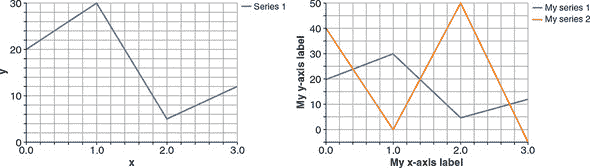

有时您想在同一张图中绘制两条曲线，以显示它们之间的关系（例如相互比较）。您可以使用`tfvis.render.linechart()`制作这些类型的图表。示例显示在图 7.1 的右侧面板中，代码在清单 7.2 中。

这些被称为*多系列*图表，每条线称为*系列*。要创建多系列图表，必须在传递给`linechart()`的第一个参数中包括一个附加字段`series`。该字段的值是一个字符串数组。这些字符串是系列的名称，并将作为图表中的图例呈现。在示例代码中，我们将系列称为`'My series 1'`和`'My series 2'`。

对于多系列图表，第一个参数的`value`字段也需要恰当地指定。对于我们的第一个示例，我们提供了一个点数组，但是对于多系列图表，我们必须提供一个数组的数组。嵌套数组的每个元素都是一个系列的数据点，并且具有与我们在清单 7.1 中绘制单系列图表时看到的值数组相同的格式。因此，嵌套数组的长度必须与`series`数组的长度匹配，否则将出现错误。

由清单 7.2 创建的图表显示在图 7.1 的右侧面板中。如您在本书的电子版本中图表中所见，tfjs-vis 选择两种不同的颜色（蓝色和橙色）来渲染两条曲线。这种默认的着色方案通常很有效，因为蓝色和橙色很容易区分。如果有更多的系列需要呈现，其他新颜色将自动选择。

此示例图表中的两个系列在 x 坐标的值（1、2、3 和 4）完全相同。但是，在多系列图表中，不同系列的 x 坐标值不一定相同。您可以尝试在本章末尾的练习 1 中尝试这种情况。但是，需要注意的是，将两条曲线绘制在同一个线条图表中并不总是明智的做法。例如，如果两条曲线具有非常不同并且不重叠的 y 值范围，则将它们绘制在同一个线条图表中会使每个曲线的变化更难以看到。在这种情况下，最好将它们绘制在单独的线条图表中。

在清单 7.2 中还值得指出的是轴的自定义标签。 我们使用配置对象中的`xLabel`和`yLabel`字段（传递给`linechart（）`的第三个参数）来标记我们选择的自定义字符串的 x 和 y 轴。 通常，标记轴是一种良好的实践，因为它使图表更易于理解。 如果您没有指定`xLabel`和`yLabel`，tfjs-vis 将始终将您的轴标记为`x`和`y`，这就是清单 7.1 和图 7.1 的左面板所发生的。

##### 清单 7.2。使用 `tfvis.render.linechart（）`制作带有两个系列的线条图表

```js
  values = [                                                       ***1***
    [{x: 1, y: 20}, {x: 2, y: 30}, {x: 3, y: 5}, {x: 4, y: 12}],   ***1***
    [{x: 1, y: 40}, {x: 2, y: 0}, {x: 3, y: 50}, {x: 4, y: -5}]    ***1***
  ];                                                               ***1***
  let series = ['My series 1', 'My series 2'];                     ***2***
  tfvis.render.linechart(
           document.getElementById('plot2'), {values, series}, {
    width: 400,
    xLabel: 'My x-axis label',                                     ***3***
    yLabel: 'My y-axis label'                                      ***3***
  });
```

+   ***1*** 为了在相同的轴上显示多个系列，使值成为由多个 x-y 对数组组成的数组。

+   ***2*** 在绘制多个系列时，必须提供系列名称。

+   ***3*** 覆盖默认的 x 和 y 坐标轴标签。

##### 散点图

*散点图* 是您可以使用 `tfvis.render` 创建的另一种图表类型。散点图与折线图最显著的区别在于，散点图不使用线段连接数据点。这使得散点图适用于数据点间顺序不重要的情况。例如，散点图可以将几个国家的人口与人均国内生产总值进行绘制。在这样的图中，主要信息是 x 值和 y 值之间的关系，而不是数据点之间的顺序。

在 `tfvis.render` 中，让您创建散点图的函数是 `scatterplot()`。正如 清单 7.3 中的示例所示，`scatterplot()` 可以呈现多个系列，就像 `linechart()` 一样。事实上，`scatterplot()` 和 `linechart()` 的 API 实际上是相同的，您可以通过比较 清单 7.2 和 清单 7.3 来了解。清单 7.3 创建的散点图显示在 图 7.2 中。

##### 图 7.2\. 包含两个系列的散点图，使用 清单 7.3 中的代码制作。

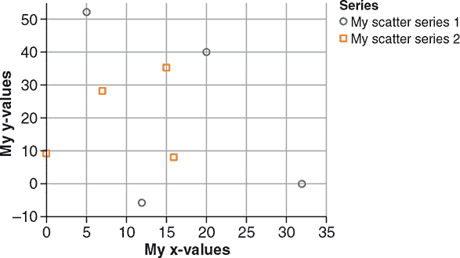

##### 清单 7.3\. 使用 `tfvis.render.scatterplot()` 制作散点图

```js
  values = [                                                         ***1***
    [{x: 20, y: 40}, {x: 32, y: 0}, {x: 5, y: 52}, {x: 12, y: -6}],  ***1***
    [{x: 15, y: 35}, {x: 0, y: 9}, {x: 7, y: 28}, {x: 16, y: 8}]     ***1***
  ];                                                                 ***1***
  series = ['My scatter series 1', 'My scatter series 2'];
  tfvis.render.scatterplot(
      document.getElementById('plot4'),
    {values, series},
     {
      width: 400,
      xLabel: 'My x-values',                                         ***2***
      yLabel: 'My y-values'                                          ***2***
    });
```

+   ***1*** 与 linechart() 一样，使用 x-y 对数组的数组来在散点图中显示多个系列

+   ***2*** 记得始终标记你的轴。

##### 柱状图

如其名称所示，*柱状图* 使用柱形显示数量的大小。这些柱通常从底部的零开始，以便可以从柱形的相对高度读取数量之间的比率。因此，当数量之间的比率很重要时，柱状图是一个不错的选择。例如，自然而然地使用柱状图来显示公司几年来的年收入。在这种情况下，柱形的相对高度使观众对收入在季度之间的变化情况有直观的感觉。这使得柱状图与折线图和散点图有所不同，因为这些值不一定“锚定”在零点上。

要使用`tfvis.render`创建条形图，请使用`barchart()`。您可以在代码清单 7.4 中找到一个示例。代码创建的条形图显示在图 7.3 中。`barchart()`的 API 类似于`linechart()`和`scatterplot()`的 API。但是，应该注意一个重要的区别。传递给`barchart()`的第一个参数不是由`value`字段组成的对象。相反，它是一个简单的索引-值对数组。水平值不是用一个叫做`x`的字段指定的，而是用一个叫做`index`的字段指定的。同样，垂直值不是用一个叫做`y`的字段指定的，而是与一个叫做`value`的字段关联的。为什么有这种区别？这是因为条形图中条形的水平值不一定是一个数字。相反，它们可以是字符串或数字，正如我们在图 7.3 的示例中所示。

##### 图 7.3\. 由代码清单 7.4 生成的包含字符串和数字命名条的条形图

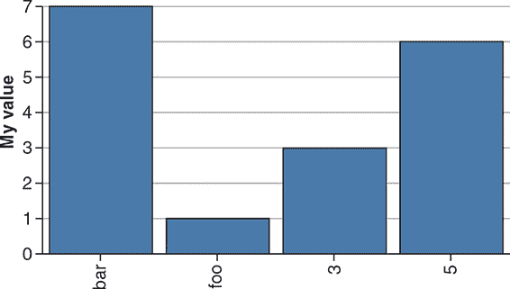

##### 代码清单 7.4\. 使用`tfvis.render.barchart()`创建条形图

```js
const data = [
    {index: 'foo', value: 1},{index: 'bar', value: 7},       ***1***
    {index: 3, value: 3},                                    ***1***
    {index: 5, value: 6}];                                   ***1***
  tfvis.render.barchart(document.getElementById('plot5'), data, {
    yLabel: 'My value',
    width: 400
  });
```

+   ***1*** 请注意条形图的索引可以是数字或字符串。请注意元素的顺序很重要。

##### 直方图

先前描述的三种图表类型允许您绘制某个数量的值。有时，详细的定量值并不像值的*分布*那样重要。例如，考虑一位经济学家查看国家普查结果中的年度家庭收入数据。对于经济学家来说，详细的收入数值并不是最有趣的信息。它们包含了太多信息（是的，有时候太多信息可能是一件坏事！）。相反，经济学家想要更简洁的收入数值摘要。他们对这些值是如何分布感兴趣——即有多少个值低于 2 万美元，有多少个值介于 2 万美元和 4 万美元之间，或者介于 4 万美元和 6 万美元之间，等等。*直方图*是一种适合这种可视化任务的图表类型。

直方图将值分配到*区间*中。每个区间只是一个值的连续范围，有一个下界和一个上界。区间被选择为相邻的，以覆盖所有可能的值。在前面的例子中，经济学家可能使用诸如 0 ~ 20k、20k ~ 40k、40k ~ 60k 等的区间。一旦选择了这样一组`N`个区间，您就可以编写一个程序来计算落入每个区间的单个数据点的数量。执行此程序将给您*N*个数字（每个区间一个）。然后，您可以使用垂直条形图绘制这些数字。这就给您一个直方图。

`tfvis.render.histogram()` 会为您执行所有这些步骤。这样可以省去您确定箱界限并按箱计数示例的麻烦。要调用 `histogram()`，只需传递一个数字数组，如下面的列表所示。这些数字不需要按任何顺序排序。

##### 第 7.5 节。使用 `tfvis.render.histogram()` 可视化值分布。

```js
  const data = [1, 5, 5, 5, 5, 10, -3, -3];
  tfvis.render.histogram(document.getElementById('plot6'), data, {  ***1***
    width: 400                                                      ***1***
  });                                                               ***1***

  // Histogram: with custom number of bins.
  // Note that the data is the same as above.
  tfvis.render.histogram(document.getElementById('plot7'), data, {
    maxBins: 3,                                                     ***2***
    width: 400
  });
```

+   ***1*** 使用自动生成的箱。

+   ***2*** 指定了明确的箱数。

在 列表 7.5 中，有两个略有不同的 `histogram()` 调用。第一个调用除了绘图宽度之外没有指定任何自定义选项。在这种情况下，`histogram()` 使用其内置的启发式方法来计算箱。结果是七个箱：–4 ～ –2，–2 ～ 0，0 ～ 2，...，8 ～ 10，如图 7.4 的左面板所示。在这七个箱中，直方图显示在 4 ～ 6 箱中具有最高值，其中包含 4 个计数，因为数据数组中的四个值为 5。直方图的三个箱（–2 ～ 0，2 ～ 4 和 6 ～ 8）的值为零，因为数据点的元素都没有落入这三个箱中。

##### 图 7.4。相同数据的直方图，使用自动计算的箱（左）和明确指定的箱数（右）绘制。生成这些直方图的代码在 列表 7.5 中。

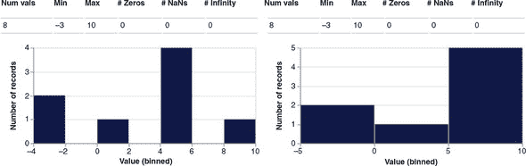

因此，我们可以认为默认的启发式方法对于我们特定的数据点来说生成了太多的箱。如果箱数较少，那么不太可能会有任何箱是空的。您可以使用配置字段 `maxBins` 来覆盖默认的箱子启发式方法并限制箱子数量。这就是列表 7.5 中第二个 `histogram()` 调用所做的，其结果在图 7.4 中右侧显示。您可以看到通过将箱数限制为三个，所有箱都变得非空。

##### 热图

*热图* 将数字的 2D 数组显示为彩色单元格的网格。每个单元格的颜色反映了 2D 数组元素的相对大小。传统上，“较冷”的颜色（如蓝色和绿色）用于表示较低的值，而“较暖”的颜色（如橙色和红色）则用于表示较高的值。这就是为什么这些图被称为热图。在深度学习中最常见的热图例子可能是混淆矩阵（参见第三章中的鸢尾花示例）和注意力矩阵（参见第九章中的日期转换示例）。tfjs-vis 提供了函数 `tfvis.render.heatmap()` 来支持此类可视化的渲染。

列表 7.6 展示了如何制作一个热图来可视化涉及三个类别的虚构混淆矩阵。混淆矩阵的值在第二个输入参数的 `values` 字段中指定。类别的名称，用于标记热图的列和行，是作为 `xTickLabels` 和 `yTickLabels` 指定的。不要将这些刻度标签与第三个参数中的 `xLabel` 和 `yLabel` 混淆，后者用于标记整个 x 和 y 轴。图 7.5 展示了生成的热图绘图。

##### 图 7.5\. 由 列表 7.6 中的代码渲染的热图。它展示了一个涉及三个类别的虚构混淆矩阵。

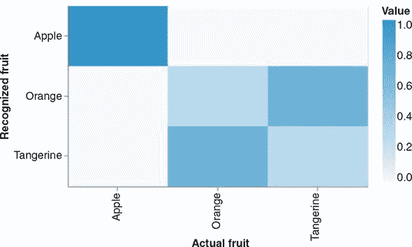

##### 列表 7.6\. 使用 `tfvis.render.heatmap()` 可视化 2D 张量

```js
  tfvis.render.heatmap(document.getElementById('plot8'), {
    values: [[1, 0, 0], [0, 0.3, 0.7], [0, 0.7, 0.3]],      ***1***
    xTickLabels: ['Apple', 'Orange', 'Tangerine'],          ***2***
    yTickLabels: ['Apple', 'Orange', 'Tangerine']           ***2***
  }, {
    width: 500,
    height: 300,
    xLabel: 'Actual Fruit',                                 ***3***
    yLabel: 'Recognized Fruit',                             ***3***
    colorMap: 'blues'                                       ***4***
  });
```

+   ***1*** 传递给 heatmap() 的值可以是嵌套的 JavaScript 数组（如此处所示）或 2D tf.Tensor。

+   ***2*** xTickLabels 用于标记沿 x 轴的单个列。不要与 xLabel 混淆。同样，yTickLabels 用于标记沿 y 轴的单个行。

+   ***3*** xLabel 和 yLabel 用于标记整个坐标轴，不同于 xTickLabel 和 yTickLabel。

+   ***4*** 除了这里展示的“蓝色”色图外，还有“灰度”和“翠绿”。

这就是我们对 `tfvis.render` 支持的四种主要图表类型的快速介绍。如果你未来的工作涉及使用 tfjs-vis 进行数据可视化，很有可能会经常使用这些图表。表 7.1 提供了图表类型的简要摘要，以帮助您决定在给定的可视化任务中使用哪种图表。

##### 表 7.1\. tfjs-vis 在 `tfvis.render` 命名空间下支持的五种主要图表类型的摘要

| 图表名称 | tfjs-vis 中对应的函数 | 适合的可视化任务和机器学习示例 |
| --- | --- | --- |
| 折线图 | tfvis.render.linechart() | 一个标量（y 值）随另一个具有固有顺序（时间、剂量等）的标量（x 值）变化。多个系列可以在同一坐标轴上绘制：例如，来自训练集和验证集的指标，每个指标都根据训练轮次数量绘制。 |
| 散点图 | tfvis.render.scatterplot() | x-y 标量值对，没有固有的顺序，例如 CSV 数据集的两个数值列之间的关系。多个系列可以在同一坐标轴上绘制。 |
| 条形图 | tfvis.render.barchart() | 一组属于少数类别的值，例如几个模型在相同分类问题上实现的准确率（以百分比数字表示）。 |
| 直方图 | tfvis.render.histogram() | 分布的主要兴趣是一组值，例如密集层内核中参数值的分布。 |
| 热力图 | tfvis.render.heathmap() | 一种二维数字数组，以 2D 网格单元格的形式进行可视化，每个元素的颜色用于反映对应值的大小：例如，多类别分类器的混淆矩阵（3.3 节）；序列到序列模型的注意力矩阵（9.3 节）。 |

#### 7.1.2\. 一个综合案例研究：使用 tfjs-vis 可视化天气数据

上一节的 CodePen 示例使用的是小型的手动编码数据。在本节中，我们将展示如何在更大更有趣的真实数据集上使用 tfjs-vis 的图表功能。这将展示出 API 的真正强大之处，并且为在浏览器中进行数据可视化的价值提供论据。这个示例还将突出一些在解决实际问题时可能遇到的微妙之处和陷阱。

我们将使用的数据是 Jena-weather-archive 数据集。它包括在德国耶拿（Jena）地区的一个位置上使用各种气象仪器收集的数据，涵盖了八年的时间（2009 年至 2017 年）。可以从 Kaggle 页面上下载该数据集（参见[www.kaggle.com/pankrzysiu/weather-archive-jena](http://www.kaggle.com/pankrzysiu/weather-archive-jena)），它以一个 42MB 的 CSV 文件的形式提供。它包含 15 列，第一列是时间戳，其余列是气象数据，如温度（`T deg(C)`）、气压（`p (mbar)`）、相对湿度（`rh (%s)`）、风速（`wv (m/s)`）等。如果你检查时间戳，你会发现它们之间有 10 分钟的间隔，反映出测量是每隔 10 分钟进行一次。这是一个丰富的数据集，可以进行可视化、探索和尝试机器学习。在接下来的章节中，我们将尝试使用不同的机器学习模型进行天气预报。特别是，我们将使用前 10 天的天气数据来预测第二天的温度。但在我们开始这个令人兴奋的天气预测任务之前，让我们遵循“在尝试机器学习之前，始终查看数据”的原则，看看 tfjs-vis 如何以清晰直观的方式绘制数据。

要下载和运行 Jena-weather 示例，请使用以下命令：

```js
git clone https://github.com/tensorflow/tfjs-examples.git
cd tfjs-examples/jena-weather
yarn
yarn watch
```

##### 限制数据量以进行高效有效的可视化

Jena-weather 数据集相当大。文件大小为 42MB，比迄今为止本书中看到的所有 CSV 或表格数据集都要大。这导致了两个挑战：

+   第一个挑战是对计算机而言：如果一次绘制八年的所有数据，浏览器选项卡将耗尽资源，变得无响应，并可能崩溃。即使你仅限制在 14 列中的 1 列，仍然有大约 42 万个数据点需要显示。这比 tfjs-vis（或任何 JavaScript 绘图库）能够安全渲染的量要多。

+   第二个挑战是对用户而言：一次查看大量数据并从中提取有用信息是困难的。例如，有人应该如何查看所有 420,000 个数据点并从中提取有用信息？就像计算机一样，人类大脑的信息处理带宽是有限的。可视化设计师的工作是以高效的方式呈现数据的最相关和最有信息量的方面。

我们使用三种技巧来解决这些挑战：

+   我们不是一次性绘制整个八年的数据，而是让用户使用交互式用户界面选择要绘制的时间范围。这就是用户界面中时间跨度下拉菜单的目的（请参见 图 7.6 和 7.7 中的截屏）。时间跨度选项包括 Day、Week、10 Days、Month、Year 和 Full。最后一个对应于整个八年。对于任何其他时间跨度，用户界面允许用户在时间上前后移动。这就是左箭头和右箭头按钮的作用。

    ##### 图 7.6\. 展示了 Jena 气象档案数据集中温度（`T（degC）`）和气压（`p（mbar）`）的折线图，分别以两种不同的时间尺度绘制。顶部：10 天时间跨度。注意温度曲线中的日常周期。底部：1 年时间跨度。注意温度曲线中的年度周期以及春季和夏季期间气压相对其他季节更稳定的轻微倾向。

    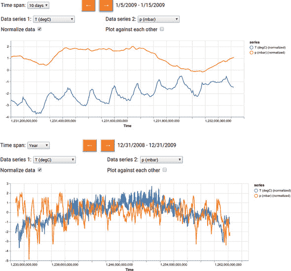

    ##### 图 7.7\. Jena 气象演示的散点图示例。该图显示了空气密度（rho，纵轴）和温度（T，横轴）之间的关系，时间跨度为 10 天，可以看到负相关性。

    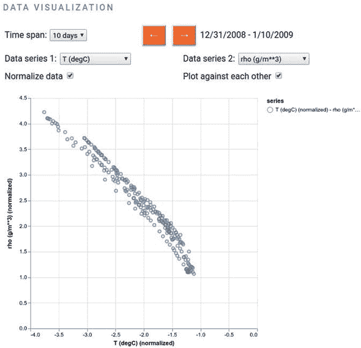

+   对于任何超过一周的时间跨度，我们在将时间序列绘制到屏幕上之前进行*降采样*。例如，考虑时间跨度为一个月（30 天）。这个时间跨度的完整数据包含约 30 * 24 * 6 = 4.32k 个数据点。在 清单 7.7 中的代码中，您可以看到我们在显示一个月的数据时仅绘制每六个数据点。这将绘制的数据点数量减少到 0.72k，大大降低了渲染成本。但对于人眼来说，数据点数量的六倍减少几乎没有什么差别。

+   与我们在时间跨度下拉菜单中所做的类似，我们在用户界面中包含一个下拉菜单，以便用户可以选择在任何给定时间绘制什么天气数据。注意标有 Data Series 1 和 Data Series 2 的下拉菜单。通过使用它们，用户可以在同一坐标轴上将任何 1 或任何 2 个 14 列中的数据作为折线图绘制到屏幕上。

7.7 节的示例展示了负责制作与图 7.6 类似的图表的代码。尽管代码调用了`tfvis.render.linechart()`，与前一节中的 CodePen 示例相似，但与前面列表中的代码相比，它要抽象得多。这是因为在我们的网页中，我们需要根据 UI 状态延迟决定要绘制的数量。

##### 7.7 节。Jena 天气数据作为多系列折线图（在 jena-weather/index.js 中）

```js
function makeTimeSerieChart(
    series1, series2, timeSpan, normalize, chartContainer) {
  const values = [];
  const series = [];
  const includeTime = true;
  if (series1 !== 'None') {
    values.push(jenaWeatherData.getColumnData(                    ***1***
        series1, includeTime, normalize, currBeginIndex,
        TIME_SPAN_RANGE_MAP[timeSpan],                            ***2***
        TIME_SPAN_STRIDE_MAP[timeSpan]));                         ***3***
    series.push(normalize ? `${series1} (normalized)` : series1);
  }
  if (series2 !== 'None') {                                       ***4***
    values.push(jenaWeatherData.getColumnData(
        series2, includeTime, normalize, currBeginIndex,
        TIME_SPAN_RANGE_MAP[timeSpan],
        TIME_SPAN_STRIDE_MAP[timeSpan]));
    series.push(normalize ? `${series2} (normalized)` : series2);
  }
  tfvis.render.linechart({values, series: series}, chartContainer, {
    width: chartContainer.offsetWidth * 0.95,
    height: chartContainer.offsetWidth * 0.3,
    xLabel: 'Time',                                               ***5***
    yLabel: series.length === 1 ? series[0] : ''
  });
}
```

+   ***1*** jenaWeatherData 是一个帮助我们组织和检索来自 CSV 文件的天气数据的对象。请参阅 jena-weather/data.js。

+   ***2*** 指定可视化的时间跨度

+   ***3*** 选择适当的步幅（降采样因子）

+   ***4*** 利用了 tfjs-vis 的折线图支持多系列的特性。

+   ***5*** 总是标记轴。

鼓励您探索数据可视化界面。它包含许多有趣的天气模式，您可以发现。例如，图 7.6 的顶部面板显示了在 10 天内温度（`T (degC)`）和标准化气压（`p (mbar)`）是如何变化的。在温度曲线中，您可以看到一个明显的日循环：温度倾向于在中午左右达到峰值，并在午夜后不久达到最低点。在日循环之上，您还可以看到在这 10 天期间的一个更全局的趋势（逐渐增加）。相比之下，气压曲线在这个时间尺度上没有显示出明显的模式。同一图的底部面板显示了一年时间跨度内的相同测量值。在那里，您可以看到温度的年循环：它在八月左右达到峰值，并在一月左右达到最低点。气压再次显示出一个不太清晰的模式，比起温度，在这个时间尺度上。压力在整个年份内可能以一种略微混沌的方式变化，尽管在夏季周围，似乎有一个较少变化的倾向，而在冬季则相反。通过在不同的时间尺度上查看相同的测量值，我们可以注意到各种有趣的模式。如果我们只看数字 CSV 格式的原始数据，所有这些模式几乎是不可能注意到的。

在图 7.6 中的图表中，你可能已经注意到它们显示的是温度和气压的归一化值，而不是它们的绝对值，这是因为我们在生成这些图表时勾选了 UI 中的“Normalize Data”复选框。我们在第二章中讨论波士顿房价模型时简单提到了归一化。那里的归一化涉及将平均值减去，然后除以标准差的结果。我们这里进行的归一化完全相同。然而，这不仅仅是为了我们机器学习模型的准确性（下一节将介绍），还是为了可视化。为什么呢？如果你尝试在图表显示温度和气压时取消勾选“Normalize Data”复选框，你会立即看到原因。温度测量值的范围在-10 到 40 之间（摄氏度），而气压的范围在 980 到 1,000 之间。在没有归一化的情况下，具有非常不同范围的两个变量会导致 y 轴扩展到非常大的范围，使得两条曲线看起来基本上是平的，并且只有微小的变化。通过归一化，可以避免这个问题，将所有测量值映射到零平均值和单位标准差的分布。

图 7.7 展示了一个将两个气象测量值绘制为散点图的示例，你可以通过勾选“Plot Against Each Other”复选框并确保两个“Data Series”下拉菜单都不是“None”来激活此模式。制作这样的散点图的代码与清单 7.7 中的`makeTimeSerieChart()`函数相似，因此这里为了简洁起见省略了。如果你对细节感兴趣，可以在相同的文件（jena-weather/index.js）中进行研究。

这个示例散点图展示了归一化空气密度（y 轴）和归一化温度（x 轴）之间的关系。在这里，你可以发现两个变量之间存在较强的负相关性：随着温度的升高，空气密度将降低。这个示例图表使用了 10 天的时间跨度，但你可以验证这种趋势在其他时间跨度下也基本保持不变。这种变量之间的相关性可以通过散点图轻松地可视化，但只通过文本格式的数据很难发现。这再次展示了数据可视化的强大价值。

### 7.2\. 训练后的模型可视化

在之前的章节中，我们展示了可视化对数据的有用之处。在本节中，我们将展示如何在模型训练后可视化模型的各个方面，以获得有用的洞察力。为此，我们将主要关注以图像为输入的卷积神经网络（convnet），因为它们被广泛使用且产生有趣的可视化结果。

你可能听说过深度神经网络是“黑盒子”。不要让这个说法让你误以为在推理或训练神经网络时很难从内部获取任何信息。相反，查看 TensorFlow.js 中编写的模型的每个层在内部做了什么是相当容易的。此外，就卷积神经网络而言，它们学习的内部表示非常适合可视化，主要是因为它们是视觉概念的表示。自 2013 年以来，已经开发了各种各样的技术来可视化和解释这些表示。由于涵盖所有有趣的技术是不切实际的，我们将介绍三种最基本和最有用的技术：

> ³
> 
> 这个说法实际上意味着，深度神经网络中发生的大量数学运算，即使可以访问，也比起某些其他类型的机器学习算法，如决策树和逻辑回归，更难以用 layperson 的术语描述。例如，对于决策树，你可以逐个沿着分支点走下去，并解释为什么选择了某个分支，通过用一句简单的句子如“因为因子 X 大于 0.35”来用语言化的方式解释原因。这个问题被称为*模型可解释性*，与我们在本节中涵盖的内容不同。

+   *可视化 convnet 中间层（中间激活）的输出* —— 这有助于理解连续 convnet 层如何转换其输入，并且可以初步了解单个 convnet 滤波器学习的视觉特征。

+   *通过找到最大化激活它们的输入图像来可视化 convnet 滤波器* —— 这有助于理解每个滤波器对哪种视觉模式或概念敏感。

+   *可视化输入图像中类激活的热图* —— 这有助于理解输入图像的哪些部分在导致 convnet 生成最终分类结果时起着最重要的作用，这也可以有助于解释 convnet 如何达到其输出和“调试”不正确的输出。

我们将使用的代码来展示这些技术是来自 tfjs-examples 仓库的 visualize-convnet 示例。要运行示例，请使用以下命令：

```js
git clone https://github.com/tensorflow/tfjs-examples.git
cd tfjs-examples/visualize-convnet
yarn && yarn visualize
```

`yarn visualize`命令与您在先前示例中看到的`yarn watch`命令不同。除了构建和启动网页之外，它还在浏览器外执行一些额外的步骤。首先，它安装一些所需的 Python 库，然后下载并转换 VGG16 模型（一个知名且广泛使用的深度卷积网络）为 TensorFlow.js 格式。VGG16 模型已经在大规模的 ImageNet 数据集上进行了预训练，并作为 Keras 应用程序提供。一旦模型转换完成，`yarn visualize`在 tfjs-node 中对转换后的模型进行一系列分析。为什么这些步骤在 Node.js 中而不是浏览器中执行？因为 VGG16 是一个相对较大的卷积网络。^([4]) 因此，其中的一些步骤计算量很大，在 Node.js 中的资源限制较少的环境中运行得更快。如果您使用 tfjs-node-gpu 而不是默认的 tfjs-node，计算速度可以进一步加快（这需要具有所需驱动程序和库的 CUDA 启用 GPU；请参阅附录 A）：

> ⁴
> 
> 要了解 VGG16 有多大的概念，请意识到其总重量大小为 528 MB，而 MobileNet 的重量大小小于 10MB。

```js
yarn visualize --gpu
```

一旦在 Node.js 中完成了计算密集的步骤，它们将生成一组图像文件在 dist/folder 中。作为最后一步，`yarn visualize`将编译并启动一个 Web 服务器，用于一组静态 Web 文件，包括那些图像，除了在浏览器中打开索引页。

`yarn visualize`命令包含一些额外可配置的标志。例如，默认情况下，它对感兴趣的每个卷积层执行八个过滤器的计算和可视化。您可以使用`--filters`标志更改过滤器的数量：例如，`yarn visualize --filters 32`。此外，`yarn visualize`使用的默认输入图像是随源代码提供的 cat.jpg 图像。您可以使用`--image`标志使用其他图像文件。^([5]) 现在让我们基于 cat.jpg 图像和 32 个过滤器查看可视化结果。

> ⁵
> 
> 最常见的图像格式，包括 JPEG 和 PNG，都受支持。

#### 7.2.1\. 可视化卷积神经网络内部激活

在这里，我们计算并显示了给定输入图像的 VGG16 模型的各种卷积层生成的特征图。这些特征图被称为*内部*激活，因为它们不是模型的最终输出（模型的最终输出是一个长度为 1,000 的向量，表示 1,000 个 ImageNet 类别的概率分数）。相反，它们是模型计算的中间步骤。这些内部激活使我们能够了解输入是如何被网络学习的不同特征分解的。

回顾第四章，卷积层的输出具有 NHWC 形状`[numExamples, height, width, channels]`。在这里，我们正在处理单个输入图像，因此`numExamples`为 1。我们想要可视化每个卷积层输出的剩余三个维度：高度、宽度和通道。卷积层输出的高度和宽度由其滤波器大小、填充、步长以及图层输入的高度和宽度确定。一般来说，随着深入到卷积神经网络中，它们会变得越来越小。另一方面，随着深入，`channels`的值通常会变得越来越大，因为卷积神经网络通过一系列层的表示转换逐渐提取越来越多的特征。卷积层的这些通道不能解释为不同的颜色分量。相反，它们是学习到的特征维度。这就是为什么我们的可视化将它们分成单独的面板并以灰度绘制的原因。图 7.8 展示了给定 cat.jpg 输入图像的 VGG16 的五个卷积层的激活。

##### 图 7.8。VGG16 对 cat.jpg 图像执行推理的几个卷积层的内部激活。左侧显示原始输入图像，以及模型输出的前三个类别和它们关联的概率分数。可视化的五个层分别是命名为`block1_conv1`、`block2_conv1`、`block3_conv2`、`block4_conv2`和`block5_conv3`的层。它们按照在 VGG16 模型中的深度从顶部到底部的顺序排序。也就是说，`block1_conv1`是最靠近输入层的，而`block5_conv1`是最靠近输出层的。请注意，出于可视化目的，所有内部激活图像都缩放到相同的大小，尽管由于连续的卷积和池化，后续层的激活具有较小的尺寸（较低的分辨率）。这可以从后续层中的粗略像素模式中看出。

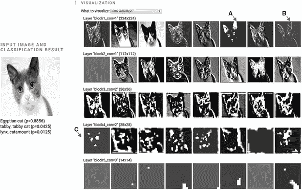

在内部激活中你可能注意到的第一件事是随着网络的深入，它们与原始输入的差异越来越大。较早的层（例如`block1_conv1`）似乎编码相对简单的视觉特征，例如边缘和颜色。例如，标记为“A”的箭头指向一个似乎响应黄色和粉色的内部激活。标记为“B”的箭头指向一个似乎与输入图像中某些方向的边缘有关的内部激活。

但是，后面的层（比如`block4_conv2`和`block5_conv3`）显示出越来越多地与输入图像中简单的像素级特征不相关的激活模式。例如，图 7.8 中标记为“C”的箭头指向`block4_ conv2`中的一个滤波器，它似乎对猫的面部特征进行编码，包括耳朵、眼睛和鼻子。这是我们在第四章的图 4.6 中用示意图展示的逐渐特征提取的具体示例。但请注意，并非所有后续层中的滤波器都能用简单的方式用语言解释清楚。另一个有趣的观察是，激活图的“稀疏性”也随着层的深度增加而增加：在图 7.8 中显示的第一层中，所有滤波器都被输入图像激活（显示出非常量像素模式）；然而，在最后一层中，一些滤波器变为空白（常量像素模式；例如，参见图 7.8 右面板的最后一行）。这意味着由那些空白滤波器编码的特征在这个特定的输入图像中是不存在的。

您刚刚目睹了深度卷积神经网络学习到的表示的一个重要的普遍特征：通过层提取的特征随着层的深度越来越抽象。深层的激活承载着越来越少关于输入细节的信息，越来越多关于目标的信息（在本例中是图像属于 1,000 个 ImageNet 类别中的哪一个）。因此，深度神经网络有效地充当着一个 *信息蒸馏管道*，原始数据进入并被重复地转换，以便过滤掉任务无关的方面，并逐渐放大和精炼对任务有用的方面。即使我们通过一个卷积神经网络的例子展示了这一点，但这个特征对其他深度神经网络（如 MLPs）也是成立的。

卷积神经网络发现有用的输入图像方面可能与人类视觉系统发现的有用方面不同。卷积神经网络的训练受到数据驱动，因此容易受到训练数据的偏见影响。例如，在本章末尾“进一步阅读和探索材料”部分列出的 Marco Ribeiro 和同事的论文指出了一个案例，在这个案例中，由于背景中有雪的存在，一张狗的图像被误分类为狼，这可能是因为训练图像中包含了狼在雪地背景下的实例，但没有包含类似背景下的狗的实例。

通过可视化深度卷积神经网络的内部激活模式，我们获得了这些有用的见解。下一小节描述了如何在 TensorFlow.js 中编写代码来提取这些内部激活。

##### 深入了解如何提取内部激活

提取内部激活的步骤封装在 `writeInternalActivationAndGetOutput()` 函数中（清单 7.8）。它以已经构建或加载的 TensorFlow.js 模型对象和相关层的名称（`layerNames`）作为输入。关键步骤是创建一个新的模型对象（`compositeModel`），其中包括指定层的输出和原始模型的输出。 `compositeModel` 使用 `tf.model()` API 构建，就像你在 第五章 的 Pac-Man 和简单物体检测示例中看到的一样。关于 `compositeModel` 的好处在于它的 `predict()` 方法返回所有层的激活，以及模型的最终预测（参见名为 `outputs` 的 `const`）。清单 7.8 中的其余代码（来自 visualize-convnet/main.js）是关于将层的输出拆分为单独的滤波器并将它们写入磁盘文件的更加平凡的任务。

##### 清单 7.8\. 在 Node.js 中计算卷积神经网络的内部激活

```js
async function writeInternalActivationAndGetOutput(
    model, layerNames, inputImage, numFilters, outputDir) {
  const layerName2FilePaths = {};
  const layerOutputs =
      layerNames.map(layerName => model.getLayer(layerName).output);
  const compositeModel = tf.model(                                    ***1***
      {
        inputs: model.input,
       outputs: layerOutputs.concat(model.outputs[0])
      });

  const outputs = compositeModel.predict(inputImage);                 ***2***
  for (let i = 0; i < outputs.length - 1; ++i) {
    const layerName = layerNames[i];
    const activationTensors =                                         ***3***
        tf.split(outputs[i],
                outputs[i].shape[outputs[i].shape.length – 1],
                -1);
    const actualNumFilters = filters <= activationTensors.length ?
        numFilters :
        activationTensors.length;
    const filePaths = [];
    for (let j = 0; j < actualNumFilters; ++j) {
      const imageTensor = tf.tidy(                                    ***4***
          () => deprocessImage(tf.tile(activationTensors[j],
                              [1, 1, 1, 3])));
      const outputFilePath = path.join(
          outputDir, `${layerName}_${j + 1}.png`);
      filePaths.push(outputFilePath);
      await utils.writeImageTensorToFile(imageTensor, outputFilePath);
    }
    layerName2FilePaths[layerName] = filePaths;
    tf.dispose(activationTensors);
  }
  tf.dispose(outputs.slice(0, outputs.length - 1));
  return {modelOutput: outputs[outputs.length - 1], layerName2FilePaths};
}
```

+   ***1*** 构建一个模型，返回所有期望的内部激活，以及原始模型的最终输出

+   ***2*** 输出是包含内部激活和最终输出的 tf.Tensor 数组。

+   ***3*** 将卷积层的激活按滤波器进行拆分

+   ***4*** 格式化激活张量并将其写入磁盘

#### 7.2.2\. 可视化卷积层对哪些内容敏感：最大激活图像

另一种说明卷积网络学习内容的方式是找到其各种内部层对哪些输入图像敏感。我们所说的对某个输入图像敏感是指在输入图像下，滤波器输出的最大激活（在其输出高度和宽度维度上取平均）。

我们找到最大激活图像的方式是通过一种将“正常”的神经网络训练过程颠倒过来的技巧。图 7.9 的面板 A 简要显示了当我们使用 `tf.Model.fit()` 训练神经网络时会发生什么。我们冻结输入数据，并允许模型的权重（例如所有可训练层的核和偏差）通过反向传播从损失函数更新。但是，我们完全可以交换输入和权重的角色：我们可以冻结权重，并允许*输入*通过反向传播进行更新。同时，我们调整损失函数，使其导致反向传播以一种方式来微调输入，该方式最大化了某个卷积滤波器的输出，当在其高度和宽度维度上平均时。该过程在图 7.9 的面板 B 中示意，被称为*输入空间中的梯度上升*，与 typica 模型训练的基于*权重空间中的梯度下降*相对应。实现输入空间中的梯度下降的代码将在下一小节中展示，并可以供感兴趣的读者研究。

> ⁶
> 
> 这个图可以看作是图 2.9 的简化版本，我们在第二章中用它来介绍反向传播。

##### 图 7.9\. 示意图显示了通过输入空间中的梯度上升找到卷积滤波器的最大激活图像的基本思想（面板 B）以及与基于权重空间中的梯度下降的正常神经网络训练过程（面板 A）不同的地方。请注意，该图与先前显示的某些模型图有所不同，因为它将权重从模型中分离出来。这是为了突出两组可以通过反向传播更新的量：权重和输入。

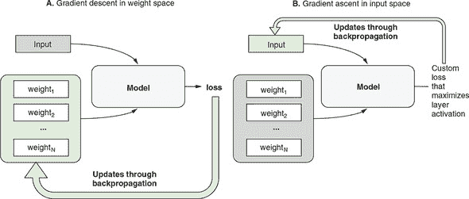

图 7.10 展示了在 VGG16 模型的四个卷积层上执行梯度上升输入空间过程的结果（与我们用来展示内部激活的相同模型）。与先前的插图一样，图层的深度从图的顶部到底部逐渐增加。从这些最大激活输入图像中可以得到一些有趣的模式：

+   首先，这些是彩色图像，而不是前面部分的灰度内部激活图像。这是因为它们的格式是卷积网络的实际输入：由三个（RGB）通道组成的图像。因此，它们可以显示为彩色。

+   最浅的层（`block1_conv1`）对全局颜色值和带有特定方向的边缘等简单模式敏感。

+   中间深度层（如`block2_conv1`）对由不同边缘模式组合而成的简单纹理做出最大响应。

+   在较深层的滤波器开始响应更复杂的模式，这些模式在某种程度上与自然图像中的视觉特征（当然是来自 ImageNet 训练数据）相似，例如颗粒、孔洞、彩色条纹、羽毛、波纹等。

##### 图 7.10. VGG16 深度卷积网络四个层的最大激活输入图像。这些图像是通过在输入空间中进行 80 次梯度上升计算得出来的。

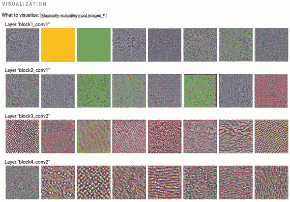

一般来说，随着层级的加深，模式从像素级逐渐变得更加复杂和大规模。这反映了深度卷积网络逐层对特征进行提炼，组合出各种模式。在分析同一层的滤波器时，尽管它们具有类似的抽象级别，但在详细模式上存在相当大的变化。这突显了每一层以互补的方式提出了同一输入的多种表示，以捕获尽可能多的有用信息，从而解决网络训练的任务。

##### 深入了解输入空间中的梯度上升

在可视化卷积网络的例子中，在 main.js 中的 `inputGradientAscent()` 函数中实现了输入空间中的梯度上升的核心逻辑，并且在 列表 7.9 中进行了展示。由于其耗时和占用内存，该代码运行在 Node.js 中。^([7]) 注意，尽管梯度上升在输入空间中的基本思想类似于基于权重空间的梯度下降的模型训练（参见 图 7.10），但我们不能直接重用 `tf.Model.fit()`，因为该函数专门冻结输入并更新权重。相反，我们需要定义一个自定义函数，该函数计算给定输入图像的“损失”。这就是该行定义的函数

> ⁷
> 
> 对于小于 VGG16 的卷积网络（如 MobileNet 和 MobileNetV2），可以在合理的时间内在 Web 浏览器中运行该算法。

```js
const lossFunction = (input) =>
        auxModel.apply(input, {training: true}).gather([filterIndex], 3);
```

这里，`auxModel`是一个使用熟悉的`tf.model()`函数创建的辅助模型对象。它具有与原始模型相同的输入，但输出给定卷积层的激活。我们调用辅助模型的`apply()`方法，以获得层激活的值。`apply()`类似于`predict()`，因为它执行模型的前向路径。但是，`apply()`提供了更细粒度的控制，例如将`training`选项设置为`true`，就像代码中前一行所做的那样。如果不将`training`设置为`true`，则不可能进行反向传播，因为默认情况下，前向传播会为内存效率而处置中间层激活。`training`标志中的`true`值使`apply()`调用保留这些内部激活，从而启用反向传播。`gather()`调用提取特定滤波器的激活。这是必要的，因为最大激活输入是根据每个过滤器逐个过滤器计算的，并且即使是相同层的过滤器之间的结果也会有所不同（请参见图 7.10 中的示例结果）。

一旦我们有了自定义损失函数，我们就将其传递给`tf.grad()`，以便获得一个给出损失相对于输入的梯度的函数：

```js
const gradFunction = tf.grad(lossFunction);
```

这里要注意的重要事情是，`tf.grad()`不直接给出梯度值；相反，它会在调用时返回一个函数（在前一行中称为`gradFunction`），该函数在调用时会返回梯度值。

一旦我们有了这个梯度函数，我们就在一个循环中调用它。在每次迭代中，我们使用它返回的梯度值来更新输入图像。这里的一个重要的不明显的技巧是在将梯度值加到输入图像之前对其进行归一化，这确保了每次迭代中的更新具有一致的大小：

```js
const norm = tf.sqrt(tf.mean(tf.square(grads))).add(EPSILON);
return grads.div(norm);
```

这个迭代更新输入图像的过程重复执行了 80 次，得到了我们在图 7.10 中展示的结果。

##### 列表 7.9\. 输入空间中的梯度上升（在 Node.js 中，来自 visualize-convnet/main.js）

```js
function inputGradientAscent(
    model, layerName, filterIndex, iterations = 80) {
  return tf.tidy(() => {
    const imageH = model.inputs[0].shape[1];
    const imageW = model.inputs[0].shape[2];
    const imageDepth = model.inputs[0].shape[3];

    const layerOutput = model.getLayer(layerName).output;

    const auxModel = tf.model({                                            ***1***
      inputs: model.inputs,                                                ***1***
     outputs: layerOutput                                                  ***1***
    });

    const lossFunction = (input) =>                                        ***2***
        auxModel.apply(input, {training: true}).gather([filterIndex], 3);  ***2***

    const gradFunction = tf.grad(lossFunction);                            ***3***

    let image = tf.randomUniform([1, imageH, imageW, imageDepth], 0, 1)    ***4***
                    .mul(20).add(128);                                     ***4***

    for (let i = 0; i < iterations; ++i) {
      const scaledGrads = tf.tidy(() => {
        const grads = gradFunction(image);
        const norm = tf.sqrt(tf.mean(tf.square(grads))).add(EPSILON);
        return grads.div(norm);                                            ***5***
      });
      image = tf.clipByValue(
               image.add(scaledGrads), 0, 255);                            ***6***
    }
    return deprocessImage(image);
  });
}
```

+   ***1*** 为原始模型创建一个辅助模型，其输入与原模型相同，但输出为感兴趣的卷积层

+   ***2*** 这个函数计算指定过滤器索引处的卷积层输出的值。

+   ***3*** 这个函数计算卷积滤波器输出相对于输入图像的梯度。

+   ***4*** 生成一个随机图像作为梯度上升的起始点

+   ***5*** 重要技巧：将梯度与梯度的大小（范数）相乘

+   ***6*** 执行一步梯度上升：沿着梯度方向更新图像

#### 7.2.3\. 卷积神经网络分类结果的视觉解释

我们将介绍的最后一个后训练卷积神经网络可视化技术是*类激活映射*（CAM）算法。CAM 旨在回答的问题是“输入图像的哪些部分对于导致卷积神经网络输出其顶部分类决策起到最重要的作用？”例如，当将 cat.jpg 图像传递给 VGG16 网络时，我们得到了一个“埃及猫”的顶级类别，概率分数为 0.89。但仅凭图像输入和分类输出，我们无法确定图像的哪些部分对于这个决定是重要的。肯定图像的某些部分（如猫的头部）必须比其他部分（例如白色背景）起到更重要的作用。但是否有一种客观的方法来量化任何输入图像的这一点？

答案是肯定的！有多种方法可以做到这一点，CAM 就是其中之一。^([8])给定一个输入图像和一个卷积神经网络的分类结果，CAM 会给出一个热图，为图像的不同部分分配重要性分数。图 7.11 展示了这样的 CAM 生成的热图叠加在三个输入图像上：一只猫，一只猫头鹰和两只大象。在猫的结果中，我们看到猫头的轮廓在热图中具有最高的值。我们可以事后观察到，这是因为轮廓揭示了动物头部的形状，这是猫的一个独特特征。猫头鹰图像的热图也符合我们的预期，因为它突出显示了动物的头部和翅膀。具有两只大象的图像的结果很有趣，因为该图像与其他两个图像不同，它包含了两只个体动物而不是一只。CAM 生成的热图为图像中的两只大象的头部区域分配了高重要性分数。热图明显倾向于聚焦于动物的鼻子和耳朵，这可能反映了长鼻子的长度和耳朵的大小对于区分非洲象（网络的顶级类别）和印度象（网络的第三类别）的重要性。

> ⁸
> 
> CAM 算法首次描述于 Bolei Zhou 等人的“为判别定位学习深度特征”，2016 年，[`cnnlocalization.csail.mit.edu/`](http://cnnlocalization.csail.mit.edu/)。另一个知名的方法是局部可解释的模型无关解释（LIME）。见[`mng.bz/yzpq`](http://mng.bz/yzpq)。

##### 图 7.11。VGG16 深度卷积神经网络的三个输入图像的类激活映射（CAMs）。CAM 热图叠加在原始输入图像上。

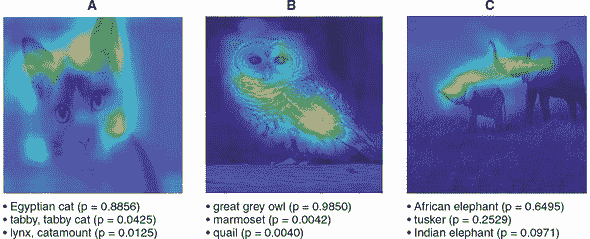

##### CAM 算法的技术方面

CAM 算法虽然强大，但其背后的思想实际上并不复杂。简而言之，CAM 图中的每个像素显示了如果增加该像素值一单位量，获胜类别的概率分数将发生多大变化。下面稍微详细介绍了 CAM 中涉及的步骤：

1.  找到卷积神经网络中最后一个（即最深的）卷积层。在 VGG16 中，这一层的名称为 `block5_conv3`。

1.  计算网络输出概率对于获胜类别相对于卷积层输出的梯度。

1.  梯度的形状为`[1, h, w, numFilters]`，其中`h`、`w`和`numFilters`分别是该层的输出高度、宽度和过滤器数量。然后，我们在示例、高度和宽度维度上对梯度进行平均，得到一个形状为`[numFilters]`的张量。这是一个重要性分数的数组，每个卷积层的过滤器都有一个。

1.  将重要性分数张量（形状为`[numFilters]`）与卷积层的实际输出值（形状为`[1, h, w, numFilters]`）进行乘法运算，并使用广播（参见 附录 B，第 B.2.2 节）。这给我们一个新的张量，形状为`[1, h, w, numFilters]`，是层输出的“重要性缩放”版本。

1.  最后，平均重要性缩放的层输出沿最后一维（过滤器）进行，并挤压掉第一维（示例），从而得到一个形状为`[h, w]`的灰度图像。该图像中的值是图像中每个部分对于获胜分类结果的重要程度的度量。然而，该图像包含负值，并且比原始输入图像的尺寸要小（例如，在我们的 VGG16 示例中为 14 × 14，而原始输入图像为 224 × 224）。因此，我们将负值归零，并在覆盖输入图像之前对图像进行上采样。

详细代码位于 visualize-convnet/main.js 中名为 `gradClassActivationMap()` 的函数中。尽管该函数默认在 Node.js 中运行，但它所涉及的计算量明显少于前一节中我们看到的在输入空间中进行梯度上升的算法。因此，您应该能够在浏览器中使用相同的代码运行 CAM 算法，并且速度可接受。

在本章中，我们讨论了两个问题：在训练机器学习模型之前如何可视化数据，以及在训练完成后如何可视化模型。我们有意地跳过了其中一个重要步骤——也就是在模型训练*过程中*对模型进行可视化。这将成为下一章的重点。我们之所以单独提出训练过程，是因为它与欠拟合和过拟合的概念和现象有关，对于任何监督学习任务来说，这些概念和现象都是至关重要的，因此值得特别对待。通过可视化，我们可以更容易地发现和纠正欠拟合和过拟合问题。在下一章中，我们将重新讨论在本章第一部分介绍的 tfjs-vis 库，并了解到它不仅可以用于数据可视化，还可以显示模型训练的进展情况。

### 进一步阅读和探索材料

+   Marco Tulio Ribeiro, Sameer Singh, and Carlos Guestrin，“为什么我应该相信你？解释任何分类器的预测”，2016 年，[`arxiv.org/pdf/1602.04938.pdf`](https://arxiv.org/pdf/1602.04938.pdf)。

+   TensorSpace ([tensorspace.org](http://tensorspace.org)) 使用动画 3D 图形在浏览器中可视化卷积神经网络的拓扑和内部激活。它构建在 TensorFlow.js、three.js 和 tween.js 之上。

+   TensorFlow.js tSNE 库 ([github.com/tensorflow/tfjs-tsne](http://github.com/tensorflow/tfjs-tsne)) 是基于 WebGL 的 t-distributed Stochastic Neighbor Embedding (tSNE) 算法的高效实现。它可以帮助您将高维数据集投影到 2D 空间中，同时保留数据中的重要结构。

### 练习

1.  尝试使用`tfjs.vis.linechart()`的以下功能：

    1.  修改 列表 7.2 中的代码，看看当要绘制的两个系列具有不同的 x 坐标值集合时会发生什么。例如，尝试将第一个系列的 x 坐标值设置为 1、3、5 和 7，将第二个系列的 x 坐标值设置为 2、4、6 和 8。您可以从 [`codepen.io/tfjs-book/pen/BvzMZr`](https://codepen.io/tfjs-book/pen/BvzMZr) 上分叉并修改 CodePen。

    1.  在示例 CodePen 中的线图中，所有的数据系列都是由没有重复 x 坐标值的数据点组成的。了解一下 `linechart()` 函数如何处理具有相同 x 坐标值的数据点。例如，在数据系列中，包括两个具有相同 x 值（例如-5 和 5）的数据点。

1.  在 "visualize-convnet" 的例子中，使用 `yarn visualize` 命令的 `--image` 标志来指定自己的输入图片。由于我们在第 7.2 节中仅使用了动物图片，请尝试探索其他类型的图片内容，例如人物、车辆、家居物品和自然风景。看看你能从内部激活和 CAM 中获得什么有用的见解。

1.  在我们计算 VGG16 的 CAM 的示例中，我们计算了相对于最后一个卷积层输出的 *胜利* 类别的概率分数的梯度。如果我们计算 *非胜利* 类别（例如较低概率的类别）的梯度会怎样？我们应该期望生成的 CAM 图像 *不* 强调属于图像实际主题的关键部分。通过修改 visualize-convnet 示例的代码并重新运行确认这一点。具体来说，梯度将计算的类索引作为参数传递给 `gradClassActivationMap()` 函数在 visualize-convnet/cam.js 中。该函数在 visualize-convnet/main.js 中调用。

### 摘要

+   我们学习了 tfjs-vis 的基本用法，这是一个与 TensorFlow.js 紧密集成的可视化库。它可以用于在浏览器中呈现基本类型的图表。

+   数据可视化是机器学习不可或缺的一部分。对数据进行高效有效的呈现可以揭示模式并提供否则难以获得的见解，正如我们通过使用 Jena-weather-archive 数据所展示的那样。

+   丰富的模式和见解可以从训练好的神经网络中提取出来。我们展示了

    +   可视化深度卷积网络的内部层激活。

    +   计算哪些层对最大程度响应。

    +   确定输入图像的哪些部分与 convnet 的分类决策最相关。这些帮助我们了解 convnet 学到了什么以及在推断过程中它是如何运作的。
