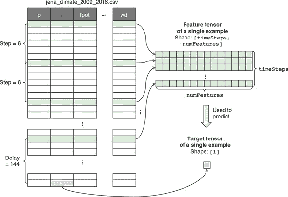
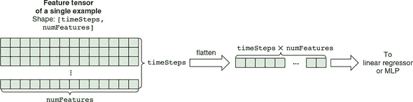
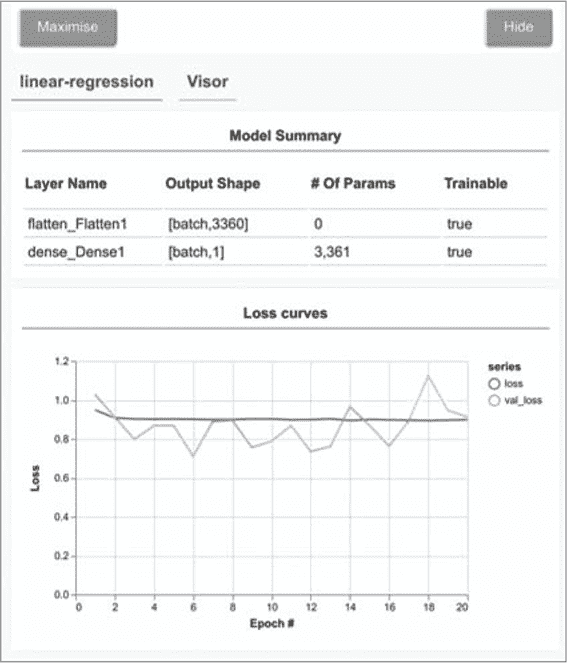
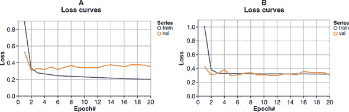
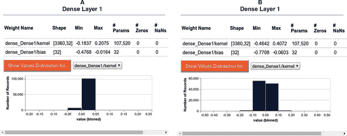
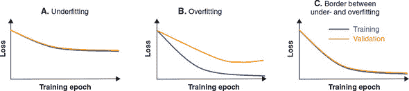

## 第八章：欠拟合、过拟合和机器学习的通用工作流程

*本章内容*

+   为什么可视化模型训练过程很重要，以及要注意的重要事项

+   如何可视化和理解欠拟合和过拟合

+   处理过拟合的主要方式：正则化，以及如何可视化其效果

+   机器学习的通用工作流程是什么，包括哪些步骤，以及为什么它是指导所有监督式机器学习任务的重要配方

在上一章中，您学习了如何使用 tfjs-vis 在开始设计和训练机器学习模型之前可视化数据。本章将从那一章结束的地方开始，并描述 tfjs-vis 如何用于在模型训练过程中可视化模型的结构和指标。这样做的最重要目标是发现 *欠拟合* 和 *过拟合* 这两个至关重要的现象。一旦我们能够发现它们，我们将深入研究如何解决它们以及如何使用可视化验证我们的解决方法是否有效。

### 8.1。温度预测问题的制定

为了演示欠拟合和过拟合，我们需要一个具体的机器学习问题。我们将使用的问题是根据您在上一章中刚刚看到的 Jena-weather 数据集来预测温度。第 7.1 节展示了在浏览器中可视化数据的威力以及使用 Jena-weather 数据集进行此操作的好处。希望您通过在前一节中玩弄可视化 UI 来形成对数据集的直觉。我们现在准备好开始对数据集应用一些机器学习了。但首先，我们需要定义问题。

预测任务可以被看作是一个玩具天气预报问题。我们试图预测的是在某一时刻之后 24 小时的温度。我们试图使用在此前 10 天内进行的 14 种天气测量来进行此预测。

虽然问题定义很简单，但我们从 CSV 文件生成训练数据的方式需要进行一些仔细的解释，因为它与此前在本书中看到的问题的数据生成过程有所不同。在那些问题中，原始数据文件中的每一行都对应一个训练样例。这就是鸢尾花、波士顿房价和钓鱼检测示例的工作方式（见第二章和第三章）。然而，在这个问题中，每个示例是通过从 CSV 文件中对多行进行采样和组合而形成的。这是因为温度预测不仅仅是通过查看某一时刻的数据来进行的，而是通过查看一段时间内的数据来进行的。请参见图 8.1 以了解示例生成过程的示意图。

##### 图 8.1\. 示意图显示了如何从表格数据中生成单个训练样本。为了生成示例的特征张量，从 CSV 文件中每隔`step`行采样一次（例如，`step = 6`），直到采样到`timeSteps`行为止（例如，`timeSteps = 240`）。这形成了一个形状为`[timeSteps, numFeatures]`的张量，其中`numFeatures`（默认为 14）是 CSV 文件中特征列的数量。为了生成目标，从进入特征张量的最后一行后延迟（例如，144）步采样温度（`T`）值。可以通过从 CSV 文件的不同行开始来生成其他示例，但它们遵循相同的规则。这构成了温度预测问题：给定某一段时间（例如，10 天）内的 14 个天气测量值，预测从现在开始的一定延迟（例如，24 小时）内的温度。在`jena-weather/data.js`中的`getNextBatchFunction()`函数中实现了此图中所示的代码。



为了生成训练示例的特征，我们在 10 天的时间跨度内对一组行进行采样。我们不使用这 10 天内的所有数据行，而是每隔六行进行一次采样。为什么？有两个原因。首先，对所有行进行采样会给我们带来六倍的数据，并导致更大的模型大小和更长的训练时间。其次，以 1 小时为时间尺度的数据存在很多冗余性（6 小时前的气压通常接近于 6 小时零 10 分钟前的气压）。通过丢弃五分之一的数据，我们可以获得一个更轻量级和性能更好的模型，而不会牺牲太多的预测能力。采样的行被合并成了一个 2D 特征张量，形状为`[timeSteps, numFeatures]`，用于我们的训练示例（参见图 8.1）。默认情况下，`timeSteps`的值为 240，对应于在 10 天期间均匀分布的 240 个采样时间。`numFeatures`为 14，对应于 CSV 数据集中可用的 14 个气象仪读数。

获取训练示例的目标更容易：我们只需从进入特征张量的最后一行向前移动一定的时间延迟，并从温度列中提取值。图 8.1 显示了仅生成单个训练示例的方式。要生成多个训练示例，我们只需从 CSV 文件的不同行开始。

您可能已经注意到我们温度预测问题的特征张量（参见图 8.1）有些奇怪：在所有以前的问题中，单个示例的特征张量是 1D 的，当多个示例被批处理时，会得到 2D 张量。然而，在这个问题中，单个示例的特征张量已经是 2D 的，这意味着当我们将多个示例组合成批处理时，我们将获得一个 3D 张量（形状为`[batchSize, timeSteps, numFeatures]`）。这是一个敏锐的观察！2D 特征张量形状源于特征来自一系列事件的事实。特别是，它们是在 240 个时间点上采集的天气测量值。这将此问题与到目前为止您所看到的所有其他问题区分开来，其中给定示例的输入特征不涵盖多个时间点，无论是鸢尾花问题中的花大小测量还是 MNIST 图像中的 28×28 像素值。[¹]

> ¹
> 
> 在第四章的语音命令识别问题实际上涉及到一系列事件：即形成频谱图的连续音频帧。然而，我们的方法论将整个频谱图视为图像，从而通过将其视为空间维度来忽略了问题的时间维度。

这是本书中你第一次遇到顺序输入数据。在下一章中，我们将深入探讨如何在 TensorFlow.js 中构建专业化和更强大的模型（RNNs）来处理顺序数据。但在这里，我们将使用我们已经了解的两种模型来解决问题：线性回归器和 MLPs。这为我们学习 RNNs 铺平了道路，并为我们提供了可以与更高级模型进行比较的基线。

在 jena-weather/data.js 中实现了图 8.1 所示数据生成过程的实际代码，在函数`getNextBatchFunction()`下。这是一个有趣的函数，因为它不是返回一个具体的值，而是返回一个包含名为`next()`的函数的对象。当调用`next()`函数时，它会返回实际的数据值。具有`next()`函数的对象称为*迭代器*。为什么我们使用这种间接方式而不是直接编写迭代器呢？首先，这符合 JavaScript 的生成器/迭代器规范。[²]我们将很快将其传递给`tf.data.generator()`API，以便为模型训练创建数据集对象。API 需要此函数签名。其次，我们的迭代器需要可配置；返回迭代器的函数是启用配置的一种好方法。

> ²
> 
> 请参阅“迭代器和生成器”，MDN web 文档，[`mng.bz/RPWK`](http://mng.bz/RPWK)。

您可以从`getNextBatchFunction()`的签名中看到可能的配置选项：

```js
getNextBatchFunction(
      shuffle, lookBack, delay, batchSize, step, minIndex, maxIndex,
          normalize,
      includeDateTime)
```

有相当多的可配置参数。例如，您可以使用 `lookBack` 参数来指定在进行温度预测时要向后查看多长时间段。您还可以使用 `delay` 参数来指定温度预测将来要做出的时间。`minIndex` 和 `maxIndex` 参数允许您指定要从中提取数据的行范围等。

我们通过将 `getNextBatchFunction()` 函数传递给 `tf.data.generator()` 函数，将其转换为 `tf.data.Dataset` 对象。正如我们在第六章中所描述的，当与 `tf.Model` 对象的 `fitDataset()` 方法一起使用时，`tf.data.Dataset` 对象能够使我们即使数据过大而无法一次性装入 WebGL 内存（或任何适用的后备内存类型）也能训练模型。`Dataset` 对象将仅当即将进入训练时才在 GPU 上创建批量训练数据。这正是我们在这里为温度预测问题所做的。实际上，由于示例的数量和大小过大，我们无法使用普通的 `fit()` 方法来训练模型。`fitDataset()` 调用可以在 jena-weather/models.js 中找到，看起来像以下列表。

##### 列表 8.1。使用 tfjs-vis 对基于 `fitDataset` 的模型进行可视化训练

```js
    const trainShuffle = true;
    const trainDataset = tf.data.generator(               ***1***
        () => jenaWeatherData.getNextBatchFunction(
          trainShuffle, lookBack, delay, batchSize, step, TRAIN_MIN_ROW,
          TRAIN_MAX_ROW, normalize, includeDateTime)).prefetch(8);
    const evalShuffle = false;
    const valDataset = tf.data.generator(                 ***2***
      () => jenaWeatherData.getNextBatchFunction(
          evalShuffle, lookBack, delay, batchSize, step, VAL_MIN_ROW,
          VAL_MAX_ROW, normalize, includeDateTime));

      await model.fitDataset(trainDataset, {
      batchesPerEpoch: 500,
      epochs,
      callbacks: customCallback,
      validationData: valDataset                          ***3***
    });
```

+   ***1*** 第一个 Dataset 对象将生成训练数据。

+   ***2*** 第二个 Dataset 对象将生成验证数据。

+   ***3*** 用于 `fitDataset()` 的 validationData 配置可以接受 Dataset 对象或一组张量。这里使用了第一个选项。

`fitDataset()`的配置对象的前两个字段指定了模型训练的时期数量和每个时期抽取的批次数量。正如您在第六章中学到的那样，它们是 `fitDataset()` 调用的标准配置字段。然而，第三个字段 (`callbacks: customCallback`) 是新内容。这是我们可视化训练过程的方式。我们的 `customCallback` 根据模型训练是在浏览器中进行还是（正如我们将在下一章中看到的）在 Node.js 中进行，而取不同的值。

在浏览器中，`tfvis.show.fitCallbacks()` 函数提供 `customCallback` 的值。该函数帮助我们通过只需一行 JavaScript 代码在网页中可视化模型训练。它不仅省去了我们访问并跟踪逐批次和逐时期的损失和指标值的所有工作，而且也消除了手动创建和维护将呈现图表的 HTML 元素的需要：

```js
  const trainingSurface =
      tfvis.visor().surface({tab: modelType, name: 'Model Training'});
   const customCallback = tfvis.show.fitCallbacks(trainingSurface,
      ['loss', 'val_loss'], {
     callbacks: ['onBatchEnd', 'onEpochEnd']
   }));
```

`fitCallbacks()`的第一个参数指定了一个由`tfvis.visor().surface()`方法创建的渲染区域，这在 tfjs-vis 的术语中被称为*visor surface*。Visor 是一个容器，可以帮助你方便地组织所有与浏览器机器学习任务相关的可视化内容。在结构上，Visor 有两个层次的层次结构。在较高的层次上，用户可以使用点击来导航一个或多个选项卡。在较低的级别上，每个选项卡都包含一个或多个*surfaces*。`tfvis.visor().surface()`方法通过其`tab`和`name`配置字段，允许你在指定的 Visor 选项卡上以指定的名称创建一个表面。Visor surface 不仅限于渲染损失和度量曲线。实际上，我们在第 7.1 节的 CodePen 示例中展示的所有基本图表都可以渲染在 visor surfaces 上。我们将在本章末尾留下这个问题作为练习。

`fitCallbacks()`的第二个参数指定了在 visor surface 上渲染的损失和度量。在这种情况下，我们绘制了训练和验证数据集的损失。第三个参数包含一个字段，控制绘图更新的频率。通过同时使用`onBatchEnd`和`onEpochEnd`，我们将在每个批次和每个 epoch 结束时获得更新。在下一节中，我们将检查`fitCallbacks()`创建的损失曲线，并使用它们来发现欠拟合和过拟合。

### 8.2\. 欠拟合、过拟合和对策

在训练机器学习模型期间，我们希望监控我们的模型在训练数据中捕捉到的模式。一个无法很好地捕捉模式的模型被称为*欠拟合*；一个捕捉模式过于完美，以至于它学到的内容在新数据上泛化能力较差的模型被称为*过拟合*。可以通过正则化等对策来使过拟合的模型恢复正常。在本节中，我们将展示可视化如何帮助我们发现这些模型行为以及对策的影响。

#### 8.2.1\. 欠拟合

要解决温度预测问题，让我们首先尝试最简单的机器学习模型：线性回归器。清单 8.2（来自 jena-weather/index.js）中的代码创建了这样一个模型。它使用一个具有单个单位和默认线性激活的密集层来生成预测。然而，与我们在第二章中为下载时间预测问题构建的线性回归器相比，此模型多了一个展平层。这是因为这个问题中特征张量的形状是 2D 的，必须被展平为 1D，以满足用于线性回归的密集层的要求。这个展平过程在图 8.2 中有所说明。重要的是要注意，这个展平操作丢弃了关于数据顺序（时间顺序）的信息。

##### 图 8.2\. 将形状为`[timeSteps, numFeatures]`的 2D 特征张量展平为形状为`[timeSteps × numFeatures]`的 1D 张量，正如清单 8.2 中的线性回归器和清单 8.3 中的 MLP 模型所做的那样



##### 清单 8.2\. 为温度预测问题创建一个线性回归模型

```js
function buildLinearRegressionModel(inputShape) {
  const model = tf.sequential();
  model.add(tf.layers.flatten({inputShape}));        ***1***
  model.add(tf.layers.dense({units: 1}));            ***2***
  return model;
}
```

+   ***1*** 将[batchSize, timeSteps, numFeatures]输入形状压平为[batchSize, timeSteps * numFeatures]，以应用密集层

+   ***2*** 带有默认（线性）激活的单单元密集层是一个线性回归器。

一旦模型构建完成，我们就为训练编译它

```js
model.compile({loss: 'meanAbsoluteError', optimizer: 'rmsprop'});
```

这里，我们使用损失函数`meanAbsoluteError`，因为我们的问题是预测一个连续值（标准化温度）。与之前的一些问题不同，没有定义单独的度量标准，因为 MAE 损失函数本身就是人可解释的度量标准。但是，请注意，由于我们正在预测*标准化*温度，MAE 损失必须乘以温度列的标准差（8.476 摄氏度），以将其转换为绝对误差的预测。例如，如果我们得到的 MAE 为 0.5，那么它就相当于 8.476 * 0.5 = 4.238 摄氏度的预测误差。

在演示界面中，选择模型类型下拉菜单中的线性回归，并单击“训练模型”以开始训练线性回归器。训练开始后，您将立即在页面右侧弹出的“卡片”中看到模型的表格摘要（请参阅图 8.3 中的屏幕截图）。这个模型摘要表在某种程度上类似于`model.summary()`调用的文本输出，但在 HTML 中以图形方式呈现。创建表的代码如下：

```js
    const surface = tfvis.visor().surface({name: 'Model Summary', tab});
    tfvis.show.modelSummary(surface, model);
```

##### 图 8.3\. tfjs-vis 可视化线性回归模型的训练。上图：模型的摘要表。下图：20 次训练时的损失曲线。此图是使用`tfvis.show .fitCallbacks()`创建的（请参阅 jena-weather/index.js）。



创建了表面后，我们通过将表面传递给`tfvis.show.modelSummary()`来在其中绘制一个模型摘要表，就像前一个代码片段的第二行那样。

在线性回归选项卡的模型摘要部分下，有一个显示模型训练的损失曲线的图表（图 8.3）。它是由我们在上一节中描述的 `fitCallbacks()` 调用创建的。从图中，我们可以看到线性回归器在温度预测问题上的表现如何。训练损失和验证损失最终都在 0.9 左右波动，这对应于绝对值为 8.476 * 0.9 = 7.6 摄氏度（请记住，8.476 是 CSV 文件中温度列的标准偏差）。这意味着在训练后，我们的线性回归器平均预测误差为 7.6 摄氏度（或 13.7 华氏度）。这些预测相当糟糕。没有人会想要依靠这个模型进行天气预报！这是一个*欠拟合*的例子。

欠拟合通常是由于使用不足的表示能力（功率）来建模特征-目标关系而导致的。在这个例子中，我们的线性回归器结构太简单，因此无法捕获前 10 天的天气数据与第二天温度之间的关系。为了克服欠拟合，我们通常通过使模型更强大来增加模型的功率。典型的方法包括向模型添加更多的层（具有非线性激活）和增加层的大小（例如，在密集层中的单位数）。所以，让我们向线性回归器添加一个隐藏层，看看我们能从结果 MLP 中获得多少改进。

#### 8.2.2\. 过拟合

创建 MLP 模型的函数位于列表 8.3（来自 jena-weather/index.js）。它创建的 MLP 包括两个密集层，一个作为隐藏层，一个作为输出层，另外还有一个扁平层，其作用与线性回归模型中的相同。您可以看到，与 列表 8.2 中的 `buildLinearRegressionModel()` 相比，该函数有两个额外的参数。特别是，`kernelRegularizer` 和 `dropoutRate` 参数是我们稍后将用来对抗过拟合的方法。现在，让我们看看一个不使用 `kernelRegularizer` 或 `dropoutRate` 的 MLP 能够达到什么样的预测准确度。

##### 列表 8.3\. 为温度预测问题创建 MLP

```js
function buildMLPModel(inputShape, kernelRegularizer, dropoutRate) {
  const model = tf.sequential();
  model.add(tf.layers.flatten({inputShape}));
  model.add(tf.layers.dense({
    units: 32,
    kernelRegularizer                            ***1***
    activation: 'relu',
  }));
  if (dropoutRate > 0) {
    model.add(tf.layers.dropout({rate: dropoutRate}));
  }
  model.add(tf.layers.dense({units: 1}));       ***2***
  return model;
}
```

+   ***1*** 如果由调用者指定，则向隐藏的密集层的内核添加正则化。

+   ***2*** 如果由调用者指定，则在隐藏的密集层和输出密集层之间添加一个 dropout 层。

图 8.4 的面板 A 显示了 MLP 的损失曲线。与线性回归器的损失曲线相比，我们可以看到一些重要的区别：

+   训练和验证损失曲线呈现出发散的模式。这与 图 8.3 中的模式不同，其中两个损失曲线呈现出基本一致的趋势。

+   训练损失收敛到比之前低得多的错误。经过 20 个周期的训练，训练损失约为 0.2，对应于误差为 8.476 * 0.2 = 1.7 摄氏度——比线性回归的结果要好得多。

+   然而，验证损失在前两个周期内短暂下降，然后开始缓慢上升。到第 20 个周期结束时，它的值明显高于训练损失（0.35，约为 3 摄氏度）。

##### 图 8.4\. 两种不同 MLP 模型在温度预测问题上的损失曲线。面板 A：没有任何正则化的 MLP 模型。面板 B：与面板 A 中模型相同层大小和数量的 MLP 模型，但是具有密集层核的 L2 正则化。请注意，两个面板之间的 y 轴范围略有不同。



相对于之前的结果，训练损失的四倍以上的减少是由于我们的 MLP 比线性回归模型具有更高的能力，这得益于一个更多的层和几倍于线性回归模型的可训练权重参数。然而，增加的模型能力带来了一个副作用：它导致模型在训练数据上拟合得比验证数据（模型在训练过程中没有看到的数据）显着好。这是*过拟合*的一个例子。这是一种情况，其中模型对训练数据中的不相关细节“过于关注”，以至于模型的预测开始对未见数据的泛化能力变差。

#### 8.2.3\. 使用权重正则化减少过拟合并可视化其工作

在 第四章 中，我们通过向模型添加 dropout 层来减少卷积神经网络的过拟合。在这里，让我们看另一种经常使用的减少过拟合的方法：向权重添加正则化。在 Jena-weather 演示 UI 中，如果选择具有 L2 正则化的 MLP 模型，底层代码将通过以下方式调用 `buildMLPModel()` 来创建 MLP（列表 8.3）：

```js
model = buildMLPModel(inputShape, tf.regularizers.l2());
```

第二个参数——`tf.regularizers.l2()` 的返回值——是一个 *L2 正则化器*。通过将上述代码插入 列表 8.3 中的 `buildMLPModel()` 函数中，您可以看到 L2 正则化器进入隐藏的密集层配置的 `kernelRegularizer`。这将 L2 正则化器附加到密集层的内核上。当一个权重（例如密集层的内核）有一个附加的正则化器时，我们称该权重是*正则化的*。同样，当模型的一些或全部权重被正则化时，我们称该模型为正则化的。

正则化器对于稠密层的`kernel`和它所属的 MLP 有什么作用呢？它会在损失函数中添加一个额外的项。来看看未经正则化的 MLP 的损失如何计算：它简单地定义为目标和模型预测之间的 MAE。伪代码如下：

```js
loss = meanAbsoluteError(targets, predictions)
```

在加入正则化后，模型的损失函数会包含一个额外的项。伪代码如下：

```js
loss = meanAbsoluteError(targets, prediciton) + 12Rate * 12(kernel)
```

在这里，`l2Rate * l2(kernel)`是损失函数中额外的 L2 正则化项。与 MAE 不同，这个项不依赖于模型的预测结果，而是仅与被正则化的`kernel`（一层的权重）有关。给定`kernel`的值，它输出一个只与`kernel`的值相关的数值。可以将这个数值看作是当前`kernel`值的不理想程度的度量。

现在让我们来看一下 L2 正则化函数`l2(kernel)`的详细定义：它计算所有权重值的平方和。举个例子，假设为了简单起见，我们的`kernel`的形状很小，为`[2, 2]`，其值为`[[0.1, 0.2], [-0.3, -0.4]]`，那么，

```js
l2(kernel) = 0.1² + 0.2² + (-0.3)² + (-0.4)² = 0.3
```

因此，`l2(kernel)`始终返回一个正数，对`kernel`中的大权重值进行惩罚。在总的损失函数中加入这个项，会鼓励`kernel`的所有元素在绝对值上都变得更小，其他条件保持不变。

现在总的损失函数包含两个不同的项：目标预测不匹配项和与`kernel`大小有关的项。因此，训练过程不仅会尽量减少目标预测不匹配项，还会减少`kernel`元素平方和。通常情况下，这两个目标会相互冲突。例如，减小`kernel`元素大小可能会减小第二个项，但会增加第一个项（均方误差损失）。总的损失函数是如何平衡这两个相互冲突的项的相对重要性的？这就是`l2Rate`乘子发挥作用的地方。它量化了 L2 项相对于目标预测误差项的重要性。`l2Rate`的值越大，训练过程就越倾向于减少 L2 正则化项，但会增加目标预测误差。这个参数的默认值是`1e-3`，可以通过超参数优化进行调整。

L2 正则化如何帮助我们？ 图 8.4B 展示了经过正则化的 MLPs 的损失曲线。通过与未经正则化的 MLPs 的曲线（图 8.4A）进行比较，您可以看到使用正则化的模型产生了较少的训练和验证损失曲线。这意味着模型不再“过度关注”训练数据集中的偶发模式，而是从训练集中学到的模式可以很好地推广到验证集中看不见的例子。在我们的经过正则化的 MLPs 中，只有第一个密集层加入了正则化，而第二个密集层没有。但这足以克服这种过拟合情况。在下一节中，我们将更深入地探讨为什么较小的卷积核值会降低过拟合。

##### 可视化正则化对权值的影响

由于 L2 正则化通过鼓励隐藏的 dense 层中的卷积核具有更小的值来起作用，因此我们应该看到经过训练后的 MLPs 中，使用正则化的模型的卷积核的值更小。在 TensorFlow.js 中，我们可以使用 tfjs-vis 库的 `tfvis.show.layer()` 函数实现这一点。代码清单 8.4 展示了如何使用该函数可视化 TensorFlow.js 模型的权重。该代码在 MLP 模型训练结束时执行。`tfvis.show.layer()` 函数接受两个参数：可视化器上的渲染和要渲染的层。

##### 代码清单 8.4。展示层权值分布的可视化代码（来自 jena-weather/index.js）

```js
function visualizeModelLayers(tab, layers, layerNames) {
  layers.forEach((layer, i) => {
    const surface = tfvis.visor().surface({name: layerNames[i], tab});
    tfvis.show.layer(surface, layer);
  });
}
```

代码生成的可视化结果见图 8.5。A 和 B 两图分别展示了使用未经正则化和经过正则化的 MLPs 的结果。每个图中，`tfvis.show.layer()` 函数展示了该层的权值表格，其中包括权值的名称、形状和参数数量、参数值的最小/最大值，以及零值和 NaN 值的数量（最后一个参数可以用于诊断训练过程中出现的问题）。此外，该层的可视化界面还包含了每个权值的值分布展示按钮。当点击此按钮时，它将创建权值的值的直方图。

##### 图 8.5。正则化和未正则化情况下卷积核的值的分布。A 和 B 两幅图分别展示了经过/未经过 L2 正则化的 MLPs 的结果。该可视化结果基于 `tfvis.show.layer()` 函数生成。请注意两个直方图的 x 轴比例不同。



通过比较两个 MLPs 的绘图，可以看到明显差异：使用 L2 正则化的情况下，卷积核的值分布范围要比未经正则化的情况窄得多。这也反映在最小值和最大值（第一行）以及值的直方图中。这就是正则化的作用！

为什么较小的核值会导致减少过拟合和改善泛化呢？理解这一点的直观方法是 L2 正则化强制执行奥卡姆剃刀原则。一般来说，权重参数中的较大幅度倾向于导致模型拟合到它看到的训练特征中的细微细节，而较小幅度则倾向于让模型忽略这些细节。在极端情况下，核值为零意味着模型根本不关注其对应的输入特征。L2 正则化鼓励模型通过避免大幅度的权重值来更“经济地”运行，并且仅在值得成本的情况下保留这些值（当减少目标预测不匹配项的损失超过正则化损失时）。

L2 正则化只是机器学习从业者工具库中针对过拟合的其中一种武器。在第四章中，我们展示了辍学层的强大威力。辍学是一种对抗过拟合的强大措施。它同样帮助我们减少了这个温度预测问题中的过拟合。你可以通过在演示 UI 中选择带有辍学的 MLP 模型类型来自己看到这一点。辍学启用的 MLP 所获得的训练质量与 L2 正则化的 MLP 相媲美。当我们将其应用于 MNIST 卷积网络时，我们在第 4.3.2 节讨论了辍学是如何以及为什么起作用的，因此我们在这里不再赘述。然而，表 8.1 提供了对抗过拟合最常用的快速概述。它包括了每种方法如何工作的直观描述以及 TensorFlow.js 中对应的 API。对于特定问题使用哪种对抗过拟合的方法的问题通常通过以下两种方式回答：1）遵循解决类似问题的成熟模型；2）将对抗过拟合方法视为一个超参数，并通过超参数优化来搜索它（第 3.1.2 节）。此外，每种减少过拟合的方法本身都包含可调参数，这些参数也可以通过超参数优化确定（参见表 8.1 的最后一列）。

##### 表 8.1\. TensorFlow.js 中常用的减少过拟合方法概览

| 方法名称 | 方法如何工作 | TensorFlow.js 中的对应 API | 主要自由参数 |
| --- | --- | --- | --- |
| L2 正则化器 | 通过计算权重的参数值的平方和来对权重分配正的损失（惩罚）。它鼓励权重具有较小的参数值。 | tf.regularizers.l2() 例如，见“使用权重正则化减少过拟合”部分。 | L2-正则化率 |
| L1 正则化器 | 类似于 L2 正则化器，鼓励权重参数更小。但是，它对权重的损失基于参数的*绝对值之和*，而不是平方和。这种正则化损失的定义导致更多的权重参数变为零（即“更稀疏的权重”）。 | tf.regularizers.l1() | L1 正则化率 |
| 组合 L1-L2 正则化器 | L1 和 L2 正则化损失的加权和。 | tf.regularizers.l1l2() | L1 正则化率 L2 正则化率 |
| 丢弃 | 在训练过程中随机将一部分输入设为零（但在推断过程中不设为零），以打破在训练过程中出现的权重参数之间的虚假相关性（或“阴谋”）。 | tf.layers.dropout() 例如，请参阅 4.3.2 节。 | 丢弃率 |
| 批量归一化 | 在训练过程中学习其输入值的均值和标准差，并使用所学统计数据将输入归一化为零均值和单位标准差。 | tf.layers.batchNormalization() | 各种（参见 [`js.tensorflow.org/api/latest/#layers.batchNormalization`](https://js.tensorflow.org/api/latest/#layers.batchNormalization)） |
| 基于验证集损失的早期停止训练 | 当验证集上的每个周期结束时损失值不再减少时，停止模型训练。 | tf.callbacks.earlyStopping() | minDelta：忽略更改的阈值 patience：最多容忍连续几个周期的无改善 |

在本节关于可视化欠拟合和过拟合的总结中，我们提供了一个简略图表，以快速判断这些状态（图 8.6）。如面板 A 所示，欠拟合是指模型达到次优（高）损失值的状态，无论是在训练集还是验证集上。在面板 B 中，我们看到了典型的过拟合模式，其中训练损失看起来相当令人满意（低），但是验证损失较差（更高）。即使训练集损失继续下降，验证损失也可能趋于平稳甚至上升。面板 C 是我们想要达到的状态，即损失值在训练集和验证集之间没有太大差异，以便最终验证损失较低。请注意，术语“足够低”可以是相对的，特别是对于现有模型无法完美解决的问题。未来可能会推出新模型，并降低相对于面板 C 的可达损失。在那时，面板 C 中的模式将变为欠拟合的情况，我们将需要采用新的模型类型来解决它，可能需要再次经历过拟合和正则化的周期。

##### 图 8.6\. 示意图显示了模型训练中欠拟合（面板 A）、过拟合（面板 B）和适度拟合（面板 C）的损失曲线。



最后，请注意，对训练的可视化不仅限于损失。其他指标通常也被可视化以帮助监视训练过程。本书中随处可见此类示例。例如，在第三章中，我们在训练二元分类器以识别网络钓鱼网站时绘制了 ROC 曲线。我们还在训练 iris 花分类器时绘制了混淆矩阵。在第九章中，我们将展示一个在训练文本生成器时显示机器生成文本的示例。该示例不涉及 GUI，但仍会提供关于模型训练状态的有用和直观的实时信息。具体来说，通过查看模型生成的文本，你可以直观地了解当前模型生成的文本质量如何。

### 8.3\. 机器学习的通用工作流程

到目前为止，你已经了解了设计和训练机器学习模型的所有重要步骤，包括获取、格式化、可视化和摄取数据；为数据集选择适当的模型拓扑和损失函数；以及训练模型。你还看到了在训练过程中可能出现的一些最重要的失败模式：欠拟合和过拟合。因此，现在是我们回顾一下迄今为止学到的东西，并思考不同数据集的机器学习模型过程中的共同之处的好时机。结果抽象化就是我们所说的*机器学习的通用工作流程*。我们将逐步列出工作流程，并扩展每个步骤中的关键考虑因素：

1.  *确定机器学习是否是正确的方法*。首先，考虑一下机器学习是否是解决你的问题的正确方法，只有当答案是肯定的时候才继续下一步。在某些情况下，非机器学习方法同样有效，甚至可能成本更低。例如，通过足够的模型调整工作，你可以训练一个神经网络来“预测”两个整数的和，将整数作为文本输入数据（例如，在 tfjs-examples 仓库中的 addition-rnn 示例）。但这远非是这个问题的最有效或最可靠的解决方案：在这种情况下，CPU 上的传统加法运算就足够了。

1.  *定义机器学习问题及你尝试使用数据预测什么*。在这一步中，你需要回答两个问题：

    +   *有哪些数据可用？* 在监督学习中，只有当有标记的训练数据可用时，你才能学习预测某些东西。例如，我们在本章前面看到的天气预测模型之所以可能，仅仅是因为有了 Jena-weather 数据集。数据的可用性通常是这一阶段的限制因素。如果可用数据不足，你可能需要收集更多数据或者雇人手动标记未标记的数据集。

    +   *你面临的是什么类型的问题？* 是二元分类、多类分类、回归还是其他？识别问题类型将指导你选择模型架构、损失函数等。在你知道输入和输出以及将使用的数据之前，你不能进入下一步。在这个阶段，要注意你隐含假设的假设：

    +   你假设在给定输入的情况下可以预测输出（仅凭输入就包含了足够的信息，使模型能够预测该问题中所有可能的示例的输出）。

    +   你假设可用的数据足以让模型学习这种输入输出关系。在你有一个可用的模型之前，这些只是等待验证或无效化的假设。并非所有问题都是可解的：仅仅因为你组装了一个大型标记数据集，从 X 到 Y 的映射并不意味着 X 包含足够的信息来推断 Y 的值。例如，如果你试图根据股票的历史价格来预测股票的未来价格，你可能会失败，因为价格历史并不包含足够的有关未来价格的预测信息。你应该意识到一个不可解问题类别是 *非平稳* 问题，即输入输出关系随时间变化。假设你正在尝试构建一个服装推荐引擎（根据用户的服装购买历史），并且你正在使用一年的数据来训练你的模型。这里的主要问题是人们对服装的品味随时间而改变。在去年验证数据上准确工作的模型不一定今年同样准确。请记住，机器学习只能用于学习训练数据中存在的模式。在这种情况下，获取最新的数据并持续训练新模型将是一个可行的解决方案。

1.  *确定一种可靠地衡量训练模型在目标上成功的方法*。对于简单的任务，这可能仅仅是预测准确性、精确率和召回率，或者 ROC 曲线和 AUC 值（参见第三章）。但在许多情况下，它将需要更复杂的领域特定指标，如客户保留率和销售额，这些指标与更高级别的目标（如业务的成功）更加一致。

1.  *准备评估过程*。设计您将用于评估模型的验证过程。特别是，您应将数据分为三组同质但不重叠的集合：训练集、验证集和测试集。验证集和测试集的标签不应泄漏到训练数据中。例如，对于时间预测，验证和测试数据应来自训练数据之后的时间间隔。您的数据预处理代码应该由测试覆盖以防止错误。

1.  *将数据向量化*。将数据转换为张量，也称为*n*维数组，这是机器学习模型在诸如 TensorFlow.js 和 TensorFlow 等框架中的通用语言。注意以下有关数据向量化的准则：

    +   张量取值通常应缩放为小而居中的值：例如，在`[-1, 1]`或`[0, 1]`区间内。

    +   如果不同特征（例如温度和风速）具有不同范围的值（异构数据），那么数据应该被归一化，通常是针对每个特征进行零均值和单位标准差的 z 归一化。一旦您的输入数据张量和目标（输出）数据准备好了，您就可以开始开发模型。

1.  *开发一个能击败常识基准线的模型*。开发一个能击败非机器学习基准线的模型（例如对于回归问题，预测人口平均值，或者对于时间序列预测问题，预测最后一个数据点），从而证明机器学习确实可以为您的解决方案增加价值。这可能并不总是事实（参见步骤 1）。假设事情进展顺利，您需要做出三个关键选择来构建您的第一个击败基准线的机器学习模型：

    +   *最后一层激活*——这为模型的输出建立了有用的约束条件。该激活应适合您正在解决的问题类型。例如，本书的第三章中的网络钓鱼网站分类器使用了 Sigmoid 激活作为其最后（输出）层，因为该问题具有二分类的性质；而本章的温度预测模型使用了线性激活作为层的激活，因为该问题是回归问题。

    +   *损失函数*——与最后一层激活类似，损失函数应与您正在解决的问题相匹配。例如，对于二分类问题使用`binaryCrossentropy`，对于多类分类问题使用`categoricalCrossentropy`，对于回归问题使用`meanSquaredError`。

    +   *优化器配置*——优化器是推动神经网络权重更新的驱动器。应该使用什么类型的优化器？其学习率应该是多少？这些通常是由超参数调整回答的问题。但在大多数情况下，您可以安全地从`rmsprop`优化器及其默认学习率开始。

1.  *开发一个具有足够容量且过拟合训练数据的模型*。通过手动更改超参数逐渐扩展您的模型架构。您希望达到一个过拟合训练集的模型。请记住，监督机器学习中的通用和核心紧张关系在于*优化*（适合训练期间看到的数据）和*泛化*（能够为未看到的数据进行准确预测）。理想的模型是一个恰好位于欠拟合和过拟合之间的模型：即，在容量不足和容量过大之间。要弄清楚这个边界在哪里，您必须首先越过它。为了越过它，您必须开发一个过拟合的模型。这通常相当容易。你可能

    +   添加更多层

    +   使每一层更大

    +   为模型训练更多的 epochs。始终使用可视化来监视训练和验证损失，以及您关心的任何其他指标（例如 AUC）在训练和验证集上。当您看到验证集上模型的准确性开始下降（图 8.6，面板 B）时，您已经达到了过拟合。

1.  *为模型添加正则化并调整超参数*。下一步是为模型添加正则化，并进一步调整其超参数（通常以自动方式），以尽可能接近既不欠拟合也不过拟合的理想模型。这一步将花费最多的时间，即使它可以自动化。您将反复修改模型，训练它，在验证集上评估它（此时不是测试集），再次修改它，然后重复，直到模型尽可能好。在正则化方面应尝试以下事项：

    +   添加具有不同 dropout 率的 dropout 层。

    +   尝试 L1 和/或 L2 正则化。

    +   尝试不同的架构：增加或减少少量层。

    +   更改其他超参数（例如，密集层的单位数）。在调整超参数时要注意验证集的过拟合。因为超参数是根据验证集的性能确定的，它们的值将对验证集过于专门化，因此可能不会很好地推广到其他数据。测试集的目的是在超参数调整后获得模型准确性的无偏估计。因此，在调整超参数时不应使用测试集。

这是机器学习的通用工作流程！在第十二章中，我们将为其添加两个更具实践性的步骤（评估步骤和部署步骤）。但是现在，这是一个从模糊定义的机器学习想法到训练完毕并准备好进行一些有用预测的模型的配方。

有了这些基础知识，我们将开始在本书的后续部分探索更高级的神经网络类型。我们将从第九章中设计用于序列数据的模型开始。

### 练习

1.  在温度预测问题中，我们发现线性回归器明显欠拟合了数据，并在训练集和验证集上产生了较差的预测结果。将 L2 正则化添加到线性回归器是否有助于提高这种欠拟合模型的准确性？你可以通过修改文件 jena-weather/models.js 中的`buildLinearRegressionModel()`函数自行尝试。

1.  在 Jena-weather 示例中预测第二天的温度时，我们使用了 10 天的回溯期来生成输入特征。一个自然的问题是，如果我们使用更长的回溯期会怎样？包含更多数据是否会帮助我们获得更准确的预测？你可以通过修改 jena-weather/index.js 中的`const lookBack`并在浏览器中运行训练（例如，使用具有 L2 正则化的 MLP）来找出答案。当然，更长的回溯期会增加输入特征的大小并导致更长的训练时间。因此，问题的另一面是，我们是否可以使用更短的回溯期而不明显牺牲预测准确性？也试试这个。

### 摘要

+   tfjs-vis 可以在浏览器中辅助可视化机器学习模型的训练过程。具体来说，我们展示了 tfjs-vis 如何用于

    +   可视化 TensorFlow.js 模型的拓扑结构。

    +   绘制训练过程中的损失和指标曲线。

    +   在训练后总结权重分布。我们展示了这些可视化工作流程的具体示例。

+   欠拟合和过拟合是机器学习模型的基本行为，应该在每一个机器学习问题中进行监控和理解。它们都可以通过比较训练和验证集的损失曲线来观察。内置的`tfvis.show.fitCallbacks()`方法可以帮助你轻松在浏览器中可视化这些曲线。

+   机器学习的通用工作流程是不同类型的监督学习任务的一系列常见步骤和最佳实践。它从确定问题的性质和对数据的需求开始，到找到一个恰到好处的模型，位于欠拟合和过拟合之间的边界上。
