##  第十章：序列和文本的深度学习

*本章包括*

+   顺序数据与非顺序数据有何不同

+   哪些深度学习技术适用于涉及序列数据的问题

+   如何在深度学习中表示文本数据，包括独热编码，多热编码和词嵌入

+   什么是循环神经网络，以及为什么它们适合于顺序问题

+   什么是一维卷积，以及为什么它是循环神经网络的一个有吸引力的替代品

+   序列到序列任务的独特特性以及如何使用注意力机制来解决它们

本章重点介绍涉及序列数据的问题。序列数据的本质是其元素的排序。您可能已经意识到，我们之前已经处理过序列数据。具体来说，我们在第七章介绍的 Jena-weather 数据是序列数据。数据可以表示为数字数组的数组。外部数组的顺序当然很重要，因为测量是随着时间的推移而进行的。如果您改变外部数组的顺序——例如，上升的气压趋势变成下降的气压趋势——如果您尝试预测未来的天气，它就具有完全不同的含义。序列数据无处不在：股票价格，心电图（ECG）读数，软件代码中的字符串，视频的连续帧以及机器人采取的行动序列。将这些与非序列数据相对比，比如第三章中的鸢尾花：如果您改变这四个数字特征（萼片和花瓣的长度和宽度）的顺序并不重要。^([1])

> ¹
> 
> 说服自己这确实是事实，练习本章末尾的练习 1。

本章的第一部分将介绍我们在第一章中提到的一种引人入胜的模型——循环神经网络（RNNs），它们专门设计用于从序列数据中学习。我们将理解循环神经网络的特殊特性，以及这些模型敏感于元素的排序和相关信息的直觉。

本章的第二部分将讨论一种特殊的序列数据：文本，这可能是最常见的序列数据（尤其是在网络环境中！）。我们将首先研究深度学习中如何表示文本以及如何在这些表示上应用循环神经网络。然后我们将转向一维卷积神经网络，并讨论它们为何也在处理文本时非常强大，以及它们如何对某些类型的问题是循环神经网络的有吸引力的替代品。

在本章的最后一部分，我们将进一步探讨比预测数字或类别稍微复杂一点的基于序列的任务。特别是，我们将涉及序列到序列的任务，这涉及从输入序列预测输出序列。我们将用一个例子来说明如何使用一种新的模型架构——*注意机制*来解决基本的序列到序列任务，这在基于深度学习的自然语言处理领域变得越来越重要。

通过本章结束时，您应该熟悉深度学习中常见类型的顺序数据，它们如何呈现为张量，以及如何使用 TensorFlow.js 编写基本的 RNN、1D 卷积网络和注意网络来解决涉及顺序数据的机器学习任务。

本章中您将看到的层和模型是本书中最复杂的。这是它们为顺序学习任务增强容量所付出的代价。即使我们努力以尽可能直观的方式呈现它们，配以图表和伪代码的帮助，您第一次阅读时可能会觉得其中一些很难理解。如果是这样，请尝试运行示例代码并完成章末提供的练习。根据我们的经验，实践经验使得内化复杂概念和架构变得更加容易，就像本章中出现的那些一样。

### 9.1\. 天气预测的第二次尝试：引入 RNN

我们在第八章中为 Jena 天气问题构建的模型丢弃了顺序信息。在本节中，我们将告诉您为什么会这样，并且我们如何通过使用 RNN 将顺序信息带回来。这将使我们能够在温度预测任务中实现更准确的预测。

#### 9.1.1\. 为什么密集层无法建模顺序

由于我们在上一章节中已经详细描述了 Jena 天气数据集，所以在这里我们将仅简要讨论数据集和相关的机器学习任务。该任务涉及使用过去 10 天内一段时间内的 14 个天气仪器（如温度、气压和风速）的读数来预测从某一时刻开始的 24 小时后的温度。仪器读数以 10 分钟的固定间隔进行，但我们将其降采样 6 倍，以每小时一次，以便使模型大小和训练时间可管理。因此，每个训练示例都带有一个形状为`[240, 14]`的特征张量，其中 240 是 10 天内的时间步数，14 是不同天气仪器读数的数量。

在前一章的任务中，当我们尝试了一个线性回归模型和一个 MLP 时，我们使用了`tf.layers.flatten`层将 2D 输入特征展平为 1D（参见清单 8.2 和图 8.2）。展平步骤是必要的，因为线性回归器和 MLP 都使用了密集层来处理输入数据，而密集层要求每个输入示例的输入数据为 1D。这意味着所有时间步的信息以一种方式混合在一起，使得哪个时间步首先出现，接下来是哪个时间步，一个时间步距离另一个时间步有多远等等的重要性被抹去了。换句话说，当我们将形状为`[240, 14]`的 2D 张量展平为形状为`[3360]`的 1D 张量时，我们如何对 240 个时间步进行排序并不重要，只要我们在训练和推断之间保持一致即可。您可以在本章末尾的练习 1 中通过实验证实这一点。但从理论上讲，这种对数据元素顺序缺乏敏感性的缺点可以用以下方式理解。在密集层的核心是一组线性方程，每个方程都将每个输入特征值[*x*[1]，*x*[2]，…，*x[n]*]与来自核[*k*[1]，*k*[2]，…，*k[n]*]的可调系数相乘：

##### 方程式 9.1\.

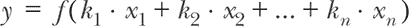

图 9.1 提供了密集层的工作原理的可视化表示：从输入元素到层输出的路径在图形上对称，反映了方程式 9.1 中的数学对称性。当我们处理序列数据时，这种对称性是*不可取的*，因为它使模型对元素之间的顺序视而不见。

##### 图 9.1\. 密集层的内部架构。密集层执行的乘法和加法与其输入对称。与简单 RNN 层（图 9.2）相比，它通过引入逐步计算来打破对称性。请注意，我们假设输入只有四个元素，出于简单起见，省略了偏置项。此外，我们仅显示了密集层的一个输出单元的操作。其余的单元被表示为背景中的一堆模糊的框。

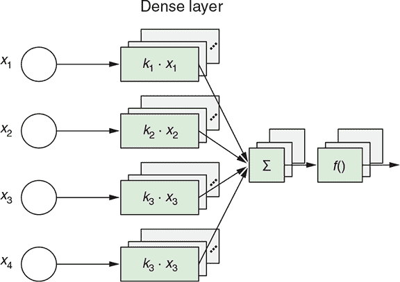

实际上，有一个简单的方法可以显示，我们基于密集层的方法（即 MLP，即使加入正则化）并没有很好地解决温度预测问题：将其准确性与我们从常识、非机器学习方法中获得的准确性进行比较。

我们所说的常识方法是什么？将温度预测为输入特征中的最后一个温度读数。简单地说，就假装从现在起 24 小时后的温度会与当前温度相同！这种方法是“直觉上合理”的，因为我们从日常经验中知道，明天的温度往往接近于今天的温度（也就是说，在同一天的同一时间）。这是一个非常简单的算法，并提供了一个合理的猜测，应该能击败所有其他类似简单的算法（例如，将温度预测为 48 小时前的温度）。

我们在 第八章 中使用的 tfjs-examples 的 jena-weather 目录提供了一个命令，用于评估这种常识方法的准确性：

```js
git clone https://github.com/tensorflow/tfjs-examples.git
cd tfjs-examples/jena-weather
yarn
yarn train-rnn --modelType baseline
```

`yarn train-rnn` 命令调用了 train-rnn.js 脚本，并在基于 Node.js 的后端环境中执行计算。^([2]) 我们将在不久的将来回到这种操作模式，当我们探索 RNN 时。该命令应该会给出以下屏幕输出：

> ²
> 
> 实现这种常识、非机器学习方法的代码位于 jena-weather/models.js 中名为 `getBaselineMeanAbsoluteError()` 的函数中。它使用 `Dataset` 对象的 `forEachAsync()` 方法来遍历验证子集的所有批次，计算每个批次的 MAE 损失，并累积所有损失以获得最终损失。

```js
Commonsense baseline mean absolute error: 0.290331
```

因此，简单的非机器学习方法产生了约为 0.29（以归一化术语表示）的平均绝对预测误差，这与我们从 第八章 中 MLP 获得的最佳验证误差相当（见 图 8.4）。换句话说，MLP，无论是否进行正则化，都无法可靠地击败来自常识基线方法的准确性！

这样的观察在机器学习中并不少见：机器学习并不总是能够击败常识方法。为了击败它，机器学习模型有时需要通过超参数优化进行精心设计或调整。我们的观察还强调了在处理机器学习问题时创建非机器学习基准进行比较的重要性。当然，我们肯定要避免将所有的精力都浪费在构建一个甚至连一个简单且计算成本更低的基线都无法击败的机器学习算法上！我们能够在温度预测问题中击败基线吗？答案是肯定的，我们将依靠 RNN 来做到这一点。现在让我们来看看 RNN 如何捕捉和处理序列顺序。

#### 9.1.2\. RNNs 如何建模序列顺序

图 9.2 的 A 面通过使用一个简短的四项序列显示了 RNN 层的内部结构。有几种 RNN 层的变体，图表显示了最简单的变体，称为 SimpleRNN，并且在 TensorFlow.js 中可用作`tf.layers.simpleRNN()`工厂函数。我们稍后将在本章中讨论更复杂的 RNN 变体，但现在我们将专注于 SimpleRNN。

##### 图 9.2. SimpleRNN 内部结构的“展开”（A 面）和“卷曲”（B 面）表示。卷曲视图（B 面）以更简洁的形式表示与展开视图相同的算法。它以更简洁的方式说明了 SimpleRNN 对输入数据的顺序处理。在面板 B 中的卷曲表示中，从输出（*y*）返回到模型本身的连接是这些层被称为*循环*的原因。与图 9.1 中一样，我们仅显示了四个输入元素，并简化了偏差项。

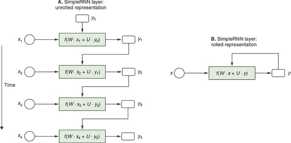

图表显示了输入的时间片段（*x*[1]，*x*[2]，*x*[3]，…）是如何逐步处理的。在每一步中，*x[i]* 通过一个函数（*f*()）进行处理，该函数表示为图表中心的矩形框。这产生了一个输出（*y[i]*），它与下一个输入片段（*x[i]*[+1]）结合，作为下一步 *f*() 的输入。重要的是要注意，即使图表显示了四个具有函数定义的单独框，它们实际上表示相同的函数。这个函数（*f*()）称为 RNN 层的*cell*。在调用 RNN 层期间，它以迭代的方式使用。因此，可以将 RNN 层视为“在`for`循环中包装的 RNN 单元。”^([3])

> ³
> 
> 引述于 Eugene Brevdo。

比较 SimpleRNN 的结构和密集层的结构（图 9.1），我们可以看到两个主要区别：

+   SimpleRNN 逐步处理输入元素（时间步）。这反映了输入的顺序性，这是密集层无法做到的。

+   在 SimpleRNN 中，每个输入时间步的处理都会生成一个输出（*y[i]*）。前一个时间步的输出（例如，*y*[1]）在处理下一个时间步（例如 *x*[2]）时由层使用。这就是 RNN 名称中“循环”部分的原因：来自先前时间步的输出会流回并成为后续时间步的输入。在诸如 dense、conv2d 和 maxPooling2d 之类的层类型中不会发生递归。这些层不涉及输出信息的回流，因此被称为*前馈*层。

由于这些独特的特征，SimpleRNN 打破了输入元素之间的对称性。它对输入元素的顺序敏感。如果重新排列顺序输入的元素，则输出将随之而改变。这使 SimpleRNN 与密集层有所区别。

图 9.2 的 B 面板是对简单循环神经网络的更抽象的表示。它被称为 *rolled* RNN 图表，与 A 面板中的 *unrolled* 图表相对应，因为它将所有时间步骤“卷”成一个循环。滚动图表很好地对应于编程语言中的 `for` 循环，这实际上是 TensorFlow.js 中实现 simpleRNN 和其他类型的 RNN 的方式。但是，与其显示真实的代码，不如看一下下面的简单 RNN 的伪代码，您可以将其视为图 9.2 中所示的 simpleRNN 结构的实现。这将帮助您专注于 RNN 层的工作原理的本质。

##### 列表 9.1\. simpleRNN 的内部计算的伪代码

```js
y = 0                             ***1***
for x in input_sequence:          ***2***
  y = f(dot(W, x) + dot(U, y))    ***3***
```

+   ***1*** y 对应于图 9.2 中的 y。状态在开始时被初始化为零。

+   ***2*** x 对应于图 9.2 中的 x。for 循环遍历输入序列的所有时间步。

+   ***3*** W 和 U 分别是输入和状态的权重矩阵（即，回路回传并成为重复输入的输出）。这也是时间步骤 i 的输出成为时间步骤 i + 1 的状态（重复输入）的地方。

在列表 9.1 中，您可以看到时间步 `i` 的输出成为下一个时间步（下一个迭代）的“状态”。*State* 是 RNN 的一个重要概念。这是 RNN“记住”已经看过的输入序列步骤的方式。在 `for` 循环中，这个记忆状态与未来的输入步骤结合起来，并成为新的记忆状态。这使得 simpleRNN 能够根据之前序列中出现的元素来不同地处理相同的输入元素。这种基于记忆的敏感性是顺序处理的核心。作为一个简单的例子，如果您试图解码莫尔斯电码（由点和短划组成），则短划的含义取决于先前（以及之后）的点和短划的序列。另一个例子，在英语中，单词 *last* 可以根据之前的单词有完全不同的含义。

SimpleRNN 的命名适当，因为其输出和状态是相同的东西。稍后，我们将探索更复杂和更强大的 RNN 体系结构。其中一些具有输出和状态作为两个单独的东西；其他甚至具有多个状态。

关于 RNN 的另一件值得注意的事情是 `for` 循环使它们能够处理由任意数量的输入步骤组成的输入序列。这是通过将序列输入展平并将其馈送到密集层中无法完成的，因为密集层只能接受固定的输入形状。

此外，`for` 循环反映了 RNN 的另一个重要属性：*参数共享*。我们所说的是，相同的权重参数（`W` 和 `U`）在所有时间步中都被使用。另一种选择是对每个时间步使用唯一的 `W`（和 `U`）值。这是不可取的，因为 1）它限制了 RNN 可以处理的时间步数，2）它导致可调参数数量的显著增加，这将增加计算量并增加训练期间过拟合的可能性。因此，RNN 层类似于 convnets 中的 conv2d 层，它们使用参数共享来实现高效计算并防止过拟合——尽管循环和 conv2d 层以不同的方式实现参数共享。虽然 conv2d 层利用了沿空间维度的平移不变性，但 RNN 层利用了沿*时间*维度的平移不变性。

图 9.2 显示了在推断时间（前向传播）中简单 RNN 中发生的情况。它并不显示在训练期间（后向传播）如何更新权重参数（`W` 和 `U`）。然而，RNN 的训练遵循我们在 2.2.2 节（图 2.8）中介绍的相同反向传播规则——即从损失开始，回溯操作列表，取其导数，并通过它们累积梯度值。数学上，递归网络上的后向传播基本上与前向传播相同。唯一的区别是 RNN 层的反向传播沿时间倒退，在像 图 9.2 面板 A 中的展开图中。这就是为什么有时将训练 RNN 的过程称为*时间反向传播*（BPTT）。

##### SimpleRNN 的实现

关于 simpleRNN 和 RNN 总体的抽象思考已经足够了。现在让我们看看如何创建一个 simpleRNN 层并将其包含在模型对象中，这样我们就可以比以前更准确地预测温度了。清单 9.2 中的代码（从 jena-weather/train-rnn.js 中摘录）就是这样做的。尽管 simpleRNN 层的内部复杂性很高，但模型本身相当简单。它只有两层。第一层是 simpleRNN，配置为具有 32 个单元。第二个是使用默认线性激活生成温度的连续数值预测的密集层。请注意，因为模型以一个 RNN 开始，所以不再需要展平序列输入（与前一章中为同一问题创建 MLPs 时进行比较时）。实际上，如果我们在 simpleRNN 层之前放置一个 flatten 层，将会抛出错误，因为 TensorFlow.js 中的 RNN 层期望它们的输入至少是 3D（包括批处理维度）。

##### 代码清单 9.2 创建用于温度预测问题的基于 simpleRNN 的模型

```js
function buildSimpleRNNModel(inputShape) {
  const model = tf.sequential();
  const rnnUnits = 32;                       ***1***
  model.add(tf.layers.simpleRNN({            ***2***
    units: rnnUnits,
    inputShape
  }));
  model.add(tf.layers.dense({units: 1}));    ***3***
  return model;
}
```

+   ***1*** simpleRNN 层的硬编码单元数是通过超参数的手工调整得到的一个很好的值。

+   ***2*** 模型的第一层是一个 simpleRNN 层。不需要对顺序输入进行展平，其形状为 [null, 240, 14]。

+   ***3*** 我们用一个具有单个单元且默认线性激活函数的密集层来结束模型，这适用于回归问题。

要查看 simpleRNN 模型的运行情况，请使用以下命令：

```js
yarn train-rnn --modelType simpleRNN --logDir /tmp/
  jean-weather-simpleRNN-logs
```

RNN 模型在后端环境中使用 tfjs-node 进行训练。由于基于 BPTT 的 RNN 训练涉及到大量计算，如果在资源受限的浏览器环境中训练相同的模型将会更加困难和缓慢，甚至不可能完成。如果您已经正确设置了 CUDA 环境，您可以在命令中添加 `--gpu` 标志来进一步提高训练速度。

前一个命令中的 `--logDir` 标志使得模型训练过程将损失值记录到指定的目录中。可以使用一个名为 TensorBoard 的工具在浏览器中加载并绘制损失曲线。图 9.3 是 TensorBoard 的一个截图。在 JavaScript 代码级别，通过使用指向日志目录的特殊回调函数来配置 `tf.LayersModel.fit()` 调用来实现这个功能。信息框 9.1 中包含了关于如何实现这一功能的进一步信息。

##### 图 9.3 Jena-temperature-prediction 问题的 simpleRNN 模型的 MAE 损失曲线。该图是 TensorBoard 的一个截图，显示了基于 Node.js 进行的 simpleRNN 模型训练的日志。

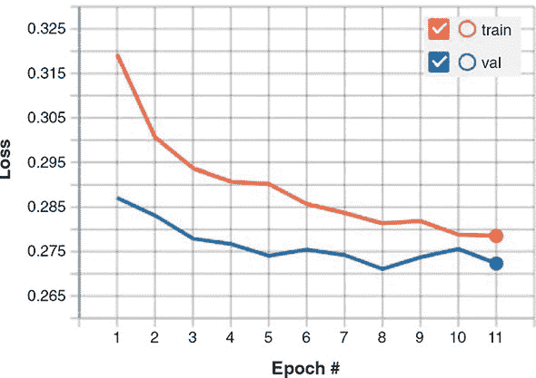

|  |
| --- |

**使用 TensorBoard 回调函数在 Node.js 中监控长时间的模型训练**

在 第八章 中，我们介绍了来自 tfjs-vis 库的回调函数，以帮助您在浏览器中监控 `tf.LayersModel.fit()` 的调用。然而，tfjs-vis 是仅适用于浏览器的库，不适用于 Node.js。在 tfjs-node（或 tfjs-node-gpu）中，默认情况下，`tf.LayersModel.fit()` 在终端中以进度条形式呈现，并显示损失和时间指标。虽然这种方式简洁明了而且信息量大，但文字和数字往往不如图形界面直观和吸引人。例如，对于模型训练后期我们经常寻找的损失值的微小变化，使用图表（具有适当的刻度和网格线）要比使用一段文本更容易发现。

幸运的是，一个名为 *TensorBoard* 的工具可以帮助我们在后端环境中完成这项工作。TensorBoard 最初是为 TensorFlow（Python）设计的，但 tfjs-node 和 tfjs-node-gpu 可以以兼容格式写入数据，这些数据可以被 TensorBoard 处理。要将损失和指标值记录到 TensorBoard 以用于 `tf.LayersModel.fit()` 或 `tf.LayersModel.fitDataset()` 的调用中，请按照下列模式操作：

```js
 import * as tf from '@tensorflow/tfjs-node';
// Or '@tensorflow/tfjs-node-gpu'

     // ...
 await model.fit(xs, ys, {
   epochs,
   callbacks: tf.node.tensorBoard('/path/to/my/logdir')
 });

      // Or for fitDataset():
 await model.fitDataset(dataset, {
   epochs,
   batchesPerEpoch,
   callbacks: tf.node.tensorBoard('/path/to/my/logdir')
 });
```

这些调用会将损失值和在`compile()`调用期间配置的任何指标写入目录/path/to/my/logdir。要在浏览器中查看日志，

1.  打开一个单独的终端。

1.  使用以下命令安装 TensorBoard（如果尚未安装）：`pip install tensorboard`

1.  启动 TensorBoard 的后端服务器，并指向在回调创建过程中指定的日志目录：`tensorboard --logdir /path/to/my/logdir`

1.  在 Web 浏览器中，导航至 TensorBoard 进程显示的 http:// URL。然后，类似于 figures 9.3 和 9.5 中显示的损失和指标图表将出现在 TensorBoard 的美观 Web UI 中。

|  |
| --- |

listing 9.2 创建的 simpleRNN 模型的文本摘要如下：

```js
Layer (type)                 Output shape              Param #
     =================================================================
     simple_rnn_SimpleRNN1 (Simpl [null,32]                 1504
     _________________________________________________________________
     dense_Dense1 (Dense)         [null,1]                  33
     =================================================================
Total params: 1537
     Trainable params: 1537
     Non-trainable params: 0
     _________________________________________________________________
```

它的权重参数明显少于我们之前使用的 MLP（1,537 与 107,585 相比，减少了 70 倍），但在训练过程中实现了更低的验证 MAE 损失（即更准确的预测）（0.271 与 0.289）。这种对温度预测误差的小但明显的减少突显了基于时间不变性的参数共享的强大力量以及 RNN 在学习诸如我们处理的天气数据之类的序列数据方面的优势。

您可能已经注意到，即使 simpleRNN 涉及相对少量的权重参数，与 MLP 等前馈模型相比，其训练和推断时间要长得多。这是 RNN 的一个主要缺点，即无法在时间步长上并行化操作。这种并行化是不可实现的，因为后续步骤依赖于先前步骤中计算的状态值（参见 figure 9.2 和 listing 9.1 中的伪代码）。如果使用大 O 符号表示，RNN 的前向传递需要 O（*n*）时间，其中*n*是输入时间步的数量。后向传递（BPTT）需要另外 O（*n*）时间。耶拿天气问题的输入未来包含大量（240）时间步，这导致了之前看到的较慢的训练时间。这也是为什么我们在 tfjs-node 而不是在浏览器中训练模型的主要原因。

RNN 的情况与 dense 和 conv2d 等前馈层形成鲜明对比。在这些层中，计算可以在输入元素之间并行化，因为对一个元素的操作不依赖于另一个输入元素的结果。这使得这些前馈层在执行它们的正向和反向传播时可以在 O（*n*）时间内花费较少的时间（在某些情况下接近 O（1）），借助 GPU 加速。在 section 9.2 中，我们将探索一些更多可并行化的序列建模方法，比如 1D 卷积。然而，熟悉 RNN 仍然是重要的，因为它们对于序列位置是敏感的，而 1D 卷积不是（稍后讨论）。

##### 门控循环单元（GRU）：一种更复杂的 RNN 类型

SimpleRNN 并不是 TensorFlow.js 中唯一的循环层。还有两个循环层可用：门控循环单元 (GRU^([4])) 和 LSTM（Long Short-Term Memory 的缩写^([5])）。在大多数实际应用中，你可能会想要使用这两种模型中的一种。SimpleRNN 对于大多数真实问题而言过于简单，尽管其计算成本更低并且其内部机制比 GRU 和 LSTM 更容易理解。但是，简单 RNN 存在一个主要问题：尽管理论上来说，simpleRNN 能够在时间 `t` 保留对于多个时间步长前的输入信息，但是在实践中，学习这种长期依赖关系非常困难。

> ⁴
> 
> Kyunghyun Cho 等人在 2014
> 
> ⁵
> 
> Sepp Hochreiter 和 Jürgen Schmidhuber 在 1997 年发表的论文《Long Short-Term Memory》中提出了 LSTM 模型，这篇论文发表在《Neural Computation》杂志的第 9 卷第 8 期上，页码从 1735 至 1780。

这是由于*梯度消失问题*，这是一种类似于前馈网络深度很深时观察到的效应的影响：随着你向网络中添加越来越多的层，从损失函数向早期层反向传播的梯度大小会越来越小。因此，权重的更新也越来越小，直到网络最终变得无法训练。对于 RNN，大量的时间步骤在此问题中扮演了许多层的角色。GRU 和 LSTM 是为解决梯度消失问题而设计的 RNN，GRU 是两者中更简单的一种。让我们看看 GRU 是如何解决这个问题的。

与 simpleRNN 相比，GRU 具有更复杂的内部结构。图 9.4 显示了 GRU 的内部结构的滚动表示。与 simpleRNN 的相同滚动表示进行比较（图 9.2 的面板 B），它包含了更多的细节。输入 (*x*) 和输出 / 状态（按照 RNN 文献中的约定称为 *h*）通过 *四个* 等式生成新的输出 / 状态。相比之下，simpleRNN 仅涉及 *一个* 等式。这种复杂性也体现在 清单 9.3 中的伪代码中，可以将其视为 图 9.4 中机制的一种实现。为简单起见，我们省略了伪代码中的偏置项。

##### 图 9.4 门控循环单元（GRU）的滚动表示，一种比 simpleRNN 更复杂、更强大的 RNN 层类型。这是一个滚动表示，与 图 9.2 中的面板 B 相似。请注意，我们为了简单起见，在等式中省略了偏置项。虚线表示了从 GRU 单元的输出 (*h*) 到下一个时间步的同一单元的反馈连接。

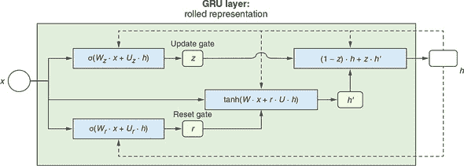

##### 代码清单 9.3 Pseudo-code for a GRU layer

```js
h = 0                                             ***1***
for x_i in input_sequence:                        ***2***
  z = sigmoid(dot(W_z, x) + dot(U_z, h))          ***3***
  r = sigmoid(dot(W_r, x) + dot(W_r, h))          ***4***
  h_prime = tanh(dot(W, x) + dot(r, dot(U, h)))   ***5***
  h = dot(1 - z, h) + dot(z, h_prime)             ***6***
```

+   ***1*** 这是 图 9.4 中的 h。和 simpleRNN 一样，在最开始状态被初始化为零。

+   ***2*** 这个 for 循环遍历输入序列的所有时间步。

+   ***3*** z 被称为更新门。

+   ***4*** r 被称为重置门。

+   ***5*** h_prime 是当前状态的临时状态。

+   ***6*** h_prime (当前临时状态) 和 h (上一个状态) 以加权方式结合（z 为权值）形成新状态。

在 GRU 的所有内部细节中，我们要强调两个最重要的方面：

1.  GRU 可以轻松地在许多时间步之间传递信息。这是通过中间量 *z* 实现的，它被称为*更新门*。由于更新门的存在，GRU 可以学习以最小的变化在许多时间步内传递相同的状态。特别地，在等式 (1 - *z*) · *h* + *z* · *h' 中，如果 *z* 的值为 0，则状态 *h* 将简单地从当前时间步复制到下一个时间步。这种整体传递的能力对于 GRU 如何解决消失梯度问题至关重要。重置门 *z* 被计算为输入 *x* 和当前状态 *h* 的线性组合，然后经过一个 sigmoid 非线性函数。

1.  除了更新门 *z*，GRU 中的另一个“门”被称为所谓的*重置门*，*r*。像更新门 *z* 一样，*r* 被计算为对输入和当前状态 `h` 的线性组合进行 sigmoid 非线性函数操作。重置门控制有多少当前状态需要“遗忘”。特别地，在等式 tanh(*W* · *x* `+` *r* · *U* · *h*`)` 中，如果 *r* 的值变为 0，则当前状态 *h* 的影响被抹除；如果下游方程中的 (1 - *z*`)` 接近零，那么当前状态 *h* 对下一个状态的影响将被最小化。因此，*r* 和 *z* 协同工作，使得 GRU 能够在适当条件下学习忘记历史或其一部分。例如，假设我们试图对电影评论进行正面或负面的分类。评论可能开始说“这部电影相当令人满意”，但评论过了一半后，又写到“然而，这部电影并不像其他基于类似观点的电影那么出色。” 在这一点上，应该大部分地忘记关于初始赞美的记忆，因为应该更多地权衡评论后部分对该评论最终情感分析结果的影响。

所以，这是 GRU 如何工作的一个非常粗糙和高层次的概述。要记住的重要事情是，GRU 的内部结构允许 RNN 学习何时保留旧状态，何时使用来自输入的信息更新状态。这种学习通过可调权重 *W[z]*、*U[z]*、*W[r]*、*W[r]*、*W* 和 *U* 的更新体现出来（除了省略的偏置项）。

如果你一开始不明白所有细节，不要担心。归根结底，我们在最后几段中对 GRU 的直观解释并不那么重要。理解 GRU 如何以非常详细的层面处理序列数据并不是人类工程师的工作，就像理解卷积神经网络如何将图像输入转换为输出类别概率的细节并不是人类工程师的工作一样。细节是由神经网络在 RNN 结构数据所描述的假设空间中通过数据驱动的训练过程找到的。

要将 GRU 应用于我们的温度预测问题，我们构建一个包含 GRU 层的 TensorFlow.js 模型。我们用于此的代码（摘自 jena-weather/train-rnn.js）几乎与我们用于简单 RNN 模型的代码（代码清单 9.2）完全相同。唯一的区别是模型的第一层的类型（GRU 对比于简单 RNN）。

##### 代码清单 9.4\. 为 Jena 温度预测问题创建一个 GRU 模型

```js
function buildGRUModel(inputShape) {
  const model = tf.sequential();
  const rnnUnits = 32;                      ***1***
  model.add(tf.layers.gru({                 ***2***
    units: rnnUnits,
    inputShape
  }));
  model.add(tf.layers.dense({units: 1}));   ***3***
  return model;
}
```

+   ***1*** 硬编码的单元数是一个通过超参数手动调整而发现效果良好的数字。

+   ***2*** 模型的第一层是一个 GRU 层。

+   ***3*** 模型以具有单个单元和默认线性激活的密集层结束，用于回归问题。

要开始在 Jena 天气数据集上训练 GRU 模型，请使用

```js
yarn train-rnn --modelType gru
```

图 9.5 显示了使用 GRU 模型获得的训练和验证损失曲线。它获得了约为 0.266 的最佳验证错误，这超过了我们在上一节中从简单 RNN 模型中获得的结果（0.271）。这反映了相较于简单 RNN，GRU 在学习序列模式方面具有更大的容量。在气象仪器读数中确实隐藏着一些序列模式，这些模式有助于提高温度的预测精度；这些信息被 GRU 捕捉到，但简单 RNN 没有。但这是以更长的训练时间为代价的。例如，在我们的一台机器上，GRU 模型的训练速度为每批 3,000 毫秒，而简单 RNN 的训练速度为每批 950 毫秒^([[6]](#ch09fn6)）。但如果目标是尽可能准确地预测温度，那么这个代价很可能是值得的。

> ⁶
> 
> 这些性能数字是从在 CPU 后端运行的 tfjs-node 获得的。如果你使用 tfjs-node-gpu 和 CUDA GPU 后端，你将获得两种模型类型的近似比例的加速。

##### 图 9.5\. 在温度预测问题上训练 GRU 模型的损失曲线。将其与简单 RNN 模型的损失曲线进行比较（图 9.3），注意 GRU 模型取得的最佳验证损失的小幅但真实的降低。

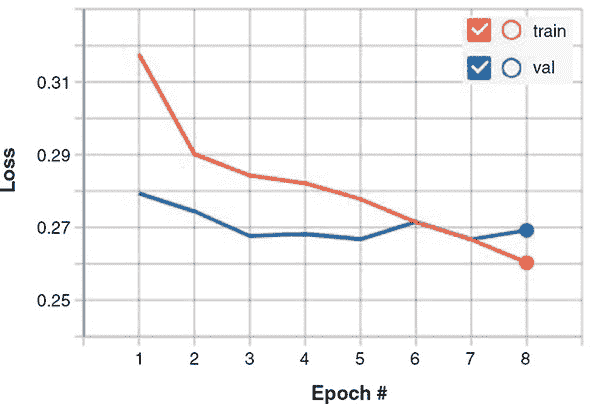

### 9.2\. 为文本构建深度学习模型

我们刚刚研究的天气预测问题涉及顺序数值数据。但是最普遍的序列数据可能是文本而不是数字。在像英语这样以字母为基础的语言中，文本可以被视为字符序列或单词序列。这两种方法适用于不同的问题，并且在本节中我们将针对不同的任务使用它们。我们将在接下来的几节中介绍的文本数据的深度学习模型可以执行与文本相关的任务，例如

+   给一段文本分配情感分数（例如，一个产品评论是积极的还是消极的）

+   将一段文本按主题分类（例如，一篇新闻文章是关于政治、金融、体育、健康、天气还是其他）

+   将文本输入转换为文本输出（例如，用于格式标准化或机器翻译）

+   预测文本的即将出现的部分（例如，移动输入方法的智能建议功能）

此列表只是涉及文本的一小部分有趣的机器学习问题，这些问题在自然语言处理领域进行系统研究。尽管我们在本章中只是浅尝神经网络的自然语言处理技术，但这里介绍的概念和示例应该为你进一步探索提供了一个良好的起点（请参阅本章末尾的“进一步阅读资料”部分）。

请记住，本章中的深度神经网络都不真正理解文本或语言的人类意义。相反，这些模型可以将文本的统计结构映射到特定的目标空间，无论是连续情感分数、多类别分类结果还是新序列。这证明对于解决许多实际的、与文本相关的任务来说，这是足够的。自然语言处理的深度学习只是对字符和单词进行的模式识别，方式与基于深度学习的计算机视觉（第四章）对像素进行的模式识别类似。

在我们深入探讨为文本设计的深度神经网络之前，我们首先需要了解机器学习中的文本是如何表示的。

#### 9.2.1\. 机器学习中的文本表示：单热编码和多热编码

到目前为止，在本书中我们遇到的大部分输入数据都是连续的。例如，鸢尾花的花瓣长度在一定范围内连续变化；耶拿气象数据集中的天气仪读数都是实数。这些值可以直接表示为浮点型张量（浮点数）。但是，文本不同。文本数据以字符或单词的字符串形式出现，而不是实数。字符和单词是离散的。例如，在“j”和“k”之间没有类似于在 0.13 和 0.14 之间存在数字的东西。在这个意义上，字符和单词类似于多类分类中的类别（例如三种鸢尾花物种或 MobileNet 的 1,000 个输出类别）。文本数据在被馈送到深度学习模型之前需要被转换为向量（数字数组）。这个转换过程称为*文本向量化*。

有多种文本向量化的方式。*独热编码*（如我们在第三章中介绍的）是其中之一。在英语中，根据划分标准，大约有 10,000 个最常用的单词。我们可以收集这 10,000 个单词并形成一个*词汇表*。词汇表中的唯一单词可以按照某种顺序排列（例如，按频率降序排列），以便为任何给定的单词分配一个整数索引。^([7]) 然后，每个英文单词都可以表示为一个长度为 10,000 的向量，其中只有对应索引的元素为 1，所有其余元素为 0。这就是该单词的*独热向量化*。图 9.6 的 A 面以图形方式展示了这一点。

> ⁷
> 
> 一个显而易见的问题是：如果我们遇到一个落在这 10,000 词汇表之外的罕见单词怎么办？这是任何文本导向的深度学习算法所面临的实际问题。在实践中，我们通过向词汇表添加一个名为*OOV*的特殊项来解决这个问题。OOV 代表*词汇表之外*。因此，所有不属于词汇表的罕见单词都被归类为该特殊项，并将具有相同独热编码或嵌入向量。更复杂的技术有多个 OOV 桶，并使用哈希函数将罕见单词分配到这些桶中。

##### 图 9.6. 一个单词的独热编码（向量化）（A 面）和一个句子作为一系列单词的独热编码（B 面）。C 面展示了与 B 面中相同句子的简化的多热编码。它是一种更简洁和可扩展的序列表示，但它丢弃了顺序信息。为了可视化，我们假设词汇表的大小只有 14。实际上，在深度学习中使用的英语单词的词汇量要大得多（数量级为数千或数万，例如，10,000）。

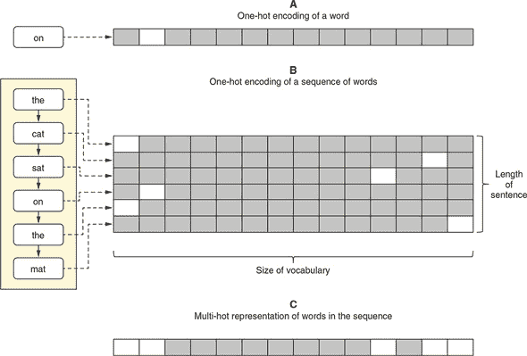

如果我们有一个句子而不是单个单词呢？我们可以为构成句子的所有单词获得独热向量，并将它们放在一起形成句子单词的二维表示（参见图 9.6 的面板 B）。这种方法简单而明确。它完美地保留了句子中出现的单词及其顺序的信息。^([8]) 然而，当文本变得很长时，向量的大小可能会变得非常大，以至于无法管理。例如，英语句子平均包含约 18 个单词。考虑到我们的词汇量为 10,000，仅表示一个句子就需要 180,000 个数字，这已经比句子本身占用的空间大得多了。更不用说一些与文本相关的问题涉及段落或整篇文章，其中包含更多的单词，会导致表示的大小和计算量急剧增加。

> ⁸
> 
> 这假设没有 OOV（Out of Vocabulary）词。

解决这个问题的一种方法是将所有单词都包含在一个单一向量中，以便向量中的每个元素表示对应的单词是否出现在文本中。图 9.6 的面板 C 进行了说明。在这种表示中，向量的多个元素可以具有值 1。这就是为什么人们有时将其称为*多热编码*。多热编码具有固定长度（词汇量的大小），不管文本有多长，因此它解决了大小爆炸的问题。但这是以失去顺序信息为代价的：我们无法从多热向量中得知哪些单词先出现，哪些单词后出现。对于一些问题，这可能是可以接受的；对于其他问题，这是不可接受的。有更复杂的表示方法来解决大小爆炸问题，同时保留顺序信息，我们将在本章后面探讨。但首先，让我们看一个具体的与文本相关的机器学习问题，可以使用多热方法以合理的准确率解决。

#### 9.2.2\. 情感分析问题的首次尝试

我们将在第一个例子中使用互联网电影数据库（IMDb）数据集来应用机器学习到文本上。该数据集是 [imdb.com](http://imdb.com) 上大约 25,000 条电影评论的集合，每个评论都被标记为积极或消极。机器学习任务是二元分类：即给定的电影评论是积极的还是消极的。数据集是平衡的（50% 积极评论和 50% 消极评论）。正如你从在线评论中所期望的那样，示例的单词长度各不相同。有些评论只有 10 个单词，而另一些则可以长达 2,000 个单词。以下是一个典型评论的例子。此示例被标记为消极。数据集中省略了标点符号。

> *这部电影中的母亲对她的孩子太粗心了，以至于忽视了，我希望我对她和她的行为不要那么生气，因为否则我会享受这部电影的，她太过分了，我建议你快进到你看到她做的事情结束，还有，有没有人厌倦看到拍得这么黑暗的电影了，观众几乎看不到正在拍摄的东西，所以我们为什么看不到夜视了呢*

数据被分为训练集和评估集，当您发出类似于模型训练命令时，它们会自动从网络下载并写入您的 tmp 目录

```js
    git clone https://github.com/tensorflow/tfjs-examples.git
    cd tfjs-examples/sentiment
    yarn
    yarn train multihot
```

如果您仔细检查 sentiment/data.js，您会发现它下载和读取的数据文件不包含实际的单词作为字符字符串。相反，这些文件中的单词以 32 位整数表示。虽然我们不会详细介绍该文件中的数据加载代码，但值得一提的是它执行了句子的多热向量化的部分，如下一列表所示。

##### 列表 9.5\. 从 `loadFeatures()` 函数对句子进行多热向量化

```js
const buffer = tf.buffer([sequences.length, numWords]);   ***1***
     sequences.forEach((seq, i) => {                      ***2***
  seq.forEach(wordIndex => {                              ***3***
    if (wordIndex !== OOV_INDEX) {                        ***4***
      buffer.set(1, i, wordIndex);                        ***5***
    }
  });
});
```

+   ***1*** 创建一个 TensorBuffer 而不是一个张量，因为我们将设置其元素值。缓冲区从全零开始。

+   ***2*** 遍历所有例子，每个例子都是一个句子

+   ***3*** 每个序列（句子）都是一个整数数组。

+   ***4*** 跳过多热编码中的词汇表外（OOV）单词

+   ***5*** 将缓冲区中的相应索引设置为 1。请注意，每个索引 i 可能有多个 wordIndex 值设置为 1，因此是多热编码。

多热编码的特征被表示为一个形状为 `[numExamples, numWords]` 的 2D 张量，其中 `numWords` 是词汇表的大小（在本例中为 10,000）。这种形状不受各个句子长度的影响，这使得这成为一个简单的向量化范例。从数据文件加载的目标的形状为 `[numExamples, 1]`，包含负面和正面标签，分别表示为 0 和 1。

我们应用于多热数据的模型是一个 MLP。实际上，即使我们想要，由于多热编码丢失了顺序信息，也无法对数据应用 RNN 模型。我们将在下一节讨论基于 RNN 的方法。创建 MLP 模型的代码来自 sentiment/train.js 中的 `buildModel()` 函数，简化后的代码如下列表所示。

##### 列表 9.6\. 为多热编码的 IMDb 电影评论构建 MLP 模型

```js
const model = tf.sequential();
model.add(tf.layers.dense({             ***1***
  units: 16,
  activation: 'relu',
  inputShape: [vocabularySize]          ***2***
}));
model.add(tf.layers.dense({
  units: 16,
  activation: 'relu'
}));
model.add(tf.layers.dense({
  units: 1,
  activation: 'sigmoid'                 ***3***
}));
```

+   ***1*** 添加两个带有 relu 激活的隐藏密集层以增强表示能力

+   ***2*** 输入形状是词汇表的大小，因为我们在这里处理多热向量化。

+   ***3*** 为输出层使用 sigmoid 激活以适应二元分类任务

通过运行`yarn train multihot --maxLen 500`命令，可以看到模型达到大约 0.89 的最佳验证准确率。这个准确率还可以，明显高于机会的准确率（0.5）。这表明通过仅仅查看评论中出现的单词，可以在这个情感分析问题上获得一个相当合理的准确度。例如，像*令人愉快*和*崇高*这样的单词与积极的评论相关联，而像*糟糕*和*乏味*这样的单词与消极的评论相关联，并且具有相对较高的可靠性。当然，在许多情况下，仅仅看单词并不一定能得到正确的结论。举一个人为的例子，理解句子“别误会，我并不完全不同意这是一部优秀的电影”的真实含义需要考虑顺序信息——不仅是单词是什么，还有它们出现的顺序。在接下来的章节中，我们将展示通过使用一个不丢失顺序信息的文本向量化和一个能够利用顺序信息的模型，我们可以超越这个基准准确度。现在让我们看看词嵌入和一维卷积如何工作。

#### 9.2.3\. 文本的更高效表示：词嵌入

什么是*词嵌入*？就像一位热编码（图 9.6）一样，词嵌入是将一个单词表示为一个向量（在 TensorFlow.js 中是一个一维张量）的一种方式。然而，词嵌入允许向量的元素值被训练，而不是依据一个严格的规则进行硬编码，比如一热编码中的单词到索引映射。换句话说，当一个面向文本的神经网络使用词嵌入时，嵌入向量成为模型的可训练的权重参数。它们通过与模型的其他权重参数一样的反向传播规则进行更新。

这种情况在图 9.7 中示意。在 TensorFlow.js 中，可以使用`tf.layer.embedding()`层类型来执行词嵌入。它包含一个可训练的形状为`[vocabularySize, embeddingDims]`的权重矩阵，其中`vocabularySize`是词汇表中唯一单词的数量，`embeddingDims`是用户选择的嵌入向量的维度。每当给出一个单词，比如*the*，你可以使用一个单词到索引的查找表在嵌入矩阵中找到对应的行，该行就是你的单词的嵌入向量。请注意，单词到索引的查找表不是嵌入层的一部分；它是模型以外的一个单独的实体（例如，参见示例 9.9）

##### 图 9.7\. 描述嵌入矩阵工作原理的示意图。嵌入矩阵的每一行对应词汇表中的一个单词，每一列是一个嵌入维度。嵌入矩阵的元素值在图中以灰度表示，并随机选择。

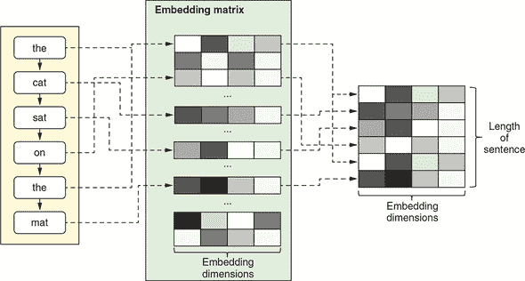

如果你有一系列单词，就像图 9.7 中显示的句子一样，你需要按照正确的顺序重复这个查找过程，并将得到的嵌入向量堆叠成一个形状为`[sequenceLength, embeddingDims]`的二维张量，其中`sequenceLength`是句子中的单词数量。^([9]) 如果句子中有重复的单词（比如在图 9.7 中的例子中的*the*），这并不重要：只需让相同的嵌入向量在结果的二维张量中重复出现。

> ⁹
> 
> 这种多词嵌入查找过程可以有效地使用`tf.gather()`方法进行，这就是 TensorFlow.js 中嵌入层在底层实现的方式。

单词嵌入为我们带来以下好处：

+   它解决了使用独热编码的大小问题。`embeddingDims`通常比`vocabularySize`要小得多。例如，在我们即将在 IMDb 数据集上使用的一维卷积网络中，`vocabularySize`为 10,000，`embeddingDims`为 128。因此，在来自 IMDb 数据集的 500 字评论中，表示这个例子只需要 500 * 128 = 64k 个浮点数，而不是 500 * 10,000 = 5M 个数字，就像独热编码一样——这样的向量化更经济。

+   通过不在乎词汇中单词的排序方式，并允许嵌入矩阵通过反向传播来进行训练，就像所有其他神经网络权重一样，单词嵌入可以学习单词之间的语义关系。意思相近的单词应该在嵌入空间中距离更近。例如，意思相近的单词，比如*very*和*truly*，它们的向量应该比那些意思更不同的单词的向量更接近，比如*very*和*barely*。为什么会这样？一个直观理解它的方式是意识到以下：假设你用意思相近的单词替换电影评论输入中的一些单词；一个训练良好的网络应该输出相同的分类结果。这只有当每一对单词的嵌入向量，它们是模型后续部分的输入，彼此之间非常接近时才会发生。

+   也就是说，嵌入空间具有多个维度（例如，128）的事实应该允许嵌入向量捕获单词的不同方面。例如，可能会有一个表示词性的维度，其中形容词*fast*与另一个形容词（如*warm*）比与一个名词（如*house*）更接近。可能还有另一个维度编码单词的性别方面，其中像*actress*这样的词比一个男性意义的词（如*actor*）更接近另一个女性意义的词（如*queen*）。在下一节（见 info box 9.2），我们将向您展示一种可视化单词嵌入并探索它们在对 IMDb 数据集进行嵌入式神经网络训练后出现的有趣结构的方法。

Table 9.1 提供了一个更简洁的总结，概述了一热/多热编码和词嵌入这两种最常用的词向量化范式之间的差异。

##### Table 9.1\. 比较两种词向量化范式：one-hot/multi-hot 编码和词嵌入

|   | One-hot 或 multi-hot 编码 | 词嵌入 |
| --- | --- | --- |
| 硬编码还是学习？ | 硬编码。 | 学习：嵌入矩阵是一个可训练的权重参数；这些值通常在训练后反映出词汇的语义结构。 |
| 稀疏还是密集？ | 稀疏：大多数元素为零；一些为一。 | 密集：元素取连续变化的值。 |
| 可扩展性 | 不可扩展到大词汇量：向量的大小与词汇量的大小成正比。 | 可扩展到大词汇量：嵌入大小（嵌入维度数）不必随词汇量的增加而增加。 |

#### 9.2.4\. 1D 卷积网络

在 chapter 4，我们展示了 2D 卷积层在深度神经网络中对图像输入的关键作用。conv2d 层学习在图像中的小 2D 补丁中表示局部特征的方法。卷积的思想可以扩展到序列中。由此产生的算法称为*1D 卷积*，在 TensorFlow.js 中通过`tf.layers.conv1d()`函数提供。conv1d 和 conv2d 的基本思想是相同的：它们都是可训练的提取平移不变局部特征的工具。例如，一个 conv2d 层在图像任务训练后可能变得对某个方向的特定角落模式和颜色变化敏感，而一个 conv1d 层可能在文本相关任务训练后变得对“一个否定动词后跟一个赞美形容词”的模式敏感。^([10])

> ¹⁰
> 
> 正如你可能已经猜到的那样，确实存在 3D 卷积，并且它对涉及 3D（体积）数据的深度学习任务非常有用，例如某些类型的医学图像和地质数据。

图 9.8 详细说明了 conv1d 层的工作原理。回想一下，第四章中的 图 4.3 表明，conv2d 层涉及将一个核在输入图像的所有可能位置上滑动。1D 卷积算法也涉及滑动一个核，但更简单，因为滑动仅在一个维度上发生。在每个滑动位置，都会提取输入张量的一个片段。该片段的长度为 `kernelSize`（conv1d 层的配置字段），在此示例中，它具有与嵌入维度数量相等的第二个维度。然后，在输入片段和 conv1d 层的核之间执行 *点*（乘法和加法）操作，得到一个输出序列的单个片段。这个操作会在所有有效的滑动位置上重复，直到生成完整的输出。与 conv1d 层的输入张量一样，完整的输出是一个序列，尽管它具有不同的长度（由输入序列长度、`kernelSize` 和 conv1d 层的其他配置确定）和不同数量的特征维度（由 conv1d 层的 `filters` 配置确定）。这使得可以堆叠多个 conv1d 层以形成深度的 1D convnet，就像堆叠多个 conv2d 层一样，是 2D convnet 中经常使用的技巧之一。

##### 图 9.8\. 示意图说明了 1D 卷积 (`tf.layers.conv1d()`) 的工作原理。为简单起见，仅显示一个输入示例（图像左侧）。假设输入序列的长度为 12，conv1d 层的核大小为 5。在每个滑动窗口位置，都会提取输入序列的长度为 5 的片段。该片段与 conv1d 层的核进行点乘，生成一个输出序列的滑动。这一过程对所有可能的滑动窗口位置重复进行，从而产生输出序列（图像右侧）。

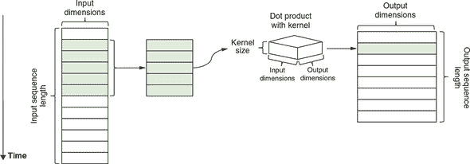

##### 序列截断和填充

现在我们在文本导向的机器学习中使用 conv1d，准备好在 IMDb 数据上训练 1D convnet 了吗？还不太行。还有一件事要解释：序列的截断和填充。为什么我们需要截断和填充？TensorFlow.js 模型要求 `fit()` 的输入是一个张量，而张量必须具有具体的形状。因此，尽管我们的电影评论长度不固定（回想一下，它们在 10 到 2,400 个单词之间变化），但我们必须选择一个特定的长度作为输入特征张量的第二个维度（`maxLen`），这样输入张量的完整形状就是 `[numExamples, maxLen]`。在前一节使用多热编码时不存在这样的问题，因为来自多热编码的张量具有不受序列长度影响的第二个张量维度。

选择 `maxLen` 值的考虑如下：

+   应该足够长以捕获大多数评论的有用部分。如果我们选择 `maxLen` 为 20，可能会太短，以至于会剪掉大多数评论的有用部分。

+   它不应该太大，以至于大多数评论远远短于该长度，因为那将导致内存和计算时间的浪费。

两者的权衡使我们选择了每个评论的最大词数为 500（最大值）作为示例。这在用于训练 1D convnet 的命令中通过 `--maxLen` 标志指定：

```js
yarn train --maxLen 500 cnn
```

一旦选择了 `maxLen`，所有的评论示例都必须被调整为这个特定的长度。特别是，比较长的评论被截断；比较短的评论被填充。这就是函数 `padSequences()` 做的事情（列表 9.7）。截断长序列有两种方式：切掉开头部分（列表 9.7 中的 `'pre'` 选项）或结尾部分。这里，我们选择了前一种方法，理由是电影评论的结尾部分更有可能包含与情感相关的信息。类似地，填充短序列到期望的长度有两种方式：在句子之前添加填充字符（`PAD_CHAR`）（列表 9.7 中的 `'pre'` 选项）或在句子之后添加。在这里，我们也是任意选择了前一种选项。此列表中的代码来自 sentiment/sequence_utils.js。

##### 列表 9.7\. 将文本特征加载的一步截断和填充序列

```js
export function padSequences(
    sequences, maxLen,
         padding = 'pre',
         truncating = 'pre',
          value = PAD_CHAR) {
  return sequences.map(seq => {                       ***1***
    if (seq.length > maxLen) {                        ***2***
      if (truncating === 'pre') {                     ***3***
        seq.splice(0, seq.length - maxLen);
      } else {
        seq.splice(maxLen, seq.length - maxLen);
      }
    }

    if (seq.length < maxLen) {                        ***4***
      const pad = [];
      for (let i = 0; i < maxLen - seq.length; ++i) {
        pad.push(value);                              ***5***
      }
      if (padding === 'pre') {                        ***6***
        seq = pad.concat(seq);
      } else {
        seq = seq.concat(pad);
      }
    }

    return seq;                                       ***7***
  });
}
```

+   ***1*** 遍历所有的输入序列

+   ***2*** 这个特定序列比指定的长度（maxLen）长：将其截断为该长度。

+   ***3*** 有两种截断序列的方式：切掉开头 ('pre') 或结尾

+   ***4*** 序列比指定的长度短：需要填充。

+   ***5*** 生成填充序列

+   ***6*** 与截断类似，填充子长度序列有两种方式：从开头 ('pre') 或从后面开始。

+   ***7*** 注意：如果 seq 的长度恰好为 maxLen，则将原样返回。

##### 在 IMDb 数据集上构建并运行 1D convnet

现在我们已经准备好了 1D convnet 的所有组件；让我们把它们放在一起，看看我们是否可以在 IMDb 情感分析任务上获得更高的准确率。列表 9.8 中的代码创建了我们的 1D convnet（从 sentiment/train.js 中摘录，简化了）。在此之后展示了生成的 `tf.Model` 对象的摘要。

##### 列表 9.8\. 构建 IMDb 问题的 1D convnet

```js
const model = tf.sequential();
model.add(tf.layers.embedding({               ***1***
  inputDim: vocabularySize,                   ***2***
  outputDim: embeddingSize,
  inputLength: maxLen
}));
model.add(tf.layers.dropout({rate: 0.5}));    ***3***
model.add(tf.layers.conv1d({                  ***4***
  filters: 250,
  kernelSize: 5,
  strides: 1,
  padding: 'valid',
  activation: 'relu'
}));
model.add(tf.layers.globalMaxPool1d({}));     ***5***
model.add(tf.layers.dense({                   ***6***
       units: 250,                            ***6***
       activation: 'relu'                     ***6***
     }));                                     ***6***
model.add(tf.layers.dense({units: 1, activation: 'sigmoid'}));

________________________________________________________________
Layer (type)                 Output shape              Param #
=================================================================
embedding_Embedding1 (Embedd [null,500,128]            1280000
_________________________________________________________________
dropout_Dropout1 (Dropout)   [null,500,128]            0
_________________________________________________________________
conv1d_Conv1D1 (Conv1D)      [null,496,250]            160250
_________________________________________________________________
global_max_pooling1d_GlobalM [null,250]                0
_________________________________________________________________
dense_Dense1 (Dense)         [null,250]                62750
_________________________________________________________________
dense_Dense2 (Dense)         [null,1]                  251
=================================================================
Total params: 1503251
Trainable params: 1503251
Non-trainable params: 0
_________________________________________________________________
```

+   ***1*** 模型以嵌入层开始，它将输入的整数索引转换为相应的词向量。

+   ***2*** 嵌入层需要知道词汇量的大小。否则，它无法确定嵌入矩阵的大小。

+   ***3*** 添加一个 dropout 层以防止过拟合

+   ***4*** 接下来是 conv1D 层。

+   ***5*** globalMaxPool1d 层通过提取每个过滤器中的最大元素值来折叠时间维度。输出准备好供后续的密集层（MLP）使用。

+   ***6*** 在模型顶部添加了一个两层的 MLP

将 JavaScript 代码和文本摘要一起查看是有帮助的。这里有几个值得注意的地方：

+   模型的形状为`[null, 500]`，其中`null`是未确定的批次维度（示例数量），500 是每个评论的最大允许单词长度（`maxLen`）。输入张量包含截断和填充的整数单词索引序列。

+   模型的第一层是嵌入层。它将单词索引转换为它们对应的单词向量，导致形状为`[null, 500, 128]`。正如你所看到的，序列长度（500）得到保留，并且嵌入维度（128）反映在形状的最后一个元素上。

+   跟在嵌入层后面的层是 conv1d 层——这个模型的核心部分。它配置为具有大小为 5 的卷积核，默认步幅大小为 1，并且采用“valid”填充。因此，沿着序列维度有 500-5+1=496 个可能的滑动位置。这导致输出形状的第二个元素（`[null, 496, 250]`）中有一个值为 496。形状的最后一个元素（250）反映了 conv1d 层配置为具有的过滤器数量。

+   接在 conv1d 层后面的 globalMaxPool1d 层与我们在图像卷积网络中看到的 maxPooling2d 层有些相似。但它进行了更激烈的汇集，将沿着序列维度的所有元素折叠成一个单一的最大值。这导致输出形状为`[null, 250]`。

+   现在张量具有 1D 形状（忽略批次维度），我们可以在其上构建两个密集层，形成 MLP 作为整个模型的顶部。

用命令`yarn train --maxLen 500 cnn`开始训练 1D 卷积网络。经过两到三个训练周期后，你会看到模型达到了约 0.903 的最佳验证准确率，相对于基于多热编码的 MLP 得到的准确率（0.890），这是一个小但坚实的提升。这反映了我们的 1D 卷积网络设法学习到的顺序信息，而这是多热编码 MLP 无法学习到的。

那么 1D 卷积网络如何捕捉顺序信息呢？它通过其卷积核来实现。卷积核的点积对元素的顺序敏感。例如，如果输入由五个单词组成，*I like it so much*，1D 卷积将输出一个特定的值；然而，如果单词的顺序改变为*much so I like it*，尽管元素集合完全相同，但 1D 卷积的输出将不同。

但需要指出的是，一维卷积层本身无法学习超出其核大小的连续模式。 例如，假设两个远离的单词的顺序影响句子的含义； 具有小于距离的核大小的 conv1d 层将无法学习长距离交互。 这是 RNN（如 GRU 和 LSTM）在一维卷积方面优于的方面之一。

一种一维卷积可以改善这一缺点的方法是深入研究-即，堆叠多个 conv1d 层，以便较高级别的 conv1d 层的“接受场”足够大，以捕获这种长距离依赖关系。 然而，在许多与文本相关的机器学习问题中，这种长距离依赖关系并不起重要作用，因此使用少量 conv1d 层的一维卷积网络就足够了。 在 IMDb 情感示例中，您可以尝试根据相同的 `maxLen` 值和嵌入维度训练基于 LSTM 的模型：

```js
yarn train --maxLen 500 lstm
```

注意，LSTM 的最佳验证准确度（类似于但略为复杂于 GRU；请参见 figure 9.4）与一维卷积网络的最佳验证准确度大致相同。 这可能是因为长距离的单词和短语之间的相互作用对于这些电影评论和情感分类任务并不太重要。

因此，您可以看到一维卷积网络是这种文本问题的一种有吸引力的替代选择，而不是 RNN。 这在考虑到一维卷积网络的计算成本远低于 RNN 的计算成本时尤为明显。 从 `cnn` 和 `lstm` 命令中，您可以看到训练一维卷积网络的速度约为训练 LSTM 模型的六倍。 LSTM 和 RNN 的性能较慢与它们的逐步内部操作有关，这些操作无法并行化； 卷积是可以通过设计进行并行化的。

|  |
| --- |

**使用嵌入式投影仪可视化学习到的嵌入向量**

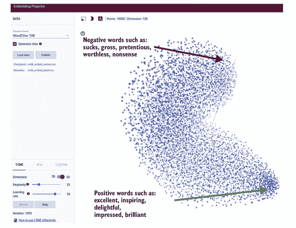

使用嵌入式投影仪在嵌入式投影器中使用 t-SNE 维度约减可视化经过训练的一维卷积网络的词嵌入。

在训练后，一维卷积网络的词嵌入中是否出现了任何有趣的结构？ 要找出，请使用 `yarn train` 命令的可选标志 `--embeddingFilesPrefix`：

```js
yarn train --maxLen 500 cnn --epochs 2 --embeddingFilesPrefix
             /tmp/imdb_embed
```

此命令将生成两个文件：

+   /tmp/imdb_embed_vectors.tsv-一个包含单词嵌入的数值的制表符分隔值文件。 每一行包含一个单词的嵌入向量。 在我们的情况下，有 10,000 行（我们的词汇量大小），每行包含 128 个数字（我们的嵌入维度）。

+   /tmp/imdb_embed_labels.tsv-一个由与前一个文件中的向量对应的单词标签组成的文件。 每一行是一个单词。

这些文件可以上传到嵌入投影仪（[`projector.tensorflow.org`](https://projector.tensorflow.org)）进行可视化（见前面的图）。因为我们的嵌入向量驻留在一个高维（128D）空间中，所以需要将它们的维度降低到三个或更少的维度，以便人类能够理解。嵌入投影仪工具提供了两种降维算法：t-分布随机邻域嵌入（t-SNE）和主成分分析（PCA），我们不会详细讨论。但简要地说，这些方法将高维嵌入向量映射到 3D，同时确保向量之间的关系损失最小。t-SNE 是两者中更复杂、计算更密集的方法。它产生的可视化效果如图所示。

每个点云中的点对应我们词汇表中的一个单词。将鼠标光标移动到点上方，悬停在点上以查看它们对应的单词。我们在较小的情感分析数据集上训练的嵌入向量已经显示出与单词语义相关的一些有趣结构。特别是，点云的一端包含许多在积极的电影评论中经常出现的词语（例如*优秀*、*鼓舞人心*和*令人愉快*），而另一端则包含许多听起来消极的词语（*糟糕*、*恶心*和*自命不凡*）。在更大的文本数据集上训练更大的模型可能会出现更有趣的结构，但是这个小例子已经给你一些关于词嵌入方法的威力的暗示。

因为词嵌入是文本导向的深度神经网络的重要组成部分，研究人员创建了预训练词嵌入，机器学习从业者可以直接使用，无需像我们在 IMDb 卷积神经网络示例中那样训练自己的词嵌入。最著名的预训练词嵌入集之一是斯坦福自然语言处理组的 GloVe（全局向量）（参见[`nlp.stanford.edu/projects/glove/`](https://nlp.stanford.edu/projects/glove/)）。

使用预训练的词嵌入（如 GloVe）的优势是双重的。首先，它减少了训练过程中的计算量，因为嵌入层不需要进一步训练，因此可以直接冻结。其次，像 GloVe 这样的预训练嵌入是从数十亿个单词中训练出来的，因此质量比在小数据集上训练可能得到的要高得多，比如这里的 IMDb 数据集。从这些意义上讲，预训练词嵌入在自然语言处理问题中的作用类似于在计算机视觉中所见到的预训练深度卷积基（例如 MobileNet，在第五章中见过）在计算机视觉中的作用。

|  |
| --- |

##### 在网页中使用 1D 卷积神经网络进行推理

在 sentiment/index.js 中，你可以找到部署在 Node.js 中训练的模型以在客户端使用的代码。要查看客户端应用程序的运行情况，请运行命令 `yarn watch`，就像本书中的大多数其他示例一样。该命令将编译代码，启动一个 web 服务器，并自动打开一个浏览器选项卡以显示 index.html 页面。在页面中，你可以点击一个按钮通过 HTTP 请求加载训练好的模型，并在文本框中执行情感分析。文本框中的电影评论示例可编辑，因此你可以对其进行任意编辑，并观察实时观察到这如何影响二进制预测。页面带有两个示例评论（一个积极的评论和一个消极的评论），你可以将其用作你调试的起点。加载的 1D convnet 运行速度足够快，可以在你在文本框中输入时实时生成情感分数。

推断代码的核心很简单（参见 列表 9.9，来自 sentiment/index.js），但有几个有趣的地方值得指出：

+   该代码将所有输入文本转换为小写，丢弃标点符号，并在将文本转换为单词索引之前删除额外的空白。这是因为我们使用的词汇表只包含小写单词。

+   超出词汇表的词汇——即词汇表之外的词汇——用特殊的单词索引（`OOV_INDEX`）表示。这些词汇包括罕见的词汇和拼写错误。

+   我们在训练中使用的相同 `padSequences()` 函数（参见 列表 9.7）在此处用于确保输入到模型的张量具有正确的长度。通过截断和填充来实现这一点，正如我们之前所见。这是使用 TensorFlow.js 进行像这样的机器学习任务的一个好处的一个例子：你可以在后端训练环境和前端服务环境中使用相同的数据预处理代码，从而减少数据偏差的风险（有关数据偏差风险的更深入讨论，请参见 第六章）。

##### 列表 9.9\. 在前端使用训练好的 1D convnet 进行推断

```js
predict(text) {
  const inputText =                                                     ***1***
      text.trim().toLowerCase().replace(/(\.|\,|\!)/g, '').split(' ');  ***1***
  const sequence = inputText.map(word => {
    let wordIndex =                                                     ***2***
             this.wordIndex[word] + this.indexFrom;                     ***2***
    if (wordIndex > this.vocabularySize) {
      wordIndex = OOV_INDEX;                                            ***3***
    }
    return wordIndex;
  });
  const paddedSequence =                                                ***4***
           padSequences([sequence], this.maxLen);                       ***4***
  const input = tf.tensor2d(                                            ***5***
           paddedSequence, [1, this.maxLen]);                           ***5***
  const beginMs = performance.now();                                    ***6***
  const predictOut = this.model.predict(input);                         ***7***
  const score = predictOut.dataSync()[0];
  predictOut.dispose();
  const endMs = performance.now();

  return {score: score, elapsed: (endMs - beginMs)};
}
```

+   ***1*** 转换为小写；从输入文本中删除标点符号和额外的空白

+   ***2*** 将所有单词映射到单词索引。this.wordIndex 已从 JSON 文件加载。

+   ***3*** 超出词汇表的单词被表示为特殊的单词索引：OOV_INDEX。

+   ***4*** 截断长评论，并填充短评论到所需长度

+   ***5*** 将数据转换为张量表示，以便馈送到模型中

+   ***6*** 跟踪模型推断所花费的时间

+   ***7*** 实际推断（模型的前向传递）发生在这里。

### 9.3\. 使用注意力机制的序列到序列任务

在 Jena-weather 和 IMDb 情感示例中，我们展示了如何从输入序列中预测单个数字或类别。然而，一些最有趣的序列问题涉及根据输入序列生成*输出序列*。这些类型的任务被恰当地称为*序列到序列*（或简称为 seq2seq）任务。seq2seq 任务有很多种，以下列表只是其中的一个小子集：

+   *文本摘要*—给定一篇可能包含数万字的文章，生成其简洁摘要（例如，100 字或更少）。

+   *机器翻译*—给定一种语言（例如英语）中的一个段落，生成其在另一种语言（例如日语）中的翻译。

+   *自动补全的单词预测*—给定句子中的前几个单词，预测它们之后会出现什么单词。这对电子邮件应用程序和搜索引擎 UI 中的自动补全和建议非常有用。

+   *音乐创作*—给定一系列音符的前导序列，生成以这些音符开头的旋律。

+   *聊天机器人*—给定用户输入的一句话，生成一个满足某种对话目标的回应（例如，某种类型的客户支持或简单地用于娱乐聊天）。

*注意力机制*^([11])是一种强大且流行的用于 seq2seq 任务的方法。它通常与 RNNs 一起使用。在本节中，我们将展示如何使用注意力和 LSTMs 来解决一个简单的 seq2seq 任务，即将各种日历日期格式转换为标准日期格式。尽管这是一个有意简化的例子，但你从中获得的知识适用于像之前列出的更复杂的 seq2seq 任务。让我们首先制定日期转换问题。

> ¹¹
> 
> 参见 Alex Graves，“Generating Sequences with Recurrent Neural Networks，”2013 年 8 月 4 日提交，[`arxiv.org/abs/1308.0850`](https://arxiv.org/abs/1308.0850)；以及 Dzmitry Bahdanau，Kyunghyun Cho 和 Yoshua Bengio，“Neural Machine Translation by Jointly Learning to Align and Translate，”2014 年 9 月 1 日提交，[`arxiv.org/abs/1409.0473`](https://arxiv.org/abs/1409.0473)。

#### 9.3.1\. 序列到序列任务的制定

如果你像我们一样，你可能会因为写日历日期的可能方式太多而感到困惑（甚至可能有点恼火），特别是如果你去过不同的国家。有些人喜欢使用月-日-年的顺序，有些人采用日-月-年的顺序，还有些人使用年-月-日的顺序。即使在同一顺序中，对于月份是否写为单词（January）、缩写（Jan）、数字（1）或零填充的两位数字（01），也存在不同的选择。日期的选项包括是否在前面加零以及是否将其写为序数（4th 与 4）。至于年份，你可以写全四位数或只写最后两位数。而且，年、月和日的部分可以用空格、逗号、句点或斜杠连接，或者它们可以在没有任何中间字符的情况下连接在一起！所有这些选项以组合的方式结合在一起，至少产生了几十种写相同日期的方式。

因此，拥有一种算法可以将这些格式的日历日期字符串作为输入，并输出对应的 ISO-8601 格式的日期字符串（例如，2019-02-05）会很好。我们可以通过编写传统程序来非机器学习方式解决这个问题。但考虑到可能的格式数量庞大，这是一项有些繁琐且耗时的任务，结果代码很容易达到数百行。让我们尝试一种深度学习方法——特别是使用基于 LSTM 的注意力编码器-解码器架构。

为了限制本示例的范围，我们从以下示例展示的 18 种常见日期格式开始。请注意，所有这些都是写相同日期的不同方式：

```js
"23Jan2015", "012315", "01/23/15", "1/23/15",
"01/23/2015", "1/23/2015", "23-01-2015", "23-1-2015",
"JAN 23, 15", "Jan 23, 2015", "23.01.2015", "23.1.2015",
"2015.01.23", "2015.1.23", "20150123", "2015/01/23",
"2015-01-23", "2015-1-23"
```

当然，还有其他日期格式。[12] 但是一旦模型训练和推理的基础奠定，添加对其他格式的支持基本上将是一项重复性的任务。我们把添加更多输入日期格式的部分留给了本章末尾的练习（练习 3）。

> ¹²
> 
> 你可能已经注意到的另一件事是，我们使用了一组没有任何歧义的日期格式。如果我们在我们的格式集中同时包含 MM/DD/YYYY 和 DD/MM/YYYY，那么就会有含糊不清的日期字符串：即，无法确定地解释的字符串。例如，字符串“01/02/2019”可以被解释为 2019 年 1 月 2 日或 2019 年 2 月 1 日。

首先，让我们让示例运行起来。就像先前的情感分析示例一样，这个示例包括一个训练部分和一个推理部分。训练部分在后端环境中使用`tfjs-node`或`tfjs-node-gpu`运行。要启动训练，请使用以下命令：

```js
    git clone https://github.com/tensorflow/tfjs-examples.git
    cd tfjs-examples/sentiment
    yarn
    yarn train
```

要使用 CUDA GPU 执行训练，请在`yarn train`命令中使用`--gpu`标志：

```js
    yarn train --gpu
```

默认情况下，训练运行两个时期，这应该足以将损失值接近零并且转换精度接近完美。 在训练作业结束时打印的样本推断结果中，大多数，如果不是全部，结果应该是正确的。 这些推断样本来自与训练集不重叠的测试集。 训练好的模型将保存到相对路径`dist/model`，并将在基于浏览器的推断阶段使用。 要启动推断 UI，请使用

```js
yarn watch
```

在弹出的网页中，您可以在输入日期字符串文本框中键入日期，然后按 Enter 键，观察输出日期字符串如何相应更改。 此外，具有不同色调的热图显示了转换期间使用的注意矩阵(请参见图 9.9)。 注意矩阵包含一些有趣的信息，并且是此 seq2seq 模型的核心。 它特别适合人类解释。 您应该通过与之互动来熟悉它。

##### 图 9.9\. 基于注意力的编码器-解码器在工作中进行日期转换，底部右侧显示了特定输入-输出对的注意力矩阵

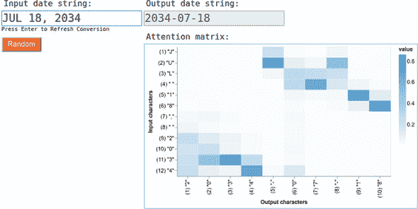

让我们以图 9.9 中显示的结果为例。 模型的输出(`"2034-07-18"`)正确地转换了输入日期(`"JUL 18, 2034"`)。 注意矩阵的行对应于输入字符(`"J"`, `"U"`, `"L"`, `" "`, 等等)，而列对应于输出字符(`"2"`, `"0"`, `"3"`, 等等)。 因此，注意矩阵的每个元素指示了在生成相应输出字符时有多少关注力放在相应的输入字符上。 元素的值越高，关注度就越高。 例如，看看最后一行的第四列: 也就是说，对应于最后一个输入字符(`"4"`)和第四个输出字符(`"4"`)的那个。 根据颜色刻度表，它具有相对较高的值。 这是有道理的，因为输出的年份部分的最后一位数字确实应该主要依赖于输入字符串的年份部分的最后一位数字。 相比之下，该列中的其他元素具有较低的值，这表明输出字符串中字符`"4"`的生成并未使用来自输入字符串的其他字符的太多信息。 在输出字符串的月份和日期部分也可以看到类似的模式。 鼓励您尝试使用其他输入日期格式，并查看注意矩阵如何变化。

#### 9.3.2\. 编码器-解码器架构和注意力机制

本节帮助您了解编码器-解码器架构如何解决 seq2seq 问题以及注意力机制在其中起什么作用的直觉。 机制的深入讨论将与下面的深入研究部分中的代码一起呈现。

到目前为止，我们见过的所有神经网络都输出单个项目。对于回归网络，输出只是一个数字；对于分类网络，它是对可能类别的单个概率分布。但是我们面临的日期转换问题不同：我们不是要预测单个项目，而是需要预测多个项目。具体来说，我们需要准确预测 ISO-8601 日期格式的 10 个字符。我们应该如何使用神经网络实现这一点？

解决方案是创建一个输出序列的网络。特别是，由于输出序列由来自具有确切 11 个项目的“字母表”的离散符号组成，我们让网络的输出张量形状为 3D 形状：`[numExamples, OUTPUT_LENGTH, OUTPUT_VOCAB_SIZE]`。第一个维度（`numExamples`）是传统的示例维度，使得像本书中看到的所有其他网络一样可以进行批处理。`OUTPUT_LENGTH`为 10，即 ISO-8601 格式输出日期字符串的固定长度。`OUTPUT_VOCAB_SIZE`是输出词汇表的大小（或更准确地说，“输出字母表”），其中包括数字 0 到 9 和连字符(-)，以及我们稍后将讨论的一些具有特殊含义的字符。

这样就涵盖了模型的输出。那么模型的输入呢？原来，模型不是一个输入，而是*两个*输入。模型可以大致分为两部分，编码器和解码器，如图 9.10 所示。模型的第一个输入进入编码器部分。它是输入日期字符串本身，表示为形状为`[numExamples, INPUT_LENGTH]`的字符索引序列。`INPUT_LENGTH`是支持的输入日期格式中最大可能的长度（结果为 12）。比该长度短的输入在末尾用零填充。第二个输入进入模型的解码器部分。它是右移一个时间步长的转换结果，形状为`[numExamples, OUTPUT_LENGTH]`。

##### 图 9.10\. 编码器-解码器架构如何将输入日期字符串转换为输出字符串。`ST`是解码器输入和输出的特殊起始标记。面板 A 和 B 分别显示了转换的前两个步骤。在第一个转换步骤之后，生成了输出的第一个字符（`"2"`）。在第二步之后，生成了第二个字符（`"0"`）。其余步骤遵循相同的模式，因此被省略。

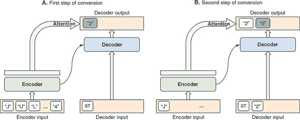

等等，第一个输入是有意义的，因为它是输入日期字符串，但是为什么模型将转换结果作为额外的输入呢？这不是模型的输出吗？关键在于转换结果的偏移。请注意，第二个输入并不完全是转换结果。相反，它是转换结果的时延版本。时延为一步。例如，在训练期间，期望的转换结果是 `"2034-07-18"`，那么模型的第二个输入将是 `"<ST>2034-07-1"`，其中 `<ST>` 是一个特殊的序列起始符号。这个偏移的输入使解码器能够意识到到目前为止已经生成的输出序列。它使解码器更容易跟踪转换过程中的位置。

这类似于人类说话的方式。当你将一个想法用语言表达出来时，你的心智努力分为两个部分：想法本身和你到目前为止所说的内容。后者对于确保连贯、完整和不重复的言论至关重要。我们的模型以类似的方式工作：为了生成每个输出字符，它使用来自输入日期字符串和到目前为止已生成的输出字符的信息。

在训练阶段，转换结果的时延效果是有效的，因为我们已经知道正确的转换结果是什么。但是在推断过程中它是如何工作的呢？答案可以在 图 9.10 的两个面板中看到：我们逐个生成输出字符。如图的面板 A 所示，我们从将一个 `ST` 符号置于解码器输入的开头开始。通过一步推断（一个 `Model.predict()` 调用），我们得到一个新的输出项（面板中的 `"2"`）。然后，这个新的输出项被附加到解码器输入中。然后进行转换的下一步。它在解码器输入中看到了新生成的输出字符 `"2"`（请参阅 图 9.10 的面板 B）。这一步涉及另一个 `Model.predict()` 调用，并生成一个新的输出字符（`"0"`），然后再次附加到解码器输入中。这个过程重复，直到达到所需的输出长度（在本例中为 10）。注意，输出不包括 `ST` 项目，因此可以直接用作整个算法的最终输出。

> ¹³
> 
> 实现逐步转换算法的代码是 `date-conversion-attention/model.js` 中的函数 `runSeq2SeqInference()`。

##### 注意机制的作用

注意机制的作用是使每个输出字符能够“关注”输入序列中的正确字符。例如，输出字符串`"2034-07-18"`的`"7"`部分应关注输入日期字符串的`"JUL"`部分。这与人类生成语言的方式类似。例如，当我们将语言 A 的句子翻译成语言 B 时，输出句子中的每个单词通常由输入句子中的少数单词确定。

这可能看起来显而易见：很难想象还有什么其他方法可能效果更好。但是，深度学习研究人员在 2014 年至 2015 年左右引入的注意机制的介绍是该领域的重大进展。要理解其历史原因，请查看图 9.10 A 面板中连接编码器框与解码器框的箭头。此箭头表示模型中编码器部分中 LSTM 的最后输出，该输出被传递到模型中解码器部分中的 LSTM 作为其初始状态。回想一下 RNN 的初始状态通常是全零的（例如，我们在 section 9.1.2 中使用的 simpleRNN）；但是，TensorFlow.js 允许您将 RNN 的初始状态设置为任何给定形状的张量值。这可以用作向 LSTM 传递上游信息的一种方式。在这种情况下，编码器到解码器的连接使用此机制使解码器 LSTM 能够访问编码的输入序列。

但是，初始状态是将整个输入序列打包成单个向量。事实证明，对于更长且更复杂的序列（例如典型的机器翻译问题中看到的句子），这种表示方式有点太简洁了，解码器无法解压缩。这就是注意机制发挥作用的地方。

注意机制扩展了解码器可用的“视野”。不再仅使用编码器的最终输出，注意机制访问整个编码器输出序列。在转换过程的每一步中，该机制会关注编码器输出序列中特定的时间步，以决定生成什么输出字符。例如，第一次转换步骤可能会关注前两个输入字符，而第二次转换步骤则关注第二个和第三个输入字符，依此类推（见图 9.10 ，其中提供了这种注意矩阵的具体示例）。就像神经网络的所有权重参数一样，注意模型 *学习* 分配注意力的方式，而不是硬编码策略。这使得模型灵活且强大：它可以根据输入序列本身以及迄今为止在输出序列中生成的内容学习关注输入序列的不同部分。

在不看代码或打开编码器、解码器和注意力机制这些黑盒子的情况下，我们已经尽可能深入地讨论了编码器-解码器机制。如果你觉得这个处理过程对你来说太过高层或太模糊，请阅读下一节，我们将更深入地探讨模型的细节。这对于那些希望更深入了解基于注意力机制的编码器-解码器架构的人来说是值得付出的心智努力。要激励你去阅读它，要意识到相同的架构也支撑着一些系统，比如最先进的机器翻译模型（Google 神经网络机器翻译，或 GNMT），尽管这些生产模型使用了更多层的 LSTM 并且在比我们处理的简单日期转换模型大得多的数据上进行了训练。

#### 9.3.3\. 深入理解基于注意力机制的编码器-解码器模型

图 9.11 扩展了图 9.10 中的方框，并提供了它们内部结构的更详细视图。将它与构建模型的代码一起查看最具说明性：`date-conversion-attention/model.js`中的`createModel()`函数。接下来我们将逐步介绍代码的重要部分。

##### 图 9.11\. 深入理解基于注意力机制的编码器-解码器模型。你可以把这个图像看作是对图 9.10 中概述的编码器-解码器架构的扩展视图，显示了更细粒度的细节。

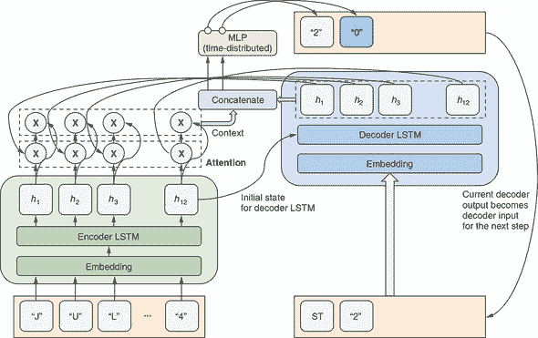

首先，我们为编码器和解码器中的嵌入和 LSTM 层定义了一些常量：

```js
  const embeddingDims = 64;
  const lstmUnits = 64;
```

我们将构建的模型接受两个输入，因此我们必须使用功能模型 API 而不是顺序 API。我们从模型的符号输入开始，分别是编码器输入和解码器输入：

```js
  const encoderInput = tf.input({shape: [inputLength]});
  const decoderInput = tf.input({shape: [outputLength]});
```

编码器和解码器都对它们各自的输入序列应用了一个嵌入层。编码器的代码看起来像这样

```js
  let encoder = tf.layers.embedding({
    inputDim: inputVocabSize,
    outputDim: embeddingDims,
    inputLength,
    maskZero: true
  }).apply(encoderInput);
```

这类似于我们在 IMDb 情感问题中使用的嵌入层，但它是对字符而不是单词进行嵌入。这表明嵌入方法并不局限于单词。事实上，它足够灵活，可以应用于任何有限的、离散的集合，比如音乐类型、新闻网站上的文章、一个国家的机场等等。嵌入层的`maskZero: true`配置指示下游的 LSTM 跳过所有零值的步骤。这样就可以节省在已经结束的序列上的不必要计算。

LSTM 是一种我们尚未详细介绍的 RNN 类型。我们不会在这里讨论其内部结构。简而言之，它类似于 GRU（图 9.4）, 通过使得在多个时间步中传递状态变得更容易来解决梯度消失的问题。Chris Olah 的博文“理解 LSTM 网络”，在本章末尾提供了指针在 “进一步阅读资料” 中，对 LSTM 结构和机制进行了出色的评述和可视化。我们的编码器 LSTM 应用在字符嵌入向量上：

```js
  encoder = tf.layers.lstm({
    units: lstmUnits,
    returnSequences: true
  }).apply(encoder);
```

`returnSequences: true` 配置使得 LSTM 的输出是输出向量序列，而不是默认的单个向量输出（就像我们在温度预测和情感分析模型中所做的那样）。这一步是下游注意力机制所需的。

跟随编码器 LSTM 的 `GetLastTimestepLayer` 层是一个自定义定义的层：

```js
  const encoderLast = new GetLastTimestepLayer({
    name: 'encoderLast'
  }).apply(encoder);
```

它简单地沿着时间维度（第二维度）切片时间序列张量并输出最后一个时间步。这使我们能够将编码器 LSTM 的最终状态发送到解码器 LSTM 作为其初始状态。这种连接是解码器获取有关输入序列信息的方式之一。这在 图 9.11 中用将绿色编码器块中的 *h*[12] 与蓝色解码器块中的解码器 LSTM 层连接的箭头进行了说明。

代码的解码器部分以类似于编码器的拓扑结构的嵌入层和 LSTM 层开始：

```js
  let decoder = tf.layers.embedding({
    inputDim: outputVocabSize,
    outputDim: embeddingDims,
    inputLength: outputLength,
    maskZero: true
  }).apply(decoderInput);
  decoder = tf.layers.lstm({
    units: lstmUnits,
    returnSequences: true
  }).apply(decoder, {initialState: [encoderLast, encoderLast]});
```

在代码片段的最后一行，注意编码器的最终状态如何用作解码器的初始状态。如果你想知道为什么在这里的代码的最后一行中重复使用符号张量 `encoderLast`，那是因为 LSTM 层包含两个状态，不像我们在 simpleRNN 和 GRU 中看到的单状态结构。

解码器更强大的另一种方式是获得输入序列的视图，当然，这是通过注意力机制实现的。注意力是编码器 LSTM 输出和解码器 LSTM 输出的点积（逐元素相乘），然后是 softmax 激活：

```js
  let attention = tf.layers.dot({axes: [2, 2]}).apply([decoder, encoder]);
  attention = tf.layers.activation({
    activation: 'softmax',
    name: 'attention'
  }).apply(attention);
```

编码器 LSTM 的输出形状为 `[null, 12, 64]`，其中 12 是输入序列的长度，64 是 LSTM 的大小。解码器 LSTM 的输出形状为 `[null, 10, 64]`，其中 10 是输出序列的长度，64 是 LSTM 的大小。在最后一个（LSTM 特征）维度上执行两者的点积，得到 `[null, 10, 12]` 的形状（即 `[null, inputLength, outputLength]`）。对点积应用 softmax 将值转换为概率分数，保证它们在矩阵的每一列上都是正数且总和为 1。这是我们模型中心的注意力矩阵。其值是早期 图 9.9 中可视化的。

然后，注意力矩阵应用于编码器 LSTM 的序列输出。这是转换过程学习如何在每个步骤上关注输入序列（以其编码形式）中的不同元素的方式。将注意力应用于编码器输出的结果称为*上下文*：

```js
  const context = tf.layers.dot({
    axes: [2, 1],
    name: 'context'
  }).apply([attention, encoder]);
```

上下文的形状为`[null, 10, 64]`（即`[null, outputLength, lstmUnits]`）。它与解码器的输出连接在一起，解码器的输出形状也为`[null, 10, 64]`。因此，连接的结果形状为`[null, 10, 128]`：

```js
  const decoderCombinedContext =
      tf.layers.concatenate().apply([context, decoder]);
```

`decoderCombinedContext`包含进入模型最终阶段的特征向量，即生成输出字符的阶段。

输出字符使用包含一个隐藏层和一个 softmax 输出层的 MLP 生成：

```js
  let output = tf.layers.timeDistributed({
    layer: tf.layers.dense({
      units: lstmUnits,
      activation: 'tanh'
    })
  }).apply(decoderCombinedContext);
  output = tf.layers.timeDistributed({
    layer: tf.layers.dense({
      units: outputVocabSize,
      activation: 'softmax'
    })
  }).apply(output);
```

多亏了`timeDistributed`层，所有步骤共享同一个 MLP。`timeDistributed`层接受一个层，并在其输入的时间维度（即第二维度）上重复调用它。这将输入特征形状从`[null, 10, 128]`转换为`[null, 10, 13]`，其中 13 对应于 ISO-8601 日期格式的 11 个可能字符，以及 2 个特殊字符（填充和序列起始）。

所有组件齐备后，我们将它们组装成一个具有两个输入和一个输出的`tf.Model`对象：

```js
  const model = tf.model({
    inputs: [encoderInput, decoderInput],
    outputs: output
  });
```

为了准备训练，我们使用分类交叉熵损失函数调用`compile()`方法。选择这个损失函数是基于转换问题本质上是一个分类问题——在每个时间步，我们从所有可能字符的集合中选择一个字符：

```js
  model.compile({
    loss: 'categoricalCrossentropy',
    optimizer: 'adam'
  });
```

推理时，对模型的输出张量应用`argMax()`操作以获取获胜的输出字符。在转换的每一步中，获胜的输出字符都会附加到解码器的输入中，因此下一转换步骤可以使用它（参见图 9.11 右端的箭头）。正如我们之前提到的，这个迭代过程最终产生整个输出序列。

### 进一步阅读的材料

+   Chris Olah，《理解 LSTM 网络》，博客，2015 年 8 月 27 日，[`mng.bz/m4Wa`](http://mng.bz/m4Wa)。

+   Chris Olah 和 Shan Carter，《注意力和增强递归神经网络》，Distill，2016 年 9 月 8 日，[`distill.pub/2016/augmented-rnns/`](https://distill.pub/2016/augmented-rnns/)。

+   Andrej Karpathy，《递归神经网络的不合理有效性》，博客，2015 年 5 月 21 日，[`mng.bz/6wK6`](http://mng.bz/6wK6)。

+   Zafarali Ahmed，《如何使用 Keras 可视化您的递归神经网络和注意力》，Medium，2017 年 6 月 29 日，[`mng.bz/6w2e`](http://mng.bz/6w2e)。

+   在日期转换示例中，我们描述了一种基于`argMax()`的解码技术。这种方法通常被称为*贪婪解码*技术，因为它在每一步都提取具有最高概率的输出符号。贪婪解码方法的一个流行替代方案是*波束搜索*解码，它检查更大范围的可能输出序列，以确定最佳序列。你可以从 Jason Brownlee 的文章“如何为自然语言处理实现波束搜索解码器”中了解更多信息，2018 年 1 月 5 日，[`machinelearningmastery.com/beam-search-decoder-natural-language-processing/`](https://machinelearningmastery.com/beam-search-decoder-natural-language-processing/)。

+   Stephan Raaijmakers，《自然语言处理的深度学习》，Manning Publications，在出版中，[www.manning.com/books/deep-learning-for-natural-language-processing](http://www.manning.com/books/deep-learning-for-natural-language-processing)。

### 练习

1.  尝试重新排列各种非连续数据的数据元素顺序。确认这种重新排序对建模的损失指标值（例如准确度）没有影响（超出由权重参数的随机初始化引起的随机波动）。你可以为以下两个问题进行此操作：

    1.  在鸢尾花示例（来自第三章）中，通过修改行来重新排列四个数字特征（花瓣长度、花瓣宽度、萼片长度和萼片宽度）的顺序

        ```js
          shuffledData.push(data[indices[i]]);
        ```

        在 tfjs-examples 仓库的 iris/data.js 文件中。特别是，改变`data[indices[i]]`中四个元素的顺序。这可以通过 JavaScript 数组的`slice()`和`concat()`方法来完成。请注意，所有示例的重新排列顺序应该是相同的。你可以编写一个 JavaScript 函数来执行重新排序。

    1.  在我们为 Jena 气象问题开发的线性回归器和 MLP 中，尝试重新排列 240 个时间步长*和*14 个数字特征（气象仪器测量）。具体来说，你可以通过修改 jena-weather/data.js 中的`nextBatchFn()`函数来实现这一点。实现重新排序最容易的地方是

        ```js
        samples.set(value, j, exampleRow, exampleCol++);
        ```

        在这里，你可以使用一个执行固定排列的函数将索引`exampleRow`映射到一个新值，并以类似的方式映射`exampleCol`。

1.  我们为 IMDb 情感分析构建的 1D 卷积神经网络仅包含一个 conv1d 层（参见清单 9.8）。正如我们讨论的那样，在其上叠加更多的 conv1d 层可能会给我们一个更深的 1D 卷积神经网络，能够捕捉到更长一段单词的顺序信息。在这个练习中，尝试修改 sentiment/train.js 中 `buildModel()` 函数中的代码。目标是在现有的层之后添加另一个 conv1d 层，重新训练模型，并观察其分类精度是否有所提高。新的 conv1d 层可以使用与现有层相同数量的滤波器和内核大小。此外，请阅读修改后模型的摘要中的输出形状，并确保您理解 `filters` 和 `kernelSize` 参数如何影响新 conv1d 层的输出形状。

1.  在日期转换注意事项示例中，尝试添加更多的输入日期格式。以下是您可以选择的新格式，按照编码难度递增的顺序排序。您也可以自己想出自己的日期格式：

    1.  YYYY-MMM-DD 格式：例如，“2012 年 3 月 8 日”或“2012 年 3 月 18 日”。根据单个数字日期是否在前面补零（如 2015/03/12），这实际上可能是两种不同的格式。但是，无论如何填充，此格式的最大长度都小于 12，并且所有可能的字符都已经在 date-conversion-attention/date_format.js 中的 `INPUT_VOCAB` 中。因此，只需向文件添加一个或两个函数即可，这些函数可以模仿现有函数，例如 `dateTupleToMMMSpaceDDSpaceYY()`。确保将新函数添加到文件中的 `INPUT_FNS` 数组中，以便它们可以包含在训练中。作为最佳实践，您还应该为新的日期格式函数添加单元测试到 date-conversion-attention/date_format_test.js 中。

    1.  一个使用序数作为日期部分的格式，比如“3 月 8 日，2012 年”。请注意，这与现有的`dateTupleToMMMSpaceDDComma-SpaceYYYY()`格式相同，只是日期数字后缀了序数后缀（`"st"`，`"nd"`和`"th"`）。你的新函数应该包括根据日期值确定后缀的逻辑。此外，你需要将`date_format_test.js`中的`INPUT_LENGTH`常量修改为一个更大的值，因为此格式中日期字符串的最大可能长度超过了当前值 12。此外，需要将字母`"t"`和`"h"`添加到`INPUT_VOCAB`中，因为它们不出现在任何三个字母月份字符串中。

    1.  现在考虑一个使用完整的英文月份名称拼写的格式，比如“2012 年 3 月 8 日”。输入日期字符串的最大可能长度是多少？你应该如何相应地更改`date_format.js`中的`INPUT_VOCAB`？

### 摘要

+   由于能够提取和学习事物的顺序信息，循环神经网络（RNN）可以在涉及顺序输入数据的任务中胜过前馈模型（例如 MLP）。我们通过将 simpleRNN 和 GRU 应用于温度预测问题的示例来看到这一点。

+   TensorFlow.js 提供了三种类型的 RNN：simpleRNN、GRU 和 LSTM。后两种类型比 simpleRNN 更复杂，因为它们使用更复杂的内部结构来使得能够在许多时间步骤中保持内存状态，从而缓解了梯度消失问题。GRU 的计算量比 LSTM 小。在大多数实际问题中，您可能希望使用 GRU 和 LSTM。

+   在构建文本的神经网络时，文本输入首先需要表示为数字向量。这称为文本向量化。文本向量化的最常用方法包括 one-hot 和 multi-hot 编码，以及更强大的嵌入方法。

+   在词嵌入中，每个单词被表示为一个稀疏向量，其中元素值通过反向传播学习，就像神经网络的所有其他权重参数一样。在 TensorFlow.js 中执行嵌入的函数是`tf.layers.embedding()`。

+   seq2seq 问题与基于序列的回归和分类问题不同，因为它们涉及生成一个新序列作为输出。循环神经网络（RNN）可以与其他类型的层一起用于形成编码器-解码器架构来解决 seq2seq 问题。

+   在 seq2seq 问题中，注意机制使得输出序列的不同项能够选择性地依赖于输入序列的特定元素。我们演示了如何训练基于注意力的编码器-解码器网络来解决简单的日期转换问题，并在推断过程中可视化注意力矩阵。
