##  第十一章：生成深度学习

*这一章涵盖了*

+   生成深度学习是什么，它的应用以及它与我们迄今看到的深度学习任务有何不同

+   如何使用 RNN 生成文本

+   什么是潜在空间以及它如何成为生成新图像的基础，通过变分自编码器示例

+   生成对抗网络的基础知识

深度神经网络展示了生成看起来或听起来真实的图像、声音和文本的一些令人印象深刻的任务。如今，深度神经网络能够创建高度真实的人脸图像，^([1])合成自然音质的语音，^([2])以及组织连贯有力的文本，^([3])这仅仅是一些成就的名单。这种*生成*模型在许多方面都很有用，包括辅助艺术创作，有条件地修改现有内容，以及增强现有数据集以支持其他深度学习任务。^([4])

> ¹
> 
> Tero Karras, Samuli Laine 和 Timo Aila, “一种基于风格的生成对抗网络,” 提交日期：2018 年 12 月 12 日, [`arxiv.org/abs/1812.04948`](https://arxiv.org/abs/1812.04948). 在 [`thispersondoesnotexist.com/`](https://thispersondoesnotexist.com/) 查看演示。
> 
> ²
> 
> Aäron van den Oord 和 Sander Dieleman, “WaveNet: 一种用于原始音频的生成模型,” 博客, 2016 年 9 月 8 日, [`mng.bz/MOrn`](http://mng.bz/MOrn).
> 
> ³
> 
> “更好的语言模型及其影响”，OpenAI, 2019, [`openai.com/blog/better-language-models/`](https://openai.com/blog/better-language-models/).
> 
> ⁴
> 
> Antreas Antoniou, Amos Storkey 和 Harrison Edwards, “数据增强生成对抗网络,” 提交日期：2017 年 11 月 12 日, [`arxiv.org/abs/1711.04340`](https://arxiv.org/abs/1711.04340).

除了在潜在顾客的自拍照上化妆等实际应用外，生成模型还值得从理论上研究。生成模型和判别模型是机器学习中两种根本不同类型的模型。到目前为止，我们在本书中研究的所有模型都是*判别*模型。这些模型旨在将输入映射到离散或连续的值，而不关心生成输入的过程。回想一下，我们构建的网络针对钓鱼网站、鸢尾花、MNIST 数字和音频声音的分类器，以及对房价进行回归的模型。相比之下，生成模型旨在数学地模拟不同类别示例生成的过程。但是一旦生成模型学习到这种生成性知识，它也可以执行判别性任务。因此，与判别模型相比，可以说生成模型“更好地理解”数据。

本节介绍了文本和图像的深度生成模型的基础知识。在本章结束时，您应该熟悉基于 RNN 的语言模型、面向图像的自编码器和生成对抗网络的思想。您还应该熟悉这些模型在 TensorFlow.js 中的实现方式，并能够将这些模型应用到您自己的数据集上。

### 10.1\. 使用 LSTM 生成文本

让我们从文本生成开始。为此，我们将使用我们在前一章中介绍的 RNN。虽然您将在这里看到的技术生成文本，但它并不局限于这个特定的输出领域。该技术可以适应生成其他类型的序列，比如音乐——只要能够以合适的方式表示音符，并找到一个足够的训练数据集。[5]类似的思想可以应用于生成素描中的笔画，以便生成漂亮的素描[6]，甚至是看起来逼真的汉字[7]。

> ⁵
> 
> 例如，请参阅 Google 的 Magenta 项目中的 Performance-RNN：[`magenta.tensorflow.org/performance-rnn`](https://magenta.tensorflow.org/performance-rnn)。
> 
> ⁶
> 
> 例如，请参阅 David Ha 和 Douglas Eck 的 Sketch-RNN：[`mng.bz/omyv`](http://mng.bz/omyv)。
> 
> ⁷
> 
> David Ha，“Recurrent Net Dreams Up Fake Chinese Characters in Vector Format with TensorFlow”，博客，2015 年 12 月 28 日，[`mng.bz/nvX4`](http://mng.bz/nvX4)。

#### 10.1.1\. 下一个字符预测器：生成文本的简单方法

首先，让我们定义文本生成任务。假设我们有一个相当大的文本数据语料库（至少几兆字节）作为训练输入，比如莎士比亚的全部作品（一个非常长的字符串）。我们想要训练一个模型，尽可能地生成看起来*像*训练数据的新文本。这里的关键词当然是“看起来”。现在，让我们满足于不精确地定义“看起来”的含义。在展示方法和结果之后，这个意义将变得更加清晰。

让我们思考如何在深度学习范式中制定这个任务。在前一章节涉及的日期转换示例中，我们看到一个精确格式化的输出序列可以从一个随意格式化的输入序列中生成。那个文本到文本的转换任务有一个明确定义的答案：ISO-8601 格式中的正确日期字符串。然而，这里的文本生成任务似乎不适合这一要求。没有明确的输入序列，并且“正确”的输出并没有明确定义；我们只想生成一些“看起来真实的东西”。我们能做什么呢？

一个解决方案是构建一个模型，预测在一系列字符之后会出现什么字符。这被称为 *下一个字符预测*。例如，对于在莎士比亚数据集上训练良好的模型，当给定字符串“Love looks not with the eyes, b”作为输入时，应该以高概率预测字符“u”。然而，这只生成一个字符。我们如何使用模型生成一系列字符？为了做到这一点，我们简单地形成一个与之前相同长度的新输入序列，方法是将前一个输入向左移动一个字符，丢弃第一个字符，并将新生成的字符（“u”）粘贴到末尾。在这种情况下，我们的下一个字符预测器的新输入就是“ove looks not with the eyes, bu”。给定这个新的输入序列，模型应该以高概率预测字符“t”。这个过程，如图 10.1 所示，可以重复多次，直到生成所需长度的序列。当然，我们需要一个初始的文本片段作为起点。为此，我们可以从文本语料库中随机抽样。

##### 图 10.1\. 用基于 RNN 的下一个字符预测器生成文本序列的示意图，以初始输入文本片段作为种子。在每个步骤中，RNN 使用输入文本预测下一个字符。然后，将输入文本与预测的下一个字符连接起来，丢弃第一个字符。结果形成下一个步骤的输入。在每个步骤中，RNN 输出字符集中所有可能字符的概率分数。为了确定实际的下一个字符，进行随机抽样。

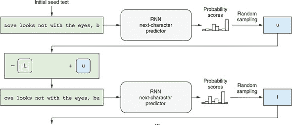

这种表述将序列生成任务转化为基于序列的分类问题。这个问题类似于我们在第九章中看到的 IMDb 情感分析问题，其中从固定长度的输入中预测二进制类别。文本生成模型基本上做了同样的事情，尽管它是一个多类别分类问题，涉及到 *N* 个可能的类别，其中 *N* 是字符集的大小——即文本数据集中所有唯一字符的数量。

这种下一个字符预测的表述在自然语言处理和计算机科学中有着悠久的历史。信息论先驱克劳德·香农进行了一项实验，在实验中，被要求的人类参与者在看到一小段英文文本后猜测下一个字母。[8] 通过这个实验，他能够估计出在给定上下文的情况下，典型英文文本中每个字母的平均不确定性。这种不确定性约为 1.3 位的熵，告诉我们每个英文字母所携带的平均信息量。

> ⁸
> 
> 1951 年的原始论文可在[`mng.bz/5AzB`](http://mng.bz/5AzB)中获取。

当字母以完全随机的方式出现时，1.3 位的结果比如果 26 个字母完全随机出现所需的位数要少，该数值为 log2 = 4.7 位数。这符合我们的直觉，因为我们知道英语字母并不是随机出现的，而是具有某些模式。在更低的层次上，只有某些字母序列是有效的英语单词。在更高的层次上，只有某些单词的排序满足英语语法。在更高的层次上，只有某些语法上有效的句子实际上是有意义的。

如果你考虑一下，这正是我们的文本生成任务的基础所在：学习所有这些层面的模式。注意，我们的模型基本上是被训练来做 Shannon 实验中的那个志愿者所做的事情——也就是猜测下一个字符。现在，让我们来看一下示例代码以及它是如何工作的。请记住 Shannon 的 1.3 位结果，因为我们稍后会回到它。

#### 10.1.2《LSTM-text-generation》示例

在 tfjs-examples 仓库中的 `lstm-text-generation` 示例中，我们训练了一个基于 LSTM 的下一个字符预测器，并利用它生成了新的文本。训练和生成都在 JavaScript 中使用 TensorFlow.js 完成。你可以在浏览器中或者使用 Node.js 运行示例。前者提供了更加图形化和交互式的界面，但后者具有更快的训练速度。

要在浏览器中查看此示例的运行情况，请使用以下命令：

```js
git clone https://github.com/tensorflow/tfjs-examples.git
cd tfjs-examples/lstm-text-generation
yarn && yarn watch
```

在弹出的页面中，你可以选择并加载四个提供的文本数据集中的一个来训练模型。在下面的讨论中，我们将使用莎士比亚的数据集。一旦数据加载完成，你可以点击“创建模型”按钮为它创建一个模型。一个文本框允许你调整创建的 LSTM 将具有的单元数。它默认设置为 128。但你也可以尝试其他值，例如 64。如果你输入由逗号分隔的多个数字（例如 `128,128`），则创建的模型将包含多个叠放在一起的 LSTM 层。

若要使用 tfjs-node 或 tfjs-node-gpu 在后端执行训练，请使用 `yarn train` 命令而不是 `yarn watch`：

```js
yarn train shakespeare \
      --lstmLayerSize 128,128 \
      --epochs 120 \
      --savePath ./my-shakespeare-model
```

如果你已经正确地设置了 CUDA-enabled GPU，可以在命令中添加 `--gpu` 标志，让训练过程在 GPU 上运行，这将进一步加快训练速度。`--lstmLayerSize` 标志在浏览器版本的示例中起到了 LSTM-size 文本框的作用。前面的命令将创建并训练一个由两个 LSTM 层组成的模型，每个 LSTM 层都有 128 个单元，叠放在一起。

此处正在训练的模型具有堆叠 LSTM 架构。堆叠 LSTM 层是什么意思？在概念上类似于在 MLP 中堆叠多个密集层，这增加了 MLP 的容量。类似地，堆叠多个 LSTM 允许输入序列在被最终 LSTM 层转换为最终回归或分类输出之前经历多个 seq2seq 表示转换阶段。图 10.2 给出了这种架构的图解。一个重要的事情要注意的是，第一个 LSTM 的`returnSequence`属性被设置为`true`，因此生成包括输入序列的每个单个项目的输出序列。这使得可以将第一个 LSTM 的输出馈送到第二个 LSTM 中，因为 LSTM 层期望顺序输入而不是单个项目输入。

##### 图 10.2\. 在模型中如何堆叠多个 LSTM 层。在这种情况下，两个 LSTM 层被堆叠在一起。第一个 LSTM 的`returnSequence`属性被设置为`true`，因此输出一个项目序列。第一个 LSTM 的序列输出被传递给第二个 LSTM 作为其输入。第二个 LSTM 输出一个单独的项目而不是项目序列。单个项目可以是回归预测或 softmax 概率数组，它形成模型的最终输出。

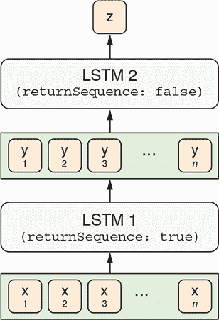

清单 10.1 包含构建下一个字符预测模型的代码，其架构如图 10.2 所示（摘自 lstm-text-generation/model.js）。请注意，与图表不同，代码包括一个稠密层作为模型的最终输出。密集层具有 softmax 激活。回想一下，softmax 激活将输出归一化，使其值介于 0 和 1 之间，并总和为 1，就像概率分布一样。因此，最终的密集层输出表示唯一字符的预测概率。

`createModel()` 函数的 `lstmLayerSize` 参数控制 LSTM 层的数量和每个层的大小。第一个 LSTM 层的输入形状根据 `sampleLen`（模型一次接收多少个字符）和 `charSetSize`（文本数据中有多少个唯一字符）进行配置。对于基于浏览器的示例，`sampleLen` 是硬编码为 40 的；对于基于 Node.js 的训练脚本，可以通过 `--sampleLen` 标志进行调整。对于莎士比亚数据集，`charSetSize` 的值为 71。字符集包括大写和小写英文字母、标点符号、空格、换行符和几个其他特殊字符。给定这些参数，清单 10.1 中的函数创建的模型具有输入形状 `[40, 71]`（忽略批处理维度）。该形状对应于 40 个 one-hot 编码字符。模型的输出形状是 `[71]`（同样忽略批处理维度），这是下一个字符的 71 种可能选择的 softmax 概率值。

##### 清单 10.1\. 构建一个用于下一个字符预测的多层 LSTM 模型

```js
export function createModel(sampleLen,                    ***1***
                            charSetSize,                  ***2***
                            lstmLayerSizes) {             ***3***
  if (!Array.isArray(lstmLayerSizes)) {
    lstmLayerSizes = [lstmLayerSizes];
  }

  const model = tf.sequential();
  for (let i = 0; i < lstmLayerSizes.length; ++i) {
    const lstmLayerSize = lstmLayerSizes[i];
    model.add(tf.layers.lstm({                            ***4***
      units: lstmLayerSize,
      returnSequences: i < lstmLayerSizes.length - 1,     ***5***
      inputShape: i === 0 ?
          [sampleLen, charSetSize] : undefined            ***6***
    }));
  }
  model.add(
      tf.layers.dense({
        units: charSetSize,
        activation: 'softmax'
  }));                                                    ***7***

  return model;
}
```

+   ***1*** 模型输入序列的长度

+   ***2*** 所有可能的唯一字符的数量

+   ***3*** 模型的 LSTM 层的大小，可以是单个数字或数字数组

+   ***4*** 模型以一堆 LSTM 层开始。

+   ***5*** 设置 `returnSequences` 为 `true` 以便可以堆叠多个 LSTM 层

+   ***6*** 第一个 LSTM 层是特殊的，因为它需要指定其输入形状。

+   ***7*** 模型以一个密集层结束，其上有一个 softmax 激活函数，适用于所有可能的字符，反映了下一个字符预测问题的分类特性。

为了准备模型进行训练，我们使用分类交叉熵损失对其进行编译，因为该模型本质上是一个 71 路分类器。对于优化器，我们使用 RMSProp，这是递归模型的常用选择：

```js
const optimizer = tf.train.rmsprop(learningRate);
model.compile({optimizer: optimizer, loss: 'categoricalCrossentropy'});
```

输入模型训练的数据包括输入文本片段和每个片段后面的字符的对，所有这些都编码为 one-hot 向量（参见图 10.1）。在 lstm-text-generation/data.js 中定义的 `TextData` 类包含从训练文本语料库生成此类张量数据的逻辑。那里的代码有点乏味，但思想很简单：随机从我们的文本语料库中的非常长的字符串中抽取固定长度的片段，并将它们转换为 one-hot 张量表示。

如果您正在使用基于 Web 的演示，页面的“模型训练”部分允许您调整超参数，例如训练时期的数量、每个时期进入的示例数量、学习率等等。单击“训练模型”按钮启动模型训练过程。对于基于 Node.js 的训练，这些超参数可以通过命令行标志进行调整。有关详细信息，您可以通过输入 `yarn train --help` 命令获取帮助消息。

根据您指定的训练周期数和模型大小，训练时间可能会在几分钟到几个小时之间不等。基于 Node.js 的训练作业在每个训练周期结束后会自动打印模型生成的一些示例文本片段（见 表格 10.1）。随着训练的进行，您应该看到损失值从初始值约为 3.2 不断降低，并在 1.4–1.5 的范围内收敛。大约经过 120 个周期后，损失减小后，生成的文本质量应该会提高，以至于在训练结束时，文本应该看起来*有些*像莎士比亚的作品，而验证损失应该接近 1.5 左右——并不远离香农实验中的每字符信息不确定性 1.3 比特。但请注意，考虑到我们的训练范式和模型容量，生成的文本永远不会像实际的莎士比亚的写作。

##### 表格 10.1\. 基于 LSTM 的下一字符预测模型生成的文本样本。生成基于种子文本。初始种子文本：" "在每小时的关于你的特定繁荣的议会中，和 lo"。^([a]) 根据种子文本后续的实际文本（用于比较）："爱你不会比你的老父亲梅奈尼乌斯对你更差！..."。

> ^a
> 
> 摘自 *莎士比亚的《科里奥兰纳斯》*，第 5 幕，第 2 场。请注意，示例中包括换行和单词中间的停顿（love）。

| 训练周期 | 验证损失 | T = 0 | T = 0.25 | T = 0.5 | T = 0.75 |
| --- | --- | --- | --- | --- | --- |
| 5 | 2.44 | "rle the the the the the the the the the the the the the the the the the the the the the the the the the the the the the " | "te ans and and and and and warl torle an at an yawl and tand and an an ind an an in thall ang ind an tord and and and wa" | "te toll nlatese ant ann, tomdenl, teurteeinlndting fall ald antetetell linde ing thathere taod winld mlinl theens tord y" | "p, af ane me pfleh; fove this? Iretltard efidestind ants anl het insethou loellr ard, |
| 25 | 1.96 | "ve tray the stanter an truent to the stanter to the stanter to the stanter to the stanter to the stanter to the stanter " | "ve to the enter an truint to the surt an truin to me truent me the will tray mane but a bean to the stanter an trust tra" | "ve of marter at it not me shank to an him truece preater the beaty atweath and that marient shall me the manst on hath s" | "rd; not an an beilloters An bentest the like have bencest on it love gray to dreath avalace the lien I am sach me, m" |
| 50 | 1.67 | "世界的世界的世界的世界的世界的世界的世界的世界的世界的世界的世界" | "他们是他们的英语是世界的世界的立场的证明了他们的弦应该世界我" | "他们的愤怒的苦恼的，因为你对于你的设备的现在的将会" | "是我的光，我将做 vall twell。斯伯" |
| 100 | 1.61 | "越多的人越多，越奇怪的是，越奇怪的是，越多的人越多" | "越多的人越多越多" | "越多的人越多。为了这样一个内容，" | "和他们的 consent，你将会变成三个。长的和一个心脏和不奇怪的。一位 G" |
| 120 | 1.49 | "打击的打击的打击的打击的打击的打击和打击的打击的打击" | "亲爱的打击我的排序的打击，打击打击，亲爱的打击和" | "为他的兄弟成为这样的嘲笑。一个模仿的" | "这是我的灵魂。Monty 诽谤他你的矫正。这是为了他的兄弟，这是愚蠢的" | "相信他。因此他们会从我的灵魂中走出来" |

表格 10.1 展示了在四个不同 *温度值* 下采样的一些文本，这是一个控制生成文本随机性的参数。在生成文本的样本中，您可能已经注意到，较低的温度值与更多重复和机械化的文本相关联，而较高的值与不可预测的文本相关联。由 Node.js 的训练脚本演示的最高温度值默认为 0.75，有时会导致看起来像英语但实际上不是英语单词的字符序列（例如表格中的“stratter”和“poins”）。在接下来的部分中，我们将探讨温度是如何工作的，以及为什么它被称为温度。

#### 10.1.3\. 温度：生成文本中的可调随机性

列表 10.2 中的函数 `sample()` 负责根据模型在文本生成过程的每一步的输出概率来确定选择哪个字符。正如您所见，该算法有些复杂：它涉及到三个低级 TensorFlow.js 操作的调用：`tf.div()`、`tf.log()` 和 `tf.multinomial()`。为什么我们使用这种复杂的算法而不是简单地选择具有最高概率得分的选项，这将需要一个单独的 `argMax()` 调用呢？

如果我们这样做，文本生成过程的输出将是*确定性*的。也就是说，如果你多次运行它，它将给出完全相同的输出。到目前为止，我们所见到的深度神经网络都是确定性的，也就是说，给定一个输入张量，输出张量完全由网络的拓扑结构和其权重值决定。如果需要的话，你可以编写一个单元测试来断言其输出值（见第十二章讨论机器学习算法的测试）。对于我们的文本生成任务来说，这种确定性*并不*理想。毕竟，写作是一个创造性的过程。即使给出相同的种子文本，生成的文本也更有趣些带有一些随机性。这就是`tf.multinomial()`操作和温度参数有用的地方。`tf.multinomial()`是随机性的来源，而温度控制着随机性的程度。

##### 列表 10.2。带有温度参数的随机抽样函数

```js
export function sample(probs, temperature) {
  return tf.tidy(() => {
    const logPreds = tf.div(
        tf.log(probs),                                                     ***1***
        Math.max(temperature, 1e-6));                                      ***2***
    const isNormalized = false;
    return tf.multinomial(logPreds, 1, null, isNormalized).dataSync()[0];  ***3***
  });
}
```

+   ***1*** 模型的密集层输出归一化的概率分数；我们使用 log()将它们转换为未归一化的 logits，然后再除以温度。

+   ***2*** 我们用一个小的正数来防止除以零的错误。除法的结果是调整了不确定性的 logits。

+   ***3*** `tf.multinomial()`是一个随机抽样函数。它就像一个多面的骰子，每个面的概率不相等，由 logPreds——经过温度缩放的 logits 来确定。

在列表 10.2 的`sample()`函数中最重要的部分是以下行：

```js
const logPreds = tf.div(tf.log(probs),
                        Math.max(temperature, 1e-6));
```

它获取了`probs`（模型的概率输出）并将它们转换为`logPreds`，概率的对数乘以一个因子。对数运算（`tf.log()`）和缩放（`tf.div()`）做了什么？我们将通过一个例子来解释。为了简单起见，假设只有三个选择（字符集中的三个字符）。假设我们的下一个字符预测器在给定某个输入序列时产生了以下三个概率分数：

```js
[0.1, 0.7, 0.2]
```

让我们看看两个不同的温度值如何改变这些概率。首先，让我们看一个相对较低的温度：0.25。缩放后的 logits 是

```js
log([0.1, 0.7, 0.2]) / 0.25 = [-9.2103, -1.4267, -6.4378]
```

要理解 logits 的含义，我们通过使用 softmax 方程将它们转换回实际的概率分数，这涉及将 logits 的指数和归一化：

```js
exp([-9.2103, -1.4267, -6.4378]) / sum(exp([-9.2103, -1.4267, -6.4378]))
= [0.0004, 0.9930, 0.0066]
```

正如你所看到的，当温度为 0.25 时，我们的 logits 对应一个高度集中的概率分布，在这个分布中，第二个选择的概率远高于其他两个选择（见图 10.3 的第二面板）。

##### 图 10.3\. 不同温度（T）值缩放后的概率得分。较低的 T 值导致分布更集中（更少随机）；较高的 T 值导致分布在类别之间更均等（更多随机）。T 值为 1 对应于原始概率（无变化）。请注意，无论 T 的值如何，三个选择的相对排名始终保持不变。

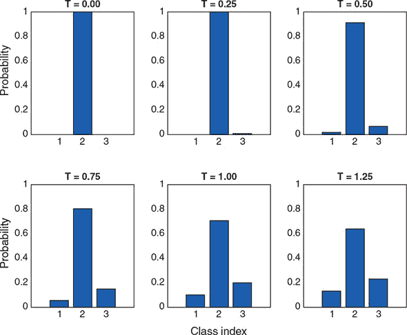

如果我们使用更高的温度，比如说 0.75，通过重复相同的计算，我们得到

```js
log([0.1, 0.7, 0.2]) / 0.75 = [-3.0701, -0.4756, -2.1459]
exp([-3.0701, -0.4756, -2.1459]) / sum([-3.0701, -0.4756, -2.1459])
= [0.0591, 0.7919 0.1490]
```

与之前的情况相比，这是一个峰值较低的分布，当温度为 0.25 时（请参阅图 10.3 的第四面板）。但是与原始分布相比，它仍然更尖峭。你可能已经意识到，温度为 1 时，你将得到与原始概率完全相同的结果（图 10.3，第五面板）。大于 1 的温度值会导致选择之间的概率分布更“均等”（图 10.3，第六面板），而选择之间的排名始终保持不变。

这些转换后的概率（或者说它们的对数）然后被馈送到 `tf.multinomial()` 函数中，该函数的作用类似于一个多面骰子，其面的不等概率由输入参数控制。这给我们了下一个字符的最终选择。

所以，这就是温度参数如何控制生成文本的随机性。术语 *temperature* 源自热力学，我们知道，温度较高的系统内部混乱程度较高。这个类比在这里是合适的，因为当我们在代码中增加温度值时，生成的文本看起来更加混乱。温度值有一个“甜蜜的中间值”。在此之下，生成的文本看起来太重复和机械化；在此之上，文本看起来太不可预测和古怪。

这结束了我们对文本生成 LSTM 的介绍。请注意，这种方法非常通用，可以应用于许多其他序列，只需进行适当的修改即可。例如，如果在足够大的音乐分数数据集上进行训练，LSTM 可以通过逐步从之前的音符中预测下一个音符来作曲。^([9])

> ⁹
> 
> Allen Huang 和 Raymond Wu，“Deep Learning for Music”，2016 年 6 月 15 日提交，[`arxiv.org/abs/1606.04930`](https://arxiv.org/abs/1606.04930)。

### 10.2\. 变分自动编码器：找到图像的高效和结构化的向量表示

前面的部分为您介绍了如何使用深度学习来生成文本等连续数据。在本章的剩余部分，我们将讨论如何构建神经网络来生成图像。我们将研究两种类型的模型：变分自编码器（VAE）和生成对抗网络（GAN）。与 GAN 相比，VAE 的历史更悠久，结构更简单。因此，它为您进入基于深度学习的图像生成的快速领域提供了很好的入口。

#### 10.2.1\. 传统自编码器和 VAE: 基本概念

图 10.4 以示意方式显示了自编码器的整体架构。乍一看，自编码器是一个有趣的模型，因为它的输入和输出模型的图像大小是相同的。在最基本的层面上，自编码器的损失函数是输入和输出之间的均方误差（MSE）。这意味着，如果经过适当训练，自编码器将接受一个图像，并输出一个几乎相同的图像。这种模型到底有什么用呢？

##### 图 10.4\. 传统自编码器的架构

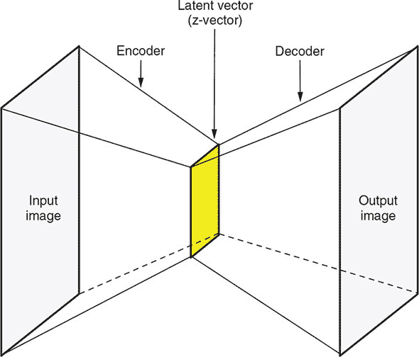

实际上，自编码器是一种重要的生成模型，而且绝不是无用的。对于前面的问题答案在于小时钟形状的架构（图 10.4）。自编码器的最细部分是一个与输入和输出图像相比具有更少元素的向量。因此，由自编码器执行的图像转换是非平凡的：它首先将输入图像转变为高压缩形式的表示，然后在不使用任何额外信息的情况下从该表示中重新构建图像。中间的有效表示称为*潜在向量*，或者*z-向量*。我们将这两个术语互换使用。这些向量所在的向量空间称为*潜在空间*，或者*z-空间*。将输入图像转换为潜在向量的自编码器部分称为*编码器*；将潜在向量转换回图像的后面部分称为*解码器*。

和图像本身相比，潜在向量可以小几百倍，我们很快会通过一个具体的例子进行展示。因此，经过训练的自编码器的编码器部分是一个非常高效的维度约简器。它对输入图像的总结非常简洁，但包含足够重要的信息，以使得解码器可以忠实地复制输入图像，而不需要使用额外的信息。解码器能够做到这一点，这也是非常了不起的。

我们还可以从信息理论的角度来看待自编码器。假设输入和输出图像各包含*N*比特的信息。从表面上看，*N*是每个像素的位深度乘以像素数量。相比之下，自编码器中间的潜在向量由于其小的大小（假设为*m*比特），只能保存极少量的信息。如果*m*小于*N*，那么从潜在向量重构出图像就在理论上不可能。然而，图像中的像素不是完全随机的（完全由随机像素组成的图像看起来像静态噪音）。相反，像素遵循某些模式，比如颜色连续性和所描绘的现实世界对象的特征。这导致*N*的值比基于像素数量和深度的表面计算要小得多。自编码器的任务是学习这种模式；这也是自编码器能够工作的原因。

在自编码器训练完成后，其解码器部分可以单独使用，给定任何潜在向量，它都可以生成符合训练图像的模式和风格的图像。这很好地符合了生成模型的描述。此外，潜在空间将有望包含一些良好的可解释结构。具体而言，潜在空间的每个维度可能与图像的某个有意义的方面相关联。例如，假设我们在人脸图像上训练了一个自编码器，也许潜在空间的某个维度将与微笑程度相关。当你固定潜在向量中所有其他维度的值，仅变化“微笑维度”的值时，解码器产生的图像将是同一张脸，但微笑程度不同（例如，参见图 10.5）。这将使得有趣的应用成为可能，例如在保持所有其他方面不变的情况下，改变输入人脸图像的微笑程度。可以通过以下步骤来完成此操作。首先，通过应用编码器获取输入的潜在向量。然后，仅修改向量的“微笑维度”即可；最后，通过解码器运行修改后的潜在向量。

##### 图 10.5. “微笑维度”。自编码器所学习的潜在空间中期望的结构的示例。


不幸的是，图 10.4 中所示的 *经典自编码器* 并不能产生特别有用和良好结构的潜变量空间。它们在压缩方面也不太出色。因此，到 2013 年，它们在很大程度上已经不再流行了。VAE（Variational Autoencoder）则在 2013 年 12 月由 Diederik Kingma 和 Max Welling 几乎同时发现^([10])，而在 2014 年 1 月由 Danilo Rezende、Shakir Mohamed 和 Daan Wiestra 发现^([11])，通过一点统计魔法增加了自编码器的能力，强制模型学习连续且高度结构化的潜变量空间。VAE 已经证明是一种强大的生成式图像模型。

> ¹⁰
> 
> Diederik P. Kingma 和 Max Welling，“Auto-Encoding Variational Bayes”，2013 年 12 月 20 日提交，[`arxiv.org/abs/1312.6114`](https://arxiv.org/abs/1312.6114)。
> 
> ¹¹
> 
> Danilo Jimenez Rezende，Shakir Mohamed 和 Daan Wierstra，“Stochastic Backpropagation and Approximate Inference in Deep Generative Models”，2014 年 1 月 16 日提交，[`arxiv.org/abs/1401.4082`](https://arxiv.org/abs/1401.4082)。

VAE 不是将输入图像压缩为潜变量空间中的固定向量，而是将图像转化为统计分布的参数——具体来说是**高斯分布**的参数。高斯分布有两个参数：均值和方差（或者等效地，标准差）。VAE 将每个输入图像映射到一个均值上。唯一的额外复杂性在于，如果潜变量空间超过 1D，则均值和方差可以是高于一维的，正如我们将在下面的例子中看到的那样。本质上，我们假设图像是通过随机过程生成的，并且在编码和解码过程中应该考虑到这个过程的随机性。然后，VAE 使用均值和方差参数从分布中随机采样一个向量，并使用该随机向量将其解码回原始输入的大小（参见图 10.6）。这种随机性是 VAE 改善鲁棒性、强迫潜变量空间在每个位置都编码有意义表示的关键方式之一：在解码器解码时，潜变量空间中采样的每个点应该是一个有效的图像输出。

##### 图 10.6\. 比较经典自编码器（面板 A）和 VAE（面板 B）的工作原理。经典自编码器将输入图像映射到一个固定的潜变量向量上，并使用该向量进行解码。相比之下，VAE 将输入图像映射到一个由均值和方差描述的分布上，从该分布中随机采样一个潜变量向量，并使用该随机向量生成解码后的图像。这个 T 恤图案是来自 Fashion-MNIST 数据集的一个例子。

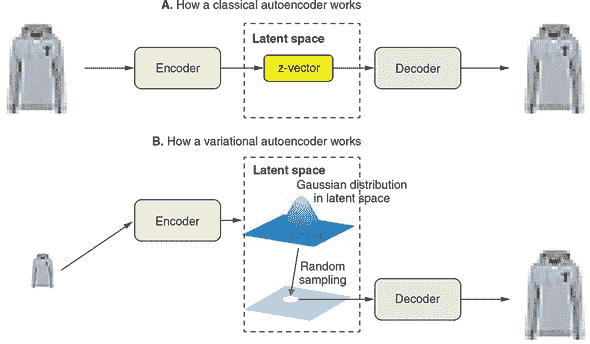

接下来，我们将通过使用 Fashion-MNIST 数据集展示 VAE 的工作原理。正如其名称所示，Fashion-MNIST^([12]) 受到了 MNIST 手写数字数据集的启发，但包含了服装和时尚物品的图像。与 MNIST 图像一样，Fashion-MNIST 图像是 28 × 28 的灰度图像。有着确切的 10 个服装和时尚物品类别（如 T 恤、套头衫、鞋子和包袋；请参见 图 10.6 作为示例）。然而，与 MNIST 数据集相比，Fashion-MNIST 数据集对机器学习算法来说略微“更难”，当前最先进的测试集准确率约为 96.5%，远低于 MNIST 数据集的 99.75% 最先进准确率。^([13]) 我们将使用 TensorFlow.js 构建一个 VAE 并在 Fashion-MNIST 数据集上对其进行训练。然后，我们将使用 VAE 的解码器从 2D 潜在空间中对样本进行采样，并观察该空间内部的结构。

> ¹²
> 
> Han Xiao、Kashif Rasul 和 Roland Vollgraf，“Fashion-MNIST: 用于机器学习算法基准测试的新型图像数据集”，提交于 2017 年 8 月 25 日，[`arxiv.org/abs/1708.07747`](https://arxiv.org/abs/1708.07747)。
> 
> ¹³
> 
> 来源：“所有机器学习问题的最新技术结果”，GitHub，2019 年，[`mng.bz/6w0o`](http://mng.bz/6w0o)。

#### 10.2.2\. VAE 的详细示例：Fashion-MNIST 示例

要查看 fashion-mnist-vae 示例，请使用以下命令：

```js
git clone https://github.com/tensorflow/tfjs-examples.git
cd tfjs-examples/fashion-mnist-vae
yarn
yarn download-data
```

这个例子由两部分组成：在 Node.js 中训练 VAE 和使用 VAE 解码器在浏览器中生成图像。要开始训练部分，请使用以下命令

```js
yarn train
```

如果您正确设置了 CUDA 启用的 GPU，则可以使用 `--gpu` 标志来加速训练：

```js
yarn train --gpu
```

训练在配备有 CUDA GPU 的合理更新的台式机上大约需要五分钟，没有 GPU 的情况下则需要不到一个小时。训练完成后，使用以下命令构建并启动浏览器前端：

```js
yarn watch
```

前端将加载 VAE 的解码器，通过使用正则化的 2D 网格的潜在向量生成多个图像，并在页面上显示这些图像。这将让您欣赏到潜在空间的结构。

从技术角度来看，这就是 VAE 的工作原理：

1.  编码器将输入样本转换为潜在空间中的两个参数：`zMean` 和 `zLogVar`，分别是均值和方差的对数（对数方差）。这两个向量的长度与潜在空间的维度相同。例如，我们的潜在空间将是 2D，因此 `zMean` 和 `zLogVar` 将分别是长度为 2 的向量。为什么我们使用对数方差（`zLogVar`）而不是方差本身？因为方差必须是非负的，但没有简单的方法来强制该层输出的符号要求。相比之下，对数方差允许具有任何符号。通过使用对数，我们不必担心层输出的符号。对数方差可以通过简单的指数运算（`tf.exp()`）操作轻松地转换为相应的方差。

    > ¹⁴
    > 
    > 严格来说，长度为 *N* 的潜在向量的协方差矩阵是一个 *N* × *N* 矩阵。然而，`zLogVar` 是一个长度为 *N* 的向量，因为我们将协方差矩阵约束为对角线矩阵——即，潜在向量的两个不同元素之间没有相关性。

1.  VAE 算法通过使用一个称为 `epsilon` 的向量——与 `zMean` 和 `zLogVar` 的长度相同的随机向量——从潜在正态分布中随机抽样一个潜在向量。在简单的数学方程中，这一步骤在文献中被称为*重参数化*，看起来像是

    ```js
    z = zMean + exp(zLogVar * 0.5) * epsilon
    ```

    乘以 0.5 将方差转换为标准差，这基于标准差是方差的平方根的事实。等效的 JavaScript 代码是

    ```js
    z = zMean.add(zLogVar.mul(0.5).exp().mul(epsilon));
    ```

    (见 listing 10.3。) 然后，`z` 将被馈送到 VAE 的解码器部分，以便生成输出图像。

在我们的 VAE 实现中，潜在向量抽样步骤是由一个名为 `ZLayer` 的自定义层执行的（见 listing 10.3）。我们在 第九章 中简要介绍了一个自定义 TensorFlow.js 层（我们在基于注意力的日期转换器中使用的 `GetLastTimestepLayer` 层）。我们 VAE 使用的自定义层略微复杂，值得解释一下。

`ZLayer` 类有两个关键方法：`computeOutputShape()` 和 `call()`。`computeOutputShape()` 被 TensorFlow.js 用来推断给定输入形状的 `Layer` 实例的输出形状。`call()` 方法包含了实际的数学计算。它包含了先前介绍的方程行。下面的代码摘自 fashion-mnist-vae/model.js。

##### listing 10.3 抽样潜在空间（z 空间）的代码示例

```js
class ZLayer extends tf.layers.Layer {
  constructor(config) {
    super(config);
  }
  computeOutputShape(inputShape) {
    tf.util.assert(inputShape.length === 2 && Array.isArray(inputShape[0]),
        () => `Expected exactly 2 input shapes. ` +
              `But got: ${inputShape}`);             ***1***
    return inputShape[0];                            ***2***
  }
  call(inputs, kwargs) {
    const [zMean, zLogVar] = inputs;
    const batch = zMean.shape[0];
    const dim = zMean.shape[1];

    const mean = 0;
    const std = 1.0;
    const epsilon = tf.randomNormal(                 ***3***
        [batch, dim], mean, std);                    ***3***
    return zMean.add(                              ***4***
        zLogVar.mul(0.5).exp().mul(epsilon));        ***4***
  }
  static get ClassName() {                           ***5***
    return 'ZLayer';
  }
}
tf.serialization.registerClass(ZLayer);              ***6***
```

+   ***1*** 检查确保我们只有两个输入：zMean 和 zLogVar

+   ***2*** 输出（z）的形状将与 zMean 的形状相同。

+   ***3*** 从单位高斯分布中获取一个随机批次的 epsilon

+   ***4*** 这是 z 向量抽样发生的地方：zMean + standardDeviation * epsilon。

+   ***5*** 如果要对该层进行序列化，则设置静态的 className 属性。

+   ***6*** 注册类以支持反序列化

如清单 10.4 所示，`ZLayer`被实例化并被用作编码器的一部分。编码器被编写为一个功能型模型，而不是更简单的顺序模型，因为它具有非线性的内部结构，并且产生三个输出：`zMean`、`zLogVar`和`z`（参见图 10.7 中的示意图）。编码器输出`z`是因为它将被解码器使用，但为什么编码器包括`zMean`和`zLogVar`在输出中？这是因为它们将用于计算 VAE 的损失函数，很快你就会看到。

##### 图 10.7。TensorFlow.js 实现 VAE 的示意图，包括编码器和解码器部分的内部细节以及支持 VAE 训练的自定义损失函数和优化器。

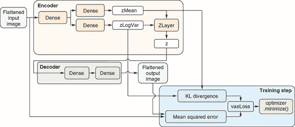

除了`ZLayer`，编码器还包括两个单隐藏层的 MLP。它们用于将扁平化的输入 Fashion-MNIST 图像转换为`zMean`和`zLogVar`向量，分别。这两个 MLP 共享相同的隐藏层，但使用单独的输出层。这种分支模型拓扑结构也是由于编码器是一个功能型模型。

##### 清单 10.4。我们 VAE 的编码器部分（摘自 fashion-mnist-vae/model.js）

```js
function encoder(opts) {
  const {originalDim, intermediateDim, latentDim} = opts;

  const inputs = tf.input({shape: [originalDim], name: 'encoder_input'});
  const x = tf.layers.dense({units: intermediateDim, activation: 'relu'})
                .apply(inputs);                                              ***1***
  const zMean = tf.layers.dense({units: latentDim, name: 'z_mean'}).apply(x);***2***
  const zLogVar = tf.layers.dense({                                          ***2***
        units: latentDim,                                                    ***2***
        name: 'z_log_var'                                                    ***2***
      }).apply(x);                                                         ***2*** ***3***
  const z =                                                                  ***3***
      new ZLayer({name: 'z', outputShape: [latentDim]}).apply([zMean,        ***3***
     zLogVar]);                                                              ***3***

  const enc = tf.model({
    inputs: inputs,
    outputs: [zMean, zLogVar, z],
    name: 'encoder',
  })
  return enc;
}
```

+   ***1*** 编码器底部是一个简单的 MLP，有一个隐藏层。

+   ***2*** 与普通的 MLP 不同，我们在隐藏的密集层之后放置了两个层，分别用于预测 zMean 和 zLogVar。这也是我们使用功能型模型而不是更简单的顺序模型类型的原因。

+   ***3*** 实例化我们自定义的 ZLayer，并使用它来生成遵循由 zMean 和 zLogVar 指定的分布的随机样本

清单 10.5 中的代码构建了解码器。与编码器相比，解码器的拓扑结构更简单。它使用一个 MLP 将输入的 z 向量（即潜在向量）转换为与编码器输入相同形状的图像。请注意，我们的 VAE 处理图像的方式有些简单和不寻常，因为它将图像扁平化为 1D 向量，因此丢弃了空间信息。面向图像的 VAE 通常使用卷积和池化层，但由于我们图像的简单性（其尺寸较小且仅有一个颜色通道），扁平化方法足够简单地处理此示例的目的。

##### 清单 10.5。我们 VAE 的解码器部分（摘自 fashion-mnist-vae/model.js）

```js
function decoder(opts) {
  const {originalDim, intermediateDim, latentDim} = opts;

  const dec = tf.sequential({name: 'decoder'});   ***1***
  dec.add(tf.layers.dense({
    units: intermediateDim,
    activation: 'relu',
    inputShape: [latentDim]
  }));
  dec.add(tf.layers.dense({
    units: originalDim,
    activation: 'sigmoid'                         ***2***
  }));
  return dec;
}
```

+   ***1*** 解码器是一个简单的 MLP，将潜在（z）向量转换为（扁平化的）图像。

+   ***2*** Sigmoid 激活是输出层的一个好选择，因为它确保输出图像的像素值被限制在 0 和 1 之间。

将编码器和解码器合并成一个名为 VAE 的单个`tf.LayerModel`对象时，列表 10.6 中的代码会提取编码器的第三个输出（z 向量）并将其通过解码器运行。然后，组合模型会将解码图像暴露为其输出，同时还有其他三个输出：`zMean`、`zLogVar`和 z 向量。这完成了 VAE 模型拓扑结构的定义。为了训练模型，我们需要两个东西：损失函数和优化器。以下列表中的代码摘自 fashion-mnist-vae/model.js。

##### 将编码器和解码器放在一起组成 VAE 时，列表 10.6 中完成。

```js
function vae(encoder, decoder) {
  const inputs = encoder.inputs;                     ***1***
  const encoderOutputs = encoder.apply(inputs);
  const encoded = encoderOutputs[2];                 ***2***
  const decoderOutput = decoder.apply(encoded);
  const v = tf.model({                               ***3***
    inputs: inputs,
    outputs: [decoderOutput, ...encoderOutputs],     ***4***
    name: 'vae_mlp',
  })
  return v;
}
```

+   ***1*** VAE 的输入与编码器的输入相同：原始输入图像。

+   ***2*** 在编码器的所有三个输出中，只有最后一个（z）进入解码器。

+   ***3*** 由于模型的非线性拓扑结构，我们使用功能模型 API。

+   ***4*** VAE 模型对象的输出除了 zMean、zLogVar 和*z*之外还包括解码图像。

当我们访问第五章中的 simple-object-detection 模型时，我们描述了如何在 TensorFlow.js 中定义自定义损失函数的方式。在这里，需要自定义损失函数来训练 VAE。这是因为损失函数将是两个项的总和：一个量化输入和输出之间的差异，另一个量化潜在空间的统计属性。这让人想起了 simple-object-detection 模型的自定义损失函数，其中一个项用于对象分类，另一个项用于对象定位。

如您从列表 10.7 中的代码中所见（摘自 fashion-mnist-vae/model.js），定义输入输出差异项是直接的。我们简单地计算原始输入和解码器输出之间的均方误差（MSE）。然而，统计项，称为*Kullbach-Liebler*（KL）散度，数学上更加复杂。我们会免去详细的数学[¹⁵]，但从直觉上讲，KL 散度项（代码中的 klLoss）鼓励不同输入图像的分布更均匀地分布在潜在空间的中心周围，这使得解码器更容易在图像之间进行插值。因此，`klLoss`项可以被视为 VAE 的主要输入输出差异项之上添加的正则化项。

> ¹⁵
> 
> Irhum Shafkat 的这篇博文包含了对 KL 散度背后数学的更深入讨论：[`mng.bz/vlvr`](http://mng.bz/vlvr)。

##### 第 10.7 节列出了 VAE 的损失函数。

```js
function vaeLoss(inputs, outputs) {
  const originalDim = inputs.shape[1];
  const decoderOutput = outputs[0];
  const zMean = outputs[1];
  const zLogVar = outputs[2];

  const reconstructionLoss =                                              ***1***
      tf.losses.meanSquaredError(inputs, decoderOutput).mul(originalDim); ***1***

  let klLoss = zLogVar.add(1).sub(zMean.square()).sub(zLogVar.exp());
  klLoss = klLoss.sum(-1).mul(-0.5);                                      ***2***
  return reconstructionLoss.add(klLoss).mean();                           ***3***
}
```

+   ***1*** 计算“重构损失”项。最小化此项的目标是使模型输出与输入数据匹配。

+   ***2*** 计算 zLogVar 和 zMean 之间的 KL 散度。最小化此项旨在使潜变量的分布更接近于潜在空间的中心处正态分布。

+   ***3*** 将图像重建损失和 KL-散度损失汇总到最终的 VAE 损失中

我们 VAE 训练的另一个缺失部分是优化器及其使用的训练步骤。优化器的类型是流行的 ADAM 优化器（`tf.train .adam()`）。VAE 的训练步骤与本书中所有其他模型不同，因为它不使用模型对象的`fit()`或`fitDataset()`方法。相反，它调用优化器的`minimize()`方法（列表 10.8）。这是因为自定义损失函数的 KL-散度项使用模型的四个输出中的两个，但在 TensorFlow.js 中，只有在模型的每个输出都具有不依赖于任何其他输出的损失函数时，`fit()`和`fitDataset()`方法才能正常工作。

如列表 10.8 所示，`minimize()`函数以箭头函数作为唯一参数进行调用。这个箭头函数返回当前批次的扁平化图像的损失（代码中的`reshaped`），这个损失被函数闭包。`minimize()`计算损失相对于 VAE 的所有可训练权重的梯度（包括编码器和解码器），根据 ADAM 算法调整它们，然后根据调整后的梯度在权重的相反方向应用更新。这完成了一次训练步骤。这一步骤重复进行，遍历 Fashion-MNIST 数据集中的所有图像，并构成一个训练时期。`yarn train` 命令执行多个训练周期（默认：5 个周期），在此之后损失值收敛，并且 VAE 的解码器部分被保存到磁盘上。编码器部分不保存的原因是它不会在接下来的基于浏览器的演示步骤中使用。

##### 列表 10.8\. VAE 的训练循环（摘自 fashion-mnist-vae/train.js）

```js
  for (let i = 0; i < epochs; i++) {
    console.log(`\nEpoch #${i} of ${epochs}\n`)
    for (let j = 0; j < batches.length; j++) {
      const currentBatchSize = batches[j].length
      const batchedImages = batchImages(batches[j]);            ***1***
      const reshaped =
          batchedImages.reshape([currentBatchSize, vaeOpts.originalDim]);

      optimizer.minimize(() => {                                ***2***
        const outputs = vaeModel.apply(reshaped);
        const loss = vaeLoss(reshaped, outputs, vaeOpts);
        process.stdout.write('.');                              ***3***
        if (j % 50 === 0) {
          console.log('\nLoss:', loss.dataSync()[0]);
        }
        return loss;
      });
      tf.dispose([batchedImages, reshaped]);
    }
    console.log('');
    await generate(decoderModel, vaeOpts.latentDim);            ***4***
  }
```

+   ***1*** 获取一批（扁平化的）Fashion-MNIST 图像

+   ***2*** VAE 训练的单个步骤：使用 VAE 进行预测，并计算损失，以便 optimizer.minimize 可以调整模型的所有可训练权重

+   ***3*** 由于我们不使用默认的`fit()`方法，因此不能使用内置的进度条，必须自己打印控制台上的状态更新。

+   ***4*** 在每个训练周期结束时，使用解码器生成一幅图像，并将其打印到控制台以进行预览

`yarn watch` 命令打开的网页将加载保存的解码器，并使用它生成类似于图 10.8 所示的图像网格。这些图像是从二维潜在空间中的正则网格的潜在向量获得的。每个潜在维度上的上限和下限可以在 UI 中进行调整。

##### 图 10.8\. 在训练后对 VAE 的潜在空间进行采样。该图显示了一个 20 × 20 的解码器输出网格。该网格对应于一个 20 × 20 的二维潜在向量的正则间隔网格，其中每个维度位于[-4, 4]的区间内。

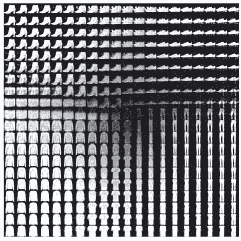

图像网格显示了来自 Fashion-MNIST 数据集的完全连续的不同类型的服装，一种服装类型在潜在空间中沿着连续路径逐渐变形为另一种类型（例如，套头衫变成 T 恤，T 恤变成裤子，靴子变成鞋子）。潜在空间的特定方向在潜在空间的子域内具有一定的意义。例如，在潜在空间的顶部区域附近，水平维度似乎代表“靴子特性与鞋子特性；”在潜在空间的右下角附近，水平维度似乎代表“T 恤特性与裤子特性”，依此类推。

在接下来的章节中，我们将介绍另一种生成图像的主要模型类型：GANs。

### 10.3\. 使用 GANs 进行图像生成

自从 Ian Goodfellow 和他的同事在 2014 年引入了 GANs^([16]) 这项技术以来，它的兴趣和复杂程度迅速增长。如今，GANs 已经成为生成图像和其他数据模态的强大工具。它们能够输出高分辨率图像，有些情况下，这些图像在人类眼中几乎无法与真实图像区分开来。查看 NVIDIA 的 StyleGANs 生成的人脸图像，如 图 10.9^([17]) 所示。如果不是人脸上偶尔出现的瑕疵点和背景中不自然的场景，人类观察者几乎无法将这些生成的图像与真实图像区分开来。

> ¹⁶
> 
> Ian Goodfellow 等人，“生成对抗网络”，*NIPS 会议论文集*，2014 年，[`mng.bz/4ePv`](http://mng.bz/4ePv)。
> 
> ¹⁷
> 
> [`thispersondoesnotexist.com`](https://thispersondoesnotexist.com) 的网站。有关学术论文，请参阅 Tero Karras，Samuli Laine 和 Timo Aila，“用于生成对抗网络的基于样式的生成器架构”，于 2018 年 12 月 12 日提交，[`arxiv.org/abs/1812.04948`](https://arxiv.org/abs/1812.04948)。

##### 图 10.9\. NVIDIA 的 StyleGAN 生成的示例人脸图像，从 [`thispersondoesnotexist.com`](https://thispersondoesnotexist.com) 中采样于 2019 年 4 月


除了“从蓝天中生成引人注目的图像”之外，GAN 生成的图像还可以根据某些输入数据或参数进行条件约束，这带来了更多的特定任务和有用的应用。例如，GAN 可以用于从低分辨率输入（图像超分辨率）生成更高分辨率的图像，填补图像的缺失部分（图像修复），将黑白图像转换为彩色图像（图像着色），根据文本描述生成图像以及根据输入图像中同一人采取的姿势生成该人的图像。此外，已经开发了新类型的 GAN 用于生成非图像输出，例如音乐。^([18]) 除了在艺术、音乐制作和游戏设计等领域中生成无限量的逼真材料的明显价值之外，GAN 还有其他应用，例如通过在获取此类样本代价高昂的情况下生成训练示例来辅助深度学习。例如，GAN 正被用于为训练自动驾驶神经网络生成逼真的街景图像。^([19])

> ¹⁸
> 
> 请参阅 Hao-Wen Dong 等人的 MuseGAN 项目：[`salu133445.github.io/musegan/`](https://salu133445.github.io/musegan/)。
> 
> ¹⁹
> 
> James Vincent，《NVIDIA 使用 AI 让永远阳光的街道下雪》，*The Verge*，2017 年 12 月 5 日，[`mng.bz/Q0oQ`](http://mng.bz/Q0oQ)。

虽然 VAE 和 GAN 都是生成模型，但它们基于不同的思想。VAE 通过使用原始输入和解码器输出之间的均方误差损失来确保生成的示例的质量，而 GAN 则通过使用*鉴别器*来确保其输出逼真，我们很快就会解释。此外，GAN 的许多变体允许输入不仅包含潜空间向量，还包括条件输入，例如所需的图像类别。我们将要探索的 ACGAN 就是这方面的一个很好的例子。在这种具有混合输入的 GAN 类型中，潜空间不再与网络输入具有连续性。

在这个部分，我们将深入研究一种相对简单的 GAN 类型。具体而言，我们将在熟悉的 MNIST 手写数字数据集上训练一个*辅助分类器* GAN (ACGAN)^([20])。这将给我们一个能够生成与真实 MNIST 数字完全相似的数字图像的模型。同时，由于 ACGAN 的“辅助分类器”部分，我们将能够控制每个生成图像所属的数字类别（0 到 9）。为了理解 ACGAN 的工作原理，让我们一步一步来。首先，我们将解释 ACGAN 的基本“GAN”部分如何工作。然后，我们将描述 ACGAN 通过额外的机制如何使类别标识具有可控性。

> ²⁰
> 
> Augustus Odena、Christopher Olah 和 Jonathon Shlens，“带辅助分类器 GAN 的条件图像合成”，2016 年 10 月 30 日提交，[`arxiv.org/abs/1610.09585`](https://arxiv.org/abs/1610.09585)。

#### 10.3.1\. GANs 背后的基本思想

生成对抗网络（GAN）是如何学习生成逼真图片的？它通过其包含的两个子部分之间的相互作用来实现这一点：一个*生成器*和一个*鉴别器*。把生成器想象成一个伪造者，其目标是创建高质量的假毕加索画作；而鉴别器则像是一位艺术品经销商，其工作是将假的毕加索画作与真实的区分开来。伪造者（生成器）努力创建越来越好的假画作以欺骗艺术品经销商（鉴别器），而艺术品经销商的工作是成为对画作的评判者越来越好，从而*不被*伪造者欺骗。我们两个角色之间的这种对抗是“GAN”名称中“对抗性”部分的原因。有趣的是，伪造者和艺术品经销商最终互相*帮助*变得更好，尽管表面上是对手。

起初，伪造者（生成器）在创建逼真的毕加索画作方面表现糟糕，因为其权重是随机初始化的。结果，艺术品经销商（鉴别器）很快就学会了区分真假毕加索画作。这里是所有这些工作的重要部分：每次伪造者给艺术品经销商带来一幅新画作时，他们都会得到详细的反馈（来自艺术品经销商），指出画作的哪些部分看起来不对劲，以及如何改变画作使其看起来更真实。伪造者学习并记住这一点，以便下次他们来到艺术品经销商那里时，他们的画作看起来会稍微好一些。这个过程重复多次。结果发现，如果所有参数都设置正确，我们最终会得到一个技艺精湛的伪造者（生成器）。当然，我们也会得到一个技艺精湛的鉴别器（艺术品经销商），但通常在 GAN 训练完成后我们只需要生成器。

图 10.10 更详细地描述了如何训练通用 GAN 模型的判别器部分。为了训练判别器，我们需要一批生成的图像和一批真实图像。生成的图像由生成器生成。但生成器无法从空气中制作图像。相反，它需要作为输入的随机向量。潜在向量在概念上类似于我们在第 10.2 节中用于 VAE 的向量。对于生成器生成的每个图像，潜在向量是形状为`[latentSize]`的一维张量。但像本书中大多数训练过程一样，我们一次对一批图像执行步骤。因此，潜在向量的形状为`[batchSize, latentSize]`。真实图像直接从实际 MNIST 数据集中提取。为了对称起见，我们在每个训练步骤中绘制与生成的图像完全相同数量的`batchSize`真实图像。

##### 图 10.10\. 示出 GAN 判别器部分训练算法的示意图。请注意，为简单起见，该图省略了 ACGAN 的数字类部分。有关 ACGAN 生成器训练的完整图表，请参见图 10.13。

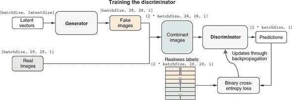

生成的图像和真实图像随后被连接成一批图像，表示为形状为`[2 * batchSize, 28, 28, 1]`的张量。判别器在这批合并图像上执行，输出每个图像是真实的预测概率分数。这些概率分数可以轻松地通过二元交叉熵损失函数与基准真值进行测试（我们知道哪些是真实的，哪些是生成的！）。然后，熟悉的反向传播算法发挥作用，借助优化器（图中未显示）更新判别器的权重参数。这一步使判别器略微朝着正确的预测方向推进。请注意，生成器仅通过提供生成的样本参与此训练步骤，但它不会通过反向传播过程进行更新。下一步训练将更新生成器（图 10.11）。

##### 图 10.11\. 示出 GAN 生成器部分训练算法的示意图。请注意，为简单起见，该图省略了 ACGAN 的数字类部分。有关 ACGAN 生成器训练过程的完整图表，请参见图 10.14。

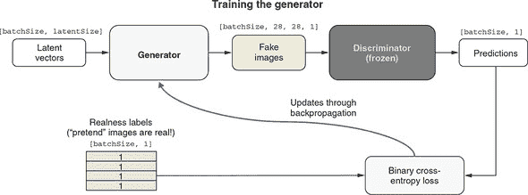

图 10.11 说明了生成器的训练步骤。我们让生成器生成另一批生成图像。但与鉴别器的训练步骤不同，我们不需要任何真实的 MNIST 图像。鉴别器被赋予了这批生成图像以及一批二进制真实性标签。我们假装这些生成图像都是真实的，将真实性标签设置为全部为 1。静下心来思考一下：这是 GAN 训练中最重要的技巧。当然，这些图像都是生成的（并非真实的），但我们让真实性标签表明它们是真实的。鉴别器可能（正确地）对一些或所有的输入图像分配较低的真实性概率。但是如果这样做，由于虚假的真实性标签，二进制交叉熵损失将得到较大的值。这将导致反向传播更新生成器，以使鉴别器的真实性得分稍微增加。请注意，反向传播**只更新**生成器，不对鉴别器进行任何更改。这是另一个重要的技巧：它确保生成器最终产生的图像看起来更真实一些，而不是降低鉴别器对真实性的要求。这是通过冻结模型的鉴别器部分实现的，这是我们在第五章中用于迁移学习的一种操作。

总结生成器训练步骤：冻结鉴别器并向其提供全是 1 的真实性标签，尽管它得到的是由生成器生成的生成图像。由于这样，对生成器的权重更新将导致其生成的图像在鉴别器中看起来稍微更真实。只有当鉴别器相当擅长区分真实和生成的图像时，这种训练生成器的方式才会奏效。我们如何确保这一点？答案是我们已经讨论过的鉴别器训练步骤。因此，你可以看到这两个训练步骤形成了一种复杂的阴阳动态，其中 GAN 的两个部分相互抵触并互相帮助。

这就是对通用 GAN 训练的高级概览。在下一节中，我们将介绍鉴别器和生成器的内部架构以及它们如何融入有关图像类别的信息。

#### 10.3.2\. ACGAN 的构建模块

清单 10.9 显示了创建 MNIST ACGAN 判别器部分的 TensorFlow.js 代码（摘自 mnist-acgan/gan.js）。在判别器的核心是一种类似于我们在第四章中看到的深度卷积网络。其输入具有 MNIST 图像的经典形状，即 `[28, 28, 1]`。输入图像通过四个 2D 的卷积（conv2d）层，然后被展平并经过两个全连接层处理。其中一个全连接层为输入图像的真实性二进制预测输出，另一个输出 10 个数字类别的 softmax 概率。判别器是一个有两个全连接层输出的函数模型。图 10.12 的面板 A 提供了判别器的一个输入-两个输出拓扑结构的示意图。

##### 图 10.12。ACGAN 的判别器（面板 A）和生成器（面板 B）部分的内部拓扑示意图。为简洁起见，省略了某些细节（例如判别器中的 dropout 层）。有关详细的代码，请参见清单 10.9 和 10.10。

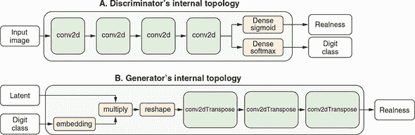

##### 清单 10.9。创建 ACGAN 的判别器部分。

```js
function buildDiscriminator() {
  const cnn = tf.sequential();

  cnn.add(tf.layers.conv2d({
    filters: 32,
    kernelSize: 3,
    padding: 'same',
    strides: 2,
    inputShape: [IMAGE_SIZE, IMAGE_SIZE, 1]                                ***1***
  }));
  cnn.add(tf.layers.leakyReLU({alpha: 0.2}));
  cnn.add(tf.layers.dropout({rate: 0.3}));                                 ***2***

  cnn.add(tf.layers.conv2d(
      {filters: 64, kernelSize: 3, padding: 'same', strides: 1}));
  cnn.add(tf.layers.leakyReLU({alpha: 0.2}));
  cnn.add(tf.layers.dropout({rate: 0.3}));
  cnn.add(tf.layers.conv2d(
      {filters: 128, kernelSize: 3, padding: 'same', strides: 2}));
  cnn.add(tf.layers.leakyReLU({alpha: 0.2}));
  cnn.add(tf.layers.dropout({rate: 0.3}));

  cnn.add(tf.layers.conv2d(
      {filters: 256, kernelSize: 3, padding: 'same', strides: 1}));
  cnn.add(tf.layers.leakyReLU({alpha: 0.2}));

  cnn.add(tf.layers.dropout({rate: 0.3}));

  cnn.add(tf.layers.flatten());

  const image = tf.input({shape: [IMAGE_SIZE, IMAGE_SIZE, 1]});
  const features = cnn.apply(image);

  const realnessScore =                                                    ***3***
      tf.layers.dense({units: 1, activation: 'sigmoid'}).apply(features);  ***3***
  const aux = tf.layers.dense({units: NUM_CLASSES, activation: 'softmax'}) ***4***
                  .apply(features);                                        ***4***
  return tf.model({inputs: image, outputs: [realnessScore, aux]});
}
```

+   ***1*** 判别器只接受 MNIST 格式的图像作为输入。

+   ***2*** 使用 Dropout 层来对抗过拟合。

+   ***3*** 判别器的两个输出之一是二进制真实性分类的概率分数。

+   ***4*** 第二个输出是 10 个 MNIST 数字类别的 softmax 概率。

清单 10.10 中的代码负责创建 ACGAN 生成器。正如我们之前暗示的那样，生成器的生成过程需要一个叫做*潜在向量*（代码中称为 `latent`）的输入。这体现在其第一个全连接层的 `inputShape` 参数中。然而，如果你仔细检查代码，就会发现生成器实际上接受*两个*输入。这在 图 10.12 的面板 B 中有描述。除了潜在向量外，也就是一个形状为 `[latentSize]` 的一维张量，生成器需要一个额外的输入，名为 `imageClass`，形状简单，为 `[1]`。这是告诉模型要生成哪个 MNIST 数字（0 到 9）的方式。例如，如果我们想要模型生成数字 8 的图像，我们应该将形状为 `tf.tensor2d([[8]])` 的张量值输入到第二个输入（请记住，即使只有一个示例，模型也始终期望批量张量）。同样，如果我们想要模型生成两个图像，一个是数字 8，另一个是数字 9，则馈送的张量应为 `tf.tensor2d([[8], [9]])`。

一旦 `imageClass` 输入进入生成器，嵌入层将其转换为与 `latent` 相同形状的张量 (`[latentSize]`)。这一步在数学上类似于我们在 第九章 中用于情感分析和日期转换模型的嵌入查找过程。期望的数字类别是一个整数量，类似于情感分析数据中的单词索引和日期转换数据中的字符索引。它被转换为与单词和字符索引转换为 1D 向量的方式相同的 1D 向量。然而，我们在这里对 `imageClass` 使用嵌入查找是为了不同的目的：将其与 `latent` 向量合并并形成一个单一的组合向量（在 清单 10.10 中命名为 `h`）。这个合并是通过一个 `multiply` 层完成的，该层在两个相同形状的向量之间执行逐元素相乘。结果张量的形状与输入相同 (`[latentSize]`)，并传入生成器的后续部分。

生成器立即在合并的潜在向量 (`h`) 上应用一个密集层，并将其重塑为 3D 形状 `[3, 3, 384]`。这种重塑产生了一个类似图像的张量，随后可以由生成器的后续部分转换为具有标准 MNIST 形状 (`[28, 28, 1]`) 的图像。

生成器不使用熟悉的 conv2d 层来转换输入，而是使用 conv2dTranspose 层来转换其图像张量。粗略地说，conv2dTranspose 执行与 conv2d 的逆操作（有时称为*反卷积*）。conv2d 层的输出通常比其输入具有更小的高度和宽度（除了 `kernelSize` 为 1 的情况之外），如您在 第四章 中的 convnets 中所见。然而，conv2dTranspose 层的输出通常比其输入具有更大的高度和宽度。换句话说，虽然 conv2d 层通常*缩小*其输入的维度，但典型的 conv2dTranspose 层*扩展*它们。这就是为什么在生成器中，第一个 conv2dTranspose 层接受高度为 3 和宽度为 3 的输入，但最后一个 conv2dTranspose 层输出高度为 28 和宽度为 28 的原因。这就是生成器将输入潜在向量和数字索引转换为标准 MNIST 图像尺寸的图像的方式。以下清单中的代码摘录自 mnist-acgan/gan.js; 为了清晰起见，删除了一些错误检查代码。

##### 清单 10.10\. 创建 ACGAN 的生成器部分

```js
function buildGenerator(latentSize) {
  const cnn = tf.sequential();
  cnn.add(tf.layers.dense({
    units: 3 * 3 * 384,                                ***1***
    inputShape: [latentSize],
    activation: 'relu'
  }));
  cnn.add(tf.layers.reshape({targetShape: [3, 3, 384]}));

  cnn.add(tf.layers.conv2dTranspose({                  ***2***
    filters: 192,
    kernelSize: 5,
    strides: 1,
    padding: 'valid',
    activation: 'relu',
    kernelInitializer: 'glorotNormal'
  }));
  cnn.add(tf.layers.batchNormalization());

  cnn.add(tf.layers.conv2dTranspose({                  ***3***
    filters: 96,
    kernelSize: 5,
    strides: 2,
    padding: 'same',
    activation: 'relu',
    kernelInitializer: 'glorotNormal'
  }));
  cnn.add(tf.layers.batchNormalization());

  cnn.add(tf.layers.conv2dTranspose({                  ***4***
    filters: 1,
    kernelSize: 5,
    strides: 2,
    padding: 'same',
    activation: 'tanh',
    kernelInitializer: 'glorotNormal'
  }));

  const latent = tf.input({shape: [latentSize]});      ***5***

  const imageClass = tf.input({shape: [1]});           ***6***

  const classEmbedding = tf.layers.embedding({         ***7***
    inputDim: NUM_CLASSES,
    outputDim: latentSize,
    embeddingsInitializer: 'glorotNormal'
  }).apply(imageClass);

  const h = tf.layers.multiply().apply(                ***8***

      [latent, classEmbedding]);                       ***8***

  const fakeImage = cnn.apply(h);
  return tf.model({                                    ***9***
   inputs: [latent, imageClass],                       ***9***
   outputs: fakeImage                                  ***9***
  });                                                  ***9***
}
```

+   ***1*** 单元的数量被选择为当输出被重塑并通过后续的 conv2dTranspose 层时，最终输出的张量的形状与 MNIST 图像完全匹配 ([28, 28, 1])。

+   ***2*** 从 [3, 3, ...] 上采样至 [7, 7, ...]

+   ***3*** 上采样至 [14, 14, ...]

+   ***4*** 上采样至 [28, 28, ...]

+   ***5*** 这是生成器的两个输入之一：作为伪图像生成的“种子”的潜在（z-空间）向量。

+   ***6*** 生成器的第二个输入：控制生成的图像属于哪个 MNIST 数字类别的类标签

+   ***7*** 通过嵌入查找将期望标签转换为长度为 latentSize 的向量

+   ***8*** 通过乘法将潜在向量和类别条件嵌入组合起来

+   ***9*** 最终创建模型，以顺序卷积网络为核心。

#### 10.3.3\. 更深入地了解 ACGAN 的训练

最后一节应该让你更好地理解了 ACGAN 的鉴别器和生成器的内部结构，以及它们如何整合数字类别信息（ACGAN 名字中的“AC”部分）。有了这些知识，我们就可以扩展 figures 10.10 和 10.11，以全面了解 ACGAN 的训练方式。

Figure 10.13 是 figure 10.10 的扩展版本。它展示了 ACGAN 的鉴别器部分的训练。与之前相比，这一训练步骤不仅提高了鉴别器区分真实和生成（伪造）图像的能力，还磨练了其确定给定图像（包括真实和生成的图像）属于哪个数字类别的能力。为了更容易与之前的简单图表进行比较，我们将已在 figure 10.10 中看到的部分灰暗显示，并突出显示新的部分。首先，注意到生成器现在有了一个额外的输入（数字类别），这使得指定生成器应该生成什么数字成为可能。此外，鉴别器不仅输出真实性预测，还输出数字类别预测。因此，鉴别器的两个输出头都需要进行训练。对于真实性预测的训练与之前相同（figure 10.10）；类别预测部分的训练依赖于我们知道生成和真实图像属于哪些数字类别。模型的两个头部编译了不同的损失函数，反映了两种预测的不同性质。对于真实性预测，我们使用二元交叉熵损失，但对于数字类别预测，我们使用了稀疏分类交叉熵损失。你可以在 mnist-acgan/gan.js 的下一行中看到这一点：

```js
  discriminator.compile({
    optimizer: tf.train.adam(args.learningRate, args.adamBeta1),
    loss: ['binaryCrossentropy', 'sparseCategoricalCrossentropy']
  });
```

##### 图 10.13\. 说明 ACGAN 的鉴别器部分是如何训练的示意图。这个图表在 figure 10.10 的基础上添加了与数字类别相关的部分。图表的其余部分已经在 figure 10.10 中出现，并且被灰暗显示。

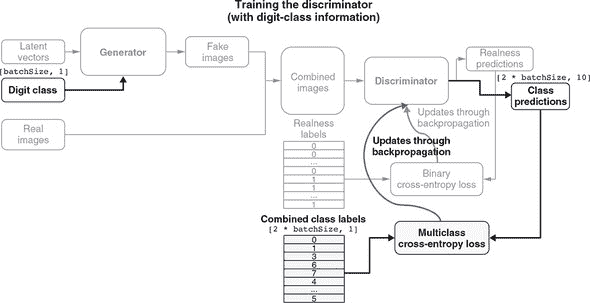

如 图 10.13 中的两条弯曲箭头所示，当更新鉴别器的权重时，通过反向传播的梯度会相互叠加。图 10.14 是 图 10.11 的扩展版本，提供了 ACGAN 生成器部分训练的详细示意图。该图显示了生成器学习如何根据指定的数字类别生成正确的图像，以及学习如何生成真实的图像。与 图 10.13 类似，新添加的部分被突出显示，而已经存在于 图 10.11 的部分则被隐藏。从突出显示的部分中，可以看到我们在训练步骤中输入的标签现在不仅包括真实性标签，还包括数字类别标签。与以前一样，真实性标签都是故意虚假的。但是新添加的数字类别标签更加真实，因为我们确实将这些类别标签给了生成器。

##### 图 10.14. 示意图，说明 ACGAN 的生成器部分是如何训练的。这个图是 图 10.11 的扩展，显示了与数字类别相关的部分。图的其余部分已经在图 10.11 中出现，已被隐藏。

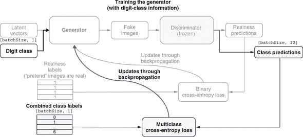

先前，我们看到虚假真实标签与鉴别器的真实概率输出之间的任何差异会被用来更新 ACGAN 的生成器，使其在“欺骗”鉴别器方面更加优秀。在这里，鉴别器的数字分类预测发挥了类似的作用。例如，如果我们告诉生成器生成一个数字 8 的图像，但是鉴别器将图像分类为 9，则稀疏分类交叉熵的值将较高，并且与之关联的梯度将有较大的幅度。因此，生成器权重的更新将导致生成器生成一个更像数字 8 的图像（根据鉴别器的判断）。显然，只有当鉴别器在将图像分类为 10 个 MNIST 数字类别方面足够好时，这种训练生成器的方法才会起作用。这就是前一个鉴别器训练步骤所帮助确保的。再次强调，在 ACGAN 的训练过程中，我们看到了鉴别器和生成器部分之间的阴阳动力学。

##### GAN 训练：一大堆诡计

训练和调整 GAN 的过程众所周知地困难。您在 mnist-acgan 示例中看到的训练脚本是研究人员大量试错的结晶。像深度学习中的大多数事物一样，这更像是一种艺术而不是精确科学：这些技巧是启发式的，没有系统理论的支持。它们得到了对手头现象的直觉理解，并且在经验上被证明效果良好，尽管不一定在每种情况下都有效。

以下是本节中 ACGAN 中使用的一些值得注意的技巧列表：

+   我们在生成器的最后一个 conv2dTranspose 层中使用 tanh 作为激活函数。在其他类型的模型中，tanh 激活函数出现得较少。

+   随机性有助于诱导鲁棒性。因为 GAN 的训练可能导致动态平衡，所以 GAN 很容易陷入各种各样的困境中。在训练过程中引入随机性有助于防止这种情况发生。我们通过两种方式引入随机性：在鉴别器中使用 dropout，以及为鉴别器的真实标签使用“soft one”值（0.95）。

+   稀疏梯度（许多值为零的梯度）可能会妨碍 GAN 的训练。在其他类型的深度学习中，稀疏性通常是一种理想的特性，但在 GAN 中不是这样。梯度中的稀疏性可能由两个因素引起：最大池化操作和 relu 激活函数。建议使用步幅卷积进行下采样，而不是最大池化，这正是生成器创建代码中所示的内容。建议使用 leakyReLU 激活函数，其中负部分具有小的负值，而不是严格的零。这也在清单 10.10 中显示。

#### 10.3.4\. 查看 MNIST ACGAN 训练和生成

mnist-acgan 示例可以通过以下命令检出和准备：

```js
git clone https://github.com/tensorflow/tfjs-examples.git
cd tfjs-examples/mnist-acganyarn
```

运行示例涉及两个阶段：在 Node.js 中进行训练，然后在浏览器中进行生成。要启动训练过程，只需使用以下命令：

```js
yarn train
```

训练默认使用 tfjs-node。然而，像我们之前见过的涉及卷积神经网络的示例一样，使用 tfjs-node-gpu 可以显著提高训练速度。如果您的计算机上正确设置了支持 CUDA 的 GPU，您可以在`yarn train`命令中追加`--gpu`标志来实现。训练 ACGAN 至少需要几个小时。对于这个长时间运行的训练任务，您可以使用`--logDir`标志通过 TensorBoard 监控进度：

```js
yarn train --logDir /tmp/mnist-acgan-logs
```

一旦在单独的终端中使用以下命令启动了 TensorBoard 进程，

```js
tensorboard --logdir /tmp/mnist-acgan-logs
```

您可以在浏览器中导航到 TensorBoard URL（由 TensorBoard 服务器进程打印）以查看损失曲线。图 10.15 显示了训练过程中的一些示例损失曲线。GAN 训练的损失曲线的一个显著特征是，它们并不总是像大多数其他类型的神经网络的损失曲线那样趋向于下降。相反，判别器的损失（图中的 dLoss）和生成器的损失（图中的 gLoss）都以非单调方式变化，并相互交织形成复杂的舞蹈。

##### 图 10.15\. ACGAN 训练作业中的样本损失曲线。dLoss 是判别器训练步骤的损失。具体来说，它是真实性预测的二元交叉熵和数字类别预测的稀疏分类交叉熵的总和。gLoss 是生成器训练步骤的损失。与 dLoss 类似，gLoss 是来自二元真实性分类和多类数字分类的损失的总和。

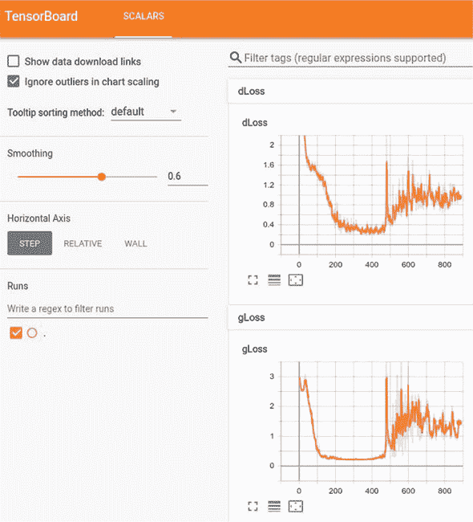

在训练接近结束时，两者的损失都不会接近零。相反，它们只是趋于平稳（收敛）。此时，训练过程结束并将模型的生成器部分保存到磁盘上，以便在浏览器内生成步骤中进行服务：

```js
await generator.save(saveURL);
```

要运行浏览器内生成演示，请使用命令 `yarn watch`。它将编译 mnist-acgan/index.js 和相关的 HTML 和 CSS 资源，然后会在您的浏览器中打开一个标签页并显示演示页面。^([21])

> ²¹
> 
> 您还可以完全跳过训练和构建步骤，直接导航到托管的演示页面，网址为 [`mng.bz/4eGw`](http://mng.bz/4eGw)。

演示页面加载了从前一阶段保存的训练好的 ACGAN 生成器。由于判别器在此演示阶段并不真正有用，因此它既不保存也不加载。有了生成器加载后，我们可以构建一批潜在向量，以及一批期望的数字类别索引，并调用生成器的 `predict()`。执行此操作的代码位于 mnist-acgan/index.js 中：

```js
    const latentVectors = getLatentVectors(10);
    const sampledLabels = tf.tensor2d(
        [0, 1, 2, 3, 4, 5, 6, 7, 8, 9], [10, 1]);
    const generatedImages =
        generator.predict([latentVectors, sampledLabels]).add(1).div(2);
```

我们的数字类别标签批次始终是一个有序的 10 元素向量，从 0 到 9。这就是为什么生成的图像批次总是一个从 0 到 9 的有序图像数组。这些图像使用 `tf.concat()` 函数拼接在一起，并在页面上的 `div` 元素中呈现（参见图 10.16 中的顶部图像）。与随机抽样的真实 MNIST 图像（参见图 10.16 中的底部图像）相比，这些 ACGAN 生成的图像看起来就像真实的一样。此外，它们的数字类别身份看起来是正确的。这表明我们的 ACGAN 训练是成功的。如果您想查看 ACGAN 生成器的更多输出，请点击页面上的 Generator 按钮。每次点击按钮，都会生成并显示页面上的新批次包含 10 张假图像。您可以玩一下，直观地感受图像生成的质量。

##### 图 10.16\. ACGAN 训练模型的生成器部分生成的样本图片（顶部的 10 x 1 面板）。底部的面板展示了一个 10 x 10 的真实 MNIST 图像网格，以进行比较。点击“显示 Z-向量滑块”按钮，您可以打开一个填满了 100 个滑块的区域。这些滑块允许您改变潜在向量（z-向量）的元素，并观察其对生成的 MNIST 图像的影响。请注意，如果您逐个更改滑块，大多数滑块对图像的影响都很微小且不易察觉。但偶尔，您会发现一个具有更大且更明显影响的滑块。

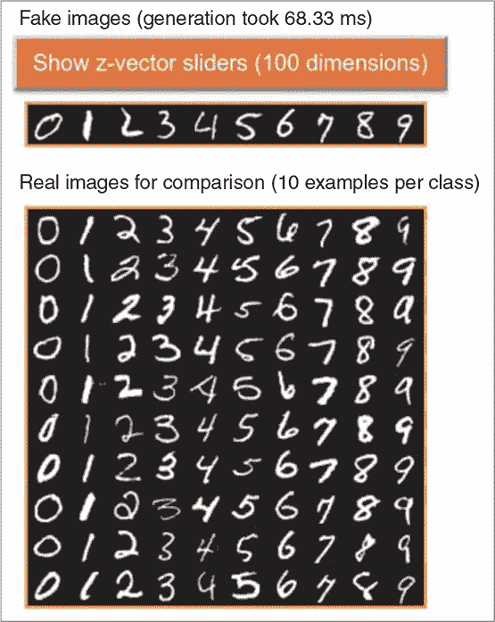

### 进一步阅读材料

+   Ian Goodfellow、Yoshua Bengio 和 Aaron Courville，“深度生成模型”，*深度学习*，第二十章，麻省理工学院出版社，2017 年。

+   Jakub Langr 和 Vladimir Bok，《GAN 行动中：生成对抗网络的深度学习》，Manning 出版社，2019 年。

+   Andrej Karpathy，“循环神经网络的不合理有效性”，博客，2015 年 5 月 21 日，[`karpathy.github.io/2015/05/21/rnn-effectiveness/`](http://karpathy.github.io/2015/05/21/rnn-effectiveness/)。

+   Jonathan Hui，“GAN—什么是生成对抗网络 GAN？” Medium，2018 年 6 月 19 日，[`mng.bz/Q0N6`](http://mng.bz/Q0N6)。

+   GAN 实验室，一个用 TensorFlow.js 构建的交互式网络环境，用于理解和探索 GAN 的工作原理：Minsuk Kahng 等人，[`poloclub.github.io/ganlab/`](https://poloclub.github.io/ganlab/)。

### 练习

1.  除了莎士比亚文本语料库外，lstm-text-generation 示例还配置了其他几个文本数据集，并准备好供您探索。运行它们的训练，并观察其效果。例如，使用未压缩的 TensorFlow.js 代码作为训练数据集。在模型训练期间和之后，观察生成的文本是否表现出以下 JavaScript 源代码的模式以及温度参数如何影响这些模式：

    1.  较短程模式，例如关键字（例如，“for”和“function”）

    1.  中程模式，例如代码的逐行组织

    1.  较长程模式，例如括号和方括号的配对，以及每个“function”关键字后必须跟着一对括号和一对花括号

1.  在 fashion-mnist-vae 示例中，如果您将 VAE 的自定义损失中的 KL 散度项删除会发生什么？通过修改 fashion-mnist-vae/model.js 中的 `vaeLoss()` 函数（清单 10.7）来测试。从潜在空间采样的图像是否仍然看起来像 Fashion-MNIST 图像？空间是否仍然展现出可解释的模式？

1.  在 mnist-acgan 示例中，尝试将 10 个数字类别合并为 5 个（0 和 1 将成为第一类，2 和 3 将成为第二类，依此类推），并观察在训练后这如何改变 ACGAN 的输出。当您指定第一类时，您期望看到生成的图像是什么？例如，当您指定第一类时，您期望 ACGAN 生成什么？提示：要进行此更改，您需要修改 mnist-acgan/data.js 中的 `loadLabels()` 函数。需要相应修改 gan.js 中的常量 `NUM_CLASSES`。此外，`generateAnd-VisualizeImages()` 函数（位于 index.js 中）中的 `sampledLabels` 变量也需要修改。

### 总结

+   生成模型与我们在本书早期章节中学习的判别模型不同，因为它们旨在模拟训练数据集的生成过程，以及它们的统计分布。由于这种设计，它们能够生成符合分布并且看起来类似于真实训练数据的新样本。

+   我们介绍了一种模拟文本数据集结构的方法：下一个字符预测。LSTM 可以用来以迭代方式执行此任务，以生成任意长度的文本。温度参数控制生成文本的随机性（多么随机和不可预测）。

+   自动编码器是一种由编码器和解码器组成的生成模型。首先，编码器将输入数据压缩为称为潜在向量或 z-向量的简明表示。然后，解码器尝试仅使用潜在向量来重构输入数据。通过训练过程，编码器变成了一个高效的数据摘要生成器，解码器则具有对示例的统计分布的知识。VAE 对潜在向量添加了一些额外的统计约束，使得在 VAE 训练后组成这些向量的潜在空间显示出连续变化和可解释的结构。

+   GAN 基于鉴别器和生成器之间的竞争和合作的想法。鉴别器试图区分真实数据示例和生成的数据示例，而生成器旨在生成“欺骗”鉴别器的虚假示例。通过联合训练，生成器部分最终将能够生成逼真的示例。ACGAN 在基本 GAN 架构中添加了类信息，以便指定要生成的示例的类别。
