## 第十一章：深度强化学习的基础知识

*本章内容*

+   强化学习与前面几章讨论的监督学习有什么不同

+   强化学习的基本范例：智能体、环境、行动和奖励以及它们之间的交互

+   解决强化学习问题的两种主要方法背后的一般思想：基于策略和基于值的方法

到目前为止，在本书中，我们主要关注一种叫做*监督学习*的机器学习方法。在监督学习中，我们通过给出一个输入来训练模型给我们正确的答案。无论是给输入图像赋予一个类别标签（第四章）还是根据过去的天气数据预测未来温度（第八章和第九章），这种模式都是一样的：将静态输入映射到静态输出。在我们访问的第九章和第十章中生成序列的模型要稍微复杂一些，因为输出是一系列项而不是单个项。但是通过将序列拆分成步骤，这些问题仍然可以归结为一对一的输入输出映射。

在本章中，我们将介绍一种非常不同的机器学习类型，称为*强化学习*（RL）。在强化学习中，我们的主要关注点不是静态输出；相反，我们训练一个模型（或者在强化学习术语中称为*智能体*）在一个环境中采取行动，目的是最大化称为*奖励*的成功指标。例如，RL 可以用于训练一个机器人在建筑物内航行并收集垃圾。实际上，环境不一定是物理环境；它可以是任何一个智能体采取行动的真实或虚拟空间。国际象棋棋盘是训练智能体下棋的环境；股票市场是训练智能体交易股票的环境。强化学习范式的普遍性使其适用于广泛的实际问题（图 11.1）。另外，深度学习革命中一些最为引人瞩目的进展涉及将深度学习的能力与强化学习相结合。这包括可以以超人的技巧打败 Atari 游戏的机器人和可以在围棋和国际象棋游戏中击败世界冠军的算法^([1])。

> ¹
> 
> David Silver 等人，“通过自我对弈用通用强化学

##### 图 11.1。强化学习的实际应用示例。左上：解决象棋和围棋等棋类游戏。右上：进行算法交易。左下：数据中心的自动资源管理。右下：机器人的控制和行动规划。所有图像均为免费许可证，并从[www.pexels.com](http://www.pexels.com)下载。

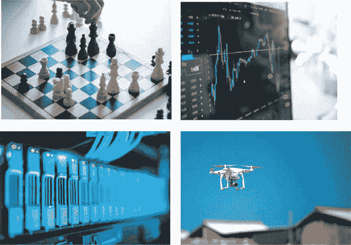

引人入胜的强化学习话题在一些基本方式上与我们在前几章中看到的监督学习问题有所不同。与监督学习中学习输入-输出映射不同，强化学习是通过与环境交互来发现最优决策过程。在强化学习中，我们没有给定标记的训练数据集；相反，我们被提供了不同类型的环境来探索。此外，时间是强化学习问题中不可或缺且基础性的维度，与许多监督学习问题不同，后者要么缺乏时间维度，要么将时间更多地视为空间维度。由于强化学习的独特特征，本章将涉及一种与前几章非常不同的词汇和思维方式。但不要担心。我们将使用简单而具体的例子来说明基本概念和方法。此外，我们的老朋友，深度神经网络及其在 TensorFlow.js 中的实现，将仍然与我们同在。它们将构成本章中我们将遇到的强化学习算法的重要支柱（尽管不是唯一的！）。

在本章结束时，您应该熟悉强化学习问题的基本公式化，理解强化学习中两种常用神经网络（策略网络和 Q 网络）背后的基本思想，并知道如何使用 TensorFlow.js 的 API 对这些网络进行训练。

### 11.1\. 强化学习问题的制定

图 11.2 描绘了强化学习问题的主要组成部分。代理是我们（强化学习从业者）直接控制的对象。代理（例如在建筑物中收集垃圾的机器人）以三种方式与环境交互：

+   在每一步中，代理程序采取一种 *行动*，这改变了环境的状态。例如，在我们的垃圾收集机器人的背景下，可供选择的行动集可能是`{前进，后退，左转，右转，抓取垃圾，将垃圾倒入容器}`。

+   偶尔，环境会向代理程序提供一个 *奖励*，在人性化的术语中，可以理解为即时愉悦或满足的衡量。但更抽象地说，奖励（或者，如我们稍后将看到的，一段时间内的奖励总和）是一个代理试图最大化的数字。它是一个重要的数值，以类似于损失值引导监督学习算法的方式引导强化学习算法。奖励可以是正的或负的。在我们的垃圾收集机器人的例子中，当一袋垃圾成功倒入机器人的垃圾容器时，可以给予正奖励。此外，当机器人撞倒垃圾桶，撞到人或家具，或者在容器外倒垃圾时，应给予负奖励。

+   除了奖励外，代理还可以通过另一个渠道观察环境的状态，即*观察*。这可以是环境的完整状态，也可以只是代理可见的部分，可能通过某个不完美的渠道而失真。对于我们的垃圾收集机器人来说，观察包括来自其身体上的相机和各种传感器的图像和信号流。

##### 图 11.2：强化学习问题的基本公式的示意图。在每个时间步，代理从可能的行动集合中选择一个行动，从而导致环境状态的变化。环境根据其当前状态和选择的行动向代理提供奖励。代理可以部分或完全观察到环境的状态，并将使用该状态来决定未来的行动。

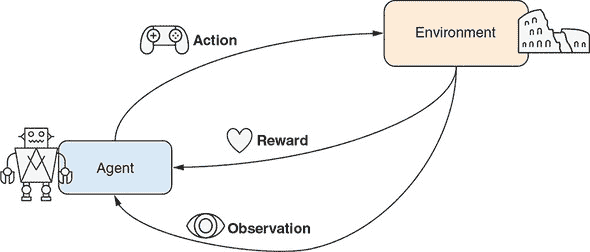

刚定义的公式有些抽象。让我们看看一些具体的强化学习问题，并了解公式所涵盖的可能范围。在此过程中，我们还将浏览所有强化学习问题的分类。首先让我们考虑一下行动。代理可以选择的行动空间可以是离散的，也可以是连续的。例如，玩棋盘游戏的强化学习代理通常有离散的行动空间，因为在这种问题中，只有有限的移动选择。然而，一个涉及控制虚拟类人机器人的强化学习问题需要在双足行走时使用连续的行动空间，因为关节上的扭矩是连续变化的。在本章中，我们将介绍关于离散行动空间的示例问题。请注意，在某些强化学习问题中，可以通过离散化将连续的行动空间转化为离散的。例如，DeepMind 的《星际争霸 II》游戏代理将高分辨率的 2D 屏幕划分成较粗的矩形，以确定将单位移动到哪里或在哪里发起攻击。

> ²
> 
> 查看 OpenAI Gym 中的 Humanoid 环境：[`gym.openai.com/envs/Humanoid-v2/`](https://gym.openai.com/envs/Humanoid-v2/)。
> 
> ³
> 
> Oriol Vinyals 等，“星际争霸 II：强化学习的新挑战”，提交日期：2017 年 8 月 16 日，[`arxiv.org/abs/1708.04782`](https://arxiv.org/abs/1708.04782)。

奖励在强化学习问题中起着核心作用，但也呈现出多样性。首先，有些强化学习问题仅涉及正奖励。例如，正如我们稍后将看到的，一个强化学习代理的目标是使一个杆保持在移动的推车上，则它只会获得正奖励。每次它保持杆竖立时，它都会获得少量正奖励。然而，许多强化学习问题涉及正负奖励的混合。负奖励可以被看作是“惩罚”或“处罚”。例如，一个学习向篮筐投篮的代理应该因进球而获得正奖励，而因投篮失误而获得负奖励。

奖励的发生频率也可能不同。一些强化学习问题涉及连续的奖励流。比如前文提到的倒立摆问题：只要杆子还没倒下，智能体每一个时间步长都会获得（正面的）奖励。而对于下棋的强化学习智能体，则只有在游戏结束（胜利、失败或平局）时才会获得奖励。两种极端之间还有其他强化学习问题。例如，我们的垃圾收集机器人在两次成功垃圾转移之间可能完全没有任何奖励——也就是在从 A 点到 B 点的移动过程中。此外，训练打 Atari 游戏 Pong 的强化学习智能体也不会在电子游戏的每一步（帧）都获得奖励；相反，在球拍成功击中乒乓球并将其反弹到对手处时，才会每隔几步（帧）获得正面的奖励。本章我们将介绍一些奖励频率高低不同的强化学习问题。

观察是强化学习问题中的另一个重要因素。它是一个窗口，通过它智能体可以看到环境的状态，并且基于这个状态做出决策，而不仅仅是依据任何奖励。像动作一样，观察可以是离散的（例如在棋盘游戏或者扑克游戏中），也可以是连续的（例如在物理环境中）。你可能会问：为什么我们的强化学习公式将观察和奖励分开，即使它们都可以被看作是环境向智能体提供反馈的形式？答案是为了概念上的清晰和简单易懂。尽管奖励可以被视为观察，但它是智能体最终“关心”的。而观察可以包含相关和无关的信息，智能体需要学会过滤并巧妙地使用。

一些强化学习问题通过观察向智能体揭示环境的整个状态，而另一些问题则仅向智能体提供部分状态信息。第一类问题的例子包括棋类游戏（如棋类和围棋）。对于后一类问题，德州扑克等纸牌游戏是一个很好的例子，在这种游戏中你无法看到对手的手牌，而股票交易也是其中的一个例子。股票价格受许多因素的影响，例如公司的内部运营和市场上其他股票交易者的想法。但是，智能体只能观察到股票价格的逐时历史记录，可能还加上公开的信息，如财经新闻。

这个讨论建立了强化学习发生的平台。关于这个表述值得指出的一个有趣的事情是，代理与环境之间的信息流是双向的：代理对环境进行操作；环境反过来提供给代理奖励和状态信息。这使得强化学习与监督学习有所不同，监督学习中信息流主要是单向的：输入包含足够的信息，使得算法能够预测输出，但输出并不会以任何重要的方式影响输入。

强化学习问题的另一个有趣而独特的事实是，它们必须沿着时间维度发生，以便代理-环境交互由多个轮次或步骤组成。时间可以是离散的或连续的。例如，解决棋盘游戏的 RL 代理通常在离散的时间轴上操作，因为这类游戏是在离散的回合中进行的。视频游戏也是如此。然而，控制物理机器人手臂操纵物体的 RL 代理面临着连续的时间轴，即使它仍然可以选择在离散的时间点采取行动。在本章中，我们将专注于离散时间 RL 问题。

这个关于强化学习的理论讨论暂时就够了。在下一节中，我们将开始亲手探索一些实际的强化学习问题和算法。

### 11.2\. 策略网络和策略梯度：车杆示例

我们将解决的第一个强化学习问题是模拟一个物理系统，在该系统中，一个装有杆的小车在一维轨道上移动。这个问题被恰如其名地称为*车杆*问题，它是由安德鲁·巴托（Andrew Barto）、理查德·萨顿（Richard Sutton）和查尔斯·安德森（Charles Anderson）在 1983 年首次提出的。自那时以来，它已经成为控制系统工程的基准问题（在某种程度上类似于 MNIST 数字识别问题用于监督学习），因为它的简单性和良好构建的物理学和数学，以及解决它并非完全微不足道。在这个问题中，代理的目标是通过施加左右方向的力来控制小车的运动，以尽可能长时间地保持杆的平衡。

> ⁴
> 
> 安德鲁·G·巴托（Andrew G. Barto）、理查德·S·萨顿（Richard S. Sutton）和查尔斯·W·安德森（Charles W. Anderson），“可以解决困难学习控制问题的类神经自适应元件”，*IEEE 系统、人类和控制论交易*，1983 年 9 月/10 月，页码 834–846，[`mng.bz/Q0rG`](http://mng.bz/Q0rG)。

#### 11.2.1\. 作为强化学习问题的车杆

在进一步探讨之前，你应该通过玩车杆示例来直观地理解这个问题。车杆问题简单轻便，我们完全可以在浏览器中进行模拟和训练。图 11.3 提供了车杆问题的可视化描述，你可以在通过`yarn watch`命令打开的页面中找到。要查看和运行示例，请使用

```js
git clone https://github.com/tensorflow/tfjs-examples.git
cd tfjs-examples/cart-pole
yarn && yarn watch
```

##### 图 11.3\. 小车杆问题的视觉渲染。A 面板：四个物理量（小车位置*x*，小车速度*x*′，杆倾角 θ 和杆角速度 θ'）构成环境状态和观察。在每个时间步长，代理可以选择向左施加力或向右施加力的行动，这将相应地改变环境状态。B 和 C 面板：导致游戏结束的两个条件——要么小车向左或向右移动太多（B），要么杆从垂直位置倾斜太多（C）。

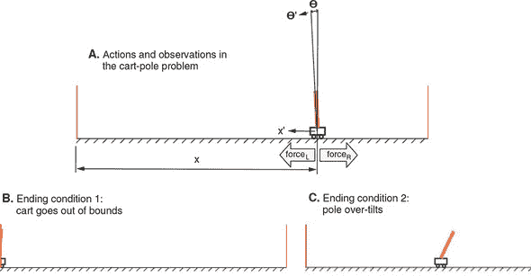

点击“创建模型”按钮，然后再点击“训练”按钮。然后您应该在页面底部看到一个动画，显示一个未经训练的代理执行车杆任务。由于代理模型的权重被初始化为随机值（关于模型的更多信息稍后再说），它的表现会非常糟糕。从游戏开始到结束的所有时间步有时在 RL 术语中称为一个*episode*。我们在这里将术语*game*和*episode*互换使用。

正如图 11.3 中的 A 面板所示，任何时间步中小车沿轨道的位置由称为*x*的变量捕获。它的瞬时速度表示为*x*'。此外，杆的倾斜角由另一个称为 θ 的变量捕获。杆的角速度（θ 变化的速度和方向）表示为 θ'。因此，这四个物理量（*x*，*x*'，θ 和 θ'）每一步都由代理完全观察到，并构成此 RL 问题的观察部分。

模拟在满足以下任一条件时结束：

+   *x* 的值超出预先指定的边界，或者从物理角度来说，小车撞到轨道两端的墙壁之一（图 11.3 的 B 面板）。

+   当 θ 的绝对值超过一定阈值时，或者从物理角度来说，杆过于倾斜，偏离了垂直位置（图 11.3 的 C 面板）。

环境还在第 500 个模拟步骤后终止一个 episode。这样可以防止游戏持续时间过长（一旦代理通过学习变得非常擅长游戏，这种情况可能会发生）。步数的上限在用户界面中是可以调整的。直到游戏结束，代理在模拟的每一步都获得一个单位的奖励（`1`）。因此，为了获得更高的累积奖励，代理需要找到一种方法来保持杆站立。但是代理如何控制小车杆系统呢？这就引出了这个 RL 问题的行动部分。

如图 11.3 A 面板中的力箭头所示，智能体在每一步只能执行两种可能的动作：在小车上施加向左或向右的力。智能体必须选择其中一种力的方向。力的大小是固定的。一旦施加了力，模拟将执行一组数学方程来计算环境的下一个状态（*x*、*x*'、θ 和 θ' 的新值）。详细内容涉及熟悉的牛顿力学。我们不会详细介绍这些方程，因为在这里理解它们并不重要，但是如果您感兴趣，可以在 cart-pole 目录下的 cart-pole/cart_pole.js 文件中找到它们。

类似地，渲染小车摆杆系统的 HTML 画布的代码可以在 cart-pole/ui.js 中找到。这段代码突显了使用 JavaScript（特别是 TensorFlow.js）编写 RL 算法的优势：UI 和学习算法可以方便地用同一种语言编写，并且彼此紧密集成。这有助于可视化和直观理解问题，并加速开发过程。为了总结小车摆杆问题，我们可以用经典强化学习框架来描述它（参见 table 11.1）。

##### 表 11.1\. 在经典强化学习框架中描述了小车摆杆问题

| 抽象 RL 概念 | 在小车摆杆问题中的实现 |
| --- | --- |
| 环境 | 一个运载杆子并在一维轨道上移动的小车。 |
| 动作 | （离散）在每一步中，在左侧施加力和右侧施加力之间进行二进制选择。力的大小是固定的。 |
| 奖励 | （频繁且仅为正值）对于游戏每一步，智能体会收到固定的奖励（1）。当小车撞到轨道一端的墙壁，或者杆子从直立位置倾斜得太厉害时，该情节就会结束。 |
| 观测 | （完整状态，连续）每一步，智能体可以访问小车摆杆系统的完整状态，包括小车位置（*x*）和速度（*x*'），以及杆倾斜角（θ）和角速度（θ'）。 |

#### 11.2.2\. 策略网络

现在小车摆杆强化学习问题已经描述完毕，让我们看看如何解决它。从历史上看，控制理论家们曾经为这个问题设计过巧妙的解决方案。他们的解决方案基于这个系统的基本物理原理。[5] 但是在本书的背景下，我们不会这样来解决这个问题。在本书的背景下，这样做有点类似于编写启发式算法来解析 MNIST 图像中的边缘和角落，以便对数字进行分类。相反，我们将忽略系统的物理特性，让我们的智能体通过反复试错来学习。这符合本书其余部分的精神：我们不是在硬编码算法，也不是根据人类知识手动设计特征，而是设计了一种允许模型自主学习的算法。

> ⁵
> 
> 如果您对传统的、非 RL 方法解决小车-杆问题感兴趣，并且不怕数学，可以阅读麻省理工学院 Russ Tedrake 的控制理论课程的开放课程 Ware：[`mng.bz/j5lp`](http://mng.bz/j5lp)。

我们如何让代理在每一步决定动作（向左还是向右的力）？鉴于代理可用的观察和代理每一步需要做出的决定，这个问题可以被重新制定为一个简单的输入输出映射问题，就像在监督学习中那样。一个自然的解决方案是构建一个神经网络，根据观察来选择一个动作。这是*策略网络*背后的基本思想。

这个神经网络将一个长度为 4 的观察向量（*x*，*x*'，θ和θ'）作为输入，并输出一个可以转化为左右决定的数字。该网络架构类似于我们在第三章中为仿冒网站构建的二元分类器。抽象地说，每一步，我们将查看环境，并使用我们的网络决定采取哪些行动。通过让我们的网络玩一些回合，我们将收集一些数据来评价那些决定。然后，我们将发明一种方法来给这些决定分配质量，以便我们可以调整我们的网络的权重，使其在将来做出更像“好”的决定，而不像“坏”的决定。

该系统的细节与我们之前的分类器工作在以下方面有所不同：

+   模型在游戏过程中多次被调用（在每个时间步长）。

+   模型的输出（图 11.4 中的策略网络框中的输出）是对数而不是概率分数。通过 S 形函数将对数值转换为概率分数。我们之所以不直接在策略网络的最后（输出）层中包含 S 形非线性，是因为我们需要对数值进行训练，我们很快就会看到原因。

    ##### 图 11.4。策略网络如何融入我们解决小车-杆问题的解决方案。策略网络是一个 TensorFlow.js 模型，通过使用观察向量（*x*，*x*'，θ和θ'）作为输入，输出左向力动作的概率。通过随机抽样将概率转换为实际行动。

    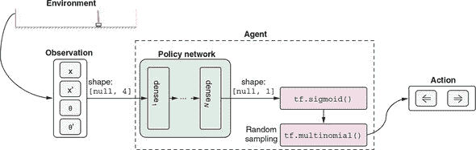

+   由 S 形函数输出的概率必须转换为具体的动作（向左还是向右）。这是通过随机抽样`tf.multinomial()`函数调用完成的。回想一下，在 lstm-text-generation example 中，我们使用`tf.multinomial()`来对字母表上的 softmax 概率进行抽样以抽取下一个字符。在这里的情况稍微简单一些，因为只有两个选择。

最后一点有着更深层次的含义。考虑到我们*可以*直接将 `tf.sigmoid()` 函数的输出通过应用阈值（例如，当网络的输出大于 0.5 时选择左侧动作，否则选择右侧动作）转换为一个动作。为什么我们更倾向于使用 `tf.multinomial()` 的更复杂的随机抽样方法，而不是这种更简单的方法？答案是我们*希望*`tf.multinomial()` 带来的随机性。在训练的早期阶段，策略网络对于如何选择力的方向一无所知，因为其权重是随机初始化的。通过使用随机抽样，我们鼓励它尝试随机动作并查看哪些效果更好。一些随机试验将会失败，而另一些则会获得良好的结果。我们的算法会记住这些良好的选择，并在将来进行更多这样的选择。但是除非允许代理随机尝试，否则这些良好的选择将无法实现。如果我们选择了确定性的阈值方法，模型将被困在其初始选择中。

这将我们带入了强化学习中一个经典而重要的主题，即*探索与利用*。*探索*指的是随机尝试；这是 RL 代理发现良好行动的基础。*利用*意味着利用代理已学到的最优解以最大化奖励。这两者是相互不兼容的。在设计工作 RL 算法时，找到它们之间的良好平衡非常关键。起初，我们想要探索各种可能的策略，但随着我们逐渐收敛于更好的策略，我们希望对这些策略进行微调。因此，在许多算法中，训练过程中的探索通常会逐渐减少。在 cart-pole 问题中，这种减少是隐含在 `tf.multinomial()` 抽样函数中的，因为当模型的置信水平随着训练增加时，它会给出越来越确定的结果。

清单 11.1（摘自 cart-pole/index.js）展示了创建策略网络的 TensorFlow.js 调用。清单 11.2 中的代码（同样摘自 cart-pole/index.js）将策略网络的输出转换为代理的动作，并返回用于训练目的的对数概率。与我们在前几章遇到的监督学习模型相比，这里的模型相关代码并没有太大不同。

然而，这里根本不同的是，我们没有一组可以用来教模型哪些动作选择是好的，哪些是坏的标记数据集。如果我们有这样的数据集，我们可以简单地在策略网络上调用 `fit()` 或 `fitDataset()` 来解决问题，就像我们在前几章中对模型所做的那样。但事实是我们没有，所以智能体必须通过玩游戏并观察到的奖励来弄清楚哪些动作是好的。换句话说，它必须“通过游泳学会游泳”，这是 RL 问题的一个关键特征。接下来，我们将详细看一下如何做到这一点。

##### 策略网络 MLP：基于观察选择动作

```js
createModel(hiddenLayerSizes) {                      ***1***
    if (!Array.isArray(hiddenLayerSizes)) {
      hiddenLayerSizes = [hiddenLayerSizes];
    }
    this.model = tf.sequential();
    hiddenLayerSizes.forEach((hiddenLayerSize, i) => {
      this.model.add(tf.layers.dense({
        units: hiddenLayerSize,
        activation: 'elu',
        inputShape: i === 0 ? [4] : undefined        ***2***
      }));
    });
    this.model.add(tf.layers.dense({units: 1}));     ***3***
  }
}
```

+   hiddenLayerSize 控制策略网络除最后一层（输出层）之外的所有层的大小。

+   inputShape 仅在第一层需要。

+   最后一层被硬编码为一个单元。单个输出数字将被转换为选择左向力动作的概率。

##### 从策略网络输出获取 logit 和动作的方法示例

```js
getLogitsAndActions(inputs) {
  return tf.tidy(() => {
    const logits = this.policyNet.predict(inputs);

    const leftProb = tf.sigmoid(logits);         ***1***
    const leftRightProbs = tf.concat(            ***2***
        [leftProb, tf.sub(1, leftProb)], 1);     ***2***
    const actions = tf.multinomial(              ***3***
        leftRightProbs, 1, null, true);          ***3***
    return [logits, actions];
  });
}
```

+   将 logit 转换为左向动作的概率值

+   计算两个动作的概率值，因为 tf.multinomial() 需要它们。

+   根据概率值随机抽样动作。四个参数分别是概率值、抽样数量、随机种子（未使用），以及一个指示概率值是否归一化的标志。

#### 训练策略网络：REINFORCE 算法

现在关键问题是如何计算哪些动作是好的，哪些是坏的。如果我们能回答这个问题，我们就能够更新策略网络的权重，使其在未来更有可能选择好的动作，这与监督学习类似。很快能想到的是我们可以使用奖励来衡量动作的好坏。但是车杆问题涉及奖励：1）总是有一个固定值（`1`）；2）只要剧集没有结束，就会在每一步发生。所以，我们不能简单地使用逐步奖励作为度量标准，否则所有动作都会被标记为同样好。我们需要考虑每个剧集持续的时间。

一个简单的方法是在一个剧集中求所有奖励的总和，这给了我们剧集的长度。但是总和能否成为对动作的良好评估？很容易意识到这是不行的。原因在于剧集末尾的步骤。假设在一个长剧集中，智能体一直很好地平衡车杆系统，直到接近结束时做了一些不好的选择，导致剧集最终结束。简单的总和方法会将最后的不良动作和之前的良好动作平等评估。相反，我们希望将更高的分数分配给剧集早期和中间部分的动作，并将较低的分配给靠近结尾的动作。

这引出了 *奖励折扣* 的概念，一个简单但在 RL 中非常重要的概念：某一步的价值应等于即时奖励加上预期未来奖励。未来奖励可能与即时奖励同等重要，也可能不那么重要。可以通过折扣系数 γ 来量化相对平衡。γ 通常设置为接近但略小于 1 的值，如 0.95 或 0.99。我们可以用公式表示：

##### 公式 11.1。

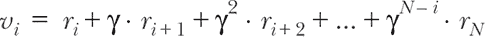

在 公式 11.1 中，*v[i]* 表示第 *i* 步状态的总折扣奖励，可以理解为该特定状态的价值。它等于在该步骤给予智能体的即时奖励 (*r[i]*)，加上下一步奖励 (*r[i]*[+1]) 乘以折扣系数 γ，再加上再后两步的折扣奖励，以此类推，直到该事件结束（第 *N* 步）。

为了说明奖励折扣，我们展示了这个公式如何将原始奖励转换为更有用的价值度量方式，如 图 11.5 所示。面板 A 的顶部图显示了来自一段短情节的所有四步原始奖励。底部图显示了根据 公式 11.1 计算的折扣奖励。为了比较，面板 B 显示了来自长度为 20 的更长情节的原始和折扣总奖励。从两个面板可以看出，折扣总奖励值在开头较高，在结尾较低，这是有意义的，因为我们要为一个游戏结束的动作分配较低的值。此外，长情节的开头和中段的值（面板 B）高于短情节的开头（面板 A）。这也是有意义的，因为我们要为导致更长情节的动作分配更高的值。

##### 图 11.5。面板 A：对四步情节的奖励进行奖励折扣（公式 11.1）。面板 B：与面板 A 相同，但来自一个包含 20 步的情节（即比面板 A 的情节长五倍）。由于折扣，与靠近结尾的动作相比，为每个情节的开始动作分配更高的值。

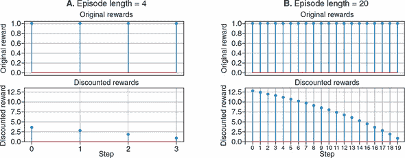

奖励折扣公式为我们提供了一组比单纯地求和更有意义的值。但我们仍然面临着如何使用这些折扣奖励价值来训练策略网络的问题。为此，我们将使用一种名为 REINFORCE 的算法，该算法由罗纳德·威廉姆斯在 1992 年发明。^([6]) REINFORCE 的基本思想是调整策略网络的权重，使其更有可能做出良好的选择（选择分配更高的折扣奖励）并减少做出不良选择（分配更低的折扣奖励）。

> ⁶
> 
> Ronald J. Williams，“Simple Statistical Gradient-Following Algorithms for Connectionist Reinforcement Learning,” *Machine Learning*, vol. 8, nos. 3–4, pp. 229–256, [`mng.bz/WOyw`](http://mng.bz/WOyw).

为了达到此目的，我们需要计算改变参数的方向，以使给定观察输入更有可能进行动作。这是通过 代码清单 11.3（摘自 cart-pole/index.js）实现的。函数 `getGradientsAndSaveActions()` 在游戏的每个步骤中被调用。它比较逻辑回归（未归一化的概率得分）和该步骤选择的实际动作，并返回相对于策略网络权重的两者不一致性的梯度。这可能听起来很复杂，但直观上是相当简单的。返回的梯度告诉策略网络如何更改其权重，以使选择更类似于实际选择。这些梯度与训练集的奖励一起构成了我们强化学习方法的基础。这就是为什么该方法属于被称为 *策略梯度* 的强化学习算法家族的原因。

##### 代码清单 11.3 通过比较逻辑回归和实际动作来获取权重的梯度。

```js
  getGradientsAndSaveActions(inputTensor) {
    const f = () => tf.tidy(() => {
      const [logits, actions] =
          this.getLogitsAndActions(inputTensor);                       ***1***
      this.currentActions_ = actions.dataSync();
      const labels =
          tf.sub(1, tf.tensor2d(this.currentActions_, actions.shape));
      return tf.losses.sigmoidCrossEntropy(                            ***2***
          labels, logits).asScalar();                                  ***2***
    });
    return tf.variableGrads(f);                                        ***3***
  }
```

+   ***1*** `getLogitsAndActions()` 在 代码清单 11.2 中定义。

+   ***2*** sigmoid 交叉熵损失量化其在游戏中实际执行的动作与策略网络输出的逻辑回归之间的差异。

+   ***3*** 计算损失相对于策略网络权重的梯度。

在训练期间，我们让代理对象玩一些游戏（比如 *N* 个游戏），并根据 方程式 11.1 收集所有折扣奖励以及所有步骤中的梯度。然后，我们通过将梯度与折扣奖励的归一化版本相乘来结合折扣奖励和梯度。奖励归一化在这里是一个重要的步骤。它线性地转移和缩放了 *N* 个游戏中所有折扣奖励，使得它们的总体均值为 0 和总体标准偏差为 1。图 11.6 显示了在折扣奖励上应用此归一化的示例。它说明了短剧集（长度为 4）和较长剧集（长度为 20）的归一化、折扣奖励。从这张图中可以明确 REINFORCE 算法所偏向的步骤是什么：它们是较长剧集的早期和中间部分的动作。相比之下，所有来自较短（长度为 4）剧集的步骤都被赋予 *负* 值。负的归一化奖励意味着什么？这意味着当它用于稍后更新策略网络的权重时，它将使网络远离未来给定相似状态输入时进行类似动作的选择。这与正的归一化奖励相反，后者将使策略网络向未来在类似的输入条件下做出相似的动作方向

##### 图 11.6\. 对两个长度为 4（面板 A）和 20（面板 B）的情节中的折现奖励进行归一化。我们可以看到，归一化的折现奖励在长度为 20 的情节开始部分具有最高值。策略梯度方法将使用这些折现奖励值来更新策略网络的权重，这将使网络更不可能选择导致第一个情节（长度 = 4）中不良奖励的动作选择，并且更有可能选择导致第二个情节开始部分（长度 = 20）中良好奖励的选择（在相同的状态输入下，即）。

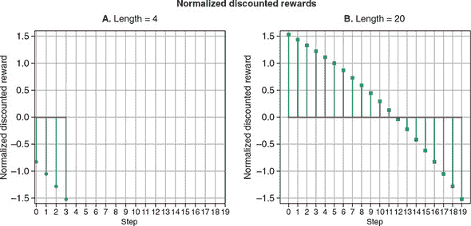

对折现奖励进行归一化，并使用它来缩放梯度的代码有些冗长但不复杂。它在 cart-pole/index.js 中的 `scaleAndAverageGradients()` 函数中，由于篇幅限制这里不列出。缩放后的梯度用于更新策略网络的权重。随着权重的更新，策略网络将对从分配了更高折现奖励的步骤中的动作输出更高的 logits，并对从分配了较低折现奖励的步骤中的动作输出较低的 logits。

这基本上就是 REINFORCE 算法的工作原理。基于 REINFORCE 的 cart-pole 示例的核心训练逻辑显示在 列表 11.4 中。它是前面描述的步骤的重述：

1.  调用策略网络以基于当前代理观察获得 logits。

1.  基于 logits 随机采样一个动作。

1.  使用采样的动作更新环境。

1.  记住以下内容以备后续更新权重（步骤 7）：logits 和所选动作，以及损失函数相对于策略网络权重的梯度。这些梯度被称为 *策略梯度*。

1.  从环境中接收奖励，并将其记住以备后用（步骤 7）。

1.  重复步骤 1–5 直到完成 `numGames` 情节。

1.  一旦所有 `numGames` 情节结束，对奖励进行折扣和归一化，并使用结果来缩放步骤 4 中的梯度。然后使用缩放后的梯度来更新策略网络的权重。（这是策略网络的权重被更新的地方。）

1.  （未在 列表 11.4 中显示）重复步骤 1–7 `numIterations` 次。

将这些步骤与代码中的步骤进行比较（从 cart-pole/index.js 中摘录），以确保您能够看到对应关系并按照逻辑进行。

##### 列表 11.4\. Cart-pole 示例中实现 REINFORCE 算法的训练循环

```js
  async train(
      cartPoleSystem, optimizer, discountRate, numGames, maxStepsPerGame) {
    const allGradients = [];
    const allRewards = [];
    const gameSteps = [];
    onGameEnd(0, numGames);
    for (let i = 0; i < numGames; ++i) {                              ***1***
      cartPoleSystem.setRandomState();                                ***2***
      const gameRewards = [];
      const gameGradients = [];
      for (let j = 0; j < maxStepsPerGame; ++j) {                     ***3***
        const gradients = tf.tidy(() => {
          const inputTensor = cartPoleSystem.getStateTensor();
          return this.getGradientsAndSaveActions(                     ***4***
              inputTensor).grads;                                     ***4***
        });
        this.pushGradients(gameGradients, gradients);
        const action = this.currentActions_[0];
        const isDone = cartPoleSystem.update(action);                 ***5***

        await maybeRenderDuringTraining(cartPoleSystem);

        if (isDone) {
          gameRewards.push(0);
          break;
        } else {
          gameRewards.push(1);                                        ***6***
        }
      }
      onGameEnd(i + 1, numGames);
      gameSteps.push(gameRewards.length);
      this.pushGradients(allGradients, gameGradients);
      allRewards.push(gameRewards);
      await tf.nextFrame();
    }
    tf.tidy(() => {
      const normalizedRewards =                                       ***7***
          discountAndNormalizeRewards(allRewards, discountRate);      ***7***
      optimizer.applyGradients(                                       ***8***
          scaleAndAverageGradients(allGradients, normalizedRewards)); ***8***
    });
    tf.dispose(allGradients);
    return gameSteps;
  }
```

+   ***1*** 循环指定次数的情节

+   ***2*** 随机初始化一个游戏情节

+   ***3*** 循环游戏的步骤

+   ***4*** 跟踪每步的梯度以备后续 REINFORCE 训练

+   ***5*** 代理在环境中采取一个动作。

+   ***6*** 只要游戏尚未结束，代理每步都会获得一个单位奖励。

+   ***7*** 对奖励进行折扣和归一化（REINFORCE 的关键步骤）

+   ***8*** 使用来自所有步骤的缩放梯度更新策略网络的权重

要看到 REINFORCE 算法的运行情况，请在演示页面上指定 25 个时期，并单击“训练”按钮。默认情况下，训练期间实时显示环境的状态，以便您可以看到学习代理的重复尝试。要加快训练速度，请取消选中“训练期间渲染”复选框。在合理更新的笔记本电脑上，25 个时期的训练需要几分钟，并且应足以达到天花板性能（默认设置下游戏每轮 500 步）。图 11.7 显示了典型的训练曲线，该曲线将平均每轮长度作为训练迭代的函数绘制出来。请注意，训练进度显示出一些戏剧性的波动，平均步数随着迭代次数以非单调和高度嘈杂的方式变化。这种波动在强化学习训练工作中并不罕见。

##### 图 11.7\. 一条曲线显示了智能体在车杆问题的每个训练迭代中生存的平均步数与训练迭代次数的关系。在约第 20 次迭代时达到完美分数（在本例中为 500 步）。这个结果是在隐藏层大小为 128 的情况下获得的。曲线的高度非单调和波动形状在强化学习问题中并不罕见。

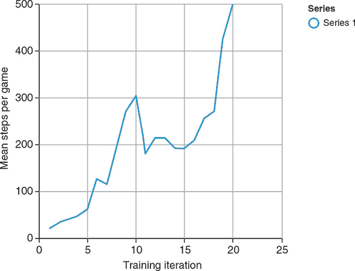

训练完成后，单击“测试”按钮，您应该会看到代理在许多步骤上很好地保持车杆系统平衡的表现。由于测试阶段不涉及最大步数（默认为 500 步），因此代理可以保持游戏进行超过 1,000 步。如果持续时间过长，您可以单击“停止”按钮终止模拟。

总结这一节，图 11.8 概括了问题的表述以及 REINFORCE 策略梯度算法的作用。这张图展示了解决方案的所有主要部分。在每个步骤中，代理使用一个名为*策略网络*的神经网络来估计向左行动（或等效地，向右行动）是更好的选择的可能性。这种可能性通过一个随机抽样过程转换为实际行动，该过程鼓励代理早期探索并在后期遵守估计的确定性。行动驱动环境中的车杆系统，该系统反过来为代理提供奖励，直到本集的结束。这个过程重复了多个集，期间 REINFORCE 算法记住了每一步的奖励、行动和策略网络的估计。当 REINFORCE 需要更新策略网络时，它通过奖励折现和归一化区分网络中的好估计和坏估计，然后使用结果来推动网络的权重朝着未来做出更好的估计。这个过程迭代了多次，直到训练结束（例如，当代理达到阈值性能时）。

##### 图 11.8\. 展示了基于 REINFORCE 算法的解决方案对车杆问题的示意图。该图是图 11.4 中图示的扩展视图。

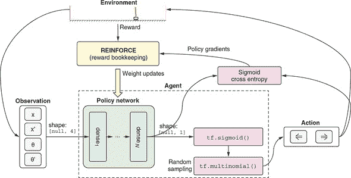

抛开所有优雅的技术细节，让我们退后一步，看一看这个例子中体现的 RL 的大局。基于 RL 的方法相对于非机器学习方法（如传统控制理论）具有明显的优势：普适性和人力成本的经济性。在系统具有复杂或未知特性的情况下，RL 方法可能是唯一可行的解决方案。如果系统的特性随时间变化，我们不必从头开始推导新的数学解：我们只需重新运行 RL 算法，让代理适应新情况。

RL 方法的劣势，这仍然是 RL 研究领域中一个未解决的问题，是它需要在环境中进行许多次重复试验。在车杆示例中，大约需要 400 个游戏回合才能达到目标水平的熟练程度。一些传统的、非 RL 方法可能根本不需要试验。实施基于控制理论的算法，代理应该能够从第 1 个回合就平衡杆子。对于像车杆这样的问题，RL 对于重复试验的渴望并不是一个主要问题，因为计算机对环境的模拟是简单、快速和廉价的。然而，在更现实的问题中，比如自动驾驶汽车和物体操纵机器臂，RL 的这个问题就变得更加尖锐和紧迫。没有人能承担在训练代理时多次撞车或者摧毁机器臂的成本，更不用说在这样的现实问题中运行 RL 训练算法将需要多么长的时间。

这就结束了我们的第一个 RL 示例。车杆问题具有一些特殊的特征，在其他 RL 问题中不适用。例如，许多 RL 环境并不会在每一步向代理提供正面奖励。在某些情况下，代理可能需要做出几十个甚至更多的决策，才能获得积极的奖励。在正面奖励之间的空隙中，可能没有奖励，或者只有负面奖励（可以说很多现实生活中的努力，比如学习、锻炼和投资，都是如此！）。此外，车杆系统在“无记忆”方面是“无记忆”的，即系统的动态不取决于代理过去的行为。许多 RL 问题比这更复杂，因为代理的行为改变了环境的某些方面。我们将在下一节中研究的 RL 问题将展示稀疏的正面奖励和一个随着行动历史而变化的环境。为了解决这个问题，我们将介绍另一个有用且流行的 RL 算法，称为 *deep* *Q-learning*。

### 11.3\. 价值网络和 Q 学习：蛇游戏示例

我们将使用经典的动作游戏 *snake* 作为我们深度 Q 学习的示例问题。就像我们在上一节中所做的那样，我们将首先描述 RL 问题及其带来的挑战。在这样做的过程中，我们还将讨论为什么策略梯度和 REINFORCE 对这个问题不会非常有效。

#### 11.3.1\. 蛇作为一个强化学习问题

蛇游戏首次出现在 1970 年代的街机游戏中，已经成为一个广为人知的视频游戏类型。tfjs-examples 中的 snake-dqn 目录包含一个简单变体的 JavaScript 实现。您可以通过以下代码查看：

```js
git clone https://github.com/tensorflow/tfjs-examples.git
cd tfjs-examples/snake-dqn
yarn
yarn watch
```

在由`yarn watch`命令打开的网页中，你可以看到贪吃蛇游戏的棋盘。你可以加载一个预先训练并托管的深度 Q 网络（DQN）模型，并观察它玩游戏。稍后，我们将讨论如何从头开始训练这样的模型。现在，通过观察，你应该能直观地感受到这款游戏是如何运行的。如果你还不熟悉贪吃蛇游戏，它的设置和规则可以总结如下。

首先，所有动作发生在一个 9×9 的网格世界中（参见图 11.9 的例子）。世界（或棋盘）可以设得更大，但在我们的例子中，9×9 是默认大小。棋盘上有三种类型的方块：蛇、果子和空白。蛇由蓝色方块表示, 只有头部是橙色的，并带有半圆形代表蛇的嘴巴。果子由内部有圆圈的绿色方块表示。空白方块是白色的。游戏按步骤进行，或者按视频游戏术语来说是*帧*。在每一帧中，代理必须从三个可能的动作中为蛇选择：直行、左转或右转（原地不动不是选项）。当蛇的头部与果子方块接触时，代理被奖励呈积极反应，这种情况下果子方块将消失（被蛇“吃掉”），蛇的长度会在尾部增加一个。一个新的果子将出现在空白方块中。如果代理在某一步没有吃到果子，它将受到负奖励。游戏终止（蛇“死亡”）是指当蛇的头部离开边界（如图 11.9 的面板 B）或撞到自己的身体时。

##### 图 11.9\. 贪吃蛇游戏：一个网格世界, 玩家控制蛇吃果子。蛇的“目标”是通过有效的移动模式尽可能多地吃果子（面板 A）。每次吃一个果子蛇的长度增加 1。游戏结束（蛇“死掉”）是当蛇离开边界（面板 B）或撞到自己的身体（面板 C）时。注意，在面板 B 中，蛇的头部到达边缘位置，然后发生了向上的运动（直行动作），导致游戏终止。简单到达边缘方块并不会导致终止。吃掉每个果子会导致一个很大的正奖励。在没有吃果子的情况下移动一个方块会导致一个较小幅度的负奖励。游戏终止（蛇死亡）也会导致一个负奖励。

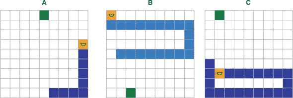

蛇游戏中的一个关键挑战是蛇的增长。如果没有这个规则，游戏会简单得多。只需一遍又一遍地将蛇导航到水果，智能体可以获得无限的奖励。然而，有了长度增长规则，智能体必须学会避免撞到自己的身体，随着蛇吃更多的水果和变得更长，这变得更加困难。这是蛇 RL 问题的非静态方面，推车杆环境所缺乏的，正如我们在上一节末尾提到的。

表 11.2 在经典 RL 表述中描述了蛇问题。与推车杆问题的表述（表 11.1）相比，最大的区别在于奖励结构。在蛇问题中，正奖励（每吃一颗水果+10）出现不频繁——也就是说，只有在蛇移动到达水果后，经历了一系列负奖励后才会出现。考虑到棋盘的大小，即使蛇以最有效的方式移动，两个正奖励之间的间隔也可能长达 17 步。小的负奖励是一个惩罚，鼓励蛇走更直接的路径。没有这个惩罚，蛇可以以蜿蜒的间接方式移动，并且仍然获得相同的奖励，这将使游戏和训练过程不必要地变长。这种稀疏而复杂的奖励结构也是为什么策略梯度和 REINFORCE 方法在这个问题上效果不佳的主要原因。策略梯度方法在奖励频繁且简单时效果更好，就像推车杆问题一样。

##### 表 11.2\. 在经典 RL 表述中描述蛇游戏问题

| 抽象 RL 概念 | 在蛇问题中的实现 |
| --- | --- |
| 环境 | 一个包含移动蛇和自我补充水果的网格世界。 |
| 动作 | (离散) 三元选择：直行，左转，或右转。 |

| 奖励 | (频繁，混合正负奖励)

+   吃水果——大正奖励 (+10)

+   移动而不吃水果——小负奖励 (–0.2)

+   死亡——大负奖励 (–10)

|

| 观测 | (完整状态，离散) 每一步，智能体可以访问游戏的完整状态：即棋盘上每个方块的内容。 |
| --- | --- |

##### 蛇的 JavaScript API

我们的 JavaScript 实现可以在文件 snake-dqn/snake_ game.js 中找到。我们只会描述`SnakeGame`类的 API，并略过实现细节，如果你感兴趣，可以自行学习。`SnakeGame`类的构造函数具有以下语法：

```js
const game = new SnakeGame({height, width, numFruits, initLen});
```

这里，棋盘的大小参数，`height`和`width`，默认值为 9。`numFruits`是棋盘上任意给定时间存在的水果数量，默认值为 1。`initLen`，蛇的初始长度，默认值为 2。

`game`对象暴露的`step()`方法允许调用者在游戏中执行一步：

```js
const {state, reward, done, fruitEaten} = game.step(action);
```

`step()` 方法的参数表示动作：0 表示直行，1 表示向左转，2 表示向右转。`step()` 方法的返回值具有以下字段：

+   `state`—动作后立即棋盘的新状态，表示为具有两个字段的普通 JavaScript 对象：

    +   `s`—蛇占据的方块，以 `[x, y]` 坐标数组形式表示。此数组的元素按照头部对应第一个元素，尾部对应最后一个元素的顺序排列。

    +   `f`—水果占据的方块的 `[x, y]` 坐标。请注意，此游戏状态的表示设计为高效，这是由 Q 学习算法存储大量（例如，成千上万）这样的状态对象所必需的，正如我们很快将看到的。另一种方法是使用数组或嵌套数组来记录棋盘上每个方块的状态，包括空的方块。这将是远不及空间高效的方法。

+   `reward`—蛇在步骤中立即执行动作后获得的奖励。这是一个单一数字。

+   `done`—一个布尔标志，指示游戏在动作发生后是否立即结束。

+   `fruitEaten`—一个布尔标志，指示蛇在动作中是否吃到了水果。请注意，这个字段部分冗余于 `reward` 字段，因为我们可以从 `reward` 推断出是否吃到了水果。它包含在内是为了简单起见，并将奖励的确切值（可能是可调节的超参数）与水果被吃与未被吃的二进制事件解耦。

正如我们将在稍后看到的，前三个字段（`state`、`reward` 和 `done`）在 Q 学习算法中将发挥重要作用，而最后一个字段（`fruitEaten`）主要用于监视。

#### 11.3.2\. 马尔可夫决策过程和 Q 值

要解释我们将应用于蛇问题的深度 Q 学习算法，首先需要有点抽象。特别是，我们将以基本水平介绍*马尔可夫决策过程*（MDP）及其基本数学。别担心：我们将使用简单具体的示例，并将概念与我们手头的蛇问题联系起来。

从 MDP 的视角看，RL 环境的历史是通过有限数量的离散状态的一系列转换。此外，状态之间的转换遵循一种特定类型的规则：

> *下一步环境的状态完全由代理在当前步骤采取的状态和动作决定。*

关键是下一个状态仅取决于两件事：当前状态和采取的动作，而不是其他。换句话说，MDP 假设你的历史（你如何到达当前状态）与决定下一步该做什么无关。这是一个强大的简化，使问题更易处理。什么是 *非马尔可夫决策过程*？这将是一种情况，即下一个状态不仅取决于当前状态和当前动作，还取决于先前步骤的状态或动作，可能一直追溯到情节开始。在非马尔可夫情况下，数学会变得更加复杂，解决数学问题需要更多的计算资源。

对于许多强化学习问题来说，马尔可夫决策过程的要求是直观的。象棋游戏是一个很好的例子。在游戏的任何一步中，棋盘配置（以及轮到哪个玩家）完全描述了游戏状态，并为玩家提供了计算下一步移动所需的所有信息。换句话说，可以从棋盘配置恢复棋局而不知道先前的移动。 （顺便说一句，这就是为什么报纸可以以非常节省空间的方式发布国际象棋谜题的原因。）像贪吃蛇这样的视频游戏也符合马尔可夫决策过程的公式化。蛇和食物在棋盘上的位置完全描述了游戏状态，这就足以从那一点恢复游戏或代理决定下一步行动。

尽管诸如国际象棋和贪吃蛇等问题与马尔可夫决策过程完全兼容，但它们都涉及天文数字级别的可能状态。为了以直观和视觉的方式呈现马尔可夫决策过程，我们需要一个更简单的例子。在 图 11.10 中，我们展示了一个非常简单的马尔可夫决策过程问题，其中只有七种可能的状态和两种可能的代理动作。状态之间的转换受以下规则管理：

+   初始状态始终为 *s*[1]。

+   从状态 s[1] 开始，如果代理采取动作 *a*[1]，环境将进入状态 *s*[2]。如果代理采取动作 *a*[2]，环境将进入状态 *s*[3]。

+   从每个状态 *s*[2] 和 *s*[3]，进入下一个状态的转换遵循一组类似的分叉规则。

+   状态 *s*[4]、*s*[5]、*s*[6] 和 *s*[7] 是终止状态：如果达到任何一个状态，那么该情节结束。

##### 图 11.10\. 马尔可夫决策过程（MDP）的一个非常简单具体的例子。状态表示为标有 *s[n]* 的灰色圆圈，而动作表示为标有 *a[m]* 的灰色圆圈。由动作引起的每个状态转换的奖励标有 *r* = *x*。

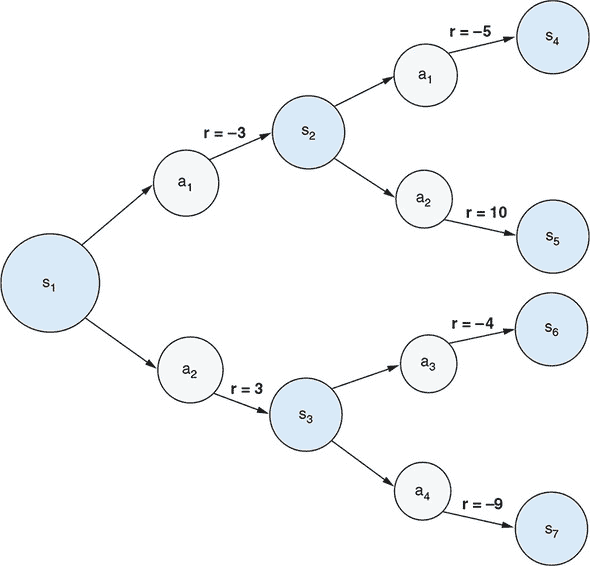

因此，在这个强化学习问题中，每个阶段都恰好持续三个步骤。在这个强化学习问题中，代理应该如何决定在第一步和第二步采取什么行动？考虑到我们正在处理一个强化学习问题，只有在考虑奖励时，这个问题才有意义。在马尔可夫决策过程中，每个动作不仅引起状态转移，而且还导致奖励。在 图 11.10 中，奖励被描述为将动作与下一个状态连接的箭头，标记为 `r = <reward_value>`。代理的目标当然是最大化总奖励（按比例折现）。现在想象一下我们是第一步的代理。让我们通过思考过程来确定我们将选择 *a*[1] 还是 *a*[2] 更好的选择。假设奖励折现因子（γ）的值为 0.9。

思考过程如下。如果我们选择动作 *a*[1]，我们将获得–3 的即时奖励并转移到状态 *s*[2]。如果我们选择动作 *a*[2]，我们将获得 3 的即时奖励并转移到状态 *s*[3]。这是否意味着 *a*[2] 是更好的选择，因为 3 大于 –3？答案是否定的，因为 3 和 –3 只是即时奖励，并且我们还没有考虑以下步骤的奖励。我们应该看看每个 *s*[2] 和 *s*[3] 的最佳可能结果是什么。从 *s*[2] 得到的最佳结果是通过采取动作 *a*[2] 而产生的结果，该动作获得了 11 的奖励。这导致我们从状态 *s*[1] 采取动作 *a*[1] 可以期望的最佳折现奖励：

| 当从状态 *s*[1] 采取动作 *a*[1] 时的最佳奖励 = 即时奖励 + 折现未来奖励 |
| --- |
|   | = –3 + γ * 10 |
|   | = –3 + 0.9 * 10 |
|   | = 6 |

同样，从状态 *s*[3] 得到的最佳结果是我们采取动作 *a*[1]，这给我们带来了–4 的奖励。因此，如果我们从状态 *s*[1] 采取动作 *a*[2]，我们可以得到的最佳折现奖励是

| 当从状态 *s*[1] 采取动作 *a*[2] 时的最佳奖励 = 即时奖励 + 折现未来奖励 |
| --- |
|   | = 3 + γ * –4 |
|   | = 3 + 0.9 * –4 |
|   | = 0.6 |

我们在这里计算的折现奖励是我们所说的 *Q-values* 的示例。 Q-value 是给定状态的动作的预期总累积奖励（按比例折现）。从这些 Q-values 中，很明显 *a*[1] 是在状态 *s*[1] 下更好的选择——这与仅考虑第一个动作造成的即时奖励的结论不同。本章末尾的练习 3 将指导您完成涉及随机性的更现实的 MDP 情景的 Q-value 计算。

描述的示例思考过程可能看起来微不足道。但它引导我们得到一个在 Q 学习中起着核心作用的抽象。Q 值，表示为 *Q*(*s*, *a*)，是当前状态 (*s*) 和动作 (*a*) 的函数。换句话说，*Q*(*s*, *a*) 是一个将状态-动作对映射到在特定状态采取特定动作的估计值的函数。这个值是长远眼光的，因为它考虑了最佳未来奖励，在所有未来步骤中都选择最优动作的假设下。

由于它的长远眼光，*Q*(*s*, *a*) `是我们在任何给定状态决定最佳动作的全部内容。特别是，鉴于我们知道 *Q*(*s*, *a*) 是什么，最佳动作是在所有可能动作中给出最高 Q 值的动作：`

##### 方程 11.2\.

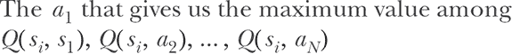

其中 *N* 是所有可能动作的数量。如果我们对 *Q*(*s*, *a*) 有一个很好的估计，我们只需在每一步简单地遵循这个决策过程，我们就能保证获得最高可能的累积奖励。因此，找到最佳决策过程的强化学习问题被简化为学习函数 *Q*(*s*, *a*)。这就是为什么这个学习算法被称为 Q 学习的原因。

让我们停下来，看看 Q 学习与我们在小车杆问题中看到的策略梯度方法有何不同。策略梯度是关于预测最佳动作的；Q 学习是关于预测所有可能动作的值（Q 值）。虽然策略梯度直接告诉我们选择哪个动作，但 Q 学习需要额外的“选择最大值”的步骤，因此稍微间接一些。这种间接性带来的好处是，它使得在涉及稀疏正奖励（如蛇）的问题中更容易形成奖励和连续步骤值之间的连接，从而促进学习。

奖励与连续步骤的值之间有什么联系？当我们解决简单的 MDP 问题时，我们已经窥见了这一点，见图 11.10。这种连接可以用数学方式表示为：

##### 方程 11.3\.

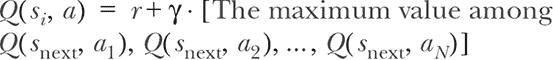

*s*[next] 是我们在状态 *s[i]* 中选择动作 `a` 后到达的状态。这个方程被称为*贝尔曼方程*，是我们在简单的早期示例中得到数字 6 和 -0.6 的抽象。简单来说，这个方程表示：

> ⁷
> 
> 归因于美国应用数学家理查德·E·贝尔曼（1920–1984）。参见他的书 *Dynamic Programming*，普林斯顿大学出版社，1957 年。
> 
> *在状态 s[i] 采取动作 a 的 Q 值是两个术语的总和：*
> 
> 1.  *由于 a 而产生的即时奖励，以及*
> 1.  
> 1.  *从下一个状态中获得的最佳 Q 值乘以一个折扣因子（“最佳”是指在下一个状态选择最优动作的意义上）*

贝尔曼方程是使 Q 学习成为可能的因素，因此很重要理解。你作为程序员会立即注意到贝尔曼方程（方程 11.3）是递归的：方程右侧的所有 Q 值都可以使用方程本身进一步展开。我们在图 11.10 中解释的示例在两步之后结束，而真实的 MDP 问题通常涉及更多步骤和状态，甚至可能包含状态-动作-转换图中的循环。但贝尔曼方程的美丽和力量在于，它允许我们将 Q 学习问题转化为一个监督学习问题，即使对于大状态空间也是如此。我们将在下一节解释为什么会这样。

#### 11.3.3。深度 Q 网络

手工制作函数*Q*(*s*, *a*)可能很困难，因此我们将让函数成为一个深度神经网络（在本节中之前提到的 DQN），并训练其参数。这个 DQN 接收一个表示环境完整状态的输入张量——也就是蛇板配置，这个张量作为观察结果提供给智能体。正如图 11.11 所示，该张量的形状为`[9, 9, 2]`（不包括批次维度）。前两个维度对应于游戏板的高度和宽度。因此，张量可以被视为游戏板上所有方块的位图表示。最后一个维度（2）是代表蛇和水果的两个通道。特别地，蛇被编码在第一个通道中，头部标记为 2，身体标记为 1。水果被编码在第二个通道中，值为 1。在两个通道中，空方块用 0 表示。请注意，这些像素值和通道数目是或多或少任意的。其他值排列（例如，蛇头为 100，蛇身为 50，或者将蛇头和蛇身分成两个通道）也可能有效，只要它们保持三种实体（蛇头、蛇身和水果）是不同的。

##### 图 11.11。蛇游戏的板状态如何表示为形状为`[9, 9, 2]`的三维张量

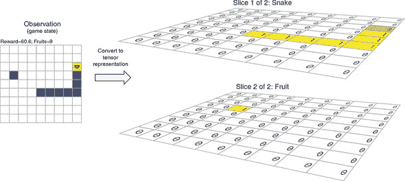

请注意，这种游戏状态的张量表示比我们在上一节中描述的由字段`s`和`f`组成的 JSON 表示要不太空间有效，因为它总是包含板上的所有方块，无论蛇有多长。这种低效的表示仅在我们使用反向传播来更新 DQN 的权重时使用。此外，在任何给定时间，由于我们即将访问的基于批次的训练范式，这种方式下只存在一小部分（`batchSize`）游戏状态。

将有效表示的棋盘状态转换为图 11.11 中所示张量的代码可以在 snake-dqn/snake_game.js 的`getStateTensor()`函数中找到。这个函数在 DQN 的训练过程中会被频繁使用，但我们这里忽略其细节，因为它只是根据蛇和水果的位置机械地为张量缓冲区的元素赋值。

你可能已经注意到这种`[height, width, channel]`的输入格式恰好是卷积神经网络设计来处理的。我们使用的 DQN 是熟悉的卷积神经网络架构。定义 DQN 拓扑的代码可以在列表 11.5 中找到（从 snake-dqn/dqn.js 中摘录，为了清晰起见删除了一些错误检查代码）。正如代码和图 11.12 中的图示所示，网络由一组 conv2d 层后跟一个 MLP 组成。额外的层包括 batchNormalization 和 dropout 被插入以增加 DQN 的泛化能力。DQN 的输出形状为`[3]`（排除批次维度）。输出的三个元素是对应动作（向左转，直行和向右转）的预测 Q 值。因此，我们对*Q*(*s*, *a*)的模型是一个神经网络，它以状态作为输入，并输出给定该状态的所有可能动作的 Q 值。

##### 图 11.12 作为蛇问题中*Q*(*s*, *a*)函数的近似所使用的 DQN 的图示示意图。在“Online DQN”框中，“BN”代表 BatchNormalization。

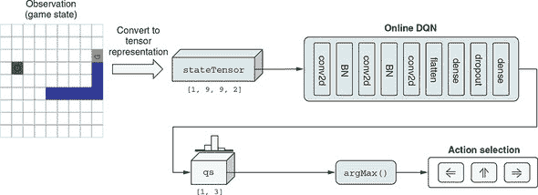

##### 列表 11.5 创建蛇问题的 DQN

```js
export function createDeepQNetwork(h, w, numActions) {
  const model = tf.sequential();
  model.add(tf.layers.conv2d({                            ***1***
    filters: 128,
    kernelSize: 3,
    strides: 1,
    activation: 'relu',
    inputShape: [h, w, 2]                                 ***2***
  }));
  model.add(tf.layers.batchNormalization());              ***3***
  model.add(tf.layers.conv2d({
    filters: 256,
    kernelSize: 3,
    strides: 1,
    activation: 'relu'
  }));
  model.add(tf.layers.batchNormalization());
  model.add(tf.layers.conv2d({
    filters: 256,
    kernelSize: 3,
    strides: 1,
    activation: 'relu'
  }));
  model.add(tf.layers.flatten());                         ***4***
  model.add(tf.layers.dense({units: 100, activation: 'relu'}));
  model.add(tf.layers.dropout({rate: 0.25}));             ***5***
  model.add(tf.layers.dense({units: numActions}));
  return model;
}
```

+   ***1*** DQN 具有典型的卷积神经网络架构：它始于一组 conv2d 层。

+   ***2*** 输入形状与代理观察的张量表示相匹配，如图 11.11 所示。

+   ***3*** batchNormalization 层被添加以防止过拟合并提高泛化能力

+   ***4*** DQN 的 MLP 部分以一个 flatten 层开始。

+   ***5*** 与 batchNormalization 类似，dropout 层被添加以防止过拟合。

让我们停下来思考一下为什么在这个问题中使用神经网络作为函数*Q*(*s*, *a*)是有意义的。蛇游戏具有离散状态空间，不像连续状态空间的车杆问题，后者由四个浮点数组成。因此，*Q*(*s*, *a*)函数原则上可以实现为查找表，即将每个可能的棋盘配置和动作组合映射为*Q*的值。那么为什么我们更喜欢 DQN 而不是这样的查找表呢？原因在于，即使是相对较小的棋盘尺寸（9×9），可能的棋盘配置也太多了，导致了查找表方法的两个主要缺点。首先，系统 RAM 无法容纳如此庞大的查找表。其次，即使我们设法构建了具有足够 RAM 的系统，代理在 RL 期间访问所有状态也需要耗费非常长的时间。DQN 通过其适度大小（约 100 万参数）解决了第一个（内存空间）问题。它通过神经网络的泛化能力解决了第二个（状态访问时间）问题。正如我们在前面章节中已经看到的大量证据所示，神经网络不需要看到所有可能的输入；它通过泛化学习来插值训练示例。因此，通过使用 DQN，我们一举解决了两个问题。

> ⁸
> 
> 一个粗略的估算表明，即使我们将蛇的长度限制为 20，可能的棋盘配置数量也至少达到 10¹⁵数量级。例如，考虑蛇长度为 20 的特定情况。首先，为蛇头选择一个位置，共有 81 种可能性（9 * 9 = 81）。然后第一段身体有四个可能的位置，接着第二段有三个可能的位置，依此类推。当然，在一些身体姿势的配置中，可能的位置会少于三个，但这不应显著改变数量级。因此，我们可以估算出长度为 20 的蛇可能的身体配置数量约为 81 * 4 * 3¹⁸ ≈ 10¹²。考虑到每种身体配置有 61 种可能的水果位置，关节蛇-水果配置的估算增加到了 10¹⁴。类似的估算可以应用于更短的蛇长度，从 2 到 19。将从长度 2 到 20 的估算数字求和得到了 10¹⁵数量级。与我们的蛇棋盘上的方块数量相比，视频游戏如 Atari 2600 游戏涉及更多的像素，因此更不适合查找表方法。这就是为什么 DQNs 是解决这类视频游戏使用 RL 的适当技术之一，正如 DeepMind 的 Volodymyr Mnih 及其同事在 2015 年的里程碑式论文中所示的那样。

#### 11.3.4\. 训练深度 Q 网络

现在，我们有了一个 DQN，可以在蛇游戏的每一步估计出三个可能行动的 Q 值。为了实现尽可能大的累积奖励，我们只需要在每一步运行 DQN，并选择具有最高 Q 值的动作即可。我们完成了吗？并没有，因为 DQN 还没有经过训练！没有适当的训练，DQN 只会包含随机初始化的权重，它给出的动作不会比随机猜测更好。现在，蛇的强化学习问题已经被减少为如何训练 DQN 的问题，这是我们在本节中要讨论的主题。这个过程有些复杂。但别担心：我们将使用大量的图表以及代码摘录，逐步详细说明训练算法。

##### 深度 Q 网络训练的直觉

我们将通过迫使 DQN 与贝尔曼方程相匹配来训练我们的 DQN。如果一切顺利，这意味着我们的 DQN 将同时反映即时奖励和最优折现未来奖励。

我们该如何做到这一点呢？我们需要的是许多输入-输出对的样本，其中输入是实际采取的状态和动作，而输出是 Q 的“正确”（目标）值。计算输入样本需要当前状态 *s[i]* 和我们在该状态下采取的动作 *a[j]*，这两者都可以直接从游戏历史中获取。计算目标 Q 值需要即时奖励 *r[i]* 和下一个状态 *s[i]*[+1]，这两者也可以从游戏历史中获取。我们可以使用 *r[i]* 和 *s[i]*[+1]，通过应用贝尔曼方程来计算目标 Q 值，其细节将很快涉及到。然后，我们将计算由 DQN 预测的 Q 值与贝尔曼方程中的目标 Q 值之间的差异，并将其称为我们的损失。我们将使用标准的反向传播和梯度下降来减少损失（以最小二乘的方式）。使这成为可能和高效的机制有些复杂，但基本的直觉却相当简单。我们想要一个 Q 函数的估计值，以便能做出良好的决策。我们知道我们对 Q 的估计必须与环境奖励和贝尔曼方程相匹配，因此我们将使用梯度下降来实现。简单！

##### 回放内存：用于 DQN 训练的滚动数据集

我们的 DQN 是一个熟悉的卷积网络，在 TensorFlow.js 中作为 `tf.LayersModel` 的一个实例实现。关于如何训练它，首先想到的是调用其 `fit()` 或 `fitDataset()` 方法。然而，我们在这里不能使用常规方法，因为我们没有一个包含观察到的状态和相应 Q 值的标记数据集。考虑这样一个问题：在 DQN 训练之前，没有办法知道 Q 值。如果我们有一个给出真实 Q 值的方法，我们就会在马尔科夫决策过程中使用它并完成。因此，如果我们局限于传统的监督学习方法，我们将面临一个先有鸡还是先有蛋的问题：没有训练好的 DQN，我们无法估计 Q 值；没有良好的 Q 值估计，我们无法训练 DQN。我们即将介绍的强化学习算法将帮助我们解决这个先有鸡还是先有蛋的问题。

具体来说，我们的方法是让代理者随机玩游戏（至少最初是如此），并记住游戏的每一步发生了什么。随机游戏部分很容易通过随机数生成器实现。记忆部分则通过一种称为*重放内存*的数据结构实现。图 11.13 展示了重放内存的工作原理。它为游戏的每一步存储五个项目：

1.  *s[i]*，第 *i* 步的当前状态观察（棋盘配置）。

1.  *a[i]*，当前步骤实际执行的动作（可以是 DQN 选择的，如图 11.12，也可以是随机选择）。

1.  *r[i]*，在此步骤接收到的即时奖励。

1.  *d[i]*，一个布尔标志，指示游戏在当前步骤后立即结束。由此可见，重放内存不仅仅是为了一个游戏回合。相反，它将来自多个游戏回合的结果连接在一起。一旦前一场游戏结束，训练算法就会简单地开始新的游戏，并将新记录追加到重放内存中。

1.  *s[i]*[+1]，如果 *d[i]* 为假，则是下一步的观察。（如果 *d[i]* 为真，则存储 null 作为占位符。）

##### 图 11.13\. 在 DQN 训练过程中使用的重放内存。每一步都将五条数据推到重放内存的末尾。在 DQN 的训练过程中对这些数据进行抽样。

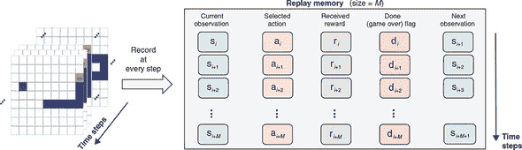

这些数据片段将用于 DQN 的基于反向传播的训练。回放记忆可以被视为 DQN 训练的“数据集”。然而，它不同于监督学习中的数据集，因为它会随着训练的进行而不断更新。回放记忆有一个固定长度*M*（在示例代码中默认为 10,000）。当一个记录(*s[i]*, *a[i]*, *r[i]*, *d[i]*, *s[i]*[+1])被推到其末尾时，一个旧的记录会从其开始弹出，这保持了一个固定的回放记忆长度。这确保了回放记忆跟踪了训练中最近*M*步的发生情况，除了避免内存不足的问题。始终使用最新的游戏记录训练 DQN 是有益的。为什么？考虑以下情况：一旦 DQN 训练了一段时间并开始“熟悉”游戏，我们将不希望使用旧的游戏记录来教导它，比如训练开始时的记录，因为这些记录可能包含不再相关或有利于进一步网络训练的幼稚移动。

实现回放记忆的代码非常简单，可以在文件 snake-dqn/replay_memory.js 中找到。我们不会描述代码的详细信息，除了它的两个公共方法，`append()`和`sample()`：

+   `append()`允许调用者将新记录推送到回放记忆的末尾。

+   `sample(batchSize)`从回放记忆中随机选择`batchSize`个记录。这些记录完全均匀地抽样，并且通常包括来自多个不同情节的记录。`sample()`方法将用于在计算损失函数和随后的反向传播期间提取训练批次，我们很快就会看到。

##### epsilon-greedy 算法：平衡探索和利用

一个不断尝试随机事物的智能体将凭借纯运气偶然发现一些好的动作（在贪吃蛇游戏中吃几个水果）。这对于启动智能体的早期学习过程是有用的。事实上，这是唯一的方法，因为智能体从未被告知游戏的规则。但是，如果智能体一直随机行为，它在学习过程中将无法走得很远，因为随机选择会导致意外死亡，而且一些高级状态只能通过一连串良好的动作达到。

这就是蛇游戏中探索与开发的两难境地的体现。我们在平衡摇摆杆的示例中看到了这个两难境地，其中的策略梯度方法通过逐渐增加训练过程中的多项式采样的确定性来解决这个问题。在蛇游戏中，我们没有这个便利，因为我们的动作选择不是基于 `tf.multinomial()`，而是选择具有最大 Q 值的动作。我们解决这个问题的方式是通过参数化动作选择过程的随机性，并逐渐减小随机性参数。特别地，我们使用所谓的*epsilon-greedy 策略*。该策略可以用伪代码表示为`

```js
    x = Sample a random number uniformly between 0 and 1.
    if x < epsilon:
      Choose an action randomly
    else:
      qValues = DQN.predict(observation)
      Choose the action that corresponds to the maximum element of qValues
```

这个逻辑在训练的每一步都会应用。epsilon 的值越大（接近 1），选择动作的随机性越高。相反，epsilon 的值越小（接近 0），基于 DQN 预测的 Q 值选择动作的概率越高。随机选择动作可以看作是对环境的探索（"epsilon" 代表 "exploration"），而选择最大 Q 值的动作被称为*贪心*。现在你明白了 "epsilon-greedy" 这个名字的来历。

如 代码清单 11.6 所示，实现蛇 DQN 示例中 epsilon-greedy 算法的实际 TensorFlow.js 代码与之前的伪代码具有密切的一对一对应关系。该代码摘自 snake-dqn/agent.js。

##### 代码清单 11.6。实现 epsilon-greedy 算法的部分蛇 DQN 代码

```js
let action;
const state = this.game.getState();
if (Math.random() < this.epsilon) {
  action = getRandomAction();                          ***1***
} else {
  tf.tidy(() => {                                      ***2***
    const stateTensor =                                ***2***
        getStateTensor(state,                          ***2***
                       this.game.height,               ***2***
                       this.game.width);               ***2***
    action = ALL_ACTIONS[
        this.onlineNetwork.predict(                    ***3***
            stateTensor).argMax(-1).dataSync()[0]];    ***3***
  });
}
```

+   ***1*** 探索：随机选择动作

+   ***2*** 将游戏状态表示为张量

+   ***3*** 贪心策略：从 DQN 获取预测的 Q 值，并找到对应于最高 Q 值的动作的索引

epsilon-greedy 策略在早期需要探索和后期需要稳定行为之间保持平衡。它通过逐渐减小 epsilon 的值，从一个相对较大的值逐渐减小到接近（但不完全等于）零。在我们的蛇 DQN 示例中，epsilon 在训练的前 1 × 105 步中以线性方式逐渐减小从 0.5 到 0.01。请注意，我们没有将 epsilon 减小到零，因为在智能体的训练的高级阶段，我们仍然需要适度的探索程度来帮助智能体发现新的智能举动。在基于 epsilon-greedy 策略的 RL 问题中，epsilon 的初始值和最终值都是可调节的超参数，epsilon 的降低时间也是如此。

在 epsilon-greedy 策略设定下的深度 Q 学习算法背景下，接下来让我们详细了解 DQN 的训练细节。

##### 提取预测的 Q 值

尽管我们正在使用一种新方法来解决 RL 问题，但我们仍然希望将我们的算法塑造成监督学习，因为这样可以让我们使用熟悉的反向传播方法来更新 DQN 的权重。这样的制定需要三个要素：

+   预测的 Q 值。

+   “真实”的 Q 值。请注意，在这里，“真实”一词带有引号，因为实际上并没有办法获得 Q 值的基本真实值。这些值只是我们在训练算法的给定阶段能够得到的*Q*(*s*, *a*)的最佳估计值。因此，我们将其称为目标 Q 值。

+   一个损失函数，它以预测和目标 Q 值作为输入，并输出一个量化两者之间不匹配的数字。

在这个小节中，我们将看看如何从回放记忆中获取预测的 Q 值。接下来的两个小节将讨论如何获取目标 Q 值和损失函数。一旦我们有了这三个要素，我们的蛇 RL 问题基本上就变成了一个简单的反向传播问题。

图 11.14 说明了如何从回放记忆中提取预测的 Q 值的 DQN 训练步骤。应该将这个图表与实现代码清单 11.7 一起查看，以便更好地理解。

##### 图 11.14\. 如何从回放记忆和在线 DQN 中获取预测的 Q 值。这是 DQN 训练算法中监督学习部分的两个部分中的第一个部分。这个工作流的结果，即 DQN 预测的 Q 值`actionQs`，是将与`targetQs`一起用于计算 MSE 损失的两个参数之一。查看图 11.15 以了解计算`targetQs`的工作流程。

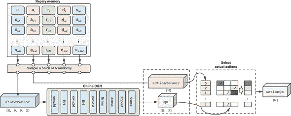

特别地，我们从回放记忆中随机抽取`batchSize`（默认为`N = 128`）条记录。正如之前所描述的，每条记录都有五个项目。为了获得预测的 Q 值，我们只需要前两个。第一个项目，包括*N*个状态观察，一起转换成一个张量。这个批处理的观察张量由在线 DQN 处理，它给出了预测的 Q 值（在图表和代码中都是`qs`）。然而，`qs`包含的 Q 值不仅包括实际选择的动作，还包括未选择的动作。对于我们的训练，我们希望忽略未选择动作的 Q 值，因为没有办法知道它们的目标 Q 值。这就是第二个回放记忆项发挥作用的地方。

第二项包含实际选择的动作。它们被格式化成张量表示（图和代码中的 `actionTensor`）。然后使用 `actionTensor` 选择我们想要的 `qs` 元素。这一步骤在图中标记为选择实际动作的框中完成，使用了三个 TensorFlow.js 函数：`tf.oneHot()`、`mul()` 和 `sum()`（参见清单 11.7 中的最后一行）。这比切片张量稍微复杂一些，因为在不同的游戏步骤可以选择不同的动作。清单 11.7 中的代码摘自 snake-dqn/agent.js 中的 `SnakeGameAgent.trainOnReplayBatch()` 方法，为了清晰起见进行了些许省略。

##### 清单 11.7\. 从回放内存中提取一批预测的 Q 值

```js
const batch = this.replayMemory.sample(batchSize);       ***1***
const stateTensor = getStateTensor(
    batch.map(example => example[0]),                    ***2***
    this.game.height, this.game.width);
const actionTensor = tf.tensor1d(
    batch.map(example => example[1]),                    ***3***
    'int32');
const qs = this.onlineNetwork.apply(                     ***4***
    stateTensor, {training: true})                       ***4***
    .mul(tf.oneHot(actionTensor, NUM_ACTIONS)).sum(-1);  ***5***
```

+   ***1*** 从回放内存中随机选择一批大小为 batchSize 的游戏记录

+   ***2*** 每个游戏记录的第一个元素是代理的状态观察（参见图 11.13）。它由 getStateTensor() 函数（参见图 11.11）将其从 JSON 对象转换为张量。

+   ***3*** 游戏记录的第二个元素是实际选择的动作。它也被表示为张量。

+   ***4*** apply() 方法与 predict() 方法类似，但显式指定了“training: true”标志以启用反向传播。

+   ***5*** 我们使用 tf.oneHot()、mul() 和 sum() 来隔离仅针对实际选择的动作的 Q 值，并丢弃未选择的动作的 Q 值。

这些操作给了我们一个名为 `actionQs` 的张量，其形状为 `[N]`，其中 `N` 是批次大小。这就是我们寻找的预测的 Q 值，即我们所处的状态 *s* 和我们实际采取的动作 *a* 的预测 *Q*(*s*, *a*)。接下来，我们将探讨如何获取目标 Q 值。

##### 提取目标 Q 值：使用贝尔曼方程

获取目标 Q 值比获取预测值稍微复杂一些。这是理论上的贝尔曼方程将被实际应用的地方。回想一下，贝尔曼方程用两个因素描述了状态-动作对的 Q 值：1) 即时奖励和 2) 下一步状态可用的最大 Q 值（通过一个因子折现）。前者很容易获得。它直接作为回放内存的第三项可得到。图 11.15 中的 `rewardTensor` 用示意图的方式说明了这一点。

##### 图 11.15\. 如何从重播记忆和目标 DQN 获取目标 Q 值（`targetQs`）。此图与图 11.14 共享重播记忆和批量采样部分。应该与列表 11.8 中的代码一起检查。这是进入 DQN 训练算法的监督学习部分的两个部分之一。`targetQs`在计算中起着类似于前几章中监督学习问题中的真实标签的作用（例如，MNIST 示例中的已知真实标签或 Jena-weather 示例中的已知真实未来温度值）。贝尔曼方程在计算`targetQs`中起着关键作用。与目标 DQN 一起，该方程允许我们通过形成当前步骤的 Q 值和随后步骤的 Q 值之间的连接来计算`targetQs`的值。

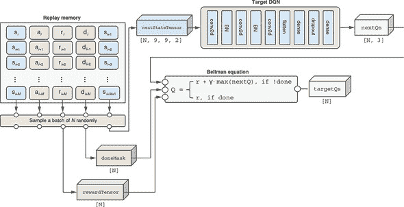

要计算后者（最大的下一步 Q 值），我们需要来自下一步的状态观察。幸运的是，下一步观察被存储在重播记忆中的第五项。我们取随机抽样批次的下一步观察，将其转换为张量，并通过名为*目标 DQN*的 DQN 的副本运行它（见图 11.15）。这给了我们下一步状态的估计 Q 值。一旦我们有了这些值，我们沿着最后（动作）维度进行`max()`调用，这导致从下一步状态中获得的最大 Q 值（在列表 11.8 中表示为`nextMaxQTensor`）。遵循贝尔曼方程，这个最大值乘以折扣因子（图 11.15 中的γ和列表 11.8 中的`gamma`）并与即时奖励相结合，产生目标 Q 值（在图和代码中均为`targetQs`）。

注意，只有当当前步骤不是游戏剧集的最后一步时（即，它不会导致蛇死亡），下一步 Q 值才存在。如果是，那么贝尔曼方程的右侧将仅包括即时奖励项，如图 11.15 所示。这对应于列表 11.8 中的`doneMask`张量。此列表中的代码摘自 snake-dqn/agent.js 中的`SnakeGameAgent.trainOnReplayBatch()`方法，为了清晰起见做了一些小的省略。

##### 图 11.8\. 从重播记忆中提取一批目标（“真实”）Q 值

```js
const rewardTensor = tf.tensor1d(
    batch.map(example => example[2]));             ***1***
const nextStateTensor = getStateTensor(
    batch.map(example => example[4]),              ***2***
    this.game.height, this.game.width);
const nextMaxQTensor =
    this.targetNetwork.predict(nextStateTensor)    ***3***
    .max(-1);                                      ***4***
const doneMask = tf.scalar(1).sub(
    tf.tensor1d(batch.map(example => example[3]))
        .asType('float32'));                       ***5***
const targetQs =                                   ***6***
    rewardTensor.add(nextMaxQTensor.mul(           ***6***
        doneMask).mul(gamma));                     ***6***
```

+   ***1*** 重播记录的第三项包含即时奖励值。

+   ***2*** 记录的第五项包含下一状态观察。它被转换为张量表示。

+   ***3*** 目标 DQN 用于下一个状态张量，它产生下一步所有动作的 Q 值。

+   ***4*** 使用`max()`函数提取下一步可能的最高奖励。这在贝尔曼方程的右侧。

+   ***5*** doneMask 在终止游戏的步骤上具有值 0，并在其他步骤上具有值 1。

+   ***6*** 使用贝尔曼方程来计算目标 Q 值。

正如你可能已经注意到的，在深度 Q 学习算法中的一个重要技巧是使用两个 DQN 实例。它们分别被称为 *在线* DQN 和 *目标* DQN。在线 DQN 负责计算预测的 Q 值（参见上一小节的 图 11.14）。它也是我们在 epsilon-greedy 算法决定采用贪婪（无探索）方法时选择蛇行动的 DQN。这就是为什么它被称为“在线”网络。相比之下，目标 DQN 仅用于计算目标 Q 值，就像我们刚刚看到的那样。这就是为什么它被称为“目标”DQN。为什么我们使用两个 DQN 而不是一个？为了打破不良反馈循环，这可能会导致训练过程中的不稳定性。

在线 DQN 和目标 DQN 是由相同的 `createDeepQNetwork()` 函数创建的（清单 11.5）。它们是两个具有相同拓扑结构的深度卷积网络。因此，它们具有完全相同的层和权重集。权重值周期性地从在线 DQN 复制到目标 DQN（在默认设置的 snake-dqn 中每 1,000 步）。这使目标 DQN 与在线 DQN 保持同步。没有这种同步，目标 DQN 将过时，并通过产生贝尔曼方程中最佳下一步 Q 值的劣质估计来阻碍训练过程。

##### Q 值预测和反向传播的损失函数

有了预测和目标 Q 值，我们使用熟悉的 `meanSquaredError` 损失函数来计算两者之间的差异（图 11.16）。在这一点上，我们已经成功将我们的 DQN 训练过程转化为一个回归问题，类似于以前的例子，如波士顿房屋和耶拿天气。来自 `meanSquaredError` 损失的误差信号驱动反向传播；由此产生的权重更新用于更新在线 DQN。

##### 图 11.16\. 将 `actionQs` 和 `targetQs` 结合在一起，以计算在线 DQN 的 `meanSquaredError` 预测误差，从而使用反向传播来更新其权重。这张图的大部分部分已经在 图 11.12 和 11.13 中展示过。新添加的部分是 `meanSquaredError` 损失函数和基于它的反向传播步骤，位于图的右下部分。

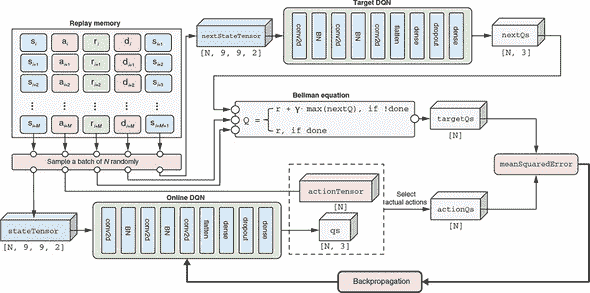

图 11.16 中的示意图包括我们已经在 图 11.12 和 11.13 中展示过的部分。它将这些部分放在一起，并添加了新的框和箭头，用于 `meanSquaredError` 损失和基于它的反向传播（见图的右下部分）。这完成了我们用来训练蛇游戏代理的深度 Q 学习算法的完整图景。

代码清单 11.9 中的代码与图 11.16 中的图表紧密对应。这是在蛇 DQN / agent.js 中的 SnakeGameAgent 类的 trainOnReplayBatch()方法，它在我们的强化学习算法中发挥着核心作用。该方法定义了一个损失函数，该函数计算预测 Q 值和目标 Q 值之间的 meanSquaredError。然后，它使用`tf.variableGrads()`函数（附录 B，第 B.4 节包含了有关 TensorFlow.js 的梯度计算函数（如`tf.variableGrads()`）的详细讨论）计算在线 DQN 权重相对于 meanSquaredError 的梯度。通过优化器使用计算出的梯度来更新 DQN 的权重。这将促使在线 DQN 朝着更准确的 Q 值估计方向移动。重复数百万次后，这将导致 DQN 能够引导蛇达到不错的性能。对于下面的列表，已经展示了负责计算目标 Q 值（`targetQs`）的代码部分（参见代码清单 11.8）。

##### 代码清单 11.9。训练 DQN 的核心函数

```js
trainOnReplayBatch(batchSize, gamma, optimizer) {
  const batch = this.replayMemory.sample(batchSize);              ***1***
  const lossFunction = () => tf.tidy(() => {                      ***2***
    const stateTensor = getStateTensor(
        batch.map(example => example[0]),
                  this.game.height,
                  this.game.width);

    const actionTensor = tf.tensor1d(
        batch.map(example => example[1]), 'int32');
    const qs = this.onlineNetwork                                 ***3***
        .apply(stateTensor, {training: true})
        .mul(tf.oneHot(actionTensor, NUM_ACTIONS)).sum(-1);

    const rewardTensor = tf.tensor1d(batch.map(example => example[2]));
    const nextStateTensor = getStateTensor(
        batch.map(example => example[4]),
                  this.game.height, this.game.width);
    const nextMaxQTensor =
        this.targetNetwork.predict(nextStateTensor).max(-1);
    const doneMask = tf.scalar(1).sub(
        tf.tensor1d(batch.map(example => example[3])).asType('float32'));
    const targetQs =                                              ***4***
        rewardTensor.add(nextMaxQTensor.mul(doneMask).mul(gamma));
    return tf.losses.meanSquaredError(targetQs, qs);              ***5***
  });
  const grads = tf.variableGrads(                                 ***6***
      lossFunction, this.onlineNetwork.getWeights());
  optimizer.applyGradients(grads.grads);                          ***7***
  tf.dispose(grads);
}
```

+   ***1*** 从重播缓冲区中获取一组随机示例

+   ***2*** lossFunction 返回标量，将用于反向传播。

+   ***3*** 预测的 Q 值

+   ***4*** 通过应用贝尔曼方程计算的目标 Q 值

+   ***5*** 使用均方误差(MSE)作为预测和目标 Q 值之间差距的度量

+   ***6*** 计算损失函数相对于在线 DQN 权重的梯度

+   ***7*** 通过优化器使用梯度更新权重

至此，深度 Q 学习算法的内部细节就介绍完了。在 Node.js 环境中，可以使用以下命令开始基于这个算法的训练:

```js
yarn train --logDir /tmp/snake_logs
```

如果您有支持 CUDA 的 GPU，请将`--gpu`标志添加到命令中，以加快训练速度。此`--logDir`标志让该命令在训练过程中将以下指标记录到 TensorBoard 日志目录中:1）最近 100 个游戏周期内累计奖励的运行平均值（cumulativeReward100）；2）最近 100 个周期内食用水果数量的运行平均值（eaten100）；3）探索参数的值（epsilon）；4）每秒钟处理的步数（framesPerSecond）的训练速度。这些日志可以通过使用以下命令启动 TensorBoard 并导航到 TensorBoard 前端的 HTTP URL（默认为：http://localhost:6006）进行查看：

```js
pip install tensorboard tensorboard --logdir /tmp/snake_logs
```

图 11.17 展示了一组训练过程中典型的对数曲线。在强化学习中，cumulativeReward100 和 eaten100 曲线都经常展现出波动。经过几个小时的训练，模型可以达到 cumulativeReward100 的最佳成绩为 70-80，eaten100 的最佳成绩约为 12。

##### 图 11.17：tfjs-node 中蛇的强化学习训练过程的示例日志。面板显示：1）`cumulativeReward100`，最近 100 场游戏的累积奖励的移动平均；2）`eaten100`，最近 100 场游戏中水果被吃的移动平均；3）`epsilon`，epsilon 的值，您可以从中看到 epsilon-greedy 策略的时间进程；以及 4）`framesPerSecond`，训练速度的度量。

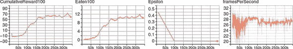

训练脚本还会在每次达到新的最佳 `cumulativeReward100` 值时，将模型保存到相对路径`./models/dqn`。在调用 `yarn watch` 命令时，从 web 前端加载保存的模型。前端会在游戏的每一步显示 DQN 预测的 Q 值（参见图 11.18）。在训练期间使用的 epsilon-greedy 策略在训练后的游戏中被“始终贪婪”的策略所取代。蛇的动作总是选择对应于最高 Q 值的动作（例如，在图 11.18 中，直行的 Q 值为 33.9）。这可以直观地了解训练后的 DQN 如何玩游戏。

##### 图 11.18：经过训练的 DQN 估计的 Q 值以数字形式显示，并以不同的绿色叠加在游戏的前端。

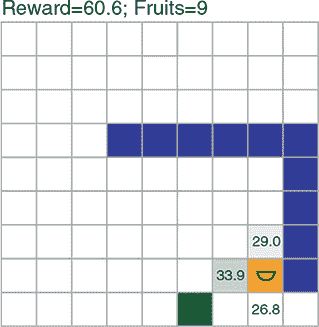

从蛇的行为中有几个有趣的观察。首先，在前端演示中，蛇实际吃到的水果数量（约为 18）平均要大于训练日志中的 `eaten100` 曲线（约为 12）。这是因为 epsilon-greedy 策略的移除，这消除了游戏过程中的随机动作。请记住，epsilon 在 DQN 训练的后期维持为一个小但非零的值（参见图 11.17 的第三个面板）。由此引起的随机动作偶尔会导致蛇的提前死亡，这就是探索性行为的代价。其次，蛇在靠近水果之前会经过棋盘的边缘和角落，即使水果位于棋盘的中心附近。这种策略对于帮助蛇在长度适中（例如，10-18）时减少碰到自己的可能性是有效的。这并不是坏事，但也不是完美的，因为蛇尚未形成更聪明的策略。例如，蛇在长度超过 20 时经常陷入一个循环。这就是蛇的强化学习算法能够带给我们的。为了进一步改进蛇的智能体，我们需要调整 epsilon-greedy 算法，以鼓励蛇在长度较长时探索更好的移动方式。[9] 在当前的算法中，一旦蛇的长度需要在其自身周围熟练操纵时，探索的程度太低。

> ⁹
> 
> 例如，查看[`github.com/carsonprindle/OpenAIExam2018`](https://github.com/carsonprindle/OpenAIExam2018)。

这就是我们对 DQN 技术的介绍结束了。我们的算法是基于 2015 年的论文“通过深度强化学习实现人类水平的控制”，[10]，在该论文中，DeepMind 的研究人员首次证明，结合深度神经网络和强化学习的力量使得机器能够解决许多类似 Atari 2600 的视频游戏。我们展示的 snake-dqn 解决方案是 DeepMind 算法的简化版本。例如，我们的 DQN 仅查看当前步骤的观察，而 DeepMind 的算法将当前观察与前几个步骤的观察结合起来作为 DQN 的输入。但我们的示例捕捉到了这一划时代技术的本质——即使用深度卷积网络作为强大的函数逼近器来估计动作的状态相关值，并使用 MDP 和贝尔曼方程进行训练。强化学习研究人员的后续成就，如征服围棋和国际象棋等游戏，都基于类似的深度神经网络和传统非深度学习强化学习方法的结合。

> ¹⁰
> 
> Volodymyr Mnih 等人，《深度强化学习实现人类水平的控制》，*自然*, vol. 518, 2015, pp. 529–533，[www.nature.com/articles/nature14236/](http://www.nature.com/articles/nature14236/)。

### 进一步阅读材料

+   Richard S. Sutton 和 Andrew G. Barto，《强化学习导论》，A Bradford 书籍，2018。

+   David Silver 在伦敦大学学院的强化学习讲座笔记：[`www0.cs.ucl.ac.uk/staff/d.silver/web/Teaching.html`](http://www0.cs.ucl.ac.uk/staff/d.silver/web/Teaching.html)。

+   Alexander Zai 和 Brandon Brown，《深度强化学习实战》，Manning 出版社，即将出版，[www.manning.com/books/deep-reinforcement-learning-in-action](http://www.manning.com/books/deep-reinforcement-learning-in-action)。

+   Maxim Laplan，《深度强化学习实战：应用现代强化学习方法，包括深度 Q 网络，值迭代，策略梯度，TRPO，AlphaGo Zero 等》，Packt 出版社，2018。

### 练习

1.  在小车摆杆示例中，我们使用了一个策略网络，其中包含一个带有 128 个单元的隐藏密集层，因为这是默认设置。这个超参数如何影响基于策略梯度的训练？尝试将其更改为小值，如 4 或 8，并将结果的学习曲线（每游戏平均步数与迭代曲线）与默认隐藏层大小的曲线进行比较。这对模型容量和其估计最佳动作的有效性之间的关系告诉了你什么？

1.  我们提到使用机器学习解决类似倒立摆的问题的一个优点是人力经济性。具体来说，如果环境意外改变，我们不需要弄清楚它是如何真正改变的并重新确定物理方程，而是可以让代理人自行重新学习问题。通过以下步骤向自己证明这一点。首先，确保倒立摆示例是从源代码而不是托管的网页启动的。使用常规方法训练一个有效的倒立摆策略网络。其次，编辑 cart-pole/cart_pole.js 中的 `this.gravity` 的值，并将其更改为一个新值（例如，如果您要假装我们将倒立摆的配置移到一个比地球更高重力的外行星上，可以将其改为 12）。再次启动页面，加载您在第一步训练的策略网络，并对其进行测试。你能确认它因为重力的改变而表现明显更差吗？最后，再多训练几次策略网络。你能看到策略又逐渐适应新环境而在游戏中表现越来越好吗？

1.  （有关 MDP 和贝尔曼方程的练习）我们在 第 11.3.2 节 和 图 11.10 中提供的 MDP 示例在一定程度上是简单的，因为状态转移和相关奖励没有随机性。但是，许多现实世界的问题更适合描述为随机 MDP。在随机 MDP 中，代理人在采取行动后将进入的状态和获得的奖励遵循概率分布。例如，如 图 11.19 所示，如果代理人在状态*S*[1]采取行动*A*[1]，它将以 0.5 的概率进入状态*S*[2]，以 0.5 的概率进入状态*S*[3]。与这两个状态转换关联的奖励是不同的。在这种随机 MDP 中，代理人必须计算*预期*未来奖励，以考虑随机性。预期未来奖励是所有可能奖励的加权平均值，权重为概率。你能应用这种概率方法并在图中估计*s*[1]的*a*[1]和*a*[2]的 Q 值吗？根据答案，在状态*s*[1]时，*a*[1]和*a*[2]哪个是更好的行动？

    ##### 图 11.19. 练习 3 第一部分的 MDP 图表

    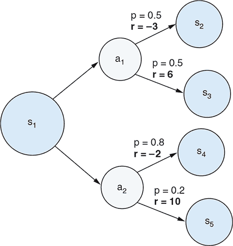

    现在让我们看一个稍微复杂一点的随机 MDP，其中涉及多个步骤（参见 图 11.20）。在这种稍微复杂的情况下，您需要应用递归的贝尔曼方程，以考虑第一步之后的可能的最佳未来奖励，这些奖励本身也是随机的。请注意，有时在第一步之后，该情节结束，而有时它将持续进行另一步。你能决定在*s*[1]时哪个行动更好吗？对于这个问题，您可以使用奖励折扣因子 0.9。

    ##### 图 11.20。练习 3 第二部分中 MDP 的图表

    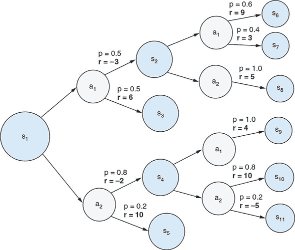

1.  在贪吃蛇-dqn 示例中，我们使用ε-贪心策略来平衡探索和利用的需求。默认设置将ε从初始值 0.5 减小到最终值 0.01，并将其保持在那里。尝试将最终ε值更改为较大的值（例如 0.1）或较小的值（例如 0），并观察蛇代理学习效果的影响。您能解释ε扮演的角色造成的差异吗？

### 摘要

+   作为一种机器学习类型，强化学习是关于学习如何做出最优决策。在强化学习问题中，代理学习在环境中选择行动以最大化称为*累积奖励*的指标。

+   与监督学习不同，RL 中没有标记的训练数据集。相反，代理必须通过尝试随机动作来学习在不同情况下哪些动作是好的。

+   我们探讨了两种常用的强化学习算法类型：基于策略的方法（以倒立摆为例）和基于 Q 值的方法（以贪吃蛇为例）。

+   策略是一种算法，代理根据当前状态观察选择动作。策略可以封装在一个神经网络中，该网络将状态观察作为输入并产生动作选择作为输出。这样的神经网络称为*策略网络*。在倒立摆问题中，我们使用策略梯度和 REINFORCEMENT 方法来更新和训练策略网络。

+   与基于策略的方法不同，Q 学习使用一种称为*Q 网络*的模型来估算在给定观察状态下行动的值。在贪吃蛇-dqn 示例中，我们演示了深度卷积网络如何作为 Q 网络以及如何通过使用 MDP 假设、贝尔曼方程和一种称为*回放* *记忆*的结构来训练它。
