## 第十二章：测试、优化和部署模型

> *—有贡献者：Yannick Assogba，Ping Yu 和 Nick Kreeger*

*本章内容包括*

+   机器学习代码测试和监控的重要性和实用指南

+   如何优化在 TensorFlow.js 中训练或转换的模型，以实现更快的加载和推理

+   如何将 TensorFlow.js 模型部署到各种平台和环境中，从浏览器扩展到移动应用，从桌面应用到单板计算机

正如我们在第一章中提到的，机器学习不同于传统软件工程，因为它自动发现规则和启发式方法。本书的前几章应该已经让你对这个机器学习的独特性有了扎实的理解。但是，机器学习模型及其周围的代码仍然是代码；他们作为整体软件系统的一部分运行。为了确保机器学习模型可靠高效地运行，从业者需要像管理非机器学习代码时那样采取相应的预防措施。

本章重点介绍如何在软件堆栈中使用 TensorFlow.js 进行机器学习的实践应用。第一部分探讨了机器学习代码和模型的测试和监控这一至关重要但经常被忽视的话题。第二部分介绍了帮助你优化训练模型、减小计算量和模型大小，从而加快下载和执行速度的工具和技巧。这对于客户端和服务器端模型部署来说是一个至关重要的考虑因素。在最后一部分，我们将为您介绍 TensorFlow.js 创作的模型可以部署到的各种环境。在此过程中，我们将讨论每个部署选项所涉及的独特优势、限制和策略。

本章结束时，你将熟悉关于在 TensorFlow.js 中深度学习模型的测试、优化和部署的最佳实践。

### 12.1\. 测试 TensorFlow.js 模型

到目前为止，我们已经讨论了如何设计、构建和训练机器学习模型。现在，我们将深入探讨一些在部署训练好的模型时会出现的话题，首先是测试 - 包括机器学习代码和相关的非机器学习代码。当你试图在你的模型和其训练过程周围设置测试时，你面临的一些关键挑战包括模型的大小、训练所需的时间以及训练过程中发生的非确定性行为（例如权重初始化和某些神经网络操作（如 dropout）中的随机性）。当我们从一个单独的模型扩展到一个完整的应用程序时，你还会遇到各种类型的偏差或漂移，包括训练和推断代码路径之间的偏差，模型版本问题以及数据中的人口变化。你会发现，为了实现你对整个机器学习系统的可靠性和信心，测试需要配合强大的监控解决方案。

一个关键考虑因素是，“你的模型版本是如何受控制的？”在大多数情况下，模型被调整和训练直到达到满意的评估精度，然后模型就不需要进一步调整了。模型不会作为正常构建过程的一部分进行重建或重新训练。相反，模型拓扑结构和训练权重应该被检入你的版本控制系统中，更类似于二进制大对象（BLOB）而不是文本/代码工件。改变周围的代码不应该导致你的模型版本号更新。同样，重新训练模型并检入它不应该需要改变非模型源代码。

机器学习系统的哪些方面应该被测试？在我们看来，答案是“每个部分”。图 12.1 解释了这个答案。一个从原始输入数据到准备部署的训练好的模型的典型系统包含多个关键组件。其中一些看起来类似于非机器学习代码，并且适合于传统的单元测试覆盖，而其他一些则显示出更多的机器学习特性，因此需要专门定制的测试或监控处理。但这里的重要信息是永远不要忽视或低估测试的重要性，仅仅因为你正在处理一个机器学习系统。相反，我们会认为，单元测试对于机器学习代码来说更加重要，也许甚至比传统软件开发的测试更加重要，因为机器学习算法通常比非机器学习算法更加难以理解。它们在面对不良输入时可能会悄无声息地失败，导致很难察觉和调试的问题，而针对这些问题的防御措施是测试和监控。在接下来的小节中，我们将扩展图 12.1 的各个部分。

##### 图 12.1\. 生产就绪的机器学习系统的测试和监控覆盖范围。图的上半部分包括典型机器学习模型创建和训练管道的关键组件。下半部分显示可以应用于每个组件的测试实践。某些组件适合传统的单元测试实践：创建和训练代码以及执行模型输入数据和输出结果的预处理和后处理代码。其他组件需要更多的机器学习特定的测试和监控实践。这些包括用于数据质量的示例验证、监控经过训练的模型的字节大小和推断速度，以及对训练模型所做预测的细粒度验证和评估。

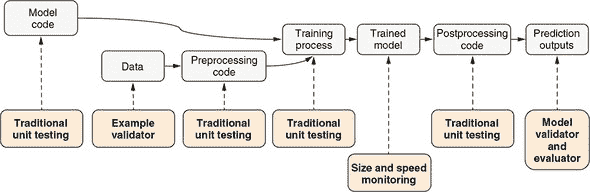

#### 12.1.1\. 传统单元测试

就像非机器学习项目一样，可靠且轻量级的单元测试应该构成测试套件的基础。然而，需要特殊考虑来设置围绕机器学习模型的单元测试。正如您在之前的章节中所见，诸如在评估数据集上的准确率之类的度量通常用于量化在成功超参数调整和训练后模型的最终质量。这些评估指标对于人工工程师的监控很重要，但不适合自动化测试。添加一个测试来断言某个评估指标优于某个阈值（例如，二分类任务的 AUC 大于 0.95，或回归任务的 MSE 小于 0.2）是很诱人的。然而，这些基于阈值的断言应该谨慎使用，如果不完全避免的话，因为它们往往很脆弱。模型的训练过程包含多个随机性来源，包括权重的初始化和训练示例的洗牌。这导致模型训练的结果在不同运行中略有不同。如果您的数据集发生变化（例如，由于定期添加新数据），这将形成额外的变异源。因此，选择阈值是一项困难的任务。太宽容的阈值在发生真正问题时无法捕捉到。太严格的阈值将导致一个不稳定的测试，即经常失败而没有真正的潜在问题。

TensorFlow.js 程序中的随机性通常可以通过在创建和运行模型之前调用 `Math.seedrandom()` 函数来禁用。例如，以下代码将以确定的种子来设置权重初始化器、数据混洗器和退出层的随机状态，以便随后的模型训练产生确定性结果：

```js
Math.seedrandom(42);         ***1***
```

+   ***1*** 42 只是一个任意选择的、固定的随机种子。

如果您需要编写对损失或度量值进行断言的测试，这是一个有用的技巧。

然而，即使确定性种子，仅仅测试 `model.fit()` 之类的调用还不足以对您的机器学习代码进行良好的覆盖。像其他难以进行单元测试的代码部分一样，您应该努力对易于单元测试的周围代码进行全面的单元测试，并探索模型部分的替代解决方案。您用于数据加载、数据预处理、模型输出的后处理以及其他实用方法的代码应该符合正常的测试实践。此外，还可以对模型本身进行一些非严格的测试，比如测试其输入和输出形状，以及“确保模型在训练一步时不会抛出异常”的风格的测试，可以提供最基本的模型测试环境，以在重构过程中保持信心。（正如您在上一章的示例代码中所注意到的，我们在 tfjs-examples 中使用了 Jasmine 测试框架进行测试，但您可以随意使用您和您的团队偏好的任何单元测试框架和运行器。）

作为实践示例，我们可以看一下我们在 第九章 中探索过的情感分析示例的测试。当您查看代码时，您应该会看到 `data_test.js`、`embedding_test.js`、`sequence_utils_test.js` 和 `train_test.js` 这四个文件。这三个文件覆盖了非模型代码，它们看起来就像普通的单元测试一样。它们的存在使我们对训练和推理过程中进入模型的数据的源格式有了更高的信心，并且我们对它的处理是有效的。

列表中的最后一个文件与机器学习模型有关，值得我们更加关注。下面的代码片段是其中的一部分。

##### 列表 12.1\. 模型 API 的单元测试——其输入输出形状和可训练性

```js
describe('buildModel', () => {
 it('flatten training and inference', async () => {
    const maxLen = 5;
    const vocabSize = 3;
    const embeddingSize = 8;
    const model = buildModel('flatten', maxLen, vocabSize, embeddingSize);
    expect(model.inputs.length).toEqual(1);                                ***1***
    expect(model.inputs[0].shape).toEqual([null, maxLen]);                 ***1***
    expect(model.outputs.length).toEqual(1);                               ***1***
    expect(model.outputs[0].shape).toEqual([null, 1]);                     ***1***

    model.compile({
      loss: 'binaryCrossentropy',
      optimizer: 'rmsprop',
      metrics: ['acc']
    });
    const xs = tf.ones([2, maxLen])
    const ys = tf.ones([2, 1]);
    const history = await model.fit(xs, ys, {                            ***2***
      epochs: 2,                                                         ***2***
      batchSize: 2                                                       ***2***
    });                                                                  ***2***
    expect(history.history.loss.length).toEqual(2);                      ***2******3***
    expect(history.history.acc.length).toEqual(2);                       ***2***

    const predictOuts = model.predict(xs);                               ***4***
    expect(predictOuts.shape).toEqual([2, 1]);                           ***4***
    const values = predictOuts.arraySync();                              ***4******5***
    expect(values[0][0]).toBeGreaterThanOrEqual(0);                      ***4******5***
    expect(values[0][0]).toBeLessThanOrEqual(1);                         ***4******5***
    expect(values[1][0]).toBeGreaterThanOrEqual(0);                      ***4******5***
    expect(values[1][0]).toBeLessThanOrEqual(1);                         ***4******5***
  });                                                                     ***5***
});
```

+   ***1*** 确保模型的输入和输出具有预期的形状

+   ***2*** 对模型进行非常简短的训练；这个过程应该很快，但不一定准确。

+   ***3*** 检查训练是否报告了每次训练步骤的指标，作为训练是否发生的信号

+   ***4*** 对模型进行预测以验证 API 是否符合预期

+   ***5*** 确保预测值在可能答案的范围内；我们不想检查实际值，因为训练时间非常短可能会不稳定。

这个测试覆盖了很多方面，所以让我们稍微细分一下。我们首先使用一个辅助函数来构建一个模型。在这个测试中，我们并不关心模型的结构，并将其视为一个黑盒子。然后我们对输入和输出的形状进行断言：

```js
    expect(model.inputs.length).toEqual(1);
    expect(model.inputs[0].shape).toEqual([null, maxLen]);
    expect(model.outputs.length).toEqual(1);
    expect(model.outputs[0].shape).toEqual([null, 1]);
```

这些测试可以检测到错误的批次维度（回归或分类）、输出形状等问题。之后，我们在很少的步骤中编译和训练模型。我们的目标仅是确保模型可以被训练，此时我们不担心准确性、稳定性或收敛性：

```js
    const history = await model.fit(xs, ys, {epochs: 2, batchSize: 2})
    expect(history.history.loss.length).toEqual(2);
    expect(history.history.acc.length).toEqual(2);
```

此代码片段还检查训练是否报告了所需的分析指标：如果我们进行了实际训练，我们能否检查训练的进度和生成模型的准确性？最后，我们尝试一个简单的：

```js
    const predictOuts = model.predict(xs);
    expect(predictOuts.shape).toEqual([2, 1]);
    const values = predictOuts.arraySync();
    expect(values[0][0]).toBeGreaterThanOrEqual(0);
    expect(values[0][0]).toBeLessThanOrEqual(1);
    expect(values[1][0]).toBeGreaterThanOrEqual(0);
    expect(values[1][0]).toBeLessThanOrEqual(1);
```

我们不检查任何特定的预测结果，因为这可能会因权重值的随机初始化或可能的模型架构未来修订而发生变化。我们所检查的是我们获得了预测并且预测在预期范围内，在这种情况下是 0 到 1。

这里最重要的教训是注意到无论我们如何更改模型架构的内部，只要我们不改变其输入或输出 API，这个测试应该始终通过。如果测试失败了，那么我们的模型就有问题。这些测试仍然是轻量级且快速的，提供了强大的 API 正确性，并适合包含在您使用的常见测试挂钩中。

#### 12.1.2\. 使用黄金值进行测试

在前一节中，我们讨论了在不断言阈值指标值或不要求稳定或收敛训练的情况下可进行的单元测试。现在让我们探讨人们通常希望在完全训练后的模型上运行的测试类型，从检查特定数据点的预测开始。也许有一些“明显”的示例需要测试。例如，对于一个物体检测器，具有可识别猫咪的输入图像应被标记为识别了猫咪；对于一个情感分析器，明显是负面的客户评论的文本片段应被分类为负面。这些针对给定模型输入的正确答案是我们所谓的“黄金值”。如果盲目地遵循传统单元测试的思路，很容易陷入使用“黄金值”测试训练后的机器学习模型的误区。毕竟，我们希望一个训练良好的物体检测器总是能够在图像中的猫咪上打上“猫”的标记，对吗？并不完全是这样。基于“黄金值”的测试在机器学习设置中可能会存在问题，因为我们篡改了训练、验证和评估数据分割。

假设你的验证集和测试集有代表性的样本，并且你设置了一个合适的目标指标（准确率、召回率等），为什么要求任何一个例子比另一个例子更准确？机器学习模型的训练关注的是整个验证集和测试集的准确率。对于单个样本的预测可能会随着超参数和初始权重值的选择而变化。如果有些例子必须被正确分类并且很容易识别，为什么不在要求机器学习模型对它们进行分类之前检测它们，而是使用非机器学习代码来处理它们呢？在自然语言处理系统中偶尔会使用这样的例子，其中查询输入的子集（如经常遇到且易于识别的输入）会自动路由到非机器学习模块进行处理，而其余的查询会由机器学习模型处理。你会节省计算时间，并且该部分代码更容易通过传统的单元测试进行测试。虽然在机器学习预测器之前（或之后）添加业务逻辑层似乎多此一举，但它为你提供了控制预测覆盖的钩子。这也是你可以添加监控或日志记录的地方，当你的工具变得更广泛使用时，你可能会需要。有了这个前提，让我们分别探讨三种常见的对金标值的需求。

这种类型的金标值测试的一个常见动机是为了进行完整的端到端测试——给定一个未经处理的用户输入，系统会输出什么？机器学习系统经过训练，通过正常的端用户代码流程请求预测，然后将答案返回给用户。这类似于我们在列表 12.1 中的单元测试，但机器学习系统是在应用程序的其余部分的上下文中。我们可以编写一个类似于列表 12.1 的测试，它不关心预测的实际值，实际上，这将是一个更稳定的测试。但是，当开发人员重新访问测试时，将其与一个有意义且容易理解的示例/预测对结合起来是非常诱人的。

这就是问题出现的时候——我们需要一个其预测已知且保证正确的示例，否则端到端测试将失败。因此，我们添加了一个较小规模的测试，通过端到端测试涵盖的管道的子集来测试该预测。现在，如果端到端测试失败，而较小的测试通过，则我们已将错误隔离到核心机器学习模型与管道的其他部分之间的交互（例如数据摄取或后处理）。如果两者同时失败，我们知道我们的示例/预测不变式被打破了。在这种情况下，它更像是一种诊断工具，但配对失败的可能结果是选择一个新的示例进行编码，而不是重新训练模型。

下一个最常见的来源是某种业务需求。某些可识别的示例集必须比其他示例更准确。如前所述，这是添加一个用于处理这些预测的模型前后业务逻辑层的完美设置。但是，您可以尝试*示例加权*，其中一些示例在计算整体质量指标时占比更多。这不会保证正确性，但它会使模型倾向于获得这些正确。如果由于无法轻松预先识别触发特殊情况的输入属性而导致业务逻辑层困难，则可能需要探索第二个模型——一个纯粹用于确定是否需要覆盖的模型。在这种情况下，您正在使用模型的集成，并且您的业务逻辑是将两个层的预测组合起来执行正确的操作。

这里的最后一种情况是当你有一个带有用户提供示例的错误报告，该示例产生了错误的结果。如果出于业务原因错误，我们回到了刚才讨论的情况。如果出错只是因为它落入模型性能曲线的失败百分比中，那我们应该做的事情就不多了。这在经过训练的算法的可接受性能范围内；所有模型都有可能出错。您可以将示例/正确预测对添加到适当的训练/测试/评估集中，以便希望在未来生成更好的模型，但不适合使用黄金值进行单元测试。

一个例外是如果您保持模型恒定——您已将模型权重和架构检入版本控制，并且在测试中不重新生成它们。那么使用黄金值来测试将使用模型作为其核心的推理系统的输出可能是适当的，因为模型和示例都不会发生变化。这样的推理系统包含除模型之外的其他部分，例如预处理输入数据并将其馈送到模型的部分以及获取模型输出并将其转换为更适合下游系统使用的形式的部分。这样的单元测试确保了这种预处理和后处理逻辑的正确性。

另一个合理使用黄金值的场景是在单元测试之外：随着模型的演化监控模型的质量（但不作为单元测试）。我们将在下一节讨论模型验证器和评估器时进行详细展开。

#### 12.1.3\. 关于持续训练的考虑

在许多机器学习系统中，您会定期获得新的训练数据（每周或每天）。也许你能够使用前一天的日志生成新的、更及时的训练数据。在这种系统中，模型需要经常重新训练，使用最新可用的数据。在这些情况下，人们相信模型的年龄或陈旧程度会影响其能力。随着时间的推移，模型的输入会漂移到与其训练不同的分布，因此质量特征会变差。例如，你可能有一个服装推荐工具，在冬天训练过，但在夏天做出预测。

在你开始探索需要连续训练的系统时，根据这个基本思想，你将拥有多种额外组件来创建你的流水线。关于这些组件的全面讨论超出了本书的范围，但 TensorFlow Extended（TFX）^([1])是一个值得一看的基础设施，可以提供更多的想法。在测试领域中，它列出的最相关的流水线组件是*示例验证器*，*模型验证器*和*模型评估器*。图 12.1 中的图表包含与这些组件对应的框。

> ¹
> 
> Denis Baylor 等人，“TFX：基于 TensorFlow 的生产规模机器学习平台”，KDD 2017，[www.kdd.org/kdd2017/papers/view/tfx-a-tensorflow-based-production-scale-machine-learning-platform](http://www.kdd.org/kdd2017/papers/view/tfx-a-tensorflow-based-production-scale-machine-learning-platform)。

示例验证器是关于测试数据的，这是测试机器学习系统时容易忽视的一个方面。在机器学习实践者中有一句著名的话：“垃圾进，垃圾出。”训练好的机器学习模型的质量受到输入数据质量的限制。具有无效特征值或不正确标签的示例在部署使用时（即使模型训练任务由于坏示例而失败！）可能会影响训练模型的准确性。示例验证器用于确保进入模型训练和评估的数据的属性始终满足某些要求：你有足够的数据，其分布看起来有效，并且没有任何奇怪的离群值。例如，如果你有一组医疗数据，身高（以厘米为单位）应该是一个不大于 280 的正数；患者年龄应该是 0 到 130 之间的正数；口腔温度（以摄氏度为单位）应该是大约在 30 到 45 之间的正数，等等。如果某些数据示例包含超出这些范围的特征或具有“None”或 NaN 等占位符值，我们就知道这些示例有问题，它们应该相应地处理——在大多数情况下，排除在训练和评估之外。通常，这里的错误表明数据收集过程失败，或者当构建系统时持有的假设与“世界变化”的方式不兼容。通常，这更类似于监视和警报，而不是集成测试。

像示例验证器这样的组件还对检测*训练服务偏差*有用，这是机器学习系统中可能出现的一种特别严重的错误。两个主要原因是 1）属于不同分布的训练和服务数据，以及 2）数据预处理涉及在训练和服务期间行为不同的代码路径。部署到训练和服务环境的示例验证器有潜力捕获通过任一路径引入的错误。

模型验证器扮演着构建模型的人在决定模型是否“足够好”以用于服务的角色。你可以根据自己关心的质量指标对其进行配置，然后它要么“祝福”该模型，要么拒绝它。再次强调，就像示例验证器一样，这更像是一种监视和警报式的交互。你还通常会想要随时间记录和绘制你的质量指标（准确度等），以便查看是否存在可能不会单独触发警报但可能仍然有用于诊断长期趋势并隔离其原因的小规模系统性恶化。

模型评估器是对模型质量统计的更深入的探究，沿着用户定义的轴切割和分析质量。通常，这用于探测模型是否对不同的用户群体——年龄段、教育水平、地理位置等——表现公平。一个简单的例子是查看我们在第 3.3 节中使用的鸢尾花示例，并检查我们的分类准确率在三种鸢尾花物种之间是否大致相似。如果我们的测试或评估集对其中一种人口有异常偏向，那么可能我们总是在最小的人口上出错，但这并没有显示为一个最高级别的准确性问题。与模型验证器一样，随时间变化的趋势通常与个别时点的测量一样有用。

### 12.2\. 模型优化

一旦您费尽心思地创建、训练和测试了您的模型，就该是将其投入使用的时候了。这个过程被称为*模型部署*，它与模型开发的前几个步骤同样重要。无论模型是要在客户端进行推理还是在后端进行服务，我们总是希望模型能够快速高效。具体而言，我们希望模型能够

+   体积小，因此在网络上或从磁盘加载时速度快

+   当调用其`predict()`方法时，尽可能少地消耗时间、计算和内存。

本节描述了 TensorFlow.js 中用于优化训练模型大小和推理速度的技术，然后它们才会发布部署。

*优化*一词的含义是多重的。在本节的语境中，*优化*指的是包括模型大小减小和计算加速在内的改进。这不应与权重参数优化技术混淆，比如模型训练和优化器中的梯度下降。这种区别有时被称为模型*质量*与模型*性能*。性能指的是模型完成任务所消耗的时间和资源。质量指的是结果与理想结果的接近程度。

#### 12.2.1\. 通过后训练权重量化实现模型大小优化

互联网上快速加载小文件的需求对于网页开发者来说应该是非常明确的。如果您的网站目标是非常庞大的用户群或者拥有较慢的互联网连接的用户，这一点尤为重要。^([2])此外，如果您的模型存储在移动设备上（请参阅 12.3.4 节 对使用 TensorFlow.js 进行移动部署的讨论），则模型的大小通常受到有限的存储空间的限制。作为模型部署的挑战，神经网络是庞大的，并且仍在不断增大。深度神经网络的容量（即，预测能力）往往是以增加层数和更大的层尺寸为代价的。在撰写本文时，最先进的图像识别、^([3])语音识别、^([4])自然语言处理、^([5])以及生成模型^([6])往往超过 1 GB 的权重大小。由于模型需要同时小巧和强大之间的紧张关系，深度学习中一个极其活跃的研究领域是模型大小优化，即如何设计一个尽可能小但仍能以接近较大神经网络的准确度执行任务的神经网络。有两种一般方法可供选择。在第一种方法中，研究人员设计一个神经网络，旨在从一开始就将模型大小最小化。其次，还有通过这些方法将现有神经网络缩小至更小尺寸的技术。

> ²
> 
> 2019 年 3 月，Google 推出了一个涉及使用神经网络以约翰·塞巴斯蒂安·巴赫风格创作音乐的涂鸦（[`mng.bz/MOQW`](http://mng.bz/MOQW)）。这个神经网络在浏览器中运行，由 TensorFlow.js 提供动力。该模型以本节描述的方法量化为 8 位整数，将模型的传输大小减少了数倍，降至约 380 KB。如果没有这种量化，将无法将模型提供给谷歌首页（Google 涂鸦出现的地方）等如此广泛的观众。
> 
> ³
> 
> Kaiming He 等人，“深度残差学习用于图像识别”，于 2015 年 12 月 10 日提交，[`arxiv.org/abs/1512.03385`](https://arxiv.org/abs/1512.03385)。
> 
> ⁴
> 
> Johan Schalkwyk，“一种全神经元设备上的语音识别器”，Google AI 博客，于 2019 年 3 月 12 日，[`mng.bz/ad67`](http://mng.bz/ad67)。
> 
> ⁵
> 
> Jacob Devlin 等人，“BERT: 深度双向转换器的预训练用于语言理解”，于 2018 年 10 月 11 日提交，[`arxiv.org/abs/1810.04805`](https://arxiv.org/abs/1810.04805)。
> 
> ⁶
> 
> Tero Karras，Samuli Laine 和 Timo Aila，“用于生成对抗网络的基于风格的生成器架构”，于 2018 年 12 月 12 日提交，[`arxiv.org/abs/1812.04948`](https://arxiv.org/abs/1812.04948)。

我们在卷积神经网络章节中介绍过的 MobileNetV2 是第一行研究的产物。[7] 它是一种适用于资源受限环境（如 Web 浏览器和移动设备）部署的小型、轻量级图像模型。与在相同任务上训练的更大的图像模型（如 ResNet50）相比，MobileNetV2 的准确度略差一些。但是它的尺寸（14 MB）比较小（ResNet50 的尺寸约为 100 MB），这使得准确度的轻微降低是值得的。

> ⁷
> 
> Mark Sandler 等人，“MobileNetV2: 反向残差和线性瓶颈”，IEEE 计算机视觉与模式识别会议（CVPR），2018 年，pp. 4510–4520，[`mng.bz/NeP7`](http://mng.bz/NeP7).

即使内置了尺寸压缩功能，MobileNetV2 对于大多数 JavaScript 应用程序来说仍然稍大。考虑到其大小（14 MB）约为平均网页大小的八倍。[8] MobileNetV2 提供了一个宽度参数，如果将其设置为小于 1 的值，则可以减小所有卷积层的尺寸，从而进一步减小尺寸（以及进一步降低准确度）。例如，将宽度设置为 0.25 的 MobileNetV2 版本大约是完整模型大小的四分之一（3.5 MB）。但即便如此，对于对页面权重和加载时间的增加敏感的高流量网站来说，这可能仍然无法接受。

> ⁸
> 
> 根据 HTTP Archive，截至 2019 年 5 月，桌面端平均页面权重（HTML、CSS、JavaScript、图像和其他静态文件的总传输大小）约为 1,828 KB，移动端约为 1,682 KB：[`httparchive.org/reports/page-weight`](https://httparchive.org/reports/page-weight).

是否有办法进一步减小这种模型的尺寸？幸运的是，答案是肯定的。这将我们带到了提到的第二种方法，即模型无关的尺寸优化。这类技术更加通用，因为它们不需要对模型体系结构本身进行更改，因此应该适用于各种现有的深度神经网络。我们将在这里专门关注的技术称为*训练后权重量化*。其思想很简单：在模型训练完成后，以更低的数值精度存储其权重参数。 信息框 12.1 描述了对于对底层数学感兴趣的读者如何实现这一点。

|  |
| --- |

**基于训练后权重量化的数学原理**

神经网络的权重参数在训练过程中以 32 位浮点（float32）数表示。这不仅适用于 TensorFlow.js，还适用于其他深度学习框架，如 TensorFlow 和 PyTorch。尽管这种相对昂贵的表示通常在训练模型时没有问题（例如，配备了充足内存、快速 CPU 和 CUDA GPU 的工作站后端环境），但经验研究表明，对于许多推理用例，我们可以降低权重的精度而不会导致精度大幅度下降。为了降低表示精度，我们将每个 float32 值映射到一个 8 位或 16 位整数值，该值表示该权重中所有值范围内的离散位置。这个过程就是我们所说的*量化*。

在 TensorFlow.js 中，权重量化是逐个权重进行的。例如，如果神经网络由四个权重变量组成（例如两个密集层的权重和偏置），则每个权重将作为整体进行量化。控制权重量化的方程式如下：

##### 方程 12.1。

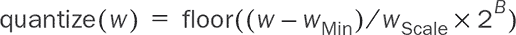

在此方程中，*B*是量化结果将存储的位数。它可以是 8 位或 16 位，如 TensorFlow.js 目前支持的。*w*[Min]是权重参数的最小值。*w*Scale 是参数的范围（最大值与最小值之间的差异）。当然，只有在*w*Scale 非零时，方程才有效。在*w*Scale 为零的特殊情况下，即当权重的所有参数具有相同值时，quantize(*w*)将为所有*w*返回 0。

两个辅助值*w*[Min]和*w*Scale 与量化后的权重值一起保存，以支持在模型加载期间恢复权重（我们称之为*去量化*）的过程。控制去量化的方程式如下：

##### 方程 12.2。


无论*w*Scale 是否为零，此方程式都有效。

|  |
| --- |

后训练量化可以大大减小模型大小：16 位量化将模型大小减少约 50％，8 位量化则减少约 75％。这些百分比是近似值，有两个原因。首先，模型大小的一部分用于模型的拓扑结构，如 JSON 文件中所编码的。其次，正如信息框中所述，量化需要存储两个额外的浮点数值（*w*[Min]和*w*[Scale]），以及一个新的整数值（量化的位数）。然而，与用于表示权重参数的位数的减少相比，这些通常是次要的。

量化是一种有损转换。由于精度降低，原始权重值中的一些信息会丢失。这类似于将 24 位颜色图像的位深度减少为 8 位（你可能在任天堂的游戏机上见过的类型），这种效果对人眼来说很容易看到。图 12.2 提供了 16 位和 8 位量化导致的离散程度的直观比较。正如你所预期的，8 位量化会导致对原始权重的粗糙表示。在 8 位量化下，对于权重参数的整个范围，只有 256 个可能的值，而在 16 位量化下有 65536 个可能的值。与 32 位浮点表示相比，这两者都是精度的显著降低。

##### 图 12.2。16 位和 8 位权重量化的示例。原始的恒等函数（y = x，面板 A）通过 16 位和 8 位量化减小了尺寸；结果分别显示在面板 B 和面板 C 中。为了使页面上的量化效果可见，我们放大了恒等函数在*x* = 0 附近的一小部分。

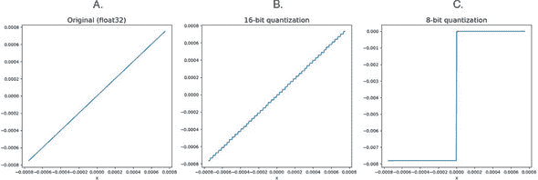

在实践中，由于权重参数的精度损失真的重要吗？在神经网络的部署中，重要的是它在测试数据上的准确性。为了回答这个问题，我们在 tfjs-examples 的量化示例中编译了许多涵盖不同类型任务的模型。你可以在那里运行量化实验，并亲眼看到效果。要查看示例，请使用以下命令：

```js
git clone https://github.com/tensorflow/tfjs-examples.git
cd tfjs-examples/quantization
yarn
```

示例包含四个场景，每个场景展示了一个数据集和应用于数据集的模型的独特组合。第一个场景涉及使用数值特征（例如物业的中位数年龄、房间总数等）来预测加利福尼亚州地理区域的平均房价。该模型是一个包含了防止过拟合的 dropout 层的五层网络。要训练和保存原始（非量化）模型，请使用以下命令：

```js
yarn train-housing
```

下面的命令对保存的模型进行 16 位和 8 位量化，并评估这两种量化水平对测试数据集（模型训练期间未见的数据的子集）的模型准确性产生了什么影响：

```js
yarn quantize-and-evaluate-housing
```

这个命令将许多操作封装在内，以便使用。然而，实际量化模型的关键步骤可以在 quantization/quantize_evaluate.sh 的 shell 脚本中看到。在该脚本中，你可以看到以下 shell 命令，它对路径为`MODEL_JSON_PATH`的模型进行 16 位量化。你可以按照这个命令的示例来量化自己的 TensorFlow.js 保存的模型。如果选项标志`--quantization_bytes`设置为`1`，则将执行 8 位量化：

```js
tensorflowjs_converter \
      --input_format tfjs_layers_model \
      --output_format tfjs_layers_model \
      --quantization_bytes 2 \
    "${MODEL_JSON_PATH}" "${MODEL_PATH_16BIT}"
```

前述命令展示了如何在 JavaScript 中对训练模型执行权重量化。当将模型从 Python 转换为 JavaScript 时，`tensorflowjs_converter`还支持权重量化，其详细信息显示在信息框 12.2 中。

|  |
| --- |

**权重量化和来自 Python 的模型**

在第五章中，我们展示了如何将来自 Keras（Python）的模型转换为可以加载和使用 TensorFlow.js 的格式。在此类 Python 到 JavaScript 的转换期间，您可以应用权重量化。要执行此操作，请使用与主文中描述的相同的`--quantization_bytes`标志。例如，要将由 Keras 保存的 HDF5（.h5）格式的模型转换为具有 16 位量化的模型，请使用以下命令：

```js
tensorflowjs_converter \
      --input_format keras \
      --output_format tfjs_layers_model \
      --quantization_bytes 2 \
      "${KERAS_MODEL_H5_PATH}" "${TFJS_MODEL_PATH}"
```

在此命令中，`KERAS_MODEL_H5_PATH`是由 Keras 导出的模型的路径，而`TFJS_MODEL_PATH`是转换并进行权重量化的模型将生成的路径。

|  |
| --- |

由于权重的随机初始化和训练过程中数据批次的随机洗牌，您获得的详细准确性值可能会有轻微变化。然而，总体结论应始终保持不变：正如 table 12.1 的第一行所示，对权重进行 16 位量化会导致住房价格预测的 MAE 发生微小变化，而对权重进行 8 位量化会导致 MAE 相对较大（但在绝对值上仍然微小）的增加。

##### 表 12.1。四个不同模型的评估准确性，经过训练后进行权重量化

| 数据集和模型 | 在无量化和不同量化级别下的评估损失和准确性 |
| --- | --- |
| 32 位全精度（无量化） | 16 位量化 | 8 位量化 |
| --- | --- | --- |
| 加利福尼亚房屋：MLP 回归器 | MAE^([a]) = 0.311984 | MAE = 0.311983 | MAE = 0.312780 |
| MNIST：卷积神经网络 | 准确率 = 0.9952 | 准确率 = 0.9952 | 准确率 = 0.9952 |
| Fashion-MNIST：卷积神经网络 | 准确率 = 0.922 | 准确率 = 0.922 | 准确率 = 0.9211 |
| ImageNet 1000 子集：MobileNetV2 | Top-1 准确率 = 0.618 Top-5 准确率 = 0.788 | Top-1 准确率 = 0.624 Top-5 准确率 = 0.789 | Top-1 准确率 = 0.280 Top-5 准确率 = 0.490 |

> ^a
> 
> 加利福尼亚房屋模型使用 MAE 损失函数。对于 MAE 而言，较低的值更好，与准确率不同。

量化示例中的第二个场景基于熟悉的 MNIST 数据集和深度卷积网络架构。与住房实验类似，您可以使用以下命令训练原始模型并对其进行量化版本的评估：

```js
yarn train-mnistyarn quantize-and-evaluate-mnist
```

正如 table 12.1 的第二行所示，16 位和 8 位量化都不会导致模型的测试准确性发生可观的变化。这反映了卷积神经网络是一个多类分类器的事实，因此其层输出值的微小偏差可能不会改变最终的分类结果，该结果是通过`argMax()`操作获得的。

这一发现是否代表了面向图像的多类分类器？请记住，MNIST 是一个相对容易的分类问题。即使是像本例中使用的简单卷积网络也能达到几乎完美的准确率。当我们面对更难的图像分类问题时，量化如何影响准确率？要回答这个问题，请看量化示例中的另外两个场景。

Fashion-MNIST，你在 第十章 中的变分自动编码器部分遇到的问题，是一个比 MNIST 更难的问题。通过使用以下命令，你可以在 Fashion-MNIST 数据集上训练一个模型，并检查 16 位和 8 位量化如何影响其测试准确率：

```js
yarn train-fashion-mnist
yarn quantize-and-evaluate-fashion-mnist
```

结果显示在 表 12.1 的第三行，表明由于权重的 8 位量化而导致测试准确率略微下降（从 92.2% 下降到 92.1%），尽管 16 位量化仍然没有观察到变化。

更难的图像分类问题是 ImageNet 分类问题，涉及 1,000 个输出类别。在这种情况下，我们下载了一个预先训练的 MobileNetV2，而不是像在本例的其他三个场景中那样从头开始训练一个模型。预训练模型在 ImageNet 数据集的 1,000 张图像样本上以其非量化和量化形式进行评估。我们选择不评估整个 ImageNet 数据集，因为数据集本身非常庞大（有数百万张图像），并且我们从中得出的结论不会有太大不同。

要更全面地评估模型在 ImageNet 问题上的准确性，我们计算了 top-1 和 top-5 的准确率。Top-1 准确率是仅考虑模型最高单个逻辑输出时的正确预测比率，而 top-5 准确率则是在最高的五个逻辑中有任何一个包含正确标签时将预测视为正确。这是评估 ImageNet 模型准确性的标准方法，因为由于大量类标签，其中一些非常接近，模型通常不会在 top 逻辑中显示正确标签，而是在 top-5 逻辑中之一。要查看 MobileNetV2 + ImageNet 实验的结果，请使用

```js
yarn quantize-and-evaluate-MobileNetV2
```

不同于前面的三种情况，这个实验显示了 8 位对测试准确率的重大影响（见表 12.1 的第四行）。8 位量化的 MobileNet 的 top-1 和 top-5 准确率都远低于原始模型，使得 8 位量化成为 MobileNet 不可接受的尺寸优化选项。然而，16 位量化的 MobileNet 仍然显示出与非量化模型相当的准确率[⁹]。我们可以看到量化对准确率的影响取决于模型和数据。对于某些模型和任务（如我们的 MNIST convnet），16 位和 8 位量化都不会导致测试准确率的任何可观察降低。在这些情况下，我们应该尽可能在部署时使用 8 位量化模型以减少下载时间。对于一些模型，如我们的 Fashion-MNIST convnet 和我们的房价回归模型，16 位量化不会导致准确率的任何观察到的恶化，但 8 位量化确实会导致准确率略微下降。在这种情况下，您应根据判断是否额外的 25% 模型大小减小超过准确率减少。最后，对于某些类型的模型和任务（如我们的 MobileNetV2 对 ImageNet 图像的分类），8 位量化会导致准确率大幅下降，这在大多数情况下可能是不可接受的。对于这样的问题，您需要坚持使用原始模型或其 16 位量化版本。

> ⁹
> 
> 实际上，我们可以看到准确率略微增加，这归因于由仅包含 1,000 个示例的相对较小的测试集上的随机波动。

量化示例中的案例是可能有些简化的典型问题。您手头的问题可能更加复杂，与这些案例大不相同。重要的是，是否在部署之前对模型进行量化以及应该对其进行多少位深度的量化都是经验性问题，只能根据具体情况来回答。在做出决定之前，您需要尝试量化并在真实的测试数据上测试生成的模型。本章末尾的练习 1 让您尝试使用我们在 第十章 中训练的 MNIST ACGAN 模型，并决定对于这样的生成模型是选择 16 位还是 8 位量化是正确的决定。

##### 权重量化和 gzip 压缩

要考虑到的 8 位量化的另一个好处是，在诸如 gzip 等数据压缩技术下提供的附加压缩模型大小的额外减少。gzip 被广泛用于通过网络传输大文件。在通过网络提供 TensorFlow.js 模型文件时，应始终启用 gzip。神经网络的非量化 float32 权重通常不太适合这种压缩，因为参数值中存在类似噪声的变化，其中包含很少的重复模式。我们观察到，对于模型的非量化权重，gzip 通常不能获得超过 10-20%的大小减小。对于具有 16 位权重量化的模型也是如此。然而，一旦模型的权重经过 8 位量化，通常压缩比例会有相当大的增加（对于小型模型可高达 30-40%，对于较大的模型约为 20-30%；见 table 12.2）。

##### 表 12.2。不同量化级别下模型构件的 gzip 压缩比例

| 数据集和模型 | gzip 压缩比例^([a]) |
| --- | --- |
| 32 位全精度（无量化） | 16 位量化 | 8 位量化 |
| --- | --- | --- |
| California 房屋：MLP 回归器 | 1.121 | 1.161 | 1.388 |
| MNIST：卷积网络 | 1.082 | 1.037 | 1.184 |
| Fashion-MNIST：卷积网络 | 1.078 | 1.048 | 1.229 |
| ImageNet 1000 个子集：MobileNetV2 | 1.085 | 1.063 | 1.271 |

> ^a
> 
> （模型.json 和权重文件的总大小）/（gzipped tar ball 的大小）

这是由于极大降低的精度（仅 256）下可用的小箱数，导致许多值（例如 0 周围的值）落入相同的箱中，因此导致权重的二进制表示中出现更多的重复模式。这是在不会导致测试准确度不可接受的情况下更喜欢 8 位量化的另一个原因。

总之，通过训练后的权重量化，我们可以大大减少通过网络传输和存储在磁盘上的 TensorFlow.js 模型的大小，尤其是在使用 gzip 等数据压缩技术的帮助下。这种改进的压缩比的好处不需要开发者进行代码更改，因为浏览器在下载模型文件时会自动进行解压缩。但是，这并不会改变执行模型推断调用所涉及的计算量。也不会改变这些调用的 CPU 或 GPU 内存消耗量。这是因为在加载权重后对它们进行去量化（参见方程 12.2 中的信息框 12.1）。就运行的操作、张量的数据类型和形状以及操作输出的张量而言，非量化模型和量化模型之间没有区别。然而，对于模型部署，同样重要的问题是如何使模型在部署时以尽可能快的速度运行，并且使其在运行时消耗尽可能少的内存，因为这可以提高用户体验并减少功耗。在不丢失预测准确性和在模型大小优化之上，有没有办法使现有的 TensorFlow.js 模型运行得更快？幸运的是，答案是肯定的。在下一节中，我们将重点介绍 TensorFlow.js 提供的推断速度优化技术。

#### 12.2.2\. 使用 GraphModel 转换进行推断速度优化

这一节的结构如下。我们将首先介绍使用`GraphModel`转换来优化 TensorFlow.js 模型的推断速度所涉及的步骤。然后，我们将列出详细的性能测量结果，量化了该方法所提供的速度增益。最后，我们将解释`GraphModel`转换方法在底层的工作原理。

假设您有一个路径为 my/layers-model 的 TensorFlow.js 模型；您可以使用以下命令将其转换为`tf.GraphModel`：

```js
tensorflowjs_converter \
      --input_format tfjs_layers_model \
      --output_format tfjs_graph_model \
      my/layers-model my/graph-model
```

此命令将在输出目录 my/graph-model 下创建一个 model.json 文件（如果该目录不存在），以及若干二进制权重文件。表面上看，这一组文件在格式上可能与包含序列化`tf.LayersModel`的输入目录中的文件相同。然而，输出的文件编码了一种称为`tf.GraphModel`的不同类型的模型（这个优化方法的同名）。为了在浏览器或 Node.js 中加载转换后的模型，请使用 TensorFlow.js 的`tf.loadGraphModel()`方法，而不是熟悉的`tf.loadLayersModel()`方法。加载`tf.GraphModel`对象后，您可以通过调用对象的`predict()`方法以完全相同的方式执行推断，就像对待`tf.LayersModel`一样。例如，

```js
const model = await tf.loadGraphModel('file://./my/graph-model/model.json');***1***
   const ys = model.predict(xs);                                            ***2***
```

+   ***1*** 如果在浏览器中加载模型，则可以使用 http:// 或 https:// URL。

+   ***2*** 使用输入数据'xs'进行推断。

提高的推理速度带来了两个限制：

+   在撰写本文时，最新版本的 TensorFlow.js（1.1.2）不支持循环层，如`tf.layers.simpleRNN()`、`tf.layers.gru()`和`tf.layers.lstm()`（见第九章）用于`GraphModel`转换。

+   载入的`tf.GraphModel`对象没有`fit()`方法，因此不支持进一步的训练（例如，迁移学习）。

表 12.3 比较了两种模型类型在有和没有`GraphModel`转换时的推理速度。由于`GraphModel`转换尚不支持循环层，因此仅呈现了 MLP 和卷积神经网络（MobileNetV2）的结果。为了覆盖不同的部署环境，该表呈现了来自 Web 浏览器和后端环境中运行的 tfjs-node 的结果。从这个表中，我们可以看到`GraphModel`转换始终加快了推理速度。但是，加速比取决于模型类型和部署环境。对于浏览器（WebGL）部署环境，`GraphModel`转换会带来 20-30%的加速，而如果部署环境是 Node.js，则加速效果更加显著（70-90%）。接下来，我们将讨论为什么`GraphModel`转换加快了推理速度，以及它为什么在 Node.js 环境中比在浏览器环境中加速更多的原因。

##### 表 12.3 比较了两种模型类型（MLP 和 MobileNetV2）在不同部署环境下进行`GraphModel`转换优化和不进行优化时的推理速度^([a])

> ^a
> 
> 获得这些结果的代码可在[`github.com/tensorflow/tfjs/tree/master/tfjs/integration_tests/`](https://github.com/tensorflow/tfjs/tree/master/tfjs/integration_tests/)找到。

| 模型名称和拓扑结构 | 预测时间（毫秒；值越低越好）（在 20 次热身调用之后的 30 次预测调用的平均值） |
| --- | --- |
| 浏览器 WebGL | tfjs-node（仅 CPU） | tfjs-node-gpu |
| --- | --- | --- |
| LayersModel | GraphModel | LayersModel | GraphModel | LayersModel | GraphModel |
| --- | --- | --- | --- | --- | --- |
| MLP^([b]) | 13 | 10 (1.3x) | 18 | 10 (1.8x) | 3 | 1.6 (1.9x) |
| MobileNetV2（宽度=1.0） | 68 | 57 (1.2x) | 187 | 111 (1.7x) | 66 | 39 (1.7x) |

> ^b
> 
> MLP 由单元数为 4,000、1,000、5,000 和 1 的密集层组成。前三层使用 relu 激活函数；最后一层使用线性激活函数。

##### GraphModel 转换如何加速模型推理

`GraphModel` 转换是如何提高 TensorFlow.js 模型推断速度的？这是通过利用 TensorFlow（Python）对模型计算图进行细粒度的**提前分析**来实现的。计算图分析后，会对图进行修改，减少计算量同时保持图的输出结果的数值正确性。不要被**提前分析**和**细粒度**等术语吓到。稍后我们会对它们进行解释。

为了给出我们所说的图修改的具体例子，让我们考虑一下在 `tf.LayersModel` 和 `tf.GraphModel` 中 BatchNormalization 层的工作原理。回想一下，BatchNormalization 是一种在训练过程中改善收敛性和减少过拟合的类型的层。它在 TensorFlow.js API 中可用作 `tf.layers.batchNormalization()`，并且被诸如 MobileNetV2 这样的常用预训练模型使用。当 BatchNormalization 层作为 `tf.LayersModel` 的一部分运行时，计算会严格遵循批量归一化的数学定义：

##### 方程式 12.3。


为了从输入 (`x`) 生成输出，需要六个操作（或 ops），大致顺序如下：

1.  `sqrt`，将 `var` 作为输入

1.  `add`，将 `epsilon` 和步骤 1 的结果作为输入

1.  `sub`，将 `x` 和平均值作为输入

1.  `div`，将步骤 2 和 3 的结果作为输入

1.  `mul`，将 `gamma` 和步骤 4 的结果作为输入

1.  `add`，将 `beta` 和步骤 5 的结果作为输入

基于简单的算术规则，可以看出方程式 12.3 可以被显著简化，只要 `mean`、`var`、`epsilon`、`gamma` 和 `beta` 的值是常量（不随输入或层被调用的次数而变化）。在训练包含 BatchNormalization 层的模型后，所有这些变量确实都变成了常量。这正是 `GraphModel` 转换所做的：它“折叠”常量并简化算术，从而导致以下在数学上等效的方程式：

##### 方程式 12.4。

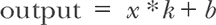

*k* 和 *b* 的值是在 `GraphModel` 转换期间计算的，而不是在推断期间：

##### 方程式 12.5。

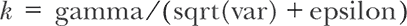

##### 方程式 12.6。

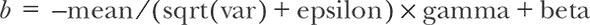

因此，方程式 12.5 和 12.6 在推断过程中*不*计入计算量；只有方程式 12.4 计入。将方程式 12.3 和 12.4 进行对比，您会发现常数折叠和算术简化将操作数量从六个减少到了两个（*x*和*k*之间的`mul`操作，以及*b*和该`mul`操作结果之间的`add`操作），从而极大加速了该层的执行速度。但为什么`tf.LayersModel`不执行此优化？因为它需要支持 BatchNormalization 层的训练，在训练的每一步都会更新`mean`、`var`、`gamma`和`beta`的值。`GraphModel`转换利用了这一事实，即这些更新的值在模型训练完成后不再需要。

在 BatchNormalization 示例中看到的优化类型仅在满足两个要求时才可能实现。首先，计算必须以足够*细粒度*的方式表示——即在基本数学操作（如`add`和`mul`）的层面上，而不是 TensorFlow.js 的 Layers API 所在的更粗粒度的层面。其次，所有的计算在执行模型的`predict()`方法之前都是已知的。`GraphModel`转换经过了 TensorFlow（Python），可以得到满足这两个条件的模型的图表示。

除了之前讨论的常数折叠和算术优化外，`GraphModel`的转换还能执行另一种称为*op fusion*的优化类型。以经常使用的密集层类型(`tf.layers.dense()`)为例。密集层涉及三种操作：输入*x*和内核*W*的矩阵乘法(`matMul`)，`matMul`结果和偏置(*b*)之间的广播加法，以及逐元素的 relu 激活函数(图 12.3，面板 A)。op fusion 优化使用一种单一操作替换了这三个分开的操作，该单一操作执行了所有等效步骤(图 12.3，面板 B)。这种替换可能看起来微不足道，但由于 1）启动 op 的开销减少（是的，启动 op 总是涉及一定的开销，无论计算后端如何），以及 2）在融合的 op 实现中执行速度优化的更多机会，这导致了更快的计算。

##### 图 12.3\. 密集层内部操作的示意图，带有（面板 A）和不带有（面板 B）op fusion。

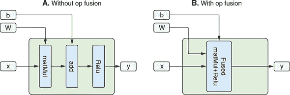

操作融合优化与我们刚刚看到的常量折叠和算术简化有何不同？操作融合要求特殊融合操作（在本例中为 `Fused matMul+relu`）在所使用的计算后端中定义并可用，而常量折叠则不需要。这些特殊融合操作可能仅对某些计算后端和部署环境可用。这就是为什么我们在 Node.js 环境中看到了比在浏览器中更大量的推理加速的原因（参见 table 12.3）。Node.js 计算后端使用的是用 C++ 和 CUDA 编写的 libtensorflow，它配备了比浏览器中的 TensorFlow.js WebGL 后端更丰富的操作集。

除了常量折叠、算术简化和操作融合之外，TensorFlow（Python）的图优化系统 Grappler 还能够进行其他许多种类的优化，其中一些可能与如何通过 `GraphModel` 转换优化 TensorFlow.js 模型相关。然而，由于空间限制，我们不会涵盖这些内容。如果你对此主题想要了解更多，你可以阅读本章末尾列出的 Rasmus Larsen 和 Tatiana Shpeisman 的信息性幻灯片。

总之，`GraphModel` 转换是由 `tensorflowjs_ converter` 提供的一种技术。它利用 TensorFlow（Python）的提前图优化能力简化计算图，并减少模型推理所需的计算量。尽管推理加速的详细量取决于模型类型和计算后端，但通常它提供了 20% 或更多的加速比，因此在部署 TensorFlow.js 模型之前执行此步骤是明智的。

|  |
| --- |

**如何正确测量 TensorFlow.js 模型的推理时间**

`tf.LayersModel` 和 `tf.GraphModel` 都提供了统一的 `predict()` 方法来支持推理。该方法接受一个或多个张量作为输入，并返回一个或多个张量作为推理结果。然而，在基于 WebGL 的浏览器推理环境中，重要的是要注意，`predict()` 方法仅*安排*在 GPU 上执行的操作；它不等待它们执行完成。因此，如果你天真地按照以下方式计时 `predict()` 调用，计时测量结果将是错误的：

```js
console.time('TFjs inference');
const outputTensor = model.predict(inputTensor);
console.timeEnd('TFjs inference');                 ***1***
```

+   ***1*** 测量推理时间的不正确方式！

当`predict()`返回时，预定的操作可能尚未执行完毕。因此，前面的示例将导致比完成推理所需实际时间更短的时间测量。为了确保在调用`console.timeEnd()`之前操作已完成，需要调用返回的张量对象的以下方法之一：`array()`或`data()`。这两种方法都会将保存输出张量元素的纹理值从 GPU 下载到 CPU。为了实现这一点，它们必须等待输出张量的计算完成。因此，正确的计时方法如下所示：

```js
console.time('TFjs inference');
const outputTensor = model.predict(inputTensor);
await outputTensor.array();                        ***1***
console.timeEnd('TFjs inference');
```

+   ***1*** `array()`调用直到输出张量的计算完成才会返回，从而确保推理时间测量的正确性。

另一个需要记住的重要事情是，与所有其他 JavaScript 程序一样，TensorFlow.js 模型推理的执行时间是变化的。为了获得推理时间的可靠估计，应该将上面代码段放在一个`for`循环中，以便可以多次执行（例如，50 次），并且可以根据累积的单个测量计算出平均时间。最初的几次执行通常比随后的执行慢，因为需要编译新的 WebGL 着色程序并设置初始状态。因此，性能测量代码通常会忽略前几次运行（例如，前五次），这些被称为*热身*或*预热*运行。

如果你对这些性能基准技术有更深入的了解感兴趣，可以通过本章末尾的练习 3 来进行实践。

|  |
| --- |

### 12.3\. 在各种平台和环境上部署 TensorFlow.js 模型

你已经优化了你的模型，它又快又轻，而且所有的测试都通过了。你准备好了! 好消息! 但在你开香槟庆祝之前，还有更多的工作要做。

是时候将你的模型部署到应用程序中，并让它出现在用户基础之前了。在本节中，我们将涵盖一些部署平台。部署到网络和部署到 Node.js 服务是众所周知的途径，但我们还将涵盖一些更奇特的部署情景，比如部署到浏览器扩展程序或单板嵌入式硬件应用。我们将指向简单的例子，并讨论平台重要的特殊注意事项。

#### 12.3.1\. 部署到网络时的额外考虑事项

让我们首先重新审视 TensorFlow.js 模型最常见的部署场景：将其部署到网页中。在这种场景下，我们经过训练且可能经过优化的模型通过 JavaScript 从某个托管位置加载，然后模型利用用户浏览器内的 JavaScript 引擎进行预测。一个很好的例子是 第五章 中的 MobileNet 图像分类示例。该示例也可从 tfjs-examples/ mobilenet 进行下载。作为提醒，以下是加载模型并进行预测的相关代码概述：

```js
const MOBILENET_MODEL_PATH =
    'https://storage.googleapis.com/tfjs-models/tfjs/mobilenet_v1_0.25_224/model.json';
const mobilenet = await tf.loadLayersModel(MOBILENET_MODEL_PATH);
const response = mobilenet.predict(userQueryAsTensor);
```

该模型是从 Google 云平台（GCP）存储桶中托管的。对于像这样的低流量、静态应用程序，很容易将模型静态托管在站点内容的其他部分旁边。对于更大、更高流量的应用程序，可以选择通过内容交付网络（CDN）将模型与其他重型资产一起托管。一个常见的开发错误是在设置 GCP、Amazon S3 或其他云服务中的存储桶时忘记考虑跨域资源共享（CORS）。如果 CORS 设置不正确，模型加载将失败，并且您应该会在控制台上收到与 CORS 相关的错误消息。如果您的 Web 应用在本地正常工作，但在发布到分发平台后失败，请注意这一点。

在用户的浏览器加载 HTML 和 JavaScript 后，JavaScript 解释器将发出加载模型的调用。在具备良好的网络连接的现代浏览器中，加载一个小型模型的过程大约需要几百毫秒，但在初始加载后，可以从浏览器缓存中更快地加载模型。序列化格式确保将模型切分为足够小的部分以支持标准浏览器缓存限制。

Web 部署的一个好处是预测直接在浏览器中进行。传递给模型的任何数据都不会通过网络传输，这对于延迟很有好处，且对于隐私保护也非常重要。想象一下，如果模型正在预测辅助输入法的下一个单词，这在我们常见的场景中经常出现，比如 Gmail。如果需要将输入的文本发送到云端服务器，并等待远程服务器的响应，那么预测将会被延迟，输入的预测结果将会变得不太有用。此外，一些用户可能会认为将其不完整的按键输入发送到远程计算机中侵犯了他们的隐私。在用户自己的浏览器中进行本地预测更加安全和注重隐私。

在浏览器中进行预测的缺点是模型安全性。将模型发送给用户使其容易保留该模型并将其用于其他目的。TensorFlow.js 目前（截至 2019 年）在浏览器中没有模型安全的解决方案。其他一些部署场景使用户更难以将模型用于开发者未预期的目的。最大模型安全性的分发路径是将模型保留在你控制的服务器上，并从那里提供预测请求。当然，这需要牺牲延迟和数据隐私。平衡这些问题是产品决策。

#### 12.3.2\. 云服务部署

许多现有的生产系统提供机器学习训练预测服务，例如 Google Cloud Vision AI([`cloud.google.com/vision`](https://cloud.google.com/vision))或 Microsoft Cognitive Services([`azure.microsoft.com/en-us/services/cognitive-services`](https://azure.microsoft.com/en-us/services/cognitive-services))。这样的服务的最终用户会进行包含预测输入值的 HTTP 请求，例如用于对象检测任务的图像，响应会对预测的输出进行编码，例如图像中对象的标签和位置。

截至 2019 年，有两种方法可以从服务器上服务于 TensorFlow.js 模型。第一种方法是运行 Node.js 的服务器，使用原生 JavaScript 运行时进行预测。由于 TensorFlow.js 很新，我们不知道有哪些生产用例选择了这种方法，但概念证明很容易构建。

第二条路线是将模型从 TensorFlow.js 转换为可以从已知的现有服务器技术（例如标准的 TensorFlow Serving 系统）服务的格式。从[www.tensorflow.org/tfx/guide/serving](http://www.tensorflow.org/tfx/guide/serving)的文档中可知：

> *TensorFlow Serving 是一个为生产环境设计的灵活高效的机器学习模型服务系统。TensorFlow Serving 使得部署新的算法和实验变得容易，同时保持相同的服务器体系结构和 API。TensorFlow Serving 提供了与 TensorFlow 模型的开箱即用的集成，但也可以轻松扩展以用于其他类型的模型和数据。*

到目前为止，我们已经将 TensorFlow.js 模型序列化为 JavaScript 特定的格式。TensorFlow Serving 期望模型使用 TensorFlow 标准的 SavedModel 格式打包。幸运的是，tfjs-converter 项目使转换为所需格式变得容易。

在第五章（迁移学习）中，我们展示了如何在 TensorFlow.js 中使用 Python 实现的 TensorFlow 构建 SavedModels。要做相反的操作，首先安装 tensorflowjs pip 包：

```js
pip install tensorflowjs
```

接下来，您必须运行转换器二进制文件，并指定输入：

```js
tensorflowjs_converter \
    --input_format=tfjs_layers_model \
    --output_format=keras_saved_model \
    /path/to/your/js/model.json \
    /path/to/your/new/saved-model
```

这将创建一个新的 saved-model 目录，其中包含 TensorFlow Serving 可理解的所需拓扑和权重格式。然后，您应该能够按照构建 TensorFlow Serving 服务器的说明，并对运行中的模型进行 gRPC 预测请求。也存在托管解决方案。例如，Google Cloud 机器学习引擎提供了一条路径，您可以将保存的模型上传到 Cloud Storage，然后设置为服务，而无需维护服务器或机器。您可以从文档中了解更多信息：[`cloud.google.com/ml-engine/docs/tensorflow/deploying-models`](https://cloud.google.com/ml-engine/docs/tensorflow/deploying-models)。

从云端提供模型的优点是您完全控制模型。可以很容易地对执行的查询类型进行遥测，并快速检测出问题。如果发现模型存在一些意外问题，可以快速删除或升级，并且不太可能出现在您控制之外的机器上的其他副本。缺点是额外的延迟和数据隐私问题，如前所述。还有额外的成本——无论是货币支出还是维护成本——在操作云服务时，您控制着系统配置。

#### 12.3.3\. 部署到浏览器扩展，如 Chrome 扩展

一些客户端应用程序可能需要您的应用程序能够跨多个不同的网站工作。所有主要桌面浏览器都提供了浏览器扩展框架，包括 Chrome、Safari 和 FireFox 等。这些框架使开发人员能够创建通过添加新的 JavaScript 和操作网站的 DOM 来修改或增强浏览体验的体验。

由于扩展是在浏览器执行引擎内部的 JavaScript 和 HTML 之上运行的，您可以在浏览器扩展中使用 TensorFlow.js 的功能与在标准网页部署中相似。模型安全性和数据隐私性与网页部署相同。通过在浏览器内直接执行预测，用户的数据相对安全。模型安全性与网页部署的情况也类似。

作为使用浏览器扩展的可能性的示例，请参阅 tfjs-examples 中的 chrome-extension 示例。此扩展加载一个 MobileNetV2 模型，并将其应用于用户在网络上选择的图像。安装和使用该扩展与我们看到的其他示例有点不同，因为它是一个扩展，而不是托管网站。这个示例需要 Chrome 浏览器。^([10])

> ¹⁰
> 
> 较新版本的 Microsoft Edge 也为跨浏览器扩展加载提供了一些支持。

首先，您必须下载并构建扩展，类似于您可能构建其他示例的方式：

```js
git clone https://github.com/tensorflow/tfjs-examples.git
cd tfjs-examples/chrome-extension
yarn
yarn build
```

扩展构建完成后，可以在 Chrome 中加载未打包的扩展。要这样做，您必须导航至 chrome://extensions，启用开发者模式，然后单击“加载未打包”，如图 12.4 所示。这将弹出一个文件选择对话框，在这里您必须选择在 chrome-extension 目录下创建的 dist 目录。那个包含 manifest.json 文件的目录。

##### 图 12.4。在开发者模式下加载 TensorFlow.js MobileNet Chrome 扩展

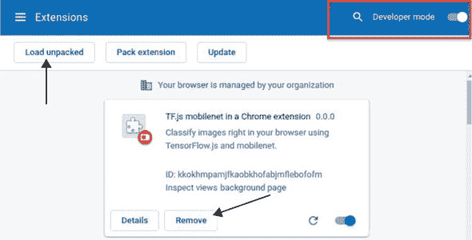

安装扩展后，您应该能够在浏览器中对图像进行分类。要这样做，请导航至一些包含图像的网站，例如在此处使用的 Google 图像搜索页面上的“tiger”关键词。然后右键单击要分类的图像。您应该会看到一个名为“使用 TensorFlow.js 对图像进行分类”的菜单选项。单击该菜单选项将使扩展执行 MobileNet 模型的操作，并在图像上添加一些文本，表示预测结果（参见图 12.5）。

##### 图 12.5。TensorFlow.js MobileNet Chrome 扩展可帮助分类网页中的图像。


要删除扩展名，请在“扩展”页面上单击“删除”（参见图 12.4），或右键单击右上角的扩展图标时使用“从 Chrome 菜单中删除”选项。

请注意，运行在浏览器扩展中的模型可以访问与运行在网页中的模型相同的硬件加速，并且确实使用了大部分相同的代码。该模型使用适当的 URL 来调用`tf.loadGraphModel(...)`进行加载，并使用相同的`model.predict(...)` API 进行预测。从网页部署迁移技术或概念验证到浏览器扩展相对较容易。

#### 12.3.4。在基于 JavaScript 的移动应用中部署 TensorFlow.js 模型

对于许多产品来说，桌面浏览器提供的覆盖范围不够，移动浏览器也无法提供顾客所期望的平稳动画化的定制产品体验。在这些项目上工作的团队通常面临着如何管理他们的 Web 应用程序代码库以及（通常）Android（Java 或 Kotlin）和 iOS（Objective C 或 Swift）本机应用程序中的存储库的困境。虽然非常庞大的团队可以支持这样的支出，但许多开发人员越来越倾向于通过利用混合跨平台开发框架在这些部署之间重复使用大部分代码。

跨平台应用程序框架，如 React Native、Ionic、Flutter 和渐进式 Web 应用程序，使您能够使用通用语言编写应用程序的大部分功能，然后编译这些核心功能，以创建具有用户期望的外观、感觉和性能的本机体验。跨平台语言/运行时处理大部分业务逻辑和布局，并连接到本机平台绑定以获得标准的外观和感觉。如何选择合适的混合应用程序开发框架是网络上无数博客和视频的主题，因此我们不会在这里重新讨论这个问题，而是将重点放在一个流行的框架上，即 React Native。图 12.6 示例了一个运行 MobileNet 模型的简单 React Native 应用程序。请注意任何浏览器顶部栏的缺失。虽然这个简单的应用程序没有 UI 元素，但如果有的话，你会发现它们与本机 Android 的外观和感觉匹配。为 iOS 构建的相同应用程序也会匹配*那些*元素。

##### 图 12.6\. React Native 构建的样本本机 Android 应用程序的屏幕截图。在这里，我们在本机应用程序中运行了一个 TensorFlow.js MobileNet 模型。

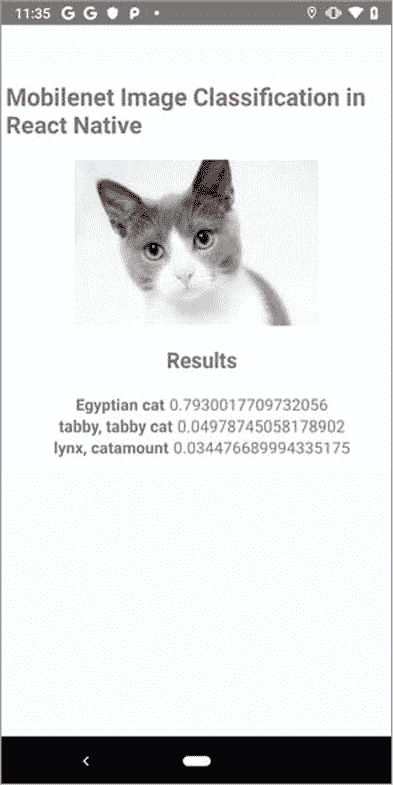

令人高兴的是，React Native 中的 JavaScript 运行时原生支持 TensorFlow.js，无需做任何特殊工作。tfjs-react-native 包目前仍处于 alpha 发布阶段（截至 2019 年 12 月），但通过 expo-gl 提供了基于 WebGL 的 GPU 支持。用户代码如下所示：

```js
import * as tf from '@tensorflow/tfjs';
import '@tensorflow/tfjs-react-native';
```

该软件包还提供了特殊 API，用于帮助在移动应用程序中加载和保存模型资源。

##### 列表 12.2\. 在使用 React-Native 构建的移动应用程序中加载和保存模型

```js
import * as tf from '@tensorflow/tfjs';
import {asyncStorageIO} from '@tensorflow/tfjs-react-native';

async trainSaveAndLoad() {
   const model = await train();
   await model.save(asyncStorageIO(                        ***1***
       'custom-model-test'))                               ***1***
   model.predict(tf.tensor2d([5], [1, 1])).print();
   const loadedModel =
     await tf.loadLayersModel(asyncStorageIO(              ***2***
         'custom-model-test'));                            ***2***
   loadedModel.predict(tf.tensor2d([5], [1, 1])).print();
 }
```

+   ***1*** 将模型保存到 AsyncStorage——一种对应用程序全局可见的简单键-值存储系统

+   ***2*** 从 AsyncStorage 加载模型

虽然通过 React Native 进行本机应用程序开发仍需要学习一些新的工具，比如 Android Studio 用于 Android 和 XCode 用于 iOS，但学习曲线比直接进行本机开发要平缓。这些混合应用程序开发框架支持 TensorFlow.js 意味着机器学习逻辑可以存在于一个代码库中，而不需要我们为每个硬件平台表面开发、维护和测试一个单独的版本，这对于希望支持本机应用体验的开发人员来说是一个明显的胜利！但是，本机桌面体验呢？

#### 12.3.5\. 在基于 JavaScript 的跨平台桌面应用程序中部署 TensorFlow.js 模型

诸如 Electron.js 等 JavaScript 框架允许以类似于使用 React Native 编写跨平台移动应用程序的方式编写桌面应用程序。 使用这样的框架，您只需编写一次代码，就可以在主流桌面操作系统（包括 macOS、Windows 和主要的 Linux 发行版）上部署和运行。 这大大简化了传统开发流程，即为大部分不兼容的桌面操作系统维护单独的代码库。 以此类别中的主要框架 Electron.js 为例。 它使用 Node.js 作为支撑应用程序主要进程的虚拟机； 对于应用程序的 GUI 部分，它使用了 Chromium，一个完整但轻量级的网络浏览器，它与 Google Chrome 共享大部分代码。

TensorFlow.js 兼容 Electron.js，如 tfjs-examples 仓库中简单示例所示。 这个示例位于 electron 目录中，演示了如何在基于 Electron.js 的桌面应用中部署 TensorFlow.js 模型以进行推理。 该应用允许用户搜索文件系统中与一个或多个关键词视觉匹配的图像文件（请参阅 图 12.7 中的截图）。 这个搜索过程涉及在一组图像目录上应用 TensorFlow.js MobileNet 模型进行推理。

##### 图 12.7\. 一个使用 TensorFlow.js 模型的示例 Electron.js 桌面应用程序的屏幕截图，来自 tfjs-examples/electron

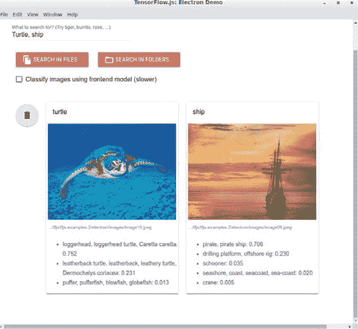

尽管这个示例应用程序很简单，但它展示了在将 TensorFlow.js 模型部署到 Electron.js 时一个重要的考虑因素：计算后端的选择。 Electron.js 应用程序在基于 Node.js 的后端进程和基于 Chromium 的前端进程上运行。 TensorFlow.js 可以在这两种环境中运行。 因此，同一个模型可以在应用程序的类似 node 的后端进程或类似浏览器的前端进程中运行。 在后端部署的情况下，使用 @tensorflow/tfjs-node 包，而在前端情况下使用 @tensorflow/tfjs 包（图 12.8）。 示例应用程序的 GUI 中的复选框允许您在后端和前端推理模式之间切换（图 12.7），尽管在由 Electron.js 和 TensorFlow.js 驱动的实际应用程序中，您通常会事先决定模型的运行环境。 接下来我们将简要讨论各个选项的优缺点。

##### 图 12.8\. 基于 Electron.js 的桌面应用程序架构，利用 TensorFlow.js 进行加速深度学习。TensorFlow.js 的不同计算后端可以从主后端进程或浏览器渲染器进程中调用。不同的计算后端导致模型在不同的底层硬件上运行。无论计算后端的选择如何，在 TensorFlow.js 中加载、定义和运行深度学习模型的代码基本相同。此图中的箭头表示库函数和其他可调用程序的调用。


如图 12.8 所示，不同的计算后端选择会导致深度学习计算在不同的计算硬件上进行。基于 @tensorflow/tfjs-node 的后端部署将工作负载分配到 CPU 上，利用多线程和 SIMD（单指令多数据）功能的 libtensorflow 库。这种基于 Node.js 的模型部署选项通常比前端选项更快，并且由于后端环境没有资源限制，可以容纳更大的模型。然而，它们的主要缺点是包大小较大，这是由于 libtensorflow 的体积较大（对于 tfjs-node，约为 50 MB 带有压缩）。

前端部署将深度学习工作负载分派给 WebGL。对于中小型模型以及推理延迟不是主要关注点的情况，这是一个可接受的选项。此选项导致包大小较小，并且由于对 WebGL 的广泛支持，可在广泛范围的 GPU 上直接运行。

如图 12.8 所示，计算后端的选择在很大程度上是与加载和运行模型的 JavaScript 代码分开的。相同的 API 对所有三个选项都适用。这在示例应用中得到了清楚的展示，其中相同的模块（`ImageClassifier` 在 electron/image_classifier.js 中）在后端和前端环境下均用于执行推理任务。我们还应指出，尽管 tfjs-examples/electron 示例仅显示推理，但您确实可以将 TensorFlow.js 用于 Electron.js 应用程序中的其他深度学习工作流程，例如模型创建和训练（例如，迁移学习）同样有效。

#### 12.3.6\. 在微信和其他基于 JavaScript 的移动应用插件系统上部署 TensorFlow.js 模型

有些地方的主要移动应用分发平台既不是 Android 的 Play Store 也不是 Apple 的 App Store，而是一小部分“超级移动应用程序”，它们允许在其自己的第一方精选体验中使用第三方扩展。

这些超级移动应用程序中有一些来自中国科技巨头，特别是腾讯的微信、阿里巴巴的支付宝和百度。它们使用 JavaScript 作为主要技术，以实现第三方扩展的创建，使得 TensorFlow.js 成为在其平台上部署机器学习的自然选择。然而，这些移动应用程序插件系统中可用的 API 集与本机 JavaScript 中可用的集合不同，因此在那里部署需要一些额外的知识和工作。

让我们以微信为例。微信是中国最广泛使用的社交媒体应用程序，每月活跃用户数超过 10 亿。2017 年，微信推出了小程序，这是一个让应用开发者在微信系统内部创建 JavaScript 小程序的平台。用户可以在微信应用程序内分享和安装这些小程序，这是一个巨大的成功。截至 2018 年第二季度，微信拥有 100 多万个小程序和 6 亿多日活跃用户。还有超过 150 万的开发者在这个平台上开发应用程序，部分原因是 JavaScript 的流行。

WeChat 小程序 API 旨在为开发者提供便捷访问移动设备传感器（摄像头、麦克风、加速计、陀螺仪、GPS 等）的功能。然而，原生 API 在平台上提供的机器学习功能非常有限。TensorFlow.js 作为小程序的机器学习解决方案带来了几个优势。以前，如果开发者想要在他们的应用程序中嵌入机器学习，他们需要在小程序开发环境之外使用服务器端或基于云的机器学习堆栈。这使得大量小程序开发者想要构建和使用机器学习变得更难。搭建外部服务基础设施对于大多数小程序开发者来说是不可能的。有了 TensorFlow.js，机器学习开发就在本地环境中进行。此外，由于它是一个客户端解决方案，它有助于减少网络流量和改善延迟，并利用了 WebGL 的 GPU 加速。

TensorFlow.js 团队创建了一个微信小程序，你可以使用它来为你的小程序启用 TensorFlow.js（见[`github.com/tensorflow/tfjs-wechat`](https://github.com/tensorflow/tfjs-wechat)）。该存储库还包含一个使用 PoseNet 来注释移动设备摄像头感知到的人的位置和姿势的示例小程序。它使用了微信新增加的 WebGL API 加速的 TensorFlow.js。如果没有 GPU 加速，模型的运行速度对大多数应用程序来说太慢了。有了这个插件，微信小程序可以拥有与在移动浏览器内运行的 JavaScript 应用程序相同的模型执行性能。事实上，我们已经观察到微信传感器 API 通常*优于*浏览器中的对应 API。

到 2019 年底，为超级应用插件开发机器学习体验仍然是非常新的领域。获得高性能可能需要一些来自平台维护者的帮助。但是，这仍是将您的应用部署到数以亿计的将超级移动应用作为互联网的人民面前的最佳方式。

#### 12.3.7\. 在单板计算机上部署 TensorFlow.js 模型

对许多网页开发者来说，部署到无头单板计算机听起来非常技术化和陌生。然而，多亏了树莓派的成功，开发和构建简单的硬件设备变得前所未有的容易。单板计算机提供了一个平台，可以廉价部署智能，而不依赖于云服务器的网络连接或笨重昂贵的计算机。单板计算机可用于支持安全应用、调节互联网流量、控制灌溉，无所不能。

许多这些单板计算机提供通用输入输出（GPIO）引脚，以便轻松连接物理控制系统，并包含完整的 Linux 安装，允许教育工作者、开发人员和黑客开发各种互动设备。JavaScript 迅速成为构建这些类型设备的一种流行语言。开发人员可以使用像 rpi-gpio 这样的 Node 库在 JavaScript 中以最低层次进行电子交互。

为了帮助支持这些用户，TensorFlow.js 当前在这些嵌入式 ARM 设备上有两个运行时：`tfjs-node (CPU^([11]))`和`tfjs-headless-nodegl (GPU)`。整个 TensorFlow.js 库通过这两个后端在这些设备上运行。开发人员可以在设备硬件上运行推断，使用现有模型或自己训练模型！

> ¹¹
> 
> 如果您希望在这些设备上利用 ARM NEON 加速 CPU，则应该使用 tfjs-node 软件包。该软件包支持 ARM32 和 ARM64 架构。

近期推出的设备（如 NVIDIA Jetson Nano 和 Raspberry Pi 4）带来了现代图形堆栈的 SoC（系统级芯片）。这些设备上的 GPU 可以被 TensorFlow.js 核心中使用的基础 WebGL 代码利用。无头 WebGL 包`(`tfjs-backend-nodegl)`允许用户纯粹通过这些设备上的 GPU 加速在 Node.js 上运行 TensorFlow.js（见图 12.9）。通过将 TensorFlow.js 的执行委托给 GPU，开发人员可以继续利用 CPU 来控制设备的其他部分。

##### 图 12.9\. 使用无头 WebGL 在树莓派 4 上执行 MobileNet 的 TensorFLow.js

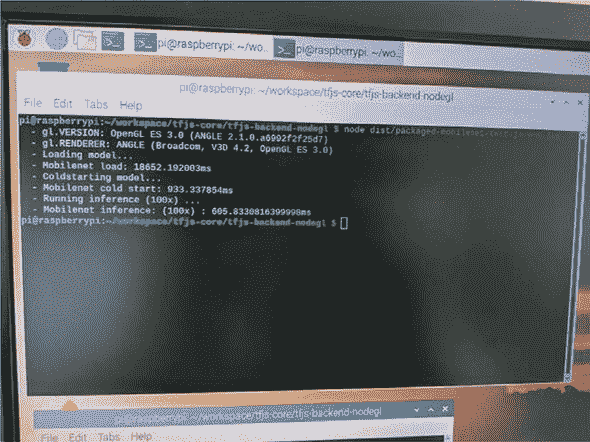

单板计算机部署的模型安全性和数据安全性非常强。计算和执行直接在设备上处理，这意味着数据不需要传输到所有者无法控制的设备上。即使物理设备遭到破坏，也可以使用加密保护模型。

对于 JavaScript 来说，将部署到单板计算机仍然是一个非常新颖的领域，尤其是 TensorFlow.js，但它为其他部署领域不适用的广泛应用提供了可能。

#### 12.3.8\. 部署摘要

在本节中，我们介绍了几种不同的方法，可以使您的 TensorFlow.js 机器学习系统走在用户基础的前面（表 12.4 总结了它们）。我们希望我们能激发您的想象力，并帮助您梦想着技术的激进应用！JavaScript 生态系统广阔而广阔，在未来，具有机器学习功能的系统将在我们今天甚至无法想象的领域运行。

##### 表 12.4\. TensorFlow.js 模型可以部署到的目标环境以及每个环境可以使用的硬件加速器

| 部署 | 硬件加速器支持 |
| --- | --- |
| 浏览器 | WebGL |
| Node.js 服务器 | 具有多线程和 SIMD 支持的 CPU；具有 CUDA 支持的 GPU |
| 浏览器插件 | WebGL |
| 跨平台桌面应用程序（如 Electron） | WebGL，支持多线程和 SIMD 的 CPU，或者具有 CUDA 支持的 GPU |
| 跨平台移动应用程序（如 React Native） | WebGL |
| 移动应用程序插件（如微信） | 移动 WebGL |
| 单板计算机（如 Raspberry Pi） | GPU 或 ARM NEON |

### 进一步阅读材料

+   Denis Baylor 等，“TFX：基于 TensorFlow 的生产规模机器学习平台”，KDD 2017，[www.kdd.org/kdd2017/papers/view/tfx-a-tensorflow-based-production-scale-machine-learning-platform](http://www.kdd.org/kdd2017/papers/view/tfx-a-tensorflow-based-production-scale-machine-learning-platform)。

+   Raghuraman Krishnamoorthi，“为高效推理量化深度卷积网络：一份白皮书”，2018 年 6 月，[`arxiv.org/pdf/1806.08342.pdf`](https://arxiv.org/pdf/1806.08342.pdf)。

+   Rasmus Munk Larsen 和 Tatiana Shpeisman，“TensorFlow 图优化”，[`ai.google/research/pubs/pub48051`](https://ai.google/research/pubs/pub48051)。

### 练习

1.  在第十章中，我们训练了一个辅助类生成对抗网络（ACGAN）来生成 MNIST 数据集的假冒图像，以类别为单位。具体来说，我们使用的示例位于 tfjs-examples 存储库的 mnist-acgan 目录中。训练模型的生成器部分总共约占用了大约 10 MB 的空间，其中大部分是以 32 位浮点数存储的权重。诱人的是对该模型进行训练后的权重量化以加快页面加载速度。但是，在执行此操作之前，我们需要确保这种量化不会导致生成的图像质量显着下降。测试 16 位和 8 位量化，并确定它们中的任何一个或两者都是可接受的选项。使用 section 12.2.1 中描述的`tensorflowjs_converter`工作流程。在这种情况下，您将使用什么标准来评估生成的 MNIST 图像的质量？

1.  作为 Chrome 扩展运行的 Tensorflow 模型具有控制 Chrome 本身的优势。在第四章中的语音命令示例中，我们展示了如何使用卷积模型识别口语。Chrome 扩展 API 允许您查询和更改标签页。尝试将语音命令模型嵌入到扩展中，并调整它以识别“下一个标签页”和“上一个标签页”短语。使用分类器的结果来控制浏览器标签焦点。

1.  信息框 12.3 描述了正确测量 TensorFlow.js 模型的`predict()`调用（推断调用）所需时间以及涉及的注意事项。在这个练习中，加载一个 TensorFlow.js 中的 MobileNetV2 模型（如果需要提醒如何做到这一点，请参见 5.2 节 中的简单对象检测示例），并计时其`predict()`调用：

    1.  作为第一步，生成一个形状为`[1, 224, 224, 3]`的随机值图像张量，并按照信息框 12.3 中的步骤对其进行模型推断。将结果与输出张量上的`array()`或`data()`调用进行比较。哪一个更短？哪一个是正确的时间测量？

    1.  当正确的测量在循环中执行 50 次时，使用 tfjs-vis 折线图（第七章）绘制单独的时间数字，并直观地了解可变性。你能清楚地看到前几次测量与其余部分明显不同吗？鉴于这一观察结果，讨论在性能基准测试期间执行 burn-in 或预热运行的重要性。

    1.  与任务 a 和 b 不同，将随机生成的输入张量替换为真实的图像张量（例如，使用`tf.browser.fromPixels()`从`img`元素获取的图像张量），然后重复步骤 b 中的测量。输入张量的内容是否对时间测量产生任何重大影响？

    1.  不要在单个示例（批量大小 = 1）上运行推断，尝试将批量大小增加到 2、3、4 等，直到达到相对较大的数字，例如 32。平均推断时间与批量大小之间的关系是单调递增的吗？是线性的吗？

### 概要

+   对于机器学习代码，良好的工程纪律围绕测试同样重要，就像对非机器学习代码一样重要。然而，避免过分关注“特殊”示例或对“黄金”模型预测进行断言的诱惑。相反，依靠测试模型的基本属性，如其输入和输出规范。此外，请记住，机器学习系统之前的所有数据预处理代码都只是“普通”代码，应该相应地进行测试。

+   优化下载速度和推断速度是 TensorFlow.js 模型客户端部署成功的重要因素。 使用`tensorflowjs_converter`二进制文件的后训练权重量化功能，您可以减小模型的总大小，在某些情况下，无需观察到推断精度的损失。 `tensorflowjs_converter`的图模型转换功能可通过操作融合等图转换来加速模型推断。 在部署 TensorFlow.js 模型到生产环境时，强烈建议您测试和采用这两种模型优化技术。

+   经过训练和优化的模型并不是您机器学习应用程序的终点。 您必须找到一种方法将其与实际产品集成。 TensorFlow.js 应用程序最常见的部署方式是在网页中，但这只是各种部署方案中的一个，每种部署方案都有其自身的优势。 TensorFlow.js 模型可以作为浏览器扩展程序运行，在原生移动应用程序中运行，作为原生桌面应用程序运行，甚至在树莓派等单板硬件上运行。
