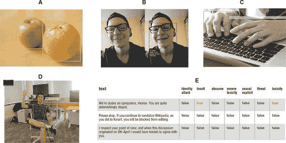
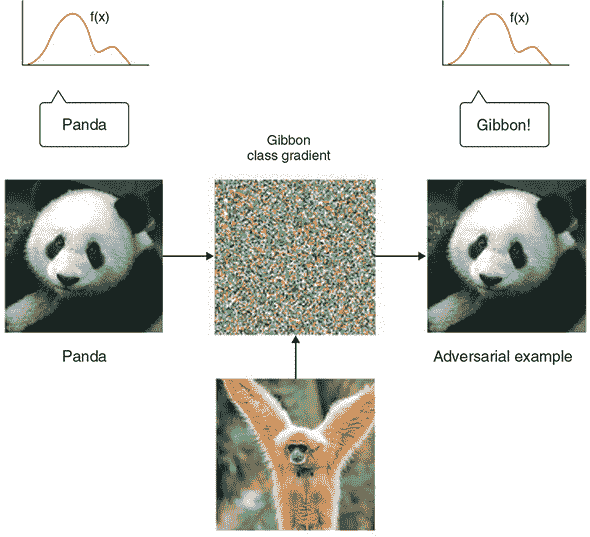
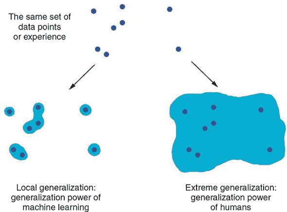

##  第十四章：总结、结论和展望

*本章包括*

+   回顾人工智能和深度学习的高层次概念和想法

+   我们在本书中访问的不同类型的深度学习算法的快速概述，它们何时有用，以及如何在 TensorFlow.js 中实现它们

+   来自 TensorFlow.js 生态系统的预训练模型

+   深度学习当前存在的局限性；以及我们将在未来几年看到的深度学习趋势的教育预测

+   如何进一步提升你的深度学习知识并跟上这个快速发展的领域的指导

这是本书的最后一章。之前的章节是对当前深度学习领域的总体概况，通过 TensorFlow.js 和你自己的努力实现。通过这段旅程，你可能已经学到了很多新的概念和技能。现在是时候再次退后一步，重新审视全局，并对你学到的一些最重要的概念进行复习。这最后一章将总结和审查核心概念，同时将你的视野扩展到迄今为止学到的相对基本的概念之外。我们希望确保你意识到这一点，并且准备好自己继续旅程的下一步。

我们将从鸟瞰视角开始，总结你应该从这本书中学到的东西。这应该让你记起你学到的一些概念。接下来，我们将概述深度学习的一些关键局限性。要正确使用工具，你不仅应该知道它 *能* 做什么，还应该知道它 *不能* 做什么。本章以资源列表和进一步了解深度学习和 JavaScript 生态系统中人工智能知识和技能的策略结束，并保持与新发展的步伐同步。

### 13.1\. 复习重点概念

这一部分简要总结了这本书的关键要点。我们将从人工智能领域的整体格局开始，以为什么将深度学习和 JavaScript 结合起来会带来独特而令人兴奋的机遇而结束。

#### 13.1.1\. 人工智能的各种方法

首先，深度学习与人工智能甚至与机器学习并不是同义词。 *人工智能* 是一个历史悠久的广泛领域。它通常可以定义为“所有试图自动化认知过程”的尝试——换句话说，思维的自动化。这可以从非常基本的任务，如 Excel 电子表格，到非常高级的努力，如一个可以行走和说话的类人机器人。

*机器学习* 是人工智能的许多子领域之一。它旨在通过暴露给训练数据自动开发程序（称为 *模型*）。这个将数据转化为程序（模型）的过程被称为 *学习*。尽管机器学习已经存在了很长一段时间（至少有几十年了），但它直到 1990 年代才开始在实际应用中蓬勃发展。

*深度学习* 是机器学习的众多形式之一。在深度学习中，模型由许多步骤的表示转换组成，依次应用（因此有形容词“深度”）。这些操作被结构化为称为 *层* 的模块。深度学习模型通常是许多层的堆栈或更一般地说是许多层的图。这些层由 *权重* 参数化，数字值有助于将层的输入转换为其输出，并在训练过程中更新。模型在训练过程中学到的“知识”体现在其权重中。训练过程主要是为这些权重找到一个良好的值。

尽管深度学习只是机器学习的众多方法之一，但与其他方法相比，它已被证明是一个突破性的成功。让我们快速回顾一下深度学习成功背后的原因。

#### 13.1.2\. 使深度学习在机器学习子领域中脱颖而出的原因

仅仅在几年的时间里，**深度学习**在多个历史上被认为对计算机极其困难的任务上取得了巨大突破，特别是在机器感知领域——即从图像、音频、视频和类似感知数据中提取有用信息的能力，具有足够高的准确性。如果有足够的训练数据（特别是*标记*的训练数据），现在可以从感知数据中提取几乎任何人类可以提取的东西，有时甚至准确度超过人类。因此，有时说深度学习在很大程度上“解决了感知”问题，尽管这只适用于对感知的一个相当狭义的定义（参见 第 13.2.5 节 以了解深度学习的局限性）。

由于其空前的技术成功，**深度学习**独自引发了第三次，迄今为止最大的 *AI 夏季*，也被称为 *深度学习革命*，这是人工智能领域的一个充满兴趣、投资和炒作的时期。这一时期是否会在不久的将来结束，以及之后会发生什么，是人们猜测和讨论的话题。但有一点是确定的：与以往的 AI 夏季形成鲜明对比，深度学习为许多技术公司提供了巨大价值，实现了人类级别的图像分类、目标检测、语音识别、智能助手、自然语言处理、机器翻译、推荐系统、自动驾驶汽车等。炒作可能会减退（理所当然），但深度学习的持续技术影响和经济价值将会保持。从这个意义上说，深度学习可能类似于互联网：可能在几年内被过度炒作，导致不合理的期望和过度投资，但从长远来看，它将成为一个影响技术许多领域并改变我们生活的重大革命。

我们对深度学习特别乐观，因为即使在未来十年内我们在其中不再取得进一步的学术进展，将现有的深度学习技术应用于每一个适用的实际问题仍将改变许多行业的游戏规则（在线广告、金融、工业自动化和残疾人辅助技术，只是列举了一部分）。深度学习无疑是一场革命，目前的进展速度之快令人难以置信，这要归功于资源和人员的指数级投资。从我们的角度来看，未来看起来很光明，尽管短期内的预期可能有些过于乐观；充分发挥深度学习的潜力将需要超过十年的时间。

#### 13.1.3\. 怎样从高层次上思考深度学习

深度学习最令人惊讶的一个方面是它的简单性，考虑到它的工作效果以及之前的更复杂的机器学习技术的效果并不如人意。十年前，没有人预料到我们能够仅通过使用梯度下降训练的参数模型在机器感知问题上取得如此惊人的结果。现在事实证明，你只需要足够大的通过梯度下降训练的参数模型以及足够多的带标签示例。正如理查德·费曼曾经关于他对宇宙的理解所说：“这并不复杂，只是有很多。”^([1])

> ¹
> 
> 理查德·费曼，采访，“另一种视角下的世界”，约克郡电视台，1972 年。

在深度学习中，一切都被表示为一系列数字——换句话说，是一个*向量*。一个向量可以被看作是*几何空间*中的一个*点*。模型输入（表格数据、图像、文本等）首先被向量化，或者转换为输入向量空间中的一组点。同样地，目标（标签）也被向量化，并转换为其相应的目标向量空间中的一组点。然后，深度神经网络中的每一层对通过它的数据执行一个简单的几何变换。在一起，神经网络中的层链形成了一个由一系列简单的几何变换组成的复杂几何变换。这个复杂的变换试图将输入向量空间中的点映射到目标向量空间中的点。这个变换由层的权重参数化，这些权重根据当前变换的好坏进行迭代更新。这个几何变换的一个关键特征是它是*可微的*：这就是梯度下降变得可能的原因。

#### 13.1.4\. 深度学习的关键技术

正在进行的深度学习革命并非一夜之间开始。相反，和其他任何革命一样，它是一系列因素的积累——一开始缓慢，然后一旦到达关键点就突然加速。就深度学习而言，我们可以指出以下关键因素：

+   渐进式的算法创新，首先涉及两个十年，然后随着深度学习在 2012 年之后投入更多研究力量而加速发展。

    > ²
    > 
    > 起始于 Rumelhart、Hinton 和 Williams 的反向传播算法，LeCun 和 Bengio 的卷积层，以及 Graves 和 Schmidthuber 的循环网络。
    > 
    > ³
    > 
    > 例如，改进的权重初始化方法，新的激活函数，dropout，批量归一化，残差连接。

+   大量的标记数据可用，覆盖许多数据模式，包括知觉（图像、音频和视频）、数字和文本，这使大型模型可以在足够数量的数据上进行训练。这是消费互联网兴起的副产品，由流行的移动设备推动，以及存储介质中的摩尔定律。

+   快速、高度并行化的计算硬件以低成本提供，尤其是 NVIDIA 生产的 GPU——首先是为并行计算重新用途的游戏 GPU，然后是从头设计用于深度学习的芯片。

+   复杂的开源软件堆栈使许多人类开发者和学习者可以使用这种计算能力，同时隐藏了庞大的复杂性：CUDA 语言、WebGL 着色器语言以及框架，如 TensorFlow.js、TensorFlow 和 Keras，其执行自动差分并提供易于使用的高级搭建块，如层、损失函数和优化器。深度学习正在从专家领域（研究人员、AI 研究生和具有学术背景的工程师）转变为每位程序员的工具。TensorFlow.js 在这方面是一个典范性的框架。它将两个丰富活跃的生态系统结合在一起：JavaScript 跨平台生态系统和快速发展的深度学习生态系统。

深度学习革命的广泛和深远影响之一是它与其他不同于它的技术栈（如 C++ 和 Python 生态系统和数字计算领域）的融合。它与 JavaScript 生态系统的跨界融合是其中的一个典型例子。在接下来的部分，我们将回顾为什么将深度学习引入 JavaScript 世界将开启令人兴奋的新机遇和可能性的关键原因。

#### 13.1.5 用 JavaScript 实现深度学习的应用与机遇

训练深度学习模型的主要目的是使其可供用户使用。对于许多类型的输入模态，例如来自网络摄像头的图像、来自麦克风的声音以及用户输入的文本和手势输入，数据是由客户端生成并直接可用的。JavaScript 或许是最成熟和普及的客户端编程语言和生态系统。用 JavaScript 编写的相同代码可以部署为网页和 UI，在各种设备和平台上运行。Web 浏览器的 WebGL API 允许在各种 GPU 上进行跨平台并行计算，TensorFlow.js 利用了这一点。这些因素使 JavaScript 成为部署深度学习模型的一种吸引人的选择。TensorFlow.js 提供了一个转换工具，允许您将使用流行的 Python 框架（如 TensorFlow 和 Keras）训练的模型转换为适合 Web 的格式，并将其部署到网页上进行推理和迁移学习。

除了部署的便利性之外，使用 JavaScript 提供服务和微调深度学习模型还有许多其他优势：

+   与服务器端推理相比，客户端推理放弃了双向数据传输的延迟，有利于可用性，并带来更流畅的用户体验。

+   通过使用设备 GPU 加速在边缘执行计算，客户端深度学习消除了管理服务器端 GPU 资源的需要，显着降低了技术堆栈的复杂性和维护成本。

+   通过保持数据和推理结果在客户端，用户的数据隐私得到了保护。这对于医疗保健和时尚等领域至关重要。

+   浏览器和其他基于 JavaScript 的 UI 环境的视觉和交互性为神经网络的可视化、辅助理解和教学提供了独特的机会。

+   TensorFlow.js 不仅支持推理，还支持训练。这为客户端迁移学习和微调打开了大门，从而实现了机器学习模型的更好个性化。

+   在 Web 浏览器中，JavaScript 提供了一个独立于平台的 API，用于访问设备传感器，如网络摄像头和麦克风，这加速了使用这些传感器输入的跨平台应用程序的开发。

除了其客户端的卓越性能，JavaScript 还将其能力扩展到服务器端。特别是，Node.js 是 JavaScript 中高度流行的用于服务器端应用的框架。使用 Node.js 版本的 TensorFlow.js（tfjs-node），您可以在网页浏览器之外的环境中训练和提供深度学习模型，因此不受资源限制。这利用了 Node.js 的庞大生态系统，并简化了社区成员的技术堆栈。所有这些都可以通过使用与您为客户端编写的基本相同的 TensorFlow.js 代码来实现，这使您更接近“一次编写，到处运行”的愿景，正如本书中的几个示例所示。

### 13.2\. TensorFlow.js 中深度学习工作流程和算法的快速概述

通过历史概述，让我们现在来看看 TensorFlow.js 的技术方面。在本节中，我们将回顾当你面对一个机器学习问题时应该遵循的一般工作流程，并强调一些最重要的考虑因素和常见陷阱。然后，我们将过一下我们在书中涵盖的各种神经网络构建块（层）。此外，我们将调查 TensorFlow.js 生态系统中的预训练模型，这些模型可以加速您的开发周期。为了结束本节，我们将介绍您可以通过使用这些构建块解决的一系列机器学习问题，激励您想象使用 TensorFlow.js 编写的深度神经网络如何帮助您解决自己的机器学习问题。

#### 13.2.1\. 监督深度学习的通用工作流程

深度学习是一个强大的工具。但或许有些令人惊讶的是，机器学习工作流程中最困难和耗时的部分通常是设计和训练这些模型之前的一切（以及对于部署到生产环境的模型来说，还有之后的一切）。这些困难的步骤包括充分了解问题域，以便能够确定需要什么样的数据，以及可以以合理的准确性和泛化能力进行什么样的预测，机器学习模型如何适用于解决实际问题的整体解决方案中，以及如何度量模型在完成其工作时成功的程度。尽管这些是任何成功应用机器学习的先决条件，但它们不是像 TensorFlow.js 这样的软件库可以自动化的内容。作为提醒，以下是典型监督学习工作流程的快速摘要：

1.  *确定机器学习是否是正确的方法*。首先，考虑一下机器学习是否是解决您的问题的正确方法，只有在答案是肯定的情况下才继续以下步骤。在某些情况下，非机器学习方法同样有效，甚至可能更好，成本更低。

1.  定义机器学习问题。确定可用的数据类型以及您试图使用数据预测的内容。

1.  检查您的数据是否足够。确定您已经拥有的数据量是否足以进行模型训练。您可能需要收集更多数据或雇用人员手动标记一个未标记的数据集。

1.  确定一种可靠地衡量训练模型成功的方法。对于简单任务，这可能只是预测准确率，但在许多情况下，它将需要更复杂、特定于领域的度量标准。

1.  准备评估过程。设计用于评估模型的验证过程。特别是，您应该将数据分成三个同质但不重叠的集合：一个训练集、一个验证集和一个测试集。验证集和测试集的标签不应泄漏到训练数据中。例如，对于时间预测，验证和测试数据应来自训练数据之后的时间间隔。您的数据预处理代码应该经过测试，以防止错误（第 12.1 节）。

1.  将数据向量化。将您的数据转换为张量，或者*n*维数组——TensorFlow.js 和 TensorFlow 等框架中机器学习模型的通用语言。通常需要对张量化的数据进行预处理，以使其更适合您的模型（例如，通过归一化）。

1.  超越常识基线。开发一个能够超越非机器学习基线的模型（例如，在回归问题中预测人口平均值或在时间序列预测问题中预测最后一个数据点），从而证明机器学习确实可以为您的解决方案增加价值。这并不总是可能的（见步骤 1）。

1.  开发具有足够容量的模型。通过调整超参数和添加正则化逐渐完善模型架构。仅基于验证集的预测准确率进行更改，而不是基于训练集或测试集。请记住，您应该使您的模型过度拟合问题（在训练集上达到比验证集更好的预测准确率），从而确定一个比您需要的容量更大的模型容量。只有在那之后，您才应该开始使用正则化和其他方法来减少过拟合。

1.  调整超参数。在调整超参数时要注意验证集的过拟合。因为超参数是基于验证集上的性能确定的，所以它们的值会过度专门化于验证集，因此可能不会很好地推广到其他数据。测试集的目的是在调整超参数后获得模型准确性的无偏估计。因此，在调整超参数时不应使用测试集。

1.  *验证和评估训练好的模型*。正如我们在第 12.1 节中讨论的，用最新的评估数据集测试您的模型，并决定预测精度是否达到为实际用户服务的预定标准。此外，对模型在不同数据切片（子集）上的质量进行更深入的分析，旨在检测任何不公平行为（例如在不同数据切片上的精度差异）或不希望的偏差。^([4]) 只有当模型通过这些评估标准时，才进行最终步骤。

    > ⁴
    > 
    > 机器学习中的公平性是一个新兴的研究领域；更多讨论请参见以下链接[`mng.bz/eD4Q`](http://mng.bz/eD4Q)。

1.  *优化和部署模型*。对模型进行优化，以缩小其尺寸并提高其推理速度。然后将模型部署到服务环境中，如网页、移动应用程序或 HTTP 服务端点（第 12.3 节）。

这个教程是关于监督学习的，它在许多实际问题中都会遇到。本书涵盖的其他类型的机器学习工作流包括（监督）迁移学习、RL（强化学习）和生成式深度学习。监督迁移学习（第五章）与非迁移监督学习的工作流相同，唯一的区别是模型设计和训练步骤是基于预训练模型构建的，并且可能需要比从头开始训练模型更少的训练数据。生成式深度学习的目标与监督学习有所不同——即尽可能创建看起来像真实的假例。实际上，有一些技术将生成模型的训练转化为监督学习，就像我们在第九章中看到的 VAE 和 GAN 示例一样。另一方面，RL 包含一个根本不同的问题形式化，并因此具有截然不同的工作流程——其中主要参与者是环境、代理、行动、奖励结构以及用于解决问题的算法或模型类型。第十一章提供了 RL 中基本概念和算法的快速概述。

#### 13.2.2\. 回顾 TensorFlow.js 中的模型和层类型：快速参考

本书涵盖的所有众多神经网络可以分为三类系列：密集连接网络（也称为 MLPs 或多层感知器）、卷积网络和循环网络。这三种基本系列的网络是每个深度学习实践者都应该熟悉的。每种类型的网络适用于特定类型的输入：网络架构（MLP、卷积或循环）对输入数据的结构进行假设—通过反向传播和超参数调整来搜索好模型的假设空间。给定问题是否适用于给定架构完全取决于数据中的结构与网络架构的假设匹配得有多好。

这些不同类型的网络可以像积木一样轻松地组合成更复杂和多模态的网络。从某种意义上说，深度学习层是可微分信息处理的积木。我们快速概述输入数据的模态与适当网络架构之间的映射：

+   向量数据（没有时间序列或串行顺序）—MLPs（密集 `layers`）

+   图像数据（黑白、灰度或彩色）—2D 卷积网络

+   音频数据作为频谱图—2D 卷积网络或 RNNs

+   文本数据—1D 卷积网络或 RNNs

+   时间序列数据—1D 卷积网络或 RNNs

+   体积数据（例如 3D 医学图像）—3D 卷积网络

+   视频数据（图像序列）—要么是 3D 卷积网络（如果你需要捕捉运动效果），要么是一个逐帧 2D 卷积网络用于特征提取，随后是一个 RNN 或 1D 卷积网络来处理生成的特征序列的组合

现在让我们深入了解每个主要架构系列，它们擅长的任务以及如何通过 TensorFlow.js 使用它们。

##### 密集连接网络和多层感知器

*密集连接网络*和*多层感知机*这两个术语在很大程度上可以互换使用，但要注意密集连接网络可以只包含一个层，而多层感知机必须至少包含一个隐藏层和一个输出层。为了简洁起见，我们将使用*MLP*这个术语来指代主要由密集层构建的所有模型。此类网络专门用于无序向量数据（例如，在钓鱼网站检测问题和房价预测问题中的数值特征）。每个密集层试图对输入特征的所有可能的对和该层的输出激活之间的关系进行建模。这通过密集层的核与输入向量之间的矩阵乘法（然后加上偏差向量和激活函数）来实现。每个输出激活受到每个输入特征的影响是这些层和建立在它们上面的网络被称为*密集连接*（或被一些作者称为*完全连接*）的原因。这与其他类型的架构（卷积网络和循环神经网络）形成对比，在这些架构中，一个输出元素仅依赖于输入数据中的一部分元素。

MLP 最常用于分类数据（例如，输入特征是属性列表，比如在钓鱼网站检测问题中）。它们也经常被用作大多数分类和回归神经网络的最终输出阶段，这些网络可以包含卷积或循环层作为特征提取器，将特征输入馈送到这样的 MLP 中。例如，我们在第四章和第五章中介绍的二维卷积网络都以一个或两个密集层结尾，我们在第九章中介绍的循环网络也是如此。

让我们简要回顾一下在监督学习中如何选择 MLP 的输出层激活函数以适应不同类型的任务。要进行二元分类，你的 MLP 的最后一个密集层应该正好有一个单元，并使用 sigmoid 激活函数。在训练这样一个二元分类器 MLP 时，应该使用`binaryCrossentropy`作为损失函数。你的训练数据中的例子应该有二元标签（0 或 1 的标签）。具体来说，TensorFlow.js 的代码如下：

```js
import * as tf from '@tensorflow/tfjs';

const model = tf.sequential();
model.add(tf.layers.dense({units: 32, activation: 'relu', inputShape:
     [numInputFeatures]}));
model.add(tf.layers.dense({units: 32, activation: 'relu'}));
model.add(tf.layers.dense({units: 1: activation: 'sigmoid'}));
model.compile({loss: 'binaryCrossentropy', optimizer: 'adam'});
```

要进行单标签多类别分类（其中每个例子在多个候选类别中只有一个类别），请在你的层堆叠的末尾加上一个包含 softmax 激活函数的密集层，单位数量等于类别的数量。如果你的目标是独热编码，请使用`categoricalCrossentropy`作为损失函数；如果它们是整数索引，请使用`sparseCategoricalCrossentropy`。例如：

```js
const model = tf.sequential();
model.add(tf.layers.dense({units: 32, activation: 'relu', inputShape:
     [numInputFeatures]});
model.add(tf.layers.dense({units: 32, activation: 'relu'});
model.add(tf.layers.dense({units: numClasses: activation: 'softmax'});
model.compile({loss: 'categoricalCrossentropy', optimizer: 'adam'});
```

为了执行多标签多类别分类（每个示例可能具有多个正确类别），将你的层堆栈结束为一个包含 sigmoid 激活和单位数量等于所有候选类别数量的密集层。使用`binaryCrossentropy`作为损失函数。你的目标应该是 k-hot 编码：

```js
const model = tf.sequential();
model.add(tf.layers.dense({units: 32, activation: 'relu', inputShape:
     [numInputFeatures]}));
model.add(tf.layers.dense({units: 32, activation: 'relu'}));
model.add(tf.layers.dense({units: numClasses: activation: 'sigmoid'}));
model.compile({loss: 'binaryCrossentropy', optimizer: 'adam'});
```

为了对连续值向量执行回归，将你的层堆栈结束为一个具有单位数量等于你尝试预测的值数量（通常只有一个数字，比如房价或温度值）的密集层，并使用默认的线性激活函数。多个损失函数可用于回归。最常用的是`meanSquaredError`和`meanAbsoluteError`：

```js
const model = tf.sequential();
model.add(tf.layers.dense({units: 32, activation: 'relu', inputShape:
     [numInputFeatures]}));
model.add(tf.layers.dense({units: 32, activation: 'relu'}));
model.add(tf.layers.dense({units: numClasses}));
model.compile({loss: 'meanSquaredError', optimizer: 'adam'});
```

##### 卷积网络

卷积层通过将相同的几何变换应用于输入张量中的不同空间位置（补丁）来查看局部空间模式。这导致了是平移不变的表示，使卷积层高度数据有效和模块化。这个想法适用于任何维度的空间：1D（序列），2D（图像或类似于非图像数量的表示，如声音频谱图），3D（体积）等等。你可以使用`tf.layers.conv1d`层来处理序列，使用 conv2d 层来处理图像，使用 conv3d 层来处理体积。

卷积网络由一系列卷积和池化层组成。池化层允许你对数据进行空间降采样，这对于保持特征图的合理大小是必需的，因为特征数量增加，同时也允许后续层“看到”卷积网络输入图像的更大空间范围。卷积网络通常以展平层或全局池化层结束，将空间特征图转换为向量，然后可以通过一系列密集层（MLP）处理以实现分类或回归输出。

很可能常规卷积很快就会被一个等价但更快更高效的替代品所取代（或完全取代）：深度可分离卷积（`tf.layers.separableConv2d`层）。当你从头开始构建一个网络时，强烈推荐使用深度可分离卷积。可分离卷积层可以用作`tf.layers .conv2d`的即插即用替代品，结果是一个更小更快的网络，在其任务上表现同样好或更好。以下是一个典型的图像分类网络（单标签多类别分类，在本例中）。其拓扑结构包含重复的卷积-池化层组的模式：

```js
const model = tf.sequential();
model.add(tf.layers.separableConv2d({
    filters: 32, kernelSize: 3, activation: 'relu',
    inputShape: [height, width, channels]}));
model.add(tf.layers.separableConv2d({
         filters: 64, kernelSize: 3, activation: 'relu'}));
model.add(tf.layers.maxPooling2d({poolSize: 2}));

model.add(tf.layers.separableConv2d({
         filters: 64, kernelSize: 3, activation: 'relu'}));
model.add(tf.layers.separableConv2d({
         filters: 128, kernelSize: 3, activation: 'relu'}));
model.add(tf.layers.maxPooling2d({poolSize: 2}));

model.add(tf.layers.separableConv2d({
    filters: 64, kernelSize: 3, activation: 'relu'}));
model.add(tf.layers.separableConv2d({
    filters: 128, kernelSize: 3, activation: 'relu'}));
model.add(tf.layers.globalAveragePooling2d());
model.add(tf.layers.dense({units: 32, activation: 'relu'}));
model.add(tf.layers.dense({units: numClasses, activation: 'softmax'}));

model.compile({loss: 'categoricalCrossentropy', optimizer: 'adam'});
```

##### 循环网络

RNN 通过一次处理一个时间戳的输入序列并始终保持状态来工作。状态通常是一个向量或一组向量（几何空间中的一个点）。在不是时间上不变的序列（例如，时间序列数据，其中最近的过去比遥远的过去更重要）的情况下，应优先使用 RNN，而不是 1D 卷积网络。

TensorFlow.js 提供了三种 RNN 层类型：simpleRNN、GRU 和 LSTM。对于大多数实际目的，您应该使用 GRU 或 LSTM。LSTM 是这两者中更强大的，但也更消耗计算资源。您可以将 GRU 视为 LSTM 的简化和更便宜的替代品。

为了将多个 RNN 层堆叠在一起，除了最后一层之外的每一层都需要配置为返回其输出的完整序列（每个输入时间步对应一个输出时间步）。如果不需要堆叠 RNN 层，通常 RNN 层只需返回最后一个输出，其中包含有关整个序列的信息。

以下是使用单个 RNN 层与密集层一起执行向量序列的二进制分类的示例：

```js
const model = tf.sequential();
model.add(tf.layers.lstm({
  units: 32,
  inputShape: [numTimesteps, numFeatures]
}));
model.add(tf.layers.dense({units: 1, activation: 'sigmoid'}));
model.compile({loss: 'binaryCrossentropy', optimizer: 'rmsprop'});
```

接下来是一个带有 RNN 层堆叠的模型，用于向量序列的单标签多类别分类：

```js
const model = tf.sequential();
model.add(tf.layers.lstm({
  units: 32,
  returnSequences: true,
  inputShape: [numTimesteps, numFeatures]
}));
model.add(tf.layers.lstm({units: 32, returnSequences: true}));
model.add(tf.layers.lstm({units: 32}));
model.add(tf.layers.dense({units: numClasses, activation: 'softmax'}));
model.compile({loss: 'categoricalCrossentropy', optimizer: 'rmsprop'});
```

##### 用于减轻过拟合和提高收敛性的层和正则化器

除了上述主要的基本层类型之外，还有一些其他类型的层适用于广泛的模型和问题类型，并协助训练过程。没有这些层，许多机器学习任务的最新准确性不会像今天这样高。例如，dropout 和 batchNormalization 层经常插入到 MLP、卷积网络和 RNN 中，以帮助模型在训练过程中更快地收敛并减少过拟合。以下示例显示了包含 dropout 层的回归 MLP：

```js
const model = tf.sequential();
model.add(tf.layers.dense({
  units: 32,
  activation: 'relu',
  inputShape: [numFeatures]
}));
model.add(tf.layers.dropout({rate: 0.25}));
model.add(tf.layers.dense({units: 64, activation: 'relu'}));
model.add(tf.layers.dropout({rate: 0.25}));
model.add(tf.layers.dense({units: 64, activation: 'relu'}));
model.add(tf.layers.dropout({rate: 0.25}));
model.add(tf.layers.dense({
  units: numClasses,
  activation: 'categoricalCrossentropy'
}));
model.compile({loss: 'categoricalCrossentropy', optimizer: 'rmsprop'});
```

#### 13.2.3. 从 TensorFlow.js 使用预训练模型

当您要解决的机器学习问题特定于您的应用程序或数据集时，从头开始构建和训练模型是正确的方法，而 TensorFlow.js 使您能够做到这一点。然而，在某些情况下，您面临的问题是通用的，存在预训练模型，这些模型要么完全符合您的要求，要么只需进行轻微调整即可满足您的需求。来自 TensorFlow.js 和第三方开发人员的预训练模型集合。这些模型提供了干净且易于使用的 API。它们还作为 npm 包打包得很好，您可以方便地依赖它们在您的 JavaScript 应用程序（包括 Web 应用程序和 Node.js 项目）中。

在适当的使用案例中使用这些预训练模型可以大大加快您的开发速度。由于不可能列出所有基于 TensorFlow.js 的预训练模型，因此我们只会调查我们所知道的最流行的那些。以@tensorflow-models/为前缀的软件包是由 TensorFlow.js 团队维护的第一方软件包，而其余的是第三方开发者的工作。

@tensorflow-models/mobilenet 是一个轻量级图像分类模型。它能够根据输入图像输出 1,000 个 ImageNet 类别的概率分数。它适用于在网页中为图像标记、从网络摄像头输入流中检测特定内容，以及涉及图像输入的迁移学习任务。虽然@tensorflow-models/mobilenet 关注通用的图像类别，但也有第三方软件包用于更具特定领域的图像分类。例如，nsfwjs 将图像分类为包含色情和其他不当内容与安全内容，这对家长监控、安全浏览等应用非常有用。

如我们在第五章中讨论的那样，目标检测与图像分类不同之处在于，它不仅输出图像中包含的物体，还输出它们在图像坐标系中的*位置*。@tensorflow-models/coco-ssd 是一个能够检测 90 种对象的目标检测模型。对于每个输入图像，它都能够检测出可能有重叠边界框的多个目标对象（图 13.1，A 面）。

##### 图 13.1。几个使用 TensorFlow.js 构建的预训练 npm 软件包模型的屏幕截图。A 面：@tensorflow-models/coco-ssd 是一个多目标对象检测器。B 面：face-api.js 用于实时人脸和面部特征点检测（通过 Vincent Mühler 的许可从[`github.com/justadudewhohacks/face-api.js`](https://github.com/justadudewhohacks/face-api.js)复制）。C 面：handtrack.js 实时跟踪一个或两只手的位置（通过 Victor Dibia 的许可从[`github.com/victordibia/handtrack.js/`](https://github.com/victordibia/handtrack.js/)复制）。D 面：@tensorflow-models/posenet 使用实时图像输入检测人体的骨骼关键点。E 面：@tensorflow-models/toxicity 检测并标记任何英文文本输入中的七种不当内容。 



对于网络应用程序，特定类型的对象特别受到关注，因为它们有可能实现新颖有趣的计算机人类交互。这些包括人脸、手和整个身体。针对每一种类型，都有基于 TensorFlow.js 的专门的第三方模型。对于人脸，face-api.js 和 handsfree 都支持实时人脸跟踪和检测面部特征点（如眼睛或嘴巴；图 13.1，面板 B）。对于手部，handtrack.js 可以实时跟踪一个或两只手的位置（图 13.1，面板 C）。对于整个身体，@tensorflow-models/posenet 实现了高精度、实时的骨架关键点检测（如肩膀、肘部、臀部和膝盖；图 13.1，面板 D）。

对于音频输入模态，@tensorflow-models/speech-commands 提供了一个预训练模型，可以实时检测浏览器的 WebAudio API 中的 18 个英文单词。虽然这不像大词汇连续语音识别那样强大，但它仍然可以在浏览器中实现一系列基于语音的用户交互。

对于文本输入，也有预训练模型可用。例如，来自@tensorflow-models/toxicity 的模型确定给定的英文输入文本在多个维度上的毒性程度（例如，威胁、侮辱或淫秽），这对于辅助内容审核很有用（图 13.1，面板 E）。毒性模型是建立在一个更通用的自然语言处理模型@tensorflow-models/universal-sentence-encoder 之上的，该模型将任何给定的英文句子映射到一个向量，然后可以用于广泛的自然语言处理任务，如意图分类、主题分类、情感分析和问题回答。

需要强调的是，提到的一些模型不仅支持简单的推理，还可以为迁移学习或下游机器学习提供基础，使您能够将这些预训练模型的强大功能应用于您的领域特定数据，而无需进行冗长的模型构建或训练过程。这在一定程度上是由于层和模型的乐高式可组合性。例如，通用句子编码器的输出主要用于下游模型。语音命令模型内置支持您收集新单词类别的语音样本，并基于样本训练一个新的分类器，这对于需要自定义词汇或用户特定语音适应的语音命令应用非常有用。此外，来自 PoseNet 和 face-api.js 等模型的有关头部、手部或身体姿势的时时位置的输出可以输入到一个下游模型中，该模型检测特定的手势或动作序列，这对于许多应用程序非常有用，如辅助使用案例的替代通信。

除了之前提到的面向输入模态的模型之外，还有基于 TensorFlow.js 的第三方预训练模型，面向艺术创造性。例如，ml5.js 包括一个用于图像之间的快速风格转移的模型，以及一个可以自动绘制素描的模型。@magenta/music 提供了一个可以将钢琴音乐转录成谱曲的模型（“音频转谱”），以及一个“旋律的语言模型”，可以根据几个种子音符“写”出旋律，还有其他有趣的预训练模型。

预训练模型的收集庞大且不断增长。JavaScript 社区和深度学习社区都拥有开放的文化和分享精神。随着你在深度学习的旅程中不断前行，你可能会遇到一些有趣且对其他开发者有用的新想法，此时，我们鼓励你将这些模型以我们提到的预训练模型的形式训练、打包并上传到 npm，然后与用户互动并对你的包进行迭代改进。那时，你将真正成为 JavaScript 深度学习社区的一员贡献者。

#### 13.2.4\. 可能性的空间

有了所有这些层和预训练模块作为构建模块，你可以构建出哪些有用且有趣的模型呢？记住，构建深度学习模型就像玩乐高积木一样：层和模块可以插在一起，将任何东西映射到任何东西，只要输入和输出表示为张量，并且层具有兼容的输入和输出张量形状。模型的结果层叠执行可微分几何变换，它可以学习输入和输出之间的映射关系，只要关系不过于复杂，以至于超出模型的容量。在这种范式中，可能性的空间是无限的。本节提供了一些示例，以激发你超越我们在本书中强调的基本分类和回归任务的思考。

我们已根据输入和输出模态对建议进行了排序。请注意，其中有不少都在可能性的边界上。虽然模型可以针对任何任务进行训练，只要有足够的训练数据可用，但在某些情况下，这样的模型可能无法很好地泛化远离其训练数据：

+   将向量映射到向量

    +   *预测性医疗保健*——将患者医疗记录映射到预测的治疗结果

    +   *行为定位*——将一组网站属性映射到潜在观众在网站上的行为（包括页面浏览、点击和其他互动）

    +   *产品质量控制*——将与制造产品相关的一组属性映射到关于产品在市场上表现如何的预测（在市场的不同领域的销售和利润）

+   将图像映射到向量

    +   *医学图像人工智能*——将医学图像（如 X 光片）映射到诊断结果

    +   *自动车辆转向*—将来自摄像头的图像映射到车辆控制信号，如方向盘转向动作

    +   *饮食助手*—将食物和菜肴的图像映射到预测的健康效应（例如，卡路里计数或过敏警告）

    +   *化妆品推荐*—将自拍图像映射到推荐的化妆品

+   将时间序列数据映射到向量

    +   *脑机接口*—将脑电图（EEG）信号映射到用户意图

    +   *行为定向*—将产品购买的过去历史（例如电影或书籍购买）映射到未来购买其他产品的概率

    +   *地震和余震预测*—将地震仪器数据序列映射到地震和随后余震发生的预测概率

+   将文本映射到向量

    +   *电子邮件分类器*—将电子邮件内容映射到通用或用户定义的标签（例如，与工作相关的、与家庭相关的和垃圾邮件）

    +   *语法评分器*—将学生写作样本映射到写作质量评分

    +   *基于语音的医疗分诊*—将患者对疾病的描述映射到应该转诊给的医疗部门

+   将文本映射到文本

    +   *回复消息建议*—将电子邮件映射到一组可能的响应消息

    +   *领域特定问答*—将客户问题映射到自动回复文本

    +   *摘要*—将长文章映射到简短摘要

+   将图像映射到文本

    +   *自动生成替代文本*—给定一幅图像，生成捕捉内容要点的短文本片段

    +   *盲人移动辅助*—将内部或外部环境的图像映射到口头指导和有关潜在移动障碍的警告（例如，出口和障碍物位置）

+   将图像映射到图像

    +   *图像超分辨率*—将低分辨率图像映射到更高分辨率的图像

    +   *基于图像的三维重建*—将普通图像映射到同一物体的图像，但从不同角度观察

+   将图像和时间序列数据映射到向量

    +   *医生的多模式助手*—将患者的医学图像（例如 MRI）和生命体征历史（血压、心率等）映射到治疗结果的预测

+   将图像和文本映射到文本

    +   *基于图像的问答*—将图像和与之相关的问题（例如，一辆二手车的图像和关于其品牌和年份的问题）映射到一个答案

+   将图像和向量映射到图像

    +   *服装和化妆品虚拟试穿*—将用户的自拍和化妆品或服装的向量表示映射到用户穿着该产品的图像

+   将时间序列数据和向量映射到时间序列数据

    +   *音乐风格转换*—将音乐谱（例如表示为音符时间序列的古典乐曲）和所需风格的描述（例如，爵士乐）映射到所需风格的新音乐谱

正如您可能已经注意到的，此列表中的最后四个类别涉及输入数据中的混合模态。在我们技术史上的这一时刻，生活中的大多数事物都已数字化，因此可以表示为张量，您可以通过深度学习潜在地实现的东西仅受限于您自己的想象力和训练数据的可用性。虽然几乎任何映射都是可能的，但并非每个映射都是。在下一节中，我们将讨论深度学习*尚不能*做到的事情。

#### 13.2.5。深度学习的限制

可以使用深度学习实现的应用程序空间几乎是无限的。因此，很容易高估深度神经网络的力量，并对它们可以解决的问题过于乐观。本节简要讨论了它们仍然具有的一些限制。

##### 神经网络并不以与人类相同的方式看待世界。

在尝试理解深度学习时，我们面临的一个风险是*拟人化*，即倾向于误解深度神经网络仿效人类感知和认知。在几个方面，将深度神经网络拟人化是明显错误的。首先，当人类感知到感官刺激（例如带有女孩脸的图像或带有牙刷的图像）时，他们不仅感知到输入的亮度和颜色模式，还提取由这些表面模式表示的更深层次和更重要的概念（例如，年轻女性个体的面孔或口腔卫生产品，以及两者之间的关系）。另一方面，深度神经网络不是这样工作的。当你训练了一个图像标题模型来将图像映射到文本输出时，认为该模型以人类意义理解图像是错误的。在某些情况下，即使是与训练数据中出现的图像类型稍有不同，也可能导致模型生成荒谬的标题（如图 13.2）。

##### 图 13.2。使用深度学习训练的图像标题模型失败


特别是，深度神经网络处理输入的非人类方式被*对抗样本*突显出来，这些样本是特意设计的，目的是欺骗机器学习模型使其产生分类错误。正如我们在第 7.2 节中通过寻找激活最大的图像来为卷积神经网络滤波器找到的那样，可以在输入空间中进行梯度上升以最大化卷积神经网络滤波器的激活。这个想法可以扩展到输出概率，因此我们可以在输入空间中进行梯度上升，以最大化模型对任何给定输出类别的预测概率。通过给熊猫拍照并添加“长臂猿梯度”，我们可以使模型将图像误分类为长臂猿（图 13.3）。这尽管长臂猿梯度在噪声和幅度上都很小，因此导致的对抗性图像对人类来说看起来与原始熊猫图像无法区分。

##### 图 13.3\. 对抗样本：对人眼来说几乎无法察觉的改变可能会影响深度卷积神经网络的分类结果。有关深度神经网络对抗攻击的更多讨论，请参见[`mng.bz/pyGz`](http://mng.bz/pyGz)。



因此，用于计算机视觉的深度神经网络并没有真正理解图像，至少不是以人类的方式。人类学习与深度学习在如何从有限数量的训练样本中泛化这两种学习方式之间存在鲜明对比的另一个领域。深度神经网络可以做到所谓的*局部泛化*。图 13.4 展示了一个场景，在这个场景中，深度神经网络和人类被要求仅使用少量（比如，八个）训练样本来学习二维参数空间中单个类别的边界。人类意识到类别边界的形状应该是平滑的，区域应该是连通的，并迅速绘制出一个闭合的曲线作为“猜测的”边界。另一方面，神经网络缺乏抽象和先验知识。因此，它可能会得到一个专门的、不规则的边界，严重过拟合于少量训练样本。训练好的模型将在训练样本之外泛化得非常差。增加更多的样本可以帮助神经网络，但这并不总是可行的。主要问题是神经网络是从零开始创建的，只为了解决这个特定的问题。与人类个体不同，它没有任何可以依赖的先验知识，因此不知道要“期望”什么。^([5])这是当前深度学习算法主要局限性的根本原因：通常需要大量的人工标记的训练数据才能训练出一个泛化准确度良好的深度神经网络。

> ⁵
> 
> 有研究工作在训练单个深度神经网络上进行许多不同且看似无关的任务，以促进跨领域知识共享（参见，例如，Lukasz Kaiser 等人，“学习所有任务的一个模型”，2017 年 6 月 16 日提交，[`arxiv.org/abs/1706.05137`](https://arxiv.org/abs/1706.05137)）。但是，这种多任务模型尚未被广泛采用。

##### 图 13.4\. 深度学习模型中的局部泛化与人类智能的极端泛化



### 13.3\. 深度学习的趋势

正如我们讨论过的，深度学习在近年取得了惊人的进展，但仍然存在一些局限性。但这个领域并不是静止的；它以惊人的速度不断前进，因此很可能在不久的将来一些局限性会得到改善。本节包含了我们预计在未来几年将见证的深度学习重要突破的一系列合理猜测：

+   首先，无监督或半监督学习可能会有重大进展。这将对所有形式的深度学习产生深远影响，因为尽管标记数据集的构建成本高昂且难以获得，但在各种业务领域都有大量的未标记数据集。如果我们能够发明一种方法，利用少量标记数据来引导从大量未标记数据中学习，它将为深度学习开启许多新的应用。

+   其次，深度学习的硬件可能会继续改进，引入越来越强大的神经网络加速器（例如张量处理单元的未来一代^([6])）。这将使研究人员能够使用越来越大的数据集训练更加强大的网络，并继续推动计算机视觉、语音识别、自然语言处理和生成模型等许多机器学习任务的最新技术准确性。

    > ⁶
    > 
    > Norman P. Jouppi 等人，“数据中心张量处理单元™的性能分析”，2017 年，[`arxiv.org/pdf/1704.04760.pdf`](https://arxiv.org/pdf/1704.04760.pdf)。

+   设计模型架构和调整模型超参数可能会变得越来越自动化。我们已经在这个领域看到了一个趋势，如 AutoML^([7]) 和 Google Vizier^([8]) 等技术的示例所示。

    > ⁷
    > 
    > Barret Zoph 和 Quoc V. Le，“利用强化学习进行神经架构搜索”，2016 年 11 月 5 日提交，[`arxiv.org/abs/1611.01578`](https://arxiv.org/abs/1611.01578)。
    > 
    > ⁸
    > 
    > Daniel Golovin，“Google Vizier：一种用于黑盒优化的服务”，2017 年第 23 届 ACM SIGKDD 国际知识发现与数据挖掘会议论文集，第 1487–1495 页，[`mng.bz/O9yE`](http://mng.bz/O9yE)。

+   神经网络组件的共享和重用可能会继续增长。基于预训练模型的迁移学习将进一步发展。每天都有最先进的深度学习模型变得越来越强大和通用。它们越来越多地在更大更大的数据集上进行训练，有时候为了自动化架构搜索和超参数调整而需要大量的计算资源（请参阅第一和第二条预测）。因此，与其一次又一次地从头开始训练它们，不如对这些预训练模型进行直接推断或迁移学习，这样做更加明智和经济。在某种程度上，这使得深度学习领域更类似于传统的软件工程，高质量的库被定期依赖和重用，这有利于整个领域的标准化和发展速度。

+   深度学习可能会部署到新的应用领域，改进许多现有解决方案，并开启新的实际应用案例。在我们看来，潜在的应用领域是真正无限的。农业、金融、教育、交通、医疗保健、时尚、体育和娱乐等领域提供了无数等待深度学习从业者探索的机会。

+   随着深度学习渗透到更多的应用领域，对边缘深度学习的重视可能会日益增加，因为边缘设备最接近用户所在地。因此，该领域可能会发明更小、更节能的神经网络架构，实现与现有更大模型相同的预测准确性和速度。

所有这些预测都将影响 JavaScript 中的深度学习，但最后三个预测尤为重要。可以预期未来 TensorFlow.js 将有更强大、更高效的模型可用。

### 13.4\. 进一步探索的指针

最后，我们想给你一些关于在你翻阅完本书最后一页后如何继续学习和更新知识和技能的指导。尽管现代深度学习领域今天我们所知道的只有几年的历史，但它的漫长而缓慢的前史可以追溯到几十年前。自 2013 年以来，随着财政资源和研究人员数量的指数增长，整个领域现在正以疯狂的速度发展。你在本书中学到的很多东西不会保持很长时间的相关性。深度学习的核心思想（从数据中学习，减少手动特征工程，逐层转换表示）可能会更长时间地存在。更重要的是，通过阅读本书你所建立的知识基础将有望使你能够自己了解深度学习领域的新发展和趋势。幸运的是，这个领域有着开放的文化，其中大多数前沿进展（包括许多数据集！）都以公开可访问和免费的预印本的形式发布，附有公开的博客文章和推文。以下是您应该熟悉的一些顶级资源。

#### 13.4.1\. 在 Kaggle 上练习真实世界的机器学习问题

获得机器学习（特别是深度学习）的真实世界经验的有效方法是在 Kaggle 竞赛中尝试手气（[`kaggle.com`](https://kaggle.com)）。学习机器学习的唯一真正方法是通过实际的编码、模型构建和调整。这正是本书的哲学，体现在其众多的代码示例中，供您学习、调整和修改。但没有什么比在地基础上使用 TensorFlow.js 等库从头开始构建你的模型和机器学习系统更有效的教你如何做机器学习了。在 Kaggle 上，你可以找到一系列不断更新的数据科学竞赛和数据集，其中许多涉及深度学习。

虽然大多数 Kaggle 用户使用 Python 工具（如 TensorFlow 和 Keras）来解决竞赛问题，但 Kaggle 上的大多数数据集都与语言无关。因此，完全有可能使用非 Python 深度学习框架（如 TensorFlow.js）解决大多数 Kaggle 问题。通过参加一些竞赛，也许作为团队的一部分，你将熟悉本书中描述的一些高级最佳实践的实际应用，尤其是超参数调整和避免验证集过拟合。

#### 13.4.2\. 阅读 arXiv 上的最新发展

与其他学术领域相比，深度学习研究几乎完全是公开进行的。论文一经完成并经过审查便会公开并免费提供，许多相关软件也是开源的。ArXiv（[`arxiv.org`](https://arxiv.org)）—读作“archive”（X 代表希腊字母*chi*）—是一家数学、物理和计算机科学论文的开放获取预印本服务器。它成为了发表机器学习和深度学习领域最尖端工作的实际方式，因此也成为了学习该领域最新进展的实际方式。这使得该领域能够以极快的速度前进：所有新的发现和发明都能立即供所有人查阅、评论和建立在其基础之上。

ArXiv 的一个重要缺点是每天发布的新论文数量实在太多，以至于不可能都浏览一遍。ArXiv 上的许多论文没有经过同行评审，这使得它很难识别哪些是重要且高质量的。社区已经建立了工具来应对这些挑战。例如，一个名为 ArXiv Sanity Preserver（[arxiv-sanity.com](http://arxiv-sanity.com)）的网站作为 ArXiv 新论文的推荐引擎，可以帮助您跟踪深度学习特定垂直领域（如自然语言处理或目标检测）的新发展。此外，您还可以使用 Google 学术跟踪您感兴趣的领域和您喜欢的作者的出版物。

#### 13.4.3\. 探索 TensorFlow.js 生态系统

TensorFlow.js 拥有充满活力且不断发展的生态系统，包括文档、指南、教程、博客圈和开源项目：

+   您使用 TensorFlow.js 的主要参考资料是官方在线文档，网址为[www.tensorflow.org/js/](http://www.tensorflow.org/js/)。详细的最新 API 文档可在[`js.tensorflow.org/api/latest/`](https://js.tensorflow.org/api/latest/)找到。

+   您可以在 Stack Overflow 上使用“tensorflow.js”标签提出有关 TensorFlow.js 的问题：[`stackoverflow.com/questions/tagged/tensorflow.js`](https://stackoverflow.com/questions/tagged/tensorflow.js)。

+   有关该库的一般讨论，请使用 Google Group：[`groups.google.com/a/tensorflow.org/forum/#!forum/tfjs`](https://groups.google.com/a/tensorflow.org/forum/#!forum/tfjs)。

+   您还可以关注在 Twitter 上活跃的 TensorFlow.js 团队成员，包括

    +   [`twitter.com/sqcai`](https://twitter.com/sqcai)

    +   [`twitter.com/nsthorat`](https://twitter.com/nsthorat)

    +   [`twitter.com/dsmilkov`](https://twitter.com/dsmilkov)

    +   [`twitter.com/tensorflow`](https://twitter.com/tensorflow)

### 最后的话

这就是*JavaScript 深度学习*的结尾！希望你在 AI、深度学习以及如何在 JavaScript 中使用 TensorFlow.js 执行一些基本的深度学习任务方面学到了一些东西。像任何有趣且有用的话题一样，学习 AI 和深度学习是一次终身的旅程。这同样适用于将 AI 和深度学习应用于实际问题。无论是专业人士还是业余爱好者都是如此。尽管在深度学习方面取得了许多进展，但大部分基本问题仍然没有得到答案，大部分深度学习的潜在威力也几乎没有得到发掘。请继续学习、质疑、研究、想象、探索、构建和分享！我们期待着看到你用深度学习和 JavaScript 构建的作品！
