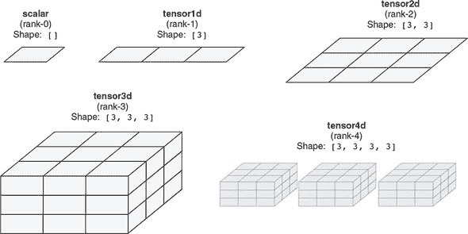
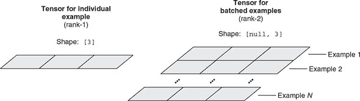
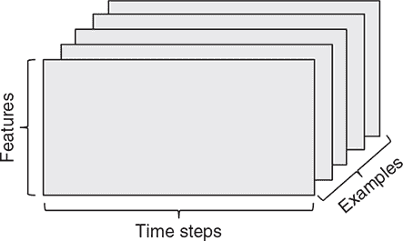
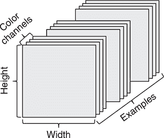
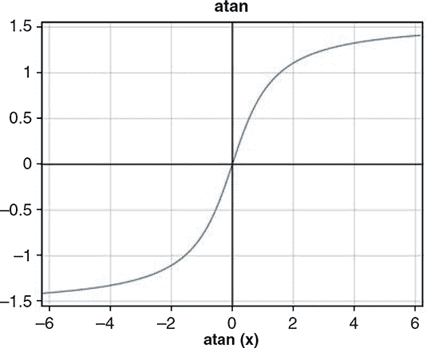

## 附录 B：TensorFlow.js 中张量和操作的快速教程

本附录重点介绍 TensorFlow.js API 中与非`tf.Model`部分有关的内容。虽然`tf.Model`提供了一套完整的方法来训练和评估模型，并将其用于推理，但通常需要使用 TensorFlow.js 中的非`tf.Model`部分来处理`tf.Model`对象。最常见的情况是

+   将您的数据转换为可供`tf.Model`对象输入的张量

+   将`tf.Model`所做的预测数据转换为张量格式，以便其他程序部分可以使用

正如您将看到的，将数据放入和取出张量并不困难，但有一些传统模式和值得注意的点值得指出。

## B.1\. 张量的创建和张量轴约定

请记住，*张量*只是一个数据容器。每个张量都有两个基本属性：数据类型（dtype）和形状。*dtype* 控制张量中存储的值的类型。给定张量只能存储一种类型的值。截至本文撰写时（版本 0.13.5），支持的 dtype 为 float32、int32 和 bool。

*形状*是一个整数数组，指示张量中有多少个元素以及它们是如何组织的。可以将其视为张量的“形状和大小”，即张量作为容器的形状（参见 图 B.1）。

##### 图 B.1\. 秩为 0、1、2、3 和 4 的张量示例



形状的长度被称为张量的*秩*。例如，1D 张量，也称为*向量*，秩为 1。1D 张量的形状是一个包含一个数字的数组，这个数字告诉我们 1D 张量的长度。将秩增加一，我们得到一个 2D 张量，可以将其可视化为 2D 平面上的数字网格（如灰度图像）。2D 张量的形状有两个数字，告诉我们网格的高度和宽度。再增加一秩，我们得到一个 3D 张量。如 图 B.1 中的示例所示，你可以将 3D 张量可视化为 3D 数字网格。3D 张量的形状由三个整数组成；它们告诉我们沿着三个维度的 3D 网格的大小。所以，你看到了规律。秩为 4 的张量（4D 张量）更难以直接可视化，因为我们生活的世界只有三个空间维度。4D 张量经常在许多模型中使用，例如深度卷积网络。TensorFlow.js 支持秩高达 6 的张量。在实践中，秩为 5 的张量仅在某些小众情况下使用（例如涉及视频数据的情况），而秩为 6 的张量甚至更少见。

#### B.1.1\. 标量（秩为 0 的张量）

标量是形状为空数组(`[]`)的张量。它没有轴，始终只包含一个值。可以使用 `tf.scalar()` 函数创建一个新的标量。在 JavaScript 控制台（假设已加载 TensorFlow.js 并在 `tf` 符号处可用）中执行以下操作：

```js
> const myScalar = tf.scalar(2018);[1]
> myScalar.print();
Tensor
    2018
> myScalar.dtype;
"float32"
> myScalar.shape;
[]
> myScalar.rank;
0
```

> ¹
> 
> 请注意，出于空间和清晰起见，我们将跳过由于赋值而产生的 JavaScript 控制台输出行，因为它们对所讨论的问题没有说明性。

我们已创建一个标量张量，其中仅包含值 2018。其形状是空列表，正如预期的那样。它具有默认的 dtype (`"float32"`)。要将 dtype 强制为整数，请在调用 `tf.scalar()` 时提供 `'int32'` 作为额外参数：

```js
> const myIntegerScalar = tf.scalar(2018, 'int32');
> myIntegerScalar.dtype;
"int32"
```

要从张量中获取数据，我们可以使用异步方法`data()`。该方法是异步的，因为一般来说，张量可能被托管在主内存之外，例如在 GPU 上，作为 WebGL 纹理。检索这些张量的值涉及到不一定能立即解决的操作，我们不希望这些操作阻塞主 JavaScript 线程。这就是为什么`data()`方法是异步的。还有一个同步函数通过轮询检索张量的值：`dataSync()`。这种方法很方便，但会阻塞主 JavaScript 线程，所以应该尽量少用（例如，在调试期间）。尽量使用异步的`data()`方法：

```js
> arr = await myScalar.data();
Float32Array [2018]
> arr.length
1
> arr[0]
2018
```

要使用`dataSync()`：

```js
> arr = myScalar.dataSync();
Float32Array [2018]
> arr.length
1
> arr[0]
2018
```

我们看到，对于 float32 类型的张量，`data()`和`dataSync()`方法将值作为 JavaScript 的`Float32Array`原始值返回。如果你期望的是一个普通的数字，这可能有点令人惊讶，但是当考虑到其他形状的张量可能需要返回包含多个数字的容器时，这就更合理了。对于 int32 类型和 bool 类型的张量，`data()`和`dataSync()`分别返回`Int32Array`和`Uint8Array`。

请注意，即使标量始终包含一个元素，反之则不成立。张量的秩大于 0 的张量也可以只有一个元素，只要其形状中的数字乘积为 1 即可。例如，形状为`[1, 1]`的 2D 张量只有一个元素，但是它有两个轴。

#### B.1.2\. tensor1d（秩-1 张量）

1D 张量有时被称为秩-1 张量或向量。1D 张量恰好有一个轴，其形状是长度为 1 的数组。下面的代码将在控制台创建一个向量：

```js
> const myVector = tf.tensor1d([-1.2, 0, 19, 78]);
> myVector.shape;
[4]
> myVector.rank;
1
> await  myVector.data();
Float32Array(4) [-1.2, 0, 19, 78]
```

这个 1D 张量有四个元素，可以称为 4 维向量。不要混淆 4D*向量*和 4D*张量*！4D 向量是一个只有一个轴并且包含确切四个值的 1D 张量，而 4D 张量有四个轴（并且每个轴上可以有任意数量的维度）。维度可以表示沿着特定轴的元素数量（如我们的 4D 向量）或张量中的轴数（例如，4D 张量），这有时可能会令人困惑。在技术上，更正确和不含糊的是指一个秩-4 张量，但是无论如何都常见到模糊的表示法 4D 张量。在大多数情况下，这不应该是个问题，因为它可以根据上下文来消除歧义。

与标量张量一样，您可以使用`data()`和`dataSync()`方法来访问 1D 张量元素的值；例如，

```js
> await myVector.data()
Float32Array(4) [-1.2000000476837158, 0, 19, 78]
```

或者，您可以使用`data()`的同步版本，即`dataSync()`，但要注意，如果可能，应该避免使用`dataSync()`会阻塞 UI 线程：

```js
> myVector.dataSync()
Float32Array(4) [-1.2000000476837158, 0, 19, 78]
```

要访问 1D 张量的特定元素的值，您可以简单地索引到`data()`或`dataSync()`返回的 TypedArray；例如，

```js
> [await myVector.data()][2]
19
```

#### B.1.3\. tensor2d（秩-2 张量）

一个二维张量有两个轴。在某些情况下，一个二维张量被称为*矩阵*，它的两个轴可以被解释为矩阵的行和列索引，分别。您可以将矩阵视为元素的矩形网格（参见图 B.1 的第三面板）。在 TensorFlow.js 中，

```js
> const myMatrix = tf.tensor2d([[1, 2, 3], [40, 50, 60]]);
> myMatrix.shape;
[2, 3]
> myMatrix.rank;
2
```

第一个轴的条目称为*行*，第二个轴的条目称为*列*。在前面的例子中，`[1, 2, 3]` 是第一行，`[1, 40]` 是第一列。重要的是要知道，当使用 `data()` 或 `dataSync()` 返回数据时，数据将以*行优先*的方式作为扁平数组返回。换句话说，第一行的元素将首先出现在 `Float32Array` 中，然后是第二行的元素，依此类推：^([2])

> ²
> 
> 这与一些其他数值框架（如 MATLAB 和 R）中看到的列优先排序不同。

```js
> await myMatrix.data();
Float32Array(6) [1, 2, 3, 40, 50, 60]
```

之前，我们提到 `data()` 和 `dataSync()` 方法，当跟随索引时，可以用于访问一维张量的任何元素的值。当用于二维张量时，索引操作变得繁琐，因为 `data()` 和 `dataSync()` 返回的 TypedArray 会*扁平化*二维张量的元素。例如，为了确定与二维张量中第二行第二列的元素对应的 TypedArray 元素，您必须执行如下算术：

```js
> (await myMatrix.data())[1 * 3 + 1];
50
```

幸运的是，TensorFlow.js 提供了另一组方法，用于将张量的值下载到普通的 JavaScript 数据结构中：`array()` 和 `arraySync()`。与 `data()` 和 `dataSync()` 不同，这些方法返回正确保留原始张量秩和形状的嵌套 JavaScript 数组。例如，

```js
> JSON.stringify(await myMatrix.array())
 "[[1,2,3],[40,50,60]]"
```

要访问第二行第二列的元素，我们只需对嵌套数组进行两次索引：

```js
> (await myMatrix.array())[1][1]
 50
```

这消除了执行索引算术的需要，并且对于更高维度的张量特别方便。`arraySync()` 是 `array()` 的同步版本。与 `dataSync()` 类似，`arraySync()` 可能会阻塞 UI 线程，应谨慎使用。

在 `tf.tensor2d()` 调用中，我们提供了一个嵌套的 JavaScript 数组作为参数。参数由嵌套在另一个数组中的数组行组成。这种嵌套结构由 `tf.tensor2d()` 用于推断二维张量的形状——即有多少行和多少列，分别。使用 `tf.tensor2d()` 创建相同的二维张量的另一种方法是提供元素作为平面（非嵌套）JavaScript 数组，并伴随一个第二个参数，指定二维张量的形状：

```js
> const myMatrix = tf.tensor2d([1, 2, 3, 40, 50, 60], [2, 3]);
> myMatrix.shape;
[2, 3]
> myMatrix.rank;
2
```

在这种方法中，`shape` 参数中所有数字的乘积必须与浮点数组中的元素数相匹配，否则在 `tf.tensor2d()` 调用期间将抛出错误。对于秩高于 2 的张量，创建张量还有两种类似的方法：使用一个嵌套数组作为参数，或者使用一个带有形状参数的平坦数组。在本书的不同示例中，您会看到这两种方法都被使用。

#### B.1.4\. 秩为 3 及更高维度的张量

如果您将几个 2D 张量打包到一个新数组中，您将获得一个 3D 张量，您可以将其想象为元素的立方体（图 B.1 中的第四个面板）。在 TensorFlow.js 中，可以按照以前的模式创建秩为 3 的张量：

```js
> const myRank3Tensor = tf.tensor3d([[[1, 2, 3],
                                      [4, 5, 6]],
                                      [[10, 20, 30],
                                      [40, 50, 60]]]);
> myRank3Tensor.shape;
[2, 2, 3]
> myRank3Tensor.rank;
3
```

另一种执行相同操作的方法是提供一个扁平（非嵌套）值数组，以及一个显式形状：

```js
> const anotherRank3Tensor = tf.tensor3d(
    [1, 2, 3, 4, 5, 6, 7, 8, 9, 10, 11, 12],
    [2, 2, 3]);
```

在这个例子中，`tf.tensor3d()` 函数可以被更通用的 `tf.tensor()` 函数替代。这允许你生成任何秩（rank）的张量，最高可达到 6。在下面的示例中，我们创建了一个秩为 3 和一个秩为 6 的张量：

```js
> anotherRank3Tensor = tf.tensor(
    [1, 2, 3, 4, 5, 6, 7, 8, 9, 10, 11, 12],
    [2, 2, 3]);
> anotherRank3Tensor.shape;
[2, 2, 3]
> anotherRank3Tensor.rank;
3

> tinyRank6Tensor = tf.tensor([13], [1, 1, 1, 1, 1, 1]);
> tinyRank6Tensor.shape;
[1, 1, 1, 1, 1, 1]
> tinyRank6Tensor.rank;
6
```

#### B.1.5\. 数据批次的概念

在实践中，在深度学习中你将遇到的所有张量中，第一个轴（轴 0，因为索引从 0 开始）几乎总是*批处理轴*（有时称为*样本轴*或*批处理维度*）。因此，一个模型作为输入获取的实际张量的秩比单个输入特征的秩高 1。这一点贯穿于本书中所有 TensorFlow.js 模型。第一个维度的大小等于批次中的示例数，称为*批处理大小*。例如，在第三章（清单 3.9）中的鸢尾花分类示例中，每个示例的输入特征由表示为长度为 4 的向量的四个数字组成（形状为 `[4]` 的 1D 张量）。因此，鸢尾花分类模型的输入是 2D 的，形状为 `[null, 4]`，其中第一个 null 值表示模型运行时将确定的批处理大小（见图 B.2）。这种批处理约定也适用于模型的输出。例如，鸢尾花分类模型为每个个别输入示例输出一个三种可能的鸢尾花类型的独热编码，这是一个形状为 `[3]` 的 1D 张量。但是，模型的实际输出形状是 2D 的，形状为 `[null, 3]`，其中第一个 null 值是待确定的批处理大小。

##### 图 B.2\. 单个示例（左）和批示例（右）的张量形状。批示例的张量比单个示例的张量的秩高一级，并且是`tf.Model`对象的`predict()`、`fit()`和`evaluate()`方法所接受的格式。批示例张量的形状中的`null`表示张量的第一维具有一个未确定的大小，在对上述方法进行实际调用时可以是任何正整数。



#### B.1.6\. 张量的真实例子

让我们通过几个与本书中遇到的类似的例子使张量更加具体化。你将操作的数据几乎总是属于以下类别之一。在前面的讨论中，我们遵循批处理约定，并始终将批次中的示例数（`numExamples`）作为第一个轴包括进去：

+   *向量数据*—形状为`[numExamples, features]`的 2D 张量

+   *时间序列（序列）数据*—形状为`[numExamples, timesteps, features]`的 3D 张量

+   *图像*—形状为`[numExamples, height, width, channels]`的 4D 张量

+   *视频*—形状为`[numExamples, frame, height, width, channels]`的 5D 张量

##### 向量数据

这是最常见的情况。在这样的数据集中，每个单独的数据样本可以被编码为一个向量，因此数据的批将被编码为一个秩为 2 的张量，其中第一个轴是样本轴，第二个轴是特征轴。

让我们看两个例子：

+   一个人口数据集，其中我们考虑每个人的年龄、邮政编码和收入。每个人可以被描述为一个包含 3 个值的向量，因此一个包含 10 万人的完整数据集可以存储在形状为`[100000, 3]`的 2D 张量中。

+   一个文本文档数据集，其中我们通过每个单词出现的次数来表示每个文档（例如，从包含 20000 个最常见单词的英语词典中）。每个文档可以被编码为一个包含 20000 个值的向量（词典中每个单词的计数），因此 500 个文档的批可以存储在形状为`[500, 20000]`的张量中。

##### 时间序列或序列数据

每当数据中涉及时间（或者序列顺序的概念）时，将其存储在具有显式时间轴的 3D 张量中是有意义的。每个样本被编码为一系列向量（一个 2D 张量），因此样本批将被编码为 3D 张量（参见图 B.3）。

##### 图 B.3\. 一个 3D 时间序列数据张量



几乎总是按照惯例，时间轴是第二个轴（索引为 1 的轴），如下例所示：

+   一个股票价格数据集。每分钟我们存储股票的当前价格，过去一分钟内的最高价格和最低价格。因此，每分钟被编码为一个三个值的向量。由于一个小时有 60 分钟，一小时的交易被编码为一个形状为 `[60, 3]` 的二维张量。如果我们有一个包含 250 个独立小时序列的数据集，数据集的形状将是 `[250, 60, 3]`。

+   一个推文数据集，其中我们将每个推文编码为由 128 个唯一字符组成的 280 个字符序列。在这种设置中，每个字符都可以编码为大小为 128 的二进制向量（除了在对应字符的索引处有一个 1 的条目外，全部为零）。然后，每个字符可以被视为一个形状为 `[280, 128]` 的二阶张量。一个包含 100 万条推文的数据集可以存储在一个形状为 `[1000000, 280, 128]` 的张量中。

##### 图像数据

图像的数据通常具有三个维度：高度、宽度和颜色深度。尽管灰度图像只有一个颜色通道，但按照惯例，图像张量始终是三阶的，对于灰度图像有一个一维的颜色通道。因此，一个大小为 256 × 256 的 128 个灰度图像批次将存储在一个形状为 `[128, 256, 256, 1]` 的张量中，而一个包含 128 个彩色图像的批次将存储在一个形状为 `[128, 256, 256, 3]` 的张量中（参见图 B.4）。这称为 NHWC 约定（有关更多详情，请参见第四章）。

##### 图 B.4\. 一个 4D 图像数据张量



一些框架在高度和宽度之前放置通道维度，使用 NCHW 约定。在本书中，我们不使用这个约定，但在其他地方看到形状如 `[128, 3, 256, 256]` 的图像张量也不要感到惊讶。

##### 视频数据

原始视频数据是少数几种常见的真实世界数据之一，你需要使用到五维张量。视频可以理解为一系列帧，每一帧都是一幅彩色图像。由于每一帧可以存储在一个三维张量 `[height, width, colorChannel]` 中，一系列帧可以存储在一个四维张量 `[frames, height, width, colorChannel]` 中，因此一批不同的视频将存储在一个五维张量中，形状为 `[samples, frames, height, width, colorChannel]`。

例如，一个 60 秒长，144 × 256 分辨率的 YouTube 视频剪辑，每秒采样 4 帧，将有 240 帧。四个这样的视频剪辑批次将存储在一个形状为 `[4, 240, 144, 256, 3]` 的张量中。总共有 106,168,320 个值！如果张量的数据类型为 `'float32'`，那么每个值将以 32 位存储，因此张量将表示 405 MB。这是大量的数据！你在现实生活中遇到的视频要轻得多，因为它们不是以 float32 存储，并且通常被大幅压缩（例如 MPEG 格式）。

#### B.1.7\. 从张量缓冲区创建张量

我们已经展示了如何使用诸如 `tf.tensor2d()` 和 `tf.tensor()` 等函数从 JavaScript 数组创建张量。为此，您必须先确定所有元素的值，并在之前的 JavaScript 数组中设置它们。但是，在某些情况下，从头开始创建这样一个 JavaScript 数组有点繁琐。例如，假设您要创建一个 5 × 5 矩阵，其中所有的非对角线元素都为零，而对角线元素形成一个递增序列，等于行或列索引加 1：

```js
[[1, 0, 0, 0, 0],
 [0, 2, 0, 0, 0],
 [0, 0, 3, 0, 0],
 [0, 0, 0, 4, 0],
 [0, 0, 0, 0, 5]]
```

如果要创建一个满足此要求的嵌套 JavaScript 数组，代码将如下所示：

```js
const n = 5;
const matrixArray = [];
for (let i = 0; i < 5; ++i) {
  const row = [];
  for (let j = 0; j < 5; ++j) {
    row.push(j === i ? i + 1 : 0);
  }
  matrixArray.push(row);
}
```

最后，你可以把嵌套的 JavaScript 数组 `matrixArray` 转换成一个二维张量：

```js
> const matrix = tf.tensor2d(matrixArray);
```

这段代码看起来有点繁琐。它涉及两个嵌套的 `for` 循环。有没有简化它的方法？答案是有：我们可以使用 `tf.tensorBuffer()` 方法创建一个 `TensorBuffer`。`TensorBuffer` 对象允许您通过索引指定其元素，并使用 `set()` 方法更改其值。这与 TensorFlow.js 中的张量对象不同，后者的元素值是*不可变的*。当您完成设置 `TensorBuffer` 的所有元素的值后，可以通过其 `toTensor()` 方法方便地将 `TensorBuffer` 转换为实际的张量对象。因此，如果我们使用 `tf.tensorBuffer()` 来实现与上述代码相同的张量创建任务，新代码将如下所示

```js
const buffer = tf.tensorBuffer([5, 5]);   ***1***
for (let i = 0; i < 5; ++i) {
  buffer.set(i +  1, i, i);               ***2***
}
const matrix = buffer.toTensor();         ***3***
```

+   ***1*** 创建 TensorBuffer 时指定张量形状。创建后，TensorBuffer 的所有值都为零。

+   ***2*** 第一个参数是所需的值，而其余的参数是要设置的元素的索引。

+   ***3*** 从 TensorBuffer 获取实际的张量对象

因此，通过使用 `tf.tensorBuffer()`，我们将代码行数从 10 减少到 5。

#### B.1.8\. 创建全零和全一张量

通常希望创建一个给定形状的全零张量。你可以使用 `tf.zeros()` 函数来实现这一点。调用该函数时，将期望的形状作为输入参数提供；例如，

```js
> const x = tf.zeros([2, 3, 3]);
> x.print();
Tensor
    [[[0, 0, 0],
      [0, 0, 0],
      [0, 0, 0]],
      [[0, 0, 0],
      [0, 0, 0],
      [0, 0, 0]]]
```

创建的张量具有默认的 dtype（float32）。要创建其他 dtype 的全零张量，请将 dtype 指定为 `tf.zeros()` 的第二个参数。

相关的函数是 `tf.zerosLike()`，它让您可以创建一个与现有张量具有相同形状和 dtype 的全零张量。例如，

```js
> const y = tf.zerosLike(x);
```

等同于

```js
> const y = tf.zeros(x.shape, x.dtype);
```

但更简洁。

类似的方法允许你创建所有元素都相等的张量：`tf.ones()` 和 `tf.onesLike()`。

#### B.1.9\. 创建随机值张量

创建具有随机值的张量在许多情况下都很有用，比如权重的初始化。创建具有随机值张量最常用的函数是 `tf.randomNormal()` 和 `tf.randomUniform()`。这两个函数具有类似的语法，但导致元素值的分布不同。顾名思义，`tf.randomNormal()` 返回的张量中的元素值遵循正态（高斯）分布。如果你只用一个形状参数调用该函数，你会得到一个元素遵循 *单位* 正态分布的张量：均值 = 0，标准差（SD）= 1。例如，

> ³
> 
> 对于熟悉统计学的读者，元素值彼此独立。

```js
> const x = tf.randomNormal([2, 3]);
> x.print():
Tensor
    [[-0.2772508, 0.63506  , 0.3080665],
     [0.7655841 , 2.5264773, 1.142776 ]]
```

如果你希望正态分布有一个非默认的均值或标准差，你可以将它们作为第二和第三个输入参数提供给 `tf.randomUniform()`。例如，以下调用创建了一个元素值遵循均值 = -20，标准差 = 0.6 的正态分布的张量：

```js
> const x = tf.randomNormal([2, 3], -20, 0.6);
> x.print();
Tensor
    [[-19.0392246, -21.2259483, -21.2892818],
     [-20.6935596, -20.3722878, -20.1997948]]
```

`tf.randomUniform()` 允许你创建具有均匀分布元素值的随机张量。默认情况下，均匀分布是单位分布，即下界为 0，上界为 1：

```js
> const x = tf.randomUniform([3, 3]);
> x.print();
Tensor
    [[0.8303654, 0.3996494, 0.3808384],
     [0.0751046, 0.4425731, 0.2357403],
     [0.4682371, 0.0980235, 0.7004037]]
```

如果你想让元素值遵循非单位均匀分布，你可以将下界和上界指定为 `tf.randomUniform()` 的第二和第三个参数，例如，

```js
> const x = tf.randomUniform([3, 3], -10, 10);
```

创建一个值在 `[-10, 10)` 区间内随机分布的张量：

```js
> x.print();
Tensor
    [[-7.4774652, -4.3274679, 5.5345411 ],
     [-6.767087 , -3.8834026, -3.2619202],
     [-8.0232048, 7.0986223 , -1.3350322]]
```

`tf.randomUniform()` 可用于创建具有随机值的 int32 类型张量。这在你想要生成随机标签的情况下非常有用。例如，以下代码创建了一个长度为 10 的向量，其中的值随机抽取自整数 0 到 100（区间 `[0, 100)`）：

```js
> const x = tf.randomUniform([10], 0, 100, 'int32');
> x.print();
Tensor
    [92, 16, 65, 60, 62, 16, 77, 24, 2, 66]
```

注意，在这个例子中 `'int32'` 参数是关键。没有它，你得到的张量将包含 float32 值而不是 int32 值。

## B.2\.基础张量操作

如果我们无法在张量上执行操作，那么张量就不会有什么用处。TensorFlow.js 支持大量的张量操作。您可以在 [`js.tensorflow.org/api/latest`](https://js.tensorflow.org/api/latest) 查看它们的列表以及它们的文档。描述每一个操作都会很枯燥而冗余。因此，我们将突出一些常用的操作作为示例。常用操作可以分为两种类型：一元和二元。*一元运算*以一个张量作为输入并返回一个新张量，而*二元运算*以两个张量作为输入并返回一个新张量。

#### B.2.1\.一元操作

让我们考虑将张量取反的操作——即使用每个输入张量元素的负值——并形成一个具有相同形状和数据类型的新张量。这可以使用 `tf.neg()` 完成：

```js
> const x = tf.tensor1d([-1, 3, 7]);
> const y = tf.neg(x);
> y.print();
Tensor
    [1, -3, -7]
```

##### 函数式 API 与链式 API

在上一个示例中，我们使用张量`x`作为输入参数调用函数`tf.neg()`。TensorFlow.js 提供了一种更简洁的执行数学等价操作的方法：使用张量对象本身的`neg()`方法，而不是`tf.*`命名空间下的函数：

```js
> const y = x.neg();
```

在这个简单的例子中，由于新 API 的存在，由于键入次数较少而节省的打字量可能不会显得那么令人印象深刻。然而，在需要一个接一个地应用多个操作的情况下，第二个 API 将比第一个 API 表现出更大的优势。例如，考虑一个假设的算法，您想要将`x`取反，计算倒数（每个元素都被 1 除），并在上面应用`relu`激活函数。这是在第一个 API 中实现算法所需的代码：

```js
> const y = tf.relu(tf.reciprocal(tf.neg(x)));
```

相比之下，在第二个 API 中，实现代码如下：

```js
> const y = x.neg().reciprocal().relu();
```

第二种实现在以下几个方面优于第一种实现：

+   字符较少，输入更少，因此制造错误的机会更小。

+   没有必要平衡嵌套的开放和关闭括号（尽管大多数现代代码编辑器都会帮助您完成此操作）。

+   更重要的是，方法出现在代码中的顺序与底层数学操作发生的顺序相匹配。（注意在第一种实现中，顺序被颠倒了。）这在第二种实现中会导致更好的代码可读性。

我们将第一个 API 称为*函数式*API，因为它基于在`tf.`命名空间下调用函数。第二个 API 将称为*链式*API，因为操作按照链式顺序出现（正如您在前面的示例中所看到的）。在 TensorFlow.js 中，大多数操作都可以作为`tf.*`命名空间下的函数版本和作为张量对象方法的链式版本来访问。您可以根据自己的需求选择这两个 API。在本书中，我们在不同的地方同时使用这两个 API，但对于涉及连续操作的情况，我们更偏向于使用链式 API。

##### 元素级与约减操作

我们提到的一元操作的示例（`tf.neg()`、`tf.reciprocal()` 和 `tf.relu()`）具有一个共同特点，即操作独立地应用在输入张量的每个元素上。因此，这类操作返回的张量保留了输入张量的形状。然而，在 TensorFlow.js 中，其他一元操作会导致张量形状比原来的更小。在张量形状的背景下，"更小" 是什么意思呢？在某些情况下，它表示较低的秩。例如，一元操作可能返回一个标量（秩为 0 的张量），而原来的张量是一个 3D 张量（秩为 3）。在其他情况下，它表示某个维度的大小比原来的更小。例如，一元操作可能对一个形状为`[3, 20]`的输入返回一个形状为`[3, 1]`的张量。无论形状如何收缩，这些操作都被称为*约减操作*。

`tf.mean()`是最常用的约减操作之一。在链式 API 中，它作为`Tensor`类的`mean()`方法出现。当没有附加参数时，它计算输入张量的所有元素的算术平均值，而无论其形状如何，并返回一个标量。在链式 API 中，使用它的方式如下所示：

```js
> const x = tf.tensor2d([[0, 10], [20, 30]]);
> x.mean().print();
Tensor
    15
```

有时，我们需要单独计算 2D 张量（矩阵）的每一行的均值，而不是整个张量上的均值。可以通过向`mean()`方法提供附加参数来实现：

```js
> x.mean(-1).print();
Tensor
    [5, 25]
```

参数`-1`表示`mean()`方法应该计算张量的最后一个维度的算术平均值。([4]) 这个维度被称为*约减维度*，因为它将在输出张量中被“减少”，输出张量的秩变为 1。指定约减维度的另一种方式是使用实际的维度索引：

> ⁴
> 
> 这遵循了 Python 的索引约定。

```js
> x.mean(1).print();
```

请注意，`mean()`还支持多个约减维度。例如，如果您有一个形状为`[10, 6, 3]`的 3D 张量，并且希望计算其算术平均值在最后两个维度上进行计算，得到一个形状为`[10]`的 1D 张量，则可以调用`mean()`方法，如`x.mean([-2, -1])`或`x.mean([1, 2])`。我们在附录的最后给出这个方法作为一个练习。

其他经常使用的约简一元操作包括

+   `tf.sum()` 几乎与 `tf.mean()` 相同，但它计算的是和，而不是算术平均值，而是元素。

+   `tf.norm()`，用于计算元素的范数。有不同类型的范数。例如，1-范数是元素绝对值的总和。2-范数通过对平方元素求和然后取平方根来计算。换句话说，它是欧几里德空间中向量的长度。`tf.norm()`可用于计算一组数字的方差或标准差。

+   `tf.min()` 和 `tf.max()`，分别计算元素的最小值和最大值。

+   `tf.argMax()` 返回沿减少轴的最大元素的索引。此操作经常用于将分类模型的概率输出转换为获胜类别的索引（例如，请参阅第 3.3.2 节中的鸢尾花分类问题）。`tf.argMin()` 提供了类似的功能以找到最小值。

我们提到逐元素操作保留输入张量的形状。但反之不成立。有些保持形状的操作不是逐元素的。例如，`tf.transpose()` 操作可以执行矩阵转置，其中输入 2D 张量中的索引 `[i, j]` 的元素被映射到输出 2D 张量中的索引 `[j, i]`。如果输入是一个方阵，`tf.transpose()` 的输入和输出形状将相同，但这不是一个逐元素操作，因为输出张量中 `[i, j]` 处的值不仅取决于输入张量中 `[i, j]` 处的值，而是取决于其他索引处的值。

#### B.2.2\. 二元操作

与一元操作不同，二元操作需要两个输入参数。`tf.add()` 可能是最常用的二元操作。它可能也是最简单的，因为它只是简单地将两个张量相加。例如，

```js
> const x = tf.tensor2d([[0, 2], [4, 6]]);
> const y = tf.tensor2d([[10, 20], [30, 46]]);
> tf.add(x, y).print();
Tensor
    [[10, 22],
     [34, 52]]
```

类似的二元操作包括

+   `tf.sub()` 用于两个张量的减法

+   `tf.mul()` 用于两个张量的乘法

+   `tf.matMul()` 用于计算两个张量之间的矩阵积

+   `tf.logicalAnd()`、`tf.logicalOr()` 和 `tf.logicalXor()` 用于在布尔类型张量上执行 AND、OR 和 XOR 操作。

一些二元操作支持 *广播*，或者对不同形状的两个输入张量进行操作，并根据某种规则将较小形状的输入元素应用于另一个输入的多个元素。详细讨论请参阅信息框 2.4 中的第二章。

#### B.2.3\. 张量的拼接和切片

一元和二元操作是张量输入张量输出（TITO）的，它们以一个或多个张量作为输入，并返回一个张量作为输出。 TensorFlow.js 中的一些常用操作不是 TITO，因为它们将张量与另一个非张量参数一起作为输入。`tf.concat()`可能是这类函数中最常用的函数。它允许你将多个形状兼容的张量连接成一个单一的张量。只有当张量的形状满足某些约束条件时才能进行连接。例如，可以将`[5, 3]`张量和`[4, 3]`张量沿第一个轴合并以得到`[9, 3]`张量，但如果它们的形状分别为`[5, 3]`和`[4, 2]`，则无法将它们组合在一起！在给定的形状合法性的情况下，你可以使用`tf.concat()`函数来连接张量。例如，以下代码沿第一个轴连接一个全零`[2, 2]`张量和一个全一`[2, 2]`张量，则得到一个`[4, 2]`张量，其中“顶部”是全零，而“底部”则是全一：

```js
> const x = tf.zeros([2, 2]);
> const y = tf.ones([2, 2]);
> tf.concat([x, y]).print();
Tensor
    [[0, 0],
     [0, 0],
     [1, 1],
     [1, 1]]
```

由于两个输入张量的形状相同，可以以不同的方式对它们进行连接：即沿第二个轴进行连接。轴可以作为第二个输入参数传递给`tf.concat()`。这将给我们一个`[2, 4]`张量，在这个张量中，左半部分都是零，右半部分都是一：

```js
> tf.concat([x, y], 1).print();
Tensor
    [[0, 0, 1, 1],
     [0, 0, 1, 1]]
```

除了将多个张量连接成一个以外，有时我们希望执行“反向”操作，检索张量的一部分。例如，假设你创建了一个形状为`[3, 2]`的二维张量（矩阵），

```js
> const x = tf.randomNormal([3, 2]);
> x.print();
Tensor
    [[1.2366893 , 0.6011682 ],
     [-1.0172369, -0.5025602],
     [-0.6265425, -0.0009868]]
```

而你想要获取矩阵的第二行。为此，可以使用`tf.slice()`的链式版本：

```js
> x.slice([1, 0], [1, 2]).print();
Tensor
     [[-1.0172369, -0.5025602],]
```

`slice()`的第一个参数指示我们想要的输入张量部分从第一个维度的索引 1 和第二个维度的索引 0 开始。换句话说，它应该从第二行和第一列开始，因为我们在这里处理的二维张量是一个矩阵。第二个参数指定所需输出的形状：`[1, 2]`或在矩阵语言中，1 行 2 列。

如您所看到的，通过查看打印的值，我们成功地检索了 3×2 矩阵的第二行。输出的形状与输入的秩相同（2），但第一个维度的大小为 1。在这种情况下，我们检索第二个维度的全部（所有列）和第一个维度的子集（行的一部分）。这是一种特殊情况，可以使用更简单的语法实现相同的效果：

```js
> x.slice(1, 1).print();
Tensor
     [[-1.0172369, -0.5025602],]
```

在这个更简单的语法中，我们只需要指定请求的块沿第一个维度的起始索引和大小。如果将第二个输入参数传递为 1 而不是 2，则输出将包含矩阵的第一行和第二行：

```js
> x.slice(1, 2).print();
Tensor
    [[-1.0172369, -0.5025602],
     [-0.6265425, -0.0009868]]
```

正如你可能猜到的那样，这种更简单的语法与批处理约定有关。它使得从批处理张量中获取单个示例的数据更容易。

但是如果我们想要访问矩阵的 *列* 呢？在这种情况下，我们将不得不使用更复杂的语法。例如，假设我们想要矩阵的第二列。可以通过以下方式实现

```js
> x.slice([0, 1], [-1, 1]).print();
Tensor
    [[0.6011682 ],
     [-0.5025602],
     [-0.0009868]]
```

这里，第一个参数（`[0, 1]`）是表示我们想要的切片的起始索引的数组。它是沿第一维的第一个索引和第二维的第二个索引。更简单地说，我们希望我们的切片从第一行和第二列开始。第二个参数（`[-1, 1]`）指定了我们想要的切片的大小。第一个数字（-1）表示我们想要沿第一维的所有索引（我们想要所有起始行），而第二个数字（1）表示我们只想要沿第二维的一个索引（我们只想要一列）。结果是矩阵的第二列。

看一下 `slice()` 的语法，你可能已经意识到 `slice()` 不仅限于检索行或列。事实上，如果开始索引和大小数组被正确指定，它足够灵活，可以让你检索输入二维张量中的任何“子矩阵”（矩阵内的任何连续矩形区域）。更一般地，对于秩大于 0 的张量，`slice()` 允许你检索输入张量中的任何连续子张量。我们将这留作附录末尾的练习。

除了 `tf.slice()` 和 `tf.concat()`，另外两个经常用于将张量分割成部分或将多个张量合并成一个的操作是 `tf.unstack()` 和 `tf.stack()`。 `tf.unstack()` 将张量沿着第一维分割成多个“pieces”。每个片段在第一维上的尺寸为 1。例如，我们可以使用 `tf.unstack()` 的链式 API：

```js
> const x = tf.tensor2d([[1, 2], [3, 4], [5, 6]]);
> x.print();
Tensor
    [[1, 2],
     [3, 4],
     [5, 6]]
> const pieces = x.unstack();
> console.log(pieces.length);
  3
> pieces[0].print();
Tensor
    [1, 2]
> pieces[1].print();
Tensor
    [3, 4]
> pieces[2].print();
Tensor
    [5, 6]
```

你可能已经注意到，`unstack()` 返回的“pieces”比输入张量的秩少一。

`tf.stack()` 是 `tf.unstack()` 的反向操作。顾名思义，它将具有相同形状的多个张量“堆叠”到一个新张量中。根据先前的示例代码片段，我们将片段重新堆叠在一起：

```js
> tf.stack(pieces).print();
Tensor
    [[1, 2],
     [3, 4],
     [5, 6]]
```

`tf.unstack()` 用于从批处理张量中获取与各个示例对应的数据；`tf.stack()` 用于将各个示例的数据合并成一个批处理张量。

## B.3\. TensorFlow.js 中的内存管理：`tf.dispose()`和`tf.tidy()`

在 TensorFlow.js 中，如果你直接处理张量对象，你需要对它们执行内存管理。特别是在创建和使用张量后，张量需要被释放，否则它将继续占用分配给它的内存。如果未释放的张量数量过多或者总大小过大，它们最终将导致浏览器标签页耗尽 WebGL 内存或导致 Node.js 进程耗尽系统或 GPU 内存（取决于是否使用 tfjs-node 的 CPU 或 GPU 版本）。TensorFlow.js 不会自动对用户创建的张量进行垃圾回收。[[5]](#app02fn5) 这是因为 JavaScript 不支持对象终结。TensorFlow.js 提供了两个内存管理函数：`tf.dispose()`和`tf.tidy()`。

> ⁵
> 
> 然而，在 TensorFlow.js 函数和对象方法中创建的张量由库本身管理，因此你不需要担心在调用这些函数或方法时包装它们在`tf.tidy()`中。其中的示例函数包括`tf.confusionMatrix()`、`tf.Model.predict()`和`tf.Model.fit()`。

例如，考虑使用`for`循环对 TensorFlow.js 模型进行重复推理的示例：

```js
const model = await tf.loadLayersModel(                                    ***1***
    'https://storage.googleapis.com/tfjs-models/tfjs/iris_v1/model.json'); ***1***
const x = tf.randomUniform([1, 4]);                                        ***2***
for (let i = 0; i < 3; ++i) {
  const y = model.predict(x);
  y.print();
  console.log(`# of tensors: ${tf.memory().numTensors}` );                 ***3***
}
```

+   ***1*** 从网络上加载预先训练好的模型

+   ***2*** 创建一个虚拟输入张量

+   ***3*** 检查当前已分配张量的数量

输出将如下所示

```js
Tensor
     [[0.4286409, 0.4692867, 0.1020722],]
# of tensors: 14
Tensor
     [[0.4286409, 0.4692867, 0.1020722],]
# of tensors: 15
Tensor
     [[0.4286409, 0.4692867, 0.1020722],]
# of tensors: 16
```

正如你在控制台日志中看到的那样，每次调用`model.predict()`都会生成一个额外的张量，在迭代结束后不会被释放。如果允许`for`循环运行足够数量的迭代，它最终会导致内存不足错误。这是因为输出张量`y`没有被正确释放，导致张量内存泄漏。有两种方法可以修复这个内存泄漏。

在第一种方法中，你可以在不再需要输出张量时调用`tf.dispose()`：

```js
for (let i = 0; i < 3; ++i) {
  const y = model.predict(x);
  y.print();
  tf.dispose(y);                                          ***1***
  console.log(`# of tensors: ${tf.memory().numTensors}` );
}
```

+   ***1*** 在使用后释放输出张量

在第二种方法中，你可以在`for`循环的主体部分使用`tf.tidy()`：

```js
for (let i = 0; i < 3; ++i) {
  tf.tidy(() => {                          ***1***
    const y = model.predict(x);
    y.print();
    console.log(`# of tensors: ${tf.memory().numTensors}` );
  });
}
```

+   ***1*** `tf.tidy()`自动释放传递给它的函数中创建的所有张量，除了由该函数返回的张量。

无论选用哪种方法，你应该看到迭代中分配的张量数量变为常数，表明不再有张量内存泄漏。哪种方法应该优先使用呢？通常，你应该使用`tf.tidy()`（第二种方法），因为它消除了跟踪需要释放哪些张量的需要。`tf.tidy()`是一个智能函数，它释放传递给它的匿名函数中创建的所有张量（除了由该函数返回的张量-稍后再说），即使这些张量没有绑定到任何 JavaScript 对象。例如，假设我们稍微修改先前的推理代码，以便使用`argMax()`获得获胜类别的索引：

```js
const model = await tf.loadLayersModel(
    'https://storage.googleapis.com/tfjs-models/tfjs/iris_v1/model.json');
const x = tf.randomUniform([1, 4]);
for (let i = 0; i < 3; ++i) {
  const winningIndex =
           model.predict(x).argMax().dataSync()[0];
  console.log(`winning index: ${winningIndex}`);
  console.log(`# of tensors: ${tf.memory().numTensors}` );
}
```

当这段代码运行时，你会发现它每次迭代泄漏两个张量：

```js
winning index: 0
# of tensors: 15
winning index: 0
# of tensors: 17
winning index: 0
# of tensors: 19
```

为什么每次迭代泄漏两个张量？因为这行代码：

```js
   const winningIndex =
       model.predict(x).argMax().dataSync()[0];
```

生成两个新的张量。第一个是`model.predict()`的输出，第二个是`argMax()`的返回值。这两个张量都没有绑定到任何 JavaScript 对象上。它们被创建后立即使用。这两个张量在某种意义上“丢失”——没有 JavaScript 对象可供您用来引用它们。因此，`tf.dispose()`不能用于清理这两个张量。但是，`tf.tidy()`仍然可以用来修复内存泄漏，因为它会对新张量执行簿记，无论它们是否绑定到 JavaScript 对象上：

```js
const model = await tf.loadLayersModel(
    'https://storage.googleapis.com/tfjs-models/tfjs/iris_v1/model.json');
const x = tf.randomUniform([1, 4]);
for (let i = 0; i < 3; ++i) {
  tf.tidy(() => {                                                  ***1***
    const winningIndex = model.predict(x).argMax().dataSync()[0];
    console.log(`winning index: ${winningIndex}`);
    console.log(`# of tensors: ${tf.memory().numTensors}` );       ***1***
  });
}
```

+   ***1*** `tf.tidy()`会自动处理传递给它作为参数的匿名函数中创建的张量，即使这些张量没有绑定到 JavaScript 对象上。

`tf.tidy()`的示例用法操作的是不返回任何张量的函数。如果该函数返回张量，则不希望将它们处理掉，因为它们需要在后续使用。这种情况在使用 TensorFlow.js 提供的基本张量操作编写自定义张量操作时经常遇到。例如，假设我们想编写一个函数来计算输入张量的标准化值——即，减去平均值并将标准差缩放为 1 的张量：

```js
function normalize(x) {
  const mean = x.mean();
  const sd = x.norm(2);
  return x.sub(mean).div(sd);
}
```

这个实现有什么问题？^([6]) 就内存管理而言，它泄漏了三个张量：1）均值，2）SD 和 3）一个更微妙的泄漏：`sub()`调用的返回值。为了修复内存泄漏问题，我们将函数体包装在`tf.tidy()`中：

> ⁶
> 
> 这个实现还有其他问题。例如，它没有对输入张量进行健全性检查，以确保它至少有两个元素，使 SD 不为零，否则将导致除以零和无限结果。但是这些问题与此处的讨论无直接关联。

```js
function normalize(x) {
  return tf.tidy(() => {
    const mean = x.mean();
    const sd = x.norm(2);
    return x.sub(mean).div(sd);
       });
}
```

在这里，`tf.tidy()`为我们完成了三个操作：

+   它会自动处理在匿名函数中创建但未被它返回的张量，包括之前提到的所有泄漏。我们在之前的例子中已经看到这一点了。

+   它检测到`div()`调用的输出由匿名函数返回，因此将其转发到自己的返回值。

+   在此期间，它将避免处理该特定张量，以便它可以在`tf.tidy()`调用之外使用。

如我们所见，`tf.tidy()` 是一种智能而强大的内存管理函数。它在 TensorFlow.js 代码库中被广泛使用。在本书的示例中，您还将经常看到它。然而，它有以下重要限制：作为参数传递给 `tf.tidy()` 的匿名函数 *不* 能是异步的。如果您有一些需要内存管理的异步代码，您应该使用 `tf.dispose()` 并手动跟踪待处理的张量。在这种情况下，您可以使用 `tf.memory().numTensor` 来检查泄漏张量的数量。一个好的做法是编写单元测试来断言不存在内存泄漏。

## B.4\. 计算梯度

这一部分适用于对在 TensorFlow.js 中执行导数和梯度计算感兴趣的读者。对于本书中的大多数深度学习模型，导数和梯度的计算都是在`model.fit()`和`model.fitDataset()`中自动完成的。然而，对于某些问题类型，比如在第七章中找到卷积滤波器的最大激活图像和在第十一章中的 RL，需要显式地计算导数和梯度。TensorFlow.js 提供了支持此类用例的 API。让我们从最简单的情景开始，即一个接受单个输入张量并返回单个输出张量的函数：

```js
const f = x => tf.atan(x);
```

为了计算函数(`f`)相对于输入(`x`)的导数，我们使用`tf.grad()`函数：

```js
const df = tf.grad(f);
```

注意，`tf.grad()`不会立即给出导数的值。相反，它会给出一个*函数*，即原始函数(`f`)的导数。您可以使用具体的`x`值调用该函数(`df`)，这时您就会得到`df/dx`的值。例如，

```js
const x = tf.tensor([-4, -2, 0, 2, 4]);
df(x).print();
```

它给出了一个输出，正确反映了在 x 值为-4、-2、0、2 和 4 时`atan()`函数的导数（参见图 B.5）：

```js
Tensor
    [0.0588235, 0.2, 1, 0.2, 0.0588235]
```

##### 图 B.5\. 函数`atan(x)`的图表



`tf.grad()`仅适用于具有单个输入张量的函数。如果您有一个具有多个输入的函数怎么办？让我们考虑一个简单的例子`h(x, y)`，它只是两个张量的乘积：

```js
const h = (x, y) => x.mul(y);
```

`tf.grads()`（带有名称中的“s”）生成一个函数，该函数返回输入函数相对于所有参数的偏导数：

```js
const dh = tf.grads(h);
const dhValues = dh([tf.tensor1d([1, 2]), tf.tensor1d([-1, -2])]);
dhValues[0].print();
dhValues[1].print();
```

这给出了结果

```js
Tensor
    [-1, -2]
Tensor
    [1, 2]
```

这些结果是正确的，因为相对于*x*的偏导数`*`*y*是*y*，相对于*y*的偏导数是*x*。

由`tf.grad()`和`tf.grads()`生成的函数只给出导数，而不是原始函数的返回值。在*h*(*x*, *y*)的示例中，如果我们不仅想要得到导数，还想要*h*的值，那么可以使用`tf.valueAndGrads()`函数：

```js
const vdh = tf.valueAndGrads(h);
const out = vdh([tf.tensor1d([1, 2]), tf.tensor1d([-1, -2])]);
```

输出(`out`)是一个具有两个字段的对象：`value`，即给定输入值时*h*的值，以及`grads`，其格式与由`tf.grads()`生成的函数的返回值相同，即偏导数张量的数组：

```js
out.value.print();
out.grads[0].print();
out.grads[1].print();

Tensor
    [-1, -4]
Tensor
    [-1, -2]
Tensor
    [1, 2]
```

讨论的 API 都涉及到计算函数相对于其显式参数的导数。然而，在深度学习中的一个常见情景是函数在计算中使用了权重。这些权重表示为 `tf.Variable` 对象，并且*不*作为参数明确传递给函数。对于这样的函数，我们经常需要在训练过程中计算相对于权重的导数。`tf.variableGrads()` 函数就是为此工作流程提供支持的，它跟踪被求导函数所访问的可训练变量，并自动计算相对于它们的导数。考虑以下示例：

```js
const trainable = true;
const a = tf.variable(tf.tensor1d([3, 4]), trainable, 'a');
const b = tf.variable(tf.tensor1d([5, 6]), trainable, 'b');
const x = tf.tensor1d([1, 2]);

const f = () => a.mul(x.square()).add(b.mul(x)).sum();     ***1***
const {value, grads} = tf.variableGrads(f);
```

+   ***1*** *f*(*a*, *b*) = *a* * *x* ^ 2 + *b* * *x*。调用 `sum()` 方法是因为 `tf.variableGrads()` 要求被求导函数返回一个标量。

`tf.variableGrads()` 的输出中的 `value` 字段是在给定 `a`、`b` 和 `x` 的当前值时 `f` 的返回值。 `grads` 字段是一个 JavaScript 对象，它在相应的键名下携带了对两个变量（`a` 和 `b`）的导数。例如，`f(a, b)` 关于 `a` 的导数是 `x ^ 2`，`f(a, b)` 关于 `b` 的导数是 `x`，

```js
grads.a.print();
grads.b.print();
```

这正确给出了

```js
Tensor
    [1, 4]
Tensor
    [1, 2]
```
