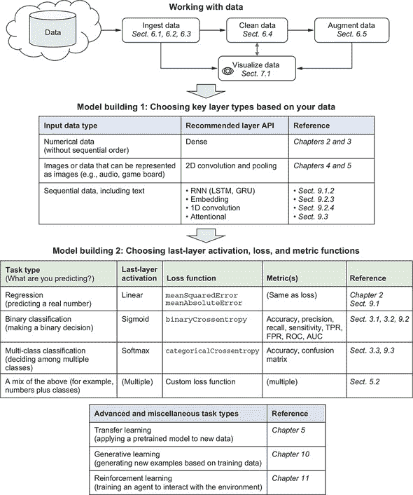
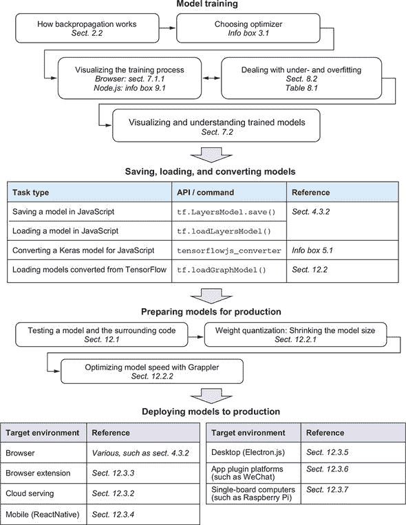

## 术语表

##### 激活函数

神经网络层的最后阶段的函数。例如，可以在矩阵乘法的结果上应用修正线性单元（relu）函数，以生成密集层的最终输出。激活函数可以是线性或非线性的。非线性激活函数可用于增加神经网络的表示能力（或容量）。非线性激活函数的示例包括 sigmoid、双曲正切（tanh）和前面提到的 relu。

##### 曲线下面积（AUC）

用于量化 ROC 曲线形状的单个数字。它被定义为 ROC 曲线下的定积分，从假阳性率 0 到 1。见 *ROC 曲线*。

##### 轴

在 TensorFlow.js 的上下文中，当我们谈论一个 *张量* 时，一个轴（复数 *轴*）是张量中独立索引的一个关键。例如，一个秩为 3 的张量有三个轴；秩为 3 的张量的一个元素由三个整数标识，这些整数对应于三个轴。也称为 *维度*。

##### 反向传播

将可微分机器学习模型的损失值追溯到权重参数梯度的算法。它基于微分的链式法则，并构成了本书中大多数神经网络的训练基础。

##### 时间反向传播（BPTT）

一种特殊形式的反向传播，在其中步骤不是在模型的连续层的操作上进行，而是在连续时间步骤上进行的。它构成了递归神经网络（RNNs）的训练基础。

##### 平衡（数据集）

具有分类标签的数据集的一种质量。不同类别的示例数量越平衡，数据集就越平衡。

##### 批次

在神经网络的训练过程中，通常将多个输入示例聚合成一个张量，该张量用于计算梯度和对网络权重的更新。这样的聚合称为 *批次*。批次中示例的数量称为 *批次大小*。

##### 贝尔曼方程

在强化学习中，一种递归方程，将状态-动作对的价值量化为两项之和：1）代理在采取行动后立即获得的奖励；2）代理在下一个状态中可以获得的最佳期望奖励，乘以一个折现因子。第二项假定在下一个状态中选择的行动是最优的。它构成了强化学习算法（如深度 Q 学习）的基础。

##### 二元分类

一个分类任务，其中目标是回答是/否问题，例如某个 X 射线图像是否表明肺炎，或者信用卡交易是否合法或欺诈性。

##### 广播

TensorFlow 允许对具有不同但兼容形状的张量进行成对操作。例如，可以将形状为 `[5]` 的张量添加到形状为 `[13, 5]` 的张量中。实际上，较小的张量将重复 13 次以计算输出。关于何时允许广播的规则的详细信息在 章节 2.4 的信息框 中有说明。

##### 容量

机器学习模型能够学习的输入-输出关系的范围。例如，具有具有非线性激活函数的隐藏层的神经网络比线性回归模型具有更大的容量。

##### 类激活图

一种算法，可以可视化输入图像的不同部分对卷积神经网络分类输出的相对重要性。它基于计算网络的最后一个内部卷积层的输出对获胜类别的最终概率得分的梯度。详细讨论见 第 7.2.3 节。

##### 计算机视觉

计算机如何理解图像和视频的研究。这是机器学习的重要组成部分。在机器学习的背景下，常见的计算机视觉任务包括图像识别、分割、字幕生成和目标检测。

##### 混淆矩阵

一个形状为 `[numClasses, numClasses]` 的方阵（2D 张量）。在多类分类中，混淆矩阵用于量化给定真实类别的示例被分类为每个可能类别的次数。索引 `[i, j]` 处的元素是真实类别 `i` 的示例被分类为类别 `j` 的次数。对角线上的元素对应于正确分类的结果。

##### 常量折叠

一种计算图优化类型，其中包含仅由预定常量节点和它们之间的确定性操作组成的子图被减少为单个常量节点。TensorFlow.js 中的 `GraphModel` 转换技术利用了常量折叠。

##### 卷积核

在卷积操作中，一个张量对输入张量进行操作以生成输出张量。以图像张量为例：与输入图像相比，卷积核通常在其高度和宽度维度上较小。它在输入图像的高度和宽度维度上“滑动”，并在每个滑动位置上进行点积（乘法和加法）。对于 TensorFlow.js 的卷积层（例如 conv2d），卷积核是其关键权重。

##### 数据增强

通过创建训练样本（x，y）的变异来从现有训练样本中生成更多训练数据的过程，通过产生有效输入 x'的一系列编程转换来暴露模型更多数据的方面，从而更好地泛化，而不需要工程师手动将这些转换类型的不变性构建到模型中。

##### 深度学习

深度神经网络的研究和应用（即使用大量连续的表示转换来解决机器学习问题）。

##### 深度神经网络

具有大量层（从两个到数千个）的神经网络。

##### 维度

在张量的上下文中，与*轴*同义。 参见*轴*。

##### 点积

参见*内积*。

##### 嵌入

在深度学习中，将某个数据片段表示为*n*维向量空间（*n*为正整数）的表示。 换句话说，它是将数据片段表示为有序的，长度为*n*的浮点数数组。 可以为许多类型的数据创建嵌入表示：图像，声音，单词以及来自封闭集的项目。 嵌入通常来自训练的神经网络的中间层。

##### 集成学习

训练一些个体机器学习模型并在同一问题上一起使用它们进行推断的实践。 即使每个单独的模型可能不太准确，但集成模型的准确性可能会更高。 集成模型经常被数据科学竞赛的获奖作品使用，例如 Kaggle 竞赛。

##### 纪元

在训练模型时，对训练数据的完整通过。

##### Epsilon-贪婪策略

在强化学习中，一种参数化代理方的随机探索行为与最优行为之间平衡的动作选择方法。 epsilon 的值受到 0 和 1 之间的约束。 它越高，代理选择随机动作的可能性就越大。

##### 示例

在机器学习的上下文中，输入数据的个体实例（例如，适用于计算机视觉模型的图像），机器学习模型将为其生成输出预测（例如，图像的标签）。

##### 特征

机器学习模型的输入数据的一个方面。 特征可以采用以下任何形式：

+   数字（例如信用卡交易的货币金额）

+   来自开放集合的字符串（交易名称）

+   分类信息的一部分（例如信用卡品牌名称）

+   一个或多维数组（例如，信用卡客户签名的灰度图像表示为 2D 数组）

+   其他类型的信息（例如日期时间）

输入示例可以由一个或多个特征组成。

##### 特征工程

原始特征数据的转化过程，使其更易于解决机器学习问题。在深度学习之前，通过领域专家进行试错的特征工程。这通常是一个耗时且脆弱的过程，没有找到最优解的保证。深度学习在很大程度上自动化了特征工程。

##### 微调

在迁移学习中，模型训练的一个阶段，在该阶段，基本模型中某些层的权重可以更新。通常，在全部基本模型的权重都被冻结以防止大的初始梯度干扰预训练权重的初始阶段之后。如果使用得当，微调可以增强迁移学习模型的能力，从而在消耗比完全从头开始训练模型少得多的计算资源的同时实现更高的准确性。

##### 生成式对抗网络（GAN）

生成式机器学习模型的一种类型，包括两个部分：鉴别器和生成器。鉴别器被训练为区分真实样本和训练集中的假样本，而生成器被训练为输出能使鉴别器给出高真实度评分的样本（即“欺骗”鉴别器，“使其认为”这些假样本是真实的）。经过适当的训练，生成器能够输出高度逼真的假样本。

##### 金值

在测试机器学习系统时，模型对于给定输入应该生成的正确输出。例如，当给出贝多芬第五交响曲的录音时，神经网络将其分类为音乐流派时的“标准标签”就是一个例子。

##### 梯度下降

梯度下降法是通过沿着系统参数的梯度方向（即与输出值相关的参数的导数）反复改变系统参数，将系统数值输出最小化的过程。这是神经网络训练的主要方法。在神经网络训练的上下文中，系统由工程师选择的神经网络和损失函数组成。系统的参数是神经网络层的权重，迭代过程逐批次地在训练数据上进行。

##### 图形处理单元（GPU）

配备比典型 CPU 核心多得多（数百或数千个）的并行计算芯片。 GPU 最初被设计用于加速 2D 和 3D 图形的计算和渲染。但它们也被证明对于运行深度神经网络所涉及的并行计算非常有用。GPU 是深度学习革命的重要因素，并且在今天深度学习的研究和应用中继续发挥关键作用。TensorFlow.js 通过两个渠道利用 GPU 的并行计算能力：1）web 浏览器的 WebGL API，2）在 Node.js 中绑定到 TensorFlow CUDA 核心。

##### GraphModel

在 TensorFlow.js 中，从 TensorFlow（Python）转换并加载到 JavaScript 中的模型。 `GraphModel` 有潜力进行 TensorFlow 内部性能优化，比如 Grappler 的算术优化和 op 融合（详见第 12.2.2 节）。

##### 隐藏层

由一个输出不作为网络的输出暴露，而是只被网络的其他层消耗的层组成的神经网络。例如，在一个定义为 TensorFlow.js 顺序模型的神经网络中，除了最后一个层外，所有层都是隐藏层。

##### 超参数优化

有时也称为*超参数调优*；搜索在给定机器学习任务上给出最低验证损失的超参数集的过程。

##### 超参数

模型和优化器的可调参数，这些参数不能通过反向传播进行调整。通常学习率和模型结构是常见的超参数示例。超参数可以通过网格搜索或更复杂的超参数调优算法进行调整。

##### 假设空间

在机器学习的上下文中，机器学习问题的可能解集。训练过程涉及在这样的空间中搜索一个良好的解。假设空间由解决问题选择的机器学习模型的类型和架构决定。

##### ImageNet

由标记的彩色图像组成的大规模公共数据集。这是计算机视觉导向的深度神经网络的重要训练集和基准。ImageNet 在引领深度学习革命的开端方面发挥了重要作用。

##### 填补

一种从数据集中填补缺失值的技术。例如，如果我们有一个汽车数据集，有些汽车缺少“重量”特征，我们可以简单地猜测这些特征的平均重量。也可以使用更复杂的填补技术。

##### 形式

一种有大量层和复杂网络结构的深度卷积神经网络。

##### 独立同分布（IID）

数据样本的统计属性。如果我们假设数据是从一个潜在的分布中抽样得到的，那么如果每个样本来自相同的分布，则样本是相同分布的。如果知道一个样本的值不会给你关于下一个样本的额外信息，那么样本是独立的。

掷骰子的样本是 IID（独立同分布）样本集的一个示例。如果骰子的结果被排序，那么样本是相同分布的但不是独立的。训练数据应该是 IID，否则在训练过程中可能会出现收敛或其他问题。

##### 推断

对输入数据使用机器学习模型生成输出。这是训练模型的最终目的。

##### 内积

也称为*点积*；是两个形状相同的向量上的数学运算，得到一个单一的标量值。要计算向量`a`和`b`之间的内积，对所有有效值的`i`求和`a[i] * b[i]`。从几何角度来看，两个向量的内积等于它们的大小乘积和它们之间的余弦值。

##### Keras

一种流行的深度学习库。今天，在 Kaggle 竞赛中它是使用最频繁的深度学习库。弗朗索瓦·肖莱（François Chollet）是其原始作者，目前是 Google 的软件工程师。Keras 是一个 Python 库。TensorFlow.js 的高级 API，这是本书的重点，是基于 Keras 建模并与之兼容的。

##### 标签

根据手头的任务给定输入示例的期望答案。标签可以是布尔（是/否）答案、数字、文本字符串、一系列可能的类别中的一个、一系列数字或更复杂的数据类型。在监督式机器学习中，模型的目标是生成与标签尽可能匹配的输出。

##### 层

在神经网络的上下文中，数据表示的转换。它的行为类似于数学函数：给定一个输入，它产生一个输出。一个层可以有由它的权重捕获的状态。这些权重可以在神经网络的训练过程中被改变。

##### LayersModel

使用 TensorFlow.js 的类似 Keras 的高级 API 构建的模型。它也可以从转换后的 Keras（Python）模型加载。`LayersModel`支持推断（使用其`predict()`方法）和训练（使用其`fit()`和`fitDataset()`方法）。

##### 学习率

在梯度下降期间，模型权重被修改以减少损失。权重的确切变化不仅取决于损失的梯度，还取决于一个参数。在标准梯度下降算法中，通过将梯度乘以学习率来计算权重更新，学习率通常是一个小正常数。tensorflow.js 中 `'sgd'` 优化器的默认学习率是 0.01。

##### 局部最小值

在优化模型参数时，参数的设置使得参数的任何足够小的变化都会增加损失。类似于碗底的大理石，没有任何更低的小运动。局部最小值与*全局最小值*有所区别，局部最小值是局部邻域中的最低点，而全局最小值是整体上的最低点。

##### 对数几率

在机器学习中，一个未标准化的概率值。与概率不同，对数几率不限于[0,1]区间，也不要求总和为 1。因此，它们可以更轻松地由神经网络层输出。一组对数几率可以通过称为*softmax*的操作标准化为概率值。

##### 机器学习

一种人工智能（AI）的子领域，通过使用带有所需答案标签的数据自动发现解决复杂问题的规则。它与经典编程不同，因为它不涉及规则的手工制作。

##### 马尔可夫决策过程（MDP）

在强化学习中，一种决策过程，其中智能体选择的当前状态和动作完全决定了智能体将结束的下一个状态以及智能体将在该步骤中获得的奖励。这是一个重要的简化，使得像 Q-learning 这样的学习算法成为可能。

##### 模型

在机器学习和深度学习中，将输入数据（例如图像）转换为所需输出（例如图像的文本标签）的对象，通过一系列连续的数学操作。模型具有可以在训练期间调整的参数（称为*权重*）。

##### 模型适应

训练预训练模型或其部分的过程，以使模型在特定用户或特定用例的输入数据上进行推理时达到更好的准确性。这是一种迁移学习的类型，其中输入特征的类型和目标的类型与原始模型不同。

##### 模型部署

将训练好的模型打包到可以用于进行预测的地方的过程。类似于其他软件堆栈的“推向生产”，部署是用户可以真正使用模型的方式。

##### MobileNet

一个预训练的深度卷积神经网络。通常在 ImageNet 图像分类数据集上进行训练，并可用于迁移学习。在类似的预训练卷积神经网络中，它具有相对较小的尺寸，并且在执行推理时涉及的计算较少，因此更适合在资源受限的环境（如 Web 浏览器）中运行，使用 TensorFlow.js。

##### 多类分类

一个分类问题，其中目标可能具有两个以上的离散标签。例如，一张图片包含什么样的动物或给定内容的网页所使用的（自然）语言是什么。

##### 多热编码

一种通过将与单词对应的元素设置为 1 并将其余元素保持为 0 来表示句子中的单词（或一般情况下，序列中的项目）的方法。这可以看作是*独热编码*的泛化。它丢弃了关于单词顺序的信息。

##### 多层感知器（MLP）

由前馈拓扑和至少一个隐藏层组成的神经网络。

##### 自然语言处理

计算机科学的一个子领域，研究如何利用计算机来处理和理解自然语言，最突出的是文本和语音。深度学习在自然语言处理中有许多应用。

##### 神经网络

一类受生物神经系统中分层组织启发的机器学习模型。神经网络的层对数据表示进行多步、可分离的转换。

##### 非线性

一个输入输出关系，不符合线性定义（输入的线性组合导致输出的线性组合，最多存在一个常数项的差异）。在神经网络中，非线性关系（例如在层中的 sigmoid 和 relu 激活）以及多个这样的关系的级联可以增加神经网络的容量。

##### 目标检测

一种计算机视觉任务，涉及在图像中检测某些类别的对象及其位置。

##### 独热编码

将分类数据编码为长度为*N*的向量的方案，该向量由除了对应于实际类别的索引之外的所有零组成。

##### 操作融合

一种计算图优化技术，其中多个操作（或 ops）被替换为一个等效的操作。操作融合减少了操作分派开销，并可以为进一步的操作内存和性能优化提供更多机会。

##### 超出词汇表（OOV）

在深度学习的上下文中，当一个*词汇表*用于一组离散项时，该词汇表有时不包括所有可能的项。当遇到词汇表之外的项时，它被映射到一个称为超出词汇表的特殊索引，然后可以将其映射到独热编码或嵌入表示中的特殊元素。见*词汇表*。

##### 过拟合

当模型被适配到训练数据中，以至于模型具有足够的容量来记忆训练数据时，我们会看到训练损失继续下降，但测试或验证损失开始上升。具有这种属性的模型开始失去泛化能力，仅在训练数据中的确切样本上表现良好。我们称处于这种情况下的模型为过拟合。

##### 策略梯度

一种强化学习算法，它计算并利用选定动作的某些度量（如对数几率）相对于策略网络的权重的梯度，以使策略网络逐渐选择更好的动作。

##### 精确度

一个二元分类器的度量，定义为分类器标记为正且实际为正的比率。参见 *召回率*。

##### 伪示例

基于已知有效的输入训练示例的突变的附加示例，用于补充训练数据。例如，我们可以取 MNIST 数字并应用小的旋转和倾斜。这些变换不会改变图像标签。

##### Q 网络

在强化学习中，预测给定当前状态观察到所有可能行动的 Q 值的神经网络。Q 学习算法是关于使用代理经验数据训练 Q 网络的过程。

##### Q 值

在强化学习中，以给定状态下采取行动的预期总未来累积奖励。因此，一个 Q 值是一个行动和状态的函数。它指导了在 Q 学习中选择行动的过程。

##### 随机初始化

在模型拟合之前，为权重分配初始值作为起点的过程。关于什么，具体来说，是好的分布选择以获取初始值的文献基于层类型、大小和任务有很多。

##### 回想

一个二元分类器的度量，定义为分类器标记为正的实际示例的比率。参见 *精度*。

##### 回归

一种学习问题，期望输出（或标签）是一个数字或数字列表。预测越接近期望输出，越好。

##### 正则化

在机器学习中，对损失函数或训练过程进行各种修改以抵消过度拟合的过程。有几种方式可以执行正则化，其中最常用的是 L1 和 L2 正则化。

##### 强化学习（RL）

一种涉及通过与环境交互来学习最优决策以最大化一个叫做*奖励*的度量的机器学习方法。本书的第十一章介绍了 RL 的基础知识以及如何使用深度学习技术解决简单的 RL 问题。

##### ResNet

Residual Network 的缩写；一种广泛用于计算机视觉的流行卷积网络，具有残差连接，即跳过层之间的连接。

##### ROC 曲线

可视化二元分类器真正的阳性率（召回率）和假阳性率（误报率）之间的权衡的方法。该曲线的名称（接受者操作特征曲线）源于雷达技术的早期阶段。参见 *曲线下面积*（AUC）。

##### 频谱图

一种类似于图像的二维表示，用于表示一维时间信号（例如声音）。频谱图有两个维度：时间和频率。每个元素表示在给定时间内在给定频率范围内所包含声音的强度或功率。

##### 监督学习

使用标记示例训练机器学习模型的范例。模型的内部参数被改变，以最小化模型对示例的输出与相应实际标签之间的差异。

##### 符号张量

在 TensorFlow.js 中，`SymbolicTensor` 类的对象，它是张量的形状和数据类型（dtype）的规范。与张量不同，`SymbolicTensor` 对象没有与具体值相关联。相反，它被用作层或模型的输入或输出的占位符。

##### 张量

一种用于保存数据元素的数据结构，通常是数字。张量可以被视为 *n* 维网格，其中网格中的每个位置恰好保存一个元素。张量的维数和每个维度的大小被称为张量的 *形状*。例如，一个 3 × 4 矩阵是一个形状为 `[3, 4]` 的张量。长度为 10 的向量是一个形状为 `[10]` 的一维张量。每个张量实例只保存一种类型的元素。张量是这样设计的，因为它允许方便、高效的实现深度学习中常见操作：例如，矩阵点积。

##### TensorBoard

一个用于 TensorFlow 的监控和可视化工具。它允许用户在浏览器中可视化模型结构和训练性能。TensorFlow.js 可以将训练日志写入与 TensorBoard 兼容的数据格式。

##### TensorFlow

一个用于加速机器学习的开源 Python 库，重点放在深度神经网络上。它由 Google 的 Brain 团队于 2015 年 11 月发布。其 API 构成了 TensorFlow.js 的蓝图。

##### 训练

改变机器学习模型的内部参数（权重），使模型的输出更接近期望的答案的过程。

##### 训练数据

用于训练机器学习模型的数据。训练数据由各个示例组成。每个示例都是结构化信息（例如，图像、音频或文本），与预期答案（标签）一起。

##### 迁移学习

将之前针对一个任务训练过的机器学习模型，重新训练它以适应一个新任务的相对较少的数据量（与原始训练数据集相比），并在新任务上进行推断的实践。

##### 欠拟合

当一个模型经过太少的优化步骤训练，或者一个模型的表示能力（容量）不足以学习训练数据中的模式时，导致模型不能达到一个体面的质量水平时，我们称该模型为欠拟合。

##### 无监督学习

使用未标记数据的机器学习范式。与使用标记数据的监督学习相对。无监督学习的示例包括聚类（在数据集中发现不同子集的示例）和异常检测（确定给定示例与训练集中的示例是否足够不同）。

##### 验证数据

用于调整超参数的训练数据以外的数据，例如学习率或密集层中的单元数。验证数据允许我们调整学习算法，可能需要多次运行训练。由于验证数据与测试数据是分开的，我们仍然可以依靠测试数据的结果来提供无偏的模型在新的、未见过的数据上的性能估计。

##### 梯度消失问题

在训练深度神经网络中的一个经典问题是，随着层数的增加，权重参数上的梯度越来越小，结果导致权重参数与损失函数之间的距离越来越远。在现代深度学习中，通过改进的激活函数、适当初始化权重和其他技巧来解决这个问题。

##### 矢量化

将非数字数据转化为数字数组(如向量)的过程。例如，文本向量化涉及将字符、单词或句子转换为向量。

##### 可视化工具

在与 TensorFlow.js 紧密集成的可视化库 tfjs-vis 中，可以通过在网页的一侧进行单个函数调用来创建一个可折叠的区域，以容纳可视化用的表面。可以在可视化工具中创建多个标签页来组织各个表面。详见第 8.1 节。

##### 词汇表

在深度学习的背景下，一组离散的、独特的项目，可以用作神经网络的输入或输出。通常，词汇表的每个项目可以映射到一个整数索引，然后可以将其转换为一种 one-hot 或基于嵌入的表示。

##### 权重

神经网络层的一个可调参数。改变权重会改变输入如何转换为输出的数值细节。神经网络的训练主要是关于以系统性的方式更新权重值。

##### 权重量化

一种用于减少模型序列化和传输时大小的技术。它涉及将模型的权重参数以较低的数值精度存储。

##### 词嵌入模型

文本相关的神经网络中将词向量化的一种方式。通过嵌入查找过程，将单词映射到 1D 张量(或向量)。与 one-hot 编码不同，词嵌入涉及到非稀疏向量，其中元素值是连续变化的数字，而不是 0 和 1。

