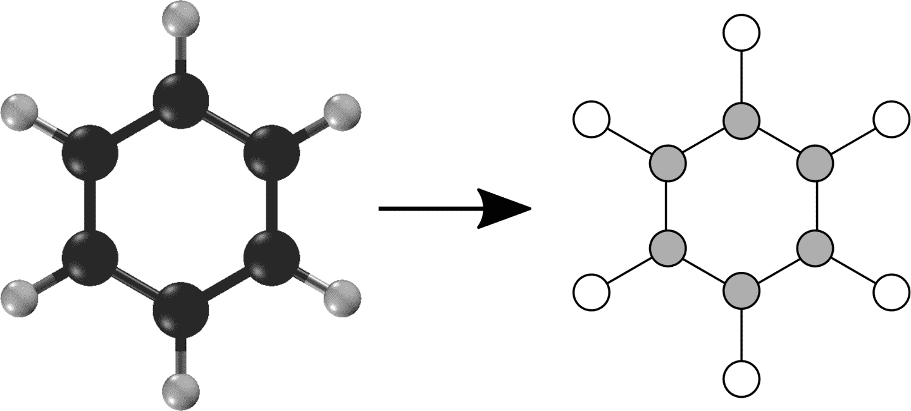

# 第四章：分子的机器学习

本章涵盖了在分子数据上执行机器学习的基础知识。在深入研究本章之前，我们简要讨论一下为什么分子机器学习可能是一个有益的研究课题。现代材料科学和化学的许多工作都是出于设计具有期望性质的新分子的需要。虽然已经进行了大量的科学工作来开发新的设计策略，但有时仍然需要进行大量的随机搜索来构建有趣的分子。分子机器学习的梦想是用引导搜索取代这种随机实验，机器学习预测器可以提出哪些新分子可能具有期望的性质。这样准确的预测器可以促进创造具有有用性质的全新材料和化学品。

一旦特征化，分子仍然需要进行学习。我们将回顾一些用于学习分子功能的算法，包括简单的全连接网络以及更复杂的技术，如图卷积。我们还将描述图卷积技术的一些局限性，以及我们应该期望和不应该期望的内容。我们将以一个有趣数据集上的分子机器学习案例研究结束本章。

这个梦想很吸引人，但我们如何开始这条道路呢？第一步是构建技术方法，将分子转化为数字向量，然后将其传递给学习算法。这些方法被称为*分子特征化*。我们将在本章中涵盖其中一些，并在下一章中涵盖更多。

# 什么是分子？

分子是复杂的实体，研究人员已经开发了许多不同的技术来对其进行特征化。这些表示包括化学描述符向量，2D 图表示，3D 静电网格表示，轨道基函数表示等等。

确定给定样本中存在的分子可能是非常具有挑战性的。目前最流行的技术依赖于质谱。质谱的基本思想是用电子轰击样本。这种轰击会将分子破碎成碎片。这些碎片通常会*电离*，即吸收或失去电子而带电。这些带电碎片被电场推动，根据它们的质荷比分离它们。检测到的带电碎片的分布被称为*光谱*。图 4-1 说明了这个过程。从检测到的碎片集合中，通常可以确定原始样本中存在的精确分子。然而，这个过程仍然是有损失和困难的。许多研究人员正在积极研究利用深度学习算法改进质谱技术，以便从检测到的带电光谱中更容易地识别原始分子。

# 质谱

在深入研究分子机器学习之前，回顾一下分子到底是什么将是有用的。这个问题听起来有点愚蠢，因为像 H[2]O 和 CO[2]这样的分子甚至被介绍给年幼的孩子。答案不是显而易见的。然而，事实是，对于绝大多数人类的存在，我们根本不知道分子的存在。考虑一个思想实验：你如何说服一个怀疑的外星人分子实体存在？答案是相当复杂的。例如，你可能需要使用质谱仪！

注意执行此检测的复杂性！分子是复杂的实体，很难准确地确定。

为了开始，让我们假设一个分子的定义是一组由物理力连接在一起的原子。分子是化合物中最小的基本单位，可以参与化学反应。分子中的原子通过*化学键*连接在一起，这些键将它们粘在一起并限制它们相对于彼此的运动。分子的大小范围很广，从只有几个原子到成千上万个原子不等。图 4-2 提供了这种模型中分子的简单描述。


###### 图 4-1. 一个质谱仪的简单示意图。（来源：[Wikimedia](https://commons.wikimedia.org/wiki/File:Mass_Spectrometer_Schematic.svg).）


###### 图 4-2. 一个咖啡因分子的“球棒”图示。原子用彩色球体表示（黑色是碳，红色是氧，蓝色是氮，白色是氢），由代表化学键的棍子连接。

有了这个基本描述，我们将在接下来的几节中深入探讨分子化学的各个方面的更多细节。在第一次阅读本章时，您不必完全掌握所有这些概念，但掌握一些化学领域的基本知识可能会有用。

# 分子是动态的、量子实体

我们刚刚提供了一个关于原子和键的分子的简单描述。非常重要的是要记住，在任何分子内部都有更多的事情发生。首先，分子是动态实体，因此给定分子内的所有原子都在相互之间快速运动。键本身在伸缩和快速振动长度方面。原子很常见地会迅速从分子中脱离并重新加入。当我们讨论分子构象时，我们很快会看到更多关于分子动态性质的内容。

更奇怪的是，分子是量子的。说一个实体是量子有很多层面，但简单来说，重要的是要注意，“原子”和“键”远没有简单的球棒图表所暗示的那么明确定义。在这里的定义中有很多模糊性。在这个阶段理解这些复杂性并不重要，但要记住我们对分子的描述是非常近似的。这可能具有实际意义，因为有些学习任务可能需要用不同的描述来描述分子。

## 分子键是什么？

您可能已经有一段时间没有学习基础化学了，所以我们将花时间在这里和那里复习基本化学概念。最基本的问题是，化学键是什么？

构成日常生活的分子由原子组成，通常是非常大量的原子。这些原子通过化学键连接在一起。这些键基本上通过它们共享的电子将原子“粘”在一起。有许多不同类型的分子键，包括共价键和几种非共价键。

### 共价键

共价键涉及两个原子之间的电子共享，使得相同的电子在两个原子周围花费时间（图 4-3）。一般来说，共价键是最强的化学键类型。它们在化学反应中形成和断裂。共价键往往非常稳定：一旦形成，就需要大量能量来断裂，因此原子可以长时间保持结合。这就是为什么分子表现为独立的对象而不是无关的原子松散集合。事实上，共价键是定义分子的东西：分子是由共价键连接的一组原子。


###### 图 4-3。左：两个被电子云包围的原子核。右：当原子靠近时，电子开始在原子核之间的空间中花费更多时间。这会吸引原子核靠近，形成原子之间的共价键。

### 非共价键

非共价键不涉及原子之间的电子直接共享，但涉及较弱的电磁相互作用。由于它们不像共价键那样强，它们更加短暂，不断地断裂和重组。非共价键不像共价键那样“定义”分子，但它们对决定分子形状和不同分子之间相互关联的方式有巨大影响。

“非共价键”是一个泛指，涵盖了几种不同类型的相互作用。一些非共价键的例子包括氢键（图 4-4）、盐桥、π-堆叠等。这些类型的相互作用在药物设计中通常起着至关重要的作用，因为大多数药物通过非共价相互作用与人体内的生物分子相互作用。


###### 图 4-4。水分子之间的氢键相互作用很强，氢与相邻分子上的氧之间存在氢键。强大的氢键网络在一定程度上有助于水作为溶剂的作用。（来源：[维基共享资源](https://commons.wikimedia.org/wiki/File:SimpleBayesNet.svg)。）

在本书的不同部分我们会遇到这些类型的键。在本章中，我们将主要讨论共价键，但当我们开始研究一些生物物理深度模型时，非共价相互作用将变得更加关键。

## 分子图

*图*是由*节点*通过*边*连接在一起的数学数据结构（图 4-5）。图在计算机科学中是非常有用的抽象。事实上，有一个称为图论的数学分支专门用于理解图的属性并找到操纵和分析它们的方法。图被用来描述从构成网络的计算机到构成图像的像素，再到曾与凯文·贝肯一起出演电影的演员等各种事物。


###### 图 4-5。一个由六个节点通过边连接的数学图的示例。（来源：[维基共享资源](https://commons.wikimedia.org/wiki/File:6n-graf.svg)。）

重要的是，分子也可以被视为图（图 4-6）。在这种描述中，原子是图中的节点，化学键是边。任何分子都可以转换为相应的分子图。



###### 图 4-6。将苯分子转化为分子图的示例。请注意，原子被转换为节点，化学键被转换为边。

在本章的其余部分，我们将反复将分子转化为图形，以便分析它们并学会对它们进行预测。

## 分子构象

分子图描述了分子中的原子集合以及它们如何相互结合。但还有另一件非常重要的事情我们需要知道：原子在 3D 空间中相对于彼此的位置。这被称为分子的*构象*。

原子、键和构象彼此相关。如果两个原子共价结合，那么它们之间的距离往往会固定，严格限制可能的构象。由三个或四个共价结合原子组成的角度也经常受到限制。有时会有整个原子团是完全刚性的，作为一个单一单位一起移动。但分子的其他部分是灵活的，允许原子相对于彼此移动。例如，许多（但不是所有）共价键允许它们连接的原子团绕键的轴自由旋转。这使得分子可以呈现许多不同的构象。

图 4-7 展示了一个非常流行的分子：蔗糖，也称为食糖。它既以 2D 化学结构形式展示，也以 3D 构象形式展示。蔗糖由两个环连接在一起。每个环都相当刚性，因此其形状随时间变化很少。但连接它们的连接物更加灵活，允许环相对于彼此移动。


###### 图 4-7。蔗糖，以 3D 构象和 2D 化学结构表示。 （改编自维基媒体图像（[维基媒体](https://commons.wikimedia.org/wiki/File:Sucrose-3D-balls.png)和[维基百科](https://en.wikipedia.org/wiki/File:Saccharose2.svg)）。）

随着分子变得更大，它们可以采取的构象数量急剧增加。对于大型大分子，如蛋白质（图 4-8），目前需要非常昂贵的模拟来探索可能构象的集合。


###### 图 4-8。以 3D 形式呈现的细菌紫质的构象（用于捕获光能）。蛋白质的构象特别复杂，具有多个 3D 几何图案，并提醒我们分子除了化学式外还具有几何形状。（来源：[维基媒体](https://upload.wikimedia.org/wikipedia/commons/thumb/d/dd/1M0K.png/480px-1M0K.png)。）

## 分子的手性

一些分子（包括许多药物）有两种镜像形式。这被称为*手性*。手性分子既有“右手”形式（也称为“R”形式），也有“左手”形式（也称为“S”形式），如图 4-9 所示。


###### 图 4-9。螺环化合物的轴向手性（由两个或更多环连接在一起的化合物）。请注意，这两种手性变体分别标记为“R”和“S”。这种约定在化学文献中很普遍。

手性非常重要，也是实验室化学家和计算化学家的许多挫折的根源。首先，产生手性分子的化学反应通常不区分形式，会产生相等数量的两种手性。如果你想最终只得到一种形式，你的制造过程立即变得更加复杂。此外，许多物理性质对两种手性是相同的，因此许多实验无法区分给定分子的手性版本。计算模型也是如此。例如，两种手性具有相同的分子图，因此任何仅依赖于分子图的机器学习模型将无法区分它们。

如果两种形式在实践中表现相同，这就不会那么重要，但情况通常并非如此。一种药物的两种手性形式可能结合到完全不同的蛋白质上，并在体内产生非常不同的效果。在许多情况下，只有一种形式的药物具有期望的治疗效果。另一种形式只会产生额外的副作用而没有任何好处。

手性化合物不同效应的一个具体例子是扑热息痛，这种药物在 20 世纪 50 年代和 60 年代被开出作为镇静剂。这种药物后来作为治疗与怀孕相关的恶心和晨吐的非处方药出售。扑热息痛的 R 型是有效的镇静剂，而 S 型是致畸的，已被证明会导致严重的先天缺陷。这些困难进一步加剧了扑热息痛在体内两种不同形式之间的相互转化或消旋。

# 对分子进行特征化

有了这些基本化学描述，我们如何开始对分子进行特征化呢？为了对分子进行机器学习，我们需要将它们转换为可以用作模型输入的特征向量。在本节中，我们将讨论 DeepChem 特征化子模块`dc.feat`，并解释如何使用它以各种方式对分子进行特征化。

## SMILES 字符串和 RDKit

SMILES 是一种用文本字符串指定分子的流行方法。该首字母缩略词代表“简化分子输入线条系统”，这个名字听起来相当别扭，肯定有人费了很大劲才想出来。SMILES 字符串以一种既简洁又相对直观的方式描述了分子的原子和键，对化学家来说很直观。对非化学家来说，这些字符串往往看起来像是毫无意义的随机字符模式。例如，“OCCc1c(C)n+Cc2cnc(C)nc2N”描述了重要的营养素硫胺素，也被称为维生素 B1。

DeepChem 使用 SMILES 字符串作为其数据集中表示分子的格式。有一些深度学习模型直接接受 SMILES 字符串作为输入，试图学习识别文本表示中的有意义特征。但更常见的情况是，我们首先将字符串转换为适合手头问题的不同表示形式（或特征化）。

DeepChem 依赖于另一个开源化学信息学软件包 RDKit，以便处理分子。RDKit 提供了许多功能，用于处理 SMILES 字符串。它在将数据集中的字符串转换为分子图和下面描述的其他表示形式中起着核心作用。

## 扩展连接指纹

化学指纹是由 1 和 0 组成的向量，表示分子中特定特征的存在或缺失。扩展连接性指纹（ECFPs）是一类结合了几个有用特征的特征化。它们将任意大小的分子转换为固定长度的向量。这很重要，因为许多模型要求它们的输入具有完全相同的大小。ECFPs 让您可以使用具有许多不同大小的分子的相同模型。ECFPs 也非常容易比较。您只需取两个分子的指纹并比较相应元素。匹配的元素越多，分子越相似。最后，ECFPs 计算速度很快。

指纹向量的每个元素表示特定分子特征的存在或缺失，由原子的某种局部排列定义。算法首先独立考虑每个原子，并查看原子的一些属性：其元素，形成的共价键数等。这些属性的每种独特组合都是一个特征，相应的向量元素设置为 1 以表示其存在。然后算法向外工作，将每个原子与其所有键合的原子结合。这定义了一组更大的特征，并设置了相应的向量元素。这种技术的最常见变体是 ECFP4 算法，允许子片段在中心原子周围有两个键的半径。

RDKit 库提供了计算 ECFP4 指纹的工具函数。DeepChem 提供了这些函数的便捷封装。`dc.feat.CircularFingerprint`类继承自`Featurizer`，并提供了对分子进行特征化的标准接口：

```py
smiles = ['C1CCCCC1', 'O1CCOCC1'] # cyclohexane and dioxane
mols = [Chem.MolFromSmiles(smile) for smile in smiles]
feat = dc.feat.CircularFingerprint(size=1024)
arr = feat.featurize(mols)
# arr is a 2-by-1024 array containing the fingerprints for
# the two molecules

```

ECFPs 确实有一个重要的缺点：指纹编码了大量关于分子的信息，但也会丢失一些信息。两种不同的分子可能具有相同的指纹，而且给定一个指纹，不可能唯一确定它来自哪个分子。

## 分子描述符

另一种思路认为，用一组物理化学描述符描述分子是有用的。这些通常对应于描述分子结构的各种计算量。这些量，如对数分配系数或极性表面积，通常是从经典物理学或化学中导出的。RDKit 软件包在分子上计算了许多这样的物理描述符。DeepChem 的特征化器`dc.feat.RDKitDescriptors()`提供了执行相同计算的简单方法：

```py
feat = dc.feat.RDKitDescriptors()
arr = feat.featurize(mols)
# arr is a 2-by-111 array containing properties of the
# two molecules

```

这种特征化对于某些问题显然更有用。它通常最适合用于预测依赖于分子相对通用性质的事物。它不太可能用于预测依赖于原子详细排列的性质。

# 图卷积

前一节中描述的特征化是由人类设计的。专家仔细考虑了如何以可用作机器学习模型输入的方式表示分子，然后手动编码了表示。我们是否可以让模型自己找出最佳的分子表示方式呢？这正是机器学习的全部意义：我们可以尝试从数据中自动学习特征化，而不是自己设计特征化。

作为类比，考虑图像识别的卷积神经网络。网络的输入是原始图像。它由每个像素的数字向量组成，例如三个颜色分量。这是图像的一个非常简单、完全通用的表示。第一个卷积层学习识别简单的模式，比如垂直或水平线。它的输出再次是每个像素的数字向量，但现在以更抽象的方式表示。每个数字代表某些局部几何特征的存在。

网络通过一系列层继续。每一层输出图像的新表示，比前一层的表示更抽象，与原始颜色分量的联系更少。这些表示是从数据中自动学习的，而不是由人类设计的。没有人告诉模型要寻找什么模式来识别图像中是否包含猫。模型通过训练自己找出这一点。

*图卷积网络*采用相同的思想，并将其应用于图形。正如常规 CNN 从每个像素的数字向量开始，图卷积网络从每个节点和/或边的数字向量开始。当图表示一个分子时，这些数字可以是每个原子的高级化学性质，比如其元素、电荷和杂化状态。正如常规卷积层根据其输入的局部区域计算每个像素的新向量一样，图卷积层根据每个节点和/或边计算一个新向量。输出是通过将学习的卷积核应用于图的每个局部区域来计算的，其中“局部”现在是根据节点之间的边来定义的。例如，它可能根据同一原子的输入向量和直接键合到的任何其他原子的输入向量为每个原子计算一个输出向量。

这就是一般的想法。当涉及到细节时，许多不同的变体已经被提出。幸运的是，DeepChem 包括了许多这些架构的实现，所以即使不理解所有细节，你也可以尝试它们。示例包括图卷积（`GraphConvModel`）、编织模型（`WeaveModel`）、消息传递神经网络（`MPNNModel`）、深度张量神经网络（`DTNNModel`）等。

图卷积网络是分析分子的强大工具，但它们有一个重要的限制：计算仅基于分子图。它们不接收有关分子构象的信息，因此它们无法希望预测任何依赖构象的东西。这使它们最适合于小型、大部分刚性的分子。在下一章中，我们将讨论更适用于可以呈现许多构象的大型、灵活分子的方法。

# 训练模型以预测溶解度

让我们把所有的部分放在一起，在真实的化学数据集上训练一个模型，以预测一个重要的分子性质。首先我们将加载数据：

```py
tasks, datasets, transformers = dc.molnet.load_delaney(featurizer='GraphConv')
train_dataset, valid_dataset, test_dataset = datasets

```

这个数据集包含有关溶解度的信息，这是衡量分子在水中溶解程度的指标。这个性质对于任何希望用作药物的化学物质都非常重要。如果它不容易溶解，将足够量的化合物注入患者的血液以产生治疗效果可能是不可能的。药物化学家花费大量时间修改分子，试图增加它们的溶解度。

请注意，我们指定了选项`featurizer='GraphConv'`。我们将使用图卷积模型，这告诉 MoleculeNet 将每个分子的 SMILES 字符串转换为模型所需的格式。

现在让我们构建并训练模型：

```py
model = GraphConvModel(n_tasks=1, mode='regression', dropout=0.2)
model.fit(train_dataset, nb_epoch=100)

```

我们指定只有一个任务，也就是说，每个样本只有一个输出值（溶解度）。我们还指定这是一个回归模型，意味着标签是连续的数字，模型应尽可能准确地复制它们。这与分类模型相反，分类模型试图预测每个样本属于固定类别中的哪一个。为了减少过拟合，我们指定了一个 0.2 的丢弃率，意味着每个卷积层的输出的 20%将随机设置为 0。

就是这样！现在我们可以评估模型，看看它的表现如何。我们将使用皮尔逊相关系数作为我们的评估指标：

```py
metric = dc.metrics.Metric(dc.metrics.pearson_r2_score)
print(model.evaluate(train_dataset, [metric], transformers))
print(model.evaluate(test_dataset, [metric], transformers))

```

这报告了训练集的相关系数为 0.95，测试集为 0.83。显然有点过拟合，但不是太严重。相关系数为 0.83 是相当可观的。我们的模型成功地根据分子结构预测了分子的溶解度！

现在我们有了模型，我们可以用它来预测新分子的溶解度。假设我们对以下五种分子感兴趣，以 SMILES 字符串指定：

```py
smiles = ['COC(C)(C)CCCC(C)CC=CC(C)=CC(=O)OC(C)C',
          'CCOC(=O)CC',
          'CSc1nc(NC(C)C)nc(NC(C)C)n1',
          'CC(C#C)N(C)C(=O)Nc1ccc(Cl)cc1',
          'Cc1cc2ccccc2cc1C']

```

要将这些作为模型的输入，我们必须首先使用 RDKit 解析 SMILES 字符串，然后使用 DeepChem 特征化器将其转换为图卷积所期望的格式：

```py
from rdkit import Chem
mols = [Chem.MolFromSmiles(s) for s in smiles]
featurizer = dc.feat.ConvMolFeaturizer()
x = featurizer.featurize(mols)

```

现在我们可以将它们传递给模型，并要求它预测它们的溶解度：

```py
predicted_solubility = model.predict_on_batch(x)

```

# MoleculeNet

我们现在已经看到从`molnet`模块加载的两个数据集：上一章的 Tox21 毒性数据集，以及本章的 Delaney 溶解度数据集。MoleculeNet 是一个大型的数据集合，对于分子机器学习非常有用。如图 4-10 所示，它包含许多种分子属性的数据。这些属性从可以用量子力学计算的低级物理属性到与人体相互作用的非常高级信息，如毒性和副作用。


###### 图 4-10。MoleculeNet 托管许多不同的数据集，来自不同的分子科学。科学家们发现预测分子的量子、物理化学、生物物理和生理特性非常有用。

在开发新的机器学习方法时，您可以使用 MoleculeNet 作为一组标准基准来测试您的方法。在*[`moleculenet.ai`](http://moleculenet.ai)*上，您可以查看一组标准模型在每个数据集上的表现数据，从而了解您的方法与已建立技术相比如何。

## SMARTS 字符串

在许多常用的应用程序中，例如文字处理，我们需要搜索特定的文本字符串。在化学信息学中，我们遇到类似的情况，我们想确定分子中的原子是否与特定模式匹配。有许多可能出现这种情况的用例：

+   搜索包含特定亚结构的分子的数据库

+   将一组分子对齐在一个共同的亚结构上以改善可视化

+   在图中突出显示一个亚结构

+   在计算过程中约束一个亚结构

SMARTS 是先前描述的 SMILES 语言的扩展，可用于创建查询。人们可以将 SMARTS 模式视为用于搜索文本的正则表达式。例如，在搜索文件系统时，可以指定类似于“foo*.bar”的查询，这将匹配 foo.bar、foo3.bar 和 foolish.bar。在最简单的级别上，任何 SMILES 字符串也可以是 SMARTS 字符串。SMILES 字符串“CCC”也是一个有效的 SMARTS 字符串，将匹配三个相邻脂肪碳原子的序列。让我们看一个代码示例，展示如何从 SMILES 字符串定义分子，显示这些分子，并突出显示与 SMARTS 模式匹配的原子。

首先，我们将导入必要的库并从一组 SMILES 字符串中创建一个分子列表。图 4-11 显示了结果：

```py
from rdkit import Chem
from rdkit.Chem.Draw import MolsToGridImage

smiles_list = ["CCCCC","CCOCC","CCNCC","CCSCC"]
mol_list = [Chem.MolFromSmiles(x) for x in smiles_list​]

```


###### 图 4-11。从 SMILES 生成的化学结构

现在我们可以看到哪些 SMILES 字符串与 SMARTS 模式“CCC”匹配（参见图 4-12）：

```py
query = Chem.MolFromSmarts("CCC")
match_list = [mol.GetSubstructMatch(query) for mol in
mol_list]
MolsToGridImage(mols=mol_list, molsPerRow=4,
highlightAtomLists=match_list)

```


###### 图 4-12。与 SMARTS 表达式“CCC”匹配的分子。

在这张图中有几点需要注意。首先是 SMARTS 表达式只匹配第一个结构。其他结构不包含三个相邻的碳。还要注意，SMARTS 模式可以以多种方式匹配此图中的第一个分子——它可以从第一个、第二或第三个碳原子开始匹配三个相邻的碳原子。RDKit 中还有其他函数可以返回所有可能的 SMARTS 匹配，但我们现在不会涵盖这些内容。

可以使用额外的通配符字符来匹配特定的原子集。与文本一样，“*”字符可用于匹配任何原子。SMARTS 模式“C*C”将匹配一个连接到另一个脂肪碳的脂肪碳（参见图 4-13）。

```py
query = Chem.MolFromSmarts("C*C")
match_list = [mol.GetSubstructMatch(query) for mol in
mol_list]
MolsToGridImage(mols=mol_list, molsPerRow=4,
highlightAtomLists=match_list)
```


###### 图 4-13。与 SMARTS 表达式“C*C”匹配的分子。

SMARTS 语法可以扩展为仅允许特定的原子集。例如，字符串“C[C,O,N]C”将匹配连接到另一个碳原子的碳、氧或氮原子（参见图 4-14）：

```py
query = Chem.MolFromSmarts("C[C,N,O]C")
match_list = [mol.GetSubstructMatch(query) for mol in
mol_list]
MolsToGridImage(mols=mol_list, molsPerRow=4,
highlightAtomLists=match_list)
```


###### 图 4-14。与 SMARTS 表达式“C[C,N,O]C”匹配的分子。

SMARTS 还有很多内容超出了这个简短介绍的范围。建议感兴趣的读者阅读“Daylight Theory Manual”以深入了解 SMILES 和 SMARTS。¹ 正如我们将在第十一章中看到的，SMARTS 可以用于构建复杂的查询，以识别在生物测定中可能存在问题的分子。

# 结论

在这一章中，您已经学习了分子机器学习的基础知识。在简要回顾基础化学知识之后，我们探讨了分子在计算系统中传统的表示方法。您还学习了图卷积，这是一种在深度学习中对分子建模的较新方法，并看到了如何使用机器学习来预测重要物理性质的完整工作示例。这些技术将成为后续章节构建的基础。

¹ Daylight Chemical Information Systems, Inc. “Daylight Theory Manual.” [*http://www.daylight.com/dayhtml/doc/theory/*](http://www.daylight.com/dayhtml/doc/theory/). 2011.
