# 第七章：机器学习用于显微镜

在这一章中，我们向您介绍显微镜的深度学习技术。在这些应用中，我们试图理解显微图像的生物结构。例如，我们可能对在给定图像中某种特定类型的细胞数量感兴趣，或者我们可能试图识别特定的细胞器。显微镜是生命科学中最基本的工具之一，显微镜技术的进步极大地推动了人类科学的发展。即使对于怀疑论者来说，眼见为实，能够直观地检查细胞等生物实体，有助于对生命的基本机制有更直观的理解。对细胞核和细胞骨架的生动可视化（如图 7-1）比教科书中干燥的讨论更有助于更深入地理解。

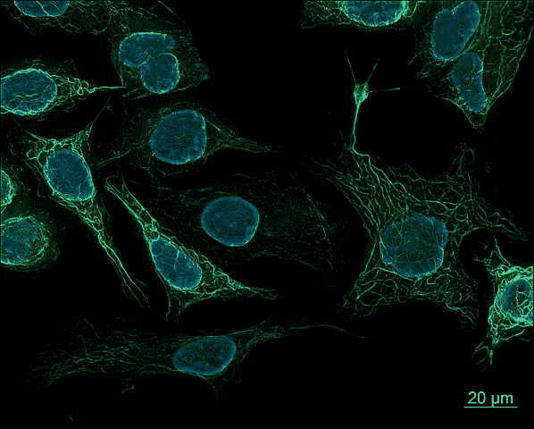

###### 图 7-1 人源 SK8/18-2 细胞。这些细胞被染色以突出它们的细胞核和细胞骨架，并使用荧光显微镜成像。（来源：[维基媒体](https://commons.wikimedia.org/wiki/File:SK8-18-2_human_derived_cells,_fluorescence_microscopy_(29942101073).jpg)。）

问题在于深度学习如何在显微镜中发挥作用。直到最近，分析显微镜图像的唯一方法是让人类（通常是研究生或研究助理）手动检查这些图像以寻找有用的模式。最近，诸如[CellProfiler](https://cellprofiler.org/)之类的工具使生物学家能够自动组装处理成像数据的流程。

# 自动化高通量显微镜图像分析

在过去几十年的自动化进步使得在某些系统上进行自动化高通量显微镜成为可能。这些系统利用简单的机器人技术（用于自动处理样本）和图像处理算法来自动处理图像。这些图像处理应用程序，如分离细胞的前景和背景以及获取简单的细胞计数和其他基本测量。此外，诸如 CellProfiler 之类的工具使得没有编程经验的生物学家能够构建新的自动化流程来处理细胞数据。

然而，自动化显微系统传统上面临着许多限制。首先，现有的计算机视觉流程无法执行复杂的视觉任务。此外，为了进行分析，样本的适当准备需要实验人员具有相当的专业知识。因此，尽管自动化显微术在促进复杂新实验方面取得了相当大的成功，但它仍然是一个相对小众的技术。

因此，深度学习有望扩展诸如 CellProfiler 之类工具的能力。如果深度分析方法能够执行更复杂的分析，自动化显微镜可能会成为一个更有效的工具。因此，深度显微镜引起了相当大的研究兴趣，我们将在本章的其余部分看到。

深度学习技术的希望在于它们将使自动化显微镜流程变得更加灵活。深度学习系统显示出有望能够执行几乎任何人类图像分析师能够执行的任务。此外，早期研究表明，深度学习技术可能会大大扩展廉价显微镜硬件的能力，潜在地使廉价显微镜能够执行目前仅能使用非常复杂和昂贵的设备进行的分析。

展望未来，甚至可以训练“模拟”实验测定的深度模型。这些系统能够在某些有限情况下预测实验结果，甚至无需运行相关实验。这是一种非常强大的能力，也是深度网络在基于图像的生物学领域激发了许多关于潜在潜力的兴奋。

在本章中，我们将教你深度显微镜学的基础知识。我们将演示深度学习系统如何学习执行简单任务，如细胞计数和细胞分割。此外，我们将讨论如何构建可扩展系统，以处理更复杂的图像处理流程。

# 显微镜学简介

在我们深入算法之前，让我们先谈谈基础知识。显微镜学是利用物理系统观察小物体的科学。传统上，显微镜是纯光学设备，使用精细磨制的透镜来扩大样本的分辨率。最近，显微镜学领域开始大量依赖电子束或甚至物理探针等技术来产生高分辨率样本。

几个世纪以来，显微镜学与生命科学紧密联系在一起。17 世纪，安东·范·李文霍克使用早期光学显微镜（他自己设计和制造）以前所未有的细节描述微生物（如图 7-2 所示）。这些观察在很大程度上取决于范·李文霍克在显微镜学方面的进步，特别是他发明了一种新透镜，使分辨率明显提高，超过了当时可用的显微镜。

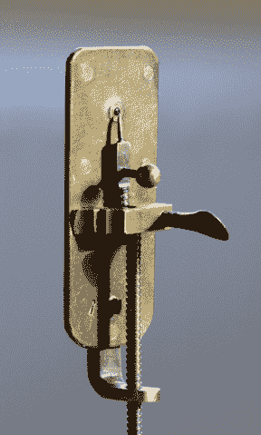

###### 图 7-2. 范·李文霍克在现代时代制造的显微镜的复制品。范·李文霍克保留了他的透镜磨削过程的关键细节，直到 1950 年代，美国和苏联的科学家才成功复制了这款显微镜。 (来源：[维基百科](https://en.wikipedia.org/wiki/Antonie_van_Leeuwenhoek#/media/File:Leeuwenhoek_Microscope.png).)

高分辨率光学显微镜的发明引发了微生物学的革命。显微镜技术的传播和能够大规模查看细胞、细菌和其他微生物的能力使整个微生物学领域和病原模型的发展成为可能。很难过分强调显微镜对现代生命科学的影响。

光学显微镜可以是简单的或复合的。简单显微镜仅使用单个透镜进行放大。复合显微镜使用多个透镜实现更高的分辨率，但在构造上增加了额外的复杂性。第一个实用的复合显微镜直到 19 世纪中叶才实现！可以说，下一个主要的光学显微镜系统设计转变直到 1980 年代才发生，随着数字显微镜的出现，使显微镜捕捉的图像可以写入计算机存储。正如我们在前一节中提到的，自动显微镜使用数字显微镜捕捉大量图像。这些可以用于进行捕捉实验干扰效应的大规模生物学实验。

## 现代光学显微镜

尽管光学显微镜已经存在几个世纪，但在这一领域仍然存在相当多的创新。其中最基本的技术之一是光学切片。光学显微镜具有当前焦点的焦平面。已经开发了各种技术来将图像聚焦在所选的焦平面上。然后，这些聚焦图像可以通过算法拼接在一起，创建高分辨率图像甚至是原始图像的 3D 重建。图 7-3 直观地展示了如何将花粉颗粒的切片图像组合在一起以产生高保真度图像。

共焦显微镜是光学切片问题的常见解决方案。它们使用针孔阻挡来自焦外的光线，使共焦显微镜能够实现更好的深度感知。通过移动显微镜的焦点并进行水平扫描，您可以获得整个样本的全景图像，具有增强的光学分辨率和对比度。有趣的历史背景是，共焦成像的概念最初由 AI 先驱马文·明斯基（见图 7-4）申请专利。

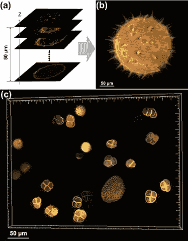

###### 图 7-3. 花粉颗粒成像：（a）花粉颗粒的光学切片荧光图像；（b）合成图像；（c）一组花粉颗粒的合成图像。（来源：[Wikimedia](https://commons.wikimedia.org/wiki/File:Optical_sectioning_of_pollen.jpg)。）

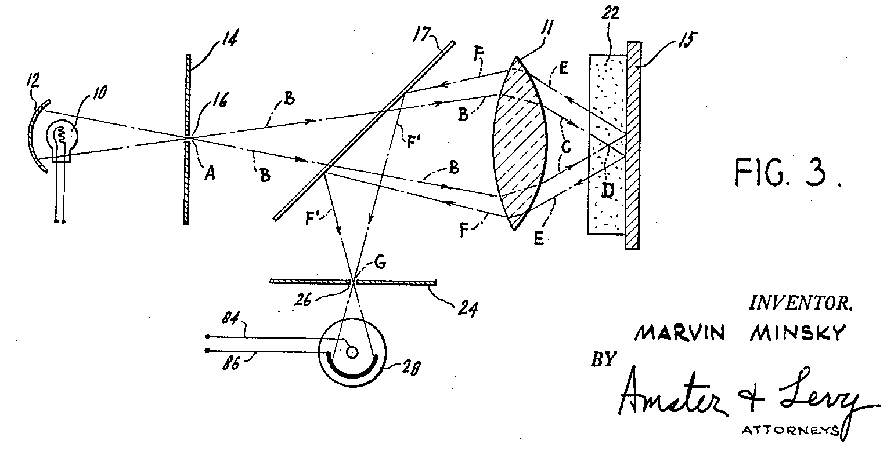

###### 图 7-4. 明斯基原始专利中介绍共焦扫描显微镜的图像。在历史的有趣转折中，明斯基更为人所知的是他在人工智能领域的开创性工作。（来源：[Wikimedia](https://en.wikipedia.org/wiki/Confocal_microscopy#/media/File:Minsky_Confocal_Reflection_Microscope.png)。）

设计良好的光学切片显微镜在捕获生物系统的 3D 图像方面表现出色，因为扫描可以用于聚焦图像的多个部分。这些聚焦图像可以通过算法拼接在一起，产生美丽的 3D 重建。

在接下来的部分中，我们将探讨限制光学显微镜的基本限制，并调查一些已经设计用于解决这些限制的技术。这些材料目前与深度学习没有直接关系（原因我们将讨论），但我们认为这将让您更好地了解当今显微镜面临的挑战。如果您想帮助设计下一代机器学习驱动的显微镜系统，这种直觉将会很有用。然而，如果您急于查看一些代码，我们鼓励您跳转到后续部分，那里我们将深入探讨更直接的应用。

# 深度学习不能做什么？

深度学习似乎可以在显微镜领域产生影响，因为深度学习擅长处理图像，而显微镜则是关于图像捕获的。但值得问一下：目前深度学习在显微镜领域有哪些方面做得不多？正如我们在本章后面看到的，为显微成像准备样本可能需要相当复杂的技术。此外，样本制备需要相当的物理灵巧，因为实验者必须能够将样本固定为一个物理对象。我们如何可能利用深度学习自动化或加速这个过程？

现在不幸的事实是，机器人系统仍然非常有限。虽然像对样本进行共焦扫描这样的简单任务很容易处理，但清洁和准备样本需要相当的专业知识。在可预见的未来，任何可用的机器人系统都不太可能具有这种能力。

每当您听到关于学习技术未来影响的预测时，将示例准备工作等示例记在心中是很有用的。生命科学中的许多痛点涉及诸如样本准备之类的任务，这些任务对今天的机器学习来说根本不可行。这可能会改变，但至少在未来几年内可能不会发生。

# 衍射极限

当研究新的物理仪器，如显微镜时，从尝试了解其限制开始是有用的。显微镜做不到什么？事实证明，这个问题已经被以前的物理学家世代深入研究过（也有一些最近的惊喜！）。开始的地方是*衍射极限*，这是显微镜可能具有的分辨率的理论极限：

<math><mrow><mi>d</mi> <mo>=</mo> <mfrac><mi>λ</mi> <mrow><mn>2</mn><mi>n</mi><mo form="prefix">sin</mo><mi>θ</mi></mrow></mfrac></mrow></math>

量<math><mrow><mi>n</mi><mo form="prefix">sin</mo><mi>θ</mi></mrow></math>经常被重写为数值孔径 NA。<math><mi>λ</mi></math>是光的波长。请注意这里的隐含假设。我们假设样本是用某种形式的光照射的。让我们快速看一下那里的光波谱（参见图 7-5）。


###### 图 7-5。光的波长。请注意，低波长光源如 X 射线具有越来越高的能量。因此，它们经常会破坏精细的生物样本。

请注意，可见光仅占此光谱的一小部分。原则上，我们应该能够使用波长足够低的光使所需的分辨率任意好。在某种程度上，这已经发生了。许多显微镜使用能量更高的电磁波。例如，紫外显微镜利用紫外线波长较小的事实来实现更高的分辨率。我们不能进一步采用这种模式并使用波长更小的光吗？例如，为什么不使用 X 射线或γ射线显微镜？这里的主要问题是*光毒性*。波长较小的光具有高能量。将这种光照射到样本上可能会破坏样本的结构。此外，高波长光对实验者是危险的，并且需要特殊的实验设施。

幸运的是，还存在许多其他绕过衍射极限的技术。其中一种使用电子（它们也有波长！）来成像样本。另一种使用物理探针而不是光。避免分辨率限制的另一种方法是利用近场电磁波。使用多个照明荧光物质的技巧也可以降低限制。我们将在接下来的部分讨论这些技术。

## 电子和原子力显微镜

在 1930 年代，电子显微镜的出现引发了现代显微镜的巨大飞跃。电子显微镜使用电子束而不是可见光来获取物体的图像。由于电子的波长比可见光的波长小得多，使用电子束而不是光波可以获得更详细的图像。为什么这有意义呢？嗯，电子不是粒子吗？请记住，物质可以表现出波动性质。这就是所谓的德布罗意波长，由路易斯·德布罗意首次提出：

<math><mrow><mi>λ</mi> <mo>=</mo> <mfrac><mi>h</mi> <mi>p</mi></mfrac> <mo>=</mo> <mfrac><mi>h</mi> <mrow><mi>m</mi><mi>v</mi></mrow></mfrac></mrow></math>

在这里，<math><mi>h</mi></math>是普朗克常数，<math><mi>m</mi></math>和<math><mi>v</mi></math>分别是所讨论粒子的质量和速度。（对于物理学家来说，请注意这个公式并没有考虑相对论效应。有修改版本的公式考虑了这些效应。）电子显微镜利用电子的波动性质来成像物体。电子的波长取决于其能量，但在标准电子枪可实现的波长下，波长很容易达到亚纳米级。将其代入之前讨论的衍射极限模型，很容易看出电子显微镜是一个强大的工具。早在 20 世纪 30 年代初就已经建造了第一台原型电子显微镜。虽然这些构造已经得到了相当的改进，但今天的电子显微镜仍然依赖于相同的核心原理（见图 7-6）。

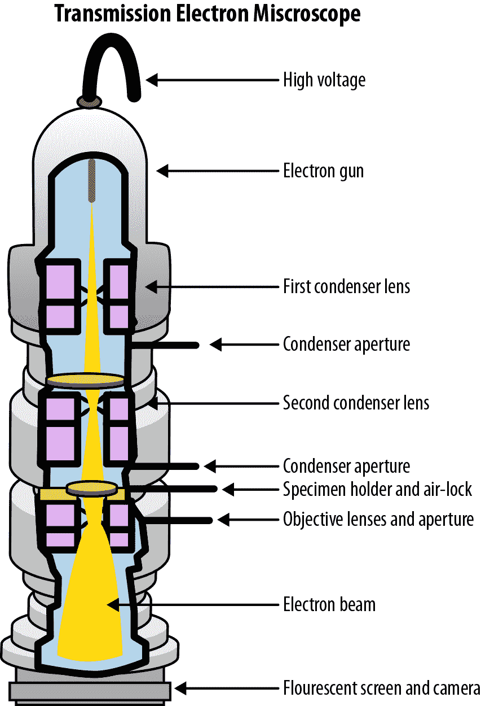

###### 图 7-6。现代透射电子显微镜的组件。（来源：[维基共享资源](https://commons.wikimedia.org/wiki/File:Electron_Microscope.png)）。

请注意，我们在这里并没有完全避开光毒性问题。为了获得波长非常小的电子，我们需要增加它们的能量，而在非常高的能量下，我们将再次破坏样本。此外，为了通过电子显微镜成像，样本的准备过程可能会相当复杂。然而，电子显微镜的使用已经允许对微观系统进行惊人的成像（见图 7-7）。扫描电子显微镜通过扫描输入样品以获得更大的视野，可以实现分辨率达到一纳米的图像。

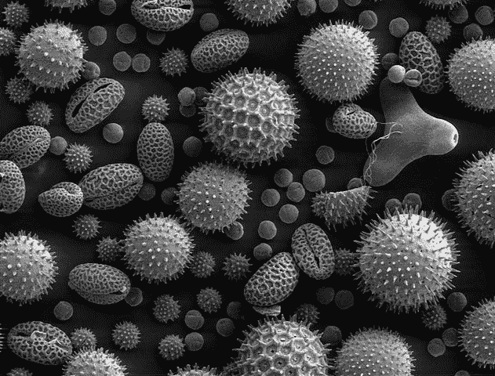

###### 图 7-7。扫描电子显微镜放大 500 倍的花粉。（来源：[维基共享资源](https://commons.wikimedia.org/wiki/File:Misc_pollen.jpg)）。

原子力显微镜（AFM）提供了另一种突破光学衍射极限的方法。这种技术利用一个探针悬臂来物理探测给定表面。悬臂与样品之间的直接物理接触允许获得分辨率为亚纳米级的图像。事实上，有时候甚至可以成像单个原子！原子力显微镜还可以提供与表面的直接接触相关的三维图像。

力显微镜在广义上是一种最近的技术。第一台原子力显微镜是在 20 世纪 80 年代发明的，当时纳米尺度制造技术已经发展到可以准确制造所需探针的程度。因此，在生命科学领域的应用仍处于初期阶段。已经有一些关于使用 AFM 探针成像细胞和生物分子的研究，但这些技术仍处于早期阶段。

## 超分辨显微镜

到目前为止，在本章中我们已经讨论了许多扩展衍射极限的方法，包括使用更高波长的光或物理探针以实现更高分辨率。然而，在 20 世纪下半叶出现了一项科学突破，人们意识到存在整个系列的方法可以突破衍射极限。这些技术统称为超分辨显微镜技术：

功能性超分辨显微镜

利用嵌入在被成像样本中的发光物质的物理特性。例如，在生物显微镜中，荧光标记（稍后详细介绍）可以突出显示特定的生物分子。这些技术允许标准光学显微镜检测发光体。功能性超分辨率技术可以广泛分为确定性和随机技术。

确定性超分辨率显微镜

一些发光物质对激发具有非线性响应。这实际上是什么意思？这个想法是可以通过“关闭”附近的其他发光体来实现对特定发光体的任意聚焦。这背后的物理学有点复杂，但成熟的技术，如受激发射消融（STED）显微镜已经证明了这种技术。

随机超分辨率显微镜

生物系统中的发光分子受到随机运动的影响。这意味着如果跟踪发光粒子的运动，可以对其测量进行平均，从而得出其真实位置的低误差估计。有许多技术（如 STORM、PALM 和 BALM 显微镜）对这个基本想法进行了改进。这些超分辨率技术在现代生物学和化学中产生了巨大影响，因为它们使相对廉价的光学设备能够探测纳米尺度系统的行为。2014 年诺贝尔化学奖授予了功能性超分辨率技术的先驱者。

# 深度超分辨率技术

最近的研究开始利用深度学习技术重建超分辨率视图。这些技术声称通过从稀疏、快速获取的图像进行重建，可以使超分辨率显微镜的速度提高数个数量级。尽管仍处于起步阶段，但这显示了作为深度学习未来应用领域的潜力。

近场显微镜是另一种利用样本中局部电磁信息的超分辨率技术。这些“残余波”不遵守衍射极限，因此可以实现更高的分辨率。然而，这种权衡是显微镜必须从样本极近处收集光线（距离样本一波长内的光线）。这意味着尽管近场技术在物理上非常有趣，但实际应用仍具有挑战性。最近，还可以构建具有负折射率的“超材料”。实际上，这些材料的性质意味着近场残余波可以被放大，从而允许对样本进行更远距离的成像。这个领域的研究仍处于早期阶段，但非常令人兴奋。

## 深度学习和衍射极限？

令人心动的线索表明，深度学习可能有助于推广超分辨率显微镜。一些早期论文表明，深度学习算法可能加快超分辨率图像的构建，或者使用相对廉价的硬件实现有效的超分辨率。 （我们在前面的注释中指出了一篇这样的论文。）

这些线索特别引人注目，因为深度学习可以有效地执行诸如图像去模糊之类的任务。这些证据表明，可能可以基于深度学习构建一套强大的超分辨率工具，从而极大地促进这些技术的采用。目前，这项研究仍处于初期阶段，令人信服的工具尚不存在。然而，我们希望这种状况在未来几年内会发生改变。

# 为显微镜准备生物样本

在生命科学中应用显微镜的一个至关重要的步骤是为显微镜准备样本。这可能是一个非常复杂的过程，需要相当多的实验经验。我们在本节中讨论了几种准备样本的技术，并评论了这些技术可能出错并产生意外实验性伪迹的方式。

## 染色

最早的光学显微镜可以放大观察微观物体。这种功能使对小物体的理解有了惊人的提升，但它的主要局限是无法突出图像中的某些区域以增加对比度。这导致了化学染料的发展，使科学家们能够查看图像中的区域以增加对比度。

已经开发了各种各样的染料来处理不同类型的样本。染色程序本身可能非常复杂，包含多个步骤。染料在科学上可能具有极大的影响力。事实上，根据细菌对细菌革兰氏染色的反应，通常将细菌分类为“革兰阳性”或“革兰阴性”。深度学习系统的一个任务可能是在显微镜样本中分割和标记革兰阳性和革兰阴性细菌。如果您正在开发潜在的抗生素，这将使您能够分别研究其对革兰阳性和革兰阴性物种的影响。

# 作为开发者，我为什么要关心这个问题？

阅读本节的一些人可能是开发人员，对处理构建和部署深度显微镜流水线的挑战感兴趣。您可能会合理地问自己是否应该关心样本准备的生物学。

如果您确实专注于构建流水线的挑战，直接跳到本章的案例研究可能会对您最有帮助。然而，了解基本样本准备可能会在以后避免麻烦，并使您具备有效与生物学家同行沟通的词汇。如果生物学要求您为染料添加元数据字段，这一部分将让您对他们实际要求的内容有一个很好的了解。这值得您花几分钟的时间！

# 为革兰阴性细菌开发抗菌剂

目前药物发现中的一个主要挑战是为革兰阴性细菌开发有效的抗生素。革兰阴性细菌有一个额外的细胞壁，阻止了针对革兰阳性细菌的肽聚糖细胞壁的常见抗菌剂有效发挥作用。

这一挑战变得更加紧迫，因为许多细菌菌株通过水平基因转移等方法获得了革兰阴性抗性，细菌感染导致的死亡再次上升，这是在控制几十年后的情况。

可能很可能将您已经看到的分子设计深度学习方法与您将在本章学习的一些基于成像的技术相结合，以在这个问题上取得进展。我们鼓励那些对可能性感到好奇的人更仔细地探索这个领域。

## 样本固定

大型生物样本，如组织，如果任其自生自灭，往往会迅速降解。样本中的代谢过程会消耗并破坏样本中的器官、细胞和细胞器的结构。"固定"的过程旨在阻止这一过程，并稳定样本的内容，以便正确成像。已经设计了许多*固定*剂，这些剂有助于这一过程。固定剂的一个核心功能是变性蛋白质并关闭蛋白酶。如果允许，这些酶会消耗样本。

此外，固定的过程旨在杀死可能损坏样本的微生物。例如，在热固定中，样本通过巴塞尔燃烧器。这个过程可能会损坏样本的内部结构。另一种常见的技术是浸泡固定，样本被浸泡在固定液中并允许浸泡。例如，一个样本可以在冷甲醛中浸泡一段时间，比如 24 小时。

*灌注* 是一种固定大型动物（如小鼠）组织样本的技术。实验者将固定剂注入心脏，等待小鼠死亡后提取组织样本。这个过程允许固定剂自然地在组织中传播，通常会产生更好的结果。

## 分段样本

查看生物样本的一个重要部分是能够切出样本的薄片供显微镜观察。有许多巧妙的工具来促进这个过程，包括显微切片机（见图 7-8），它将生物样本切成薄片以便观察。显微切片机有其局限性：用这种方式很难切割非常小的物体。对于这样的小物体，最好使用共焦显微镜等技术。

值得停下来问一下为什么知道有显微切片机这样的设备是有用的。嗯，假设你是一名工程师，正在建造一个处理多个脑成像样本的管道。样本大脑很可能是使用显微切片机或类似的切割设备切成薄片的。了解这个过程的物理特性将有助于你，如果你（例如）正在构建一个用于一致组织这样的图像的模式。

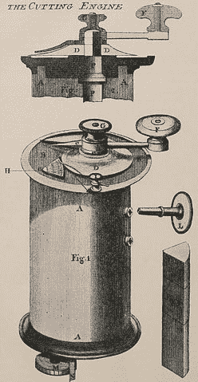

###### 图 7-8. 一幅早期的图示了 1770 年的显微切片机。 (来源：[维基共享资源](https://commons.wikimedia.org/wiki/File:Cummings_1774_Microtome.jpg).)

## 荧光显微镜

荧光显微镜是一种利用荧光现象的光学显微镜，其中材料样本吸收一种波长的光并以另一种波长发射。这是一种自然的物理现象；例如，一些矿物质在暴露在紫外光下时会发出荧光。然而，当应用于生物学时，情况就变得特别有趣。许多细菌在其蛋白质吸收高能光并发射低能光时会自然发出荧光。

### 荧光物质和荧光标记

荧光物质是一种可以在特定波长重新发射光的化合物。这些化合物在生物学中是至关重要的工具，因为它们允许实验者详细地成像给定细胞的特定组分。在实验中，荧光物质通常作为染料应用到特定细胞上。图 7-9 展示了一种常见荧光物质的分子结构。

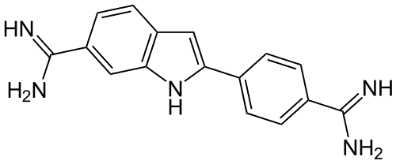

###### 图 7-9. DAPI（4'，6-二胺基二苯基吲哚）是一种常见的荧光染料，结合到 DNA 的腺嘧啶-胸腺嘧啶富集区域。因为它可以穿过细胞膜，所以常用来染色细胞内部。 (来源：[维基共享资源](https://commons.wikimedia.org/wiki/File:DAPI.svg).)

荧光标记是一种将荧光物质附着到体内感兴趣的生物分子的技术。有多种有效的技术可以实现这一点。在显微镜成像中很有用，常常希望突出图像的特定部分。荧光标记可以非常有效地实现这一点。

荧光显微镜已经被证明对生物研究是一个巨大的福音，因为它允许研究人员放大给定生物样本中的特定子系统，而不是处理整个样本。在研究单个细胞或细胞内的单个分子时，使用标记可以证明对于聚焦注意力于有趣的子系统是非常宝贵的。图 7-10 显示了如何使用荧光染料选择性地可视化人类细胞核中的特定染色体。

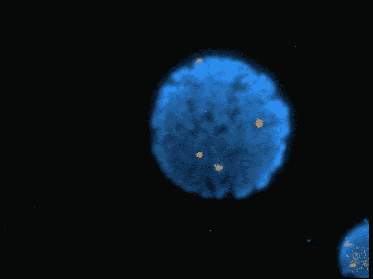

###### 图 7-10。一个人类淋巴细胞核图像，染色体 13 和 21 染有 DAPI（一种流行的荧光染料）以发出光。 （来源：[维基百科](https://commons.wikimedia.org/wiki/File:FISH_13_21.jpg)。）

荧光显微镜可以是一个非常精确的工具，用于跟踪分子的单一结合事件等事件。例如，蛋白质与配体的结合事件（如第五章中讨论的）可以通过荧光测定法检测到。

## 样本制备人为物

值得注意的是，样本制备可能是一个非常棘手的过程。原始样本的制备常常会导致被成像对象的变形，这可能会导致一些混淆。一个有趣的例子是中间体的情况，下面的警告说明中讨论了这一点。

### 中间体：一个虚构的细胞器

为了进行电子显微镜检查，固定细胞的过程引入了一个关键的人为物，即革兰氏阳性细菌中的*中间体*（见图 7-11）。由于为电子显微镜制备样本的过程导致的细胞壁降解，最初被认为是自然结构而不是人为物。

请注意，类似的人为物可能存在于您自己的样本中。此外，深度网络完全有可能训练自己检测这种人为物，而不是训练自己发现真实的生物学。

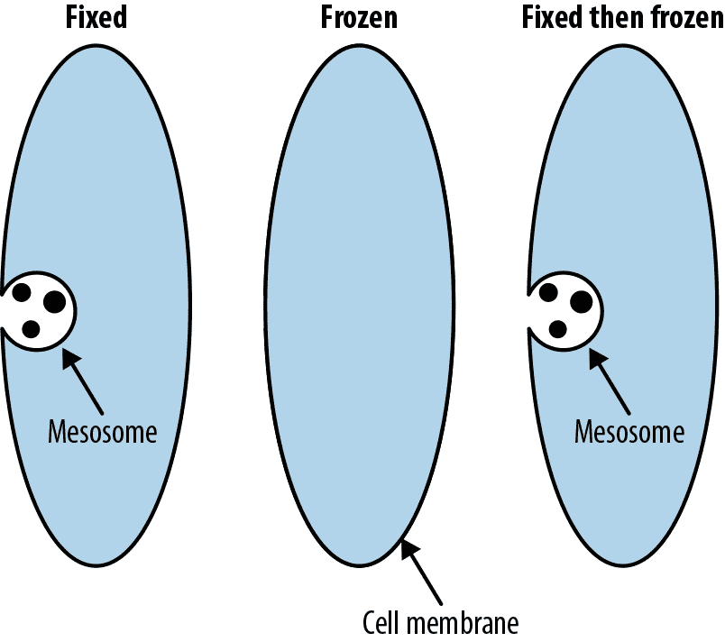

###### 图 7-11。中间体是由电子显微镜制备引入的人为物，曾被认为是细胞中真实结构。 （改编自[维基百科](https://en.wikipedia.org/wiki/Mesosome#/media/File:Mesosome_formation.svg)。）

# 追踪显微镜样本的来源

当您设计处理显微镜数据的系统时，跟踪样本的来源将至关重要。每个图像应该带有关于收集图像的条件的信息。这可能包括用于捕获图像的物理设备、监督成像过程的技术人员、被成像的样本以及收集样本的物理位置。生物学是极其棘手的“调试”。像前面警告中描述的问题可能长期未被追踪。确保维护有关图像来源的充分元数据可能会在未来为您和您的团队避免重大问题。

# 深度学习应用

在本节中，我们简要回顾了深度学习在显微镜学中的各种应用，如细胞计数、细胞分割和计算测定法构建。正如我们之前在本章中所指出的，这只是深度显微镜可能的应用的有限子集。然而，了解这些基本应用将使您具备发明自己新的深度显微镜应用所需的理解。

## 细胞计数

一个简单的任务是计算出现在给定图像中的细胞数量。您可能会合理地问为什么这是一个有趣的任务。对于许多生物实验，跟踪经过给定干预后存活的细胞数量可能非常有用。例如，也许这些细胞来自一个癌细胞系，而干预是应用抗癌化合物。一个成功的干预会减少活着的癌细胞数量，因此有一个可以准确计算这些活着的细胞数量的深度学习系统而无需人工干预将是非常有用的。

# 什么是细胞系？

在生物学中，研究特定类型的细胞通常是有用的。对一组细胞进行实验的第一步是获得大量这样的细胞。细胞系就是这样的细胞。细胞系是从特定来源培养出来的细胞，在实验室条件下可以稳定生长。

细胞系已经在无数生物学论文中使用，但对其进行的科学研究往往存在严重的担忧。首先，将细胞从其自然环境中移除可能会从根本上改变其生物学特性。越来越多的证据表明，细胞的环境可以从根本上塑造其对刺激的反应。

更严重的是，细胞系经常受到污染。来自一个细胞系的细胞可能会污染来自另一个细胞系的细胞，因此在“乳腺癌”细胞系上的结果实际上对乳腺癌研究者来说毫无意义！

因此，对细胞系的研究经常受到谨慎对待，其结果仅作为尝试在动物或人类测试中复制的动力。尽管如此，细胞系研究为生物研究提供了一个宝贵的简单入口点，并且仍然普遍存在。

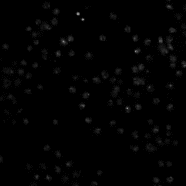

###### 图 7-12。果蝇细胞样本。请注意显微镜图像中的图像条件与照片中的图像条件可能会有很大不同。（来源：[细胞图像库](http://cellimagelibrary.org/images/21780)。）

正如图 7-12 所示，细胞显微镜图像中的图像条件可能与标准图像条件有很大不同，因此并不明显卷积神经网络等技术是否可以适应细胞计数等任务。幸运的是，大量的实验工作表明，卷积网络在学习显微镜数据集方面表现得相当不错。

### 在 DeepChem 中实现细胞计数

本节将介绍使用 DeepChem 进行细胞计数的深度学习模型的构建。我们将从加载和特征化细胞计数数据集开始。我们使用[广泛生物图像基准集](https://data.broadinstitute.org/bbbc/)（BBBC）来获取一个有用的显微镜数据集。

# BBBC 数据集

BBBC 数据集包含来自各种细胞分析的注释生物图像数据集的有用集合。这是一个有用的资源，可以帮助您训练自己的深度显微镜模型。DeepChem 拥有一系列图像处理资源，使您更容易处理这些数据集。特别是，DeepChem 的`ImageLoader`类有助于加载数据集。

# 处理图像数据集

图像通常以标准图像文件格式（PNG、JPEG 等）存储在磁盘上。图像数据集的处理流程通常会从磁盘中读取这些文件，并将它们转换为适当的内存表示，通常是一个多维数组。在 Python 处理流程中，这个数组通常只是一个 NumPy 数组。对于一个高为*N*像素，宽为*M*像素，具有 3 个 RGB 颜色通道的图像，你会得到一个形状为(*N*, *M*, 3)的数组。如果你有 10 张这样的图像，这些图像通常会被批处理成一个形状为(10, *N*, *M*, 3)的数组。

在将数据集加载到 DeepChem 之前，您首先需要将其下载到本地。我们将用于此任务的 BBBC005 数据集相当大（略小于 2 GB），因此请确保您的开发机器有足够的可用空间：

```py
wget https://data.broadinstitute.org/bbbc/BBBC005/BBBC005_v1_images.zip
unzip BBBC005_v1_images.zip

```

将数据集下载到本地计算机后，您现在可以使用`ImageLoader`将此数据集加载到 DeepChem 中：

```py
image_dir = 'BBBC005_v1_images'
files = []
labels = []
for f in os.listdir(image_dir):
 if f.endswith('.TIF'):
  files.append(os.path.join(image_dir, f))
  labels.append(int(re.findall('_C(.*?)_', f)[0]))
loader = dc.data.ImageLoader()
dataset = loader.featurize(files, np.array(labels))

```

这段代码遍历了图像的下载目录并提取了图像文件。标签被编码在文件名中，因此我们使用简单的正则表达式来提取每个图像中的细胞数量。我们使用`ImageLoader`将其转换为 DeepChem 数据集。

现在让我们将这个数据集分成训练、验证和测试集：

```py
splitter = dc.splits.RandomSplitter()
train_dataset, valid_dataset, test_dataset = splitter.train_valid_test_split(
	  dataset, seed=123)

```

现在，我们可以定义模型本身。在这种情况下，让我们制作一个简单的卷积架构，最后是一个全连接层：

```py
learning_rate = dc.models.tensorgraph.optimizers.ExponentialDecay(0.001, 0.9,
                                                                 250)
model = dc.models.TensorGraph(learning_rate=learning_rate, model_dir='model')
features = layers.Feature(shape=(None, 520, 696))
labels = layers.Label(shape=(None,))
prev_layer = features
for num_outputs in [16, 32, 64, 128, 256]:
 prev_layer = layers.Conv2D(num_outputs, kernel_size=5, stride=2, 
 							in_layers=prev_layer)
output = layers.Dense(1, in_layers=layers.Flatten(prev_layer))
model.add_output(output)
loss = layers.ReduceSum(layers.L2Loss(in_layers=(output, labels)))
model.set_loss(loss)

```

请注意，我们使用`L2Loss`来训练我们的模型作为回归任务。尽管细胞计数是整数，但我们对图像中细胞数量没有自然的上限。

训练这个模型将需要一些计算工作（稍后会详细介绍），因此，为了开始，我们建议使用我们的预训练模型进行基本实验。这个模型可以直接用于进行预测。有关下载预训练模型的说明，请参见与本书相关的[代码存储库](https://github.com/deepchem/DeepLearningLifeSciences)。下载完成后，您可以使用以下方法将预训练权重加载到模型中：

```py
model.restore()
```

让我们拿出这个预训练模型试试。首先，我们将计算我们的细胞计数任务的测试集上的平均预测误差：

```py
y_pred = model.predict(test_dataset).flatten()                           
print(np.sqrt(np.mean((y_pred-test_dataset.y)**2)))

```

当您尝试运行模型时，您会得到什么准确性？

那么，您如何为自己训练这个模型呢？您可以通过在数据集上训练 50 个时期来拟合模型：

```py
model.fit(train_dataset, nb_epoch=50)

```

这个学习任务将需要一定的计算资源。在一台好的 GPU 上，它应该在一个小时左右内完成。在 CPU 系统上轻松训练模型可能不可行。

训练后，在验证和测试集上测试模型的准确性。它是否与预训练模型的匹配？

## 细胞分割

细胞分割的任务涉及注释给定细胞显微镜图像，以指示细胞出现的位置和背景出现的位置。为什么这很有用？如果您回想一下我们之前讨论的革兰氏阳性和革兰氏阴性细菌，您可能会猜到为什么一个自动系统用于分离这两种细菌类型可能会很有用。事实证明，类似的问题在所有细胞显微镜图像中都会出现（以及在我们将在第八章中看到的成像的其他领域）。

分割掩模提供了显着更精细的分辨率，并允许进行比细胞计数更精细的分析。例如，了解给定板上有多少细胞覆盖可能是有用的。一旦生成了分割掩模，这样的分析就很容易进行。图 7-13 提供了从合成数据集生成的分割掩模的示例。

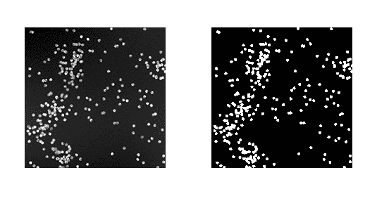

###### 图 7-13\. 细胞的合成数据集（左侧）以及前景/背景掩模，注明细胞出现在图像中的位置。 (来源: [Broad Institute](https://data.broadinstitute.org/bbbc/BBBC005/).)

也就是说，分割要求机器学习模型比计数要求更多。能够精确区分细胞和非细胞区域需要更高的学习精度。因此，不足为奇的是，机器学习分割方法仍然比简单的细胞计数方法更难使其正常工作。我们将在本章后面尝试一个分割模型。

# 分割掩模是从哪里来的？

值得注意的是，分割掩模是复杂的对象。除了深度学习技术外，一般不存在生成这种掩模的好算法。那么我们如何启动训练所需的数据以改进深度分割技术？一个可能的方法是使用合成数据，就像图 7-13 中那样。因为细胞图像是以合成方式生成的，掩模也可以合成生成。这是一个有用的技巧，但它显然有局限性，因为它将限制我们学到的分割方法适用于类似的图像。

一个更一般的程序是让人类注释者生成合适的分割掩模。类似的程序被广泛用于训练自动驾驶汽车。在那个任务中，找到注释行人和街道标志的分割是至关重要的，大量的人类分割者被用来生成所需的训练数据。随着机器学习显微镜技术的重要性不断增长，类似的人类流水线可能会变得至关重要。

### 在 DeepChem 中实现细胞分割

在这一部分，我们将在与之前用于细胞计数任务相同的 BBBC005 数据集上训练一个细胞分割模型。然而，这里有一个关键的微妙之处。在细胞计数挑战中，每个训练图像都有一个简单的计数作为标签。然而，在细胞分割任务中，每个标签本身就是一幅图像。这意味着细胞分割模型实际上是一种“图像转换器”，而不是简单的分类或回归模型。让我们从获取这个数据集开始。我们必须从 BBBC 网站检索分割掩模，使用以下命令：

```py
wget https://data.broadinstitute.org/bbbc/BBBC005/BBBC005_v1_ground_truth.zip
unzip BBBC005_v1_ground_truth.zip

```

地面真实数据大约是 10MB，所以下载起来应该比完整的 BBBC005 数据集更容易。现在让我们将这个数据集加载到 DeepChem 中。幸运的是，`ImageLoader`已经设置好处理图像分割数据集，不需要太多额外的麻烦：

```py
image_dir = 'BBBC005_v1_images'
label_dir = 'BBBC005_v1_ground_truth'
rows = ('A', 'B', 'C', 'D', 'E', 'F', 'G', 'H', 'I', 'J', 'K', 'L',
		'M', 'N', 'O', 'P')
blurs = (1, 4, 7, 10, 14, 17, 20, 23, 26, 29, 32, 35, 39, 42, 45, 48)
files = []
labels = []
for f in os.listdir(label_dir):
 if f.endswith('.TIF'):
  for row, blur in zip(rows, blurs):
   fname = f.replace('_F1', '_F%d'%blur).replace('_A', '_%s'%row)
   files.append(os.path.join(image_dir, fname))
   labels.append(os.path.join(label_dir, f))
loader = dc.data.ImageLoader()
dataset = loader.featurize(files, labels)

```

现在我们已经加载和处理了我们的数据集，让我们开始构建一些深度学习模型。和以前一样，我们将把这个数据集分成训练、验证和测试集：

```py
splitter = dc.splits.RandomSplitter()
train_dataset, valid_dataset, test_dataset = splitter.train_valid_test_split(
	  dataset, seed=123)

```

我们可以使用什么架构来进行图像分割任务？这不仅仅是使用一个简单的卷积架构，因为我们的输出本身需要是一幅图像（分割掩模）。幸运的是，过去已经有一些适合这个任务的架构。U-Net 架构使用一系列堆叠的卷积来逐渐“下采样”然后“上采样”源图像，如图 7-14 所示。这种架构在图像分割任务中表现良好。


###### 图 7-14。生物医学图像分割的 U-Net 架构表示。（改编自[弗莱堡大学](https://lmb.informatik.uni-freiburg.de/people/ronneber/u-net/)。）

现在让我们在 DeepChem 中实现 U-Net：

```py
learning_rate = dc.models.tensorgraph.optimizers.ExponentialDecay(0.01, 0.9, 250)
model = dc.models.TensorGraph(learning_rate=learning_rate, 
							  model_dir='segmentation')
features = layers.Feature(shape=(None, 520, 696, 1)) / 255.0
labels = layers.Label(shape=(None, 520, 696, 1)) / 255.0
# Downsample three times.
conv1 = layers.Conv2D(16, kernel_size=5, stride=2, in_layers=features)
conv2 = layers.Conv2D(32, kernel_size=5, stride=2, in_layers=conv1)
conv3 = layers.Conv2D(64, kernel_size=5, stride=2, in_layers=conv2)
# Do a 1x1 convolution.
conv4 = layers.Conv2D(64, kernel_size=1, stride=1, in_layers=conv3)
# Upsample three times.
concat1 = layers.Concat(in_layers=[conv3, conv4], axis=3)
deconv1 = layers.Conv2DTranspose(32, kernel_size=5, stride=2, in_layers=concat1)
concat2 = layers.Concat(in_layers=[conv2, deconv1], axis=3)
deconv2 = layers.Conv2DTranspose(16, kernel_size=5, stride=2, in_layers=concat2)
concat3 = layers.Concat(in_layers=[conv1, deconv2], axis=3)
deconv3 = layers.Conv2DTranspose(1, kernel_size=5, stride=2, in_layers=concat3)
# Compute the final output.
concat4 = layers.Concat(in_layers=[features, deconv3], axis=3)
logits = layers.Conv2D(1, kernel_size=5, stride=1, activation_fn=None, 
					   in_layers=concat4)
output = layers.Sigmoid(logits)
model.add_output(output)
loss = layers.ReduceSum(layers.SigmoidCrossEntropy(in_layers=(labels, logits)))
model.set_loss(loss)

```

这种架构比用于细胞计数的架构稍微复杂一些，但我们使用相同的基本代码结构和堆叠卷积层来实现我们想要的架构。和以前一样，让我们使用一个预训练模型来尝试这个架构。下载预训练模型的指导可在书的[代码库](https://github.com/deepchem/DeepLearningLifeSciences)中找到。一旦你把预训练权重放好，你可以像以前一样加载权重：

```py
model.restore()

```

让我们使用这个模型创建一些掩模。调用`model.predict_on_batch()`允许我们预测一批输入的输出掩模。我们可以通过将我们的掩模与地面真实掩模进行比较并检查重叠部分来检查我们预测的准确性：

```py
scores = []
for x, y, w, id in test_dataset.itersamples():
 y_pred = model.predict_on_batch([x]).squeeze()
 scores.append(np.mean((y>0) == (y_pred>0.5)))
print(np.mean(scores))

```

这应该返回大约 0.9899。这意味着将近 99% 的像素被正确预测了！这是一个不错的结果，但我们应该强调这只是一个玩具学习任务。一个简单的图像处理算法加上亮度阈值可能也能做得差不多。不过，这里展示的原则应该能够适用于更复杂的图像数据集。

好的，现在我们已经使用预训练模型进行了探索，让我们从头开始训练一个 U-Net 模型，进行 50 个 epochs 的训练，看看我们能得到什么结果：

```py
model.fit(train_dataset, nb_epoch=50, checkpoint_interval=100)

```

和之前一样，这种训练需要大量的计算资源，在一台性能良好的 GPU 上可能需要几个小时。在 CPU 系统上训练这个模型可能并不可行。一旦模型训练完成，尝试运行结果并看看你得到了什么。你能达到预训练模型的准确率吗？

## 计算实验

细胞计数和分割是相当直观的任务，因此并不奇怪机器学习模型能够在这类数据集上表现良好。人们可能会合理地问，机器学习模型是否只能做到这些。

幸运的是，答案是否定的！机器学习模型能够捕捉到数据集中微妙的信号。例如，一项研究表明，深度学习模型能够预测原始图像中荧光标记的输出。值得停下来考虑这个结果有多么令人惊讶。正如我们在“为显微镜准备生物样本”中看到的，荧光染色可能是一个相当复杂的过程。令人惊讶的是，深度学习可能能够减少一些必要的准备工作。

这是一个令人兴奋的结果，但值得注意的是，这仍然是一个早期的结果。还需要做大量工作来“加固”这些技术，以便它们能够更广泛地应用。

# 结论

在本章中，我们向您介绍了显微镜学的基础知识以及一些基本的显微系统机器学习方法。我们对现代显微镜学的一些基本问题（尤其是应用于生物问题）进行了广泛介绍，并讨论了深度学习已经产生影响的领域，以及它未来可能产生更大影响的领域。

我们还提供了显微镜学中一些物理和生物学的全面概述，并试图传达为什么这些信息对于那些主要关注构建有效处理显微镜图像和模型管道的开发人员可能是有用的。了解物理原理，比如衍射极限，将使您能够理解为什么使用不同的显微技术以及深度学习可能对该领域的未来至关重要。了解生物样本制备技术将帮助您理解在设计实用显微系统时需要跟踪的元数据和注释类型。

虽然我们对深度学习技术在显微镜学中的潜在应用感到非常兴奋，但我们需要强调这些方法存在一些注意事项。首先，一些最近的研究强调了视觉卷积模型的脆弱性。简单的伪影可能会让这些模型出错并导致重大问题。例如，一个停车标志的图像可能会被轻微扰动，以至于模型将其分类为绿色交通灯。这对于自动驾驶汽车来说将是灾难性的！

鉴于这些证据，值得问一下深度显微镜模型存在哪些潜在的陷阱。深度显微镜模型是否可能只是从记忆中的先前数据点中填充？即使这并非其性能的全部解释，但至少部分深度模型的能力可能来自这种记忆数据的反刍。这很可能会导致虚假相关性的插补。因此，在对微观数据集进行科学分析时，停下来质疑你的结果是否是由模型人为因素或真实生物现象造成的将至关重要。我们将在接下来的章节中为您提供一些工具，以便您批判性地审查模型，从而更好地确定您的模型实际学到了什么。

在下一章中，我们将探讨深度学习在医学中的应用。我们将重复本章中涵盖的许多视觉深度学习技能。

¹ 欧阳伟等人。“深度学习大大加速了超分辨率定位显微镜。”*自然生物技术*36（2018 年 4 月）：460–468。[*https://doi.org/10.1038/nbt.4106*](https://doi.org/10.1038/nbt.4106)。

² 陶鑫等人。“用于深度图像去模糊的尺度循环网络。”[*https://arxiv.org/pdf/1802.01770.pdf*](https://arxiv.org/pdf/1802.01770.pdf)。2018 年。

³ 克里斯滕森，埃里克。“体外标记：预测未标记图像中的荧光标记。”[*https://github.com/google/in-silico-labeling*](https://github.com/google/in-silico-labeling)。

⁴ 罗森菲尔德，阿米尔，理查德·泽梅尔和约翰·K·索索斯。“房间里的大象。”[*https://arxiv.org/abs/1808.03305*](https://arxiv.org/abs/1808.03305)。2018 年。
