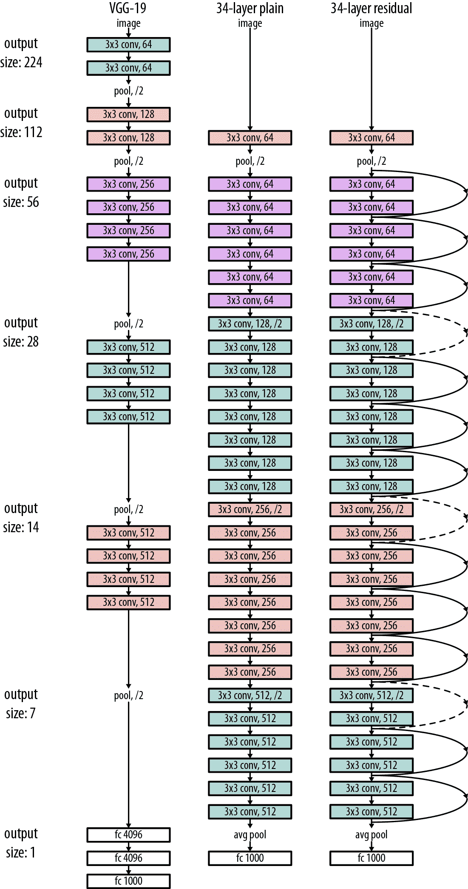
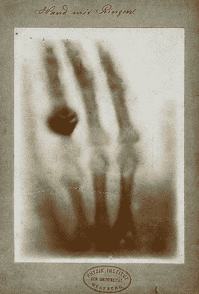
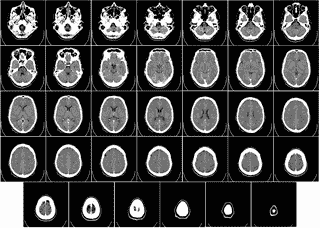
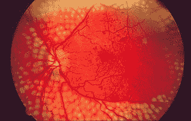

# 第八章：医学的深度学习

正如我们在上一章中看到的，从视觉数据集中提取有意义的信息对于分析显微镜图像是有用的。这种处理视觉数据的能力同样对医学应用非常有用。现代医学的许多领域需要医生对医学扫描进行批判性分析。深度学习工具有可能使这种分析变得更加简单和快速（但可能更少可解释）。

让我们学习更多。我们将从简要概述早期的医学计算技术开始。我们将讨论一些这些方法的局限性，然后我们将开始介绍当前一系列基于深度学习的医学技术。我们将解释这些新技术如何可能使我们绕过旧技术的一些基本限制。我们将以讨论将深度学习应用于医学的一些伦理考虑结束本章。

# 计算机辅助诊断

设计计算机辅助诊断系统自从该领域出现以来一直是人工智能研究的主要焦点。最早的尝试使用手工策划的知识库。在这些系统中，专家医生将被征求编写因果推理规则（例如，参见图 8-1）。

通过确定性因素对不确定性进行基本支持。


###### 图 8-1。MYCIN 是一个早期用于诊断细菌感染的专家系统。这是一个 MYCIN 推理规则的示例（改编自[萨里大学](http://www.computing.surrey.ac.uk/ai/PROFILE/mycin.html#Certainity%20Factors)）。

这些规则是使用逻辑引擎组合的。设计了许多有效的推理技术，可以有效地组合大量的规则数据库。这种系统传统上被称为“专家系统”。

# 专家系统发生了什么？

尽管专家系统取得了一些显著的成功，但构建这些系统需要大量的努力。规则必须从专家那里费力地征求，并由训练有素的“知识工程师”策划。虽然一些专家系统在有限的领域取得了惊人的成果，但总体上它们过于脆弱，无法广泛使用。尽管如此，专家系统对计算机科学的许多领域产生了重大影响，许多现代技术（SQL、XML、贝叶斯网络等）都从专家系统技术中汲取灵感。

如果你是开发者，最好停下来考虑一下。尽管专家系统曾经是一项炙手可热的技术，但它们目前主要存在于历史的好奇中。今天大多数炙手可热的技术很可能最终会成为计算机科学历史上的好奇。这是计算机科学的一个特点，而不是一个缺陷。这个领域在快速重新发明自己，因此我们可以相信，取代今天技术的工具将满足一些今天的工具无法满足的关键需求。同时，就像专家系统一样，我们可以放心，今天技术的算法基础将在明天的工具中延续。

医学专家系统取得了一定的成就。其中一些被广泛部署并被国际接受。然而，这些系统未能在日常医生和护士中取得重大进展。一个问题是它们非常挑剔且难以使用。它们还要求用户能够以高度结构化的格式传递患者信息。考虑到当时计算机几乎没有进入标准诊所，要求医生和护士接受高度专业化的培训被证明是一个过大的要求。

# 使用贝叶斯网络进行概率诊断

专家系统工具的另一个主要问题是它们只能提供确定性预测。这种确定性预测并没有留下太多的不确定性空间。如果医生遇到一个诊断不明确的棘手患者怎么办？有一段时间，似乎如果专家系统可以修改以考虑不确定性，这将使它们取得成功。

这一基本观点引发了大量关于贝叶斯网络用于临床诊断的工作。（本书的一位作者在本科时曾花了一年时间研究这样的系统。）然而，这些系统遭受了与专家系统相同的许多限制。仍然需要从医生那里获取结构知识，而贝叶斯临床网络的设计者面临着从医生那里获取有意义概率的额外挑战。这个过程给采用过程增加了显著的开销。

此外，训练贝叶斯网络可能会很复杂。不同类型的贝叶斯网络需要不同的算法。与几乎所有网络都适用的梯度下降技术相比，这与深度学习算法形成了对比。学习的鲁棒性通常是促使广泛采用的原因。这一基本观点引发了大量关于贝叶斯网络用于临床诊断的工作。（参见图 8-2 中的一个贝叶斯网络的简单示例。）


###### 图 8-2. 一个简单的贝叶斯网络示例，用于推断特定位置的草是否潮湿。（来源：[维基媒体](https://commons.wikimedia.org/wiki/File:SimpleBayesNet.svg)。）

# 易用性推动采用

专家系统和贝叶斯网络都未能赢得广泛的采用。至少部分原因是这些系统在开发者体验方面非常糟糕。从开发者的角度来看，设计贝叶斯网络或专家系统都需要不断地让医生参与开发。此外，系统的有效性关键取决于开发团队从医生那里提取有价值的见解的能力。

与深度网络形成对比。对于给定的数据类型（图像、分子、文本等）和给定的学习任务，有一组标准的度量可供使用。开发者只需遵循最佳的统计实践（如本书或其他书所教授的）即可构建一个功能性系统。对专业知识的依赖大大减少。这种简化无疑部分原因解释了深度网络为何获得了更广泛的采用。

# 电子健康记录数据

传统上，医院为他们的患者维护纸质档案。这些档案记录了患者的检查、药物和其他治疗，使医生可以通过快速查看档案来跟踪患者的健康状况。不幸的是，纸质健康记录存在许多困难。在医院之间转移记录需要大量工作，而且很难对纸质健康记录数据进行索引或搜索。

因此，在过去几十年中，许多国家都在大力推动从纸质记录转向电子健康记录（EHRs）。在美国，《平价医疗法案》的采用显著加速了它们的采用，现在大多数美国主要医疗提供商都将患者记录存储在 EHR 系统中。

电子健康记录系统的广泛应用推动了与电子健康记录数据一起工作的机器学习系统研究的繁荣。这些系统旨在使用大量患者记录的数据集来训练模型，以便能够预测诸如患者结果或风险等内容。在许多方面，这些电子健康记录模型是我们刚刚学习的专家系统和贝叶斯网络的智力继承者。与这些早期系统类似，电子健康记录模型旨在帮助诊断过程。然而，尽管早期系统旨在帮助医生进行实时诊断，但这些更新的系统（大多数）仅在后端工作。

许多项目已经尝试从电子健康记录数据中学习稳健的模型。虽然已经取得了一些显著成功，但对从业者来说，在电子健康记录数据上进行学习仍然具有挑战性。由于隐私问题，目前没有太多大型公共电子健康记录数据集可用。因此，迄今为止，只有少数精英研究人员能够设计这些系统。此外，电子健康记录数据往往非常混乱。由于人类医生和护士手动输入信息，大多数电子健康记录数据存在缺失字段和各种不同的约定。创建能够处理缺失数据的稳健模型已被证明具有挑战性。

# ICD-10 代码

ICD-10 是用于患者疾病和症状的一组“代码”。这些标准代码近年来得到广泛采用，因为它们使保险公司和政府机构能够为疾病设定标准实践、治疗和治疗价格。

ICD-10 代码将人类疾病的高维连续空间“量化”（离散化）。通过标准化，它们使医生能够比较和分组患者。值得注意的是，出于这个原因，这些代码可能对电子健康记录系统和模型的开发者具有重要意义。如果您正在为新的电子健康记录系统设计数据仓库，请确保考虑您将放置代码的位置！

# 快速医疗互操作性资源（FHIR）

快速医疗互操作性资源（FHIR）规范是为了以标准和灵活的格式表示临床数据而开发的。来自谷歌的最新工作展示了如何将原始电子健康记录数据自动转换为 FHIR 格式。使用这种格式可以开发标准的深度架构，可以应用于任意电子健康记录数据，这意味着可以以即插即用的方式使用这些数据的标准开源工具。这项工作仍处于早期阶段，但对该领域的进展具有激动人心的意义。尽管标准化乍看起来可能很无聊，但它是未来进步的基础，因为它意味着可以有效地处理更大的数据集。

然而，这种情况开始发生改变。改进的工具，无论是用于预处理还是学习，已经开始使得在电子健康记录系统上进行有效学习成为可能。DeepPatient 系统在患者的医疗记录上训练一个去噪自动编码器，以创建一个患者表示，然后用于预测患者结果。在这个系统中，患者的记录从一组无序的文本信息转换为一个向量。将不同数据类型转换为向量的这种策略在深度学习中取得了广泛成功，并似乎有望在电子健康记录系统中提供有意义的改进。文献中出现了许多基于电子健康记录系统的模型，其中许多开始融入深度学习的最新工具，如循环网络或强化学习。虽然具有这些最新功能的模型仍在不断发展，但它们非常令人兴奋，并为未来几年该领域可能发展的方向提供了指引。

# 无监督学习呢？

在本书的大部分内容中，我们主要展示了监督学习方法。还有一整类“无监督”学习方法，它们不像监督训练数据那样依赖于标签。我们还没有真正介绍无监督学习作为一个概念，但基本思想是我们不再有与数据点相关联的标签。例如，想象我们有一组电子病历记录，但没有患者结果数据。我们能做什么？

最简单的答案是我们可以*聚类*记录。举个玩具例子，想象我们有“双胞胎”患者，他们的电子病历记录是相同的。预测这两位患者的结果会相似似乎是合理的。无监督学习技术，如*k*-means 或自动编码器实现了这种基本直觉的更复杂形式。您将在第九章中看到一个无监督算法的复杂示例。

无监督技术可以提供一些引人注目的见解，但这些方法有时可能命中或失误。虽然有一些引人注目的用例，如 DeepPatient，但总体而言，无监督方法仍然足够棘手，尚未广泛使用。然而，如果您是研究人员，致力于稳定无监督学习的方法仍然是一个引人注目（且具有挑战性）的未解问题。

## 大型患者电子病历数据库的危险？

许多大型机构正在向所有患者使用电子病历系统迈进。当这些大型数据集被标准化（可能以 FHIR 格式）并实现互操作性时会发生什么？积极的一面是，可能会支持应用程序，例如搜索具有特定疾病表型的患者。这种专注的搜索功能可能有助于医生更有效地为患者找到治疗方法，特别是对于患有罕见疾病的患者。

然而，不难想象大型患者数据库可能被恶意利用。例如，保险公司可能使用患者结果系统预先拒绝对高风险患者的保险，或者寻求保持高患者存活率的顶级外科医生可能避免对系统标记为高风险的患者进行手术。我们如何防范这些危险？

许多机器学习系统提出的问题无法用机器学习工具解决。相反，这些问题的答案可能在于禁止医生、保险公司和其他人的掠夺行为的立法。

# 电子病历真的有助于医生吗？

虽然电子病历显然有助于设计学习算法，但没有令人信服的证据表明电子病历实际上改善了医生的生活。挑战的一部分是今天的电子病历要求医生进行大量手动数据输入。对于患者来说，这创造了一种新的熟悉动态，医生在大部分咨询时间都在看电脑，而不是看实际患者。

这种现状让患者和医生都感到不满。医生感到疲惫，因为他们大部分时间都在做文书工作，而不是照顾患者，患者感到被忽视。下一代深度学习系统的希望是未来产品可能会改善这种不平衡。

然而，有一个真正的机会，下一代深度学习工具可能同样对医生不友好且无益。电子病历系统的设计者也没有旨在制造不友好的系统。

# 深度放射学

放射学是利用医学扫描来诊断疾病的科学。医生使用各种不同的扫描，如 MRI 扫描、超声波、X 射线和 CT 扫描。对于每一种扫描，挑战是从给定的扫描图像中诊断患者的状态。这看起来是一个非常适合卷积学习方法的挑战。正如我们在前几章中看到的，深度学习方法能够从图像数据中学习复杂的函数。现代放射学的大部分（至少是机械部分）包括对复杂医学图像数据进行分类和处理。扫描在医学中有着悠久而传奇的历史（参见图 8-4 中早期 X 射线的例子）。

在本节中，我们将快速介绍一些不同类型的扫描，并简要介绍一些深度学习应用。许多这些应用在质量上是相似的。它们首先从医疗机构获取足够大的扫描数据集。这些扫描用于训练卷积架构（参见图 8-3）。通常，该架构是标准的 VGG 或 ResNet 架构，但有时会对核心结构进行一些调整。经过训练的模型通常（至少根据可能天真的统计数据）在所涉及的任务上表现出色。



###### 图 8-3。这张图展示了一些标准的卷积架构（VGG-19，Resnet-34，数字表示应用的卷积数量）。这些架构是图像任务的标准，通常用于医疗应用。

这些进展导致了一些可能夸大的期望。一些知名的人工智能科学家，尤其是 Geoff Hinton，评论说，深度学习在放射学方面的发展将会进展到不再值得在不久的将来培训新的放射科医生。这是真的吗？最近有一系列进展，深度学习系统似乎已经实现了接近人类表现的成果。然而，这些结果带有许多警告，并且这些系统通常以未知的方式脆弱。

我们认为直接 1 对 1 替代医生的风险仍然很低，但存在系统性替代的真正风险。这是什么意思？新创企业正在努力创造新的商业模式，其中深度学习系统完成大部分扫描分析工作，只剩下少数医生。

# 深度学习实际上在学习医学吗？

对深度模型在医学图像中实际学习了什么进行了重要的分析。不幸的是，在许多情况下，深度模型似乎成功地捕捉到了图像中的非医学因素。例如，模型可能会隐式学习识别拍摄特定医学扫描的扫描中心。由于特定中心通常用于更严重或不太严重的患者，乍一看，模型可能看起来已经成功地学会了有用的医学知识，但实际上通常是无用的。

在这种情况下可以做些什么？对于这个问题，还没有定论，但一些早期方法正在出现。第一种方法是利用关于模型可解释性的不断增长的文献来仔细审查模型学习了什么。在第十章中，我们将深入探讨一些模型可解释性的方法。

另一种方法是在临床中进行前瞻性试验部署模型。前瞻性试验仍然是测试提出的医学干预措施的黄金标准，很可能它们在深度学习技术方面也将保持如此。

## X 射线扫描和 CT 扫描

非正式地说，X 射线扫描——如果我们要准确的话，是放射学——涉及使用 X 射线查看身体内部结构（图 8-4）。计算机断层扫描（CT）是 X 射线扫描的一种变体，其中 X 射线源和探测器围绕被成像的物体旋转，从而产生 3D 图像。



###### 图 8-4。威廉·伦琴拍摄的他妻子安娜·伯莎·路德维希手部的第一张医学 X 射线照片。自从这张第一张照片以来，X 射线技术已经取得了长足的进步，深度学习有可能进一步推动其发展！

一个常见的误解是 X 射线扫描只能成像“硬”物体，比如骨头。事实证明这是错误的。CT 扫描通常用于成像身体组织，比如大脑（图 8-5），而反散射 X 射线经常用于机场安检点成像旅客。乳腺 X 线摄影使用低能量 X 射线扫描乳腺组织。



###### 图 8-5。人脑的 CT 扫描从底部到顶部。注意 CT 扫描提供 3D 信息的能力。（来源：[维基媒体](https://commons.wikimedia.org/wiki/File:Computed_tomography_of_human_brain_-_large.png)。）

值得注意的是，所有 X 射线扫描都已知与癌症有关，因此一个常见的目标是通过限制所需扫描的数量来减少患者接受辐射的风险。这种风险在 CT 扫描中更为明显，因为为了收集足够的数据，必须让患者暴露在辐射下更长的时间。已经设计了各种信号处理算法来减少 CT 所需的扫描数量。一些令人兴奋的最新工作已经开始使用深度学习来进一步调整这个重建过程，从而减少所需的扫描数量。

然而，在这个领域中，深度学习的大多数用途是用于分类扫描。例如，卷积网络已被用于从 CT 脑图像中分类阿尔茨海默病的进展。其他工作声称能够从胸部 X 射线扫描中诊断肺炎，准确度接近医生水平。深度学习也被用于在乳房 X 线摄影中实现强大的分类准确度。

# 人类水平的准确性很棘手！

当一篇论文声称其系统实现了接近人类准确度时，值得停下来考虑这意味着什么。通常，论文的作者选择某个度量标准（比如 ROC AUC），一组外部医生对所选研究的测试集进行注释。然后将模型在这个测试集上的准确度与“平均”医生的准确度进行比较（通常是医生评分的平均值或中位数）。

这是一个相当复杂的过程，有很多方面可能导致比较出错。首先，度量标准的选择可能起到作用——往往改变度量标准的选择会导致不同的结果。良好的分析将考虑多种不同的度量标准，以确保结论对这种差异具有鲁棒性。

另一个需要注意的一点是医生之间存在相当大的差异。值得检查以确保你选择的“平均”是可靠的。一个更好的度量标准可能是询问你的算法是否能够击败小组中的“最佳”医生。

第三个问题是确保测试集没有“污染”可能非常棘手。（请参阅我们在第七章中的警告。）细微的污染形式可能发生，即同一患者的扫描意外地出现在训练集和测试集中。如果您的模型准确率非常高，值得多次检查以防止此类泄漏。我们过去都曾犯过这些管道上的错误。

最后，“人类水平的准确性”通常并不意味着太多。正如我们所指出的，一些专家系统和贝叶斯网络在有限的任务上达到了人类水平的准确性，但未能对医学产生广泛影响。原因是医生执行一系列紧密联系的任务。一个医生在扫描阅读方面可能表现不佳，但可能能够利用其他信息提供更好的诊断。值得记住，这些任务通常是合成的，可能不符合最佳的医师实践。需要进行前瞻性临床试验，使用深度学习系统与同意的患者一起，以更准确地评估这些技术的有效性。

## 组织学

组织学是研究组织的学科，通常通过显微镜扫描来观察。我们不会过多讨论这个问题，因为设计深度组织学系统的问题是深度显微镜面临的问题的一个子集。回顾一下那一章，了解更多信息。我们只会简单地指出，深度学习模型在组织学研究中取得了良好的表现。

## MRI 扫描

磁共振成像（MRI）是医生常用的另一种扫描形式。它不使用 X 射线，而是利用强磁场进行成像。因此，MRI 扫描的一个优点是辐射暴露有限。然而，这些扫描通常需要患者躺在嘈杂狭窄的 MRI 机器内，这种经历对患者可能比 X 射线扫描更不愉快。

像 CT 一样，MRI 能够组装 3D 图像。与 CT 扫描一样，许多深度学习研究试图简化这个重建过程。一些早期研究声称，深度学习技术可以改进传统信号处理方法，以减少 MRI 图像的扫描时间。此外，与其他扫描技术一样，许多研究试图使用深度网络对 MRI 图像进行分类、分割和处理，并取得了一些显著的成功。

# 信号处理的深度学习？

对于 CT 扫描和 MRI 扫描，我们已经提到深度网络已被用于更有效地帮助重建图像。这两个应用都是在信号处理中使用深度学习的更广泛趋势的例子。我们已经在旁敲侧击中看到了一些；超分辨率显微镜的深度学习方法也属于这个一般框架。

这种改进信号处理技术的工作从基础的角度来看非常令人兴奋，因为信号处理是一个高度数学化、发达的领域。深度学习在这里提供新的方向本身就是开创性的！然而，值得注意的是，传统的信号处理算法通常提供非常强大的基准线。因此，与图像分类不同，深度方法在这个领域尚未提供突破性的准确性改进。然而，这是一个持续而积极的研究领域。如果深度信号处理的工作最终比简单的图像处理更具影响力，这一点一点也不令人惊讶，因为这些技术有非常广泛的应用范围。

值得注意的是，医生使用许多其他类型的扫描。鉴于由强大的开源工具支持的深度学习应用的爆炸式增长，可以肯定地说，对于每种这样的扫描类型，都有一两项研究试图使用深度学习来完成任务。例如，深度学习已经应用于超声波、心电图（ECG）扫描、皮肤癌检测等。

卷积网络是一种非常强大的工具，因为人类活动很大程度上围绕着处理复杂的视觉信息。此外，开源框架的增长意味着全球研究人员已经加入了应用深度学习技术于新类型图像的竞赛。在许多方面，这种研究相对直接（至少在计算端），因为标准工具可以应用而不需要太多麻烦。如果您在一家公司工作时阅读本文，那么深度学习的这些特性很可能使您作为从业者感兴趣。

# 学习模型作为治疗方法

到目前为止，在本章中，我们已经看到学习模型可以成为医生的有效助手，帮助诊断和扫描理解的过程。然而，有一些令人兴奋的证据表明，学习模型可以超越成为医生的助手，成为治疗工具。

这可能如何运作呢？深度学习最大的优势之一是，现在首次有可能构建在感知数据上运行的实用软件。因此，机器学习系统有可能作为残疾患者的“眼睛”和“耳朵”。视觉系统可以帮助视力受损的患者更有效地在世界中导航。音频处理系统可以帮助听力受损的患者更有效地在世界中导航。这些系统面临着其他深度模型所没有的一系列挑战，因为它们必须在实时环境中有效运行。到目前为止，我们在本书中考虑过的所有模型都是批处理系统，适用于部署在后端服务器上，而不适用于部署在实时嵌入式设备上的模型。在处理机器学习生产中存在一系列挑战，我们在这里不会深入讨论，但我们鼓励感兴趣的读者深入研究这个主题。

我们还注意到，有一类独立的软件驱动治疗方法利用了现代软件对人类大脑的强大影响。最近的研究浪潮表明，现代软件应用如 Facebook、Google、微信等可以非常容易上瘾。这些应用程序设计有明亮的颜色，旨在刺激我们大脑中的许多相同中枢，就像赌场老虎机一样。越来越多的人认识到数字成瘾是许多患者面临的真正问题。这是本书范围之外的一个广泛领域，但我们指出，有证据表明现代软件的这种力量也可以用于好的方面。一些软件应用程序已经开发出利用现代应用程序的心理效应作为治疗干预的方法，帮助患有抑郁症或其他疾病的患者。

# 糖尿病视网膜病变

到目前为止，在本章中，我们已经从理论角度讨论了深度学习在医学上的应用。在本节中，我们将卷起袖子，用一个实际的例子来动手实践。具体来说，我们将建立一个模型来帮助诊断糖尿病视网膜病变患者的进展情况。

糖尿病视网膜病变是糖尿病损害眼睛健康的一种情况。这是导致失明的主要原因，尤其是在发展中国家。*眼底*是眼睛的内部区域，与晶状体相对。诊断糖尿病视网膜病变的常见策略是医生查看患者眼底的图像并手动标记。已经进行了大量工作来开发“眼底摄影”技术，以捕捉患者眼底图像（请参阅图 8-6）。



###### 图 8-6。一位接受了散射激光手术治疗糖尿病视网膜病变的患者眼底图像。（来源：[维基共享资源](https://commons.wikimedia.org/wiki/File:Fundus_photo_showing_scatter_laser_surgery_for_diabetic_retinopathy_EDA09.JPG)。）

糖尿病视网膜病变的学习挑战是设计一种算法，可以根据患者眼底图像对患者疾病进展进行分类。目前，进行这样的预测需要熟练的医生或技术人员。希望机器学习系统能够准确预测患者眼底图像的疾病进展。这可以为患者提供一种廉价的方法来了解他们的风险，他们可以在咨询更昂贵的专家医生进行诊断之前使用。

此外，与电子健康记录数据不同，眼底图像不包含关于患者的敏感信息，这使得收集大型眼底图像数据集更容易。因此，许多机器学习研究和挑战已经在糖尿病视网膜病变数据集上进行。特别是，Kaggle 赞助了一个[比赛](https://www.kaggle.com/c/diabetic-retinopathy-detection)，旨在创建良好的糖尿病视网膜病变模型，并组织了一个高分辨率眼底图像数据集。在本节的其余部分，您将学习如何使用 DeepChem 在 Kaggle 糖尿病视网膜病变（DR）数据集上构建糖尿病视网膜病变分类器。

# 获取 Kaggle 糖尿病视网膜病变数据集

Kaggle 挑战的条款禁止我们直接在 DeepChem 服务器上镜像数据。因此，您需要手动从 Kaggle 网站下载数据。您将需要在 Kaggle 注册一个帐户，并通过他们的 API 下载数据集。完整数据集相当大（80 GB），因此如果您的互联网连接无法处理完整下载，您可能选择下载数据的子集。

请查看与本书相关的[GitHub 存储库](https://github.com/deepchem/DeepLearningLifeSciences)以获取有关下载此数据集的更多信息。这里的图像加载函数要求训练数据以特定的目录结构组织。有关此目录格式的详细信息在 GitHub 存储库中。

处理这些数据的第一步是预处理和加载原始数据。特别是，我们将每个图像裁剪以聚焦其包含视网膜的中心正方形。然后，我们将调整此中心正方形的大小为 512x512。

# 处理高分辨率图像

许多医学和科学中的图像数据集将包含非常高分辨率的图像。虽然直接在这些高分辨率图像上训练深度学习模型可能很诱人，但这通常在计算上具有挑战性。一个问题是大多数现代 GPU 的内存有限。这意味着在标准硬件上可能无法训练非常高分辨率的模型。此外，大多数图像处理系统（目前）期望其输入图像具有固定形状。这意味着来自不同相机的高分辨率图像必须被裁剪以适应标准形状。

幸运的是，裁剪和调整图像大小通常不会对机器学习系统的性能造成严重损害。进行更彻底的数据增强也很常见，其中会从每个源图像自动生成一些扰动图像。在这个特定案例研究中，我们执行了一些标准的数据增强。我们鼓励您深入研究增强代码，因为它可能对您自己的项目是一个有用的工具。

核心数据存储在磁盘上的一组目录中。我们使用 DeepChem 的`ImageLoader`类从磁盘加载这些图像。如果您感兴趣，可以详细查看这些加载和预处理代码，但我们已将其封装成一个方便的辅助函数。与 MoleculeNet 加载器的风格相似，该函数还会进行随机训练、验证和测试分割：

```py
train, valid, test = load_images_DR(split='random', seed=123)

```

现在我们已经有了这个学习任务的数据，让我们构建一个卷积架构来从这个数据集中学习。这个任务的架构相当标准，类似于您在本书中已经看到的其他架构，因此我们在这里不再重复。这是对底层卷积网络的对象包装器的调用：

```py
# Define and build model
model = DRModel(
    n_init_kernel=32,
    batch_size=32,
    learning_rate=1e-5,
    augment=True,
    model_dir='./test_model')

```

这段代码示例在 DeepChem 中定义了一个糖尿病视网膜病变卷积网络。正如我们将在后面看到的，训练这个模型将需要一些大量的计算。因此，我们建议您从 DeepChem 网站下载我们的预训练模型，并在早期探索中使用它。我们已经在完整的 Kaggle 糖尿病视网膜病变数据集上训练了这个模型，并为您的方便存储了其权重。您可以使用以下命令下载和存储模型（请注意，第一个命令应在一行上输入，+ / +后面没有空格）：

```py
wget https://s3-us-west-1.amazonaws.com/deepchem.io/featurized_datasets
  /DR_model.tar.gz 
mv DR_model.tar.gz test_model/
cd test_model
tar -zxvf DR_model.tar.gz
cd ..

```

然后，您可以按如下方式恢复训练模型的权重：

```py
model.build()
model.restore(checkpoint="./test_model/model-84384")

```

我们正在从该模型中恢复特定的预训练“检查点”。我们将在与本书相关的代码存储库中提供有关恢复过程和用于实现它的完整脚本的更多详细信息。有了预训练模型，我们可以对其进行一些基本统计计算：

```py
metrics = [
    dc.metrics.Metric(DRAccuracy, mode='classification'),
    dc.metrics.Metric(QuadWeightedKappa, mode='classification')
]

```

有许多有用的指标可用于评估糖尿病视网膜病变模型。在这里，我们使用`DRAccuracy`，这只是模型准确性（正确标签的百分比），以及 Cohen's Kappa，这是用于衡量两个分类器之间一致性的统计量。这很有用，因为糖尿病视网膜病变学习任务是一个多类别学习问题。

让我们使用我们的指标在测试集上评估我们的预训练模型：

```py
model.evaluate(test, metrics)

```

这将产生以下结果：

```py
computed_metrics: [0.9339595787076572]
computed_metrics: [0.8494075470551462]

```

基本模型在我们的测试集上获得了 93.4%的准确率。不错！（重要的是要注意，这与 Kaggle 测试集不同——我们只是将 Kaggle 的训练集分成了训练/验证/测试集进行实验。您可以尝试将训练好的模型提交到 Kaggle 以在其测试集上进行评估。）现在，如果您有兴趣从头开始训练完整模型呢？这将在一个良好的 GPU 系统上进行一天或两天的训练，但是做起来相当简单：

```py
for i in range(10):
  model.fit(train, nb_epoch=10)
  model.evaluate(train, metrics)
  model.evaluate(valid, metrics)
  model.evaluate(valid, cm)
  model.evaluate(test, metrics)
  model.evaluate(test, cm)

```

我们对模型进行了 100 个时期的训练，定期暂停以打印出模型的结果。如果您正在运行此作业，我们建议确保您的计算机在作业进行过程中不会关闭或进入睡眠状态。没有什么比在睡眠屏幕上丢失一个大作业更令人恼火！

# 结论

在许多方面，将机器学习应用于医学领域的潜力可能比我们迄今看到的其他应用更有影响力。这些其他应用可能已经改变了您在工作中的做法，但机器学习医疗系统很快将改变您个人的医疗体验，以及数百万甚至数十亿其他人的体验。因此，值得停下来思考一些伦理后果。

## 伦理考虑

这些系统的训练数据在可预见的未来可能会存在偏见。训练数据可能来自发达经济体的医疗系统，因此构建的模型可能对当前缺乏健全医疗系统的地区的准确性会大大降低。

此外，收集患者数据本身就充满潜在的伦理问题。医学在未经同意的情况下进行实验的历史悠久而饱受争议，尤其是针对边缘群体的人。以 1950 年代巴尔的摩的非裔美国癌症患者[亨丽埃塔·拉克斯](http://rebeccaskloot.com/the-immortal-life/)为例。从拉克斯女士肿瘤组织样本培养出的细胞系（“HeLa”）成为了标准的生物工具，并被用于成千上万篇研究论文中，然而这些研究的收益从未传达给她的家人。拉克斯女士的医生没有告知家人他取样的情况，也没有获得同意。直到 1970 年代，她的家人才得知 HeLa 细胞系的情况，当时医学研究人员联系他们寻求额外的样本。

在深度学习时代，这种情况如何会重演呢？一个患者的医疗记录可能会被用来训练一个学习系统，而患者或其家人并未同意。或者更现实的情况是，患者或家人可能会在病床边被诱使签署放弃他们数据权利的文件，希望最后时刻能得到治愈。

这些情景令人不安。我们中没有人会愿意得知我们所钟爱的家人的权利被机构医学或追求利润的初创企业侵犯。我们如何防止这些伦理违规事件发生呢？如果您参与数据收集工作，请暂停并询问数据来源。是否所有相关法律得到了适当的尊重？如果您是一家公司或研究机构的科学家或开发人员，您拥有有价值的技能，可以在组织内发挥影响力。如果您站出来，您将影响组织内的其他人站在您一边。如果您的组织拒绝倾听，您拥有有价值的技能，可以让您找到一个遵守高道德标准的组织工作。

## 失业问题

本书中其他章节涉及的大多数领域都是相对小众的科学学科。因此，这些领域的重大进展导致失业并不真实存在。相反，可以预期这些领域的就业增长将会发生，因为这些相对小众的领域将会突然变得更加容易接触到更广泛的开发人员和科学家。

医疗保健和医学是不同的。医疗保健是全球最大的行业之一，拥有数百万名医生、护士、技术人员等，为全球人口的需求提供服务。当这个工作人员中的重要部分面临深度学习工具时会发生什么？

医学的很多方面都是深具人情味的。拥有一个值得信赖的初级医疗保健提供者，确保他们始终为您的最佳利益着想，对于病人来说有着深远的影响。对于许多患者来说，随着许多繁琐工作的自动化，护理体验实际上可能会得到改善。

在美国，2010 年的医疗保健改革（《平价医疗法案》）加速了电子健康记录系统在美国医疗系统中的应用。许多医生报告称这些电子健康记录系统非常不友好，需要进行许多不必要的行政操作。部分原因是由于糟糕的软件设计，加剧了监管机构的控制，使得医疗机构难以转向更好的替代方案。但其中一部分是由于现今软件的局限性。利用深度学习系统来实现更智能的信息处理可以减轻医生的负担，使他们有更多时间与患者交流。

此外，世界上大多数国家的医疗保健系统与美国和欧洲的不匹配。开源工具和可访问数据集的增加将为世界其他地区的政府和企业家提供所需的工具，以服务其选民。

## 摘要

在本章中，您已经了解了将机器学习方法应用于医学问题的历史。我们首先为您概述了诸如专家系统和贝叶斯网络等经典方法，然后转向了更现代的电子健康记录和医学扫描工作。我们在本章结束时进行了一个深入的案例研究，训练了一个预测糖尿病视网膜病变患者进展的分类器。我们还在一些旁注中评论了医疗保健学习系统面临的挑战。我们将在第十章中回顾其中一些挑战，讨论深度学习系统的可解释性。

请参阅维基百科上的[Dendral](https://en.wikipedia.org/wiki/Dendral)或[Mycin](https://en.wikipedia.org/wiki/Mycin)以获取更多信息。

Asabere，Nana Yaw。“mMes：加纳卫生机构的移动医疗专家系统。” *国际科技杂志*。2012 年 6 月。

Mandel，JC 等人。“SMART on FHIR：基于标准的、可互操作的应用平台，用于电子健康记录。” 2016 年。

Rajkomar，Alvin 等人。“使用电子健康记录进行可扩展和准确的深度学习。” *NPJ 数字医学*。2018 年。

Miotto，Riccardo，Li Li，Brian A. Kidd 和 Joel T. Dudley。“Deep Patient：从电子健康记录预测患者未来的无监督表示。” 2016 年。

Gawande，Atul。“为什么医生讨厌他们的电脑。” *纽约客*。2018 年。

“AI，放射学和未来的工作。” *经济学家*。2018 年。

Gao，Xiaohong W.，Rui Hui 和 Zengmin Tian。“基于深度学习网络的 CT 脑图像分类。” 2017 年。

Pranav Rajpurkar 等人。“CheXNet：基于深度学习的胸部 X 射线放射科医生级肺炎检测。” 2017 年。

Ribli，Dezso 等人。“使用深度学习在乳房 X 线照片中检测和分类病变。” 2018 年。

请参阅维基百科上的[数字成瘾者](https://en.wikipedia.org/wiki/Digital_addict)以获取更多信息。
