# 第十一章：虚拟筛选工作流程示例

虚拟筛选可以提供一种高效且具有成本效益的方法，用于确定药物发现项目的起始点。我们可以使用计算方法来虚拟评估数百万甚至数千万分子，而不是进行昂贵的实验高通量筛选（HTS）。虚拟筛选方法通常分为两类，即基于结构的虚拟筛选和基于配体的虚拟筛选。

在基于结构的虚拟筛选中，使用计算方法来识别最佳适合蛋白质中的一个被称为结合位点的空腔的分子。分子结合到蛋白质结合位点中通常会抑制蛋白质的功能。例如，酶类蛋白质催化各种生理化学反应。通过识别和优化这些酶过程的抑制剂，科学家已经能够开发用于肿瘤学、炎症、感染和其他治疗领域的广泛疾病的治疗方法。

在基于配体的虚拟筛选中，我们搜索与一个或多个已知分子功能类似的分子。我们可能正在寻找改进现有分子的功能，避免与已知分子相关的药理学风险，或开发新的知识产权。基于配体的虚拟筛选通常从通过各种实验方法确定的一组已知分子开始。然后使用计算方法基于实验数据开发模型，并使用该模型虚拟筛选大量分子以找到新的化学起始点。

在本章中，我们将通过一个虚拟筛选工作流程的实际示例。我们将检查用于执行虚拟筛选各个组件的代码，以及整个分析过程中所做决策背后的思考过程。在这种特定情况下，我们将进行基于配体的虚拟筛选。我们将使用已知结合到特定蛋白质的一组分子，以及一组假定不结合的分子，来训练一个卷积神经网络，以识别具有结合到目标的潜力的新分子。

# 为预测建模准备数据集

作为第一步，我们将构建一个图卷积模型，以预测分子抑制一种名为 ERK2 的蛋白质的能力。这种蛋白质，也称为有丝分裂原活化蛋白激酶 1 或 MAPK1，在调节细胞增殖的信号通路中发挥重要作用。ERK2 已被牵涉到多种癌症，并且 ERK2 抑制剂目前正在临床试验中用于非小细胞肺癌和黑色素瘤（皮肤癌）。

我们将训练模型区分一组 ERK2 活性化合物和一组假化合物。活性和假化合物来源于[DUD-E 数据库](http://dud.docking.org/)，该数据库旨在测试预测模型。在实践中，我们通常会从科学文献或来自欧洲生物信息学研究所（EBI）的[ChEMBL 数据库](https://www.ebi.ac.uk/chembl/)等生物活性分子数据库中获取活性和非活性分子。为了生成最佳模型，我们希望假分子的属性分布与我们的活性化合物相似。假设这不是这种情况，非活性化合物的分子量低于活性化合物。在这种情况下，我们的分类器可能只是简单地训练以区分低分子量化合物和高分子量化合物。这样的分类器在实践中的效用非常有限。

为了更好地了解数据集，让我们检查一下我们的活性和假分子的一些计算属性。为了构建可靠的模型，我们需要确保活性分子的属性与假分子的属性相似。

首先，让我们导入必要的库：

```py
from rdkit import Chem             # RDKit libraries for chemistry functions 
from rdkit.Chem import Draw        # Drawing chemical structures 
import pandas as pd                # Dealing with data in tables 
from rdkit.Chem import PandasTools # Manipulating chemical data 
from rdkit.Chem import Descriptors # Calculating molecular descriptors 
from rdkit.Chem import rdmolops    # Additional molecular properties 
import seaborn as sns              # Making graphs 
```

在这个练习中，分子使用 SMILES 字符串表示。有关 SMILES 的更多信息，请参阅第四章。现在我们可以将一个 SMILES 文件读入 Pandas 数据框，并将一个 RDKit 分子添加到数据框中。虽然输入的 SMILES 文件在技术上不是 CSV 文件，但只要我们指定分隔符，Pandas 的`read_CSV()`函数就可以读取它，这种情况下分隔符是空格：

```py
active_df = pd.read_CSV("mk01/actives_final.ism",header=None,sep=" ")
active_rows,active_cols = active_df.shape
active_df.columns = ["SMILES","ID","ChEMBL_ID"]
active_df["label"] = ["Active"]*active_rows
PandasTools.AddMoleculeColumnToFrame(active_df,"SMILES","Mol")
```

让我们定义一个函数，将计算的属性添加到数据框中：

```py
def add_property_columns_to_df(df_in):
df_in["mw"] = [Descriptors.MolWt(mol) for mol in
df_in.Mol]
df_in["logP"] = [Descriptors.MolLogP(mol) for mol in
df_in.Mol]
df_in["charge"] = [rdmolops.GetFormalCharge(mol) for mol
in df_in.Mol]

```

有了这个函数，我们可以计算分子的分子量、LogP 和形式电荷。这些属性编码了分子的大小、从油性物质（辛醇）到水的分配能力，以及分子是否带有正电荷或负电荷。一旦我们有了这些属性，我们就可以比较活性和诱饵集的分布：

```py
`add_property_columns_to_df``(``active_df``)`
```

让我们查看数据框的前几行，以确保数据框的内容与输入文件匹配（见表 11-1）：

```py
active_df.head()
```

表 11-1。active_df 数据框的前几行。

|   | SMILES | ID | ChEMBL_ID | label |
| --- | --- | --- | --- | --- |
| 0 | Cn1ccnc1Sc2ccc(cc2Cl)Nc3c4cc(c(cc4ncc3C#N)OCCCN5CCOCC5)OC | 168691 | CHEMBL318804 | Active |
| 1 | C[C@@]12C@@Hn3c4ccccc4c5c3c6n2c7ccccc7c6c8c5C(=O)NC8)NC)OC | 86358 | CHEMBL162 | Active |
| 2 | Cc1cnc(nc1c2cc([nH]c2)C(=O)NC@Hc3cccc(c3)Cl)Nc4cccc5c4OC(O5)(F)F | 575087 | CHEMBL576683 | Active |
| 3 | Cc1cnc(nc1c2cc([nH]c2)C(=O)NC@Hc3cccc(c3)Cl)Nc4cccc5c4OCO5 | 575065 | CHEMBL571484 | Active |
| 4 | Cc1cnc(nc1c2cc([nH]c2)C(=O)NC@Hc3cccc(c3)Cl)Nc4cccc5c4CCC5 | 575047 | CHEMBL568937 | Active |

现在让我们对诱饵分子做同样的事情：

```py
decoy_df = pd.read_CSV("mk01/decoys_final.ism",header=None,sep=" ")
decoy_df.columns = ["SMILES","ID"]
decoy_rows, decoy_cols = decoy_df.shape
decoy_df["label"] = ["Decoy"]*decoy_rows
PandasTools.AddMoleculeColumnToFrame(decoy_df,"SMILES","Mol")
add_property_columns_to_df(decoy_df)
```

为了构建模型，我们需要一个包含活性和诱饵分子的单个数据框。我们可以使用 Pandas 的`append`函数将两个数据框添加到一起，创建一个名为`tmp_df`的新数据框：

```py
tmp_df = active_df.append(decoy_df)
```

计算了活性和诱饵集的属性后，我们可以比较两组分子的属性。为了进行比较，我们将使用小提琴图。小提琴图类似于箱线图。小提琴图提供了频率分布的镜像、水平视图。理想情况下，我们希望看到活性和诱饵集的分布相似。结果显示在图 11-1 中：

```py
sns.violinplot(tmp_df["label"],tmp_df["mw"])
```

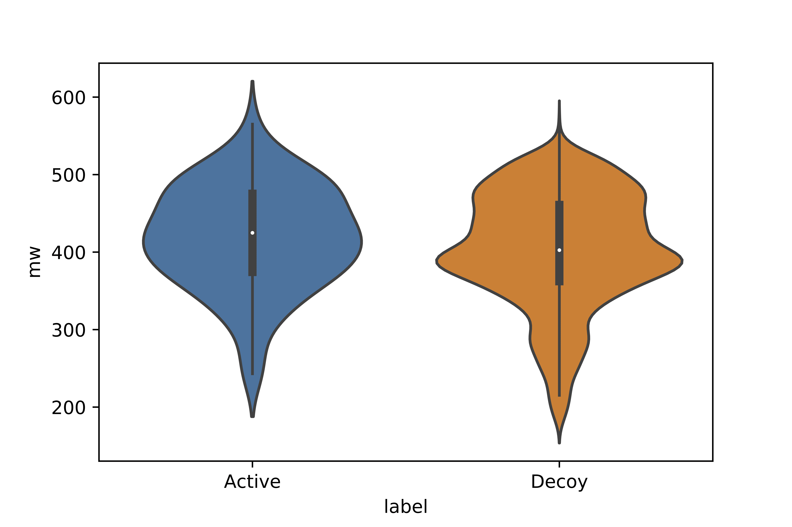

###### 图 11-1。活性和诱饵集的分子量小提琴图。

对这些图的检查显示，两组分子的分子量分布大致相等。诱饵集中有更多低分子量的分子，但在每个小提琴图中间显示的箱子的中心位置是相似的。

我们可以使用小提琴图对 LogP 分布进行类似的比较（图 11-2）。同样，我们可以看到分布是相似的，诱饵分子中有更多分布在分布的低端：

```py
sns.violinplot(tmp_df["label"],tmp_df["logP"])
```

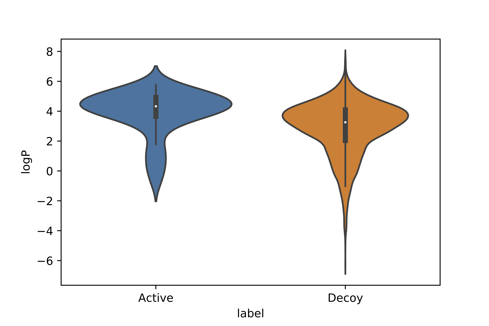

###### 图 11-2。活性和诱饵集的 LogP 小提琴图。

最后，我们对分子的形式电荷进行相同的比较（图 11-3）：

```py
sns.violinplot(new_tmp_df["label"],new_tmp_df["charge"])
```

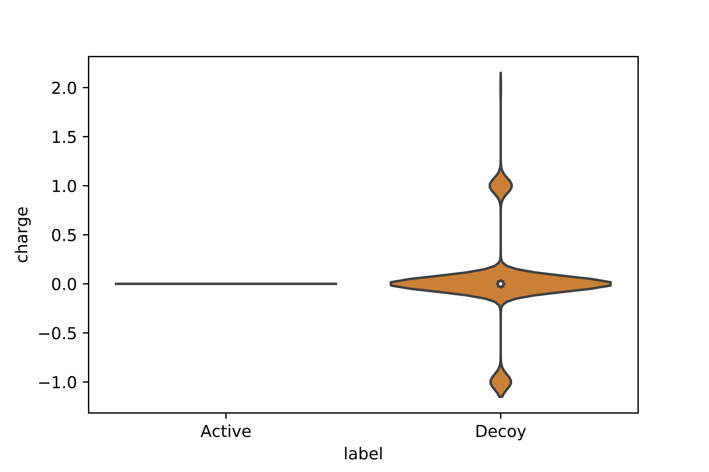

###### 图 11-3。活性和诱饵集的形式电荷小提琴图。

在这种情况下，我们看到了显著的差异。所有活性分子都是中性的，电荷为 0，而一些诱饵是带电的，电荷为+1 或-1。让我们看看多少比例的诱饵分子是带电的。我们可以通过创建一个只包含带电分子的新数据框来做到这一点：

```py
charged = decoy_df[decoy_df["charge"] != 0]
```

Pandas 数据框有一个名为`shape`的属性，返回数据框中的行数和列数。因此，`shape`属性中的元素`[0]`将是行数。让我们将带电分子的数据框中的行数除以假分子数据框中的总行数：

```py
charged.shape[0]/decoy_df.shape[0]
```

这返回 0.162。正如我们在小提琴图中看到的，大约 16%的假分子是带电的。这似乎是因为活性和假分子集合没有以一致的方式准备。我们可以通过修改假分子的化学结构来中和它们的电荷来解决这个问题。幸运的是，我们可以很容易地使用[RDKit Cookbook](https://www.rdkit.org/docs/Cookbook.html)中的`NeutraliseCharges()`函数来做到这一点：

```py
from neutralize import NeutraliseCharges
```

为了避免混淆，我们创建一个新的数据框，其中包含假分子的 SMILES 字符串、ID 和标签：

```py
revised_decoy_df = decoy_df[["SMILES","ID","label"]].copy()
```

有了这个新的数据框，我们可以用分子的中性形式的字符串替换原始的 SMILES 字符串。`NeutraliseCharges`函数返回两个值。第一个是分子中性形式的 SMILES 字符串，第二个是一个布尔变量，指示分子是否发生了变化。在下面的代码中，我们只需要 SMILES 字符串，所以我们使用`NeutraliseCharges`返回的元组的第一个元素。

```py
revised_decoy_df["SMILES"] = [NeutraliseCharges(x)[0] for x
in revised_decoy_df["SMILES"]]

```

一旦我们替换了 SMILES 字符串，我们就可以向我们的新数据框添加一个分子列，并再次计算属性：

```py
PandasTools.AddMoleculeColumnToFrame(revised_decoy_df,"SMILES","Mol")
add_property_columns_to_df(revised_decoy_df)
```

然后我们可以将带活性分子的数据框追加到修订后的中性假分子的数据框中：

```py
new_tmp_df = active_df.append(revised_decoy_df)
```

接下来，我们可以生成一个新的箱线图，比较活性分子的电荷分布与我们中和的假分子的电荷分布（图 11-4）：

```py
sns.violinplot(new_tmp_df["label"],new_tmp_df["charge"])
```

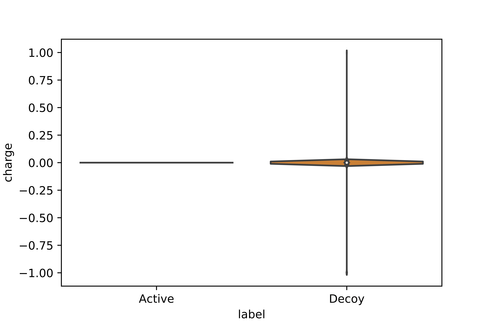

###### 图 11-4。我们修订后的假分子集带电分布的小提琴图。

经过对图表的检查，我们发现假分子集中现在几乎没有带电分子。我们可以使用之前使用的相同技术来创建一个仅包含带电分子的数据框。然后我们使用这个数据框来确定集合中剩余的带电分子数量：

```py
charged = revised_decoy_df[revised_decoy_df["charge"] != 0]
charged.shape[0]/revised_decoy_df.shape[0]
```

现在的结果是 0.003。我们已将带电分子的比例从 16%降低到 0.3%。现在我们可以确信我们的活性和假分子集合相当平衡。

为了将这些数据集与 DeepChem 一起使用，我们需要将分子写出为一个 CSV 文件，其中对于每个分子，包含 SMILES 字符串、ID、名称和一个整数值，指示化合物是活性的（标记为 1）还是非活性的（标记为 0）：

```py
active_df["is_active"] = [1] * active_df.shape[0]
revised_decoy_df["is_active"] = [0] * revised_decoy_df.shape[0]
combined_df = active_df.append(revised_decoy_df)[["SMILES","ID","is_active"]]
combined_df.head()
```

前五行显示在表 11-2 中。

表 11-2。我们新的合并数据框的前几行

|   | SMILES | ID | is_active |
| --- | --- | --- | --- |
| 0 | Cn1 ccnc1Sc2ccc(cc2Cl}Nc3c4cc(c(cc4ncc3C#N}OCCCN5CCOCC5)OC | 168691 | 1 |
| 1 | C[C@@]12C@@Hn3c4ccccc4c5c3c6n2c7ccccc7c6c8c5C(=O)NC8)NC)OC | 86358 | 1 |
| 2 | Cc1cnc(nc1c2cc([nH]c2)C(=0) NC@Hc3cccc(c3}Cl}Nc4cccc5c4OC(O5)(F)F | 575087 | 1 |
| 3 | CCc1cnc(nc1c2cc([nH]c2)C(=O)NC@Hc3cccc(c3}Cl}Nc4cccc5c4OCO5 | 575065 | 1 |
| 4 | Cc1cnc(nc1c2cc([nH]c2)C(=0) NC@Hc3cccc(c3}Cl}Nc4cccc5c4CCC5 | 575047 | 1 |

本节的最后一步是将我们的新`combined_df`保存为 CSV 文件。`index=False`选项使 Pandas 不在第一列中包含行号：

```py
combined_df.to_csv("dude_erk1_mk01.CSV",index=False)

```

# 训练预测模型

现在我们已经处理了格式，我们可以使用这些数据来训练一个图卷积模型。首先，我们需要导入必要的库。其中一些库在第一节中已经导入，但让我们假设我们从上一节创建的 CSV 文件开始：

```py
import deepchem as dc                      # DeepChem libraries
from deepchem.models import GraphConvModel # Graph convolutions 
import numpy as np                         # NumPy for numeric operations 
import sys                                 # Error handling 
import pandas as pd                        # Data table manipulation 
import seaborn as sns                      # Seaborn library for plotting 
from rdkit.Chem import PandasTools         # Chemical structures in Pandas 
```

现在让我们定义一个函数来创建一个`GraphConvModel`。在这种情况下，我们将创建一个分类模型。由于我们将在以后的不同数据集上应用该模型，因此最好创建一个目录来存储模型。您需要将目录更改为您的文件系统上可访问的内容：

```py
def generate_graph_conv_model():
batch_size = 128
model = GraphConvModel(1, batch_size=batch_size,
mode='classification',
model_dir="/tmp/mk01/model_dir")
return model​
```

为了训练模型，我们首先读取在上一节中创建的 CSV 文件：

```py
dataset_file = "dude_erk2_mk01.CSV"
tasks = ["is_active"]
featurizer = dc.feat.ConvMolFeaturizer()
loader = dc.data.CSVLoader(tasks=tasks,
smiles_field="SMILES",
featurizer=featurizer)
dataset = loader.featurize(dataset_file, shard_size=8192)

```

现在我们已经加载了数据集，让我们构建一个模型。我们将创建训练集和测试集来评估模型的性能。在这种情况下，我们将使用`RandomSplitter`（DeepChem 还提供许多其他分割器，如`ScaffoldSplitter`，它通过化学支架划分数据集，以及`ButinaSplitter`，它首先对数据进行聚类，然后将数据集分割，使不同的聚类最终出现在训练集和测试集中）：

```py
splitter = dc.splits.RandomSplitter()
```

随着数据集的拆分，我们可以在训练集上训练模型，然后在验证集上测试该模型。在这一点上，我们需要定义一些指标并评估我们模型的性能。在这种情况下，我们的数据集是不平衡的：我们有少量活性化合物和大量非活性化合物。鉴于这种差异，我们需要使用一个反映不平衡数据集性能的指标。适合这种数据集的一个指标是马修斯相关系数（MCC）：

```py
metrics = [
dc.metrics.Metric(dc.metrics.matthews_corrcoef, np.mean,
mode="classification")]

```

为了评估我们模型的性能，我们将执行 10 次交叉验证，其中我们在训练集上训练模型并在验证集上验证：

```py
training_score_list = []
validation_score_list = []
transformers = []
cv_folds = 10
for i in range(0, cv_folds):
model = generate_graph_conv_model()
res = splitter.train_valid_test_split(dataset)
train_dataset, valid_dataset, test_dataset = res
model.fit(train_dataset)
train_scores = model.evaluate(train_dataset, metrics,
transformers)
training_score_list.append(
train_scores["mean-matthews_corrcoef"])
validation_scores = model.evaluate(valid_dataset,
metrics,
transformers)
validation_score_list.append(
validation_scores["mean-matthews_corrcoef"])
print(training_score_list)
print(validation_score_list)

```

为了可视化我们模型在训练和测试数据上的性能，我们可以制作箱线图。结果显示在图 11-5 中：

```py
sns.boxplot(
["training"] * cv_folds + ["validation"] * cv_folds,
training_score_list + validation_score_list)

```

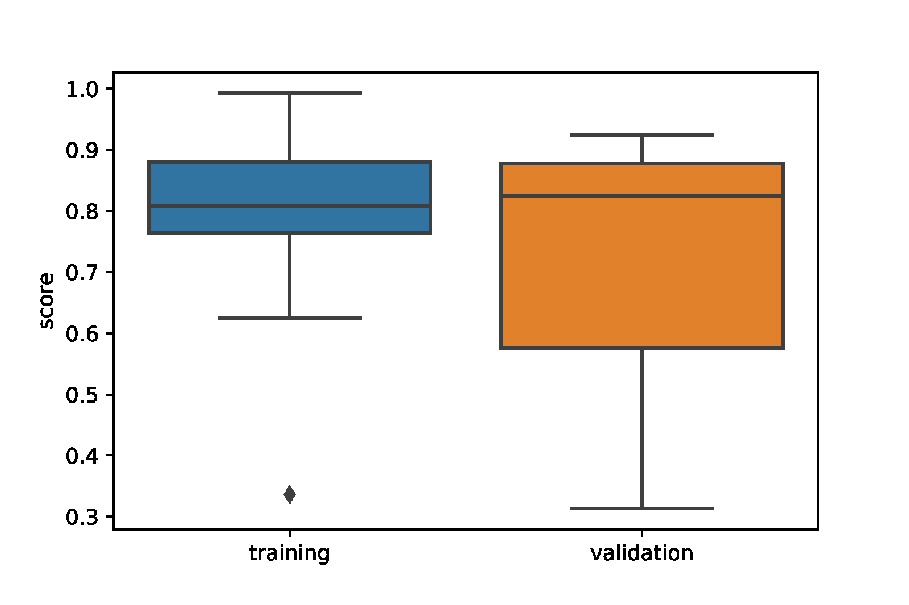

###### 图 11-5。训练集和验证集的分数的箱线图。

图表表明，如预期的那样，训练集上的性能优于验证集上的性能。然而，验证集上的性能仍然相当不错。在这一点上，我们可以对我们模型的性能感到自信。

可视化我们模型的结果也是有用的。为了做到这一点，我们将为验证集生成一组预测：

```py
pred = [x.flatten() for x in model.predict(valid_dataset)]
```

为了使处理更容易，我们将使用预测创建一个 Pandas 数据框架：

```py
pred_df = pd.DataFrame(pred,columns=["neg","pos"])
```

我们可以轻松地将活动类别（1 = 活性，0 = 非活性）和我们预测的分子的 SMILES 字符串添加到数据框架中：

```py
pred_df["active"] = [int(x) for x in valid_dataset.y]
pred_df["SMILES"] = valid_dataset.ids
```

查看数据框架的前几行总是一个好主意，以确保数据是合理的。表 11-3 显示了结果。

表 11-3。包含预测的数据框架的前几行

|   | neg | pos | active | SMILES |
| --- | --- | --- | --- | --- |
| 0 | 0.906081 | 0.093919 | 1 | Cn1ccnc1Sc2ccc(cc2Cl)Nc3c4cc(c(cc4ncc3C#N)OCCC... |
| 1 | 0.042446 | 0.957554 | 1 | Cc1cnc(nc1c2cc([nH]c2)C(=O)NC@Hc3cccc(c3... |
| 2 | 0.134508 | 0.865492 | 1 | Cc1cccc(c1)C@@HNC(=O)c2cc(c[nH]2)c3c(cnc... |
| 3 | 0.036508 | 0.963492 | 1 | Cc1cnc(nc1c2cc([nH]c2)C(=O)NC@Hc3ccccc3)... |
| 4 | 0.940717 | 0.059283 | 1 | c1c\2c([nH]c1Br)C(=O)NCC/C2=C/3\C(=O)N=C(N3)N |

创建箱线图使我们能够比较活性和非活性分子的预测值（请参见图 11-6）。

```py
sns.boxplot(pred_df.active,pred_df.pos)
```

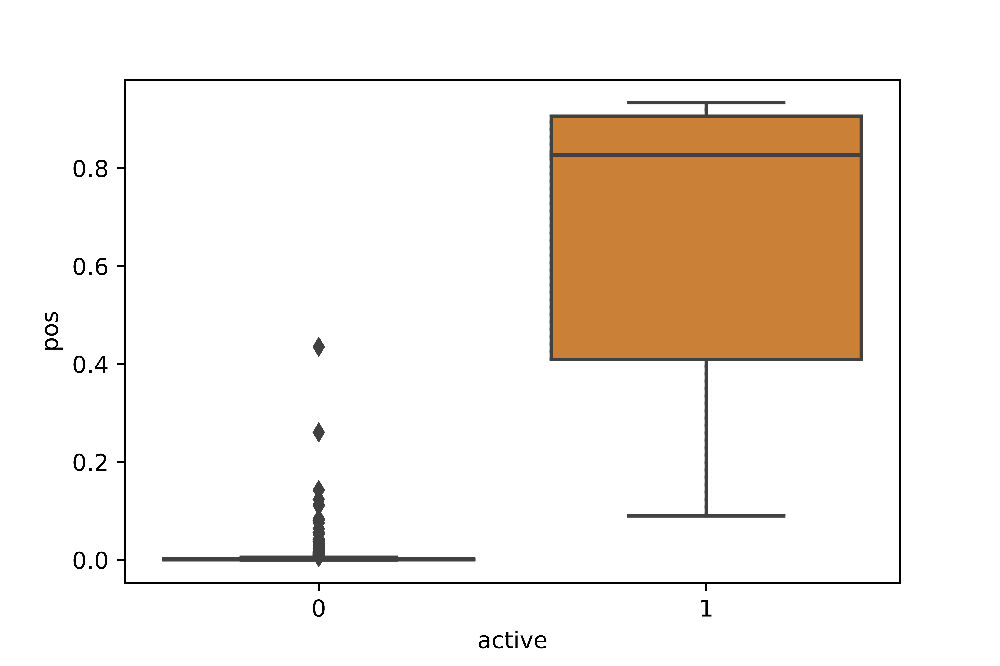

###### 图 11-6。预测分子的正分数。

我们的模型表现非常好：我们可以看到活性和非活性分子之间有明显的区分。在构建预测模型时，通常重要的是检查被预测为活性的非活性分子（假阳性）以及被预测为非活性的活性分子（假阴性）。看起来只有一个我们的活性分子得到了低正分数。为了更仔细地观察，我们将创建一个新的数据框架，其中包含所有得分<0.5 的活性分子：

```py
false_negative_df = pred_df.query("active == 1 & pos < 0.5").copy()
```

为了检查数据框架中分子的化学结构，我们使用 RDKit 中的 PandasTools 模块：

```py
PandasTools.AddMoleculeColumnToFrame(false_negative_df,
"SMILES", "Mol")

```

让我们看看新的数据框架（图 11-7）：

```py
false_negative_df
```

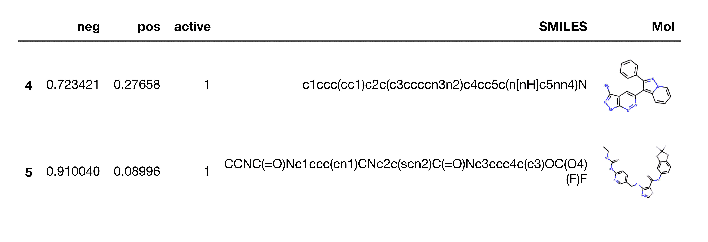

###### 图 11-7. 假阴性预测。

为了充分利用这个数据框架中的信息，我们需要对药物化学有一些了解。查看假阴性分子的化学结构并将其与真阳性分子的化学结构进行比较通常是有益的。这可能会提供一些关于为什么分子没有被正确预测的原因的见解。通常情况下，假阴性分子可能与任何真阳性分子都不相似。在这种情况下，值得进行额外的文献搜索，以增加训练集中分子的多样性。

我们可以使用类似的方法来检查假阳性分子，这些分子是非活性的，但得到了>0.5 的正分数。再次与真阳性分子的化学结构进行比较可能会提供信息：

```py
false_positive_df = pred_df.query(
    "active == 0 & pos > 0.5").copy()
PandasTools.AddMoleculeColumnToFrame(false_positive_df,
                                     "SMILES", "Mol")
false_positive_df
```

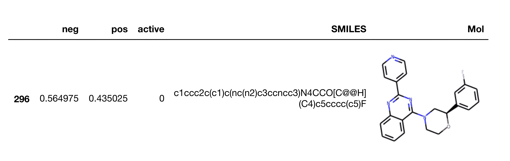

###### 图 11-8. 一个假阳性分子。

在模型训练阶段，我们的目标是评估模型的性能。因此，我们在部分数据上训练模型，并在其余数据上验证模型。现在我们已经评估了性能，我们希望生成最有效的模型。为了做到这一点，我们将在所有数据上训练模型：

```py
model.fit(dataset)

```

这给我们一个准确度得分为 91%。最后，我们将模型保存到磁盘上，以便将来进行预测使用：

```py
model.save()

```

# 为模型预测准备数据集

现在我们已经创建了一个预测模型，我们可以将这个模型应用到一组新的分子上。在许多情况下，我们会基于文献数据构建一个预测模型，然后将该模型应用到我们想要筛选的一组分子上。我们想要筛选的分子可能来自内部数据库或商业可用的筛选集合。例如，我们将使用我们创建的预测模型来筛选来自 ZINC 数据库的 100,000 个化合物的小样本，这是一个包含超过 10 亿种商业可用分子的集合。

在进行虚拟筛选时，一个潜在的困难源可能是存在可能干扰生物测定的分子。在过去的 25 年里，科学界内的许多团体已经制定了一套规则，用于识别可能具有反应性或问题的分子。这些规则集中的几个，被编码为 SMARTS 字符串，已经被负责维护 ChEMBL 数据库的团体收集起来。这些规则集已经通过一个名为 rd_filters.py 的 Python 脚本提供。在这个例子中，我们将使用 rd_filters.py 来识别来自 ZINC 数据库的 100,000 个分子集合中可能存在问题的分子。

*rd_filters.py*脚本和相关数据文件可以在我们的[GitHub 存储库](https://github.com/deepchem/DeepLearningLifeSciences)上找到。

通过使用`-h`标志调用脚本可以获得脚本的可用模式和参数。

```py
rd_filters.py -h
```

```py
Usage:
rd_filters.py $ **filter --in INPUT_FILE --prefix PREFIX [--rules RULES_FILE_NAME] 
[--alerts ALERT_FILE_NAME][--np NUM_CORES]**
rd_filters.py $ **template --out TEMPLATE_FILE [--rules RULES_FILE_NAME]**
Options:
--in INPUT_FILE input file name
--prefix PREFIX prefix for output file names
--rules RULES_FILE_NAME name of the rules JSON file
--alerts ALERTS_FILE_NAME name of the structural alerts file
--np NUM_CORES the number of cpu cores to use (default is all)
--out TEMPLATE_FILE parameter template file name 
```

要在我们的输入文件上调用脚本，该文件名为*zinc_100k.smi*，我们可以指定输入文件和输出文件名的前缀。`filter`参数调用脚本处于`filter`模式，其中它识别可能有问题的分子。`--prefix`参数指示输出文件名将以前缀*zinc*开头。

```py
rd_filters.py filter --in zinc_100k.smi --prefix zinc
```

```py
using 24 cores
Using alerts from Inpharmatica
Wrote SMILES for molecules passing filters to zinc.smi
Wrote detailed data to zinc.CSV
68752 of 100000 passed filters 68.8%
Elapsed time 15.89 seconds 
```

输出指示以下内容：

+   脚本正在运行在 24 个核心上。它在多个核心上并行运行，可以使用`-np`标志选择核心数。

+   脚本正在使用“Inpharmatica”规则集。该规则集涵盖了在生物测定中被证明有问题的大量化学功能。除了 Inpharmatica 规则集外，脚本还有其他七个规则集可用。有关更多信息，请参阅*rd_filters.py*文档。

+   通过过滤器的分子的 SMILES 字符串已写入名为*zinc.smi*的文件。当我们使用预测模型时，我们将使用此作为输入。

+   特定结构警报触发的化合物详细信息已写入名为*zinc.CSV*的文件。

+   69%的分子通过了过滤器，31%被认为有问题。

查看 31%的分子被拒绝的原因是很有启发性的。这可以让我们知道是否需要调整任何过滤器。我们将使用一些 Python 代码来查看输出的前几行，如表 11-4 所示。

```py
import pandas as pd
df = pd.read_CSV("zinc.CSV")
df.head()
```

表 11-4。从 zinc.CSV 创建的数据框的前几行

|   | SMILES | 名称 | 过滤器 | 分子量 | LogP | HBD |
| --- | --- | --- | --- | --- | --- | --- |
| 0 | CN(CCO)CC@@HCn1cnc2c1c(=O)n(C)c(=O)n2C | ZINC000000000843 | Filter82_pyridinium >0 | 311.342 | –2.2813 | 2 |
| 1 | O=c1[nH]c(=O)n([C@@H]2CC@@HC@HO2)cc1Br | ZINC000000001063 | Filter82_pyridinium >0 | 307.100 | –1.0602 | 3 |
| 2 | Cn1c2ncn(CC(=O)N3CCOCC3)c2c(=O)n(C)c1=O | ZINC000000003942 | Filter82_pyridinium >0 | 307.310 | –1.7075 | 0 |
| 3 | CN1C(=O)CC@HCN3CCCC3)CC2)C1=O | ZINC000000036436 | OK | 308.382 | –1.0163 | 0 |
| 4 | CC(=O)NCC@H[C@H]1O[C@H]2OC(C)(C)O[C@H]2C... | ZINC 000000041101 | OK | 302.327 | -1.1355 | 3 |

数据框有六列：

SMILES

每个分子的 SMILES 字符串。

名称

分子名称，如输入文件中列出的。

过滤器

分子被拒绝的原因，或者如果分子未被拒绝则为“OK”。

MW

分子的分子量。默认情况下，具有大于 500 的分子量的分子将被拒绝。

LogP

分子的计算辛醇/水分配系数。默认情况下，具有大于五的 LogP 值的分子将被拒绝。

HBD

氢键供体的数量。默认情况下，具有超过 5 个氢键供体的分子将被拒绝。

我们可以使用 Python 的`collections`库中的`Counter`类来识别哪些过滤器负责移除最多的分子（参见[表 11-5）：

```py
from collections import Counter
count_list = list(Counter(df.FILTER).items())
count_df = pd.DataFrame(count_list,columns=["Rule","Count"])
count_df.sort_values("Count",inplace=True,ascending=False)
count_df.head()
```

表 11-5。前 5 个过滤器选择的分子数量统计

|   | 规则 | 计数 |
| --- | --- | --- |
| 1 | OK | 69156 |
| 6 | Filter41_12_dicarbonyl > O | 19330 |
| 0 | Filter82_pyridinium > O | 7761 |
| 10 | Filter93_acetyl_urea > O | 1541 |
| 11 | Filter78_bicyclic_lmide > O | 825 |

表中的第一行标记为“OK”，表示未被任何过滤器淘汰的分子数量。从中我们可以看到，我们输入的分子中有 69,156 个通过了所有过滤器。最多的分子数量（19,330）被拒绝，因为它们含有 1,2-二羰基基团。这种类型的分子可能会与丝氨酸和半胱氨酸等蛋白质残基反应并形成共价键。我们可以通过在*rd_filters.py*分发的*filter_collection.CSV*文件中查找字符串“Filter41_12_dicarbonyl”来找到用于识别这些分子的 SMARTS 模式。SMARTS 模式是“*C(=O)C(=O)*”，表示：

+   连接到任何原子

+   碳双键氧，连接到

+   碳双键氧，连接到

+   任何原子。

查看数据并确保一切按预期工作总是好的。我们可以使用 RDKit 的`MolsToGridImage()`函数的`highlightAtomLists`参数来突出显示 1,2-二羰基功能（参见图 11-9）：

```py
from rdkit import Chem
from rdkit.Chem import Draw

mol_list = [Chem.MolFromSmiles(x) for x in smiles_list]
dicarbonyl = Chem.MolFromSmarts('*C(=O)C(=O)*')
match_list = [mol.GetSubstructMatch(dicarbonyl) for mol in
              mol_list]
Draw.MolsToGridImage(mol_list,
                     highlightAtomLists=match_list,
                     molsPerRow=5)

```

我们可以看到分子确实具有二羰基基团，如图中所示。如果我们愿意，我们也可以类似地评估其他过滤器。然而，在这一点上，我们可以对过滤结果感到满意。我们已经从我们计划用于虚拟筛选的集合中删除了有问题的分子。我们现在可以使用这个集合，在文件*zinc.smi*中，在这个练习的下一步中使用。

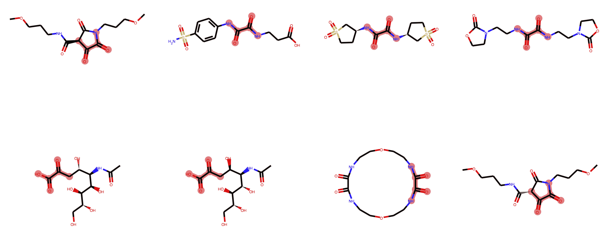

###### 图 11-9。含有 1,2-二羰基基团的分子。

# 应用预测模型

我们创建的`GraphConvMdel`现在可以用于搜索我们刚刚过滤的商业化合物集合。应用模型需要几个步骤：

1.  从磁盘加载模型。

1.  创建一个特征化器。

1.  读取并对将通过模型运行的分子进行特征化。

1.  检查预测的得分。

1.  检查预测分子的化学结构。

1.  对选择的分子进行聚类。

1.  将每个簇中选择的分子写入 CSV 文件。

我们首先导入必要的库：

```py
import deepchem as dc                           # DeepChem libraries
import pandas as pd                             # Pandas for tables
from rdkit.Chem import PandasTools, Draw        # Chemistry in Pandas
from rdkit import DataStructs                   # For fingerprint handling
from rdkit.ML.Cluster import Butina             # Cluster molecules
from rdkit.Chem import rdMolDescriptors as rdmd # Descriptors
import seaborn as sns                           # Plotting
```

并加载我们之前生成的模型：

```py
model = dc.models.TensorGraph.load_from_dir(""/tmp/mk01/model_dir"")
```

要从我们的模型生成预测，我们首先需要对我们计划用来生成预测的分子进行特征化。我们通过实例化一个 DeepChem `ConvMolFeaturizer` 来实现这一点：

```py
featurizer = dc.feat.ConvMolFeaturizer()
```

为了对分子进行特征化，我们需要将我们的 SMILES 文件转换为 CSV 文件。为了创建一个 DeepChem 特征化器，我们还需要一个活动列，因此我们添加一个，然后将文件写入 CSV：

```py
df = pd.read_CSV("zinc.smi",sep=" ",header=None)
df.columns=["SMILES","Name"]
rows,cols = df.shape
# Just add add a dummy column to keep the featurizer happy
df["Val"] = [0] * rows 
```

与以前一样，我们应该查看文件的前几行（在表 11-6 中显示）以确保一切如我们所期望的那样：

```py
df.head()
```

表 11-6。输入文件的前几行

|   | SMILES | Name | Val |
| --- | --- | --- | --- |
| 0 | CN1C(=O)CC@HCN3CCCC3)CC2)C1=O | ZINC000000036436 | 0 |
| 1 | CC(=O)NCC@H[C@H]1O[C@H]2OC(C)(C)O[C@H]2[C@@H]1NC(C)=O | ZINC000000041101 | 0 |
| 2 | C1CN(c2nc(-c3nn[nH]n3)nc(N3CCOCC3)n2)CCO1 | ZINC000000054542 | 0 |
| 3 | OCCN(CCO)c1nc(Cl)nc(N(CCO)CCO)n1 | ZINC000000109481 | 0 |
| 4 | COC(=O)c1ccc(S(=O)(=O)N(CCO)CCO)n1C | ZINC000000119782 | 0 |

请注意，Val 列只是一个占位符，以使 DeepChem 特征化器保持正常。文件看起来不错，因此我们将其写为 CSV 文件以用作 DeepChem 的输入。我们使用`index=False`参数来防止 Pandas 将行号写为第一列：

```py
infile_name = "zinc_filtered.CSV"
df.to_CSV(infile_name,index=False)
```

我们可以使用 DeepChem 读取此 CSV 文件并对我们计划预测的分子进行特征化：

```py
loader = dc.data.CSVLoader(tasks=['Val'],
                           smiles_field="SMILES",
                           featurizer=featurizer)
dataset = loader.featurize(infile_name, shard_size=8192)

```

特征化的分子可以用来生成模型的预测：

```py
pred = model.predict(dataset)
```

为了方便起见，我们将预测放入 Pandas 数据框中：

```py
pred_df = pd.DataFrame([x.flatten() for x in pred],
columns=["Neg", "Pos"]

```

分布图，可在 Seaborn 库中找到，提供了得分分布的良好概述。不幸的是，在虚拟筛选中，没有明确的规则来定义活性截断。通常最好的策略是查看得分的分布，然后选择一组得分最高的分子。如果我们查看图 11-10 中的图表，我们可以看到只有少数得分高于 0.3 的分子。我们可以将此值用作我们可能希望在实验中筛选的分子的初步截断值。

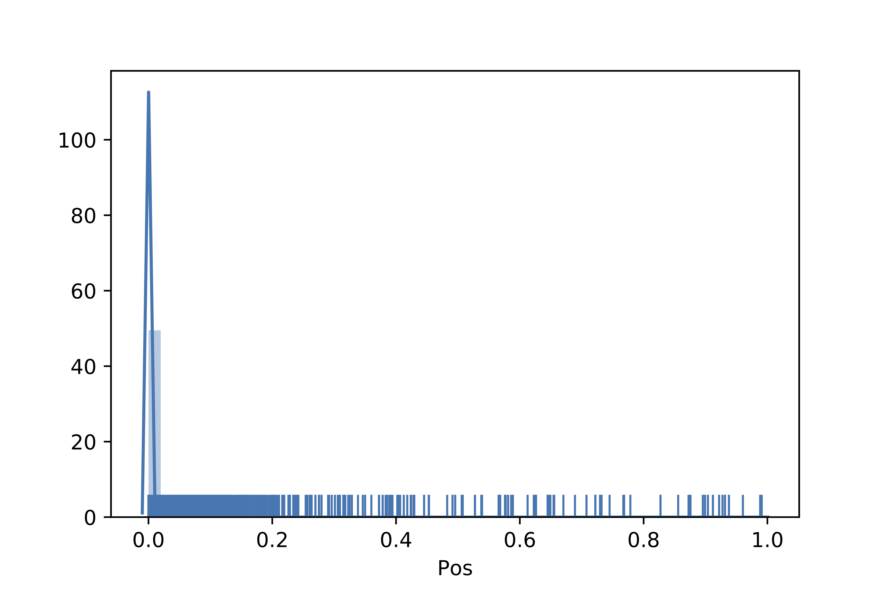

###### 图 11-10。预测分子得分的分布图。

我们可以将具有得分的数据框与具有 SMILES 字符串的数据框连接起来。这使我们能够查看得分最高的分子的化学结构：

```py
combo_df = df.join(pred_df, how="outer")
combo_df.sort_values("Pos", inplace=True, ascending=False)
```

正如我们之前看到的，向数据框添加一个分子列使我们能够查看命中的化学结构(见图 11-11)。


###### 图 11-11。得分最高分子的化学结构。

根据我们在这里看到的情况，许多结果很相似。让我们看一些更多的分子(图 11-12)：

```py
Draw.MolsToGridImage(combo_df.Mol[:10], molsPerRow=5,
                    legends=["%.2f" % x for x in combo_df.Pos[:10]])
```

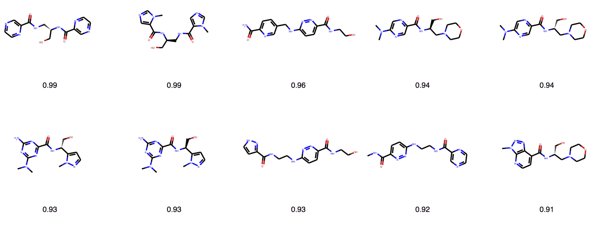

###### 图 11-12。具有得分最高命中的结构网格。结构下方的值是模型得分。

实际上，许多分子非常相似，可能最终在我们的筛选中是多余的。更有效的方法之一是对分子进行聚类，仅筛选每个聚类中得分最高的分子。RDKit 具有 Butina 聚类方法的实现，这是化学信息学中最常用的方法之一。在 Butina 聚类方法中，我们根据化学相似性对分子进行分组，该相似性是使用比较位向量（由 1 和 0 组成的数组），也称为*化学指纹*来计算的，这些化学指纹表示分子中连接的原子模式的存在或不存在。通常使用的度量标准是*Tanimoto 系数*，定义如下：

<math><mrow><mi>T</mi> <mi>a</mi> <mi>n</mi> <mi>i</mi> <mi>m</mi> <mi>o</mi> <mi>t</mi> <mi>o</mi> <mo>=</mo> <mfrac><mrow><mi>A</mi><mo>∩</mo><mi>B</mi></mrow> <mrow><mi>A</mi><mo>∪</mo><mi>B</mi></mrow></mfrac></mrow></math>

方程的分子是交集，或者在位向量*A*和*B*中都为 1 的位数。分母是在向量*A*或向量*B*中为 1 的位数。Tanimoto 系数的范围可以在 0 到 1 之间，表示分子中没有共同的原子模式，1 表示分子*A*中包含的所有模式也包含在分子*B*中。例如，我们可以考虑图 11-13 中显示的位向量。两个向量的交集是 3 位，而并集是 5。因此，Tanimoto 系数为 3/5，即 0.6。请注意，此处显示的示例已经简化以进行演示。在实践中，这些位向量可以包含数百甚至数千位。

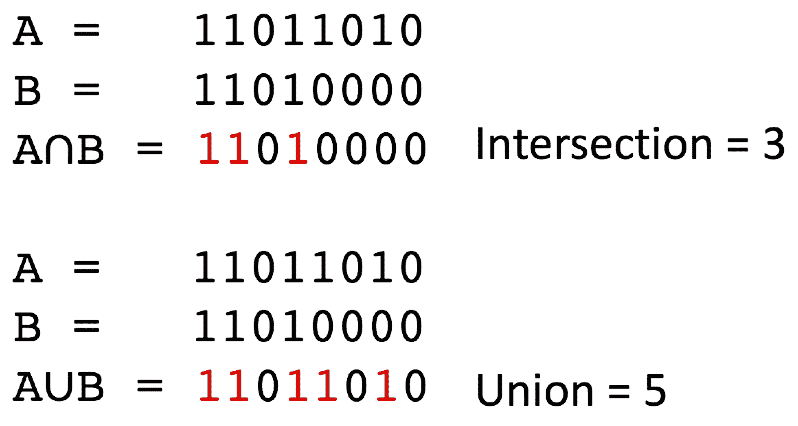

###### 图 11-13。计算 Tanimoto 系数。

对一组分子进行聚类需要一小段代码。Butina 聚类所需的唯一参数是聚类截止值。如果两个分子的 Tanimoto 相似度大于截止值，则将这些分子放入同一聚类中。如果相似度小于截止值，则将这些分子放入不同的聚类中：

```py
def butina_cluster(mol_list, cutoff=0.35):
    fp_list = [
        rdmd.GetMorganFingerprintAsBitVect(m, 3, nBits=2048)
        for m in mol_list]
    dists = []
    nfps = len(fp_list)
    for i in range(1, nfps):
        sims = DataStructs.BulkTanimotoSimilarity(
            fp_list[i], fp_list[:i])
        dists.extend([1 - x for x in sims])
    mol_clusters = Butina.ClusterData(dists, nfps, cutoff,
                                      isDistData=True)
    cluster_id_list = [0] * nfps
    for idx, cluster in enumerate(mol_clusters, 1):
        for member in cluster:
            cluster_id_list[member] = idx
    return cluster_id_list​

```

在进行聚类之前，我们将创建一个只包含前 100 个得分最高的分子的新数据框。由于`combo_df`已经排序，我们只需使用`head`函数选择数据框中的前 100 行：

```py
best_100_df = combo_df.head(100).copy()
```

然后，我们可以创建一个新列，为每个化合物包含聚类标识符：

```py
best_100_df["Cluster"] = butina_cluster(best_100_df.Mol)
best_100_df.head()
```

像往常一样，查看并确保一切正常是很重要的。现在我们看到，除了 SMILES 字符串、分子名称和预测值之外，我们还有一个聚类标识符(见图 11-14)。


###### 图 11-14。聚类数据集的前几行。

我们可以使用 Pandas 的`unique`函数确定我们有 55 个唯一的聚类：

```py
len(best_100_df.Cluster.unique())
```

最终，我们希望购买这些化合物并进行实验筛选。为了做到这一点，我们需要保存一个 CSV 文件，列出我们计划购买的分子。`drop_duplicates`函数可用于选择每个聚类中的一个分子。默认情况下，该函数从表的顶部开始，并删除已经看到的值的行：

```py
best_cluster_rep_df = best_100_df.drop_duplicates("Cluster")
```

为了确保这个操作有效，让我们使用`shape`参数来获取新数据框中的行数和列数：

```py
best_cluster_rep_df.shape
```

最后，我们可以写出一个 CSV 文件，其中包含我们想要筛选的分子：

```py
best_cluster_rep_df.to_CSV("best_cluster_represenatives.CSV")
```

# 结论

在这一点上，我们已经按照基于配体的虚拟筛选工作流程的所有步骤进行了操作。我们使用深度学习构建了一个能够区分活性和非活性分子的分类模型。该过程始于评估我们的训练数据，并确保活性和诱饵集之间的分子量、LogP 和电荷分布平衡。一旦我们对诱饵分子的化学结构进行了必要的调整，我们就准备构建模型了。

构建模型的第一步是为使用的分子生成一组化学特征。我们使用 DeepChem 的`GraphConv`特征生成器来生成一组适当的化学特征。然后使用这些特征构建了一个图卷积模型，随后用于预测一组商业可用分子的活性。为了避免可能在生物分析中出现问题的分子，我们使用一组编码为 SMARTS 模式的计算规则来识别含有先前已知干扰分析或产生后续风险的化学功能的分子。

有了我们手头的期望分子列表，我们可以在生物分析中测试这些分子。通常，我们工作流程中的下一步是获取化合物样品进行测试。如果这些分子来自公司化合物库，机器人系统将收集样品并为其进行测试准备。如果这些分子是从商业来源购买的，还需要额外称重并用缓冲水或其他溶剂稀释。

一旦样品准备好，它们就会在生物分析中进行测试。这些分析可以涵盖从抑制细菌生长到阻止癌细胞增殖的各种终点。虽然测试这些分子是我们虚拟筛选练习的最后一步，但对于药物发现项目来说，这远非终点。一旦我们对通过虚拟筛选确定的分子进行了初步生物分析，我们会分析筛选结果。如果我们发现实验活性分子，通常会识别和测试其他类似的分子，以帮助我们理解分子不同部分与我们正在测量的生物活性之间的关系。这个优化过程通常涉及合成和测试数百甚至数千个分子，以确定具有所需安全性和生物活性组合的分子。
