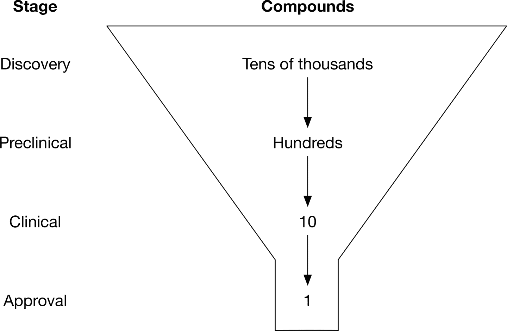

# 第十二章：前景与展望

生命科学正在以惊人的速度发展，也许比任何其他科学领域都要快。深度学习也是如此：它是计算机科学中最令人兴奋、迅速发展的领域之一。这两者的结合有潜力以戏剧性、深远的方式改变世界。影响已经开始显现，但与未来几十年可能发生的事情相比，这些都微不足道。深度学习与生物学的结合可以带来巨大的好处，但也可能造成巨大的危害。

在本章的最后，我们将抛开训练深度模型的机制，更广泛地展望这一领域的未来。在未来几年中，它在哪些领域有最大的潜力解决重要问题？为实现这一目标，必须克服哪些障碍？与这项工作相关的风险又是什么，我们必须努力避免？

# 医学诊断

诊断疾病很可能是深度学习首次发挥作用的领域之一。在过去几年里，已经发表了一些模型，这些模型在诊断许多重要疾病方面的准确性与专家人类相匹敌甚至超越。例如肺炎、皮肤癌、糖尿病视网膜病变、老年性黄斑变性、心律失常、乳腺癌等。这个列表预计会迅速增长。

许多这些模型是基于图像数据的：X 光片、MRI、显微镜图像等。这是有道理的。深度学习的第一个巨大成功是在计算机视觉领域，多年的研究已经产生了用于分析图像数据的复杂架构。将这些架构应用于医学图像是显而易见的低 hanging fruit。但并非所有应用都是基于图像的。任何可以用数字形式表示的数据都是深度模型的有效输入：心电图、血液化学面板、DNA 序列、基因表达谱、生命体征等等。

在许多情况下，最大的挑战将是创建数据集，而不是设计架构。训练深度模型需要大量一致、清晰标记的数据。如果你想从显微镜图像中诊断癌症，你需要大量来自患有癌症和没有癌症的患者的图像，并标记出哪些是哪些。如果你想从基因表达中诊断，你需要大量标记的基因表达谱。对于每一种你希望诊断的疾病，对于每一种你希望从中诊断的数据类型，都是如此。

目前，许多这些数据集并不存在。即使适当的数据集存在，它们通常比我们希望的要小。数据可能存在噪音，来自许多具有系统性差异的来源。许多标签可能是不准确的。数据可能只存在于人类可读的形式，而不是容易机器读取的形式：例如，医生在患者医疗记录中写入的自由文本。

在医学诊断中使用深度学习的进展将取决于创建更好的数据集。在某些情况下，这意味着汇编和筛选现有数据。在其他情况下，这意味着收集新数据，这些数据从一开始就被设计为适合机器学习。后一种方法通常会产生更好的结果，但也更昂贵。

不幸的是，创建这些数据集可能会对患者隐私造成灾难性影响。医疗记录包含我们最敏感、最私密的信息之一。如果你被诊断出患有疾病，你希望你的雇主知道吗？你的邻居？你的信用卡公司？那些将其视为向你销售与健康相关产品机会的广告商呢？

隐私问题对基因组序列尤为严重，因为它们具有独特的特性：它们在亲属之间共享。你的父母、孩子、兄弟姐妹每个人都与你共享 50%的 DNA。不可能泄露一个人的序列而不泄露所有亲属的大量信息。这些数据也不可能匿名化。你的 DNA 序列比你的名字或指纹更精确地识别你。如何在不破坏隐私的情况下获得基因数据的好处将是一个巨大的挑战。

考虑使数据对机器学习最有用的因素。首先，当然，应该有很多数据。你想要尽可能多的数据。它应该是干净的，详细的，并且标记准确。它还应该很容易获取。许多研究人员将希望将其用于训练许多模型。而且它应该很容易与其他数据集进行交叉引用，这样你就可以将大量数据组合在一起。如果 DNA 序列、基因表达谱和病史各自都很有用，那么当你拥有同一个患者的所有这些数据时，你可以做得更多！

现在考虑使数据最容易被滥用的因素。我们不需要列出它们，因为我们刚刚做到了。使数据有用的因素与使其易于滥用的因素完全相同。在未来几年中，平衡这两个问题将是一个重大挑战。

# 个性化医学

诊断疾病之后的下一步是决定如何治疗。传统上，这是以“一刀切”的方式进行的：如果某种药物对该诊断的一些合理比例的患者有所帮助，同时又不会产生太多副作用，那么就会建议该药物用于治疗疾病。你的医生可能会首先询问你是否有已知的过敏反应，但这就是个性化的极限。

这忽略了生物学的所有复杂性。每个人都是独一无二的。一种药物可能对某些人有效，但对其他人无效。它可能在某些人身上产生严重的副作用，但在其他人身上不会。有些人可能有能够迅速分解药物的酶，因此需要大剂量，而其他人可能需要较小剂量。

诊断只是非常粗略的描述。当医生宣布患者患有糖尿病或癌症时，这可能意味着许多不同的事情。事实上，每种癌症都是独特的，不同人的细胞具有不同的突变集，导致它们变成癌细胞。对一个人有效的治疗方法可能对另一个人无效。

*个性化医学*试图超越这一点。它试图考虑每个患者独特的遗传学和生物化学，以选择最适合该特定个人的治疗方法，即产生最大益处且副作用最少的治疗方法。原则上，这可能会显著提高医疗保健的质量。

如果个性化医学实现其潜力，计算机将发挥核心作用。它需要分析大量数据，远远超过人类可以处理的量，以预测每种可能的治疗方法将如何与患者独特的生物学和疾病状况相互作用。深度学习在这类问题上表现出色。

正如我们在第十章中讨论的那样，解释性和可解释性对于这种应用至关重要。当计算机输出诊断并推荐治疗时，医生需要一种方法来核对这些结果，并决定是否信任它们。模型必须解释为什么得出这样的结论，以一种医生可以理解和验证的方式呈现证据。

不幸的是，所涉及的数据量和生物系统的复杂性最终会超出任何人理解解释的能力。如果一个模型“解释”说患者对 17 个基因的独特突变组合将使特定治疗对他们有效，没有医生可以合理地期望再次核实。这带来了需要解决的实际、法律和道德问题。医生在不理解为什么推荐的情况下开处方治疗是正确的吗？在什么情况下，医生可以忽略计算机的建议并开处方其他药物？在任何情况下，如果开的治疗方法不起作用或有危及生命的副作用，谁应该负责？

这个领域可能会通过一系列阶段发展。起初，计算机只会成为医生的助手，帮助他们更好地理解数据。最终，计算机将比人类更擅长选择治疗方法，任何医生违背它们的建议都是完全不道德的。但这需要很长时间，会有一个漫长的过渡期。在这个过渡期间，医生经常会受到诱惑，相信也许不应该被信任的计算机模型，并依赖它们的建议超出了正当的范围。作为创建这些模型的人，您有责任仔细考虑它们将如何被使用。要批判性地思考应该给出什么结果，以及如何呈现这些结果以最小化某人误解它们或过分依赖不可靠的结果的可能性。

# 制药开发

开发新药的过程非常漫长而复杂。深度学习可以在这个过程的许多环节中提供帮助，其中一些我们在本书中已经讨论过。

这也是一个非常昂贵的过程。最近的一项研究估计，制药公司平均每一种获批准的药物的研发成本为 26 亿美元。当然，并不意味着开发一种药物需要数十亿美元。这意味着大多数药物候选者都会失败。对于每一种获批准的药物，公司在最终放弃它们之前花费了大量资金调查其他许多药物。

我们很想说深度学习即将席卷并解决所有问题，但这似乎不太可能。制药开发太过复杂。当一种药物进入您的身体时，它会与十万种其他分子接触。您需要它与正确的分子以恰当的方式相互作用，产生期望的效果，同时*不*与任何其他分子相互作用以产生毒性或其他不良副作用。它还需要足够溶解以进入血液，并且在某些情况下必须穿过血脑屏障。然后考虑一旦进入体内，许多药物会经历化学反应，以各种方式改变它们。您必须考虑的不仅是原始药物的效果，还有所有从中产生的产物的效果！最后，加入它必须廉价生产、具有长期保存期、易于管理等要求。

药物开发非常非常困难。有太多事情需要同时优化。深度学习模型可能会帮助其中的一部分，但每一个只代表了整个过程的一小部分。

另一方面，您可以从另一个角度看待这个问题。药物开发的巨大成本意味着即使是小的改进也可能产生巨大影响。考虑到 26 亿美元的 5%是 1.3 亿美元。如果深度学习可以将药物开发成本降低 5%，那将迅速积累成节省数十亿美元。

药物开发过程可以被看作是一个漏斗，如图 12-1 所示。最早的阶段可能涉及对数以万计的化合物进行所需性质的筛选。尽管化合物的数量庞大，但每次测定的成本很低。一些最有前途的化合物可能会被选中进行更昂贵的涉及动物或培养细胞的临床前研究。其中，也许只有 10 个或更少的化合物会进入人体临床试验。如果我们幸运的话，其中一个可能最终进入市场成为一种批准的药物。在每个阶段，候选化合物的数量都在减少，但每次实验的成本增长更快，因此大部分费用在后期阶段。

###### 图 12-1. 药物开发漏斗。

减少药物开发成本的一个好策略可以总结为：“尽早失败”。如果一个化合物最终会被拒绝，试图在开发过程的早期阶段将其过滤掉，而不是在临床试验上花费数亿美元之前。深度学习在解决这个问题方面有很大潜力。如果它能更准确地预测哪些化合物最终会成为成功的药物，那么成本节约将是巨大的。

# 生物学研究

除了医学应用外，深度学习还有很大潜力帮助基础研究。现代实验技术往往是高通量的：它们一次产生大量数据，成千上万个数字。理解这些数据是一个巨大的挑战。深度学习是分析实验数据和识别其中模式的强大工具。我们已经看到了一些例子，比如基因组数据和显微镜图像。

另一个有趣的可能性是，神经网络可以直接作为生物系统的模型。这个想法最突出的应用是在神经生物学中。毕竟，“神经网络”直接受到大脑中神经回路的启发。这种相似性有多远？如果你训练一个神经网络来执行一个任务，它是否以与大脑执行任务相同的方式执行？

至少在某些情况下，答案是肯定的！这已经在几种不同的大脑功能中得到证实，包括处理视觉、听觉和运动感觉。在每种情况下，神经网络被训练执行一个任务。然后将其与相应的大脑区域进行比较，发现其行为与之相匹配。例如，网络中的特定层可以用来准确预测视觉或听觉皮层中特定区域的行为。

这是相当了不起的。这些模型并不是“设计”来匹配任何特定的大脑区域。在每种情况下，研究人员只是创建了一个通用模型，并用梯度下降优化训练它执行某些功能——而优化器找到的解决方案实际上与数百万年的进化发现的解决方案基本相同。事实上，神经网络的匹配程度更接近大脑系统，而不是其他专门设计来代表它的模型！

为了进一步推动这种方法，我们可能需要开发全新的架构。卷积网络直接受到视觉皮层的启发，因此 CNN 可以作为其模型是有道理的。但是很可能还有其他工作方式完全不同的大脑区域。也许这将导致神经科学和深度学习之间的持续来回：关于大脑的发现将提出对深度学习有用的新架构，而这些架构反过来可以作为更好理解大脑的模型。

当然，生物学中还有其他复杂的系统。免疫系统呢？或基因调控呢？每一个都可以被视为一个“网络”，其中有大量的部分互相发送信息。深度模型能够用来表示这些系统并更好地理解它们是如何工作的吗？目前，这仍然是一个悬而未决的问题。

# 结论

深度学习是一个强大且快速发展的工具。如果您在生命科学领域工作，您需要了解它，因为它将改变您的领域。

同样，如果您从事深度学习，生命科学是一个非常重要的领域，值得您关注。它们提供了庞大的数据集、传统技术难以描述的复杂系统，以及直接影响人类福祉的重要问题。

无论您来自哪一方，我们希望这本书为您提供了必要的背景，以开始在将深度学习应用于生命科学中做出重要贡献。我们正处于历史上一个非凡的时刻，一系列新技术正在汇聚在一起改变世界。我们都有幸成为这个过程的一部分。

¹ Yamins, Daniel L. K. 等人。“性能优化的分层模型预测更高级视觉皮层中的神经反应。” 美国国家科学院院刊 111:8619–8624。[*https://doi.org/10.1073/pnas.1403112111*](https://doi.org/10.1073/pnas.1403112111)。2014 年。

² Kell, Alexander J. E. 等人。“一个任务优化的神经网络复制人类听觉行为，预测大脑反应，并揭示了皮层处理层次。” *神经元* 98:630–644。[*https://doi.org/10.1016/j.neuron.2018.03.044*](https://doi.org/10.1016/j.neuron.2018.03.044)。2018 年。
