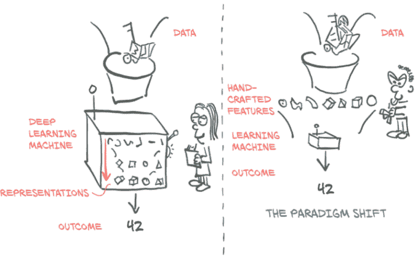

# 一、介绍深度学习和 PyTorch 库

本章涵盖

+   深度学习如何改变我们对机器学习的方法

+   了解为什么 PyTorch 非常适合深度学习

+   检查典型的深度学习项目

+   您需要的硬件来跟随示例

术语*人工智能*的定义模糊，涵盖了一系列经历了大量研究、审查、混乱、夸张和科幻恐慌的学科。现实当然要乐观得多。断言今天的机器在任何人类意义上都在“思考”是不诚实的。相反，我们发现了一类能够非常有效地逼近复杂非线性过程的算法，我们可以利用这些算法来自动化以前仅限于人类的任务。

例如，在[`inferkit.com/`](https://inferkit.com/)，一个名为 GPT-2 的语言模型可以逐字生成连贯的段落文本。当我们将这段文字输入时，它生成了以下内容：

接下来，我们将输入一组来自电子邮件地址语料库的短语列表，并查看程序是否能将列表解析为句子。再次强调，这比本文开头的搜索要复杂得多，也更加复杂，但希望能帮助您了解在各种编程语言中构建句子结构的基础知识。

对于一台机器来说，这是非常连贯的，即使在这些胡言乱语背后没有一个明确定义的论点。

更令人印象深刻的是，执行这些以前仅限于人类的任务的能力是*通过示例*获得的，而不是由人类编码为一组手工制作的规则。在某种程度上，我们正在学习智能是一个我们经常与自我意识混淆的概念，而自我意识绝对不是成功执行这类任务所必需的。最终，计算机智能的问题甚至可能并不重要。Edsger W. Dijkstra 发现，机器是否能够思考的问题“与潜艇是否能游泳的问题一样相关”。¹

我们谈论的那类算法属于*深度学习*的人工智能子类，它通过提供示例来训练名为*深度神经网络*的数学实体。深度学习使用大量数据来逼近输入和输出相距甚远的复杂函数，比如输入图像和输出的一行描述输入的文本；或者以书面脚本为输入，以自然语音朗读脚本为输出；甚至更简单的是将金毛寻回犬的图像与告诉我们“是的，金毛寻回犬在场”的标志相关联。这种能力使我们能够创建具有直到最近为止仅属于人类领域的功能的程序。

## 1.1 深度学习革命

要欣赏这种深度学习方法带来的范式转变，让我们退后一步，换个角度看一下。直到最近的十年，广义上属于*机器学习*范畴的系统在很大程度上依赖*特征工程*。特征是对输入数据的转换，有助于下游算法（如分类器）在新数据上产生正确的结果。特征工程包括想出正确的转换，以便下游算法能够解决任务。例如，为了在手写数字图像中区分 1 和 0，我们会想出一组滤波器来估计图像上边缘的方向，然后训练一个分类器来预测给定边缘方向分布的正确数字。另一个有用的特征可能是封闭孔的数量，如 0、8 和尤其是环绕的 2。

另一方面，深度学习处理的是自动从原始数据中找到这样的表示，以便成功执行任务。在二进制示例中，通过在训练过程中迭代地查看示例和目标标签对来逐步改进滤波器。这并不是说特征工程在深度学习中没有地位；我们经常需要在学习系统中注入某种形式的先验知识。然而，神经网络摄取数据并根据示例提取有用表示的能力是使深度学习如此强大的原因。深度学习从业者的重点不是手工制作这些表示，而是操作数学实体，使其自主地从训练数据中发现表示。通常，这些自动生成的特征比手工制作的特征更好！与许多颠覆性技术一样，这一事实导致了观念的变化。

在图 1.1 的左侧，我们看到一个从业者忙于定义工程特征并将其馈送给学习算法；在任务上的结果将取决于从业者工程的特征的好坏。在右侧，通过深度学习，原始数据被馈送给一个自动提取分层特征的算法，该算法受其在任务上性能优化的指导；结果将取决于从业者驱动算法朝着目标的能力。

图 1.1 深度学习交换了手工制作特征的需求，增加了数据和计算需求。

从图 1.1 的右侧开始，我们已经可以看到我们需要执行成功的深度学习所需的一瞥：

+   我们需要一种方法来摄取手头的任何数据。

+   我们以某种方式需要定义深度学习机器。

+   我们必须有一种自动化的方式，*训练*，来获得有用的表示并使机器产生期望的输出。

这使我们不得不更仔细地看看我们一直在谈论的这个训练问题。在训练过程中，我们使用一个*标准*，这是模型输出和参考数据的实值函数，为我们的模型期望输出与实际输出之间的差异提供一个数值分数（按照惯例，较低的分数通常更好）。训练包括通过逐步修改我们的深度学习机器来将标准驱向更低的分数，直到它在训练过程中未见的数据上也能获得低分数。

## 1.2 PyTorch 用于深度学习

PyTorch 是一个用于 Python 程序的库，有助于构建深度学习项目。它强调灵活性，并允许用惯用 Python 表达深度学习模型。这种易接近性和易用性在研究界早期的采用者中得到了认可，在其首次发布后的几年里，它已经发展成为广泛应用于各种应用领域的最重要的深度学习工具之一。

就像 Python 用于编程一样，PyTorch 为深度学习提供了一个出色的入门。同时，PyTorch 已被证明完全适用于在实际工作中的专业环境中使用。我们相信 PyTorch 清晰的语法、简化的 API 和易于调试使其成为深入深度学习的绝佳选择。我们强烈推荐学习 PyTorch 作为你的第一个深度学习库。至于它是否应该是你学习的最后一个深度学习库，这是一个由你决定的问题。

在图 1.1 中的深度学习机器的核心是一个将输入映射到输出的相当复杂的数学函数。为了方便表达这个函数，PyTorch 提供了一个核心数据结构，*张量*，它是一个与 NumPy 数组有许多相似之处的多维数组。在这个基础上，PyTorch 提供了在专用硬件上执行加速数学运算的功能，这使得设计神经网络架构并在单台机器或并行计算资源上训练它们变得方便。

本书旨在成为软件工程师、数据科学家和精通 Python 的有动力的学生开始使用 PyTorch 构建深度学习项目的起点。我们希望这本书尽可能易于访问和有用，并且我们期望您能够将本书中的概念应用到其他领域。为此，我们采用了实践方法，并鼓励您随时准备好计算机，这样您就可以尝试示例并进一步深入研究。到本书结束时，我们期望您能够利用数据源构建出一个深度学习项目，并得到优秀的官方文档支持。

尽管我们强调使用 PyTorch 构建深度学习系统的实际方面，但我们认为提供一个易于理解的基础深度学习工具的介绍不仅仅是为了促进新技术技能的习得。这是向来自各种学科领域的新一代科学家、工程师和从业者提供工作知识的一步，这些知识将成为未来几十年许多软件项目的支柱。

为了充分利用本书，您需要两样东西：

一些在 Python 中编程经验。我们不会在这一点上有任何保留；您需要了解 Python 数据类型、类、浮点数等。

有愿意深入并动手实践的态度。我们将从基础开始建立工作知识，如果您跟着我们一起学习，学习将会更容易。

*使用 PyTorch 进行深度学习* 分为三个不同的部分。第一部分涵盖了基础知识，详细介绍了 PyTorch 提供的设施，以便用代码将图 1.1 中深度学习的草图付诸实践。第二部分将带您完成一个涉及医学成像的端到端项目：在 CT 扫描中查找和分类肿瘤，建立在第一部分介绍的基本概念基础上，并添加更多高级主题。简短的第三部分以 PyTorch 为主题，介绍了将深度学习模型部署到生产环境中的内容。

深度学习是一个庞大的领域。在本书中，我们将涵盖其中的一小部分：具体来说，使用 PyTorch 进行较小范围的分类和分割项目，其中大部分激励示例使用 2D 和 3D 数据集的图像处理。本书侧重于实用的 PyTorch，旨在涵盖足够的内容，使您能够解决真实世界的机器学习问题，例如在视觉领域使用深度学习，或者随着研究文献中出现新模型而探索新模型。大多数，如果不是全部，与深度学习研究相关的最新出版物都可以在 arXiV 公共预印本存储库中找到，托管在[`arxiv.org`](https://arxiv.org)。

## 1.3 为什么选择 PyTorch？

正如我们所说，深度学习使我们能够通过向我们的模型展示说明性示例来执行非常广泛的复杂任务，如机器翻译、玩策略游戏或在混乱场景中识别物体。为了在实践中做到这一点，我们需要灵活的工具，以便能够适应如此广泛的问题，并且高效，以便允许在合理时间内对大量数据进行训练；我们需要训练好的模型在输入变化时能够正确执行。让我们看看我们决定使用 PyTorch 的一些原因。

PyTorch 之所以易于推荐，是因为它的简单性。许多研究人员和实践者发现它易于学习、使用、扩展和调试。它符合 Python 的风格，虽然像任何复杂的领域一样，它有注意事项和最佳实践，但使用该库通常对之前使用过 Python 的开发人员来说感觉很熟悉。

更具体地说，在 PyTorch 中编程深度学习机器非常自然。PyTorch 给我们提供了一种数据类型，即`Tensor`，用于保存数字、向量、矩阵或一般数组。此外，它提供了用于操作它们的函数。我们可以像在 Python 中一样逐步编程，并且如果需要，可以交互式地进行，就像我们从 Python 中习惯的那样。如果你了解 NumPy，这将非常熟悉。

但是 PyTorch 提供了两个使其特别适用于深度学习的特点：首先，它利用图形处理单元（GPU）进行加速计算，通常比在 CPU 上进行相同计算速度提高了 50 倍。其次，PyTorch 提供了支持数值优化的功能，用于训练深度学习所使用的通用数学表达式。请注意，这两个特点不仅适用于深度学习，而且适用于科学计算。事实上，我们可以将 PyTorch 安全地描述为一个在 Python 中为科学计算提供优化支持的高性能库。

PyTorch 的设计驱动因素是表达能力，允许开发人员实现复杂模型而不受库施加的复杂性（它不是一个框架！）。可以说 PyTorch 在深度学习领域中最顺畅地将思想转化为 Python 代码之一。因此，PyTorch 在研究中得到了广泛的采用，这可以从国际会议上的高引用计数看出。

PyTorch 在从研究和开发转向生产方面也有引人注目的故事。虽然最初它专注于研究工作流程，但 PyTorch 已经配备了一个高性能的 C++ 运行时，可以用于在不依赖 Python 的情况下部署推断模型，并且可以用于在 C++ 中设计和训练模型。它还增加了对其他语言的绑定和用于部署到移动设备的接口。这些功能使我们能够利用 PyTorch 的灵活性，同时将我们的应用程序带到完全无法获得或会带来昂贵开销的完整 Python 运行时的地方。

当然，声称易用性和高性能是微不足道的。我们希望当你深入阅读本书时，你会同意我们在这里的声明是有充分根据的。

### 1.3.1 深度学习竞争格局

尽管所有类比都有缺陷，但似乎 PyTorch 0.1 在 2017 年 1 月的发布标志着从深度学习库、包装器和数据交换格式的富集到整合和统一的时代的转变。

*注意* 深度学习领域最近发展迅速，到您阅读这篇文章时，它可能已经过时。如果您对这里提到的一些库不熟悉，那没关系。

在 PyTorch 首个 beta 版本发布时：

+   Theano 和 TensorFlow 是首屈一指的低级库，使用用户定义计算图然后执行它。

+   Lasagne 和 Keras 是围绕 Theano 的高级封装，Keras 也封装了 TensorFlow 和 CNTK。

+   Caffe、Chainer、DyNet、Torch（PyTorch 的 Lua 前身）、MXNet、CNTK、DL4J 等填补了生态系统中的各种领域。

在接下来的大约两年时间里，情况发生了巨大变化。社区在 PyTorch 或 TensorFlow 之间大多数集中，其他库的采用量减少，除了填补特定领域的库。简而言之：

+   Theano，第一个深度学习框架之一，已经停止了活跃开发。

+   TensorFlow：

    +   完全消化了 Keras，将其提升为一流的 API

    +   提供了一个立即执行的“急切模式”，与 PyTorch 处理计算方式有些相似

    +   发布了默认启用急切模式的 TF 2.0

+   JAX 是 Google 开发的一个独立于 TensorFlow 的库，已经开始获得与 GPU、自动微分和 JIT 功能相当的 NumPy 等价物。

+   PyTorch：

+   +   消化了 Caffe2 作为其后端

    +   替换了大部分从基于 Lua 的 Torch 项目中重复使用的低级代码

    +   添加了对 ONNX 的支持，这是一个供应商中立的模型描述和交换格式

    +   添加了一个延迟执行的“图模式”运行时称为*TorchScript*

    +   发布了 1.0 版本

    +   分别由各自公司的赞助商替换了 CNTK 和 Chainer 作为首选框架

TensorFlow 拥有强大的生产流水线、广泛的行业社区和巨大的知名度。PyTorch 在研究和教学社区中取得了巨大进展，得益于其易用性，并自那时起一直在增长，因为研究人员和毕业生培训学生并转向工业。它在生产解决方案方面也积累了动力。有趣的是，随着 TorchScript 和急切模式的出现，PyTorch 和 TensorFlow 的功能集开始收敛，尽管这些功能的展示和整体体验在两者之间仍然有很大的不同。

## 1.4 PyTorch 如何支持深度学习项目的概述

我们已经暗示了 PyTorch 中的一些构建模块。现在让我们花点时间来形式化一个构成 PyTorch 的主要组件的高级地图。我们最好通过查看深度学习项目从 PyTorch 中需要什么来做到这一点。

首先，PyTorch 中有“Py”代表 Python，但其中有很多非 Python 代码。实际上，出于性能原因，大部分 PyTorch 是用 C++和 CUDA（[www.geforce.com/hardware/technology/cuda](https://www.geforce.com/hardware/technology/cuda)）编写的，CUDA 是 NVIDIA 的一种类似 C++的语言，可以编译成在 GPU 上进行大规模并行运行。有方法可以直接从 C++运行 PyTorch，我们将在第十五章中探讨这些方法。这种能力的一个动机是提供一个可靠的部署模型的策略。然而，大部分时间我们会从 Python 中与 PyTorch 交互，构建模型，训练它们，并使用训练好的模型解决实际问题。

实际上，Python API 是 PyTorch 在可用性和与更广泛的 Python 生态系统集成方面的亮点。让我们来看看 PyTorch 是什么样的思维模型。

正如我们已经提到的，PyTorch 的核心是一个提供*多维数组*或在 PyTorch 术语中称为*张量*的库（我们将在第三章详细介绍），以及由`torch`模块提供的广泛的操作库。张量和对它们的操作都可以在 CPU 或 GPU 上使用。在 PyTorch 中将计算从 CPU 移动到 GPU 不需要更多的函数调用。PyTorch 提供的第二个核心功能是张量能够跟踪对它们执行的操作，并分析地计算与计算输出相对于任何输入的导数。这用于数值优化，并且通过 PyTorch 的*autograd*引擎在底层提供。

通过具有张量和 autograd 启用的张量标准库，PyTorch 可以用于物理、渲染、优化、模拟、建模等领域--我们很可能会在整个科学应用的范围内看到 PyTorch 以创造性的方式使用。但 PyTorch 首先是一个深度学习库，因此它提供了构建神经网络和训练它们所需的所有构建模块。图 1.2 显示了一个标准设置，加载数据，训练模型，然后将该模型部署到生产环境。

用于构建神经网络的 PyTorch 核心模块位于`torch.nn`中，它提供常见的神经网络层和其他架构组件。全连接层、卷积层、激活函数和损失函数都可以在这里找到（随着我们在本书的后续部分的深入，我们将更详细地介绍这些内容）。这些组件可以用于构建和初始化我们在图 1.2 中看到的未经训练的模型。为了训练我们的模型，我们需要一些额外的东西：训练数据的来源，一个优化器来使模型适应训练数据，以及一种将模型和数据传输到实际执行训练模型所需计算的硬件的方法。

图 1.2 PyTorch 项目的基本高级结构，包括数据加载、训练和部署到生产环境

在图 1.2 的左侧，我们看到在训练数据到达我们的模型之前需要进行相当多的数据处理。首先，我们需要从某种存储中获取数据，最常见的是数据源。然后，我们需要将我们的数据中的每个样本转换为 PyTorch 实际可以处理的东西：张量。我们自定义数据（无论其格式是什么）与标准化的 PyTorch 张量之间的桥梁是 PyTorch 在`torch.utils.data`中提供的`Dataset`类。由于这个过程在不同问题之间差异很大，我们将不得不自己实现这个数据获取过程。我们将详细讨论如何将我们想要处理的各种类型的数据表示为张量在第四章。

由于数据存储通常较慢，特别是由于访问延迟，我们希望并行化数据加载。但由于 Python 受欢迎的许多功能并不包括简单、高效的并行处理，我们需要多个进程来加载数据，以便将它们组装成*批次*：包含多个样本的张量。这相当复杂；但由于它也相对通用，PyTorch 在`DataLoader`类中轻松提供了所有这些魔法。它的实例可以生成子进程，后台加载数据集中的数据，以便在训练循环可以使用时，数据已准备就绪。我们将在第七章中遇到并使用`Dataset`和`DataLoader`。

有了获取样本批次的机制，我们可以转向图 1.2 中心的训练循环本身。通常，训练循环被实现为标准的 Python `for` 循环。在最简单的情况下，模型在本地 CPU 或单个 GPU 上运行所需的计算，一旦训练循环有了数据，计算就可以立即开始。很可能这也是您的基本设置，这也是我们在本书中假设的设置。

在训练循环的每一步中，我们使用从数据加载器中获取的样本评估我们的模型。然后，我们使用一些*标准*或*损失函数*将我们模型的输出与期望输出（目标）进行比较。正如它提供了构建模型的组件一样，PyTorch 还提供了各种损失函数供我们使用。它们也是在`torch.nn`中提供的。在我们用损失函数比较了实际输出和理想输出之后，我们需要稍微推动模型，使其输出更好地类似于目标。正如前面提到的，这就是 PyTorch 自动求导引擎的作用所在；但我们还需要一个*优化器*来进行更新，这就是 PyTorch 在`torch.optim`中为我们提供的。我们将在第五章开始研究带有损失函数和优化器的训练循环，然后在第 6 至 8 章中磨练我们的技能，然后开始我们的大型项目。

越来越普遍的是使用更复杂的硬件，如多个 GPU 或多台机器共同为训练大型模型提供资源，如图 1.2 底部中心所示。在这些情况下，可以使用`torch.nn.parallel.Distributed-DataParallel`和`torch.distributed`子模块来利用额外的硬件。

训练循环可能是深度学习项目中最不令人兴奋但最耗时的部分。在此之后，我们将获得一个在我们的任务上经过优化的模型参数：图中训练循环右侧所示的*训练模型*。拥有一个能解决问题的模型很棒，但为了让它有用，我们必须将其放在需要工作的地方。这个过程的*部署*部分在图 1.2 右侧描述，可能涉及将模型放在服务器上或将其导出以加载到云引擎中，如图所示。或者我们可以将其集成到更大的应用程序中，或在手机上运行。

部署练习的一个特定步骤可以是导出模型。如前所述，PyTorch 默认为即时执行模式（急切模式）。每当涉及 PyTorch 的指令被 Python 解释器执行时，相应的操作立即由底层 C++或 CUDA 实现执行。随着更多指令操作张量，更多操作由后端实现执行。

PyTorch 还提供了一种通过*TorchScript*提前编译模型的方法。使用 TorchScript，PyTorch 可以将模型序列化为一组指令，可以独立于 Python 调用：比如，从 C++程序或移动设备上。我们可以将其视为具有有限指令集的虚拟机，特定于张量操作。这使我们能够导出我们的模型，无论是作为可与 PyTorch 运行时一起使用的 TorchScript，还是作为一种称为*ONNX*的标准化格式。这些功能是 PyTorch 生产部署能力的基础。我们将在第十五章中介绍这一点。

## 1.5 硬件和软件要求

本书将需要编写和运行涉及大量数值计算的任务，例如大量矩阵相乘。事实证明，在新数据上运行预训练网络在任何最近的笔记本电脑或个人电脑上都是可以的。甚至拿一个预训练网络并重新训练其中的一小部分以使其在新数据集上专门化并不一定需要专门的硬件。您可以使用标准个人电脑或笔记本电脑跟随本书第 1 部分的所有操作。

然而，我们预计完成第 2 部分中更高级示例的完整训练运行将需要一个支持 CUDA 的 GPU。第 2 部分中使用的默认参数假定具有 8 GB RAM 的 GPU（我们建议使用 NVIDIA GTX 1070 或更高版本），但如果您的硬件可用 RAM 较少，则可以进行调整。明确一点：如果您愿意等待，这样的硬件并非强制要求，但在 GPU 上运行可以将训练时间缩短至少一个数量级（通常快 40-50 倍）。单独看，计算参数更新所需的操作速度很快（从几分之一秒到几秒）在现代硬件上，如典型笔记本电脑 CPU。问题在于训练涉及一遍又一遍地运行这些操作，逐渐更新网络参数以最小化训练误差。

中等规模的网络在配备良好 GPU 的工作站上从头开始训练大型真实世界数据集可能需要几小时到几天的时间。通过在同一台机器上使用多个 GPU，甚至在配备多个 GPU 的机器集群上进一步减少时间。由于云计算提供商的提供，这些设置比听起来的要容易访问。DAWNBench（[`dawn.cs.stanford.edu/benchmark/index.html`](https://dawn.cs.stanford.edu/benchmark/index.html)）是斯坦福大学的一个有趣的倡议，旨在提供关于在公开可用数据集上进行常见深度学习任务的训练时间和云计算成本的基准。

因此，如果在您到达第 2 部分时有 GPU 可用，那太好了。否则，我们建议查看各种云平台的提供，其中许多提供预装 PyTorch 的支持 GPU 的 Jupyter 笔记本，通常还有免费配额。Google Colaboratory（[`colab.research.google.com`](https://colab.research.google.com)）是一个很好的起点。

最后考虑的是操作系统（OS）。PyTorch 从首次发布开始就支持 Linux 和 macOS，并于 2018 年获得了 Windows 支持。由于当前的苹果笔记本不包含支持 CUDA 的 GPU，PyTorch 的预编译 macOS 包仅支持 CPU。在本书中，我们会尽量避免假设您正在运行特定的操作系统，尽管第 2 部分中的一些脚本显示为在 Linux 下的 Bash 提示符下运行。这些脚本的命令行应该很容易转换为兼容 Windows 的形式。为了方便起见，尽可能地，代码将被列为从 Jupyter Notebook 运行时的形式。

有关安装信息，请参阅官方 PyTorch 网站上的入门指南（[`pytorch.org/get-started/locally`](https://pytorch.org/get-started/locally)）。我们建议 Windows 用户使用 Anaconda 或 Miniconda 进行安装（[`www.anaconda.com/distribution`](https://www.anaconda.com/distribution)或[`docs.conda.io/en/latest/miniconda.html`](https://docs.conda.io/en/latest/miniconda.html)）。像 Linux 这样的其他操作系统通常有更多可行的选项，Pip 是 Python 最常见的包管理器。我们提供一个 requirements.txt 文件，pip 可以使用它来安装依赖项。当然，有经验的用户可以自由选择最符合您首选开发环境的方式来安装软件包。

第 2 部分还有一些不容忽视的下载带宽和磁盘空间要求。第 2 部分癌症检测项目所需的原始数据约为 60 GB，解压后需要约 120 GB 的空间。解压缩后的数据可以在解压缩后删除。此外，由于为了性能原因缓存了一些数据，训练时还需要另外 80 GB。您需要在用于训练的系统上至少有 200 GB 的空闲磁盘空间。虽然可以使用网络存储进行此操作，但如果网络访问速度慢于本地磁盘，则可能会导致训练速度下降。最好在本地 SSD 上有空间存储数据以便快速检索。

### 1.5.1 使用 Jupyter 笔记本

我们假设您已经安装了 PyTorch 和其他依赖项，并已验证一切正常。之前我们提到了在书中跟随代码的可能性。我们将大量使用 Jupyter 笔记本来展示我们的示例代码。Jupyter 笔记本显示为浏览器中的页面，通过它我们可以交互式地运行代码。代码由一个*内核*评估，这是在服务器上运行的进程，准备接收要执行的代码并发送结果，然后在页面上内联呈现。笔记本保持内核的状态，例如在评估代码期间定义的变量，直到终止或重新启动。我们与笔记本交互的基本单元是*单元格*：页面上的一个框，我们可以在其中输入代码并让内核评估它（通过菜单项或按 Shift-Enter）。我们可以在笔记本中添加多个单元格，新单元格将看到我们在早期单元格中创建的变量。单元格的最后一行返回的值将在执行后直接在单元格下方打印出来，绘图也是如此。通过混合源代码、评估结果和 Markdown 格式的文本单元格，我们可以生成漂亮的交互式文档。您可以在项目网站上阅读有关 Jupyter 笔记本的所有内容（[`jupyter.org`](https://jupyter.org)）。

此时，您需要从 GitHub 代码检出的根目录启动笔记本服务器。启动服务器的确切方式取决于您的操作系统的细节以及您安装 Jupyter 的方式和位置。如果您有问题，请随时在书的论坛上提问。⁵ 一旦启动，您的默认浏览器将弹出，显示本地笔记本文件列表。

*注意* Jupyter Notebooks 是通过代码表达和探索想法的强大工具。虽然我们认为它们非常适合本书的用例，但并非人人都适用。我们认为专注于消除摩擦和最小化认知负担很重要，对每个人来说都会有所不同。在使用 PyTorch 进行实验时，请使用您喜欢的工具。

书中所有示例的完整工作代码可以在书的网站([www.manning.com/books/deep-learning-with-pytorch](https://www.manning.com/books/deep-learning-with-pytorch))和我们在 GitHub 上的存储库中找到([`github.com/deep-learning-with-pytorch/dlwpt-code`](https://github.com/deep-learning-with-pytorch/dlwpt-code))。

## 1.6 练习

1.  启动 Python 以获得交互式提示符。

    1.  您正在使用哪个 Python 版本？我们希望至少是 3.6！

    1.  您能够`import torch`吗？您得到了哪个 PyTorch 版本？

    1.  `torch.cuda.is_available()`的结果是什么？它是否符合您基于所使用硬件的期望？

1.  启动 Jupyter 笔记本服务器。

    1.  Jupyter 使用的 Python 版本是多少？

    1.  Jupyter 使用的`torch`库的位置与您从交互式提示符导入的位置相同吗？

## 1.7 总结

+   深度学习模型会自动从示例中学习将输入和期望输出关联起来。

+   像 PyTorch 这样的库允许您高效地构建和训练神经网络模型。

+   PyTorch 专注于灵活性和速度，同时最大限度地减少认知负担。它还默认立即执行操作。

+   TorchScript 允许我们预编译模型，并不仅可以从 Python 中调用它们，还可以从 C++程序和移动设备中调用。

+   自 2017 年初发布 PyTorch 以来，深度学习工具生态系统已经显著巩固。

+   PyTorch 提供了许多实用库，以便促进深度学习项目。

* * *

¹Edsger W. Dijkstra，“计算科学的威胁”，[`mng.bz/nPJ5`](http://mng.bz/nPJ5)。

² 我们还推荐[www.arxiv-sanity.com](http://www.arxiv-sanity.com/)来帮助组织感兴趣的研究论文。

³ 在 2019 年的国际学习表示会议（ICLR）上，PyTorch 在 252 篇论文中被引用，比前一年的 87 篇增加了很多，并且与 TensorFlow 的水平相同，后者在 266 篇论文中被引用。

⁴ 这只是在运行时进行的数据准备，而不是预处理，后者在实际项目中可能占据相当大的部分。

⁵[`forums.manning.com/forums/deep-learning-with-pytorch`](https://forums.manning.com/forums/deep-learning-with-pytorch)
