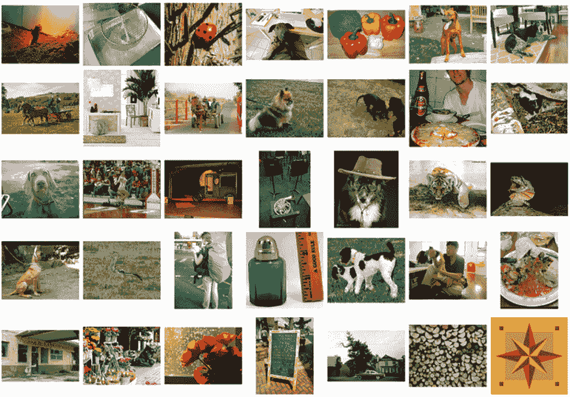
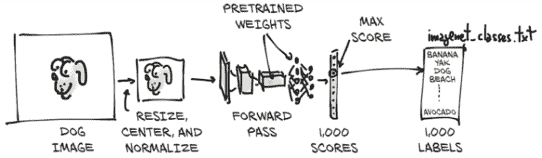
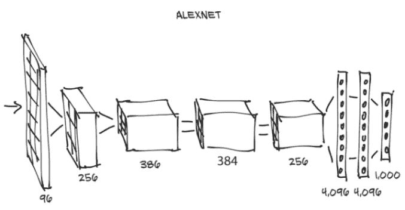
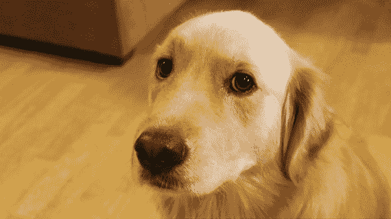
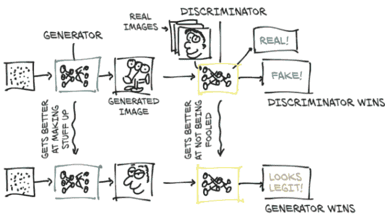
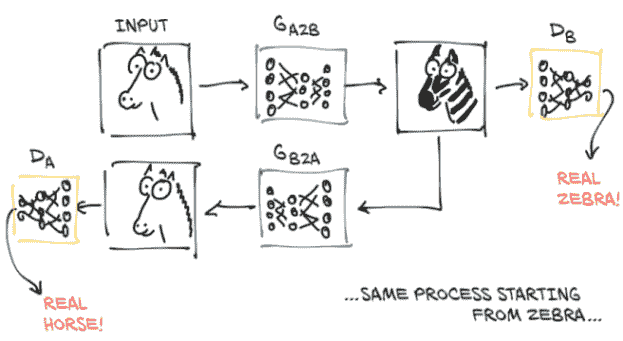
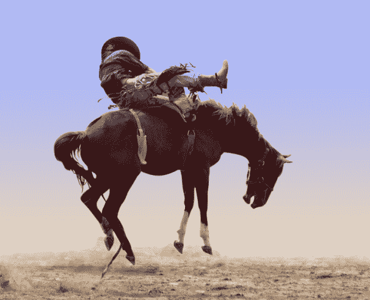
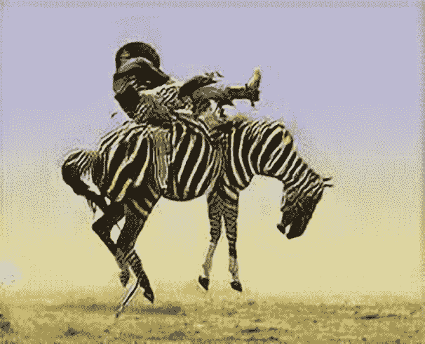
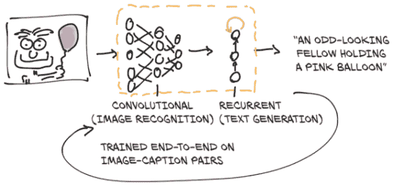

# 二、预训练网络

本章内容包括

+   运行预训练图像识别模型

+   GANs 和 CycleGAN 简介

+   能够生成图像文本描述的字幕模型

+   通过 Torch Hub 分享模型

我们在第一章结束时承诺在这一章中揭示令人惊奇的事物，现在是时候兑现了。计算机视觉无疑是深度学习的出现最受影响的领域之一，原因有很多。存在对自然图像进行分类或解释内容的需求，非常庞大的数据集变得可用，以及发明了新的构造，如卷积层，并且可以在 GPU 上以前所未有的准确性快速运行。所有这些因素与互联网巨头希望理解数百万用户使用移动设备拍摄的图片，并在这些巨头平台上管理的愿望相结合。简直是一场完美的风暴。

我们将学习如何使用该领域最优秀研究人员的工作，通过下载和运行已经在开放的大规模数据集上训练过的非常有趣的模型。我们可以将预训练的神经网络看作类似于一个接受输入并生成输出的程序。这样一个程序的行为由神经网络的架构和训练过程中看到的示例所决定，以期望的输入-输出对或输出应满足的期望属性。使用现成的模型可以快速启动深度学习项目，因为它利用了设计模型的研究人员的专业知识，以及用于训练权重的计算时间。

在本章中，我们将探索三种流行的预训练模型：一种可以根据内容标记图像的模型，另一种可以从真实图像中制作新图像，以及一种可以使用正确的英语句子描述图像内容的模型。我们将学习如何在 PyTorch 中加载和运行这些预训练模型，并介绍 PyTorch Hub，这是一组工具，通过这些工具，像我们将讨论的预训练模型这样的 PyTorch 模型可以通过统一接口轻松提供。在这个过程中，我们将讨论数据来源，定义术语如*标签*，并参加斑马竞技表演。

如果您是从其他深度学习框架转到 PyTorch，并且宁愿直接学习 PyTorch 的基础知识，您可以跳到下一章。本章涵盖的内容比基础知识更有趣，而且与任何给定的深度学习工具有一定的独立性。这并不是说它们不重要！但是，如果您在其他深度学习框架中使用过预训练模型，那么您已经知道它们可以是多么强大的工具。如果你已经熟悉生成对抗网络（GAN）游戏，那么我们不需要向您解释。

我们希望您继续阅读，因为本章隐藏了一些重要的技能。学习如何使用 PyTorch 运行预训练模型是一项有用的技能--毫无疑问。如果模型经过大型数据集的训练，这将尤其有用。我们需要习惯在真实世界数据上获取和运行神经网络的机制，然后可视化和评估其输出，无论我们是否对其进行了训练。

## 2.1 识别图像主题的预训练网络

作为我们对深度学习的首次尝试，我们将运行一个在对象识别任务上预训练的最先进的深度神经网络。可以通过源代码存储库访问许多预训练网络。研究人员通常会在其论文中发布源代码，而且通常该代码附带通过在参考数据集上训练模型获得的权重。使用其中一个模型可以使我们例如，可以轻松地为我们的下一个网络服务配备图像识别功能。

我们将在这里探索的预训练网络是在 ImageNet 数据集的一个子集上训练的（[`imagenet.stanford.edu`](http://imagenet.stanford.edu)）。ImageNet 是由斯坦福大学维护的一个非常庞大的数据集，包含超过 1400 万张图像。所有图像都标有来自 WordNet 数据集（[`wordnet.princeton.edu`](http://wordnet.princeton.edu)）的名词层次结构，WordNet 是一个大型的英语词汇数据库。

ImageNet 数据集，像其他几个公共数据集一样，起源于学术竞赛。竞赛一直是研究机构和公司研究人员经常挑战彼此的主要领域之一。自 2010 年创立以来，ImageNet 大规模视觉识别挑战赛（ILSVRC）已经变得越来越受欢迎。这个特定的竞赛基于一些任务，每年可能会有所不同，例如图像分类（告诉图像包含哪些对象类别）、对象定位（识别图像中对象的位置）、对象检测（识别和标记图像中的对象）、场景分类（对图像中的情况进行分类）和场景解析（将图像分割成与语义类别相关的区域，如牛、房子、奶酪、帽子）。特别是，图像分类任务包括获取输入图像并生成 5 个标签列表，来自 1000 个总类别，按置信度排序，描述图像的内容。

ILSVRC 的训练集包含了 120 万张图像，每张图像都标有 1000 个名词中的一个（例如，“狗”），被称为图像的*类别*。在这个意义上，我们将使用*标签*和*类别*这两个术语来互换使用。我们可以在图 2.1 中看到来自 ImageNet 的图像。



图 2.1 ImageNet 图像的一个小样本



图 2.2 推理过程

我们最终将能够将我们自己的图像输入到我们的预训练模型中，如图 2.2 所示。这将导致该图像的预测标签列表，然后我们可以检查模型认为我们的图像是什么。有些图像的预测是准确的，而其他的则不是！

输入图像将首先被预处理为`torch.Tensor`类的实例。它是一个具有高度和宽度的 RGB 图像，因此这个张量将具有三个维度：三个颜色通道和特定大小的两个空间图像维度。（我们将在第三章详细介绍张量是什么，但现在，可以将其视为浮点数的向量或矩阵。）我们的模型将获取处理过的输入图像，并将其传递到预训练网络中，以获取每个类别的分数。最高分对应于权重下最可能的类别。然后，每个类别都被一对一地映射到一个类别标签。该输出包含一个具有 1000 个元素的`torch.Tensor`，每个元素代表与该类别相关的分数。

在我们进行所有这些之前，我们需要获取网络本身，看看它的结构，了解如何准备数据以便模型使用。

### 2.1.1 获取用于图像识别的预训练网络

正如讨论的那样，我们现在将配备一个在 ImageNet 上训练过的网络。为此，我们将查看 TorchVision 项目（[`github.com/pytorch/vision`](https://github.com/pytorch/vision)），其中包含一些最佳性能的计算机视觉神经网络架构，如 AlexNet（[`mng.bz/lo6z`](http://mng.bz/lo6z)）、ResNet（[`arxiv.org/pdf/ 1512.03385.pdf`](https://arxiv.org/pdf/1512.03385.pdf)）和 Inception v3（[`arxiv.org/pdf/1512.00567.pdf`](https://arxiv.org/pdf/1512.00567.pdf)）。它还可以轻松访问 ImageNet 等数据集，以及其他用于快速掌握 PyTorch 中计算机视觉应用的实用工具。我们将在本书后面深入研究其中一些。现在，让我们加载并运行两个网络：首先是 AlexNet，这是早期用于图像识别的突破性网络；然后是残差网络，简称 ResNet，它在 2015 年赢得了 ImageNet 分类、检测和定位比赛等多个比赛。如果你在第一章中没有安装 PyTorch，现在是一个很好的时机。

预定义的模型可以在`torchvision.models`（code/p1ch2/2 _pre_trained_networks.ipynb）中找到：

```py
# In[1]:
from torchvision import models
```

我们可以看一下实际的模型：

```py
# In[2]:
dir(models)

# Out[2]:
['AlexNet',
 'DenseNet',
 'Inception3',
 'ResNet',
 'SqueezeNet',
 'VGG',
...
 'alexnet',
 'densenet',
 'densenet121',
...
 'resnet',
 'resnet101',
 'resnet152',
...
 ]
```

大写的名称指的是实现一些流行模型的 Python 类。它们在架构上有所不同--即，在输入和输出之间发生的操作排列方式不同。小写的名称是方便函数，返回从这些类实例化的模型，有时使用不同的参数集。例如，`resnet101`返回一个具有 101 层的`ResNet`实例，`resnet18`有 18 层，依此类推。现在我们将注意力转向 AlexNet。

### 2.1.2 AlexNet

AlexNet 架构以绝对优势赢得了 2012 年 ILSVRC，其前 5 个测试错误率（即，正确标签必须在前 5 个预测中）为 15.4%。相比之下，第二名提交的模型，不是基于深度网络的，错误率为 26.2%。这是计算机视觉历史上的一个决定性时刻：社区开始意识到深度学习在视觉任务中的潜力。这一飞跃随后不断改进，更现代的架构和训练方法使得前 5 个错误率降至 3%。

从今天的标准来看，与最先进的模型相比，AlexNet 是一个相对较小的网络。但在我们的情况下，它非常适合初次了解一个做某事的神经网络，并学习如何在新图像上运行预训练版本。

我们可以在图 2.3 中看到 AlexNet 的结构。虽然我们现在已经具备了理解它的所有要素，但我们可以预见一些方面。首先，每个块由一堆乘法和加法组成，加上我们将在第五章中发现的输出中的其他函数。我们可以将其视为一个滤波器--一个接受一个或多个图像作为输入并产生其他图像作为输出的函数。它的工作方式是在训练过程中确定的，基于它所*看到*的示例和所需的输出。



图 2.3 AlexNet 架构

在图 2.3 中，输入图像从左侧进入，并经过五组滤波器，每组产生多个输出图像。在每个滤波器之后，图像会按照注释的方式减小尺寸。最后一组滤波器产生的图像被布置成一个 4,096 元素的一维向量，并进行分类以产生 1,000 个输出概率，每个输出类别一个。

为了在输入图像上运行 AlexNet 架构，我们可以创建一个`AlexNet`类的实例。操作如下：

```py
# In[3]:
alexnet = models.AlexNet()
```

此时，`alexnet`是一个可以运行 AlexNet 架构的对象。目前，我们不需要了解这种架构的细节。暂时来说，`AlexNet`只是一个不透明的对象，可以像函数一样调用。通过为`alexnet`提供一些精确大小的输入数据（我们很快将看到这些输入数据应该是什么），我们将通过网络进行*前向传递*。也就是说，输入将通过第一组神经元，其输出将被馈送到下一组神经元，一直到最终输出。从实际角度来看，假设我们有一个正确类型的`input`对象，我们可以使用`output = alexnet(input)`来运行前向传递。

但如果我们这样做，我们将通过整个网络传递数据来产生...垃圾！这是因为网络未初始化：它的权重，即输入相加和相乘的数字，尚未经过任何训练--网络本身是一个空白（或者说是随机）状态。我们需要从头开始训练它，或者加载之前训练的权重，现在我们将这样做。

为此，让我们回到`models`模块。我们了解到大写名称对应于实现用于计算机视觉的流行架构的类。另一方面，小写名称是函数，用于实例化具有预定义层数和单元数的模型，并可选择下载和加载预训练权重。请注意，使用这些函数并非必要：它们只是方便地实例化具有与预训练网络构建方式相匹配的层数和单元数的模型。

### 2.1.3 ResNet

使用`resnet101`函数，我们现在将实例化一个 101 层的卷积神经网络。为了让事情有个对比，2015 年之前，在残差网络出现之前，实现这样深度的稳定训练被认为是极其困难的。残差网络使用了一个技巧，使这成为可能，并通过这样做，在当年一举超过了几个基准。

现在让我们创建网络的一个实例。我们将传递一个参数，指示函数下载在 ImageNet 数据集上训练的`resnet101`的权重，该数据集包含 1,200,000 张图像和 1,000 个类别：

```py
# In[4]:
resnet = models.resnet101(pretrained=True)
```

当我们盯着下载进度时，我们可以花一分钟来欣赏`resnet101`拥有 4450 万个参数--这是一个需要自动优化的大量参数！

### 2.1.4 准备好了，几乎可以运行了

好的，我们刚刚得到了什么？由于我们很好奇，我们将看一眼`resnet101`是什么样子。我们可以通过打印返回模型的值来做到这一点。这给了我们一个文本表示形式，提供了与我们在 2.3 中看到的相同类型的关于网络结构的详细信息。目前，这将是信息过载，但随着我们在书中的进展，我们将增加理解这段代码告诉我们的能力：

```py
# In[5]:
resnet

# Out[5]:
ResNet(
  (conv1): Conv2d(3, 64, kernel_size=(7, 7), stride=(2, 2), padding=(3, 3),
                  bias=False)
  (bn1): BatchNorm2d(64, eps=1e-05, momentum=0.1, affine=True,
                     track_running_stats=True)
  (relu): ReLU(inplace)
  (maxpool): MaxPool2d(kernel_size=3, stride=2, padding=1, dilation=1,
                       ceil_mode=False)
  (layer1): Sequential(
    (0): Bottleneck(
...
    )
  )
  (avgpool): AvgPool2d(kernel_size=7, stride=1, padding=0)
  (fc): Linear(in_features=2048, out_features=1000, bias=True)
)
```

我们在这里看到的是`modules`，每行一个。请注意，它们与 Python 模块没有任何共同之处：它们是单独的操作，神经网络的构建模块。在其他深度学习框架中，它们也被称为*层*。

如果我们向下滚动，我们会看到很多`Bottleneck`模块一个接一个地重复（共 101 个！），包含卷积和其他模块。这就是典型的用于计算机视觉的深度神经网络的解剖学：一个或多或少顺序级联的滤波器和非线性函数，最终以一个层（`fc`）产生每个 1,000 个输出类别（`out_features`）的分数。

`resnet`变量可以像函数一样调用，输入一个或多个图像，并为每个 1,000 个 ImageNet 类别产生相同数量的分数。然而，在这之前，我们必须对输入图像进行预处理，使其具有正确的大小，并使其值（颜色）大致处于相同的数值范围内。为了做到这一点，`torchvision`模块提供了`transforms`，允许我们快速定义基本预处理函数的流水线：

```py
# In[6]:
from torchvision import transforms
preprocess = transforms.Compose([
        transforms.Resize(256),
        transforms.CenterCrop(224),
        transforms.ToTensor(),
        transforms.Normalize(
            mean=[0.485, 0.456, 0.406],
            std=[0.229, 0.224, 0.225]
        )])
```

在这种情况下，我们定义了一个`preprocess`函数，将输入图像缩放到 256×256，将图像裁剪到围绕中心的 224×224，将其转换为张量（一个 PyTorch 多维数组：在这种情况下，一个带有颜色、高度和宽度的 3D 数组），并对其 RGB（红色、绿色、蓝色）组件进行归一化，使其具有定义的均值和标准差。如果我们希望网络产生有意义的答案，这些值需要与训练期间呈现给网络的值匹配。当我们深入研究如何制作自己的图像识别模型时，我们将更深入地了解 transforms，见第 7.1.3 节。

现在我们可以获取我们最喜欢的狗的图片（比如，GitHub 仓库中的 bobby.jpg），对其进行预处理，然后看看 ResNet 对其的看法。我们可以从本地文件系统中使用 Pillow（[`pillow.readthedocs.io/en/stable`](https://pillow.readthedocs.io/en/stable)）加载图像，这是 Python 的图像处理模块：

```py
# In[7]:
from PIL import Image
img = Image.open("../data/p1ch2/bobby.jpg")
```

如果我们是从 Jupyter Notebook 中跟随进行的，我们将执行以下操作以内联查看图片（它将显示在以下内容中的`<PIL.JpegImagePlugin...`处）：

```py
# In[8]:
img
# Out[8]:
<PIL.JpegImagePlugin.JpegImageFile image mode=RGB size=1280x720 at
 0x1B1601360B8>
```

否则，我们可以调用`show`方法，这将弹出一个带有查看器的窗口，以查看图 2.4 中显示的图像：



图 2.4 Bobby，我们非常特殊的输入图像

```py
>>> img.show()
```

接下来，我们可以通过我们的预处理流程传递图像：

```py
# In[9]:
img_t = preprocess(img)
```

然后我们可以以网络期望的方式重塑、裁剪和归一化输入张量。我们将在接下来的两章中更多地了解这一点；现在请耐心等待：

```py
# In[10]:
import torch
batch_t = torch.unsqueeze(img_t, 0)
```

现在我们准备运行我们的模型。

### 2.1.5 运行！

在深度学习领域，对新数据运行经过训练的模型的过程称为*推断*。为了进行推断，我们需要将网络设置为`eval`模式：

```py
# In[11]:
resnet.eval()

# Out[11]:
ResNet(
  (conv1): Conv2d(3, 64, kernel_size=(7, 7), stride=(2, 2), padding=(3, 3),
                  bias=False)
  (bn1): BatchNorm2d(64, eps=1e-05, momentum=0.1, affine=True,
                     track_running_stats=True)
  (relu): ReLU(inplace)
  (maxpool): MaxPool2d(kernel_size=3, stride=2, padding=1, dilation=1,
                       ceil_mode=False)
  (layer1): Sequential(
    (0): Bottleneck(
...
    )
  )
  (avgpool): AvgPool2d(kernel_size=7, stride=1, padding=0)
  (fc): Linear(in_features=2048, out_features=1000, bias=True)
)
```

如果我们忘记这样做，一些预训练模型，如*批量归一化*和*丢弃*，将不会产生有意义的答案，这仅仅是因为它们内部的工作方式。现在`eval`已经设置好，我们准备进行推断：

```py
# In[12]:
out = resnet(batch_t)
out

# Out[12]:
tensor([[ -3.4803,  -1.6618,  -2.4515,  -3.2662,  -3.2466,  -1.3611,
          -2.0465,  -2.5112,  -1.3043,  -2.8900,  -1.6862,  -1.3055,
...
           2.8674,  -3.7442,   1.5085,  -3.2500,  -2.4894,  -0.3354,
           0.1286,  -1.1355,   3.3969,   4.4584]])
```

一个涉及 4450 万参数的惊人操作集刚刚发生，产生了一个包含 1,000 个分数的向量，每个分数对应一个 ImageNet 类别。这没花多少时间，是吧？

现在我们需要找出获得最高分数的类别的标签。这将告诉我们模型在图像中看到了什么。如果标签与人类描述图像的方式相匹配，那太棒了！这意味着一切正常。如果不匹配，那么要么在训练过程中出了问题，要么图像与模型期望的差异太大，模型无法正确处理，或者存在其他类似问题。

要查看预测标签列表，我们将加载一个文本文件，列出标签的顺序与网络在训练期间呈现给网络的顺序相同，然后我们将挑选出网络产生的最高分数的索引处的标签。几乎所有用于图像识别的模型的输出形式与我们即将处理的形式类似。

让我们加载包含 ImageNet 数据集类别的 1,000 个标签的文件：

```py
# In[13]:
with open('../data/p1ch2/imagenet_classes.txt') as f:
    labels = [line.strip() for line in f.readlines()]
```

在这一点上，我们需要确定`out`张量中对应最高分数的索引。我们可以使用 PyTorch 中的`max`函数来做到这一点，该函数输出张量中的最大值以及发生最大值的索引：

```py
# In[14]:
_, index = torch.max(out, 1)
```

现在我们可以使用索引来访问标签。这里，`index`不是一个普通的 Python 数字，而是一个单元素、一维张量（具体来说，`tensor([207])`），所以我们需要获取实际的数值以用作索引进入我们的`labels`列表，使用`index[0]`。我们还使用`torch.nn.functional.softmax` ([`mng.bz/BYnq`](http://mng.bz/BYnq)) 来将我们的输出归一化到范围[0, 1]，并除以总和。这给了我们大致类似于模型对其预测的信心。在这种情况下，模型有 96%的把握知道它正在看的是一只金毛寻回犬：

```py
# In[15]:
percentage = torch.nn.functional.softmax(out, dim=1)[0] * 100
labels[index[0]], percentage[index[0]].item()

# Out[15]:
('golden retriever', 96.29334259033203)
```

哦哦，谁是个好孩子？

由于模型生成了分数，我们还可以找出第二、第三等等最好的是什么。为此，我们可以使用`sort`函数，它可以将值按升序或降序排序，并在原始数组中提供排序后值的索引：

```py
# In[16]:
_, indices = torch.sort(out, descending=True)
[(labels[idx], percentage[idx].item()) for idx in indices[0][:5]]

# Out[16]:
[('golden retriever', 96.29334259033203),
 ('Labrador retriever', 2.80812406539917),
 ('cocker spaniel, English cocker spaniel, cocker', 0.28267428278923035),
 ('redbone', 0.2086310237646103),
 ('tennis ball', 0.11621569097042084)]
```

我们看到前四个是狗（红骨是一种品种；谁知道？），之后事情开始变得有趣起来。第五个答案“网球”可能是因为有足够多的狗旁边有网球的图片，以至于模型基本上在说：“我有 0.1%的机会完全误解了什么是网球。”这是人类和神经网络在看待世界的根本差异的一个很好的例子，以及奇怪、微妙的偏见如何很容易潜入我们的数据中。

玩耍的时候到了！我们可以继续用随机图像询问我们的网络，看看它会得出什么结果。网络的成功程度很大程度上取决于主题在训练集中是否得到很好的代表。如果我们呈现一个包含训练集之外主题的图像，网络很可能会以相当高的信心给出错误答案。实验和了解模型对未见数据的反应是很有用的。

我们刚刚运行了一个在 2015 年赢得图像分类比赛的网络。它学会了从狗的例子中识别我们的狗，以及许多其他真实世界的主题。现在我们将看看不同的架构如何实现其他类型的任务，从图像生成开始。

## 2.2 一个假装到成功的预训练模型

让我们假设一下，我们是职业罪犯，想要开始销售著名艺术家的“失落”画作的赝品。我们是罪犯，不是画家，所以当我们绘制我们的假雷姆布兰特和毕加索时，很快就会显而易见它们是业余的模仿品而不是真品。即使我们花了很多时间练习，直到我们也无法分辨出画作是假的，试图在当地艺术拍卖行兜售也会立即被赶出去。更糟糕的是，被告知“这显然是假的；滚出去”，并不能帮助我们改进！我们将不得不随机尝试很多事情，评估哪些需要*稍微*长一点时间才能识别为赝品，并在未来的尝试中强调这些特征，这将花费太长时间。

相反，我们需要找到一个道德标准有问题的艺术史学家来检查我们的作品，并告诉我们究竟是什么让他们发现这幅画不真实。有了这个反馈，我们可以以明确、有针对性的方式改进我们的作品，直到我们的可疑学者再也无法将我们的画作与真品区分开来。

很快，我们的“波提切利”将在卢浮宫展出，他们的百元钞票将进入我们的口袋。我们会变得富有！

尽管这种情景有点荒谬，但其基础技术是可靠的，并且很可能会对未来几年数字数据的真实性产生深远影响。整个“照片证据”的概念很可能会变得完全可疑，因为制作令人信服但虚假的图像和视频将变得非常容易。唯一的关键因素是数据。让我们看看这个过程是如何运作的。

### 2.2.1 GAN 游戏

在深度学习的背景下，我们刚刚描述的被称为*GAN 游戏*，其中两个网络，一个充当画家，另一个充当艺术史学家，竞争着互相愚弄，创造和检测伪造品。GAN 代表*生成对抗网络*，其中*生成*表示正在创建某物（在本例中是假的杰作），*对抗*表示两个网络正在竞争愚弄对方，而*网络*显而易见。这些网络是最近深度学习研究的最原创的成果之一。

请记住，我们的总体目标是生成一类图像的合成示例，这些示例无法被识别为伪造品。当与合法示例混合在一起时，一个熟练的检查员会很难确定哪些是真实的，哪些是我们的伪造品。

*生成器*网络在我们的场景中扮演画家的角色，负责从任意输入开始生成逼真的图像。*鉴别器*网络是无情的艺术检查员，需要判断给定的图像是由生成器制作还是属于真实图像集。这种双网络设计对于大多数深度学习架构来说是非典型的，但是，当用于实现 GAN 游戏时，可以产生令人难以置信的结果。



图 2.5 GAN 游戏的概念

图 2.5 展示了大致的情况。生成器的最终目标是欺骗鉴别器，混淆真实和虚假图像。鉴别器的最终目标是发现自己被欺骗，但它也帮助生成器找出生成图像中的可识别错误。在开始阶段，生成器产生混乱的三眼怪物，看起来一点也不像伦勃朗的肖像画。鉴别器很容易区分混乱的混乱图像和真实的绘画作品。随着训练的进行，信息从鉴别器返回，生成器利用这些信息进行改进。训练结束时，生成器能够产生令人信服的伪造品，鉴别器不再能分辨哪个是真实的。

请注意，“鉴别器获胜”或“生成器获胜”不应被字面意义上解释--两者之间没有明确的比赛。然而，两个网络都是基于另一个网络的结果进行训练的，这推动了每个网络参数的优化。

这种技术已经被证明能够导致生成器从仅有噪音和一个条件信号（比如，对于人脸：年轻、女性、戴眼镜）生成逼真图像，换句话说，一个训练良好的生成器学会了一个可信的模型，即使被人类检查也看起来很真实。

### 2.2.2 CycleGAN

这个概念的一个有趣演变是 CycleGAN。CycleGAN 可以将一个域的图像转换为另一个域的图像（反之亦然），而无需我们在训练集中明确提供匹配对。

在图 2.6 中，我们有一个 CycleGAN 工作流程，用于将一匹马的照片转换为斑马，反之亦然。请注意，有两个独立的生成器网络，以及两个不同的鉴别器。



图 2.6 一个 CycleGAN 训练到可以愚弄两个鉴别器网络的程度

如图所示，第一个生成器学会生成符合目标分布（在这种情况下是斑马）的图像，从属于不同分布（马）的图像开始，以便鉴别器无法判断从马照片生成的图像是否真的是斑马的真实图片。同时--这就是缩写中*Cycle*前缀的含义--生成的假斑马被发送到另一个生成器，沿着另一条路（在我们的情况下是从斑马到马），由另一个鉴别器进行判断。创建这样一个循环显著稳定了训练过程，解决了 GAN 的一个最初问题。

有趣的是，在这一点上，我们不需要匹配的马/斑马对作为地面真相（祝你好运，让它们匹配姿势！）。从一组不相关的马图片和斑马照片开始对生成器进行训练就足够了，超越了纯粹监督的设置。这个模型的影响甚至超出了这个范围：生成器学会了如何有选择性地改变场景中物体的外观，而不需要关于什么是什么的监督。没有信号表明鬃毛是鬃毛，腿是腿，但它们被转换成与另一种动物的解剖学相一致的东西。

### 2.2.3 将马变成斑马的网络

我们现在可以玩这个模型。CycleGAN 网络已经在从 ImageNet 数据集中提取的（不相关的）马图片和斑马图片数据集上进行了训练。网络学会了将一张或多张马的图片转换成斑马，尽可能保持其余部分的图像不变。虽然人类在过去几千年里并没有为将马变成斑马的工具而屏住呼吸，但这个任务展示了这些架构模拟复杂现实世界过程的能力，远程监督。虽然它们有局限性，但有迹象表明，在不久的将来，我们将无法在实时视频中区分真实和虚假，这打开了一个我们将立即关闭的潘多拉魔盒。

玩一个预训练的 CycleGAN 将给我们一个机会，更近距离地看一看网络--在这种情况下是一个生成器--是如何实现的。我们将使用我们的老朋友 ResNet。我们将在屏幕外定义一个`ResNetGenerator`类。代码在 3_cyclegan.ipynb 文件的第一个单元格中，但实现目前并不相关，而且在我们获得更多 PyTorch 经验之前，它太复杂了。现在，我们专注于*它能做什么*，而不是*它是如何做到的*。让我们用默认参数实例化这个类（code/p1ch2/3_cyclegan.ipynb）：

```py
# In[2]:
netG = ResNetGenerator()
```

`netG`模型已经创建，但它包含随机权重。我们之前提到过，我们将运行一个在 horse2zebra 数据集上预训练的生成器模型，该数据集的训练集包含 1068 张马和 1335 张斑马的图片。数据集可以在[`mng.bz/8pKP`](http://mng.bz/8pKP)找到。模型的权重已保存在.pth 文件中，这只是模型张量参数的`pickle`文件。我们可以使用模型的`load_state_dict`方法将它们加载到`ResNetGenerator`中：

```py
# In[3]:
model_path = '../data/p1ch2/horse2zebra_0.4.0.pth'
model_data = torch.load(model_path)
netG.load_state_dict(model_data)
```

此时，`netG`已经获得了在训练过程中获得的所有知识。请注意，这与我们在第 2.1.3 节中从`torchvision`中加载`resnet101`时发生的情况完全相同；但`torchvision.resnet101`函数将加载过程隐藏了起来。

让我们将网络设置为`eval`模式，就像我们为`resnet101`所做的那样：

```py
# In[4]:
netG.eval()

# Out[4]:
ResNetGenerator(
  (model): Sequential(
...
  )
)
```

像之前打印模型一样，我们可以欣赏到它实际上相当简洁，考虑到它的功能。它接收一幅图像，通过查看像素识别出一匹或多匹马，并单独修改这些像素的值，使得输出看起来像一匹可信的斑马。我们在打印输出中（或者源代码中）不会认出任何类似斑马的东西：那是因为里面没有任何类似斑马的东西。这个网络是一个脚手架--关键在于权重。

我们准备加载一张随机的马的图像，看看我们的生成器会产生什么。首先，我们需要导入`PIL`和`torchvision`：

```py
# In[5]:
from PIL import Image
from torchvision import transforms
```

然后我们定义一些输入转换，以确保数据以正确的形状和大小进入网络：

```py
# In[6]:
preprocess = transforms.Compose([transforms.Resize(256),
                                 transforms.ToTensor()])
```

让我们打开一个马文件（见图 2.7）：



图 2.7 一个骑马的人。马似乎不太乐意。

```py
# In[7]:
img = Image.open("../data/p1ch2/horse.jpg")
img
```

好吧，有个家伙骑在马上。（看图片的话，可能不会持续太久。）不管怎样，让我们通过预处理并将其转换为正确形状的变量：

```py
# In[8]:
img_t = preprocess(img)
batch_t = torch.unsqueeze(img_t, 0)
```

我们现在不必担心细节。重要的是我们要保持距离跟随。此时，`batch_t`可以被发送到我们的模型：

```py
# In[9]:
batch_out = netG(batch_t)
```

`batch_out`现在是生成器的输出，我们可以将其转换回图像：

```py
# In[10]:
out_t = (batch_out.data.squeeze() + 1.0) / 2.0
out_img = transforms.ToPILImage()(out_t)
# out_img.save('../data/p1ch2/zebra.jpg')
out_img

# Out[10]:
<PIL.Image.Image image mode=RGB size=316x256 at 0x23B24634F98>
```

哦，天啊。谁像那样骑斑马呢？结果图像（图 2.8）并不完美，但请考虑到网络发现有人（某种程度上）骑在马上有点不寻常。需要重申的是，学习过程并没有经过直接监督，人类没有勾勒出成千上万匹马或手动 Photoshop 成千上万条斑马条纹。生成器已经学会生成一幅图像，可以愚弄鉴别器，让它认为那是一匹斑马，而图像并没有什么奇怪之处（显然鉴别器从未去过竞技场）。



图 2.8 一个骑斑马的人。斑马似乎不太乐意。

许多其他有趣的生成器是使用对抗训练或其他方法开发的。其中一些能够创建出可信的不存在个体的人脸；其他一些可以将草图转换为看起来真实的虚构景观图片。生成模型也被用于产生听起来真实的音频、可信的文本和令人愉悦的音乐。这些模型很可能将成为未来支持创造过程的工具的基础。

说真的，这种工作的影响难以言表。像我们刚刚下载的这种工具只会变得更加高质量和更加普遍。特别是换脸技术已经引起了相当多的媒体关注。搜索“deep fakes”会出现大量示例内容¹（尽管我们必须指出有相当数量的不适宜工作场所的内容被标记为这样；就像互联网上的一切一样，要小心点击）。

到目前为止，我们有机会玩弄一个能看到图像的模型和一个能生成新图像的模型。我们将以一个涉及另一个基本要素的模型结束我们的旅程：自然语言。

## 2.3 描述场景的预训练网络

为了亲身体验涉及自然语言的模型，我们将使用一个由 Ruotian Luo 慷慨提供的预训练图像字幕模型。这是 Andrej Karpathy 的 NeuralTalk2 模型的一个实现。当呈现一幅自然图像时，这种模型会生成一个用英语描述场景的字幕，如图 2.9 所示。该模型是在大量图像数据集上训练的，配有一对句子描述：例如，“一只虎斑猫斜靠在木桌上，一只爪子放在激光鼠标上，另一只放在黑色笔记本电脑上。”³



图 2.9 字幕模型的概念

这个字幕模型有两个连接的部分。模型的第一部分是一个网络，学习生成场景的“描述性”数值表示（Tabby 猫，激光鼠标，爪子），然后将这些数值描述作为第二部分的输入。第二部分是一个*循环神经网络*，通过将这些数值描述组合在一起生成连贯的句子。模型的两个部分一起在图像-字幕对上进行训练。

模型的后半部分被称为*循环*，因为它在后续的前向传递中生成其输出（单词），其中每个前向传递的输入包括前一个前向传递的输出。这使得下一个单词依赖于先前生成的单词，这是我们在处理句子或一般序列时所期望的。

### 2.3.1 神经对话 2

神经对话 2 模型可以在[`github.com/deep-learning-with-pytorch/ImageCaptioning.pytorch`](https://github.com/deep-learning-with-pytorch/ImageCaptioning.pytorch)找到。我们可以将一组图像放在`data`目录中，并运行以下脚本：

```py
python eval.py --model ./data/FC/fc-model.pth--infos_path ./data/FC/fc-infos.pkl --image_folder ./data
```

让我们尝试使用我们的 horse.jpg 图像。它说：“一个人骑着马在海滩上。”非常合适。

现在，就只是为了好玩，让我们看看我们的 CycleGAN 是否也能愚弄这个神经对话 2 模型。让我们在数据文件夹中添加 zebra.jpg 图像并重新运行模型：“一群斑马站在田野上。”嗯，它正确地识别了动物，但它在图像中看到了不止一只斑马。显然，这不是网络曾经见过斑马的姿势，也没有见过斑马上有骑手（带有一些虚假的斑马图案）。此外，斑马很可能是以群体形式出现在训练数据集中，因此我们可能需要调查一些偏见。字幕网络也没有描述骑手。同样，这可能是同样的原因：网络在训练数据集中没有看到骑手骑在斑马上。无论如何，这是一个令人印象深刻的壮举：我们生成了一张带有不可能情景的假图像，而字幕网络足够灵活，能够正确地捕捉主题。

我们想强调的是，像这样的东西，在深度学习出现之前是极其难以实现的，现在可以用不到一千行代码，使用一个不知道关于马或斑马的通用架构，以及一组图像和它们的描述（在这种情况下是 MS COCO 数据集）来获得。没有硬编码的标准或语法--一切，包括句子，都是从数据中的模式中产生的。

在这种情况下，网络架构在某种程度上比我们之前看到的更复杂，因为它包括两个网络。其中一个是循环的，但是它是由 PyTorch 提供的相同构建块构建的。

在撰写本文时，这样的模型更多地存在于应用研究或新颖项目中，而不是具有明确定义的具体用途。尽管结果令人鼓舞，但还不足以使用...至少现在还不足够。随着时间的推移（和额外的训练数据），我们应该期望这类模型能够向视觉受损的人描述世界，从视频中转录场景，以及执行其他类似的任务。

## 2.4 Torch Hub

从深度学习的早期就开始发布预训练模型，但直到 PyTorch 1.0，没有办法确保用户可以获得统一的接口来获取它们。TorchVision 是一个良好的接口示例，正如我们在本章前面看到的那样；但其他作者，正如我们在 CycleGAN 和神经对话 2 中看到的那样，选择了不同的设计。

PyTorch 1.0 引入了 Torch Hub，这是一个机制，通过该机制，作者可以在 GitHub 上发布一个模型，带有或不带有预训练权重，并通过 PyTorch 理解的接口公开它。这使得从第三方加载预训练模型就像加载 TorchVision 模型一样简单。

作者通过 Torch Hub 机制发布模型所需的全部工作就是在 GitHub 存储库的根目录中放置一个名为 hubconf.py 的文件。该文件具有非常简单的结构：

```py
dependencies = ['torch', 'math']               # ❶

def some_entry_fn(*args, **kwargs):            # ❷
    model = build_some_model(*args, **kwargs)
    return model

def another_entry_fn(*args, **kwargs):
    model = build_another_model(*args, **kwargs)
    return model
```

❶ 代码依赖的可选模块列表

❷ 一个或多个要向用户公开作为存储库入口点的函数。这些函数应根据参数初始化模型并返回它们

在我们寻找有趣的预训练模型的过程中，现在我们可以搜索包含 hubconf.py 的 GitHub 存储库，我们会立即知道可以使用 torch.hub 模块加载它们。让我们看看实际操作是如何进行的。为此，我们将回到 TorchVision，因为它提供了一个清晰的示例，展示了如何与 Torch Hub 交互。

让我们访问[`github.com/pytorch/vision`](https://github.com/pytorch/vision)，注意其中包含一个 hubconf.py 文件。很好，检查通过。首先要做的事情是查看该文件，看看存储库的入口点--我们稍后需要指定它们。在 TorchVision 的情况下，有两个：`resnet18`和`resnet50`。我们已经知道这些是做什么的：它们分别返回一个 18 层和一个 50 层的 ResNet 模型。我们还看到入口点函数包括一个`pretrained`关键字参数。如果为`True`，返回的模型将使用从 ImageNet 学习到的权重进行初始化，就像我们在本章前面看到的那样。

现在我们知道存储库、入口点和一个有趣的关键字参数。这就是我们加载模型所需的全部内容，使用 torch.hub，甚至无需克隆存储库。没错，PyTorch 会为我们处理：

```py
import torch
from torch import hub

resnet18_model = hub.load('pytorch/vision:master',  # ❶
                           'resnet18',              # ❷
                           pretrained=True)         # ❸
```

❶ GitHub 存储库的名称和分支

❷ 入口点函数的名称

❸ 关键字参数

这将下载 pytorch/vision 存储库的主分支的快照，以及权重，到本地目录（默认为我们主目录中的.torch/hub），并运行`resnet18`入口点函数，返回实例化的模型。根据环境的不同，Python 可能会抱怨缺少模块，比如`PIL`。Torch Hub 不会安装缺少的依赖项，但会向我们报告，以便我们采取行动。

此时，我们可以使用适当的参数调用返回的模型，在其上运行前向传递，就像我们之前做的那样。好处在于，现在通过这种机制发布的每个模型都将以相同的方式对我们可用，远远超出视觉领域。

请注意，入口点应该返回模型；但严格来说，它们并不一定要这样做。例如，我们可以有一个用于转换输入的入口点，另一个用于将输出概率转换为文本标签。或者我们可以有一个仅包含模型的入口点，另一个包含模型以及预处理和后处理步骤。通过保持这些选项开放，PyTorch 开发人员为社区提供了足够的标准化和很大的灵活性。我们将看到从这个机会中会出现什么样的模式。

在撰写本文时，Torch Hub 还很新，只有少数模型是以这种方式发布的。我们可以通过谷歌搜索“github.com hubconf.py”来找到它们。希望在未来列表会增长，因为更多作者通过这个渠道分享他们的模型。

## 2.5 结论

希望这是一个有趣的章节。我们花了一些时间玩弄用 PyTorch 创建的模型，这些模型经过优化，可以执行特定任务。事实上，我们中更有进取心的人已经可以将其中一个模型放在 Web 服务器后面，并开始一项业务，与原始作者分享利润！一旦我们了解了这些模型是如何构建的，我们还将能够利用在这里获得的知识下载一个预训练模型，并快速对稍有不同的任务进行微调。

我们还将看到如何使用相同的构建块构建处理不同问题和不同类型数据的模型。PyTorch 做得特别好的一件事是以基本工具集的形式提供这些构建块--从 API 的角度来看，PyTorch 并不是一个非常庞大的库，特别是与其他深度学习框架相比。

本书不专注于完整地介绍 PyTorch API 或审查深度学习架构；相反，我们将建立对这些构建块的实践知识。这样，您将能够在坚实的基础上消化优秀的在线文档和存储库。

从下一章开始，我们将踏上一段旅程，使我们能够从头开始教授计算机技能，使用 PyTorch。我们还将了解，从预训练网络开始，并在新数据上进行微调，而不是从头开始，是解决问题的有效方法，特别是当我们拥有的数据点并不是特别多时。这是预训练网络是深度学习从业者必备的重要工具的另一个原因。是时候了解第一个基本构建块了：张量。

## 2.6 练习

1.  将金毛猎犬的图像输入到马到斑马模型中。

    1.  你需要对图像进行哪些处理？

    1.  输出是什么样的？

1.  在 GitHub 上搜索提供 hubconf.py 文件的项目。

    1.  返回了多少个存储库？

    1.  找一个带有 hubconf.py 的看起来有趣的项目。你能从文档中理解项目的目的吗？

    1.  收藏这个项目，在完成本书后回来。你能理解实现吗？

## 2.7 总结

+   预训练网络是已经在数据集上训练过的模型。这样的网络通常在加载网络参数后可以立即产生有用的结果。

+   通过了解如何使用预训练模型，我们可以将神经网络集成到项目中，而无需设计或训练它。

+   AlexNet 和 ResNet 是两个深度卷积网络，在它们发布的年份为图像识别设立了新的基准。

+   生成对抗网络（GANs）有两部分--生成器和判别器--它们共同工作以产生与真实物品无法区分的输出。

+   CycleGAN 使用一种支持在两种不同类别的图像之间进行转换的架构。

+   NeuralTalk2 使用混合模型架构来消耗图像并生成图像的文本描述。

+   Torch Hub 是一种标准化的方式，可以从具有适当的 hubconf.py 文件的任何项目中加载模型和权重。

* * *

¹Vox 文章“乔丹·皮尔模拟奥巴马公益广告是对假新闻的双刃警告”中描述了一个相关例子，作者是阿贾·罗曼诺；[`mng.bz/dxBz (警告：粗俗语言`](http://mng.bz/dxBz%20(warning:%20coarse%20language)).

² 我们在[`github.com/deep-learning-with-pytorch/ImageCaptioning .pytorch`](https://github.com/deep-learning-with-pytorch/ImageCaptioning.pytorch)上维护代码的克隆。

³Andrej Karpathy 和 Li Fei-Fei，“用于生成图像描述的深度视觉语义对齐”，[`cs.stanford.edu/people/karpathy/cvpr2015.pdf`](https://cs.stanford.edu/people/karpathy/cvpr2015.pdf).

⁴ 联系出版商了解特许经营机会！
