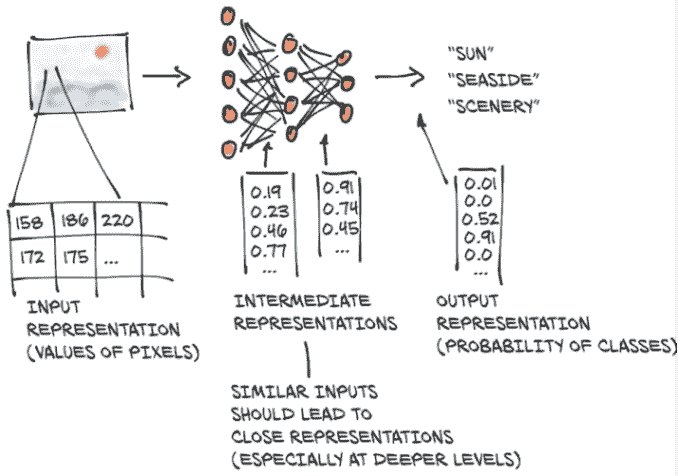
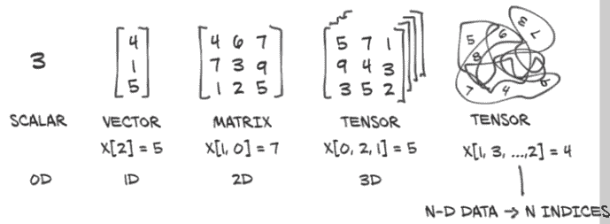
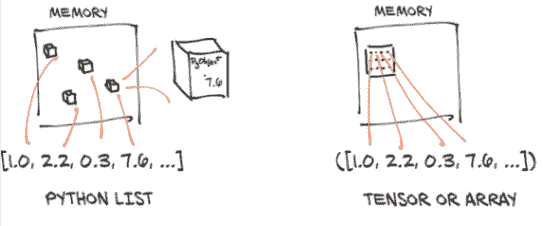
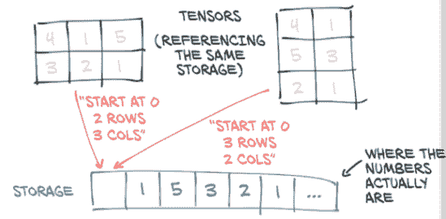
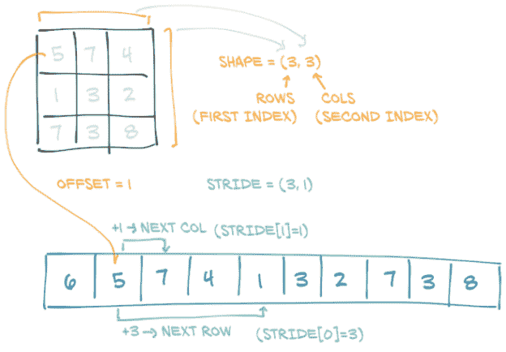
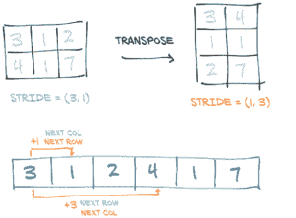
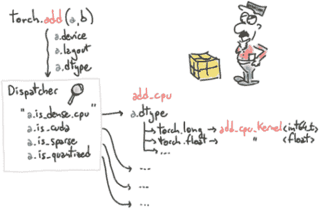

# 三、始于张量

本章涵盖

+   理解张量，PyTorch 中的基本数据结构

+   张量的索引和操作

+   与 NumPy 多维数组的互操作

+   将计算迁移到 GPU 以提高速度

在上一章中，我们参观了深度学习所能实现的许多应用。它们无一例外地包括将某种形式的数据（如图像或文本）转换为另一种形式的数据（如标签、数字或更多图像或文本）。从这个角度来看，深度学习实际上是构建一个能够将数据从一种表示转换为另一种表示的系统。这种转换是通过从一系列示例中提取所需映射的共同点来驱动的。例如，系统可能注意到狗的一般形状和金毛寻回犬的典型颜色。通过结合这两个图像属性，系统可以正确地将具有特定形状和颜色的图像映射到金毛寻回犬标签，而不是黑色实验室（或者一只黄褐色的公猫）。最终的系统可以处理数量相似的输入并为这些输入产生有意义的输出。

这个过程始于将我们的输入转换为浮点数。我们将在第四章中涵盖将图像像素转换为数字的过程，正如我们在图 3.1 的第一步中所看到的那样（以及许多其他类型的数据）。但在我们开始之前，在本章中，我们将学习如何通过张量在 PyTorch 中处理所有浮点数。

## 3.1 世界是由浮点数构成的

由于浮点数是网络处理信息的方式，我们需要一种方法将我们想要处理的现有世界数据编码为网络可以理解的内容，然后将输出解码回我们可以理解并用于我们目的的内容。



图 3.1 一个深度神经网络学习如何将输入表示转换为输出表示。（注意：神经元和输出的数量不是按比例缩放的。）

深度神经网络通常通过阶段性地学习从一种数据形式到另一种数据形式的转换来进行学习，这意味着每个阶段之间部分转换的数据可以被视为一系列中间表示。对于图像识别，早期的表示可以是边缘检测或某些纹理，如毛皮。更深层次的表示可以捕捉更复杂的结构，如耳朵、鼻子或眼睛。

一般来说，这种中间表示是描述输入并以对描述输入如何映射到神经网络输出至关重要的方式捕捉数据结构的一组浮点数。这种描述是针对手头的任务具体的，并且是从相关示例中学习的。这些浮点数集合及其操作是现代人工智能的核心--我们将在本书中看到几个这样的例子。

需要记住这些中间表示（如图 3.1 的第二步所示）是将输入与前一层神经元的权重相结合的结果。每个中间表示对应于其前面的输入是独一无二的。

在我们开始将数据转换为浮点输入的过程之前，我们必须首先对 PyTorch 如何处理和存储数据--作为输入、中间表示和输出有一个扎实的理解。本章将专门讨论这一点。

为此，PyTorch 引入了一种基本数据结构：*张量*。我们在第二章中已经遇到了张量，当我们对预训练网络进行推断时。对于那些来自数学、物理或工程领域的人来说，*张量*这个术语通常与空间、参考系统和它们之间的变换捆绑在一起。在深度学习的背景下，张量是将向量和矩阵推广到任意维数的概念，正如我们在图 3.2 中所看到的。同一概念的另一个名称是*多维数组*。张量的维数与用于引用张量内标量值的索引数量相一致。



图 3.2 张量是 PyTorch 中表示数据的基本构件。

PyTorch 并不是唯一处理多维数组的库。NumPy 是迄今为止最流行的多维数组库，以至于现在可以说它已经成为数据科学的*通用语言*。PyTorch 与 NumPy 具有无缝互操作性，这带来了与 Python 中其他科学库的一流集成，如 SciPy ([www.scipy.org](https://www.scipy.org/))、Scikit-learn ([`scikit-learn.org`](https://scikit-learn.org))和 Pandas ([`pandas.pydata.org`](https://pandas.pydata.org))。

与 NumPy 数组相比，PyTorch 张量具有一些超能力，比如能够在图形处理单元（GPU）上执行非常快速的操作，将操作分布在多个设备或机器上，并跟踪创建它们的计算图。这些都是在实现现代深度学习库时的重要特性。

我们将通过介绍 PyTorch 张量来开始本章，涵盖基础知识，以便为本书其余部分的工作做好准备。首先，我们将学习如何使用 PyTorch 张量库来操作张量。这包括数据在内存中的存储方式，如何在常数时间内对任意大的张量执行某些操作，以及前面提到的 NumPy 互操作性和 GPU 加速。如果我们希望张量成为编程工具箱中的首选工具，那么理解张量的能力和 API 是很重要的。在下一章中，我们将把这些知识应用到实践中，并学习如何以一种能够利用神经网络进行学习的方式表示多种不同类型的数据。

## 3.2 张量：多维数组

我们已经学到了张量是 PyTorch 中的基本数据结构。张量是一个数组：即，一种数据结构，用于存储一组可以通过索引单独访问的数字，并且可以用多个索引进行索引。

### 3.2.1 从 Python 列表到 PyTorch 张量

让我们看看`list`索引是如何工作的，这样我们就可以将其与张量索引进行比较。在 Python 中，取一个包含三个数字的列表（.code/p1ch3/1_tensors.ipynb）：

```py
# In[1]:
a = [1.0, 2.0, 1.0]
```

我们可以使用相应的从零开始的索引来访问列表的第一个元素：

```py
# In[2]:
a[0]

# Out[2]:
1.0

# In[3]:
a[2] = 3.0
a

# Out[3]:
[1.0, 2.0, 3.0]
```

对于处理数字向量的简单 Python 程序，比如 2D 线的坐标，使用 Python 列表来存储向量并不罕见。正如我们将在接下来的章节中看到的，使用更高效的张量数据结构，可以表示许多类型的数据--从图像到时间序列，甚至句子。通过定义张量上的操作，其中一些我们将在本章中探讨，我们可以高效地切片和操作数据，即使是从一个高级（并不特别快速）语言如 Python。

### 3.2.2 构建我们的第一个张量

让我们构建我们的第一个 PyTorch 张量并看看它是什么样子。暂时它不会是一个特别有意义的张量，只是一个列中的三个 1：

```py
# In[4]:
import torch       # ❶
a = torch.ones(3)  # ❷
a

# Out[4]:
tensor([1., 1., 1.])

# In[5]:
a[1]

# Out[5]:
tensor(1.)

# In[6]:
float(a[1])

# Out[6]:
1.0

# In[7]:
a[2] = 2.0
a

# Out[7]:
tensor([1., 1., 2.])
```

❶ 导入 torch 模块

❷ 创建一个大小为 3、填充为 1 的一维张量

导入 `torch` 模块后，我们调用一个函数，创建一个大小为 3、填充值为 `1.0` 的（一维）张量。我们可以使用基于零的索引访问元素或为其分配新值。尽管表面上这个例子与数字对象列表没有太大区别，但在底层情况完全不同。

### 3.2.3 张量的本质

Python 列表或数字元组是单独分配在内存中的 Python 对象的集合，如图 3.3 左侧所示。另一方面，PyTorch 张量或 NumPy 数组是对（通常）包含*未装箱*的 C 数值类型而不是 Python 对象的连续内存块的视图。在这种情况下，每个元素是一个 32 位（4 字节）的 `float`，正如我们在图 3.3 右侧所看到的。这意味着存储 1,000,000 个浮点数的 1D 张量将需要确切的 4,000,000 个连续字节，再加上一些小的开销用于元数据（如维度和数值类型）。



图 3.3 Python 对象（带框）数值值与张量（未带框数组）数值值

假设我们有一个坐标列表，我们想用它来表示一个几何对象：也许是一个顶点坐标为 (4, 1), (5, 3) 和 (2, 1) 的 2D 三角形。这个例子与深度学习无关，但很容易理解。与之前将坐标作为 Python 列表中的数字不同，我们可以使用一维张量，将*X*存储在偶数索引中，*Y*存储在奇数索引中，如下所示：

```py
# In[8]:
points = torch.zeros(6) # ❶
points[0] = 4.0         # ❷
points[1] = 1.0
points[2] = 5.0
points[3] = 3.0
points[4] = 2.0
points[5] = 1.0
```

❶ 使用 .zeros 只是获取一个适当大小的数组的一种方式。

❷ 我们用我们实际想要的值覆盖了那些零值。

我们也可以将 Python 列表传递给构造函数，效果相同：

```py
# In[9]:
points = torch.tensor([4.0, 1.0, 5.0, 3.0, 2.0, 1.0])
points

# Out[9]:
tensor([4., 1., 5., 3., 2., 1.])
```

要获取第一个点的坐标，我们执行以下操作：

```py
# In[10]:
float(points[0]), float(points[1])

# Out[10]:
(4.0, 1.0)
```

这是可以的，尽管将第一个索引指向单独的 2D 点而不是点坐标会更实用。为此，我们可以使用一个 2D 张量：

```py
# In[11]:
points = torch.tensor([[4.0, 1.0], [5.0, 3.0], [2.0, 1.0]])
points

# Out[11]:
tensor([[4., 1.],
        [5., 3.],
        [2., 1.]])
```

在这里，我们将一个列表的列表传递给构造函数。我们可以询问张量的形状：

```py
# In[12]:
points.shape

# Out[12]:
torch.Size([3, 2])
```

这告诉我们张量沿每个维度的大小。我们也可以使用 `zeros` 或 `ones` 来初始化张量，提供大小作为一个元组：

```py
# In[13]:
points = torch.zeros(3, 2)
points

# Out[13]:
tensor([[0., 0.],
        [0., 0.],
        [0., 0.]])
```

现在我们可以使用两个索引访问张量中的单个元素：

```py
# In[14]:
points = torch.tensor([[4.0, 1.0], [5.0, 3.0], [2.0, 1.0]])
points

# Out[14]:
tensor([[4., 1.],
        [5., 3.],
        [2., 1.]])

# In[15]:
points[0, 1]

# Out[15]:
tensor(1.)
```

这返回我们数据集中第零个点的*Y*坐标。我们也可以像之前那样访问张量中的第一个元素，以获取第一个点的 2D 坐标：

```py
# In[16]:
points[0]

# Out[16]:
tensor([4., 1.])
```

输出是另一个张量，它呈现了相同基础数据的不同*视图*。新张量是一个大小为 2 的 1D 张量，引用了 `points` 张量中第一行的值。这是否意味着分配了一个新的内存块，将值复制到其中，并返回了包装在新张量对象中的新内存？不，因为那样会非常低效，特别是如果我们有数百万个点。当我们在本章后面讨论张量视图时，我们将重新讨论张量是如何存储的。

## 3.3 张量索引

如果我们需要获取一个不包含第一个点的张量，那很容易使用范围索引表示法，这也适用于标准 Python 列表。这里是一个提醒：

```py
# In[53]:
some_list = list(range(6))
some_list[:]               # ❶
some_list[1:4]             # ❷
some_list[1:]              # ❸
some_list[:4]              # ❹
some_list[:-1]             # ❺
some_list[1:4:2]           # ❻
```

❶ 列表中的所有元素

❷ 从第 1 个元素（包括）到第 4 个元素（不包括）

❸ 从第 1 个元素（包括）到列表末尾

❹ 从列表开头到第 4 个元素（不包括）

❺ 从列表开头到倒数第二个元素之前

❻ 从第 1 个元素（包括）到第 4 个元素（不包括），步长为 2

为了实现我们的目标，我们可以使用与 PyTorch 张量相同的符号表示法，其中的额外好处是，就像在 NumPy 和其他 Python 科学库中一样，我们可以为张量的每个维度使用范围索引：

```py
# In[54]:
points[1:]       # ❶
points[1:, :]    # ❷
points[1:, 0]    # ❸
points[None]     # ❹
```

❶ 第一个之后的所有行；隐式地所有列

❷ 第一个之后的所有行；所有列

❸ 第一个之后的所有行；第一列

❹ 添加一个大小为 1 的维度，就像 unsqueeze 一样

除了使用范围，PyTorch 还具有一种强大的索引形式，称为*高级索引*，我们将在下一章中看到。

## 3.4 命名张量

我们的张量的维度（或轴）通常索引像素位置或颜色通道之类的内容。这意味着当我们想要索引张量时，我们需要记住维度的顺序，并相应地编写我们的索引。随着数据通过多个张量进行转换，跟踪哪个维度包含什么数据可能会出错。

为了使事情具体化，想象我们有一个三维张量 `img_t`，来自第 2.1.4 节（这里为简单起见使用虚拟数据），我们想将其转换为灰度。我们查找了颜色的典型权重，以得出单个亮度值：¹

```py
# In[2]:
img_t = torch.randn(3, 5, 5) # shape [channels, rows, columns]
weights = torch.tensor([0.2126, 0.7152, 0.0722])
```

我们经常希望我们的代码能够泛化--例如，从表示为具有高度和宽度维度的 2D 张量的灰度图像到添加第三个通道维度的彩色图像（如 RGB），或者从单个图像到一批图像。在第 2.1.4 节中，我们引入了一个额外的批处理维度 `batch_t`；这里我们假装有一个批处理为 2 的批次：

```py
# In[3]:
batch_t = torch.randn(2, 3, 5, 5) # shape [batch, channels, rows, columns]
```

有时 RGB 通道在维度 0 中，有时它们在维度 1 中。但我们可以通过从末尾计数来概括：它们总是在维度-3 中，距离末尾的第三个。因此，懒惰的、无权重的平均值可以写成如下形式：

```py
# In[4]:
img_gray_naive = img_t.mean(-3)
batch_gray_naive = batch_t.mean(-3)
img_gray_naive.shape, batch_gray_naive.shape

# Out[4]:
(torch.Size([5, 5]), torch.Size([2, 5, 5]))
```

但现在我们也有了权重。PyTorch 将允许我们将形状相同的东西相乘，以及其中一个操作数在给定维度上的大小为 1。它还会自动附加大小为 1 的前导维度。这是一个称为*广播*的特性。形状为 (2, 3, 5, 5) 的 `batch_t` 乘以形状为 (3, 1, 1) 的 `unsqueezed_weights`，得到形状为 (2, 3, 5, 5) 的张量，然后我们可以对末尾的第三个维度求和（三个通道）：

```py
# In[5]:
unsqueezed_weights = weights.unsqueeze(-1).unsqueeze_(-1)
img_weights = (img_t * unsqueezed_weights)
batch_weights = (batch_t * unsqueezed_weights)
img_gray_weighted = img_weights.sum(-3)
batch_gray_weighted = batch_weights.sum(-3)
batch_weights.shape, batch_t.shape, unsqueezed_weights.shape

# Out[5]:
(torch.Size([2, 3, 5, 5]), torch.Size([2, 3, 5, 5]), torch.Size([3, 1, 1]))
```

因为这很快变得混乱--出于效率考虑--PyTorch 函数 `einsum`（改编自 NumPy）指定了一个索引迷你语言²，为这些乘积的和给出维度的索引名称。就像在 Python 中经常一样，广播--一种总结未命名事物的形式--使用三个点 `'...'` 完成；但不要太担心 `einsum`，因为我们接下来不会使用它：

```py
# In[6]:
img_gray_weighted_fancy = torch.einsum('...chw,c->...hw', img_t, weights)
batch_gray_weighted_fancy = torch.einsum('...chw,c->...hw', batch_t, weights)
batch_gray_weighted_fancy.shape

# Out[6]:
torch.Size([2, 5, 5])
```

正如我们所看到的，涉及到相当多的簿记工作。这是容易出错的，特别是当张量的创建和使用位置在我们的代码中相距很远时。这引起了从业者的注意，因此有人建议³给维度赋予一个名称。

PyTorch 1.3 添加了*命名张量*作为一个实验性功能（参见[`pytorch.org/tutorials/intermediate/named_tensor_tutorial.html`](https://pytorch.org/tutorials/intermediate/named_tensor_tutorial.html) 和 [`pytorch.org/docs/stable/named_tensor.html`](https://pytorch.org/docs/stable/named_tensor.html)）。张量工厂函数如 `tensor` 和 `rand` 接受一个 `names` 参数。这些名称应该是一个字符串序列：

```py
# In[7]:
weights_named = torch.tensor([0.2126, 0.7152, 0.0722], names=['channels'])
weights_named

# Out[7]:
tensor([0.2126, 0.7152, 0.0722], names=('channels',))
```

当我们已经有一个张量并想要添加名称（但不更改现有名称）时，我们可以在其上调用方法 `refine_names`。类似于索引，省略号 (`...`) 允许您省略任意数量的维度。使用 `rename` 兄弟方法，您还可以覆盖或删除（通过传入 `None`）现有名称：

```py
# In[8]:
img_named =  img_t.refine_names(..., 'channels', 'rows', 'columns')
batch_named = batch_t.refine_names(..., 'channels', 'rows', 'columns')
print("img named:", img_named.shape, img_named.names)
print("batch named:", batch_named.shape, batch_named.names)

# Out[8]:
img named: torch.Size([3, 5, 5]) ('channels', 'rows', 'columns')
batch named: torch.Size([2, 3, 5, 5]) (None, 'channels', 'rows', 'columns')
```

对于具有两个输入的操作，除了通常的维度检查--大小是否相同，或者一个是否为 1 且可以广播到另一个--PyTorch 现在将为我们检查名称。到目前为止，它不会自动对齐维度，因此我们需要明确地执行此操作。方法 `align_as` 返回一个具有缺失维度的张量，并将现有维度排列到正确的顺序：

```py
# In[9]:
weights_aligned = weights_named.align_as(img_named)
weights_aligned.shape, weights_aligned.names

# Out[9]:
(torch.Size([3, 1, 1]), ('channels', 'rows', 'columns'))
```

接受维度参数的函数，如 `sum`，也接受命名维度：

```py
# In[10]:
gray_named = (img_named * weights_aligned).sum('channels')
gray_named.shape, gray_named.names

# Out[10]:
(torch.Size([5, 5]), ('rows', 'columns'))
```

如果我们尝试结合具有不同名称的维度，我们会收到一个错误：

```py
gray_named = (img_named[..., :3] * weights_named).sum('channels')

 attempting to broadcast dims ['channels', 'rows',
  'columns'] and dims ['channels']: dim 'columns' and dim 'channels'
  are at the same position from the right but do not match.
```

如果我们想在不操作命名张量的函数之外使用张量，我们需要通过将它们重命名为 `None` 来删除名称。以下操作使我们回到无名称维度的世界：

```py
# In[12]:
gray_plain = gray_named.rename(None)
gray_plain.shape, gray_plain.names

# Out[12]:
(torch.Size([5, 5]), (None, None))
```

鉴于在撰写时此功能的实验性质，并为避免处理索引和对齐，我们将在本书的其余部分坚持使用无名称。命名张量有潜力消除许多对齐错误的来源，这些错误——如果以 PyTorch 论坛为例——可能是头痛的根源。看到它们将被广泛采用将是很有趣的。

## 3.5 张量元素类型

到目前为止，我们已经介绍了张量如何工作的基础知识，但我们还没有涉及可以存储在 `Tensor` 中的数值类型。正如我们在第 3.2 节中暗示的，使用标准的 Python 数值类型可能不是最佳选择，原因有几个：

+   *Python 中的数字是对象。* 虽然浮点数可能只需要，例如，32 位来在计算机上表示，但 Python 会将其转换为一个完整的 Python 对象，带有引用计数等等。这个操作，称为*装箱*，如果我们需要存储少量数字，那么这并不是问题，但分配数百万个数字会变得非常低效。

+   *Python 中的列表用于对象的顺序集合。* 没有为例如高效地计算两个向量的点积或将向量相加等操作定义。此外，Python 列表无法优化其内容在内存中的布局，因为它们是指向 Python 对象（任何类型，不仅仅是数字）的可索引指针集合。最后，Python 列表是一维的，虽然我们可以创建列表的列表，但这同样非常低效。

+   *与优化的编译代码相比，Python 解释器速度较慢。* 在大量数值数据上执行数学运算时，使用在编译、低级语言如 C 中编写的优化代码可以更快地完成。

出于这些原因，数据科学库依赖于 NumPy 或引入专用数据结构如 PyTorch 张量，它们提供了高效的低级数值数据结构实现以及相关操作，并包装在方便的高级 API 中。为了实现这一点，张量中的对象必须都是相同类型的数字，并且 PyTorch 必须跟踪这种数值类型。

### 3.5.1 使用 dtype 指定数值类型

张量构造函数（如 `tensor`、`zeros` 和 `ones`）的 `dtype` 参数指定了张量中将包含的数值数据类型。数据类型指定了张量可以保存的可能值（整数与浮点数）以及每个值的字节数。`dtype` 参数故意与同名的标准 NumPy 参数相似。以下是 `dtype` 参数可能的值列表：

+   `torch.float32` 或 `torch.float`：32 位浮点数

+   `torch.float64` 或 `torch.double`：64 位，双精度浮点数

+   `torch.float16` 或 `torch.half`：16 位，半精度浮点数

+   `torch.int8`：有符号 8 位整数

+   `torch.uint8`：无符号 8 位整数

+   `torch.int16` 或 `torch.short`：有符号 16 位整数

+   `torch.int32` 或 `torch.int`：有符号 32 位整数

+   `torch.int64` 或 `torch.long`：有符号 64 位整数

+   `torch.bool`：布尔值

张量的默认数据类型是 32 位浮点数。

### 3.5.2 每个场合的 dtype

正如我们将在未来的章节中看到的，神经网络中发生的计算通常以 32 位浮点精度执行。更高的精度，如 64 位，不会提高模型的准确性，并且会消耗更多的内存和计算时间。16 位浮点、半精度数据类型在标准 CPU 上并不存在，但在现代 GPU 上提供。如果需要，可以切换到半精度以减少神经网络模型的占用空间，对准确性的影响很小。

张量可以用作其他张量的索引。在这种情况下，PyTorch 期望索引张量具有 64 位整数数据类型。使用整数作为参数创建张量，例如使用 `torch.tensor([2, 2])`，将默认创建一个 64 位整数张量。因此，我们将大部分时间处理 `float32` 和 `int64`。

最后，关于张量的谓词，如 `points > 1.0`，会产生 `bool` 张量，指示每个单独元素是否满足条件。这就是数值类型的要点。

### 3.5.3 管理张量的 dtype 属性

为了分配正确数值类型的张量，我们可以将适当的 `dtype` 作为构造函数的参数指定。例如：

```py
# In[47]:
double_points = torch.ones(10, 2, dtype=torch.double)
short_points = torch.tensor([[1, 2], [3, 4]], dtype=torch.short)
```

通过访问相应的属性，我们可以了解张量的 `dtype`：

```py
# In[48]:
short_points.dtype

# Out[48]:
torch.int16
```

我们还可以使用相应的转换方法将张量创建函数的输出转换为正确的类型，例如

```py
# In[49]:
double_points = torch.zeros(10, 2).double()
short_points = torch.ones(10, 2).short()
```

或更方便的 `to` 方法：

```py
# In[50]:
double_points = torch.zeros(10, 2).to(torch.double)
short_points = torch.ones(10, 2).to(dtype=torch.short)
```

在幕后，`to` 检查转换是否必要，并在必要时执行。像 `float` 这样以 `dtype` 命名的转换方法是 `to` 的简写，但 `to` 方法可以接受我们将在第 3.9 节讨论的其他参数。

在操作中混合输入类型时，输入会自动转换为较大的类型。因此，如果我们想要 32 位计算，我们需要确保所有输入都是（最多）32 位：

```py
# In[51]:
points_64 = torch.rand(5, dtype=torch.double)     # ❶
points_short = points_64.to(torch.short)
points_64 * points_short  # works from PyTorch 1.3 onwards

# Out[51]:
tensor([0., 0., 0., 0., 0.], dtype=torch.float64)
```

❶ rand 将张量元素初始化为介于 0 和 1 之间的随机数。

## 3.6 张量 API

到目前为止，我们知道 PyTorch 张量是什么，以及它们在幕后是如何工作的。在我们结束之前，值得看一看 PyTorch 提供的张量操作。在这里列出它们都没有太大用处。相反，我们将对 API 有一个大致了解，并在在线文档 [`pytorch.org/docs`](http://pytorch.org/docs) 中确定一些查找内容的方向。

首先，大多数张量上的操作都可以在 `torch` 模块中找到，并且也可以作为张量对象的方法调用。例如，我们之前遇到的 `transpose` 函数可以从 `torch` 模块中使用

```py
# In[71]:
a = torch.ones(3, 2)
a_t = torch.transpose(a, 0, 1)

a.shape, a_t.shape

# Out[71]:
(torch.Size([3, 2]), torch.Size([2, 3]))
```

或作为 `a` 张量的方法：

```py
# In[72]:
a = torch.ones(3, 2)
a_t = a.transpose(0, 1)

a.shape, a_t.shape

# Out[72]:
(torch.Size([3, 2]), torch.Size([2, 3]))
```

这两种形式之间没有区别；它们可以互换使用。

*我们* 之前提到过在线文档 ([`pytorch.org/docs`](http://pytorch.org/docs))。它们非常详尽且组织良好，将张量操作分成了不同的组：

*创建操作* --用于构建张量的函数，如 `ones` 和 `from_numpy`

*索引、切片、连接、变异操作* --用于改变张量形状、步幅或内容的函数，如 `transpose`

*数学操作* --通过计算来操作张量内容的函数

+   *逐点操作* --通过独立地对每个元素应用函数来获取新张量的函数，如 `abs` 和 `cos`

+   *缩减操作* --通过迭代张量计算聚合值的函数，如 `mean`、`std` 和 `norm`

+   *比较操作* --用于在张量上评估数值谓词的函数，如 `equal` 和 `max`

+   *频谱操作* --用于在频域中进行转换和操作的函数，如 `stft` 和 `hamming_window`

+   *其他操作* --在向量上操作的特殊函数，如 `cross`，或在矩阵上操作的函数，如 `trace`

+   *BLAS 和 LAPACK 操作* --遵循基本线性代数子程序（BLAS）规范的函数，用于标量、向量-向量、矩阵-向量和矩阵-矩阵操作

*随机抽样* --通过从概率分布中随机抽取值生成值的函数，如`randn`和`normal`

*序列化* --用于保存和加载张量的函数，如`load`和`save`

*并行性* --用于控制并行 CPU 执行线程数的函数，如`set_num_threads`

花些时间玩玩通用张量 API。本章提供了进行这种交互式探索所需的所有先决条件。随着我们继续阅读本书，我们还将遇到几个张量操作，从下一章开始。

## 3.7 张量：存储的景观

是时候更仔细地查看底层实现了。张量中的值是由`torch.Storage`实例管理的连续内存块分配的。存储是一个一维数值数据数组：即，包含给定类型数字的连续内存块，例如`float`（表示浮点数的 32 位）或`int64`（表示整数的 64 位）。PyTorch 的`Tensor`实例是这样一个`Storage`实例的视图，能够使用偏移量和每维步长索引到该存储中。⁵



图 3.4 张量是`Storage`实例的视图。

即使多个张量以不同方式索引数据，它们可以索引相同的存储。我们可以在图 3.4 中看到这种情况。实际上，在我们在第 3.2 节请求`points[0]`时，我们得到的是另一个索引与`points`张量相同存储的张量--只是不是全部，并且具有不同的维度（1D 与 2D）。然而，底层内存只分配一次，因此可以快速创建数据的备用张量视图，而不管`Storage`实例管理的数据大小如何。

### 3.7.1 存储索引

让我们看看如何在实践中使用我们的二维点进行存储索引。给定张量的存储可以通过`.storage`属性访问：

```py
# In[17]:
points = torch.tensor([[4.0, 1.0], [5.0, 3.0], [2.0, 1.0]])
points.storage()

# Out[17]:
 4.0
 1.0
 5.0
 3.0
 2.0
 1.0
[torch.FloatStorage of size 6]
```

尽管张量报告自身具有三行和两列，但底层存储是一个大小为 6 的连续数组。在这种意义上，张量只知道如何将一对索引转换为存储中的位置。

我们也可以手动索引到存储中。例如：

```py
# In[18]:
points_storage = points.storage()
points_storage[0]

# Out[18]:
4.0

# In[19]:
points.storage()[1]

# Out[19]:
1.0
```

我们不能使用两个索引索引二维张量的存储。存储的布局始终是一维的，而不管可能引用它的任何和所有张量的维度如何。

在这一点上，改变存储的值导致改变其引用张量的内容应该不会让人感到意外：

```py
# In[20]:
points = torch.tensor([[4.0, 1.0], [5.0, 3.0], [2.0, 1.0]])
points_storage = points.storage()
points_storage[0] = 2.0
points

# Out[20]:
tensor([[2., 1.],
        [5., 3.],
        [2., 1.]])
```

### 3.7.2 修改存储的值：原地操作

除了前一节介绍的张量操作外，还存在一小部分操作仅作为`Tensor`对象的方法存在。它们可以通过名称末尾的下划线识别，比如`zero_`，表示该方法通过修改输入来*原地*操作，而不是创建新的输出张量并返回它。例如，`zero_`方法将所有输入元素都置零。任何*没有*末尾下划线的方法都不会改变源张量，并且会返回一个新的张量：

```py
# In[73]:
a = torch.ones(3, 2)

# In[74]:
a.zero_()
a

# Out[74]:
tensor([[0., 0.],
        [0., 0.],
        [0., 0.]])
```

## 3.8 张量元数据：大小、偏移和步长

为了索引到存储中，张量依赖于一些信息，这些信息与它们的存储一起，明确定义它们：尺寸、偏移和步幅。它们的相互作用如图 3.5 所示。尺寸（或形状，在 NumPy 术语中）是一个元组，指示张量在每个维度上代表多少个元素。存储偏移是存储中对应于张量第一个元素的索引。步幅是在存储中需要跳过的元素数量，以获取沿每个维度的下一个元素。



图 3.5 张量的偏移、尺寸和步幅之间的关系。这里的张量是一个更大存储的视图，就像在创建更大的张量时可能分配的存储一样。

### 3.8.1 另一个张量存储的视图

通过提供相应的索引，我们可以获取张量中的第二个点：

```py
# In[21]:
points = torch.tensor([[4.0, 1.0], [5.0, 3.0], [2.0, 1.0]])
second_point = points[1]
second_point.storage_offset()

# Out[21]:
2

# In[22]:
second_point.size()

# Out[22]:
torch.Size([2])
```

结果张量在存储中的偏移为 2（因为我们需要跳过第一个点，它有两个项目），尺寸是`Size`类的一个实例，包含一个元素，因为张量是一维的。重要的是要注意，这与张量对象的`shape`属性中包含的信息相同：

```py
# In[23]:
second_point.shape

# Out[23]:
torch.Size([2])
```

步幅是一个元组，指示当索引在每个维度上增加 1 时，必须跳过存储中的元素数量。例如，我们的`points`张量的步幅是`(2, 1)`：

```py
# In[24]:
points.stride()

# Out[24]:
(2, 1)
```

在 2D 张量中访问元素`i, j`会导致访问存储中的`storage_offset + stride[0] * i + stride[1] * j`元素。偏移通常为零；如果这个张量是一个查看存储的视图，该存储是为容纳更大的张量而创建的，则偏移可能是一个正值。

`Tensor`和`Storage`之间的这种间接关系使得一些操作变得廉价，比如转置张量或提取子张量，因为它们不会导致内存重新分配。相反，它们包括为尺寸、存储偏移或步幅分配一个具有不同值的新`Tensor`对象。

当我们索引特定点并看到存储偏移增加时，我们已经提取了一个子张量。让我们看看尺寸和步幅会发生什么变化：

```py
# In[25]:
second_point = points[1]
second_point.size()

# Out[25]:
torch.Size([2])

# In[26]:
second_point.storage_offset()

# Out[26]:
2

# In[27]:
second_point.stride()

# Out[27]:
(1,)
```

底线是，子张量的维度少了一个，正如我们所期望的那样，同时仍然索引与原始`points`张量相同的存储。这也意味着改变子张量将对原始张量产生副作用：

```py
# In[28]:
points = torch.tensor([[4.0, 1.0], [5.0, 3.0], [2.0, 1.0]])
second_point = points[1]
second_point[0] = 10.0
points

# Out[28]:
tensor([[ 4.,  1.],
        [10.,  3.],
        [ 2.,  1.]])
```

这可能并不总是理想的，所以我们最终可以将子张量克隆到一个新的张量中：

```py
# In[29]:
points = torch.tensor([[4.0, 1.0], [5.0, 3.0], [2.0, 1.0]])
second_point = points[1].clone()
second_point[0] = 10.0
points

# Out[29]:
tensor([[4., 1.],
        [5., 3.],
        [2., 1.]])
```

### 3.8.2 在不复制的情况下转置

现在让我们尝试转置。让我们拿出我们的`points`张量，其中行中有单独的点，列中有*X*和*Y*坐标，并将其转向，使单独的点在列中。我们借此机会介绍`t`函数，这是二维张量的`transpose`的简写替代品：

```py
# In[30]:
points = torch.tensor([[4.0, 1.0], [5.0, 3.0], [2.0, 1.0]])
points

# Out[30]:
tensor([[4., 1.],
        [5., 3.],
        [2., 1.]])

# In[31]:
points_t = points.t()
points_t

# Out[31]:
tensor([[4., 5., 2.],
        [1., 3., 1.]])
```

*提示* 为了帮助建立对张量机制的扎实理解，可能是一个好主意拿起一支铅笔和一张纸，像图 3.5 中的图一样在我们逐步执行本节代码时涂鸦图表。

我们可以轻松验证这两个张量共享相同的存储

```py
# In[32]:
id(points.storage()) == id(points_t.storage())

# Out[32]:
True
```

它们只在形状和步幅上有所不同：

```py
# In[33]:
points.stride()

# Out[33]:
(2, 1)
# In[34]:
points_t.stride()

# Out[34]:
(1, 2)
```

这告诉我们，在`points`中将第一个索引增加 1（例如，从`points[0,0]`到`points[1,0]`）将会跳过存储中的两个元素，而增加第二个索引（从`points[0,0]`到`points[0,1]`）将会跳过存储中的一个元素。换句话说，存储按行顺序顺序保存张量中的元素。

我们可以将`points`转置为`points_t`，如图 3.6 所示。我们改变了步幅中元素的顺序。之后，增加行（张量的第一个索引）将沿着存储跳过一个元素，就像我们在`points`中沿着列移动一样。这就是转置的定义。不会分配新的内存：转置只是通过创建一个具有不同步幅顺序的新`Tensor`实例来实现的。



图 3.6 张量的转置操作

### 3.8.3 高维度中的转置

在 PyTorch 中，转置不仅限于矩阵。我们可以通过指定应该发生转置（翻转形状和步幅）的两个维度来转置多维数组：

```py
# In[35]:
some_t = torch.ones(3, 4, 5)
transpose_t = some_t.transpose(0, 2)
some_t.shape

# Out[35]:
torch.Size([3, 4, 5])

# In[36]:
transpose_t.shape

# Out[36]:
torch.Size([5, 4, 3])

# In[37]:
some_t.stride()

# Out[37]:
(20, 5, 1)

# In[38]:
transpose_t.stride()

# Out[38]:
(1, 5, 20)
```

从存储中右起维度开始排列数值（即，对于二维张量，沿着行移动）的张量被定义为`contiguous`。连续张量很方便，因为我们可以有效地按顺序访问它们，而不需要在存储中跳跃（改善数据局部性会提高性能，因为现代 CPU 的内存访问方式）。当然，这种优势取决于算法的访问方式。

### 3.8.4 连续张量

PyTorch 中的一些张量操作仅适用于连续张量，例如我们将在下一章中遇到的`view`。在这种情况下，PyTorch 将抛出一个信息性异常，并要求我们显式调用`contiguous`。值得注意的是，如果张量已经是连续的，则调用`contiguous`不会做任何事情（也不会影响性能）。

在我们的例子中，`points`是连续的，而其转置则不是：

```py
# In[39]:
points.is_contiguous()

# Out[39]:
True

# In[40]:
points_t.is_contiguous()

# Out[40]:
False
```

我们可以使用`contiguous`方法从非连续张量中获得一个新的连续张量。张量的内容将保持不变，但步幅和存储将发生变化：

```py
# In[41]:
points = torch.tensor([[4.0, 1.0], [5.0, 3.0], [2.0, 1.0]])
points_t = points.t()
points_t

# Out[41]:
tensor([[4., 5., 2.],
        [1., 3., 1.]])

# In[42]:
points_t.storage()

# Out[42]:
 4.0
 1.0
 5.0
 3.0
 2.0
 1.0
[torch.FloatStorage of size 6]

# In[43]:
points_t.stride()

# Out[43]:
(1, 2)

# In[44]:
points_t_cont = points_t.contiguous()
points_t_cont

# Out[44]:
tensor([[4., 5., 2.],
        [1., 3., 1.]])

# In[45]:
points_t_cont.stride()

# Out[45]:
(3, 1)

# In[46]:
points_t_cont.storage()

# Out[46]:
 4.0
 5.0
 2.0
 1.0
 3.0
 1.0
[torch.FloatStorage of size 6]
```

请注意，存储已经重新排列，以便元素按行排列在新存储中。步幅已更改以反映新布局。

作为复习，图 3.7 再次显示了我们的图表。希望现在我们已经仔细研究了张量是如何构建的，一切都会变得清晰。


图 3.7 张量的偏移、大小和步幅之间的关系。这里的张量是一个更大存储的视图，就像在创建更大的张量时可能分配的存储一样。

## 3.9 将张量移动到 GPU

到目前为止，在本章中，当我们谈论存储时，我们指的是 CPU 上的内存。PyTorch 张量也可以存储在不同类型的处理器上：图形处理单元（GPU）。每个 PyTorch 张量都可以传输到 GPU 中的一个（或多个）以执行高度并行、快速的计算。将在张量上执行的所有操作都将使用 PyTorch 提供的 GPU 特定例程执行。

PyTorch 对各种 GPU 的支持

截至 2019 年中期，主要的 PyTorch 发行版只在支持 CUDA 的 GPU 上有加速。PyTorch 可以在 AMD 的 ROCm 上运行（[`rocm.github.io`](https://rocm.github.io)），主存储库提供支持，但到目前为止，您需要自行编译它。（在常规构建过程之前，您需要运行`tools/amd_build/build_amd.py`来转换 GPU 代码。）对 Google 的张量处理单元（TPU）的支持正在进行中（[`github.com/pytorch/xla`](https://github.com/pytorch/xla)），当前的概念验证可在 Google Colab 上公开访问：https://colab.research.google.com。在撰写本文时，不计划在其他 GPU 技术（如 OpenCL）上实现数据结构和内核。](https://colab.research.google.com)

### 3.9.1 管理张量的设备属性

除了`dtype`，PyTorch 的`Tensor`还有`device`的概念，即张量数据所放置的计算机位置。以下是我们如何通过为构造函数指定相应参数来在 GPU 上创建张量的方法：

```py
# In[64]:
points_gpu = torch.tensor([[4.0, 1.0], [5.0, 3.0], [2.0, 1.0]], device='cuda')
```

我们可以使用`to`方法将在 CPU 上创建的张量复制到 GPU 上：

```py
# In[65]:
points_gpu = points.to(device='cuda')
```

这样做会返回一个新的张量，其中包含相同的数值数据，但存储在 GPU 的 RAM 中，而不是常规系统 RAM 中。现在数据存储在 GPU 上，当对张量执行数学运算时，我们将开始看到之前提到的加速效果。在几乎所有情况下，基于 CPU 和 GPU 的张量都暴露相同的用户接口，这样编写代码就更容易，不用关心重要的数值计算到底在哪里运行。

如果我们的机器有多个 GPU，我们还可以通过传递一个从零开始的整数来决定将张量分配到哪个 GPU 上，例如

```py
# In[66]:
points_gpu = points.to(device='cuda:0')
```

此时，对张量执行的任何操作，例如将所有元素乘以一个常数，都是在 GPU 上执行的：

```py
# In[67]:
points = 2 * points                        # ❶
points_gpu = 2 * points.to(device='cuda')  # ❷
```

❶ 在 CPU 上执行的乘法

❷ 在 GPU 上执行的乘法

请注意，`points_gpu`张量在计算结果后并没有返回到 CPU。这是这一行中发生的事情： 

1.  `points`张量被复制到 GPU 上。

1.  在 GPU 上分配一个新的张量，并用于存储乘法的结果。

1.  返回一个指向该 GPU 张量的句柄。

因此，如果我们还向结果添加一个常数

```py
# In[68]:
points_gpu = points_gpu + 4
```

加法仍然在 GPU 上执行，没有信息流向 CPU（除非我们打印或访问生成的张量）。为了将张量移回 CPU，我们需要在`to`方法中提供一个`cpu`参数，例如

```py
# In[69]:
points_cpu = points_gpu.to(device='cpu')
```

我们还可以使用`cpu`和`cuda`的简写方法，而不是`to`方法来实现相同的目标：

```py
# In[70]:
points_gpu = points.cuda()      # ❶
points_gpu = points.cuda(0)
points_cpu = points_gpu.cpu()
```

❶ 默认为 GPU 索引 0

还值得一提的是，通过使用`to`方法，我们可以通过同时提供`device`和`dtype`作为参数来同时更改位置和数据类型。

## 3.10 NumPy 互操作性

我们在这里和那里提到了 NumPy。虽然我们不认为 NumPy 是阅读本书的先决条件，但我们强烈建议您熟悉 NumPy，因为它在 Python 数据科学生态系统中无处不在。PyTorch 张量可以与 NumPy 数组之间进行非常高效的转换。通过这样做，我们可以利用围绕 NumPy 数组类型构建起来的 Python 生态系统中的大量功能。这种与 NumPy 数组的零拷贝互操作性归功于存储系统与 Python 缓冲区协议的工作（[`docs.python.org/3/c-api/buffer.html`](https://docs.python.org/3/c-api/buffer.html)）。

要从我们的`points`张量中获取一个 NumPy 数组，我们只需调用

```py
# In[55]:
points = torch.ones(3, 4)
points_np = points.numpy()
points_np

# Out[55]:
array([[1., 1., 1., 1.],
       [1., 1., 1., 1.],
       [1., 1., 1., 1.]], dtype=float32)
```

这将返回一个正确大小、形状和数值类型的 NumPy 多维数组。有趣的是，返回的数组与张量存储共享相同的底层缓冲区。这意味着`numpy`方法可以在基本上不花费任何成本地执行，只要数据位于 CPU RAM 中。这也意味着修改 NumPy 数组将导致源张量的更改。如果张量分配在 GPU 上，PyTorch 将把张量内容复制到在 CPU 上分配的 NumPy 数组中。

相反，我们可以通过以下方式从 NumPy 数组获得一个 PyTorch 张量

```py
# In[56]:
points = torch.from_numpy(points_np)
```

这将使用我们刚刚描述的相同的缓冲区共享策略。

*注意* PyTorch 中的默认数值类型是 32 位浮点数，而 NumPy 中是 64 位。正如在第 3.5.2 节中讨论的那样，我们通常希望使用 32 位浮点数，因此在转换后，我们需要确保具有`dtype torch .float`的张量。

## 3.11 广义张量也是张量

对于本书的目的，以及一般大多数应用程序，张量都是多维数组，就像我们在本章中看到的那样。如果我们冒险窥探 PyTorch 的内部，会有一个转折：底层数据存储方式与我们在第 3.6 节讨论的张量 API 是分开的。只要满足该 API 的约定，任何实现都可以被视为张量！

PyTorch 将调用正确的计算函数，无论我们的张量是在 CPU 还是 GPU 上。这是通过*调度*机制实现的，该机制可以通过将用户界面 API 连接到正确的后端函数来满足其他张量类型的需求。确实，还有其他种类的张量：有些特定于某些类别的硬件设备（如 Google TPU），而其他的数据表示策略与我们迄今所见的稠密数组风格不同。例如，稀疏张量仅存储非零条目，以及索引信息。图 3.8 左侧的 PyTorch 调度程序被设计为可扩展的；图 3.8 右侧所示的用于适应各种数字类型的后续切换是实现的固定方面，编码到每个后端中。



图 3.8 PyTorch 中的调度程序是其关键基础设施之一。

我们将在第十五章遇到*量化*张量，它们作为另一种具有专门计算后端的张量类型实现。有时，我们使用的通常张量被称为*稠密*或*分步*，以区别于使用其他内存布局的张量。

与许多事物一样，随着 PyTorch 支持更广泛的硬件和应用程序范围，张量种类的数量也在增加。我们可以期待随着人们探索用 PyTorch 表达和执行计算的新方法，新的种类将继续出现。

## 3.12 序列化张量

在需要的时候，即使现场创建张量也很好，但如果其中的数据很有价值，我们会希望将其保存到文件中，并在某个时候加载回来。毕竟，我们不想每次运行程序时都从头开始重新训练模型！PyTorch 在底层使用`pickle`来序列化张量对象，还有专门的存储序列化代码。这里是如何将我们的`points`张量保存到一个 ourpoints.t 文件中的方法：

```py
# In[57]:
torch.save(points, '../data/p1ch3/ourpoints.t')
```

作为替代方案，我们可以传递文件描述符而不是文件名：

```py
# In[58]:
with open('../data/p1ch3/ourpoints.t','wb') as f:
   torch.save(points, f)
```

类似地，加载我们的点也是一行代码

```py
# In[59]:
points = torch.load('../data/p1ch3/ourpoints.t')
```

或者，等效地，

```py
# In[60]:
with open('../data/p1ch3/ourpoints.t','rb') as f:
   points = torch.load(f)
```

虽然我们可以快速以这种方式保存张量，如果我们只想用 PyTorch 加载它们，但文件格式本身不具有互操作性：我们无法使用除 PyTorch 之外的软件读取张量。根据使用情况，这可能是一个限制，也可能不是，但我们应该学会如何在需要时以互操作的方式保存张量。接下来我们将看看如何做到这一点。

### 3.12.1 使用 h5py 序列化到 HDF5

每种用例都是独特的，但我们怀疑在将 PyTorch 引入已经依赖不同库的现有系统时，需要以互操作方式保存张量将更常见。新项目可能不需要这样做那么频繁。

然而，在需要时，您可以使用 HDF5 格式和库（[www.hdfgroup.org/solutions/hdf5](https://www.hdfgroup.org/solutions/hdf5)）。HDF5 是一种便携式、广泛支持的格式，用于表示序列化的多维数组，以嵌套的键值字典组织。Python 通过`h5py`库（[www.h5py.org](http://www.h5py.org/)）支持 HDF5，该库接受并返回 NumPy 数组形式的数据。

我们可以使用以下命令安装`h5py`

```py
$ conda install h5py
```

在这一点上，我们可以通过将其转换为 NumPy 数组（如前所述，没有成本）并将其传递给`create_dataset`函数来保存我们的`points`张量：

```py
# In[61]:
import h5py

f = h5py.File('../data/p1ch3/ourpoints.hdf5', 'w')
dset = f.create_dataset('coords', data=points.numpy())
f.close()
```

这里的`'coords'`是 HDF5 文件中的一个键。我们可以有其他键--甚至是嵌套的键。在 HDF5 中的一个有趣之处是，我们可以在磁盘上索引数据集，并且只访问我们感兴趣的元素。假设我们只想加载数据集中的最后两个点：

```py
# In[62]:
f = h5py.File('../data/p1ch3/ourpoints.hdf5', 'r')
dset = f['coords']
last_points = dset[-2:]
```

当打开文件或需要数据集时，数据不会被加载。相反，数据会保留在磁盘上，直到我们请求数据集中的第二行和最后一行。在那时，`h5py`访问这两列并返回一个类似 NumPy 数组的对象，封装了数据集中的那个区域，行为类似 NumPy 数组，并具有相同的 API。

由于这个事实，我们可以将返回的对象传递给`torch.from_numpy`函数，直接获得一个张量。请注意，在这种情况下，数据被复制到张量的存储中：

```py
# In[63]:
last_points = torch.from_numpy(dset[-2:])
f.close()
```

加载数据完成后，我们关闭文件。关闭 HDFS 文件会使数据集无效，尝试在此之后访问`dset`将导致异常。只要我们按照这里显示的顺序进行操作，我们就可以正常工作并现在可以使用`last_points`张量。

## 3.13 结论

现在我们已经涵盖了我们需要开始用浮点数表示一切的一切。我们将根据需要涵盖张量的其他方面--例如创建张量的视图；使用其他张量对张量进行索引；以及广播，简化了在不同大小或形状的张量之间执行逐元素操作的操作--。

在第四章中，我们将学习如何在 PyTorch 中表示现实世界的数据。我们将从简单的表格数据开始，然后转向更复杂的内容。在这个过程中，我们将更多地了解张量。

## 3.14 练习

1.  从`list(range(9))`创建一个张量`a`。预测并检查大小、偏移和步长。

    1.  使用`b = a.view(3, 3)`创建一个新的张量。`view`函数的作用是什么？检查`a`和`b`是否共享相同的存储。

    1.  创建一个张量`c = b[1:,1:]`。预测并检查大小、偏移和步长。

1.  选择一个数学运算，如余弦或平方根。你能在`torch`库中找到相应的函数吗？

    1.  对`a`逐元素应用函数。为什么会返回错误？

    1.  使函数工作需要什么操作？

    1.  是否有一个在原地操作的函数版本？

## 3.15 总结

+   神经网络将浮点表示转换为其他浮点表示。起始和结束表示通常是人类可解释的，但中间表示则不太容易理解。

+   这些浮点表示存储在张量中。

+   张量是多维数组；它们是 PyTorch 中的基本数据结构。

+   PyTorch 拥有一个全面的标准库，用于张量的创建、操作和数学运算。

+   张量可以序列化到磁盘并重新加载。

+   PyTorch 中的所有张量操作都可以在 CPU 和 GPU 上执行，而不需要更改代码。

+   PyTorch 使用尾随下划线来表示一个函数在张量上的原地操作（例如，`Tensor.sqrt_`）。

* * *

¹ 由于感知不是一个简单的规范，人们提出了许多权重。例如，参见[`en.wikipedia.org/wiki/Luma_(video)`](https://en.wikipedia.org/wiki/Luma_(video))。

²Tim Rocktäschel 的博文“Einsum is All You Need--Einstein Summation in Deep Learning”（[` rockt.github.io/2018/04/30/einsum`](https://rockt.github.io/2018/04/30/einsum)）提供了很好的概述。

³ 参见 Sasha Rush 的博文“Tensor Considered Harmful”，Harvardnlp，[`nlp.seas.harvard.edu/NamedTensor`](http://nlp.seas.harvard.edu/NamedTensor)。

⁴ 以及在`uint8`的情况下的符号。

⁵ 在未来的 PyTorch 版本中，`Storage`可能无法直接访问，但我们在这里展示的内容仍然提供了张量在内部工作方式的良好思维图。
