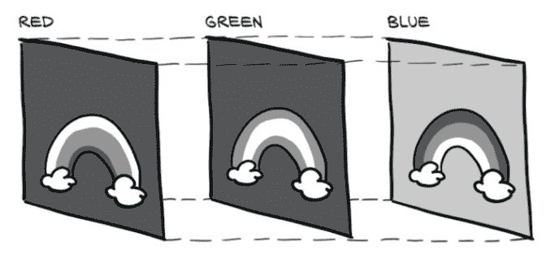
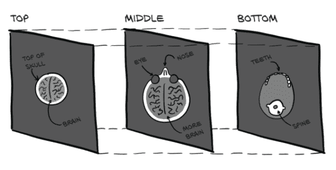
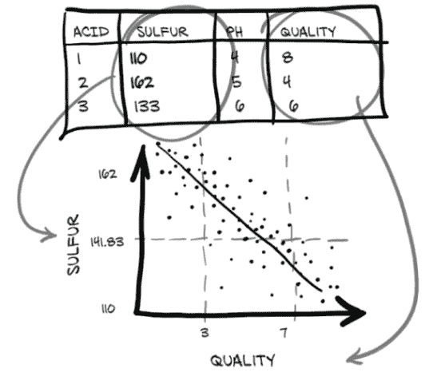
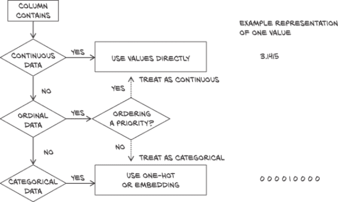
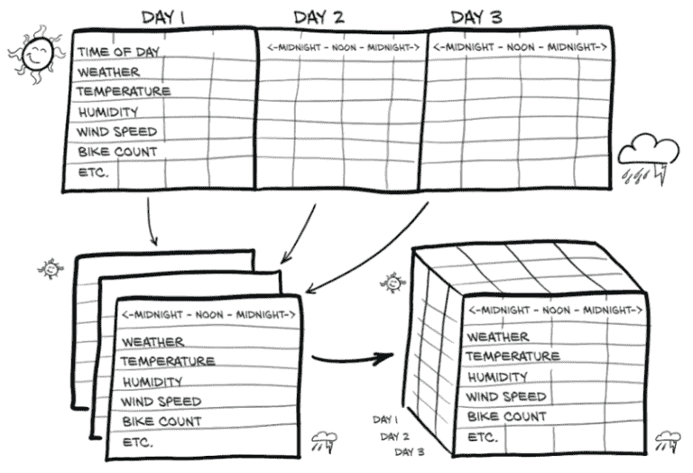
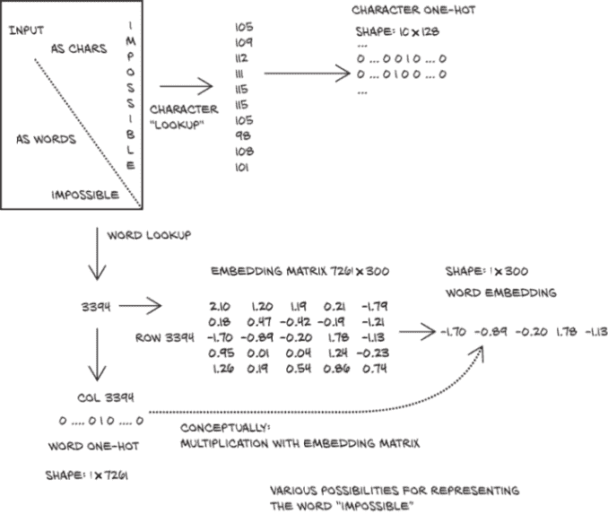
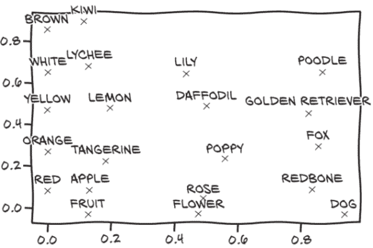

# 四、使用张量表示真实世界数据

本章内容包括

+   将现实世界的数据表示为 PyTorch 张量

+   处理各种数据类型

+   从文件加载数据

+   将数据转换为张量

+   塑造张量，使其可以作为神经网络模型的输入

在上一章中，我们了解到张量是 PyTorch 中数据的构建块。神经网络将张量作为输入，并产生张量作为输出。事实上，神经网络内部的所有操作以及优化过程中的所有操作都是张量之间的操作，神经网络中的所有参数（例如权重和偏置）都是张量。对于成功使用 PyTorch 这样的工具，对张量执行操作并有效地对其进行索引的能力至关重要。现在您已经了解了张量的基础知识，随着您在本书中的学习过程中，您对张量的灵活性将会增长。

现在我们可以回答一个问题：我们如何将一段数据、一个视频或一行文本表示为张量，以便适合训练深度学习模型？这就是我们将在本章学习的内容。我们将重点介绍与本书相关的数据类型，并展示如何将这些数据表示为张量。然后，我们将学习如何从最常见的磁盘格式加载数据，并了解这些数据类型的结构，以便了解如何准备它们用于训练神经网络。通常，我们的原始数据不会完全符合我们想要解决的问题，因此我们将有机会通过一些更有趣的张量操作来练习我们的张量操作技能。

本章的每个部分将描述一种数据类型，并且每种数据类型都将配有自己的数据集。虽然我们已经将本章结构化，使得每种数据类型都建立在前一种数据类型的基础上，但如果你愿意，可以随意跳跃一下。

在本书的其余部分中，我们将使用大量图像和体积数据，因为这些是常见的数据类型，并且在书籍格式中可以很好地再现。我们还将涵盖表格数据、时间序列和文本，因为这些也将引起许多读者的兴趣。因为一图胜千言，我们将从图像数据开始。然后，我们将演示使用代表患者解剖结构的医学数据的三维数组。接下来，我们将处理关于葡萄酒的表格数据，就像我们在电子表格中找到的那样。之后，我们将转向*有序*表格数据，使用来自自行车共享计划的时间序列数据集。最后，我们将涉足简·奥斯汀的文本数据。文本数据保留了其有序性，但引入了将单词表示为数字数组的问题。

在每个部分中，我们将在深度学习研究人员开始的地方停下来：就在将数据馈送给模型之前。我们鼓励您保留这些数据集；它们将成为我们在下一章开始学习如何训练神经网络模型时的优秀材料。

## 4.1 处理图像

卷积神经网络的引入彻底改变了计算机视觉（参见 [`mng.bz/zjMa`](http://mng.bz/zjMa)），基于图像的系统随后获得了全新的能力。以前需要高度调整的算法构建块的复杂流水线现在可以通过使用成对的输入和期望输出示例训练端到端网络以前所未有的性能水平解决。为了参与这场革命，我们需要能够从常见的图像格式中加载图像，然后将数据转换为 PyTorch 期望的方式排列图像各部分的张量表示。

图像被表示为一个规则网格中排列的标量集合，具有高度和宽度（以像素为单位）。 我们可能在每个网格点（像素）上有一个单一的标量，这将被表示为灰度图像；或者在每个网格点上有多个标量，这通常代表不同的颜色，就像我们在上一章中看到的那样，或者不同的 *特征*，比如来自深度相机的深度。

表示单个像素值的标量通常使用 8 位整数进行编码，如消费级相机。 在医疗、科学和工业应用中，发现更高的数值精度，如 12 位或 16 位，是很常见的。 这允许在像骨密度、温度或深度等物理属性的像素编码信息的情况下拥有更广泛的范围或增加灵敏度。

### 4.1.1 添加颜色通道

我们之前提到过颜色。 有几种将颜色编码为数字的方法。 最常见的是 RGB，其中颜色由表示红色、绿色和蓝色强度的三个数字定义。 我们可以将颜色通道看作是仅包含所讨论颜色的灰度强度图，类似于如果您戴上一副纯红色太阳镜看到的场景。 图 4.1 展示了一个彩虹，其中每个 RGB 通道捕获光谱的某个部分（该图简化了，省略了将橙色和黄色带表示为红色和绿色组合的内容）。



图 4.1 彩虹，分为红色、绿色和蓝色通道

彩虹的红色带在图像的红色通道中最亮，而蓝色通道既有彩虹的蓝色带又有天空作为高强度。 还要注意，白云在所有三个通道中都是高强度的。

### 4.1.2 加载图像文件

图像有多种不同的文件格式，但幸运的是在 Python 中有很多加载图像的方法。 让我们从使用 `imageio` 模块加载 PNG 图像开始（code/p1ch4/1_image_dog.ipynb）。

列表 4.1 code/p1ch4/1_image_dog.ipynb

```py
# In[2]:
import imageio

img_arr = imageio.imread('../data/p1ch4/image-dog/bobby.jpg')
img_arr.shape

# Out[2]:
(720, 1280, 3)
```

*注意* 我们将在整个章节中使用 `imageio`，因为它使用统一的 API 处理不同的数据类型。 对于许多目的，使用 TorchVision 处理图像和视频数据是一个很好的默认选择。 我们在这里选择 `imageio` 进行稍微轻松的探索。

此时，`img` 是一个类似于 NumPy 数组的对象，具有三个维度：两个空间维度，宽度和高度；以及第三个维度对应于红色、绿色和蓝色通道。 任何输出 NumPy 数组的库都足以获得 PyTorch 张量。 唯一需要注意的是维度的布局。 处理图像数据的 PyTorch 模块要求张量按照 *C* × *H* × *W* 的方式布局：通道、高度和宽度。

### 4.1.3 更改布局

我们可以使用张量的 `permute` 方法，使用旧维度替换每个新维度，以获得适当的布局。 给定一个先前获得的输入张量 *H* × *W* × *C*，通过首先将通道 2 放在前面，然后是通道 0 和 1，我们得到一个正确的布局：

```py
# In[3]:
img = torch.from_numpy(img_arr)
out = img.permute(2, 0, 1)
```

我们之前看到过这个，但请注意，此操作不会复制张量数据。 相反，`out` 使用与 `img` 相同的底层存储，并且仅在张量级别上处理大小和步幅信息。 这很方便，因为该操作非常便宜； 但是需要注意的是：更改 `img` 中的像素将导致 `out` 中的更改。

还要注意，其他深度学习框架使用不同的布局。 例如，最初 TensorFlow 将通道维度保留在最后，导致 *H* × *W* × *C* 的布局（现在支持多种布局）。 从低级性能的角度来看，这种策略有利有弊，但就我们的问题而言，只要我们正确地重塑张量，就不会有任何区别。

到目前为止，我们描述了单个图像。按照我们之前用于其他数据类型的相同策略，为了创建一个包含多个图像的数据集，以用作神经网络的输入，我们将图像存储在一个批次中，沿着第一个维度获得一个*N* × *C* × *H* × *W*张量。

作为使用`stack`构建张量的略微更高效的替代方法，我们可以预先分配一个适当大小的张量，并用从目录加载的图像填充它，如下所示：

```py
# In[4]:
batch_size = 3
batch = torch.zeros(batch_size, 3, 256, 256, dtype=torch.uint8)
```

这表明我们的批次将由三个 RGB 图像组成，高度为 256 像素，宽度为 256 像素。注意张量的类型：我们期望每种颜色都表示为 8 位整数，就像大多数标准消费级相机的照片格式一样。现在我们可以从输入目录加载所有 PNG 图像并将它们存储在张量中：

```py
# In[5]:
import os

data_dir = '../data/p1ch4/image-cats/'
filenames = [name for name in os.listdir(data_dir)
             if os.path.splitext(name)[-1] == '.png']
for i, filename in enumerate(filenames):
    img_arr = imageio.imread(os.path.join(data_dir, filename))
    img_t = torch.from_numpy(img_arr)
    img_t = img_t.permute(2, 0, 1)
    img_t = img_t[:3]                   # ❶
    batch[i] = img_t
```

❶ 这里我们仅保留前三个通道。有时图像还具有表示透明度的 alpha 通道，但我们的网络只需要 RGB 输入。

### 4.1.4 数据归一化

我们之前提到神经网络通常使用浮点张量作为它们的输入。当输入数据的范围大致从 0 到 1，或从-1 到 1 时，神经网络表现出最佳的训练性能（这是由它们的构建块定义方式所决定的效果）。

因此，我们通常需要做的一件事是将张量转换为浮点数并对像素的值进行归一化。将其转换为浮点数很容易，但归一化则更加棘手，因为它取决于我们决定将输入的哪个范围置于 0 和 1 之间（或-1 和 1 之间）。一种可能性是仅通过 255（8 位无符号数中的最大可表示数）来除以像素的值：

```py
# In[6]:
batch = batch.float()
batch /= 255.0
```

另一种可能性是计算输入数据的均值和标准差，并对其进行缩放，使输出在每个通道上具有零均值和单位标准差：

```py
# In[7]:
n_channels = batch.shape[1]
for c in range(n_channels):
    mean = torch.mean(batch[:, c])
    std = torch.std(batch[:, c])
    batch[:, c] = (batch[:, c] - mean) / std
```

*注意* 这里，我们仅对一批图像进行归一化，因为我们还不知道如何操作整个数据集。在处理图像时，最好提前计算所有训练数据的均值和标准差，然后减去并除以这些固定的、预先计算的量。我们在第 2.1.4 节中的图像分类器的预处理中看到了这一点。

我们可以对输入执行几种其他操作，如几何变换（旋转、缩放和裁剪）。这些操作可能有助于训练，或者可能需要使任意输入符合网络的输入要求，比如图像的大小。我们将在第 12.6 节中遇到许多这些策略。现在，只需记住你有可用的图像处理选项即可。

## 4.2 3D 图像：体积数据

我们已经学会了如何加载和表示 2D 图像，就像我们用相机拍摄的那些图像一样。在某些情境下，比如涉及 CT（计算机断层扫描）扫描的医学成像应用中，我们通常处理沿着头到脚轴堆叠的图像序列，每个图像对应于人体的一个切片。在 CT 扫描中，强度代表了身体不同部位的密度--肺部、脂肪、水、肌肉和骨骼，按照密度递增的顺序--在临床工作站上显示 CT 扫描时，从暗到亮进行映射。每个点的密度是根据穿过身体后到达探测器的 X 射线量计算的，通过一些复杂的数学将原始传感器数据解卷积为完整体积。

CT（计算机断层扫描）只有一个强度通道，类似于灰度图像。这意味着通常情况下，原生数据格式中会省略通道维度；因此，类似于上一节，原始数据通常具有三个维度。通过将单个 2D 切片堆叠成 3D 张量，我们可以构建代表主体的 3D 解剖结构的体积数据。与我们在图 4.1 中看到的情况不同，图 4.2 中的额外维度代表的是物理空间中的偏移，而不是可见光谱中的特定波段。



图 4.2 从头部到下颌的 CT 扫描切片

本书的第二部分将致力于解决现实世界中的医学成像问题，因此我们不会深入讨论医学成像数据格式的细节。目前，可以说存储体积数据与图像数据的张量之间没有根本区别。我们只是在*通道*维度之后多了一个维度，*深度*，导致了一个形状为*N* × *C* × *D* × *H* × *W*的 5D 张量。

### 4.2.1 加载专用格式

让我们使用`imageio`模块中的`volread`函数加载一个样本 CT 扫描，该函数以一个目录作为参数，并将所有数字影像与通信医学（DICOM）文件²组装成一个 NumPy 3D 数组（code/p1ch4/ 2_volumetric_ct.ipynb）。

代码清单 4.2 code/p1ch4/2_volumetric_ct.ipynb

```py
# In[2]:
import imageio

dir_path = "../data/p1ch4/volumetric-dicom/2-LUNG 3.0  B70f-04083"
vol_arr = imageio.volread(dir_path, 'DICOM')
vol_arr.shape

# Out[2]:
Reading DICOM (examining files): 1/99 files (1.0%99/99 files (100.0%)
  Found 1 correct series.
Reading DICOM (loading data): 31/99  (31.392/99  (92.999/99  (100.0%)

(99, 512, 512)
```

就像在第 4.1.3 节中所述，布局与 PyTorch 期望的不同，因为没有通道信息。因此，我们将使用`unsqueeze`为`channel`维度腾出空间：

```py
# In[3]:
vol = torch.from_numpy(vol_arr).float()
vol = torch.unsqueeze(vol, 0)

vol.shape

# Out[3]:
torch.Size([1, 99, 512, 512])
```

此时，我们可以通过沿着`batch`方向堆叠多个体积来组装一个 5D 数据集，就像我们在上一节中所做的那样。在第二部分中我们将看到更多的 CT 数据。

## 4.3 表格数据的表示

在机器学习工作中我们会遇到的最简单形式的数据位于电子表格、CSV 文件或数据库中。无论媒介如何，它都是一个包含每个样本（或记录）一行的表格，其中列包含关于我们样本的一条信息。

起初，我们假设表格中样本出现的顺序没有意义：这样的表格是独立样本的集合，不像时间序列那样，其中样本由时间维度相关联。

列可能包含数值，例如特定位置的温度；或标签，例如表示样本属性的字符串，如“蓝色”。因此，表格数据通常不是同质的：不同列的类型不同。我们可能有一列显示苹果的重量，另一列用标签编码它们的颜色。

另一方面，PyTorch 张量是同质的。PyTorch 中的信息通常被编码为一个数字，通常是浮点数（尽管也支持整数类型和布尔类型）。这种数字编码是有意的，因为神经网络是数学实体，通过矩阵乘法和非线性函数的连续应用将实数作为输入并产生实数作为输出。

### 4.3.1 使用真实世界数据集

作为深度学习从业者的第一项工作是将异构的现实世界数据编码为浮点数张量，以便神经网络消费。互联网上有大量的表格数据集可供免费使用；例如，可以查看[`github.com/caesar0301/awesome-public-datasets`](https://github.com/caesar0301/awesome-public-datasets)。让我们从一些有趣的东西开始：葡萄酒！葡萄酒质量数据集是一个包含葡萄牙北部*绿葡萄酒*样本的化学特征和感官质量评分的免费表格。白葡萄酒数据集可以在这里下载：[`mng.bz/90Ol`](http://mng.bz/90Ol)。为了方便起见，我们还在 Deep Learning with PyTorch Git 存储库中的 data/p1ch4/tabular-wine 目录下创建了数据集的副本。

该文件包含一个逗号分隔的值集合，由一个包含列名的标题行引导。前 11 列包含化学变量的值，最后一列包含从 0（非常糟糕）到 10（优秀）的感官质量评分。这些是数据集中按照它们出现的顺序的列名：

```py
fixed acidity
volatile acidity
citric acid
residual sugar
chlorides
free sulfur dioxide
total sulfur dioxide
density
pH
sulphates
alcohol
quality
```

在这个数据集上的一个可能的机器学习任务是仅通过化学特征预测质量评分。不过，不用担心；机器学习不会很快消灭品酒。我们必须从某处获取训练数据！正如我们在图 4.3 中看到的，我们希望在我们的数据中的化学列和质量列之间找到一个关系。在这里，我们期望看到随着硫的减少，质量会提高。



图 4.3 我们（希望）在葡萄酒中硫和质量之间的关系

### 4.3.2 加载葡萄酒数据张量

然而，在进行这之前，我们需要以一种比在文本编辑器中打开文件更可用的方式来检查数据。让我们看看如何使用 Python 加载数据，然后将其转换为 PyTorch 张量。Python 提供了几种快速加载 CSV 文件的选项。三种流行的选项是

+   Python 自带的`csv`模块

+   NumPy

+   Pandas

第三个选项是最节省时间和内存的。然而，我们将避免在我们的学习轨迹中引入额外的库，只是因为我们需要加载一个文件。由于我们在上一节中已经介绍了 NumPy，并且 PyTorch 与 NumPy 有很好的互操作性，我们将选择这个。让我们加载我们的文件，并将生成的 NumPy 数组转换为 PyTorch 张量（code/p1ch4/3_tabular_wine.ipynb）。

代码清单 4.3 code/p1ch4/3_tabular_wine.ipynb

```py
# In[2]:
import csv
wine_path = "../data/p1ch4/tabular-wine/winequality-white.csv"
wineq_numpy = np.loadtxt(wine_path, dtype=np.float32, delimiter=";",
                         skiprows=1)
wineq_numpy

# Out[2]:
array([[ 7\.  ,  0.27,  0.36, ...,  0.45,  8.8 ,  6\.  ],
       [ 6.3 ,  0.3 ,  0.34, ...,  0.49,  9.5 ,  6\.  ],
       [ 8.1 ,  0.28,  0.4 , ...,  0.44, 10.1 ,  6\.  ],
       ...,
       [ 6.5 ,  0.24,  0.19, ...,  0.46,  9.4 ,  6\.  ],
       [ 5.5 ,  0.29,  0.3 , ...,  0.38, 12.8 ,  7\.  ],
       [ 6\.  ,  0.21,  0.38, ...,  0.32, 11.8 ,  6\.  ]], dtype=float32)
```

在这里，我们只规定 2D 数组的类型应该是 32 位浮点数，用于分隔每行值的分隔符，以及不应读取第一行，因为它包含列名。让我们检查所有数据是否都已读取

```py
# In[3]:
col_list = next(csv.reader(open(wine_path), delimiter=';'))

wineq_numpy.shape, col_list

# Out[3]:
((4898, 12),
 ['fixed acidity',
  'volatile acidity',
  'citric acid',
  'residual sugar',
  'chlorides',
  'free sulfur dioxide',
  'total sulfur dioxide',
  'density',
  'pH',
  'sulphates',
  'alcohol',
  'quality'])
```

然后将 NumPy 数组转换为 PyTorch 张量：

```py
# In[4]:
wineq = torch.from_numpy(wineq_numpy)

wineq.shape, wineq.dtype

# Out[4]:
(torch.Size([4898, 12]), torch.float32)
```

此时，我们有一个包含所有列的浮点`torch.Tensor`，包括最后一列，指的是质量评分。³

连续值、有序值和分类值

当我们试图理解数据时，我们应该意识到三种不同类型的数值。第一种是连续值。当以数字表示时，这些值是最直观的。它们是严格有序的，各个值之间的差异具有严格的含义。声明 A 包比 B 包重 2 千克，或者 B 包比 A 包远 100 英里，无论 A 包是 3 千克还是 10 千克，或者 B 包来自 200 英里还是 2,000 英里，都有固定的含义。如果你在计数或测量带单位的东西，那么它很可能是一个连续值。文献实际上进一步将连续值分为不同类型：在前面的例子中，说某物体重两倍或距离远三倍是有意义的，因此这些值被称为比例尺。另一方面，一天中的时间具有差异的概念，但声称 6:00 比 3:00 晚两倍是不合理的；因此时间只提供一个区间尺度。

接下来是有序值。我们在连续值中具有的严格排序仍然存在，但值之间的固定关系不再适用。一个很好的例子是将小、中、大饮料排序，其中小映射到值 1，中 2，大 3。大饮料比中饮料大，就像 3 比 2 大一样，但这并不告诉我们有多大差异。如果我们将我们的 1、2 和 3 转换为实际容量（比如 8、12 和 24 液体盎司），那么它们将转变为区间值。重要的是要记住，我们不能在值上“做数学运算”以外的排序它们；尝试平均大=3 和小=1 并不会得到中等饮料！

最后，分类值既没有顺序也没有数值含义。这些通常只是分配了任意数字的可能性枚举。将水分配给 1，咖啡分配给 2，苏打分配给 3，牛奶分配给 4 就是一个很好的例子。将水放在第一位，牛奶放在最后一位并没有真正的逻辑；它们只是需要不同的值来区分它们。我们可以将咖啡分配给 10，牛奶分配给-3，这样也不会有显著变化（尽管在范围 0..*N* - 1 内分配值将对独热编码和我们将在第 4.5.4 节讨论的嵌入有优势）。因为数值值没有含义，它们被称为名义尺度。

### 4.3.3 表示分数

我们可以将分数视为连续变量，保留为实数，并执行回归任务，或将其视为标签并尝试从化学分析中猜测标签以进行分类任务。在这两种方法中，我们通常会从输入数据张量中删除分数，并将其保留在单独的张量中，以便我们可以将分数用作地面实况，而不将其作为模型的输入：

```py
# In[5]:
data = wineq[:, :-1]     # ❶
data, data.shape

# Out[5]:
(tensor([[ 7.00,  0.27,  ...,  0.45,  8.80],
         [ 6.30,  0.30,  ...,  0.49,  9.50],
         ...,
         [ 5.50,  0.29,  ...,  0.38, 12.80],
         [ 6.00,  0.21,  ...,  0.32, 11.80]]), torch.Size([4898, 11]))

# In[6]:
target = wineq[:, -1]    # ❷
target, target.shape

# Out[6]:
(tensor([6., 6.,  ..., 7., 6.]), torch.Size([4898]))
```

❶ 选择所有行和除最后一列之外的所有列

❷ 选择所有行和最后一列

如果我们想要将`target`张量转换为标签张量，我们有两种选择，取决于策略或我们如何使用分类数据。一种方法是简单地将标签视为整数分数的向量：

```py
# In[7]:
target = wineq[:, -1].long()
target

# Out[7]:
tensor([6, 6,  ..., 7, 6])
```

如果目标是字符串标签，比如*葡萄酒颜色*，为每个字符串分配一个整数编号将让我们遵循相同的方法。

### 4.3.4 独热编码

另一种方法是构建分数的*独热编码*：即，将 10 个分数中的每一个编码为一个具有 10 个元素的向量，其中所有元素均设置为 0，但一个元素在每个分数的不同索引上设置为 1。 这样，分数 1 可以映射到向量`(1,0,0,0,0,0,0,0,0,0)`，分数 5 可以映射到`(0,0,0,0,1,0,0,0,0,0)`，依此类推。请注意，分数对应于非零元素的索引纯属偶然：我们可以重新排列分配，从分类的角度来看，没有任何变化。

这两种方法之间有明显的区别。将葡萄酒质量分数保留在整数分数向量中会对分数产生排序--这在这种情况下可能是完全合适的，因为 1 分比 4 分低。它还会在分数之间引入某种距离：也就是说，1 和 3 之间的距离与 2 和 4 之间的距离相同。如果这对我们的数量成立，那就太好了。另一方面，如果分数完全是离散的，比如葡萄品种，独热编码将更适合，因为没有暗示的排序或距离。当分数是连续变量时，独热编码也适用，例如在整数分数之间没有意义的情况下，比如 2.4，对于应用程序来说要么是*这个*要么是*那个*。

我们可以使用`scatter_`方法实现独热编码，该方法将源张量中的值沿提供的索引填充到张量中：

```py
# In[8]:
target_onehot = torch.zeros(target.shape[0], 10)

target_onehot.scatter_(1, target.unsqueeze(1), 1.0)

# Out[8]:
tensor([[0., 0.,  ..., 0., 0.],
        [0., 0.,  ..., 0., 0.],
        ...,
        [0., 0.,  ..., 0., 0.],
        [0., 0.,  ..., 0., 0.]])
```

让我们看看`scatter_`做了什么。首先，我们注意到它的名称以下划线结尾。正如您在上一章中学到的，这是 PyTorch 中的一种约定，表示该方法不会返回新张量，而是会直接修改张量。`scatter_`的参数如下：

+   指定以下两个参数的维度

+   指示要散布元素索引的列张量

+   包含要散布的元素或要散布的单个标量的张量（在本例中为 1）

换句话说，前面的调用读取，“对于每一行，取目标标签的索引（在我们的情况下与分数相符）并将其用作列索引设置值为 1.0。” 最终结果是一个编码分类信息的张量。

`scatter_`的第二个参数，索引张量，需要与我们要散布到的张量具有相同数量的维度。由于`target_onehot`有两个维度（4,898 × 10），我们需要使用`unsqueeze`添加一个额外的虚拟维度到`target`中：

```py
# In[9]:
target_unsqueezed = target.unsqueeze(1)
target_unsqueezed

# Out[9]:
tensor([[6],
        [6],
        ...,
        [7],
        [6]])
```

调用`unsqueeze`函数会添加一个*单例*维度，将一个包含 4,898 个元素的 1D 张量转换为一个大小为 (4,898 × 1) 的 2D 张量，而不改变其内容--不会添加额外的元素；我们只是决定使用额外的索引来访问元素。也就是说，我们可以通过`target[0]`访问`target`的第一个元素，通过`target_unsqueezed[0,0]`访问其未挤压的对应元素。

PyTorch 允许我们在训练神经网络时直接使用类索引作为目标。但是，如果我们想将分数用作网络的分类输入，我们将不得不将其转换为一个独热编码张量。

### 4.3.5 何时进行分类

现在我们已经看到了如何处理连续和分类数据。您可能想知道早期边栏中讨论的有序情况是什么情况。对于这种情况，没有通用的处理方法；最常见的做法是将这些数据视为分类数据（失去排序部分，并希望也许我们的模型在训练过程中会捕捉到它，如果我们只有少数类别）或连续数据（引入一个任意的距离概念）。我们将在图 4.5 中的天气情况中采取后者。我们在图 4.4 中的一个小流程图中总结了我们的数据映射。



图 4.4 如何处理连续、有序和分类数据的列

让我们回到包含与化学分析相关的 11 个变量的`data`张量。我们可以使用 PyTorch 张量 API 中的函数以张量形式操作我们的数据。让我们首先获取每列的均值和标准差：

```py
# In[10]:
data_mean = torch.mean(data, dim=0)
data_mean

# Out[10]:
tensor([6.85e+00, 2.78e-01, 3.34e-01, 6.39e+00, 4.58e-02, 3.53e+01,
        1.38e+02, 9.94e-01, 3.19e+00, 4.90e-01, 1.05e+01])

# In[11]:
data_var = torch.var(data, dim=0)
data_var

# Out[11]:
tensor([7.12e-01, 1.02e-02, 1.46e-02, 2.57e+01, 4.77e-04, 2.89e+02,
        1.81e+03, 8.95e-06, 2.28e-02, 1.30e-02, 1.51e+00])
```

在这种情况下，`dim=0`表示沿着维度 0 执行缩减。此时，我们可以通过减去均值并除以标准差来对数据进行归一化，这有助于学习过程（我们将在第五章的 5.4.4 节中更详细地讨论这一点）：

```py
# In[12]:
data_normalized = (data - data_mean) / torch.sqrt(data_var)
data_normalized

# Out[12]:
tensor([[ 1.72e-01, -8.18e-02,  ..., -3.49e-01, -1.39e+00],
        [-6.57e-01,  2.16e-01,  ...,  1.35e-03, -8.24e-01],
        ...,
        [-1.61e+00,  1.17e-01,  ..., -9.63e-01,  1.86e+00],
        [-1.01e+00, -6.77e-01,  ..., -1.49e+00,  1.04e+00]])
```

### 4.3.6 寻找阈值

接下来，让我们开始查看数据，看看是否有一种简单的方法可以一眼看出好酒和坏酒的区别。首先，我们将确定`target`中对应于得分小于或等于 3 的行：

```py
# In[13]:
bad_indexes = target <= 3                                # ❶
bad_indexes.shape, bad_indexes.dtype, bad_indexes.sum()

# Out[13]:
(torch.Size([4898]), torch.bool, tensor(20))
```

❶ PyTorch 还提供比较函数，例如 torch.le(target, 3)，但使用运算符似乎是一个很好的标准。

注意，`bad_indexes`中只有 20 个条目被设置为`True`！通过使用 PyTorch 中称为*高级索引*的功能，我们可以使用数据类型为`torch.bool`的张量来索引`data`张量。这将基本上将`data`过滤为仅包含索引张量中为`True`的项目（或行）的项。`bad_indexes`张量与`target`具有相同的形状，其值为`False`或`True`，取决于我们的阈值与原始`target`张量中每个元素之间的比较结果：

```py
# In[14]:
bad_data = data[bad_indexes]
bad_data.shape

# Out[14]:
torch.Size([20, 11])
```

注意，新的`bad_data`张量有 20 行，与`bad_indexes`张量中为`True`的行数相同。它保留了所有 11 列。现在我们可以开始获取关于被分为好、中等和差类别的葡萄酒的信息。让我们对每列进行`.mean()`操作：

```py
# In[15]:
bad_data = data[target <= 3]
mid_data = data[(target > 3) & (target < 7)]    # ❶
good_data = data[target >= 7]

bad_mean = torch.mean(bad_data, dim=0)
mid_mean = torch.mean(mid_data, dim=0)
good_mean = torch.mean(good_data, dim=0)

for i, args in enumerate(zip(col_list, bad_mean, mid_mean, good_mean)):
    print('{:2} {:20} {:6.2f} {:6.2f} {:6.2f}'.format(i, *args))

# Out[15]:
 0 fixed acidity          7.60   6.89   6.73
 1 volatile acidity       0.33   0.28   0.27
 2 citric acid            0.34   0.34   0.33
 3 residual sugar         6.39   6.71   5.26
 4 chlorides              0.05   0.05   0.04
 5 free sulfur dioxide   53.33  35.42  34.55
 6 total sulfur dioxide 170.60 141.83 125.25
 7 density                0.99   0.99   0.99
 8 pH                     3.19   3.18   3.22
 9 sulphates              0.47   0.49   0.50
10 alcohol               10.34  10.26  11.42
```

❶ 对于布尔 NumPy 数组和 PyTorch 张量，& 运算符执行逻辑“与”操作。

看起来我们有所发现：乍一看，坏酒似乎具有更高的总二氧化硫含量，等等其他差异。我们可以使用总二氧化硫的阈值作为区分好酒和坏酒的粗略标准。让我们获取总二氧化硫列低于我们之前计算的中点的索引，如下所示：

```py
# In[16]:
total_sulfur_threshold = 141.83
total_sulfur_data = data[:,6]
predicted_indexes = torch.lt(total_sulfur_data, total_sulfur_threshold)

predicted_indexes.shape, predicted_indexes.dtype, predicted_indexes.sum()

# Out[16]:
(torch.Size([4898]), torch.bool, tensor(2727))
```

这意味着我们的阈值意味着超过一半的葡萄酒将是高质量的。接下来，我们需要获取实际好葡萄酒的索引：

```py
# In[17]:
actual_indexes = target > 5

actual_indexes.shape, actual_indexes.dtype, actual_indexes.sum()

# Out[17]:
(torch.Size([4898]), torch.bool, tensor(3258))
```

由于实际好酒比我们的阈值预测多约 500 瓶，我们已经有了不完美的确凿证据。现在我们需要看看我们的预测与实际排名的匹配程度。我们将在我们的预测索引和实际好酒索引之间执行逻辑“与”（记住每个都只是一个由零和一组成的数组），并使用这些一致的酒来确定我们的表现如何：

```py
# In[18]:
n_matches = torch.sum(actual_indexes & predicted_indexes).item()
n_predicted = torch.sum(predicted_indexes).item()
n_actual = torch.sum(actual_indexes).item()

n_matches, n_matches / n_predicted, n_matches / n_actual

# Out[18]:
(2018, 0.74000733406674, 0.6193984039287906)
```

我们大约有 2,000 瓶酒是正确的！由于我们预测了 2,700 瓶酒，这给了我们 74%的机会，如果我们预测一瓶酒是高质量的，那它实际上就是。不幸的是，有 3,200 瓶好酒，我们只识别了其中的 61%。嗯，我们得到了我们签约的东西；这几乎比随机好不了多少！当然，这一切都很天真：我们确切地知道多个变量影响葡萄酒的质量，这些变量的值与结果之间的关系（可能是实际分数，而不是其二值化版本）可能比单个值的简单阈值更复杂。

实际上，一个简单的神经网络将克服所有这些限制，许多其他基本的机器学习方法也将克服这些限制。在接下来的两章中，一旦我们学会如何从头开始构建我们的第一个神经网络，我们将有解决这个问题的工具。我们还将在第十二章重新审视如何更好地评估我们的结果。现在让我们继续探讨其他数据类型。

## 4.4 处理时间序列

在前一节中，我们讨论了如何表示组织在平面表中的数据。正如我们所指出的，表中的每一行都是独立的；它们的顺序并不重要。或者等效地，没有列编码关于哪些行先出现和哪些行后出现的信息。

回到葡萄酒数据集，我们本可以有一个“年份”列，让我们看看葡萄酒质量是如何逐年演变的。不幸的是，我们手头没有这样的数据，但我们正在努力手动收集数据样本，一瓶一瓶地。在此期间，我们将转向另一个有趣的数据集：来自华盛顿特区自行车共享系统的数据，报告 2011-2012 年 Capital Bikeshare 系统中每小时租赁自行车的数量，以及天气和季节信息（可在此处找到：[`mng.bz/jgOx`](http://mng.bz/jgOx)）。我们的目标是将一个平面的二维数据集转换为一个三维数据集，如图 4.5 所示。



图 4.5 将一维多通道数据集转换为二维多通道数据集，通过将每个样本的日期和小时分开到不同的轴上

### 4.4.1 添加时间维度

在源数据中，每一行是一个单独的小时数据（图 4.5 显示了这个的转置版本，以更好地适应打印页面）。我们希望改变每小时一行的组织方式，这样我们就有一个轴，它以每个索引增加一天的速度增加，另一个轴代表一天中的小时（与日期无关）。第三个轴将是我们的不同数据列（天气、温度等）。

让我们加载数据（code/p1ch4/4_time_series_bikes.ipynb）。

代码清单 4.4 code/p1ch4/4_time_series_bikes.ipynb

```py
# In[2]:
bikes_numpy = np.loadtxt(
    "../data/p1ch4/bike-sharing-dataset/hour-fixed.csv",
    dtype=np.float32,
    delimiter=",",
    skiprows=1,
    converters={1: lambda x: float(x[8:10])})     # ❶
bikes = torch.from_numpy(bikes_numpy)
bikes

# Out[2]:
tensor([[1.0000e+00, 1.0000e+00,  ..., 1.3000e+01, 1.6000e+01],
        [2.0000e+00, 1.0000e+00,  ..., 3.2000e+01, 4.0000e+01],
        ...,
        [1.7378e+04, 3.1000e+01,  ..., 4.8000e+01, 6.1000e+01],
        [1.7379e+04, 3.1000e+01,  ..., 3.7000e+01, 4.9000e+01]])
```

❶ 将日期字符串转换为对应于第 1 列中的日期的数字

对于每个小时，数据集报告以下变量：

+   记录索引：`instant`

+   月份的日期：`day`

+   季节：`season`（`1`：春季，`2`：夏季，`3`：秋季，`4`：冬季）

+   年份：`yr`（`0`：2011，`1`：2012）

+   月份：`mnth`（`1`到`12`）

+   小时：`hr`（`0`到`23`）

+   节假日状态：`holiday`

+   一周的第几天：`weekday`

+   工作日状态：`workingday`

+   天气情况：`weathersit`（`1`：晴朗，`2`：薄雾，`3`：小雨/小雪，`4`：大雨/大雪）

+   摄氏度温度：`temp`

+   摄氏度感知温度：`atemp`

+   湿度：`hum`

+   风速：`windspeed`

+   休闲用户数量：`casual`

+   注册用户数量：`registered`

+   租赁自行车数量：`cnt`

在这样的时间序列数据集中，行代表连续的时间点：有一个维度沿着它们被排序。当然，我们可以将每一行视为独立的，并尝试根据一天中的特定时间来预测循环自行车的数量，而不考虑之前发生了什么。然而，存在排序给了我们利用时间上的因果关系的机会。例如，它允许我们根据较早时间下雨的事实来预测某个时间的骑车次数。目前，我们将专注于学习如何将我们的共享单车数据集转换为我们的神经网络能够以固定大小的块摄入的内容。

这个神经网络模型将需要看到每个不同数量的值的一些序列，比如骑行次数、时间、温度和天气条件：*N*个大小为*C*的并行序列。*C*代表神经网络术语中的*通道*，对于我们这里的 1D 数据来说，它与*列*是相同的。*N*维度代表时间轴，这里每小时一个条目。

### 4.4.2 按时间段塑造数据

我们可能希望将这两年的数据集分成更宽的观测周期，比如天。这样我们将有*N*（用于*样本数量*）个长度为*L*的*C*序列集合。换句话说，我们的时间序列数据集将是一个三维张量，形状为*N* × *C* × *L*。*C*仍然是我们的 17 个通道，而*L*将是 24：每天的每小时一个。虽然我们*必须*使用 24 小时的块没有特别的原因，但一般的日常节奏可能会给我们可以用于预测的模式。如果需要，我们也可以使用 7 × 24 = 168 小时块按周划分。所有这些当然取决于我们的数据集具有正确的大小--行数必须是 24 或 168 的倍数。此外，为了使这有意义，我们的时间序列不能有间断。

让我们回到我们的共享单车数据集。第一列是索引（数据的全局排序），第二列是日期，第六列是一天中的时间。我们有一切需要创建每日骑行次数和其他外生变量序列的数据集。我们的数据集已经排序，但如果没有，我们可以使用`torch.sort`对其进行适当排序。

*注意*我们使用的文件版本 hour-fixed.csv 已经经过一些处理，包括在原始数据集中包含缺失的行。我们假设缺失的小时没有活跃的自行车（它们通常在清晨的小时内）。

要获得我们的每日小时数据集，我们只需将相同的张量按照 24 小时的批次查看。让我们看一下我们的`bikes`张量的形状和步幅：

```py
# In[3]:
bikes.shape, bikes.stride()

# Out[3]:
(torch.Size([17520, 17]), (17, 1))
```

这是 17,520 小时，17 列。现在让我们重新塑造数据，使其具有 3 个轴--天、小时，然后我们的 17 列：

```py
# In[4]:
daily_bikes = bikes.view(-1, 24, bikes.shape[1])
daily_bikes.shape, daily_bikes.stride()

# Out[4]:
(torch.Size([730, 24, 17]), (408, 17, 1))
```

这里发生了什么？首先，`bikes.shape[1]`是 17，即`bikes`张量中的列数。但这段代码的关键在于对`view`的调用，这非常重要：它改变了张量查看相同数据的方式，而数据实际上是包含在存储中的。

正如您在上一章中学到的，对张量调用`view`会返回一个新的张量，它会改变维度和步幅信息，但不会改变存储。这意味着我们可以在基本上零成本地重新排列我们的张量，因为不会复制任何数据。我们调用`view`需要为返回的张量提供新的形状。我们使用`-1`作为“剩下的索引数量，考虑到其他维度和原始元素数量”的占位符。

还要记住上一章中提到的存储是一个连续的、线性的数字容器（在本例中是浮点数）。我们的`bikes`张量将每一行按顺序存储在其相应的存储中。这是通过之前对`bikes.stride()`的调用输出来确认的。

对于`daily_bikes`，步幅告诉我们，沿着小时维度（第二维）前进 1 需要我们在存储中前进 17 个位置（或者一组列）；而沿着天维度（第一维）前进需要我们前进的元素数量等于存储中一行的长度乘以 24（这里是 408，即 17×24）。

我们看到最右边的维度是原始数据集中的列数。然后，在中间维度，我们有时间，分成 24 个连续小时的块。换句话说，我们现在有一天中*L*小时的*N*序列，对应*C*个通道。为了得到我们期望的*N*×*C*×*L*顺序，我们需要转置张量：

```py
# In[5]:
daily_bikes = daily_bikes.transpose(1, 2)
daily_bikes.shape, daily_bikes.stride()

# Out[5]:
(torch.Size([730, 17, 24]), (408, 1, 17))
```

现在让我们将之前学到的一些技巧应用到这个数据集上。

### 4.4.3 准备训练

“天气情况”变量是有序的。它有四个级别：`1`表示好天气，`4`表示，嗯，非常糟糕。我们可以将这个变量视为分类变量，其中级别被解释为标签，或者作为连续变量。如果我们决定采用分类方式，我们将把变量转换为一个独热编码向量，并将列与数据集连接起来。⁴

为了更容易呈现我们的数据，我们暂时限制在第一天。我们初始化一个以一天中小时数为行数，天气级别数为列数的零填充矩阵：

```py
# In[6]:
first_day = bikes[:24].long()
weather_onehot = torch.zeros(first_day.shape[0], 4)
first_day[:,9]

# Out[6]:
tensor([1, 1, 1, 1, 1, 2, 1, 1, 1, 1, 1, 1, 1, 2, 2, 2, 2, 2, 3, 3, 2, 2,
        2, 2])
```

然后我们根据每行对应级别向我们的矩阵中散布 1。记住在前几节中使用`unsqueeze`添加一个单例维度：

```py
# In[7]:
weather_onehot.scatter_(
    dim=1,
    index=first_day[:,9].unsqueeze(1).long() - 1,    # ❶
    value=1.0)

# Out[7]:
tensor([[1., 0., 0., 0.],
        [1., 0., 0., 0.],
        ...,
        [0., 1., 0., 0.],
        [0., 1., 0., 0.]])
```

❶ 将值减 1 是因为天气情况范围从 1 到 4，而索引是从 0 开始的

我们的一天从天气“1”开始，以“2”结束，所以这看起来是正确的。

最后，我们使用`cat`函数将我们的矩阵与原始数据集连接起来。让我们看看我们的第一个结果：

```py
# In[8]:
torch.cat((bikes[:24], weather_onehot), 1)[:1]

# Out[8]:
tensor([[ 1.0000,  1.0000,  1.0000,  0.0000,  1.0000,  0.0000,  0.0000,
          6.0000,  0.0000,  1.0000,  0.2400,  0.2879,  0.8100,  0.0000,
          3.0000, 13.0000, 16.0000,  1.0000,  0.0000,  0.0000,  0.0000]])
```

在这里，我们规定我们的原始`bikes`数据集和我们的独热编码的“天气情况”矩阵沿着*列*维度（即 1）进行连接。换句话说，两个数据集的列被堆叠在一起；或者等效地，新的独热编码列被附加到原始数据集。为了使`cat`成功，需要确保张量在其他维度（在这种情况下是*行*维度）上具有相同的大小。请注意，我们新的最后四列是`1, 0, 0, 0`，正如我们期望的天气值为 1 时一样。我们也可以对重塑后的`daily_bikes`张量执行相同操作。记住它的形状是(*B*, *C*, *L*)，其中*L* = 24。我们首先创建一个零张量，具有相同的*B*和*L*，但具有*C*个额外列：

```py
# In[9]:
daily_weather_onehot = torch.zeros(daily_bikes.shape[0], 4,
                                   daily_bikes.shape[2])
daily_weather_onehot.shape

# Out[9]:
torch.Size([730, 4, 24])
```

然后我们将独热编码散布到张量的*C*维度中。由于这个操作是原地执行的，因此只有张量的内容会改变：

```py
# In[10]:
daily_weather_onehot.scatter_(
    1, daily_bikes[:,9,:].long().unsqueeze(1) - 1, 1.0)
daily_weather_onehot.shape

# Out[10]:
torch.Size([730, 4, 24])
```

并且我们沿着*C*维度进行连接：

```py
# In[11]:
daily_bikes = torch.cat((daily_bikes, daily_weather_onehot), dim=1)
```

我们之前提到这不是处理“天气情况”变量的唯一方式。实际上，它的标签具有有序关系，因此我们可以假设它们是连续变量的特殊值。我们可以将变量转换为从 0.0 到 1.0 的范围：

```py
# In[12]:
daily_bikes[:, 9, :] = (daily_bikes[:, 9, :] - 1.0) / 3.0
```

正如我们在前一节中提到的，将变量重新缩放到[0.0, 1.0]区间或[-1.0, 1.0]区间是我们希望对所有定量变量进行的操作，比如`temperature`（我们数据集中的第 10 列）。稍后我们会看到为什么要这样做；现在，我们只需说这对训练过程有益。

对变量重新缩放有多种可能性。我们可以将它们的范围映射到[0.0, 1.0]

```py
# In[13]:
temp = daily_bikes[:, 10, :]
temp_min = torch.min(temp)
temp_max = torch.max(temp)
daily_bikes[:, 10, :] = ((daily_bikes[:, 10, :] - temp_min)
                         / (temp_max - temp_min))
```

或者减去均值并除以标准差：

```py
# In[14]:
temp = daily_bikes[:, 10, :]
daily_bikes[:, 10, :] = ((daily_bikes[:, 10, :] - torch.mean(temp))
                         / torch.std(temp))
```

在后一种情况下，我们的变量将具有 0 均值和单位标准差。如果我们的变量是从高斯分布中抽取的，那么 68%的样本将位于[-1.0, 1.0]区间内。

太棒了：我们建立了另一个不错的数据集，并且看到了如何处理时间序列数据。对于这次的概览，重要的是我们对时间序列的布局有了一个概念，以及我们如何将数据整理成网络可以处理的形式。

其他类型的数据看起来像时间序列，因为有严格的顺序。排在前两位的是什么？文本和音频。接下来我们将看一下文本，而“结论”部分有关于音频的附加示例的链接。

## 4.5 表示文本

深度学习已经席卷了自然语言处理（NLP）领域，特别是使用重复消耗新输入和先前模型输出组合的模型。这些模型被称为*循环神经网络*（RNNs），它们已经成功应用于文本分类、文本生成和自动翻译系统。最近，一类名为*transformers*的网络以更灵活的方式整合过去信息引起了轰动。以前的 NLP 工作负载以包含编码语言语法规则的规则的复杂多阶段管道为特征。现在，最先进的工作是从头开始在大型语料库上端对端训练网络，让这些规则从数据中出现。在过去几年里，互联网上最常用的自动翻译系统基于深度学习。

我们在这一部分的目标是将文本转换为神经网络可以处理的东西：一个数字张量，就像我们之前的情况一样。如果我们能够做到这一点，并且稍后选择适合我们文本处理工作的正确架构，我们就可以使用 PyTorch 进行自然语言处理。我们立即看到这一切是多么强大：我们可以使用相同的 PyTorch 工具在不同领域的许多任务上实现最先进的性能；我们只需要将问题表述得当。这项工作的第一部分是重新塑造数据。

### 4.5.1 将文本转换为数字

网络在文本上操作有两个特别直观的层次：在字符级别上，逐个处理字符，以及在单词级别上，其中单词是网络所看到的最细粒度的实体。我们将文本信息编码为张量形式的技术，无论我们是在字符级别还是单词级别操作，都是相同的。而且这并不是魔法。我们之前就偶然发现了它：独热编码。

让我们从字符级别的示例开始。首先，让我们获取一些要处理的文本。这里一个了不起的资源是古腾堡计划（[www.gutenberg.org](http://www.gutenberg.org/)）。这是一个志愿者努力，将文化作品数字化并以开放格式免费提供，包括纯文本文件。如果我们的目标是更大规模的语料库，维基百科语料库是一个突出的选择：它是维基百科文章的完整集合，包含 19 亿字和 440 多万篇文章。在英语语料库网站（[www.english-corpora.org](https://www.english-corpora.org/)）可以找到其他语料库。

让我们从古腾堡计划网站加载简·奥斯汀的《傲慢与偏见》：[www.gutenberg.org/files/1342/1342-0.txt](http://www.gutenberg.org/files/1342/1342-0.txt)。我们只需保存文件并读取它（code/p1ch4/5_text_jane_austen.ipynb）。

代码清单 4.5 code/p1ch4/5_text_jane_austen.ipynb

```py
# In[2]:
with open('../data/p1ch4/jane-austen/1342-0.txt', encoding='utf8') as f:
    text = f.read()
```

### 4.5.2 独热编码字符

在我们继续之前，还有一个细节需要注意：编码。这是一个非常广泛的主题，我们只会简单提及。每个书面字符都由一个代码表示：一个适当长度的比特序列，以便每个字符都可以被唯一识别。最简单的编码是 ASCII（美国信息交换标准代码），可以追溯到 1960 年代。ASCII 使用 128 个整数对 128 个字符进行编码。例如，字母*a*对应于二进制 1100001 或十进制 97，字母*b*对应于二进制 1100010 或十进制 98，依此类推。这种编码适合 8 位，这在 1965 年是一个很大的优势。

*注意* 128 个字符显然不足以涵盖所有需要正确表示非英语语言中的书写文本所需的字形、重音、连字等。为此，已经开发了许多使用更多比特作为代码以涵盖更广字符范围的编码。这更广范围的字符被标准化为 Unicode，将所有已知字符映射到数字，这些数字的位表示由特定编码提供。流行的编码包括 UTF-8、UTF-16 和 UTF-32，其中数字分别是 8 位、16 位或 32 位整数序列。Python 3.x 中的字符串是 Unicode 字符串。

我们将对字符进行独热编码。将独热编码限制在对所分析文本有用的字符集上是非常重要的。在我们的情况下，由于我们加载的是英文文本，使用 ASCII 并处理一个小编码是安全的。我们还可以将所有字符转换为小写，以减少编码中不同字符的数量。同样，我们可以筛选掉标点、数字或其他与我们期望的文本类型无关的字符。这可能对神经网络有实际影响，具体取决于手头的任务。

此时，我们需要遍历文本中的字符，并为每个字符提供一个独热编码。每个字符将由一个长度等于编码中不同字符数的向量表示。这个向量将包含除了在编码中字符位置对应的索引处的一个之外的所有零。

我们首先将文本拆分为一系列行，并选择一个任意的行进行关注：

```py
# In[3]:
lines = text.split('\n')
line = lines[200]
line

# Out[3]:
'“Impossible, Mr. Bennet, impossible, when I am not acquainted with him'
```

让我们创建一个能够容纳整行所有独热编码字符总数的张量：

```py
# In[4]:
letter_t = torch.zeros(len(line), 128)    # ❶
letter_t.shape

# Out[4]:
torch.Size([70, 128])
```

❶ 由于 ASCII 的限制，128 个硬编码

请注意，`letter_t`每行保存一个独热编码字符。现在我们只需在正确位置的每行设置一个 1，以便每行表示正确的字符。其中 1 应设置的索引对应于编码中字符的索引：

```py
# In[5]:
for i, letter in enumerate(line.lower().strip()):
    letter_index = ord(letter) if ord(letter) < 128 else 0     # ❶
    letter_t[i][letter_index] = 1
```

❶ 文本使用方向性双引号，这不是有效的 ASCII，因此我们在这里将其筛选掉。

### 4.5.3 对整个单词进行独热编码

我们已经将我们的句子进行了独热编码，以便神经网络可以理解。单词级别的编码可以通过建立词汇表并对句子--单词序列--进行独热编码来完成。由于词汇表有很多单词，这将产生非常宽的编码向量，这可能不太实用。我们将在下一节看到，在单词级别表示文本有一种更有效的方法，即使用*嵌入*。现在，让我们继续使用独热编码，看看会发生什么。

我们将定义`clean_words`，它接受文本并以小写形式返回，并去除标点。当我们在我们的“不可能，本内特先生”`line`上调用它时，我们得到以下结果：

```py
# In[6]:
def clean_words(input_str):
    punctuation = '.,;:"!?”“_-'
    word_list = input_str.lower().replace('\n',' ').split()
    word_list = [word.strip(punctuation) for word in word_list]
    return word_list

words_in_line = clean_words(line)
line, words_in_line

# Out[6]:
('“Impossible, Mr. Bennet, impossible, when I am not acquainted with him',
 ['impossible',
  'mr',
  'bennet',
  'impossible',
  'when',
  'i',
  'am',
  'not',
  'acquainted',
  'with',
  'him'])
```

接下来，让我们构建一个单词到编码索引的映射：

```py
# In[7]:
word_list = sorted(set(clean_words(text)))
word2index_dict = {word: i for (i, word) in enumerate(word_list)}

len(word2index_dict), word2index_dict['impossible']

# Out[7]:
(7261, 3394)
```

请注意，`word2index_dict`现在是一个以单词为键、整数为值的字典。我们将使用它来高效地找到一个单词的索引，因为我们对其进行独热编码。现在让我们专注于我们的句子：我们将其分解为单词，并对其进行独热编码--也就是说，我们为每个单词填充一个独热编码向量的张量。我们创建一个空向量，并为句子中的单词分配独热编码值：

```py
# In[8]:
word_t = torch.zeros(len(words_in_line), len(word2index_dict))
for i, word in enumerate(words_in_line):
    word_index = word2index_dict[word]
    word_t[i][word_index] = 1
    print('{:2} {:4} {}'.format(i, word_index, word))

print(word_t.shape)

# Out[8]:
 0 3394 impossible
 1 4305 mr
 2  813 bennet
 3 3394 impossible
 4 7078 when
 5 3315 i
 6  415 am
 7 4436 not
 8  239 acquainted
 9 7148 with
10 3215 him
torch.Size([11, 7261])
```

此时，`tensor`在大小为 7,261 的编码空间中表示了一个长度为 11 的句子，这是我们字典中的单词数。图 4.6 比较了我们拆分文本的两种选项的要点（以及我们将在下一节中看到的嵌入的使用）。

字符级别和单词级别编码之间的选择让我们需要做出权衡。在许多语言中，字符比单词要少得多：表示字符让我们只表示几个类别，而表示单词则要求我们表示非常多的类别，并且在任何实际应用中，要处理字典中不存在的单词。另一方面，单词传达的意义比单个字符要多得多，因此单词的表示本身就更具信息量。鉴于这两种选择之间的鲜明对比，或许并不奇怪中间方法已经被寻找、发现并成功应用：例如，*字节对编码*方法⁶从一个包含单个字母的字典开始，然后迭代地将最常见的对添加到字典中，直到达到规定的字典大小。我们的示例句子可能会被分割成这样的标记:⁷

```py
▁Im|pos|s|ible|,|▁Mr|.|▁B|en|net|,|▁impossible|,|▁when|▁I|▁am|▁not|▁acquainted|▁with|▁him
```



图 4.6 编码单词的三种方式

对于大多数内容，我们的映射只是按单词拆分。但是，较少见的部分--大写的*Impossible*和名字 Bennet--由子单元组成。

### 4.5.4 文本嵌入

独热编码是一种在张量中表示分类数据的非常有用的技术。然而，正如我们预料的那样，当要编码的项目数量实际上是无限的时，独热编码开始失效，就像语料库中的单词一样。在仅仅一本书中，我们就有超过 7,000 个项目！

我们当然可以做一些工作来去重单词，压缩替代拼写，将过去和未来时态合并为一个标记，等等。但是，一个通用的英语编码将会*非常庞大*。更糟糕的是，每当我们遇到一个新单词时，我们都需要向向量中添加一个新列，这意味着需要向模型添加一组新的权重来解释这个新的词汇条目--这将从训练的角度来看是痛苦的。

如何将我们的编码压缩到一个更易管理的大小，并限制大小增长？嗯，与其使用许多零和一个单一的向量，我们可以使用浮点数向量。比如，一个包含 100 个浮点数的向量确实可以表示大量的单词。关键是要找到一种有效的方法，以便将单个单词映射到这个 100 维空间，从而促进下游学习。这被称为*嵌入*。

原则上，我们可以简单地遍历我们的词汇表，并为每个单词生成一组 100 个随机浮点数。这样做是可以的，因为我们可以将一个非常庞大的词汇表压缩到只有 100 个数字，但它将放弃基于含义或上下文的单词之间距离的概念。使用这种单词嵌入的模型将不得不处理其输入向量中的非常少的结构。一个理想的解决方案是以这样一种方式生成嵌入，使得在相似上下文中使用的单词映射到嵌入的附近区域。

嗯，如果我们要手动设计一个解决这个问题的解决方案，我们可能会决定通过选择将基本名词和形容词映射到轴上来构建我们的嵌入空间。我们可以生成一个 2D 空间，其中轴映射到名词--*水果*（0.0-0.33）、*花朵*（0.33-0.66）和*狗*（0.66-1.0）--和形容词--*红色*（0.0-0.2）、*橙色*（0.2-0.4）、*黄色*（0.4-0.6）、*白色*（0.6-0.8）和*棕色*（0.8-1.0）。我们的目标是将实际的水果、花朵和狗放在嵌入中。

当我们开始嵌入词时，我们可以将*苹果*映射到*水果*和*红色*象限中的一个数字。同样，我们可以轻松地将*橘子*、*柠檬*、*荔枝*和*猕猴桃*（补充我们的五彩水果列表）进行映射。然后我们可以开始处理花朵，并将*玫瑰*、*罂粟花*、*水仙花*、*百合花*等映射...嗯。不太多棕色的花朵。好吧，*向日葵*可以被映射到*花朵*、*黄色*和*棕色*，然后*雏菊*可以被映射到*花朵*、*白色*和*黄色*。也许我们应该将*猕猴桃*更新为接近*水果*、*棕色*和*绿色*的映射。对于狗和颜色，我们可以将*红骨*映射到*红色*附近；嗯，也许*狐狸*可以代表*橙色*；*金毛寻回犬*代表*黄色*，*贵宾犬*代表*白色*，以及...大多数狗都是*棕色*。

现在我们的嵌入看起来像图 4.7。虽然对于大型语料库来说手动操作并不可行，但请注意，尽管我们的嵌入大小为 2，除了基本的 8 个词之外，我们描述了 15 个不同的词，并且如果我们花时间进行创造性思考，可能还能塞进更多词。



图 4.7 我们的手动词嵌入

正如你可能已经猜到的那样，这种工作可以自动化。通过处理大量的有机文本语料库，类似我们刚刚讨论的嵌入可以生成。主要区别在于嵌入向量中有 100 到 1,000 个元素，并且轴不直接映射到概念：相似概念的词在嵌入空间的相邻区域中映射，其轴是任意的浮点维度。

虽然具体的算法⁹有点超出了我们想要关注的范围，但我们想提一下，嵌入通常是使用神经网络生成的，试图从句子中附近的词（上下文）中预测一个词。在这种情况下，我们可以从单热编码的词开始，并使用一个（通常相当浅的）神经网络生成嵌入。一旦嵌入可用，我们就可以将其用于下游任务。

结果嵌入的一个有趣方面是相似的词不仅聚集在一起，而且与其他词有一致的空间关系。例如，如果我们取*苹果*的嵌入向量，并开始加减其他词的向量，我们可以开始执行类似*苹果*-*红色*-*甜*+*黄色*+*酸*的类比，最终得到一个与*柠檬*的向量非常相似的向量。

更现代的嵌入模型--BERT 和 GPT-2 甚至在主流媒体中都引起轰动--更加复杂且具有上下文敏感性：也就是说，词汇表中的一个词到向量的映射不是固定的，而是取决于周围的句子。然而，它们通常像我们在这里提到的更简单的*经典*嵌入一样使用。

### 4.5.5 文本嵌入作为蓝图

嵌入是一种必不可少的工具，当词汇表中有大量条目需要用数字向量表示时。但在本书中我们不会使用文本和文本嵌入，所以您可能会想知道为什么我们在这里介绍它们。我们认为文本如何表示和处理也可以看作是处理分类数据的一个示例。嵌入在独热编码变得繁琐的地方非常有用。事实上，在先前描述的形式中，它们是一种表示独热编码并立即乘以包含嵌入向量的矩阵的有效方式。

在非文本应用中，我们通常没有能力事先构建嵌入，但我们将从之前避开的随机数开始，并考虑将其改进作为我们学习问题的一部分。这是一种标准技术--以至于嵌入是任何分类数据的独热编码的一个突出替代方案。另一方面，即使我们处理文本，改进预先学习的嵌入在解决手头问题时已经成为一种常见做法。¹⁰

当我们对观察结果的共现感兴趣时，我们之前看到的词嵌入也可以作为一个蓝图。例如，推荐系统--喜欢我们的书的客户也购买了...--使用客户已经互动过的项目作为预测其他可能引起兴趣的上下文。同样，处理文本可能是最常见、最深入研究序列的任务；因此，例如，在处理时间序列任务时，我们可能会从自然语言处理中所做的工作中寻找灵感。

## 4.6 结论

在本章中，我们涵盖了很多内容。我们学会了加载最常见的数据类型并将其塑造为神经网络可以消费的形式。当然，现实中的数据格式比我们在一本书中描述的要多得多。有些，如医疗史，太复杂了，无法在此处涵盖。其他一些，如音频和视频，被认为对本书的路径不那么关键。然而，如果您感兴趣，我们在书的网站（[www.manning.com/books/deep-learning-with-pytorch](https://www.manning.com/books/deep-learning-with-pytorch)）和我们的代码库（[`github.com/deep-learning-with-pytorch/dlwpt-code/ tree/master/p1ch4`](https://github.com/deep-learning-with-pytorch/dlwpt-code/tree/master/p1ch4)）提供了音频和视频张量创建的简短示例。

现在我们熟悉了张量以及如何在其中存储数据，我们可以继续迈向本书目标的下一步：教会你训练深度神经网络！下一章将涵盖简单线性模型的学习机制。

## 4.7 练习

1.  使用手机或其他数码相机拍摄几张红色、蓝色和绿色物品的照片（如果没有相机，则可以从互联网上下载一些）。

    1.  加载每个图像，并将其转换为张量。

    1.  对于每个图像张量，使用`.mean()`方法来了解图像的亮度。

    1.  获取图像每个通道的平均值。您能仅通过通道平均值识别红色、绿色和蓝色物品吗？

1.  选择一个包含 Python 源代码的相对较大的文件。

    1.  构建源文件中所有单词的索引（随意将您的标记化设计得简单或复杂；我们建议从用空格替换`r"[^a-zA-Z0-9_]+"`开始）。

    1.  将您的索引与我们为*傲慢与偏见*制作的索引进行比较。哪个更大？

    1.  为源代码文件创建独热编码。

    1.  使用这种编码会丢失哪些信息？这些信息丢失与*傲慢与偏见*编码中丢失的信息相比如何？

## 4.8 总结

+   神经网络要求数据表示为多维数值张量，通常是 32 位浮点数。

+   一般来说，PyTorch 期望数据根据模型架构沿特定维度布局--例如，卷积与循环。我们可以使用 PyTorch 张量 API 有效地重塑数据。

+   由于 PyTorch 库与 Python 标准库及周围生态系统的互动方式，加载最常见类型的数据并将其转换为 PyTorch 张量非常方便。

+   图像可以有一个或多个通道。最常见的是典型数字照片的红绿蓝通道。

+   许多图像的每个通道的位深度为 8，尽管每个通道的 12 和 16 位并不罕见。这些位深度都可以存储在 32 位浮点数中而不会丢失精度。

+   单通道数据格式有时会省略显式通道维度。

+   体积数据类似于 2D 图像数据，唯一的区别是添加了第三个维度（深度）。

+   将电子表格转换为张量可能非常简单。分类和有序值列应与间隔值列处理方式不同。

+   文本或分类数据可以通过使用字典编码为一热表示。很多时候，嵌入提供了良好且高效的表示。

* * *

这有点轻描淡写：[`en.wikipedia.org/wiki/Color_model`](https://en.wikipedia.org/wiki/Color_model)。

来自癌症影像存档的 CPTAC-LSCC 集合：[`mng.bz/K21K`](http://mng.bz/K21K)。

作为更深入讨论的起点，请参考 [`en.wikipedia.org/wiki/Level_of_measurement`](https://en.wikipedia.org/wiki/Level_of_measurement)。

这也可能是一个超越主要路径的情况。可以尝试将一热编码推广到将我们这里的四个类别中的第*i*个映射到一个向量，该向量在位置 0...*i* 有一个，其他位置为零。或者--类似于我们在第 4.5.4 节讨论的嵌入--我们可以取嵌入的部分和，这种情况下可能有意义将其设为正值。与我们在实际工作中遇到的许多事物一样，这可能是一个*尝试他人有效方法*然后以系统化方式进行实验的好地方。

Nadkarni 等人，“自然语言处理：简介”，JAMIA，[`mng.bz/8pJP`](http://mng.bz/8pJP)。另请参阅 [`en.wikipedia.org/wiki/Natural-language_processing`](https://en.wikipedia.org/wiki/Natural-language_processing)。

最常由 subword-nmt 和 SentencePiece 库实现。概念上的缺点是字符序列的表示不再是唯一的。

这是从一个在机器翻译数据集上训练的 SentencePiece 分词器。

实际上，通过我们对颜色的一维观点，这是不可能的，因为*向日葵*的*黄色*和*棕色*会平均为*白色*--但你明白我的意思，而且在更高维度下效果更好。

一个例子是 word2vec: [`code.google.com/archive/p/word2vec`](https://code.google.com/archive/p/word2vec)。

这被称为*微调*。
