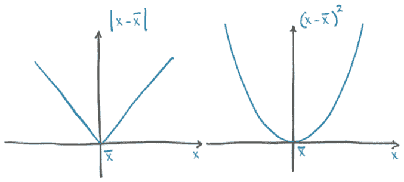

# 五、学习的机制

本章涵盖了

+   理解算法如何从数据中学习

+   将学习重新定义为参数估计，使用微分和梯度下降

+   走进一个简单的学习算法

+   PyTorch 如何通过自动求导支持学习

随着过去十年中机器学习的蓬勃发展，从经验中学习的机器的概念已经成为技术和新闻界的主题。那么，机器是如何学习的呢？这个过程的机制是什么--或者说，背后的*算法*是什么？从观察者的角度来看，一个学习算法被提供了与期望输出配对的输入数据。一旦学习发生，当它被喂入与其训练时的输入数据*足够相似*的新数据时，该算法将能够产生正确的输出。通过深度学习，即使输入数据和期望输出相距*很远*，这个过程也能够工作：当它们来自不同的领域时，比如一幅图像和描述它的句子，正如我们在第二章中看到的那样。

## 5.1 建模中的永恒教训

允许我们解释输入/输出关系的建模模型至少可以追溯到几个世纪前。当德国数学天文学家约翰内斯·开普勒（1571-1630）在 17 世纪初发现他的三大行星运动定律时，他是基于他的导师第谷·布拉赫在裸眼观测（是的，用肉眼看到并写在一张纸上）中收集的数据。没有牛顿的万有引力定律（实际上，牛顿使用了开普勒的工作来解决问题），开普勒推断出了可能适合数据的最简单几何模型。顺便说一句，他花了六年时间盯着他看不懂的数据，连续的领悟，最终制定了这些定律。¹ 我们可以在图 5.1 中看到这个过程。


图 5.1 约翰内斯·开普勒考虑了多个可能符合手头数据的模型，最终选择了一个椭圆。

开普勒的第一定律是：“每颗行星的轨道都是一个椭圆，太阳位于两个*焦点*之一。”他不知道是什么导致轨道是椭圆的，但是在给定一个行星（或大行星的卫星，比如木星）的一组观测数据后，他可以估计椭圆的形状（*离心率*）和大小（*半通径矢量*）。通过从数据中计算出这两个参数，他可以预测行星在天空中的运行轨迹。一旦他弄清楚了第二定律--“连接行星和太阳的一条线在相等的时间间隔内扫过相等的面积”--他也可以根据时间观测推断出行星何时会在空间中的特定位置。²

那么，开普勒如何在没有计算机、口袋计算器甚至微积分的情况下估计椭圆的离心率和大小呢？我们可以从开普勒自己在他的书《新天文学》中的回忆中学到，或者从 J.V.菲尔德在他的一系列文章“证明的起源”中的描述中了解（[`mng.bz/9007`](http://mng.bz/9007)）：

本质上，开普勒不得不尝试不同的形状，使用一定数量的观测结果找到曲线，然后使用曲线找到更多位置，用于他有观测结果可用的时间，然后检查这些计算出的位置是否与观测到的位置一致。

--J.V.菲尔德

那么让我们总结一下。在六年的时间里，开普勒

1.  从他的朋友布拉赫那里得到了大量的好数据（不是没有一点挣扎）

1.  尝试尽可能将其可视化，因为他觉得有些不对劲

1.  选择可能适合数据的最简单模型（椭圆）

1.  将数据分割，以便他可以处理其中一部分，并保留一个独立的集合用于验证

1.  从一个椭圆的初步离心率和大小开始，并迭代直到模型符合观测结果

1.  在独立观测上验证了他的模型

1.  惊讶地回顾过去

为你准备了一本数据科学手册，一直延续至 1609 年。科学的历史实际上是建立在这七个步骤上的。几个世纪以来，我们已经学会了偏离这些步骤是灾难的前兆。

这正是我们将要从数据中*学习*的内容。事实上，在这本书中，几乎没有区别是说我们将*拟合*数据还是让算法从数据中*学习*。这个过程总是涉及一个具有许多未知参数的函数，其值是从数据中估计的：简而言之，一个*模型*。

我们可以认为*从数据中学习*意味着底层模型并非是为解决特定问题而设计的（就像开普勒的椭圆一样），而是能够逼近更广泛函数族的模型。一个神经网络可以非常好地预测第谷·布拉赫的轨迹，而无需开普勒的灵感来尝试将数据拟合成椭圆。然而，艾萨克·牛顿要从一个通用模型中推导出他的引力定律就要困难得多。

在这本书中，我们对不是为解决特定狭窄任务而设计的模型感兴趣，而是可以自动调整以专门为任何一个类似任务进行自我特化的模型--换句话说，根据与手头特定任务相关的数据训练的通用模型。特别是，PyTorch 旨在使创建模型变得容易，使拟合误差对参数的导数能够被解析地表达。如果最后一句话让你完全不明白，别担心；接下来，我们有一个完整的章节希望为你澄清这一点。

本章讨论如何自动化通用函数拟合。毕竟，这就是我们用深度学习做的事情--深度神经网络就是我们谈论的通用函数--而 PyTorch 使这个过程尽可能简单透明。为了确保我们理解关键概念正确，我们将从比深度神经网络简单得多的模型开始。这将使我们能够从本章的第一原则理解学习算法的机制，以便我们可以在第六章转向更复杂的模型。

## 5.2 学习只是参数估计

在本节中，我们将学习如何利用数据，选择一个模型，并估计模型的参数，以便在新数据上进行良好的预测。为此，我们将把注意力从行星运动的复杂性转移到物理学中第二难的问题：校准仪器。

图 5.2 展示了本章末尾我们将要实现的高层概述。给定输入数据和相应的期望输出（标准答案），以及权重的初始值，模型接收输入数据（前向传播），通过将生成的输出与标准答案进行比较来评估误差的度量。为了优化模型的参数--其*权重*，使用复合函数的导数链式法则（反向传播）计算单位权重变化后误差的变化（即误差关于参数的*梯度*）。然后根据导致误差减少的方向更新权重的值。该过程重复进行，直到在未见数据上评估的误差降至可接受水平以下。如果我们刚才说的听起来晦涩难懂，我们有整整一章来澄清事情。到我们完成时，所有的部分都会成为一体，这段文字将变得非常清晰。

现在，我们将处理一个带有嘈杂数据集的问题，构建一个模型，并为其实现一个学习算法。当我们开始时，我们将手工完成所有工作，但在本章结束时，我们将让 PyTorch 为我们完成所有繁重的工作。当我们完成本章时，我们将涵盖训练深度神经网络的许多基本概念，即使我们的激励示例非常简单，我们的模型实际上并不是一个神经网络（但！）。


图 5.2 我们对学习过程的心理模型

### 5.2.1 一个热门问题

我们刚从某个偏僻的地方旅行回来，带回了一个时髦的壁挂式模拟温度计。它看起来很棒，完全适合我们的客厅。它唯一的缺点是它不显示单位。不用担心，我们有一个计划：我们将建立一个读数和相应温度值的数据集，选择一个模型，迭代调整其权重直到误差的度量足够低，最终能够以我们理解的单位解释新的读数。⁴

让我们尝试按照开普勒使用的相同过程进行。在这个过程中，我们将使用一个他从未拥有过的工具：PyTorch！

### 5.2.2 收集一些数据

我们将首先记录摄氏度的温度数据和我们新温度计的测量值，并弄清楚事情。几周后，这是数据（code/p1ch5/1_parameter_estimation.ipynb）：

```py
# In[2]:
t_c = [0.5,  14.0, 15.0, 28.0, 11.0,  8.0,  3.0, -4.0,  6.0, 13.0, 21.0]
t_u = [35.7, 55.9, 58.2, 81.9, 56.3, 48.9, 33.9, 21.8, 48.4, 60.4, 68.4]
t_c = torch.tensor(t_c)
t_u = torch.tensor(t_u)
```

这里，`t_c`值是摄氏度温度，`t_u`值是我们未知的单位。我们可以预期两个测量中都会有噪音，来自设备本身和我们的近似读数。为了方便起见，我们已经将数据放入张量中；我们将在一分钟内使用它。

### 5.2.3 可视化数据

图 5.3 中我们数据的快速绘图告诉我们它很嘈杂，但我们认为这里有一个模式。


图 5.3 我们的未知数据可能遵循一个线性模型。

*注意* 剧透警告：我们知道线性模型是正确的，因为问题和数据都是虚构的，但请耐心等待。这是一个有用的激励性例子，可以帮助我们理解 PyTorch 在幕后做了什么。

### 5.2.4 选择线性模型作为第一次尝试

在没有进一步的知识的情况下，我们假设将两组测量值之间转换的最简单模型，就像开普勒可能会做的那样。这两者可能是线性相关的--也就是说，通过乘以一个因子并添加一个常数，我们可以得到摄氏度的温度（我们忽略的误差）：

```py
t_c = w * t_u + b
```

这个假设合理吗？可能；我们将看到最终模型的表现如何。我们选择将`w`和`b`命名为*权重*和*偏差*，这是线性缩放和加法常数的两个非常常见的术语--我们将一直遇到这些术语。⁶

现在，我们需要根据我们拥有的数据来估计`w`和`b`，即我们模型中的参数。我们必须这样做，以便通过将未知温度`t_u`输入模型后得到的温度接近我们实际测量的摄氏度温度。如果这听起来像是在一组测量值中拟合一条直线，那么是的，因为这正是我们正在做的。我们将使用 PyTorch 进行这个简单的例子，并意识到训练神经网络实质上涉及将模型更改为稍微更复杂的模型，其中有一些（或者是一吨）更多的参数。

让我们再次详细说明一下：我们有一个具有一些未知参数的模型，我们需要估计这些参数，以便预测输出和测量值之间的误差尽可能低。我们注意到我们仍然需要准确定义一个误差度量。这样一个度量，我们称之为*损失函数*，如果误差很大，应该很高，并且应该在完美匹配时尽可能低。因此，我们的优化过程应该旨在找到`w`和`b`，使得损失函数最小化。

## 5.3 较少的损失是我们想要的

*损失函数*（或*成本函数*）是一个计算单个数值的函数，学习过程将尝试最小化该数值。损失的计算通常涉及取一些训练样本的期望输出与模型在馈送这些样本时实际产生的输出之间的差异。在我们的情况下，这将是我们的模型输出的预测温度`t_p`与实际测量值之间的差异：`t_p - t_c`。

我们需要确保损失函数在`t_p`大于真实`t_c`和小于真实`t_c`时都是正的，因为目标是让`t_p`匹配`t_c`。我们有几种选择，最直接的是`|t_p - t_c|`和`(t_p - t_c)²`。根据我们选择的数学表达式，我们可以强调或折扣某些错误。概念上，损失函数是一种优先考虑从我们的训练样本中修复哪些错误的方法，以便我们的参数更新导致对高权重样本的输出进行调整，而不是对一些其他样本的输出进行更改，这些样本的损失较小。

这两个示例损失函数在零处有明显的最小值，并且随着预测值向任一方向偏离真值，它们都会单调增加。由于增长的陡峭度也随着远离最小值而单调增加，它们都被称为*凸函数*。由于我们的模型是线性的，所以损失作为`w`和`b`的函数也是凸的。⁷ 损失作为模型参数的凸函数的情况通常很容易处理，因为我们可以通过专门的算法非常有效地找到最小值。然而，在本章中，我们将使用功能更弱但更普遍适用的方法。我们这样做是因为对于我们最终感兴趣的深度神经网络，损失不是输入的凸函数。

对于我们的两个损失函数`|t_p - t_c|`和`(t_p - t_c)²`，如图 5.4 所示，我们注意到差的平方在最小值附近的行为更好：对于`t_p`，误差平方损失的导数在`t_p`等于`t_c`时为零。另一方面，绝对值在我们希望收敛的地方具有未定义的导数。实际上，这在实践中并不是问题，但我们暂时将坚持使用差的平方。



图 5.4 绝对差与差的平方

值得注意的是，平方差也比绝对差惩罚更严重的错误。通常，有更多略微错误的结果比有几个极端错误的结果更好，而平方差有助于按预期优先考虑这些结果。

### 5.3.1 从问题返回到 PyTorch

我们已经找到了模型和损失函数--我们已经在图 5.2 的高层图片中找到了一个很好的部分。现在我们需要启动学习过程并提供实际数据。另外，数学符号够了；让我们切换到 PyTorch--毕竟，我们来这里是为了*乐趣*。

我们已经创建了我们的数据张量，现在让我们将模型写成一个 Python 函数：

```py
# In[3]:
def model(t_u, w, b):
    return w * t_u + b
```

我们期望`t_u`，`w`和`b`分别是输入张量，权重参数和偏置参数。在我们的模型中，参数将是 PyTorch 标量（也称为零维张量），并且乘法操作将使用广播产生返回的张量。无论如何，是时候定义我们的损失了：

```py
# In[4]:
def loss_fn(t_p, t_c):
    squared_diffs = (t_p - t_c)**2
    return squared_diffs.mean()
```

请注意，我们正在构建一个差异张量，逐元素取平方，最终通过平均所有结果张量中的元素产生一个标量损失函数。这是一个*均方损失*。

现在我们可以初始化参数，调用模型，

```py
# In[5]:
w = torch.ones(())
b = torch.zeros(())

t_p = model(t_u, w, b)
t_p

# Out[5]:
tensor([35.7000, 55.9000, 58.2000, 81.9000, 56.3000, 48.9000, 33.9000,
        21.8000, 48.4000, 60.4000, 68.4000])
```

并检查损失的值：

```py
# In[6]:
loss = loss_fn(t_p, t_c)
loss

# Out[6]:
tensor(1763.8846)
```

我们在本节中实现了模型和损失。我们终于到达了示例的核心：我们如何估计`w`和`b`，使损失达到最小？我们首先手动解决问题，然后学习如何使用 PyTorch 的超能力以更通用、现成的方式解决相同的问题。

广播

我们在第三章提到了广播，并承诺在需要时更仔细地研究它。在我们的例子中，我们有两个标量（零维张量）`w`和`b`，我们将它们与长度为 b 的向量（一维张量）相乘并相加。

通常——在 PyTorch 的早期版本中也是如此——我们只能对形状相同的参数使用逐元素二元操作，如加法、减法、乘法和除法。在每个张量中的匹配位置的条目将用于计算结果张量中相应条目。

广播，在 NumPy 中很受欢迎，并被 PyTorch 采用，放宽了大多数二元操作的这一假设。它使用以下规则来匹配张量元素：

+   对于每个索引维度，从后往前计算，如果其中一个操作数在该维度上的大小为 1，则 PyTorch 将使用该维度上的单个条目与另一个张量沿着该维度的每个条目。

+   如果两个大小都大于 1，则它们必须相同，并且使用自然匹配。

+   如果两个张量中一个的索引维度比另一个多，则另一个张量的整体将用于沿着这些维度的每个条目。

这听起来很复杂（如果我们不仔细注意，可能会出错，这就是为什么我们在第 3.4 节中将张量维度命名的原因），但通常，我们可以写下张量维度来看看会发生什么，或者通过使用空间维度来展示广播的方式来想象会发生什么，就像下图所示。

当然，如果没有一些代码示例，这一切都只是理论：

```py
# In[7]:
x = torch.ones(())
y = torch.ones(3,1)
z = torch.ones(1,3)
a = torch.ones(2, 1, 1)
print(f"shapes: x: {x.shape}, y: {y.shape}")
print(f"        z: {z.shape}, a: {a.shape}")

```


```py
print("x * y:", (x * y).shape)
print("y * z:", (y * z).shape)
print("y * z * a:", (y * z * a).shape)

# Out[7]:

shapes: x: torch.Size([]), y: torch.Size([3, 1])
        z: torch.Size([1, 3]), a: torch.Size([2, 1, 1])
x * y: torch.Size([3, 1])

y * z: torch.Size([3, 3])

```

## 5.4 沿着梯度下降

我们将使用*梯度下降*算法优化参数的损失函数。在本节中，我们将从第一原理建立对梯度下降如何工作的直觉，这将在未来对我们非常有帮助。正如我们提到的，有更有效地解决我们示例问题的方法，但这些方法并不适用于大多数深度学习任务。梯度下降实际上是一个非常简单的想法，并且在具有数百万参数的大型神经网络模型中表现出色。


图 5.5 优化过程的卡通描绘，一个人带有 w 和 b 旋钮，寻找使损失减少的旋钮转动方向

让我们从一个心理形象开始，我们方便地在图 5.5 中勾画出来。假设我们站在一台带有标有`w`和`b`的两个旋钮的机器前。我们可以在屏幕上看到损失值，并被告知要将该值最小化。不知道旋钮对损失的影响，我们开始摆弄它们，并为每个旋钮决定哪个方向使损失减少。我们决定将两个旋钮都旋转到损失减少的方向。假设我们离最佳值很远：我们可能会看到损失迅速减少，然后随着接近最小值而减慢。我们注意到在某个时刻，损失再次上升，因此我们反转一个或两个旋钮的旋转方向。我们还了解到当损失变化缓慢时，调整旋钮更精细是个好主意，以避免达到损失再次上升的点。过一段时间，最终，我们收敛到一个最小值。

### 5.4.1 减小损失

梯度下降与我们刚刚描述的情景并没有太大不同。其思想是计算损失相对于每个参数的变化率，并将每个参数修改为减小损失的方向。就像我们在调节旋钮时一样，我们可以通过向`w`和`b`添加一个小数并观察在该邻域内损失的变化来估计变化率：

```py
# In[8]:
delta = 0.1

loss_rate_of_change_w = \
    (loss_fn(model(t_u, w + delta, b), t_c) -
     loss_fn(model(t_u, w - delta, b), t_c)) / (2.0 * delta)
```

这意味着在当前`w`和`b`的值的邻域内，增加`w`会导致损失发生一些变化。如果变化是负的，那么我们需要增加`w`以最小化损失，而如果变化是正的，我们需要减少`w`。增加多少？根据损失的变化率对`w`应用变化是个好主意，特别是当损失有几个参数时：我们对那些对损失产生显著变化的参数应用变化。通常，总体上缓慢地改变参数是明智的，因为在当前`w`值的邻域之外，变化率可能截然不同。因此，我们通常应该通过一个小因子来缩放变化率。这个缩放因子有许多名称；我们在机器学习中使用的是`learning_rate`：

```py
# In[9]:
learning_rate = 1e-2

w = w - learning_rate * loss_rate_of_change_w
```

我们可以用`b`做同样的事情：

```py
# In[10]:
loss_rate_of_change_b = \
    (loss_fn(model(t_u, w, b + delta), t_c) -
     loss_fn(model(t_u, w, b - delta), t_c)) / (2.0 * delta)

b = b - learning_rate * loss_rate_of_change_b
```

这代表了梯度下降的基本参数更新步骤。通过重复这些评估（并且只要我们选择足够小的学习率），我们将收敛到使给定数据上计算的损失最小的参数的最佳值。我们很快将展示完整的迭代过程，但我们刚刚计算变化率的方式相当粗糙，在继续之前需要进行升级。让我们看看为什么以及如何。

### 5.4.2 进行分析

通过重复评估模型和损失来计算变化率，以探究在`w`和`b`邻域内损失函数的行为的方法在具有许多参数的模型中不具有良好的可扩展性。此外，并不总是清楚邻域应该有多大。我们在前一节中选择了`delta`等于 0.1，但这完全取决于损失作为`w`和`b`函数的形状。如果损失相对于`delta`变化太快，我们将无法很好地了解损失减少最多的方向。

如果我们可以使邻域无限小，就像图 5.6 中那样，会发生什么？这正是当我们对参数的损失进行导数分析时发生的情况。在我们处理的具有两个或更多参数的模型中，我们计算损失相对于每个参数的各个导数，并将它们放入导数向量中：*梯度*。


图 5.6 在离散位置评估时下降方向的估计差异与分析方法

#### 计算导数

为了计算损失相对于参数的导数，我们可以应用链式法则，并计算损失相对于其输入（即模型的输出）的导数，乘以模型相对于参数的导数：

```py
d loss_fn / d w = (d loss_fn / d t_p) * (d t_p / d w)
```

回想一下我们的模型是一个线性函数，我们的损失是平方和。让我们找出导数的表达式。回想一下损失的表达式：

```py
# In[4]:
def loss_fn(t_p, t_c):
    squared_diffs = (t_p - t_c)**2
    return squared_diffs.mean()
```

记住`d x² / d x = 2 x`，我们得到

```py
# In[11]:
def dloss_fn(t_p, t_c):
    dsq_diffs = 2 * (t_p - t_c) / t_p.size(0)    # ❶
    return dsq_diffs
```

❶ 分割是来自均值的导数。

#### 将导数应用于模型

对于模型，回想一下我们的模型是

```py
# In[3]:
def model(t_u, w, b):
    return w * t_u + b
```

我们得到这些导数：

```py
# In[12]:
def dmodel_dw(t_u, w, b):
    return t_u

# In[13]:
def dmodel_db(t_u, w, b):
    return 1.0
```

#### 定义梯度函数

将所有这些放在一起，返回损失相对于`w`和`b`的梯度的函数是

```py
# In[14]:
def grad_fn(t_u, t_c, t_p, w, b):
    dloss_dtp = dloss_fn(t_p, t_c)
    dloss_dw = dloss_dtp * dmodel_dw(t_u, w, b)
    dloss_db = dloss_dtp * dmodel_db(t_u, w, b)
    return torch.stack([dloss_dw.sum(), dloss_db.sum()])     # ❶
```

❶ 求和是我们在模型中将参数应用于整个输入向量时隐式执行的广播的反向。

用数学符号表示相同的想法如图 5.7 所示。再次，我们对所有数据点进行平均（即，求和并除以一个常数），以获得每个损失的偏导数的单个标量量。


图 5.7 损失函数相对于权重的导数

### 5.4.3 迭代拟合模型

现在我们已经准备好优化我们的参数了。从参数的一个暂定值开始，我们可以迭代地对其应用更新，进行固定次数的迭代，或直到`w`和`b`停止改变。有几个停止标准；现在，我们将坚持固定次数的迭代。

#### 训练循环

既然我们在这里，让我们介绍另一个术语。我们称之为训练迭代，我们在其中为所有训练样本更新参数一个*时代*。

完整的训练循环如下（code/p1ch5/1_parameter_estimation .ipynb）：

```py
# In[15]:
def training_loop(n_epochs, learning_rate, params, t_u, t_c):
    for epoch in range(1, n_epochs + 1):
        w, b = params

        t_p = model(t_u, w, b)                             # ❶
        loss = loss_fn(t_p, t_c)
        grad = grad_fn(t_u, t_c, t_p, w, b)                # ❷

        params = params - learning_rate * grad

        print('Epoch %d, Loss %f' % (epoch, float(loss)))  # ❸

    return params
```

❶ 正向传播

❷ 反向传播

❸ 这个记录行可能非常冗长。

用于文本输出的实际记录逻辑更复杂（请参见同一笔记本中的第 15 单元：[`mng.bz/pBB8`](http://mng.bz/pBB8)），但这些差异对于理解本章的核心概念并不重要。

现在，让我们调用我们的训练循环：

```py
# In[17]:
training_loop(
    n_epochs = 100,
    learning_rate = 1e-2,
    params = torch.tensor([1.0, 0.0]),
    t_u = t_u,
    t_c = t_c)

# Out[17]:
Epoch 1, Loss 1763.884644
    Params: tensor([-44.1730,  -0.8260])
    Grad:   tensor([4517.2969,   82.6000])
Epoch 2, Loss 5802485.500000
    Params: tensor([2568.4014,   45.1637])
    Grad:   tensor([-261257.4219,   -4598.9712])
Epoch 3, Loss 19408035840.000000
    Params: tensor([-148527.7344,   -2616.3933])
    Grad:   tensor([15109614.0000,   266155.7188])
...
Epoch 10, Loss 90901154706620645225508955521810432.000000
    Params: tensor([3.2144e+17, 5.6621e+15])
    Grad:   tensor([-3.2700e+19, -5.7600e+17])
Epoch 11, Loss inf
    Params: tensor([-1.8590e+19, -3.2746e+17])
    Grad:   tensor([1.8912e+21, 3.3313e+19])

tensor([-1.8590e+19, -3.2746e+17])
```

#### 过度训练

等等，发生了什么？我们的训练过程实际上爆炸了，导致损失变为`inf`。这清楚地表明`params`正在接收太大的更新，它们的值开始来回振荡，因为每次更新都超过了，下一个更正得更多。优化过程不稳定：它*发散*而不是收敛到最小值。我们希望看到对`params`的更新越来越小，而不是越来越大，如图 5.8 所示。


图 5.8 顶部：由于步长过大，在凸函数（类似抛物线）上发散的优化。底部：通过小步骤收敛的优化。

我们如何限制`learning_rate * grad`的幅度？嗯，这看起来很容易。我们可以简单地选择一个较小的`learning_rate`，实际上，当训练不如我们希望的那样顺利时，学习率是我们通常更改的事物之一。我们通常按数量级更改学习率，因此我们可以尝试使用`1e-3`或`1e-4`，这将使更新的幅度减少数量级。让我们选择`1e-4`，看看效果如何：

```py
# In[18]:
training_loop(
    n_epochs = 100,
    learning_rate = 1e-4,
    params = torch.tensor([1.0, 0.0]),
    t_u = t_u,
    t_c = t_c)

# Out[18]:
Epoch 1, Loss 1763.884644
    Params: tensor([ 0.5483, -0.0083])
    Grad:   tensor([4517.2969,   82.6000])
Epoch 2, Loss 323.090546
    Params: tensor([ 0.3623, -0.0118])
    Grad:   tensor([1859.5493,   35.7843])
Epoch 3, Loss 78.929634
    Params: tensor([ 0.2858, -0.0135])
    Grad:   tensor([765.4667,  16.5122])
...
Epoch 10, Loss 29.105242
    Params: tensor([ 0.2324, -0.0166])
    Grad:   tensor([1.4803, 3.0544])
Epoch 11, Loss 29.104168
    Params: tensor([ 0.2323, -0.0169])
    Grad:   tensor([0.5781, 3.0384])
...
Epoch 99, Loss 29.023582
    Params: tensor([ 0.2327, -0.0435])
    Grad:   tensor([-0.0533,  3.0226])
Epoch 100, Loss 29.022669
    Params: tensor([ 0.2327, -0.0438])
    Grad:   tensor([-0.0532,  3.0226])

tensor([ 0.2327, -0.0438])
```

不错--行为现在稳定了。但还有另一个问题：参数的更新非常小，因此损失下降非常缓慢，最终停滞。我们可以通过使`learning_rate`自适应来避免这个问题：即根据更新的幅度进行更改。有一些优化方案可以做到这一点，我们将在本章末尾的第 5.5.2 节中看到其中一个。

然而，在更新项中还有另一个潜在的麻烦制造者：梯度本身。让我们回过头看看在优化期间第 1 个时期的`grad`。

### 5.4.4 标准化输入

我们可以看到，权重的第一轮梯度大约比偏置的梯度大 50 倍。这意味着权重和偏置存在于不同比例的空间中。如果是这种情况，一个足够大以便有意义地更新一个参数的学习率对于另一个参数来说会太大而不稳定；而对于另一个参数来说合适的速率将不足以有意义地改变第一个参数。这意味着除非改变问题的表述，否则我们将无法更新我们的参数。我们可以为每个参数设置单独的学习率，但对于具有许多参数的模型来说，这将是太麻烦的事情；这是我们不喜欢的照看的一种方式。

有一个更简单的方法来控制事物：改变输入，使得梯度不那么不同。我们可以确保输入的范围不会远离`-1.0`到`1.0`的范围，粗略地说。在我们的情况下，我们可以通过简单地将`t_u`乘以 0.1 来实现接近这个范围：

```py
# In[19]:
t_un = 0.1 * t_u
```

在这里，我们通过在变量名后附加一个`n`来表示`t_u`的归一化版本。此时，我们可以在我们的归一化输入上运行训练循环：

```py
# In[20]:
training_loop(
    n_epochs = 100,
    learning_rate = 1e-2,
    params = torch.tensor([1.0, 0.0]),
    t_u = t_un,                  # ❶
    t_c = t_c)

# Out[20]:
Epoch 1, Loss 80.364342
    Params: tensor([1.7761, 0.1064])
    Grad:   tensor([-77.6140, -10.6400])
Epoch 2, Loss 37.574917
    Params: tensor([2.0848, 0.1303])
    Grad:   tensor([-30.8623,  -2.3864])
Epoch 3, Loss 30.871077
    Params: tensor([2.2094, 0.1217])
    Grad:   tensor([-12.4631,   0.8587])
...
Epoch 10, Loss 29.030487
    Params: tensor([ 2.3232, -0.0710])
    Grad:   tensor([-0.5355,  2.9295])
Epoch 11, Loss 28.941875
    Params: tensor([ 2.3284, -0.1003])
    Grad:   tensor([-0.5240,  2.9264])
...
Epoch 99, Loss 22.214186
    Params: tensor([ 2.7508, -2.4910])
    Grad:   tensor([-0.4453,  2.5208])
Epoch 100, Loss 22.148710
    Params: tensor([ 2.7553, -2.5162])
    Grad:   tensor([-0.4446,  2.5165])

tensor([ 2.7553, -2.5162])
```

❶ 我们已经将`t_u`更新为我们的新的、重新缩放的`t_un`。

即使我们将学习率设置回`1e-2`，参数在迭代更新过程中不会爆炸。让我们看一下梯度：它们的数量级相似，因此对两个参数使用相同的`learning_rate`效果很好。我们可能可以比简单地乘以 10 进行更好的归一化，但由于这种方法对我们的需求已经足够好，我们暂时将坚持使用这种方法。

*注意* 这里的归一化绝对有助于训练网络，但你可以提出一个论点，即对于这个特定问题，严格来说并不需要优化参数。这绝对正确！这个问题足够小，有很多方法可以击败参数。然而，对于更大、更复杂的问题，归一化是一个简单而有效（如果不是至关重要！）的工具，用来改善模型的收敛性。

让我们运行足够的迭代次数来看到`params`的变化变得很小。我们将`n_epochs`更改为 5,000：

```py
# In[21]:
params = training_loop(
    n_epochs = 5000,
    learning_rate = 1e-2,
    params = torch.tensor([1.0, 0.0]),
    t_u = t_un,
    t_c = t_c,
    print_params = False)

params

# Out[21]:
Epoch 1, Loss 80.364342
Epoch 2, Loss 37.574917
Epoch 3, Loss 30.871077
...
Epoch 10, Loss 29.030487
Epoch 11, Loss 28.941875
...
Epoch 99, Loss 22.214186
Epoch 100, Loss 22.148710
...
Epoch 4000, Loss 2.927680
Epoch 5000, Loss 2.927648

tensor([  5.3671, -17.3012])
```

很好：我们的损失在我们沿着梯度下降方向改变参数时减少。它并没有完全降到零；这可能意味着没有足够的迭代次数收敛到零，或者数据点并不完全位于一条直线上。正如我们预料的那样，我们的测量并不完全准确，或者在读数中存在噪音。

但是看：`w`和`b`的值看起来非常像我们需要用来将摄氏度转换为华氏度的数字（在我们将输入乘以 0.1 进行归一化之后）。确切的值将是`w=5.5556`和`b=-17.7778`。我们时髦的温度计一直显示的是华氏温度。没有什么大的发现，除了我们的梯度下降优化过程有效！

### 5.4.5 再次可视化

让我们重新审视一下我们一开始做的事情：绘制我们的数据。说真的，这是任何从事数据科学的人都应该做的第一件事。始终大量绘制数据：

```py
# In[22]:
%matplotlib inline
from matplotlib import pyplot as plt

t_p = model(t_un, *params)                    # ❶

fig = plt.figure(dpi=600)
plt.xlabel("Temperature (°Fahrenheit)")
plt.ylabel("Temperature (°Celsius)")
plt.plot(t_u.numpy(), t_p.detach().numpy())   # ❷
plt.plot(t_u.numpy(), t_c.numpy(), 'o')
```

❶ 记住我们是在归一化的未知单位上进行训练。我们还使用参数解包。

❷ 但我们正在绘制原始的未知值。

我们在这里使用了一个名为参数解包的 Python 技巧：`*params`意味着将`params`的元素作为单独的参数传递。在 Python 中，这通常是用于列表或元组的，但我们也可以在 PyTorch 张量中使用参数解包，这些张量沿着主导维度分割。因此，在这里，`model(t_un, *params)`等同于`model(t_un, params[0], params[1])`。

此代码生成图 5.9。我们的线性模型似乎是数据的一个很好的模型。看起来我们的测量有些不稳定。我们应该给我们的验光师打电话换一副新眼镜，或者考虑退还我们的高级温度计。


图 5.9 我们的线性拟合模型（实线）与输入数据（圆圈）的绘图

## 5.5 PyTorch 的 autograd：反向传播一切

在我们的小冒险中，我们刚刚看到了反向传播的一个简单示例：我们使用*链式法则*向后传播导数，计算了函数组合（模型和损失）相对于它们最内部参数（`w` 和 `b`）的梯度。这里的基本要求是，我们处理的所有函数都可以在解析上进行微分。如果是这种情况，我们可以一次性计算出相对于参数的梯度--我们之前称之为“损失变化率”。

即使我们有一个包含数百万参数的复杂模型，只要我们的模型是可微的，计算相对于参数的损失梯度就相当于编写导数的解析表达式并评估它们*一次*。当然，编写一个非常深层次的线性和非线性函数组合的导数的解析表达式并不是一件有趣的事情。这也不是特别快的过程。

### 5.5.1 自动计算梯度

这就是当 PyTorch 张量发挥作用时的时候，PyTorch 组件 *autograd* 就派上用场了。第三章介绍了张量是什么以及我们可以在它们上调用什么函数的全面概述。然而，我们遗漏了一个非常有趣的方面：PyTorch 张量可以记住它们的来源，即生成它们的操作和父张量，并且可以自动提供这些操作相对于它们的输入的导数链。这意味着我们不需要手动推导我们的模型；给定一个前向表达式，无论多么嵌套，PyTorch 都会自动提供该表达式相对于其输入参数的梯度。

#### 应用 autograd

此时，继续前进的最佳方式是重新编写我们的温度计校准代码，这次使用 autograd，并看看会发生什么。首先，我们回顾一下我们的模型和损失函数。

code/p1ch5/2_autograd.ipynb

```py
# In[3]:
def model(t_u, w, b):
    return w * t_u + b

# In[4]:
def loss_fn(t_p, t_c):
    squared_diffs = (t_p - t_c)**2
    return squared_diffs.mean()
```

让我们再次初始化一个参数张量：

```py
# In[5]:
params = torch.tensor([1.0, 0.0], requires_grad=True)
```

#### 使用 grad 属性

注意张量构造函数中的 `requires_grad=True` 参数？该参数告诉 PyTorch 跟踪由于对 `params` 进行操作而产生的张量的整个家族树。换句话说，任何将 `params` 作为祖先的张量都将访问从 `params` 到该张量的链式函数。如果这些函数是可微的（大多数 PyTorch 张量操作都是可微的），导数的值将自动填充为 `params` 张量的 `grad` 属性。

一般来说，所有 PyTorch 张量都有一个名为 `grad` 的属性。通常，它是 `None`：

```py
# In[6]:
params.grad is None

# Out[6]:
True
```

我们只需开始一个 `requires_grad` 设置为 `True` 的张量，然后调用模型并计算损失，然后在 `loss` 张量上调用 `backward`：

```py
# In[7]:
loss = loss_fn(model(t_u, *params), t_c)
loss.backward()

params.grad

# Out[7]:
tensor([4517.2969,   82.6000])
```

此时，`params` 的 `grad` 属性包含了相对于每个元素的 params 的损失的导数。

当我们在参数 `w` 和 `b` 需要梯度时计算我们的 `loss` 时，除了执行实际计算外，PyTorch 还会创建带有操作（黑色圆圈）的 autograd 图，如图 5.10 顶部行所示。当我们调用 `loss.backward()` 时，PyTorch 沿着这个图的反向方向遍历以计算梯度，如图的底部行所示的箭头所示。


图 5.10 模型的前向图和后向图，使用 autograd 计算

#### 累积 grad 函数

我们可以有任意数量的张量，其`requires_grad`设置为`True`，以及任意组合的函数。在这种情况下，PyTorch 会计算整个函数链（计算图）中损失的导数，并将其值累积在这些张量的`grad`属性中（图的叶节点）。

警告！*大坑在前方*。这是 PyTorch 新手——以及许多更有经验的人——经常会遇到的问题。我们刚刚写的是*累积*，而不是*存储*。

*警告* 调用`backward`会导致导数在叶节点*累积*。在使用参数更新后，我们需要*显式地将梯度清零*。

让我们一起重复：调用`backward`会导致导数在叶节点*累积*。因此，如果`backward`在之前被调用，损失会再次被评估，`backward`会再次被调用（就像在任何训练循环中一样），并且每个叶节点的梯度会累积（即求和）在上一次迭代计算的梯度之上，这会导致梯度的值不正确。

为了防止这种情况发生，我们需要在每次迭代时*显式地将梯度清零*。我们可以很容易地使用就地`zero_`方法来实现：

```py
# In[8]:
if params.grad is not None:
    params.grad.zero_()
```

*注意* 你可能会好奇为什么清零梯度是一个必需的步骤，而不是在每次调用`backward`时自动清零。这样做提供了更多在处理复杂模型中梯度时的灵活性和控制。

将这个提醒铭记在心，让我们看看我们启用自动求导的训练代码是什么样子，从头到尾：

```py
# In[9]:
def training_loop(n_epochs, learning_rate, params, t_u, t_c):
    for epoch in range(1, n_epochs + 1):
        if params.grad is not None:                # ❶
            params.grad.zero_()

        t_p = model(t_u, *params)
        loss = loss_fn(t_p, t_c)
        loss.backward()

        with torch.no_grad():                      # ❷
            params -= learning_rate * params.grad

        if epoch % 500 == 0:
            print('Epoch %d, Loss %f' % (epoch, float(loss)))

    return params
```

❶ 这可以在调用 loss.backward()之前的循环中的任何时候完成。

❷ 这是一段有些繁琐的代码，但正如我们将在下一节看到的，实际上并不是问题。

请注意，我们更新`params`的代码并不像我们可能期望的那样直截了当。有两个特殊之处。首先，我们使用 Python 的`with`语句在`no_grad`上下文中封装更新。这意味着在`with`块内，PyTorch 自动求导机制应该*不要关注*：即，在前向图中不添加边。实际上，当我们执行这段代码时，PyTorch 记录的前向图在我们调用`backward`时被消耗掉，留下`params`叶节点。但现在我们想要在开始构建新的前向图之前更改这个叶节点。虽然这种用例通常包含在我们在第 5.5.2 节中讨论的优化器中，但当我们在第 5.5.4 节看到`no_grad`的另一个常见用法时，我们将更仔细地看一下。

其次，我们就地更新`params`。这意味着我们保留相同的`params`张量，但从中减去我们的更新。在使用自动求导时，我们通常避免就地更新，因为 PyTorch 的自动求导引擎可能需要我们将要修改的值用于反向传播。然而，在这里，我们在没有自动求导的情况下操作，保留`params`张量是有益的。在第 5.5.2 节中向优化器注册参数时，不通过将新张量分配给其变量名来替换参数将变得至关重要。

让我们看看它是否有效：

```py
# In[10]:
training_loop(
    n_epochs = 5000,
    learning_rate = 1e-2,
    params = torch.tensor([1.0, 0.0], requires_grad=True),  # ❶
    t_u = t_un,                                             # ❷
    t_c = t_c)

# Out[10]:
Epoch 500, Loss 7.860116
Epoch 1000, Loss 3.828538
Epoch 1500, Loss 3.092191
Epoch 2000, Loss 2.957697
Epoch 2500, Loss 2.933134
Epoch 3000, Loss 2.928648
Epoch 3500, Loss 2.927830
Epoch 4000, Loss 2.927679
Epoch 4500, Loss 2.927652
Epoch 5000, Loss 2.927647

tensor([  5.3671, -17.3012], requires_grad=True)
```

❶ 添加 requires_grad=True 至关重要

❷ 再次，我们使用了标准化的 t_un 而不是 t_u。

结果与我们之前得到的相同。对我们来说很好！这意味着虽然我们*能够*手动计算导数，但我们不再需要这样做。

### 5.5.2 自选优化器

在示例代码中，我们使用了*普通*梯度下降进行优化，这对我们简单的情况效果很好。不用说，有几种优化策略和技巧可以帮助收敛，特别是在模型变得复杂时。

我们将在后面的章节深入探讨这个主题，但现在是介绍 PyTorch 如何将优化策略从用户代码中抽象出来的正确时机：也就是我们已经检查过的训练循环。这样可以避免我们不得不手动更新模型的每个参数的样板繁琐工作。`torch`模块有一个`optim`子模块，我们可以在其中找到实现不同优化算法的类。这里是一个简略列表（code/p1ch5/3_optimizers.ipynb）：

```py
# In[5]:
import torch.optim as optim

dir(optim)

# Out[5]:
['ASGD',
 'Adadelta',
 'Adagrad',
 'Adam',
 'Adamax',
 'LBFGS',
 'Optimizer',
 'RMSprop',
 'Rprop',
 'SGD',
 'SparseAdam',
...
]
```

每个优化器构造函数的第一个输入都是参数列表（也称为 PyTorch 张量，通常将`requires_grad`设置为`True`）。所有传递给优化器的参数都会被保留在优化器对象内部，因此优化器可以更新它们的值并访问它们的`grad`属性，如图 5.11 所示。


图 5.11（A）优化器如何保存参数的概念表示。（B）从输入计算损失后，（C）调用`.backward`会使参数上的`.grad`被填充。（D）此时，优化器可以访问`.grad`并计算参数更新。

每个优化器都暴露两个方法：`zero_grad`和`step`。`zero_grad`将在构造时将所有传递给优化器的参数的`grad`属性清零。`step`根据特定优化器实现的优化策略更新这些参数的值。

#### 使用梯度下降优化器

让我们创建`params`并实例化一个梯度下降优化器：

```py
# In[6]:
params = torch.tensor([1.0, 0.0], requires_grad=True)
learning_rate = 1e-5
optimizer = optim.SGD([params], lr=learning_rate)
```

这里 SGD 代表*随机梯度下降*。实际上，优化器本身就是一个标准的梯度下降（只要`momentum`参数设置为`0.0`，这是默认值）。术语*随机*来自于梯度通常是通过对所有输入样本的随机子集进行平均得到的，称为*小批量*。然而，优化器不知道损失是在所有样本（标准）上评估的还是在它们的随机子集（随机）上评估的，所以在这两种情况下算法实际上是相同的。

无论如何，让我们尝试一下我们新的优化器：

```py
# In[7]:
t_p = model(t_u, *params)
loss = loss_fn(t_p, t_c)
loss.backward()

optimizer.step()

params

# Out[7]:
tensor([ 9.5483e-01, -8.2600e-04], requires_grad=True)
```

在调用`step`时，`params`的值会被更新，而无需我们自己操作！发生的情况是，优化器查看`params.grad`并更新`params`，从中减去`learning_rate`乘以`grad`，与我们以前手动编写的代码完全相同。

准备将这段代码放入训练循环中？不！几乎让我们犯了大错--我们忘记了将梯度清零。如果我们在循环中调用之前的代码，梯度会在每次调用`backward`时在叶子节点中累积，我们的梯度下降会一团糟！这是循环准备就绪的代码，正确位置是在`backward`调用之前额外加上`zero_grad`：

```py
# In[8]:
params = torch.tensor([1.0, 0.0], requires_grad=True)
learning_rate = 1e-2
optimizer = optim.SGD([params], lr=learning_rate)

t_p = model(t_un, *params)
loss = loss_fn(t_p, t_c)

optimizer.zero_grad()      # ❶
loss.backward()
optimizer.step()

params

# Out[8]:
tensor([1.7761, 0.1064], requires_grad=True)
```

❶ 与以前一样，这个调用的确切位置有些随意。它也可以在循环中较早的位置。

太棒了！看看`optim`模块如何帮助我们将特定的优化方案抽象出来？我们所要做的就是向其提供一个参数列表（该列表可能非常长，对于非常深的神经网络模型是必需的），然后我们可以忘记细节。

让我们相应地更新我们的训练循环：

```py
# In[9]:
def training_loop(n_epochs, optimizer, params, t_u, t_c):
    for epoch in range(1, n_epochs + 1):
        t_p = model(t_u, *params)
        loss = loss_fn(t_p, t_c)

        optimizer.zero_grad()
        loss.backward()
        optimizer.step()

        if epoch % 500 == 0:
            print('Epoch %d, Loss %f' % (epoch, float(loss)))

    return params

# In[10]:
params = torch.tensor([1.0, 0.0], requires_grad=True)
learning_rate = 1e-2
optimizer = optim.SGD([params], lr=learning_rate)   # ❶

training_loop(
    n_epochs = 5000,
    optimizer = optimizer,
    params = params,                                # ❶
    t_u = t_un,
    t_c = t_c)

# Out[10]:
Epoch 500, Loss 7.860118
Epoch 1000, Loss 3.828538
Epoch 1500, Loss 3.092191
Epoch 2000, Loss 2.957697
Epoch 2500, Loss 2.933134
Epoch 3000, Loss 2.928648
Epoch 3500, Loss 2.927830
Epoch 4000, Loss 2.927680
Epoch 4500, Loss 2.927651
Epoch 5000, Loss 2.927648

tensor([  5.3671, -17.3012], requires_grad=True)
```

❶ 很重要的一点是两个参数必须是同一个对象；否则优化器将不知道模型使用了哪些参数。

再次得到与以前相同的结果。太好了：这进一步证实了我们知道如何手动下降梯度！

#### 测试其他优化器

为了测试更多的优化器，我们只需实例化一个不同的优化器，比如`Adam`，而不是`SGD`。其余代码保持不变。非常方便。

我们不会详细讨论 Adam；可以说，它是一种更复杂的优化器，其中学习率是自适应设置的。此外，它对参数的缩放不太敏感--如此不敏感，以至于我们可以回到使用原始（非归一化）输入`t_u`，甚至将学习率增加到`1e-1`，Adam 也不会有任何反应：

```py
# In[11]:
params = torch.tensor([1.0, 0.0], requires_grad=True)
learning_rate = 1e-1
optimizer = optim.Adam([params], lr=learning_rate)  # ❶

training_loop(
    n_epochs = 2000,
    optimizer = optimizer,
    params = params,
    t_u = t_u,                                      # ❷
    t_c = t_c)

# Out[11]:
Epoch 500, Loss 7.612903
Epoch 1000, Loss 3.086700
Epoch 1500, Loss 2.928578
Epoch 2000, Loss 2.927646

tensor([  0.5367, -17.3021], requires_grad=True)
```

❶ 新的优化器类

❷ 我们又回到了将`t_u`作为我们的输入。

优化器并不是我们训练循环中唯一灵活的部分。让我们将注意力转向模型。为了在相同数据和相同损失上训练神经网络，我们需要改变的只是`model`函数。在这种情况下并没有特别意义，因为我们知道将摄氏度转换为华氏度相当于进行线性变换，但我们还是会在第六章中这样做。我们很快就会看到，神经网络允许我们消除对我们应该逼近的函数形状的任意假设。即使如此，我们将看到神经网络如何在基础过程高度非线性时进行训练（例如在描述图像与句子之间的情况，正如我们在第二章中看到的）。

我们已经涉及了许多基本概念，这些概念将使我们能够在了解内部运作的情况下训练复杂的深度学习模型：反向传播来估计梯度，自动微分，以及使用梯度下降或其他优化器来优化模型的权重。实际上，并没有太多内容。其余的大部分内容都是填空，无论填空有多广泛。

接下来，我们将提供一个关于如何分割样本的插曲，因为这为学习如何更好地控制自动微分提供了一个完美的用例。

### 5.5.3 训练、验证和过拟合

约翰内斯·开普勒教给我们一个迄今为止我们没有讨论过的最后一件事，记得吗？他将部分数据保留在一边，以便可以在独立观测上验证他的模型。这是一件至关重要的事情，特别是当我们采用的模型可能近似于任何形状的函数时，就像神经网络的情况一样。换句话说，一个高度适应的模型将倾向于使用其许多参数来确保损失在数据点处最小化，但我们无法保证模型在数据点之外或之间的表现。毕竟，这就是我们要求优化器做的事情：在数据点处最小化损失。毫无疑问，如果我们有一些独立的数据点，我们没有用来评估损失或沿着其负梯度下降，我们很快就会发现，在这些独立数据点上评估损失会产生比预期更高的损失。我们已经提到了这种现象，称为*过拟合*。

我们可以采取的第一步对抗过拟合的行动是意识到它可能发生。为了做到这一点，正如开普勒在 1600 年发现的那样，我们必须从数据集中取出一些数据点（*验证集*），并仅在剩余数据点上拟合我们的模型（*训练集*），如图 5.12 所示。然后，在拟合模型时，我们可以在训练集上评估损失一次，在验证集上评估损失一次。当我们试图决定我们是否已经很好地将模型拟合到数据时，我们必须同时看两者！


图 5.12 数据生成过程的概念表示以及训练数据和独立验证数据的收集和使用。

#### 评估训练损失

训练损失将告诉我们，我们的模型是否能够完全拟合训练集——换句话说，我们的模型是否具有足够的*容量*来处理数据中的相关信息。如果我们神秘的温度计以对数刻度测量温度，我们可怜的线性模型将无法拟合这些测量值，并为我们提供一个合理的摄氏度转换。在这种情况下，我们的训练损失（在训练循环中打印的损失）会在接近零之前停止下降。

深度神经网络可以潜在地逼近复杂的函数，只要神经元的数量，因此参数的数量足够多。参数数量越少，我们的网络将能够逼近的函数形状就越简单。所以，规则 1：如果训练损失不降低，那么模型对数据来说可能太简单了。另一种可能性是我们的数据只包含让其解释输出的有意义信息：如果商店里的好人卖给我们一个气压计而不是温度计，我们将很难仅凭压力来预测摄氏度，即使我们使用魁北克最新的神经网络架构（[www.umontreal.ca/en/artificialintelligence](https://www.umontreal.ca/en/artificialintelligence/)）。

#### 泛化到验证集

那验证集呢？如果在验证集中评估的损失不随着训练集一起减少，这意味着我们的模型正在改善对训练期间看到的样本的拟合，但没有*泛化*到这个精确集之外的样本。一旦我们在新的、以前未见过的点上评估模型，损失函数的值就会很差。所以，规则 2：如果训练损失和验证损失发散，我们就过拟合了。

让我们深入探讨这种现象，回到我们的温度计示例。我们可以决定用更复杂的函数来拟合数据，比如分段多项式或非常大的神经网络。它可能会生成一个模型，沿着数据点蜿蜒前进，就像图 5.13 中所示，只是因为它将损失推得非常接近零。由于函数远离数据点的行为不会增加损失，因此没有任何东西可以限制模型对训练数据点之外的输入。


图 5.13 过拟合的极端示例

那么，治疗方法呢？好问题。从我们刚才说的来看，过拟合看起来确实是确保模型在数据点之间的行为对我们试图逼近的过程是合理的问题。首先，我们应该确保我们为该过程收集足够的数据。如果我们通过以低频率定期对正弦过程进行采样来收集数据，我们将很难将模型拟合到它。

假设我们有足够的数据点，我们应该确保能够拟合训练数据的模型在它们之间尽可能地规则。有几种方法可以实现这一点。一种方法是向损失函数添加*惩罚项*，使模型更平滑、变化更慢（在一定程度上）更便宜。另一种方法是向输入样本添加噪声，人为地在训练数据样本之间创建新的数据点，并迫使模型尝试拟合这些数据点。还有其他几种方法，所有这些方法都与这些方法有些相关。但我们可以为自己做的最好的事情，至少作为第一步，是使我们的模型更简单。从直觉上讲，一个简单的模型可能不会像一个更复杂的模型那样完美地拟合训练数据，但它可能在数据点之间的行为更加规则。

我们在这里有一些不错的权衡。一方面，我们需要模型具有足够的容量来适应训练集。另一方面，我们需要模型避免过拟合。因此，为了选择神经网络模型的正确参数大小，该过程基于两个步骤：增加大小直到适应，然后缩小直到停止过拟合。

我们将在第十二章中更多地了解这一点--我们将发现我们的生活将是在拟合和过拟合之间的平衡。现在，让我们回到我们的例子，看看我们如何将数据分成训练集和验证集。我们将通过相同的方式对`t_u`和`t_c`进行洗牌，然后将结果洗牌后的张量分成两部分。

#### 分割数据集

对张量的元素进行洗牌相当于找到其索引的排列。`randperm`函数正是这样做的：

```py
# In[12]:
n_samples = t_u.shape[0]
n_val = int(0.2 * n_samples)

shuffled_indices = torch.randperm(n_samples)

train_indices = shuffled_indices[:-n_val]
val_indices = shuffled_indices[-n_val:]

train_indices, val_indices           # ❶

# Out[12]:
(tensor([9, 6, 5, 8, 4, 7, 0, 1, 3]), tensor([ 2, 10]))
```

❶ 由于这些是随机的，如果你的数值与这里的不同，不要感到惊讶。

我们刚刚得到了索引张量，我们可以使用它们从数据张量开始构建训练和验证集：

```py
# In[13]:
train_t_u = t_u[train_indices]
train_t_c = t_c[train_indices]

val_t_u = t_u[val_indices]
val_t_c = t_c[val_indices]

train_t_un = 0.1 * train_t_u
val_t_un = 0.1 * val_t_u
```

我们的训练循环并没有真正改变。我们只是想在每个时代额外评估验证损失，以便有机会识别我们是否过拟合：

```py
# In[14]:
def training_loop(n_epochs, optimizer, params, train_t_u, val_t_u,
                  train_t_c, val_t_c):
    for epoch in range(1, n_epochs + 1):
        train_t_p = model(train_t_u, *params)        # ❶
        train_loss = loss_fn(train_t_p, train_t_c)

        val_t_p = model(val_t_u, *params)            # ❶
        val_loss = loss_fn(val_t_p, val_t_c)

        optimizer.zero_grad()
        train_loss.backward()                        # ❷
        optimizer.step()

        if epoch <= 3 or epoch % 500 == 0:
            print(f"Epoch {epoch}, Training loss {train_loss.item():.4f},"
                  f" Validation loss {val_loss.item():.4f}")

    return params

# In[15]:
params = torch.tensor([1.0, 0.0], requires_grad=True)
learning_rate = 1e-2
optimizer = optim.SGD([params], lr=learning_rate)

training_loop(
    n_epochs = 3000,
    optimizer = optimizer,
    params = params,
    train_t_u = train_t_un,                          # ❸
    val_t_u = val_t_un,                              # ❸
    train_t_c = train_t_c,
    val_t_c = val_t_c)

# Out[15]:
Epoch 1, Training loss 66.5811, Validation loss 142.3890
Epoch 2, Training loss 38.8626, Validation loss 64.0434
Epoch 3, Training loss 33.3475, Validation loss 39.4590
Epoch 500, Training loss 7.1454, Validation loss 9.1252
Epoch 1000, Training loss 3.5940, Validation loss 5.3110
Epoch 1500, Training loss 3.0942, Validation loss 4.1611
Epoch 2000, Training loss 3.0238, Validation loss 3.7693
Epoch 2500, Training loss 3.0139, Validation loss 3.6279
Epoch 3000, Training loss 3.0125, Validation loss 3.5756

tensor([  5.1964, -16.7512], requires_grad=True)
```

❶ 这两对行是相同的，除了 train_* vs. val_*输入。

❷ 注意这里没有`val_loss.backward()`，因为我们不想在验证数据上训练模型。

❸ 由于我们再次使用 SGD，我们又回到了使用归一化的输入。

在这里，我们对我们的模型并不完全公平。验证集真的很小，因此验证损失只有到一定程度才有意义。无论如何，我们注意到验证损失高于我们的训练损失，尽管不是数量级。我们期望模型在训练集上表现更好，因为模型参数是由训练集塑造的。我们的主要目标是看到训练损失和验证损失都在减小。虽然理想情况下，两个损失值应该大致相同，但只要验证损失保持与训练损失相当接近，我们就知道我们的模型继续学习关于我们数据的泛化内容。在图 5.14 中，情况 C 是理想的，而 D 是可以接受的。在情况 A 中，模型根本没有学习；在情况 B 中，我们看到过拟合。我们将在第十二章看到更有意义的过拟合示例。


图 5.14 当查看训练（实线）和验证（虚线）损失时的过拟合情况。 (A) 训练和验证损失不减少；模型由于数据中没有信息或模型容量不足而无法学习。 (B) 训练损失减少，而验证损失增加：过拟合。 (C) 训练和验证损失完全同步减少。性能可能进一步提高，因为模型尚未达到过拟合的极限。 (D) 训练和验证损失具有不同的绝对值，但趋势相似：过拟合得到控制。

### 5.5.4 自动微分细节和关闭它

从之前的训练循环中，我们可以看到我们只在`train_loss`上调用`backward`。因此，错误只会基于训练集反向传播--验证集用于提供对模型在未用于训练的数据上输出准确性的独立评估。

在这一点上，好奇的读者可能会有一个问题的雏形。模型被评估两次--一次在`train_t_u`上，一次在`val_t_u`上--然后调用`backward`。这不会让自动微分混乱吗？`backward`会受到在验证集上传递期间生成的值的影响吗？

幸运的是，这种情况并不会发生。训练循环中的第一行评估`model`在`train_t_u`上产生`train_t_p`。然后从`train_t_p`评估`train_loss`。这创建了一个计算图，将`train_t_u`链接到`train_t_p`到`train_loss`。当再次在`val_t_u`上评估`model`时，它会产生`val_t_p`和`val_loss`。在这种情况下，将创建一个将`val_t_u`链接到`val_t_p`到`val_loss`的单独计算图。相同的张量已经通过相同的函数`model`和`loss_fn`运行，生成了不同的计算图，如图 5.15 所示。


图 5.15 显示当在其中一个上调用.backward 时，梯度如何通过具有两个损失的图传播

这两个图唯一共同拥有的张量是参数。当我们在`train_loss`上调用`backward`时，我们在第一个图上运行`backward`。换句话说，我们根据从`train_t_u`生成的计算累积`train_loss`相对于参数的导数。

如果我们（错误地）在`val_loss`上也调用了`backward`，那么我们将在*相同的叶节点*上累积`val_loss`相对于参数的导数。还记得`zero_grad`的事情吗？每次我们调用`backward`时，梯度都会累积在一起，除非我们明确地将梯度清零？嗯，在这里会发生类似的事情：在`val_loss`上调用`backward`会导致梯度在`params`张量中累积，这些梯度是在`train_loss.backward()`调用期间生成的。在这种情况下，我们实际上会在整个数据集上训练我们的模型（包括训练和验证），因为梯度会依赖于两者。非常有趣。

这里还有另一个讨论的要素。由于我们从未在`val_loss`上调用`backward`，那么我们为什么要首先构建计算图呢？实际上，我们可以只调用`model`和`loss_fn`作为普通函数，而不跟踪计算。然而，构建自动求导图虽然经过了优化，但会带来额外的成本，在验证过程中我们完全可以放弃这些成本，特别是当模型有数百万个参数时。

为了解决这个问题，PyTorch 允许我们在不需要时关闭自动求导，使用`torch.no_grad`上下文管理器。在我们的小问题上，我们不会看到任何关于速度或内存消耗方面的有意义的优势。然而，对于更大的模型，差异可能会累积。我们可以通过检查`val_loss`张量的`requires_grad`属性的值来确保这一点：

```py
# In[16]:
def training_loop(n_epochs, optimizer, params, train_t_u, val_t_u,
                  train_t_c, val_t_c):
    for epoch in range(1, n_epochs + 1):
        train_t_p = model(train_t_u, *params)
        train_loss = loss_fn(train_t_p, train_t_c)

        with torch.no_grad():                         # ❶
            val_t_p = model(val_t_u, *params)
            val_loss = loss_fn(val_t_p, val_t_c)
            assert val_loss.requires_grad == False    # ❷

        optimizer.zero_grad()
        train_loss.backward()
        optimizer.step()
```

❶ 这里是上下文管理器

❷ 检查我们的输出`requires_grad`参数在此块内被强制为 False

使用相关的`set_grad_enabled`上下文，我们还可以根据布尔表达式（通常表示我们是在训练还是推理模式下运行）来条件运行代码，启用或禁用`autograd`。例如，我们可以定义一个`calc_forward`函数，根据布尔`train_is`参数，以有或无自动求导的方式运行`model`和`loss_fn`：

```py
# In[17]:
def calc_forward(t_u, t_c, is_train):
    with torch.set_grad_enabled(is_train):
        t_p = model(t_u, *params)
        loss = loss_fn(t_p, t_c)
    return loss
```

## 5.6 结论

我们从一个大问题开始了这一章：机器如何能够从示例中学习？我们在本章的其余部分描述了优化模型以拟合数据的机制。我们选择坚持使用简单模型，以便在不需要的复杂性的情况下看到所有移动部件。

现在我们已经品尝了开胃菜，在第六章中我们终于要进入主菜了：使用神经网络来拟合我们的数据。我们将继续解决相同的温度计问题，但使用`torch.nn`模块提供的更强大工具。我们将采用相同的精神，使用这个小问题来说明 PyTorch 的更大用途。这个问题不需要神经网络来找到解决方案，但它将让我们更简单地了解训练神经网络所需的内容。

## 5.7 练习

1.  重新定义模型为 `w2 * t_u ** 2 + w1 * t_u + b`。

    1.  哪些部分的训练循环等需要更改以适应这个重新定义？

    1.  哪些部分对于更换模型是不可知的？

    1.  训练后损失是更高还是更低？

    1.  实际结果是更好还是更差？

## 5.8 总结

+   线性模型是用来拟合数据的最简单合理的模型。

+   凸优化技术可以用于线性模型，但不适用于神经网络，因此我们专注于随机梯度下降进行参数估计。

+   深度学习可以用于通用模型，这些模型并非专门用于解决特定任务，而是可以自动适应并专门化解决手头的问题。

+   学习算法涉及根据观察结果优化模型参数。损失函数是执行任务时的错误度量，例如预测输出与测量值之间的误差。目标是尽可能降低损失函数。

+   损失函数相对于模型参数的变化率可用于更新相同参数以减少损失。

+   PyTorch 中的 `optim` 模块提供了一系列用于更新参数和最小化损失函数的现成优化器。

+   优化器使用 PyTorch 的 autograd 功能来计算每个参数的梯度，具体取决于该参数对最终输出的贡献。这使用户在复杂的前向传递过程中依赖于动态计算图。

+   像 `with torch.no_grad():` 这样的上下文管理器可用于控制 autograd 的行为。

+   数据通常被分成独立的训练样本集和验证样本集。这使我们能够在未经训练的数据上评估模型。

+   过拟合模型发生在模型在训练集上的表现继续改善但在验证集上下降的情况下。这通常是由于模型没有泛化，而是记忆了训练集的期望输出。

* * *

¹ 据物理学家迈克尔·福勒回忆：[`mng.bz/K2Ej`](http://mng.bz/K2Ej)。

² 理解开普勒定律的细节并不是理解本章所需的，但你可以在[`en.wikipedia.org/wiki/Kepler%27s_laws_of_planetary_motion`](https://en.wikipedia.org/wiki/Kepler%27s_laws_of_planetary_motion)找到更多信息。

³ 除非你是理论物理学家 ;).

⁴ 这个任务——将模型输出拟合为第四章讨论的类型的连续值——被称为*回归*问题。在第七章和第 2 部分中，我们将关注*分类*问题。

⁵ 本章的作者是意大利人，所以请原谅他使用合理的单位。

⁶ 权重告诉我们给定输入对输出的影响程度。偏差是如果所有输入都为零时的输出。

⁷ 与图 5.6 中显示的函数形成对比，该函数不是凸的。

⁸ 这个的花哨名称是*超参数调整*。*超参数*指的是我们正在训练模型的参数，但超参数控制着这个训练的进行方式。通常这些是手动设置的。特别是，它们不能成为同一优化的一部分。

⁹ 或许是吧；我们不会判断你周末怎么过！

¹⁰ 糟糕！现在周六我们要做什么？

¹¹ 实际上，它将跟踪使用原地操作更改参数的情况。

¹² 我们不应认为使用 `torch.no_grad` 必然意味着输出不需要梯度。在特定情况下（涉及视图，如第 3.8.1 节所讨论的），即使在 `no_grad` 上下文中创建时，`requires_grad` 也不会设置为 `False`。如果需要确保，最好使用 `detach` 函数。
