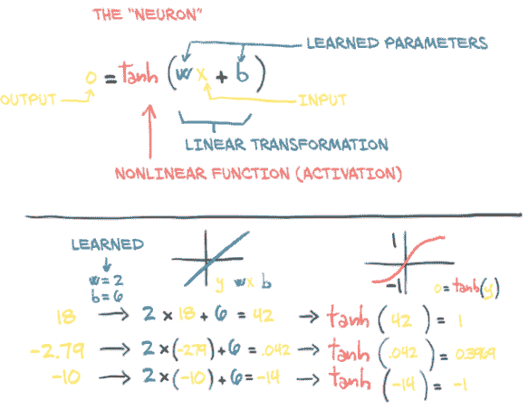

# 六、使用神经网络拟合数据

本章内容包括

+   与线性模型相比，非线性激活函数是关键区别

+   使用 PyTorch 的`nn`模块

+   使用神经网络解决线性拟合问题

到目前为止，我们已经仔细研究了线性模型如何学习以及如何在 PyTorch 中实现这一点。我们专注于一个非常简单的回归问题，使用了一个只有一个输入和一个输出的线性模型。这样一个简单的例子使我们能够剖析一个学习模型的机制，而不会过于分散注意力于模型本身的实现。正如我们在第五章概述图中看到的，图 5.2（这里重复为图 6.1），了解训练模型的高级过程并不需要模型的确切细节。通过将错误反向传播到参数，然后通过对损失的梯度更新这些参数，无论底层模型是什么，这个过程都是相同的。


图 6.1 我们在第五章中实现的学习过程的心理模型

在本章中，我们将对我们的模型架构进行一些更改：我们将实现一个完整的人工神经网络来解决我们的温度转换问题。我们将继续使用上一章的训练循环，以及我们将华氏度转换为摄氏度的样本分为训练集和验证集。我们可以开始使用一个二次模型：将`model`重写为其输入的二次函数（例如，`y = a * x**2 + b * x + c`）。由于这样的模型是可微的，PyTorch 会负责计算梯度，训练循环将像往常一样工作。然而，对我们来说这并不是太有趣，因为我们仍然会固定函数的形状。

这是我们开始将我们的基础工作和您在项目中每天使用的 PyTorch 功能连接在一起的章节。您将了解 PyTorch API 背后的工作原理，而不仅仅是黑魔法。然而，在我们进入新模型的实现之前，让我们先了解一下*人工神经网络*的含义。

## 6.1 人工神经元

深度学习的核心是神经网络：能够通过简单函数的组合表示复杂函数的数学实体。术语*神经网络*显然暗示了与我们大脑工作方式的联系。事实上，尽管最初的模型受到神经科学的启发，现代人工神经网络与大脑中神经元的机制几乎没有相似之处。人工和生理神经网络似乎使用了略有相似的数学策略来逼近复杂函数，因为这类策略非常有效。

*注意* 从现在开始，我们将放弃*人工*这个词，将这些构造称为*神经网络*。

这些复杂函数的基本构建块是*神经元*，如图 6.2 所示。在其核心，它只是输入的线性变换（例如，将输入乘以一个数字[权重]并加上一个常数[偏置]）后跟一个固定的非线性函数（称为*激活函数）。



图 6.2 人工神经元：包含在非线性函数中的线性变换

从数学上讲，我们可以将其写为*o* = *f*(*w* * *x* + *b*)，其中*x*是我们的输入，*w*是我们的权重或缩放因子，*b*是我们的偏置或偏移。*f*是我们的激活函数，这里设置为双曲正切函数，或者`tan`函数。一般来说，*x*和因此*o*可以是简单的标量，或者是矢量值（表示许多标量值）；类似地，*w*可以是单个标量或矩阵，而*b*是标量或矢量（然而，输入和权重的维度必须匹配）。在后一种情况下，前面的表达式被称为一个神经元*层*，因为它通过多维权重和偏置表示许多神经元。

### 6.1.1 组合多层网络

如图 6.3 所示，一个多层神经网络由我们刚刚讨论的函数组合而成

```py
x_1 = f(w_0 * x + b_0)
x_2 = f(w_1 * x_1 + b_1)
...
y = f(w_n * x_n + b_n)
```

神经元层的输出被用作下一层的输入。请记住，这里的`w_0`是一个矩阵，而`x`是一个向量！使用向量允许`w_0`保存整个*层*的神经元，而不仅仅是一个单独的权重。


图 6.3 一个具有三层的神经网络

### 6.1.2 理解误差函数

我们之前的线性模型和我们实际用于深度学习的模型之间的一个重要区别是误差函数的形状。我们的线性模型和误差平方损失函数具有凸误差曲线，具有一个明确定义的最小值。如果我们使用其他方法，我们可以自动和明确地解决最小化误差函数的参数。这意味着我们的参数更新试图*估计*那个明确的正确答案。

即使使用相同的误差平方损失函数，神经网络也不具有凸误差曲面的属性！对于我们试图逼近的每个参数，没有一个单一的正确答案。相反，我们试图让所有参数在*协同作用*下产生一个有用的输出。由于这个有用的输出只会*近似*真相，所以会有一定程度的不完美。不完美会在何处和如何显现在某种程度上是任意的，因此控制输出（因此也是不完美）的参数也是任意的。这导致神经网络训练在机械角度上看起来非常像参数估计，但我们必须记住理论基础是完全不同的。

神经网络具有非凸误差曲面的一个重要原因是激活函数。一组神经元能够逼近非常广泛的有用函数的能力取决于每个神经元固有的线性和非线性行为的组合。

### 6.1.3 我们只需要激活

正如我们所看到的，(深度)神经网络中最简单的单元是线性操作（缩放 + 偏移）后跟一个激活函数。我们在我们最新的模型中已经有了我们的线性操作--线性操作*就是*整个模型。激活函数发挥着两个重要的作用：

+   在模型的内部部分，它允许输出函数在不同值处具有不同的斜率--这是线性函数根据定义无法做到的。通过巧妙地组合这些具有不同斜率的部分来产生许多输出，神经网络可以逼近任意函数，正如我们将在第 6.1.6 节中看到的。

+   在网络的最后一层，它的作用是将前面的线性操作的输出集中到给定范围内。

让我们谈谈第二点的含义。假设我们正在为图像分配“好狗狗”分数。金毛猎犬和西班牙猎犬的图片应该有一个高分，而飞机和垃圾车的图片应该有一个低分。熊的图片也应该有一个较低的分数，尽管比垃圾车高。

问题在于，我们必须定义一个“高分”：我们有整个`float32`范围可供使用，这意味着我们可以得到相当高的分数。即使我们说“这是一个 10 分制”，仍然存在一个问题，即有时我们的模型会产生 11 分中的 11 分。请记住，在底层，这都是(`w*x+b`)矩阵乘法的总和，它们不会自然地限制自己在特定范围的输出。

#### 限制输出范围

我们希望牢固地约束我们线性操作的输出到特定范围，这样输出的消费者就不必处理小狗得分为 12/10，熊得分为-10，垃圾车得分为-1,000 的数值输入。

一种可能性是简单地限制输出数值：低于 0 的设为 0，高于 10 的设为 10。这是一个简单的激活函数称为`torch.nn.Hardtanh`（[`pytorch.org/docs/stable/nn.html#hardtanh`](https://pytorch.org/docs/stable/nn.html#hardtanh)，但请注意默认范围是-1 到+1）。

#### 压缩输出范围

另一组效果良好的函数是`torch.nn.Sigmoid`，其中包括`1 / (1 + e ** -x)`，`torch.tanh`，以及我们马上会看到的其他函数。这些函数的曲线在*x*趋于负无穷时渐近地接近 0 或-1，在*x*增加时接近 1，并且在*x* == *0*时具有大致恒定的斜率。从概念上讲，这种形状的函数效果很好，因为我们线性函数输出的中间区域是我们的神经元（再次强调，这只是一个线性函数后跟一个激活函数）会敏感的区域，而其他所有内容都被归类到边界值旁边。正如我们在图 6.4 中看到的，我们的垃圾车得分为-0.97，而熊、狐狸和狼的得分则在-0.3 到 0.3 的范围内。

这导致垃圾车被标记为“不是狗”，我们的好狗被映射为“明显是狗”，而我们的熊则处于中间位置。在代码中，我们可以看到确切的数值：

```py
>>> import math
>>> math.tanh(-2.2)    # ❶
-0.9757431300314515
>>> math.tanh(0.1)     # ❷
0.09966799462495582
>>> math.tanh(2.5)     # ❸
0.9866142981514303
```

❶ 垃圾车

❷ 熊

❸ 好狗狗

当熊处于敏感范围时，对熊进行微小的更改将导致结果明显变化。例如，我们可以从灰熊切换到北极熊（其面部略带更传统的犬类面孔），随着我们滑向图表“非常像狗”的一端，我们会看到*Y*轴上的跳跃。相反，考拉熊会被认为不太像狗，我们会看到激活输出下降。然而，我们几乎无法让垃圾车被认为像狗：即使进行 drastical 改变，我们可能只会看到从-0.97 到-0.8 左右的变化。


图 6.4 显示了狗、熊和垃圾车通过`tanh`激活函数映射为它们的狗样程度

### 6.1.4 更多激活函数

有许多激活函数，其中一些显示在图 6.5 中。在第一列中，我们看到平滑函数`Tanh`和`Softplus`，而第二列有激活函数的“硬”版本：`Hardtanh`和`ReLU`。`ReLU`（*修正线性单元*）值得特别注意，因为它目前被认为是表现最佳的通用激活函数之一；许多最新技术的结果都使用了它。`Sigmoid`激活函数，也称为*逻辑函数*，在早期深度学习工作中被广泛使用，但自那时以来已经不再常用，除非我们明确希望将其移动到 0...1 范围内：例如，当输出应该是概率时。最后，`LeakyReLU`函数修改了标准的`ReLU`，使其具有小的正斜率，而不是对负输入严格为零（通常这个斜率为 0.01，但这里显示为 0.1 以便清楚显示）。

### 6.1.5 选择最佳激活函数

激活函数很奇特，因为有许多被证明成功的种类（远远不止图 6.5 中显示的），很明显几乎没有严格的要求。因此，我们将讨论一些关于激活函数的一般性，这些一般性可能在具体情况下很容易被证伪。也就是说，根据定义，激活函数

+   是非线性的。重复应用(`w*x+b`)而没有激活函数会导致具有相同（仿射线性）形式的函数。非线性允许整个网络逼近更复杂的函数。

+   是可微的，因此可以通过它们计算梯度。像`Hardtanh`或`ReLU`中看到的点间断是可以接受的。

没有这些特征，网络要么退回成为线性模型，要么变得难以训练。

以下对这些函数是正确的：

+   它们至少有一个敏感范围，在这个范围内对输入进行非平凡的更改会导致相应的输出发生非平凡的变化。这对于训练是必要的。

+   许多激活函数具有不敏感（或饱和）范围，在这个范围内对输入进行更改几乎不会对输出产生任何或很少的变化。

举例来说，`Hardtanh`函数可以通过在输入上组合敏感范围与不同的权重和偏置来轻松地用于制作函数的分段线性逼近。


图 6.5 常见和不那么常见的激活函数集合

通常（但远非普遍如此），激活函数至少具有以下之一：

+   一个下界，当输入趋于负无穷时接近（或达到）

+   一个类似但相反的正无穷的上界

想想我们对反向传播如何工作的了解，我们可以得出结论，当输入处于响应范围时，错误将通过激活向后传播得更有效，而当输入饱和时，错误不会对神经元产生很大影响（因为梯度将接近于零，由于输出周围的平坦区域）。

将所有这些放在一起，这就产生了一个非常强大的机制：我们在说，当将不同的输入呈现给由线性 + 激活单元构建的网络时，（a）不同的单元将对相同的输入在不同的范围内做出响应，而（b）与这些输入相关的错误主要会影响在敏感范围内运行的神经元，使其他单元在学习过程中基本上不受影响。此外，由于激活函数相对于其输入的导数在敏感范围内通常接近于 1，通过梯度下降估计在该范围内运行的单元的线性变换的参数将看起来很像我们之前看到的线性拟合。

我们开始对如何将许多线性 + 激活单元并行连接并依次堆叠起来形成一个能够逼近复杂函数的数学对象有了更深入的直觉。不同的单元组合将对输入在不同的范围内做出响应，并且这些单元的参数相对容易通过梯度下降进行优化，因为学习过程将表现得很像线性函数直到输出饱和。

### 6.1.6 神经网络的学习意味着什么

通过堆叠线性变换和可微激活函数构建模型，可以得到能够近似高度非线性过程的模型，并且我们可以通过梯度下降方法出奇地好地估计其参数。即使处理具有数百万参数的模型时，这仍然成立。使用深度神经网络如此吸引人的原因在于，它使我们不必过多担心代表我们数据的确切函数--无论是二次的、分段多项式的，还是其他什么。通过深度神经网络模型，我们有一个通用的逼近器和一个估计其参数的方法。这个逼近器可以根据我们的需求进行定制，无论是模型容量还是模型复杂输入/输出关系的能力，只需组合简单的构建块。我们可以在图 6.6 中看到一些例子。


图 6.6 组合多个线性单元和`tanh`激活函数以产生非线性输出

四个左上角的图显示了四个神经元--A、B、C 和 D--每个都有自己（任意选择的）权重和偏置。每个神经元使用`Tanh`激活函数，最小值为-1，最大值为 1。不同的权重和偏置移动了中心点，并改变了从最小到最大的过渡有多么剧烈，但它们显然都有相同的一般形状。在这些右侧的列中，显示了两对神经元相加在一起（A + B，然后是 C + D）。在这里，我们开始看到一些模仿单层神经元的有趣特性。A + B 显示了一个轻微的*S*曲线，极端值接近 0，但中间有一个正峰和一个负峰。相反，C + D 只有一个大的正峰，峰值高于我们单个神经元的最大值 1。

在第三行，我们开始组合我们的神经元，就像它们在一个两层网络中的样子。C(A + B)和 D(A + B)都有与 A + B 相同的正负峰，但正峰更加微妙。C(A + B) + D(A + B)的组合显示了一个新的特性：*两个*明显的负峰，可能还有一个非常微妙的第二个正峰，位于主要感兴趣区域的左侧。所有这些只用了两层中的四个神经元！

再次强调，这些神经元的参数仅仅是为了得到一个视觉上有趣的结果而选择的。训练的过程是找到这些权重和偏置的可接受值，使得最终的网络能够正确执行任务，比如根据地理坐标和年份时间预测可能的温度。通过*成功执行任务*，我们指的是在由用于训练数据的相同数据生成过程产生的未见数据上获得正确的输出。一个成功训练的网络，通过其权重和偏置的值，将以有意义的数字表示形式捕捉数据的固有结构，这些数字表示对以前未见的数据能够正确工作。

让我们在了解学习机制方面再迈出一步：深度神经网络使我们能够近似高度非线性的现象，而无需为其建立明确的模型。相反，从一个通用的、未经训练的模型开始，我们通过提供一组输入和输出以及一个损失函数来专门针对一个任务进行特化，并通过反向传播来优化。通过示例将通用模型专门化到一个任务上，这就是我们所说的*学习*，因为该模型并不是为特定任务而构建的--没有规则描述该任务如何工作被编码在模型中。

对于我们的温度计示例，我们假设两个温度计都是线性测量温度的。这个假设是我们隐式编码任务规则的地方：我们硬编码了输入/输出函数的形状；我们无法逼近除了围绕一条直线的数据点之外的任何东西。随着问题的维度增加（即，许多输入到许多输出）和输入/输出关系变得复杂，假设输入/输出函数的形状不太可能奏效。物理学家或应用数学家的工作通常是从第一原理提出现象的功能性描述，这样我们就可以从测量中估计未知参数，并获得对世界的准确模型。另一方面，深度神经网络是一类函数族，具有近似各种输入/输出关系的能力，而不一定需要我们提出现象的解释模型。在某种程度上，我们放弃了解释，以换取解决日益复杂问题的可能性。另一方面，我们有时缺乏建立我们所面对的事物的显式模型的能力、信息或计算资源，因此数据驱动的方法是我们前进的唯一途径。

## 6.2 PyTorch nn 模块

所有这些关于神经网络的讨论可能让您对使用 PyTorch 从头开始构建一个神经网络感到非常好奇。我们的第一步将是用一个神经网络单元替换我们的线性模型。从正确性的角度来看，这将是一个有点无用的后退，因为我们已经验证了我们的校准只需要一个线性函数，但从足够简单的问题开始并随后扩展仍然是非常重要的。

PyTorch 有一个专门用于神经网络的子模块，称为`torch.nn`。它包含创建各种神经网络架构所需的构建模块。在 PyTorch 的术语中，这些构建模块称为*模块*（在其他框架中，这些构建模块通常被称为*层*）。PyTorch 模块是从`nn.Module`基类派生的 Python 类。一个模块可以有一个或多个`Parameter`实例作为属性，这些张量的值在训练过程中进行优化（想想我们线性模型中的`w`和`b`）。一个模块也可以有一个或多个子模块（`nn.Module`的子类）作为属性，并且它将能够跟踪它们的参数。

*注意* 子模块必须是顶级*属性*，而不是嵌套在`list`或`dict`实例中！否则，优化器将无法定位子模块（因此也无法定位它们的参数）。对于您的模型需要子模块列表或字典的情况，PyTorch 提供了`nn.ModuleList`和`nn.ModuleDict`。

毫不奇怪，我们可以找到一个名为`nn.Linear`的`nn.Module`子类，它对其输入应用一个仿射变换（通过参数属性`weight`和`bias`）并等同于我们在温度计实验中早期实现的内容。我们现在将从我们离开的地方精确开始，并将我们以前的代码转换为使用`nn`的形式。

### 6.2.1 使用 __call__ 而不是 forward

所有 PyTorch 提供的`nn.Module`的子类都定义了它们的`__call__`方法。这使我们能够实例化一个`nn.Linear`并将其调用为一个函数，就像这样（代码/p1ch6/1_neural_networks.ipynb）：

```py
# In[5]:
import torch.nn as nn

linear_model = nn.Linear(1, 1)    # ❶
linear_model(t_un_val)

# Out[5]:
tensor([[0.6018],
        [0.2877]], grad_fn=<AddmmBackward>)
```

❶ 我们马上会看构造函数参数。

使用一组参数调用`nn.Module`的实例最终会调用一个名为`forward`的方法，该方法使用相同的参数。`forward`方法执行前向计算，而`__call__`在调用`forward`之前和之后执行其他相当重要的任务。因此，从技术上讲，可以直接调用`forward`，它将产生与`__call__`相同的输出，但不应该从用户代码中这样做：

```py
y = model(x)             # ❶
y = model.forward(x)     # ❷
```

❶ 正确！

❷ 沉默的错误。不要这样做！

这是 `Module._call_` 的实现（我们省略了与 JIT 相关的部分，并对清晰起见进行了一些简化；torch/nn/modules/module.py，第 483 行，类：Module）：

```py
def __call__(self, *input, **kwargs):
    for hook in self._forward_pre_hooks.values():
        hook(self, input)

    result = self.forward(*input, **kwargs)

    for hook in self._forward_hooks.values():
        hook_result = hook(self, input, result)
        # ...

    for hook in self._backward_hooks.values():
        # ...

    return result
```

正如我们所看到的，如果我们直接使用 `.forward(...)`，将无法正确调用许多钩子。

### 6.2.2 返回线性模型

回到我们的线性模型。`nn.Linear` 的构造函数接受三个参数：输入特征的数量、输出特征的数量，以及线性模型是否包括偏置（默认为 `True`）：

```py
# In[5]:
import torch.nn as nn

linear_model = nn.Linear(1, 1)     # ❶
linear_model(t_un_val)

# Out[5]:
tensor([[0.6018],
        [0.2877]], grad_fn=<AddmmBackward>)
```

❶ 参数是输入大小、输出大小和默认为 True 的偏置。

在我们的情况中，特征的数量只是指模块的输入和输出张量的大小，因此为 1 和 1。例如，如果我们将温度和气压作为输入，那么输入中将有两个特征，输出中将有一个特征。正如我们将看到的，对于具有多个中间模块的更复杂模型，特征的数量将与模型的容量相关联。

我们有一个具有一个输入和一个输出特征的 `nn.Linear` 实例。这只需要一个权重和一个偏置：

```py
# In[6]:
linear_model.weight

# Out[6]:
Parameter containing:
tensor([[-0.0674]], requires_grad=True)

# In[7]:
linear_model.bias

# Out[7]:
Parameter containing:
tensor([0.7488], requires_grad=True)
```

我们可以使用一些输入调用该模块：

```py
# In[8]:
x = torch.ones(1)
linear_model(x)

# Out[8]:
tensor([0.6814], grad_fn=<AddBackward0>)
```

尽管 PyTorch 让我们可以这样做，但实际上我们并没有提供正确维度的输入。我们有一个接受一个输入并产生一个输出的模型，但 PyTorch 的 `nn.Module` 及其子类是设计用于同时处理多个样本的。为了容纳多个样本，模块期望输入的零维是*批次*中的样本数量。我们在第四章遇到过这个概念，当时我们学习如何将现实世界的数据排列成张量。

#### 批处理输入

`nn` 中的任何模块都是为了一次对*批量*中的多个输入产生输出而编写的。因此，假设我们需要在 10 个样本上运行 `nn.Linear`，我们可以创建一个大小为 *B* × *Nin* 的输入张量，其中 *B* 是批次的大小，*Nin* 是输入特征的数量，并将其一次通过模型运行。例如：

```py
# In[9]:
x = torch.ones(10, 1)
linear_model(x)

# Out[9]:
tensor([[0.6814],
        [0.6814],
        [0.6814],
        [0.6814],
        [0.6814],
        [0.6814],
        [0.6814],
        [0.6814],
        [0.6814],
        [0.6814]], grad_fn=<AddmmBackward>)
```

让我们深入研究一下这里发生的情况，图 6.7 显示了批处理图像数据的类似情况。我们的输入是 *B* × *C* × *H* × *W*，批处理大小为 3（比如，一只狗、一只鸟和一辆车的图像），三个通道维度（红色、绿色和蓝色），以及高度和宽度的未指定像素数量。正如我们所看到的，输出是大小为 *B* × *Nout* 的张量，其中 *Nout* 是输出特征的数量：在这种情况下是四个。

#### 优化批处理

我们希望进行批处理的原因是多方面的。一个重要的动机是确保我们请求的计算量足够大，以充分利用我们用来执行计算的计算资源。特别是 GPU 是高度并行化的，因此在小型模型上单个输入会使大多数计算单元处于空闲状态。通过提供输入的批处理，计算可以分布在否则空闲的单元上，这意味着批处理结果会像单个结果一样快速返回。另一个好处是一些高级模型使用整个批次的统计信息，这些统计信息随着批次大小的增加而变得更好。


图 6.7 三个 RGB 图像一起批处理并输入到神经网络中。输出是大小为 4 的三个向量的批处理结果。

回到我们的温度计数据，`t_u` 和 `t_c` 是大小为 `B` 的两个 1D 张量。借助广播，我们可以将我们的线性模型写成 `w * x + b`，其中 `w` 和 `b` 是两个标量参数。这是因为我们只有一个输入特征：如果有两个，我们需要添加一个额外维度，将该 1D 张量转换为一个矩阵，其中行中有样本，列中有特征。

这正是我们需要做的，以切换到使用 `nn.Linear`。我们将我们的 *B* 输入重塑为 *B* × *Nin*，其中 *Nin* 为 1。这可以很容易地通过 `unsqueeze` 完成：

```py
# In[2]:
t_c = [0.5,  14.0, 15.0, 28.0, 11.0,  8.0,  3.0, -4.0,  6.0, 13.0, 21.0]
t_u = [35.7, 55.9, 58.2, 81.9, 56.3, 48.9, 33.9, 21.8, 48.4, 60.4, 68.4]
t_c = torch.tensor(t_c).unsqueeze(1)                                     # ❶
t_u = torch.tensor(t_u).unsqueeze(1)                                     # ❶

t_u.shape

# Out[2]:
torch.Size([11, 1])
```

❶ 在轴 1 处添加额外维度

我们完成了；让我们更新我们的训练代码。首先，我们用`nn.Linear(1,1)`替换我们手工制作的模型，然后我们需要将线性模型的参数传递给优化器：

```py
# In[10]:
linear_model = nn.Linear(1, 1)    # ❶
optimizer = optim.SGD(
    linear_model.parameters(),    # ❷
    lr=1e-2)
```

❶ 这只是之前的重新定义。

❷ 这个方法调用替换了[params]。

之前，我们的责任是创建参数并将它们作为`optim.SGD`的第一个参数传递。现在我们可以使用`parameters`方法向任何`nn.Module`询问由它或其任何子模块拥有的参数列表：

```py
# In[11]:
linear_model.parameters()

# Out[11]:
<generator object Module.parameters at 0x7f94b4a8a750>

# In[12]:
list(linear_model.parameters())

# Out[12]:
[Parameter containing:
 tensor([[0.7398]], requires_grad=True), Parameter containing:
 tensor([0.7974], requires_grad=True)]
```

此调用递归地进入模块的`init`构造函数中定义的子模块，并返回遇到的所有参数的平面列表，这样我们就可以方便地将其传递给优化器构造函数，就像我们之前做的那样。

我们已经可以弄清楚训练循环中发生了什么。优化器提供了一个张量列表，这些张量被定义为`requires_grad = True`--所有的`Parameter`都是这样定义的，因为它们需要通过梯度下降进行优化。当调用`training_loss.backward()`时，`grad`会在图的叶节点上累积，这些叶节点恰好是传递给优化器的参数。

此时，SGD 优化器已经拥有了一切所需的东西。当调用`optimizer.step()`时，它将遍历每个`Parameter`，并按照其`grad`属性中存储的量进行更改。设计相当干净。

现在让我们看一下训练循环：

```py
# In[13]:
def training_loop(n_epochs, optimizer, model, loss_fn, t_u_train, t_u_val,
                  t_c_train, t_c_val):
    for epoch in range(1, n_epochs + 1):
        t_p_train = model(t_u_train)                  # ❶
        loss_train = loss_fn(t_p_train, t_c_train)

        t_p_val = model(t_u_val)                      # ❶
        loss_val = loss_fn(t_p_val, t_c_val)

        optimizer.zero_grad()
        loss_train.backward()                         # ❷
        optimizer.step()

        if epoch == 1 or epoch % 1000 == 0:
            print(f"Epoch {epoch}, Training loss {loss_train.item():.4f},"
                  f" Validation loss {loss_val.item():.4f}")
```

❶ 现在传入的是模型，而不是单独的参数。

❷ 损失函数也被传入。我们马上会用到它。

实际上几乎没有任何变化，只是现在我们不再显式地将`params`传递给`model`，因为模型本身在内部保存了它的`Parameters`。

还有最后一点，我们可以从`torch.nn`中利用的：损失。确实，`nn`带有几种常见的损失函数，其中包括`nn.MSELoss`（MSE 代表均方误差），这正是我们之前定义的`loss_fn`。`nn`中的损失函数仍然是`nn.Module`的子类，因此我们将创建一个实例并将其作为函数调用。在我们的情况下，我们摆脱了手写的`loss_fn`并替换它：

```py
# In[15]:
linear_model = nn.Linear(1, 1)
optimizer = optim.SGD(linear_model.parameters(), lr=1e-2)

training_loop(
    n_epochs = 3000,
    optimizer = optimizer,
    model = linear_model,
    loss_fn = nn.MSELoss(),    # ❶
    t_u_train = t_un_train,
    t_u_val = t_un_val,
    t_c_train = t_c_train,
    t_c_val = t_c_val)

print()
print(linear_model.weight)
print(linear_model.bias)

# Out[15]:
Epoch 1, Training loss 134.9599, Validation loss 183.1707
Epoch 1000, Training loss 4.8053, Validation loss 4.7307
Epoch 2000, Training loss 3.0285, Validation loss 3.0889
Epoch 3000, Training loss 2.8569, Validation loss 3.9105

Parameter containing:
tensor([[5.4319]], requires_grad=True)
Parameter containing:
tensor([-17.9693], requires_grad=True)
```

❶ 我们不再使用之前手写的损失函数。

所有输入到我们的训练循环中的其他内容保持不变。即使我们的结果仍然与以前相同。当然，得到相同的结果是预期的，因为任何差异都意味着两种实现中的一个存在错误。

## 6.3 最后是神经网络

这是一个漫长的旅程--这 20 多行代码中有很多可以探索的内容，我们需要定义和训练一个模型。希望到现在为止，训练中涉及的魔法已经消失，为机械留下了空间。到目前为止我们学到的东西将使我们能够拥有我们编写的代码，而不仅仅是在事情变得更加复杂时摸黑箱。

还有最后一步要走：用神经网络替换我们的线性模型作为我们的逼近函数。我们之前说过，使用神经网络不会导致更高质量的模型，因为我们校准问题的过程基本上是线性的。然而，在受控环境中从线性到神经网络的跃迁是有好处的，这样我们以后就不会感到迷失。

### 6.3.1 替换线性模型

我们将保持其他所有内容不变，包括损失函数，并且只重新定义`model`。让我们构建可能的最简单的神经网络：一个线性模块，后跟一个激活函数，进入另一个线性模块。第一个线性 + 激活层通常被称为*隐藏*层，出于历史原因，因为它的输出不是直接观察到的，而是馈送到输出层。虽然模型的输入和输出都是大小为 1（它们具有一个输入和一个输出特征），但第一个线性模块的输出大小通常大于 1。回顾我们之前对激活作用的解释，这可以导致不同的单元对输入的不同范围做出响应，从而增加我们模型的容量。最后一个线性层将获取激活的输出，并将它们线性组合以产生输出值。

没有标准的神经网络表示方法。图 6.8 显示了两种似乎有些典型的方式：左侧显示了我们的网络可能在基本介绍中如何描述，而右侧类似于更高级文献和研究论文中经常使用的风格。通常制作大致对应于 PyTorch 提供的神经网络模块的图块（尽管有时像`Tanh`激活层这样的东西并没有明确显示）。请注意，两者之间的一个略微微妙的区别是左侧的图中将输入和（中间）结果放在圆圈中作为主要元素。右侧，计算步骤更加突出。


图 6.8 我们最简单的神经网络的两个视图。左：初学者版本。右：高级版本。

`nn`通过`nn.Sequential`容器提供了一种简单的方法来连接模块：

```py
# In[16]:
seq_model = nn.Sequential(
            nn.Linear(1, 13),    # ❶
            nn.Tanh(),
            nn.Linear(13, 1))    # ❷
seq_model

# Out[16]:
Sequential(
  (0): Linear(in_features=1, out_features=13, bias=True)
  (1): Tanh()
  (2): Linear(in_features=13, out_features=1, bias=True)
)
```

❶ 我们随意选择了 13。我们希望这个数字与我们周围漂浮的其他张量形状大小不同。

❷ 这个 13 必须与第一个大小匹配。

最终结果是一个模型，它接受由`nn.Sequential`的第一个模块指定的输入，将中间输出传递给后续模块，并产生由最后一个模块返回的输出。该模型从 1 个输入特征扩展到 13 个隐藏特征，通过一个`tanh`激活，然后将产生的 13 个数字线性组合成 1 个输出特征。

### 6.3.2 检查参数

调用`model.parameters()`将收集第一个和第二个线性模块的`weight`和`bias`。在这种情况下通过打印它们的形状来检查参数是很有启发性的：

```py
# In[17]:
[param.shape for param in seq_model.parameters()]

# Out[17]:
[torch.Size([13, 1]), torch.Size([13]), torch.Size([1, 13]), torch.Size([1])]
```

这些是优化器将获得的张量。再次，在我们调用`model.backward()`之后，所有参数都将填充其`grad`，然后优化器在`optimizer.step()`调用期间相应地更新它们的值。和我们之前的线性模型没有太大不同，对吧？毕竟，它们都是可以使用梯度下降进行训练的可微分模型。

有关`nn.Modules`参数的一些注意事项。当检查由几个子模块组成的模型的参数时，能够通过名称识别参数是很方便的。有一个方法可以做到这一点，称为`named_parameters`：

```py
# In[18]:
for name, param in seq_model.named_parameters():
    print(name, param.shape)

# Out[18]:
0.weight torch.Size([13, 1])
0.bias torch.Size([13])
2.weight torch.Size([1, 13])
2.bias torch.Size([1])
```

`Sequential`中每个模块的名称只是模块在参数中出现的顺序。有趣的是，`Sequential`还接受一个`OrderedDict`，在其中我们可以为传递给`Sequential`的每个模块命名：

```py
# In[19]:
from collections import OrderedDict

seq_model = nn.Sequential(OrderedDict([
    ('hidden_linear', nn.Linear(1, 8)),
    ('hidden_activation', nn.Tanh()),
    ('output_linear', nn.Linear(8, 1))
]))

seq_model

# Out[19]:
Sequential(
  (hidden_linear): Linear(in_features=1, out_features=8, bias=True)
  (hidden_activation): Tanh()
  (output_linear): Linear(in_features=8, out_features=1, bias=True)
)
```

这使我们可以为子模块获得更具解释性的名称：

```py
# In[20]:
for name, param in seq_model.named_parameters():
    print(name, param.shape)

# Out[20]:
hidden_linear.weight torch.Size([8, 1])
hidden_linear.bias torch.Size([8])
output_linear.weight torch.Size([1, 8])
output_linear.bias torch.Size([1])
```

这更具描述性；但它并没有给我们更多控制数据流的灵活性，数据流仍然是纯粹的顺序传递--`nn.Sequential`的命名非常贴切。我们将在第八章中看到如何通过自己子类化`nn.Module`来完全控制输入数据的处理。

我们还可以通过使用子模块作为属性来访问特定的`Parameter`：

```py
# In[21]:
seq_model.output_linear.bias

# Out[21]:
Parameter containing:
tensor([-0.0173], requires_grad=True)
```

这对于检查参数或它们的梯度非常有用：例如，要监视训练过程中的梯度，就像我们在本章开头所做的那样。假设我们想要打印出隐藏层线性部分的`weight`的梯度。我们可以运行新神经网络模型的训练循环，然后在最后一个时期查看结果梯度：

```py
# In[22]:
optimizer = optim.SGD(seq_model.parameters(), lr=1e-3)    # ❶

training_loop(
    n_epochs = 5000,
    optimizer = optimizer,
    model = seq_model,
    loss_fn = nn.MSELoss(),
    t_u_train = t_un_train,
    t_u_val = t_un_val,
    t_c_train = t_c_train,
    t_c_val = t_c_val)

print('output', seq_model(t_un_val))
print('answer', t_c_val)
print('hidden', seq_model.hidden_linear.weight.grad)

# Out[22]:
Epoch 1, Training loss 182.9724, Validation loss 231.8708
Epoch 1000, Training loss 6.6642, Validation loss 3.7330
Epoch 2000, Training loss 5.1502, Validation loss 0.1406
Epoch 3000, Training loss 2.9653, Validation loss 1.0005
Epoch 4000, Training loss 2.2839, Validation loss 1.6580
Epoch 5000, Training loss 2.1141, Validation loss 2.0215
output tensor([[-1.9930],
        [20.8729]], grad_fn=<AddmmBackward>)
answer tensor([[-4.],
        [21.]])
hidden tensor([[ 0.0272],
        [ 0.0139],
        [ 0.1692],
        [ 0.1735],
        [-0.1697],
        [ 0.1455],
        [-0.0136],
        [-0.0554]])
```

❶ 我们稍微降低了学习率以提高稳定性。

### 6.3.3 与线性模型比较

我们还可以评估模型在所有数据上的表现，并查看它与一条直线的差异：

```py
# In[23]:
from matplotlib import pyplot as plt

t_range = torch.arange(20., 90.).unsqueeze(1)

fig = plt.figure(dpi=600)
plt.xlabel("Fahrenheit")
plt.ylabel("Celsius")
plt.plot(t_u.numpy(), t_c.numpy(), 'o')
plt.plot(t_range.numpy(), seq_model(0.1 * t_range).detach().numpy(), 'c-')
plt.plot(t_u.numpy(), seq_model(0.1 * t_u).detach().numpy(), 'kx')
```

结果显示在图 6.9 中。我们可以看到神经网络有过拟合的倾向，正如我们在第五章讨论的那样，因为它试图追踪测量值，包括嘈杂的值。即使我们微小的神经网络有太多参数来拟合我们所拥有的少量测量值。总的来说，它做得还不错。


图 6.9 我们的神经网络模型的绘图，包括输入数据（圆圈）和模型输出（X）。连续线显示样本之间的行为。

## 6.4 结论

尽管我们一直在处理一个非常简单的问题，但在第五章和第六章中我们已经涵盖了很多内容。我们分析了构建可微分模型并使用梯度下降进行训练，首先使用原始自动求导，然后依赖于`nn`。到目前为止，您应该对幕后发生的事情有信心。希望这一次 PyTorch 的体验让您对更多内容感到兴奋！

## 6.5 练习

1.  在我们简单的神经网络模型中尝试隐藏神经元的数量以及学习率。

    1.  什么改变会导致模型输出更线性？

    1.  你能明显地使模型过拟合数据吗？

1.  物理学中第三难的问题是找到一种合适的葡萄酒来庆祝发现。从第四章加载葡萄酒数据，并创建一个具有适当数量输入参数的新模型。

    1.  训练所需时间与我们一直在使用的温度数据相比需要多长时间？

    1.  你能解释哪些因素导致训练时间？

    1.  你能在这个数据集上训练时使损失减少吗？

    1.  你会如何绘制多个数据集的图表？

## 6.6 总结

+   神经网络可以自动适应专门解决手头问题。

+   神经网络允许轻松访问模型中任何参数相对于损失的解析导数，这使得演化参数非常高效。由于其自动微分引擎，PyTorch 轻松提供这些导数。

+   环绕线性变换的激活函数使神经网络能够逼近高度非线性函数，同时保持足够简单以进行优化。

+   `nn`模块与张量标准库一起提供了创建神经网络的所有构建模块。

+   要识别过拟合，保持训练数据点与验证集分开是至关重要的。没有一种对抗过拟合的固定方法，但增加数据量，或增加数据的变化性，并转向更简单的模型是一个良好的开始。

+   做数据科学的人应该一直在绘制数据。

* * *

¹ 参见 F. Rosenblatt，“感知器：大脑中信息存储和组织的概率模型”，*心理评论* 65(6)，386-408（1958 年），[`pubmed.ncbi.nlm.nih.gov/13602029/`](https://pubmed.ncbi.nlm.nih.gov/13602029/)。

² 为了直观地理解这种通用逼近性质，你可以从图 6.5 中选择一个函数，然后构建一个几乎在大部分区域为零且在*x* = 0 周围为正的基本函数，通过缩放（包括乘以负数）、平移激活函数的副本。通过这个基本函数的缩放、平移和扩展（沿*X*轴挤压）的副本，你可以逼近任何（连续）函数。在图 6.6 中，右侧中间行的函数可能是这样一个基本构件。Michael Nielsen 在他的在线书籍*神经网络与深度学习*中有一个交互式演示，网址为[`mng.bz/Mdon`](http://mng.bz/Mdon)。

³ 当然，即使这些说法并不总是*正确*；参见 Jakob Foerster 的文章，“深度线性网络中的非线性计算”，OpenAI，2019，[`mng.bz/gygE`](http://mng.bz/gygE)。

⁴ 并非所有版本的 Python 都指定了`dict`的迭代顺序，因此我们在这里使用`OrderedDict`来确保层的顺序，并强调层的顺序很重要。
